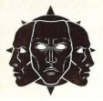
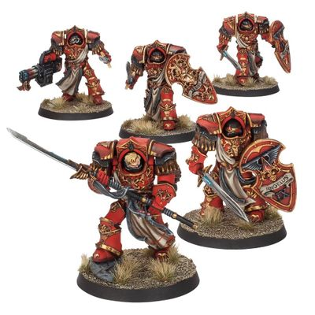

# 0417 猩红圣骑士 Crimson Paladin

精校状态：中文行文已逐段精校，部分术语仍为暂定

分类：通用概念 / 帝国 Imperium / 中央政务部 Adeptus Terra / 阿斯塔特修会 Adeptus Astartes

原文来源：https://www.bilibili.com/opus/1021090605939294210

原作者：帝国神选罐头

原文时间：2025年01月11日 15:13

[返回分类目录](目录.md) · [全书目录](../../目录.md)

<!-- A0417-B0001 -->
**英文原文**

The Crimson Paladins, also known as the Keruvim or the Storm Wind, were the Terminator elite of the Blood Angels during the Great Crusade and Horus Heresy.

<!-- /A0417-B0001 -->

<!-- A0417-B0002 -->

原译文

猩红圣骑士，也被称为革鲁宾或暴风，是大远征和荷鲁斯叛乱期间圣血天使的终结者精英。

**校订译文**

猩红圣骑士又称革鲁宾或暴风，是大远征与荷鲁斯之乱时期圣血天使军团的终结者精锐。

<!-- /A0417-B0002 -->

<!-- A0417-B0003 图片 -->

<!-- A0417-B0004 -->

原译文

Symbol of the Crimson Paladins 猩红圣骑士标志

**校订译文**

Symbol of the Crimson Paladins 猩红圣骑士标志

<!-- /A0417-B0004 -->

<!-- A0417-B0005 -->
## Overview 概述

<!-- /A0417-B0005 -->

<!-- A0417-B0006 -->
**英文原文**

Belonging to the First Innermost "Sphere" of the Blood Angels Legion alongside the likes of the Sanguinary Guard, they served as the guardians of their Primarch Sanguinius' sanctums. At Sanguinius' order, they also took to the field as instruments of his determination and the shield of his will. Like other warriors of the First Sphere, they have forsaken their name and identity and assume a role that forsakes all sense of their previous selves.

<!-- /A0417-B0006 -->

<!-- A0417-B0007 -->

原译文

他们与圣血卫队等一起属于圣血天使军团的第一个最内层的“界”，他们担任其原体圣吉列斯圣所的守护者。在圣吉列斯的命令下，他们也把战场作为他决心的工具和意志的盾牌。像第一界的其他战士一样，他们已经放弃了自己的名字和身份，并承担了一个抛弃了他们以前所有自我意识的角色。

**校订译文**

他们与圣血守卫等部队同属军团最内层的第一界，负责守卫原体圣吉列斯的圣所。奉原体之命，他们也会上阵作战，体现他的决心，捍卫他的意志。与第一界其他战士一样，他们舍弃原本的姓名和身份，以新的角色行事，将昔日的自我置于身后。

**校注：** took to the field 是投入战场，原译误为把战场作为工具。

<!-- /A0417-B0007 -->

<!-- A0417-B0008 图片 -->

<!-- A0417-B0009 -->

原译文

Crimson Paladin Squad 猩红圣骑士小队

**校订译文**

Crimson Paladin Squad 猩红圣骑士小队

<!-- /A0417-B0009 -->

<!-- A0417-B0010 -->
**英文原文**

The Crimson Paladins served as the grim counterpart to the Sanguinary Guard. When these warriors took the field, they acted as a bulwark against the foe and the shield for the sons of Sanguinius. They were superbly disciplined, acting as a single unbreakable bastion of blades and shields. By their sacrifice and indomitable resolve, the Blood Angels were able to vent their noble fury on the enemy. It is commonly said that no Paladin has ever taken a step backwards during combat.

<!-- /A0417-B0010 -->

<!-- A0417-B0011 -->

原译文

猩红圣骑士是圣血卫队的冷酷对应。当这些战士占领战场时，他们充当了抵御敌人的堡垒和圣吉列斯之子的盾牌。他们纪律严明，就像一个由刀刃和盾牌组成的牢不可破的堡垒。通过他们的牺牲和不屈不挠的决心，圣血天使能够向敌人发泄他们崇高的愤怒。人们常说，圣骑士在战斗中从未后退过一步。

**校订译文**

猩红圣骑士是圣血守卫冷峻的对应者。上阵时，他们充当抵御敌人的堡垒、保护圣吉列斯之子的盾牌。他们纪律严明，刀刃与盾牌融为一体，如同不可攻破的壁垒。凭借他们的牺牲与坚定意志，其他圣血天使得以尽情向敌人倾泻高贵的怒火。人们常说，从未有猩红圣骑士在战斗中后退一步。

<!-- /A0417-B0011 -->

<!-- A0417-B0012 -->
**英文原文**

Standard wargear of the Crimson Paladins included Cataphractii Pattern Terminator Armour, a Coriolis Pattern Power Shield, and a Power Weapon. Others were equipped with heavy weapons that included Iliastus Pattern Assault Cannons, Heavy Flamers, and Plasma Blasters.

<!-- /A0417-B0012 -->

<!-- A0417-B0013 -->

原译文

深红圣骑士的标准武器装备包括铁骑型终结者盔甲、科里奥利型动力盾和动力武器。其他人配备了重型武器，包括伊利亚斯图斯型突击炮、重型火焰枪和等离子爆破枪。

**校订译文**

猩红圣骑士的标准装备包括铁骑型终结者护甲、科里奥利型动力盾及动力武器。部分成员改用重武器，包括伊利亚斯图斯型突击炮、重型火焰喷射器和等离子爆破枪。

<!-- /A0417-B0013 -->

<!-- A0417-B0014 -->
## Known Members 著名成员

<!-- /A0417-B0014 -->

<!-- A0417-B0015 -->
**英文原文**

Barbiel - First among the Crimson Paladins.

<!-- /A0417-B0015 -->

<!-- A0417-B0016 -->

原译文

巴比尔 - 深红圣骑士中的第一位。

**校订译文**

巴比尔——猩红圣骑士之首。

**校注：** First among 指地位居首，不是按时间成为第一名成员。

<!-- /A0417-B0016 -->

<!-- A0417-B0017 -->
**英文原文**

Hamonah - Dreadnought

<!-- /A0417-B0017 -->

<!-- A0417-B0018 -->

原译文

哈摩那 - 无畏

**校订译文**

哈摩那——无畏机甲战士。

<!-- /A0417-B0018 -->

<!-- A0417-B0019 -->

原译文

Bel Sepatus 贝尔·塞帕图斯

**校订译文**

Bel Sepatus 贝尔·塞帕图斯

<!-- /A0417-B0019 -->

<!-- A0417-B0020 -->

原译文

Menthir 门西尔

**校订译文**

Menthir 门西尔

<!-- /A0417-B0020 -->

本篇核心术语与暂定项

以下列出本篇出现的英文原形及核心术语表用词。同形词可能指不同对象，具体词义以本篇正文和校注为准；单复数、别名和仅见于图注的名称可能尚未列入。完整候选见[术语表](../../术语表/双语术语候选.csv)。

| 英文 | 采用中文 | 状态 |
| --- | --- | --- |
| Blood Angels | 圣血天使 | 官方已核对 |
| Terminator | 终结者 | 官方已核对 |
| Horus Heresy | 荷鲁斯之乱 | 官方已核对 |
| Sanguinary | 圣血学派 | 暂定·学派语境 |
| Primarch | 原体 | 官方已核对 |
| Great Crusade | 大远征 | 暂定·官方待核 |
| Horus | 荷鲁斯 | 暂定·官方待核 |
| Sanguinary Guard | 圣血守卫 | 官方已核对 |
| Crimson Paladins | 深红圣骑士 | 暂定·官方待核 |
| Sons of Sanguinius | 圣吉列斯之子 | 暂定·官方待核 |
| Coriolis Pattern Power Shield | 科里奥利型动力盾 | 暂定·官方待核 |
| Flamers | 火妖（奸奇单位）／火焰喷射器（武器） | 语境定译·对应官译已核 |
| Dreadnought | 无畏机甲 | 暂定·官方待核 |
| Barbiel | 巴比尔 | 暂定·官方待核 |
| Hamonah | 哈摩那 | 暂定·官方待核 |
| Bulwark | 壁垒号 | 暂定·官方待核 |
| Sphere | 防御圈 | 暂定·官方待核 |
| The Blood | 鲜血 | 暂定·官方待核 |
| Power weapon | 动力武器 | 官方已核对 |
| Terminator Armour | 终结者盔甲 | 暂定·官方待核 |
| Cataphractii Pattern | 铁骑型 | 暂定·官方待核 |

