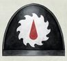
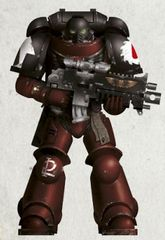
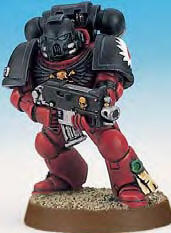
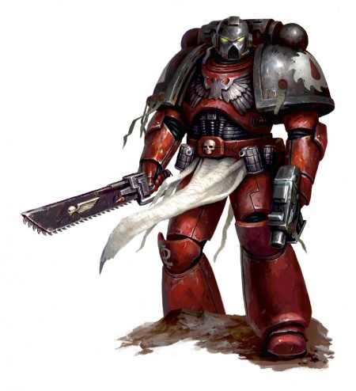
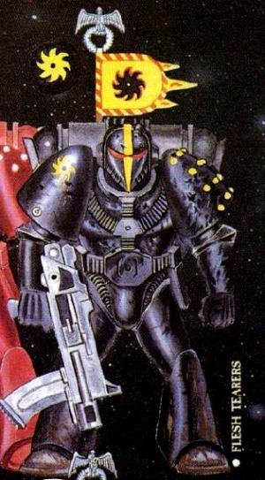
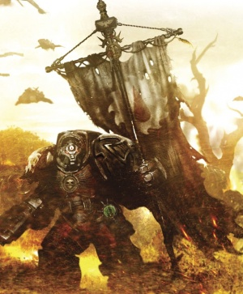
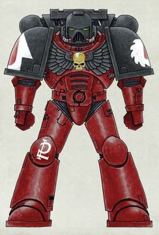

# 0418 撕肉者 Flesh Tearers

精校状态：中文行文已逐段精校，部分术语仍为暂定

分类：通用概念 / 帝国 Imperium / 中央政务部 Adeptus Terra / 阿斯塔特修会 Adeptus Astartes

原文来源：https://www.bilibili.com/opus/1119463778133475329

原作者：帝国神选罐头

原文时间：2025年10月03日 17:31

[返回分类目录](目录.md) · [全书目录](../../目录.md)

<!-- A0418-B0001 -->
**英文原文**

The Flesh Tearers are a Second Founding chapter, created when the Blood Angels legion split up after the Horus Heresy in accordance with the Codex Astartes. They suffer from a mutation in their gene-seed, making them far more prone to suffer the Black Rage than other chapters with Blood Angels gene-seed. If no cure is found the chapter is likely to be extinct within the next two millennia. The Flesh Tearers are also ill-famed for their savageness and thirst for blood in battle.

<!-- /A0418-B0001 -->

<!-- A0418-B0002 -->

原译文

撕肉者是二次建军战团，是在荷鲁斯叛乱之后，圣血天使军团根据《阿斯塔特圣典》分散时创建的。他们的基因种子发生了突变，这使得他们比其他有圣血天使基因种子的战团更容易遭受黑怒。如果没有找到治愈方法，该战团很可能在未来两千年内灭绝。撕肉者也因其野蛮和在战斗中嗜血而臭名昭著。

**校订译文**

撕肉者是二次建军战团，成立于荷鲁斯之乱后圣血天使军团依《阿斯塔特圣典》拆分之时。他们的基因种子存在变异，比其他圣血天使血脉的战团更容易陷入黑怒。按本章较早记载的估计，若找不到疗法，战团可能在此后两千年内消亡。撕肉者也因战斗中的凶残与嗜血而声名狼藉。

**校注：** 全章包含不同时期的兵力与缺陷评估，后文原铸补员改变了存续预期；此处明确保留较早判断，不作为所有时期结论。

<!-- /A0418-B0002 -->

<!-- A0418-B0003 图片 -->

<!-- A0418-B0004 图片 -->

<!-- A0418-B0005 -->
**英文原文**

Founding Chapter:Blood Angels

<!-- /A0418-B0005 -->

<!-- A0418-B0006 -->

原译文

建军战团：圣血天使

**校订译文**

母战团：圣血天使

<!-- /A0418-B0006 -->

<!-- A0418-B0007 -->
**英文原文**

Founding:Second Founding

<!-- /A0418-B0007 -->

<!-- A0418-B0008 -->

原译文

建军：二次建军

**校订译文**

建军：二次建军

<!-- /A0418-B0008 -->

<!-- A0418-B0009 -->
**英文原文**

Descendants:None

<!-- /A0418-B0009 -->

<!-- A0418-B0010 -->

原译文

子战团：无

**校订译文**

子战团：无

<!-- /A0418-B0010 -->

<!-- A0418-B0011 -->
**英文原文**

Chapter Master:Gabriel Seth

<!-- /A0418-B0011 -->

<!-- A0418-B0012 -->

原译文

战团长：加百列·赛斯

**校订译文**

战团长：加百列·赛斯

<!-- /A0418-B0012 -->

<!-- A0418-B0013 -->
**英文原文**

Homeworld:Cretacia

<!-- /A0418-B0013 -->

<!-- A0418-B0014 -->

原译文

家园世界：科瑞塔西亚

**校订译文**

家园世界：科瑞塔西亚

<!-- /A0418-B0014 -->

<!-- A0418-B0015 -->
**英文原文**

Colours:Red, with black helmet, backpack and pauldrons.

<!-- /A0418-B0015 -->

<!-- A0418-B0016 -->

原译文

颜色：红色，配黑色头盔，背包和肩甲

**校订译文**

颜色：红色，配黑色头盔，背包和肩甲

<!-- /A0418-B0016 -->

<!-- A0418-B0017 -->
**英文原文**

Specialty:Assault

<!-- /A0418-B0017 -->

<!-- A0418-B0018 -->

原译文

专业：突击

**校订译文**

专长：突击

<!-- /A0418-B0018 -->

<!-- A0418-B0019 -->
**英文原文**

Strength:~400 marines (post-Devastation of Baal)

<!-- /A0418-B0019 -->

<!-- A0418-B0020 -->

原译文

力量：~400战士（巴尔的毁灭后）

**校订译文**

兵力：约400名星际战士（巴尔之毁后）

<!-- /A0418-B0020 -->

<!-- A0418-B0021 -->
## History 历史

<!-- /A0418-B0021 -->

<!-- A0418-B0022 -->
**英文原文**

The Flesh Tearers Chapter was created in M31 when Roboute Guilliman decreed in his Codex Astartes that no longer should a single individual control the might of an entire Space Marine Legion. Thus, the Blood Angels were divided into several Successor Chapters; one of these being the Flesh Tearers under Chapter Master Nassir Amit. Amit and his followers were still reeling from the death of Sanguinius during the Siege of Terra, and they eventually gave into their resentment and anger.

<!-- /A0418-B0022 -->

<!-- A0418-B0023 -->

原译文

撕肉者战团是在M31创建的，当时罗伯特·基里曼在他的《阿斯塔特圣典》中颁布法令，不应再由一个人控制整个星际战士军团的力量。因此，圣血天使被分为几个子战团；其中之一是战团长纳西尔·阿密特手下的撕肉者。阿密特和他的追随者仍然对圣吉列斯在泰伦围城中的死亡感到震惊，他们最终屈服于怨恨和愤怒。

**校订译文**

第31个千年，罗保特·基里曼在《阿斯塔特圣典》中规定，不得再由一人掌握整支星际战士军团的力量。圣血天使因此拆分为多个战团，其中便包括纳西尔·阿米特统领的撕肉者。阿米特与追随者仍未从圣吉列斯在泰拉围城中牺牲的打击下恢复，最终屈从于心中的怨恨与怒火。

**校注：** Siege of Terra 为泰拉围城，原译泰伦围城错误。

<!-- /A0418-B0023 -->

<!-- A0418-B0024 图片 -->

<!-- A0418-B0025 -->
**英文原文**

The Chapter was given a single battle barge, the Victus, and were immediately sent into deep space with orders to destroy any world still loyal to Horus. At the immediate start of these first crusade in one of the earlier battles, due the tragic misunderstanding the Flesh Tearers fought against another Space Marines force. The Victus carried them on crusade for three millenia. During this time their reputation for blood-letting was brough to the attention of the High Lords of Terra, indicating that the extensive flaw in their gene-seed was already present at their creation. Instead of checking the rumours of entire populations wiped out, the High Lords simply looked at the long list of worlds pacified and dismissed the accompanying casualty lists as inconsequential.

<!-- /A0418-B0025 -->

<!-- A0418-B0026 -->

原译文

该战团获得了一艘战斗驳船征服号，并立即被派往深空，奉命摧毁任何仍忠于荷鲁斯的世界。在早期的一场战斗中，由于悲剧性的误解，撕肉者与另一支星际战士部队作战，第一次远征立即开始。征服号带领他们进行了三千年的十字军东征。在此期间，他们的流血声誉引起了泰拉高领主的注意，这表明他们的基因种子中存在广泛的缺陷。高领主们没有检查整个人口被消灭的谣言，而是简单地查看了一长串被安抚的世界，并认为附带的伤亡名单无关紧要。

**校订译文**

战团获配一艘战斗驳船“征服号”，随即被派往深空，奉命摧毁仍效忠荷鲁斯的世界。第一次远征刚开始不久，他们便在一场早期战斗中因悲剧性的误会，与另一支星际战士部队交战。此后三千年，征服号始终载着他们远征。其血腥声名传到泰拉高领主耳中，表明严重的基因种子缺陷从建军之初便已存在。然而，高领主并未追查整个世界人口被屠灭的传言，只看见归顺世界的长长名单，便将附带的伤亡数字视为无关紧要。

<!-- /A0418-B0026 -->

<!-- A0418-B0027 图片 -->

<!-- A0418-B0028 -->

原译文

Space Marine of the Flesh Tearers 撕肉者星际战士

**校订译文**

Space Marine of the Flesh Tearers 撕肉者星际战士

<!-- /A0418-B0028 -->

<!-- A0418-B0029 -->
**英文原文**

After three millenia as a crusading chapter, Nassir Amit eventually settled the Flesh Tearers on an extremely hostile Death World known as Cretacia. A lost colony of primordial humans proved perfect recruits for the chapter, being pure of taint and extremely strong. Amit became obsessed with Cretacia, believing it to be the manifestation of the Flesh Tearers' own nature, hoping that if he could tame its peaks he could temper the edges of his own fury.

<!-- /A0418-B0029 -->

<!-- A0418-B0030 -->

原译文

经过三千年的远征，纳西尔·阿密特最终将撕肉者安置在一个极其敌对的死亡世界，即科瑞塔西亚。一个失落的原始人类群体被证明是战团的完美新兵，他们没有污点，而且非常强大。阿密特迷上了科瑞塔西亚，认为这是撕肉者自身本性的表现，希望如果他能驯服它的顶峰，就能缓和自己愤怒的边缘。

**校订译文**

远征三千年后，纳西尔·阿米特终于为战团选定科瑞塔西亚这颗极端凶险的死亡世界。当地失落殖民地的原始人类没有受到污染，又异常强壮，成为理想的征兵来源。阿米特渐渐痴迷于这颗星球，视其为撕肉者本性的化身。他希望，若能征服这里的险峰，也许就能磨去自身怒火的锋芒。

**校注：** 阿米特在荷鲁斯叛乱时已任连长，与本段三千年后仍主导定居的记载存在年代疑问；本篇末尾原有来源冲突节，分别保留。

<!-- /A0418-B0030 -->

<!-- A0418-B0031 -->
**英文原文**

The chapter has since become more and more dependent on the easy access to recruits, as their gene-seed mutation gradually worsens. More and more marines succumb to the Black Rage, with few marines older than two centuries. As of late M41, the Flesh Tearers only have 4 full Companies of marines, less than half of the normal number. If the degradation of their gene-seed continues at the same rate they will count no more than 200 marines within a millennium. The Chapter has not used the process of Insanguination for millennia, and few know whether this has caused the wide presence of the Black Rage and Red Thirst among its members.

<!-- /A0418-B0031 -->

<!-- A0418-B0032 -->

原译文

随着他们的基因种子突变逐渐恶化，该战团越来越依赖于招募新兵的便利性。越来越多的战士屈服于黑怒，很少有战士的年龄超过两个世纪。截至M41末，撕肉者只有4个完整的战士连队，不到正常数量的一半。如果他们的基因种子继续以同样的速度退化，他们在一千年内将不会超过200名战士。该战团数千年来没有使用过染血仪式，很少有人知道这是否导致了其成员中广泛存在的黑怒和血渴。

**校订译文**

随着基因种子变异不断恶化，战团愈发依赖源源不断的新兵。越来越多的战士陷入黑怒，很少有人能活过两百岁。至第41个千年末，撕肉者仅剩四个满编连，尚不足常规战团的一半。按当时的退化速度推算，再过一千年，兵力将不足两百人。战团已数千年不再实行染血仪式，几乎无人能断定，这是否与黑怒和血渴的大范围发作有关。

<!-- /A0418-B0032 -->

<!-- A0418-B0033 -->
**英文原文**

Over the years several Imperial bodies have questioned the combat doctrines and sanity of the Flesh Tearers. Many have refused to fight alongside the chapter, disgusted by their savagery in combat or fearing they would get caught up in the bloodshed along with the enemy. The chapter has been under Inquisitorial investigation since the Kallern Massacres of M36.

<!-- /A0418-B0033 -->

<!-- A0418-B0034 -->

原译文

多年来，一些帝国机构质疑撕肉者的战斗理论和理智。许多人拒绝与该战团并肩作战，对他们在战斗中的野蛮行径感到厌恶，或者担心他们会与敌人一起陷入流血冲突。自M36的卡伦大屠杀以来，该战团一直在接受审判庭调查。

**校订译文**

多年来，多个帝国机构质疑撕肉者的作战准则与精神状况。许多部队拒绝与其协同，或是厌恶他们的凶残，或是担心自己也会与敌人一同遭到屠杀。第36个千年的卡伦大屠杀后，战团一直受到审判庭调查。

<!-- /A0418-B0034 -->

<!-- A0418-B0035 图片 -->

<!-- A0418-B0036 -->

原译文

Flesh Tearers, original colour scheme (W40K Rogue Trader) 撕肉者，原始配色方案（战锤40k 行商浪人）

**校订译文**

Flesh Tearers, original colour scheme (W40K Rogue Trader) 撕肉者，原始配色方案（战锤40k 行商浪人）

<!-- /A0418-B0036 -->

<!-- A0418-B0037 -->
**英文原文**

By the Age of the Dark Imperium the Flesh Tearers were greatly reduced, particularly after taking part in the Devastation of Baal. However despite the skepticism of Chapter Master Gabriel Seth, the Chapter has received an influx of new Primaris Space Marine recruits.

<!-- /A0418-B0037 -->

<!-- A0418-B0038 -->

原译文

到了黑暗帝国时代，撕肉者大大减少了，特别是在参与了巴尔的毁灭之后。然而，尽管战团长加百列·赛斯持怀疑态度，该战团还是迎来了大量新的原铸星际战士新兵。

**校订译文**

进入帝国暗面的时代后，撕肉者兵力锐减，巴尔之毁更使损失加剧。不过，尽管战团长加百列·赛斯心存疑虑，战团仍接收了大量原铸星际战士新兵。

<!-- /A0418-B0038 -->

<!-- A0418-B0039 -->
## Recent History 近期历史

<!-- /A0418-B0039 -->

<!-- A0418-B0040 -->

原译文

544-546.M32: The War of the Beast 野兽战争

**校订译文**

544-546.M32: The War of the Beast 野兽之战

<!-- /A0418-B0040 -->

<!-- A0418-B0041 -->

原译文

???.M36: The Zurcon Massacres. 祖康大屠杀

**校订译文**

???.M36: The Zurcon Massacres. 祖康大屠杀

<!-- /A0418-B0041 -->

<!-- A0418-B0042 -->

原译文

371.M41: Acata Uprising 阿克塔叛乱

**校订译文**

371.M41: Acata Uprising 阿克塔叛乱

<!-- /A0418-B0042 -->

<!-- A0418-B0043 -->
**英文原文**

799.M41: The Flesh Tearers, along with nine regiments of Imperial Guard and elements of the Astral Knights, assisted the Grey Knights in defeating the daemonic incursion of M'kar the Reborn on the world of Acralem. M'kar would eventually fall to a young Kaldor Draigo

<!-- /A0418-B0043 -->

<!-- A0418-B0044 -->

原译文

撕肉者，连同帝国卫队的九个兵团和星界骑士的成员，协助灰骑士击败了重生者姆'卡对阿克拉姆世界的恶魔入侵。姆'卡最终落入年轻的卡尔多·迪亚哥手中

**校订译文**

799.M41：撕肉者与九个帝国卫队团、星界骑士的部分兵力一同协助灰骑士，在阿克拉姆击退重生者姆’卡发起的恶魔入侵。姆’卡最终败于年轻的卡尔多·迪亚哥。

**校注：** 本段及后续纯中文时间线条目补回英文年份；Imperial Guard regiment 为帝国卫队团，非军团或兵团。

<!-- /A0418-B0044 -->

<!-- A0418-B0045 -->
**英文原文**

813.M41: Achilus Crusade — The Flesh Tearers appeared unheralded at Herisor, to buy time against Hive Fleet Dagon in the Orpheus Salient so the Imperial forces could prepare defences. Taking heavy losses they are now rearming in their strike cruiser stationed in Eleusis, although there are reports of several squads hunting a hidden enemy in the depths of shrine cities.

<!-- /A0418-B0045 -->

<!-- A0418-B0046 -->

原译文

阿基里斯远征 - 撕肉者在赫里绍尔出现，为的是争取时间，在俄耳甫斯突出部对抗虫巢舰队达贡，以便帝国军队做好防御准备。他们损失惨重，现在正在驻扎在厄琉息斯的打击巡洋舰上重新武装，尽管有报告称有几个小队在圣地城市深处追捕隐藏的敌人。

**校订译文**

813.M41：阿基里斯远征——撕肉者突然现身赫里绍尔，在俄耳甫斯突出部阻击达贡虫巢舰队，为帝国部队构筑防御争取时间。遭受重创后，他们在停驻厄琉息斯的打击巡洋舰上补充装备；不过，也有报告称数个小队正在圣地城市深处追猎隐藏的敌人。

<!-- /A0418-B0046 -->

<!-- A0418-B0047 -->
**英文原文**

820.M41: The chapter responds to an unfolding conflict in the Adeonis Sector and battle against a tide of Tzeentch Daemons. Ultimately sealing off the Warp Rift, the victory is not as simple as it first seems when the scheming Changeling is revealed to be laying at the heart of the conflict. Manipulating the strands of fate, the Changeling has plans afoot to not only strike a blow against Khorne, but to also tempt the Flesh Tearers towards damnation.

<!-- /A0418-B0047 -->

<!-- A0418-B0048 -->

原译文

战团回应了阿多尼斯星区正在展开的冲突，以及与奸奇恶魔的战斗。最终封锁了亚空间裂隙，胜利并不像最初看起来那么简单，当诡计多端的变化灵被揭露为冲突的核心时。通过操纵命运的线索，变化灵计划不仅要打击恐虐，还要诱使撕肉者走向诅咒。

**校订译文**

820.M41：战团驰援阿多尼斯星区，与汹涌的奸奇恶魔作战，最终封闭亚空间裂隙。但胜利并不像表面那么简单：冲突背后竟是诡变灵的阴谋。它拨弄命运之线，既想打击恐虐，也想将撕肉者引向堕落。

<!-- /A0418-B0048 -->

<!-- A0418-B0049 -->
**英文原文**

837.M41: The Flesh Tearers fought togheter with the Space Wolves and the Angels Vindicant on the shrine world of Lucid Prime, as part of the Eclipse Wars, with the goal of defeating Chaos Space Marine elements assaulting the Hive of Ratspire. Thanks to a ferocious Flesh Tearers counter-attack, the Imperial forces were able to drive off the enemy. But the Flesh Tearers continued on into the Hive, indiscriminately killing the citizens there. Gabriel Seth assured the Space Wolves and Angels Vindicant that they were only purging those possessed of Chaos taint, a claim which the Space Wolves were outraged by and consequently attack the Flesh Tearers. Leading to the battle known as Honour's End. Such was the animosity afterwards between the two chapters that the Flesh Tearers sent severed heads of Space Wolves ambassadors back to Fenris, and any Space Wolf that set foot on Cretacia was ordered to be executed on the spot. However thanks to the actions of Wolf Lord Ragnar Blackmane and Captain Vorain, the two Chapters were able to mend ties and fought together during the Thirteenth Black Crusade.

<!-- /A0418-B0049 -->

<!-- A0418-B0050 -->

原译文

作为日蚀战争的一部分，撕肉者与太空野狼和报复天使在清醒主星圣地世界并肩作战，目标是击败袭击鼠之尖塔巢都的混沌星际战士成员。由于凶猛的撕肉者反攻，帝国军队得以击退敌人。但撕肉者继续进入巢都，不分青红皂白地杀害那里的公民。加百列·赛斯向太空野狼和报复天使保证，他们只是在清除那些被混沌污染的人，太空野狼对此感到愤怒，并因此攻击了撕肉者。这场战斗被称为荣誉之终。这就是后来两个战团之间的敌意，以至于撕肉者将太空野狼使节的头颅砍回芬里斯，任何踏上的科瑞塔西亚的太空野狼都被命令当场处决。然而，多亏了狼主拉格纳·黑鬃和沃林连长的行动，这两个战团得以在第十三次黑色远征期间修复关系并并肩作战。

**校订译文**

837.M41：日蚀战争期间，撕肉者与太空野狼、报复天使在圣地世界清醒主星并肩作战，迎击进攻鼠尖塔巢都的混沌星际战士。撕肉者猛烈反击，帮助帝国部队赶走敌军，却随后冲进巢都，无差别屠杀居民。加百列·赛斯声称，他们只是在清除遭混沌污染的人。太空野狼对此震怒，转而攻击撕肉者，引发“荣誉之终”之战。事后，两团结下深仇：撕肉者将太空野狼使节的头颅送回芬里斯，还下令处决任何踏上科瑞塔西亚的野狼。后来，狼主拉格纳·黑鬃与沃林连长设法弥合双方关系，使两团得以在第十三次黑色远征中再度并肩作战。

<!-- /A0418-B0050 -->

<!-- A0418-B0051 -->
**英文原文**

910-911.M41: Siege of Hypnoth — The Flesh Tearers were among the Imperial forces that fought against the Necron Sautekh Dynasty. Despite fierce resistance, the world ultimately fell to the xenos invaders.

<!-- /A0418-B0051 -->

<!-- A0418-B0052 -->

原译文

海弗诺斯围城 — 撕肉者是与死灵索泰克王朝作战的帝国军队之一。尽管遭到了激烈的抵抗，但世界最终还是被外来侵略者征服了。

**校订译文**

910-911.M41：海弗诺斯围城——撕肉者随帝国部队迎击太空死灵索泰克王朝。尽管抵抗激烈，这个世界最终仍落入异形侵略者之手。

<!-- /A0418-B0052 -->

<!-- A0418-B0053 -->
**英文原文**

986.M41: A company of Flesh Tearers is wiped out in the Swordwind Strikes.

<!-- /A0418-B0053 -->

<!-- A0418-B0054 -->

原译文

一队撕肉者在剑风袭击中被消灭。

**校订译文**

986.M41：一个连的撕肉者在剑风袭击中全军覆没。

**校注：** company 为一个连，原译一队缩小了部队规模。

<!-- /A0418-B0054 -->

<!-- A0418-B0055 -->
**英文原文**

988.M41: The Flesh Tearers contribute to the Defense of Rynn's World. During the battle, some elements conducted a massacre of the local populace, though this was quickly covered up.

<!-- /A0418-B0055 -->

<!-- A0418-B0056 -->

原译文

撕肉者为保卫林恩世界做出了贡献。在战斗中，一些成员对当地民众进行了大屠杀，尽管这很快就被掩盖了。

**校订译文**

988.M41：撕肉者参加瑞恩世界保卫战。其部分战士在战斗期间屠杀当地居民，但此事很快遭到掩盖。

<!-- /A0418-B0056 -->

<!-- A0418-B0057 -->
**英文原文**

991.M41: The Flesh Tearers would take part in the Stromark Civil War alongside the Angels Encarmine and terrify the worlds of the Stromark System into submission.

<!-- /A0418-B0057 -->

<!-- A0418-B0058 -->

原译文

撕肉者与赤红天使一起参加斯特隆马克内战，并恐吓斯特隆马克星系的世界屈服。

**校订译文**

991.M41：撕肉者与赤红天使参与斯特隆马克内战，以恐怖手段迫使该星系的各个世界屈服。

<!-- /A0418-B0058 -->

<!-- A0418-B0059 -->
**英文原文**

998.M41: Third War for Armageddon — Five companies were deployed in the Fire Wastes alongside the Sisters of Battle of the Order of the Argent Shroud. Their combined force was fighting against Warlord Rukglum's artillery unit, deployed within the settlement of Gaius Point. Civilians in the area had formed a rabble militia to help the Imperial forces and to protect their homes. The Flesh Tearers deployed behind the Orks and pushed them onto the waiting guns of the militia and Sisters. After wiping out the main body of the Orks, the Flesh Tearers proceeded to mount the barricades and slaughter the militia in their insatiable bloodlust. The Sisters withdrew rather than having to fight their former ally. The leader of the Order of the Argent Shroud has since reported this incident to the Inquisition, demanding the destruction of this Chapter.

<!-- /A0418-B0059 -->

<!-- A0418-B0060 -->

原译文

第三次阿玛吉多顿战争 — 五个连队与银色寿衣修会的修女们一起部署在火焰废地。他们的联合部队正在与部署在盖尤斯点内的军阀鲁克勒姆的炮兵部队作战。该地区的平民组成了一支乌合之众民兵，以帮助帝国军队并保护他们的家园。撕肉者部署在欧克后面，把他们推到民兵和修女们等待的枪上。在消灭了欧克的主体后，撕肉者开始设置路障，并在他们永不满足的嗜血欲望中屠杀民兵。修女们撤退了，而不是不得不与他们的前盟友作战。此后，银色寿衣修会的领袖向审判庭报告了这一事件，要求摧毁这一战团。

**校订译文**

998.M41：第三次阿玛吉多顿战争——五个连与银色寿衣修会的战斗修女一同部署在火焰废地，进攻军阀鲁克勒姆设于盖尤斯点聚落的炮兵部队。当地居民组织民兵，支援帝国、保卫家园。撕肉者从欧克蛮人后方进攻，将其赶向早已等候的民兵与修女枪口。欧克蛮人主力覆灭后，撕肉者却因无法满足的嗜血欲望翻越路障，屠杀民兵。修女们选择撤退，避免与刚才的盟友交战。银色寿衣修会领袖随后向审判庭报告此事，要求彻底消灭撕肉者战团。

**校注：** mount the barricades 为翻上／越过既有路障，不是设置路障。五个连与前文四个满编连的兵力说法并存，按源文时间线保留。

<!-- /A0418-B0060 -->

<!-- A0418-B0061 -->
**英文原文**

998.M41: The Flesh Tearers aid the Blood Angels in the Cryptus Campaign.

<!-- /A0418-B0061 -->

<!-- A0418-B0062 -->

原译文

撕肉者在冥府战役中帮助了圣血天使。

**校订译文**

998.M41：撕肉者在冥府战役中支援圣血天使。

<!-- /A0418-B0062 -->

<!-- A0418-B0063 -->
**英文原文**

999.M41: A Flesh Tearers force under Captain Vorain takes part in the defense of Cadia during the Thirteenth Black Crusade, fighting alongside the Space Wolves under Ragnar Blackmane.

<!-- /A0418-B0063 -->

<!-- A0418-B0064 -->

原译文

在第十三次黑色远征期间，沃林连长率领的撕肉者部队参加了对卡迪亚的防御，与拉格纳·黑鬃率领的太空野狼并肩作战。

**校订译文**

999.M41：沃林连长率撕肉者参加第十三次黑色远征期间的卡迪亚防御，与拉格纳·黑鬃统领的太空野狼并肩作战。

<!-- /A0418-B0064 -->

<!-- A0418-B0065 -->
**英文原文**

999.M41: The Flesh Tearers are the first to heed Commander Dante's call for aid in defending Baal from simultaneous invasions by Hive Fleet Leviathan and a daemon army led by Ka'Bandha, dispatching their entire chapter without hesitation. The Flesh Tearers fought against the Tyranids alongside the Blood Angels in the subsequent Devastation of Baal. The battle further dwindled the Chapters numbers, reducing them from barely a third of a Codex Chapter to no more than a Company at best. An influx of new Primaris Space Marine recruits has seen them currently maintain at least 2/3rds Chapter strength.

<!-- /A0418-B0065 -->

<!-- A0418-B0066 -->

原译文

撕肉者中是第一个听从但丁指挥官的呼吁，帮助巴尔抵御虫巢舰队利维坦和卡班哈领导的恶魔军队的同时入侵的人，他们毫不犹豫地派遣了整个战团。在随后的巴尔的毁灭中，撕肉者与圣血天使一起与泰伦作战。这场战斗进一步减少了战团的人数，将他们从只有三分之一的圣典战团减少到最多不超过一个连队。随着新加入的原铸星际战士新兵的涌入，他们目前至少保持了2/3个战团的力量。

**校订译文**

999.M41：但丁召集援军，抵御利维坦虫巢舰队与卡’班哈恶魔大军同时进攻巴尔时，撕肉者最先响应，毫不迟疑地举团来援。他们在巴尔之毁中与圣血天使共同迎战泰伦，兵力从勉强达到圣典战团的三分之一，锐减至最多一个连。随后，大批原铸新兵补入，使他们恢复到至少常规战团三分之二的兵力。

**校注：** 本段补员后至少三分之二战团，与开头巴尔之毁后约400人并不一致；保留不同来源及叙述时点，不自行择一替换。

<!-- /A0418-B0066 -->

<!-- A0418-B0067 -->

原译文

???.M42: The Red Scar Campaign. 红疤战役

**校订译文**

???.M42: The Red Scar Campaign. 红疤战役

<!-- /A0418-B0067 -->

<!-- A0418-B0068 -->
**英文原文**

???.M42: The Angel's Halo Campaign against Hive Fleet Leviathan.

<!-- /A0418-B0068 -->

<!-- A0418-B0069 -->

原译文

对虫巢舰队利维坦的天使光环战役。

**校订译文**

???.M42：天使光环战役——对抗利维坦虫巢舰队。

<!-- /A0418-B0069 -->

<!-- A0418-B0070 -->
**英文原文**

???.M42: Following the Devastation of Baal, Gabriel Seth orders the Flesh Tearers 4th Company under Chaplain Dumah and Captain Tanthius return to Cretacia to reestablish the Chapter's rule there. Accompanied by other elements of the fleet including the Death Company, the Flesh Tearers arrive back at their homeworld to find it occupied by the Disciples of Rage Chaos Space Marine warband. In the ensuing Battle of Cretacia, their homeworld is reclaimed though heavily damaged.

<!-- /A0418-B0070 -->

<!-- A0418-B0071 -->

原译文

巴尔的毁灭后，加百列·赛斯命令杜玛牧师和坦修斯连长率领的撕肉者第四连队返回科瑞塔西亚，在那里重建战团的统治。在包括死亡连在内的舰队其他成员的陪同下，撕肉者回到了他们的家园世界，发现它被愤怒使徒混沌星际战士战帮占领了。在随后的科瑞塔西亚之战中，他们的家园世界被收复，但遭到严重破坏。

**校订译文**

???.M42：巴尔之毁后，加百列·赛斯命令杜玛教士与坦修斯连长率第四连返回科瑞塔西亚，恢复战团统治。其他舰队兵力——包括死亡连队——同行。返抵母星后，他们发现星球已被混沌星际战士战帮“愤怒使徒”占领。随后的科瑞塔西亚之战夺回了母星，却也使它受到严重破坏。

<!-- /A0418-B0071 -->

<!-- A0418-B0072 -->
**英文原文**

???.M42: The Corinth Belt Campaign and ensuing purges against heretical sects within Imperium Nihilus.

<!-- /A0418-B0072 -->

<!-- A0418-B0073 -->

原译文

科林斯带战役和随后在帝国暗面内对异端教派的净化。

**校订译文**

???.M42：科林斯带战役，以及随后在帝国暗面对异端教派的清剿。

<!-- /A0418-B0073 -->

<!-- A0418-B0074 -->
**英文原文**

???.M42: Battle on Duomos against Orks.

<!-- /A0418-B0074 -->

<!-- A0418-B0075 -->

原译文

在多莫斯与欧克的战斗。

**校订译文**

???.M42：在多莫斯对抗欧克蛮人。

<!-- /A0418-B0075 -->

<!-- A0418-B0076 -->
### Dates Unknown 日期未知

<!-- /A0418-B0076 -->

<!-- A0418-B0077 -->
**英文原文**

Aiding the Ordo Xenos Inquisitor Hyboran in crushing the Xorln Infestation.

<!-- /A0418-B0077 -->

<!-- A0418-B0078 -->

原译文

协助攘外修会审判官希伯莱粉碎佐林感染。

**校订译文**

协助异形审判庭审判官希伯莱，粉碎佐林感染。

**校注：** Ordo Xenos 按用户决定为异形审判庭；此处不补首次别名，避免全书重复。

<!-- /A0418-B0078 -->

<!-- A0418-B0079 -->
**英文原文**

Defeating the Bonescar Warband on Vetix IV.

<!-- /A0418-B0079 -->

<!-- A0418-B0080 -->

原译文

在维提斯克四号上击败骨疤战帮。

**校订译文**

在维提斯克四号上击败骨疤战帮。

<!-- /A0418-B0080 -->

<!-- A0418-B0081 -->
**英文原文**

The Flesh Tearers initially declined the tithe of initiates proposed by the Blood Angels on Baal during the recent conclave meeting of the Sanguinius bloodline, called by Chapter Master Dante to discuss the fate of the Founding Chapter. However, after assisting in the defeat of Fabius Bile's Bloodfiends the Flesh Tearers agreed to lend their support to the Blood Angels.

<!-- /A0418-B0081 -->

<!-- A0418-B0082 -->

原译文

在最近由战团长但丁召集的圣吉列斯血统秘会上，撕肉者最初拒绝了圣血天使在巴尔上提出的修士什一税，以讨论建军战团的命运。然而，在协助击败法比乌斯·拜尔的血魔后，撕肉者同意支持圣血天使。

**校订译文**

在但丁召集、讨论母战团未来的圣吉列斯血脉会议上，圣血天使曾要求各子战团以什一税形式捐出新入团战士。撕肉者起初拒绝了这一提议，但在协助击败法比乌斯·拜尔的血魔之后，最终同意支援圣血天使。

**校注：** initiates 此处泛指初入团战士，非黑色圣堂正式职衔 Initiate，不机械改为进阶者。

<!-- /A0418-B0082 -->

<!-- A0418-B0083 -->
## Chapter Disposition 战团布置

<!-- /A0418-B0083 -->

<!-- A0418-B0084 -->
**英文原文**

The Flesh Tearers were originally a standard Codex Chapter, but have over the millennia evolved into a pure assault force. Being obsessed with bloodshed often mean that they will close in on the enemy with utmost speed and engage in close combat. Flesh Tearers operations therefore have large numbers of assault marines and transport-mounted squads. The Flesh Tearers deviate from most other Blood Angels successor Chapters in that their Death Company is a standing force.

<!-- /A0418-B0084 -->

<!-- A0418-B0085 -->

原译文

撕肉者最初是一个标准的圣典战团，但经过数千年的发展，已经演变成一支纯粹的突击部队。痴迷于流血往往意味着他们会以最快的速度接近敌人，进行近战。因此，撕肉者行动拥有大量突击战士和运输乘车小队。撕肉者与大多数其他圣血天使子战团不同，因为他们的死亡连是一支常备军。

**校订译文**

撕肉者起初是标准的圣典战团，数千年后却演变成几乎专事突击的部队。强烈的杀戮欲驱使他们以最快速度贴近敌人，投入近战。因此，他们经常大量使用突击战士，以及搭乘运输载具的小队。与多数圣血天使后裔战团不同，撕肉者的死亡连队是常备部队。

<!-- /A0418-B0085 -->

<!-- A0418-B0086 图片 -->

<!-- A0418-B0087 -->

原译文

Flesh Tearers Terminator 撕肉者终结者

**校订译文**

Flesh Tearers Terminator 撕肉者终结者

<!-- /A0418-B0087 -->

<!-- A0418-B0088 -->
**英文原文**

The low number of marines has also led to an unexpected diversity in skills among the Flesh Tearers, with each marine being proficient in tactical, devastator, vehicular, and assault roles. The chapter has few vehicles apart from Rhinos and Razorbacks (a few Whirlwinds and one Baal Predator are also present). The exception to this are Death Company Dreadnoughts, which due to the Chapter's doctrine and genetic defects are fielded in large numbers. Above all else, however, Assault Squads are the dominant force of the Flesh Tearers and are fielded in above-average numbers.

<!-- /A0418-B0088 -->

<!-- A0418-B0089 -->

原译文

战士人数少也导致了撕肉者技能的意外多样性，每个战士都精通战术、毁灭者、载具和突击角色。除了犀牛和豪猪之外，该战团几乎没有载具（还有一些旋风和一个巴尔掠食者）。例外的是死亡连无畏，由于该战团的教义和遗传缺陷，它被大量部署。然而，最重要的是，突击小队是撕肉者的主导力量，其人数高于平均水平。

**校订译文**

兵力不足也意外促成了成员技能的多样化：每名战士都熟悉战术、破坏者、载具操作与突击职责。战团除犀牛战车、豪猪战车外，其他载具不多，只有少量旋风战车和一辆巴尔掠食者坦克。死亡连队无畏机甲是个例外：由于作战准则及基因缺陷，战团大量使用这类机甲。总体而言，突击小队仍是撕肉者的主力，其配置数量高于一般战团。

<!-- /A0418-B0089 -->

<!-- A0418-B0090 -->
**英文原文**

Flesh Tearers Company markings mirror those of the Blood Angels:

<!-- /A0418-B0090 -->

<!-- A0418-B0091 -->

原译文

撕肉者连队的标志镜像了圣血天使的标志：

**校订译文**

撕肉者沿用圣血天使的连队标记：

<!-- /A0418-B0091 -->

<!-- A0418-B0092 -->
**英文原文**

1st Company - White/Silver Skull

<!-- /A0418-B0092 -->

<!-- A0418-B0093 -->

原译文

第一连队 - 白/银色颅骨

**校订译文**

第一连队 - 白/银色颅骨

<!-- /A0418-B0093 -->

<!-- A0418-B0094 -->
**英文原文**

2nd Company - Yellow/Gold Blood Drop

<!-- /A0418-B0094 -->

<!-- A0418-B0095 -->

原译文

第二连队 - 黄/金色血滴

**校订译文**

第二连队 - 黄/金色血滴

<!-- /A0418-B0095 -->

<!-- A0418-B0096 -->
**英文原文**

3rd Company - White/Silver Blood Drop

<!-- /A0418-B0096 -->

<!-- A0418-B0097 -->

原译文

第三连队 - 白/银色血滴

**校订译文**

第三连队 - 白/银色血滴

<!-- /A0418-B0097 -->

<!-- A0418-B0098 -->
**英文原文**

4th Company - Green/Adamantite Blood Drop

<!-- /A0418-B0098 -->

<!-- A0418-B0099 -->

原译文

第四连队 - 绿/精金血滴

**校订译文**

第四连队 - 绿/精金血滴

<!-- /A0418-B0099 -->

<!-- A0418-B0100 -->
**英文原文**

If the Chapter regains strength, the Company markings will progress the same way. Squad Number designation is Low Gothic numerals on the right knee pad.

<!-- /A0418-B0100 -->

<!-- A0418-B0101 -->

原译文

如果该战团重新获得力量，连队标记将以同样的方式推进。小队编号是右膝甲上的低哥特语数字。

**校订译文**

若战团恢复兵力，后续连队也将按相同体系采用标记。小队编号以低哥特语数字标注在右膝甲上。

<!-- /A0418-B0101 -->

<!-- A0418-B0102 -->
**英文原文**

Because of the genetic flaw that has ravaged the Chapter, the Flesh Tearers maintain an unusually large number of Space Marines with Apothecary training.

<!-- /A0418-B0102 -->

<!-- A0418-B0103 -->

原译文

由于遗传缺陷已经破坏了该战团，撕肉者保留了异常多的受过药剂师训练的星际战士。

**校订译文**

基因缺陷给战团带来严重损耗，因此撕肉者中受过药剂师训练的星际战士比例异常高。

<!-- /A0418-B0103 -->

<!-- A0418-B0104 -->
## Gene-Seed 基因种子

<!-- /A0418-B0104 -->

<!-- A0418-B0105 -->
**英文原文**

The Flesh Tearers suffer an abnormal mutation in their Gene-Seed, which makes them more susceptible to the Red Thirst and Black Rage that plagues all the sons of Sanguinius. There were numerous incidents in their past where they lost control on the field of battle and turned on their own allies. It happened so often that under Gabriel Seth they now only work alone as they don't trust themselves around others. Furthermore, the Chapter struggled to maintain its numbers due to losses to the flaws and was expected to go extinct.

<!-- /A0418-B0105 -->

<!-- A0418-B0106 -->

原译文

撕肉者的基因种子发生了异常突变，这使他们更容易受到困扰圣吉列斯所有子嗣的血渴和黑怒的影响。他们过去曾多次在战场上失去控制，转而攻击自己的盟友。这种情况经常发生，在加百列·赛斯的领导下，他们现在只会独自工作，因为他们不信任别人。此外，由于缺陷造成的损失，该战团难以维持其数量，预计将灭绝。

**校订译文**

撕肉者基因种子的异常变异，使他们比其他圣吉列斯后裔更易陷入血渴与黑怒。他们过去多次在战场上失控，转而袭击盟友。此类事件过于频繁，因此加百列·赛斯统领下的战团如今尽量独立行动：他们不敢相信自己能在盟军身边保持控制。与此同时，缺陷造成的持续损失也使战团难以维持人数，一度被预计将走向灭亡。

**校注：** don’t trust themselves around others 指不相信自己能克制、避免伤害盟友，原译不信任别人颠倒了意思。

<!-- /A0418-B0106 -->

<!-- A0418-B0107 -->
**英文原文**

The introduction of Primaris Marines to the Flesh Tearers greatly stabilized their gene-seed. The Red Thirst and Black Rage are still present, though they are far less problematic — so much so that Gabriel Seth questioned whether their new Primaris recruits deserved to be call Flesh Tearers. The Red Thirst and Black Rage define their identity and culture and now that the flaws have been brought under control, their Chapter will never be the same.

<!-- /A0418-B0107 -->

<!-- A0418-B0108 -->

原译文

将原铸星际战士引入撕肉者极大地稳定了他们的基因种子。血渴和黑怒仍然存在，尽管它们的问题要小得多，以至于加百列·赛斯质疑他们的新原铸新兵是否应该被称为撕肉者。血渴和黑怒定义了他们的身份和文化，现在这些缺陷已经得到了控制，他们的战团将永远不会一样。

**校订译文**

原铸战士的加入大大稳定了撕肉者的基因种子。血渴和黑怒依然存在，但危害显著减轻，甚至令加百列·赛斯质疑，这些新兵是否配得上撕肉者之名。两种缺陷一直定义着战团的身份与文化；如今它们得到控制，战团也必将发生深刻变化。

<!-- /A0418-B0108 -->

<!-- A0418-B0109 -->
## Chapter Culture 战团文化

<!-- /A0418-B0109 -->

<!-- A0418-B0110 -->
**英文原文**

Faced with their genetic flaw, the Flesh Tearers culture is one of grim fatalism and acceptance that they are eventually doomed to succumb to the Black Rage. Some among the leadership have begun to embrace the notion that if they cannot continue then their best approach is to make certain that they leave a bold legacy in keeping with the Chapter’s proud traditions. They seek to gain notable victories and secure the Galaxy in the name of the Emperor and Sanguinius. The Chapter has come to embrace the savagery of which they have gained infamy. This has led them to have strained relations with the Blood Angels and their other successor Chapters. Many Blood Angels successors fear the Flesh Tearers are what they are all doomed to become. Their savage behavior has also brought them into constant conflict with the Inquisition.

<!-- /A0418-B0110 -->

<!-- A0418-B0111 -->

原译文

面对他们的基因缺陷，撕肉者文化是一种残酷的宿命论和接受他们最终注定要屈服于黑怒的文化。一些领导层已经开始接受这样一种观点，即如果他们不能继续下去，那么他们最好的办法就是确保他们留下大胆的遗产，以保持战团引以为豪的传统。他们试图以帝皇和圣吉列斯的名义获得显著的胜利，并确保银河系的安全。该战团已经接受了他们臭名昭著的野蛮行径。这导致他们与圣血天使和其他子战团的关系紧张。许多圣血天使的子战团担心，他们注定要成为撕肉者。他们的野蛮行为也使他们与审判庭不断发生冲突。

**校订译文**

面对基因缺陷，撕肉者形成了冷峻的宿命观，接受自己最终可能被黑怒吞噬的结局。部分领袖认为，若战团注定无法延续，就应留下足以彰显骄傲传统的赫赫战功。他们以帝皇与圣吉列斯之名追求胜利，力保银河安宁。战团也逐渐接纳了令其声名狼藉的凶暴本性，使自己与圣血天使及其他子战团关系紧张。许多后裔战团害怕，撕肉者正是自己注定会变成的模样。他们的暴行也不断引发与审判庭的冲突。

<!-- /A0418-B0111 -->

<!-- A0418-B0112 -->
**英文原文**

In an attempt to control their bloodlust, Flesh Tearers will regularly consume blood between battle. On their homeworld of Cretacia, large farm-like facilities are maintained where baseline Humans are drained of their blood in order to give the Chapter a fresh supply.

<!-- /A0418-B0112 -->

<!-- A0418-B0113 -->

原译文

为了控制他们的嗜血欲望，撕肉者会在战斗之间定期消耗血液。在他们的家乡科瑞塔西亚，维持着大型农场式的设施，在那里，人类的血液被排干，以便为战团提供新鲜的血液。

**校订译文**

为控制嗜血欲，撕肉者会在战斗间歇定期饮血。母星科瑞塔西亚设有大型农场般的设施，从普通人类体内抽取血液，为战团提供新鲜血源。

<!-- /A0418-B0113 -->

<!-- A0418-B0114 -->
**英文原文**

Chapter Master Gabriel Seth has been a noted critic of the new Primaris Space Marines due to their implication that may spell the end of the Firstborn and the Chapter's identity. However many Flesh Tearers are nonetheless impressed with those Primaris that have fought under their livery.

<!-- /A0418-B0114 -->

<!-- A0418-B0115 -->

原译文

战团长加百列·赛斯一直是新的原铸星际战士的著名评论者，因为他们的暗示可能意味着长子和战团身份的终结。然而，许多撕肉者仍然对那些在他们的制服下战斗的原铸印象深刻。

**校订译文**

加百列·赛斯是原铸星际战士的公开批评者之一，因为他们的出现可能意味着长子战士与战团原有身份的终结。不过，许多撕肉者仍对身披本团战袍、共同作战的原铸同袍印象深刻。

**校注：** critic 指批评者，不是中立评论者；under their livery 指身着本战团战袍服役。

<!-- /A0418-B0115 -->

<!-- A0418-B0116 图片 -->

<!-- A0418-B0117 -->

原译文

Flesh Tearers Firstborn 撕肉者长子

**校订译文**

Flesh Tearers Firstborn 撕肉者长子

<!-- /A0418-B0117 -->

<!-- A0418-B0118 -->
## Chapter Elements 战团元素

<!-- /A0418-B0118 -->

<!-- A0418-B0119 -->
### Armoury 军械库

<!-- /A0418-B0119 -->

<!-- A0418-B0120 -->
**英文原文**

Blood Mantle - Cloak - Worn by the Chapter Master.

<!-- /A0418-B0120 -->

<!-- A0418-B0121 -->

原译文

鲜血斗篷 - 披风 - 战团长穿戴

**校订译文**

鲜血斗篷 - 披风 - 战团长穿戴

<!-- /A0418-B0121 -->

<!-- A0418-B0122 -->
**英文原文**

Blood Reaver - Chain Weapon - Wielded by Gabriel Seth.

<!-- /A0418-B0122 -->

<!-- A0418-B0123 -->

原译文

鲜血收割者 - 链锯武器 - 加百列·赛斯挥舞

**校订译文**

鲜血收割者 - 链锯武器 - 加百列·赛斯挥舞

<!-- /A0418-B0123 -->

<!-- A0418-B0124 -->
**英文原文**

Bones of Baelsor - Dreadnought armour - Last worn by Skoraen.

<!-- /A0418-B0124 -->

<!-- A0418-B0125 -->

原译文

贝尔索尔之骨 - 无畏机甲 - 最后一次穿的是斯考伦。

**校订译文**

贝尔索尔之骨——无畏机甲护甲，最近的使用者是斯考伦。

<!-- /A0418-B0125 -->

<!-- A0418-B0126 -->
**英文原文**

Crimson Plate - Terminator Armour - Said to have been worn by Amit.

<!-- /A0418-B0126 -->

<!-- A0418-B0127 -->

原译文

深红板甲 - 终结者盔甲 -据说是阿密特穿的。

**校订译文**

深红板甲——终结者护甲，据说曾由阿米特穿戴。

<!-- /A0418-B0127 -->

<!-- A0418-B0128 -->
**英文原文**

Halo of Thorns - Iron Halo - Worn by the Chapter Master.

<!-- /A0418-B0128 -->

<!-- A0418-B0129 -->

原译文

荆棘光环 - 铁光环 - 战团长佩戴。

**校订译文**

荆棘光环 - 铁光环 - 战团长佩戴。

<!-- /A0418-B0129 -->

<!-- A0418-B0130 -->
**英文原文**

Severer of Threads - Chainsword

<!-- /A0418-B0130 -->

<!-- A0418-B0131 -->

原译文

断线者 - 链锯剑

**校订译文**

断线者 - 链锯剑

<!-- /A0418-B0131 -->

<!-- A0418-B0132 -->
**英文原文**

Shield of Cretacia - Power Armour

<!-- /A0418-B0132 -->

<!-- A0418-B0133 -->

原译文

科瑞塔西亚之盾 - 动力盔甲

**校订译文**

科瑞塔西亚之盾 - 动力盔甲

<!-- /A0418-B0133 -->

<!-- A0418-B0134 -->
**英文原文**

Slayer's Wrath - Boltgun

<!-- /A0418-B0134 -->

<!-- A0418-B0135 -->

原译文

屠杀者之怒 - 爆矢枪

**校订译文**

屠杀者之怒 - 爆矢枪

<!-- /A0418-B0135 -->

<!-- A0418-B0136 -->
**英文原文**

Sorrow's Genesis - Narthecium

<!-- /A0418-B0136 -->

<!-- A0418-B0137 -->

原译文

悲伤起源 - 医疗套件

**校订译文**

悲伤起源 - 医疗套件

<!-- /A0418-B0137 -->

<!-- A0418-B0138 -->
### Fleet 舰队

<!-- /A0418-B0138 -->

<!-- A0418-B0139 -->
**英文原文**

The Flesh Tearers' fleet is small, with only one Battle Barge, the Victus currently in service. The Victus is an ancient vessel, having been in service possibly since the Great Crusade. However, they also have seven modified Strike Cruisers with an extended transport capability.

<!-- /A0418-B0139 -->

<!-- A0418-B0140 -->

原译文

撕肉者的舰队很小，目前只有一艘战斗驳船，即征服号。征服号是一艘古老的舰船，可能自大远征以来一直在服役。然而，他们还拥有七艘经过改装的打击巡洋舰，具有扩展的运输能力。

**校订译文**

撕肉者舰队规模较小，现役战斗驳船只有征服号。它十分古老，可能从大远征时期起便一直服役。此外，战团还拥有七艘经过改装、增强了运输能力的打击巡洋舰。

<!-- /A0418-B0140 -->

<!-- A0418-B0141 -->
### Known Vessels 著名战舰

<!-- /A0418-B0141 -->

<!-- A0418-B0142 -->
**英文原文**

Victus — Battle Barge

<!-- /A0418-B0142 -->

<!-- A0418-B0143 -->

原译文

征服 — 战斗驳船

**校订译文**

征服号——战斗驳船

<!-- /A0418-B0143 -->

<!-- A0418-B0144 -->
**英文原文**

Bleeding Fist — Strike Cruiser, destroyed in an engagement with heretic vessels in the Zurcon System.

<!-- /A0418-B0144 -->

<!-- A0418-B0145 -->

原译文

流血之拳 — 打击巡洋舰，在与祖康星系异端船只交战时被摧毁。

**校订译文**

流血之拳号——打击巡洋舰，在与祖康星系异端船只交战时被摧毁。

<!-- /A0418-B0145 -->

<!-- A0418-B0146 -->
**英文原文**

Cretacian Justice — Strike Cruiser

<!-- /A0418-B0146 -->

<!-- A0418-B0147 -->

原译文

科瑞塔西亚的正义 — 打击巡洋舰

**校订译文**

科瑞塔西亚的正义号——打击巡洋舰

<!-- /A0418-B0147 -->

<!-- A0418-B0148 -->
**英文原文**

Death's Cowl — Strike Cruiser. Home to most of the Chapter's Death Company.

<!-- /A0418-B0148 -->

<!-- A0418-B0149 -->

原译文

死亡之罩 — 打击巡洋舰。该战团大部分死亡连的所在地。

**校订译文**

死亡之罩号——打击巡洋舰。该战团大部分死亡连队的所在地。

<!-- /A0418-B0149 -->

<!-- A0418-B0150 -->
**英文原文**

Jagged Blade — Strike Cruiser.

<!-- /A0418-B0150 -->

<!-- A0418-B0151 -->

原译文

锯齿之刃 — 打击巡洋舰。

**校订译文**

锯齿之刃号——打击巡洋舰。

<!-- /A0418-B0151 -->

<!-- A0418-B0152 -->
**英文原文**

Mortis Wrath — Strike Cruiser.

<!-- /A0418-B0152 -->

<!-- A0418-B0153 -->

原译文

死亡之怒 — 打击巡洋舰

**校订译文**

死亡之怒号——打击巡洋舰

<!-- /A0418-B0153 -->

<!-- A0418-B0154 -->
**英文原文**

Shield of Baal — Strike Cruiser.

<!-- /A0418-B0154 -->

<!-- A0418-B0155 -->

原译文

巴尔之盾 — 打击巡洋舰

**校订译文**

巴尔之盾号——打击巡洋舰

<!-- /A0418-B0155 -->

<!-- A0418-B0156 -->
**英文原文**

Butcher — Gladius Frigate, destroyed in an engagement with heretic vessels in the Zurcon System.

<!-- /A0418-B0156 -->

<!-- A0418-B0157 -->

原译文

屠夫 — 短剑护卫舰，在与祖康星系异端船只交战时被摧毁。

**校订译文**

屠夫号——短剑护卫舰，在与祖康星系异端船只交战时被摧毁。

<!-- /A0418-B0157 -->

<!-- A0418-B0158 -->
**英文原文**

Merciless — Gladius Frigate, destroyed in an engagement with heretic vessels in the Zurcon System.

<!-- /A0418-B0158 -->

<!-- A0418-B0159 -->

原译文

无情 — 短剑护卫舰，在与祖康星系异端船只交战时被摧毁。

**校订译文**

无情号——短剑护卫舰，在与祖康星系异端船只交战时被摧毁。

<!-- /A0418-B0159 -->

<!-- A0418-B0160 -->
**英文原文**

Redeemer — Gladius Frigate, destroyed in an engagement with heretic vessels in the Zurcon System.

<!-- /A0418-B0160 -->

<!-- A0418-B0161 -->

原译文

救世主 — 短剑护卫舰，在与祖康星系异端船只交战时被摧毁。

**校订译文**

救世主号——短剑护卫舰，在与祖康星系异端船只交战时被摧毁。

<!-- /A0418-B0161 -->

<!-- A0418-B0162 -->
### Vehicles 载具

<!-- /A0418-B0162 -->

<!-- A0418-B0163 -->
### Known Aircraft 著名飞行器

<!-- /A0418-B0163 -->

<!-- A0418-B0164 -->
**英文原文**

Baal's Fury — Thunderhawk.

<!-- /A0418-B0164 -->

<!-- A0418-B0165 -->

原译文

巴尔之怒 — 雷鹰

**校订译文**

巴尔之怒号——雷鹰

<!-- /A0418-B0165 -->

<!-- A0418-B0166 -->
**英文原文**

Barbed Angel — Storm Eagle, destroyed.

<!-- /A0418-B0166 -->

<!-- A0418-B0167 -->

原译文

带刺天使 — 风暴鹰，被摧毁。

**校订译文**

带刺天使号——风暴鹰炮艇，被摧毁。

<!-- /A0418-B0167 -->

<!-- A0418-B0168 -->
**英文原文**

Blood Drinker — Storm Eagle, destroyed.

<!-- /A0418-B0168 -->

<!-- A0418-B0169 -->

原译文

饮血者 — 风暴鹰，被摧毁。

**校订译文**

饮血者号——风暴鹰炮艇，被摧毁。

<!-- /A0418-B0169 -->

<!-- A0418-B0170 -->
**英文原文**

Mortis Wrath — Storm Eagle.

<!-- /A0418-B0170 -->

<!-- A0418-B0171 -->

原译文

死亡之怒 — 风暴鹰

**校订译文**

死亡之怒号——风暴鹰炮艇

<!-- /A0418-B0171 -->

<!-- A0418-B0172 -->
**英文原文**

Razor's Edge — Stormraven.

<!-- /A0418-B0172 -->

<!-- A0418-B0173 -->

原译文

剃刀边缘 — 风暴鸦

**校订译文**

剃刀边缘号——风暴鸦炮艇

<!-- /A0418-B0173 -->

<!-- A0418-B0174 -->
**英文原文**

Serrated Angel — Thunderhawk.

<!-- /A0418-B0174 -->

<!-- A0418-B0175 -->

原译文

锯齿天使 — 雷鹰

**校订译文**

锯齿天使号——雷鹰

<!-- /A0418-B0175 -->

<!-- A0418-B0176 -->
**英文原文**

Spear of Sanguinius — Storm Eagle, destroyed.

<!-- /A0418-B0176 -->

<!-- A0418-B0177 -->

原译文

圣吉列斯之矛 — 风暴鹰，被摧毁

**校订译文**

圣吉列斯之矛号——风暴鹰炮艇，被摧毁

<!-- /A0418-B0177 -->

<!-- A0418-B0178 -->
**英文原文**

Vengeance — Thunderhawk.

<!-- /A0418-B0178 -->

<!-- A0418-B0179 -->

原译文

复仇 — 雷鹰

**校订译文**

复仇号——雷鹰

<!-- /A0418-B0179 -->

<!-- A0418-B0180 -->
**英文原文**

Vengeance — Stormraven, destroyed during the Third War for Armageddon.

<!-- /A0418-B0180 -->

<!-- A0418-B0181 -->

原译文

复仇 — 风暴鸦，第三次阿玛吉多顿战争期间被摧毁

**校订译文**

复仇号——风暴鸦炮艇，第三次阿玛吉多顿战争期间被摧毁

<!-- /A0418-B0181 -->

<!-- A0418-B0182 -->
### Other Known Vehicles 其他著名载具

<!-- /A0418-B0182 -->

<!-- A0418-B0183 -->
**英文原文**

Incendia — Baal Predator

<!-- /A0418-B0183 -->

<!-- A0418-B0184 -->

原译文

燃烧 — 巴尔掠食者

**校订译文**

燃烧号——巴尔掠食者坦克。

<!-- /A0418-B0184 -->

<!-- A0418-B0185 -->
### Notable Flesh Tearers 著名撕肉者

<!-- /A0418-B0185 -->

<!-- A0418-B0186 -->
### Chapter Command 战团指挥

<!-- /A0418-B0186 -->

<!-- A0418-B0187 -->
**英文原文**

Nassir Amit — Captain of the Blood Angels Legion's 5th Company. Founder and first Chapter Master of the Flesh Tearers, declared Right of Conquest on Cretacia.

<!-- /A0418-B0187 -->

<!-- A0418-B0188 -->

原译文

纳西尔·阿密特 — 圣血天使军团第五连队连长。撕肉者的创始人和第一章大师宣布了对克里特岛的征服权。

**校订译文**

纳西尔·阿米特——曾任圣血天使军团第五连连长，后成为撕肉者创始人及首任战团长，并对科瑞塔西亚宣告征服权。

**校注：** Cretacia 被原译误成现实中的克里特岛，改回科瑞塔西亚；first Chapter Master 为首任战团长，非第一章大师。

<!-- /A0418-B0188 -->

<!-- A0418-B0189 -->
**英文原文**

Gabriel Seth — Guardian of the Rage. Current Chapter Master.

<!-- /A0418-B0189 -->

<!-- A0418-B0190 -->

原译文

加百列·赛斯 — 愤怒守护者，当前战团长

**校订译文**

加百列·赛斯 — 愤怒守护者，当前战团长

<!-- /A0418-B0190 -->

<!-- A0418-B0191 -->
**英文原文**

Harahel - Chapter Champion

<!-- /A0418-B0191 -->

<!-- A0418-B0192 -->

原译文

哈拉赫尔 - 战团冠军

**校订译文**

哈拉赫尔 - 战团冠军

<!-- /A0418-B0192 -->

<!-- A0418-B0193 -->
### Chaplaincy 教士团

原题：Chaplaincy 牧师会

<!-- /A0418-B0193 -->

<!-- A0418-B0194 -->
**英文原文**

Carnarvon — Former High Chaplain, leader of the Death Company and Watcher of the Lost.

<!-- /A0418-B0194 -->

<!-- A0418-B0195 -->

原译文

卡纳文 — 前至高牧师

**校订译文**

卡纳文——前任至高教士、死亡连队领袖及迷失守望者。

**校注：** 补回原译遗漏的死亡连队领袖及 Watcher of the Lost 职衔。

<!-- /A0418-B0195 -->

<!-- A0418-B0196 -->
**英文原文**

Appollus — Current High Chaplain

<!-- /A0418-B0196 -->

<!-- A0418-B0197 -->

原译文

阿波鲁斯 — 现任至高牧师

**校订译文**

阿波鲁斯——现任至高教士。

<!-- /A0418-B0197 -->

<!-- A0418-B0198 -->
**英文原文**

Zuphias — Death Company Chaplain.

<!-- /A0418-B0198 -->

<!-- A0418-B0199 -->

原译文

祖菲亚斯 — 死亡连牧师

**校订译文**

祖菲亚斯——死亡连队教士。

<!-- /A0418-B0199 -->

<!-- A0418-B0200 -->
**英文原文**

Dumah - Chaplain

<!-- /A0418-B0200 -->

<!-- A0418-B0201 -->

原译文

杜码 - 牧师

**校订译文**

杜玛——教士。

<!-- /A0418-B0201 -->

<!-- A0418-B0202 -->
### Librarius 智库

<!-- /A0418-B0202 -->

<!-- A0418-B0203 -->
**英文原文**

Luciferus — Chief Librarian.

<!-- /A0418-B0203 -->

<!-- A0418-B0204 -->

原译文

路西法 — 首席智库

**校订译文**

路西法——首席智库员。

<!-- /A0418-B0204 -->

<!-- A0418-B0205 -->
**英文原文**

Abigor — Librarian.

<!-- /A0418-B0205 -->

<!-- A0418-B0206 -->

原译文

亚必戈 — 智库

**校订译文**

亚必戈——智库员。

<!-- /A0418-B0206 -->

<!-- A0418-B0207 -->
**英文原文**

Jarrod — Librarian.

<!-- /A0418-B0207 -->

<!-- A0418-B0208 -->

原译文

杰拉德 — 智库

**校订译文**

杰拉德——智库员。

<!-- /A0418-B0208 -->

<!-- A0418-B0209 -->
**英文原文**

Belthiel — Codicier.

<!-- /A0418-B0209 -->

<!-- A0418-B0210 -->

原译文

贝尔提尔 — 典记员

**校订译文**

贝尔提尔 — 典记员

<!-- /A0418-B0210 -->

<!-- A0418-B0211 -->
### Sanguinary Priesthood 圣血祭司

<!-- /A0418-B0211 -->

<!-- A0418-B0212 -->
**英文原文**

Izrafel — Sanguinary Priest. Member of the Deathwatch.

<!-- /A0418-B0212 -->

<!-- A0418-B0213 -->

原译文

伊兹拉菲尔 — 圣血祭司，死亡守望的成员

**校订译文**

伊斯拉菲尔——圣血祭司，曾加入死亡守望。

<!-- /A0418-B0213 -->

<!-- A0418-B0214 -->
**英文原文**

Thuriel — Apothecary.

<!-- /A0418-B0214 -->

<!-- A0418-B0215 -->

原译文

图里尔 — 药剂师

**校订译文**

图里尔 — 药剂师

<!-- /A0418-B0215 -->

<!-- A0418-B0216 -->
**英文原文**

Barachiel — Apothecary.

<!-- /A0418-B0216 -->

<!-- A0418-B0217 -->

原译文

巴比勒 — 药剂师

**校订译文**

巴比勒 — 药剂师

<!-- /A0418-B0217 -->

<!-- A0418-B0218 -->
### Dreadnoughts 无畏机甲

<!-- /A0418-B0218 -->

<!-- A0418-B0219 -->

原译文

Baelsor 贝尔索尔

**校订译文**

Baelsor 贝尔索尔

<!-- /A0418-B0219 -->

<!-- A0418-B0220 -->

原译文

Skoraen 斯考伦

**校订译文**

Skoraen 斯考伦

<!-- /A0418-B0220 -->

<!-- A0418-B0221 -->
### Captains 连长

<!-- /A0418-B0221 -->

<!-- A0418-B0222 -->

原译文

Akrasiel 阿克拉塞尔

**校订译文**

Akrasiel 阿克拉塞尔

<!-- /A0418-B0222 -->

<!-- A0418-B0223 -->
**英文原文**

Cain Severan - 3rd Company

<!-- /A0418-B0223 -->

<!-- A0418-B0224 -->

原译文

该隐·塞弗伦 - 第三连队

**校订译文**

该隐·塞弗伦 - 第三连队

<!-- /A0418-B0224 -->

<!-- A0418-B0225 -->

原译文

Corphal Antraeon 科法尔·安特雷昂

**校订译文**

Corphal Antraeon 科法尔·安特雷昂

<!-- /A0418-B0225 -->

<!-- A0418-B0226 -->

原译文

Crassun 克拉森

**校订译文**

Crassun 克拉森

<!-- /A0418-B0226 -->

<!-- A0418-B0227 -->
**英文原文**

Gorn — Deployed on Kallern with the so-called Kallern Massacres.

<!-- /A0418-B0227 -->

<!-- A0418-B0228 -->

原译文

戈恩 — 部署在卡勒恩，进行所谓的卡勒恩大屠杀。

**校订译文**

戈恩——部署于卡伦，参与了所谓的卡伦大屠杀。

<!-- /A0418-B0228 -->

<!-- A0418-B0229 -->
**英文原文**

Guriel - Slain after conspiring with the Inquisition to assassinate Gabriel Seth

<!-- /A0418-B0229 -->

<!-- A0418-B0230 -->

原译文

古列尔 - 与审判庭密谋暗杀加百列·赛斯后被枪杀

**校订译文**

古列尔——与审判庭合谋刺杀加百列·赛斯后遭杀。

**校注：** slain 未说明枪杀，删去无来源的具体死法。

<!-- /A0418-B0230 -->

<!-- A0418-B0231 -->

原译文

Kamien 卡米恩

**校订译文**

Kamien 卡米恩

<!-- /A0418-B0231 -->

<!-- A0418-B0232 -->

原译文

Krael 克雷尔

**校订译文**

Krael 克雷尔

<!-- /A0418-B0232 -->

<!-- A0418-B0233 -->
**英文原文**

Tanthius - 4th Company Captain and Master of the Fleet (deceased)

<!-- /A0418-B0233 -->

<!-- A0418-B0234 -->

原译文

谭修斯 - 第四连队连长和舰队之主（已故）

**校订译文**

坦修斯——第四连连长兼舰队大师，已故。

<!-- /A0418-B0234 -->

<!-- A0418-B0235 -->

原译文

Toivo 托伊沃

**校订译文**

Toivo 托伊沃

<!-- /A0418-B0235 -->

<!-- A0418-B0236 -->

原译文

Vorain 沃莱恩

**校订译文**

Vorain 沃林

<!-- /A0418-B0236 -->

<!-- A0418-B0237 -->
### Sergeants 军士

<!-- /A0418-B0237 -->

<!-- A0418-B0238 -->

原译文

Orscari. 奥斯卡里

**校订译文**

Orscari. 奥斯卡里

<!-- /A0418-B0238 -->

<!-- A0418-B0239 -->
**英文原文**

Noxx — Assisted the Blood Angels in recovering the stolen blood of Sanguinius from Fabius Bile.

<!-- /A0418-B0239 -->

<!-- A0418-B0240 -->

原译文

诺克斯 — 协助圣血天使从法比乌斯·拜尔手中夺回了被偷走的圣吉列斯之血。

**校订译文**

诺克斯 — 协助圣血天使从法比乌斯·拜尔手中夺回了被偷走的圣吉列斯之血。

<!-- /A0418-B0240 -->

<!-- A0418-B0241 -->
### Other 其他

<!-- /A0418-B0241 -->

<!-- A0418-B0242 -->
**英文原文**

Crull — Member of the Deathwatch.

<!-- /A0418-B0242 -->

<!-- A0418-B0243 -->

原译文

克鲁尔 — 死亡守望的成员

**校订译文**

克鲁尔 — 死亡守望的成员

<!-- /A0418-B0243 -->

<!-- A0418-B0244 -->
**英文原文**

Luca Thalassi — Member of Kill Team Excis of the Deathwatch. Killed during the initial investigation of Ghosar Quintus.

<!-- /A0418-B0244 -->

<!-- A0418-B0245 -->

原译文

卢卡·塔拉西 — 死亡守望切除杀戮小队成员。在对戈萨尔五号的初步调查中被杀。

**校订译文**

卢卡·塔拉西 — 死亡守望埃克西斯杀戮小队成员。在对戈萨尔五号的初步调查中被杀。

**校注：**  Kill Team Excis按较早第393篇统一埃克西斯杀戮小队，原稿别名切除杀戮小队。

<!-- /A0418-B0245 -->

<!-- A0418-B0246 -->
**英文原文**

Zarrael — Member of the Deathwatch during the War of the Beast.

<!-- /A0418-B0246 -->

<!-- A0418-B0247 -->

原译文

扎雷尔 — 野兽战争期间的死亡守望成员。

**校订译文**

扎雷尔 — 野兽之战期间的死亡守望成员。

<!-- /A0418-B0247 -->

<!-- A0418-B0248 -->
**英文原文**

Krayth — former Brother, now a Chaos Space Marine.

<!-- /A0418-B0248 -->

<!-- A0418-B0249 -->

原译文

克雷思 — 前兄弟，现在是混沌星际战士。

**校订译文**

克雷思——昔日战斗兄弟，现为混沌星际战士。

<!-- /A0418-B0249 -->

<!-- A0418-B0250 -->
### Known Strike Forces 著名打击部队

<!-- /A0418-B0250 -->

<!-- A0418-B0251 -->
**英文原文**

Strike Force Seth - Partok in the Crusade of Fire

<!-- /A0418-B0251 -->

<!-- A0418-B0252 -->

原译文

赛斯打击部队 - 火焰远征

**校订译文**

赛斯打击部队——参加了火焰远征。

<!-- /A0418-B0252 -->

<!-- A0418-B0253 -->
### Known Squads 著名小队

<!-- /A0418-B0253 -->

<!-- A0418-B0254 -->
**英文原文**

Assault Squad Cainan

<!-- /A0418-B0254 -->

<!-- A0418-B0255 -->

原译文

彩南突击小队

**校订译文**

彩南突击小队

<!-- /A0418-B0255 -->

<!-- A0418-B0256 -->
**英文原文**

Tactical Squad Micah

<!-- /A0418-B0256 -->

<!-- A0418-B0257 -->

原译文

弥迦战术小队

**校订译文**

弥迦战术小队

<!-- /A0418-B0257 -->

<!-- A0418-B0258 -->
**英文原文**

Tactical Squad Uziel

<!-- /A0418-B0258 -->

<!-- A0418-B0259 -->

原译文

乌齐尔战术小队

**校订译文**

乌齐尔战术小队

<!-- /A0418-B0259 -->

<!-- A0418-B0260 -->
## Notes 注释

<!-- /A0418-B0260 -->

<!-- A0418-B0261 -->
**英文原文**

The Chapter's name has also been rendered as Fleshtearers.

<!-- /A0418-B0261 -->

<!-- A0418-B0262 -->

原译文

该战团的名字也被称为撕肉者。

**校订译文**

战团的英文名称也有连写作 Fleshtearers 的形式。

**校注：** 源文说明 Fleshtearers 连写形式，原译仅重复中文名称，信息丢失。

<!-- /A0418-B0262 -->

<!-- A0418-B0263 -->
## Conflicting sources 来源冲突

<!-- /A0418-B0263 -->

<!-- A0418-B0264 -->
**英文原文**

Earlier editions of the Flesh Tearers' history states that they spent thousands of years as a Crusading Chapter after their formation and that it was a Chapter Master named Amit who finally settled the chapter on the world of Cretacia.

<!-- /A0418-B0264 -->

<!-- A0418-B0265 -->

原译文

早期版本的撕肉者历史记载，他们在成立后作为一个远征战团度过了数千年，最终将战团定在科瑞塔西亚世界的是一位名叫阿密特的战团长。

**校订译文**

较早版本的战团历史称，撕肉者建军后远征了数千年，最终由一位名叫阿米特的战团长带领，在科瑞塔西亚定居。

<!-- /A0418-B0265 -->

<!-- A0418-B0266 -->
**英文原文**

However, Amit appears as a Captain of the Blood Angels Legion in the Horus Heresy series. Amit has a vicious and savage reputation, even by the standards of the World Eaters and his oath brother, Kharn. Indeed it was during his frequent fights in the World Eaters gladiatorial pits that Amit earned his nickname the "Flesh Tearer".

<!-- /A0418-B0266 -->

<!-- A0418-B0267 -->

原译文

然而，阿密特在《荷鲁斯叛乱》系列中作为圣血天使军团的连长。阿密特有着狂暴和野蛮的名声，即使以吞世者和他的誓言兄弟卡恩的标准来衡量也是如此。事实上，正是在他经常在吞世者角斗坑里打架的时候，阿密特才获得了“撕肉者”的绰号。

**校订译文**

然而，《荷鲁斯之乱》系列中的阿米特已是圣血天使军团连长。即使按吞世者及其结义兄弟卡恩的标准，他的凶残也声名在外。他正是在吞世者的角斗场中频繁搏杀，才获得“撕肉者”的绰号。

<!-- /A0418-B0267 -->

<!-- A0418-B0268 -->
**英文原文**

During the Blood Angels' assault in the Signus Cluster, Captain Amit of the Blood Angels served as captain of his personal battle barge, the Victus. This battle barge would later find service in the Flesh Tearers as their only known battle barge, and is rumored to have been in their possession since the Heresy and their founding. It is unknown if this is a coincidence or if there is a connection.

<!-- /A0418-B0268 -->

<!-- A0418-B0269 -->

原译文

在圣血天使对西格纳斯星群的攻击中，圣血天使的阿密特连长担任了他的个人战斗驳船征服号的船长。这艘战斗驳船后来在撕肉者中服役，成为他们唯一已知的战斗驳船，据传自叛乱及其成立以来一直为他们所拥有。尚不清楚这是巧合还是有联系。

**校订译文**

圣血天使进攻西格纳斯星群时，阿米特连长还兼任其座舰——战斗驳船征服号——的舰长。该舰后来成为撕肉者唯一已知的战斗驳船，据传自叛乱及建军之初便归他们所有。目前尚不清楚，这只是巧合，还是表明两段记载中的人物和舰船存在联系。

<!-- /A0418-B0269 -->

<!-- A0418-B0270 -->
**英文原文**

While it has been stated that the Flesh Tearers' Sanguinary Guard and Death Company follow the same colour schemes as the Blood Angels', have their Sangunary Guard been show in the same colours as the rest of the chapter, and their Death Company have been shown coloured pale grey with red helmets, backpacks and pauldrons.

<!-- /A0418-B0270 -->

<!-- A0418-B0271 -->

原译文

虽然有人说，撕肉者的圣血卫队和死亡连遵循与圣血天使相同的配色方案，但他们的圣血卫队的颜色与战团其余部分的颜色相同，他们的死亡连的颜色为淡灰色，配有红色头盔、背包和肩甲。

**校订译文**

有记载称，撕肉者圣血守卫与死亡连队沿用圣血天使的配色；但另有图示将其圣血守卫画成与战团其他成员相同的颜色，而死亡连队则采用淡灰色护甲，配红色头盔、背包与肩甲。

**校注：** 本段英文语法有缺损，但按肯定式记述圣血守卫与战团其他成员同色；第416篇相应句明确 never、称从未同色。两处矛盾分别保留，不擅补否定词。

<!-- /A0418-B0271 -->

本篇核心术语与暂定项

以下列出本篇出现的英文原形及核心术语表用词。同形词可能指不同对象，具体词义以本篇正文和校注为准；单复数、别名和仅见于图注的名称可能尚未列入。完整候选见[术语表](../../术语表/双语术语候选.csv)。

| 英文 | 采用中文 | 状态 |
| --- | --- | --- |
| Space Marines | 星际战士 | 官方已核对 |
| Blood Angels | 圣血天使 | 官方已核对 |
| Deathwatch | 死亡守望 | 官方已核对 |
| Grey Knights | 灰骑士 | 官方已核对 |
| Space Wolves | 太空野狼 | 官方已核对 |
| Imperial Guard | 帝国卫队 | 暂定·语境区分 |
| World Eaters | 吞世者 | 官方已核对 |
| Tyranids | 泰伦虫族 | 官方已核对 |
| Orks | 欧克蛮人 | 官方已核对 |
| Librarian | 智库员 | 官方已核对 |
| Terminator | 终结者 | 官方已核对 |
| Boltgun | 爆矢枪 | 官方已核对 |
| Chainsword | 链锯剑 | 官方已核对 |
| Roboute Guilliman | 罗保特·基里曼 | 官方已核对 |
| Horus Heresy | 荷鲁斯之乱 | 官方已核对 |
| Warp | 亚空间 | 官方已核对 |
| Inquisition | 审判庭 | 暂定 |
| Inquisitor | 审判官 | 官方已核对 |
| Imperium | 帝国 | 暂定·简称 |
| Khorne | 恐虐 | 官方已核对 |
| Tzeentch | 奸奇 | 官方已核对 |
| Sanguinary | 圣血学派 | 暂定·学派语境 |
| History | 历史 | 编辑用语已统一 |
| Emperor | 帝皇 | 官方已核对 |
| Battle Barge | 战斗驳船 | 暂定·官方待核 |
| Shrine World | 圣地世界 | 暂定·官方待核 |
| Sautekh Dynasty | 索泰克王朝 | 暂定·官方待核 |
| The Order | 秩序 | 暂定·官方待核 |
| Great Crusade | 大远征 | 暂定·官方待核 |
| Terra | 泰拉 | 暂定·官方待核 |
| Horus | 荷鲁斯 | 暂定·官方待核 |
| High Lords of Terra | 泰拉高领主 | 暂定·官方待核 |
| Sisters of Battle | 战斗修女 | 暂定·官方待核 |
| Dark Imperium | 黑暗帝国 | 暂定·官方待核 |
| Imperium Nihilus | 帝国暗面 | 暂定·官方待核 |
| Devastation of Baal | 巴尔之毁 | 暂定·官方待核 |
| Hive Fleet Leviathan | 利维坦虫巢舰队 | 暂定·官方待核 |
| Ordo Xenos | 异形审判庭 | 用户指定 |
| Sector | 星区 | 暂定·官方待核 |
| Low Gothic | 低哥特语 | 暂定·官方待核 |
| Redeemer | 救赎者 | 暂定·官方待核 |
| Armageddon | 阿玛吉多顿 | 暂定·官方待核 |
| Rynn's World | 瑞恩世界 | 暂定·官方待核 |
| Fenris | 芬里斯 | 暂定·官方待核 |
| Baal | 巴尔 | 暂定·官方待核 |
| Cretacia | 科瑞塔西亚 | 暂定·官方待核 |
| Cadia | 卡迪亚 | 暂定·官方待核 |
| Ghosar Quintus | 戈萨尔五号 | 暂定·官方待核 |
| Baal Predator | 巴尔掠食者坦克 | 官方已核 |
| Codicier | 典记员 | 暂定·官方待核 |
| Chief Librarian | 首席智库员 | 暂定·官方待核 |
| Master | 导师（审判庭职衔）／舰务官（舰员职务） | 语境定译·官方待核 |
| High Chaplain | 至高教士 | 暂定·官方待核 |
| Death Company Chaplain | 死亡连队教士 | 暂定·官方待核 |
| Narthecium | 医疗套件 | 暂定·官方待核 |
| Chapter Champion | 战团冠军 | 暂定·官方待核 |
| Master of the Fleet | 舰队大师 | 暂定·官方待核 |
| Chaplain | 教士 | 官方已核对 |
| Apothecary | 药剂师 | 官方已核对 |
| Fabius Bile | 法比乌斯·拜尔 | 官方已核对 |
| Ancient | 旗手 | 官方已核对 |
| Sanguinary Guard | 圣血守卫 | 官方已核对 |
| Tactical Squad | 战术小队 | 官方已核对 |
| Space Marine Legion | 星际战士军团 | 暂定·官方待核 |
| Second Founding | 二次建军 | 暂定·官方待核 |
| Founding | 建军 | 暂定·官方待核 |
| Champion | 冠军 | 暂定·官方待核 |
| Iron Halo | 铁光环 | 暂定·官方待核 |
| Power Armour | 动力盔甲 | 暂定·官方待核 |
| Space Marine | 星际战士 | 暂定·官方待核 |
| Chapter | 战团 | 暂定·官方待核 |
| Chapter Master | 战团长 | 暂定·官方待核 |
| Captain | 连长 | 暂定·官方待核 |
| Brother | 修士 | 暂定·官方待核 |
| Devastator | 破坏者 | 暂定·官方待核 |
| Primaris Space Marine | 原铸星际战士 | 暂定·官方待核 |
| Ragnar Blackmane | 拉格纳·黑鬃 | 官方已核 |
| Dante | 但丁 | 暂定·官方待核 |
| Flesh Tearers | 撕肉者 | 暂定·官方待核 |
| Gabriel Seth | 加百列·赛斯 | 暂定·官方待核 |
| Kaldor Draigo | 卡尔多·迪亚哥 | 暂定·官方待核 |
| The Angel | 天使 | 暂定·官方待核 |
| Codex Astartes | 阿斯塔特圣典 | 暂定·官方待核 |
| Angels Encarmine | 赤红天使 | 暂定·官方待核 |
| Rhinos | 犀牛 | 暂定·官方待核 |
| Whirlwinds | 旋风 | 暂定·官方待核 |
| Shield of Baal | 巴尔之盾 | 暂定·官方待核 |
| Watcher of the Lost | 迷失守望者 | 暂定·官方待核 |
| Firstborn | 长子 | 暂定·官方待核 |
| Assault Squads | 突击小队 | 暂定·官方待核 |
| Angels Vindicant | 报复天使 | 暂定·官方待核 |
| Astral Knights | 星界骑士 | 暂定·官方待核 |
| Invaders | 侵略者 | 暂定·官方待核 |
| Reborn | 复生者（战团）／重生者（死神军自称） | 语境定译·官方待核 |
| Sons of Sanguinius | 圣吉列斯之子 | 暂定·官方待核 |
| Codex Chapter | 圣典战团 | 暂定·官方待核 |
| Gene-seed | 基因种子 | 暂定·官方待核 |
| Strike Cruiser | 打击巡洋舰 | 暂定·官方待核 |
| Gladius Frigate | 短剑级护卫舰 | 暂定·官方待核 |
| Insanguination | 染血 | 暂定·官方待核 |
| Initiates | 进阶者 | 官方已核 |
| Cryptus | 冥府 | 暂定·官方待核 |
| Sanguinary Priest | 圣血祭司 | 官方已核 |
| Xenos | 异形 | 暂定·官方待核 |
| Nassir Amit | 纳西尔·阿米特 | 暂定·官方待核 |
| Vorain | 沃林 | 暂定·官方待核 |
| Tanthius | 坦修斯 | 暂定·官方待核 |
| Dumah | 杜玛 | 暂定·官方待核 |
| Izrafel | 伊斯拉菲尔 | 暂定·官方待核 |
| Kallern | 卡伦 | 暂定·官方待核 |
| Victus | 征服号 | 暂定·官方待核 |
| Luciferus | 路西法 | 暂定·官方待核 |
| The Changeling | 诡变灵 | 官方已核对 |
| Excis | 埃克西斯 | 暂定·官方待核 |
| Swordwind | 剑风 | 暂定·官方待核 |
| The Beast | 野兽 | 暂定·官方待核 |
| Kill Team Excis | 埃克西斯杀戮小队 | 暂定·官方待核 |
| Baal's Fury | 巴尔之怒号 | 暂定·官方待核 |
| Dreadnought | 无畏机甲 | 暂定·官方待核 |
| Blood Mantle | 鲜血斗篷 | 暂定·官方待核 |
| Blood Reaver | 鲜血收割者 | 暂定·官方待核 |
| Bones of Baelsor | 贝尔索尔之骨 | 暂定·官方待核 |
| Crimson Plate | 深红板甲 | 暂定·官方待核 |
| Halo of Thorns | 荆棘光环 | 暂定·官方待核 |
| Severer of Threads | 断线者 | 暂定·官方待核 |
| Shield of Cretacia | 科瑞塔西亚之盾 | 暂定·官方待核 |
| Slayer's Wrath | 屠杀者之怒 | 暂定·官方待核 |
| Sorrow's Genesis | 悲伤起源 | 暂定·官方待核 |
| Bleeding Fist | 流血之拳号 | 暂定·官方待核 |
| Cretacian Justice | 科瑞塔西亚的正义号 | 暂定·官方待核 |
| Death's Cowl | 死亡之罩号 | 暂定·官方待核 |
| Jagged Blade | 锯齿之刃号 | 暂定·官方待核 |
| Mortis Wrath | 死亡之怒号 | 暂定·官方待核 |
| Butcher | 屠夫号 | 暂定·官方待核 |
| Merciless | 无情号 | 暂定·官方待核 |
| Barbed Angel | 带刺天使号 | 暂定·官方待核 |
| Blood Drinker | 饮血者号 | 暂定·官方待核 |
| Razor's Edge | 剃刀边缘号 | 暂定·官方待核 |
| Serrated Angel | 锯齿天使号 | 暂定·官方待核 |
| Spear of Sanguinius | 圣吉列斯之矛号 | 暂定·官方待核 |
| Vengeance | 复仇号 | 暂定·官方待核 |
| Incendia | 燃烧号 | 暂定·官方待核 |
| Harahel | 哈拉赫尔 | 暂定·官方待核 |
| Carnarvon | 卡纳文 | 暂定·官方待核 |
| Appollus | 阿波鲁斯 | 暂定·官方待核 |
| Zuphias | 祖菲亚斯 | 暂定·官方待核 |
| Abigor | 亚必戈 | 暂定·官方待核 |
| Jarrod | 杰拉德 | 暂定·官方待核 |
| Belthiel | 贝尔提尔 | 暂定·官方待核 |
| Thuriel | 图里尔 | 暂定·官方待核 |
| Barachiel | 巴比勒 | 暂定·官方待核 |
| Baelsor | 贝尔索尔 | 暂定·官方待核 |
| Skoraen | 斯考伦 | 暂定·官方待核 |
| Cain Severan | 该隐·塞弗伦 | 暂定·官方待核 |
| Gorn | 戈恩 | 暂定·官方待核 |
| Guriel | 古列尔 | 暂定·官方待核 |
| Noxx | 诺克斯 | 暂定·官方待核 |
| Crull | 克鲁尔 | 暂定·官方待核 |
| Luca Thalassi | 卢卡·塔拉西 | 暂定·官方待核 |
| Zarrael | 扎雷尔 | 暂定·官方待核 |
| Krayth | 克雷思 | 暂定·官方待核 |
| Strike Force Seth | 赛斯打击部队 | 暂定·官方待核 |
| The Dark | 《黑暗》 | 暂定·官方待核 |
| The Blood | 鲜血 | 暂定·官方待核 |
| Quintus | 昆图斯 | 暂定·官方待核 |
| Acralem | 阿克莱姆 | 暂定·官方待核 |
| Signus Cluster | 西格纳斯星群 | 暂定·官方待核 |
| System | 星系（恒星系统） | 暂定·官方待核 |
| Death World | 死亡世界 | 暂定·官方待核 |
| Shroud | 裹尸布 | 暂定·官方待核 |
| Hypnoth | 希普诺斯 | 暂定·官方待核 |
| Angel's Halo | 天使光环 | 暂定·官方待核 |
| Bloodfiends | 血魔 | 暂定·官方待核 |
| Corinth Belt Campaign | 科林斯带战役 | 暂定·官方待核 |
| Order of the Argent Shroud | 银白寿衣修会 | 暂定·官方待核 |
| Fire Wastes | 火之荒地 | 暂定·官方待核 |
| Disciples of Rage | 愤怒使徒 | 暂定·官方待核 |
| Argent | 圣银权杖 | 暂定·官方待核 |
| Terminator Armour | 终结者盔甲 | 暂定·官方待核 |
| Heed | 希德 | 暂定·官方待核 |

