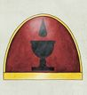
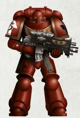
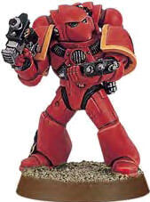
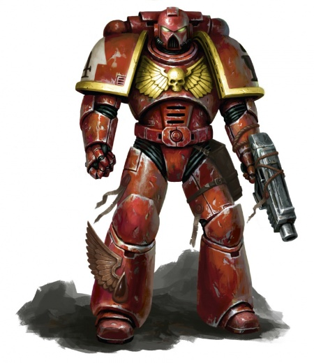
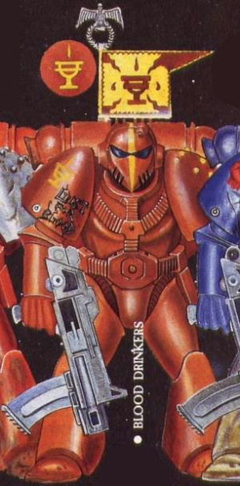

# 0419 饮血者 Blood Drinkers

精校状态：中文行文已逐段精校，部分术语仍为暂定

分类：通用概念 / 帝国 Imperium / 中央政务部 Adeptus Terra / 阿斯塔特修会 Adeptus Astartes

原文来源：https://www.bilibili.com/opus/1123794470950666245

原作者：帝国神选罐头

原文时间：2025年10月15日 09:36

[返回分类目录](目录.md) · [全书目录](../../目录.md)

<!-- A0419-B0001 -->
**英文原文**

The Blood Drinkers are a successor chapter of the Blood Angels Legion.

<!-- /A0419-B0001 -->

<!-- A0419-B0002 -->

原译文

饮血者是圣血天使军团的子战团。

**校订译文**

饮血者是圣血天使军团的子战团。

<!-- /A0419-B0002 -->

<!-- A0419-B0003 图片 -->

<!-- A0419-B0004 图片 -->

<!-- A0419-B0005 图片 -->

<!-- A0419-B0006 -->
**英文原文**

Founding Chapter:Blood Angels

<!-- /A0419-B0006 -->

<!-- A0419-B0007 -->

原译文

建军战团：圣血天使

**校订译文**

母战团：圣血天使

<!-- /A0419-B0007 -->

<!-- A0419-B0008 -->
**英文原文**

Founding:Second Founding

<!-- /A0419-B0008 -->

<!-- A0419-B0009 -->

原译文

建军：二次建军

**校订译文**

建军：二次建军

<!-- /A0419-B0009 -->

<!-- A0419-B0010 -->
**英文原文**

Chapter Master:Orloc

<!-- /A0419-B0010 -->

<!-- A0419-B0011 -->

原译文

战团长：奥洛克

**校订译文**

战团长：奥洛克

<!-- /A0419-B0011 -->

<!-- A0419-B0012 -->
**英文原文**

Homeworld:San Guisaga

<!-- /A0419-B0012 -->

<!-- A0419-B0013 -->

原译文

家园世界：圣吉萨加

**校订译文**

母星：圣吉萨伽

<!-- /A0419-B0013 -->

<!-- A0419-B0014 -->
**英文原文**

Colours:Red，Colour of pauldron trim indicates company

<!-- /A0419-B0014 -->

<!-- A0419-B0015 -->

原译文

配色：红色，肩甲的颜色表明连队

**校订译文**

配色：红色；肩甲镶边的颜色表示所属连队。

**校注：** pauldron trim 指肩甲镶边，原译误成整块肩甲的颜色。

<!-- /A0419-B0015 -->

<!-- A0419-B0016 -->
**英文原文**

Specialty:Close Combat

<!-- /A0419-B0016 -->

<!-- A0419-B0017 -->

原译文

专长：近身战斗

**校订译文**

专长：近身战斗

<!-- /A0419-B0017 -->

<!-- A0419-B0018 -->
## Background 背景故事

<!-- /A0419-B0018 -->

<!-- A0419-B0019 -->
**英文原文**

Strict followers of the Codex Astartes, the Blood Drinkers have blood-drinking rituals and suffer a literal blood-lust, due to a mutation of the chapter's Omophagea gene seed. Members of the Chapter are described as having a perpetual air of aridity, likely due to the above mutation.

<!-- /A0419-B0019 -->

<!-- A0419-B0020 -->

原译文

《阿斯塔特圣典》的严格遵守者，饮血者有吸血仪式，并因该战团的基因侦测神经基因种子突变而遭受字面上的嗜血欲望。该战团的成员被描述为有一种永恒干燥的空气，可能是由于上述突变。

**校订译文**

饮血者严格遵循《阿斯塔特圣典》，却也举行饮血仪式，并对血液怀有真实的生理渴求。这源于基因种子中基因侦测神经相关部分的变异。战团成员被形容为总带着一副干枯的模样，可能也与该变异有关。

**校注：** air of aridity 是外表或气质显得干枯的比喻，原译永恒干燥的空气误作实体空气。

<!-- /A0419-B0020 -->

<!-- A0419-B0021 图片 -->

<!-- A0419-B0022 -->

原译文

Space Marine of the Blood Drinkers, 2nd Company, 4th Squad 饮血者第二连队第四小队的星际战士

**校订译文**

Space Marine of the Blood Drinkers, 2nd Company, 4th Squad 饮血者第二连队第四小队的星际战士

<!-- /A0419-B0022 -->

<!-- A0419-B0023 -->
**英文原文**

While they seem to have overcome the worst aspects of the flaw of the Blood Angels successors, with low incidence of Black Rage and a small Death Company, the truth is that instead of denying or controlling the Red Thirst, they surrender to it.

<!-- /A0419-B0023 -->

<!-- A0419-B0024 -->

原译文

虽然他们似乎已经克服了圣血天使子战团缺陷的最坏方面，黑怒的发生率很低，死亡连也很小，但事实是，他们没有否认或控制血渴，而是屈服于它。

**校订译文**

表面上，饮血者似乎克服了圣血天使后裔最严重的基因缺陷：黑怒发生率很低，死亡连队规模也很小。但真相是，他们既不否认血渴，也不设法控制它，而是向其屈服。

<!-- /A0419-B0024 -->

<!-- A0419-B0025 -->
**英文原文**

The truth behind the Blood Drinkers is far more insidious, however. By M37 the Blood Drinkers were a dying chapter, brothers succumbed to the Black Rage as soon as they were fully initiated. A battle-brother named Holos, against the orders of the Chapter Council, followed a dream that told him to ascend to the top of Mount Calicium. At the peak he supposedly met an angel, which some claim to be Sanguinius, who told him how to save his dying Chapter. The Rite of Holos, as it came to be known, is a gathering of marines (rank is suspended in these meetings apart from Chaplains and Sanguinary Priests) where they drink blood from serfs who provide it freely and sacrifice an unwilling victim. "Blood given, blood taken." This balances the ritual and calms the Thirst.

<!-- /A0419-B0025 -->

<!-- A0419-B0026 -->

原译文

然而，饮血者背后的真相要隐伏得多。到了M37，饮血者已经是一个垂死的战团，兄弟们一完全开始就屈服于黑怒。一个名叫霍洛斯的战斗兄弟，违背战团议会的命令，做了一个梦，告诉他要登上卡利库姆山的山顶。据说在山顶，他遇到了一位天使，自称为圣吉列斯，天使告诉他如何拯救垂死的战团。众所周知，霍洛斯仪式是战士的聚会（除了牧师和圣血祭司外，在这些集会上，军衔都是暂停的），他们在那里喝侍从的血，侍从免费提供血液，并牺牲一个不情愿的受害者。“献血，抽血。”这平衡了仪式，平静了饥渴。

**校订译文**

隐藏的真相更加险恶。第37个千年时，饮血者已濒临灭亡，战斗兄弟刚完成入团过程，便会陷入黑怒。一名叫霍洛斯的战士违背战团议会命令，遵循梦中的指引，攀上卡利库姆山。据说，他在那里遇到一名天使，得到拯救战团的方法；有人声称，那天使就是圣吉列斯。后来形成的“霍洛斯仪式”要求战士聚集饮血。仪式中，除教士与圣血祭司外，所有人的军衔差别暂时取消。他们先饮用侍从自愿献出的血液，再献祭一名不情愿的受害者。“自愿献出的血，强行夺取的血”共同构成仪式的平衡，使血渴平息。

**校注：** some claim 是有人如此声称，不是天使自称圣吉列斯；provide freely 指自愿献血，原译免费遗漏自愿性。

<!-- /A0419-B0026 -->

<!-- A0419-B0027 -->
**英文原文**

However, the truth behind the Rite was that Holos was visited not by an angel but by a daemon, heavily implied to be Kairos Fateweaver, who made a deal with the battle-brother. In exchange for the blood-drinking Rite that would save thousands of brothers from the Death Company, Kairos would gain the ability to change the visions of a select few Death Company marines from the normal visions of Sanguinius's death to those of Holos and the daemon itself. As of M39, eighteen brothers had witnessed it, and Kairos had spoken through the memories to each battle-brother, tempting them with the power of Chaos. If one even so much as thinks of accepting Kairos's offer the entire Chapter will be damned and fall to Chaos. Thus far, all have refused Kairos, but the Daemon cares not as only a single "Yes" or even "Maybe" is necessary for the Blood Drinkers to be damned forever. Only the Reclusiarchs know the truth behind the Rite, though it is unknown if they wish the Chapter to fall.

<!-- /A0419-B0027 -->

<!-- A0419-B0028 -->

原译文

然而，仪式背后的真相是，霍洛斯不是被天使拜访的，而是被一个恶魔拜访的，这在很大程度上暗示了是卡洛斯·织命者，他与战斗兄弟达成了协议。作为将数千名兄弟从死亡连中拯救出来的吸血仪式的交换，卡洛斯将获得将少数死亡连战士的幻象从圣吉列斯之死的正常幻象改变为霍洛斯和恶魔本身的幻象的能力。截至M39，已有18名兄弟目睹了这一幕，卡洛斯通过回忆与每个战斗兄弟交谈，用混沌的力量引诱他们。如果一个人甚至是想接受卡洛斯的提议，整个战团都会被诅咒，堕入混沌。到目前为止，所有人都拒绝了卡洛斯，但恶魔并不在乎，因为只要有一个“是”甚至“也许”就是让饮血者永远被诅咒的必要条件。只有隐修长知道仪式背后的真相，尽管尚不清楚他们是否希望这一战团堕落。

**校订译文**

然而，拜访霍洛斯的其实并非天使，而是恶魔；叙述强烈暗示它就是凯洛斯·织命者。双方达成交易：恶魔提供饮血仪式，使数千名兄弟免于进入死亡连队；作为交换，它能改变少数死亡连队成员所见的异象，将通常的圣吉列斯临终景象替换为霍洛斯与恶魔相会的记忆。至第39个千年，已有十八人见过这种异象。凯洛斯逐一透过记忆向他们说话，以混沌之力诱惑他们。只要其中一人哪怕动过接受的念头，整个战团便会永远堕入混沌。迄今所有人都已拒绝，但恶魔毫不在意：它只需要一个“愿意”，甚至一句“也许”。唯有隐修长们知晓仪式的真相，但他们是否希望战团堕落，仍不得而知。

**校注：** Kairos Fateweaver 已核 GW-09/GW-10同第12页：凯洛斯·织命者。原译卡洛斯改用官译。恶魔身份在源段仍属强烈暗示，不强化为无疑确证。

<!-- /A0419-B0028 -->

<!-- A0419-B0029 图片 -->

<!-- A0419-B0030 -->

原译文

Rogue Trader-era Blood Drinkers Marine 行商浪人时期的饮血者战士

**校订译文**

Rogue Trader-era Blood Drinkers Marine 行商浪人时期的饮血者战士

<!-- /A0419-B0030 -->

<!-- A0419-B0031 -->
**英文原文**

Blood Drinkers practice some mysterious and suspicious rituals, such as the Sanguis Excrucio and the Red Tears. Their controversial bloody practices may have given them a unique level of control over the Black Rage, which is less likely to occur within the Chapter than other Blood Angels successors.

<!-- /A0419-B0031 -->

<!-- A0419-B0032 -->

原译文

饮血者会进行一些神秘而可疑的仪式，如鲜血折磨和血红之泪。他们有争议的血腥行为可能让他们对黑怒有了独特的控制，这在战团中发生的可能性比其他圣血天使的子战团小。

**校订译文**

饮血者举行鲜血折磨、血红之泪等神秘而可疑的仪式。这些饱受争议的血腥习俗，或许赋予了他们特殊的黑怒控制能力，使战团的发作率低于其他圣血天使后裔。

<!-- /A0419-B0032 -->

<!-- A0419-B0033 -->
## Gene-seed 基因种子

<!-- /A0419-B0033 -->

<!-- A0419-B0034 -->
**英文原文**

Their Gene-seed gives each member unnaturally dry skin.

<!-- /A0419-B0034 -->

<!-- A0419-B0035 -->

原译文

他们的基因种子给每个成员带来了不自然的干燥皮肤。

**校订译文**

基因种子使每名饮血者的皮肤都异常干燥。

<!-- /A0419-B0035 -->

<!-- A0419-B0036 -->
## Notable engagements 著名作战

<!-- /A0419-B0036 -->

<!-- A0419-B0037 -->

原译文

266.M37: Battle of Hell's Hollow 地狱山谷之战

**校订译文**

266.M37: Battle of Hell's Hollow 地狱山谷之战

<!-- /A0419-B0037 -->

<!-- A0419-B0038 -->

原译文

373.M39: Massacre of Delta 9 德尔塔9号大屠杀

**校订译文**

373.M39: Massacre of Delta 9 德尔塔9号大屠杀

<!-- /A0419-B0038 -->

<!-- A0419-B0039 -->
**英文原文**

670.M39: Freeing the Hive World Vaust from the Dark Eldar plotting.

<!-- /A0419-B0039 -->

<!-- A0419-B0040 -->

原译文

将巢都世界从黑暗灵族的阴谋中解放出来。

**校订译文**

670.M39：将巢都世界沃斯特从黑暗灵族的阴谋中解救出来。

**校注：** 补回原译遗漏的世界名 Vaust 及纪年；Vaust 暂译沃斯特。

<!-- /A0419-B0040 -->

<!-- A0419-B0041 -->
**英文原文**

887.M39: The cleansing of the Genestealer-infested Space Hulk codenamed Death of Integrity, along with the Novamarines chapter. Terminators of the First Company of both chapters led the assault. A 53:1 kill ratio was achieved. Total annihilation of the infestation was confirmed, and the Hulk was later examined for STC materials.

<!-- /A0419-B0041 -->

<!-- A0419-B0042 -->

原译文

清理被基因窃取者侵扰的太空废船，代号为“正直之死”，以及新星战士战团。两个战团的第一连队的终结者领导了这次袭击。达到了53:1的杀亡率。确认侵扰已完全消灭，随后对废船进行了STC材料检查。

**校订译文**

887.M39：与新星战士共同清剿代号“正直之死”、遍布基因窃取者的太空废船。两团第一连的终结者担任突击先锋，取得53∶1的杀敌与自身阵亡比。确认侵染已被彻底清除后，人员又检查废船，寻找标准建造模板的相关资料。

**校注：** 与新星战士共同清剿废船，原译连接关系使新星战士仿佛也成了清剿对象；STC materials 指可供查找的相关资料或遗存，不泛译为建筑材料。

<!-- /A0419-B0042 -->

<!-- A0419-B0043 -->
**英文原文**

816.M41: Achilus Crusade — In 816.M41 two companies of Space Marines of the Blood Drinker chapter were drawn to Castobel, seemingly by the scent of blood, months before the tendrils of the Hive Fleet Dagon invaded. Fortifying the largest spire of Hive Ibellus. There are some appearances of blood-drained corpses throughout the Hive City, trough the citizens blame xenos stalkers.

<!-- /A0419-B0043 -->

<!-- A0419-B0044 -->

原译文

阿基里斯远征 — 816.M41，在虫巢舰队达贡的卷须入侵前几个月，饮血者战团的两个星际战士连队似乎被鲜血的气味吸引到了卡斯托贝尔。加固伊贝鲁斯巢都最大的尖塔。整个巢都城市都出现了一些失血过多的尸体，市民们将其归咎于异型追猎者。

**校订译文**

816.M41：阿基里斯远征——在达贡虫巢舰队的触须到来数月前，饮血者的两个连仿佛循着血腥气来到卡斯托贝尔，并加固伊贝鲁斯巢都最大的尖塔。城中陆续出现被吸干血液的尸体，但居民将其归咎于潜伏的异形。

<!-- /A0419-B0044 -->

<!-- A0419-B0045 -->
**英文原文**

M42: The Devastation of Baal - Forces under Quaeston sent to aid the Blood Angels against Hive Fleet Leviathan.

<!-- /A0419-B0045 -->

<!-- A0419-B0046 -->

原译文

巴尔的毁灭 - 奎斯顿率领的部队被派去帮助圣血天使对抗虫巢舰队利维坦。

**校订译文**

M42：巴尔之毁——奎斯顿率军支援圣血天使，迎击利维坦虫巢舰队。

**校注：** 本段源文纪年为M42，420等篇列999.M41；分别保留来源纪年，不强行统一。

<!-- /A0419-B0046 -->

<!-- A0419-B0047 -->
**英文原文**

Date Unknown: Took part in Blood Angels Successor Chapter Summit and agreed to donate a portion of its Initiates to help rebuild the depleted Blood Angels Chapter.

<!-- /A0419-B0047 -->

<!-- A0419-B0048 -->

原译文

参加了圣血天使子战团峰会，并同意捐赠部分修士，以帮助重建枯竭的圣血天使战团。

**校订译文**

日期不详：参加圣血天使子战团峰会，同意拨出部分新入团战士，帮助兵力枯竭的母战团重建。

<!-- /A0419-B0048 -->

<!-- A0419-B0049 -->
**英文原文**

Date Unknown: A squad of ten Blood Drinker Marines in a damaged cruiser landed on the apparently loyal Imperial world Karkason only to find that the Planetary Governor Fulgor Sagramoso had declared independence from Imperial rule. The squad, led by Lieutenant Kroff Tezla, were pitted against a force of Titans that Sagramoso had hidden on his world. One by one the Marines were killed by the Titans for the sport of the locals until only their leader remained. A Titan then scooped up Tezla and offered him to Sagramoso as a trophy. Sagramoso had the Lieutenant mutilated and then imprisoned. Unable to flee, Tezla entered a dormant Sus-an Membrane state, only to be roused years later when the Imperial Fists found him by accident, when the Chapter invaded the world. Tezla was then able to warn the Imperial Fists about the Titans, avoiding disaster and allowing for Sagramoso's forces to be defeated. Afterwards, Tezla was recovered by the Imperial Fists and had his wounds treated. However they were too severe for augmetic replacement, so instead the Chapter equipped the Lieutenant with a mobile chair and two Servitors to care for him until Tezla was finally reunited with the Blood Drinkers.

<!-- /A0419-B0049 -->

<!-- A0419-B0050 -->

原译文

一支由十名饮血者战士组成的小队乘坐一艘受损的巡洋舰降落在看似忠诚的帝国世界卡尔卡森，却发现行星总督富尔戈尔·萨格拉莫索宣布脱离帝国统治独立。由克罗夫·特兹拉副官领导的小队与萨格拉莫索隐藏在他的世界里的泰坦部队展开了对决。为了娱乐当地人，战士一个接一个地被泰坦杀死，直到只剩下他们的领袖。随后，一架泰坦将特兹拉舀起，并将其作为战利品献给萨格拉莫索。萨格拉莫索将副官肢解，然后监禁。由于无法逃离，特兹拉进入了苏安脑膜的休眠状态，几年后，几年后，当帝国之拳战团入侵世界，偶然发现他时，他才被唤醒。然后，特兹拉能够向帝国之拳发出关于泰坦的警告，避免灾难，并让萨格拉莫索的部队被击败。之后，特兹拉被帝国之拳治愈，并接受了对伤口的治疗。然而，它们太严重了，无法进行替换，所以战团为副官配备了一把移动座椅和两个机仆来照顾他，直到特兹拉最终与饮血者重聚。

**校订译文**

日期不详：十名饮血者乘受损巡洋舰抵达表面仍忠于帝国的卡尔卡森，却发现行星总督富尔戈尔·萨格拉莫索已宣布独立。克罗夫·特兹拉副官率领的小队被迫迎战总督秘密藏匿的泰坦，成为供当地人取乐的猎物。战士们逐个被杀，只剩特兹拉。一台泰坦将他抓起，作为战利品献给总督；后者将他残害致残，并囚禁起来。特兹拉无力逃脱，只能借苏安脑膜进入休眠。多年后，帝国之拳进攻这颗星球，意外发现并唤醒了他。他及时警告对方泰坦的存在，使帝国之拳避开灾难、击败总督军队。随后，他被救走并接受治疗，但伤势过重，连机械义体也无法替代受损部位。帝国之拳便为他配备移动座椅和两名照料机仆，直到他最终回到饮血者战团。

**校注：** recovered 为救回，不是治愈；其后仍需治疗，且重伤无法用机械义体修复。删去原译重复的几年后。

<!-- /A0419-B0050 -->

<!-- A0419-B0051 -->
**英文原文**

Date Unknown: Reclaiming Rynn's World from Ork menace.

<!-- /A0419-B0051 -->

<!-- A0419-B0052 -->

原译文

从欧克的威胁中夺回林恩世界。

**校订译文**

日期不详：从兽人手中夺回瑞恩世界。

<!-- /A0419-B0052 -->

<!-- A0419-B0053 -->
### Known Members 著名成员

<!-- /A0419-B0053 -->

<!-- A0419-B0054 -->
**英文原文**

Holos — Battle-Sergeant, Chapter Hero (M37).

<!-- /A0419-B0054 -->

<!-- A0419-B0055 -->

原译文

霍洛斯 — 战斗军士，战团英雄（M37）

**校订译文**

霍洛斯 — 战斗军士，战团英雄（M37）

<!-- /A0419-B0055 -->

<!-- A0419-B0056 -->
**英文原文**

Caedis — Chapter Master (M39).

<!-- /A0419-B0056 -->

<!-- A0419-B0057 -->

原译文

凯迪斯 — 战团长（M39）

**校订译文**

凯迪斯 — 战团长（M39）

<!-- /A0419-B0057 -->

<!-- A0419-B0058 -->
**英文原文**

Mazrael — Reclusiarch (M39).

<!-- /A0419-B0058 -->

<!-- A0419-B0059 -->

原译文

玛兹瑞尔 — 隐修长

**校订译文**

玛兹瑞尔——隐修长（M39）。

<!-- /A0419-B0059 -->

<!-- A0419-B0060 -->
**英文原文**

Guinian — Chief Librarian (M39).

<!-- /A0419-B0060 -->

<!-- A0419-B0061 -->

原译文

圭尼亚 — 首席智库（M39）

**校订译文**

圭尼亚——首席智库员（M39）。

<!-- /A0419-B0061 -->

<!-- A0419-B0062 -->
**英文原文**

Teale — Sanguinary Priest (M39).

<!-- /A0419-B0062 -->

<!-- A0419-B0063 -->

原译文

蒂尔 — 圣血祭司（M39）

**校订译文**

蒂尔 — 圣血祭司（M39）

<!-- /A0419-B0063 -->

<!-- A0419-B0064 -->
**英文原文**

Orloc — Chapter Master (M41).

<!-- /A0419-B0064 -->

<!-- A0419-B0065 -->

原译文

奥洛克 — 战团长（M41）

**校订译文**

奥洛克 — 战团长（M41）

<!-- /A0419-B0065 -->

<!-- A0419-B0066 -->
**英文原文**

Carnifus — Captain, Third Company.

<!-- /A0419-B0066 -->

<!-- A0419-B0067 -->

原译文

卡尼弗斯 — 连长，第三连队

**校订译文**

卡尼弗斯 — 连长，第三连队

<!-- /A0419-B0067 -->

<!-- A0419-B0068 -->
**英文原文**

Quaeston — Master of the Forge.

<!-- /A0419-B0068 -->

<!-- A0419-B0069 -->

原译文

奎阿斯通 — 铸造大师

**校订译文**

奎斯顿——铸造大师。

<!-- /A0419-B0069 -->

<!-- A0419-B0070 -->
**英文原文**

Lucien Gallani — Sanguinary Guard.

<!-- /A0419-B0070 -->

<!-- A0419-B0071 -->

原译文

卢西恩·加拉尼 — 圣血卫队

**校订译文**

卢西恩·加拉尼——圣血守卫。

<!-- /A0419-B0071 -->

<!-- A0419-B0072 -->
**英文原文**

Kroff Tezla — Lieutenant

<!-- /A0419-B0072 -->

<!-- A0419-B0073 -->

原译文

克罗夫·特兹拉 — 副官

**校订译文**

克罗夫·特兹拉 — 副官

<!-- /A0419-B0073 -->

<!-- A0419-B0074 -->
### Relics 圣物

<!-- /A0419-B0074 -->

<!-- A0419-B0075 -->

原译文

The Calix Cruentes 血腥圣杯

**校订译文**

The Calix Cruentes 血腥圣杯

<!-- /A0419-B0075 -->

<!-- A0419-B0076 -->
## Trivia 琐事

<!-- /A0419-B0076 -->

<!-- A0419-B0077 -->
**英文原文**

The Blood Drinker Chapter Master Orloc is named for the first fictional Vampire to appear in film, Count Orlok, portrayed by Max Schrek in Nosferatu, eine Symphonie des Grauens.

<!-- /A0419-B0077 -->

<!-- A0419-B0078 -->

原译文

饮血者战团长奥洛克以电影中出现的第一个虚构吸血鬼欧洛克伯爵的名字命名，由马克斯·施雷克在《诺斯费拉图，恐怖的交响》中饰演。

**校订译文**

饮血者战团长奥洛克的名字取自奥洛克伯爵，即马克斯·施雷克在《诺斯费拉图：恐怖交响曲》中饰演的吸血鬼。原条目将其称为最早出现在电影中的虚构吸血鬼形象。

**校注：** 电影史“首个银幕吸血鬼”属于原条目的说法，本轮未核定该断言；采用明确归属原条目的表述。电影片名暂用常见中文题名。

<!-- /A0419-B0078 -->

<!-- A0419-B0079 -->
### Conflicting sources 来源冲突

<!-- /A0419-B0079 -->

<!-- A0419-B0080 -->
**英文原文**

According to Codex: Blood Angels (5th Edition), they are of an unknown founding.

<!-- /A0419-B0080 -->

<!-- A0419-B0081 -->

原译文

根据《圣典:圣血天使》（第5版），它们的起源未知。

**校订译文**

《圣典：圣血天使》第五版将饮血者列为建军批次不详的战团。

**校注：** unknown founding 是建军批次不详，不是整个来源或血脉不明；与开头二次建军构成原文明确来源冲突。

<!-- /A0419-B0081 -->

本篇核心术语与暂定项

以下列出本篇出现的英文原形及核心术语表用词。同形词可能指不同对象，具体词义以本篇正文和校注为准；单复数、别名和仅见于图注的名称可能尚未列入。完整候选见[术语表](../../术语表/双语术语候选.csv)。

| 英文 | 采用中文 | 状态 |
| --- | --- | --- |
| Space Marines | 星际战士 | 官方已核对 |
| Blood Angels | 圣血天使 | 官方已核对 |
| Eldar | 灵族 | 暂定·语境区分 |
| Dark Eldar | 黑暗灵族 | 暂定·旧称对应 |
| Librarian | 智库员 | 官方已核对 |
| Sanguinary | 圣血学派 | 暂定·学派语境 |
| Imperial Fists | 帝国之拳 | 暂定 |
| Hive World | 巢都世界 | 暂定·官方待核 |
| STC | 标准建造模板 | 暂定·官方待核 |
| Devastation of Baal | 巴尔之毁 | 暂定·官方待核 |
| Hive Fleet Leviathan | 利维坦虫巢舰队 | 暂定·官方待核 |
| Perpetual | 永生者 | 暂定·官方待核 |
| Rynn's World | 瑞恩世界 | 暂定·官方待核 |
| Baal | 巴尔 | 暂定·官方待核 |
| Titan | 泰坦 | 暂定·官方待核 |
| Chief Librarian | 首席智库员 | 暂定·官方待核 |
| Master | 导师（审判庭职衔）／舰务官（舰员职务） | 语境定译·官方待核 |
| Reclusiarch | 隐修长 | 暂定·官方待核 |
| Master of the Forge | 铸造大师 | 暂定·官方待核 |
| Sanguinary Guard | 圣血守卫 | 官方已核对 |
| Lieutenant | 副官 | 暂定·官方待核 |
| Second Founding | 二次建军 | 暂定·官方待核 |
| Founding | 建军 | 暂定·官方待核 |
| Chapter | 战团 | 暂定·官方待核 |
| Chapter Master | 战团长 | 暂定·官方待核 |
| Captain | 连长 | 暂定·官方待核 |
| Terminators | 终结者 | 暂定·官方待核 |
| Sergeant | 军士 | 暂定·官方待核 |
| Brother | 修士 | 暂定·官方待核 |
| Battle-Brother | 战斗兄弟 | 暂定·官方待核 |
| Codex Astartes | 阿斯塔特圣典 | 暂定·官方待核 |
| Blood Drinkers | 饮血者 | 暂定·官方待核 |
| Novamarines | 新星战士 | 暂定·官方待核 |
| Gene-seed | 基因种子 | 暂定·官方待核 |
| Omophagea | 基因侦测神经 | 暂定·官方待核 |
| Sus-an Membrane | 苏安脑膜 | 暂定·官方待核 |
| San Guisaga | 圣吉萨伽 | 暂定·官方待核 |
| Initiates | 进阶者 | 官方已核 |
| Rite of Holos | 霍洛斯仪式 | 暂定·官方待核 |
| Sanguinary Priest | 圣血祭司 | 官方已核 |
| Death Company Marines | 死亡连队战士 | 官方已核 |
| Xenos | 异形 | 暂定·官方待核 |
| Quaeston | 奎斯顿 | 暂定·官方待核 |
| Vaust | 沃斯特 | 暂定·官方待核 |
| Holos | 霍洛斯 | 暂定·官方待核 |
| Kairos Fateweaver | 凯洛斯·织命者 | 官方已核对 |
| The Thirst | 饥渴（黑暗灵族灵魂饥渴） | 暂定·官方待核 |
| Blood Drinker | 饮血者号 | 暂定·官方待核 |
| Caedis | 凯迪斯 | 暂定·官方待核 |
| Mazrael | 玛兹瑞尔 | 暂定·官方待核 |
| Guinian | 圭尼亚 | 暂定·官方待核 |
| Teale | 蒂尔 | 暂定·官方待核 |
| Orloc | 奥洛克 | 暂定·官方待核 |
| Carnifus | 卡尼弗斯 | 暂定·官方待核 |
| Lucien Gallani | 卢西恩·加拉尼 | 暂定·官方待核 |
| Kroff Tezla | 克罗夫·特兹拉 | 暂定·官方待核 |
| Chaplains | 教士 | 暂定·官方待核 |
| The Dark | 《黑暗》 | 暂定·官方待核 |
| The Blood | 鲜血 | 暂定·官方待核 |
| Hive City | 巢都城市 | 暂定·官方待核 |

