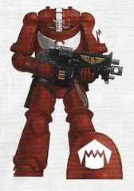

# 0420 食肉者 Flesh Eaters

精校状态：中文行文已逐段精校，部分术语仍为暂定

分类：通用概念 / 帝国 Imperium / 中央政务部 Adeptus Terra / 阿斯塔特修会 Adeptus Astartes

原文来源：https://www.bilibili.com/opus/1123470656193691666

原作者：帝国神选罐头

原文时间：2025年10月14日 12:39

[返回分类目录](目录.md) · [全书目录](../../目录.md)

<!-- A0420-B0001 -->
**英文原文**

The Flesh Eaters are a Blood Angels Successor Chapter.

<!-- /A0420-B0001 -->

<!-- A0420-B0002 -->

原译文

食肉者是圣血天使的子战团。

**校订译文**

食肉者是圣血天使的子战团。

<!-- /A0420-B0002 -->

<!-- A0420-B0003 图片 -->

<!-- A0420-B0004 图片 -->

<!-- A0420-B0005 -->
**英文原文**

Founding Chapter:Blood Angels

<!-- /A0420-B0005 -->

<!-- A0420-B0006 -->

原译文

建军战团：圣血天使

**校订译文**

母战团：圣血天使

<!-- /A0420-B0006 -->

<!-- A0420-B0007 -->
**英文原文**

Colours:Red with White Markings

<!-- /A0420-B0007 -->

<!-- A0420-B0008 -->

原译文

配色：红色配白色标志

**校订译文**

配色：红色配白色标志

<!-- /A0420-B0008 -->

<!-- A0420-B0009 -->
**英文原文**

Specialty:Close Combat

<!-- /A0420-B0009 -->

<!-- A0420-B0010 -->

原译文

专长：近身战斗

**校订译文**

专长：近身战斗

<!-- /A0420-B0010 -->

<!-- A0420-B0011 -->
## Overview 概述

<!-- /A0420-B0011 -->

<!-- A0420-B0012 -->
**英文原文**

For millennia, they have been rumored to have an unnatural hunger for blood and flesh, but the Flesh Eaters have always ignored this gossip. However their Gene-seed does contain instabilities, which nearly destroyed the Chapter. Because of this, the Flesh Eaters' numbers were greatly reduced by the time they aided the Blood Angels in the Devastation of Baal. The unveiling of the Primaris Space Marines was the Chapter's salvation, though, and their ranks have been swelled with hundreds of reinforcements. Now with the arrival of their new Primaris Battle Brothers, the Flesh Eaters have a chance to continue serving the Imperium.

<!-- /A0420-B0012 -->

<!-- A0420-B0013 -->

原译文

几千年来，有传言说他们对血与肉有着不自然的渴望，但食肉者总是忽略了这一传言。然而，他们的基因种子确实包含不稳定性，这几乎摧毁了战团。因此，当食肉者在巴尔的毁灭时帮助圣血天使，他们的人数大大减少了。不过，原铸星际战士的推出是该战团的救赎，他们的队伍已经增加了数百名援军。现在，随着他们的新原铸战斗兄弟的到来，食肉者有机会继续为帝国服务。

**校订译文**

数千年来，一直有传言称食肉者对鲜血与血肉怀有异常的渴求，但战团始终不予理会。不过，他们的基因种子的确存在不稳定性，几乎导致战团覆灭。前往巴尔之毁支援圣血天使时，食肉者的兵力已经严重衰减。原铸星际战士的出现挽救了他们，数百名新援补入队伍。凭借这些原铸战斗兄弟，战团终于有机会继续为帝国效力。

<!-- /A0420-B0013 -->

<!-- A0420-B0014 图片 -->

<!-- A0420-B0015 -->

原译文

The Flesh Eaters' famous "Jaws of Doom" Assault Squad mounting a frontal assault 食肉者著名的“毁灭之颚”突击小队发起正面攻击

**校订译文**

The Flesh Eaters' famous "Jaws of Doom" Assault Squad mounting a frontal assault 食肉者著名的“毁灭之颚”突击小队发起正面攻击

<!-- /A0420-B0015 -->

<!-- A0420-B0016 -->
## Notable Engagements 著名作战

<!-- /A0420-B0016 -->

<!-- A0420-B0017 -->
**英文原文**

Golance War - A campaign on Golance, led by Commander Isiah, against Eldar. The Chapter suffered heavy casualties, but received assistance from members of the Mentor Legion.

<!-- /A0420-B0017 -->

<!-- A0420-B0018 -->

原译文

戈兰斯战争 - 由指挥官伊塞亚领导的针对灵族的戈兰斯战役。该战团伤亡惨重，但得到了导师军团成员的援助。

**校订译文**

戈兰斯战争——伊塞亚指挥官率军在戈兰斯与灵族作战。战团损失惨重，但得到了导师战团成员的支援。

<!-- /A0420-B0018 -->

<!-- A0420-B0019 -->
**英文原文**

Spearhead Force in the Alvatine Suppression.

<!-- /A0420-B0019 -->

<!-- A0420-B0020 -->

原译文

阿尔瓦廷镇压中的矛头部队。

**校订译文**

在阿尔瓦廷镇压行动中担任突击先锋。

<!-- /A0420-B0020 -->

<!-- A0420-B0021 -->
**英文原文**

860.M33: War of the False Primarch - The Flesh Eaters were convened as part of the Pentarchy of Blood to enact the judgement of the High Lords of Terra, systematically destroying eleven chapters of the Adeptus Astartes judged Traitoris Perdita.

<!-- /A0420-B0021 -->

<!-- A0420-B0022 -->

原译文

伪原体战争 - 食肉者被召集作为五分之血的一部分，来进行泰拉高领主的判决，系统地摧毁了被审判为失落叛徒的阿斯塔特修会的十一个战团。

**校订译文**

860.M33：伪原体战争——食肉者奉召加入“鲜血五团联盟”，执行泰拉高领主的裁决，有计划地摧毁十一个被判为“失落叛徒”的阿斯塔特修会战团。

**校注：** Pentarchy of Blood 为组织名，非数学上的五分之血。暂译鲜血五团联盟；官网未检出对应，五战团组成仅作二手背景参考，不标官译。Traitoris Perdita 沿用失落叛徒，帝国定罪类别具体中文待核。

<!-- /A0420-B0022 -->

<!-- A0420-B0023 -->
**英文原文**

999.M41: Devastation of Baal - The Flesh Eaters sent forces to aid the Blood Angels against Hive Fleet Leviathan.

<!-- /A0420-B0023 -->

<!-- A0420-B0024 -->

原译文

巴尔的毁灭 - 食肉者派部队帮助圣血天使对抗虫巢舰队利维坦。

**校订译文**

999.M41：巴尔之毁——食肉者派兵援助圣血天使，对抗利维坦虫巢舰队。

<!-- /A0420-B0024 -->

<!-- A0420-B0025 -->
## Notable Members 著名成员

<!-- /A0420-B0025 -->

<!-- A0420-B0026 -->
**英文原文**

Isiah - Commander.

<!-- /A0420-B0026 -->

<!-- A0420-B0027 -->

原译文

伊塞亚 - 指挥官

**校订译文**

伊塞亚 - 指挥官

<!-- /A0420-B0027 -->

<!-- A0420-B0028 -->
**英文原文**

Scaraban - Chief Librarian.

<!-- /A0420-B0028 -->

<!-- A0420-B0029 -->

原译文

斯卡拉班 - 首席智库

**校订译文**

斯卡拉班——首席智库员。

<!-- /A0420-B0029 -->

本篇核心术语与暂定项

以下列出本篇出现的英文原形及核心术语表用词。同形词可能指不同对象，具体词义以本篇正文和校注为准；单复数、别名和仅见于图注的名称可能尚未列入。完整候选见[术语表](../../术语表/双语术语候选.csv)。

| 英文 | 采用中文 | 状态 |
| --- | --- | --- |
| Space Marines | 星际战士 | 官方已核对 |
| Adeptus Astartes | 阿斯塔特修会 | 官方已核对 |
| Blood Angels | 圣血天使 | 官方已核对 |
| Eldar | 灵族 | 暂定·语境区分 |
| Librarian | 智库员 | 官方已核对 |
| Imperium | 帝国 | 暂定·简称 |
| Primarch | 原体 | 官方已核对 |
| Terra | 泰拉 | 暂定·官方待核 |
| High Lords of Terra | 泰拉高领主 | 暂定·官方待核 |
| Devastation of Baal | 巴尔之毁 | 暂定·官方待核 |
| Hive Fleet Leviathan | 利维坦虫巢舰队 | 暂定·官方待核 |
| Baal | 巴尔 | 暂定·官方待核 |
| Chief Librarian | 首席智库员 | 暂定·官方待核 |
| Founding | 建军 | 暂定·官方待核 |
| Chapter | 战团 | 暂定·官方待核 |
| Mentor Legion | 导师军团 | 暂定·官方待核 |
| Flesh Eaters | 食肉者 | 暂定·官方待核 |
| Gene-seed | 基因种子 | 暂定·官方待核 |
| Traitoris Perdita | 失落叛徒 | 暂定·官方待核 |
| Pentarchy of Blood | 鲜血五团联盟 | 暂定·官方待核 |
| Golance War | 戈兰斯战争 | 暂定·官方待核 |
| Isiah | 伊塞亚 | 暂定·官方待核 |
| Scaraban | 斯卡拉班 | 暂定·官方待核 |
| The Blood | 鲜血 | 暂定·官方待核 |

