# 0421 X - 钢铁之手 Iron Hands

精校状态：中文行文已逐段精校，部分术语仍为暂定

分类：通用概念 / 帝国 Imperium / 中央政务部 Adeptus Terra / 阿斯塔特修会 Adeptus Astartes

原文来源：https://www.bilibili.com/opus/1093788081400578089

原作者：帝国神选罐头

原文时间：编辑于 2025年09月21日 12:43

[返回分类目录](目录.md) · [全书目录](../../目录.md)

<!-- A0421-B0001 -->
**英文原文**

The Iron Hands were the X Legion of the twenty original Space Marine Legions, sometimes referred to as the "Iron Tenth". Their Primarch is Ferrus Manus. Like the other loyalist Legions, much of the Iron Hands forces would later, according to the dictates of the Codex Astartes, be re-organized into smaller Chapters. The Iron Hands are notable for their heavy use of bionics and their reverence for all things mechanical, and thus their close ties to the Adeptus Mechanicus.

<!-- /A0421-B0001 -->

<!-- A0421-B0002 -->

原译文

钢铁之手军团是最初的二十个星际战士军团中的第十军团，有时被称为“铁十”。他们的原体是费鲁斯·马努斯。与其他忠诚的军团一样，钢铁之手部队的大部分部队后来将根据阿斯塔特圣典的规定重新组织成更小的战团。钢铁之手以其大量使用仿生和对所有机械事物的敬畏而闻名，因此他们与机械神教有着密切的联系。

**校订译文**

钢铁之手是原初二十支星际战士军团中的第十军团，有时称为“钢铁第十军团”，原体为费鲁斯·马努斯。与其他忠诚军团一样，其大部分兵力后来依《阿斯塔特圣典》拆分、重组为较小的战团。他们以广泛使用仿生义体、崇敬一切机械造物而闻名，也因此与机械修会关系紧密。

<!-- /A0421-B0002 -->

<!-- A0421-B0003 图片 -->

<!-- A0421-B0004 图片 -->
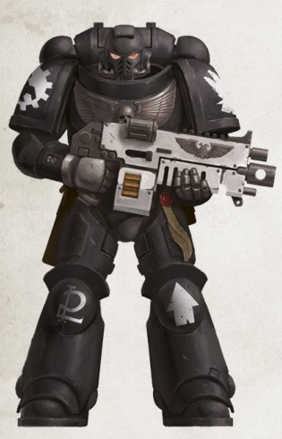

<!-- A0421-B0005 -->
**英文原文**

Legion Number:X

<!-- /A0421-B0005 -->

<!-- A0421-B0006 -->

原译文

军团编号：X

**校订译文**

军团编号：X

<!-- /A0421-B0006 -->

<!-- A0421-B0007 -->
**英文原文**

Primarch:Ferrus Manus

<!-- /A0421-B0007 -->

<!-- A0421-B0008 -->

原译文

原体：费鲁斯·马努斯

**校订译文**

原体：费鲁斯·马努斯

<!-- /A0421-B0008 -->

<!-- A0421-B0009 -->
**英文原文**

Homeworld:Medusa

<!-- /A0421-B0009 -->

<!-- A0421-B0010 -->

原译文

家园世界：美杜莎

**校订译文**

家园世界：美杜莎

<!-- /A0421-B0010 -->

<!-- A0421-B0011 -->
**英文原文**

Fortress-Monastery:None, Substituted by Ten Mobile Fortresses

<!-- /A0421-B0011 -->

<!-- A0421-B0012 -->

原译文

堡垒修道院：无，被十座移动堡垒所取代

**校订译文**

要塞修道院：无固定驻地，以十座移动要塞代替。

<!-- /A0421-B0012 -->

<!-- A0421-B0013 -->
**英文原文**

Chapter Master:Kardan Stronos, elected by the Iron Council

<!-- /A0421-B0013 -->

<!-- A0421-B0014 -->

原译文

战团长：卡丹·斯特罗诺斯，由钢铁议会选举产生

**校订译文**

战团长：卡丹·斯特罗诺斯，由钢铁议会选举产生

<!-- /A0421-B0014 -->

<!-- A0421-B0015 -->
**英文原文**

Colours:Black and Silver

<!-- /A0421-B0015 -->

<!-- A0421-B0016 -->

原译文

颜色：黑色和银色

**校订译文**

颜色：黑色和银色

<!-- /A0421-B0016 -->

<!-- A0421-B0017 -->
**英文原文**

Specialty:Bionics, Armored Assault

<!-- /A0421-B0017 -->

<!-- A0421-B0018 -->

原译文

专业：仿生，装甲突击

**校订译文**

专长：仿生义体、装甲突击。

<!-- /A0421-B0018 -->

<!-- A0421-B0019 -->
**英文原文**

Strength:Estimated \> 1000 marines

<!-- /A0421-B0019 -->

<!-- A0421-B0020 -->

原译文

力量：估计大于1000名星际战士

**校订译文**

兵力：估计超过1,000名星际战士。

<!-- /A0421-B0020 -->

<!-- A0421-B0021 -->
**英文原文**

Battle Cry:The Flesh Is Weak!

<!-- /A0421-B0021 -->

<!-- A0421-B0022 -->

原译文

战吼：血肉羸弱！

**校订译文**

战吼：血肉羸弱！

<!-- /A0421-B0022 -->

<!-- A0421-B0023 -->
**英文原文**

Successor Chapters:

<!-- /A0421-B0023 -->

<!-- A0421-B0024 -->

原译文

子战团

**校订译文**

子战团

<!-- /A0421-B0024 -->

<!-- A0421-B0025 -->

原译文

Brazen Claws 黄铜之爪

**校订译文**

Brazen Claws 黄铜之爪

<!-- /A0421-B0025 -->

<!-- A0421-B0026 -->

原译文

Iron Fists 钢铁之拳

**校订译文**

Iron Fists 钢铁之拳

<!-- /A0421-B0026 -->

<!-- A0421-B0027 -->

原译文

Iron Lords 钢铁领主

**校订译文**

Iron Lords 钢铁领主

<!-- /A0421-B0027 -->

<!-- A0421-B0028 -->

原译文

Knights of Byzantium 拜占庭骑士

**校订译文**

Knights of Byzantium 拜占庭骑士

<!-- /A0421-B0028 -->

<!-- A0421-B0029 -->

原译文

Red Talons 红爪

**校订译文**

Red Talons 红爪

<!-- /A0421-B0029 -->

<!-- A0421-B0030 -->

原译文

Sons of Medusa 美杜莎之子

**校订译文**

Sons of Medusa 美杜莎之子

<!-- /A0421-B0030 -->

<!-- A0421-B0031 -->

原译文

Star Dragons (speculated) 星龙（推测）

**校订译文**

Star Dragons (speculated) 星龙（推测）

<!-- /A0421-B0031 -->

<!-- A0421-B0032 -->

原译文

Steel Confessors (speculated) 钢铁神父（推测）

**校订译文**

Steel Confessors (speculated) 钢铁神父（推测）

<!-- /A0421-B0032 -->

<!-- A0421-B0033 -->
## Homeworld 家园世界

<!-- /A0421-B0033 -->

<!-- A0421-B0034 -->
**英文原文**

Medusa is located near the Eye of Terror. Its landscape is harsh and generally unstable, with massive tectonic shifts occurring on a regular basis. Medusa is not united by any single government, but instead is populated by disparate clans of miners living out of great tracked vehicles travelling in caravans. There are only two notable locations on Medusa: a volcano known as Karaashi, which was the location of the arrival of Ferrus Manus on the planet, and the Land of Shadows. The Land of Shadows is populated only by ghostly relics of ages past and is said to be haunted by the spirits of Medusans long dead; those who go there only go in order to become supplicants to the Iron Hands' recruitment process.

<!-- /A0421-B0034 -->

<!-- A0421-B0035 -->

原译文

美杜莎位于恐惧之眼附近。它的地貌恶劣，通常不稳定，经常发生大规模的构造变化。美杜莎不是由任何一个政府统一的，而是由不同的矿工氏族组成的，他们住在车队里的大型履带载具里。美杜莎上只有两个值得注意的地方：一个是被称为卡拉希的火山，它是马努斯抵达行星的地方，另一个是暗影之地。暗影之地只有古老的幽灵遗迹，据说被早已死去的美杜莎人的灵魂所困扰；那些去那里的人只是为了成为钢铁之手招募过程的祈求者。

**校订译文**

美杜莎靠近恐惧之眼，地貌恶劣且极不稳定，经常发生大规模地壳运动。星球没有统一政府，而由分散的矿工氏族构成。他们居住在巨型履带车辆上，以车队形式迁徙。当地只有两处格外知名的地点：费鲁斯·马努斯降临时所在的卡拉希火山，以及暗影之地。后者只有过去时代幽灵般的遗迹，据说游荡着久已死去的美杜莎人亡魂。前往那里的人，都只为一个目的——争取成为钢铁之手的新兵。

<!-- /A0421-B0035 -->

<!-- A0421-B0036 -->
## History 历史

<!-- /A0421-B0036 -->

<!-- A0421-B0037 -->
### Origins 起源

<!-- /A0421-B0037 -->

<!-- A0421-B0038 -->
**英文原文**

Originally known as the Storm Walkers or Stormwalkers, the legion was created during the latter days of the Unification Wars on Terra. Recruitment bases at this time were spread widely all across the planet, but the warlike cultures of Albia in particular provided effective initiates for the Legion. The Legion's first instance of recorded combat was in the Sol system against a Mutant warband known as Scythers. Shortly thereafter they exterminated the Xenos Lyasx on the world of Oberath. While the Legion was victorious in both actions, they did not yet seem to specialize in any area of warfare. It was only during the invasion of the Ork-held Planet 02-34 (designated 'Rust') that the Legion's effectiveness in utilizing slow-moving mass firepower became apparent.

<!-- /A0421-B0038 -->

<!-- A0421-B0039 -->

原译文

该军团最初被称为风暴步行者或风暴行者，是在泰拉统一战争的后期创建的。当时的募兵基地遍布全球，但阿尔比亚的好战文化尤其为军团提供了有效的启蒙。军团第一次有记录的战斗是在太阳系中与一个名为镰刀的变种战帮作战。不久之后，他们在奥伯拉斯世界消灭了异型莱亚克斯。虽然军团在这两次行动中都取得了胜利，但他们尚未在任何作战领域形成专业特长。只有在入侵欧克控制的02-34行星（命名为“铁锈”）期间，军团在运用慢速推进的集群火力方面展现出显著战力。

**校订译文**

军团最初名为风暴行者，英文有 Storm Walkers 与 Stormwalkers 两种写法，创建于泰拉统一战争末期。当时征兵基地遍布全球，尤其是阿尔比亚的尚武文化，为军团提供了优秀的新兵。最早有记录的战斗发生在太阳系，对手是名为镰刀的变种人战帮；不久后，他们又在奥伯拉斯消灭异形莱亚克斯。这两次行动虽都获胜，军团却尚未形成明确的作战专长。直到进攻兽人占据、代号“铁锈”的02-34号行星时，他们以缓慢推进配合集群火力的优势才显现出来。

**校注：** Storm Walkers 与 Stormwalkers 只是原名英文分写、连写差异，中文统一风暴行者。effective initiates 指合适的新兵，原译有效的启蒙错误。

<!-- /A0421-B0039 -->

<!-- A0421-B0040 图片 -->
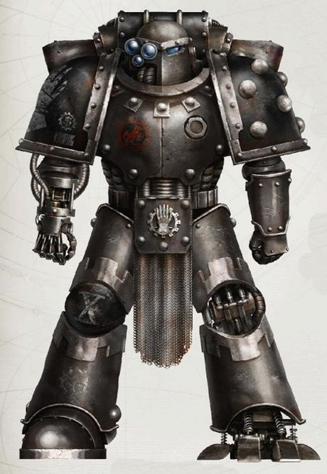

<!-- A0421-B0041 -->

原译文

Great Crusade-era Medusan Immortal 大远征时期美杜莎不朽者

**校订译文**

Great Crusade-era Medusan Immortal 大远征时期美杜莎不朽者

<!-- /A0421-B0041 -->

<!-- A0421-B0042 -->
**英文原文**

In the first years of the Great Crusade, the Legion earned great renown for its bellicose and combined arms strategies that were used in conjunction with the Excertus Imperialis. They would lead Imperial Army auxiliaries in making planetfall en masse and digging in (the storm). Next came a massed armoured thrust of the Legion's tanks, Dreadnoughts, and heavy infantry (the hammer). This became known as the "Hammer and the Storm", and was the origin for their original name of Storm Walkers. The Legion became known for its cooperation with the Imperial Army, effective leadership, and strategic prowess.

<!-- /A0421-B0042 -->

<!-- A0421-B0043 -->

原译文

在大远征的最初几年，该军团因其好战勇猛的作风与多兵种协同战术而声名远扬，这些战术常与帝国辅军协同运用。他们会率领帝国陆军辅助军大规模登陆行星，随即构筑防御阵地（风暴）。接下来是军团坦克、无畏和重型步兵（铁锤）的密集装甲推进。这被称为“铁锤和风暴”，是他们最初名字“风暴行者”的起源。军团因其与帝国军队的合作、有效的领导和战略实力而闻名。

**校订译文**

大远征初期，军团凭借勇猛的作风，以及与帝国武装力量总体系（Excertus Imperialis）其他部队配合的诸兵种协同战术，赢得声望。他们先率领帝国军辅助部队大规模登陆并构筑阵地，这一步称为“风暴”；随后，军团坦克、无畏机甲和重装步兵集结发起装甲突击，称为“铁锤”。整套战法因而得名“铁锤与风暴”，也是风暴行者旧称的由来。军团由此以善于同帝国军协作、指挥高效及战略能力出众而闻名。

**校注：** Excertus Imperialis 按主审核心定译帝国武装力量总体系并保留英文；Imperial Army 为帝国军，二者不混同。

<!-- /A0421-B0043 -->

<!-- A0421-B0044 -->
### Ferrus Manus 费鲁斯·马努斯

<!-- /A0421-B0044 -->

<!-- A0421-B0045 -->
**英文原文**

The Primarch of what would later officially become the Iron Hands, Ferrus Manus (also known as "The Gorgon"), was among the first of the Emperor's sons to be rediscovered. The early history of Ferrus Manus is chronicled in the folklore of Medusa. The most popular of these tales is the "Canticle of Travels", which details the trials of Ferrus Manus and his ordeal with the Great Silver Wyrm known as Asirnoth. The Canticle is the only tale that even attempts to explain the mystery of how Ferrus Manus came by his living metal hands. Ferrus Manus never united the people of his homeworld in the way most of the other Primarchs had, on the basis that competition grew greater strength. When the Emperor eventually came to Medusa, Ferrus Manus tested himself against him as well in a cataclysmic battle that is said to have lain waste to entire mountains. Finally having found someone his equal, Ferrus accepted the Emperor as his master and took command of the X Legion of Space Marines, which was renamed the Iron Hands in his honour.

<!-- /A0421-B0045 -->

<!-- A0421-B0046 -->

原译文

后来正式成为钢铁之手的原体费鲁斯·马努斯（也被称为“戈尔贡”）是帝皇最早被重新发现的儿子之一。美杜莎的民间传说记载了马努斯的早期历史。这些故事中最受欢迎的是“旅行颂歌”，它详细描述了费鲁斯·马努斯的试炼以及他与被称为阿西诺斯的巨型银龙的磨难。颂歌是唯一一个试图解释费鲁斯·马努斯是如何通过他活着的金属手臂来到这里的谜团的故事。费鲁斯·马努斯从未像其他大多数原体那样，在竞争日益激烈的基础上，团结家乡的人民。当帝皇最终来到美杜莎时，费鲁斯·马努斯也在一场灾难性的战斗中考验了自己，据说这场战斗摧毁了整个山脉。终于找到了一个与他势均力敌的人，费鲁斯接受了帝皇为他的主人，并指挥了星际战士的第十军团，为了纪念他，该军团更名为钢铁之手。

**校订译文**

费鲁斯·马努斯，又称“戈尔贡”，是帝皇最早寻回的子嗣之一，也是后来正式命名为钢铁之手的军团之父。美杜莎民间传说保存着他的早年事迹，其中最有名的《旅行颂歌》叙述了他经历的试炼，以及与巨型银龙阿西诺斯的搏斗。这也是唯一尝试解释他如何获得活体金属双手的传说。费鲁斯没有像大多数原体那样统一母星，因为他相信竞争才能孕育更强大的力量。帝皇抵达美杜莎后，他又与父亲交战以检验自己的实力；据说，那场灾难般的战斗夷平了整片山峦。终于找到足以与自己匹敌的人后，他承认帝皇为主，接掌第十军团。军团随之更名为钢铁之手，以向他致敬。

**校注：** came by his living metal hands 指如何获得活体金属双手，并非靠双手来到某地；竞争孕育力量是原体拒绝统一母星的理由。

<!-- /A0421-B0046 -->

<!-- A0421-B0047 图片 -->
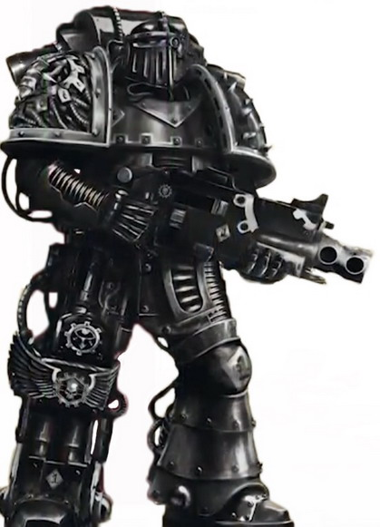

<!-- A0421-B0048 -->

原译文

Great Crusade-era Iron Hand 大远征时期钢铁之手

**校订译文**

Great Crusade-era Iron Hand 大远征时期钢铁之手

<!-- /A0421-B0048 -->

<!-- A0421-B0049 -->
**英文原文**

With the Gorgon at their head, the Iron Hands quickly became renowned for their ability to confront enemies of the Great Crusade head-on, gaining a reputation as ruthless and calculating fighters. They excelled at high-intensity warfare against both technologically advanced foes and brutal xenos such as Orks whose sheer power and vast numbers constituted a grave threat to the success of the Crusade. Soon enough, the Iron Hands became known as the Iron Tenth and were deliberately deployed to battlefronts where set-piece engagements against massed armies were likely. As their battle style required advanced war engines, the Iron Hands began to establish their notoriously close ties with the Adeptus Mechanicus, whose culture was astonishingly similar to their own. One of the most notable campaigns waged by the Iron Hands during the Great Crusade was that against the Diasporex. During the Astranii Campaign, the Iron Hands had a severe dispute with the Imperial Fists over what should become of the Astranii Machine Empire. Ferrus wished for the civilizations destruction as Hereteks, while Rogal Dorn wanted them assimilated into the larger Imperium. Ultimately, it fell to Horus Lupercal and an honor duel to settle the dispute.

<!-- /A0421-B0049 -->

<!-- A0421-B0050 -->

原译文

在戈尔贡的领导下，钢铁之手迅速以正面对抗大远征敌人的能力而闻名，并获得了无情和精于算计的战士的声誉。他们擅长与技术先进的敌人和欧克等野蛮的异型进行高强度战争，欧克的强大力量和庞大数量对远征的成功构成了严重威胁。很快，钢铁之手就被称为铁十，并被故意部署到可能与大规模军队发生定点战斗的前线。由于他们的战斗风格需要先进的战争引擎，钢铁之手开始与机械神教建立了著名的密切联系，他们的文化与他们自己的文化惊人地相似。钢铁之手在大远征期间发动的最著名的战役之一是对抗流散者。在阿斯特拉尼战役期间，钢铁之手与帝国之拳就阿斯特拉尼机械帝国的未来发生了激烈的争执。费鲁斯希望文明像技术异端一样毁灭，而罗格·多恩则希望他们融入更大的帝国。最终，这场争端落在了荷鲁斯·卢佩卡尔和一场荣誉决斗的肩上。

**校订译文**

在戈尔贡统领下，钢铁之手很快以正面迎击大远征强敌的能力闻名，被视为冷酷而精于计算的战士。他们擅长对抗技术先进的敌人，也擅长与欧克蛮人等以蛮力和数量威胁远征的异形进行高强度战争。军团被称为“钢铁第十军团”，并被有意派往最可能爆发大规模正规会战的前线。其战法需要先进战争机械，因此他们开始与文化惊人相似的机械修会建立紧密联系。大远征期间，讨伐流散者是他们最著名的战役之一。阿斯特拉尼战役中，军团还与帝国之拳为阿斯特拉尼机械帝国的命运发生激烈争执：费鲁斯认为应将其作为技术异端文明消灭，罗格·多恩则主张纳入帝国。最终，争议由荷鲁斯·卢佩卡尔介入，并通过一场荣誉决斗解决。

**校注：** 本段原文使用 Adeptus Mechanicus，按组织全称译机械修会；虽属大远征时期，不擅改源文为 Mechanicum。

<!-- /A0421-B0050 -->

<!-- A0421-B0051 -->
### The Horus Heresy 荷鲁斯之乱

原题：The Horus Heresy 荷鲁斯叛乱

<!-- /A0421-B0051 -->

<!-- A0421-B0052 -->
**英文原文**

At the outset of the Heresy, Fulgrim — the Primarch of the Emperor's Children — tried to turn Ferrus Manus to join the side of the traitors. When Ferrus refused, Fulgrim had his fleet launch a crippling attack on the Iron Hands vessels, although he could not bring himself to kill his brother. In the wake of this betrayal, Ferrus took as many of his veterans as he could onboard one of the few undamaged vessels to participate in the loyalist attack on Isstvan V. This proved to be a disaster when four of the supposedly loyal Legions turned on their allies, resulting in the Drop Site Massacre and horrendous casualties amongst the Raven Guard and Salamanders Legions and the death of Ferrus Manus and his entire retinue. During the massacre, despite making bold attacks against staggering odds, nearly all of the vast Iron Hand’s armoured formations were thought to be destroyed. Rumors persist that Ferrus Manus's corpse was taken to Mars but the Iron Hands deny any such claims.

<!-- /A0421-B0052 -->

<!-- A0421-B0053 -->

原译文

叛乱开始时，帝皇之子的原体福格瑞姆试图让费鲁斯·马努斯加入叛徒一方。当费鲁斯拒绝时，福格瑞姆让他的舰队对钢铁之手战舰发动了致命的攻击，尽管他无法杀死他的兄弟。在这次背叛之后，费鲁斯尽可能多地将他的老兵带上为数不多的完好无损的战舰之一，参加了忠诚派对伊斯塔万五号的袭击。当四个据称忠诚的军团背叛他们的盟友时，这被证明是一场灾难，导致了登陆点大屠杀，暗鸦守卫和火蜥蜴军团遭受了可怕的伤亡，费鲁斯·马努斯和他的整个随行人员也死亡了。在大屠杀期间，尽管冒着惊人的不利条件进行了大胆的攻击，但几乎所有庞大的铁手装甲部队都被摧毁了。有传言称，费鲁斯·马努斯的尸体被带到了火星，但钢铁之手否认了任何此类说法。

**校订译文**

叛乱伊始，帝皇之子原体福格瑞姆试图诱使费鲁斯·马努斯投向叛军。遭拒后，他命舰队重创钢铁之手战舰，却仍不忍亲手杀死兄弟。费鲁斯随即尽可能带上老兵，登上少数未受损的舰船之一，参加忠诚派对伊斯塔万五号的进攻。四支原本被认为忠诚的军团却背叛盟友，引发登陆点大屠杀。暗鸦守卫与火蜥蜴遭受惨重伤亡，费鲁斯及全部随从战死。据认为，钢铁之手庞大的装甲部队虽然在极端劣势下奋勇进攻，仍几乎全军覆没。一直有传言称费鲁斯遗体被送往火星，但钢铁之手始终予以否认。

**校注：** could not bring himself to kill 是不忍下手，不是客观上杀不死；恢复装甲部队几乎全毁前的据认为，保留源文不确定性。

<!-- /A0421-B0053 -->

<!-- A0421-B0054 -->
**英文原文**

The events at Isstvan V proved to be deeply traumatic to the Iron Hands, and they struggled to explain their crippling defeat. The survivors drew sharply different conclusions: Many developed a grudge against all the participants of the Heresy: the traitors, for being weak enough to become corrupted, but also against the other loyalists, for not being strong enough to protect the Emperor and their Primarch. Others became convinced that the Iron Hands and Ferrus Manus himself had been defeated because they had proven to be too weak, and devoted themselves to self-hatred. Some drew far darker conclusions, and went completely renegade. Large numbers of Iron Hands could not cope with the disaster at all; they went simply insane. Either way, the majority of the Iron Hands consequently launched "campaigns of redemption" to both atone for their own perceived weaknesses as well as to take revenge on the traitors.

<!-- /A0421-B0054 -->

<!-- A0421-B0055 -->

原译文

伊斯塔万五号的事件对钢铁之手来说是深深的创伤，他们很难解释自己的惨败。幸存者得出了截然不同的结论：许多人对叛乱的所有参与者都怀恨在心：叛徒，因为他们软弱到足以腐化，但也对其他忠诚者，因为他们没有足够的力量来保护帝皇和他们的原体。其他人则相信钢铁之手和费鲁斯·马努斯本人之所以被击败，是因为他们被证明过于软弱，并致力于自我憎恨。一些人得出了更为悲观的结论，并彻底背叛了。大批钢铁之手根本无法应对这场灾难；他们简直疯了。无论哪种方式，大多数钢铁之手因此发起了“救赎战役”，既弥补了自己的弱点，也对叛徒进行了报复。

**校订译文**

伊斯塔万五号给钢铁之手留下极深的创伤。面对惨败，幸存者得出截然不同的解释：许多人憎恨所有涉入叛乱者，既恨叛徒软弱到被腐化，也恨其他忠诚者没有足够力量保护帝皇与原体。另一些人认定，军团和费鲁斯之所以失败，正因自身不够强大，从此陷入自我憎恨。还有人得出更阴暗的结论，彻底叛离。大量战士根本无法承受灾难，精神就此崩溃。不论原因如何，多数幸存者随后发动“救赎战役”，既为自己认定的软弱赎罪，也向叛徒复仇。

<!-- /A0421-B0055 -->

<!-- A0421-B0056 -->
**英文原文**

As a result of the defeat at Isstvan V as well as their internal disagreements, the Iron Hands factually broke as a Legion. One of the largest Iron Hand factions organized under Shadrak Meduson and waged a guerrilla war, nearly assassinating Horus, Fulgrim and Mortarion during the Battle of Dwell. Meduson attempted to reforge the Iron Hands and their Raven Guard and Salamanders allies into a new Legion to battle Horus directly, but was undermined by the crazed Cult of the Gorgon which claimed that it had resurrected Ferrus Manus. Ultimately Meduson, driven by vengeance, was slain at the Battle of the Aragna Chain. Meanwhile, another large Iron Hands force rallied under Autek Mor and devoted itself to the complete and merciless destruction of any Traitors; Mor's most notable success was the complete destruction of Bodt, a world used by the World Eaters to train its new troops. Other Iron Hands organized as part of smaller Shattered Legion groups, joining warbands which included Space Marines of several different legions; one such contingent was part of the loyalist army which took part in the Siege of Baal. Another important Shattered Legion force was led by the Iron Hands Ulrach Branthan, and later Cadmus Tyro, who campaigned against the traitors aboard the Sisypheum.

<!-- /A0421-B0056 -->

<!-- A0421-B0057 -->

原译文

由于在伊斯塔万五号的失败以及他们内部的分歧，钢铁之手作为一个军团实际上解散了。沙德拉克·梅杜森领导下最大的钢铁之手派系之一，发动了一场游击战，在德维尔之战中几乎杀死了荷鲁斯、福格瑞姆和莫塔里安。梅杜森试图将钢铁之手及其暗鸦守卫和火蜥蜴盟友改造成一个新的军团，直接与荷鲁斯作战，但遭到了疯狂的戈尔贡教派的破坏，该教派声称它已经复活了费鲁斯·马努斯。最终，梅杜森在复仇的驱使下，在阿拉贡纳星链之战中被杀。与此同时，另一支庞大的钢铁之手部队在奥泰克·摩尔的领导下集结，致力于彻底无情地消灭任何叛徒；摩尔最显著的成功是彻底摧毁了博德特，这个世界被吞世者用来训练新部队。其他钢铁之手组织为较小的破碎军团团体的一部分，加入了包括几个不同军团的星际战士在内的战争组织；其中一支特遣队是参加围攻巴尔的忠诚派军队的一部分。另一支重要的破碎军团部队由钢铁之手乌拉什·布兰坦领导，后来又由卡德摩斯·泰罗领导，他们在西西弗姆号上对抗叛徒。

**校订译文**

伊斯塔万五号的惨败与内部争执，使钢铁之手事实上不再作为统一军团行动。其中最大的一支派系由沙德拉克·梅杜森统领，展开游击战，并在德威尔之战中几乎刺杀荷鲁斯、福格瑞姆和莫塔里安。梅杜森试图将钢铁之手与暗鸦守卫、火蜥蜴盟友重组成新军团，直接对抗荷鲁斯，却遭疯狂的戈尔贡教派破坏；该教派声称已复活费鲁斯。最终，执着复仇的梅杜森在阿拉格纳星链之战中战死。另一支大军则集结于奥特克·莫尔麾下，毫不留情地消灭叛军。他最显著的战果是彻底摧毁吞世者的新兵训练世界博德特。其他钢铁之手加入较小的破碎军团战帮，与不同军团的星际战士共同作战，其中一支参加了巴尔围城。另一支重要力量最初由乌尔拉赫·布兰坦率领，后由卡德摩斯·泰罗接掌，乘西西弗姆号讨伐叛军。

<!-- /A0421-B0057 -->

<!-- A0421-B0058 -->
**英文原文**

"Ignominy is preferable to the shackles of cowards too weak to walk by their sire's side."- Description of the Medusan Council, given by an unknown Iron Hand survivor of the Dropsite Massacre

<!-- /A0421-B0058 -->

<!-- A0421-B0059 -->

原译文

“耻辱比懦弱到不能走在大人身边的懦夫的枷锁更可取。” — 一位不知名的登陆点大屠杀钢铁之手幸存者对美杜莎议会的描述

**校订译文**

“宁可蒙受耻辱，也不愿受那些连追随父亲身边都做不到的软弱懦夫束缚。”——一名不知名的登陆点大屠杀幸存者，对美杜莎议会的评价。

**校注：** sire 指原体父亲；原译大人抹去了血脉及情感关系。

<!-- /A0421-B0059 -->

<!-- A0421-B0060 -->
**英文原文**

A large section of the Iron Hands retreated to Medusa, where they formed the Medusan Council and mass recruited new Space Marines. These Iron Hands would only reenter the Horus Heresy during its later stages, launching counter-attacks against the Traitors, most notably the "Bitter War" against the Word Bearers. The Medusan Council was largely recruited from individuals who had avoided the Dropsite Massacre due to having been exiled by Ferrus Manus. Accordingly, this faction commanded little respect among other Iron Hands loyalists. The Medusa-based faction and other Iron Hands would later be accused of having turned to forbidden technology after Ferrus Manus' death, particularily the Keys of Hel. Finally, there were some Iron Hands who were so disillusioned after Isstvan V that they took even more extreme steps. Some decided to strike out on their own, rejecting all masters and pursuing their own agendas ignoring the wider Horus Heresy. Others turned their back on the Legion entirely, becoming Blackshields. There was even a force of Iron Hands who turned completely traitor, joining the armies of Horus and adding the livery of the Sons of Horus to their old Iron Hands heraldry.

<!-- /A0421-B0060 -->

<!-- A0421-B0061 -->

原译文

钢铁之手的大部分撤退到美杜莎，在那里他们成立了美杜莎议会，并大规模招募了新的星际战士。这些钢铁之手只在荷鲁斯叛乱后期重新加入，对叛徒发动反击，最著名的是对怀言者的“苦战”。美杜莎议会主要是从那些因被费鲁斯·马努斯流放而避免了登陆点大屠杀的人那里招募的。因此，这个派系在其他钢铁之手忠诚者中几乎没有得到尊重。以美杜莎为基地的派系和其他钢铁之手后来被指控在费鲁斯·马努斯牺牲后转向了被禁止的技术，特别是赫尔之钥。最后，有一些钢铁之手在伊斯塔万五号之后非常失望，他们采取了更极端的措施。一些人决定自己出击，拒绝所有大师，追求自己的议程，无视更广泛的荷鲁斯叛乱。其他人完全背弃了军团，成为了黑盾。甚至有一支钢铁之手部队完全叛变，加入了荷鲁斯的军队，并将荷鲁斯之子的色彩添加到他们的旧钢铁之手纹章中。

**校订译文**

大批钢铁之手退回美杜莎，成立美杜莎议会，并大规模招募新兵。他们直到荷鲁斯之乱后期才重新参战，向叛军发动反击，其中最著名的是针对怀言者的“苦战”。议会成员多因先前遭费鲁斯流放而避开了登陆点大屠杀，因此不受其他忠诚派钢铁之手尊重。该派系与其他钢铁之手后来又被指控，在原体死后转而使用禁忌科技，尤其是赫尔之钥。还有一些战士彻底幻灭，采取更极端的道路：有人脱离一切统属，只追求自己的目的，不再理会整场叛乱；有人抛弃军团身份，成为黑盾；甚至有一支部队直接加入荷鲁斯大军，在原有钢铁之手纹章上加上荷鲁斯之子的配色。

**校注：** masters 指主人／统领，不是大师职衔；军团事实上分裂不等于经正式程序解散。

<!-- /A0421-B0061 -->

<!-- A0421-B0062 -->
### Post-Heresy 叛乱后

<!-- /A0421-B0062 -->

<!-- A0421-B0063 -->
**英文原文**

Following the Horus Heresy, the Iron Hands were in a state of disarray and still reeling fron their near-destruction. The remnants of the Legion were split up into smaller Chapters, with known descendants of the Iron Hands at this time being the Red Talons and the Brazen Claws. Those who were not split off were reorganized into the Iron Hands Chapter. While many Imperial factions bayed for blood and rushed to vent their fury upon their betrayers, the Iron Hands Chapter gathered its strength on Medusa for a conclave known as "the Tempering". There, it was decided that no single individual would command the Iron Hands again. Instead, the Iron Council would oversee the Chapter.

<!-- /A0421-B0063 -->

<!-- A0421-B0064 -->

原译文

在荷鲁斯叛乱之后，钢铁之手处于混乱状态，仍然因近乎毁灭而摇摇欲坠。军团的残余被分成更小的战团，此时钢铁之手的已知子战团是红爪和黄铜之爪。那些没有被拆分的人被重组为钢铁之手战团。当许多帝国派系高呼鲜血，冲着背叛者发泄愤怒时，钢铁之手战团在美杜莎聚集力量，举行了一场被称为“回火”的秘密会议。在那里，决定不再有一个人指挥铁手。相反，钢铁议会将监督该战团。

**校订译文**

荷鲁斯之乱结束后，钢铁之手仍混乱不堪，未能摆脱近乎覆灭的打击。军团残部拆分为较小的战团，已知此时衍生的有红爪与黄铜之爪；未分出的成员重组为钢铁之手战团。当帝国各派急于向背叛者宣泄怒火、讨还血债时，他们选择在美杜莎积聚力量，召开名为“回火”的会议。会上决定，今后不再由单一个人统领钢铁之手，而由钢铁议会共同治理。

<!-- /A0421-B0064 -->

<!-- A0421-B0065 图片 -->
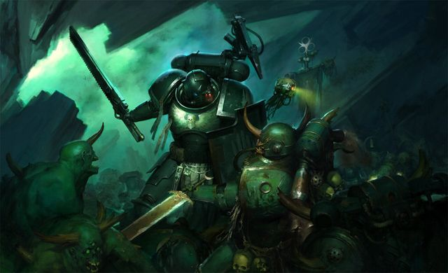

<!-- A0421-B0066 -->

原译文

The Iron Hands battle the Death Guard 钢铁之手与死亡守卫战斗

**校订译文**

The Iron Hands battle the Death Guard 钢铁之手与死亡守卫战斗

<!-- /A0421-B0066 -->

<!-- A0421-B0067 -->
**英文原文**

The "Tempering" conclave further determined the Human race itself – in all contemptible emotion – was to blame for the Heresy, and must be purged of flaws. So it was that the Iron Hands determined their guiding mission. They would exact payment for the wrongs done to them, but with a measured ruthlessness. In their every thought and deed, they would seek out weakness and destroy it, replacing it with machine-like fortitude. Thus began a bloody campaign that continues to this day, fought by the Iron Hands and those amongst their successors shaped by these teachings. Meanwhile, the Mechanicum devised a scheme to edit a pre-Imperial document in order to better manipulate the Iron Hands to their will. This document became known as the Canticle of Travels.

<!-- /A0421-B0067 -->

<!-- A0421-B0068 -->

原译文

“回火”会议进一步确定，人类本身 — 在所有可鄙的情绪中 — 是叛乱的罪魁祸首，必须清除其缺陷。因此，钢铁之手决定了他们的指导任务。他们会为对他们所犯的错误索取赔偿，但会表现出适度的无情。在他们的每一个思想和行为中，他们都会寻找弱点并摧毁它，用机械般的坚韧取而代之。由此开始了一场血腥的战役，这场战役一直持续到今天，由钢铁之手及其子战团中受这些教义影响的人进行。与此同时，机械教设计了一个方案来编辑帝国之前的文件，以便更好地按照他们的意愿操纵钢铁之手。这份文件被称为“旅行颂歌”。

**校订译文**

“回火”会议进一步认定，是人类自身那些可鄙的情感导致了叛乱，因此必须清除缺陷。钢铁之手由此确立使命：以冷静而有分寸的残酷，为自己所受的伤害追索代价；在每个念头、每项行动中搜寻并摧毁软弱，以机械般的坚韧取而代之。战团及受其教导影响的后裔由此开始了一场延续至今的血腥战争。与此同时，机械教筹划篡改一份帝国建立前的文献，以便更好地操纵钢铁之手。这份文献后来便称为《旅行颂歌》。

**校注：** Mechanicum 按源形机械教；edit document 在操纵背景下为篡改文献，不是中性的编辑作业。

<!-- /A0421-B0068 -->

<!-- A0421-B0069 -->
### Major Battles and Campaigns 主要战斗和战役

<!-- /A0421-B0069 -->

<!-- A0421-B0070 -->
**英文原文**

c.M35: Moirae Schism — A civil conflict which occurred during the Nova Terra Interregnum. During this schism, which affected all branches of the Adeptus Mechanicus and those Imperial factions closely tied to it, the Iron Hands chapter stood at the brink of destroying itself in an internal chapter war. The crisis came to a head when Moirae elements of Clan Dorrvok attempted to seize Chapter Gene-Seed and impose adherence to their creed at a genetic level. In the end, they were stopped by Clan Raukaan. Ultimately the Great Clan Council of the Iron Hands were able to settle the matter by exiling the Moirae dissidents from the chapter, with both sides swearing never to take up arms against each other. Almost a full third of the chapter split away to become a fleet based divergent branch of the Iron Hands. This branch became known as the Sons of Medusa.

<!-- /A0421-B0070 -->

<!-- A0421-B0071 -->

原译文

摩伊赖分裂 — 新泰拉空位期发生的一场内战。在这场影响机械神教所有分支和与之密切相关的帝国派系的分裂中，钢铁之手战团处于战团内部战争中自我毁灭的边缘。当多弗克氏族的摩伊赖分子试图夺取战团基因种子并在基因层面上坚持他们的信仰时，危机达到了顶峰。最后，他们被劳坎氏族拦住了。最终，钢铁之手大氏族议会通过将摩伊赖不同政见者从战团中驱逐来解决这个问题，双方都发誓永远不会拿起武器对抗对方。战团几乎有三分之一被拆分，成为钢铁之手的一个以舰基为子战团。这个分支被称为美杜莎之子。

**校订译文**

约M35：摩伊赖分裂——新泰拉空位期的一场内乱，波及机械修会各分支及与之密切相关的帝国势力。钢铁之手也濒临自相残杀、毁灭战团的边缘。多弗克氏族中的摩伊赖派试图夺取基因种子，以基因改造强制灌输教义，使危机达到顶点；劳坎氏族最终阻止了他们。大氏族议会决定将异议者逐出战团，双方则宣誓永不兵戎相见。几乎三分之一的成员离开，形成以舰队为基地的独立分支，后来称为美杜莎之子。

**校注：** impose adherence at a genetic level 指借基因手段强迫追随教义，不是异议者本人在基因层面坚持信仰。

<!-- /A0421-B0071 -->

<!-- A0421-B0072 -->
**英文原文**

412.M41: Defence of Fabris Callivant — The Iron Hands defended the homeworld of their allies, House Callivant, from Ork forces.

<!-- /A0421-B0072 -->

<!-- A0421-B0073 -->

原译文

防御法布里斯·卡利万特 — 钢铁之手保卫了他们的盟友卡利万特家族的家园世界，使其免受欧克军队的攻击。

**校订译文**

412.M41：法布里斯·卡利万特防御战——钢铁之手保卫盟友卡利万特家族的母星，迎击兽人大军。

<!-- /A0421-B0073 -->

<!-- A0421-B0074 -->
**英文原文**

460.M41: Gaudinian Heresy — A third of the Iron Council is lost to a massive Daemonic corruption and in an ensuing ambush by the Emperor's Children.

<!-- /A0421-B0074 -->

<!-- A0421-B0075 -->

原译文

高迪尼安叛乱 - 钢铁议会的三分之一成员死于大规模的恶魔腐化，随后遭到帝皇之子的伏击。

**校订译文**

460.M41：高迪尼安异端事件——大规模恶魔腐蚀及随后帝皇之子的伏击，使钢铁议会失去三分之一成员。

<!-- /A0421-B0075 -->

<!-- A0421-B0076 -->
**英文原文**

812.M41: Purging of Contqual — The Iron Hands eliminated Chaos forces from twelve planets in the Contqual subsector. At the height of the battle Chief Librarian Telach sacrificed himself to stop Julius Kaesoron, former First Captain of the Emperor's Children, now a Daemon Prince of Slaanesh.

<!-- /A0421-B0076 -->

<!-- A0421-B0077 -->

原译文

净化康特奎尔 — 钢铁之手在康特奎尔分区的十二颗行星上消灭了混沌部队。在战斗最激烈的时候，首席智库特拉赫牺牲了自己，以阻止前帝皇之子的第一连长尤里乌斯·卡索隆，现在是色孽的恶魔王子。

**校订译文**

812.M41：康特奎尔净化行动——钢铁之手清除了康特奎尔次星区十二颗行星上的混沌部队。激战中，首席智库员特拉赫牺牲自己，阻止了尤利乌斯·凯索伦——昔日帝皇之子第一连长，如今的色孽恶魔王子。

<!-- /A0421-B0077 -->

<!-- A0421-B0078 -->
**英文原文**

863.M41: Saint Cyllia Massacres — The Iron Hands pursued the Adamant Fury Traitor Titan Legion following the massacre.

<!-- /A0421-B0078 -->

<!-- A0421-B0079 -->

原译文

圣赛利亚大屠杀 — 大屠杀发生后，钢铁之手追捕了坚毅怒火叛徒泰坦军团。

**校订译文**

863.M41：圣赛利亚大屠杀——事后，钢铁之手追击了叛变泰坦军团“坚毅怒火”。

<!-- /A0421-B0079 -->

<!-- A0421-B0080 -->
**英文原文**

c.M41: The False Saint — Elements of the Third Company lead the assault on the stronghold of the False Saint, the daemon-possessed body of Saint Drusus, on the storm-riddled dead world of Grangold in the Calixis Sector. Though wiped out in battle with the daemonic forces of Tzeentch, their actions allows elements of the Imperial Guard, led by agents of the Inquisition, to banish the False Saint and close the Warp portal the daemon was opening.

<!-- /A0421-B0080 -->

<!-- A0421-B0081 -->

原译文

伪圣 — 第三连队的成员在卡利西斯星区风暴肆虐的死亡世界格兰戈尔德，率先对伪圣的要塞发起突袭 —— 伪圣即是被恶魔附身的圣德鲁苏斯遗体。尽管在与色孽的恶魔部队的战斗中被消灭，但他们的行动允许由审判庭特工领导的帝国卫队成员驱逐伪圣，并关闭恶魔正在打开的亚空间门户。

**校订译文**

约M41：伪圣事件——在卡利西斯星区风暴肆虐的死寂世界格兰戈尔德，第三连部分兵力率先攻入伪圣的据点；所谓伪圣，便是被恶魔占据的圣德鲁苏斯遗体。他们虽然在对抗奸奇恶魔时全军覆没，却为审判庭特工带领的帝国卫队创造机会，最终放逐伪圣，关闭恶魔正在开启的亚空间门户。

**校注：** 原文明确为 Tzeentch 奸奇，原译误写色孽。

<!-- /A0421-B0081 -->

<!-- A0421-B0082 -->
**英文原文**

M42

<!-- /A0421-B0082 -->

<!-- A0421-B0083 -->
**英文原文**

Invasion of the Stygius Sector — In what becomes known as the Iron Crusade, the Iron Hands are joined by many successor chapters such as the Sons of Medusa, Fire Lords, Silver Skulls, Brazen Claws, and Iron Lords. They manage to hold Mordian from Chaos assault and are continuing to battle traitors throughout the Sector.

<!-- /A0421-B0083 -->

<!-- A0421-B0084 -->

原译文

入侵冥河星区 — 在后来被称为钢铁远征的行动中，许多子战团加入了钢铁之手，如美杜莎之子、火焰领主、银色骷髅、黄铜之爪和钢铁领主。他们设法将莫迪安从混沌的进攻中解救出来，并继续在整个星区与叛徒作战。

**校订译文**

冥河星区入侵——在后来称为钢铁远征的行动中，许多子战团加入钢铁之手，包括美杜莎之子、火焰领主、银色颅骨、黄铜之爪和钢铁领主。他们成功守住莫迪安，并继续在整个星区抗击叛军。

**校注：** 本段英文将所列各战团统称子战团，银色颅骨等的血脉另有不同记载；保留原文归类，不据记忆删除，待跨源核对。

<!-- /A0421-B0084 -->

<!-- A0421-B0085 -->
**英文原文**

Sabbyst Planetstrike — Clan Raukaan launches a reckless assault on Sabbyst seeking vengeance against Fulgrim. Ultimately Iron Captain Sind Grolvoch is killed by the Daemon Primarch while buying time for refugees to escape.

<!-- /A0421-B0085 -->

<!-- A0421-B0086 -->

原译文

萨比斯特行星打击 — 劳坎氏族对萨比斯特发起鲁莽的攻击，寻求对福格瑞姆的报复。最终，钢铁连长辛德·格罗尔沃奇被恶魔原体杀死，同时为难民争取时间逃跑。

**校订译文**

萨比斯特行星突袭——劳坎氏族为向福格瑞姆复仇，鲁莽地进攻萨比斯特。钢铁连长辛德·格罗尔沃奇最终在为难民争取撤离时间时，被恶魔原体杀死。

<!-- /A0421-B0086 -->

<!-- A0421-B0087 -->
**英文原文**

Medusa Raid — The Iron Hands homeworld of Medusa is raided by the Cleaved, The Purge and the 1st Plague Company of Typhus. The Iron Hands drive off the attack but not before terrible damage is done.

<!-- /A0421-B0087 -->

<!-- A0421-B0088 -->

原译文

美杜莎突袭 — 钢铁之手家园美杜莎被分裂者、净世疫军和泰丰斯的第一瘟疫连队突袭。钢铁之手在造成可怕伤害之前击退了攻击。

**校订译文**

美杜莎突袭——钢铁之手母星遭分裂者、净世疫军，以及泰弗斯麾下第一瘟疫连队突袭。战团最终击退进攻，但母星已遭严重破坏。

**校注：** not before terrible damage is done 指已遭严重破坏才击退敌军，原译先后关系颠倒。

<!-- /A0421-B0088 -->

<!-- A0421-B0089 -->

原译文

The Nachmund Rift War 纳克蒙德走廊战争

**校订译文**

The Nachmund Rift War 纳克蒙德裂隙战争

<!-- /A0421-B0089 -->

<!-- A0421-B0090 -->
**英文原文**

The Arks of Omen Campaign — Captain Albaar leads the boarding of the Ark of Omen Morbidius.

<!-- /A0421-B0090 -->

<!-- A0421-B0091 -->

原译文

噩兆方舟战役 — 阿尔巴尔连长领导跳帮噩兆方舟莫比迪厄斯号。

**校订译文**

噩兆方舟战役——阿尔巴尔连长率部登上噩兆方舟莫比迪厄斯号。

<!-- /A0421-B0091 -->

<!-- A0421-B0092 -->
## Beliefs and Reputation 信仰与声誉

<!-- /A0421-B0092 -->

<!-- A0421-B0093 -->
**英文原文**

The Iron Hands have a reputation for being relatively straightforward and incredibly harsh. In the Battle of Thranx for example the resources of several depleted Clan Companies were pooled for a full-frontal assault using five Land Raiders against a facility bristling with anti-tank defences that had made a mockery of previous attempts with whole armoured companies; in the retaking of the Contqual Subsector, one-third of the population was summarily executed after a successful campaign simply to demonstrate the price of weakness. They are also known to be on poor terms with the Raven Guard and after the liberation of the Kelldar System from an Ork Waaagh! in 810.M41 refused to sit at the same feasting table as their Raven Guard allies.

<!-- /A0421-B0093 -->

<!-- A0421-B0094 -->

原译文

钢铁之手以相对直率和令人难以置信的严厉而闻名。例如，在特兰克斯之战中，几个精疲力尽的氏族连队的资源被集中起来，使用五辆兰德掠袭者对一个布满反坦克防御的设施进行全面正面进攻，这是对之前整个装甲连连尝试的嘲弄；在重新夺回康特奎尔分区的过程中，三分之一的人在一场成功的战役后被即刻处决，仅仅是为了证明软弱的代价。众所周知，他们与暗鸦守卫关系不佳，在810.M41凯尔达尔星系从欧克的Waaagh！解放后拒绝与他们的暗鸦守卫盟友坐在同一张餐桌旁。

**校订译文**

钢铁之手以行事直接、手段极端严酷著称。在特兰克斯之战中，一座布满反坦克火力的设施曾击溃整支装甲连的进攻；他们却把数个受创氏族连的残余资源集中起来，仅凭五辆兰德掠袭者便发动全面正面突击。夺回康特奎尔次星区后，他们又当即处决三分之一人口，只为展示软弱的代价。战团与暗鸦守卫也关系恶劣：810.M41双方从兽人的Waaagh!中解放凯尔达尔星系后，钢铁之手甚至拒绝与这些盟友同桌赴宴。

**校注：** had made a mockery of 修饰敌方防御设施对先前进攻的挫败，不是五辆战车嘲弄先前参战者。

<!-- /A0421-B0094 -->

<!-- A0421-B0095 图片 -->
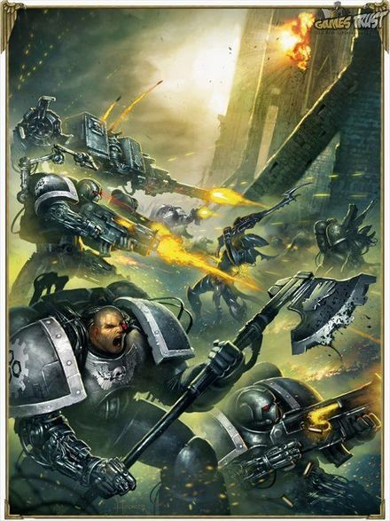

<!-- A0421-B0096 -->

原译文

Iron Hands Battling Dark Eldar 钢铁之手与黑暗灵族战斗

**校订译文**

Iron Hands Battling Dark Eldar 钢铁之手与黑暗灵族战斗

<!-- /A0421-B0096 -->

<!-- A0421-B0097 -->
### Bionics 仿生义体

原题：Bionics 仿生

<!-- /A0421-B0097 -->

<!-- A0421-B0098 -->
**英文原文**

The Iron Hands are infamous for their extensive use of bionics, which has helped bring them into a close relationship with the Adeptus Mechanicus. After the Horus Heresy, when the Legions were reorganized into Chapters, the Iron Hands became recluses, attempting to find ways to make themselves even stronger so that they would be fit for serving under Ferrus Manus again at the end of times. Many within the Chapter consider flesh to be a sign of weakness, and seek to expunge it from themselves through mechanical enhancement. To this end, they have made it a practice to make extensive use of bionic modifications, going so far that there are rumours of some battle brothers being wholly mechanical. Iron Hands consider the greatest honour they can receive is to be interred in Dreadnought armour. It is in the so-called Blessing of Iron ritual that the Iron Hands replace parts of their bodies with Bionics.

<!-- /A0421-B0098 -->

<!-- A0421-B0099 -->

原译文

钢铁之手因广泛使用仿生而著名，这有助于他们与机械神教建立密切的关系。在荷鲁斯叛乱之后，当军团被重组为战团时，钢铁之手成为了隐士，试图找到让自己变得更强大的方法，这样他们就可以在终焉之时再次在费鲁斯·马努斯手下服役。战团中的许多人认为肉体是软弱的象征，并试图通过机械强化将其从自己身上抹去。为此，他们已经将广泛使用仿生修改作为一种做法，到目前为止，有传言称一些战斗兄弟完全是机械的。钢铁之手认为，他们能得到的最大荣誉就是葬入无畏装甲。在所谓的钢铁祝福仪式中，钢铁之手用仿生取代了身体的一部分。

**校订译文**

钢铁之手因大规模使用仿生义体而闻名，也因此与机械修会紧密往来。荷鲁斯之乱后，军团改编为战团，他们逐渐闭门自守，寻找让自己更强大的方法，希望终焉之时配得上再次追随费鲁斯。许多人把血肉视为软弱的象征，试图通过机械强化将其剔除。他们广泛接受义体改造，甚至有传言称部分战斗兄弟已完全机械化。战团认为，能够封存于无畏机甲之中，是至高荣誉。他们替换肢体的仪式称为“钢铁祝福”。

<!-- /A0421-B0099 -->

<!-- A0421-B0100 -->
**英文原文**

The Iron Hands also eschew the traditional office of Chaplain in favour of their Iron Fathers, specially trained Techmarines who serve to protect the faith of their brethren; some outsiders view this, as well as the Iron Hands' ties to the Adeptus Mechanicus, as an unhealthy relationship.

<!-- /A0421-B0100 -->

<!-- A0421-B0101 -->

原译文

钢铁之手也避开了传统的牧师职位，转而支持他们的铁父，受过专门训练的技术军士，他们致力于保护兄弟的信仰；一些局外人认为，这以及钢铁之手与机械神教的关系是一种不健康的关系。

**校订译文**

钢铁之手不采用传统的教士职制，而由钢铁圣父承担相关职责。这些接受特殊训练的科技战士负责守护兄弟们的信仰。一些外人认为，这种做法及其与机械修会的密切联系，都反映出一种不健康的依附关系。

<!-- /A0421-B0101 -->

<!-- A0421-B0102 图片 -->
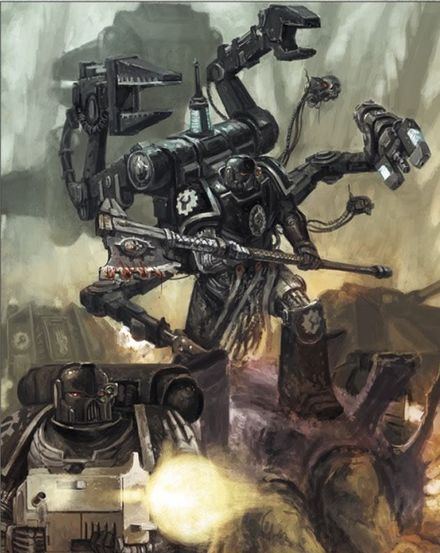

<!-- A0421-B0103 -->

原译文

An Iron Hands Techmarine leads their forces in battle 钢铁之手技术军士在战斗中领导部队

**校订译文**

An Iron Hands Techmarine leads their forces in battle 钢铁之手科技战士率军作战

<!-- /A0421-B0103 -->

<!-- A0421-B0104 -->
### Forgechain 熔炉之链

<!-- /A0421-B0104 -->

<!-- A0421-B0105 -->
**英文原文**

While many Iron Hands use skull-studs to denote long service in the same manner as other Chapters, in recent years some have begun using a strange augmetic known as the Forgechain. The Forgechain is a series of augmetic vertebrae. Each new vertebrae shows acceptance into a another Clan. Each company makes its own links so all links in the chain are different. Clan Dorrvok for example uses plain steel to form the first vertebrae for each of their new Scouts. Clan Sorrgol's is formed from a finely tooled galvanite alloy. Clan Raukaan is black Sigilanium veined with Theldrite circuitry. The chain serves as a reminder to the wearer of the bonds that bind the chapter together. Some believe it is to echo the chains that Ferrus bound around the Iron Hands' hearts.

<!-- /A0421-B0105 -->

<!-- A0421-B0106 -->

原译文

虽然许多钢铁之手像其他战团一样使用头骨钉来表示服役时长，但近年来，一些人开始使用一种奇怪的义体，称为熔炉之链。熔炉之链是一系列义体椎骨。每一块新椎骨都表明被另一个氏族接纳。每家连队都有自己的链接，所以链中的所有链接都是不同的。例如，多弗克氏族使用普通钢为他们的每个新侦察兵形成第一块椎骨。索古罗氏族的由精心加工的镀锌合金制成。劳坎氏族是黑色的印记，上面有月银回路。这条链提醒佩戴者将这一战团联系在一起的纽带。有人认为，这是为了呼应费鲁斯在钢铁之手心中所系的枷锁。

**校订译文**

许多钢铁之手与其他战团一样，以颅钉标示资历；但近年也有人开始使用一种奇特义体，称为“熔炉之链”。它由一系列人工椎骨组成，每增加一节，便表示佩戴者获另一个氏族接纳。各连分别制作自己的链节，因此每节都不同。例如，多弗克氏族用普通钢为新侦察兵制作第一节；索古罗氏族采用精工雕制的加尔瓦奈特合金；劳坎氏族则用黑色西吉兰尼姆，其间嵌有塞尔德赖特电路。链条时刻提醒佩戴者，是什么纽带把战团联结在一起。也有人认为，它象征费鲁斯系于钢铁之手心中的锁链。

**校注：** galvanite、Sigilanium、Theldrite 为材料专名，未查得官方中译，暂用音译；原译镀锌合金、印记、月银缺乏英文对应依据。

<!-- /A0421-B0106 -->

<!-- A0421-B0107 -->
### Possible Tech-Heresy 可能的技术异端

<!-- /A0421-B0107 -->

<!-- A0421-B0108 -->
**英文原文**

Adeptus Mechanicus Mech-wright Calymn Auros reported possible Iron Hands tech-heresy that he had found in the Jericho Reach. Calymn Auros wrote he had witnessed "terrifying biomechanical behemoths fusing man and machine into living weapons" that fought alongside the Iron Hands against the Stigmartus hordes in the Acheros Salient and sported their heraldry on their hulls. He claimed to have examined the burnt-out wreckage of another of these weapon-studded behemoths and he was convinced it was "animated by the essence of an Iron Hands Battle-Brother who had entirely shed every cell of his biological heritage, little more than pure hate and rage remaining to drive him ever onwards". Auros also claimed to have shared his findings with Inquisitor Calistair. Archmagos Zynth received the report but his reaction consisted only in ordering to send out mono-task servitors and a Secutor to the Cellebos Warzone and retrieve Calymn for adjustment as he believed him corrupted.

<!-- /A0421-B0108 -->

<!-- A0421-B0109 -->

原译文

机械神教机械工匠卡利姆·奥罗斯报告称，他在杰里科河段发现了可能的钢铁之手技术异端。卡利姆·奥罗斯写道，他目睹了“可怕的生物机械巨兽将人和机械融合成活生生的武器”，这些巨兽与钢铁之手并肩作战，对抗阿彻罗斯突出部的圣痕军部落，并在船体上展示了他们的纹章。他声称已经检查了另一个这些布满武器的庞然大物的烧毁残骸，他确信这是“钢铁之手战斗兄弟的本质所激发的，他完全抛弃了自己生物传统的每一个细胞，只剩下纯粹的仇恨和愤怒驱使他继续前进”。奥罗斯还声称与审判官卡莉斯塔分享了他的调查结果。大贤者津斯收到了报告，但他的反应只是下令向赛勒伯斯战区派遣单任务机仆和一名追击士，并回收卡利姆进行调整，因为他认为卡利姆已经腐化。

**校订译文**

机械修会工匠卡利姆·奥罗斯曾报告，他在杰里科疆域发现了钢铁之手可能涉足技术异端的迹象。他称，在阿彻罗斯突出部对抗圣痕军大军时，看见了“将人与机械融为活体武器的可怕生物机械巨兽”，其外壳还绘有钢铁之手纹章。他检查过另一头满载武器的巨兽残骸，确信其中“驱动它的是一名钢铁之手战斗兄弟的本质：此人已舍弃一切生物细胞，几乎只剩纯粹的仇恨与怒火，推动他永不停步”。奥罗斯还声称已把发现告知审判官卡莉斯塔。大贤者津斯收到报告后，却只下令派单任务机仆与一名追击士前往赛勒伯斯战区，把卡利姆带回进行调整，因为他认定卡利姆已受腐化。

**校注：** 保留见闻报告中的疑似与声称；未据该段确认钢铁之手整体实施技术异端。Jericho Reach 按核心定译杰里科疆域。

<!-- /A0421-B0109 -->

<!-- A0421-B0110 -->
### Strategy and Tactics 战略与战术

<!-- /A0421-B0110 -->

<!-- A0421-B0111 -->
**英文原文**

Between battles or on their warships while in the Warp, Iron Hands often spend time uploaded to cryo-pods, inloading tactical schematics and information. This aids the over-arching strategic hexamathic formulae that they deploy while on campaign known as the Calculus of Battle. This system seeks to break down wars to raw data and numbers, where enemy actions, logistics, casualties, and environmental elements can be predicted and balanced like an equation. Once a conclusion has been reached, the Iron Hands' nihilistic brutality translates well to war. When they attack, they do so without hesitation or mercy and will show little regard to the well-being of allies, as the Calculus of Battle has no factorial representation for civilian. Similarly, the Calculum Rationale gauges the necessary resources for any engagement and whether or not commitment to it is worthwhile.

<!-- /A0421-B0111 -->

<!-- A0421-B0112 -->

原译文

在战斗之间或在亚空间的战舰上，钢铁之手经常花时间上传到冷冻舱，上传战术示意图和信息。这有助于他们在战役中部署的总体战略六元方案，即战争筹算。该系统旨在将战争分解为原始数据和数字，可以像方程式一样预测和平衡敌人的行动、后勤、伤亡和环境因素。一旦得出结论，钢铁之手的虚无主义残暴很好地转化为战争。当他们发动攻击时，他们会毫不犹豫或毫不留情地这样做，并且几乎不会考虑盟友的安全，且战争筹算对平民没有因子表示。同样，理性计算会评估任何一场战役所需的必要资源，并判断投入此战是否具有价值。

**校订译文**

战斗间歇，或战舰穿越亚空间时，钢铁之手常进入冷冻舱，载入战术图式与资料。这服务于他们称为“战争筹算”的总体战略六元公式体系：将战争拆解成原始数据，使敌军行动、后勤、伤亡和环境因素都能像方程一样被预测、权衡。一旦得出结论，他们虚无而冷酷的作风便会付诸行动。进攻时，他们毫不迟疑，也毫不留情，极少顾及盟友安危；平民根本不在战争筹算的变量之中。另一套“理性计算”则评估每次交战所需的资源，以及是否值得投入。

**校注：** inloading 为将战术信息载入自身，不是向外上传；cryo-pods 为战士进入的冷冻舱。

<!-- /A0421-B0112 -->

<!-- A0421-B0113 -->
**英文原文**

This ruthlessness extends even their own Battle-Brothers, who will be coldly sacrificed to achieve an objective should it be necessary to achieve a victory of worth greater than the cost expended. This does not deter warriors of the Iron Hands however. Iron Hands fear no death and view injury in battle as something that should be sought after instead of shunned.

<!-- /A0421-B0113 -->

<!-- A0421-B0114 -->

原译文

这种无情甚至延伸到了他们自己的战斗兄弟身上，如果有必要取得比花费的成本更大的胜利，他们将为实现目标而冷酷地牺牲。然而，这并没有阻止钢铁之手的战士。钢铁之手不怕死，认为战斗中的受伤是应该追求而不是回避的。

**校订译文**

这种冷酷也用于自己人。只要胜利的价值高于付出的代价，他们便会毫不动摇地牺牲战斗兄弟，以达成目标。但这不会动摇钢铁之手战士的决心：他们不惧死亡，甚至认为战伤应当主动追求，而非躲避。

<!-- /A0421-B0114 -->

<!-- A0421-B0115 -->
**英文原文**

The Iron Hands rarely commit to a campaign unless overwhelming victory is all but guaranteed. To that end, they employ Adeptus Mechanicus Tech-Priests known as the Magi Calculi whose job it is to analyse data and ascribe to it strategic worth and likelihood of victory. However, the Iron Council can overrule the decisions of the Magi Calculi, as seen when Kardan Stronos disregarded their conclusions and joined Roboute Guilliman's Indomitus Crusade anyway.

<!-- /A0421-B0115 -->

<!-- A0421-B0116 -->

原译文

钢铁之手很少承诺战役，除非压倒性的胜利几乎可以保证。为此，他们使用了被称为演算士的机械神教技术神甫，他们的工作是分析数据，并赋予其战略价值和胜利的可能性。然而，钢铁议会可以推翻演算士的决定，正如卡丹·斯特罗诺斯无视他们的结论并加入罗伯特·基里曼的不屈远征一样。

**校订译文**

除非几乎确定能获得压倒性胜利，钢铁之手很少投入一场战役。他们因此借助机械修会的“演算贤者”——专门分析数据、评估战略价值与胜算的技术祭司。不过，钢铁议会有权推翻这些专家的结论。卡丹·斯特罗诺斯就曾无视评估结果，照样加入罗保特·基里曼的不屈远征。

<!-- /A0421-B0116 -->

<!-- A0421-B0117 -->
## Gene-seed 基因种子

<!-- /A0421-B0117 -->

<!-- A0421-B0118 -->
**英文原文**

The Iron Hands exhibit no physical flaws that can be traced back to their gene-seed, but it is possible that their extreme contempt for weakness in themselves and others may actually be due to an unidentified psychological flaw carried by their gene-seed. Being Space Marines, the Iron Hands already have superior physiology, and the bionics which they embrace do little to improve on it. Thus, the Iron Hands may suffer from body dysmorphia.

<!-- /A0421-B0118 -->

<!-- A0421-B0119 -->

原译文

钢铁之手没有任何可以追溯到他们基因种子的身体缺陷，但他们对自己和他人弱点的极端蔑视可能实际上是由于他们基因种子携带的一种未知的心理缺陷。作为星际战士，钢铁之手已经有了优越的生理，他们所采用的仿生对其几乎没有改善。因此，钢铁之手可能患有身体畸形。

**校订译文**

钢铁之手没有已知可归因于基因种子的生理缺陷；但他们极度鄙视自己和他人的软弱，可能源于尚未识别的遗传性心理缺陷。身为星际战士，他们本已拥有优越的生理机能，义体改造带来的额外改善其实有限。因此，他们可能存在躯体变形障碍，对自身形体抱有失真的负面认知。

**校注：** body dysmorphia 指对自身形体的失真认知或相关心理问题，原译身体畸形错误地写成生理缺陷；保留原文可能性。

<!-- /A0421-B0119 -->

<!-- A0421-B0120 -->
**英文原文**

The ritual of taking in the Gene-Seed of the Iron Hands is known as the Taking of the Soulsteel. During the ritual, Neophytes purge themselves of fear, pain, and anger and repress mortal weakness with mantras of cold logic.

<!-- /A0421-B0120 -->

<!-- A0421-B0121 -->

原译文

取钢铁之手基因种子的仪式被称为取魂钢。在仪式中，新进者用冷酷的逻辑咒语清除自己的恐惧、痛苦和愤怒，压制致命的弱点。

**校订译文**

接受钢铁之手基因种子的仪式称为“取魂钢”。新进者在仪式中诵念冷酷逻辑的箴言，驱除恐惧、痛苦与愤怒，压抑凡人的软弱。

**校注：** mortal weakness 指凡人的软弱，非致命弱点。

<!-- /A0421-B0121 -->

<!-- A0421-B0122 -->
## Organization 组织

<!-- /A0421-B0122 -->

<!-- A0421-B0123 -->
### Pre-Heresy 叛乱前

<!-- /A0421-B0123 -->

<!-- A0421-B0124 -->
**英文原文**

Under the leadership of Ferrus Manus, the Iron Hands were a highly structured military force with numerous tactical and strategic divisions of power. It was deliberately composed of a series of interlocking components, each of with had its own specializations, duties, and chain of commands. While the lowest levels of the Legion consisted of standard squads and vehicle squadrons grouped into companies, these part of a larger grouping of support and fleet elements dubbed Orders. Each Order had its own independent command, support and logistical network, armoury, and were often created specifically for a specific campaign or battle. While broadly equivalent to the specialized battalions seen in other Legions, the Orders were more concrete in composition and independent in operation. Multiple orders were then formed into a single larger Clan groupings based upon the feudal traditions of Medusa. While today the Iron Hands consist of ten clans, during the Great Crusade and Heresy era many more existed.

<!-- /A0421-B0124 -->

<!-- A0421-B0125 -->

原译文

在费鲁斯·马努斯的领导下，钢铁之手是一支高度结构化的军事力量，拥有众多战术和战略力量部门。它故意由一系列相互关联的组件组成，每个组件都有自己的专业、职责和指挥链。虽然军团的最低级别由标准小队和载具中队组成，这些中队分为连队，但这些是被称为修会的更大的支援和舰队部分的一部分。每个修会都有自己独立的指挥、支援和后勤网络、军械库，通常是专门为特定的战役或战斗而创建的。虽然与其他军团中的特种营大致相当，但这些修会的组成更加具体，行动更加独立。然后，根据美杜莎的封建传统，多个修会组成了一个更大的氏族团体。虽然今天钢铁之手由十个氏族组成，但在大远征和叛乱时代，存在着更多的氏族。

**校订译文**

费鲁斯统领下的钢铁之手是一支组织严密的军队，战术与战略权限分设于多层机构。各部分相互衔接，又分别具有自身专长、职责和指挥链。最基础的小队与载具中队组成连队，再与支援、舰队单位编成更大的“修会”。每个修会都拥有独立的指挥体系、支援后勤网络及军械库，往往为特定战役专门组建。其规模大致相当于其他军团的专门化营级单位，但成员构成更固定，行动更独立。多个修会再按美杜莎的封建传统组成氏族。如今战团只有十个氏族，大远征与叛乱时期则远不止此数。

**校注：** Order 此处沿用修会作为军团军事编制名，其规模近似营；不理解为独立宗教机构。

<!-- /A0421-B0125 -->

<!-- A0421-B0126 图片 -->
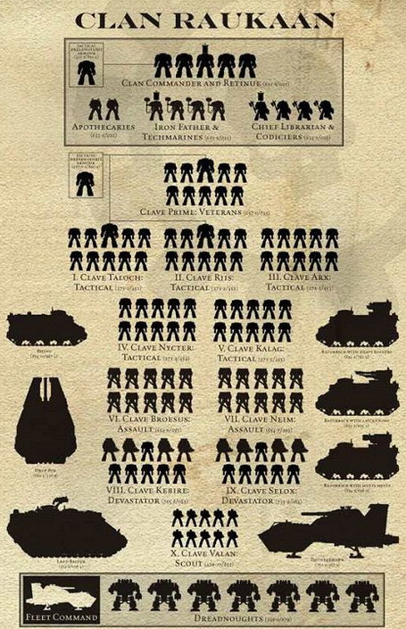

<!-- A0421-B0127 -->

原译文

Organization of a typical modern-day Iron Hands Clan 平常现代钢铁之手氏族的组织

**校订译文**

Organization of a typical modern-day Iron Hands Clan 当代钢铁之手氏族的典型组织结构

<!-- /A0421-B0127 -->

<!-- A0421-B0128 -->
**英文原文**

As with the Iron Hands Chapter of today, each Legion Clan had a distinct character and were linked to specific equivalents amongst Medusa's nomadic barbarian population which served as their recruitment base. These Clans were referred to as "pocket legions" and were fully self-sufficient, self-supplied, and overseen by a Chieftain in the form of a Praetor equivalent be it Iron Father, Clan-Commander, Iron Lord, etc.. Each Clan vied against one another for glory and the favour of their Primarch. Individual warriors who failed their Clan and Primarch would be cast out to die as an Immortal.

<!-- /A0421-B0128 -->

<!-- A0421-B0129 -->

原译文

与今天的钢铁之手战团一样，每个军团氏族都有自己独特的特点，并与美杜莎游牧野蛮人口中的特定对等群体联系在一起，这些游牧野蛮人口是他们的招募基地。这些氏族被称为“口袋军团”，完全自立，自给自足，由一位相当于执政官的酋长监督，无论是铁父、氏族指挥官、钢铁领主等。每个氏族都为荣耀和原体的青睐而相互竞争。未能通过氏族和原体的个别战士将被驱逐，以不朽者的身份死去。

**校订译文**

与后来的战团一样，军团时期各氏族也有鲜明个性，并与美杜莎的特定游牧蛮族建立对应关系，从中征兵。这些氏族被称为“口袋军团”，能够完全自给自足。其首领地位相当于执政官，但可能采用钢铁圣父、氏族指挥官或钢铁领主等不同称号。各氏族彼此竞争，争取荣耀与原体青睐。辜负氏族及原体的战士则会遭逐，转入不朽者部队，等待战死。

**校注：** failed their Clan and Primarch 指辜负氏族和原体，不是未通过某项考试。

<!-- /A0421-B0129 -->

<!-- A0421-B0130 -->
**英文原文**

While the Heresy-era Iron Hands organization was known as a crushing leviathan, it was also brutally intractable and slow to change. Individual commanders, while highly independent, were also single-minded in their pursuit of strategic objectives and a desire to please their Clan and Primarch. This came to head after the Drop Site Massacre and the death of Ferrus Manus, where the remaining survivors of the Legion were consumed by a quest for vengeance against the traitors that became a bitter psychosis.

<!-- /A0421-B0130 -->

<!-- A0421-B0131 -->

原译文

虽然叛乱时期的钢铁之手组织被称为一个毁灭性的庞然大物，但它也极其棘手，变化缓慢。个别指挥官虽然高度独立，但也一心一意地追求战略目标，并渴望取悦他们的氏族和原体。在登陆点大屠杀和费鲁斯·马努斯牺牲后，这一点变得尤为突出，在那里，军团剩下的幸存者被对叛徒的复仇所吞噬，这成为了一种痛苦的精神错乱。

**校订译文**

叛乱时期的钢铁之手虽如一头能碾碎敌人的巨兽，却也僵硬顽固、难以变通。各指挥官拥有高度独立性，同时又执着于战略目标及赢得氏族、原体的认可。登陆点大屠杀与费鲁斯之死将这一倾向推至极端：幸存者被复仇欲吞没，最终演变成痛苦的精神执念。

<!-- /A0421-B0131 -->

<!-- A0421-B0132 -->
**英文原文**

The Iron Hands Legion maintained a particularly large and sophisticated arsenal of war engines - especially tanks and Dreadnoughts. Their numbers of such vehicles was greater than any other Legion save perhaps the Iron Warriors. Thanks to their long-standing ties to the Mechanicum and technical aptitude of its own members, the Legion was easily able to maintain this vast arsenal as well as a large number of advanced Terminator suits. It also had access numerous bionic and cybernetic implants rarely seen outside of the ranks of the Machine Cult. The most arcane and destructive technologies at the Legion's disposal were sealed away at the order of Ferrus, most infamously the Vaults of Mimir.

<!-- /A0421-B0132 -->

<!-- A0421-B0133 -->

原译文

钢铁之手军团拥有一个特别庞大和复杂的战争引擎库，尤其是坦克和无畏。他们的这种载具的数量比任何其他军团都多，也许除了钢铁勇士。由于他们与机械教的长期联系和自身成员的技术才能，军团很容易就能维持这个庞大的武器库以及大量先进的终结者盔甲。它还可以使用许多在机械教派之外很少见到的仿生和智控植入物。军团掌握的最神秘和最具破坏性的技术被费鲁斯下令封存，其中最著名的是密米尔秘库。

**校订译文**

钢铁之手拥有极为庞大而先进的战争机械储备，尤其是坦克与无畏机甲。除钢铁勇士或许能匹敌外，其他军团都不及其数量。凭借与机械教的长期联系及成员的技术才能，他们能够维护这些装备，以及大量先进终结者护甲。他们还能取得通常只在机械教派内部使用的仿生义体与机械植入物。不过，最隐秘、最具破坏性的技术被费鲁斯下令封存，最著名的便是密米尔秘库。

**校注：** cybernetic implants 为机械化或控制义体植入，不能据此统称智控装置。

<!-- /A0421-B0133 -->

<!-- A0421-B0134 -->
### Post-Heresy 叛乱后

<!-- /A0421-B0134 -->

<!-- A0421-B0135 -->
**英文原文**

Today the Iron Hands are organised in a similar fashion to a Codex Chapter but with several distinct differences: The Chapter still consists of ten "Clan Companies" based on the Clans of Medusa which are composed in a fashion comparable to that of a Codex Battle Company. Each Clan Company is an independent entity, responsible for its own recruitment and equipment acquisition. Each Clan also possesses a colossal mobile fortress, a Land Behemoth.

<!-- /A0421-B0135 -->

<!-- A0421-B0136 -->

原译文

今天，钢铁之手的组织方式与圣典战团相似，但有几个明显的不同：战团仍然由十个基于美杜莎氏族的“氏族连队”组成，其组成方式与圣典战斗连队相当。每个氏族连队都是一个独立的实体，负责自己的招募和装备采购。每个氏族还拥有一个巨大的移动堡垒，一个陆地巨兽。

**校订译文**

如今钢铁之手大体按圣典战团组织，但有几处明显差异。他们仍由以美杜莎氏族为基础的十个“氏族连队”构成，每连编制近似圣典战斗连。各连独立负责征兵与装备获取，并各自拥有一座称为“陆地巨兽”的巨型移动要塞。

<!-- /A0421-B0136 -->

<!-- A0421-B0137 -->
### The Great Clan Council 大氏族议会

<!-- /A0421-B0137 -->

<!-- A0421-B0138 -->
**英文原文**

Each Clan Company chooses a member to serve in the ruling body of the Chapter, the Great Clan Council (also called the Iron Council). The organizational structure of the Iron Hands changed after the Horus Heresy and the death of Ferrus Manus; it was decided that no single warrior should be the leader of the Iron Hands. Instead, the Clan Captains and most revered warriors of the Legion formed the Iron Council. Those who sit on the Council are known as Iron Fathers, and the body has guided the Iron Hands ever since. Due to the reverence for the mechanical amongst Iron Hands, the council members are often Venerable Dreadnoughts. Precisely forty-one Iron Fathers sit on the Iron Council.

<!-- /A0421-B0138 -->

<!-- A0421-B0139 -->

原译文

每个氏族连队都会选择一名成员在战团的统治机构——大氏族议会（也称为钢铁议会）任职。荷鲁斯叛乱和费鲁斯·马努斯去世后，钢铁之手的组织结构发生了变化；决定不让任何一个战士成为钢铁之手的领袖。相反，氏族连长和最受尊敬的军团战士组成了钢铁议会。那些坐在议会里的人被称为铁父，从那以后，议会一直在指导钢铁之手。由于钢铁之手对机械的敬畏，议会成员往往是神圣无畏。确切地说，有41位铁父在钢铁议会任职。

**校订译文**

每个氏族连队都会选派成员，进入战团的统治机构——大氏族议会，又称钢铁议会。费鲁斯死后，战团决定不再由一名战士独掌大权，而让氏族连长及最受尊崇的战士共同治理。议员称为钢铁圣父，议会自此引导战团前行。钢铁之手尊崇机械，因此不少议员是神圣无畏机甲中的老兵。议会共有四十一位钢铁圣父。

**校注：** 本段把 Iron Father 作为议会成员称号，前文则称其为特殊训练的科技战士；两种定义按各段保留，待第424专篇进一步说明。

<!-- /A0421-B0139 -->

<!-- A0421-B0140 -->
**英文原文**

The Iron Council elects the Chapter Master of the Iron Hands, as unlike in most other Chapters the holder does not bear the title for life.

<!-- /A0421-B0140 -->

<!-- A0421-B0141 -->

原译文

钢铁议会选举钢铁之手的战团长，因为与大多数其他战团不同，持有者不会终身拥有这个头衔。

**校订译文**

钢铁之手的战团长由钢铁议会选举产生，任期并非像多数战团那样延续终身。

<!-- /A0421-B0141 -->

<!-- A0421-B0142 -->
### Clan Companies 氏族连队

<!-- /A0421-B0142 -->

<!-- A0421-B0143 -->
**英文原文**

The bulk of the Chapter is divided into ten Clan Companies. The Clan Companies are based off of the historic Clans of Medusa, which are in a state of constant war with one another as well as the harsh elements of their world. Though Ferrus Manus long ago united Medusa under his rule, the Iron Hands make no effort to end the fighting between the clans. They view the constant warfare as weeding out the weak and shaping strong recruits for the Chapter. Each of the ten current Clan Companies continues to utilize the symbols and traditions associated with their corresponding Clan on Medusa. As should be of little surprise, the Iron Hands have a reputation for aloofness among the people of Medusa. Indeed, they wish to forget the fragile, contemptible flesh that once they were. This has never been more true than with the energies of the Great Rift blazing down. Deliberate contact between the Chapter and the clans who supply its recruits are few and fleeting outside of tithing season. Even when Dark Eldar raiders make planetfall in search of slaves, the Chapter seldom intervenes, reasoning that the attacks will serve to temper the Medusans to greatness.

<!-- /A0421-B0143 -->

<!-- A0421-B0144 -->

原译文

战团的大部分成员分为十个氏族连队。氏族连队以历史悠久的美杜莎氏族为基础，这些氏族之间以及他们世界中的残酷成员都处于不断的战争状态。尽管费鲁斯·马努斯很久以前就将美杜莎统一在他的统治之下，但钢铁之手并没有努力结束氏族之间的战斗。他们认为不断的战争是为了淘汰弱者，为战团培养强大的新兵。目前的十个氏族连队中的每一个都继续使用与美杜莎相应氏族相关的符号和传统。毫不奇怪，钢铁之手在美杜莎人民中以冷漠著称。事实上，他们希望忘记曾经脆弱、可鄙的肉体。随着大裂隙的能量熊熊燃烧，这一点从未如此真实。在什一税时期之外，战团与提供新兵的氏族之间的刻意接触很少，而且转瞬即逝。即使黑暗灵族袭击者降落行星寻找奴隶，战团也很少介入，理由是这些袭击将有助于将美杜莎人磨练成伟大的人物。

**校订译文**

战团主体分为十个氏族连队，分别对应美杜莎历史悠久的氏族。这些氏族既彼此交战，也不断与母星残酷的自然环境搏斗。本段记载称，费鲁斯早已将美杜莎置于自己统治之下；但钢铁之手仍不试图终止氏族战争，因为他们认为战争能淘汰弱者，培养强壮的新兵。各连沿用对应氏族的徽记与传统，却在母星居民眼中十分冷漠。他们想忘记自己曾经脆弱可鄙的血肉之躯，大裂隙能量映照之下，这种倾向更为强烈。除征兵什一税时节外，战团极少主动接触氏族，接触也十分短暂。即使黑暗灵族登陆掳掠奴隶，他们也往往不介入，认为这种袭击能把美杜莎人磨炼得更强。

**校注：** 本段称费鲁斯已统一美杜莎，前文B0045称从未统一；英文自相矛盾，分别保留并提示。elements 指自然环境，不是残酷成员。

<!-- /A0421-B0144 -->

<!-- A0421-B0145 图片 -->
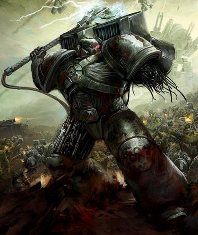

<!-- A0421-B0146 -->

原译文

An Iron Hand battling Orks 钢铁之手与欧克作战

**校订译文**

An Iron Hand battling Orks 钢铁之手与欧克作战

<!-- /A0421-B0146 -->

<!-- A0421-B0147 -->
**英文原文**

Each Clan is a self-contained unit not dissimilar to a Codex Astartes Battle Company; however, each Clan is responsible for its own recruiting and maintenance of its motorpool. Each Clan, in addition, possesses a mobile Land Behemoth fortress monastery on Medusa which they consider their base of operations. Some materials is traded between the Clans, but still they are often in open competition with one another. They are known to compete politically and even sometimes come to blows. The Clan system developed as a reaction to the Drop Site Massacre during the Horus Heresy when large numbers of Iron Hands Captains were slain, creating confusion among the collective Iron Hands ranks. The Chapter's fleet disposition is unknown.

<!-- /A0421-B0147 -->

<!-- A0421-B0148 -->

原译文

每个氏族都是一个自给自足的单位，与圣典阿斯塔特战斗连队没有什么不同；然而，每个氏族都负责自己的招募和维护其机械。此外，每个氏族都在美杜莎拥有一个移动的陆地巨兽堡垒修道院，他们认为这是他们的行动基地。有些材料在部落之间交易，但他们仍然经常相互公开竞争。众所周知，他们在政治上相互竞争，有时甚至会发生冲突。氏族制度的发展是对荷鲁斯叛乱期间的登陆点大屠杀的反应，当时大量钢铁之手连长被杀，在钢铁之手整体队伍中造成了混乱。战团的舰队部署尚不清楚。

**校订译文**

每个氏族都是独立自足的单位，近似《阿斯塔特圣典》规定的战斗连，却自行负责征兵及车辆维护。各氏族在美杜莎都有一座陆地巨兽移动要塞修道院，作为行动基地。他们虽会交易部分物资，却常公开竞争，既角逐政治权力，有时也直接动武。这套制度的发展与登陆点大屠杀有关：大量连长阵亡，使军团陷入混乱。战团舰队的具体配置则不详。

**校注：** 军团时期已存在氏族，本段又称氏族制度发展自登陆点大屠杀后；按原文区分既有氏族与后来的制度发展，不擅改年代。

<!-- /A0421-B0148 -->

<!-- A0421-B0149 -->
**英文原文**

Clans in the Iron Hands are more than simple companies, they are each distinct not only culturally but also in how they wage war and view their service to the Emperor: Clan Garrsak for instance values collective unity while Clan Vurgaan hoards captured enemy weaponry.

<!-- /A0421-B0149 -->

<!-- A0421-B0150 -->

原译文

钢铁之手的氏族不仅仅是简单的连队，他们不仅在文化上，而且在如何发动战争和为帝皇服务方面都各不相同：例如，格拉萨克氏族重视集体团结，而沃尔甘氏族则囤积缴获的敌方武器。

**校订译文**

氏族不仅是连队编制；各氏族的文化、作战方式，以及对侍奉帝皇的理解也不相同。例如，格拉萨克氏族重视集体团结，沃尔甘氏族则热衷囤积缴获的敌军武器。

<!-- /A0421-B0150 -->

<!-- A0421-B0151 -->
**英文原文**

While Clan Companies are fixed, their place within the Codex Astartes and Iron Hands organization is not. For instance, had it not been for the efforts of Iron Father Feirros on the Iron Council Clan Raukaan would have lost its status as the 3rd Company and may have instead been "demoted" to a Reserve Company.

<!-- /A0421-B0151 -->

<!-- A0421-B0152 -->

原译文

虽然氏族连队是固定的，但他们在阿斯塔特圣典和钢铁之手组织中的地位却不是。例如，如果不是铁父费罗斯在钢铁议会对劳坎氏族的努力，它将失去第三连队的地位，并可能被“降级”为预备连。

**校订译文**

氏族连队本身是固定的，但它们在圣典编制与战团中的位置会变化。例如，若非钢铁圣父费洛斯在议会中力争，劳坎氏族便可能失去第三连地位，被“降格”为预备连。

<!-- /A0421-B0152 -->

<!-- A0421-B0153 -->
### Chapter Disposition (post-Great Rift) 战团布置（大裂隙之后）

<!-- /A0421-B0153 -->

<!-- A0421-B0154 -->
### Headquarters 总部

<!-- /A0421-B0154 -->

<!-- A0421-B0155 -->
### Chapter Command 战团指挥

<!-- /A0421-B0155 -->

<!-- A0421-B0156 图片 -->
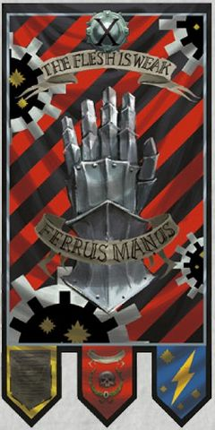

<!-- A0421-B0157 -->

原译文

Kardan Stronos, Master of the Iron Council 卡丹·斯特罗诺斯，钢铁议会之主

**校订译文**

Kardan Stronos, Master of the Iron Council 卡丹·斯特罗诺斯，钢铁议会之主

<!-- /A0421-B0157 -->

<!-- A0421-B0158 -->
**英文原文**

Malkaan Feirros, Master of the Forge

<!-- /A0421-B0158 -->

<!-- A0421-B0159 -->

原译文

马尔坎·费若斯，铸造大师

**校订译文**

马尔坎·费洛斯，铸造大师

<!-- /A0421-B0159 -->

<!-- A0421-B0160 -->

原译文

Iron Fathers 铁父

**校订译文**

Iron Fathers 钢铁圣父

<!-- /A0421-B0160 -->

<!-- A0421-B0161 -->

原译文

Helfathers 冥父

**校订译文**

Helfathers 冥父

<!-- /A0421-B0161 -->

<!-- A0421-B0162 -->

原译文

Venerable Dreadnoughts 神圣无畏

**校订译文**

Venerable Dreadnoughts 神圣无畏机甲

<!-- /A0421-B0162 -->

<!-- A0421-B0163 -->
### Apothecarion 药剂部

<!-- /A0421-B0163 -->

<!-- A0421-B0164 图片 -->

<!-- A0421-B0165 -->

原译文

Anaar Telech,Chief Apothecary 阿纳尔·特莱奇，首席药剂师

**校订译文**

Anaar Telech,Chief Apothecary 阿纳尔·特莱奇，首席药剂师

<!-- /A0421-B0165 -->

<!-- A0421-B0166 -->

原译文

Apothecaries 药剂师

**校订译文**

Apothecaries 药剂师

<!-- /A0421-B0166 -->

<!-- A0421-B0167 -->
### Librarius 智库

<!-- /A0421-B0167 -->

<!-- A0421-B0168 图片 -->
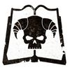

<!-- A0421-B0169 -->

原译文

Lydriik,Chief Librarian 林德里克，首席智库

**校订译文**

Lydriik,Chief Librarian 林德里克，首席智库员

<!-- /A0421-B0169 -->

<!-- A0421-B0170 -->

原译文

Epistolaries 星语官

**校订译文**

Epistolaries 星语官

<!-- /A0421-B0170 -->

<!-- A0421-B0171 -->

原译文

Codiciers 典记员

**校订译文**

Codiciers 典记员

<!-- /A0421-B0171 -->

<!-- A0421-B0172 -->

原译文

Lexicaniums 编修员

**校订译文**

Lexicaniums 编修员

<!-- /A0421-B0172 -->

<!-- A0421-B0173 -->

原译文

Acolytum 侍僧

**校订译文**

Acolytum 侍僧

<!-- /A0421-B0173 -->

<!-- A0421-B0174 -->
### Chaplaincy 教士团

原题：Chaplaincy 隐修室

<!-- /A0421-B0174 -->

<!-- A0421-B0175 图片 -->
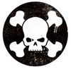

<!-- A0421-B0176 -->

原译文

Ranek Varth,Father of Iron 拉内克·瓦斯，铁父

**校订译文**

Ranek Varth,Father of Iron 拉内克·瓦斯，钢铁圣父

<!-- /A0421-B0176 -->

<!-- A0421-B0177 -->

原译文

Reclusiarch Raastus Korphaal 隐修士拉斯图斯·科尔法尔

**校订译文**

Reclusiarch Raastus Korphaal 隐修长拉斯图斯·科尔法尔

<!-- /A0421-B0177 -->

<!-- A0421-B0178 -->

原译文

Iron Chaplains 钢铁牧师

**校订译文**

Iron Chaplains 钢铁教士

<!-- /A0421-B0178 -->

<!-- A0421-B0179 -->
### Clan Companies 氏族连队

<!-- /A0421-B0179 -->

<!-- A0421-B0180 -->
### Veteran Company 老兵连队

<!-- /A0421-B0180 -->

<!-- A0421-B0181 -->

原译文

1st Company 第一连队

**校订译文**

1st Company 第一连队

<!-- /A0421-B0181 -->

<!-- A0421-B0182 图片 -->

<!-- A0421-B0183 -->

原译文

Clan Avernii 阿维尼氏族

**校订译文**

Clan Avernii 阿维尼氏族

<!-- /A0421-B0183 -->

<!-- A0421-B0184 -->

原译文

"The Forge-Born" “铸炉之裔”

**校订译文**

"The Forge-Born" “铸炉之裔”

<!-- /A0421-B0184 -->

<!-- A0421-B0185 -->
### Caanok Var,Iron Captain 卡诺克·瓦尔，钢铁连长

<!-- /A0421-B0185 -->

<!-- A0421-B0186 -->

原译文

Lieutenants 副官

**校订译文**

Lieutenants 副官

<!-- /A0421-B0186 -->

<!-- A0421-B0187 -->

原译文

Company Ancient 连队旗手

**校订译文**

Company Ancient 连队旗手

<!-- /A0421-B0187 -->

<!-- A0421-B0188 -->

原译文

Company Champion 连队冠军

**校订译文**

Company Champion 连队冠军

<!-- /A0421-B0188 -->

<!-- A0421-B0189 -->

原译文

Company Veterans 连队老兵

**校订译文**

Company Veterans 连队老兵

<!-- /A0421-B0189 -->

<!-- A0421-B0190 -->

原译文

10 Veteran & Terminator Squads 10个老兵&终结者小队

**校订译文**

10 Veteran & Terminator Squads 10个老兵及终结者小队

<!-- /A0421-B0190 -->

<!-- A0421-B0191 -->

原译文

Dreadnoughts 无畏

**校订译文**

Dreadnoughts 无畏机甲

<!-- /A0421-B0191 -->

<!-- A0421-B0192 -->

原译文

Techmarines 技术军士

**校订译文**

Techmarines 科技战士

<!-- /A0421-B0192 -->

<!-- A0421-B0193 -->

原译文

Transports 运输车

**校订译文**

Transports 运输车

<!-- /A0421-B0193 -->

<!-- A0421-B0194 -->

原译文

Battle Tanks 战斗坦克

**校订译文**

Battle Tanks 战斗坦克

<!-- /A0421-B0194 -->

<!-- A0421-B0195 -->

原译文

Aircraft 飞行器

**校订译文**

Aircraft 飞行器

<!-- /A0421-B0195 -->

<!-- A0421-B0196 -->

原译文

Warships 战舰

**校订译文**

Warships 战舰

<!-- /A0421-B0196 -->

<!-- A0421-B0197 -->

原译文

Land Behemoth 陆地巨兽

**校订译文**

Land Behemoth 陆地巨兽

<!-- /A0421-B0197 -->

<!-- A0421-B0198 -->
### Battle Companies 战斗连队

<!-- /A0421-B0198 -->

<!-- A0421-B0199 -->

原译文

2nd Company 第二连队

**校订译文**

2nd Company 第二连队

<!-- /A0421-B0199 -->

<!-- A0421-B0200 图片 -->

<!-- A0421-B0201 -->

原译文

Clan Garrsak 格拉萨克氏族

**校订译文**

Clan Garrsak 格拉萨克氏族

<!-- /A0421-B0201 -->

<!-- A0421-B0202 -->

原译文

"The Tempered Wardens" “回火监察者”

**校订译文**

"The Tempered Wardens" “回火监察者”

<!-- /A0421-B0202 -->

<!-- A0421-B0203 -->
### Eutuun Hes,Iron Captain 欧图恩·赫斯，钢铁连长

<!-- /A0421-B0203 -->

<!-- A0421-B0204 -->

原译文

Lieutenants 副官

**校订译文**

Lieutenants 副官

<!-- /A0421-B0204 -->

<!-- A0421-B0205 -->

原译文

Company Ancient 连队旗手

**校订译文**

Company Ancient 连队旗手

<!-- /A0421-B0205 -->

<!-- A0421-B0206 -->

原译文

Company Champion 连队冠军

**校订译文**

Company Champion 连队冠军

<!-- /A0421-B0206 -->

<!-- A0421-B0207 -->

原译文

Company Veterans 连队老兵

**校订译文**

Company Veterans 连队老兵

<!-- /A0421-B0207 -->

<!-- A0421-B0208 -->

原译文

6 Battleline Squads 6个战线小队

**校订译文**

6 Battleline Squads 6个战线小队

<!-- /A0421-B0208 -->

<!-- A0421-B0209 -->

原译文

2 Close Support Squads 2个近战支援小队

**校订译文**

2 Close Support Squads 2个近战支援小队

<!-- /A0421-B0209 -->

<!-- A0421-B0210 -->

原译文

2 Fire Support Squads 2个火力支援小队

**校订译文**

2 Fire Support Squads 2个火力支援小队

<!-- /A0421-B0210 -->

<!-- A0421-B0211 -->

原译文

Bikes 摩托

**校订译文**

Bikes 摩托

<!-- /A0421-B0211 -->

<!-- A0421-B0212 -->

原译文

Land Speeders 兰德速攻艇

**校订译文**

Land Speeders 兰德速攻艇

<!-- /A0421-B0212 -->

<!-- A0421-B0213 -->

原译文

Dreadnoughts 无畏

**校订译文**

Dreadnoughts 无畏机甲

<!-- /A0421-B0213 -->

<!-- A0421-B0214 -->

原译文

Techmarines 技术军士

**校订译文**

Techmarines 科技战士

<!-- /A0421-B0214 -->

<!-- A0421-B0215 -->

原译文

Transports 运输车

**校订译文**

Transports 运输车

<!-- /A0421-B0215 -->

<!-- A0421-B0216 -->

原译文

Battle Tanks 战斗坦克

**校订译文**

Battle Tanks 战斗坦克

<!-- /A0421-B0216 -->

<!-- A0421-B0217 -->

原译文

Aircraft 飞行器

**校订译文**

Aircraft 飞行器

<!-- /A0421-B0217 -->

<!-- A0421-B0218 -->

原译文

Warships 战舰

**校订译文**

Warships 战舰

<!-- /A0421-B0218 -->

<!-- A0421-B0219 -->

原译文

Land Behemoth 陆地巨兽

**校订译文**

Land Behemoth 陆地巨兽

<!-- /A0421-B0219 -->

<!-- A0421-B0220 -->

原译文

3rd Company 第三连队

**校订译文**

3rd Company 第三连队

<!-- /A0421-B0220 -->

<!-- A0421-B0221 图片 -->

<!-- A0421-B0222 -->

原译文

Clan Raukaan 劳坎氏族

**校订译文**

Clan Raukaan 劳坎氏族

<!-- /A0421-B0222 -->

<!-- A0421-B0223 -->

原译文

"The Firehearts" “火焰之心”

**校订译文**

"The Firehearts" “火焰之心”

<!-- /A0421-B0223 -->

<!-- A0421-B0224 -->
### Klaarc Kalag,Iron Captain 克拉尔克·卡拉格，钢铁连长

<!-- /A0421-B0224 -->

<!-- A0421-B0225 -->

原译文

Lieutenants 副官

**校订译文**

Lieutenants 副官

<!-- /A0421-B0225 -->

<!-- A0421-B0226 -->

原译文

Company Ancient 连队旗手

**校订译文**

Company Ancient 连队旗手

<!-- /A0421-B0226 -->

<!-- A0421-B0227 -->

原译文

Company Champion 连队冠军

**校订译文**

Company Champion 连队冠军

<!-- /A0421-B0227 -->

<!-- A0421-B0228 -->

原译文

Company Veterans 连队老兵

**校订译文**

Company Veterans 连队老兵

<!-- /A0421-B0228 -->

<!-- A0421-B0229 -->

原译文

6 Battleline Squads 6个战线小队

**校订译文**

6 Battleline Squads 6个战线小队

<!-- /A0421-B0229 -->

<!-- A0421-B0230 -->

原译文

2 Close Support Squads 2个近战支援小队

**校订译文**

2 Close Support Squads 2个近战支援小队

<!-- /A0421-B0230 -->

<!-- A0421-B0231 -->

原译文

2 Fire Support Squads 2个火力支援小队

**校订译文**

2 Fire Support Squads 2个火力支援小队

<!-- /A0421-B0231 -->

<!-- A0421-B0232 -->

原译文

Bikes 摩托

**校订译文**

Bikes 摩托

<!-- /A0421-B0232 -->

<!-- A0421-B0233 -->

原译文

Land Speeders 兰德速攻艇

**校订译文**

Land Speeders 兰德速攻艇

<!-- /A0421-B0233 -->

<!-- A0421-B0234 -->

原译文

Dreadnoughts 无畏

**校订译文**

Dreadnoughts 无畏机甲

<!-- /A0421-B0234 -->

<!-- A0421-B0235 -->

原译文

Techmarines 技术军士

**校订译文**

Techmarines 科技战士

<!-- /A0421-B0235 -->

<!-- A0421-B0236 -->

原译文

Transports 运输车

**校订译文**

Transports 运输车

<!-- /A0421-B0236 -->

<!-- A0421-B0237 -->

原译文

Battle Tanks 战斗坦克

**校订译文**

Battle Tanks 战斗坦克

<!-- /A0421-B0237 -->

<!-- A0421-B0238 -->

原译文

Aircraft 飞行器

**校订译文**

Aircraft 飞行器

<!-- /A0421-B0238 -->

<!-- A0421-B0239 -->

原译文

Warships 战舰

**校订译文**

Warships 战舰

<!-- /A0421-B0239 -->

<!-- A0421-B0240 -->

原译文

Land Behemoth 陆地巨兽

**校订译文**

Land Behemoth 陆地巨兽

<!-- /A0421-B0240 -->

<!-- A0421-B0241 -->

原译文

4th Company 第四连队

**校订译文**

4th Company 第四连队

<!-- /A0421-B0241 -->

<!-- A0421-B0242 图片 -->

<!-- A0421-B0243 -->

原译文

Clan Kaargul 卡尔古氏族

**校订译文**

Clan Kaargul 卡尔古氏族

<!-- /A0421-B0243 -->

<!-- A0421-B0244 -->

原译文

"The Watchers of Karaashi" “卡拉希守望者”

**校订译文**

"The Watchers of Karaashi" “卡拉希守望者”

<!-- /A0421-B0244 -->

<!-- A0421-B0245 -->
### Brask,Iron Captain 巴斯克，钢铁连长

<!-- /A0421-B0245 -->

<!-- A0421-B0246 -->

原译文

Lieutenants 副官

**校订译文**

Lieutenants 副官

<!-- /A0421-B0246 -->

<!-- A0421-B0247 -->

原译文

Company Ancient 连队旗手

**校订译文**

Company Ancient 连队旗手

<!-- /A0421-B0247 -->

<!-- A0421-B0248 -->

原译文

Company Champion 连队冠军

**校订译文**

Company Champion 连队冠军

<!-- /A0421-B0248 -->

<!-- A0421-B0249 -->

原译文

Company Veterans 连队老兵

**校订译文**

Company Veterans 连队老兵

<!-- /A0421-B0249 -->

<!-- A0421-B0250 -->

原译文

6 Battleline Squads 6个战线小队

**校订译文**

6 Battleline Squads 6个战线小队

<!-- /A0421-B0250 -->

<!-- A0421-B0251 -->

原译文

2 Close Support Squads 2个近战支援小队

**校订译文**

2 Close Support Squads 2个近战支援小队

<!-- /A0421-B0251 -->

<!-- A0421-B0252 -->

原译文

2 Fire Support Squads 2个火力支援小队

**校订译文**

2 Fire Support Squads 2个火力支援小队

<!-- /A0421-B0252 -->

<!-- A0421-B0253 -->

原译文

Bikes 摩托

**校订译文**

Bikes 摩托

<!-- /A0421-B0253 -->

<!-- A0421-B0254 -->

原译文

Land Speeders 兰德速攻艇

**校订译文**

Land Speeders 兰德速攻艇

<!-- /A0421-B0254 -->

<!-- A0421-B0255 -->

原译文

Dreadnoughts 无畏

**校订译文**

Dreadnoughts 无畏机甲

<!-- /A0421-B0255 -->

<!-- A0421-B0256 -->

原译文

Techmarines 技术军士

**校订译文**

Techmarines 科技战士

<!-- /A0421-B0256 -->

<!-- A0421-B0257 -->

原译文

Transports 运输车

**校订译文**

Transports 运输车

<!-- /A0421-B0257 -->

<!-- A0421-B0258 -->

原译文

Battle Tanks 战斗坦克

**校订译文**

Battle Tanks 战斗坦克

<!-- /A0421-B0258 -->

<!-- A0421-B0259 -->

原译文

Aircraft 飞行器

**校订译文**

Aircraft 飞行器

<!-- /A0421-B0259 -->

<!-- A0421-B0260 -->

原译文

Warships 战舰

**校订译文**

Warships 战舰

<!-- /A0421-B0260 -->

<!-- A0421-B0261 -->

原译文

Land Behemoth 陆地巨兽

**校订译文**

Land Behemoth 陆地巨兽

<!-- /A0421-B0261 -->

<!-- A0421-B0262 -->

原译文

5th Company 第五连队

**校订译文**

5th Company 第五连队

<!-- /A0421-B0262 -->

<!-- A0421-B0263 图片 -->

<!-- A0421-B0264 -->

原译文

Clan Haarmek 哈蒙克氏族

**校订译文**

Clan Haarmek 哈梅克氏族

**校注：** Haarmek 在原稿氏族名中作“哈蒙克”，同一表格人物姓氏作“哈梅克”；此处暂统一“哈梅克”。

<!-- /A0421-B0264 -->

<!-- A0421-B0265 -->

原译文

"The Relic Guard" “遗迹卫士”

**校订译文**

"The Relic Guard" “遗迹卫士”

<!-- /A0421-B0265 -->

<!-- A0421-B0266 -->
### Hastiim Haarmek,Iron Captain 哈斯蒂姆·哈梅克，钢铁连长

<!-- /A0421-B0266 -->

<!-- A0421-B0267 -->

原译文

Lieutenants 副官

**校订译文**

Lieutenants 副官

<!-- /A0421-B0267 -->

<!-- A0421-B0268 -->

原译文

Company Ancient 连队旗手

**校订译文**

Company Ancient 连队旗手

<!-- /A0421-B0268 -->

<!-- A0421-B0269 -->

原译文

Company Champion 连队冠军

**校订译文**

Company Champion 连队冠军

<!-- /A0421-B0269 -->

<!-- A0421-B0270 -->

原译文

Company Veterans 连队老兵

**校订译文**

Company Veterans 连队老兵

<!-- /A0421-B0270 -->

<!-- A0421-B0271 -->

原译文

6 Battleline Squads 6个战线小队

**校订译文**

6 Battleline Squads 6个战线小队

<!-- /A0421-B0271 -->

<!-- A0421-B0272 -->

原译文

2 Close Support Squads 2个近战支援小队

**校订译文**

2 Close Support Squads 2个近战支援小队

<!-- /A0421-B0272 -->

<!-- A0421-B0273 -->

原译文

2 Fire Support Squads 2个火力支援小队

**校订译文**

2 Fire Support Squads 2个火力支援小队

<!-- /A0421-B0273 -->

<!-- A0421-B0274 -->

原译文

Bikes 摩托

**校订译文**

Bikes 摩托

<!-- /A0421-B0274 -->

<!-- A0421-B0275 -->

原译文

Land Speeders 兰德速攻艇

**校订译文**

Land Speeders 兰德速攻艇

<!-- /A0421-B0275 -->

<!-- A0421-B0276 -->

原译文

Dreadnoughts 无畏

**校订译文**

Dreadnoughts 无畏机甲

<!-- /A0421-B0276 -->

<!-- A0421-B0277 -->

原译文

Techmarines 技术军士

**校订译文**

Techmarines 科技战士

<!-- /A0421-B0277 -->

<!-- A0421-B0278 -->

原译文

Transports 运输车

**校订译文**

Transports 运输车

<!-- /A0421-B0278 -->

<!-- A0421-B0279 -->

原译文

Battle Tanks 战斗坦克

**校订译文**

Battle Tanks 战斗坦克

<!-- /A0421-B0279 -->

<!-- A0421-B0280 -->

原译文

Aircraft 飞行器

**校订译文**

Aircraft 飞行器

<!-- /A0421-B0280 -->

<!-- A0421-B0281 -->

原译文

Warships 战舰

**校订译文**

Warships 战舰

<!-- /A0421-B0281 -->

<!-- A0421-B0282 -->

原译文

Land Behemoth 陆地巨兽

**校订译文**

Land Behemoth 陆地巨兽

<!-- /A0421-B0282 -->

<!-- A0421-B0283 -->
### Reserve Companies 预备连队

<!-- /A0421-B0283 -->

<!-- A0421-B0284 -->

原译文

6th Company 第六连队

**校订译文**

6th Company 第六连队

<!-- /A0421-B0284 -->

<!-- A0421-B0285 图片 -->

<!-- A0421-B0286 -->

原译文

Clan Sorrgol 索古罗氏族

**校订译文**

Clan Sorrgol 索古罗氏族

<!-- /A0421-B0286 -->

<!-- A0421-B0287 -->

原译文

"The Watchkeepers" “警戒守护者”

**校订译文**

"The Watchkeepers" “警戒守护者”

<!-- /A0421-B0287 -->

<!-- A0421-B0288 -->
### Kaldabane Vhor,Iron Captain 卡尔达班·沃霍尔，钢铁连长

<!-- /A0421-B0288 -->

<!-- A0421-B0289 -->

原译文

Lieutenants 副官

**校订译文**

Lieutenants 副官

<!-- /A0421-B0289 -->

<!-- A0421-B0290 -->

原译文

Company Ancient 连队旗手

**校订译文**

Company Ancient 连队旗手

<!-- /A0421-B0290 -->

<!-- A0421-B0291 -->

原译文

Company Champion 连队冠军

**校订译文**

Company Champion 连队冠军

<!-- /A0421-B0291 -->

<!-- A0421-B0292 -->

原译文

Company Veterans 连队老兵

**校订译文**

Company Veterans 连队老兵

<!-- /A0421-B0292 -->

<!-- A0421-B0293 -->

原译文

10 Battleline Squads 10个战线小队

**校订译文**

10 Battleline Squads 10个战线小队

<!-- /A0421-B0293 -->

<!-- A0421-B0294 -->

原译文

Bikes 摩托

**校订译文**

Bikes 摩托

<!-- /A0421-B0294 -->

<!-- A0421-B0295 -->

原译文

Land Speeders 兰德速攻艇

**校订译文**

Land Speeders 兰德速攻艇

<!-- /A0421-B0295 -->

<!-- A0421-B0296 -->

原译文

Dreadnoughts 无畏

**校订译文**

Dreadnoughts 无畏机甲

<!-- /A0421-B0296 -->

<!-- A0421-B0297 -->

原译文

Techmarines 技术军士

**校订译文**

Techmarines 科技战士

<!-- /A0421-B0297 -->

<!-- A0421-B0298 -->

原译文

Transports 运输车

**校订译文**

Transports 运输车

<!-- /A0421-B0298 -->

<!-- A0421-B0299 -->

原译文

Battle Tanks 战斗坦克

**校订译文**

Battle Tanks 战斗坦克

<!-- /A0421-B0299 -->

<!-- A0421-B0300 -->

原译文

Aircraft 飞行器

**校订译文**

Aircraft 飞行器

<!-- /A0421-B0300 -->

<!-- A0421-B0301 -->

原译文

Warships 战舰

**校订译文**

Warships 战舰

<!-- /A0421-B0301 -->

<!-- A0421-B0302 -->

原译文

Land Behemoth 陆地巨兽

**校订译文**

Land Behemoth 陆地巨兽

<!-- /A0421-B0302 -->

<!-- A0421-B0303 -->

原译文

7th Company 第七连队

**校订译文**

7th Company 第七连队

<!-- /A0421-B0303 -->

<!-- A0421-B0304 图片 -->

<!-- A0421-B0305 -->

原译文

Clan Borrgos 博古斯氏族

**校订译文**

Clan Borrgos 博古斯氏族

<!-- /A0421-B0305 -->

<!-- A0421-B0306 -->

原译文

"The Will of the Omnissiah" “万机神之意”

**校订译文**

"The Will of the Omnissiah" “万机神之意”

<!-- /A0421-B0306 -->

<!-- A0421-B0307 -->
### Dourr Raan,Iron Captain 杜尔·拉安，钢铁连长

<!-- /A0421-B0307 -->

<!-- A0421-B0308 -->

原译文

Lieutenants 副官

**校订译文**

Lieutenants 副官

<!-- /A0421-B0308 -->

<!-- A0421-B0309 -->

原译文

Company Ancient 连队旗手

**校订译文**

Company Ancient 连队旗手

<!-- /A0421-B0309 -->

<!-- A0421-B0310 -->

原译文

Company Champion 连队冠军

**校订译文**

Company Champion 连队冠军

<!-- /A0421-B0310 -->

<!-- A0421-B0311 -->

原译文

Company Veterans 连队老兵

**校订译文**

Company Veterans 连队老兵

<!-- /A0421-B0311 -->

<!-- A0421-B0312 -->

原译文

10 Battleline Squads 10个战线小队

**校订译文**

10 Battleline Squads 10个战线小队

<!-- /A0421-B0312 -->

<!-- A0421-B0313 -->

原译文

Bikes 摩托

**校订译文**

Bikes 摩托

<!-- /A0421-B0313 -->

<!-- A0421-B0314 -->

原译文

Land Speeders 兰德速攻艇

**校订译文**

Land Speeders 兰德速攻艇

<!-- /A0421-B0314 -->

<!-- A0421-B0315 -->

原译文

Dreadnoughts 无畏

**校订译文**

Dreadnoughts 无畏机甲

<!-- /A0421-B0315 -->

<!-- A0421-B0316 -->

原译文

Techmarines 技术军士

**校订译文**

Techmarines 科技战士

<!-- /A0421-B0316 -->

<!-- A0421-B0317 -->

原译文

Transports 运输车

**校订译文**

Transports 运输车

<!-- /A0421-B0317 -->

<!-- A0421-B0318 -->

原译文

Battle Tanks 战斗坦克

**校订译文**

Battle Tanks 战斗坦克

<!-- /A0421-B0318 -->

<!-- A0421-B0319 -->

原译文

Aircraft 飞行器

**校订译文**

Aircraft 飞行器

<!-- /A0421-B0319 -->

<!-- A0421-B0320 -->

原译文

Warships 战舰

**校订译文**

Warships 战舰

<!-- /A0421-B0320 -->

<!-- A0421-B0321 -->

原译文

Land Behemoth 陆地巨兽

**校订译文**

Land Behemoth 陆地巨兽

<!-- /A0421-B0321 -->

<!-- A0421-B0322 -->

原译文

8th Company 第八连队

**校订译文**

8th Company 第八连队

<!-- /A0421-B0322 -->

<!-- A0421-B0323 图片 -->

<!-- A0421-B0324 -->

原译文

Clan Morlaag 莫拉格氏族

**校订译文**

Clan Morlaag 莫拉格氏族

<!-- /A0421-B0324 -->

<!-- A0421-B0325 -->

原译文

"The Fist of Manus" “马努斯之拳”

**校订译文**

"The Fist of Manus" “马努斯之拳”

<!-- /A0421-B0325 -->

<!-- A0421-B0326 -->
### Doroor Hesh,Iron Captain 多罗尔·赫什，钢铁连长

<!-- /A0421-B0326 -->

<!-- A0421-B0327 -->

原译文

Lieutenants 副官

**校订译文**

Lieutenants 副官

<!-- /A0421-B0327 -->

<!-- A0421-B0328 -->

原译文

Company Ancient 连队旗手

**校订译文**

Company Ancient 连队旗手

<!-- /A0421-B0328 -->

<!-- A0421-B0329 -->

原译文

Company Champion 连队冠军

**校订译文**

Company Champion 连队冠军

<!-- /A0421-B0329 -->

<!-- A0421-B0330 -->

原译文

Company Veterans 连队老兵

**校订译文**

Company Veterans 连队老兵

<!-- /A0421-B0330 -->

<!-- A0421-B0331 -->

原译文

10 Close Support Squads 10个近战支援小队

**校订译文**

10 Close Support Squads 10个近战支援小队

<!-- /A0421-B0331 -->

<!-- A0421-B0332 -->

原译文

Bikes 摩托

**校订译文**

Bikes 摩托

<!-- /A0421-B0332 -->

<!-- A0421-B0333 -->

原译文

Land Speeders 兰德速攻艇

**校订译文**

Land Speeders 兰德速攻艇

<!-- /A0421-B0333 -->

<!-- A0421-B0334 -->

原译文

Dreadnoughts 无畏

**校订译文**

Dreadnoughts 无畏机甲

<!-- /A0421-B0334 -->

<!-- A0421-B0335 -->

原译文

Techmarines 技术军士

**校订译文**

Techmarines 科技战士

<!-- /A0421-B0335 -->

<!-- A0421-B0336 -->

原译文

Transports 运输车

**校订译文**

Transports 运输车

<!-- /A0421-B0336 -->

<!-- A0421-B0337 -->

原译文

Battle Tanks 战斗坦克

**校订译文**

Battle Tanks 战斗坦克

<!-- /A0421-B0337 -->

<!-- A0421-B0338 -->

原译文

Aircraft 飞行器

**校订译文**

Aircraft 飞行器

<!-- /A0421-B0338 -->

<!-- A0421-B0339 -->

原译文

Warships 战舰

**校订译文**

Warships 战舰

<!-- /A0421-B0339 -->

<!-- A0421-B0340 -->

原译文

Land Behemoth 陆地巨兽

**校订译文**

Land Behemoth 陆地巨兽

<!-- /A0421-B0340 -->

<!-- A0421-B0341 -->

原译文

9th Company 第九连队

**校订译文**

9th Company 第九连队

<!-- /A0421-B0341 -->

<!-- A0421-B0342 图片 -->

<!-- A0421-B0343 -->

原译文

Clan Vurgaan 沃尔甘氏族

**校订译文**

Clan Vurgaan 沃尔甘氏族

<!-- /A0421-B0343 -->

<!-- A0421-B0344 -->

原译文

"The Brothers of Iburaani" “伊布拉尼兄弟”

**校订译文**

"The Brothers of Iburaani" “伊布拉尼兄弟”

<!-- /A0421-B0344 -->

<!-- A0421-B0345 -->
### Agaar Verrox,Iron Captain 阿加尔·维罗克斯，钢铁连长

<!-- /A0421-B0345 -->

<!-- A0421-B0346 -->

原译文

Lieutenants 副官

**校订译文**

Lieutenants 副官

<!-- /A0421-B0346 -->

<!-- A0421-B0347 -->

原译文

Company Ancient 连队旗手

**校订译文**

Company Ancient 连队旗手

<!-- /A0421-B0347 -->

<!-- A0421-B0348 -->

原译文

Company Champion 连队冠军

**校订译文**

Company Champion 连队冠军

<!-- /A0421-B0348 -->

<!-- A0421-B0349 -->

原译文

Company Veterans 连队老兵

**校订译文**

Company Veterans 连队老兵

<!-- /A0421-B0349 -->

<!-- A0421-B0350 -->

原译文

10 Fire Support Squads 10个火力支援小队

**校订译文**

10 Fire Support Squads 10个火力支援小队

<!-- /A0421-B0350 -->

<!-- A0421-B0351 -->

原译文

Bikes 摩托

**校订译文**

Bikes 摩托

<!-- /A0421-B0351 -->

<!-- A0421-B0352 -->

原译文

Land Speeders 兰德速攻艇

**校订译文**

Land Speeders 兰德速攻艇

<!-- /A0421-B0352 -->

<!-- A0421-B0353 -->

原译文

Dreadnoughts 无畏

**校订译文**

Dreadnoughts 无畏机甲

<!-- /A0421-B0353 -->

<!-- A0421-B0354 -->

原译文

Techmarines 技术军士

**校订译文**

Techmarines 科技战士

<!-- /A0421-B0354 -->

<!-- A0421-B0355 -->

原译文

Transports 运输车

**校订译文**

Transports 运输车

<!-- /A0421-B0355 -->

<!-- A0421-B0356 -->

原译文

Battle Tanks 战斗坦克

**校订译文**

Battle Tanks 战斗坦克

<!-- /A0421-B0356 -->

<!-- A0421-B0357 -->

原译文

Aircraft 飞行器

**校订译文**

Aircraft 飞行器

<!-- /A0421-B0357 -->

<!-- A0421-B0358 -->

原译文

Warships 战舰

**校订译文**

Warships 战舰

<!-- /A0421-B0358 -->

<!-- A0421-B0359 -->

原译文

Land Behemoth 陆地巨兽

**校订译文**

Land Behemoth 陆地巨兽

<!-- /A0421-B0359 -->

<!-- A0421-B0360 -->
### Scout Company 侦察连队

<!-- /A0421-B0360 -->

<!-- A0421-B0361 -->

原译文

10th Company 第十连队

**校订译文**

10th Company 第十连队

<!-- /A0421-B0361 -->

<!-- A0421-B0362 图片 -->
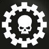

<!-- A0421-B0363 -->

原译文

Clan Dorrvok 多弗克氏族

**校订译文**

Clan Dorrvok 多弗克氏族

<!-- /A0421-B0363 -->

<!-- A0421-B0364 -->

原译文

"The Crucible" “熔炉”

**校订译文**

"The Crucible" “熔炉”

<!-- /A0421-B0364 -->

<!-- A0421-B0365 -->
### Taahg Telavech,Iron Captain 塔赫格·泰拉维奇，钢铁连长

<!-- /A0421-B0365 -->

<!-- A0421-B0366 -->

原译文

Lieutenants 副官

**校订译文**

Lieutenants 副官

<!-- /A0421-B0366 -->

<!-- A0421-B0367 -->

原译文

Company Ancient 连队旗手

**校订译文**

Company Ancient 连队旗手

<!-- /A0421-B0367 -->

<!-- A0421-B0368 -->

原译文

Company Champion 连队冠军

**校订译文**

Company Champion 连队冠军

<!-- /A0421-B0368 -->

<!-- A0421-B0369 -->

原译文

Company Veterans 连队老兵

**校订译文**

Company Veterans 连队老兵

<!-- /A0421-B0369 -->

<!-- A0421-B0370 -->

原译文

10 Vanguard Space Marine Squads 10个先锋星际战士小队

**校订译文**

10 Vanguard Space Marine Squads 10个先锋星际战士小队

<!-- /A0421-B0370 -->

<!-- A0421-B0371 -->

原译文

Scout Squads 侦察小队

**校订译文**

Scout Squads 侦察小队

<!-- /A0421-B0371 -->

<!-- A0421-B0372 -->

原译文

Bikes 摩托

**校订译文**

Bikes 摩托

<!-- /A0421-B0372 -->

<!-- A0421-B0373 -->

原译文

Land Speeders 兰德速攻艇

**校订译文**

Land Speeders 兰德速攻艇

<!-- /A0421-B0373 -->

<!-- A0421-B0374 -->

原译文

Dreadnoughts 无畏

**校订译文**

Dreadnoughts 无畏机甲

<!-- /A0421-B0374 -->

<!-- A0421-B0375 -->

原译文

Techmarines 技术军士

**校订译文**

Techmarines 科技战士

<!-- /A0421-B0375 -->

<!-- A0421-B0376 -->

原译文

Transports 运输车

**校订译文**

Transports 运输车

<!-- /A0421-B0376 -->

<!-- A0421-B0377 -->

原译文

Land Behemoth 陆地巨兽

**校订译文**

Land Behemoth 陆地巨兽

<!-- /A0421-B0377 -->

<!-- A0421-B0378 -->
### Heresy-Era Clans 叛乱时期氏族

<!-- /A0421-B0378 -->

<!-- A0421-B0379 -->

原译文

Clan Atraxii 阿特拉克西氏族

**校订译文**

Clan Atraxii 阿特拉克西氏族

<!-- /A0421-B0379 -->

<!-- A0421-B0380 -->

原译文

Clan Ayreas 艾瑞亚斯氏族

**校订译文**

Clan Ayreas 艾瑞亚斯氏族

<!-- /A0421-B0380 -->

<!-- A0421-B0381 -->

原译文

Clan Brannsar 布兰萨氏族

**校订译文**

Clan Brannsar 布兰萨氏族

<!-- /A0421-B0381 -->

<!-- A0421-B0382 -->

原译文

Clan Burkhar 布尔卡氏族

**校订译文**

Clan Burkhar 布尔卡氏族

<!-- /A0421-B0382 -->

<!-- A0421-B0383 -->

原译文

Clan Felg 菲戈氏族

**校订译文**

Clan Felg 菲戈氏族

<!-- /A0421-B0383 -->

<!-- A0421-B0384 -->

原译文

Clan Kadoran 卡多兰氏族

**校订译文**

Clan Kadoran 卡多兰氏族

<!-- /A0421-B0384 -->

<!-- A0421-B0385 -->

原译文

Clan Lokopt 洛科普特氏族

**校订译文**

Clan Lokopt 洛科普特氏族

<!-- /A0421-B0385 -->

<!-- A0421-B0386 -->

原译文

Clan Morragul 莫拉格氏族

**校订译文**

Clan Morragul 莫拉古尔氏族

**校注：** Morragul 与本章现役第八连 Clan Morlaag 拼写不同，原稿均作“莫拉格”。前者暂译“莫拉古尔”以区分，后者保留“莫拉格”；不据近似拼写合并氏族。

<!-- /A0421-B0386 -->

<!-- A0421-B0387 -->

原译文

Clan Ungavarr 昂加瓦尔氏族

**校订译文**

Clan Ungavarr 昂加瓦尔氏族

<!-- /A0421-B0387 -->

<!-- A0421-B0388 -->

原译文

Clan Vorganan 沃甘纳氏族

**校订译文**

Clan Vorganan 沃甘纳氏族

<!-- /A0421-B0388 -->

<!-- A0421-B0389 -->
### Iron Fathers 钢铁圣父

原题：Iron Fathers 铁父

<!-- /A0421-B0389 -->

<!-- A0421-B0390 -->
**英文原文**

The traditional Chaplains' role of other Chapters is fulfilled by Iron Fathers, specially trained Techmarines who serve to protect the faith of their brethren. Iron Fathers also sit on the Iron Council of the Chapter.

<!-- /A0421-B0390 -->

<!-- A0421-B0391 -->

原译文

其他战团的传统牧师角色由铁父履行，铁父是受过专门训练的技术军士，他们致力于保护兄弟们的信仰。铁父也担任战团的钢铁议会成员。

**校订译文**

其他战团通常由教士承担的职责，在钢铁之手中由钢铁圣父履行。钢铁圣父是受过专门训练的科技战士，负责守护战斗兄弟的信仰，同时也是战团钢铁议会的成员。

**校注：** 本段将 Iron Fathers 定义为兼负教士职责的专门训练科技战士；前文钢铁议会段落采用更广义定义。按所给英文保留这种设定口径差异。

<!-- /A0421-B0391 -->

<!-- A0421-B0392 图片 -->
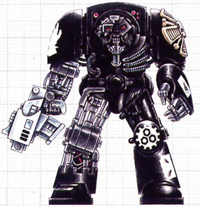

<!-- A0421-B0393 -->

原译文

Terminator Armour equipped Iron Hands Marine 钢铁之手终结者盔甲战士

**校订译文**

Terminator Armour equipped Iron Hands Marine 身穿终结者护甲的钢铁之手战士

<!-- /A0421-B0393 -->

<!-- A0421-B0394 -->
### Terminators and Veteran Sergeants 终结者和老兵军士

<!-- /A0421-B0394 -->

<!-- A0421-B0395 -->
**英文原文**

After the events of the Battle of Isstvan V the Iron Hands lost most of their veteran forces. Therefore, suits of Terminator armour are even more rare than normally is the case. Due to this the deployment of full Terminator Squads is also rare. However, sergeants are often equipped with suits of Terminator armour as the inspirational value they provide to their squads is invaluable.

<!-- /A0421-B0395 -->

<!-- A0421-B0396 -->

原译文

伊斯塔万五号之战后，钢铁之手失去了大部分老兵。因此，终结者盔甲的战甲比平时更为罕见。因此，完整部署的终结者小队也很少见。然而，军士经常装备终结者盔甲，因为他们为小队提供的鼓舞人心的价值是无价的。

**校订译文**

伊斯塔万五号之战后，钢铁之手损失了大部分老兵，终结者护甲也比其他战团更为稀缺。因此，他们很少部署完整的终结者小队。不过，军士仍常获配终结者护甲，因为这能极大地鼓舞所属小队。

<!-- /A0421-B0396 -->

<!-- A0421-B0397 -->
## Recruitment 招募

<!-- /A0421-B0397 -->

<!-- A0421-B0398 -->
**英文原文**

Each of the Clan Companies of the Iron Hands is responsible for their own recruitment. These new recruits are taken from the nomadic Clans of Medusa. Only those of great physical and mental strength are recruited and during the recruitment candidates have their weaknesses purged from them. Regardless of origin, those that survive the initial selection process spend their first decade in Clan Dorrvok and train in the desolated proving grounds of Ooranus on Medusa. Even fewer survive this grueling process, and recruits are treated with extreme disregard. Infighting amongst the Aspirants and Initiates is common and even encouraged, with Iron Hands sergeants often stopping training exercises just to turn brothers on each other or enflame rivalries. Even when elevated to full Battle-Brother a Marines chance of survival improves little. Believing themselves to be weeding out the weak and unworthy, raw recruits are often given near-suicidal assignments that would usually be given to veterans in other Chapters.

<!-- /A0421-B0398 -->

<!-- A0421-B0399 -->

原译文

钢铁之手的每个氏族连队都负责自己的招募。这些新兵来自美杜莎游牧部落。只有那些体力和脑力都很强的人才会被招募，在招募过程中，候选人的弱点会被清除。无论出身如何，那些在最初的选择过程中幸存下来的人在多弗克氏族度过了他们的第一个十年，并在美杜莎的欧拉努斯荒凉的试验场接受训练。在这个艰苦的过程中幸存下来的人更少，新兵受到的待遇也极其漠视。有志者和信徒之间的内讧很常见，甚至受到鼓励，钢铁之手军士经常停止训练演习，只是为了让兄弟们互相攻击或加剧竞争。即使晋升为战斗兄弟，星际战士的生存机会也几乎没有提高。新兵们相信自己是在淘汰弱者和不配的人，他们经常被分配到接近自杀的任务，而这些任务通常会在其他战团中分配给老兵。

**校订译文**

钢铁之手各氏族连队自行负责招募，从美杜莎的游牧氏族中选拔新兵。只有身心足够强健的人才能入选，选拔过程还要剔除候选者的弱点。无论出身何处，熬过最初筛选的人都会先在多弗克氏族度过十年，在美杜莎荒凉的欧拉努斯试炼场接受训练。这一过程极其严酷，幸存者更少，新兵的死活几乎无人关心。候选者与入门者之间的争斗十分常见，甚至受到鼓励；钢铁之手军士往往会中止训练，刻意让兄弟们相互攻击，或激化彼此的竞争。即使晋升为正式战斗兄弟，星际战士的生存机会也没有多少改善。战团认为这样能淘汰软弱或不够格的人，因此常把其他战团通常交给老兵的近乎自杀的任务，指派给毫无经验的新兵。

**校注：** 原译将“认为是在淘汰弱者”的主语误接为新兵；英文语义指负责选拔和派遣任务的钢铁之手战团。另将 Aspirants、Initiates 按招募阶段译为候选者、入门者，未套用黑色圣堂专属官译。

<!-- /A0421-B0399 -->

<!-- A0421-B0400 图片 -->
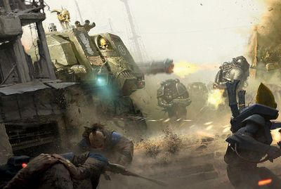

<!-- A0421-B0401 -->

原译文

Iron Hands battling Eldar 钢铁之手与灵族战斗

**校订译文**

Iron Hands battling Eldar 钢铁之手与灵族战斗

<!-- /A0421-B0401 -->

<!-- A0421-B0402 -->
**英文原文**

Due to their harsh training regimen and stubbornness in both attack and defense, only the strongest in the Chapter survive. Thus the Iron Hands are a top-heavy chapter with many veterans but less Scouts and Initiates. To maintain their strength, recruits are constantly sought after by Clan Iron Fathers within the Wastes of Medusa. Librarians are often recruited from Black Ships passing near Medusa.

<!-- /A0421-B0402 -->

<!-- A0421-B0403 -->

原译文

由于他们严格的训练方案和在进攻和防守方面的固执，只有战团最强的人才能幸存下来。因此，钢铁之手是一个头重脚轻的战团，有许多老兵，但侦察兵和信徒较少。为了保持力量，美杜莎荒原内的氏族铁父们不断寻找新兵。智库经常从经过美杜莎附近的黑船上招募。

**校订译文**

严酷的训练，以及攻防作战中绝不退让的顽强作风，使得只有战团最强韧的成员才能活下来。因此，钢铁之手的人员构成偏重老兵，侦察兵和入门者相对较少。为补充兵力，各氏族的钢铁圣父不断在美杜莎荒原上寻找新兵。智库员则常从途经美杜莎附近的黑船上招募。

<!-- /A0421-B0403 -->

<!-- A0421-B0404 图片 -->
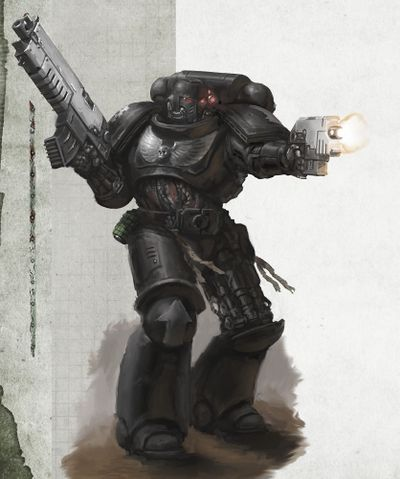

<!-- A0421-B0405 -->

原译文

Iron Hands Primaris Space Marine 钢铁之手原铸星际战士

**校订译文**

Iron Hands Primaris Space Marine 钢铁之手原铸星际战士

<!-- /A0421-B0405 -->

<!-- A0421-B0406 -->
## Noted Elements of the Iron Hands 钢铁之手的著名人物与事物

原题：Noted Elements of the Iron Hands 钢铁之手的著名成员

<!-- /A0421-B0406 -->

<!-- A0421-B0407 -->
### Equipment 装备

<!-- /A0421-B0407 -->

<!-- A0421-B0408 -->
### Relics 圣物

<!-- /A0421-B0408 -->

<!-- A0421-B0409 -->

原译文

Axe of Severance 切断之斧

**校订译文**

Axe of Severance 切断之斧

<!-- /A0421-B0409 -->

<!-- A0421-B0410 -->
**英文原文**

Canticle of Travels - prized text documenting the legend of Ferrus Manus

<!-- /A0421-B0410 -->

<!-- A0421-B0411 -->

原译文

旅行颂歌 - 记录费鲁斯·马努斯传说的珍贵文本

**校订译文**

《旅行颂歌》——记述费鲁斯·马努斯传说的珍贵文献。

<!-- /A0421-B0411 -->

<!-- A0421-B0412 -->

原译文

Heart of Iron 钢铁之心

**校订译文**

Heart of Iron 钢铁之心

<!-- /A0421-B0412 -->

<!-- A0421-B0413 -->

原译文

Skull of Ferrus Manus 费鲁斯·马努斯之颅

**校订译文**

Skull of Ferrus Manus 费鲁斯·马努斯之颅

<!-- /A0421-B0413 -->

<!-- A0421-B0414 -->
### Notable Vessels 著名战舰

<!-- /A0421-B0414 -->

<!-- A0421-B0415 -->
**英文原文**

Fist of Iron — Flagship at the time of the Horus Heresy

<!-- /A0421-B0415 -->

<!-- A0421-B0416 -->

原译文

钢铁之拳号 — 荷鲁斯叛乱时期的旗舰

**校订译文**

钢铁之拳号 — 荷鲁斯之乱时期的旗舰

<!-- /A0421-B0416 -->

<!-- A0421-B0417 -->

原译文

Red Talon 红爪号

**校订译文**

Red Talon 红爪号

<!-- /A0421-B0417 -->

<!-- A0421-B0418 -->

原译文

Iron Heart 钢铁之心号

**校订译文**

Iron Heart 钢铁之心号

<!-- /A0421-B0418 -->

<!-- A0421-B0419 -->

原译文

Sisypheum 西西弗姆号

**校订译文**

Sisypheum 西西弗姆号

<!-- /A0421-B0419 -->

<!-- A0421-B0420 -->

原译文

Veritas Ferrum 钢铁真理号

**校订译文**

Veritas Ferrum 钢铁真理号

<!-- /A0421-B0420 -->

<!-- A0421-B0421 -->
### Known Vehicles 著名载具

<!-- /A0421-B0421 -->

<!-- A0421-B0422 -->
**英文原文**

Weyland - Land Behemoth of Clan Vurgaan

<!-- /A0421-B0422 -->

<!-- A0421-B0423 -->

原译文

威兰德号 - 沃尔甘氏族的陆地巨兽

**校订译文**

威兰德号 - 沃尔甘氏族的陆地巨兽

<!-- /A0421-B0423 -->

<!-- A0421-B0424 -->
**英文原文**

Cestus - Land Raider

<!-- /A0421-B0424 -->

<!-- A0421-B0425 -->

原译文

塞斯图斯号 - 兰德掠袭者

**校订译文**

塞斯图斯号 - 兰德掠袭者

<!-- /A0421-B0425 -->

<!-- A0421-B0426 -->
**英文原文**

Myrmex - Land Raider

<!-- /A0421-B0426 -->

<!-- A0421-B0427 -->

原译文

蚁号 - 兰德掠袭者

**校订译文**

蚁号 - 兰德掠袭者

<!-- /A0421-B0427 -->

<!-- A0421-B0428 -->
**英文原文**

Metallus Gravus - Land Raider

<!-- /A0421-B0428 -->

<!-- A0421-B0429 -->

原译文

沉重金属号 - 兰德掠袭者

**校订译文**

沉重金属号 - 兰德掠袭者

<!-- /A0421-B0429 -->

<!-- A0421-B0430 -->
### Notable Members 著名成员

<!-- /A0421-B0430 -->

<!-- A0421-B0431 -->
### Heresy Era 叛乱时期

<!-- /A0421-B0431 -->

<!-- A0421-B0432 -->
**英文原文**

Ferrus Manus - Primarch of the Iron Hands.

<!-- /A0421-B0432 -->

<!-- A0421-B0433 -->

原译文

费鲁斯·马努斯 - 钢铁之手原体

**校订译文**

费鲁斯·马努斯 - 钢铁之手原体

<!-- /A0421-B0433 -->

<!-- A0421-B0434 -->
**英文原文**

Gabriel Santar - First Captain of the Iron Hands during the Great Crusade and the Horus Heresy. Killed on Isstvan V.

<!-- /A0421-B0434 -->

<!-- A0421-B0435 -->

原译文

加百列·桑塔尔 - 大远征和荷鲁斯叛乱期间钢铁之手的第一连长。死于伊斯塔万五号。

**校订译文**

加百列·桑塔尔——大远征及荷鲁斯之乱时期的钢铁之手第一连长，死于伊斯塔万五号。

<!-- /A0421-B0435 -->

<!-- A0421-B0436 -->
**英文原文**

Shadrak Meduson - Clan Sorrgol Clan Commander, Captain during the Great Crusade and warleader during the Horus Heresy era.

<!-- /A0421-B0436 -->

<!-- A0421-B0437 -->

原译文

沙德拉克·梅杜森 - 索古罗氏族指挥官，大远征时期的连长，荷鲁斯叛乱时期的战争领袖。

**校订译文**

沙德拉克·梅杜森 - 索古罗氏族指挥官，大远征时期的连长，荷鲁斯之乱时期的战争领袖。

<!-- /A0421-B0437 -->

<!-- A0421-B0438 -->
**英文原文**

Autek Mor - Iron Father and Lord of the Morragul Clan during the Horus Heresy, later became the first Chapter Master of the Red Talons.

<!-- /A0421-B0438 -->

<!-- A0421-B0439 -->

原译文

奥泰克·摩尔 - 铁父，荷鲁斯叛乱时期莫拉格氏族的领主，后来成为红爪的第一任战团长。

**校订译文**

奥特克·莫尔——钢铁圣父，荷鲁斯之乱时期莫拉古尔氏族的领主，后来成为红爪战团的首任战团长。

<!-- /A0421-B0439 -->

<!-- A0421-B0440 -->
**英文原文**

Amadeus DuCaine - Lord Commander.

<!-- /A0421-B0440 -->

<!-- A0421-B0441 -->

原译文

阿玛迪乌斯·杜凯因 - 领主指挥官

**校订译文**

阿玛迪乌斯·杜凯因 - 领主指挥官

<!-- /A0421-B0441 -->

<!-- A0421-B0442 -->
**英文原文**

Ulrach Branthan - Captain of the 65th Clan-Company.

<!-- /A0421-B0442 -->

<!-- A0421-B0443 -->

原译文

乌拉什·布兰坦 - 第65氏族连队连长。

**校订译文**

乌尔拉赫·布兰坦——第65氏族连队连长。

<!-- /A0421-B0443 -->

<!-- A0421-B0444 -->
**英文原文**

Sabik Wayland - Iron Father.

<!-- /A0421-B0444 -->

<!-- A0421-B0445 -->

原译文

沙毕克·威兰德 - 铁父

**校订译文**

萨比克·韦兰——钢铁圣父。

<!-- /A0421-B0445 -->

<!-- A0421-B0446 -->
**英文原文**

Thamatica - Iron Father.

<!-- /A0421-B0446 -->

<!-- A0421-B0447 -->

原译文

塔玛提卡 - 铁父

**校订译文**

塔玛提卡 - 钢铁圣父

<!-- /A0421-B0447 -->

<!-- A0421-B0448 -->
**英文原文**

Kardozia - Iron Father and Dreadnought.

<!-- /A0421-B0448 -->

<!-- A0421-B0449 -->

原译文

卡多佐 - 铁父和无畏。

**校订译文**

卡多佐——钢铁圣父，无畏机甲驾驶员。

<!-- /A0421-B0449 -->

<!-- A0421-B0450 -->
**英文原文**

Bion Henricos - Sergeant of the 10th Clan-Company.

<!-- /A0421-B0450 -->

<!-- A0421-B0451 -->

原译文

拜昂·亨利克斯 - 第十氏族连队军士。

**校订译文**

拜昂·亨利克斯 - 第十氏族连队军士。

<!-- /A0421-B0451 -->

<!-- A0421-B0452 -->
**英文原文**

Ignatius Numen - Battle-Brother.

<!-- /A0421-B0452 -->

<!-- A0421-B0453 -->

原译文

伊格内修斯·努门 - 战斗兄弟。

**校订译文**

伊格内修斯·努门 - 战斗兄弟。

<!-- /A0421-B0453 -->

<!-- A0421-B0454 -->
### Post Heresy 叛乱后

<!-- /A0421-B0454 -->

<!-- A0421-B0455 -->
**英文原文**

Kardan Stronos - de facto Chapter Master of the Iron Hands.

<!-- /A0421-B0455 -->

<!-- A0421-B0456 -->

原译文

卡丹·斯特罗诺斯 - 事实上的钢铁之手战团长。

**校订译文**

卡丹·斯特罗诺斯 - 事实上的钢铁之手战团长。

<!-- /A0421-B0456 -->

<!-- A0421-B0457 -->
**英文原文**

Feirros - Iron Father and Master of the Forge.

<!-- /A0421-B0457 -->

<!-- A0421-B0458 -->

原译文

费罗斯 - 铁父和铸造大师。

**校订译文**

费洛斯——钢铁圣父兼铸造大师。

<!-- /A0421-B0458 -->

<!-- A0421-B0459 -->
**英文原文**

Xerill - Master of the Forge of the Deathwatch.

<!-- /A0421-B0459 -->

<!-- A0421-B0460 -->

原译文

薛瑞尔 - 死亡守望铸造大师。

**校订译文**

薛瑞尔 - 死亡守望铸造大师。

<!-- /A0421-B0460 -->

<!-- A0421-B0461 -->
**英文原文**

Anatolus Gdolkin - Iron Father.

<!-- /A0421-B0461 -->

<!-- A0421-B0462 -->

原译文

阿纳托尔斯·格多尔金 - 铁父。

**校订译文**

阿纳托尔斯·格多尔金 - 钢铁圣父。

<!-- /A0421-B0462 -->

<!-- A0421-B0463 -->
**英文原文**

Arnok Kraan - Iron Father.

<!-- /A0421-B0463 -->

<!-- A0421-B0464 -->

原译文

阿诺克·克莱恩 - 铁父。

**校订译文**

阿诺克·克莱恩 - 钢铁圣父。

<!-- /A0421-B0464 -->

<!-- A0421-B0465 -->
**英文原文**

Caanok Var - Iron Captain of Clan Avernii

<!-- /A0421-B0465 -->

<!-- A0421-B0466 -->

原译文

卡诺克·瓦尔 - 阿维尼氏族钢铁连长

**校订译文**

卡诺克·瓦尔 - 阿维尼氏族钢铁连长

<!-- /A0421-B0466 -->

<!-- A0421-B0467 -->
**英文原文**

Ennox Sorrlock - Member of the Deathwatch.

<!-- /A0421-B0467 -->

<!-- A0421-B0468 -->

原译文

恩诺克斯·索洛克 - 死亡守望成员。

**校订译文**

恩诺克斯·索洛克 - 死亡守望成员。

<!-- /A0421-B0468 -->

<!-- A0421-B0469 -->
**英文原文**

Oros Telemar - Clan-Champion.

<!-- /A0421-B0469 -->

<!-- A0421-B0470 -->

原译文

奥罗斯·特莱马尔 - 氏族冠军

**校订译文**

奥罗斯·特莱马尔 - 氏族冠军

<!-- /A0421-B0470 -->

<!-- A0421-B0471 -->
### Unique Troops 独特部队

<!-- /A0421-B0471 -->

<!-- A0421-B0472 -->
**英文原文**

The Iron Hands possess a number of unique ranks and troop types:

<!-- /A0421-B0472 -->

<!-- A0421-B0473 -->

原译文

钢铁之手拥有许多独特的等级和部队类型：

**校订译文**

钢铁之手拥有多种独特的职衔与兵种：

<!-- /A0421-B0473 -->

<!-- A0421-B0474 -->

原译文

Iron Fathers 铁父

**校订译文**

Iron Fathers 钢铁圣父

<!-- /A0421-B0474 -->

<!-- A0421-B0475 -->

原译文

Morlocks 莫洛克

**校订译文**

Morlocks 莫洛克

<!-- /A0421-B0475 -->

<!-- A0421-B0476 -->

原译文

Helfathers 冥父

**校订译文**

Helfathers 冥父

<!-- /A0421-B0476 -->

<!-- A0421-B0477 -->
**英文原文**

Gorgon Terminators (Horus Heresy era)

<!-- /A0421-B0477 -->

<!-- A0421-B0478 -->

原译文

戈尔贡终结者（荷鲁斯叛乱时期）

**校订译文**

戈尔贡终结者（荷鲁斯之乱时期）

<!-- /A0421-B0478 -->

<!-- A0421-B0479 -->
**英文原文**

Medusan Immortals (Horus Heresy era)

<!-- /A0421-B0479 -->

<!-- A0421-B0480 -->

原译文

美杜莎不朽者（荷鲁斯叛乱时期）

**校订译文**

美杜莎不朽者（荷鲁斯之乱时期）

<!-- /A0421-B0480 -->

<!-- A0421-B0481 -->

原译文

Land Behemoths 陆地巨兽

**校订译文**

Land Behemoths 陆地巨兽

<!-- /A0421-B0481 -->

<!-- A0421-B0482 -->
## Trivia 琐事

<!-- /A0421-B0482 -->

<!-- A0421-B0483 -->
### Notes on Hierarchy 阶层体系说明

<!-- /A0421-B0483 -->

<!-- A0421-B0484 -->
**英文原文**

The exact commander of the Iron Hands has been fairly convoluted throughout publication history.

<!-- /A0421-B0484 -->

<!-- A0421-B0485 -->

原译文

钢铁之手的确切指挥官在整个出版史上一直相当复杂。

**校订译文**

在不同出版物中，钢铁之手究竟由谁统领，曾有多种复杂且不一致的说法。

**校注：** 本节按出版物分别列出领导制度的版本差异；不据较新版本抹去前述旧版记载。

<!-- /A0421-B0485 -->

<!-- A0421-B0486 -->
**英文原文**

The "Index Astartes" article in White Dwarf 262 states that the Chapter does not possess a Chapter Master but is instead led by the Great Clan Council, which is itself made up of revered representatives from each of the ten Clans. This is described as being a precaution against future heresy and a reflection of Ferrus Manus' teachings. A more current source, Imperial Armour - Volume 10, also confirms the existence of the Great Clan Council.

<!-- /A0421-B0486 -->

<!-- A0421-B0487 -->

原译文

白矮人262期中的“阿斯塔特索引”文章指出，该战团没有战团长，而是由大氏族议会领导，该议会本身由十个氏族中每个氏族的受人尊敬的代表组成。这被描述为对未来叛乱的预防措施，也是费鲁斯·马努斯教义的反映。更为现代的资料来源 帝国装甲-第10卷 也证实了大氏族议会的存在。

**校订译文**

《白矮人》第262期的《阿斯塔特索引》文章指出，钢铁之手没有战团长，而由大氏族议会领导。议会由十个氏族各自推举的德高望重的代表组成。这一制度被解释为防范日后再次发生叛乱的措施，也体现了费鲁斯·马努斯的教导。稍后出版的《帝国装甲》第10卷同样确认了大氏族议会的存在。

<!-- /A0421-B0487 -->

<!-- A0421-B0488 -->
**英文原文**

Apparently contradicting this, Codex: Space Marines (5th Edition) describes Kardan Stronos as Chapter Master of the Iron Hands. Also other, earlier sources describe an Inquisitorial official petitioning the Chapter Master of the Iron Hands for assistance during Abaddon the Despoiler's Thirteenth Black Crusade.

<!-- /A0421-B0488 -->

<!-- A0421-B0489 -->

原译文

显然与此相矛盾的是，圣典:星际战士（第5版）将卡丹·斯特罗诺斯描述为钢铁之手的战团长。还有其他更早的消息来源描述了一名审判官在掠夺者阿巴顿的第十三次黑色远征期间向钢铁之手战团长请求援助。

**校订译文**

与此明显矛盾的是，《圣典：星际战士》第5版将卡丹·斯特罗诺斯称为钢铁之手的战团长。其他更早的资料也提到，一名审判庭官员曾在掠夺者阿巴顿发动第十三次黑色远征期间，向钢铁之手战团长请求援助。

**校注：** Inquisitorial official 仅指审判庭官员，英文未明确其具备审判官身份。

<!-- /A0421-B0489 -->

<!-- A0421-B0490 -->
**英文原文**

Later, Codex: Space Marines (6th Edition) describes the Chapter as being overseen by the Chapter Council and lacking a formal Chapter Master. However, Kardan Stronos is the first among peers on the council due to his reputation and instead serves as a de facto leader.

<!-- /A0421-B0490 -->

<!-- A0421-B0491 -->

原译文

后来，圣典:星际战士（第6版）将战团描述为由战团议会监督，缺乏正式的战团长。然而，卡丹·斯特罗诺斯因其声誉成为议会成员中的第一人，而且是事实上的领导者。

**校订译文**

后来的《圣典：星际战士》第6版称，战团由战团议会管理，没有正式的战团长。不过，卡丹·斯特罗诺斯凭借声望，在议会中享有同侪之首的地位，实际上担任领袖。

<!-- /A0421-B0491 -->

<!-- A0421-B0492 -->
**英文原文**

In Codex Supplement: Iron Hands (8th Edition) it is stated that Kardan Stronos exists as the official Chapter Master, but like his predecessors was elected by the Iron Council. It is stated that the Iron Hands Chapter Master does not serve for life.

<!-- /A0421-B0492 -->

<!-- A0421-B0493 -->

原译文

在圣典补充:钢铁之手（第8版）中，卡丹·斯特罗诺斯作为官方战团长存在，但与他的前任一样，他是由钢铁议会选举产生的。据说钢铁之手战团长不是终身的。

**校订译文**

《圣典补充：钢铁之手》第8版则明确称卡丹·斯特罗诺斯为正式战团长；他与历任前任一样，由钢铁议会选举产生。书中还指出，钢铁之手战团长并非终身任职。

<!-- /A0421-B0493 -->

本篇核心术语与暂定项

以下列出本篇出现的英文原形及核心术语表用词。同形词可能指不同对象，具体词义以本篇正文和校注为准；单复数、别名和仅见于图注的名称可能尚未列入。完整候选见[术语表](../../术语表/双语术语候选.csv)。

| 英文 | 采用中文 | 状态 |
| --- | --- | --- |
| Space Marines | 星际战士 | 官方已核对 |
| Deathwatch | 死亡守望 | 官方已核对 |
| Adeptus Mechanicus | 机械修会 | 官方已核对 |
| Imperial Guard | 帝国卫队 | 暂定·语境区分 |
| Imperial Army | 帝国军 | 暂定·官方待核 |
| World Eaters | 吞世者 | 官方已核对 |
| Eldar | 灵族 | 暂定·语境区分 |
| Dark Eldar | 黑暗灵族 | 暂定·旧称对应 |
| Orks | 欧克蛮人 | 官方已核对 |
| Librarian | 智库员 | 官方已核对 |
| Terminator | 终结者 | 官方已核对 |
| Roboute Guilliman | 罗保特·基里曼 | 官方已核对 |
| Horus Heresy | 荷鲁斯之乱 | 官方已核对 |
| Warp | 亚空间 | 官方已核对 |
| Great Rift | 大裂隙 | 官方已核对 |
| Inquisition | 审判庭 | 暂定 |
| Inquisitor | 审判官 | 官方已核对 |
| Imperium | 帝国 | 暂定·简称 |
| Mechanicum | 机械教 | 暂定·历史称谓 |
| Tzeentch | 奸奇 | 官方已核对 |
| Waaagh! | Waaagh! | 暂定·保留原文 |
| Indomitus | 不屈学派 | 暂定·学派语境 |
| History | 历史 | 编辑用语已统一 |
| Description | 描述 | 编辑用语已统一 |
| Equipment | 装备 | 编辑用语已统一 |
| Eye of Terror | 恐惧之眼 | 官方已核对 |
| Imperial Fists | 帝国之拳 | 暂定 |
| Emperor | 帝皇 | 官方已核对 |
| Primarch | 原体 | 官方已核对 |
| Mutant | 变种人 | 暂定·官方待核 |
| Word Bearers | 怀言者 | 暂定·官方待核 |
| Daemon Prince | 恶魔亲王 | 官方已核对 |
| Emperor's Children | 帝皇之子 | 官方已核对 |
| Slaanesh | 色孽 | 官方已核对 |
| Iron Warriors | 钢铁勇士 | 暂定·官方待核 |
| The Order | 秩序 | 暂定·官方待核 |
| Great Crusade | 大远征 | 暂定·官方待核 |
| Mortarion | 莫塔里安 | 官方已核对 |
| Ferrus Manus | 费鲁斯·马努斯 | 暂定·官方待核 |
| Terra | 泰拉 | 暂定·官方待核 |
| Horus | 荷鲁斯 | 暂定·官方待核 |
| Sons of Horus | 荷鲁斯之子 | 暂定·官方待核 |
| The Diasporex | 流散者 | 暂定·官方待核 |
| Iron Hands | 钢铁之手 | 暂定·官方待核 |
| Fulgrim | 福格瑞姆 | 官方已核对 |
| Nova Terra Interregnum | 新泰拉空位期 | 暂定·官方待核 |
| Indomitus Crusade | 不屈远征 | 暂定·官方待核 |
| Unification Wars | 统一战争 | 暂定·官方待核 |
| Sector | 星区 | 暂定·官方待核 |
| Subsector | 次星区 | 暂定·官方待核 |
| Salamanders | 火蜥蜴 | 暂定·官方待核 |
| Mordian | 莫迪安 | 暂定·官方待核 |
| Nova Terra | 新泰拉 | 暂定·官方待核 |
| Mars | 火星 | 暂定·官方待核 |
| Baal | 巴尔 | 暂定·官方待核 |
| Banish | 巴尼什 | 暂定·官方待核 |
| Medusa | 美杜莎 | 暂定·官方待核 |
| Titan | 泰坦 | 暂定·官方待核 |
| Numen | 守护神 | 暂定·官方待核 |
| Land Raider | 兰德掠袭者战车 | 官方已核对 |
| Tech | 技术语 | 暂定·官方待核 |
| Bionics | 仿生改造／仿生部件（依语境） | 语境定译·官方待核 |
| Chief Librarian | 首席智库员 | 暂定·官方待核 |
| Master | 导师（审判庭职衔）／舰务官（舰员职务） | 语境定译·官方待核 |
| Mission | 教团／传教机构 | 暂定 |
| Iron Father | 钢铁圣父 | 暂定·官方待核 |
| Master of the Forge | 铸造大师 | 暂定·官方待核 |
| Chaplain | 教士 | 官方已核对 |
| Iron Father Feirros | 钢铁圣父费洛斯 | 官方已核对 |
| Excertus Imperialis | 帝国武装力量总体系 | 暂定·官方待核 |
| Horus Lupercal | 荷鲁斯·卢佩卡尔 | 暂定·官方待核 |
| Lupercal | 卢佩卡尔 | 暂定·官方待核 |
| Shadrak Meduson | 沙德拉克·梅杜森 | 暂定·官方待核 |
| Lord Commander | 领主指挥官 | 暂定·官方待核 |
| Raven Guard | 暗鸦守卫 | 官方已核 |
| The Battle of the Aragna Chain | 阿拉格纳星链之战 | 暂定·官方待核 |
| The Siege of Baal | 巴尔围城 | 暂定·官方待核 |
| Bion Henricos | 拜昂·亨利科斯 | 暂定·官方待核 |
| Cadmus Tyro | 卡德摩斯·泰罗 | 暂定·官方待核 |
| Ignatius Numen | 伊格内修斯·努门 | 暂定·官方待核 |
| Sabik Wayland | 萨比克·韦兰 | 暂定·官方待核 |
| Autek Mor | 奥特克·莫尔 | 暂定·官方待核 |
| Blackshields | 黑盾 | 暂定·官方待核 |
| Sol | 太阳系 | 暂定·官方待核 |
| Isstvan | 伊斯塔万 | 暂定·官方待核 |
| Amadeus DuCaine | 阿玛迪乌斯·杜凯因 | 暂定·官方待核 |
| First Captain | 第一连长 | 暂定·官方待核 |
| Silver Skulls | 银色颅骨 | 暂定·官方待核 |
| Praetor | 执政官 | 暂定·官方待核 |
| Gabriel Santar | 加百列·桑塔尔 | 暂定·官方待核 |
| Julius Kaesoron | 尤利乌斯·凯索伦 | 暂定·官方待核 |
| Champion | 冠军 | 暂定·官方待核 |
| Despoiler | 劫掠者 | 暂定·官方待核 |
| Medusan Immortals | 美杜莎不朽者 | 暂定·官方待核 |
| Space Marine | 星际战士 | 暂定·官方待核 |
| Chapter | 战团 | 暂定·官方待核 |
| Fortress-monastery | 要塞修道院 | 暂定·官方待核 |
| Chapter Master | 战团长 | 暂定·官方待核 |
| Captain | 连长 | 暂定·官方待核 |
| Veteran | 老兵 | 暂定·官方待核 |
| Terminators | 终结者 | 暂定·官方待核 |
| Sergeant | 军士 | 暂定·官方待核 |
| Brother | 修士 | 暂定·官方待核 |
| Battle-Brother | 战斗兄弟 | 暂定·官方待核 |
| Kardan Stronos | 卡丹·斯特罗诺斯 | 暂定·官方待核 |
| Malkaan Feirros | 马尔坎·费洛斯 | 暂定·官方待核 |
| Codex Astartes | 阿斯塔特圣典 | 暂定·官方待核 |
| Brazen Claws | 黄铜之爪 | 暂定·官方待核 |
| Red Talons | 红爪 | 暂定·官方待核 |
| Armoury | 军械库 | 暂定·官方待核 |
| Land Raiders | 兰德掠袭者 | 暂定·官方待核 |
| Fire Lords | 火焰领主 | 暂定·官方待核 |
| Iron Lords | 钢铁领主 | 暂定·官方待核 |
| Remnants | 残骸 | 暂定·官方待核 |
| Sons of Medusa | 美杜莎之子 | 暂定·官方待核 |
| Stormwalkers | 风暴行者 | 暂定·官方待核 |
| Codex Chapter | 圣典战团 | 暂定·官方待核 |
| Gene-seed | 基因种子 | 暂定·官方待核 |
| Terminator Squads | 终结者小队 | 暂定·官方待核 |
| Mortal | 凡人 | 暂定·官方待核 |
| Initiates | 进阶者 | 官方已核 |
| Bitter War | 苦难战争 | 暂定·官方待核 |
| Jericho Reach | 杰里科疆域 | 暂定·官方待核 |
| Xenos | 异形 | 暂定·官方待核 |
| Iron Tenth | 钢铁第十军团 | 暂定·官方待核 |
| Storm Walkers | 风暴行者 | 暂定·官方待核 |
| Canticle of Travels | 旅行颂歌 | 暂定·官方待核 |
| Asirnoth | 阿西诺斯 | 暂定·官方待核 |
| The Tempering | 回火 | 暂定·官方待核 |
| Moirae Schism | 摩伊赖分裂 | 暂定·官方待核 |
| Clan Dorrvok | 多弗克氏族 | 暂定·官方待核 |
| Clan Raukaan | 劳坎氏族 | 暂定·官方待核 |
| Galvanite | 加尔瓦奈特 | 暂定·官方待核 |
| Sigilanium | 西吉兰尼姆 | 暂定·官方待核 |
| Theldrite | 塞尔德赖特 | 暂定·官方待核 |
| Forgechain | 熔炉之链 | 暂定·官方待核 |
| Calculus of Battle | 战争筹算 | 暂定·官方待核 |
| Calculum Rationale | 理性计算 | 暂定·官方待核 |
| Magi Calculi | 演算贤者 | 暂定·官方待核 |
| Taking of the Soulsteel | 取魂钢 | 暂定·官方待核 |
| Land Behemoth | 陆地巨兽 | 暂定·官方待核 |
| Abaddon the Despoiler | 掠夺者阿巴顿 | 官方已核对 |
| Typhus | 泰弗斯 | 官方已核对 |
| The Cleaved | 分裂者 | 暂定·官方待核 |
| The Purge | 净世疫军 | 暂定·官方待核 |
| Raider | 掠袭者飞艇 | 官方已核对 |
| Imperialis | 帝国徽记 | 暂定·官方待核 |
| Intractable | 难解号 | 暂定·官方待核 |
| Thranx | 特兰克斯 | 暂定·官方待核 |
| Immortals | 不朽者 | 官方已核对 |
| Dreadnought | 无畏机甲 | 暂定·官方待核 |
| Merciless | 无情号 | 暂定·官方待核 |
| Vengeance | 复仇号 | 暂定·官方待核 |
| Great Clan Council | 大氏族议会 | 暂定·官方待核 |
| Clan Companies | 氏族连队 | 暂定·官方待核 |
| Iron Fathers | 钢铁圣父 | 暂定·官方待核 |
| Venerable Dreadnoughts | 神圣无畏机甲 | 暂定·官方待核 |
| Clan Avernii | 阿维尼氏族 | 暂定·官方待核 |
| Caanok Var | 卡诺克·瓦尔 | 暂定·官方待核 |
| Clan Garrsak | 格拉萨克氏族 | 暂定·官方待核 |
| Clan Sorrgol | 索古罗氏族 | 暂定·官方待核 |
| Clan Vurgaan | 沃尔甘氏族 | 暂定·官方待核 |
| Fist of Iron | 钢铁之拳号 | 暂定·官方待核 |
| Sisypheum | 西西弗姆号 | 暂定·官方待核 |
| Weyland | 威兰德号 | 暂定·官方待核 |
| Cestus | 塞斯图斯号 | 暂定·官方待核 |
| Myrmex | 蚁号 | 暂定·官方待核 |
| Metallus Gravus | 沉重金属号 | 暂定·官方待核 |
| Ulrach Branthan | 乌尔拉赫·布兰坦 | 暂定·官方待核 |
| Thamatica | 塔玛提卡 | 暂定·官方待核 |
| Kardozia | 卡多佐 | 暂定·官方待核 |
| Feirros | 费洛斯 | 暂定·官方待核 |
| Xerill | 薛瑞尔 | 暂定·官方待核 |
| Anatolus Gdolkin | 阿纳托尔斯·格多尔金 | 暂定·官方待核 |
| Arnok Kraan | 阿诺克·克莱恩 | 暂定·官方待核 |
| Ennox Sorrlock | 恩诺克斯·索洛克 | 暂定·官方待核 |
| Oros Telemar | 奥罗斯·特莱马尔 | 暂定·官方待核 |
| Gdolkin | 格多尔金 | 暂定·官方待核 |
| Grolvoch | 格罗尔沃奇 | 暂定·官方待核 |
| Chaplains | 教士 | 暂定·官方待核 |
| Cadmus | 卡德摩斯 | 暂定·官方待核 |
| Ignatius | 伊格纳修斯 | 暂定·官方待核 |
| Bear | 熊 | 暂定·官方待核 |
| Cult of the Gorgon | 戈尔贡教派 | 暂定·官方待核 |
| Aragna Chain | 阿拉贡纳星链 | 暂定·官方待核 |
| Dwell | 德威尔 | 暂定·官方待核 |
| Adamant Fury | 坚定愤怒 | 暂定·官方待核 |
| Astranii Campaign | 阿斯特拉尼战役 | 暂定·官方待核 |
| Mercy | 仁慈 | 暂定·官方待核 |
| Price | 普莱斯 | 暂定·官方待核 |
| System | 星系（恒星系统） | 暂定·官方待核 |
| Calixis Sector | 卡利西斯星区 | 暂定·官方待核 |
| Dead World | 死寂世界 | 暂定·官方待核 |
| Moirae | 摩伊赖 | 暂定·官方待核 |
| Battle of the Aragna Chain | 阿拉格纳星链之战 | 暂定·官方待核 |
| Albia | 阿尔比亚 | 暂定·官方待核 |
| Corruption | 腐败 | 暂定·官方待核 |
| Omen | 预兆号 | 暂定·官方待核 |
| Albaar | 阿尔巴尔 | 暂定·官方待核 |
| Morbidius | 莫比迪厄斯号 | 暂定·官方待核 |
| Terminator Armour | 终结者盔甲 | 暂定·官方待核 |
| Imperial Armour | 帝国装甲 | 暂定·官方待核 |
| The Wastes | 大荒地 | 暂定·官方待核 |
| Gorgon | 戈尔贡 | 暂定·官方待核 |
| Stygius Sector | 冥河星区 | 暂定·官方待核 |
| Drusus | 德鲁苏斯 | 暂定·官方待核 |
| Sol System | 太阳系 | 暂定·官方待核 |

