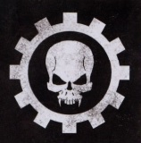

# 0422 阿维尼氏族 Clan Avernii

精校状态：中文行文已逐段精校，部分术语仍为暂定

分类：通用概念 / 帝国 Imperium / 中央政务部 Adeptus Terra / 阿斯塔特修会 Adeptus Astartes

原文来源：https://www.bilibili.com/opus/1119056314587152469

原作者：帝国神选罐头

原文时间：2025年10月02日 15:10

[返回分类目录](目录.md) · [全书目录](../../目录.md)

<!-- A0422-B0001 -->
**英文原文**

Clan Avernii, known as the "Forge-Born", is one of the ten active Clan-Companies of the Iron Hands.

<!-- /A0422-B0001 -->

<!-- A0422-B0002 -->

原译文

阿维尼氏族，被称为“铸炉之裔”，是钢铁之手十个活跃氏族之一。

**校订译文**

阿维尼氏族又称“铸炉之裔”，是钢铁之手现役十个氏族连队之一。

<!-- /A0422-B0002 -->

<!-- A0422-B0003 图片 -->

<!-- A0422-B0004 -->

原译文

Symbol of Clan Avernii 阿维尼氏族标志

**校订译文**

Symbol of Clan Avernii 阿维尼氏族标志

<!-- /A0422-B0004 -->

<!-- A0422-B0005 -->
## Overview 概述

<!-- /A0422-B0005 -->

<!-- A0422-B0006 -->
**英文原文**

During the time of the Horus Heresy, the Avernii provided the Morlock Terminator elite that acted as the guards of Ferrus Manus. Today they act as the Veteran Company of the Chapter. Unlike most Veteran companies, the Avernii consist not of those who have served for the longest within the Chapter but rather those who have received the heaviest and most perfected bionic augmentation. It is said that the Avernii are literally rebuilt, stripped of entire limbs and internal organs. Implanted cogitators provide access into the Chapter's datastores, compensating for inexperience with cold, hard facts and unfaltering logic. All Iron Hands make extensive use of simuluation chambers to test a battle's manifold outcomes before ever a shot is fired, but the Avernii maintain simulus data-tethers even during combat, applying pre-cogitated solutions to developments as they occur. Such drastic procedures lead to horrific attrition results, but surviving the process is considered a test of worthiness.

<!-- /A0422-B0006 -->

<!-- A0422-B0007 -->

原译文

在荷鲁斯叛乱时期，阿维尼提供了莫洛克终结者精英，他们充当了费鲁斯·马努斯的卫队。今天，他们担任战团的老兵连队。与大多数老兵连队不同，阿维尼不包括那些在战团内服役时间最长的人，而是那些接受过最重、最完善的仿生增强的人。据说阿维尼实际上是重组的，被剥夺了所有肢体和内脏。植入的沉思者提供了对战团数据存储的访问，弥补了对冷酷、确凿的事实和坚定不移的逻辑的缺乏经验。所有钢铁之手在射击前都会广泛使用模拟室来测试战斗的多种结果，但阿维尼即使在战斗中也会保持同步数据链，在发生进展时应用预先考虑的解决方案。这种激烈的程序会导致可怕的损耗结果，但在这个过程中幸存下来被认为是一种价值测试。

**校订译文**

荷鲁斯之乱时期，阿维尼氏族提供了担任费鲁斯·马努斯卫队的莫洛克终结者精锐。如今，阿维尼充当战团的老兵连队。与大多数老兵连队不同，其成员并非按服役年限选拔，而是由接受了最彻底、最完善的机械义体改造者组成。据说，阿维尼战士的身体确实经过了重建，整条肢体与内部器官都会被切除替换。植入式沉思者让他们能够接入战团资料库，以冷静确凿的数据和毫不动摇的逻辑弥补经验不足。所有钢铁之手都会在开战前广泛使用模拟舱，推演战斗的各种结果；阿维尼战士则连作战时都保持与模拟系统的数据连接，随着战况发展，运用预先演算的应对方案。如此激进的改造会造成惊人的减员，但能否熬过这一过程，本身就被视为资格考验。

**校注：** 原译将“以数据和逻辑弥补经验不足”错误拆接；entire limbs 指整条肢体，并不等于英文未说明的“所有肢体和内脏”。

<!-- /A0422-B0007 -->

<!-- A0422-B0008 -->
**英文原文**

The result are warriors who are cold and distant, but implanted with the most precious relics of the Chapter. It is said that the only emotions an Avernii feels are the inherited guilt for Ferrus Manus's death, and the righteous anger to see it avenged upon those who would threaten the Imperium.

<!-- /A0422-B0008 -->

<!-- A0422-B0009 -->

原译文

结果是战士们冷漠而疏远，但植入了战团最珍贵的圣物。据说，阿维尼唯一能感受到的情绪是对费鲁斯·马努斯之死的继承性内疚，以及看到它向那些威胁帝国的人复仇的正义愤怒。

**校订译文**

造就出的战士冷漠疏离，体内却植入了战团最珍贵的圣物。据说，阿维尼战士仅存的情感，是对费鲁斯·马努斯之死代代承袭的负罪感，以及向一切威胁帝国者复仇的义愤。

<!-- /A0422-B0009 -->

<!-- A0422-B0010 -->
## Notable Members 著名成员

<!-- /A0422-B0010 -->

<!-- A0422-B0011 -->
**英文原文**

Caanok Var - Current Iron Captain

<!-- /A0422-B0011 -->

<!-- A0422-B0012 -->

原译文

卡诺克·瓦尔 - 现任钢铁连长

**校订译文**

卡诺克·瓦尔 - 现任钢铁连长

<!-- /A0422-B0012 -->

<!-- A0422-B0013 -->
**英文原文**

Gabriel Santar, Captain of the Morlocks, First Captain of the Iron Hands. (Heresy-era)

<!-- /A0422-B0013 -->

<!-- A0422-B0014 -->

原译文

加百列·桑塔尔 - 莫洛克的连长，钢铁之手第一连长（叛乱时期）

**校订译文**

加百列·桑塔尔 - 莫洛克的连长，钢铁之手第一连长（叛乱时期）

<!-- /A0422-B0014 -->

<!-- A0422-B0015 -->
**英文原文**

Vaakal Desaan - Captain of the 9th Company (Heresy-era)

<!-- /A0422-B0015 -->

<!-- A0422-B0016 -->

原译文

瓦卡尔·德萨安 - 第九连队的连长（叛乱时期）

**校订译文**

瓦卡尔·德萨安 - 第九连队的连长（叛乱时期）

<!-- /A0422-B0016 -->

<!-- A0422-B0017 -->
**英文原文**

Ignatius Numen - Heresy-era

<!-- /A0422-B0017 -->

<!-- A0422-B0018 -->

原译文

伊格纳图斯·努门 - 叛乱时期

**校订译文**

伊格内修斯·努门——叛乱时期。

<!-- /A0422-B0018 -->

<!-- A0422-B0019 -->
**英文原文**

Vermanus Cybus - Heresy-era

<!-- /A0422-B0019 -->

<!-- A0422-B0020 -->

原译文

威尔马努斯·赛布斯 - 叛乱时期

**校订译文**

威尔马努斯·赛布斯 - 叛乱时期

<!-- /A0422-B0020 -->

<!-- A0422-B0021 -->
**英文原文**

Erasmus Ruuman - Heresy-era

<!-- /A0422-B0021 -->

<!-- A0422-B0022 -->

原译文

伊拉兹马斯·鲁曼 - 叛乱时期

**校订译文**

伊拉兹马斯·鲁曼 - 叛乱时期

<!-- /A0422-B0022 -->

<!-- A0422-B0023 -->
**英文原文**

Morn - Dreadnought (Heresy-era)

<!-- /A0422-B0023 -->

<!-- A0422-B0024 -->

原译文

莫恩 - 无畏（叛乱时期）

**校订译文**

莫恩——无畏机甲驾驶员（叛乱时期）。

<!-- /A0422-B0024 -->

<!-- A0422-B0025 -->
## Trivia 琐事

<!-- /A0422-B0025 -->

<!-- A0422-B0026 -->
**英文原文**

The Avernii are likely named after the Arverni, who were a Gallic people dwelling in the modern Auvergne region during the Iron Age and the Roman period. They were one of the most powerful tribes of ancient Gaul, contesting primacy over the region with the neighbouring Aedui.

<!-- /A0422-B0026 -->

<!-- A0422-B0027 -->

原译文

阿维尼可能以阿维尔尼的名字命名，阿维尔尼是铁器时代和罗马时期居住在现代奥弗涅地区的高卢人。他们是古代高卢最强大的部落之一，与邻近的埃杜维争夺该地区的主导地位。

**校订译文**

阿维尼可能以阿维尔尼的名字命名，阿维尔尼是铁器时代和罗马时期居住在现代奥弗涅地区的高卢人。他们是古代高卢最强大的部落之一，与邻近的埃杜维争夺该地区的主导地位。

<!-- /A0422-B0027 -->

本篇核心术语与暂定项

以下列出本篇出现的英文原形及核心术语表用词。同形词可能指不同对象，具体词义以本篇正文和校注为准；单复数、别名和仅见于图注的名称可能尚未列入。完整候选见[术语表](../../术语表/双语术语候选.csv)。

| 英文 | 采用中文 | 状态 |
| --- | --- | --- |
| Terminator | 终结者 | 官方已核对 |
| Horus Heresy | 荷鲁斯之乱 | 官方已核对 |
| Imperium | 帝国 | 暂定·简称 |
| Ferrus Manus | 费鲁斯·马努斯 | 暂定·官方待核 |
| Horus | 荷鲁斯 | 暂定·官方待核 |
| Iron Hands | 钢铁之手 | 暂定·官方待核 |
| Numen | 守护神 | 暂定·官方待核 |
| Ancient | 旗手 | 官方已核对 |
| Ignatius Numen | 伊格内修斯·努门 | 暂定·官方待核 |
| Erasmus Ruuman | 伊拉斯谟·鲁曼 | 暂定·官方待核 |
| First Captain | 第一连长 | 暂定·官方待核 |
| Gabriel Santar | 加百列·桑塔尔 | 暂定·官方待核 |
| Chapter | 战团 | 暂定·官方待核 |
| Captain | 连长 | 暂定·官方待核 |
| Veteran | 老兵 | 暂定·官方待核 |
| Veteran Company | 老兵连队 | 暂定·官方待核 |
| Dreadnought | 无畏机甲 | 暂定·官方待核 |
| Clan Avernii | 阿维尼氏族 | 暂定·官方待核 |
| Caanok Var | 卡诺克·瓦尔 | 暂定·官方待核 |
| Morlocks | 莫洛克 | 暂定·官方待核 |
| Vaakal Desaan | 瓦卡尔·德萨安 | 暂定·官方待核 |
| Vermanus Cybus | 威尔马努斯·赛布斯 | 暂定·官方待核 |
| Morn | 莫恩 | 暂定·官方待核 |
| Morlock | 莫洛克 | 暂定·官方待核 |
| Ignatius | 伊格纳修斯 | 暂定·官方待核 |

