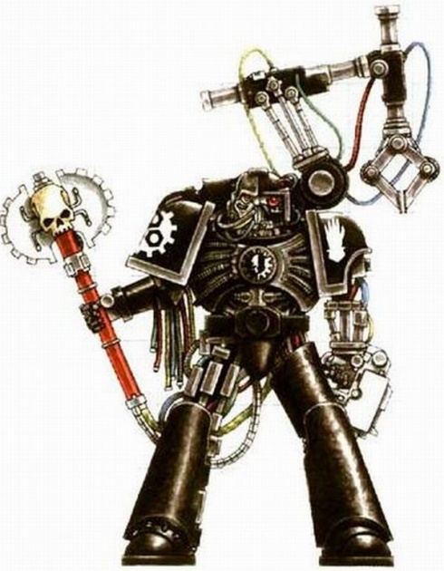
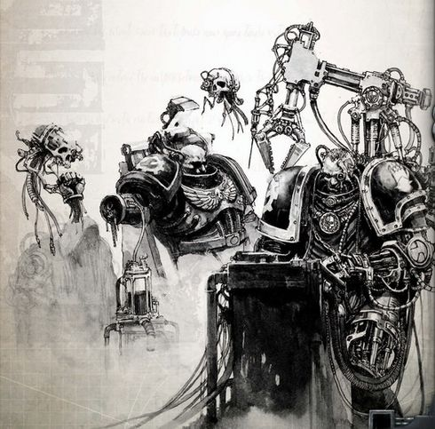
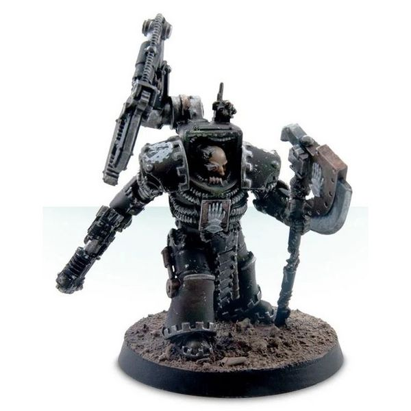
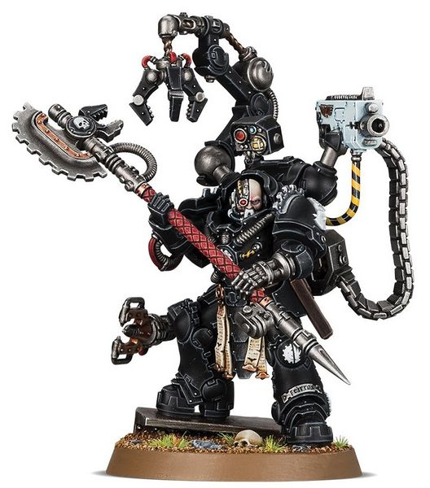

# 0424 钢铁圣父 Iron Father

精校状态：中文行文已逐段精校，部分术语仍为暂定

分类：通用概念 / 帝国 Imperium / 中央政务部 Adeptus Terra / 阿斯塔特修会 Adeptus Astartes

原文来源：https://www.bilibili.com/opus/1112059185806180392

原作者：帝国神选罐头

原文时间：2025年09月13日 18:37

[返回分类目录](目录.md) · [全书目录](../../目录.md)

原篇名：铁父 Iron Father

<!-- A0424-B0001 -->
**英文原文**

Iron Fathers are a rank within the Chapter of the Iron Hands combining that of Chaplain and Techmarine. They also are members of the Chapter's Iron Council, where precisely forty-one Iron Fathers sit.

<!-- /A0424-B0001 -->

<!-- A0424-B0002 -->

原译文

铁父是钢铁之手战团中的一个等级，结合了牧师和技术军士。他们也是战团钢铁议会的成员，那里正好有41位铁父。

**校订译文**

钢铁圣父是钢铁之手战团的一种职衔，兼具教士与科技战士的职责。他们也是战团钢铁议会的成员；议会恰有41个钢铁圣父席位。

<!-- /A0424-B0002 -->

<!-- A0424-B0003 图片 -->

<!-- A0424-B0004 -->

原译文

Iron Hands Iron Father 钢铁之手铁父

**校订译文**

Iron Hands Iron Father 钢铁之手钢铁圣父

<!-- /A0424-B0004 -->

<!-- A0424-B0005 -->
## Overview 概述

<!-- /A0424-B0005 -->

<!-- A0424-B0006 -->
**英文原文**

The Iron Fathers are known to fuel the hatred and anger of the Iron Hands through the use of rousing speeches and oratories, which encourages their growth and intensity. Originally during the Great Crusade they were not members of the Legion at all, but rather engineer-mystics who maintained Dark Age of Technology machinery on Medusa. When Ferrus Manus took command of the Iron Hands the Iron Fathers were assimilated into the Legion and the rank was bestowed to Battle-Brothers. Since the Heresy, the Iron Fathers form the guiding voice of the Iron Hands and oversee both Battle-Brothers and the Chapter Armoury. They are usually heavily modified with Bionics, and are known for their stern resolve and disdain for weakness.

<!-- /A0424-B0006 -->

<!-- A0424-B0007 -->

原译文

众所周知，铁父通过使用激动人心的演讲和演说来煽动钢铁之手的仇恨和愤怒，这鼓励了他们的成长和强度。最初在大远征期间，他们根本不是军团成员，而是在美杜莎维持黑暗技术时代机械的神秘工程师。当费鲁斯·马努斯指挥钢铁之手时，铁父被同化到军团，并被授予战斗兄弟的军衔。自叛乱以来，铁父组成了钢铁之手的指导声音，并监督战斗兄弟和战团军械库。它们通常经过仿生部件的大量改造，以其坚定的决心和对软弱的蔑视而闻名。

**校订译文**

钢铁圣父善用激昂的演说，不断煽动并强化钢铁之手的仇恨与愤怒。大远征初期，他们尚非军团成员，而是在美杜莎维护科技黑暗时代机械的神秘主义工程师。费鲁斯·马努斯接掌钢铁之手后，这些钢铁圣父被纳入军团，而这一职衔也开始授予战斗兄弟。自荷鲁斯之乱以来，钢铁圣父便担负起指引战团的职责，同时监督战斗兄弟与战团军械库。他们通常接受了大量机械义体改造，以意志坚定、鄙弃软弱而闻名。

**校注：** 原译把“将钢铁圣父职衔授予战斗兄弟”倒置成“向钢铁圣父授予战斗兄弟军衔”，现按英文修复。

<!-- /A0424-B0007 -->

<!-- A0424-B0008 -->
**英文原文**

Many Iron Fathers have once been Techmarines, but neither rank nor duty is a barrier to receiving this honor. The current Iron Council draws upon Chaplains, Librarians, Apothecaries, Techmarines, Veteran Sergeants, and even low-level Battle-Brothers to join the rank of the Iron Fathers. Every Clan Company must always have at least one Iron Father amongst its numbers, while most have more.

<!-- /A0424-B0008 -->

<!-- A0424-B0009 -->

原译文

许多铁父曾经是技术军士，但无论是军衔还是职责都不是获得这一荣誉的障碍。目前的钢铁议会吸引了牧师、智库、药剂师、技术军士、老兵军士，甚至低级战斗兄弟加入铁父的行列。每个氏族连队的成员中都必须至少有一个铁父，而大多数氏族连队都有更多。

**校订译文**

许多钢铁圣父曾是科技战士，但出身何种军阶、担任何种职责，都不妨碍一个人获此殊荣。如今的钢铁议会会从教士、智库员、药剂师、科技战士、老兵军士，甚至普通战斗兄弟中选拔钢铁圣父。每个氏族连队都必须至少拥有一位钢铁圣父，多数连队则不止一位。

**校注：** 本篇开头采用兼具教士与科技战士职责的传统定义，此处又说明成员可来自更多岗位；按英文保留两种口径，未据其一删除另一段。

<!-- /A0424-B0009 -->

<!-- A0424-B0010 图片 -->

<!-- A0424-B0011 -->

原译文

Iron Fathers 铁父

**校订译文**

Iron Fathers 钢铁圣父

<!-- /A0424-B0011 -->

<!-- A0424-B0012 -->
**英文原文**

During the Great Crusade, the Iron Hands were engaging a war of extermination against the Diasporex. One Iron Hand captain known as Balhaan failed in his duty in destroying a small fleet of theirs due to treachery on their path. Though Ferrus Manus was tempted to take Balhaan's head off for his failure, his Equerry advised him to instead place an Iron Father in joint command of the Ferrum as punishment.

<!-- /A0424-B0012 -->

<!-- A0424-B0013 -->

原译文

在大远征期间，钢铁之手正在对流散者进行一场灭绝战争。一位被称为巴尔汉的钢铁之手连着因途中的背叛而未能摧毁他们的一支小舰队。尽管费鲁斯·马努斯很想因为巴尔汉的失败而砍下他的头，但他的侍从官建议他让一位铁父加入钢铁号的指挥作为惩罚。

**校订译文**

大远征期间，钢铁之手曾对流散者发动灭绝战争。一位名叫巴尔汉的钢铁之手连长因途中遭遇背叛，未能摧毁敌方的一支小型舰队。费鲁斯·马努斯原想因其失职而将他斩首，但侍从官劝他改派一位钢铁圣父，与巴尔汉共同指挥钢铁号，以此作为惩罚。

<!-- /A0424-B0013 -->

<!-- A0424-B0014 图片 -->

<!-- A0424-B0015 -->

原译文

Iron Fathers 铁父

**校订译文**

Iron Fathers 钢铁圣父

<!-- /A0424-B0015 -->

<!-- A0424-B0016 -->
## Known Iron Fathers 著名钢铁圣父

原题：Known Iron Fathers 著名铁父

<!-- /A0424-B0016 -->

<!-- A0424-B0017 -->
### Heresy Era 叛乱时期

<!-- /A0424-B0017 -->

<!-- A0424-B0018 -->

原译文

Ares Voitek 艾瑞斯·伏伊泰克

**校订译文**

Ares Voitek 艾瑞斯·伏伊泰克

<!-- /A0424-B0018 -->

<!-- A0424-B0019 -->

原译文

Arnok Kraan 阿诺克·克莱恩

**校订译文**

Arnok Kraan 阿诺克·克莱恩

<!-- /A0424-B0019 -->

<!-- A0424-B0020 -->

原译文

Autek Mor 奥泰克·摩尔

**校订译文**

Autek Mor 奥特克·莫尔

<!-- /A0424-B0020 -->

<!-- A0424-B0021 -->

原译文

Diederik 迪德里克

**校订译文**

Diederik 迪德里克

<!-- /A0424-B0021 -->

<!-- A0424-B0022 -->

原译文

Frater Thamatica 弗拉特·萨玛提卡

**校订译文**

Frater Thamatica 弗拉特·塔玛提卡

<!-- /A0424-B0022 -->

<!-- A0424-B0023 -->

原译文

Jebez Aug 杰贝兹·奥格

**校订译文**

Jebez Aug 杰贝兹·奥格

<!-- /A0424-B0023 -->

<!-- A0424-B0024 -->
**英文原文**

Kardozia - Dreadnought

<!-- /A0424-B0024 -->

<!-- A0424-B0025 -->

原译文

卡多佐 - 无畏

**校订译文**

卡多佐——无畏机甲驾驶员。

<!-- /A0424-B0025 -->

<!-- A0424-B0026 -->

原译文

Kastigan Ulok 卡斯蒂甘·乌洛克

**校订译文**

Kastigan Ulok 卡斯蒂甘·乌洛克

<!-- /A0424-B0026 -->

<!-- A0424-B0027 -->

原译文

Sabik Wayland 沙毕克·威兰德

**校订译文**

Sabik Wayland 萨比克·韦兰

<!-- /A0424-B0027 -->

<!-- A0424-B0028 -->

原译文

Venbrass 文布拉斯

**校订译文**

Venbrass 文布拉斯

<!-- /A0424-B0028 -->

<!-- A0424-B0029 -->

原译文

Vilgus Darrak 维尔格斯·达拉克

**校订译文**

Vilgus Darrak 维尔格斯·达拉克

<!-- /A0424-B0029 -->

<!-- A0424-B0030 -->
### Post-Heresy 叛乱后

<!-- /A0424-B0030 -->

<!-- A0424-B0031 -->

原译文

Anatolus Gdolkin 阿纳托尔斯·格多尔金

**校订译文**

Anatolus Gdolkin 阿纳托尔斯·格多尔金

<!-- /A0424-B0031 -->

<!-- A0424-B0032 -->
**英文原文**

Arnok Kraan, Clan Garrsak

<!-- /A0424-B0032 -->

<!-- A0424-B0033 -->

原译文

阿诺克·克莱恩，格萨卡氏族

**校订译文**

阿诺克·克莱恩，格拉萨克氏族。

<!-- /A0424-B0033 -->

<!-- A0424-B0034 -->
**英文原文**

Bartolk, Clan Sorrgol

<!-- /A0424-B0034 -->

<!-- A0424-B0035 -->

原译文

巴托克，索古罗氏族

**校订译文**

巴托克，索古罗氏族

<!-- /A0424-B0035 -->

<!-- A0424-B0036 -->
**英文原文**

Bassan Terak - Red Talons

<!-- /A0424-B0036 -->

<!-- A0424-B0037 -->

原译文

巴桑·特拉克 - 红爪

**校订译文**

巴桑·特拉克 - 红爪

<!-- /A0424-B0037 -->

<!-- A0424-B0038 -->

原译文

Daarmos 达尔莫斯

**校订译文**

Daarmos 达尔莫斯

<!-- /A0424-B0038 -->

<!-- A0424-B0039 -->

原译文

Feirros 费罗斯

**校订译文**

Feirros 费洛斯

<!-- /A0424-B0039 -->

<!-- A0424-B0040 图片 -->

<!-- A0424-B0041 -->

原译文

Malkaan Feirros 马尔坎·费罗斯

**校订译文**

Malkaan Feirros 马尔坎·费洛斯

<!-- /A0424-B0041 -->

<!-- A0424-B0042 -->

原译文

Gdolkin 格多尔金

**校订译文**

Gdolkin 格多尔金

<!-- /A0424-B0042 -->

<!-- A0424-B0043 -->

原译文

Graevaar 格雷瓦尔

**校订译文**

Graevaar 格雷瓦尔

<!-- /A0424-B0043 -->

<!-- A0424-B0044 -->

原译文

Grolvoch 格罗尔沃奇

**校订译文**

Grolvoch 格罗尔沃奇

<!-- /A0424-B0044 -->

<!-- A0424-B0045 -->

原译文

Hervel Khatir 赫维尔·克哈提尔

**校订译文**

Hervel Khatir 赫维尔·克哈提尔

<!-- /A0424-B0045 -->

<!-- A0424-B0046 -->

原译文

Jorgirr Shidd 乔吉尔·希德

**校订译文**

Jorgirr Shidd 乔吉尔·希德

<!-- /A0424-B0046 -->

<!-- A0424-B0047 -->
**英文原文**

Jurkim Bohr - Brazen Claws

<!-- /A0424-B0047 -->

<!-- A0424-B0048 -->

原译文

朱尔奇姆·波尔 - 黄铜之爪

**校订译文**

朱尔奇姆·波尔 - 黄铜之爪

<!-- /A0424-B0048 -->

<!-- A0424-B0049 -->

原译文

Kardan Stronos 卡丹·斯特罗诺斯

**校订译文**

Kardan Stronos 卡丹·斯特罗诺斯

<!-- /A0424-B0049 -->

<!-- A0424-B0050 -->

原译文

Karrdas 卡尔达斯

**校订译文**

Karrdas 卡尔达斯

<!-- /A0424-B0050 -->

<!-- A0424-B0051 -->

原译文

Kristos 克里斯托斯

**校订译文**

Kristos 克里斯托斯

<!-- /A0424-B0051 -->

<!-- A0424-B0052 -->

原译文

Lydriik 林德里克

**校订译文**

Lydriik 林德里克

<!-- /A0424-B0052 -->

<!-- A0424-B0053 -->

原译文

Marrus 马鲁斯

**校订译文**

Marrus 马鲁斯

<!-- /A0424-B0053 -->

<!-- A0424-B0054 -->

原译文

Menestus 梅内斯图斯

**校订译文**

Menestus 梅内斯图斯

<!-- /A0424-B0054 -->

<!-- A0424-B0055 -->
**英文原文**

Orban Lomax-Clan Sorrgol

<!-- /A0424-B0055 -->

<!-- A0424-B0056 -->

原译文

欧尔班·洛马克斯-索古罗氏族

**校订译文**

欧尔班·洛马克斯-索古罗氏族

<!-- /A0424-B0056 -->

<!-- A0424-B0057 -->

原译文

Paullian Blantar 保利安·布兰塔尔

**校订译文**

Paullian Blantar 保利安·布兰塔尔

<!-- /A0424-B0057 -->

<!-- A0424-B0058 -->

原译文

Rathkugan 拉斯库甘

**校订译文**

Rathkugan 拉斯库甘

<!-- /A0424-B0058 -->

<!-- A0424-B0059 -->

原译文

Sarlock 萨洛克

**校订译文**

Sarlock 萨洛克

<!-- /A0424-B0059 -->

<!-- A0424-B0060 -->
**英文原文**

Setol Sollex - Sons of Medusa

<!-- /A0424-B0060 -->

<!-- A0424-B0061 -->

原译文

赛托尔·索勒斯 - 美杜莎之子

**校订译文**

赛托尔·索勒斯 - 美杜莎之子

<!-- /A0424-B0061 -->

<!-- A0424-B0062 -->

原译文

Shulgaar 舒尔加尔

**校订译文**

Shulgaar 舒尔加尔

<!-- /A0424-B0062 -->

<!-- A0424-B0063 -->

原译文

Verrox 维罗克斯

**校订译文**

Verrox 维罗克斯

<!-- /A0424-B0063 -->

<!-- A0424-B0064 -->
**英文原文**

Xerill - Master of the Forge of the Deathwatch

<!-- /A0424-B0064 -->

<!-- A0424-B0065 -->

原译文

薛瑞尔 - 死亡守望铸造大师

**校订译文**

薛瑞尔 - 死亡守望铸造大师

<!-- /A0424-B0065 -->

本篇核心术语与暂定项

以下列出本篇出现的英文原形及核心术语表用词。同形词可能指不同对象，具体词义以本篇正文和校注为准；单复数、别名和仅见于图注的名称可能尚未列入。完整候选见[术语表](../../术语表/双语术语候选.csv)。

| 英文 | 采用中文 | 状态 |
| --- | --- | --- |
| Deathwatch | 死亡守望 | 官方已核对 |
| Dark Age of Technology | 黑暗科技时代 | 暂定 |
| Techmarine | 科技战士 | 官方已核对 |
| Great Crusade | 大远征 | 暂定·官方待核 |
| Ferrus Manus | 费鲁斯·马努斯 | 暂定·官方待核 |
| The Diasporex | 流散者 | 暂定·官方待核 |
| Iron Hands | 钢铁之手 | 暂定·官方待核 |
| Medusa | 美杜莎 | 暂定·官方待核 |
| Bionics | 仿生改造／仿生部件（依语境） | 语境定译·官方待核 |
| Master | 导师（审判庭职衔）／舰务官（舰员职务） | 语境定译·官方待核 |
| Iron Father | 钢铁圣父 | 暂定·官方待核 |
| Master of the Forge | 铸造大师 | 暂定·官方待核 |
| Chaplain | 教士 | 官方已核对 |
| Chapter | 战团 | 暂定·官方待核 |
| Captain | 连长 | 暂定·官方待核 |
| Veteran | 老兵 | 暂定·官方待核 |
| Brazen Claws | 黄铜之爪 | 暂定·官方待核 |
| Red Talons | 红爪 | 暂定·官方待核 |
| Armoury | 军械库 | 暂定·官方待核 |
| Sons of Medusa | 美杜莎之子 | 暂定·官方待核 |
| Equerry | 近侍 | 暂定·官方待核 |
| Veteran Sergeants | 老兵军士 | 暂定·官方待核 |
| Dreadnought | 无畏机甲 | 暂定·官方待核 |
| Iron Fathers | 钢铁圣父 | 暂定·官方待核 |
| Clan Garrsak | 格拉萨克氏族 | 暂定·官方待核 |
| Clan Sorrgol | 索古罗氏族 | 暂定·官方待核 |
| Kardozia | 卡多佐 | 暂定·官方待核 |
| Xerill | 薛瑞尔 | 暂定·官方待核 |
| Arnok Kraan | 阿诺克·克莱恩 | 暂定·官方待核 |
| Bassan Terak | 巴桑·特拉克 | 暂定·官方待核 |
| Jurkim Bohr | 朱尔奇姆·波尔 | 暂定·官方待核 |
| Setol Sollex | 赛托尔·索勒斯 | 暂定·官方待核 |
| Chaplains | 教士 | 暂定·官方待核 |
| Ferrum | 钢铁号 | 暂定·官方待核 |

