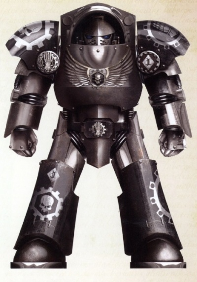
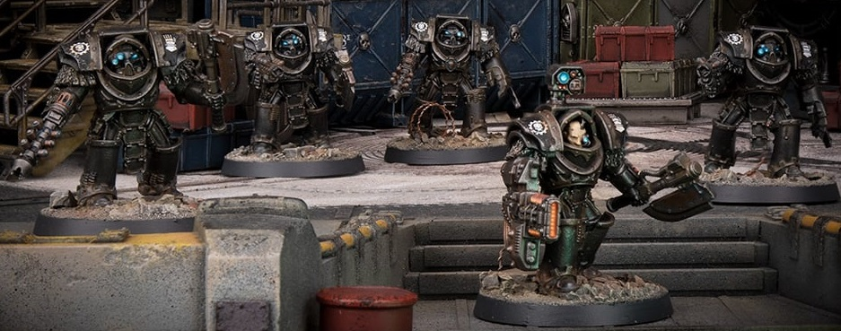

# 0425 莫洛克 Morlock

精校状态：中文行文已逐段精校，部分术语仍为暂定

分类：通用概念 / 帝国 Imperium / 中央政务部 Adeptus Terra / 阿斯塔特修会 Adeptus Astartes

原文来源：https://www.bilibili.com/opus/1030340655519367203

原作者：帝国神选罐头

原文时间：2025年02月05日 13:27

[返回分类目录](目录.md) · [全书目录](../../目录.md)

<!-- A0425-B0001 -->
**英文原文**

The Morlocks are the Veteran elite of the Iron Hands.

<!-- /A0425-B0001 -->

<!-- A0425-B0002 -->

原译文

莫洛克是钢铁之手的老兵精英。

**校订译文**

莫洛克是钢铁之手的老兵精英。

<!-- /A0425-B0002 -->

<!-- A0425-B0003 图片 -->

<!-- A0425-B0004 -->

原译文

Morlock 莫洛克

**校订译文**

Morlock 莫洛克

<!-- /A0425-B0004 -->

<!-- A0425-B0005 -->
## Overview 概述

<!-- /A0425-B0005 -->

<!-- A0425-B0006 -->
**英文原文**

Drawn from the Avernii Clan the Morlocks were named after predators from their homeworld of Medusa and were the toughest warriors within the Legion. As such, they often stood guard at the Anvilarium on the Fist of Iron where Ferrus Manus resided. Elite squad of Morlock Terminators that watched over their Primarch were killed when Fulgrim's Phoenix Guard turned traitor and slaughtered them during the early stages of the Horus Heresy. Other Morlocks (ten companies) were transferred onto the Ferrum for deployment with the Loyalist Legions against the traitor forces at Istvaan V.

<!-- /A0425-B0006 -->

<!-- A0425-B0007 -->

原译文

莫洛克来自阿维尼氏族，以他们家乡美杜莎的捕食者命名，是军团中最强悍的战士。因此，他们经常在钢铁之拳号上的锻造大厅站岗，费鲁斯·马努斯就住在那里。在荷鲁斯叛乱的早期阶段，当福格瑞姆的凤凰卫队叛变并屠杀了他们时，监视他们原体的摩洛克终结者精英小队被杀。其他摩洛克（10个连）被转移到钢铁号，与忠诚派军团一起部署，以对抗伊斯塔万五号的叛徒部队。

**校订译文**

莫洛克选自阿维尼氏族，以母星美杜莎的一种捕食者命名，是军团中最强悍的战士。他们常在钢铁之拳号上费鲁斯·马努斯所在的锻造大厅担任警卫。荷鲁斯之乱初期，福格瑞姆的凤凰卫队倒戈，将负责护卫原体的一支莫洛克终结者精锐小队屠杀殆尽。其他莫洛克部队，共十个连队，被调往钢铁号，准备与忠诚派军团一同在伊斯塔万五号对抗叛军。

**校注：** watched over 指护卫原体，并非原译“监视”。

<!-- /A0425-B0007 -->

<!-- A0425-B0008 图片 -->

<!-- A0425-B0009 -->

原译文

Morlock 莫洛克

**校订译文**

Morlock 莫洛克

<!-- /A0425-B0009 -->

<!-- A0425-B0010 -->
## Notable Morlocks 著名莫洛克

<!-- /A0425-B0010 -->

<!-- A0425-B0011 -->
**英文原文**

Gabriel Santar, Captain of the Morlocks, First Captain of the Iron Hands

<!-- /A0425-B0011 -->

<!-- A0425-B0012 -->

原译文

加百列·桑塔尔，莫洛克连长，钢铁之手第一连长

**校订译文**

加百列·桑塔尔，莫洛克连长，钢铁之手第一连长

<!-- /A0425-B0012 -->

<!-- A0425-B0013 -->
**英文原文**

Vaakal Desaan, Captain of the Ninth Company

<!-- /A0425-B0013 -->

<!-- A0425-B0014 -->

原译文

瓦卡尔·德萨安，第九连连长

**校订译文**

瓦卡尔·德萨安，第九连连长

<!-- /A0425-B0014 -->

<!-- A0425-B0015 -->

原译文

Vermanus Cybus 威尔马努斯·赛布斯

**校订译文**

Vermanus Cybus 威尔马努斯·赛布斯

<!-- /A0425-B0015 -->

<!-- A0425-B0016 -->

原译文

Ignatius Numen 伊格纳图斯·努门

**校订译文**

Ignatius Numen 伊格内修斯·努门

<!-- /A0425-B0016 -->

<!-- A0425-B0017 -->

原译文

Erasmus Ruuman 伊拉兹马斯·鲁曼

**校订译文**

Erasmus Ruuman 伊拉兹马斯·鲁曼

<!-- /A0425-B0017 -->

本篇核心术语与暂定项

以下列出本篇出现的英文原形及核心术语表用词。同形词可能指不同对象，具体词义以本篇正文和校注为准；单复数、别名和仅见于图注的名称可能尚未列入。完整候选见[术语表](../../术语表/双语术语候选.csv)。

| 英文 | 采用中文 | 状态 |
| --- | --- | --- |
| Horus Heresy | 荷鲁斯之乱 | 官方已核对 |
| Primarch | 原体 | 官方已核对 |
| Ferrus Manus | 费鲁斯·马努斯 | 暂定·官方待核 |
| Horus | 荷鲁斯 | 暂定·官方待核 |
| Iron Hands | 钢铁之手 | 暂定·官方待核 |
| Fulgrim | 福格瑞姆 | 官方已核对 |
| Medusa | 美杜莎 | 暂定·官方待核 |
| First Captain | 第一连长 | 暂定·官方待核 |
| Gabriel Santar | 加百列·桑塔尔 | 暂定·官方待核 |
| Captain | 连长 | 暂定·官方待核 |
| Veteran | 老兵 | 暂定·官方待核 |
| Terminators | 终结者 | 暂定·官方待核 |
| Predators | 掠食者 | 暂定·官方待核 |
| Fist of Iron | 钢铁之拳号 | 暂定·官方待核 |
| Morlocks | 莫洛克 | 暂定·官方待核 |
| Vaakal Desaan | 瓦卡尔·德萨安 | 暂定·官方待核 |
| Morlock | 莫洛克 | 暂定·官方待核 |
| Ferrum | 钢铁号 | 暂定·官方待核 |
| Phoenix Guard | 凤凰卫队 | 暂定·官方待核 |

