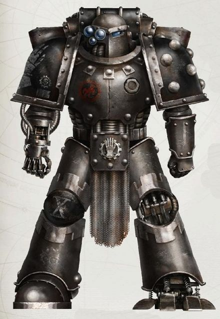
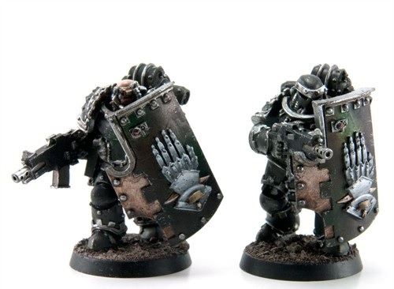

# 0426 美杜莎不朽者 Medusan Immortal

精校状态：中文行文已逐段精校，部分术语仍为暂定

分类：通用概念 / 帝国 Imperium / 中央政务部 Adeptus Terra / 阿斯塔特修会 Adeptus Astartes

原文来源：https://www.bilibili.com/opus/1030340277560148006

原作者：帝国神选罐头

原文时间：2025年02月05日 13:26

[返回分类目录](目录.md) · [全书目录](../../目录.md)

<!-- A0426-B0001 -->
**英文原文**

Medusan Immortals were elite Iron Hands infantry during the Great Crusade and Horus Heresy.

<!-- /A0426-B0001 -->

<!-- A0426-B0002 -->

原译文

在大远征和荷鲁斯叛乱期间，美杜莎不朽者是精英钢铁之手步兵。

**校订译文**

美杜莎不朽者是大远征及荷鲁斯之乱时期钢铁之手的精锐步兵。

<!-- /A0426-B0002 -->

<!-- A0426-B0003 图片 -->

<!-- A0426-B0004 -->

原译文

Medusan Immortal 美杜莎不朽者

**校订译文**

Medusan Immortal 美杜莎不朽者

<!-- /A0426-B0004 -->

<!-- A0426-B0005 -->
**英文原文**

For Iron Hands Legionaries who had failed their rigid standards and codes of battle, whether they were wounded or unable to cope, inducting themselves into the Immortals remained one course of action to redeem themselves. The Immortals were the Legion's final chance at glory, deployed where the battle was fiercest and the risk of survival smallest. Armed principally as Breacher units and featuring a high level of cybernetic modifications, Immortals wore no symbol of their Clan Company or Legion, save its numeration and the death's head symbol. It was their lot to fight and die with a steadfast cold fury, marching relentlessly for redemption.

<!-- /A0426-B0005 -->

<!-- A0426-B0006 -->

原译文

对于那些未能达到严格标准和战斗规范的钢铁之手军团士兵来说，无论他们是受伤还是无法应对，将自己纳入不朽者仍然是一种救赎自己的行动。不朽者是为军团获得荣耀的最后机会，部署在战斗最激烈、生存风险最小的地方。不朽者主要作为破坏者单位武装，并具有高度的智控修改，除了其编号和死颅标志外，他们没有佩戴任何氏族连队或军团的象征。他们注定要以坚定的冷酷愤怒战斗和死亡，无情地走向救赎。

**校订译文**

对于因负伤或能力不足而无法达到军团严苛标准与战斗准则的钢铁之手军团战士，加入不朽者仍是一条自我救赎的道路。这是他们在军团中争取荣耀的最后机会：不朽者总被派往战斗最激烈、生还希望最渺茫之处。他们主要采用攻坚部队的装备，身体接受了大量机械改造，除番号与骷髅徽记外，不佩戴氏族连队或军团标志。他们注定怀着坚定而冷酷的怒火奋战至死，为求救赎而绝不停步。

**校注：** 英文 risk of survival smallest 措辞失当，结合“最激烈战斗”与全段赎罪敢死队语境，应理解为生还机会最小；原译“生存风险最小”会颠倒危险程度。Breacher 按大远征兵种采用攻坚者／攻坚部队，区别 Devastator 破坏者。

<!-- /A0426-B0006 -->

<!-- A0426-B0007 图片 -->

<!-- A0426-B0008 -->

原译文

Medusan Immortals 美杜莎不朽者

**校订译文**

Medusan Immortals 美杜莎不朽者

<!-- /A0426-B0008 -->

本篇核心术语与暂定项

以下列出本篇出现的英文原形及核心术语表用词。同形词可能指不同对象，具体词义以本篇正文和校注为准；单复数、别名和仅见于图注的名称可能尚未列入。完整候选见[术语表](../../术语表/双语术语候选.csv)。

| 英文 | 采用中文 | 状态 |
| --- | --- | --- |
| Horus Heresy | 荷鲁斯之乱 | 官方已核对 |
| Great Crusade | 大远征 | 暂定·官方待核 |
| Horus | 荷鲁斯 | 暂定·官方待核 |
| Iron Hands | 钢铁之手 | 暂定·官方待核 |
| Medusan Immortals | 美杜莎不朽者 | 暂定·官方待核 |
| Immortals | 不朽者 | 官方已核对 |

