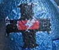
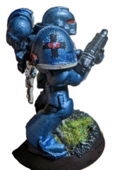
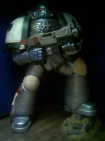
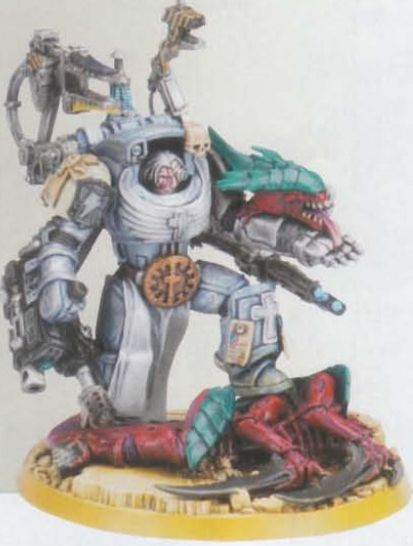
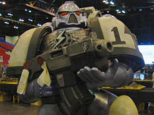
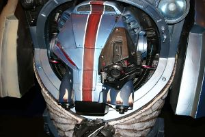

# 0427 钢铁神父 Steel Confessors

精校状态：中文行文已逐段精校，部分术语仍为暂定

分类：通用概念 / 帝国 Imperium / 中央政务部 Adeptus Terra / 阿斯塔特修会 Adeptus Astartes

原文来源：https://www.bilibili.com/opus/1210750426061734001

原作者：帝国神选罐头

原文时间：2026年06月06日 17:30

[返回分类目录](目录.md) · [全书目录](../../目录.md)

原篇名：钢铁告解者 Steel Confessors

<!-- A0427-B0001 -->
**英文原文**

The Steel Confessors are a Space Marine Chapter created by the Adeptus Mechanicus with geneseed provided from the Iron Hands.

<!-- /A0427-B0001 -->

<!-- A0427-B0002 -->

原译文

钢铁告解者是一个由机械神教创造的星际战士战团，由钢铁之手提供基因种子。

**校订译文**

钢铁神父是机械修会以钢铁之手提供的基因种子创建的星际战士战团。

**校注：** 按全书较早第225篇现稿统一 Steel Confessors 为“钢铁神父”；本篇原别名“钢铁告解者”留此追溯。此为战团专名，不套用于 Chaplain 教士职衔。

<!-- /A0427-B0002 -->

<!-- A0427-B0003 图片 -->

<!-- A0427-B0004 图片 -->

<!-- A0427-B0005 图片 -->

<!-- A0427-B0006 -->
**英文原文**

Founding Chapter:Iron Hands

<!-- /A0427-B0006 -->

<!-- A0427-B0007 -->

原译文

建军战团：钢铁之手

**校订译文**

母战团：钢铁之手

<!-- /A0427-B0007 -->

<!-- A0427-B0008 -->
**英文原文**

Founding:M36

<!-- /A0427-B0008 -->

<!-- A0427-B0009 -->

原译文

建军时间：M36

**校订译文**

建军时间：M36

<!-- /A0427-B0009 -->

<!-- A0427-B0010 -->
**英文原文**

Chapter Master:Protonus possibly also named "Proteus"

<!-- /A0427-B0010 -->

<!-- A0427-B0011 -->

原译文

战团长：普罗托努斯也可能被命名为“普罗透斯”

**校订译文**

战团长：普罗托努斯，可能另有“普罗透斯”之名。

<!-- /A0427-B0011 -->

<!-- A0427-B0012 -->
**英文原文**

Homeworld:Kalevala (Librarium, Gene-seed & Manufactorum), Fleet Based (de facto), Kracsis IV (formerly)

<!-- /A0427-B0012 -->

<!-- A0427-B0013 -->

原译文

家园世界：卡莱瓦拉（智库馆，基因种子&制造厂），舰基(事实上)，克拉西斯四号（前）

**校订译文**

母星：卡莱瓦拉（智库馆、基因种子库与制造厂所在地）；实际上以舰队为基地；克拉西斯四号（原母星）。

<!-- /A0427-B0013 -->

<!-- A0427-B0014 -->
**英文原文**

Fortress-Monastery:Kalevala (possibly), Unnamed Kracsis IV Fortress (formerly)

<!-- /A0427-B0014 -->

<!-- A0427-B0015 -->

原译文

堡垒修道院：卡莱瓦拉(可能)，无名克拉西斯四号堡垒

**校订译文**

要塞修道院：可能位于卡莱瓦拉；原为克拉西斯四号上一座未具名的堡垒。

<!-- /A0427-B0015 -->

<!-- A0427-B0016 -->
**英文原文**

Colours:Gunmetal grey and white/bone or blue steel (possibly)

<!-- /A0427-B0016 -->

<!-- A0427-B0017 -->

原译文

配色：枪铁灰和白色/骨色或蓝钢色（可能）

**校订译文**

配色：枪铁灰和白色/骨色或蓝钢色（可能）

<!-- /A0427-B0017 -->

<!-- A0427-B0018 -->
**英文原文**

Specialty:Infantry tactics; anti-tyranid operations

<!-- /A0427-B0018 -->

<!-- A0427-B0019 -->

原译文

专长：步兵战术；反泰伦行动

**校订译文**

专长：步兵战术；反泰伦行动

<!-- /A0427-B0019 -->

<!-- A0427-B0020 -->
**英文原文**

Strength:Crippled

<!-- /A0427-B0020 -->

<!-- A0427-B0021 -->

原译文

力量：残废

**校订译文**

兵力：遭受重创。

<!-- /A0427-B0021 -->

<!-- A0427-B0022 -->
**英文原文**

Battle Cry:Destroy the Weak

<!-- /A0427-B0022 -->

<!-- A0427-B0023 -->

原译文

战吼：摧毁弱者

**校订译文**

战吼：摧毁弱者

<!-- /A0427-B0023 -->

<!-- A0427-B0024 -->
## Overview 概述

<!-- /A0427-B0024 -->

<!-- A0427-B0025 -->
**英文原文**

As Iron Hands Successors, the Steel Confessors were not created in the 2nd Founding as many others were, but are a relatively new chapter. Supplied with astartes gene seed after longstanding support, the Adeptus Mechanicus would create their own chapter, able to act as a rapid response force to defend Mechanicus holdings to the rim of the known Galaxy.

<!-- /A0427-B0025 -->

<!-- A0427-B0026 -->

原译文

作为钢铁之手的继承者，钢铁告解者并不像其他许多那样在二次建军创建，而是一个相对较新的战团。在长期的支援下，获得了阿斯塔特基因种子的机械神教创建自己的战团，能够作为一支快速反应部队，保卫机械教在已知银河系边缘的领地。

**校订译文**

钢铁神父虽是钢铁之手的子战团，却不像许多子战团那样诞生于二次建军，而是一个相对年轻的战团。机械修会因长期提供支援而获赠阿斯塔特基因种子，得以建立自己的战团，作为快速反应部队，保卫散布至已知银河边缘的机械修会领地。

<!-- /A0427-B0026 -->

<!-- A0427-B0027 -->
**英文原文**

The Steel Confessors bear a particular hatred towards the Tyranids, seeing them as their preferred enemy, and have become especially skilled at killing them.

<!-- /A0427-B0027 -->

<!-- A0427-B0028 -->

原译文

钢铁告解者对泰伦怀有特别的仇恨，将它们视为他们的首敌，并且已经变得特别擅长杀死他们。

**校订译文**

钢铁神父尤其憎恨泰伦，将其视为最想消灭的敌人，并练就了猎杀泰伦的专长。

<!-- /A0427-B0028 -->

<!-- A0427-B0029 -->
**英文原文**

They are also referred to as the "crippled Steel Confessors Chapter" and Talos Valcoran, the Soulhunter, had taken a salvaged replacement thigh guard for his own damaged power armour from a suit of Steel Confessors armour.

<!-- /A0427-B0029 -->

<!-- A0427-B0030 -->

原译文

他们也被称为“残缺的钢铁告解者战团”，灵魂猎手塔洛斯·瓦尔科兰从一套钢铁告解者盔甲中取出了一个抢救出来的替代腿甲，以替换他自己损坏的动力盔甲。

**校订译文**

他们也被称作“遭受重创的钢铁神父战团”。灵魂猎手塔洛斯·瓦尔科兰曾从一套钢铁神父护甲上取下一块大腿护甲，用来修补自己受损的动力甲。

<!-- /A0427-B0030 -->

<!-- A0427-B0031 -->
## History 历史

<!-- /A0427-B0031 -->

<!-- A0427-B0032 -->
### The Battle for Tarvor 塔沃尔之战

<!-- /A0427-B0032 -->

<!-- A0427-B0033 -->
**英文原文**

In M36, the Barrus System, an important Mechanicus Foundry and research system, had fallen to the Overlord Barhoth, a Chaos Renegade able to call upon a legion of followers. With the aid of the Dark Mechanicum, the system had been overrun and its manufactorums turned to supplying the Overlord's war efforts. Initial attempts by Skitarii with Imperial Guard assistance to recapture the system were repulsed with heavy losses. Despairing the loss of their facility to the dark powers, the Mechanicus would call upon the Iron Hands for aid - a chapter which had aided them in the past and shared many of their ideals. In response, the Iron Council would send three full companies of Space Marines under the overall command of Venerable Dreadnought Grixus of the Gravehold Clan Company, to aid the Skitarii and Guard forces in retaking the system.

<!-- /A0427-B0033 -->

<!-- A0427-B0034 -->

原译文

在M36，重要的机械教铸造和研究星系 — 巴鲁斯星系，落入了能够召集大批追随者的混沌变节霸主巴霍斯之手。在黑暗机械教的帮助下，星系已被攻破，其制造厂转而为霸主的战争提供补给。护教军在帝国卫队的协助下夺回该星系的最初尝试被击退，损失惨重。机械教对黑暗势力夺走他们的设施感到绝望，于是向钢铁之手求助 — 这一战团在过去曾帮助过他们，并分享了他们的许多想法。作为回应，钢铁议会派遣三个完整的星际战士连队，由格雷夫霍尔德氏族连队的神圣无畏舰格里克斯全权指挥，以协助护教军和卫队夺回该星系。

**校订译文**

M36，机械修会重要的铸造与研究中心巴鲁斯星系落入混沌叛徒、霸主巴霍斯之手。他能召集大批追随者，又得到黑暗机械教协助，攻占整个星系，将其中的制造厂转用于供应自己的战争。护教军曾在帝国卫队支援下尝试收复星系，却被击退，损失惨重。眼见设施落入黑暗势力之手，机械修会绝望之余，向钢铁之手求援；后者过去曾援助他们，也与他们有着许多共同理念。钢铁议会随即派出三个满编星际战士连队，由格雷夫霍尔德氏族连队的神圣无畏机甲格里克斯统一指挥，协助护教军与帝国卫队夺回星系。

<!-- /A0427-B0034 -->

<!-- A0427-B0035 -->
**英文原文**

The campaign would prove harsh, with neither the Imperials nor the traitors expecting any quarter. The Iron Hands proved a godsend to the battered Imperial forces, attacking the Overlord's forces without warning before redeploying once resistance would stiffen. Skitarii and Imperial Guard forces would then move in to tie up enemy reinforcements sent to the area. Within months the foothold on Barrus III, the main foundry of the system, would grow until 75% of the planet had been retaken. The three companies would also begin operations to retake other planets within the Barrus System. Within five years, the majority of the system was once again in Imperial hands, with the Overlord's last holdout being the planet of Tarvor. Tarvor was a planet that specialised in the research and manufacture of shielding technologies, and was heavily defended. The Imperial forces expected heavy losses in the upcoming fight to recapture the planet.

<!-- /A0427-B0035 -->

<!-- A0427-B0036 -->

原译文

这场战役将证明是残酷的，帝国和叛徒都不指望有任何让步。钢铁之手被证明是受尽打击的帝国军队的天赐之物，在抵抗加强后，他们在毫无预警的情况下袭击了霸主的军队，然后重新部署。然后，斯护教军和帝国卫队进入该地区，拖住派往该地区的敌方增援部队。在几个月内，该星系的主要铸造厂巴鲁斯三号的立足点不断扩大，直到行星的75%被夺回。这三个连队还开始行动，夺回巴鲁斯星系内的其他行星。五年内，该星系的大部分再次掌握在帝国手中，霸主的最后一个据点是塔沃尔行星。塔沃尔是一个专门从事护盾技术研究和制造的行星，并受到严密的防御。帝国部队预计在即将到来的夺回行星的战斗中会有重大损失。

**校订译文**

这场战役异常残酷，帝国军与叛军都不指望对方手下留情。对于已遭重创的帝国部队而言，钢铁之手的到来犹如天赐援军。他们突袭霸主的军队，待敌军抵抗增强便转移部署；护教军与帝国卫队随后推进，牵制赶来增援的敌人。几个月内，帝国军在星系主要铸造世界巴鲁斯三号上的控制区不断扩大，直至收复行星75%的地域。三个连队也开始夺回星系内的其他行星。五年之内，星系大部重归帝国，霸主只剩塔沃尔这最后一处据点。塔沃尔专门研究和制造护盾技术，防御极为严密；帝国部队预计，收复这颗行星将付出惨重代价。

<!-- /A0427-B0036 -->

<!-- A0427-B0037 -->
**英文原文**

Iron Hands Strike Cruisers, alongside ships of the Imperial Navy, would proceed with a long bombardment of Tarvors planetary void shields. Eager to be at the forefront of the assault, and sensing an end to the campaign was near, the Iron Hands would commit all three of their companies. The marines were loaded in thunderhawks, sent through a hole in the shields created by the bombardment. The Overlord had anticipated this, and laid a trap for the Iron Hands. He had aimed the planet's defence batteries where the shields were weakened, before loosing fire upon the Iron Hands aircraft once they were inside. Realizing the dire situation, Grixus ordered a retreat, hoping to reorganise and strike elsewhere. Before they could return through the breech, all communications with the Iron Hands fleet in orbit were cut, and the hole in the void shields resealed. With no other choice, Grixus ordered the thunderhawks to turn about and head towards the planet, knowing fully well they were surely entering another trap. Forced to push through the fire of the defence batteries, by the time they made planetfall only half of the three companies were left alive. Having taken the planet's spaceport, Grixus would try to organise a defence there hoping to hold out long enough for relief to break through the planetary shields and arrive.

<!-- /A0427-B0037 -->

<!-- A0427-B0038 -->

原译文

钢铁之手打击巡洋舰与帝国海军的舰船一起，对塔沃尔的行星虚空盾进行长时间的轰炸。钢铁之手渴望站在进攻的最前沿，并意识到战役即将结束，他们将把三个连队都投入其中。战士登上了雷鹰，穿过轰炸造成的盾牌上的一个洞。霸主预料到了这一点，并为钢铁之手设下了陷阱。他将行星的防御炮阵对准了盾牌被削弱的地方，然后在钢铁之手飞行器进入后向其开火。意识到严峻的形势，格里克斯下令撤退，希望重组并袭击其他地方。在他们能够通过后膛返回之前，与轨道上钢铁之手舰队的所有通信都被切断，虚空盾上的洞被重新密封。格里克斯别无选择，他命令雷鹰转身朝行星飞去，因为他完全知道他们肯定会进入另一个陷阱。被迫穿过防御炮阵的开火，当他们进行行星降落时，三个连队中只有一半还活着。在占领了行星的太空港后，格里克斯试图在那里组织防御，希望能坚持足够长的时间，让救援突破行星护盾到达。

**校订译文**

钢铁之手的打击巡洋舰与帝国海军战舰对塔沃尔的行星虚空盾展开持续轰击。钢铁之手认为战役已近尾声，又渴望担任突击先锋，便投入全部三个连队。战士们登上雷鹰，从炮击撕开的护盾缺口突入。霸主早已料到这一招，并预设陷阱：他把行星防御炮阵对准护盾薄弱处，待钢铁之手的飞机进入后便猛烈开火。格里克斯意识到形势危急，下令撤退，准备重整后另觅攻击方向。然而，他们尚未退回缺口，与轨道舰队的通信便全部中断，虚空盾的破口也随之闭合。格里克斯别无选择，只能命令雷鹰转向行星，即使他明知前方很可能还有另一重陷阱。机群被迫穿越防御炮火，等到成功着陆，三个连队只剩约半数战士生还。占领太空港后，格里克斯尝试组织防御，希望坚持到援军突破行星护盾。

**校注：** breech 在本段是 breach 的疑似误拼，指护盾缺口，并非原译“后膛”。

<!-- /A0427-B0038 -->

<!-- A0427-B0039 -->
**英文原文**

In orbit the ships of the Iron Hands and Imperial Navy concentrated their efforts to break the shields once more. Captain Ullenear of the strike cruiser Omnissiah's Might would signal the Iron Council and request additional aid. Unfortunately, the nearest force of Iron Hands able to be dispatched was at least a month away. Sensing that three entire companies were facing annihilation, it was the Iron Council's turn to request support of the Adeptus Mechanicus, reminding them of their shared ties of loyalty.

<!-- /A0427-B0039 -->

<!-- A0427-B0040 -->

原译文

在轨道上，钢铁之手和帝国海军的舰船集中精力再次打破盾牌。打击巡洋舰欧姆尼赛亚之力号的舰长乌伦尼尔向钢铁议会发出信号，请求额外援助。不幸的是，能够派遣的最近的钢铁之手部队至少还有一个月的时间。钢铁议会意识到三个连队都面临着毁灭，于是轮到他们请求机械教的支援，提醒他们共同的忠诚关系。

**校订译文**

在轨道上，钢铁之手与帝国海军的战舰集中火力，试图再次击破护盾。万机神之力号打击巡洋舰的舰长乌伦尼尔向钢铁议会发讯，请求增援。但最近一支可调动的钢铁之手部队，至少也要一个月才能赶到。眼见整整三个连队面临覆灭，这次轮到钢铁议会向机械修会求援，并提醒对方彼此忠诚相系。

<!-- /A0427-B0040 -->

<!-- A0427-B0041 -->
**英文原文**

The response was swift and forthcoming. Forces from all surrounding systems, including those from recently retaken planets in the Barrus system, were deployed en masse. A vast armada of over 500 ships of the Adeptus Mechanicus Fleet joined the fleet already in orbit, their combined firepower now rent the previously impregnable shield. A force of over 100,000 Skitarii and 4 Warhound Titans were deployed into the breaches, concentrating towards the spaceport where communications had been restored with the beleaguered Iron Hands. The scene they arrived to was one of devastation. Of the 300 marines deployed, 126 had died in the air alone, and of the remainder that made planetfall, only 11 were now left alive. The Overlord had committed his finest troops to their destruction, combined with the loss of maneuverability, had very nearly annihilated them. The Skitarii would secure the spaceport and drive back the traitor forces, as the planetary shields collapsed and the rest of the Mechanicus would deploy on world. This allowed what was left of the Iron Hands to secure the precious geneseed of the fallen that would be needed to rebuild their shattered companies, and take stock of their losses. All three clan company commanders were slain, including Grixus himself, having held out until mere hours before the arrival of reinforcements.

<!-- /A0427-B0041 -->

<!-- A0427-B0042 -->

原译文

反应迅速而快捷。来自周围所有星系的部队，包括最近在巴鲁斯星系中重新夺回的行星的部队，都被大规模部署。一支由500多艘机械神教舰队舰船组成的庞大舰队加入了已经在轨道上的舰队，他们的联合火力现在撕裂了以前坚不可摧的盾牌。一支由100000多名护教军和4架战犬泰坦组成的部队被部署到缺口处，集中力量前往太空港，在那里与四面楚歌的钢铁之手恢复了通信。他们到达的现场是一片废墟。在部署的300名战士中，仅在空中就有126人死亡，而在其余进行行星降落的人中，现在只有11人活着。霸主将他最精锐的部队投入到他们的毁灭中，再加上机动性的丧失，几乎将他们歼灭。当行星护盾坍塌，其余的机械教部署到世界上时，护教军保护太空港并击退叛徒部队。这使得钢铁之手留下的东西能够获得重建他们破碎的连队所需的宝贵的牺牲者的基因种子，并评估他们的损失。所有三名氏族连队指挥官都被杀，包括格里克斯本人，他一直坚持到增援部队到达前几个小时。

**校订译文**

机械修会迅速作出积极回应，从周围各星系大举调集部队，其中也包括巴鲁斯星系新近收复的行星。一支由机械修会舰队500多艘战舰组成的庞大舰队加入轨道上的友军，合力撕开了先前坚不可摧的护盾。十万余名护教军与四台战犬级泰坦穿过缺口，向太空港集结，并与遭围困的钢铁之手恢复了通信。援军抵达时，眼前已是一片惨象：投入作战的300名星际战士，仅在空中就阵亡126人；成功着陆者如今也只剩11人活着。霸主投入最精锐的部队猛攻，而钢铁之手又失去了机动作战的余地，几乎全军覆没。随着行星护盾崩溃，其他机械修会部队登陆，护教军控制太空港并击退叛军。钢铁之手的幸存者终于得以回收阵亡者珍贵的基因种子，清点损失，为重建连队作准备。三个氏族连队的指挥官全部阵亡，格里克斯也未能幸免；他们坚持到援军抵达前仅数小时才倒下。

<!-- /A0427-B0042 -->

<!-- A0427-B0043 -->
**英文原文**

In honour and recognition for having committed such a force to relieve the embattled clan companies, the Iron Council would agree to provide the Adeptus Mechanicus with the chapters own geneseed, sampling from each of its Clan Companies and some of its greatest heroes, so that they might build their own rapid response force. In return, the Mechanicus would send their most revered artificers to aid in the rebuilding of the companies, and dedicate three entire forge worlds to their rearmament.

<!-- /A0427-B0043 -->

<!-- A0427-B0044 -->

原译文

为了纪念和表彰他们投入了这样一支部队来救援四面楚歌的氏族连队，钢铁议会同意向机械神教提供自己的基因种子，从每个氏族连队和一些最伟大的英雄中取样，以便他们建立自己的快速反应部队。作为回报，机械教派遣他们最受尊敬的工匠协助重建连队，并将三个完整的铸造世界用于他们的重新武装。

**校订译文**

为感谢机械修会投入如此庞大的兵力，解救陷入苦战的氏族连队，钢铁议会同意提供战团自己的基因种子，从各氏族连队及部分最杰出的英雄身上采集样本，供机械修会组建自己的快速反应部队。作为回报，机械修会派出最受尊崇的工匠，协助重建受创连队，并让整整三个铸造世界专门为其补充军备。

<!-- /A0427-B0044 -->

<!-- A0427-B0045 -->
### Founding of the Steel Confessors 钢铁神父的建军

原题：Founding of the Steel Confessors 钢铁告解者的建军

<!-- /A0427-B0045 -->

<!-- A0427-B0046 -->
**英文原文**

It would not be long before the Inquisition and the Ordo Hereticus would learn of these events. Questioning the Mechanicus' motives for founding an unsanctioned chapter, they would petition for its termination for only the High Lords of Terra were to have the power to create Space Marine Chapters. Upon review, the High Lords opted to ratify the chapter, so long as they obeyed all ties of fealty required of every chapter (such as submitting geneseed to the great gene vaults on Terra for testing and storage).

<!-- /A0427-B0046 -->

<!-- A0427-B0047 -->

原译文

不久之后，审判庭和讨逆修会得知这些事件。质疑机械教成立未经批准的战团的动机，他们请求终止其行动，因为只有泰拉高领主才有权创建星际战士战团。经过审查，高领主选择批准该战团，只要他们遵守每个战团所要求的所有忠诚关系（例如将基因种子提交给泰拉上的大基因密库进行测试和储存）。

**校订译文**

不久，审判庭及其异端审判庭便得知此事。他们质疑机械修会擅自创建战团的动机，要求撤销这个未经许可的战团，因为只有泰拉高领主有权批准星际战士战团建军。经过审查，高领主决定追认该战团，但要求其承担所有战团都应履行的效忠义务，例如向泰拉的大型基因密库提交基因种子，以供检验和储存。

<!-- /A0427-B0047 -->

<!-- A0427-B0048 -->
**英文原文**

Feeling that they were being forced to follow unfair guidelines and overly scrutinised, the Adeptus Mechanicus opted to name the new chapter "The Steel Confessors."

<!-- /A0427-B0048 -->

<!-- A0427-B0049 -->

原译文

感觉他们被迫遵循不公平的指导方针并受到过度审查，机械修会选择将新战团命名为“钢铁告解者”

**校订译文**

机械修会认为自己被迫遵从不公正的要求，又受到过度审查，于是选择将新战团命名为“钢铁神父”。

<!-- /A0427-B0049 -->

<!-- A0427-B0050 -->
**英文原文**

Avonis would become the first Chapter Master of the Steel Confessors, and their first homeworld would be the Forgeworld of Kracsis IV

<!-- /A0427-B0050 -->

<!-- A0427-B0051 -->

原译文

阿沃尼斯成为钢铁告解者的第一位战团长，他们的第一个家园世界是克拉西斯四号铸造世界

**校订译文**

阿沃尼斯成为钢铁神父的第一位战团长，他们的第一个家园世界是克拉西斯四号铸造世界

<!-- /A0427-B0051 -->

<!-- A0427-B0052 -->
### The Fall of Kracsis IV 克拉西斯四号的陷落

<!-- /A0427-B0052 -->

<!-- A0427-B0053 -->
**英文原文**

Kracsis IV was the original home world of the Steel Confessors. Located in a "quiet" sector of the galaxy, as a forgeworld it specialised in the manufacture of small arms, had a sizeable population, and was loyal both to the Imperium and the Adeptus Mechanicus. This made it an ideal recruiting world for the Steel Confessors. It was centrally located among the rest of the Mechanicus holdings in its sector, ideally placed to allow the Steel Confessors to deploy with ease where they would be needed. The presence of the chapter could even be kept secret, thanks to a cloaking device taken from Tarvor that could make the planet appear as a barren rock to orbital auspex scans. This, in addition to its relatively backwater location, allowed the newly minted chapter the secrecy and time to hone in their skills.

<!-- /A0427-B0053 -->

<!-- A0427-B0054 -->

原译文

克拉西斯四号是钢铁告解者的最初家园世界。它位于银河系的一个“安静”星区，是一个专门制造小型武器的铸造世界，人口众多，忠于帝国和机械神教。这使它成为钢铁告解者的理想招募世界。它位于该星区其他机械教控制区的中心，地理位置优越，可以让钢铁告解者轻松部署到需要的地方。这一战团的存在甚至可以保密，这要归功于从塔沃尔获得的隐形装置，该装置可以使这颗行星在轨道鸟卜仪扫描中看起来像一块贫瘠的岩石。除了相对闭塞的地理位置外，这也为新成立的战团提供了秘密和时间来磨练他们的技能。

**校订译文**

克拉西斯四号是钢铁神父最初的母星。这座专门制造轻武器的铸造世界位于银河一个相对“平静”的星区，人口众多，同时效忠帝国与机械修会，是战团理想的征兵世界。它处于该星区机械修会各处领地的中心，便于战团迅速部署到需要援助之处。从塔沃尔获得的隐蔽装置还能使行星在轨道鸟卜仪扫描中显得像一颗荒芜的岩石星球，掩藏战团的存在。再加上位置偏远，这些条件让新建战团得以隐秘发展，争取到磨练战技的时间。

<!-- /A0427-B0054 -->

<!-- A0427-B0055 -->
**英文原文**

The chapter's skills would soon be put to the test, as the Tyranids of Hive Fleet Behemoth made it rampaging debut across the Imperium in the wake of the First Tyrannic War. The Steel Confessors were at the very forefront of the war in that sector, buying time for the Mechanicus to evacuate its other planets of essential material and personnel from the jaws of the Great Devourer. The Steel Confessors cared not where they fought, so long as they could serve their Mechanicus master's faithfully. This absolute loyalty would prove their undoing, as spread so thinly, and believing its homeworld safe beneath its cloaking shield, active Chapter Master Protonus did not consider the Tyranids a threat to their homeworld. When a hive fleet suddenly appeared at the edge of the system, Protonus had only half of the first company at his disposal.

<!-- /A0427-B0055 -->

<!-- A0427-B0056 -->

原译文

战团的技能很快就会受到考验，因为虫巢舰队贝希摩斯的泰伦在第一次泰伦战争后首次在帝国内横冲直撞地亮相。钢铁告解者处于该星区战争的最前沿，为机械教从大吞噬者的嘴里撤离其他行星的基本物资和人员争取时间。钢铁告解者不在乎他们在哪里战斗，只要他们能忠实地为机械教主人服务。这种绝对的忠诚将证明他们的毁灭，因为他们分散得如此之少，并且相信自己的家园世界在隐形屏障的掩护下是安全的，忙碌的战团长普罗托努斯并不认为泰伦对他们的家园世界构成威胁。当一个虫巢舰队突然出现在星系的边缘时，普罗托努斯只能支配第一连队的一半。

**校订译文**

当贝希摩斯虫巢舰队的泰伦在第一次泰伦战争之后首次横扫帝国时，战团的本领很快迎来了考验。钢铁神父在这一星区冲在最前线，为机械修会从大吞噬者口中撤出其他行星的重要物资与人员争取时间。只要能忠实效力于机械修会的主人，他们并不在意在哪里作战。正是这种绝对忠诚埋下了灾祸：兵力四处分散，战团长普罗托努斯又相信隐蔽屏障足以保护母星，便没有认真看待泰伦对母星的威胁。一支虫巢舰队突然出现在星系边缘时，他手边仅有半个第一连队。

**校注：** 对应中文 B0056 保留英文 in the wake of 所述“第一次泰伦战争之后”；但后文 B0063 又将克拉西斯四号陷落置于第一次泰伦战争中。两种年代口径不一致，未自行择一覆盖。

<!-- /A0427-B0056 -->

<!-- A0427-B0057 -->
**英文原文**

Chapter Master Protonus immediately sent out messages recalling the third, fifth, sixth, and the ninth companies, the ones closest to at that time, and turned to the defence of the planet. The battle for Kracsis IV lasted for three months, as the companies would arrived to stand beside their brethren already on world. The Steel Confessors made the Tyranids pay a horrendous cost for every meter of ground taken, but for every single tyranid slain it seemed fifty were ready to take its place such were their overwhelming numbers. Sensing that the battle was lost, Protonus gave the order for the transports be made ready for planetary evacuation and to make ready to salvage anything that could be. As if also sensing victory at hand, the tyranids renewed their assault and finally breached their way into the chapter's Fortress Monastery. While those survivors still left made their way for the transports, Protonus would lead the remnants of first company in a rear guard action. After a vicious struggle, the first company were able to fight their way to the transports, bearing the body of the Chapter Master who had suffered grievous wounds, having slain a Hive Tyrant himself to stall the tyrannic advance. Kracsis IV was left to its fate, and the surviving marines made to regroup with the rest of the chapter.

<!-- /A0427-B0057 -->

<!-- A0427-B0058 -->

原译文

战团长普罗托努斯立即发出信息，召回当时最近的第三、第五、第六和第九连队，并转向保卫行星。克拉西斯四号之战持续了三个月，因为这些连队抵达，与已经在世界上的兄弟并肩作战。钢铁告解者让泰伦为每一米被占领的土地都付出了可怕的代价，但对于每一个被杀的泰伦来说，似乎都有五十个准备取代它 — 这就是他们压倒性的数量。普罗托努斯感觉到战斗已经失败，下令运输舰做好行星撤离的准备，并准备打捞任何可能的东西。仿佛也感觉到胜利即将到来，泰伦再次发动进攻，最终闯入了战团的堡垒修道院。当那些幸存者仍然离开时，普罗托努斯带领第一连队的残余进行后卫行动。经过一场激烈的战斗，第一连队得以奋力前往运输舰，抬着身受重伤的战团长的身体，他杀死了一个虫巢暴君，以阻止泰伦的推进。克拉西斯四号被任其自生自灭，幸存的战士被迫与战团的其余部分重新集结。

**校订译文**

普罗托努斯立刻发讯召回距离最近的第三、第五、第六与第九连队，同时部署行星防御。克拉西斯四号之战持续三个月，奉召连队陆续赶到，与星球上的兄弟并肩作战。钢铁神父让泰伦每前进一步都付出惨痛代价，可敌人数量压倒性地庞大，仿佛每杀死一只，就有五十只准备补上。普罗托努斯意识到败局已定，便命运输舰准备撤离，并尽可能抢救物资。泰伦似乎也嗅到了胜利，再次猛攻，终于突破战团的要塞修道院。幸存者向运输舰撤退时，普罗托努斯率第一连队残部断后。经过恶战，第一连队杀出重围，抬着身负重伤的战团长登上运输舰；他亲手杀死了一只虫巢暴君，迟滞了泰伦的推进。克拉西斯四号被留待毁灭，幸存战士则去与战团其余部队会合。

<!-- /A0427-B0058 -->

<!-- A0427-B0059 -->
**英文原文**

After the loss of Kracsis IV, the chapter became fleet based, with one exception. On the planet of Kalevala, the Steel Defenders would place their librarium as well as inter Avonis in a Stasis tomb, held there until such a time that the chapter needs him. The Steel Confessors swore an oath to defend that planet against any threat.

<!-- /A0427-B0059 -->

<!-- A0427-B0060 -->

原译文

克拉西斯四号之败后，除了一个例外，该战团成为舰基。在卡莱瓦拉行星上，钢铁防御者把他们的智库馆以及阿沃尼斯埋葬入静滞墓穴里，一直放在那里，直到战团需要他为止。钢铁告解者宣誓保卫这个行星免受任何威胁。

**校订译文**

失去克拉西斯四号后，战团改以舰队为基地，仅有一处例外：他们在卡莱瓦拉安置智库馆，并将阿沃尼斯置于静滞墓穴，等待战团再次需要他的一天。钢铁神父立誓保护这颗行星，抵御一切威胁。

**校注：** 本段英文突称 Steel Defenders，与全文 Steel Confessors 不一致，疑为笔误；中文按上下文指同一战团，以“他们”衔接并在此保留异文。原译另把智库馆也接成被安葬物，现修复。

<!-- /A0427-B0060 -->

<!-- A0427-B0061 -->
### The Battle for Kalevala 卡莱瓦拉之战

<!-- /A0427-B0061 -->

<!-- A0427-B0062 -->
**英文原文**

By the time of the Third Tyrannic War, Kalevala was still an important world of the Steel Confessors. The planet would host a Psychic Choir designed to boost the signal of the Astronomican to allow Imperial shipping to continue to navigate through the psychic miasma of the Shadow in the Warp. It would also hold the chapter's Gene Seed, as well as a vast Manufactorum. Hive Fleet Leviathan would launch an invasion of the world and, honour-bound, the whole of the of the Steel Confessors chapter under now Chapter Master Protonus would fight a battle to repel them. By the time of this battle, the chapter had still not completely recovered from its defeat at Kracsis IV. Even with allied Mechanicus support, only limited recovery had been made for the chapter's vehicle complement, much of it lost centuries ago during Kracsis IV's fall in the first Tyrannic war. What few vehicles remained had to be carefully rationed for only the direst of circumstances in the battle for Kalevala.

<!-- /A0427-B0062 -->

<!-- A0427-B0063 -->

原译文

到第三次泰伦战争时，卡莱瓦拉仍然是钢铁告解者的重要世界。这颗行星举办一个星语唱诗班，旨在增强星炬的信号，使帝国航运能够继续穿越亚空间中阴影的灵能瘴气。它还容纳战团的基因种子，以及一个巨大的制造厂。虫巢舰队利维坦发动一场对世界的入侵，受荣誉约束，现在的战团长普罗托努斯领导下的整个钢铁告解者战团将为击退他们而战。到这场战斗时，战团还没有完全从克拉西斯四号的失败中恢复过来。即使有盟友机械教的支援，战团的载具补充也只得到了有限的恢复，其中大部分是在几个世纪前克拉西斯四号在第一次泰伦战争中陷落时损失的。剩下的几辆载具只能在卡莱瓦拉之战中最可怕的情况下小心地配给。

**校订译文**

第三次泰伦战争时期，卡莱瓦拉仍是钢铁神父的重要世界。这里设有一支灵能合唱团，用于增强星炬信号，让帝国船只能够穿越亚空间之影造成的灵能迷雾；同时，这里还保存着战团的基因种子，并建有庞大的制造厂。利维坦虫巢舰队入侵后，为履行誓言，普罗托努斯率整个钢铁神父战团迎敌。此时，战团尚未从克拉西斯四号的惨败中完全恢复。即使获得机械修会盟友支援，载具也只补回少量；大部分载具早在数百年前第一次泰伦战争、克拉西斯四号陷落时便已损失。卡莱瓦拉之战中，仅存的少量载具必须谨慎调配，只在最危急的时刻投入。

**校注：** 英文称 psychic choir，未明确为 Astropath；因此采用灵能合唱团。原文距第一次泰伦战争“数百年”的说法原样保留，未据其他年表擅改。

<!-- /A0427-B0063 -->

<!-- A0427-B0064 图片 -->

<!-- A0427-B0065 -->

原译文

Chapter Master Protonus possibly also "Proteus" 战团长普罗托努斯也可能是“普罗透斯”

**校订译文**

Chapter Master Protonus possibly also "Proteus" 战团长普罗托努斯也可能是“普罗透斯”

<!-- /A0427-B0065 -->

<!-- A0427-B0066 -->
**英文原文**

The Steel Confessors had a poor reputation when working with other Imperial forces, particularly due to perceived weakness sometimes resulting in the Steel Confessors even firing upon them. For the Battle of Kalevala, they had no allies to call upon, and would have to defend the planet themselves.

<!-- /A0427-B0066 -->

<!-- A0427-B0067 -->

原译文

钢铁告解者在与其他帝国部队合作时声誉不佳，尤其是由于他们认为自己软弱，有时甚至会向他们开火。在卡莱瓦拉之战中，他们没有盟友可以求助，必须自己保卫行星。

**校订译文**

钢铁神父与其他帝国部队合作时名声不佳，尤其是他们有时会因认定盟友表现软弱而向其开火。因此，卡莱瓦拉之战中，他们没有盟友可供求援，只能独自守卫行星。

**校注：** perceived weakness 指钢铁神父认定友军软弱，并非原译“他们认为自己软弱”。

<!-- /A0427-B0067 -->

<!-- A0427-B0068 -->
**英文原文**

For the Steel Confessors, if they were to lose this battle, it could very well spell the death of the entire chapter.

<!-- /A0427-B0068 -->

<!-- A0427-B0069 -->

原译文

对于钢铁告解者来说，如果他们输掉这场战斗，很可能意味着整个战团的死亡。

**校订译文**

对于钢铁神父来说，如果他们输掉这场战斗，很可能意味着整个战团的死亡。

<!-- /A0427-B0069 -->

<!-- A0427-B0070 -->
## Tactics 战术

<!-- /A0427-B0070 -->

<!-- A0427-B0071 -->
**英文原文**

Like their progenitors the Iron Hands, the Steel Confessors bear an uncompromising hatred of weakness in any form; their battlecry being "destroy the weak." Given their close ties with the Mechanicus, bionic augmentation is the chapters norm. All their marines have an affinity with machinery, and this is a requirement for all of their aspirants. With such emphasis on replacing weakened limbs and organs with bionics, marines of the chapter regularly undergo testing to ensure their minds remain strong.

<!-- /A0427-B0071 -->

<!-- A0427-B0072 -->

原译文

像他们的创始战团钢铁之手一样，钢铁告解者对任何形式的软弱都怀有毫不妥协的仇恨；他们的战吼是“摧毁弱者”。鉴于他们与机械教的密切联系，仿生增强是战团的常态。他们所有的战士都与机械有着密切的联系，这是对他们所有有志者的要求。由于强调用仿生代替软弱的肢体和器官，战团的战士定期接受测试，以确保他们的意志保持坚强。

**校订译文**

与母战团钢铁之手一样，钢铁神父对任何形式的软弱都深恶痛绝，毫不妥协，战吼便是“摧毁弱者”。因与机械修会关系密切，机械义体改造在战团中十分普遍。所有战士都对机械有亲和力，这也是选拔候选者的必要条件。他们如此重视用机械义体替换虚弱的肢体和器官，也会定期检查战士的心智，确保精神同样坚强。

<!-- /A0427-B0072 -->

<!-- A0427-B0073 -->
**英文原文**

All Steel Confessors are required to undergo a period of training and indoctrination on Medusa IV under a Clan Company, as part of an agreement between the Iron Hands and the magi of the Mechanicus. During this training, they learn the history of the Iron Hands. Unlike their forebears, the Steel Confessors do not have Iron Fathers, keeping the role of Chaplain and Techmarine separate. Instead, every company captain is trained as a Techmarine and an artificer, and is simultaneously responsible for both roles as proof of his blessing by the Omnissiah.

<!-- /A0427-B0073 -->

<!-- A0427-B0074 -->

原译文

作为钢铁之手和机械教圣贤士之间协议的一部分，所有钢铁告解者都必须在氏族连队接受一段时间的美杜莎四号训练和灌输。在这次训练中，他们学习了钢铁之手的历史。与他们的创始战团不同，钢铁告解者没有铁父，将牧师和技术军士的角色分开。相反，每个连队的连长都接受过技术军士和工匠的训练，同时负责这两个角色，以证明他得到了欧姆尼赛亚的祝福。

**校订译文**

根据钢铁之手与机械修会贤者达成的协议，每一位钢铁神父都必须前往美杜莎四号，随某个氏族连队接受一段时间的训练与教导，学习钢铁之手的历史。与母战团不同，他们不设钢铁圣父，而将教士与科技战士的职责分开。不过，每位连长都接受科技战士及工匠训练，并兼任这些职责，以此证明自己蒙受万机神赐福。

**校注：** Medusa IV 的行星编号按本篇英文保留；前篇钢铁之手母星一般仅称 Medusa。双方所指是否完全一致，待核原始资料。

<!-- /A0427-B0074 -->

<!-- A0427-B0075 -->
**英文原文**

Like their forebears, the Steel Confessors advance relentlessly, giving their foes little time to reorganise as they throw themselves into nigh berserk combat. They have a full complement of Terminator Armour, maintained both by themselves as well as by magi seconded to them by the Adeptus Mechanicus. The suits are typically seen at the forefront of their engagements, providing inspiration to the chapter as a display of devotion to the never ending struggle.

<!-- /A0427-B0075 -->

<!-- A0427-B0076 -->

原译文

像他们的创始战团一样，钢铁告解者无情地前进，让他们的敌人几乎没有时间重组，因为他们把自己投入了近乎疯狂的战斗。他们有一批满额的终结者盔甲，由他们自己和机械神教借调的圣贤士维护。这些套装通常被视为他们交战的最前沿，为战团提供了灵感，展示了对永无止境的战斗的热爱。

**校订译文**

与先辈一样，钢铁神父不断向前推进，以近乎狂暴的战斗压迫敌人，几乎不给对方重整的时间。他们拥有足额的终结者护甲，由战团人员与机械修会借调的贤者共同维护。这些护甲通常出现在战场最前沿，象征他们投身无尽斗争的决心，鼓舞全团。

<!-- /A0427-B0076 -->

<!-- A0427-B0077 -->
**英文原文**

Although they share close ties to the Mechanicus, the Steel Confessors have not fully recovered from their vehicular losses during the fall of Kracsis IV. What few vehicles there were to spare would have to be rationed with utmost care. To adapt to the lack of the means to easily equip and train themselves in the heaviest of equipment, they compensate by focusing on specialised infantry techniques and prevail through the superior fighting qualities of their marines.

<!-- /A0427-B0077 -->

<!-- A0427-B0078 -->

原译文

尽管钢铁告解者与机械教有着密切的联系，但他们并没有完全从克拉西斯四号陷落期间的载具损失中恢复过来。剩下的几辆载具必须极其小心地配给。为了适应缺乏用最重的装备轻松装备和训练自己的手段，他们通过专注于专业的步兵技术来弥补，并通过战士的卓越战斗素质来取得胜利。

**校订译文**

尽管与机械修会关系密切，钢铁神父始终未能补足克拉西斯四号陷落时损失的载具，只能极其谨慎地调配现有的少量车辆。由于缺少广泛列装重型装备并开展相应训练的条件，他们转而钻研专门的步兵战术，依靠战士卓越的战斗素质取胜。

<!-- /A0427-B0078 -->

<!-- A0427-B0079 -->
## Organisation 组织

<!-- /A0427-B0079 -->

<!-- A0427-B0080 -->
**英文原文**

As part of an agreement between the Mechanicus and the High Lords, the Steel Confessors are a Codex compliant chapter. Their first company is almost entirely equipped with Terminator Armour and will rarely deploy in normal power armour. As per the Codex Astartes, the 2nd through 5th are battle companies, with the 6th and 7th as tactical companies, the 8th is an assault company, the 9th is a devastator company.

<!-- /A0427-B0080 -->

<!-- A0427-B0081 -->

原译文

作为机械教和高领主之间协议的一部分，钢铁告解者是符合圣典的战团。他们的第一连队几乎完全装备了终结者盔甲，很少部署普通动力盔甲。根据阿斯塔特圣典，第2至第5是战斗连队，第6和第7是战术连队，第8是突击连队，第9是毁灭者连队。

**校订译文**

依照机械修会与高领主之间的协议，钢铁神父遵循《阿斯塔特圣典》编制。第一连队几乎全员装备终结者护甲，很少改穿普通动力甲。其余编制也按圣典设置：第二至第五连为战斗连，第六、第七连为战术连，第八连为突击连，第九连为破坏者连。

<!-- /A0427-B0081 -->

<!-- A0427-B0082 -->
**英文原文**

Unlike the Iron Hands, there is less infighting among the companies, and instead the Steel Confessors encourage strong ties between each company and close-knit teamwork. Indeed, with the exception of the 1st Company of veterans and the 10th Company of scouts, it is common for marines to move between the various companies to learn from the different company commanders and build up a wealth of experience. This results in a high degree of autonomy, regardless of the rank of the individual marine.

<!-- /A0427-B0082 -->

<!-- A0427-B0083 -->

原译文

与钢铁之手不同，各连队之间的内斗较少，相反，钢铁告解者鼓励各连队之间建立牢固的联系和紧密的团队合作。事实上，除了老兵第一连队和侦察第十连队外，战士经常在各连队之间调动，向不同的连队指挥官学习，积累丰富的经验。这导致了高度的自主权，无论战士个人的级别如何。

**校订译文**

钢铁神父的连队之间很少像钢铁之手那样内斗，战团反而鼓励各连紧密联络、通力合作。除第一老兵连与第十侦察连外，战士经常在不同连队之间轮调，向各连指挥官学习，积累丰富经验。因此，无论军阶高低，每位战士都具备很强的自主行动能力。

<!-- /A0427-B0083 -->

<!-- A0427-B0084 -->
**英文原文**

The Chapter Master of the Steel Confessors makes all major decisions, but will typically gather a council of all company commanders to gather their opinions prior to making such a decision. The position of Chapter Master is decided upon by a vote of each company commander, chaplain, and dreadnought in the chapter. In the rare event of a tie, the five longest serving sergeants of the veteran first company will cast their votes.

<!-- /A0427-B0084 -->

<!-- A0427-B0085 -->

原译文

钢铁告解者的战团长做出所有重大决定，但通常会召集所有连长组成的议会，在做出这样的决定之前收集他们的意见。战团长的职位由战团中每名连长、牧师和无畏的投票决定。在极少数平局的情况下，老兵第一连队的五名服役时间最长的军士将参加投票。

**校订译文**

钢铁神父的重大决策均由战团长作出，但他通常会先召集各连长组成议会，听取意见。战团长由全团每位连长、教士与无畏机甲驾驶员投票选出。极少数出现平票的情况下，第一老兵连服役最久的五位军士也会参与投票。

<!-- /A0427-B0085 -->

<!-- A0427-B0086 -->
**英文原文**

The Steel Confessors combine the roles of company commander and Techmarine. Their Techmarine Captains often augment themselves to be durable above and beyond the normal, such that they can sustain more grievous wounds than others.

<!-- /A0427-B0086 -->

<!-- A0427-B0087 -->

原译文

钢铁告解者结合了连长和技术军士的角色。他们的技术军士连长经常增强自己的耐力，使其超越正常水平，从而能够承受比其他人更严重的伤害。

**校订译文**

钢铁神父将连长与科技战士的职责合而为一。这些科技战士连长往往对身体进行强化改造，使自己异常坚韧，能够承受其他人难以承受的严重创伤。

<!-- /A0427-B0087 -->

<!-- A0427-B0088 -->
## Chapter cult 战团教派

<!-- /A0427-B0088 -->

<!-- A0427-B0089 -->
**英文原文**

The Steel Confessors are a theist chapter, adherents of both the Cult Mechanicus and strict beliefs in the idea of a Divine Trinity. This trinity consists of:

<!-- /A0427-B0089 -->

<!-- A0427-B0090 -->

原译文

钢铁告解者是一个一神论战团，既是机械教派的拥护者，也是对圣三一观念的严格信仰的拥护者。这个三位一体包括：

**校订译文**

钢铁神父信奉神明，既遵循机械教派，又严格奉行“神圣三位一体”的信念。这一三位一体由以下三者组成：

**校注：** theist 是有神论／信奉神明，不等于原译“一神论”。

<!-- /A0427-B0090 -->

<!-- A0427-B0091 -->
**英文原文**

The Omnissiah - The Spirit that provides succour to all things, and who rewards all those who seek the Quest for Knowledge and improvement.

<!-- /A0427-B0091 -->

<!-- A0427-B0092 -->

原译文

欧姆尼赛亚 - 为万物提供援助的精神，并奖励所有寻求知识和改进的人。

**校订译文**

万机神——扶助万物的神灵，奖励一切追寻知识、谋求进步者。

<!-- /A0427-B0092 -->

<!-- A0427-B0093 -->
**英文原文**

The Emperor - The physical embodiment of the Omnissiah and knowledge incarnate, there to crush the weak. His ascension to the Golden Throne being his final step on the path to omnipotence.

<!-- /A0427-B0093 -->

<!-- A0427-B0094 -->

原译文

帝皇 - 欧姆尼赛亚和知识拟人的物理化身，那里粉碎弱者。他登上黄金王座是他走向全能之路的最后一步。

**校订译文**

帝皇——万机神的实体化身，也是知识的化身，降临世间以粉碎弱者。登上黄金王座，被视为他走向全能的最后一步。

<!-- /A0427-B0094 -->

<!-- A0427-B0095 -->
**英文原文**

The Primarch Ferrus Manus - The messenger of the Omnissiah, the bringer of light, as close to the Omnissiah as a mortal can get and an inspiration to the Chapter

<!-- /A0427-B0095 -->

<!-- A0427-B0096 -->

原译文

原体费鲁斯·马努斯 - 欧姆尼赛亚的信使，光明使者，凡人所能抵达的与欧姆尼赛亚最接近的人，也是战团的灵感来源

**校订译文**

原体费鲁斯·马努斯——万机神的信使、光明的带来者，是凡人所能达到的最接近万机神的存在，也是激励战团的楷模。

<!-- /A0427-B0096 -->

<!-- A0427-B0097 -->
**英文原文**

As with the Iron hands, the Steel Confessors have an unreasoning hatred of weakness, particularly that of physical weakness, and tolerate no weakness even among their allies. Indeed, other Imperial Forces have refused to fight alongside the Steel Confessors, having been fired upon by the chapter for perceived weakness. The chapter is currently under Inquisitorial scrutiny following their destruction of the Tallarn 54th Regiment for "failure to achieve objectives."

<!-- /A0427-B0097 -->

<!-- A0427-B0098 -->

原译文

与钢铁之手一样，钢铁告解者对软弱，尤其是身体软弱，有着不合理的仇恨，即使在他们的盟友中也不能容忍软弱。事实上，其他帝国部队拒绝与钢铁告解者并肩作战，因为他们被认为软弱而被战团开火。在塔兰54兵团因“未能实现目标”而被摧毁后，战团目前正在接受审判庭的审查

**校订译文**

钢铁神父与钢铁之手一样，对软弱怀有近乎非理性的憎恨，尤其痛恨肉体的软弱；即使盟友也不能例外。其他帝国部队曾因被他们认定软弱而遭到射击，因而拒绝与其并肩作战。钢铁神父还曾以“未能完成目标”为由消灭塔兰第54团，目前正因此受到审判庭调查。

<!-- /A0427-B0098 -->

<!-- A0427-B0099 -->
**英文原文**

The Steel Confessors' chaplains ensure adherence to the teachings of the Cult Mechanicus as well as reverence paid to the Divine Trinity, extolling the virtues of constant struggle and intolerance for weakness.

<!-- /A0427-B0099 -->

<!-- A0427-B0100 -->

原译文

钢铁告解者的牧师确保遵守机械教派的教义，以及对圣三一的崇敬，赞美不断斗争和不容忍软弱的美德。

**校订译文**

钢铁神父的教士负责确保全团遵循机械教派教义，敬奉神圣三位一体，并宣扬不懈斗争、绝不容忍软弱的美德。

<!-- /A0427-B0100 -->

<!-- A0427-B0101 -->
**英文原文**

The chapter's ties with the Adeptus Mechanicus are closer than even that of the Iron Hands, and at any given time there are no fewer than three magi accompanying each company, to oversee their equipment and ensure the blessings of the Omnissiah.

<!-- /A0427-B0101 -->

<!-- A0427-B0102 -->

原译文

战团与机械神教的联系甚至比钢铁之手更紧密，在任何时候，每个连队都有不少于三名圣贤士陪同，监督他们的设备，确保欧姆尼赛亚的祝福。

**校订译文**

战团与机械修会的关系甚至比钢铁之手更为密切。无论何时，每个连队都会有至少三位贤者随行，监管装备，并确保战士获得万机神祝福。

<!-- /A0427-B0102 -->

<!-- A0427-B0103 -->
## Geneseed 基因种子

<!-- /A0427-B0103 -->

<!-- A0427-B0104 -->
**英文原文**

The geneseed of the Steel Confessors is particularly pure, and indeed the only feasible genetic-flaw that may exist is an unreasoning fear of weakness turned into unreasoning hatred and anger, a phenomenon they share with the Iron Hands. As with the Iron Hands, this supposed genetic mutation is seen as perfectly acceptable due to the improved combat abilities it affords the chapter in battle.

<!-- /A0427-B0104 -->

<!-- A0427-B0105 -->

原译文

钢铁告解者的基因种子特别纯净，事实上，可能存在的唯一可行的基因缺陷是对软弱的无理性恐惧变成了无理性的仇恨和愤怒，这是他们与钢铁之手共有的现象。与钢铁之手一样，这种所谓的基因突变被认为是完全可以接受的，因为它为战斗中的战团提供了更高的战斗能力。

**校订译文**

钢铁神父的基因种子极其纯净。唯一可能存在的基因缺陷，是对软弱的非理性恐惧转化成同样非理性的仇恨与愤怒；钢铁之手也有这一现象。与母战团一样，由于它能增强战斗力，这种推测中的基因变异被认为完全可以接受。

<!-- /A0427-B0105 -->

<!-- A0427-B0106 -->
## Heraldry 纹章

<!-- /A0427-B0106 -->

<!-- A0427-B0107 -->
**英文原文**

The Confessors adorn and embellish themselves and their vehicles with trophies of their most hated enemies: the Tyranids.

<!-- /A0427-B0107 -->

<!-- A0427-B0108 -->

原译文

告解者用他们最讨厌的敌人 — 泰伦的战利品来装饰自己和他们的载具。

**校订译文**

告解者用他们最讨厌的敌人 — 泰伦的战利品来装饰自己和他们的载具。

<!-- /A0427-B0108 -->

<!-- A0427-B0109 -->
### Chapter Emblem 战团徽章

<!-- /A0427-B0109 -->

<!-- A0427-B0110 -->
**英文原文**

The chapter's emblem appears as a flanged cross, with a lightning bolt in its centre over a red bar. Seemingly, the chapter's vehicles sport this emblem over a white circle while its infantry contingent does not.

<!-- /A0427-B0110 -->

<!-- A0427-B0111 -->

原译文

战团的徽章看起来像一个带凸缘的十字架，中心有一个闪电，在一个红色的条上。看起来，战团的载具在白色圆圈上印有这个标志，而其步兵分遣队则没有。

**校订译文**

战团徽章呈外缘扩展的十字形，中央是一道叠在红色横条上的闪电。现有图像似乎显示，车辆将徽章绘于白色圆形底面上，而步兵使用的徽章没有这一白底。

<!-- /A0427-B0111 -->

<!-- A0427-B0112 -->
**英文原文**

The large mannequin has a winged cogwheel over its chest with a lightning bolt inside it.

<!-- /A0427-B0112 -->

<!-- A0427-B0113 -->

原译文

这个大型人体胸前有一个带翅膀的齿轮，里面有一个闪电。

**校订译文**

展出的大型人体模型胸前饰有带翼齿轮，齿轮内嵌一道闪电。

<!-- /A0427-B0113 -->

<!-- A0427-B0114 -->
## Trivia 琐事

<!-- /A0427-B0114 -->

<!-- A0427-B0115 -->
**英文原文**

The Protonus model was made by hobbyist Ben Cartwright. He has some commentary on the making of the model on his art page here - External Link: Ben Counter's Art Page

<!-- /A0427-B0115 -->

<!-- A0427-B0116 -->

原译文

普罗托努斯的模型是由业余爱好者本·卡特赖特制作的。他在他的艺术页上对模型的制作有一些注释

**校订译文**

普罗托努斯模型由模型爱好者本·卡特赖特制作。他在个人艺术页面介绍了制作过程；所给英文将外链标为“Ben Counter’s Art Page”，与前述作者姓名不一致。

**校注：** 正文作者名 Ben Cartwright，所附外链标题却写 Ben Counter；此处标明来源内部不一致，不猜改作者身份。

<!-- /A0427-B0116 -->

<!-- A0427-B0117 -->
**英文原文**

The Steel Confessors Chapter gained notoriety at the Games Day & Golden Demon event at the NEC, Birmingham, England, in 2005, when they were featured in the Warhammer 40,000 mega-battle, The Battle for Kalevala; it was during this event that a life-sized statue of a Steel Confessor Tactical Marine, a Terminator's bust and a Bolter were also displayed (see gallery below). The event was announced as "complete with Index Astartes background, a full size Space Marine in chapter colours, and a painting workshop".

<!-- /A0427-B0117 -->

<!-- A0427-B0118 -->

原译文

2005年，钢铁告解者战团在英国伯明翰NEC的游戏日和金恶魔活动中著名，当时他们参加了战锤40000大型战斗卡莱瓦拉之战；在这次活动中，还展出了一尊真人大小的钢铁告解者战术战士雕像、一尊终结者半身像和一把爆矢枪。该活动被宣布为“以阿斯塔特索引为背景，一个全尺寸的战团配色星际战士和一个绘画工作室”。

**校订译文**

2005年，钢铁神父在英国伯明翰国家展览中心举行的 Games Day 与 Golden Demon 活动中受到关注，并成为《战锤40,000》大型对战“卡莱瓦拉之战”的参战战团。现场还展出了一尊真人大小、身着战团配色的钢铁神父战术战士塑像、一座终结者半身像及一把爆矢枪。活动宣传称，将配套提供《阿斯塔特索引》背景资料、真人大小的星际战士展示模型及涂装工作坊。

<!-- /A0427-B0118 -->

<!-- A0427-B0119 图片 -->

<!-- A0427-B0120 -->

原译文

Steel Confessors Tactical Marine mannequin 钢铁告解者战术战士人体模型

**校订译文**

Steel Confessors Tactical Marine mannequin 钢铁神父战术战士人体模型

<!-- /A0427-B0120 -->

<!-- A0427-B0121 图片 -->

<!-- A0427-B0122 -->

原译文

Steel Confessors Terminator mannequin 钢铁告解者终结者人体模型

**校订译文**

Steel Confessors Terminator mannequin 钢铁神父终结者人体模型

<!-- /A0427-B0122 -->

<!-- A0427-B0123 -->
**英文原文**

There is an Index Astartes Steel Confessors in the form of a Games Day 2005 Battle for Kalevala leaflet. For many years it was not possible to verify the actual content of this leaflet, therefore the information claimed to have been included in this disappeared leaflet was not able to shown in this article. It was made accessible via a link. Much of the information at the time was not verifiable.

<!-- /A0427-B0123 -->

<!-- A0427-B0124 -->

原译文

阿斯塔特索引钢铁告解者以2005年游戏日卡莱瓦拉之战传单的形式出版。多年来，无法核实这份传单的实际内容，因此，这篇文章无法显示这份失踪传单中声称包含的信息。它可以通过链接访问。当时的大部分信息都无法核实。

**校订译文**

2005年 Games Day 的“卡莱瓦拉之战”宣传册中，收录了钢铁神父的《阿斯塔特索引》。多年以来，这份宣传册的实际内容无法核实，因此据称来自其中的资料未能收入原条目。后来有人通过链接提供了宣传册，但当时仍有许多信息尚未得到验证。

<!-- /A0427-B0124 -->

<!-- A0427-B0125 -->
**英文原文**

On October 7, 2025, a fan by the name of Guy Hammour would provide some of the very first online photographs of the Battle for Kalevala leaflet on the Lexicanum Discord, providing a means to verify much information that previously could not be. He would continue to provide additional images that he had taken of the event, including various memorabilia. The images can be found here.

<!-- /A0427-B0125 -->

<!-- A0427-B0126 -->

原译文

2025年10月7日，一位名叫盖伊·哈穆尔的粉丝在Lexicanum Discord上提供了卡莱瓦拉之战传单的首批在线照片，提供了一种验证以前无法获得的许多信息的方法。他将继续提供他为这场活动拍摄的其他照片，包括各种纪念品。

**校订译文**

2025年10月7日，一位名叫盖伊·哈穆尔的爱好者在 Lexicanum Discord 社群发布了“卡莱瓦拉之战”宣传册最早的一批网络照片，使许多过去无法核实的信息获得了核对依据。他随后继续提供活动现场照片及各类纪念品的图像。原条目另附这些图像的链接。

<!-- /A0427-B0126 -->

<!-- A0427-B0127 -->
**英文原文**

On October 8, 2025, a different fan (who wishes to remain anonymous) posted various images of Steel Confessors miniatures they had obtained after the event from a Games Workshop store, having also attended the event themself. The miniatures presented match and appear to be corrobrated by those provided by Guy Hammour.

<!-- /A0427-B0127 -->

<!-- A0427-B0128 -->

原译文

2025年10月8日，另一位粉丝（希望匿名）发布了他们在活动结束后从Games Workshop商店获得的钢铁告解者微缩模型的各种图片，他们自己也参加了活动。所展示的微缩模型与盖伊·哈穆尔提供的模型相匹配，似乎受到了腐蚀。

**校订译文**

2025年10月8日，另一位希望保持匿名、同样参加过活动的爱好者，发布了活动后从 Games Workshop 商店获得的钢铁神父微缩模型照片。这些模型与盖伊·哈穆尔提供的图像相符，似乎可以相互印证。

**校注：** 英文 corrobrated 疑为 corroborated 的拼写错误，意思是相互印证；原译“受到腐蚀”错误。

<!-- /A0427-B0128 -->

<!-- A0427-B0129 -->
**英文原文**

According to anecdotal report of same anonymous fan who attended the event and provided images of miniatures from the event, Chapter Master Protonus had a personal customised land raider by the name of Thor using then available 4th edition vehicular customization rules. Supposedly the land raider had the heavy bolter on its sponsons replaced with lascannons, two additional lascannon sponsons mounted, and a Predator Annihilator with twin lascannons attached atop. This feasibly would make it a prototype of the Land Raider Terminus Ultra, which would not appear until later in White Dwarf 334 (UK) in 2007. Verification, or a published image of this supposed land raider is yet to be found. (See Steel Confessors/Sources)

<!-- /A0427-B0129 -->

<!-- A0427-B0130 -->

原译文

根据参加活动并提供活动微缩模型图像的同一匿名粉丝的轶事报道，战团长普罗托努斯使用当时可用的第4版载具定制规则，定制了一辆名为托尔的个人兰德掠袭者。据推测，兰德掠袭者将其炮台上的重型爆矢枪替换为激光炮，安装了两个额外的激光炮炮台，并安装了一个顶部装有双联激光炮的掠食者歼灭者。这可能会使其成为兰德掠袭者终级的原型，直到2007年晚些时候才出现在白矮人334期（英国）上。目前尚未找到这种所谓的兰德掠袭者的验证或公开图像。

**校订译文**

据上述匿名爱好者回忆，普罗托努斯战团长拥有一辆依据当时第4版载具自定义规则改装的私人兰德掠袭者，名为托尔号。据说，车辆侧舷武器架上的重爆矢枪被换成激光炮，额外加装了两座激光炮侧舷武器架，车顶还装上了歼灭者型掠食者战车的双联激光炮组件。若这一回忆属实，它或可视作后来兰德掠袭者终极型的雏形；后者直到2007年的英国版《白矮人》第334期才出现。不过，目前仍未找到能证实这辆改装车的资料或已发表照片。

**校注：** 英文末尾 Predator Annihilator 组件的表述不够严整。依其车顶改装语境译为双联激光炮组件；该车本身仍属未核实的爱好者回忆，未作为已证实装备定论。

<!-- /A0427-B0130 -->

<!-- A0427-B0131 -->
**英文原文**

As of 1 November 2025, no published record as to the outcome of the Battle of Kalevala mega-battle is currently available. On 25 May 2006, the very first Lexicanum entry on the Steel Confessors was created. This would be less than a year after the Games Day event on 25 September 2005\[10\]. The entry purported that the outcome of the battle was a victory, detailing a general summary of the battle and exact force survival percentages. The information in this entry is currently unverified, but can be found here.

<!-- /A0427-B0131 -->

<!-- A0427-B0132 -->

原译文

截至2025年11月1日，目前还没有关于卡莱瓦拉之战大型战役结果的公开记录。2006年5月25日，钢铁告解者上的第一个Lexicanum条目被创建。这是2005年9月25日游戏日活动后不到一年的时间。该条目声称战斗的结果是胜利，详细介绍了战斗的一般总结和确切的部队生存百分比。此条目中的信息目前未经验证，但可以在此处找到。

**校订译文**

截至原条目所述的2025年11月1日，尚无可查的公开记录说明“卡莱瓦拉之战”大型对战的结果。Lexicanum 的钢铁神父条目最早建立于2006年5月25日，距2005年9月25日的 Games Day 活动不足一年。最初条目宣称战团获胜，并概述战斗经过，给出各部队精确的存活比例；但这些信息尚未得到核实。原条目另附早期版本链接。

**校注：** 本段“尚未核实”等状态属于英文底稿截至2025年11月1日的记载，未另作实时验证；原稿未附可点击的 here 目标。

<!-- /A0427-B0132 -->

<!-- A0427-B0133 -->
**英文原文**

In the preview to games day battle on the Games Workshop website, it was noted that defeat could mean "the death of a chapter."

<!-- /A0427-B0133 -->

<!-- A0427-B0134 -->

原译文

在Games Workshop网站上的游戏日战斗预览中，有人指出失败可能意味着“战团的死亡”

**校订译文**

Games Workshop 官网当年的 Games Day 对战预告指出，失败可能意味着“一个战团的灭亡”。

<!-- /A0427-B0134 -->

<!-- A0427-B0135 -->
**英文原文**

Talos Valcoran refers to the chapter as the "crippled" Steel Confessors chapter. Whether this is in reference to their status after the fall of Kracsis IV, or perhaps that they won the battle of Kalevala and survived but in a weakened state, is not clear. The book was published 5 years after the games day event, and there is no indication it is meant to take place before the battle of Kalevala.

<!-- /A0427-B0135 -->

<!-- A0427-B0136 -->

原译文

塔洛斯·瓦尔科兰将这一战团称为“残废的”钢铁告解者战团。目前尚不清楚这是指他们在克拉西斯四号陷落后的状态，还是他们赢得了卡莱瓦拉之战并幸存下来，但处于衰弱状态。这本书是在游戏日活动5年后出版的，没有迹象表明它发生在卡莱瓦拉之战之前。

**校订译文**

塔洛斯·瓦尔科兰将其称为“遭受重创的钢铁神父战团”。这一说法究竟指克拉西斯四号陷落后的状况，还是指战团赢得卡莱瓦拉之战却元气大伤，尚不明确。相关小说出版于 Games Day 活动五年之后，也没有迹象表明故事应发生在卡莱瓦拉之战以前。

<!-- /A0427-B0136 -->

<!-- A0427-B0137 -->
**英文原文**

The fate of Steel Confessors first Chapter Master Avonis, being placed in a stasis chamber until such a time he is needed, is similar to what occurred to Roboute Guilliman after the Horus Heresy - also placed in a stasis chamber after his wound by Fulgrim, with the chapter believing he would also return at a time when the chapter needed him

<!-- /A0427-B0137 -->

<!-- A0427-B0138 -->

原译文

钢铁告解者第一位战团长阿沃尼斯的命运，被安置在一个静滞大厅，直到他被需要的时候，类似于荷鲁斯叛乱之后罗伯特·基里曼发生的事情 — 他也被福格瑞姆击伤后被安置在静滞大厅，战团相信他也会在战团需要他的时候回来

**校订译文**

钢铁神父首任战团长阿沃尼斯被置于静滞舱，等待战团再次需要他的一天；这与荷鲁斯之乱后罗保特·基里曼的遭遇相似。基里曼被福格瑞姆重创后，也被安置于静滞舱中，战团相信他会在危难之时归来。

<!-- /A0427-B0138 -->

<!-- A0427-B0139 -->
### Notes 注释

<!-- /A0427-B0139 -->

<!-- A0427-B0140 -->
**英文原文**

While the planet of Kalevala holds the chapter's Librarium, the stasis tomb of Avonis, its geneseed and a manufactorum the chapter was pledged to defend, it is not explicitly stated if this is meant to represent the chapter having a new Fortress Monastery on this world.

<!-- /A0427-B0140 -->

<!-- A0427-B0141 -->

原译文

虽然卡莱瓦拉行星拥有该战团的智库馆、阿沃尼斯的静滞墓穴、它的基因种子和战团承诺要捍卫的制造厂，但没有明确说明这是否意味着该战团在这个世界上有一个新的堡垒修道院。

**校订译文**

卡莱瓦拉保存着战团的智库馆、阿沃尼斯的静滞墓穴与基因种子，还设有战团立誓守护的制造厂。不过，资料并未明确表示，战团已在这里建立新的要塞修道院。

<!-- /A0427-B0141 -->

<!-- A0427-B0142 -->
**英文原文**

Although nominally the chapter trait Flesh Over Steel, as described in Codex: Space Marines (4th Edition), would limit the chapter to only one instance each of a Land Raider, Predator, and Whirlwind, and each of the standard pattern (even presuming they had such available at all), based on images of the event it would appear that this was being handwaved by the Games Workshop event hosts for the day of the battle.

<!-- /A0427-B0142 -->

<!-- A0427-B0143 -->

原译文

虽然名义上，如《圣典：星际战士》（第4版）所述，战团特征“血肉胜于钢铁”把战团限制为兰德掠袭者、掠食者和旋风各一辆，以及每一个标准型号（即使假设他们有这样的型号）中的一个实例，但根据事件的图像，这似乎是由Games Workshop活动主持人在战斗当天亲手制作的。

**校订译文**

按《圣典：星际战士》第4版，“血肉胜于钢铁”战团特性原则上只允许各使用一辆兰德掠袭者、掠食者和旋风战车，而且都必须为标准型号——前提还是战团确有这些车辆。不过，从活动照片判断，Games Workshop 的主办人员似乎在当日对战中放宽了这一限制。

**校注：** handwaved 指对规则限制略过不计或放宽，并非“亲手制作”。

<!-- /A0427-B0143 -->

<!-- A0427-B0144 -->
### Conflicting Sources 来源冲突

<!-- /A0427-B0144 -->

<!-- A0427-B0145 -->
**英文原文**

The colour scheme used by the Steel Confessors is unclear:

<!-- /A0427-B0145 -->

<!-- A0427-B0146 -->

原译文

钢铁告解者使用的配色方案尚不清楚：

**校订译文**

钢铁神父使用的配色方案尚不清楚：

<!-- /A0427-B0146 -->

<!-- A0427-B0147 -->
**英文原文**

During the Games Day event, a large mannequin was displayed with a Tactical Marine in gunmetal grey, with white coloured shoulder pads trimmed in dark green (it is unclear if this was intended to mark the company or to be the trim for the whole chapter) with knee pads in bone colour. This was reiterated in the novel Soul Hunter where Talos Valcoran notes a salvaged thigh guard from a suit of Steel Confessors power armour to be gunmetal grey.

<!-- /A0427-B0147 -->

<!-- A0427-B0148 -->

原译文

在游戏日活动期间，展示了一个大型人体模型，上面有一名枪铁灰战术战士，白色肩甲饰有深绿色（尚不清楚这是为了标记该连队还是作为整个战团的装饰），膝甲为骨色。这在小说《灵魂猎手》中得到了重申，塔洛斯·瓦尔科兰在小说中指出，从一套钢铁告解者动力盔甲中抢救出来的腿甲是枪铁灰色的。

**校订译文**

Games Day 现场的大型战术战士人体模型采用枪铁灰护甲、深绿色镶边的白色肩甲和骨色膝甲。深绿色肩甲镶边究竟代表所属连队，还是整个战团的统一样式，尚不清楚。《灵魂猎手》也描述了这一枪铁灰配色：塔洛斯·瓦尔科兰所取用的钢铁神父动力甲大腿护甲，就呈这种颜色。

<!-- /A0427-B0148 -->

<!-- A0427-B0149 -->
**英文原文**

Demonstratively, this is in contrast to the way the miniatures were painted for games day, with multiple photographs giving them a more bluish hue, with some marines sporting a red knee cap. See Miniatures The Terminator mannequin on games day also a sported red stripe with white trim. An anecdotal 2014 fan report alleges that their local game store which participated in painting the miniatures used "mithril silver mixed with a spot of blue ink for a blued steel armour". This is corroborated with the available images of the miniatures thus far.

<!-- /A0427-B0149 -->

<!-- A0427-B0150 -->

原译文

这与游戏日的微缩模型形成了鲜明对比，多张照片使它们呈现出更蓝的色调，一些战士戴着红色的膝甲。在游戏日看到微缩模型终结者的人体模型也是一个带有白色镶边的红色条纹。2014年的一份粉丝报告轶事称，他们当地的游戏商店参与了这些微缩模型的绘制，使用了“混合了蓝色墨水的秘银色制作蓝钢盔甲”。到目前为止，这些微缩模型的可用图像证实了这一点。

**校订译文**

但活动中的微缩模型与此明显不同：多张照片呈现出更偏蓝的护甲色调，部分战士使用红色膝甲。现场的终结者人体模型也有白边红条纹。一份2014年的爱好者回忆称，参与涂装的当地模型店使用“秘银银色混入少量蓝墨水，做出蓝钢护甲”。现有模型照片与这一说法相符。

<!-- /A0427-B0150 -->

<!-- A0427-B0151 -->
**英文原文**

The reason for this discrepancy is not clear, though may have a simple explanation: "Space Wolf Grey", a GW paint colour and typically used to represent the Space Wolves official chapter colors of grey on their official miniatures is, subjectively, somewhat blue. It is feasible this loose definition of "grey" was being applied by the painters of the Steel Confessors miniatures.

<!-- /A0427-B0151 -->

<!-- A0427-B0152 -->

原译文

这种差异的原因尚不清楚，但可能有一个简单的解释：GW的一种油漆颜色“太空野狼灰”，通常用于代表太空野狼官方微缩模型上的灰色官方战团颜色，主观上有点蓝色。这种对“灰色”的松散定义可能被钢铁告解者微缩模型的画家所应用。

**校订译文**

配色差异的原因尚不清楚，但原条目提出一种简单解释：GW 的涂料“太空野狼灰”虽然通常用于表现太空野狼官方模型的灰色战团配色，视觉上却略带蓝色。钢铁神父模型的涂装者或许也对“灰色”采用了这种较宽泛的理解。

<!-- /A0427-B0152 -->

<!-- A0427-B0153 -->
**英文原文**

In White Dwarf 317 (UK) the Steel Confessors' Chaptermaster is given two names: "Proteus" and "Protonus". It is unclear if this is a publishing error, or meant to reflect the development of a character, or something else.

<!-- /A0427-B0153 -->

<!-- A0427-B0154 -->

原译文

在《白矮星317期》（英国）中，钢铁告解者的战团长被赋予了两个名字：“普罗透斯”和“普罗托努斯”。目前尚不清楚这是否是一个出版错误，或者是为了反映一个角色的发展，还是其他什么。

**校订译文**

英国版《白矮人》第317期分别以“普罗透斯”和“普罗托努斯”称呼钢铁神父战团长。尚不清楚这是出版笔误、角色创作过程中的名称变化，还是另有原因。

**校注：** Proteus 与 Protonus 在本篇按原文视为可能同指一人的两个名称，保留差异，不新增为已证实的两个战团长。

<!-- /A0427-B0154 -->

本篇核心术语与暂定项

以下列出本篇出现的英文原形及核心术语表用词。同形词可能指不同对象，具体词义以本篇正文和校注为准；单复数、别名和仅见于图注的名称可能尚未列入。完整候选见[术语表](../../术语表/双语术语候选.csv)。

| 英文 | 采用中文 | 状态 |
| --- | --- | --- |
| Space Marines | 星际战士 | 官方已核对 |
| Space Wolves | 太空野狼 | 官方已核对 |
| Adeptus Mechanicus | 机械修会 | 官方已核对 |
| Imperial Guard | 帝国卫队 | 暂定·语境区分 |
| Tyranids | 泰伦虫族 | 官方已核对 |
| Terminator | 终结者 | 官方已核对 |
| Roboute Guilliman | 罗保特·基里曼 | 官方已核对 |
| Horus Heresy | 荷鲁斯之乱 | 官方已核对 |
| Astronomican | 星炬 | 暂定 |
| Warp | 亚空间 | 官方已核对 |
| Inquisition | 审判庭 | 暂定 |
| Imperium | 帝国 | 暂定·简称 |
| Imperial Navy | 帝国海军 | 暂定 |
| Mechanicum | 机械教 | 暂定·历史称谓 |
| Cult Mechanicus | 机械教派 | 暂定·概念区分 |
| Dark Mechanicum | 黑暗机械教 | 暂定·官方待核 |
| Hive Tyrant | 虫巢暴君 | 官方已核对 |
| History | 历史 | 编辑用语已统一 |
| Equipment | 装备 | 编辑用语已统一 |
| Notes | 注释 | 编辑用语已统一 |
| Shadow in the Warp | 亚空间之影 | 暂定 |
| Techmarine | 科技战士 | 官方已核对 |
| Emperor | 帝皇 | 官方已核对 |
| Primarch | 原体 | 官方已核对 |
| The Order | 秩序 | 暂定·官方待核 |
| Ferrus Manus | 费鲁斯·马努斯 | 暂定·官方待核 |
| Terra | 泰拉 | 暂定·官方待核 |
| Horus | 荷鲁斯 | 暂定·官方待核 |
| Iron Hands | 钢铁之手 | 暂定·官方待核 |
| Fulgrim | 福格瑞姆 | 官方已核对 |
| High Lords of Terra | 泰拉高领主 | 暂定·官方待核 |
| Skitarii | 护教军 | 暂定·官方待核 |
| Hive Fleet Leviathan | 利维坦虫巢舰队 | 暂定·官方待核 |
| Ordo Hereticus | 异端审判庭 | 用户指定 |
| Golden Throne | 黄金王座 | 暂定·官方待核 |
| Sector | 星区 | 暂定·官方待核 |
| Omnissiah | 欧姆尼赛亚 | 暂定·官方待核 |
| Tallarn | 塔兰 | 暂定·官方待核 |
| Birmingham | 伯明翰 | 暂定·官方待核 |
| Medusa | 美杜莎 | 暂定·官方待核 |
| Land Raider | 兰德掠袭者战车 | 官方已核对 |
| Bionics | 仿生改造／仿生部件（依语境） | 语境定译·官方待核 |
| Clear | 清明 | 暂定·官方待核 |
| Master | 导师（审判庭职衔）／舰务官（舰员职务） | 语境定译·官方待核 |
| Confessor | 告解者 | 暂定 |
| Librarium | 智库馆 | 暂定·官方待核 |
| Chaplain | 教士 | 官方已核对 |
| Predator Annihilator | 歼灭者型掠食者战车 | 官方已核对 |
| Whirlwind | 旋风战车 | 官方已核对 |
| Founding | 建军 | 暂定·官方待核 |
| Power Armour | 动力盔甲 | 暂定·官方待核 |
| Space Marine | 星际战士 | 暂定·官方待核 |
| Chapter | 战团 | 暂定·官方待核 |
| Fortress-monastery | 要塞修道院 | 暂定·官方待核 |
| Chapter Master | 战团长 | 暂定·官方待核 |
| Captain | 连长 | 暂定·官方待核 |
| Veteran | 老兵 | 暂定·官方待核 |
| Devastator | 破坏者 | 暂定·官方待核 |
| Codex Astartes | 阿斯塔特圣典 | 暂定·官方待核 |
| Overlord | 霸主 | 官方已核对 |
| Remnants | 残骸 | 暂定·官方待核 |
| Steel Confessors | 钢铁神父 | 暂定·官方待核 |
| Gene-seed | 基因种子 | 暂定·官方待核 |
| Strike Cruiser | 打击巡洋舰 | 暂定·官方待核 |
| Battle Companies | 战斗连队 | 暂定·官方待核 |
| Artificer | 技工 | 暂定·官方待核 |
| Mortal | 凡人 | 暂定·官方待核 |
| Absolute | 绝对号 | 暂定·官方待核 |
| Powers | 能天使 | 暂定·官方待核 |
| Virtues | 力天使 | 暂定·官方待核 |
| Host | 天军 | 暂定·官方待核 |
| Venerable Dreadnought | 神圣无畏机甲 | 官方词根参考·通称待核 |
| Protonus | 普罗托努斯 | 暂定·官方待核 |
| Proteus | 普罗透斯 | 暂定·官方待核 |
| Avonis | 阿沃尼斯 | 暂定·官方待核 |
| Kalevala | 卡莱瓦拉 | 暂定·官方待核 |
| Kracsis IV | 克拉西斯四号 | 暂定·官方待核 |
| Grixus | 格里克斯 | 暂定·官方待核 |
| Raider | 掠袭者飞艇 | 官方已核对 |
| The Great Devourer | 大吞噬者 | 暂定·官方待核 |
| Talos Valcoran | 塔洛斯·瓦尔科兰 | 暂定·官方待核 |
| Terminus | 终点站 | 暂定·官方待核 |
| Dreadnought | 无畏机甲 | 暂定·官方待核 |
| Clan Companies | 氏族连队 | 暂定·官方待核 |
| Iron Fathers | 钢铁圣父 | 暂定·官方待核 |
| Chaplains | 教士 | 暂定·官方待核 |
| Tactical Marine | 战术战士 | 暂定·官方待核 |
| Fealty | 忠诚 | 暂定·官方待核 |
| Bear | 熊 | 暂定·官方待核 |
| The Dark | 《黑暗》 | 暂定·官方待核 |
| System | 星系（恒星系统） | 暂定·官方待核 |
| Bolt | 爆矢 | 暂定·官方待核 |
| Bolter | 爆矢枪 | 暂定·官方待核 |
| Heavy bolter | 重型爆矢枪 | 官方已核对 |
| Lascannon | 激光炮 | 官方已核对 |
| Auspex | 鸟卜仪 | 暂定·官方待核 |
| Terminator Armour | 终结者盔甲 | 暂定·官方待核 |
| Games Workshop | Games Workshop | 暂定·官方待核 |
| Medusa IV | 美杜莎四号 | 暂定·官方待核 |
| The Loss | 失落 | 暂定·官方待核 |
| Land Raider Terminus Ultra | 终极型兰德掠袭者战车 | 暂定·官方待核 |

