# 0428 XIII - 极限战士 Ultramarines

精校状态：中文行文已逐段精校，部分术语仍为暂定

分类：通用概念 / 帝国 Imperium / 中央政务部 Adeptus Terra / 阿斯塔特修会 Adeptus Astartes

原文来源：https://www.bilibili.com/opus/1099352984622465077

原作者：帝国神选罐头

原文时间：编辑于 2025年11月13日 11:02

[返回分类目录](目录.md) · [全书目录](../../目录.md)

<!-- A0428-B0001 -->
**英文原文**

The Ultramarines, originally known as the War-Born, were the XIII Legion of the original twenty Space Marine Legions. This loyalist Legion was later re-organized and divided into Chapters according to the Codex Astartes. Their Primarch is Roboute Guilliman, whose leadership, not to mention his authorship of the Codex Astartes, were instrumental in humanity's survival following the Horus Heresy. Because their Primarch wrote the text that defines a Space Marine Chapter, the Ultramarines follow this Codex strictly; their only deviation being the recent formation of the Tyrannic War Veterans, comprised entirely of veterans of battles with the Tyranids. The Ultramarines are possibly the most important Imperial organization on the Eastern Fringe.

<!-- /A0428-B0001 -->

<!-- A0428-B0002 -->

原译文

极限战士最初被称为战争之子，是最初的二十个星际战士军团中的第十三军团。这个忠诚的军团后来根据阿斯塔特圣典重新组织并分为多个战团。他们的原体是罗伯特·基里曼，他的领导，更不用说他是阿斯塔特圣典的作者，在荷鲁斯叛乱之后对人类的生存起到了重要作用。因为他们的原体写了定义星际战士战团的文本，极限战士严格遵守这一圣典；他们唯一的偏差是最近成立的泰伦战争老兵，完全由与泰伦作战的老兵组成。极限战士可能是东部边缘最重要的帝国组织。

**校订译文**

极限战士原称“战争之子”，是最初二十支星际战士军团中的第十三军团。这支忠诚派军团后来依据《阿斯塔特圣典》重组，拆分为多个战团。其原体罗保特·基里曼不仅编写了这部圣典，他的领导也对荷鲁斯之乱后人类的存续至关重要。正因为定义星际战士战团制度的文本出自本军团原体，极限战士严格遵循圣典；本段所述的唯一例外，是新近组建、完全由对抗泰伦的老兵组成的泰伦战争老兵部队。极限战士或许是银河东部边缘最重要的帝国组织。

<!-- /A0428-B0002 -->

<!-- A0428-B0003 图片 -->

<!-- A0428-B0004 图片 -->
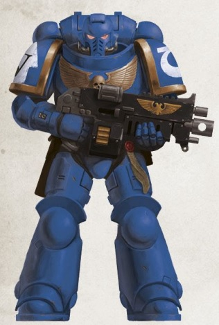

<!-- A0428-B0005 -->
**英文原文**

Legion Number:XIII

<!-- /A0428-B0005 -->

<!-- A0428-B0006 -->

原译文

军团变化：XIII

**校订译文**

军团番号：第十三（XIII）

<!-- /A0428-B0006 -->

<!-- A0428-B0007 -->
**英文原文**

Primarch:Roboute Guilliman

<!-- /A0428-B0007 -->

<!-- A0428-B0008 -->

原译文

原体：罗伯特·基里曼

**校订译文**

原体：罗保特·基里曼

<!-- /A0428-B0008 -->

<!-- A0428-B0009 -->
**英文原文**

Homeworld:Macragge

<!-- /A0428-B0009 -->

<!-- A0428-B0010 -->

原译文

家园世界：马库拉格

**校订译文**

母星：马库拉格

<!-- /A0428-B0010 -->

<!-- A0428-B0011 -->
**英文原文**

Fortress-Monastery:Fortress of Hera

<!-- /A0428-B0011 -->

<!-- A0428-B0012 -->

原译文

堡垒修道院：赫拉要塞

**校订译文**

要塞修道院：赫拉要塞

<!-- /A0428-B0012 -->

<!-- A0428-B0013 -->
**英文原文**

Chapter Master:Marneus Calgar

<!-- /A0428-B0013 -->

<!-- A0428-B0014 -->

原译文

战团长：马涅乌斯·卡尔加

**校订译文**

战团长：马涅乌斯·卡尔加

<!-- /A0428-B0014 -->

<!-- A0428-B0015 -->
**英文原文**

Colours:Blue, with white and gold

<!-- /A0428-B0015 -->

<!-- A0428-B0016 -->

原译文

颜色：蓝色，配白色和金色

**校订译文**

颜色：蓝色，配白色和金色

<!-- /A0428-B0016 -->

<!-- A0428-B0017 -->
**英文原文**

Specialty:Codex Chapter, Combined Arms, Diplomacy and Logistics

<!-- /A0428-B0017 -->

<!-- A0428-B0018 -->

原译文

专业：圣典战团，复合武器、外交和后勤

**校订译文**

特点与专长：遵循圣典编制；诸兵种协同、外交与后勤。

<!-- /A0428-B0018 -->

<!-- A0428-B0019 -->
**英文原文**

Strength:~1000 marines

<!-- /A0428-B0019 -->

<!-- A0428-B0020 -->

原译文

力量：~1000星际战士

**校订译文**

兵力：约1,000名星际战士

<!-- /A0428-B0020 -->

<!-- A0428-B0021 -->
**英文原文**

Battle Cry:Courage and Honour!/ 'We march for Macragge!'

<!-- /A0428-B0021 -->

<!-- A0428-B0022 -->

原译文

战吼：勇气与荣耀！/‘为了马库拉格，前进！’

**校订译文**

战吼：勇气与荣耀！/‘为了马库拉格，前进！’

<!-- /A0428-B0022 -->

<!-- A0428-B0023 -->
**英文原文**

Successor Chapters:

<!-- /A0428-B0023 -->

<!-- A0428-B0024 -->

原译文

子战团

**校订译文**

子战团

<!-- /A0428-B0024 -->

<!-- A0428-B0025 -->
**英文原文**

Angels of Fury, Angels Revenant, Aquiloan Brotherhood, Aurora Chapter, Avenging Sons

<!-- /A0428-B0025 -->

<!-- A0428-B0026 -->

原译文

狂怒天使，归来天使，北风兄弟会，曙光女神，复仇之子

**校订译文**

狂怒天使、归来天使、北方兄弟会、曙光女神、复仇之子。

<!-- /A0428-B0026 -->

<!-- A0428-B0027 -->
**英文原文**

Black Consuls, Brazen Consuls

<!-- /A0428-B0027 -->

<!-- A0428-B0028 -->

原译文

黑色执政官，黄铜执政官

**校订译文**

黑色执政官，黄铜执政官

<!-- /A0428-B0028 -->

<!-- A0428-B0029 -->
**英文原文**

Castellans of the Rift, Crimson Consuls

<!-- /A0428-B0029 -->

<!-- A0428-B0030 -->

原译文

裂隙堡主，深红执政官

**校订译文**

裂隙堡主，深红执政官

<!-- /A0428-B0030 -->

<!-- A0428-B0031 -->
**英文原文**

Dark Sons, Doom Eagles, Doom Legion

<!-- /A0428-B0031 -->

<!-- A0428-B0032 -->

原译文

黑暗之子，末日天鹰，末日军团

**校订译文**

黑暗之子，末日天鹰，末日军团

<!-- /A0428-B0032 -->

<!-- A0428-B0033 -->
**英文原文**

Eagle Warriors, Emperor's Spears

<!-- /A0428-B0033 -->

<!-- A0428-B0034 -->

原译文

雄鹰勇士，帝皇之矛

**校订译文**

雄鹰勇士，帝皇之矛

<!-- /A0428-B0034 -->

<!-- A0428-B0035 -->
**英文原文**

Fire Angels, Fire Hawks, Fulminators

<!-- /A0428-B0035 -->

<!-- A0428-B0036 -->

原译文

火焰天使，火鹰，雷鸣者

**校订译文**

火焰天使，火鹰，雷鸣者

<!-- /A0428-B0036 -->

<!-- A0428-B0037 -->
**英文原文**

Genesis Chapter

<!-- /A0428-B0037 -->

<!-- A0428-B0038 -->

原译文

起源战团

**校订译文**

起源战团

<!-- /A0428-B0038 -->

<!-- A0428-B0039 -->
**英文原文**

Hawk Lords (conflicting sources), Helion Legion, Heralds of Ultramar, Howling Griffons

<!-- /A0428-B0039 -->

<!-- A0428-B0040 -->

原译文

雄鹰领主（冲突来源），赫利昂军团，奥特拉玛先驱，咆哮狮鹫

**校订译文**

雄鹰领主（来源说法不一）、赫利昂军团、奥特拉玛先驱、咆哮狮鹫。

<!-- /A0428-B0040 -->

<!-- A0428-B0041 -->
**英文原文**

Imperius Reavers, Inceptors, Iron Hawks, Iron Hounds, Iron Snakes,

<!-- /A0428-B0041 -->

<!-- A0428-B0042 -->

原译文

帝国掠夺者，先驱者，铁鹰，钢铁猎犬，铁蛇

**校订译文**

帝国掠夺者，先驱者，铁鹰，钢铁猎犬，铁蛇

<!-- /A0428-B0042 -->

<!-- A0428-B0043 -->

原译文

Knights Cerulean 蔚蓝骑士

**校订译文**

Knights Cerulean 蔚蓝骑士

<!-- /A0428-B0043 -->

<!-- A0428-B0044 -->

原译文

Libators 献祭者

**校订译文**

Libators 献祭者

<!-- /A0428-B0044 -->

<!-- A0428-B0045 -->
**英文原文**

Marines Errant, Marines Mordant, Mentors, Mortifactors

<!-- /A0428-B0045 -->

<!-- A0428-B0046 -->

原译文

游侠战士，蚀刻战士，导师，苦行者

**校订译文**

游侠战士，蚀刻战士，导师，苦行者

<!-- /A0428-B0046 -->

<!-- A0428-B0047 -->
**英文原文**

Nemesis, Novamarines, Nova Legion

<!-- /A0428-B0047 -->

<!-- A0428-B0048 -->

原译文

复仇女神，新星战士，新星军团

**校订译文**

复仇女神，新星战士，新星军团

<!-- /A0428-B0048 -->

<!-- A0428-B0049 -->
**英文原文**

Obsidian Glaives, Obsidian Jaguars

<!-- /A0428-B0049 -->

<!-- A0428-B0050 -->

原译文

黑曜石阔剑，黑曜石美洲虎

**校订译文**

黑曜石阔剑，黑曜石美洲虎

<!-- /A0428-B0050 -->

<!-- A0428-B0051 -->
**英文原文**

Patriarchs of Ulixis, Praetors of Orpheus, Praetors of Ultramar

<!-- /A0428-B0051 -->

<!-- A0428-B0052 -->

原译文

尤利西斯宗主，俄耳甫斯执政，奥特拉玛执政

**校订译文**

尤利西斯宗主、俄耳甫斯执政官、奥特拉玛执政官。

<!-- /A0428-B0052 -->

<!-- A0428-B0053 -->
**英文原文**

Rainbow Warriors, Reborn, Red Consuls

<!-- /A0428-B0053 -->

<!-- A0428-B0054 -->

原译文

彩虹勇士，复生者，红色执政官

**校订译文**

彩虹勇士，复生者，红色执政官

<!-- /A0428-B0054 -->

<!-- A0428-B0055 -->
**英文原文**

Scythes of the Emperor, Silver Eagles, Silver Skulls, Silver Templars, Sons of Guilliman, Sons of Orar

<!-- /A0428-B0055 -->

<!-- A0428-B0056 -->

原译文

帝皇之镰，银鹰，银色颅骨，银色圣堂，基里曼之子，奥拉尔之子

**校订译文**

帝皇之镰，银鹰，银色颅骨，银色圣堂，基里曼之子，奥拉尔之子

<!-- /A0428-B0056 -->

<!-- A0428-B0057 -->

原译文

Tome Keepers 典籍守护者

**校订译文**

Tome Keepers 典籍守护者

<!-- /A0428-B0057 -->

<!-- A0428-B0058 -->
**英文原文**

Vindicators, Void Tridents

<!-- /A0428-B0058 -->

<!-- A0428-B0059 -->

原译文

维护者，虚空三叉戟

**校订译文**

维护者，虚空三叉戟

<!-- /A0428-B0059 -->

<!-- A0428-B0060 -->

原译文

White Consuls 白色执政官

**校订译文**

White Consuls 白色执政官

<!-- /A0428-B0060 -->

<!-- A0428-B0061 -->
## History 历史

<!-- /A0428-B0061 -->

<!-- A0428-B0062 -->
### Early History 早期历史

<!-- /A0428-B0062 -->

<!-- A0428-B0063 -->
**英文原文**

The Ultramarines, in the days before being reunited with their Primarch, were originally known as XIII Legion. The legion was created towards the end of the Unification Wars, developed from a gene-seed that was noted to be absent of mutation and with a high adaptability. The original recruits were drawn from from the sub-equatorial maglev clans of Panpocro, the war families of the Saragon Enclave, the Midafrik Hive Oligarchy and the anthropophagic tribes of the Caucasus Wastes. As varied in culture and origin as these groups were, they all had one factor in common; their violent and often bitter resistance to the later stages of Unification, a resistance broken ultimately in each case not by negotiated surrender but near annihilation, with in some situations little remaining save interned refugees and orphaned populations left by the savage conflicts which had brought these peoples to heel. The legion was created at such a late stage in the war that they have no recorded combat operations on Terra, instead being used for the first time for the liberation of the Solar System. During the Early Great Crusade, the Legion became known as the War-Born, referring to their disparate Terran origins that were all nonetheless forged through war.

<!-- /A0428-B0063 -->

<!-- A0428-B0064 -->

原译文

在与他们的原体重聚之前的日子里，极限战士最初被称为第十三军团。该军团是在统一战争结束时创建的，由一种基因种子发展而来，这种基因种子被认为没有突变，具有很高的适应性。最初的新兵来自的潘泼克罗亚赤道磁悬浮氏族、萨拉贡飞地的战争家族、米达弗里克巢都寡头政体和高加索荒原的食人部落。尽管这些群体的文化和出身各不相同，但他们都有一个共同点；他们对统一后期阶段的暴力和往往是痛苦的抵抗，在每种情况下，这种抵抗最终都不是通过谈判投降而是近乎毁灭而被打破的，在某些情况下，除了使这些人民屈服的野蛮冲突留下的被拘留难民和孤儿外，几乎没有剩下什么。该军团是在战争的后期创建的，因此他们没有在泰拉上进行战斗行动的记录，而是首次用于解放太阳星系。在大远征早期期间，军团被称为战争之子，指的是他们不同的泰拉裔起源，尽管如此，这些起源都是通过战争形成的。

**校订译文**

在与原体重聚之前，极限战士原称第十三军团。军团创建于统一战争末期，所用基因种子以没有明显突变、适应性强著称。最早的新兵来自潘泼克罗亚赤道地区的磁悬浮氏族、萨拉贡飞地的战争家族、米达弗里克巢都寡头政体，以及高加索荒原的食人部落。这些群体的文化与出身千差万别，却有一个共同点：他们都曾在统一战争后期进行激烈而顽强的抵抗。最终令他们屈服的并非谈判投降，而是近乎彻底的毁灭；有些群体被残酷战事摧垮后，几乎只剩遭收容拘禁的难民与孤儿。由于建军已近战争尾声，第十三军团没有在泰拉作战的记录，首次投入战斗便是解放太阳系。在大远征初期，他们获得“战争之子”的称呼，意指这些来源各异的泰拉人，全都经过了战争的锻造。

**校注：** Panpocro 与 sub-equatorial 在原译中混为“潘泼克罗亚赤道”；此处按地名潘泼克罗及亚赤道地带理解。统一战争末期不等于战争已经结束。

<!-- /A0428-B0064 -->

<!-- A0428-B0065 图片 -->
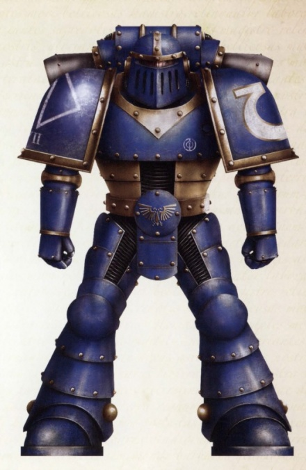

<!-- A0428-B0066 -->

原译文

Great Crusade and Heresy-era Ultramarine 大远征和叛乱时期极限战士

**校订译文**

Great Crusade and Heresy-era Ultramarine 大远征和叛乱时期极限战士

<!-- /A0428-B0066 -->

<!-- A0428-B0067 -->
**英文原文**

They were one of the three Space Marine Legions to take part in the First Pacification of Luna, the first pitched battle of the Great Crusade. Another major early campaign of the legion was putting down the Osiris Rebellion. By 833.M30, the strength of the legion had risen to 33,000, but its morale and pride was harmed as a result of heavy losses during the Osiris Rebellion.

<!-- /A0428-B0067 -->

<!-- A0428-B0068 -->

原译文

他们是参加第一次月球平定的三个星际战士军团之一，这是大远征的第一场激战。军团早期的另一场主要战役是镇压奥西里斯叛乱。到833.M30，军团的兵力已增至33000人，但由于奥西里斯叛乱期间的重大损失，其士气和自豪感受到了损害。

**校订译文**

他们是参加第一次月球平定的三个星际战士军团之一，这是大远征的第一场激战。军团早期的另一场主要战役是镇压奥西里斯叛乱。到833.M30，军团的兵力已增至33000人，但由于奥西里斯叛乱期间的重大损失，其士气和自豪感受到了损害。

<!-- /A0428-B0068 -->

<!-- A0428-B0069 -->
### The Youth of Roboute Guilliman 罗保特·基里曼的少年时代

原题：The Youth of Roboute Guilliman 罗伯特·基里曼的青年

<!-- /A0428-B0069 -->

<!-- A0428-B0070 -->
**英文原文**

Like the other Primarchs, Roboute Guilliman was taken as an infant by the powers of Chaos, and removed to a far-flung world in an effort to prevent the coming Age of the Imperium. The infant Guilliman's capsule fell on Macragge, where it was discovered by a group of noblemen hunting in the forest. Inside the capsule they found a child, surrounded by a glowing aura. He was taken back to Konor, one of the two Consuls who governed Macragge, who adopted the infant as his son and named him Roboute.

<!-- /A0428-B0070 -->

<!-- A0428-B0071 -->

原译文

与其他原体一样，罗伯特·基里曼在婴儿时期就被混沌的力量带走，并被带到一个遥远的世界，以防止即将到来的帝国时代。婴儿基里曼的太空舱落在了马库拉格上，在那里被一群在森林里狩猎的贵族发现。在太空舱内，他们发现了一个孩子，周围环绕着发光的光环。他被康诺带回了，康诺是统治马库拉格的两位领事之一，他收养了这个婴儿作为他的儿子，并给他起名叫罗伯特。

**校订译文**

与其他原体一样，罗保特·基里曼在婴儿时期被混沌力量掳走，散落到遥远世界，意在阻止帝国时代到来。他的育婴舱落在马库拉格，被一群在林中狩猎的贵族发现。他们看到舱内的孩子周身环绕光辉，便将其带到统治马库拉格的两位执政官之一康诺面前。康诺收养他为子，取名罗保特。

**校注：** 本节 Consul 指马库拉格最高民政执政者，采用执政官；区别大远征军团职衔 Consul 领事。

<!-- /A0428-B0071 -->

<!-- A0428-B0072 -->
**英文原文**

Roboute was a prodigy, growing fast in both body and intellect. By age ten, he had mastered every subject the wisest men of Macragge could teach him, and his insights into matters of history, philosophy, and science often stunned his elders. However, his greatest talents were as a military leader. These talents led his father to give him command of an expeditionary force to Illyrium, a mountainous region in the far north of Macragge, whose wild inhabitants had terrorized the civilized regions for years and successfully resisted every previous military campaign. Not only did Roboute fight a brilliant campaign but he also earned the respect of the wildmen who never again threatened the more civilised parts of Macragge. However, on his return to the capital Roboute found the city in chaos, as his father's co-Consul, Gallan, had attempted a coup. Gallan led a faction of Macragge's nobility who were used to enjoying their wealth and position at the expense of armies of slaves, and resented Konor's legislation favoring the common people, among whom he was immensely popular.

<!-- /A0428-B0072 -->

<!-- A0428-B0073 -->

原译文

罗伯特是一个天才，在身体和智力上都成长得很快。到十岁时，他已经掌握了马库拉格最聪明的人能教给他的每一门学科，他对历史、哲学和科学问题的见解经常让长辈们大吃一惊。然而，他最大的天赋是作为一名军事领袖。这些才能使他的父亲让他指挥一支远征部队前往马库拉格最北部的山区伊利里亚姆，那里的土著多年来一直恐吓文明地区，并成功地抵抗了之前的每一次军事行动。罗伯特不仅打了一场精彩的战役，还赢得了野人的尊重，他们再也没有威胁过马库拉格更文明的地区。然而，当他回到首都时，罗伯特发现这座城市一片混乱，因为他父亲的联合领事加兰试图发动政变。加兰领导着马库拉格贵族的一个派系，他们习惯于以牺牲奴隶大军为代价来享受自己的财富和地位，并憎恨康诺有利于平民的立法，他在平民中非常受欢迎。

**校订译文**

罗保特天资非凡，身心成长极为迅速。十岁时，他已掌握马库拉格最睿智的学者能够传授的所有学科，对历史、哲学与科学的见解常令长者惊叹。然而，他最出众的才能仍在军事统帅方面。父亲因此让他率远征军前往马库拉格极北的伊利里亚姆山区。那里居民多年来不断威胁文明地区，也成功抵挡了历次讨伐。罗保特不仅打出一场出色的战役，还赢得这些山民的尊重，使他们从此不再侵扰马库拉格更文明的地区。然而，返回首都时，他发现城中一片混乱：与父亲共同执政的加兰发动了政变。加兰代表一派贵族，他们习惯依靠大批奴隶维持财富与地位，因此憎恨康诺有利于平民的法律；康诺则深受平民爱戴。

<!-- /A0428-B0073 -->

<!-- A0428-B0074 -->
**英文原文**

Approaching the city, Roboute and his soldiers saw the city in chaos, being sacked by mobs of Gallan's men, while the Consul House was under siege. Roboute left his men to restore order to the city, while he rushed to the Consul House and lifted the siege, only to find his father close to death, surrounded by his loyal bodyguards. He had been mortally wounded by an assassin in Gallan's employ, and with his dying breath, told Roboute who was responsible.

<!-- /A0428-B0074 -->

<!-- A0428-B0075 -->

原译文

接近城市时，罗伯特和他的士兵看到城市一片混乱，被加兰手下的暴徒洗劫，而领事馆则被围困。罗伯特离开他的部下恢复城市秩序，同时他冲向领事馆并解除了围困，却发现他的父亲濒临死亡，被他忠诚的护卫包围着。他被加兰雇佣的一名刺客重伤了，临死前，他告诉罗伯特谁该对此负责。

**校订译文**

罗保特与士兵接近首都时，看到加兰的暴徒正在四处劫掠，执政官邸也遭到围攻。他留下部队恢复城中秩序，自己赶往官邸解围，却发现父亲已奄奄一息，身边围着忠诚的卫士。康诺遭加兰雇用的刺客重创，临终前向罗保特指明了幕后主使。

<!-- /A0428-B0075 -->

<!-- A0428-B0076 -->
**英文原文**

Roboute swiftly crushed the rebellion and, amid a wave of popular relief, assumed the title of sole Consul of Macragge. He set about punishing the treachery and carrying out his father's vision. Gallan and his co-conspirators were executed, and their lands and wealth were redistributed to the people. With superhuman energy, Roboute reorganized Macragge's entire social structure, creating a meritocracy where office and honours were given to the hard-working, rather than the wealthy and influential. Under his leadership, Macragge prospered as it never had before.

<!-- /A0428-B0076 -->

<!-- A0428-B0077 -->

原译文

罗伯特迅速镇压了叛乱，并在一波民众的救济浪潮中，获得了马库拉格唯一领事的称号。他开始惩罚背信弃义者，并实现父亲的愿景。加兰和他的同谋被处决，他们的土地和财富被重新分配给人民。凭借超人的能量，罗伯特重组了马库拉格的整个社会结构，创造了一种精英政治，在这种政治中，职位和荣誉被授予勤奋的人，而不是富有和有影响力的人。在他的领导下，马库拉格实现了前所未有的繁荣。

**校订译文**

罗保特迅速平定叛乱。民众如释重负，他也成为马库拉格唯一的执政官。他随即惩办叛徒，推行父亲未竟的理想：加兰及其同谋被处决，土地和财富分给民众。凭借超人的精力，罗保特重整马库拉格的整个社会制度，建立任人唯贤的秩序，将职位与荣誉授予勤勉有为者，而非富贵权势之家。在他的领导下，马库拉格迎来前所未有的繁荣。

<!-- /A0428-B0077 -->

<!-- A0428-B0078 -->
### The Arrival of the Emperor 帝皇的到来

<!-- /A0428-B0078 -->

<!-- A0428-B0079 -->
**英文原文**

While Roboute was prosecuting his war against the Illyrian rebels, the Emperor of Mankind and his armies had reached the neighboring planet of Espandor. It was there that the Emperor heard stories of the extraordinary son of Consul Konor, and realized that he had found one of the lost Primarchs. However, due to an unexpected warp storm, his ship was thrown far off course and by the time it reached Macragge, Roboute had been ruling for almost five years.

<!-- /A0428-B0079 -->

<!-- A0428-B0080 -->

原译文

当罗伯特正在对伊利里亚叛军进行战争时，人类帝皇和他的军队已经到达了邻近的埃斯潘多行星。正是在那里，帝皇听到了康诺领事非凡儿子的故事，并意识到他找到了一位失踪的原体。然而，由于一场意外的亚空间风暴，他的战舰偏离了航线，当它到达马库拉格时，罗伯特已经统治了近五年。

**校订译文**

罗保特讨伐伊利里亚姆叛军时，人类帝皇及其大军抵达邻近的埃斯潘多行星。在那里，帝皇听闻康诺执政官养子的非凡事迹，意识到自己找到了一位失散的原体。但一场突如其来的亚空间风暴使他的座舰严重偏航，待抵达马库拉格时，罗保特已经统治近五年。

<!-- /A0428-B0080 -->

<!-- A0428-B0081 -->
**英文原文**

When the Emperor reached Macragge, he found a world that was self sufficient, prosperous, with a strong and well-equipped military, and engaging in trade with nearby systems. Impressed, the Emperor assigned command of the Ultramarines Legion to Guilliman, and relocated the Legion's forward base to Macragge.

<!-- /A0428-B0081 -->

<!-- A0428-B0082 -->

原译文

当帝皇到达马库拉格时，他发现了一个自给自足、繁荣的世界，拥有强大而装备精良的军队，并与附近的星系进行贸易。印象深刻的是，帝皇将极限战士军团的指挥权分配给了基里曼，并将军团的前沿基地重新安置到了马库拉格。

**校订译文**

帝皇抵达马库拉格时，看到的是一个繁荣、自给自足的世界：军队强大、装备精良，并与周边星系通商。这给他留下了深刻印象。于是，他将极限战士军团交由基里曼指挥，并把军团的前进基地迁往马库拉格。

<!-- /A0428-B0082 -->

<!-- A0428-B0083 -->
### The Great Crusade 大远征

<!-- /A0428-B0083 -->

<!-- A0428-B0084 -->
**英文原文**

With the exception of the Luna Wolves, no Legion conquered as many worlds, or conquered worlds as fast, or left conquered worlds in such good state during the Great Crusade, as the Ultramarines. Guilliman restored the legion's morale and prestige following difficulties in the Osiris Rebellion and later took revenge on the Osirian Psybrids at the Battle of the Eurydice Terminal. Whenever Guilliman liberated a world, he would not move on until he had set up a self-sufficient defense system, and left advisors behind to create industry, set up trade routes with the rest of the Imperium, and form a government whose first concern would always be the well-being of the people. The success of the Ultramarines may be thanks to their diverse but stable gene-seed. In them was found a mixture of aggression and restraint, discipline and determination which rendered them supremely suited for joint taskforce operations and cross-theatre warfare.

<!-- /A0428-B0084 -->

<!-- A0428-B0085 -->

原译文

除了影月苍狼，没有任何一个军团在大远征期间像极限战士那样征服了如此多的世界，或以如此快的速度征服了世界，或使被征服的世界保持如此良好的状态。基里曼在奥西里斯叛乱中遇到困难后恢复了军团的士气和声望，后来在欧律狄刻码头战役中对奥西里斯灵能鸟进行了报复。每当基里曼解放一个世界时，他都不会继续前进，直到他建立了一个自给自足的防御系统，留下顾问来创建工业，与帝国其他地区建立贸易路线，并组建一个始终以人民福祉为首要考虑的政府。极限战士的成功可能要归功于他们多样化但稳定的基因种子。在他们身上发现了侵略和克制、纪律和决心的混合体，这使他们非常适合联合特遣部队行动和跨战区战争。

**校订译文**

大远征中，除影月苍狼外，没有其他军团能像极限战士那样，以如此快的速度征服如此多的世界，并在征服后留下如此完善的秩序。基里曼重振了军团在奥西里斯叛乱中受损的士气与声望，后来又在欧律狄刻终端之战中向奥西里斯灵能异族复仇。每解放一个世界，他都会先建立能够独立运作的防御体系，才继续进军；他还留下顾问，发展工业，开辟与帝国其他地区的贸易航路，组建以民众福祉为首要职责的政府。极限战士的成功，或许与其兼容性广而稳定的基因种子有关。他们兼具进取与克制、纪律与决心，格外适合联合特遣作战和跨战区战争。

**校注：** Psybrids 为族群专名，原译“灵能鸟”缺乏本段依据。暂采用奥西里斯灵能异族，并保留英文词条待核，不凭词形猜定生物外貌。

<!-- /A0428-B0085 -->

<!-- A0428-B0086 -->
**英文原文**

As Ultramar grew into a small stellar empire in its own right, Guilliman created a supremely efficient military machine, centered around Macragge, that provided the Ultramarines with a steady flow of new recruits. Between this factor, and the minimal casualties suffered as a result of Guilliman's tactical genius, the Ultramarines soon became the largest of all the Space Marine Legions — so large, in fact, that an organizational unit above the Company was required. The Ultramarines were thus organized into Chapters, numbering at least 25 just before the Battle of Calth. Rumors speculate that the size of the Ultramarines could only have been possible due to the fates of the Two Unknown Legions.

<!-- /A0428-B0086 -->

<!-- A0428-B0087 -->

原译文

随着奥特拉玛自身发展成为一个小型群星帝国，基里曼创建了一个以马库拉格为中心的高效军事机器，为极限战士提供了源源不断的新兵。考虑到这一因素，再加上基里曼的战术天才所造成的最小伤亡，极限战士很快成为所有星际战士军团中最大的一支 — 事实上，其规模如此之大，以至于需要一个高于连队的组织单位。因此，就在考斯战役之前，极限战士被组织成了至少25个战团。有传言称，由于两个未知军团的命运，极限战士的规模才有可能。

**校订译文**

随着奥特拉玛发展为一个小型星际帝国，基里曼建立了以马库拉格为核心的高效军事体系，为极限战士持续输送新兵。再加上他的战术天赋使伤亡维持在较低水平，极限战士很快成为兵力最庞大的星际战士军团，甚至需要设置高于连队的组织层级。因此，军团被编为多个战团，在考斯之战前至少已有25个。还有传言将极限战士惊人的规模与两支失落军团的命运联系起来。

<!-- /A0428-B0087 -->

<!-- A0428-B0088 -->
**英文原文**

The Ultramarines not only gained an impressive tally of conquests, but they also did this while mostly avoiding battles of attrition and prided themselves on achieving strategic goals with minimum expenditure of life. This even extended to the enemy, provided they were a salvageable Human civilization. Thus unlike some of the more bloody-handed Legions, the Ultramarines minimalized collateral damage and sought to rapidly integrate these conquered foes into the wider Imperium after their compliance was achieved.

<!-- /A0428-B0088 -->

<!-- A0428-B0089 -->

原译文

极限战士不仅取得了令人印象深刻的胜利，而且他们也做到了这一点，同时大多避免了消耗战，并以以最少的生命消耗实现战略目标而自豪。这甚至延伸到了敌人，只要他们是一个可挽救的人类文明。因此，与一些更血腥的军团不同，极限战士将附带伤害降至最低，并在这些被征服的敌人顺从后，试图迅速将他们整合到更广泛的帝国中。

**校订译文**

极限战士不但征服了大量世界，还大多避免陷入消耗战，并以用最少的生命代价达成战略目标为荣。只要敌方人类文明仍有挽救余地，这种克制也会惠及敌人。与某些血债累累的军团不同，极限战士尽量减少附带伤亡与破坏，力求在敌人归顺后，迅速将其纳入帝国。

<!-- /A0428-B0089 -->

<!-- A0428-B0090 -->
**英文原文**

At the time of the Horus Heresy, it is estimated that the Ultramarines Legion numbered around 250,000 Space Marines, making them the largest Legion. This was in large part thanks to their highly stable and variable gene-seed.

<!-- /A0428-B0090 -->

<!-- A0428-B0091 -->

原译文

在荷鲁斯叛乱时期，据估计，极限战士军团约有25万名星际战士，使其成为最大的军团。这在很大程度上要归功于它们高度稳定和可变的基因种子。

**校订译文**

荷鲁斯之乱时期，极限战士军团估计拥有约25万名星际战士，是兵力最多的军团。这很大程度上归功于其高度稳定、适应范围广的基因种子。

**校注：** 英文 variable 在本章与 stable、适应范围并列；按适应性理解，避免译成与“高度稳定”相冲突的基因易变异。

<!-- /A0428-B0091 -->

<!-- A0428-B0092 -->
### The Horus Heresy 荷鲁斯之乱

原题：The Horus Heresy 荷鲁斯叛乱

<!-- /A0428-B0092 -->

<!-- A0428-B0093 -->
**英文原文**

Before Horus declared his treachery against the Emperor, he ordered the Ultramarines Legion to assemble for war in the Veridian System in Segmentum Tempestus far to the galactic south, claiming that the system was under attack by an Ork invasion force from the Ghaslakh Empire. Ultramar was close enough for an assault against Veridian, so Guilliman ordered his Legion to assemble in the Calth System.

<!-- /A0428-B0093 -->

<!-- A0428-B0094 -->

原译文

在荷鲁斯宣布背叛帝皇之前，他命令极限战士军团在银河系南部遥远的暴风星域的维里迪亚星系集结作战，声称该星系正受到来自嘎斯拉克帝国的欧克入侵部队的攻击。奥特拉玛已经足够接近对维里迪亚的攻击，所以基里曼命令他的军团在考斯星系中集结。

**校订译文**

荷鲁斯公开背叛帝皇前，命令极限战士前往银河南方遥远的暴风星域，在维里迪亚星系集结作战，声称当地遭到嘎斯拉克帝国的欧克军队入侵。奥特拉玛距离维里迪亚足够近，适合作为出击基地，因此基里曼命军团先在考斯星系集结。

<!-- /A0428-B0094 -->

<!-- A0428-B0095 -->
### Battle of Calth 考斯之战

<!-- /A0428-B0095 -->

<!-- A0428-B0096 -->
**英文原文**

As Guilliman and his fleets arrived at Calth, they knew something was wrong, because none of their Astropaths could get messages through the Warp and the storms were interfering with the navigation of their ships; they were blocked from the rest of the Imperium. It was at this moment that the traitor forces of the Word Bearers Legion attacked, rendering the Ultramarines unable to participate in much of the Battle of Terra. Simultaneously, the Word Bearers under Lorgar as well as the World Eaters attempted to cut off the rest of Ultramar from the greater Imperium in the Shadow Crusade. The battle at Calth, though ultimately a victory for Guilliman, was devastating for the Ultramarines. Nearly 120,000 of the Legion's Space Marine were lost and another 28,000 rendered combat-incapable. This represented almost 60% of the Legion's Pre-Heresy strength of 250,000.

<!-- /A0428-B0096 -->

<!-- A0428-B0097 -->

原译文

当基里曼和他的舰队抵达考斯时，他们知道出了什么问题，因为他们的星语者都无法通过亚空间获得信息，风暴干扰了他们船只的航行；他们与帝国的其他部分隔绝了。就在这一刻，怀言者的叛徒部队发动了袭击，使极限战士无法参加泰拉之战的大部分时间。与此同时，珞珈领导下的怀言者和吞世者试图在暗影远征中切断奥特拉玛的其余部分与更大帝国的联系。考斯之战虽然最终是基里曼的胜利，但对极限战士来说是毁灭性的。军团近12万名星际战士阵亡，另有2.8万人无法作战。这几乎占了军团叛乱前25万兵力的60%。

**校订译文**

基里曼与舰队抵达考斯时便察觉异常：星语者无法经亚空间传出讯息，风暴也干扰着舰船航行，使他们与帝国其他地区隔绝。怀言者叛军随即发动袭击，导致极限战士无法及时参与泰拉之战的大部分战事。与此同时，珞珈率领的怀言者与吞世者展开暗影远征，试图切断奥特拉玛其余地区与帝国的联系。基里曼最终赢得考斯之战，但军团蒙受毁灭性损失：近12万名星际战士折损，另有2.8万人失去作战能力，合计接近战前25万总兵力的60%。

<!-- /A0428-B0097 -->

<!-- A0428-B0098 图片 -->
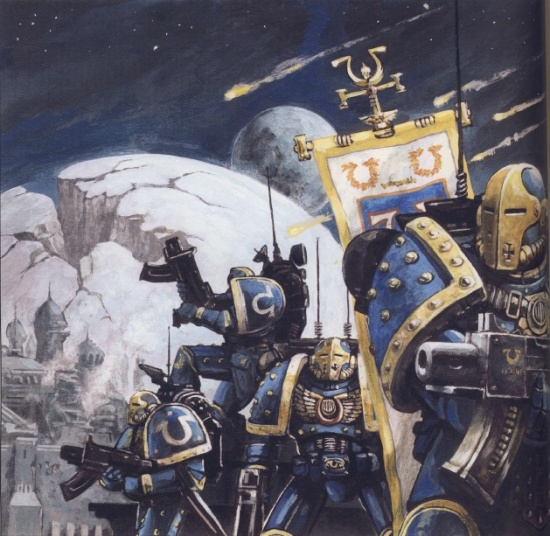

<!-- A0428-B0099 -->

原译文

Ultramarines during the Battle of Calth 考斯之战期间的极限战士

**校订译文**

Ultramarines during the Battle of Calth 考斯之战期间的极限战士

<!-- /A0428-B0099 -->

<!-- A0428-B0100 -->
### Imperium Secundus 第二帝国

<!-- /A0428-B0100 -->

<!-- A0428-B0101 -->
**英文原文**

After the formation of the Ruinstorm, Guilliman feared Terra lost and used the Ultramarines and the realm of Macragge to create a new contingency empire known as Imperium Secundus. Imperium Secundus faced a major test in the Battle of Sotha, where the Ultramarines and their fellow Astartes allies that had gathered fought off a force of Night Lords.

<!-- /A0428-B0101 -->

<!-- A0428-B0102 -->

原译文

在毁灭风暴形成后，基里曼担心泰拉会失败，并利用极限战士和马库拉格领域创建了一个新的应急帝国，称为第二帝国。第二帝国在索萨之战中面临着重大考验，在那里，极限战士和他们聚集在一起的阿斯塔特盟友击退了一支午夜领主部队。

**校订译文**

毁灭风暴形成后，基里曼担心泰拉已经陷落，便以极限战士和马库拉格领地为基础，建立了作为应急后备的第二帝国。索萨之战是其面临的一场严峻考验，极限战士与聚集于此的阿斯塔特盟友合力击退了午夜领主部队。

<!-- /A0428-B0102 -->

<!-- A0428-B0103 -->
**英文原文**

Ultimately after a number of disasters, clashes between Guilliman, Sanguinius, and Lion El'Jonson, and a vision by Sanguinius that the Emperor was alive, Imperium Secundus was abolished. The three Primarch's led their Legions in an attempt to breach the Ruinstorm and reach Terra. Through an arduous journey, they eventually reached Davin, the nexus of the Ruinstorm, and engaged a vast Daemonic host. After the battle and the destruction of Davin, a way to Terra through the Ruinstorm was clear. However in their way stood many enemy blockades as Horus had foreseen this route. Sanguinius and the Blood Angels raced directly for Terra, as was their destiny, while Guilliman and Lion El'Jonson led the Ultramarines and Dark Angels in diversionary attacks against Horus' blockade.

<!-- /A0428-B0103 -->

<!-- A0428-B0104 -->

原译文

最终，在经历了一系列灾难、基里曼、圣吉列斯和莱昂·艾尔庄森之间的冲突，以及圣吉列斯认为帝皇还活着的幻象之后，第二帝国被废除。三位原体率领他们的军团试图突破毁灭风暴，到达泰拉。经过一段艰苦的旅程，他们最终到达了毁灭风暴的中心戴文，并与一位庞大的恶魔宿主交战。在战斗和戴文的毁灭之后，通过毁灭风暴前往泰拉的道路变得清晰起来。然而，由于荷鲁斯预见到了这条路线，许多敌人封锁了他们。圣吉列斯和圣血天使直接冲向泰拉，这是他们的命运，而基里曼和莱昂·艾尔庄森则带领极限战士和黑暗天使对荷鲁斯的封锁进行了转移注意力的攻击。

**校订译文**

经历一连串灾难，以及基里曼、圣吉列斯和莱昂·艾尔’庄森之间的冲突后，圣吉列斯又看到帝皇仍然活着的异象，第二帝国最终被废止。三位原体率军尝试突破毁灭风暴，赶往泰拉。经过艰险旅程，他们抵达风暴的枢纽戴文，与一支庞大的恶魔军势交战。大战结束、戴文被摧毁后，一条穿越毁灭风暴通往泰拉的航路终于打开。然而，荷鲁斯早已预见这条路线，沿途设置了重重封锁。圣吉列斯与圣血天使依照命运的指引直奔泰拉；基里曼与莱昂·艾尔’庄森则率极限战士和黑暗天使攻击封锁线，牵制敌军。

<!-- /A0428-B0104 -->

<!-- A0428-B0105 -->
**英文原文**

After the death of the Ruinstorm, Guilliman gathered whatever forces he could and made haste for Terra. In his path lay a large defensive chain of hundreds of worlds manned by the Iron Warriors. In a series of bitter engagements, both sides took heavy losses but the loyalists were able to maintain a steady advance.

<!-- /A0428-B0105 -->

<!-- A0428-B0106 -->

原译文

毁灭风暴结束后，基里曼召集了他所能召集的一切力量，迅速前往泰拉。在他的道路上，有一条由钢铁勇士组成的数百个世界的大型防御链。在一系列激烈的交战中，双方都遭受了重大损失，但忠诚者能够保持稳定的前进。

**校订译文**

毁灭风暴消散后，基里曼集结一切可用兵力，急赴泰拉。然而，钢铁勇士驻守的数百个世界组成了一道庞大防线，横亘在前方。双方在一系列苦战中都付出惨重代价，但忠诚派仍保持着稳步推进。

<!-- /A0428-B0106 -->

<!-- A0428-B0107 -->
### The Great Scouring 大清洗

<!-- /A0428-B0107 -->

<!-- A0428-B0108 -->
**英文原文**

Guilliman was ultimately able to set course for Terra, destroying Chaos reinforcements along the way, but arrived after Horus had already been defeated, and the Traitor Legions scattered. Because of this, the Ultramarines were one of the few Legions at full strength in the aftermath of the Heresy; thus, Guilliman and his Ultramarines bore much of the burden of holding the Imperium together against aliens and Chaos forces. During this time, the Ultramarines recruited heavily from Ultramar and eventually counted for over half of the Loyalist Marines. Apart from leading his Ultramarines in countless battles across the Galaxy, Guilliman also accepted an extraordinary appointment as Lord Commander of the Imperium; with the Emperor crippled and Lord Malcador dead, it fell to Guilliman to re-organize the Council of Terra into a ruling body capable of running the Imperium without their sovereign.

<!-- /A0428-B0108 -->

<!-- A0428-B0109 -->

原译文

基里曼最终能够为前往泰拉设定路线，沿途摧毁了混沌的增援部队，但在荷鲁斯已经被击败，叛徒军团四散后到达。正因为如此，在叛乱之后，极限战士军团是少数几个满员的军团之一；因此，基里曼和他的极限战士承担了将帝国团结起来对抗异型和混沌部队的大部分重任。在此期间，极限战士从奥特拉玛大量招募，最终占忠诚星际战士的一半以上。除了在银河系的无数战斗中领导他的极限战士外，基里曼还接受了一项非同寻常的任命，担任帝国领主指挥官；随着帝皇残废，领主马卡多牺牲，基里曼负责将泰拉议会重新组织成一个能够在没有最高统治者的情况下管理帝国的统治机构。

**校订译文**

基里曼最终踏上通往泰拉的航路，沿途歼灭混沌援军，抵达时荷鲁斯已被击败，叛军也已四散。本段称，由于未参加最后决战，极限战士成为叛乱后少数仍保持完整兵力的军团之一，因而承担了维系帝国、抵御异形与混沌的大量重任。他们不断从奥特拉玛补充新兵，人数最终超过全体忠诚派星际战士的一半。基里曼既率军在银河各地作战，也接受了一项特殊任命，出任帝国最高统帅。帝皇重伤不起，马卡多已死，重组泰拉议会、使其能在君主无法主政时治理帝国的责任，便落在基里曼身上。

**校注：** 本段称叛乱后仍保持完整兵力，与前述考斯之战约六成折损存在叙述张力；英文又提到大量补员，中文保留各段口径，未自行补造重建时间表。

<!-- /A0428-B0109 -->

<!-- A0428-B0110 -->
### Creation of the Codex Astartes 阿斯塔特圣典的创建

<!-- /A0428-B0110 -->

<!-- A0428-B0111 -->
**英文原文**

After the Horus Heresy, Roboute Guilliman set himself to create the Codex Astartes, which would define the tactics and organization of all Space Marines, from battlefield strategies to squad markings. Most important of these changes was the division of the Legions into 1,000-strong Chapters. One of the Chapters would retain the heraldry of the original Legion, but the others would be given a new name and symbol. In doing so, Guilliman hoped to divide the power of the Space Marines to ensure that a civil war on the scale of the Heresy could never occur again.

<!-- /A0428-B0111 -->

<!-- A0428-B0112 -->

原译文

在荷鲁斯叛乱之后，罗伯特·基里曼决定创建阿斯塔特圣典，该圣典将定义所有星际战士的战术和组织，从战场战略到小队标记。这些变化中最重要的是将军团划分为1000个强大的战团。其中一个战团将保留原初军团的纹章，但其他战团将被赋予新的名称和符号。通过这样做，基里曼希望划分星际战士的力量，以确保叛乱规模的内战永远不会再次发生。

**校订译文**

荷鲁斯之乱后，罗保特·基里曼着手编写《阿斯塔特圣典》，规范星际战士的战术与组织，从战场战略到小队标识无所不包。最重要的改革，是将各军团拆分为每团约1,000人的战团。其中一团继承原军团的纹章，其余采用新名称与徽记。基里曼希望借此分散星际战士的权力，防止再次出现荷鲁斯之乱规模的内战。

**校注：** 1,000-strong Chapters 指每个战团约1,000人，原译“1,000个强大的战团”将兵力误作战团数量。

<!-- /A0428-B0112 -->

<!-- A0428-B0113 -->
**英文原文**

This, however, caused dissention among the remaining Primarchs. Rogal Dorn, Vulkan and Leman Russ opposed the splitting of their legions while Guilliman himself was supported by Jaghatai Khan and Corax. Neither side was willing to relent and the controversy grew more intense, with Rogal Dorn calling Guilliman a coward for not having participated in the Siege of Terra, and Guilliman accusing Dorn of being a rebel for his refusal to follow the Codex. The situation threatened to bring the Imperium into another civil war. When the Imperial Fists strike cruiser Terrible Angel was fired upon by the Imperial Navy, Dorn finally relented and agreed to split his legion.

<!-- /A0428-B0113 -->

<!-- A0428-B0114 -->

原译文

然而，这引起了其余原体之间的分歧。罗格·多恩、沃坎和黎曼·鲁斯反对分裂他们的军团，而基里曼本人则得到了察合台可汗和科拉克斯的支持。双方都不愿意让步，争议变得更加激烈，罗格·多恩称基里曼为懦夫，因为他没有参加泰拉围城，基里曼指责多恩是一名反叛者，因为他拒绝遵守圣典。局势有可能使帝国陷入另一场内战。当帝国海军向帝国之拳打击巡洋舰恐惧天使号开火时，多恩终于让步，同意分裂他的军团。

**校订译文**

然而，这引起了其余原体之间的分歧。罗格·多恩、沃坎和黎曼·鲁斯反对分裂他们的军团，而基里曼本人则得到了察合台可汗和科拉克斯的支持。双方都不愿意让步，争议变得更加激烈，罗格·多恩称基里曼为懦夫，因为他没有参加泰拉围城，基里曼指责多恩是一名反叛者，因为他拒绝遵守圣典。局势有可能使帝国陷入另一场内战。当帝国海军向帝国之拳打击巡洋舰恐惧天使号开火时，多恩终于让步，同意分裂他的军团。

<!-- /A0428-B0114 -->

<!-- A0428-B0115 -->
### Duel on Eskrador 埃斯卡多决斗

<!-- /A0428-B0115 -->

<!-- A0428-B0116 -->
**英文原文**

On Eskrador Alpharius, the Alpha Legion's primarch, was apparently taken by surprise when Guilliman departed from his own strictures and led a surprise assault by his elite units on the Alpha Legion headquarters. In the resulting personal combat between Alpharius and Guilliman, it is believed that Alpharius was killed. The Alpha Legion responded, not by breaking and fleeing as Guilliman expected, but by turning on the Ultramarine detachment and harrying them so mercilessly that by the time they had returned to the main body of the Ultramarine force their casualties were almost total. The Ultramarines were driven from the planet in the subsequent battle.

<!-- /A0428-B0116 -->

<!-- A0428-B0117 -->

原译文

在埃斯卡多，阿尔法军团的原体阿尔法瑞斯，当基里曼脱离自己的束缚，率领他的精英部队对阿尔法军团总部发动突袭时，他显然感到惊讶。在阿尔法瑞斯和基里曼之间的个人战斗中，据信阿尔法瑞斯被杀了。阿尔法军团的回应，不是像基里曼所期望的那样破碎逃跑，而是转向了极限战士分遣队，无情地折磨他们，以至于当他们回到极限战士部队的主体时，他们的伤亡几乎是全部。在随后的战斗中，极限战士被赶出了行星。

**校订译文**

在埃斯卡多，基里曼一改自己惯用的作战准则，率精锐突袭阿尔法军团指挥部，似乎令其原体阿尔法瑞斯措手不及。据说，在随后两人的决斗中，阿尔法瑞斯被杀。然而，阿尔法军团并未像基里曼预料的那样崩溃逃散，反而猛烈反击极限战士分遣队，持续追击袭扰，令其返回主力时已几乎伤亡殆尽。接下来的战斗中，极限战士被逐出了行星。

<!-- /A0428-B0117 -->

<!-- A0428-B0118 -->
### The Bitter War 苦涩战争

<!-- /A0428-B0118 -->

<!-- A0428-B0119 -->
**英文原文**

The Bitter War was a campaign that began in 010.M31 during the Horus Heresy, pitting various Loyalist forces of the Imperium, such as the Iron Hands, against the Word Bearers defending Colchis. The war for Colchis was concluded when the Ultramarines and Inquisition destroyed Colchis with cyclonic torpedoes carried by the Ultramarines battle barge Octavius.

<!-- /A0428-B0119 -->

<!-- A0428-B0120 -->

原译文

苦涩战争是一场始于010.M31荷鲁斯叛乱时期的战役，让帝国的各种忠诚部队，如钢铁之手，与保卫科尔基斯的怀言者对抗。当极限战士和审判庭用极限战士战斗驳船奥克塔维斯号携带的旋风鱼雷摧毁科尔基斯时，科尔基斯的战争结束了。

**校订译文**

苦涩战争始于荷鲁斯之乱时期的010.M31，是钢铁之手等帝国忠诚派部队与守卫科尔基斯的怀言者之间的一场战役。最终，极限战士与审判庭使用战斗驳船奥克塔维斯号搭载的旋风鱼雷摧毁科尔基斯，结束了战争。

<!-- /A0428-B0120 -->

<!-- A0428-B0121 -->
### The Iron Cage 铁笼

<!-- /A0428-B0121 -->

<!-- A0428-B0122 -->
**英文原文**

Shortly after the Heresy, the Imperial Fists laid siege to the Iron Warriors' greatest construct, The Eternal Fortress. The Fortress consisted of over 20 square miles of bunkers, towers, minefields, trenches, razor wire, tank traps, redoubts and a system of complex underground tunnels in the shape of an eight pointed star. At the center was a massive bunker intended to serve as a decoy and of no value whatsoever. Guilliman advised his brother Dorn against the siege, but Dorn was embittered at having lost the debate over the Codex to Guilliman, and wished to vent his anger and frustration on his most bitter of rivals.

<!-- /A0428-B0122 -->

<!-- A0428-B0123 -->

原译文

叛乱之后不久，帝国之拳围攻了钢铁勇士最大的建筑 — 永恒堡垒。堡垒由20多平方英里的掩体、塔楼、雷区、战壕、铁丝网、坦克陷阱、堡垒和一个八角星形状的复杂地下隧道系统组成。在中心是一个巨大的掩体，旨在作为诱饵，没有任何价值。基里曼建议他的兄弟多恩不要围攻，但多恩对关于圣典的辩论失败而感到不满，并希望将他的愤怒和沮丧发泄在最令他痛苦的对手身上。

**校订译文**

荷鲁斯之乱后不久，帝国之拳围攻钢铁勇士最宏伟的工事——永恒堡垒。这座堡垒占地超过20平方英里，遍布碉堡、塔楼、雷区、战壕、剃刀铁丝网、反坦克障碍、据点与复杂的地下隧道，整体呈八芒星形。中心是一座巨型碉堡，实际上只是毫无战略价值的诱饵。基里曼劝兄弟多恩不要围攻，但多恩因在圣典之争中败于基里曼而心怀愤懑，想把怒火与挫败感发泄到自己最痛恨的宿敌身上。

<!-- /A0428-B0123 -->

<!-- A0428-B0124 图片 -->
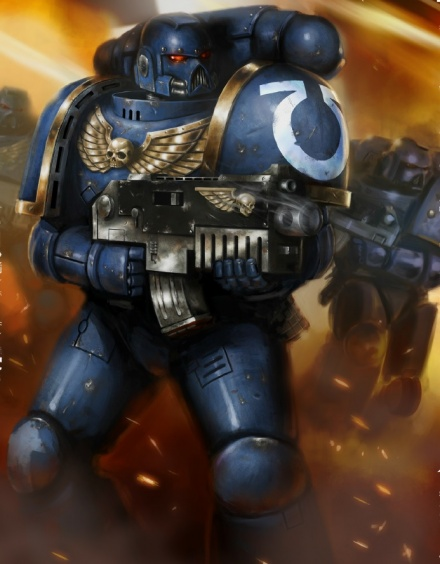

<!-- A0428-B0125 -->

原译文

Post-Heresy Ultramarines Tactical Squad 叛乱后极限战士战术小队

**校订译文**

Post-Heresy Ultramarines Tactical Squad 叛乱后极限战士战术小队

<!-- /A0428-B0125 -->

<!-- A0428-B0126 -->
**英文原文**

Hundreds of Imperial Fists littered the grounds of the fortress before Guilliman and the Ultramarine relief force arrived, three weeks and six days later. The Imperial Fists had fought without sleep and had long run out of ammunition before the Ultramarines found them. Perturabo, unable to hold against the two legions, made his final ploy, stopping the Imperial Fists to recover over four hundred of their dead and the gene seed they contained.

<!-- /A0428-B0126 -->

<!-- A0428-B0127 -->

原译文

三周零六天后，基里曼和极限战士救援部队抵达之前，数百名帝国之拳散落在堡垒的表面上。帝国之拳一直在不睡觉的情况下战斗，在极限战士发现他们之前，他们的弹药早就用完了。佩图拉博无法对抗这两个军团，他采取了最后一个策略，阻止了帝国之拳，以追回400多名死者和他们所含的基因种子。

**校订译文**

三周零六天后，基里曼率极限战士援军赶到时，堡垒四周已横陈着数百名帝国之拳的尸体。幸存者连续奋战，不眠不休，弹药也早已耗尽。佩图拉博无力同时抗衡两个军团，便使出最后一招，阻止帝国之拳回收四百余名阵亡者的遗体及其中的基因种子。

**校注：** stopping the Imperial Fists to recover 文法不规范，按阻止帝国之拳回收遗体理解；原译混淆回收方。

<!-- /A0428-B0127 -->

<!-- A0428-B0128 -->
**英文原文**

Perturabo's victory was spoiled because of the intervention of the Ultramarines. However his sacrifice was great enough for him to be raised to Daemon Prince status.

<!-- /A0428-B0128 -->

<!-- A0428-B0129 -->

原译文

佩图拉博的胜利因极限战士的干预而被破坏。然而，他造成的牺牲足以让他被升格为恶魔王子。

**校订译文**

极限战士的介入使佩图拉博未能取得完整的胜利，但他献上的祭品仍足以让自己晋升为恶魔王子。

<!-- /A0428-B0129 -->

<!-- A0428-B0130 -->
### Thessala 色萨拉

<!-- /A0428-B0130 -->

<!-- A0428-B0131 -->
**英文原文**

Ultimately, Guilliman's rule over the Imperium would come to an end in the Battle of Thessala. There, he faced his traitorous brother Fulgrim in a fateful duel. Guilliman was mortally wounded during the battle and put into stasis thereafter by the Ultramarines, where he would remain for the next 10,000 years.

<!-- /A0428-B0131 -->

<!-- A0428-B0132 -->

原译文

最终，基里曼对帝国的统治将在色萨拉之战中结束。在那里，他在一场决定性的决斗中面对了他的叛徒兄弟福格瑞姆。基里曼在战斗中受了致命伤，此后被极限战士置于停滞，他将在那里呆上一万年。

**校订译文**

最终，基里曼对帝国的统治在色萨拉之战中结束。他与叛变的兄弟福格瑞姆展开宿命般的决斗，受到致命重创，随后被极限战士置入静滞状态，沉眠了整整一万年。

<!-- /A0428-B0132 -->

<!-- A0428-B0133 -->
### Recent Events 近期事件

<!-- /A0428-B0133 -->

<!-- A0428-B0134 -->
### Timeline 时间线

<!-- /A0428-B0134 -->

<!-- A0428-B0135 -->
**英文原文**

Major engagements of the Ultramarines since the Horus Heresy:

<!-- /A0428-B0135 -->

<!-- A0428-B0136 -->

原译文

自荷鲁斯叛乱以来，极限战士的主要战斗：

**校订译文**

自荷鲁斯之乱以来，极限战士的主要战斗：

<!-- /A0428-B0136 -->

<!-- A0428-B0137 图片 -->
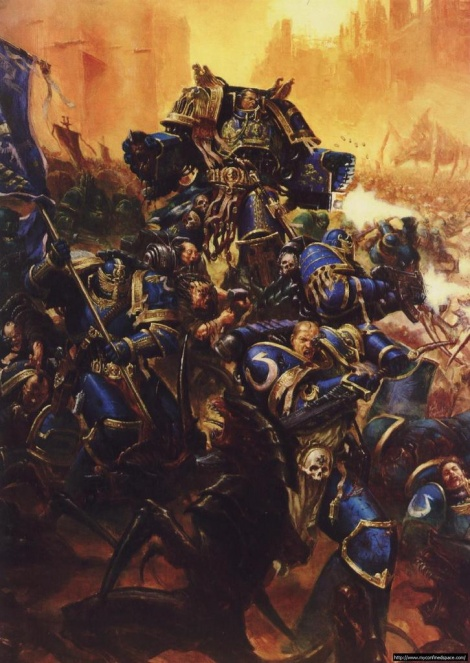

<!-- A0428-B0138 -->

原译文

Marneus Calgar and the Ultramarines during the Battle for Macragge 马涅乌斯·卡尔加和极限战士在马库拉格之战期间

**校订译文**

Marneus Calgar and the Ultramarines during the Battle for Macragge 马涅乌斯·卡尔加和极限战士在马库拉格之战期间

<!-- /A0428-B0138 -->

<!-- A0428-B0139 -->
**英文原文**

544.M32: During the War of the Beast, Ultramar was attacked by Ork forces. Quintarn and Prandium are invaded. The Ultramarines were ultimately able to destroy an Ork Attack Moon over Calth and another over Tarentus. Later, Chapter Master Odaenathus was killed by The Beast during the invasion of Ullanor.

<!-- /A0428-B0139 -->

<!-- A0428-B0140 -->

原译文

在野兽战争期间，奥特拉玛遭到了欧克部队的袭击。昆坦和普兰蒂姆被入侵。极限战士最终摧毁考斯上空的欧克战斗月亮和塔伦图斯上空的另一个。后来，章主奥德那托斯在入侵乌拉诺时被野兽杀死。

**校订译文**

544.M32：野兽战争期间，欧克进攻奥特拉玛，入侵昆坦与普兰蒂姆。极限战士最终摧毁考斯与塔伦图斯上空各一颗欧克战斗月亮。其后，在进攻乌拉诺时，战团长奥德那托斯被野兽杀死。

<!-- /A0428-B0140 -->

<!-- A0428-B0141 -->
**英文原文**

546.M32: In the aftermath of The Beheading, Agnathio, Chapter Master of the Ultramarines, united over fifty other Chapter Masters and arrived on Terra to contain the anarchy which followed the incident. Putting an end to the political squabblings of who should succeed the High Lords of Terra, the Astartes sorted out the issues in a closed session of the Senatorum Imperialis. When they emerged, the new twelve High Lords had been chosen.

<!-- /A0428-B0141 -->

<!-- A0428-B0142 -->

原译文

在斩首之后，极限战士的战团长阿格纳西奥联合了50多名其他战团长，抵达泰拉以遏制事件后的无政府状态。阿斯塔特在帝国参议院的一次闭门会议上解决了关于谁应该接替泰拉高领主的政治争论。当他们出现时，新的十二位高领主已经选出。

**校订译文**

546.M32：斩首事件之后，极限战士战团长阿格纳西奥联合五十余位其他战团的战团长赶赴泰拉，遏止混乱。为结束有关高领主继任者的政治纷争，阿斯塔特在帝国参议院召开闭门会议。会议结束时，新的十二位泰拉高领主已被选定。

<!-- /A0428-B0142 -->

<!-- A0428-B0143 -->
**英文原文**

745.M41: The Battle for Macragge — The concluding battle of the First Tyrannic War that stopped Hive Fleet Behemoth on the Ultramarines' Homeworld of Macragge.

<!-- /A0428-B0143 -->

<!-- A0428-B0144 -->

原译文

马库拉格之战 — 第一次泰伦战争的最后一战，阻止了虫巢舰队贝希摩斯在极限战士的家园世界马库拉格。

**校订译文**

745.M41：马库拉格之战——第一次泰伦战争的决战。极限战士在母星马库拉格阻止了贝希摩斯虫巢舰队的进攻。

<!-- /A0428-B0144 -->

<!-- A0428-B0145 -->
**英文原文**

812.M41: The Space Hulk Fury emerges in realspace near the Agri World Iax. Marneus Calgar led the 5th company to the bottom of the ship to destroy the Chaos Warband known as The Broken and banish Daemon Prince The Witness. Only 15 marines from 5th company survive, giving the chapter a pyrrhic victory.

<!-- /A0428-B0145 -->

<!-- A0428-B0146 -->

原译文

太空废船狂怒号出现在农业世界艾克斯附近的现实空间中。马涅乌斯·卡尔加带领第五连队深入舰底，摧毁了被称为破碎者的混沌战帮，并驱逐了恶魔王子见证者。第五连队只有15名星际战士幸存下来，使该部队取得了惨痛的胜利。

**校订译文**

812.M41：太空废船狂怒号出现在农业世界艾克斯附近的现实空间。马涅乌斯·卡尔加率第五连深入舰底，消灭名为“破碎者”的混沌战帮，放逐恶魔王子“见证者”。第五连仅15名战士生还，战团付出惨重代价才赢得胜利。

<!-- /A0428-B0146 -->

<!-- A0428-B0147 -->
**英文原文**

855.M41: Assault on Black Reach — the Ultramarines 2nd Company under the command of Captain Cato Sicarius and Scout Sergeant Torias Telion defeated the brutal Ork Waaagh! Zanzag on Black Reach.

<!-- /A0428-B0147 -->

<!-- A0428-B0148 -->

原译文

黑色河段突袭 — 在卡托·西卡留斯连长和侦察兵军士托利亚斯·泰利昂的指挥下，极限战士第二连队在黑色河段击败了残暴的欧克赞扎格的Waaagh！

**校订译文**

855.M41：黑域突袭——卡托·西卡留斯连长与侦察军士托利亚斯·泰利昂指挥极限战士第二连，在黑域击败残暴的欧克 Waaagh! 赞扎格。

<!-- /A0428-B0148 -->

<!-- A0428-B0149 -->
**英文原文**

913.M41: The Six Hour War — A Strike Force Ultra under the command of Severus Agemman banished the Tau force from the world of K’ail.

<!-- /A0428-B0149 -->

<!-- A0428-B0150 -->

原译文

六小时战争——西弗勒斯·阿格曼指挥的极限打击部队将泰部队驱逐出了凯’伊尔世界。

**校订译文**

913.M41：六小时战争——西弗勒斯·阿格曼指挥一支极限打击部队，将钛族部队逐出凯’伊尔世界。

<!-- /A0428-B0150 -->

<!-- A0428-B0151 -->
**英文原文**

974.M41: The Damnos Incident — On the resource rich planet of Damnos, Captain Cato Sicarius and Chief Librarian Varro Tigurius led an Ultramarine assault onto the planet against the recently risen menace known as the Necrons.

<!-- /A0428-B0151 -->

<!-- A0428-B0152 -->

原译文

达蒙斯冲突 — 在资源丰富的达蒙斯行星上，卡托·西卡留斯连长和首席智库瓦罗·狄格里斯领导了一场针对最近崛起的死灵威胁的极限战士攻击。

**校订译文**

974.M41：达蒙斯事件——资源丰富的达蒙斯行星上，卡托·西卡留斯连长与首席智库员瓦罗·狄格里斯率极限战士发起突击，对抗新近苏醒的太空死灵。

<!-- /A0428-B0152 -->

<!-- A0428-B0153 -->
**英文原文**

990.M41: The Battle of Ichar IV — With the combined support of the Ultramarines, PDF forces and the Imperial Guard, the inquisition successfully destroyed the invasion and cleansed the planet of all Genestealers.

<!-- /A0428-B0153 -->

<!-- A0428-B0154 -->

原译文

伊卡尔四号之战 — 在极限战士、行星防御部队和帝国卫队的共同支援下，审判庭成功地摧毁了入侵，并清除了行星上所有的基因窃取者。

**校订译文**

990.M41：伊卡尔四号之战——在极限战士、行星防御部队与帝国卫队的共同支援下，审判庭粉碎了入侵，肃清行星上的基因窃取者。

<!-- /A0428-B0154 -->

<!-- A0428-B0155 -->
**英文原文**

999.M41: The Battle of Tarsis Ultra — the Ultramarines 4th Company were dispatched to the world of Tarsis Ultra to defend it against on of the two tendrils of Hive Fleet Leviathan. With help from the Mortifactors Chapter and several regiments of the Imperial Guard, the invasion was successfully repelled, though at great cost.

<!-- /A0428-B0155 -->

<!-- A0428-B0156 -->

原译文

塔西斯·极限之战 — 极限战士第四连队被派往塔西斯·极限世界，以抵御虫巢舰队利维坦的两条触须之一。在苦行者战团和帝国卫队几个兵团的帮助下，入侵被成功击退，尽管付出了巨大的代价。

**校订译文**

999.M41：塔西斯·极限之战——极限战士第四连受命前往塔西斯·极限，抵御利维坦虫巢舰队两条触须中的一条。在苦行者战团与数个帝国卫队团的帮助下，守军击退入侵，但付出巨大代价。

<!-- /A0428-B0156 -->

<!-- A0428-B0157 -->
**英文原文**

999.M41: The Second Battle of Damnos — Damnos is reclaimed by Cato Sicarius after the Necron Lord known as The Undying is destroyed.

<!-- /A0428-B0157 -->

<!-- A0428-B0158 -->

原译文

第二次达蒙斯之战 — 在被称为不死者的死灵领主被摧毁后，达蒙斯被卡托·西卡留斯夺回。

**校订译文**

999.M41：第二次达蒙斯之战——卡托·西卡留斯消灭被称为“不死者”的太空死灵领主后，夺回达蒙斯。

<!-- /A0428-B0158 -->

<!-- A0428-B0159 -->
**英文原文**

854999.M41: Invasion of Ultramar — Iron Warriors Warsmith Honsou assembles an enormous warband and invades the region of Ultramar, in league with the Daemon Prince M'kar. The entire Chapter must mobilize for war, to prevent Ultramar from being laid to waste.

<!-- /A0428-B0159 -->

<!-- A0428-B0160 -->

原译文

入侵奥特拉玛 — 钢铁勇士战争铁匠洪索组建了一支庞大的战帮，与恶魔王子姆’卡联手入侵奥特拉玛地区。整个战团必须动员起来战斗，以防止奥特拉玛被荒芜。

**校订译文**

854999.M41：奥特拉玛入侵——钢铁勇士战争铁匠洪索集结庞大战帮，与恶魔王子姆’卡联手入侵奥特拉玛。极限战士全团动员，阻止家园沦为废墟。

**校注：** 854999.M41 保留英文给出的完整帝国日期写法，不擅自拆成两个年份。

<!-- /A0428-B0160 -->

<!-- A0428-B0161 -->
**英文原文**

999.M41: Thirteenth Black Crusade — The Ultramarines fielded the Ultramarines Honour Company.

<!-- /A0428-B0161 -->

<!-- A0428-B0162 -->

原译文

第13次黑色远征 — 极限战士派出了极限战士荣誉连队。

**校订译文**

999.M41：第十三次黑色远征——极限战士派出极限战士荣誉连。

<!-- /A0428-B0162 -->

<!-- A0428-B0163 -->
**英文原文**

~999.M41: The Ultramar Campaign sees Belisarius Cawl and his Eldar allies resurrect Roboute Guilliman after ten thousand years.

<!-- /A0428-B0163 -->

<!-- A0428-B0164 -->

原译文

奥特拉玛战役见证了贝利撒留·考尔和他的灵族盟友在一万年后复活了罗伯特·基里曼。

**校订译文**

约999.M41：奥特拉玛战役——贝利萨留斯·考尔与灵族盟友使沉眠万年的罗保特·基里曼复苏。

<!-- /A0428-B0164 -->

<!-- A0428-B0165 -->
**英文原文**

~999.M41: The Terran Crusade. The resurrected Primarch Roboute Guilliman leave Ultramar on a pilgrimage to Terra.

<!-- /A0428-B0165 -->

<!-- A0428-B0166 -->

原译文

泰拉远征。复活的原体罗伯特·基里曼离开奥特拉玛前往泰拉朝圣。

**校订译文**

约999.M41：泰拉远征——复苏的罗保特·基里曼离开奥特拉玛，踏上前往泰拉的朝圣之路。

<!-- /A0428-B0166 -->

<!-- A0428-B0167 -->
**英文原文**

~999.M41 - Present: The Indomitus Crusade — Guilliman leads the reclamation of worlds from within the Dark Imperium.

<!-- /A0428-B0167 -->

<!-- A0428-B0168 -->

原译文

现在：不屈远征 — 基里曼领导从黑暗帝国内部夺回世界。

**校订译文**

约999.M41至今：不屈远征——基里曼率军收复黑暗帝国境内的世界。

<!-- /A0428-B0168 -->

<!-- A0428-B0169 -->

原译文

???.M42: Yxian Campaign 伊西安战役

**校订译文**

???.M42: Yxian Campaign 伊西安战役

<!-- /A0428-B0169 -->

<!-- A0428-B0170 -->
**英文原文**

???.M42: The Battle for the Orestes System — During the Indomitus Crusade, Ultramarines forces battle the Necron Szarekhan Dynasty.

<!-- /A0428-B0170 -->

<!-- A0428-B0171 -->

原译文

奥列斯特星系之战 — 在不屈远征期间，极限战士与死灵斯扎拉坎王朝作战。

**校订译文**

???.M42：奥列斯特星系之战——不屈远征期间，极限战士部队与太空死灵的斯扎拉坎王朝交战。

<!-- /A0428-B0171 -->

<!-- A0428-B0172 -->

原译文

???.M42: The Solar Incursion 太阳入侵

**校订译文**

???.M42: The Solar Incursion 太阳入侵

<!-- /A0428-B0172 -->

<!-- A0428-B0173 -->

原译文

???.M42: The War in the Pariah Nexus 驱灵死域战争

**校订译文**

???.M42: The War in the Pariah Nexus 驱灵死域战争

<!-- /A0428-B0173 -->

<!-- A0428-B0174 -->
**英文原文**

012.M42: Battle of the Pit of Raukos — Ultramarines, thousands of Primaris Space Marines and many other armies of the Imperium fight against a force of Black Legion, Word Bearers and Iron Warriors.

<!-- /A0428-B0174 -->

<!-- A0428-B0175 -->

原译文

劳科斯深坑之战 — 极限战士、数千名原铸星际战士和帝国的许多其他军队与黑色军团、怀言者和钢铁勇士的部队作战。

**校订译文**

012.M42：劳科斯深坑之战——极限战士、数千名原铸星际战士与其他帝国军队，迎战黑色军团、怀言者和钢铁勇士部队。

<!-- /A0428-B0175 -->

<!-- A0428-B0176 -->
**英文原文**

012.M42-: The Plague Wars — The forces of Nurgle begin to overrun the Realm of Ultramar. The Ultramarines once again fight for their homeland, this time with Primaris Space Marines.

<!-- /A0428-B0176 -->

<!-- A0428-B0177 -->

原译文

瘟疫战争 — 纳垢的军队开始占领奥特拉玛领域。极限战士再次为家园而战，这次是与原铸星际战士一起。

**校订译文**

012.M42起：瘟疫战争——纳垢军队开始侵占奥特拉玛。极限战士再次为家园而战，这次身边有了原铸星际战士。

<!-- /A0428-B0177 -->

<!-- A0428-B0178 -->
**英文原文**

???.M42: The War of Beasts — The Ultramarines battle on Vigilus against Saim-Hann Eldar. Eventually Marneus Calgar himself arrives at the front and coordinates the entire loyalist war effort against invaders that now also include the Orks, Genestealers, Dark Eldar, and Chaos. The massive campaign is ongoing.

<!-- /A0428-B0178 -->

<!-- A0428-B0179 -->

原译文

野兽战争 — 极限战士在警戒星与萨姆·罕灵族作战。最终，马涅乌斯·卡尔加亲自抵达前线，协调整个忠诚派对入侵者的战争努力，现在还包括欧克、基因窃取者、黑暗灵族和混沌。大规模的战役正在进行中。

**校订译文**

???.M42：野兽之战——极限战士在警戒星与塞姆罕灵族交战。随后，马涅乌斯·卡尔加亲临前线，统筹忠诚派的战争行动；入侵者此时已包括欧克、基因窃取者、黑暗灵族与混沌势力。按原条目的记载，这场大战仍在持续。

**校注：** War of Beasts 按核心词表作野兽之战，区别544.M32的 War of the Beast 野兽战争。

<!-- /A0428-B0179 -->

<!-- A0428-B0180 -->
**英文原文**

???.M42: The Third War for Damnos — The Ultramarines and allies again battle the Necrons over the world of Damnos.

<!-- /A0428-B0180 -->

<!-- A0428-B0181 -->

原译文

第三次达蒙斯战争 — 极限战士和盟友再次在达蒙斯世界与死灵作战。

**校订译文**

???.M42：第三次达蒙斯战争——极限战士与盟友再次为达蒙斯同太空死灵交战。

<!-- /A0428-B0181 -->

<!-- A0428-B0182 -->

原译文

???.M42: The Nachmund Rift War 纳克蒙德走廊战争

**校订译文**

???.M42: The Nachmund Rift War 纳克蒙德裂隙战争

<!-- /A0428-B0182 -->

<!-- A0428-B0183 -->

原译文

???.M42: The Arks of Omen Campaign 噩兆方舟战役

**校订译文**

???.M42: The Arks of Omen Campaign 噩兆方舟战役

<!-- /A0428-B0183 -->

<!-- A0428-B0184 -->

原译文

The Battle of Malak 马拉克之战

**校订译文**

The Battle of Malak 马拉克之战

<!-- /A0428-B0184 -->

<!-- A0428-B0185 -->

原译文

The Battle for the Rock 巨石之战

**校订译文**

The Battle for the Rock 巨石之战

<!-- /A0428-B0185 -->

<!-- A0428-B0186 -->
**英文原文**

???.M42: The Fourth Tyrannic War — The Ultramarines take part in the defence of the Sanctus Line as First Captain Severus Agemman leads forces in the Battle of Bastior.

<!-- /A0428-B0186 -->

<!-- A0428-B0187 -->

原译文

第四次泰伦战争 — 极限战士参加了神圣战线的防御，第一连长西弗勒斯·阿格曼率领部队参加了巴斯蒂奥之战。

**校订译文**

???.M42：第四次泰伦战争——极限战士参与守卫神圣战线，第一连长西弗勒斯·阿格曼率部投入巴斯蒂奥之战。

**校注：** Sanctus Line 暂沿用本段“神圣战线”；尚未核完整防线专名官译。

<!-- /A0428-B0187 -->

<!-- A0428-B0188 -->
**英文原文**

Battle against Genestealer Cults on Trygg. 2nd Company Captain Acheran and Lieutenant Chairon are amongst the dead.

<!-- /A0428-B0188 -->

<!-- A0428-B0189 -->

原译文

在特吕格与基因窃取者教派作战。第二连队连长阿切兰和副官凯隆也在死者之列。

**校订译文**

在特吕格与基因窃取者教派作战。第二连队连长阿切兰和副官凯隆也在死者之列。

**校注：** 本条 Acheran 与 Chairon 的阵亡说法按所给英文保留；其上下文及版本出处未在底稿展开，不据游戏角色印象改写结局。

<!-- /A0428-B0189 -->

<!-- A0428-B0190 -->
## Gene-seed 基因种子

<!-- /A0428-B0190 -->

<!-- A0428-B0191 -->
**英文原文**

The gene-seed of the Ultramarines is highly regarded as one of the most stable, with only a ten percent chance of mutation. Ultramarines Gene-Seed perfectly utilizes every organ and implant with low risk of mutation or defect. Moreover there is little observed degeneration of Gene-Seed over time, making Ultramarines Gene-Seed as perfect today as it was in the time of the Horus Heresy. The Gene-seed is noted however for having a predisposed increase in aggression and a tendency towards cohesion and adaptation of hierarchy.

<!-- /A0428-B0191 -->

<!-- A0428-B0192 -->

原译文

极限战士的基因种子被高度认为是最稳定的种子之一，只有10%的突变几率。极限战士基因种子完美地利用了每个器官和植入物，突变或缺陷的风险很低。此外，随着时间的推移，基因种子几乎没有观察到退化，这使得极限战士基因种子在今天和荷鲁斯叛乱时期一样完美。然而，基因种子被认为具有攻击性增加的倾向，以及凝聚力和等级适应的倾向。

**校订译文**

极限战士的基因种子被视为最稳定的品系之一，突变概率仅为10%。所有器官与植入体都能完整发挥作用，出现突变或缺陷的风险很低；长期以来也几乎未观察到退化，因此如今仍如荷鲁斯之乱时期一样完善。不过，这一品系似乎会使战士更具进取性，同时增强群体凝聚力与对等级秩序的适应倾向。

**校注：** 10% 与“最稳定”均是本段源文主张，未将其改写成无突变风险。

<!-- /A0428-B0192 -->

<!-- A0428-B0193 -->
**英文原文**

As the largest Space Marine Legion, the Ultramarines Gene-Seed was subsequently used to create most Second Founding Chapters and today are still the most over-represented origin of Gene-Seed among the Adeptus Astartes Chapters.

<!-- /A0428-B0193 -->

<!-- A0428-B0194 -->

原译文

作为最大的星际战士军团，极限战士基因种子随后被用于创建大多数二次建军战团，今天仍然是阿斯塔特修会战团中基因种子最具代表性的起源。

**校订译文**

极限战士曾是规模最大的星际战士军团，其基因种子后来用于建立二次建军的大部分子战团。时至今日，这一血脉在阿斯塔特修会中仍占据远高于其他品系的比重。

<!-- /A0428-B0194 -->

<!-- A0428-B0195 -->
### Successor Chapters 子战团

<!-- /A0428-B0195 -->

<!-- A0428-B0196 -->
**英文原文**

The Space Marine Chapters that split from the Ultramarines Legion are amongst the most celebrated Space Marine forces, specially those near the Realm of Ultramar. Most of these chapters closely follow the doctrines in the Codex Astartes.

<!-- /A0428-B0196 -->

<!-- A0428-B0197 -->

原译文

从极限战士军团分裂出来的星际战士战团是最著名的星际战士部队之一，特别是那些在奥特拉玛领域附近的部队。这些战团中的大部分都严格遵循阿斯塔特圣典中的教义。

**校订译文**

从极限战士军团分裂出来的星际战士战团是最著名的星际战士部队之一，特别是那些在奥特拉玛领域附近的部队。这些战团中的大部分都严格遵循阿斯塔特圣典中的教义。

<!-- /A0428-B0197 -->

<!-- A0428-B0198 -->
### Primogenitors 始祖

<!-- /A0428-B0198 -->

<!-- A0428-B0199 -->
**英文原文**

The Ultramarines successors of the Second Founding, known as the Firstborn or Primogenitors maintain a far closer bond with the ultramarines than many other chapters, with many having their homeworlds in the Ultima Segmentum. But even the most distant Chapters send representatives to the Fortress of Hera, to confer with the Lord Macragge to coordinate the war across the entire Imperium. Many Space Marines of these chapters aspire to take a pilgrimage to the Shrine of the Primarch.

<!-- /A0428-B0199 -->

<!-- A0428-B0200 -->

原译文

二次建军的极限战士子战团，被称为长子或始祖，与许多其他战团相比，与极限战士保持着更紧密的联系，许多人的家园世界都在极限星域。但即使是最遥远的战团也派代表前往赫拉要塞，与马库拉格领主商议，协调整个帝国的战争。这些战团的许多星际战士都渴望前往原体圣地朝圣。

**校订译文**

极限战士在二次建军中分出的子战团，又称“长子”或“始祖战团”。相比其他战团，它们与极限战士的联系更为紧密，许多母星也位于极限星域。即使相隔最远的战团，仍会派代表前往赫拉要塞，与马库拉格领主商议，协调整个帝国的战事。这些战团的许多星际战士都希望能到原体圣地朝圣。

**校注：** 此处 Firstborn 是二次建军子战团的称号，非下一节中相对于原铸的传统星际战士。Primogenitors 暂作始祖战团，保留英文避免误把组织称号作生物改造类别。

<!-- /A0428-B0200 -->

<!-- A0428-B0201 -->
## Culture 文化

<!-- /A0428-B0201 -->

<!-- A0428-B0202 -->
**英文原文**

The Ultramarines pride themselves on their strict adherence to the Codex Astartes, and view themselves as an exemplar for all other Space Marine Chapters. They believe - not without cause - that their Primarch's teachings have moulded the Adeptus Astartes, and the Imperium as a whole, in the aftermath of the Horus Heresy, and that it is their responsibility to continue to serve as this paragon. For this reason they are viewed as strait-laced and somewhat elitist by their brother chapters, from the more anarchic Space Wolves to even their own successor chapters, such as the Mortifactors.

<!-- /A0428-B0202 -->

<!-- A0428-B0203 -->

原译文

极限战士以严格遵守阿斯塔特圣典而自豪，并将自己视为所有其他星际战士战团的典范。他们相信（并非没有理由），在荷鲁斯叛乱之后，他们的原体的教义塑造了阿斯塔特修会和整个帝国，他们有责任继续作为这个典范。因此，从更无政府主义的太空野狼到他们自己的子战团，如苦行者，他们的兄弟战团都认为他们是刻板的，有点精英主义。

**校订译文**

极限战士以严格遵守《阿斯塔特圣典》为荣，自认是其他星际战士战团的楷模。他们认为，原体的教导在荷鲁斯之乱后重塑了阿斯塔特修会乃至整个帝国，因此自己有责任继续担当表率；这一信念并非毫无根据。但也正因如此，从较为桀骜不驯的太空野狼，到苦行者等自家子战团，都觉得他们拘谨刻板，颇有精英自居的意味。

<!-- /A0428-B0203 -->

<!-- A0428-B0204 图片 -->
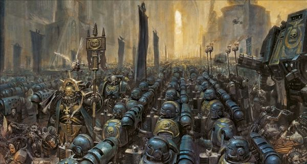

<!-- A0428-B0205 -->

原译文

The Ultramarines Chapter 极限战士战团

**校订译文**

The Ultramarines Chapter 极限战士战团

<!-- /A0428-B0205 -->

<!-- A0428-B0206 -->
**英文原文**

The chapter treats deviation from the Codex as a crime tantamount to heresy, punishable by a Death Oath — exile from the chapter on a suicidal mission to combat the forces of Chaos inside the Eye of Terror. To the Ultramarines, the Codex is more than a set of rules, it represents discipline and respect for order, the key virtues that separate the Ultramarines and their brethren from the Traitor Legions. Disobeying the Codex, even for a noble cause, is simply the first step towards the belief that the ends justify the means, and from there to total anarchy.

<!-- /A0428-B0206 -->

<!-- A0428-B0207 -->

原译文

战团将偏离圣典视为等同于异端的罪行，可处以死亡誓言 — 从关于在恐惧之眼内打击混沌部队的自杀任务于战团中放逐。对极限战士来说，圣典不仅仅是一套规则，它代表了纪律和尊重秩序，这是将极限战士及其兄弟与叛徒军团区分开来的关键美德。即使是为了崇高的事业，违反圣典也只是朝着相信目的证明手段正当的第一步，并从那里走向完全无政府状态。

**校订译文**

战团将背离圣典视为近乎异端的罪行，可罚以“死亡誓言”：将犯者逐出战团，命其深入恐惧之眼执行对抗混沌的自杀任务。对极限战士而言，圣典不仅是一套规则，更代表纪律与对秩序的尊重；这些正是他们及忠诚兄弟区别于叛徒军团的关键美德。在他们看来，即使动机崇高，违背圣典也是走向“不择手段达成目的”的第一步，最终将滑入彻底的混乱。

<!-- /A0428-B0207 -->

<!-- A0428-B0208 -->
**英文原文**

To the wider galaxy at large, Ultramarines are renowned for their logic, superb training, tactical flexibility, and ability to learn from failure and improve themselves accordingly. This is reflected in mental-strategic concepts emphasized by Guilliman himself. The Practical represents discipline, skill, courage, flexibility, and battlefield results while the Theoretical represents analysis, assessment, precedent, and planning. Virtually any challenge an Ultramarine faces will see the warrior balance these two notions in their mind. Despite their reputation for strict Codex adherence, Guilliman emphasizes individual independence in tactical decision-making and believes lives should not be wastefully expended for the sake of maintaining the Codex.

<!-- /A0428-B0208 -->

<!-- A0428-B0209 -->

原译文

对于更广阔的银河来说，极限战士以其逻辑性、精湛的训练、战术灵活性以及从失败中学习并相应提高自己的能力而闻名。这反映在基里曼本人强调的心理战略概念中。实践代表纪律、技能、勇气、灵活性和战场结果，而理论代表分析、评估、先例和规划。实际上，极限战士面临的任何挑战都会让战士在脑海中平衡这两个概念。尽管他们以严格遵守圣典而闻名，但基里曼强调个人在战术决策中的独立性，并认为不应为了维护圣典而浪费生命。

**校订译文**

对于更广阔的银河来说，极限战士以其逻辑性、精湛的训练、战术灵活性以及从失败中学习并相应提高自己的能力而闻名。这反映在基里曼本人强调的心理战略概念中。实践代表纪律、技能、勇气、灵活性和战场结果，而理论代表分析、评估、先例和规划。实际上，极限战士面临的任何挑战都会让战士在脑海中平衡这两个概念。尽管他们以严格遵守圣典而闻名，但基里曼强调个人在战术决策中的独立性，并认为不应为了维护圣典而浪费生命。

<!-- /A0428-B0209 -->

<!-- A0428-B0210 -->
**英文原文**

The Ultramarines are also strongly influenced by their unique history as stewards of Ultramar and its human population. Guilliman founded a culture based on striving for the common good, and the Ultramarines are proud to uphold these beliefs. Where other Space Marines are aloof, and sometimes contemptuous of the Imperium's "lesser" mortals, most Ultramarines are used to working closely with "ordinary" people in Ultramar, and regard any human life, no matter how seemingly insignificant, as sacred and worthy of protection. They are also harshly intolerant when they encounter less altruistic behaviour - greed, selfishness, corruption - on other Imperial worlds.

<!-- /A0428-B0210 -->

<!-- A0428-B0211 -->

原译文

作为奥特拉玛及其人口的管理，极限战士也深受其独特历史的影响。基里曼创立了一种以追求共同利益为基础的文化，极限战士很自豪能够坚持这些信念。在其他星际战士冷漠的地方，有时甚至蔑视帝国的“低等”凡人，大多数极限战士习惯于与奥特拉玛的“普通”人密切合作，并认为任何人的生命，无论多么微不足道，都是神圣的，值得保护的。当他们在其他帝国世界遇到不那么无私的行为 — 贪婪、自私、腐败时，他们也会变得非常不宽容。

**校订译文**

极限战士独有的历史也深刻影响着他们：他们长期治理奥特拉玛及其凡人居民。基里曼建立了追求共同福祉的文化，战团以传承这一信念为荣。其他星际战士往往疏离，甚至蔑视帝国的“低等”凡人，而大多数极限战士习惯与奥特拉玛普通人密切合作，认为每条人命无论看似多么微不足道，都神圣而值得守护。当他们在帝国其他世界遇到贪婪、自私或腐败时，也会严厉处置，绝不姑息。

<!-- /A0428-B0211 -->

<!-- A0428-B0212 -->
**英文原文**

During the Invasion of Ultramar in 999.M41, Inquisitor Namira Suzaku of the Ordo Malleus noted that the people of Calth regarded her and her entourage with curiosity, but no visible apprehension; she remarked that it was the first world in the Imperium she had ever visited where people felt they had nothing to hide from the Inquisition.

<!-- /A0428-B0212 -->

<!-- A0428-B0213 -->

原译文

在999.M41奥特拉玛入侵期间，圣锤修会的审判官娜米拉·朱雀指出，考斯人民对她和她的随从充满好奇，但没有明显的担忧；她说，这是她访问过的帝国时期的第一个世界，人们觉得他们对审判庭没有什么可隐瞒的。

**校订译文**

999.M41奥特拉玛遭入侵时，恶魔审判庭审判官娜米拉·朱雀发现，考斯居民对她和随从只有好奇，没有明显惧意。她感叹，这是自己造访过的第一个让居民觉得无须向审判庭隐瞒什么的帝国世界。

<!-- /A0428-B0213 -->

<!-- A0428-B0214 -->
**英文原文**

After the start of the Indomitus Crusade, some of the Ultramarines' Primaris began to call the 'common' (non-Primaris) Space Marines, as "first born", though Sicarius, for example, considered it overly reductive and colloquial.

<!-- /A0428-B0214 -->

<!-- A0428-B0215 -->

原译文

在不屈远征开始后，一些极限战士的原铸开始称“普通”（非原铸）星际战士为“长子”，尽管西卡留斯认为这过于简化和口语化。

**校订译文**

在不屈远征开始后，一些极限战士的原铸开始称“普通”（非原铸）星际战士为“长子”，尽管西卡留斯认为这过于简化和口语化。

<!-- /A0428-B0215 -->

<!-- A0428-B0216 -->
### Home Sector 家园星区

<!-- /A0428-B0216 -->

<!-- A0428-B0217 -->
**英文原文**

The Ultramarines are unique in that, unlike their fellow chapters, they control an entire sub-sector of space, rather than a single planet. Collectively, these systems are known as the Five Hundred Worlds of Ultramar, with Macragge as its capital. Though the realm itself is divided into smaller sectors which are each in turn ruled by Tetrarchs that are appointed by Roboute Guilliman himself.

<!-- /A0428-B0217 -->

<!-- A0428-B0218 -->

原译文

极限战士的独特之处在于，与他们的其他战团不同，他们控制着整个太空分区，而不是一个行星。总的来说，这些星系被称为奥特拉玛五百世界，以马库拉格为首都。尽管领域本身被划分为更小的星区，每个区域又由罗伯特·基里曼亲自任命的英杰统治。

**校订译文**

极限战士与众不同：他们统治的不是单一行星，而是整片次星区。诸星系合称奥特拉玛五百世界，以马库拉格为首府。领地内部又划为若干较小区域，由罗保特·基里曼亲自任命的四方领主分别治理。

**校注：** 英文先称 sub-sector，又说内部细分 sectors，层级词使用与通常行政层级不完全一致；中文以次星区／较小区域保留规模关系，不自行改写疆界。

<!-- /A0428-B0218 -->

<!-- A0428-B0219 图片 -->
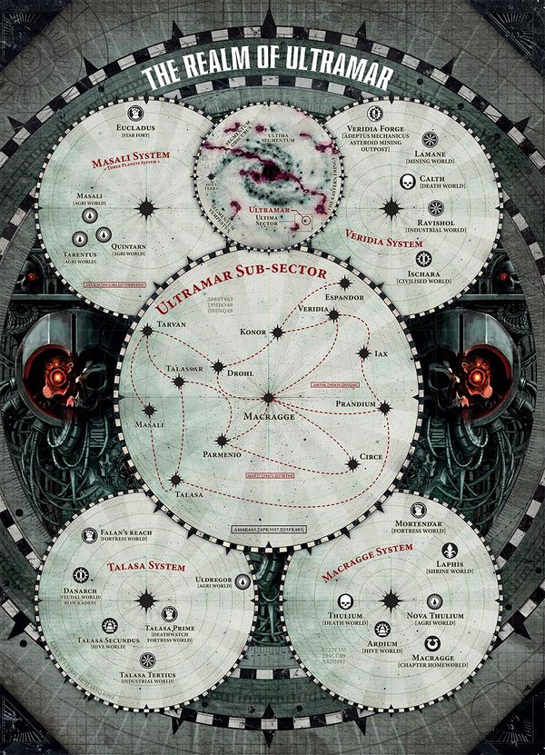

<!-- A0428-B0220 -->

原译文

The realm of Ultramar 奥特拉玛领域

**校订译文**

The realm of Ultramar 奥特拉玛领域

<!-- /A0428-B0220 -->

<!-- A0428-B0221 -->
**英文原文**

While the number of colonized worlds in this domain numbers in the hundreds, some of the most well-known planets of Ultramar include:

<!-- /A0428-B0221 -->

<!-- A0428-B0222 -->

原译文

虽然该域中的殖民世界数量达到数百个，但奥特拉玛的一些最著名的行星包括：

**校订译文**

虽然该域中的殖民世界数量达到数百个，但奥特拉玛的一些最著名的行星包括：

<!-- /A0428-B0222 -->

<!-- A0428-B0223 -->
**英文原文**

Macragge: Capital of Ultramar/Chapter Planet

<!-- /A0428-B0223 -->

<!-- A0428-B0224 -->

原译文

马库拉格：奥特拉玛首都/战团行星

**校订译文**

马库拉格：奥特拉玛首都/战团行星

<!-- /A0428-B0224 -->

<!-- A0428-B0225 -->
**英文原文**

Calth: Cavern World/Main Shipyard of Ultramar

<!-- /A0428-B0225 -->

<!-- A0428-B0226 -->

原译文

考斯：洞穴世界/奥特拉玛主造船厂

**校订译文**

考斯：洞穴世界/奥特拉玛主造船厂

<!-- /A0428-B0226 -->

<!-- A0428-B0227 -->
**英文原文**

Espandor: Cardinal World

<!-- /A0428-B0227 -->

<!-- A0428-B0228 -->

原译文

埃斯潘多：红衣主教世界

**校订译文**

埃斯潘多：红衣主教世界

<!-- /A0428-B0228 -->

<!-- A0428-B0229 -->
**英文原文**

Konor: Adeptus Mechanicus Forge World

<!-- /A0428-B0229 -->

<!-- A0428-B0230 -->

原译文

康诺：机械神教铸造世界

**校订译文**

康诺：机械修会铸造世界。

<!-- /A0428-B0230 -->

<!-- A0428-B0231 -->
**英文原文**

Parmenio: Training World

<!-- /A0428-B0231 -->

<!-- A0428-B0232 -->

原译文

帕尔梅尼奥：训练世界

**校订译文**

帕尔梅尼奥：训练世界

<!-- /A0428-B0232 -->

<!-- A0428-B0233 -->
**英文原文**

Talassar: Ocean World

<!-- /A0428-B0233 -->

<!-- A0428-B0234 -->

原译文

塔拉萨：海洋世界

**校订译文**

塔拉萨：海洋世界

<!-- /A0428-B0234 -->

<!-- A0428-B0235 -->
**英文原文**

Talasa Prime: Inquisition Fortress

<!-- /A0428-B0235 -->

<!-- A0428-B0236 -->

原译文

塔拉萨主星：审判庭堡垒

**校订译文**

塔拉萨主星：审判庭堡垒

<!-- /A0428-B0236 -->

<!-- A0428-B0237 -->
**英文原文**

Laphis: Shrine World

<!-- /A0428-B0237 -->

<!-- A0428-B0238 -->

原译文

拉斐斯：圣地世界

**校订译文**

拉斐斯：圣地世界

<!-- /A0428-B0238 -->

<!-- A0428-B0239 -->
**英文原文**

Ardium: Hive World

<!-- /A0428-B0239 -->

<!-- A0428-B0240 -->

原译文

阿尔蒂姆：巢都世界

**校订译文**

阿尔蒂姆：巢都世界

<!-- /A0428-B0240 -->

<!-- A0428-B0241 -->

原译文

The "Three Planets" 三星

**校订译文**

The "Three Planets" 三星

<!-- /A0428-B0241 -->

<!-- A0428-B0242 -->
**英文原文**

Masali: Agri World

<!-- /A0428-B0242 -->

<!-- A0428-B0243 -->

原译文

马萨里：农业世界

**校订译文**

马萨里：农业世界

<!-- /A0428-B0243 -->

<!-- A0428-B0244 -->
**英文原文**

Quintarn: Agri World

<!-- /A0428-B0244 -->

<!-- A0428-B0245 -->

原译文

昆坦：农业世界

**校订译文**

昆坦：农业世界

<!-- /A0428-B0245 -->

<!-- A0428-B0246 -->
**英文原文**

Tarentus: Agri World

<!-- /A0428-B0246 -->

<!-- A0428-B0247 -->

原译文

塔伦图斯：农业世界

**校订译文**

塔伦图斯：农业世界

<!-- /A0428-B0247 -->

<!-- A0428-B0248 -->
## Organisation 组织

<!-- /A0428-B0248 -->

<!-- A0428-B0249 -->
### Pre-Heresy 叛乱前

<!-- /A0428-B0249 -->

<!-- A0428-B0250 -->
**英文原文**

During the Great Crusade and Horus Heresy, the Ultramarines were a much larger Legion commanded by Roboute Guilliman. Beneath him were Chapter Masters who led approximately 10,000 warriors and a segment of the Legion fleet. Each Chapter was in turn divided into ten Companies of 1,000 under the command of a Captain. The Legion also maintained several specialized forces no longer seen today, such as the Invictarii, Fulmentari, Locutari, and Evocati.

<!-- /A0428-B0250 -->

<!-- A0428-B0251 -->

原译文

在大远征和荷鲁斯叛乱期间，极限战士军团是由罗伯特·基里曼指挥的一个更大的军团。在他下面是战团长，他们领导着大约10000名战士和一部分军团舰队。每战团又分为十个1000人的连队，由一名连长指挥。军团还保留了几支如今已不复存在的特种部队，如因常胜军、辉脊、传喻者和后备军。

**校订译文**

大远征及荷鲁斯之乱期间，罗保特·基里曼统领的极限战士规模远胜今日。原体之下设战团长，每人统率约一万名战士及一部分军团舰队；各战团再划为十个千人连队，每连由连长指挥。军团当时还拥有如今已不复存在的特种部队，包括常胜军、辉脊、传喻者和后备军。

**校注：** 此段为大远征的万人战团、千人连队编制，区别后文战团改革后的千人战团、百人连队。

<!-- /A0428-B0251 -->

<!-- A0428-B0252 -->
**英文原文**

In contrast to the vast numbers of Space Marines in the Ultramarines Legion, the naval assets of Ultramar were more limited. Historically, Roboute Guilliman had made a virtue of close alliance with the Imperialis Armada fleets of the Ultima Segmentum, and relied upon them closely when a particular campaign called for a powerful capital ship contingent to be employed or extensive orbital bombardments to be undertaken. The Primarch himself was known to have observed that his warriors were intended to excel in spheres of combat other than the impersonal long range clash of star ships many kilometres apart in the deep void, and greatly favoured his own Legion fleet to be optimised for close assault and maintained ships designed for invasion operations for this reason.

<!-- /A0428-B0252 -->

<!-- A0428-B0253 -->

原译文

与极限战士军团中庞大的星际战士数量相比，奥特拉玛的海军资产更为有限。从历史上看，罗伯特·基里曼与极限星域的帝国舰队建立了密切的联盟，并在特定的战役中需要使用强大的主力舰特遣队或进行大规模的轨道轰炸时密切依赖他们。众所周知，原体本人曾观察到，他的战士们打算在战斗领域表现出色，而不是在深邃的虚空中相隔数公里的星舰之间进行非个人化的远程冲突，并非常赞成他自己的军团舰队针对近距离突击进行优化，并因此维护专为入侵行动设计的船只。

**校订译文**

与庞大的星际战士兵力相比，奥特拉玛的舰队资源较为有限。罗保特·基里曼一向重视与极限星域帝国舰队的紧密协作；遇到需要强大主力舰群或大规模轨道轰击的战役，便仰赖盟军支援。他认为，自己的战士应在其他战斗领域发挥长处，而非参与深空中相隔遥远的舰船火力对射。因此，他尤其倾向将军团舰队优化为近距离突击力量，保有专为登陆入侵而设计的战舰。

<!-- /A0428-B0253 -->

<!-- A0428-B0254 -->
**英文原文**

As a result, the Legion had never operated large numbers of the heaviest capital ships, retaining less than 30-35 of such craft at various points, having lost several in battle over time, notably the Legion's first flagship among them during the disaster at the Osiris Cluster. Of those heavy capital ships which remained, most had served since the Legion's inception at the beginning of the Great Crusade and had been heavily refitted over time. Only a handful of the newer models of heavy capital ships had been assigned to them since the Primarch Roboute Guilliman's command tenure had begun, although of these notably two were of the extremely powerful Gloriana Class Battleships.

<!-- /A0428-B0254 -->

<!-- A0428-B0255 -->

原译文

因此，该军团从未运营过大量最重的主力舰，在不同时刻保留了不到30-35艘此类船只，随着时间的推移，在战斗中损失了几艘，特别是该军团在奥西里斯星群灾难中的第一艘旗舰。在剩下的重型主力舰中，大多数是在大远征开始时军团成立以来服役的，并且随着时间的推移进行了大量改装。自原体罗伯特·基里曼的指挥任期开始以来，只有少数新型重型主力舰被分配给他们，尽管其中两艘是极其强大的荣光女王级战列舰。

**校订译文**

因此，极限战士从未拥有大批最重型主力舰，各时期数量通常不超过三十至三十五艘。军团在历次战斗中损失过数艘，其中最著名的是首任旗舰在奥西里斯星群灾难中被毁。剩余重型主力舰多从大远征初期军团建立时便已服役，后来历经大规模改装。基里曼接掌军团后，获配的新型重型主力舰屈指可数，但其中有两艘极为强大的荣光女王级战列舰。

<!-- /A0428-B0255 -->

<!-- A0428-B0256 -->
**英文原文**

The main body of the Legion's void craft fleet was then made up of mid-scaled cruisers and smaller battle barges of various classes, along with substantial numbers of lighter pattern purpose-built strike cruisers, frigates and fast patrol cutters, all which could be produced by the shipyards of worlds across Ultramar. Although this fleet structure did allow the Legion a great deal of flexibility and: range in how it deployed its many Space Marine chapters, its combined overall tonnage and firepower ranked the Ultramarines fleet in the mid-tier of the Legions, considerably behind the Imperial Fists, for example, in terms of tonnage and destructive power, and behind the Death Guard in terms of number of heavy capital units.

<!-- /A0428-B0256 -->

<!-- A0428-B0257 -->

原译文

军团的虚空舰队主要由中型巡洋舰和各种级别的小型战斗驳船组成，还有大量轻型专用打击巡洋舰、护卫舰和快速巡逻艇，所有这些都可以由奥特拉玛各地的造船厂生产。尽管这种舰队结构确实为军团提供了极大的灵活性，并且在部署其许多星际战士战团方面具有广泛的范围，但其总吨位和火力将极限战士舰队列为军团的中层，例如，在吨位和破坏力方面远远落后于帝国之拳，在重型主力单位数量方面落后于死亡守卫。

**校订译文**

军团舰队主力由中型巡洋舰、各型较小的战斗驳船，以及大量专门建造的轻型打击巡洋舰、护卫舰和高速巡逻艇组成。这些舰船都能由奥特拉玛各世界的船坞建造。这种结构使军团部署麾下众多战团时具有很强的灵活性与广泛的行动范围，但总吨位和综合火力只能居于各军团中游：吨位与破坏力明显逊于帝国之拳，重型主力舰数量则少于死亡守卫。

<!-- /A0428-B0257 -->

<!-- A0428-B0258 -->
**英文原文**

The Legion also maintained senior positions outside of Captains, such as the four Tetrarchs as well as Legates or Legatus who oversaw large battleforces.

<!-- /A0428-B0258 -->

<!-- A0428-B0259 -->

原译文

军团还保留了连长以外的高级职位，如四位英杰以及监督大型作战部队的使节或司令官。

**校订译文**

军团还设有连长之外的高级职位，包括四位四方领主，以及统领大型战斗群的军团统帅（Legates／Legatus）。

**校注：** Legates 与 Legatus 为同一拉丁职衔的不同数／词形，不是原译“使节或司令官”两种不同岗位；暂译军团统帅并保留英文。

<!-- /A0428-B0259 -->

<!-- A0428-B0260 -->
### Post-Heresy 叛乱后

<!-- /A0428-B0260 -->

<!-- A0428-B0261 -->
**英文原文**

The Ultramarines follow the Codex Astartes in all matters of organization. Roughly two thirds of all Space Marines can trace their origins to the Ultramarines, and many still revere Roboute Guilliman as their creator. As well as a Boltgun, many Ultramarines carry a sword known as a Gladius. The Ultramarines Honour Guard wield formidable close combat weapons known as the Axes of Ultramar.

<!-- /A0428-B0261 -->

<!-- A0428-B0262 -->

原译文

极限战士在所有组织事务上都遵循阿斯塔特圣典。大约三分之二的星际战士可以追溯到极限战士，许多人仍然将罗伯特·基里曼视为他们的创造者。除了爆矢枪，许多极限战士还携带一把被称为短剑的剑。极限战士荣誉卫队挥舞着被称为U奥特拉玛之斧的强大近战武器。

**校订译文**

极限战士在组织编制上全面遵循《阿斯塔特圣典》。约三分之二的星际战士能将血脉追溯至极限战士，许多人仍将罗保特·基里曼尊为缔造者。除爆矢枪外，许多极限战士还佩带一种称为 Gladius 的短剑。极限战士荣誉卫队则使用威力强大的近战武器“奥特拉玛之斧”。

<!-- /A0428-B0262 -->

<!-- A0428-B0263 -->
**英文原文**

As the paragon Codex chapter, the Ultramarines are divided into ten Companies of 100 Marines, as prescribed by the Codex Astartes. Since the return of Guilliman, the de facto role of the various companies has changed slightly.

<!-- /A0428-B0263 -->

<!-- A0428-B0264 -->

原译文

作为圣典的典范战团，根据阿斯塔特圣典的规定，极限战士分为10个100人的连队。自基里曼回归以来，各连队的实际角色略有变化。

**校订译文**

作为圣典的典范战团，根据阿斯塔特圣典的规定，极限战士分为10个100人的连队。自基里曼回归以来，各连队的实际角色略有变化。

<!-- /A0428-B0264 -->

<!-- A0428-B0265 -->
**英文原文**

The 1st Company remains the Veteran Company, while the 2nd through 5th are still serving as the Battle Companies. However as of the birth of the Indomitus Crusade the 3rd and 5th Companies are both heavily fractured, spread out across several strikegroups from the Cadian Gate to Eastern Fringe. The 2nd and 4th meanwhile mostly commit themselves to the defense of Ultramar itself, seeing heavy action in campaigns such as the Plague Wars. The 6th and 7th Companies remain as a strategic reserve of mainstay warriors meant to fill any requirement, in particular operating Land Speeders, Bikes, and tanks. The 8th and 9th Companies are based around Close Support and Fire Support, with their warriors quickly and efficiently taking up different roles such as Hellblaster or Inceptor as missions demand. These are brought up rapidly then assigned to the main Battle Companies.

<!-- /A0428-B0265 -->

<!-- A0428-B0266 -->

原译文

第一连队仍然是老兵连队，而第二至第五连队仍然是战斗连队。然而，随着不屈远征的启动，第三和第五连队都严重分裂，分散在从卡迪亚之门到东部边缘的几个突击队中。与此同时，第二和第四连队大多致力于保卫奥特拉玛本身，在瘟疫战争等战役中看到了激烈的行动。第六和第七连队仍然是主力战士的战略储备，旨在满足任何需求，特别是操作兰德速攻艇、摩托和坦克。第八和第九连队以近身支援和火力支援为基础，他们的战士根据任务需要快速有效地扮演不同的角色，如地狱轰击者或先驱者。这些人被迅速培养出来，然后被分配到主要的战斗连队。

**校订译文**

第一连仍为老兵连，第二至第五连仍为战斗连。不过，不屈远征开始后，第三、第五连被分散编入多个打击群，从卡迪亚之门到银河东部边缘各处作战。第二、第四连则主要保卫奥特拉玛，在瘟疫战争等战役中承担激战。第六、第七连继续作为主干战士组成的战略预备队，随时填补各种需求，尤其负责操作兰德速攻艇、摩托与坦克。第八、第九连分别专长近战支援与火力支援，战士可按任务需要迅速转换为地狱轰击者、先驱者等不同兵种，及时调往前线配属各战斗连。

**校注：** 源文 fractured 指兵力分散部署，并不指连队发生内讧分裂。brought up 按战场调动语境译调往前线，不作新兵培养。

<!-- /A0428-B0266 -->

<!-- A0428-B0267 -->
**英文原文**

Like all Codex-compliment Chapters, the 10th Company consists largely of Neophyte Scouts under a Master of Recruits. More recently, 10 Vanguard Squads have been added to the 10th to give it further strategic flexibility.

<!-- /A0428-B0267 -->

<!-- A0428-B0268 -->

原译文

与所有遵从圣典的战团一样，第十连队主要由新兵之主手下的新进者侦察兵组成。最近，10个先锋小队被添加到第十连队中，以赋予其更大的战略灵活性。

**校订译文**

如其他遵循圣典的战团一样，第十连主要由新兵大师管辖的见习侦察兵组成。近年来，该连又增设十个先锋小队，以增强战略灵活性。

<!-- /A0428-B0268 -->

<!-- A0428-B0269 -->
### Headquarters 总部

<!-- /A0428-B0269 -->

<!-- A0428-B0270 -->
**英文原文**

The headquarters staff as of the Age of the Dark Imperium are:

<!-- /A0428-B0270 -->

<!-- A0428-B0271 -->

原译文

黑暗帝国时代的总部工作人员是：

**校订译文**

黑暗帝国时代的总部工作人员是：

<!-- /A0428-B0271 -->

<!-- A0428-B0272 -->
### Chapter Command 战团指挥

<!-- /A0428-B0272 -->

<!-- A0428-B0273 图片 -->
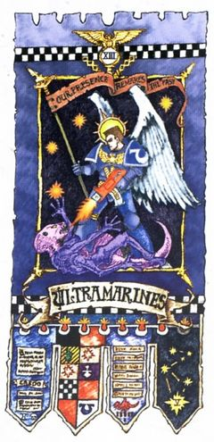

<!-- A0428-B0274 -->

原译文

Roboute Guilliman 罗伯特·基里曼

**校订译文**

Roboute Guilliman 罗保特·基里曼

<!-- /A0428-B0274 -->

<!-- A0428-B0275 -->

原译文

Primarch of the Ultramarines 极限战士原体

**校订译文**

Primarch of the Ultramarines 极限战士原体

<!-- /A0428-B0275 -->

<!-- A0428-B0276 -->

原译文

Lord Commander of the Imperium 帝国领主指挥官

**校订译文**

Lord Commander of the Imperium 帝国最高统帅

<!-- /A0428-B0276 -->

<!-- A0428-B0277 -->

原译文

Marneus Calgar 马涅乌斯·卡尔加

**校订译文**

Marneus Calgar 马涅乌斯·卡尔加

<!-- /A0428-B0277 -->

<!-- A0428-B0278 -->

原译文

Lord Macragge 马库拉格领主

**校订译文**

Lord Macragge 马库拉格领主

<!-- /A0428-B0278 -->

<!-- A0428-B0279 -->

原译文

Master of the Ultramarines 极限战士之主

**校订译文**

Master of the Ultramarines 极限战士之主

<!-- /A0428-B0279 -->

<!-- A0428-B0280 -->

原译文

Chapter Ancient Agrippa 战团旗手阿格里帕

**校订译文**

Chapter Ancient Agrippa 战团旗手阿格里帕

<!-- /A0428-B0280 -->

<!-- A0428-B0281 -->

原译文

Chapter Champion 战团冠军

**校订译文**

Chapter Champion 战团冠军

<!-- /A0428-B0281 -->

<!-- A0428-B0282 -->

原译文

Victrix Guard 常胜护卫

**校订译文**

Victrix Guard 常胜卫队

<!-- /A0428-B0282 -->

<!-- A0428-B0283 -->
**英文原文**

Land Raider (Maximus)

<!-- /A0428-B0283 -->

<!-- A0428-B0284 -->

原译文

兰德掠袭者（终极号）

**校订译文**

兰德掠袭者（终极号）

<!-- /A0428-B0284 -->

<!-- A0428-B0285 -->

原译文

Equerries and Servitors 侍从和机仆

**校订译文**

Equerries and Servitors 侍从官与机仆

<!-- /A0428-B0285 -->

<!-- A0428-B0286 -->
### Armoury 军械库

<!-- /A0428-B0286 -->

<!-- A0428-B0287 图片 -->
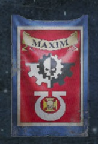

<!-- A0428-B0288 -->
**英文原文**

Fennias Maxim,Master of the Forge

<!-- /A0428-B0288 -->

<!-- A0428-B0289 -->

原译文

芬尼亚斯·马克西姆，铸造大师

**校订译文**

芬尼亚斯·马克西姆，铸造大师

<!-- /A0428-B0289 -->

<!-- A0428-B0290 -->

原译文

Techmarines 技术军士

**校订译文**

Techmarines 科技战士

<!-- /A0428-B0290 -->

<!-- A0428-B0291 -->

原译文

Servitors 机仆

**校订译文**

Servitors 机仆

<!-- /A0428-B0291 -->

<!-- A0428-B0292 -->

原译文

Battle Tanks 战斗坦克

**校订译文**

Battle Tanks 战斗坦克

<!-- /A0428-B0292 -->

<!-- A0428-B0293 -->

原译文

Transport Vehicles 运输载具

**校订译文**

Transport Vehicles 运输载具

<!-- /A0428-B0293 -->

<!-- A0428-B0294 -->

原译文

Gunships 炮艇

**校订译文**

Gunships 炮艇

<!-- /A0428-B0294 -->

<!-- A0428-B0295 -->

原译文

Centurion Warsuits 百夫长战服

**校订译文**

Centurion Warsuits 百夫长战甲

<!-- /A0428-B0295 -->

<!-- A0428-B0296 -->

原译文

Land Speeders 兰德速攻艇

**校订译文**

Land Speeders 兰德速攻艇

<!-- /A0428-B0296 -->

<!-- A0428-B0297 -->

原译文

Bikes 摩托

**校订译文**

Bikes 摩托

<!-- /A0428-B0297 -->

<!-- A0428-B0298 -->
### Apothecarion 药剂部

<!-- /A0428-B0298 -->

<!-- A0428-B0299 图片 -->
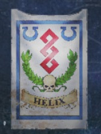

<!-- A0428-B0300 -->
**英文原文**

Corpus Helix,Master of the Apothecarion

<!-- /A0428-B0300 -->

<!-- A0428-B0301 -->

原译文

科尔珀斯·赫利克斯，药剂部之主

**校订译文**

科尔珀斯·赫利克斯，药剂部之主

<!-- /A0428-B0301 -->

<!-- A0428-B0302 -->

原译文

Apothecaries 药剂师

**校订译文**

Apothecaries 药剂师

<!-- /A0428-B0302 -->

<!-- A0428-B0303 -->
### Fleet Command 舰队指挥

<!-- /A0428-B0303 -->

<!-- A0428-B0304 -->
**英文原文**

Lord Admiral Lazlo Tiberius,Master of the Fleet

<!-- /A0428-B0304 -->

<!-- A0428-B0305 -->

原译文

海军上将拉兹洛·提比略，舰队之主

**校订译文**

海军上将领主拉兹洛·提比略，舰队大师。

<!-- /A0428-B0305 -->

<!-- A0428-B0306 -->

原译文

1 Gloriana Class Battleship 一艘荣光女王级战列舰

**校订译文**

1 Gloriana Class Battleship 一艘荣光女王级战列舰

<!-- /A0428-B0306 -->

<!-- A0428-B0307 -->

原译文

3 Star Forts 三个星堡

**校订译文**

3 Star Forts 三个星堡

<!-- /A0428-B0307 -->

<!-- A0428-B0308 -->

原译文

7 Battle Barges 七艘战斗驳船

**校订译文**

7 Battle Barges 七艘战斗驳船

<!-- /A0428-B0308 -->

<!-- A0428-B0309 -->

原译文

15 Strike Cruisers 15艘打击巡洋舰

**校订译文**

15 Strike Cruisers 15艘打击巡洋舰

<!-- /A0428-B0309 -->

<!-- A0428-B0310 -->

原译文

20 Rapid Strike vessels 20艘快速打击战舰

**校订译文**

20 Rapid Strike vessels 20艘快速打击战舰

<!-- /A0428-B0310 -->

<!-- A0428-B0311 -->

原译文

75 Thunderhawks 75架雷鹰

**校订译文**

75 Thunderhawks 75架雷鹰

<!-- /A0428-B0311 -->

<!-- A0428-B0312 -->
### Librarius 智库

<!-- /A0428-B0312 -->

<!-- A0428-B0313 图片 -->
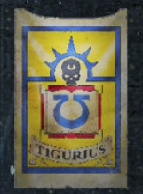

<!-- A0428-B0314 -->
**英文原文**

Varro Tigurius,Chief Librarian

<!-- /A0428-B0314 -->

<!-- A0428-B0315 -->

原译文

瓦罗·狄格里斯，首席智库

**校订译文**

瓦罗·狄格里斯，首席智库员。

<!-- /A0428-B0315 -->

<!-- A0428-B0316 -->

原译文

Epistolaries 星语官

**校订译文**

Epistolaries 星语官

<!-- /A0428-B0316 -->

<!-- A0428-B0317 -->

原译文

Codiciers 典记员

**校订译文**

Codiciers 典记员

<!-- /A0428-B0317 -->

<!-- A0428-B0318 -->

原译文

Lexicania 编修员

**校订译文**

Lexicania 编修员

<!-- /A0428-B0318 -->

<!-- A0428-B0319 -->

原译文

Acolyta 侍僧

**校订译文**

Acolyta 侍僧

<!-- /A0428-B0319 -->

<!-- A0428-B0320 -->
### Chaplaincy 教士团

原题：Chaplaincy 隐修室

<!-- /A0428-B0320 -->

<!-- A0428-B0321 图片 -->
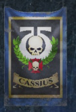

<!-- A0428-B0322 -->
**英文原文**

Ortan Cassius,Master of Sanctity

<!-- /A0428-B0322 -->

<!-- A0428-B0323 -->

原译文

奥坦·卡西乌斯，圣洁导师

**校订译文**

奥坦·卡西乌斯，圣洁导师

<!-- /A0428-B0323 -->

<!-- A0428-B0324 -->
**英文原文**

Reclusiarch Julianus Akillan

<!-- /A0428-B0324 -->

<!-- A0428-B0325 -->

原译文

隐修士尤里安努斯·阿基兰

**校订译文**

隐修长尤里安努斯·阿基兰。

<!-- /A0428-B0325 -->

<!-- A0428-B0326 -->

原译文

Chaplains 牧师

**校订译文**

Chaplains 教士

<!-- /A0428-B0326 -->

<!-- A0428-B0327 -->

原译文

Judiciars 裁决士

**校订译文**

Judiciars 裁决者

<!-- /A0428-B0327 -->

<!-- A0428-B0328 -->
### Companies 连队

<!-- /A0428-B0328 -->

<!-- A0428-B0329 -->
**英文原文**

The current Companies and their Captains as of the Age of the Dark Imperium are as follows:

<!-- /A0428-B0329 -->

<!-- A0428-B0330 -->

原译文

截至黑暗帝国时代，目前的连队及其连长如下：

**校订译文**

截至黑暗帝国时代，目前的连队及其连长如下：

<!-- /A0428-B0330 -->

<!-- A0428-B0331 -->
### Veteran Company 老兵连队

<!-- /A0428-B0331 -->

<!-- A0428-B0332 -->

原译文

1st Company 第一连队

**校订译文**

1st Company 第一连队

<!-- /A0428-B0332 -->

<!-- A0428-B0333 图片 -->
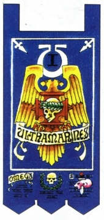

<!-- A0428-B0334 -->

原译文

"Warriors of Ultramar" “奥特拉玛战士”

**校订译文**

"Warriors of Ultramar" “奥特拉玛战士”

<!-- /A0428-B0334 -->

<!-- A0428-B0335 -->
### First Captain Severus Agemman 第一连长西弗勒斯·阿格曼

<!-- /A0428-B0335 -->

<!-- A0428-B0336 -->

原译文

Regent of Ultramar 奥特拉玛摄政

**校订译文**

Regent of Ultramar 奥特拉玛摄政

<!-- /A0428-B0336 -->

<!-- A0428-B0337 -->

原译文

2 Lieutenants 2名副官

**校订译文**

2 Lieutenants 2名副官

<!-- /A0428-B0337 -->

<!-- A0428-B0338 -->

原译文

Company Ancient 连队旗手

**校订译文**

Company Ancient 连队旗手

<!-- /A0428-B0338 -->

<!-- A0428-B0339 -->

原译文

Company Champion 连队冠军

**校订译文**

Company Champion 连队冠军

<!-- /A0428-B0339 -->

<!-- A0428-B0340 -->

原译文

Company Veterans 连队老兵

**校订译文**

Company Veterans 连队老兵

<!-- /A0428-B0340 -->

<!-- A0428-B0341 -->

原译文

10 Veteran Squads 10个老兵小队

**校订译文**

10 Veteran Squads 10个老兵小队

<!-- /A0428-B0341 -->

<!-- A0428-B0342 -->

原译文

Dreadnoughts 无畏

**校订译文**

Dreadnoughts 无畏机甲

<!-- /A0428-B0342 -->

<!-- A0428-B0343 -->

原译文

Land Raiders 兰德掠袭者

**校订译文**

Land Raiders 兰德掠袭者

<!-- /A0428-B0343 -->

<!-- A0428-B0344 -->

原译文

Transport Vehicles 运输载具

**校订译文**

Transport Vehicles 运输载具

<!-- /A0428-B0344 -->

<!-- A0428-B0345 -->
### Battle Companies 战斗连队

<!-- /A0428-B0345 -->

<!-- A0428-B0346 -->

原译文

2nd Company 第二连队

**校订译文**

2nd Company 第二连队

<!-- /A0428-B0346 -->

<!-- A0428-B0347 图片 -->
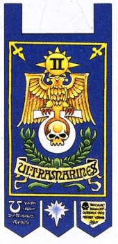

<!-- A0428-B0348 -->

原译文

"Guardians of the Temple" “圣堂护卫”

**校订译文**

"Guardians of the Temple" “圣堂护卫”

<!-- /A0428-B0348 -->

<!-- A0428-B0349 -->
### Captain Demetrian Titus 连长德米特里安·泰图斯

<!-- /A0428-B0349 -->

<!-- A0428-B0350 -->

原译文

Master of the Watch 守望大师

**校订译文**

Master of the Watch 守望大师

<!-- /A0428-B0350 -->

<!-- A0428-B0351 -->

原译文

2 Lieutenants 2名副官

**校订译文**

2 Lieutenants 2名副官

<!-- /A0428-B0351 -->

<!-- A0428-B0352 -->

原译文

Company Ancient Vandius 连队旗手瓦洛伦·加德里尔

**校订译文**

Company Ancient Vandius 连队旗手凡迪乌斯

**校注：** 英文为 Vandius，中文却写“瓦洛伦·加德里尔”，与人名不对应；暂音译凡迪乌斯。

<!-- /A0428-B0352 -->

<!-- A0428-B0353 -->

原译文

Company Champion 连队冠军

**校订译文**

Company Champion 连队冠军

<!-- /A0428-B0353 -->

<!-- A0428-B0354 -->

原译文

Company Veterans 连队老兵

**校订译文**

Company Veterans 连队老兵

<!-- /A0428-B0354 -->

<!-- A0428-B0355 -->

原译文

6 Battleline Squads 6个战线小队

**校订译文**

6 Battleline Squads 6个战线小队

<!-- /A0428-B0355 -->

<!-- A0428-B0356 -->

原译文

2 Close Support Squads 2个近战支援小队

**校订译文**

2 Close Support Squads 2个近战支援小队

<!-- /A0428-B0356 -->

<!-- A0428-B0357 -->

原译文

2 Fire Support Squads 2个火力支援小队

**校订译文**

2 Fire Support Squads 2个火力支援小队

<!-- /A0428-B0357 -->

<!-- A0428-B0358 -->

原译文

Dreadnoughts 无畏

**校订译文**

Dreadnoughts 无畏机甲

<!-- /A0428-B0358 -->

<!-- A0428-B0359 -->

原译文

Transport Vehicles 运输载具

**校订译文**

Transport Vehicles 运输载具

<!-- /A0428-B0359 -->

<!-- A0428-B0360 -->

原译文

3rd Company 第三连队

**校订译文**

3rd Company 第三连队

<!-- /A0428-B0360 -->

<!-- A0428-B0361 图片 -->
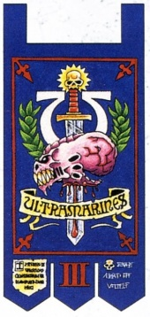

<!-- A0428-B0362 -->

原译文

"Scourge of the Xenos" “异型之灾”

**校订译文**

"Scourge of the Xenos" “异形之灾”

<!-- /A0428-B0362 -->

<!-- A0428-B0363 -->
### Captain Mikael Fabian 米凯尔·法比安连长

<!-- /A0428-B0363 -->

<!-- A0428-B0364 -->

原译文

Master of the Arsenal 军械之主

**校订译文**

Master of the Arsenal 军械大师

<!-- /A0428-B0364 -->

<!-- A0428-B0365 -->

原译文

2 Lieutenants 2名副官

**校订译文**

2 Lieutenants 2名副官

<!-- /A0428-B0365 -->

<!-- A0428-B0366 -->

原译文

Company Ancient 连队旗手

**校订译文**

Company Ancient 连队旗手

<!-- /A0428-B0366 -->

<!-- A0428-B0367 -->

原译文

Company Champion Torius 连队冠军托瑞斯

**校订译文**

Company Champion Torius 连队冠军托瑞斯

<!-- /A0428-B0367 -->

<!-- A0428-B0368 -->

原译文

Company Veterans 连队老兵

**校订译文**

Company Veterans 连队老兵

<!-- /A0428-B0368 -->

<!-- A0428-B0369 -->

原译文

6 Battleline Squads 6个战线小队

**校订译文**

6 Battleline Squads 6个战线小队

<!-- /A0428-B0369 -->

<!-- A0428-B0370 -->

原译文

2 Close Support Squads 2个近战支援小队

**校订译文**

2 Close Support Squads 2个近战支援小队

<!-- /A0428-B0370 -->

<!-- A0428-B0371 -->

原译文

2 Fire Support Squads 2个火力支援小队

**校订译文**

2 Fire Support Squads 2个火力支援小队

<!-- /A0428-B0371 -->

<!-- A0428-B0372 -->

原译文

Dreadnoughts 无畏

**校订译文**

Dreadnoughts 无畏机甲

<!-- /A0428-B0372 -->

<!-- A0428-B0373 -->

原译文

Garus 加鲁斯

**校订译文**

Garus 加鲁斯

<!-- /A0428-B0373 -->

<!-- A0428-B0374 -->

原译文

Transport Vehicles 运输载具

**校订译文**

Transport Vehicles 运输载具

<!-- /A0428-B0374 -->

<!-- A0428-B0375 -->

原译文

4th Company 第四连队

**校订译文**

4th Company 第四连队

<!-- /A0428-B0375 -->

<!-- A0428-B0376 图片 -->
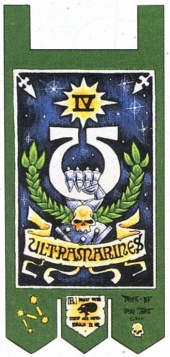

<!-- A0428-B0377 -->

原译文

"Defenders of Ultramar" “奥特拉玛卫士”

**校订译文**

"Defenders of Ultramar" “奥特拉玛卫士”

<!-- /A0428-B0377 -->

<!-- A0428-B0378 -->
### Captain Uriel Ventris 乌瑞尔·文崔斯连长

<!-- /A0428-B0378 -->

<!-- A0428-B0379 -->

原译文

2 Lieutenants 2名副官

**校订译文**

2 Lieutenants 2名副官

<!-- /A0428-B0379 -->

<!-- A0428-B0380 -->

原译文

Company Ancient 连队旗手

**校订译文**

Company Ancient 连队旗手

<!-- /A0428-B0380 -->

<!-- A0428-B0381 -->

原译文

Company Champion 连队冠军

**校订译文**

Company Champion 连队冠军

<!-- /A0428-B0381 -->

<!-- A0428-B0382 -->

原译文

Company Veterans 连队老兵

**校订译文**

Company Veterans 连队老兵

<!-- /A0428-B0382 -->

<!-- A0428-B0383 -->

原译文

6 Battleline Squads 6个战线小队

**校订译文**

6 Battleline Squads 6个战线小队

<!-- /A0428-B0383 -->

<!-- A0428-B0384 -->

原译文

2 Close Support Squads 2个近战支援小队

**校订译文**

2 Close Support Squads 2个近战支援小队

<!-- /A0428-B0384 -->

<!-- A0428-B0385 -->

原译文

2 Fire Support Squads 2个火力支援小队

**校订译文**

2 Fire Support Squads 2个火力支援小队

<!-- /A0428-B0385 -->

<!-- A0428-B0386 -->

原译文

Dreadnoughts 无畏

**校订译文**

Dreadnoughts 无畏机甲

<!-- /A0428-B0386 -->

<!-- A0428-B0387 -->

原译文

Transport Vehicles 运输载具

**校订译文**

Transport Vehicles 运输载具

<!-- /A0428-B0387 -->

<!-- A0428-B0388 -->

原译文

5th Company 第五连队

**校订译文**

5th Company 第五连队

<!-- /A0428-B0388 -->

<!-- A0428-B0389 图片 -->
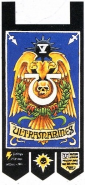

<!-- A0428-B0390 -->

原译文

"Wardens of the Eastern Fringe" “东部边缘看守者”

**校订译文**

"Wardens of the Eastern Fringe" “东部边缘看守者”

<!-- /A0428-B0390 -->

<!-- A0428-B0391 -->
### Captain Phelian 费利安连长

<!-- /A0428-B0391 -->

<!-- A0428-B0392 -->

原译文

Master of the Marches 行军大师

**校订译文**

Master of the Marches 行军大师

<!-- /A0428-B0392 -->

<!-- A0428-B0393 -->

原译文

2 Lieutenants 2名副官

**校订译文**

2 Lieutenants 2名副官

<!-- /A0428-B0393 -->

<!-- A0428-B0394 -->

原译文

Company Ancient 连队旗手

**校订译文**

Company Ancient 连队旗手

<!-- /A0428-B0394 -->

<!-- A0428-B0395 -->

原译文

Company Champion 连队冠军

**校订译文**

Company Champion 连队冠军

<!-- /A0428-B0395 -->

<!-- A0428-B0396 -->

原译文

Company Veterans 连队老兵

**校订译文**

Company Veterans 连队老兵

<!-- /A0428-B0396 -->

<!-- A0428-B0397 -->

原译文

6 Battleline Squads 6个战线小队

**校订译文**

6 Battleline Squads 6个战线小队

<!-- /A0428-B0397 -->

<!-- A0428-B0398 -->

原译文

2 Close Support Squads 2个近战支援小队

**校订译文**

2 Close Support Squads 2个近战支援小队

<!-- /A0428-B0398 -->

<!-- A0428-B0399 -->

原译文

2 Fire Support Squads 2个火力支援小队

**校订译文**

2 Fire Support Squads 2个火力支援小队

<!-- /A0428-B0399 -->

<!-- A0428-B0400 -->

原译文

Dreadnoughts 无畏

**校订译文**

Dreadnoughts 无畏机甲

<!-- /A0428-B0400 -->

<!-- A0428-B0401 -->

原译文

Transport Vehicles 运输载具

**校订译文**

Transport Vehicles 运输载具

<!-- /A0428-B0401 -->

<!-- A0428-B0402 -->
### Reserve Companies 预备连队

<!-- /A0428-B0402 -->

<!-- A0428-B0403 -->

原译文

6th Company 第六连队

**校订译文**

6th Company 第六连队

<!-- /A0428-B0403 -->

<!-- A0428-B0404 图片 -->
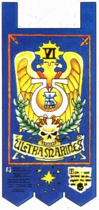

<!-- A0428-B0405 -->

原译文

"Brethren of the Forge" “熔炉兄弟”

**校订译文**

"Brethren of the Forge" “熔炉兄弟”

<!-- /A0428-B0405 -->

<!-- A0428-B0406 -->
### Captain Ferren Areios 费伦·阿瑞奥斯连长

<!-- /A0428-B0406 -->

<!-- A0428-B0407 -->

原译文

Master of the Rites 祭仪大师

**校订译文**

Master of the Rites 祭仪大师

<!-- /A0428-B0407 -->

<!-- A0428-B0408 -->

原译文

2 Lieutenants 2名副官

**校订译文**

2 Lieutenants 2名副官

<!-- /A0428-B0408 -->

<!-- A0428-B0409 -->

原译文

Company Ancient 连队旗手

**校订译文**

Company Ancient 连队旗手

<!-- /A0428-B0409 -->

<!-- A0428-B0410 -->

原译文

Company Champion 连队冠军

**校订译文**

Company Champion 连队冠军

<!-- /A0428-B0410 -->

<!-- A0428-B0411 -->

原译文

Company Veterans 连队老兵

**校订译文**

Company Veterans 连队老兵

<!-- /A0428-B0411 -->

<!-- A0428-B0412 -->

原译文

10 Battleline Squads 10个战线小队

**校订译文**

10 Battleline Squads 10个战线小队

<!-- /A0428-B0412 -->

<!-- A0428-B0413 -->

原译文

Battle Tanks 战斗坦克

**校订译文**

Battle Tanks 战斗坦克

<!-- /A0428-B0413 -->

<!-- A0428-B0414 -->

原译文

Dreadnoughts 无畏

**校订译文**

Dreadnoughts 无畏机甲

<!-- /A0428-B0414 -->

<!-- A0428-B0415 -->

原译文

Transport Vehicles 运输载具

**校订译文**

Transport Vehicles 运输载具

<!-- /A0428-B0415 -->

<!-- A0428-B0416 -->

原译文

7th Company 第七连队

**校订译文**

7th Company 第七连队

<!-- /A0428-B0416 -->

<!-- A0428-B0417 图片 -->
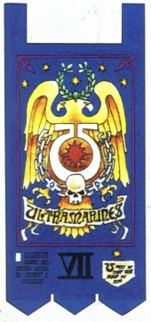

<!-- A0428-B0418 -->

原译文

"Defenders of Caeserean" “王权卫士”

**校订译文**

"Defenders of Caeserean" “凯瑟里安卫士”

**校注：** Caeserean 在队名中按专名处理，暂音译凯瑟里安；原“王权”缺少英文对应，不将其自行解释成政治概念。

<!-- /A0428-B0418 -->

<!-- A0428-B0419 -->
### Captain Gerad Ixion 格拉德·伊克西翁连长

原题：Captain Gerad Ixion 格拉德·伊克西翁

<!-- /A0428-B0419 -->

<!-- A0428-B0420 -->

原译文

Chief Victualler 首席补给官

**校订译文**

Chief Victualler 首席补给官

<!-- /A0428-B0420 -->

<!-- A0428-B0421 -->

原译文

2 Lieutenants 2名副官

**校订译文**

2 Lieutenants 2名副官

<!-- /A0428-B0421 -->

<!-- A0428-B0422 -->

原译文

Company Ancient 连队旗手

**校订译文**

Company Ancient 连队旗手

<!-- /A0428-B0422 -->

<!-- A0428-B0423 -->

原译文

Company Champion 连队冠军

**校订译文**

Company Champion 连队冠军

<!-- /A0428-B0423 -->

<!-- A0428-B0424 -->

原译文

Company Veterans 连队老兵

**校订译文**

Company Veterans 连队老兵

<!-- /A0428-B0424 -->

<!-- A0428-B0425 -->

原译文

10 Battleline Squads 10个战线小队

**校订译文**

10 Battleline Squads 10个战线小队

<!-- /A0428-B0425 -->

<!-- A0428-B0426 -->

原译文

Land Speeders 兰德速攻艇

**校订译文**

Land Speeders 兰德速攻艇

<!-- /A0428-B0426 -->

<!-- A0428-B0427 -->

原译文

Gunships 炮艇

**校订译文**

Gunships 炮艇

<!-- /A0428-B0427 -->

<!-- A0428-B0428 -->

原译文

Dreadnoughts 无畏

**校订译文**

Dreadnoughts 无畏机甲

<!-- /A0428-B0428 -->

<!-- A0428-B0429 -->

原译文

Transport Vehicles 运输载具

**校订译文**

Transport Vehicles 运输载具

<!-- /A0428-B0429 -->

<!-- A0428-B0430 -->

原译文

8th Company 第八连队

**校订译文**

8th Company 第八连队

<!-- /A0428-B0430 -->

<!-- A0428-B0431 图片 -->
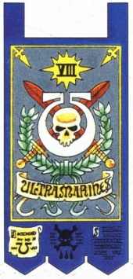

<!-- A0428-B0432 -->

原译文

"The Honourblades" “荣誉之刃”

**校订译文**

"The Honourblades" “荣誉之刃”

<!-- /A0428-B0432 -->

<!-- A0428-B0433 -->
### Captain Hellios 赫利奥斯连长

<!-- /A0428-B0433 -->

<!-- A0428-B0434 -->

原译文

Lord Executioner 处刑者领主

**校订译文**

Lord Executioner 处刑者领主

<!-- /A0428-B0434 -->

<!-- A0428-B0435 -->

原译文

2 Lieutenants 2名副官

**校订译文**

2 Lieutenants 2名副官

<!-- /A0428-B0435 -->

<!-- A0428-B0436 -->

原译文

Company Ancient 连队旗手

**校订译文**

Company Ancient 连队旗手

<!-- /A0428-B0436 -->

<!-- A0428-B0437 -->

原译文

Company Champion 连队冠军

**校订译文**

Company Champion 连队冠军

<!-- /A0428-B0437 -->

<!-- A0428-B0438 -->

原译文

Company Veterans 连队老兵

**校订译文**

Company Veterans 连队老兵

<!-- /A0428-B0438 -->

<!-- A0428-B0439 -->

原译文

10 Close Support Squads 10个近战支援小队

**校订译文**

10 Close Support Squads 10个近战支援小队

<!-- /A0428-B0439 -->

<!-- A0428-B0440 -->

原译文

Bikes 摩托

**校订译文**

Bikes 摩托

<!-- /A0428-B0440 -->

<!-- A0428-B0441 -->

原译文

Dreadnoughts 无畏

**校订译文**

Dreadnoughts 无畏机甲

<!-- /A0428-B0441 -->

<!-- A0428-B0442 -->

原译文

9th Company 第九连队

**校订译文**

9th Company 第九连队

<!-- /A0428-B0442 -->

<!-- A0428-B0443 图片 -->
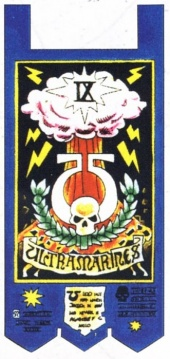

<!-- A0428-B0444 -->

原译文

"The Stormbringers" “风暴使者”

**校订译文**

"The Stormbringers" “风暴使者”

<!-- /A0428-B0444 -->

<!-- A0428-B0445 -->
### Captain Sinon 西农连长

<!-- /A0428-B0445 -->

<!-- A0428-B0446 -->

原译文

Master of Relics 遗物之主

**校订译文**

Master of Relics 遗物大师

<!-- /A0428-B0446 -->

<!-- A0428-B0447 -->

原译文

2 Lieutenants 2名副官

**校订译文**

2 Lieutenants 2名副官

<!-- /A0428-B0447 -->

<!-- A0428-B0448 -->

原译文

Company Ancient 连队旗手

**校订译文**

Company Ancient 连队旗手

<!-- /A0428-B0448 -->

<!-- A0428-B0449 -->

原译文

Company Champion 连队冠军

**校订译文**

Company Champion 连队冠军

<!-- /A0428-B0449 -->

<!-- A0428-B0450 -->

原译文

Company Veterans 连队老兵

**校订译文**

Company Veterans 连队老兵

<!-- /A0428-B0450 -->

<!-- A0428-B0451 -->

原译文

10 Fire Support Squads 10个火力支援小队

**校订译文**

10 Fire Support Squads 10个火力支援小队

<!-- /A0428-B0451 -->

<!-- A0428-B0452 -->

原译文

Dreadnoughts 无畏

**校订译文**

Dreadnoughts 无畏机甲

<!-- /A0428-B0452 -->

<!-- A0428-B0453 -->
### Scout Company 侦察连队

原题：Scout Company 侦查连队

<!-- /A0428-B0453 -->

<!-- A0428-B0454 -->

原译文

10th Company 第十连队

**校订译文**

10th Company 第十连队

<!-- /A0428-B0454 -->

<!-- A0428-B0455 图片 -->
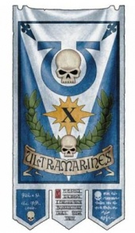

<!-- A0428-B0456 -->

原译文

"Scions of Ultramar" “奥特拉玛之裔”

**校订译文**

"Scions of Ultramar" “奥特拉玛之裔”

<!-- /A0428-B0456 -->

<!-- A0428-B0457 -->
### Captain Antilochus 安提罗科斯连长

<!-- /A0428-B0457 -->

<!-- A0428-B0458 -->

原译文

Master of the Recruits 新兵之主

**校订译文**

Master of the Recruits 新兵大师

<!-- /A0428-B0458 -->

<!-- A0428-B0459 -->

原译文

2 Lieutenants 2名副官

**校订译文**

2 Lieutenants 2名副官

<!-- /A0428-B0459 -->

<!-- A0428-B0460 -->

原译文

Company Ancient 连队旗手

**校订译文**

Company Ancient 连队旗手

<!-- /A0428-B0460 -->

<!-- A0428-B0461 -->

原译文

Company Champion 连队冠军

**校订译文**

Company Champion 连队冠军

<!-- /A0428-B0461 -->

<!-- A0428-B0462 -->

原译文

Company Veterans 连队老兵

**校订译文**

Company Veterans 连队老兵

<!-- /A0428-B0462 -->

<!-- A0428-B0463 -->

原译文

Scout Squads 侦察小队

**校订译文**

Scout Squads 侦察小队

<!-- /A0428-B0463 -->

<!-- A0428-B0464 -->

原译文

10 Vanguard Squads 10个先锋小队

**校订译文**

10 Vanguard Squads 10个先锋小队

<!-- /A0428-B0464 -->

<!-- A0428-B0465 -->

原译文

Bikes 摩托

**校订译文**

Bikes 摩托

<!-- /A0428-B0465 -->

<!-- A0428-B0466 -->

原译文

Land Speeders 兰德速攻艇

**校订译文**

Land Speeders 兰德速攻艇

<!-- /A0428-B0466 -->

<!-- A0428-B0467 -->

原译文

Transport Vehicles 运输载具

**校订译文**

Transport Vehicles 运输载具

<!-- /A0428-B0467 -->

<!-- A0428-B0468 -->
### Notes 注释

<!-- /A0428-B0468 -->

<!-- A0428-B0469 -->
**英文原文**

Light vehicles and transports (Rhinos, Land Speeders, etc.) are not included in this count; such vehicles are held in reserve by their parent Company and drawn upon as their mission requires.

<!-- /A0428-B0469 -->

<!-- A0428-B0470 -->

原译文

轻型和运输载具（犀牛、兰德速攻艇等）不包括在此计数中；这些载具由总部连队储备，并根据任务需要使用。

**校订译文**

轻型车辆与运输载具，如犀牛战车、兰德速攻艇等，不计入上述数量。它们由各自所属连队保留，按任务需要调配。

**校注：** parent Company 指车辆所属连队，并非“总部连队”。

<!-- /A0428-B0470 -->

<!-- A0428-B0471 -->
**英文原文**

Normally, the Captain of the Fourth Company would hold the position of Master of the Fleet. Uriel Ventris bestowed his title upon Lord Admiral Lazlo Tiberius instead, whom he felt was better suited for the job.

<!-- /A0428-B0471 -->

<!-- A0428-B0472 -->

原译文

通常情况下，第四连队的连长将担任舰队之主。乌瑞尔·文崔斯将他的头衔授予了海军上将拉兹洛·提比略，他觉得他更适合这份工作。

**校订译文**

通常由第四连长兼任舰队大师。不过，乌瑞尔·文崔斯认为海军上将领主拉兹洛·提比略更适合这项工作，便将该职衔让给了他。

<!-- /A0428-B0472 -->

<!-- A0428-B0473 -->
**英文原文**

How To Paint Space Marines lists a Captain Abraxxon as the Tenth Captain.

<!-- /A0428-B0473 -->

<!-- A0428-B0474 -->

原译文

如何绘制星际战士 将阿布拉克森连长列为第十连长。

**校订译文**

《如何涂装星际战士》将阿布拉克森列为第十连长。

<!-- /A0428-B0474 -->

<!-- A0428-B0475 -->
### Ultramarines Honour Company 极限战士荣誉连队

<!-- /A0428-B0475 -->

<!-- A0428-B0476 -->
**英文原文**

Because the Ultramarines Legion played little part in fighting the Warmaster's forces during the Horus Heresy, a number of Ultramarines Primogenitors Chapters contributed individual squads to a standing force near the Eye of Terror known as the Ultramarines Honour Company. Those that took this duty in the Cadian Gate were changed by the unknowable terrors. Many of these Space Marines went on to serve in the Deathwatch and were some of the most dedicated of their chapter's warriors. It is unknown whether this company was either destroyed or simply made defunct after the collapse of the Cadian Gate and subsequent Cicatrix Maledictum.

<!-- /A0428-B0476 -->

<!-- A0428-B0477 -->

原译文

由于在荷鲁斯叛乱期间，极限战士军团在与战帅部队的战斗中几乎没有发挥作用，因此一些极限战士始祖战团向恐惧之眼附近的一支常备部队 — 极限战士荣誉连队— 派遣了单独的小队。那些在卡迪亚之门承担这一职责的人被不可知的恐怖所改变。这些星际战士中的许多人继续在死亡守望中服役，是他们战团中最敬业的战士之一。目前尚不清楚这个连队在卡迪亚之门倒塌后和随后的大裂隙后被摧毁还是失效。

**校订译文**

为弥补极限战士军团在荷鲁斯之乱中未能更多参与对抗战帅的遗憾，一些始祖战团各自派出小队，在恐惧之眼附近组成常备部队“极限战士荣誉连队”。在卡迪亚之门履行这项职责的战士，都会被那些不可名状的恐怖所改变。许多人后来加入死亡守望，成为各自战团中最坚定尽责的战士。卡迪亚之门崩溃、大裂隙出现后，这支连队究竟被消灭，还是仅停止作为一个单位运作，尚不清楚。

**校注：** 本段将设立荣誉连解释为弥补叛乱期间参战不足；前文记载考斯及毁灭风暴等重大战斗，故只按本段原文保留其设团解释，不据此抹去军团的其他参战经历。

<!-- /A0428-B0477 -->

<!-- A0428-B0478 图片 -->
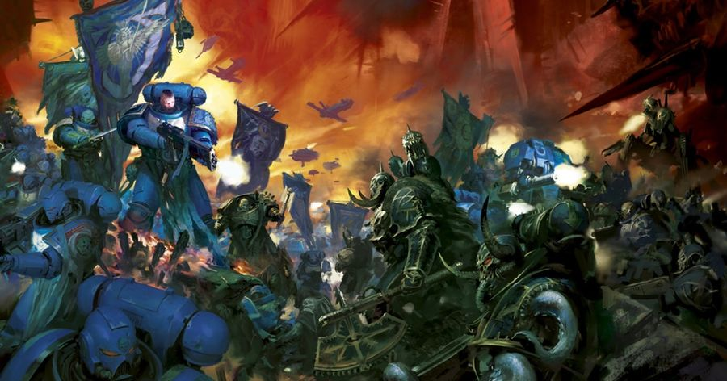

<!-- A0428-B0479 -->

原译文

The Ultramarines battle the Black Legion 极限战士与黑色军团交战

**校订译文**

The Ultramarines battle the Black Legion 极限战士与黑色军团交战

<!-- /A0428-B0479 -->

<!-- A0428-B0480 -->
### Fulminata 雷霆

<!-- /A0428-B0480 -->

<!-- A0428-B0481 -->
**英文原文**

The Fulminata is a newly formed demi-Company of the Ultramarines formed entirely from Primaris Space Marines.

<!-- /A0428-B0481 -->

<!-- A0428-B0482 -->

原译文

雷霆是极限战士的一个新成立的半连队，完全由原铸星际战士组成。

**校订译文**

雷霆是极限战士新组建的一支半连编制部队，全部由原铸星际战士组成。

<!-- /A0428-B0482 -->

<!-- A0428-B0483 -->
## Recruitment 招募

<!-- /A0428-B0483 -->

<!-- A0428-B0484 -->
**英文原文**

The Ultramarines continue the tradition, begun by Guilliman, of recruiting from the worlds of Ultramar. There is rarely a shortage of volunteer Aspirants, since the Ultramarines are revered throughout the realm, and many families can boast of having sent several generations of their sons to serve the Chapter. Currently the Ultramarines first look to Macragge's Ultramar Auxilia Juventia for Aspirants, due to the level of their training.

<!-- /A0428-B0484 -->

<!-- A0428-B0485 -->

原译文

极限战士延续了由基里曼开始的从奥特拉玛世界招募人员的传统。志愿者有志者很少短缺，因为极限战士在整个领域都受到尊敬，许多家庭可以自豪地说，他们已经派了几代子嗣为战团服务。目前，由于他们的训练水平，极限战士首先向马库拉格的奥特拉玛辅助军少年寻求有志者。

**校订译文**

极限战士延续着基里曼开创的传统，从奥特拉玛各世界征兵。战团在整个领地备受尊崇，自愿报名的候选者很少不足；不少家庭以数代儿子先后效力战团为荣。目前，鉴于其训练水平，极限战士会优先从马库拉格的奥特拉玛辅助军青年兵中挑选候选者。

<!-- /A0428-B0485 -->

<!-- A0428-B0486 -->
**英文原文**

No recruitment rites and trials of the Ultramarines are specifically known. However they are known to utilize two types of general trials known as the Exposure Trial and the Challenge Trial.

<!-- /A0428-B0486 -->

<!-- A0428-B0487 -->

原译文

目前还没有关于极限战士的招募仪式和试炼的具体信息。然而，众所周知，他们利用了两种类型的一般试炼，即暴露试炼和挑战试炼。

**校订译文**

极限战士特有的招募仪式与试炼细节尚不明确，但已知他们采用两类较普遍的考验：生存试炼与挑战试炼。

<!-- /A0428-B0487 -->

<!-- A0428-B0488 -->
**英文原文**

In the Exposure Trial, the Aspirant must simply go out into the wilderness and survive for a set period of time. While simple in its nature, it is extremely difficult as the trial is often set on Death Worlds, Desert Worlds, or Ice Worlds. Other times a Feral World savage might be inserted into the middle of a Hive city. The trial is often impossible to complete, with a subject succumbing but being recovered and healed by Apothecaries should he deemed worthy. The Ultramarines make extensive use of the Exposure Trial. This form of trial seems to be culturally ingrained into Ultramar society, as the warrior elite is known to cast newborn infants into the wilderness in order to test their resilience.

<!-- /A0428-B0488 -->

<!-- A0428-B0489 -->

原译文

在暴露试炼中，有志者必须简单地进入荒野并存活一段时间。虽然本质上很简单，但非常困难，因为试炼通常设定在死亡世界、沙漠世界或冰雪世界。其他时候，蛮荒世界的野蛮人可能会被插入巢都城市的中心。试炼往往不可能完成，受试者会屈服，但如果他认为值得，药剂师会帮助他康复和治愈。极限战士广泛使用暴露试炼。这种形式的试炼似乎在奥特拉玛社会中根深蒂固，因为众所周知，战士精英会将新生儿扔进荒野，以测试他们的韧性。

**校订译文**

生存试炼要求候选者进入野外，在规定时间内独自活下来。要求听似简单，实际却异常艰难，因为地点往往是死亡世界、沙漠世界或冰封世界。有时，来自蛮荒世界的原始居民反而会被送进巢都中心。试炼往往根本不可能完成；受试者即使倒下，只要被认为值得培养，药剂师仍会将其救回治疗。极限战士广泛采用这种考验。它似乎深植于奥特拉玛文化之中，甚至当地的战士精英也会将新生儿置于荒野，检验其生命力。

**校注：** 判断受试者是否值得救回的是选拔者，非原译“如果他认为值得”中的受试者本人。Exposure Trial 暂按功能译生存试炼。

<!-- /A0428-B0489 -->

<!-- A0428-B0490 -->
**英文原文**

The other trial, the Challenge Trial, sees the Aspirant engage in a duel with a full Battle-Brother. None of the challengers are expected to defeat the Brother, the trial is measured in degrees of failure. Very occasionally, an Aspirant does manage to beat the Battle-Brother, and when this happens it is not uncommon for the individual to go on to become a legendary hero of the Chapter.

<!-- /A0428-B0490 -->

<!-- A0428-B0491 -->

原译文

另一个试炼，挑战试炼，有志者与一个完全的战斗兄弟决斗。预计没有一个挑战者会击败兄弟，试炼是以失败的程度来衡量的。偶尔，一个有有志者确实能打败战斗兄弟，当这种情况发生时，这个人继续成为战团的传奇英雄并不罕见。

**校订译文**

挑战试炼则要求候选者与一名正式战斗兄弟决斗。考官并不期待挑战者取胜，而是根据其如何失败、败到什么程度来评判。极少数候选者确实能够击败战斗兄弟；这些人日后成为战团传奇英雄的情况并不罕见。

<!-- /A0428-B0491 -->

<!-- A0428-B0492 -->
**英文原文**

Aspirants who survive training at one of the barrack institutions in Ultramar, human youths are inducted into the Chapter as Scouts, as the Codex dictates, before completing their transformation into full Space Marines. Those who fail their trials, however, can be turned into Aspirant Servitors, which are then used by the Ultramarines to later fatally test new groups of Aspirants.

<!-- /A0428-B0492 -->

<!-- A0428-B0493 -->

原译文

在奥特拉玛的一个军营机构接受训练后幸存下来的有志者，按照圣典的规定，在完成向完整的星际战士的转变之前，会作为侦察兵被纳入战团。然而，那些试炼失败的人可以变成有志者仆从，然后被极限战士用来测试新的有志者群体。

**校订译文**

人类少年候选者在奥特拉玛某处军营训练机构中熬过训练后，会依《阿斯塔特圣典》先以侦察兵身份加入战团，再完成向正式星际战士的转变。试炼失败者则可能被改造成“候选者机仆”，供战团对后来的候选者实施可能致命的考验。

**校注：** Aspirant Servitors 指将失败候选者改造成机仆，非普通侍从；英文还明确这类后续测试可能致命，原译遗漏。

<!-- /A0428-B0493 -->

<!-- A0428-B0494 图片 -->
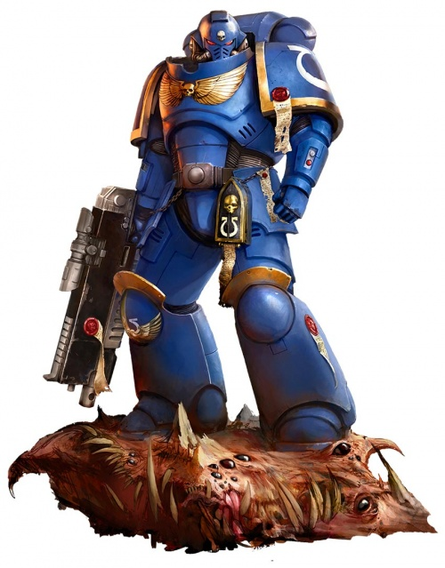

<!-- A0428-B0495 -->

原译文

Ultramarines Primaris Space Marine 极限战士原铸星际战士

**校订译文**

Ultramarines Primaris Space Marine 极限战士原铸星际战士

<!-- /A0428-B0495 -->

<!-- A0428-B0496 -->
## Noted Elements of the Ultramarines 极限战士的著名人物与事物

原题：Noted Elements of the Ultramarines 著名极限战士成员

<!-- /A0428-B0496 -->

<!-- A0428-B0497 -->
### Notable Relics 著名圣物

<!-- /A0428-B0497 -->

<!-- A0428-B0498 -->

原译文

Armour of Antilochus 安提罗科斯之甲

**校订译文**

Armour of Antilochus 安提洛克斯战甲

<!-- /A0428-B0498 -->

<!-- A0428-B0499 -->

原译文

Banner of Macragge 马库拉格之旗

**校订译文**

Banner of Macragge 马库拉格之旗

<!-- /A0428-B0499 -->

<!-- A0428-B0500 -->

原译文

Gauntlets of Ultramar 奥特拉玛之拳

**校订译文**

Gauntlets of Ultramar 奥特拉玛之拳

<!-- /A0428-B0500 -->

<!-- A0428-B0501 -->
### Notable Vessels and Vehicles 著名战舰和载具

<!-- /A0428-B0501 -->

<!-- A0428-B0502 -->
**英文原文**

Galatan— Star Fort.

<!-- /A0428-B0502 -->

<!-- A0428-B0503 -->

原译文

加拉坦 — 星堡

**校订译文**

加拉坦 — 星堡

<!-- /A0428-B0503 -->

<!-- A0428-B0504 -->
**英文原文**

Macragge's Honour — Gloriana Class Battleship, flagship of Roboute Guilliman.

<!-- /A0428-B0504 -->

<!-- A0428-B0505 -->

原译文

马库拉格之耀 — 荣光女王级战列舰，罗伯特·基里曼的旗舰

**校订译文**

马库拉格之耀号——荣光女王级战列舰，罗保特·基里曼的旗舰。

<!-- /A0428-B0505 -->

<!-- A0428-B0506 -->
**英文原文**

Laurels of Victory — Flagship of Marneus Calgar.

<!-- /A0428-B0506 -->

<!-- A0428-B0507 -->

原译文

胜利桂冠号 — 马涅乌斯·卡尔加的旗舰

**校订译文**

胜利桂冠号 — 马涅乌斯·卡尔加的旗舰

<!-- /A0428-B0507 -->

<!-- A0428-B0508 -->
### Notable Members of the Ultramarines 极限战士的著名成员

<!-- /A0428-B0508 -->

<!-- A0428-B0509 -->
**英文原文**

NOTE — Only VERY NOTABLE Ultramarines are mentioned added below (special characters, main characters of novels, etc.)

<!-- /A0428-B0509 -->

<!-- A0428-B0510 -->

原译文

注意 — 下面只提到添加了非常著名的极限战士（特殊人物、小说中的主要人物等）

**校订译文**

说明：以下仅列特别知名的极限战士，如具名特殊角色、小说主要人物等。

<!-- /A0428-B0510 -->

<!-- A0428-B0511 -->
### Heresy Era 叛乱时期

<!-- /A0428-B0511 -->

<!-- A0428-B0512 -->
**英文原文**

Roboute Guilliman — Primarch

<!-- /A0428-B0512 -->

<!-- A0428-B0513 -->

原译文

罗伯特·基里曼 — 原体

**校订译文**

罗保特·基里曼 — 原体

<!-- /A0428-B0513 -->

<!-- A0428-B0514 -->
**英文原文**

Marius Gage — Chapter Master of the Ultramarines Legion's First Chapter (First Master of the Ultramarines).

<!-- /A0428-B0514 -->

<!-- A0428-B0515 -->

原译文

马吕斯·盖奇 — 极限战士军团第一战团的战团长（第一任极限战士之主）。

**校订译文**

马吕斯·盖奇——极限战士军团第一战团长，即军团第一之主。

**校注：** First Master 在此与 First Chapter 对应，是第一战团长／第一之主的层级称谓，不据此断定马吕斯为历代第一任极限战士统治者。

<!-- /A0428-B0515 -->

<!-- A0428-B0516 -->
**英文原文**

Lysimachus Cestus — Captain of the Seventh Company during the Horus Heresy.

<!-- /A0428-B0516 -->

<!-- A0428-B0517 -->

原译文

里斯马卡斯·赛斯图斯 — 荷鲁斯叛乱时期第七连队的连长。

**校订译文**

里斯马卡斯·赛斯图斯 — 荷鲁斯之乱时期第七连队的连长。

<!-- /A0428-B0517 -->

<!-- A0428-B0518 -->
**英文原文**

Remus Ventanus — Captain of the 4th Company during the Horus Heresy. Lead the defence of Calth planet-side.

<!-- /A0428-B0518 -->

<!-- A0428-B0519 -->

原译文

雷穆斯·文坦努斯 — 荷鲁斯叛乱时期的第四连队连长。领导考斯行星一侧的防御。

**校订译文**

雷穆斯·文坦努斯——荷鲁斯之乱时期第四连长，领导考斯地面防御。

<!-- /A0428-B0519 -->

<!-- A0428-B0520 -->
**英文原文**

Lucretius Corvo — Captain and later founder of the Novamarines

<!-- /A0428-B0520 -->

<!-- A0428-B0521 -->

原译文

卢克莱修斯·科沃 — 连长和后来新星战士的创始人

**校订译文**

卢克莱修斯·科沃 — 连长和后来新星战士的创始人

<!-- /A0428-B0521 -->

<!-- A0428-B0522 -->
**英文原文**

Ptolemy — First and greatest Librarian of the Ultramarines, founded the Library of Ptolemy.

<!-- /A0428-B0522 -->

<!-- A0428-B0523 -->

原译文

托勒密 — 第一位也是最伟大的极限战士智库，创立了托勒密图书馆。

**校订译文**

托勒密——极限战士首位、亦被誉为最伟大的智库员，创立了托勒密图书馆。

<!-- /A0428-B0523 -->

<!-- A0428-B0524 -->
**英文原文**

Tylos Rubio — Former Codicier, recruited by Nathaniel Garro on the orders of Malcador the Sigillite.

<!-- /A0428-B0524 -->

<!-- A0428-B0525 -->

原译文

泰洛斯·卢比奥 — 前典记员，由纳撒尼尔·伽罗根据掌印者马卡多的命令招募。

**校订译文**

泰洛斯·卢比奥 — 前典记员，由纳撒尼尔·伽罗根据掌印者马卡多的命令招募。

<!-- /A0428-B0525 -->

<!-- A0428-B0526 -->
**英文原文**

Aeonid Thiel — Sergeant of the 135th Company. Marked for censure prior to the Defence of Calth for running theoretical scenarios on fighting Space Marines. Was later honoured for heroics during the battle by having the Red Helmet of Censure he wore become the symbol of Sergeant rank. After the Heresy, he became Captain of the 2nd Company.

<!-- /A0428-B0526 -->

<!-- A0428-B0527 -->

原译文

伊奥尼德·希尔 — 第135连队军士。在考斯保卫战之前，因在星际战士战斗中运行理论场景而受到谴责。后来，他因在战斗中的英勇行为而受到表彰，他戴的谴责红盔成为军士军衔的象征。叛乱之后，他成为了第二连队的连长。

**校订译文**

伊奥尼德·希尔——第135连军士。考斯保卫战前，他因推演如何与星际战士交战而受到责罚。后来，战团为表彰他在考斯之战中的英勇，将他原本表示受罚身份的红色头盔改为军士军阶标志。荷鲁斯之乱后，他成为第二连长。

**校注：** Thiel 推演的是“以星际战士为敌”的战斗，原译“在星际战士战斗中运行理论场景”漏掉引发责罚的关键。

<!-- /A0428-B0527 -->

<!-- A0428-B0528 -->
**英文原文**

Oberdeii — Scout, later founder of the Scythes of the Emperor.

<!-- /A0428-B0528 -->

<!-- A0428-B0529 -->

原译文

奥伯德伊 — 侦察兵，后来帝皇之镰的创始人。

**校订译文**

奥伯德伊 — 侦察兵，后来帝皇之镰的创始人。

<!-- /A0428-B0529 -->

<!-- A0428-B0530 -->
### Post-Heresy 叛乱后

<!-- /A0428-B0530 -->

<!-- A0428-B0531 -->
### Chapter Command 战团指挥

<!-- /A0428-B0531 -->

<!-- A0428-B0532 -->
**英文原文**

Roboute Guilliman — The recently reborn Primarch of the Ultramarines, who has become Lord Commander of the Imperium

<!-- /A0428-B0532 -->

<!-- A0428-B0533 -->

原译文

罗伯特·基里曼 — 最近重生的极限战士原体，已成为帝国领主指挥官

**校订译文**

罗保特·基里曼——新近复苏的极限战士原体，已担任帝国最高统帅。

<!-- /A0428-B0533 -->

<!-- A0428-B0534 -->
**英文原文**

Marneus Calgar — Chapter Master and Lord Macragge. 77th Chapter Master in the history of the Ultramarines. Lord Defender of Greater Ultramar after Guilliman's return.

<!-- /A0428-B0534 -->

<!-- A0428-B0535 -->

原译文

马涅乌斯·卡尔加 — 战团长和马库拉格领主。极限战士历史上的第77任战团长。基里曼归来后，大奥特拉玛防御者领主。

**校订译文**

马涅乌斯·卡尔加——马库拉格领主，极限战士历史上的第77任战团长。基里曼回归后，出任大奥特拉玛守护领主。

<!-- /A0428-B0535 -->

<!-- A0428-B0536 -->
**英文原文**

Varro Tigurius — Current Chief Librarian, and is believed to be the strongest psyker in the Imperium

<!-- /A0428-B0536 -->

<!-- A0428-B0537 -->

原译文

瓦罗·狄格里斯 — 现任首席智库，被认为是帝国中最强大的灵能者

**校订译文**

瓦罗·狄格里斯——现任首席智库员，有人认为他是帝国最强大的灵能者。

<!-- /A0428-B0537 -->

<!-- A0428-B0538 -->
**英文原文**

Ortan Cassius — Master of Sanctity and veteran of the Battle of Macragge, and now leads the Tyrannic War Veterans into battle

<!-- /A0428-B0538 -->

<!-- A0428-B0539 -->

原译文

奥坦·卡西乌斯 — 圣洁导师，马库拉格之战的老兵，现在带领泰伦战争老兵投入战斗

**校订译文**

奥坦·卡西乌斯 — 圣洁导师，马库拉格之战的老兵，现在带领泰伦战争老兵投入战斗

<!-- /A0428-B0539 -->

<!-- A0428-B0540 -->
**英文原文**

Lazlo Tiberius — Lord Admiral, Master of the Fleet

<!-- /A0428-B0540 -->

<!-- A0428-B0541 -->

原译文

拉兹洛·提比略 — 海军上将，舰队之主

**校订译文**

拉兹洛·提比略——海军上将领主、舰队大师。

<!-- /A0428-B0541 -->

<!-- A0428-B0542 -->
**英文原文**

Vaniel — Chief Librarian during the War of the Beast in M32

<!-- /A0428-B0542 -->

<!-- A0428-B0543 -->

原译文

梵尼尔 — M32野兽战争期间的首席智库

**校订译文**

梵尼尔——M32野兽战争期间的首席智库员。

<!-- /A0428-B0543 -->

<!-- A0428-B0544 -->
### Captains and Lieutenants 连长和副官

<!-- /A0428-B0544 -->

<!-- A0428-B0545 -->

原译文

Mikael Fabian 米凯尔·法比安

**校订译文**

Mikael Fabian 米凯尔·法比安

<!-- /A0428-B0545 -->

<!-- A0428-B0546 -->
**英文原文**

Saul Invictus — Captain of the 1st Company during the Battle of Macragge.

<!-- /A0428-B0546 -->

<!-- A0428-B0547 -->

原译文

索尔·英维克图斯 — 马库拉格之战中第一连队的连长。

**校订译文**

索尔·英维克图斯 — 马库拉格之战中第一连队的连长。

<!-- /A0428-B0547 -->

<!-- A0428-B0548 -->
**英文原文**

Severus — Captain of the Second Company during its mission to Mithron.

<!-- /A0428-B0548 -->

<!-- A0428-B0549 -->

原译文

西弗勒斯 — 第二连队在米特隆执行任务时的连长。

**校订译文**

西弗勒斯 — 第二连队在米特隆执行任务时的连长。

<!-- /A0428-B0549 -->

<!-- A0428-B0550 -->
**英文原文**

Severus Agemman — Captain of the First Company and current Regent of Ultramar.

<!-- /A0428-B0550 -->

<!-- A0428-B0551 -->

原译文

西弗勒斯·阿格曼 — 第一连队连长，现任奥特拉玛摄政。

**校订译文**

西弗勒斯·阿格曼 — 第一连队连长，现任奥特拉玛摄政。

<!-- /A0428-B0551 -->

<!-- A0428-B0552 -->
**英文原文**

Cato Sicarius — Former Captain of the Second Company and commander of Imperial Forces during the Medusa V Schism Became commander of the Victrix Guard

<!-- /A0428-B0552 -->

<!-- A0428-B0553 -->

原译文

卡托·西卡留斯 — 第二连队的前连长和美杜莎五号分裂时期帝国军队指挥官，成为常胜卫队的指挥官

**校订译文**

卡托·西卡留斯 — 第二连队的前连长和美杜莎五号分裂时期帝国军队指挥官，成为常胜卫队的指挥官

<!-- /A0428-B0553 -->

<!-- A0428-B0554 -->
**英文原文**

Uriel Ventris — Captain of the Fourth Company, sent to fulfil a Death Oath for failing to follow Codex Astartes rules.

<!-- /A0428-B0554 -->

<!-- A0428-B0555 -->

原译文

乌瑞尔·文崔斯 — 第四连队连长，因未遵守阿斯塔特圣典的规定而被派去履行死亡誓言。

**校订译文**

乌瑞尔·文崔斯 — 第四连队连长，因未遵守阿斯塔特圣典的规定而被派去履行死亡誓言。

<!-- /A0428-B0555 -->

<!-- A0428-B0556 -->
**英文原文**

Demetrian Titus — Company Captain who fought during the Graia Invasion.

<!-- /A0428-B0556 -->

<!-- A0428-B0557 -->

原译文

德米特里安·泰图斯 — 在格拉亚入侵期间作战的连长。

**校订译文**

德米特里安·泰图斯 — 在格拉亚入侵期间作战的连长。

<!-- /A0428-B0557 -->

<!-- A0428-B0558 -->
**英文原文**

Decimus Felix — Primaris Captain during the Indomitus Crusade.

<!-- /A0428-B0558 -->

<!-- A0428-B0559 -->

原译文

德西穆斯·菲利克斯 — 不屈远征期间的原铸连长。

**校订译文**

德西穆斯·菲利克斯 — 不屈远征期间的原铸连长。

<!-- /A0428-B0559 -->

<!-- A0428-B0560 -->
**英文原文**

Ferren Areios — Captain of the 6th copmany, former Unnumbered Sons Lieutenant, served in the Indomitus Crusade

<!-- /A0428-B0560 -->

<!-- A0428-B0561 -->

原译文

费伦·阿瑞奥斯 — 第六连队连长，前未计之子副官，曾参加不屈远征

**校订译文**

费伦·阿瑞奥斯 — 第六连队连长，前未计之子副官，曾参加不屈远征

<!-- /A0428-B0561 -->

<!-- A0428-B0562 -->
**英文原文**

Cassian — Primaris Lieutenant.

<!-- /A0428-B0562 -->

<!-- A0428-B0563 -->

原译文

卡西安 — 原铸副官

**校订译文**

卡西安 — 原铸副官

<!-- /A0428-B0563 -->

<!-- A0428-B0564 -->
### Other Ranks 其他等级

<!-- /A0428-B0564 -->

<!-- A0428-B0565 -->
**英文原文**

Altarion — Venerable Dreadnought

<!-- /A0428-B0565 -->

<!-- A0428-B0566 -->

原译文

奥塔里安 — 神圣无畏

**校订译文**

奥塔里安——神圣无畏机甲驾驶员。

<!-- /A0428-B0566 -->

<!-- A0428-B0567 -->
**英文原文**

Antaro Chronus — Armoury, "The Spear of Macragge"

<!-- /A0428-B0567 -->

<!-- A0428-B0568 -->

原译文

安塔罗·克罗诺斯 — 军械库，“马库拉格之矛”

**校订译文**

安塔罗·克罗诺斯 — 军械库，“马库拉格之矛”

<!-- /A0428-B0568 -->

<!-- A0428-B0569 -->
**英文原文**

Kastor — Chaplain. Member of the Fulminata.

<!-- /A0428-B0569 -->

<!-- A0428-B0570 -->

原译文

卡斯托 — 牧师，雷霆的成员

**校订译文**

卡斯托——教士，雷霆半连成员。

<!-- /A0428-B0570 -->

<!-- A0428-B0571 -->
**英文原文**

Polixis — Apothecary. Member of the Fulminata.

<!-- /A0428-B0571 -->

<!-- A0428-B0572 -->

原译文

泼利克斯 — 药剂师，雷霆的成员

**校订译文**

泼利克斯——药剂师，雷霆半连成员。

<!-- /A0428-B0572 -->

<!-- A0428-B0573 -->
**英文原文**

Torias Telion — Scout Sergeant, unparalleled marksman.

<!-- /A0428-B0573 -->

<!-- A0428-B0574 -->

原译文

托利亚斯·泰利昂 — 侦察兵军士，无与伦比的神枪手。

**校订译文**

托利亚斯·泰利昂 — 侦察兵军士，无与伦比的神枪手。

<!-- /A0428-B0574 -->

<!-- A0428-B0575 -->
**英文原文**

Pasanius Lysane — Sergeant.

<!-- /A0428-B0575 -->

<!-- A0428-B0576 -->

原译文

帕撒尼乌斯·莱萨尼 — 军士

**校订译文**

帕撒尼乌斯·莱萨尼 — 军士

<!-- /A0428-B0576 -->

<!-- A0428-B0577 -->
### Unique Troops 独特部队

<!-- /A0428-B0577 -->

<!-- A0428-B0578 -->

原译文

Tyrannic War Veterans 泰伦战争老兵

**校订译文**

Tyrannic War Veterans 泰伦战争老兵

<!-- /A0428-B0578 -->

<!-- A0428-B0579 -->

原译文

Ultramarines Honour Guard 极限战士荣誉卫队

**校订译文**

Ultramarines Honour Guard 极限战士荣誉卫队

<!-- /A0428-B0579 -->

<!-- A0428-B0580 -->

原译文

Victrix Guard 常胜卫队

**校订译文**

Victrix Guard 常胜卫队

<!-- /A0428-B0580 -->

<!-- A0428-B0581 -->

原译文

Chosen of the Tetrarchy 受选英杰

**校订译文**

Chosen of the Tetrarchy 四方领主的受选者

<!-- /A0428-B0581 -->

<!-- A0428-B0582 -->
**英文原文**

Fulmentarus (Heresy-era)

<!-- /A0428-B0582 -->

<!-- A0428-B0583 -->

原译文

辉脊（叛乱时期）

**校订译文**

辉脊（叛乱时期）

<!-- /A0428-B0583 -->

<!-- A0428-B0584 -->
**英文原文**

Suzerain Invictarus (Heresy-era)

<!-- /A0428-B0584 -->

<!-- A0428-B0585 -->

原译文

宗主常胜军（叛乱时期）

**校订译文**

宗主常胜军（叛乱时期）

<!-- /A0428-B0585 -->

<!-- A0428-B0586 -->
**英文原文**

Locutarus (Heresy-era)

<!-- /A0428-B0586 -->

<!-- A0428-B0587 -->

原译文

传喻者（叛乱时期）

**校订译文**

传喻者（叛乱时期）

<!-- /A0428-B0587 -->

<!-- A0428-B0588 -->
**英文原文**

Evocati (Heresy-era)

<!-- /A0428-B0588 -->

<!-- A0428-B0589 -->

原译文

后备军（叛乱时期）

**校订译文**

后备军（叛乱时期）

<!-- /A0428-B0589 -->

<!-- A0428-B0590 -->
**英文原文**

Nemesis Destroyers(Heresy-era)

<!-- /A0428-B0590 -->

<!-- A0428-B0591 -->

原译文

复仇女神毁灭者（叛乱时期）

**校订译文**

复仇女神毁灭者（叛乱时期）

<!-- /A0428-B0591 -->

<!-- A0428-B0592 -->
**英文原文**

Praetorian Breacher Squad (Heresy-era)

<!-- /A0428-B0592 -->

<!-- A0428-B0593 -->

原译文

禁卫军破坏者小队（叛乱时期）

**校订译文**

禁卫军攻坚小队（荷鲁斯之乱时期）。

<!-- /A0428-B0593 -->

<!-- A0428-B0594 -->
**英文原文**

Alaris Pilot (Heresy-era)

<!-- /A0428-B0594 -->

<!-- A0428-B0595 -->

原译文

阿拉里斯飞行员（叛乱时期）

**校订译文**

阿拉里斯飞行员（叛乱时期）

<!-- /A0428-B0595 -->

本篇核心术语与暂定项

以下列出本篇出现的英文原形及核心术语表用词。同形词可能指不同对象，具体词义以本篇正文和校注为准；单复数、别名和仅见于图注的名称可能尚未列入。完整候选见[术语表](../../术语表/双语术语候选.csv)。

| 英文 | 采用中文 | 状态 |
| --- | --- | --- |
| Space Marines | 星际战士 | 官方已核对 |
| Adeptus Astartes | 阿斯塔特修会 | 官方已核对 |
| Blood Angels | 圣血天使 | 官方已核对 |
| Dark Angels | 黑暗天使 | 官方已核对 |
| Deathwatch | 死亡守望 | 官方已核对 |
| Space Wolves | 太空野狼 | 官方已核对 |
| Adeptus Mechanicus | 机械修会 | 官方已核对 |
| Imperial Guard | 帝国卫队 | 暂定·语境区分 |
| Death Guard | 死亡守卫 | 官方已核对 |
| World Eaters | 吞世者 | 官方已核对 |
| Eldar | 灵族 | 暂定·语境区分 |
| Dark Eldar | 黑暗灵族 | 暂定·旧称对应 |
| Tyranids | 泰伦虫族 | 官方已核对 |
| Genestealer Cults | 基因窃取者教派 | 官方已核对 |
| Necrons | 太空死灵 | 官方已核对 |
| Orks | 欧克蛮人 | 官方已核对 |
| Psyker | 灵能者 | 官方已核对 |
| Librarian | 智库员 | 官方已核对 |
| Boltgun | 爆矢枪 | 官方已核对 |
| Roboute Guilliman | 罗保特·基里曼 | 官方已核对 |
| Ultramar | 奥特拉玛 | 官方已核对 |
| Ultramarines | 极限战士 | 官方已核对 |
| Horus Heresy | 荷鲁斯之乱 | 官方已核对 |
| Warp | 亚空间 | 官方已核对 |
| Cicatrix Maledictum | 大裂隙 | 暂定·别名对应 |
| Inquisition | 审判庭 | 暂定 |
| Inquisitor | 审判官 | 官方已核对 |
| Imperium | 帝国 | 暂定·简称 |
| Imperial Navy | 帝国海军 | 暂定 |
| Nurgle | 纳垢 | 官方已核对 |
| Waaagh! | Waaagh! | 暂定·保留原文 |
| Indomitus | 不屈学派 | 暂定·学派语境 |
| History | 历史 | 编辑用语已统一 |
| Conflicting sources | 来源冲突 | 编辑用语已统一 |
| Eye of Terror | 恐惧之眼 | 官方已核对 |
| Ordo Malleus | 恶魔审判庭 | 用户指定 |
| Imperial Fists | 帝国之拳 | 暂定 |
| Emperor of Mankind | 人类帝皇 | 暂定 |
| Emperor | 帝皇 | 官方已核对 |
| Primarch | 原体 | 官方已核对 |
| Battle Barge | 战斗驳船 | 暂定·官方待核 |
| Hive World | 巢都世界 | 暂定·官方待核 |
| Shrine World | 圣地世界 | 暂定·官方待核 |
| Forge World | 铸造世界 | 暂定·官方待核 |
| Word Bearers | 怀言者 | 暂定·官方待核 |
| Daemon Prince | 恶魔亲王 | 官方已核对 |
| Black Legion | 黑色军团 | 暂定·官方待核 |
| Iron Warriors | 钢铁勇士 | 暂定·官方待核 |
| Night Lords | 午夜领主 | 暂定·官方待核 |
| Szarekhan Dynasty | 斯扎拉坎王朝 | 暂定·官方待核 |
| Great Crusade | 大远征 | 暂定·官方待核 |
| Compliance | 归顺；纳入帝国统治 | 暂定·官方待核 |
| Terra | 泰拉 | 暂定·官方待核 |
| Luna Wolves | 影月苍狼 | 暂定·官方待核 |
| Horus | 荷鲁斯 | 暂定·官方待核 |
| Lion El'Jonson | 莱昂·艾尔’庄森 | 官方已核对 |
| Iron Hands | 钢铁之手 | 暂定·官方待核 |
| Fulgrim | 福格瑞姆 | 官方已核对 |
| High Lords of Terra | 泰拉高领主 | 暂定·官方待核 |
| Dark Imperium | 黑暗帝国 | 暂定·官方待核 |
| Indomitus Crusade | 不屈远征 | 暂定·官方待核 |
| War of Beasts | 野兽之战 | 暂定·官方待核 |
| Plague Wars | 瘟疫战争 | 暂定·官方待核 |
| Hive Fleet Leviathan | 利维坦虫巢舰队 | 暂定·官方待核 |
| Fourth Tyrannic War | 第四次泰伦战争 | 暂定·官方待核 |
| Lord Commander of the Imperium | 帝国最高统帅 | 暂定·官方待核 |
| Imperialis Armada | 帝国无敌舰队 | 暂定·官方待核 |
| Unification Wars | 统一战争 | 暂定·官方待核 |
| Segmentum Tempestus | 暴风星域 | 暂定·官方待核 |
| Ultima Segmentum | 极限星域 | 暂定·官方待核 |
| Segmentum | 星域 | 暂定·官方待核 |
| Sector | 星区 | 暂定·官方待核 |
| Eastern Fringe | 东部边缘 | 暂定·官方待核 |
| Age of the Imperium | 帝国时代 | 暂定·官方待核 |
| Malcador the Sigillite | 掌印者马卡多 | 暂定·官方待核 |
| Vulkan | 沃坎 | 暂定·官方待核 |
| Marksman | 神射手 | 暂定·官方待核 |
| Brotherhood | 兄弟会 | 暂定·官方待核 |
| Ichar IV | 伊卡尔四号 | 暂定·官方待核 |
| Black Reach | 黑域 | 暂定·官方待核 |
| Graia | 格莱亚 | 暂定·官方待核 |
| Konor | 康诺 | 暂定·官方待核 |
| Iax | 艾克斯 | 暂定·官方待核 |
| Quintarn | 昆坦 | 暂定·官方待核 |
| Tarentus | 塔伦图斯 | 暂定·官方待核 |
| Masali | 马萨里 | 暂定·官方待核 |
| Espandor | 埃斯潘多 | 暂定·官方待核 |
| Calth | 考斯 | 暂定·官方待核 |
| Banish | 巴尼什 | 暂定·官方待核 |
| Davin | 戴文 | 暂定·官方待核 |
| Talasa Prime | 塔拉萨主星 | 暂定·官方待核 |
| Luna | 月球 | 暂定·官方待核 |
| Medusa V | 美杜莎五号 | 暂定·官方待核 |
| Damnos | 达蒙斯 | 暂定·官方待核 |
| Macragge | 马库拉格 | 暂定·官方待核 |
| Medusa | 美杜莎 | 暂定·官方待核 |
| Sotha | 索萨 | 暂定·官方待核 |
| Vigilus | 警戒星 | 暂定·官方待核 |
| Death Worlds | 死亡世界 | 暂定·官方待核 |
| Land Raider | 兰德掠袭者战车 | 官方已核对 |
| Imperium Secundus | 第二帝国 | 暂定·官方待核 |
| Warsmith | 战争铁匠 | 暂定·官方待核 |
| Clear | 清明 | 暂定·官方待核 |
| Codicier | 典记员 | 暂定·官方待核 |
| Chief Librarian | 首席智库员 | 暂定·官方待核 |
| Tylos Rubio | 泰洛斯·鲁比奥 | 暂定·官方待核 |
| Master | 导师（审判庭职衔）／舰务官（舰员职务） | 语境定译·官方待核 |
| Neophyte | 新进者 | 暂定 |
| Cardinal | 红衣主教 | 暂定 |
| The Beheading | 斩首事件 | 暂定 |
| Mission | 教团／传教机构 | 暂定 |
| Master of Sanctity | 圣洁导师 | 暂定·官方待核 |
| Reclusiarch | 隐修长 | 暂定·官方待核 |
| Master of the Forge | 铸造大师 | 暂定·官方待核 |
| Mentors | 导师战团 | 暂定·官方待核 |
| Master of the Apothecarion | 药剂大师 | 暂定·官方待核 |
| Apothecarion | 药剂部 | 暂定·官方待核 |
| Corpus Helix | 科尔珀斯·赫利克斯 | 暂定·官方待核 |
| Master of the Fleet | 舰队大师 | 暂定·官方待核 |
| Chaplain | 教士 | 官方已核对 |
| Apothecary | 药剂师 | 官方已核对 |
| Scout Sergeant | 侦察兵军士 | 暂定·官方待核 |
| First Master | 首席舰务官（舰员职务）／第一大师（极限战士职衔） | 语境定译·官方待核 |
| Belisarius Cawl | 贝利萨留斯·考尔 | 官方已核对 |
| Praetorian | 禁卫兵 | 暂定·官方待核 |
| Aspirant | 候补骑士 | 暂定·官方待核 |
| Fates | 命运者 | 暂定·官方待核 |
| Ullanor | 乌兰诺 | 暂定·官方待核 |
| Space Marine Legion | 星际战士军团 | 暂定·官方待核 |
| Honour Guard | 荣誉卫队 | 暂定·官方待核 |
| Lord Commander | 领主指挥官 | 暂定·官方待核 |
| Lieutenant | 副官 | 暂定·官方待核 |
| Alpha Legion | 阿尔法军团 | 暂定·官方待核 |
| Second Founding | 二次建军 | 暂定·官方待核 |
| The Sigillite | 掌印者 | 暂定·官方待核 |
| Founding | 建军 | 暂定·官方待核 |
| Nathaniel Garro | 纳撒尼尔·伽罗 | 暂定·官方待核 |
| First Captain | 第一连长 | 暂定·官方待核 |
| Silver Skulls | 银色颅骨 | 暂定·官方待核 |
| Marius Gage | 马吕斯·盖奇 | 暂定·官方待核 |
| Consul | 领事 | 暂定·官方待核 |
| Nemesis Destroyers | 复仇女神毁灭者 | 暂定·官方待核 |
| Praetorian Breacher Squad | 禁卫军攻坚小队 | 暂定·官方待核 |
| Space Marine | 星际战士 | 暂定·官方待核 |
| Chapter | 战团 | 暂定·官方待核 |
| Fortress-monastery | 要塞修道院 | 暂定·官方待核 |
| Chapter Master | 战团长 | 暂定·官方待核 |
| Captain | 连长 | 暂定·官方待核 |
| Veteran | 老兵 | 暂定·官方待核 |
| Sergeant | 军士 | 暂定·官方待核 |
| Brother | 修士 | 暂定·官方待核 |
| Inceptor | 先驱者 | 暂定·官方待核 |
| Hellblaster | 地狱轰击者 | 暂定·官方待核 |
| Scout | 侦察兵 | 暂定·官方待核 |
| Vanguard | 先锋 | 暂定·官方待核 |
| Master of Recruits | 新兵大师 | 暂定·官方待核 |
| Battle-Brother | 战斗兄弟 | 暂定·官方待核 |
| Marneus Calgar | 马涅乌斯·卡尔加 | 暂定·官方待核 |
| Cato Sicarius | 卡托·西卡留斯 | 暂定·官方待核 |
| Varro Tigurius | 瓦罗·狄格里斯 | 暂定·官方待核 |
| Ortan Cassius | 奥坦·卡西乌斯 | 暂定·官方待核 |
| Severus Agemman | 西弗勒斯·阿格曼 | 暂定·官方待核 |
| Uriel Ventris | 乌瑞尔·文崔斯 | 官方已核 |
| Antaro Chronus | 安塔洛·克罗诺斯 | 暂定·官方待核 |
| Torias Telion | 托利亚斯·泰利昂 | 暂定·官方待核 |
| Codex Astartes | 阿斯塔特圣典 | 暂定·官方待核 |
| Aurora Chapter | 曙光女神 | 暂定·官方待核 |
| Black Consuls | 黑色执政官 | 暂定·官方待核 |
| Doom Eagles | 末日天鹰 | 暂定·官方待核 |
| Eagle Warriors | 雄鹰勇士 | 暂定·官方待核 |
| Genesis Chapter | 起源战团 | 暂定·官方待核 |
| Inceptors | 先驱者 | 暂定·官方待核 |
| Iron Snakes | 铁蛇 | 暂定·官方待核 |
| Mortifactors | 苦行者 | 暂定·官方待核 |
| Nemesis | 复仇女神 | 暂定·官方待核 |
| Novamarines | 新星战士 | 暂定·官方待核 |
| Obsidian Glaives | 黑曜石阔剑 | 暂定·官方待核 |
| Patriarchs of Ulixis | 尤利西斯宗主 | 暂定·官方待核 |
| Praetors of Orpheus | 俄耳甫斯执政官 | 暂定·官方待核 |
| Silver Eagles | 银鹰 | 暂定·官方待核 |
| Destroyers | 毁灭者 | 暂定·官方待核 |
| Scythes of the Emperor | 帝皇之镰 | 暂定·官方待核 |
| Angels Revenant | 归来天使 | 暂定·官方待核 |
| Fire Hawks | 火鹰 | 暂定·官方待核 |
| Marines Errant | 游侠战士 | 暂定·官方待核 |
| Emperor's Spears | 帝皇之矛 | 暂定·官方待核 |
| Fire Angels | 火焰天使 | 暂定·官方待核 |
| Avenging Sons | 复仇之子 | 暂定·官方待核 |
| Castellans of the Rift | 裂隙堡主 | 暂定·官方待核 |
| Fulminators | 雷鸣者 | 暂定·官方待核 |
| Praetors of Ultramar | 奥特拉玛执政官 | 暂定·官方待核 |
| Silver Templars | 银色圣堂 | 暂定·官方待核 |
| Void Tridents | 虚空三叉戟 | 暂定·官方待核 |
| Armoury | 军械库 | 暂定·官方待核 |
| Rhinos | 犀牛 | 暂定·官方待核 |
| Land Speeders | 兰德速攻艇 | 暂定·官方待核 |
| Vindicators | 维护者 | 暂定·官方待核 |
| Regent of Ultramar | 奥特拉玛摄政 | 暂定·官方待核 |
| Spear of Macragge | 马库拉格之矛 | 暂定·官方待核 |
| Firstborn | 长子 | 暂定·官方待核 |
| Decimus Felix | 德西穆斯·菲利克斯 | 暂定·官方待核 |
| Polixis | 波利克斯 | 暂定·官方待核 |
| Ferren Areios | 费伦·阿瑞奥斯 | 暂定·官方待核 |
| Angels of Fury | 狂怒天使 | 暂定·官方待核 |
| Aquiloan Brotherhood | 北方兄弟会 | 暂定·官方待核 |
| Brazen Consuls | 黄铜执政官 | 暂定·官方待核 |
| Crimson Consuls | 深红执政官 | 暂定·官方待核 |
| Dark Sons | 黑暗之子 | 暂定·官方待核 |
| Doom Legion | 末日军团 | 暂定·官方待核 |
| Hawk Lords | 雄鹰领主 | 暂定·官方待核 |
| Heralds of Ultramar | 奥特拉玛先驱 | 暂定·官方待核 |
| Howling Griffons | 咆哮狮鹫 | 暂定·官方待核 |
| Imperius Reavers | 帝国掠夺者 | 暂定·官方待核 |
| Invaders | 侵略者 | 暂定·官方待核 |
| Iron Hawks | 铁鹰 | 暂定·官方待核 |
| Iron Hounds | 钢铁猎犬 | 暂定·官方待核 |
| Marines Mordant | 蚀刻战士 | 暂定·官方待核 |
| Nova Legion | 新星军团 | 暂定·官方待核 |
| Obsidian Jaguars | 黑曜石美洲虎 | 暂定·官方待核 |
| Rainbow Warriors | 彩虹勇士 | 暂定·官方待核 |
| Reborn | 复生者（战团）／重生者（死神军自称） | 语境定译·官方待核 |
| Red Consuls | 红色执政官 | 暂定·官方待核 |
| Sons of Guilliman | 基里曼之子 | 暂定·官方待核 |
| Sons of Orar | 奥拉尔之子 | 暂定·官方待核 |
| Codex Chapter | 圣典战团 | 暂定·官方待核 |
| Gene-seed | 基因种子 | 暂定·官方待核 |
| Gloriana Class Battleship | 荣光女王级战列舰 | 暂定·官方待核 |
| Strike Cruiser | 打击巡洋舰 | 暂定·官方待核 |
| Veteran Company | 老兵连队 | 暂定·官方待核 |
| Battle Companies | 战斗连队 | 暂定·官方待核 |
| Vanguard Squads | 先锋小队 | 暂定·官方待核 |
| The Library of Ptolemy | 托勒密图书馆 | 暂定·官方待核 |
| Unnumbered Sons | 未计之子 | 暂定·官方待核 |
| Lorgar | 珞珈 | 暂定·官方待核 |
| Colchis | 科尔基斯 | 暂定·官方待核 |
| Shadow Crusade | 暗影远征 | 暂定·官方待核 |
| Bitter War | 苦难战争 | 暂定·官方待核 |
| Powers | 能天使 | 暂定·官方待核 |
| Virtues | 力天使 | 暂定·官方待核 |
| Alpharius | 阿尔法瑞斯 | 暂定·官方待核 |
| Eskrador | 埃斯卡多 | 暂定·官方待核 |
| Aeonid Thiel | 伊奥尼德·希尔 | 暂定·官方待核 |
| Host | 天军 | 暂定·官方待核 |
| Risen | 赦天使 | 暂定·官方待核 |
| Breacher Squad | 攻坚小队 | 暂定·官方待核 |
| Venerable Dreadnought | 神圣无畏机甲 | 官方词根参考·通称待核 |
| Remus Ventanus | 雷穆斯·文坦努斯 | 暂定·官方待核 |
| Saim-Hann | 塞姆罕 | 暂定·官方待核 |
| Jaghatai Khan | 察合台可汗 | 暂定·官方待核 |
| War-Born | 战争之子 | 暂定·官方待核 |
| Osirian Psybrids | 奥西里斯灵能异族 | 暂定·官方待核 |
| Primogenitors | 始祖战团 | 暂定·官方待核 |
| Victrix Guard | 常胜卫队 | 暂定·官方待核 |
| Exposure Trial | 生存试炼 | 暂定·官方待核 |
| Challenge Trial | 挑战试炼 | 暂定·官方待核 |
| Aspirant Servitors | 候选者机仆 | 暂定·官方待核 |
| Ultramar Auxilia Juventia | 奥特拉玛辅助军青年兵 | 暂定·官方待核 |
| Laphis | 拉斐斯 | 暂定·官方待核 |
| Ardium | 阿尔蒂姆 | 暂定·官方待核 |
| Parmenio | 帕尔梅尼奥 | 暂定·官方待核 |
| Ulixis | 尤利西斯 | 暂定·官方待核 |
| Prandium | 普兰蒂姆 | 暂定·官方待核 |
| Invictarii | 常胜军 | 暂定·官方待核 |
| Suzerain Invictarus | 宗主常胜军 | 暂定·官方待核 |
| Reavers | 劫掠者 | 官方已核对 |
| Raider | 掠袭者飞艇 | 官方已核对 |
| The Beast | 野兽 | 暂定·官方待核 |
| Imperialis | 帝国徽记 | 暂定·官方待核 |
| Strike Force Ultra | 超级打击部队 | 暂定·官方待核 |
| Tarsis Ultra | 塔西斯·极限 | 暂定·官方待核 |
| Sanctus Line | 神圣防线 | 暂定·官方待核 |
| Trygg | 特吕格 | 暂定·官方待核 |
| Sanctus | 圣裁者 | 官方已核对 |
| Necron Lord | 死灵领主 | 暂定·官方待核 |
| Oberdeii | 奥伯德伊 | 暂定·官方待核 |
| Dreadnought | 无畏机甲 | 暂定·官方待核 |
| Bikes | 摩托 | 暂定·官方待核 |
| Cestus | 塞斯图斯号 | 暂定·官方待核 |
| Battle of Calth | 考斯之战 | 暂定·官方待核 |
| Thessala | 色萨拉 | 暂定·官方待核 |
| Demetrian Titus | 德米特里安·泰图斯 | 暂定·官方待核 |
| Ultramarines Honour Company | 极限战士荣誉连队 | 暂定·官方待核 |
| Fulminata | 雷霆 | 暂定·官方待核 |
| Macragge's Honour | 马库拉格之耀号 | 暂定·官方待核 |
| Laurels of Victory | 胜利桂冠号 | 暂定·官方待核 |
| Lysimachus Cestus | 里斯马卡斯·赛斯图斯 | 暂定·官方待核 |
| Lucretius Corvo | 卢克莱修斯·科沃 | 暂定·官方待核 |
| Ptolemy | 托勒密 | 暂定·官方待核 |
| Lazlo Tiberius | 拉兹洛·提比略 | 暂定·官方待核 |
| Vaniel | 梵尼尔 | 暂定·官方待核 |
| Saul Invictus | 索尔·英维克图斯 | 暂定·官方待核 |
| Severus | 西弗勒斯 | 暂定·官方待核 |
| Cassian | 卡西安 | 暂定·官方待核 |
| Altarion | 奥塔里安 | 暂定·官方待核 |
| Kastor | 卡斯托 | 暂定·官方待核 |
| Pasanius Lysane | 帕撒尼乌斯·莱萨尼 | 暂定·官方待核 |
| Tyrannic War Veterans | 泰伦战争老兵 | 暂定·官方待核 |
| Ultramarines Honour Guard | 极限战士荣誉卫队 | 暂定·官方待核 |
| Realm of Ultramar | 奥特拉玛领地 | 暂定·官方待核 |
| Veridian System | 维里迪亚星系 | 暂定·官方待核 |
| Talassar | 塔拉萨 | 暂定·官方待核 |
| Agnathio | 阿格纳西奥 | 暂定·官方待核 |
| Battle of Bastior | 巴斯蒂奥之战 | 暂定·官方待核 |
| Pasanius | 帕撒尼乌斯 | 暂定·官方待核 |
| The Key | 钥匙 | 暂定·官方待核 |
| Attack Moon | 战斗月亮 | 暂定·官方待核 |
| Newborn | 新血 | 暂定·官方待核 |
| The Dark | 《黑暗》 | 暂定·官方待核 |
| The Blood | 鲜血 | 暂定·官方待核 |
| Fortress of Hera | 赫拉要塞 | 暂定·官方待核 |
| Namira Suzaku | 娜米拉·朱雀 | 暂定·官方待核 |
| Maledictum | 诅咒之印 | 暂定·官方待核 |
| Odaenathus | 奥登纳图斯 | 暂定·官方待核 |
| Warp Storm | 亚空间风暴 | 暂定·官方待核 |
| Ruinstorm | 毁灭风暴 | 暂定·官方待核 |
| System | 星系（恒星系统） | 暂定·官方待核 |
| Hive City | 巢都城市 | 暂定·官方待核 |
| Orar | 奥拉尔 | 暂定·官方待核 |
| Orestes | 俄瑞斯忒斯 | 暂定·官方待核 |
| Cardinal World | 红衣主教世界 | 暂定·官方待核 |
| Feral World | 蛮荒世界 | 暂定·官方待核 |
| Gallan | 加兰 | 暂定·官方待核 |
| Illyrium | 伊利里亚姆 | 暂定·官方待核 |
| Lord Defender of Greater Ultramar | 大奥特拉玛守护领主 | 暂定·官方待核 |
| Raukos | 劳科斯 | 暂定·官方待核 |
| Caucasus Wastes | 高加索荒原 | 暂定·官方待核 |
| First Pacification of Luna | 第一次月球平定 | 暂定·官方待核 |
| Imperius | 英普瑞斯号 | 暂定·官方待核 |
| Corruption | 腐败 | 暂定·官方待核 |
| Honsou | 洪索 | 暂定·官方待核 |
| Terran Crusade | 泰拉远征 | 暂定·官方待核 |
| Shrine of the Primarch | 原体圣地 | 暂定·官方待核 |
| Invasion of Ultramar | 入侵奥特拉玛 | 暂定·官方待核 |

