# 0429 奥特拉玛 Ultramar

精校状态：中文行文已逐段精校，部分术语仍为暂定

分类：通用概念 / 帝国 Imperium / 中央政务部 Adeptus Terra / 阿斯塔特修会 Adeptus Astartes

原文来源：https://www.bilibili.com/opus/1135082473934290966

原作者：帝国神选罐头

原文时间：2025年11月14日 19:39

[返回分类目录](目录.md) · [全书目录](../../目录.md)

<!-- A0429-B0001 -->
**英文原文**

Ultramar is a quasi-autonomous realm of the Ultramarines, and part of the greater Imperium of Man. Unlike most Space Marine Chapters, the Ultramarines do not rule over a single world or fortress-monastery, but an entire Sub-Sector of space consisting of approximately five hundred habitable planets. The realm has been described as an "empire within an empire".

<!-- /A0429-B0001 -->

<!-- A0429-B0002 -->

原译文

奥特拉玛是极限战士的准自治王国，也是更大的人类帝国的一部分。与大多数星际战士战团不同,极限战士不统治一个世界或堡垒修道院，而是由大约五百颗可居住的行星组成的整个太空分区。领域被描述为“帝国内的帝国”。

**校订译文**

奥特拉玛是极限战士拥有准自治权的领地，属于人类帝国。与大多数星际战士战团不同，极限战士统治的并非单一世界或一座要塞修道院，而是包含约五百颗宜居行星的整个次星区。因此，奥特拉玛常被称作“帝国中的帝国”。

<!-- /A0429-B0002 -->

<!-- A0429-B0003 -->
**英文原文**

Ultramar is considered a progressive and prosperous region of the Imperium. Until recent disasters, the average human life expectancy even managed to reach the mid-30s.

<!-- /A0429-B0003 -->

<!-- A0429-B0004 -->

原译文

奥特拉玛被认为是帝国的一个进步和繁荣的地区。直到最近的灾难，人类的平均寿命甚至设法达到30多岁。

**校订译文**

奥特拉玛被视为帝国中较为进步繁荣的地区。在近来的灾难发生以前，当地人类平均寿命甚至能达到约35岁。

**校注：** 英文明确称平均寿命 mid-30s，故译约35岁；即使与本段“进步繁荣”并置显得反差强烈，也不改成现代意义上的高寿数字。

<!-- /A0429-B0004 -->

<!-- A0429-B0005 图片 -->
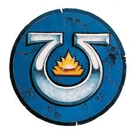

<!-- A0429-B0006 -->

原译文

Realm of Ultramar 奥特拉玛王国

**校订译文**

Realm of Ultramar 奥特拉玛领地

<!-- /A0429-B0006 -->

<!-- A0429-B0007 -->
**英文原文**

Capital:Macragge

<!-- /A0429-B0007 -->

<!-- A0429-B0008 -->

原译文

首都：马库拉格

**校订译文**

首都：马库拉格

<!-- /A0429-B0008 -->

<!-- A0429-B0009 -->
**英文原文**

Official languages:High Gothic, Low Gothic, Cant Mechanicus

<!-- /A0429-B0009 -->

<!-- A0429-B0010 -->

原译文

官方语言：高哥特语，低哥特语，机械之语

**校订译文**

官方语言：高哥特语，低哥特语，机械之语

<!-- /A0429-B0010 -->

<!-- A0429-B0011 -->
**英文原文**

Major Species:Humans, Abhumans

<!-- /A0429-B0011 -->

<!-- A0429-B0012 -->

原译文

主要种族：人类，亚人

**校订译文**

主要种族：人类，亚人

<!-- /A0429-B0012 -->

<!-- A0429-B0013 -->
**英文原文**

Type of Government:Military government

<!-- /A0429-B0013 -->

<!-- A0429-B0014 -->

原译文

政府类型：军事政府

**校订译文**

政府类型：军事政府

<!-- /A0429-B0014 -->

<!-- A0429-B0015 -->
**英文原文**

Heads of State:Roboute Guilliman (Master of Ultramar), Lord Macragge Marneus Calgar, Regent Severus Agemman

<!-- /A0429-B0015 -->

<!-- A0429-B0016 -->

原译文

国家首脑：罗伯特·基里曼（奥特拉玛之主），马库拉格领主马涅乌斯·卡尔加，摄政西弗勒斯·阿格曼

**校订译文**

国家首脑：罗保特·基里曼（奥特拉玛之主），马库拉格领主马涅乌斯·卡尔加，摄政西弗勒斯·阿格曼

<!-- /A0429-B0016 -->

<!-- A0429-B0017 -->
**英文原文**

Governing body:Council of Greater Ultramar

<!-- /A0429-B0017 -->

<!-- A0429-B0018 -->

原译文

管理机构：大奥特拉玛议会

**校订译文**

管理机构：大奥特拉玛议会

<!-- /A0429-B0018 -->

<!-- A0429-B0019 -->
**英文原文**

State religion(s):Imperial Cult

<!-- /A0429-B0019 -->

<!-- A0429-B0020 -->

原译文

宗教：帝国教派

**校订译文**

官方信仰：帝皇信仰。

<!-- /A0429-B0020 -->

<!-- A0429-B0021 -->
**英文原文**

Military forces:Shield Chapters of Ultramar, Ultramar Auxilia, Ultramar Defence Fleet, Vigil Opertii, Praecental Guard

<!-- /A0429-B0021 -->

<!-- A0429-B0022 -->

原译文

军事部队：奥特拉玛之盾战团，奥特拉玛辅助军，奥特拉玛防御舰队，守秘人

**校订译文**

军事力量：奥特拉玛之盾战团、奥特拉玛辅助军、奥特拉玛防御舰队、守秘人、执中守卫。

**校注：** 补回原译遗漏的 Praecental Guard，沿用第38、67篇及本篇末段现稿“执中守卫”。

<!-- /A0429-B0022 -->

<!-- A0429-B0023 -->
## Geography 地理

<!-- /A0429-B0023 -->

<!-- A0429-B0024 -->
**英文原文**

Ultramar, known as the Five Hundred Worlds (not just worlds, but 500 inhabited worlds), is a sub-empire within the Imperium of Man located in the southern reaches of the Eastern Fringe within the Ultima Sector of Ultima Segmentum. One of the furthest realms from the light of the Astronomican, Ultramar lies south of the T'au Empire and Ichar IV.

<!-- /A0429-B0024 -->

<!-- A0429-B0025 -->

原译文

奥特拉玛，被称为五百世界（不仅仅是世界，而是500个有人居住的世界），是人类帝国内的一个子帝国，位于极限星域的极限星区内的东部边缘的南部区域。奥特拉玛是距离星炬之光最远的领域之一，位于钛帝国和伊卡尔四号以南。

**校订译文**

奥特拉玛又称“五百世界”，这里的五百指有人居住的世界，而非仅有五百颗星球。它是人类帝国内的一个国中之国，位于极限星域的极限星区、银河东部边缘南部。这里远离星炬之光，地处钛帝国与伊卡尔四号以南。

<!-- /A0429-B0025 -->

<!-- A0429-B0026 图片 -->
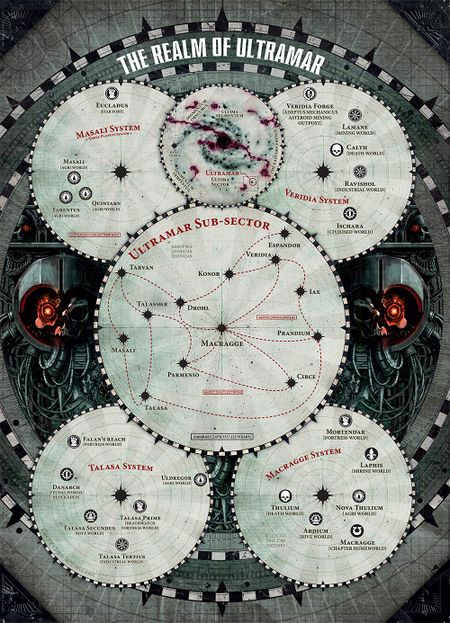

<!-- A0429-B0027 -->

原译文

The current realm of Ultramar 奥特拉玛的当前领域

**校订译文**

The current realm of Ultramar 奥特拉玛的当前领域

<!-- /A0429-B0027 -->

<!-- A0429-B0028 -->
**英文原文**

The Stellar Realm is divided into five sectors (North, South, East, West and Centre). Four of these sectors are ruled by a Tetrarch appointed by Guilliman himself. Every sector has a capital world where the Tetrarch oversees his section of Ultramar.

<!-- /A0429-B0028 -->

<!-- A0429-B0029 -->

原译文

恒星领域分为五个星区（北、南、东、西和中心）。其中四个星区由基里曼亲自任命的英杰统治。每个星区都有一个首都世界，英杰负责监督他的奥特拉玛星区。

**校订译文**

这片星际领地分为北、南、东、西、中五个区域。其中四个由基里曼亲自任命的四方领主治理，各以一颗首府世界为统治中心。

**校注：** 与前章相同，英文在 sub-sector 内又称 sectors；采用领地内区域的表述，避免强行改变星区行政层级。四方领主共四位，中央区由卡尔加直辖。

<!-- /A0429-B0029 -->

<!-- A0429-B0030 -->
**英文原文**

The Northern Sector is based around the Forge World of Konor. Its Tetrarch is Severus Agemman, First Captain of the Ultramarines.

<!-- /A0429-B0030 -->

<!-- A0429-B0031 -->

原译文

北部星区基于康诺铸造世界。它的英杰是极限战士的第一连长西弗勒斯·阿格曼。

**校订译文**

北部区域以铸造世界康诺为中心，由极限战士第一连长西弗勒斯·阿格曼担任四方领主。

<!-- /A0429-B0031 -->

<!-- A0429-B0032 -->
**英文原文**

The Southern Sector is based around the world of Andermung. Its Tetrarch is Second Captain Portan of the Genesis Chapter.

<!-- /A0429-B0032 -->

<!-- A0429-B0033 -->

原译文

南部星区基于安德蒙世界。它的英杰是起源战团的第二连长波坦。

**校订译文**

南部区域以安德蒙为中心，由起源战团第二连长波坦担任四方领主。

<!-- /A0429-B0033 -->

<!-- A0429-B0034 -->
**英文原文**

The Western Sector is based around the world of Protos. Its Tetrarch is Captain Balthus of the Doom Eagles.

<!-- /A0429-B0034 -->

<!-- A0429-B0035 -->

原译文

西部星区基于普鲁托斯世界。它的英杰是末日雄鹰的连长巴尔蒂斯。

**校订译文**

西部区域以普鲁托斯为中心，由末日天鹰连长巴尔蒂斯担任四方领主。

<!-- /A0429-B0035 -->

<!-- A0429-B0036 -->
**英文原文**

The Eastern Sector is based around the world of Vespator. It had been previously ruled by a political entity known as the Sotharan league, but since Sotha was destroyed by Hive Fleet Kraken, Guilliman re-constituted what was left of the league around Vespator. It includes approximately 86 planets and its Tetrarch is Decimus Felix, a Primaris Ultramarine recently promoted to Eleventh Captain of the Ultramarines and Equerry to Roboute Guilliman.

<!-- /A0429-B0036 -->

<!-- A0429-B0037 -->

原译文

东部星区基于维斯帕托世界。它以前曾由一个名为索萨兰联盟的政治实体统治，但自从索萨被虫巢舰队克拉肯摧毁后，基里曼在维斯帕托周围重新组建了联盟。它包括大约86颗行星，它的英杰是德西穆斯·菲利克斯，一位最近晋升为极限战士第十一连长以及罗伯特·基里曼的侍从官的原铸极限战士，。

**校订译文**

东部区域以维斯帕托为中心。这里过去由索萨兰联盟统治；索萨被克拉肯虫巢舰队摧毁后，基里曼便以维斯帕托为核心重组联盟残余。该区域约含86颗行星，四方领主为德西穆斯·菲利克斯。他是一名原铸极限战士，新近晋升为极限战士第十一连长，并兼任罗保特·基里曼的侍从官。

<!-- /A0429-B0037 -->

<!-- A0429-B0038 -->
**英文原文**

The Central Sector falls under the direct rule of Macragge and its Lord, Marneus Calgar. It encompasses all systems in the heart of Ultramar with the exception of Konor, Veridia and Espandor, which fall under the remit of the Northern Tetrarch.

<!-- /A0429-B0038 -->

<!-- A0429-B0039 -->

原译文

中部星区由马库拉格及其领主马涅乌斯·卡尔加直接统治。它涵盖了奥特拉玛中心的所有星系，但康诺、维瑞迪亚和埃斯潘多除外，这些星系属于北部英杰的职权范围。

**校订译文**

中央区域由马库拉格及其领主马涅乌斯·卡尔加直接统治，涵盖奥特拉玛腹地各星系，但康诺、维瑞迪亚和埃斯潘多除外；这些地区归北部四方领主管辖。

<!-- /A0429-B0039 -->

<!-- A0429-B0040 -->
### Known Worlds of Ultramar 著名奥特拉玛世界

<!-- /A0429-B0040 -->

<!-- A0429-B0041 -->
### Core Systems 核心星系

<!-- /A0429-B0041 -->

<!-- A0429-B0042 图片 -->
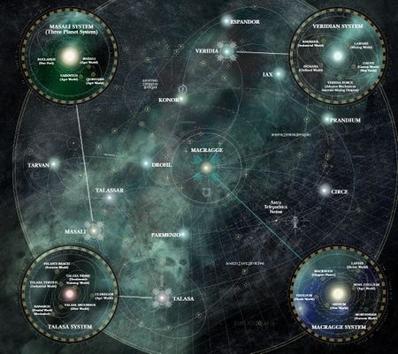

<!-- A0429-B0043 -->

原译文

Star Map of Ultramar 奥特拉玛的星图

**校订译文**

Star Map of Ultramar 奥特拉玛的星图

<!-- /A0429-B0043 -->

<!-- A0429-B0044 -->
### Macragge System 马库拉格星系

<!-- /A0429-B0044 -->

<!-- A0429-B0045 图片 -->
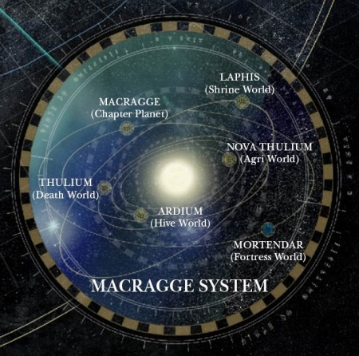

<!-- A0429-B0046 -->

原译文

The Macragge System 马库拉格星系

**校订译文**

The Macragge System 马库拉格星系

<!-- /A0429-B0046 -->

<!-- A0429-B0047 -->

原译文

Macragge 马库拉格

**校订译文**

Macragge 马库拉格

<!-- /A0429-B0047 -->

<!-- A0429-B0048 -->

原译文

Laphis 拉皮斯

**校订译文**

Laphis 拉斐斯

<!-- /A0429-B0048 -->

<!-- A0429-B0049 -->

原译文

Nova Thulium 新铥

**校订译文**

Nova Thulium 新铥

<!-- /A0429-B0049 -->

<!-- A0429-B0050 -->

原译文

Ardium 阿尔迪姆

**校订译文**

Ardium 阿尔蒂姆

<!-- /A0429-B0050 -->

<!-- A0429-B0051 -->

原译文

Thulium 铥

**校订译文**

Thulium 铥

<!-- /A0429-B0051 -->

<!-- A0429-B0052 -->
### Konor System 康诺星系

<!-- /A0429-B0052 -->

<!-- A0429-B0053 -->

原译文

Konor 康诺

**校订译文**

Konor 康诺

<!-- /A0429-B0053 -->

<!-- A0429-B0054 -->
**英文原文**

Gantz (Moon of Konor)

<!-- /A0429-B0054 -->

<!-- A0429-B0055 -->

原译文

甘茨（康诺的卫星）

**校订译文**

甘茨（康诺的卫星）

<!-- /A0429-B0055 -->

<!-- A0429-B0056 -->

原译文

Vanitor 瓦尼托尔

**校订译文**

Vanitor 瓦尼托尔

<!-- /A0429-B0056 -->

<!-- A0429-B0057 -->

原译文

Drenthal 德伦塔尔

**校订译文**

Drenthal 德伦塔尔

<!-- /A0429-B0057 -->

<!-- A0429-B0058 -->

原译文

Loebos 洛博斯

**校订译文**

Loebos 洛博斯

<!-- /A0429-B0058 -->

<!-- A0429-B0059 -->

原译文

Nethamus 内瑟姆斯

**校订译文**

Nethamus 内瑟姆斯

<!-- /A0429-B0059 -->

<!-- A0429-B0060 -->

原译文

Astaramis 阿斯塔拉米斯

**校订译文**

Astaramis 阿斯塔拉米斯

<!-- /A0429-B0060 -->

<!-- A0429-B0061 -->
### Veridian System 维里迪亚星系

原题：Veridian System 维瑞迪亚星系

**校注：** 本篇 Veridian System 位于奥特拉玛并含考斯；前篇 B0094 同名星系却被置于暴风星域。两处来源地理口径不同，保留各自记载，不强行合并地点。

<!-- /A0429-B0061 -->

<!-- A0429-B0062 图片 -->
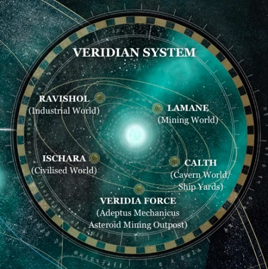

<!-- A0429-B0063 -->

原译文

Veridian System 维瑞迪亚星系

**校订译文**

Veridian System 维里迪亚星系

<!-- /A0429-B0063 -->

<!-- A0429-B0064 -->

原译文

Calth 考斯

**校订译文**

Calth 考斯

<!-- /A0429-B0064 -->

<!-- A0429-B0065 -->

原译文

Ravishol 拉维绍尔

**校订译文**

Ravishol 拉维绍尔

<!-- /A0429-B0065 -->

<!-- A0429-B0066 -->

原译文

Lamane 拉曼

**校订译文**

Lamane 拉曼

<!-- /A0429-B0066 -->

<!-- A0429-B0067 -->

原译文

Ischara 伊斯卡拉

**校订译文**

Ischara 伊斯卡拉

<!-- /A0429-B0067 -->

<!-- A0429-B0068 -->

原译文

Veridia Force 维瑞迪亚部队

**校订译文**

Veridia Force 维瑞迪亚·福斯

**校注：** Veridia Force 在星系世界清单中作为专名保留，暂音译维瑞迪亚·福斯；原“维瑞迪亚部队”会误把世界列表项当军事单位。真实名称及可能拼写问题待核。

<!-- /A0429-B0068 -->

<!-- A0429-B0069 -->
### Masali System 马萨里星系

原题：Masali System 马萨利星系

<!-- /A0429-B0069 -->

<!-- A0429-B0070 图片 -->
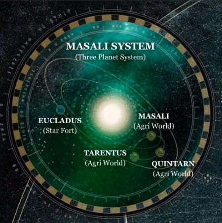

<!-- A0429-B0071 -->

原译文

Masali System 马萨利星系

**校订译文**

Masali System 马萨里星系

<!-- /A0429-B0071 -->

<!-- A0429-B0072 -->

原译文

Masali 马萨利

**校订译文**

Masali 马萨里

<!-- /A0429-B0072 -->

<!-- A0429-B0073 -->

原译文

Quintarn 昆塔尔

**校订译文**

Quintarn 昆坦

<!-- /A0429-B0073 -->

<!-- A0429-B0074 -->

原译文

Tarentus 塔伦图斯

**校订译文**

Tarentus 塔伦图斯

<!-- /A0429-B0074 -->

<!-- A0429-B0075 -->
**英文原文**

Eucladus - Star Fort

<!-- /A0429-B0075 -->

<!-- A0429-B0076 -->

原译文

欧克拉德斯 - 星堡

**校订译文**

欧克拉德斯 - 星堡

<!-- /A0429-B0076 -->

<!-- A0429-B0077 -->
### Talasa System 塔拉萨星系

<!-- /A0429-B0077 -->

<!-- A0429-B0078 图片 -->
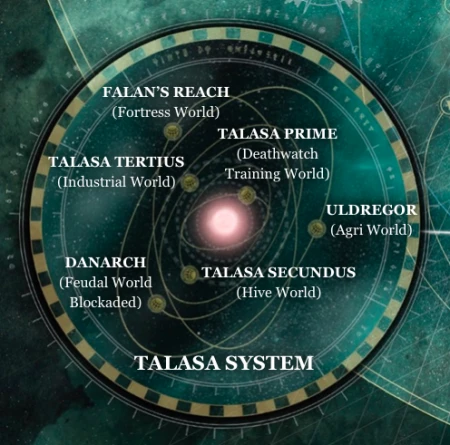

<!-- A0429-B0079 -->

原译文

Talasa System 塔拉萨星系

**校订译文**

Talasa System 塔拉萨星系

<!-- /A0429-B0079 -->

<!-- A0429-B0080 -->

原译文

Danarch 丹那奇

**校订译文**

Danarch 丹那奇

<!-- /A0429-B0080 -->

<!-- A0429-B0081 -->

原译文

Falan's Reach 法兰河段

**校订译文**

Falan's Reach 法兰疆域

**校注：** 此项列在塔拉萨星系的世界名录中；Reach 暂按宇宙地理语境译为疆域，原译“河段”没有英文上下文依据。世界名仍待官网核实。

<!-- /A0429-B0081 -->

<!-- A0429-B0082 -->

原译文

Talasa Tertius 塔拉萨三号

**校订译文**

Talasa Tertius 塔拉萨三号

<!-- /A0429-B0082 -->

<!-- A0429-B0083 -->

原译文

Talasa Prime 塔拉萨一号

**校订译文**

Talasa Prime 塔拉萨主星

<!-- /A0429-B0083 -->

<!-- A0429-B0084 -->

原译文

Talasa Secundus 塔拉萨二号

**校订译文**

Talasa Secundus 塔拉萨二号

<!-- /A0429-B0084 -->

<!-- A0429-B0085 -->

原译文

Uldregor 乌尔德戈尔

**校订译文**

Uldregor 乌尔德戈尔

<!-- /A0429-B0085 -->

<!-- A0429-B0086 -->
### Drohl System 德罗尔星系

<!-- /A0429-B0086 -->

<!-- A0429-B0087 -->

原译文

Drohl Magna 大德罗尔

**校订译文**

Drohl Magna 大德罗尔

<!-- /A0429-B0087 -->

<!-- A0429-B0088 -->

原译文

Drohl Secundus 德罗尔二号

**校订译文**

Drohl Secundus 德罗尔二号

<!-- /A0429-B0088 -->

<!-- A0429-B0089 -->

原译文

Ganymedus 伽倪墨得斯

**校订译文**

Ganymedus 伽倪墨得斯

<!-- /A0429-B0089 -->

<!-- A0429-B0090 -->

原译文

Atoli 阿托利

**校订译文**

Atoli 阿托利

<!-- /A0429-B0090 -->

<!-- A0429-B0091 -->

原译文

Dumar 杜马尔

**校订译文**

Dumar 杜马尔

<!-- /A0429-B0091 -->

<!-- A0429-B0092 -->
### Parmenio System 帕尔梅尼奥星系

原题：Parmenio System 帕米尼奥星系

<!-- /A0429-B0092 -->

<!-- A0429-B0093 -->
**英文原文**

Parmenio - Capital World

<!-- /A0429-B0093 -->

<!-- A0429-B0094 -->

原译文

帕米尼奥 - 首都世界

**校订译文**

帕尔梅尼奥——首府世界。

<!-- /A0429-B0094 -->

<!-- A0429-B0095 -->
### Iax System 艾克斯星系

<!-- /A0429-B0095 -->

<!-- A0429-B0096 -->
### Tuesen System 图森星系

<!-- /A0429-B0096 -->

<!-- A0429-B0097 -->
### Other Worlds 其他世界

<!-- /A0429-B0097 -->

<!-- A0429-B0098 -->

原译文

Alveiro 阿尔维罗

**校订译文**

Alveiro 阿尔维罗

<!-- /A0429-B0098 -->

<!-- A0429-B0099 -->
**英文原文**

Andermung - Oversees southern ultramar

<!-- /A0429-B0099 -->

<!-- A0429-B0100 -->

原译文

安德蒙 - 监督南奥特拉玛

**校订译文**

安德蒙——南部奥特拉玛的统治中心。

<!-- /A0429-B0100 -->

<!-- A0429-B0101 -->

原译文

Callimachus 卡利马科斯

**校订译文**

Callimachus 卡利马科斯

<!-- /A0429-B0101 -->

<!-- A0429-B0102 -->

原译文

Circe 喀耳刻

**校订译文**

Circe 喀耳刻

<!-- /A0429-B0102 -->

<!-- A0429-B0103 -->

原译文

Drohl 德罗尔

**校订译文**

Drohl 德罗尔

<!-- /A0429-B0103 -->

<!-- A0429-B0104 -->

原译文

Espandor 埃斯潘多

**校订译文**

Espandor 埃斯潘多

<!-- /A0429-B0104 -->

<!-- A0429-B0105 -->

原译文

Howsbridge 豪斯布里奇

**校订译文**

Howsbridge 豪斯布里奇

<!-- /A0429-B0105 -->

<!-- A0429-B0106 -->

原译文

Iax 艾克斯

**校订译文**

Iax 艾克斯

<!-- /A0429-B0106 -->

<!-- A0429-B0107 -->

原译文

Longhallow 长圣星

**校订译文**

Longhallow 长圣星

<!-- /A0429-B0107 -->

<!-- A0429-B0108 -->

原译文

Mortendar 莫滕达尔

**校订译文**

Mortendar 莫滕达尔

<!-- /A0429-B0108 -->

<!-- A0429-B0109 -->

原译文

Occluda 奥克鲁达

**校订译文**

Occluda 奥克鲁达

<!-- /A0429-B0109 -->

<!-- A0429-B0110 -->

原译文

Odyssean 奥德赛

**校订译文**

Odyssean 奥德赛

<!-- /A0429-B0110 -->

<!-- A0429-B0111 -->

原译文

Prandium 普兰蒂姆

**校订译文**

Prandium 普兰蒂姆

<!-- /A0429-B0111 -->

<!-- A0429-B0112 -->
**英文原文**

Protos - Oversees western ultramar

<!-- /A0429-B0112 -->

<!-- A0429-B0113 -->

原译文

普鲁托斯 - 监督西奥特拉玛

**校订译文**

普鲁托斯——西部奥特拉玛的统治中心。

<!-- /A0429-B0113 -->

<!-- A0429-B0114 -->

原译文

Sanctoria 桑托利亚

**校订译文**

Sanctoria 桑托利亚

<!-- /A0429-B0114 -->

<!-- A0429-B0115 -->

原译文

Talassar 塔拉萨

**校订译文**

Talassar 塔拉萨

<!-- /A0429-B0115 -->

<!-- A0429-B0116 -->

原译文

Tarvan 塔文

**校订译文**

Tarvan 塔文

<!-- /A0429-B0116 -->

<!-- A0429-B0117 -->
**英文原文**

Vespator - Oversees eastern ultramar

<!-- /A0429-B0117 -->

<!-- A0429-B0118 -->

原译文

维斯帕托 - 监督东奥特拉玛

**校订译文**

维斯帕托——东部奥特拉玛的统治中心。

<!-- /A0429-B0118 -->

<!-- A0429-B0119 -->
### Former Worlds 昔日辖属世界

原题：Former Worlds 前世界

<!-- /A0429-B0119 -->

<!-- A0429-B0120 -->

原译文

Armatura 阿玛图拉

**校订译文**

Armatura 阿玛图拉

<!-- /A0429-B0120 -->

<!-- A0429-B0121 -->
**英文原文**

Pila (moon of Armatura)

<!-- /A0429-B0121 -->

<!-- A0429-B0122 -->

原译文

皮拉（阿玛图拉的卫星）

**校订译文**

皮拉（阿玛图拉的卫星）

<!-- /A0429-B0122 -->

<!-- A0429-B0123 -->

原译文

Corum's Landing 科勒姆登陆

**校订译文**

Corum's Landing 科勒姆登陆地

<!-- /A0429-B0123 -->

<!-- A0429-B0124 -->

原译文

Ereth Five 埃雷斯五号

**校订译文**

Ereth Five 埃雷斯五号

<!-- /A0429-B0124 -->

<!-- A0429-B0125 -->

原译文

Jursa 尤尔萨

**校订译文**

Jursa 尤尔萨

<!-- /A0429-B0125 -->

<!-- A0429-B0126 -->

原译文

Kallas 卡拉斯

**校订译文**

Kallas 卡拉斯

<!-- /A0429-B0126 -->

<!-- A0429-B0127 -->

原译文

Latona 拉托那

**校订译文**

Latona 拉托那

<!-- /A0429-B0127 -->

<!-- A0429-B0128 -->

原译文

Magniat 马格尼亚特

**校订译文**

Magniat 马格尼亚特

<!-- /A0429-B0128 -->

<!-- A0429-B0129 -->

原译文

Nuceria 努凯里亚

**校订译文**

Nuceria 努凯里亚

<!-- /A0429-B0129 -->

<!-- A0429-B0130 -->

原译文

Octavia 奥克塔维亚

**校订译文**

Octavia 奥克塔维亚

<!-- /A0429-B0130 -->

<!-- A0429-B0131 -->

原译文

Percepton Primus 洞察主星

**校订译文**

Percepton Primus 洞察主星

<!-- /A0429-B0131 -->

<!-- A0429-B0132 -->

原译文

Quilkhama 奎尔卡马

**校订译文**

Quilkhama 奎尔卡马

<!-- /A0429-B0132 -->

<!-- A0429-B0133 -->

原译文

Saramanth 萨拉玛斯

**校订译文**

Saramanth 萨拉玛斯

<!-- /A0429-B0133 -->

<!-- A0429-B0134 -->

原译文

Sotha 索萨

**校订译文**

Sotha 索萨

<!-- /A0429-B0134 -->

<!-- A0429-B0135 -->

原译文

Tycor 泰科尔

**校订译文**

Tycor 泰科尔

<!-- /A0429-B0135 -->

<!-- A0429-B0136 -->

原译文

Ulixis 乌里西斯

**校订译文**

Ulixis 尤利西斯

**校注：** Ulixis 与既有战团名 Patriarchs of Ulixis 尤利西斯宗主统一词根；原乌里西斯。

<!-- /A0429-B0136 -->

<!-- A0429-B0137 -->
## History 历史

<!-- /A0429-B0137 -->

<!-- A0429-B0138 -->
**英文原文**

Prior to the formation of Ultramar, the world of Macragge had maintained contact with its neighboring systems, its industries and peoples having largely survived the chaos of the Age of Strife. The world would be transformed however by Roboute Guilliman, becoming a prosperous and well-governed planet with trade routes that brought in raw materials and immigrants on a regular basis. It was during this time that Guilliman was rediscovered by the Emperor, who named him Primarch of the Ultramarines Legion and moved their forward base to Macragge. Within a year a new training base was operational and began taking recruits not only from Macragge, but from the surrounding systems as well. This close relationship with the other worlds would form the basis of what would become the Ultramarines' stellar empire.

<!-- /A0429-B0138 -->

<!-- A0429-B0139 -->

原译文

在奥特拉玛成立之前，马库拉格世界与其邻近的星系保持联系，其工业和人民在很大程度上在纷争时代的混乱中幸存。然而，罗伯特·基里曼将改变世界，成为一个繁荣、治理良好的行星，拥有定期引进原材料和移民的贸易路线。正是在这段时间里，基里曼被帝皇重新发现，帝皇任命他为极限战士军团的原体，并将他们的前线基地搬到了马库拉格。一年之内，一个新的训练基地开始运作，不仅从马库拉格招募新兵，还从周围的星系招募新兵。与其他世界的这种密切关系将构成极限战士恒星帝国的基础。

**校订译文**

奥特拉玛建立以前，马库拉格便一直与邻近星系保持联系，工业与人口也大体熬过了纷争时代的混乱。罗保特·基里曼进一步改变了这颗星球，使其繁荣有序，贸易航路持续带来原料与移民。帝皇在此期间寻回基里曼，令其以原体身份统领极限战士，并把军团前进基地迁至马库拉格。一年内，新训练基地投入运作，征兵范围既包括马库拉格，也涵盖周边星系。与其他世界的紧密关系，由此奠定了极限战士星际领地的基础。

<!-- /A0429-B0139 -->

<!-- A0429-B0140 图片 -->
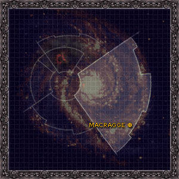

<!-- A0429-B0141 -->

原译文

The location of Macragge, the centre of Ultramar 奥特拉玛的中心，马库拉格的位置

**校订译文**

The location of Macragge, the centre of Ultramar 奥特拉玛的中心，马库拉格的位置

<!-- /A0429-B0141 -->

<!-- A0429-B0142 -->
**英文原文**

During the Great Crusade, Ultramar maintained a steady supply of new recruits for the Legion, such that the Ultramarines became one of the largest Legions ever. It, along with the Ultramarines themselves, was left largely unscathed by the Horus Heresy, though it was invaded by the Word Bearers resulting in the Battle of Calth. In addition to that, about one fifth of the Five Hundred Worlds were destroyed by the Word Bearers and World Eaters during the Shadow Crusade. In the aftermath of their campaign the Word Bearers were able to erect the Ruinstorm, severing Ultramar from the rest of the Imperium. Guilliman became worried that the Imperium itself was lost and sought to have Ultramar become the heart of a new contingency empire: Imperium Secundus.

<!-- /A0429-B0142 -->

<!-- A0429-B0143 -->

原译文

在大远征期间，奥特拉玛为军团保持了稳定的新兵供应，使极限战士成为有史以来最大的军团之一。它和极限战士本身在很大程度上没有受到荷鲁斯叛乱的伤害，尽管它被怀言者入侵，导致了考斯之战。除此之外，在暗影远征期间，五百世界中约有五分之一被怀言者和吞世者摧毁。在他们的战役结束后，怀言者能够建立毁灭风暴，将奥特拉玛与帝国的其他部分切断。基里曼开始担心帝国本身已经陷落，并试图让奥特拉玛成为一个新的应急帝国的核心：第二帝国。

**校订译文**

大远征期间，奥特拉玛持续为军团输送新兵，使极限战士成为历史上规模最大的军团之一。本段将奥特拉玛及军团描述为在荷鲁斯之乱中“大体未受损伤”，但随即也记载了怀言者入侵所引发的考斯之战，以及暗影远征中怀言者和吞世者摧毁五百世界约五分之一的惨剧。远征之后，怀言者制造了毁灭风暴，将奥特拉玛与帝国其他地区隔绝。基里曼担心帝国已经覆灭，遂试图以奥特拉玛为核心建立应急后备政权——第二帝国。

**校注：** 英文在同段中一面称 largely unscathed，一面列出五百世界约五分之一毁灭。中文明确呈现来源内部的叙述张力，不自行删掉损失或将未受损伤改成另一事实。

<!-- /A0429-B0143 -->

<!-- A0429-B0144 图片 -->
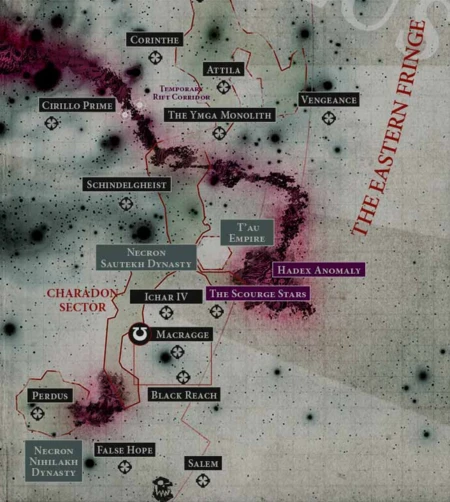

<!-- A0429-B0145 -->

原译文

Ultramar on the Eastern Fringe 东部边缘的奥特拉玛

**校订译文**

Ultramar on the Eastern Fringe 东部边缘的奥特拉玛

<!-- /A0429-B0145 -->

<!-- A0429-B0146 -->
**英文原文**

With the end of the Heresy, Guilliman felt that Space Marines should no longer directly rule over Humanity and as a result removed most of the surviving worlds of Ultramar from Ultramarine control. Ultramar was reduced to a fraction of its former size. The realm was reduced to:

<!-- /A0429-B0146 -->

<!-- A0429-B0147 -->

原译文

随着叛乱的结束，基里曼认为星际战士不应该再直接统治人类，因此将奥特拉玛的大部分幸存世界从奥特拉玛的控制中移除。奥特拉玛被缩小到原来的一小部分。该王国被缩减为：

**校订译文**

荷鲁斯之乱结束后，基里曼认为星际战士不应继续直接统治人类，因此将奥特拉玛大多数幸存世界从极限战士的管辖中划出，领地规模缩减至原先的一小部分，仅保留以下世界：

<!-- /A0429-B0147 -->

<!-- A0429-B0148 图片 -->
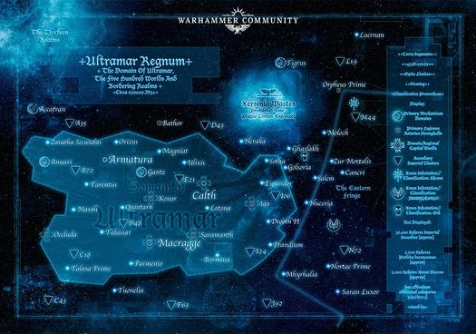

<!-- A0429-B0149 -->

原译文

Ultramar during the Horus Heresy 荷鲁斯叛乱时期的奥特拉玛

**校订译文**

Ultramar during the Horus Heresy 荷鲁斯之乱时期的奥特拉玛

<!-- /A0429-B0149 -->

<!-- A0429-B0150 -->
**英文原文**

Macragge - Capital and home to the Ultramarines fortress-monastery

<!-- /A0429-B0150 -->

<!-- A0429-B0151 -->

原译文

马库拉格 - 首都和极限战士堡垒修道院的所在地

**校订译文**

马库拉格 - 首都和极限战士要塞修道院的所在地

<!-- /A0429-B0151 -->

<!-- A0429-B0152 -->
**英文原文**

Calth - Cavern World

<!-- /A0429-B0152 -->

<!-- A0429-B0153 -->

原译文

考斯 - 洞穴世界

**校订译文**

考斯 - 洞穴世界

<!-- /A0429-B0153 -->

<!-- A0429-B0154 -->
**英文原文**

Konor - Forge World and headquarters for the northern reaches of Ultramar

<!-- /A0429-B0154 -->

<!-- A0429-B0155 -->

原译文

康诺 - 铸造世界和奥特拉玛北部区域的总部

**校订译文**

康诺 - 铸造世界和奥特拉玛北部区域的总部

<!-- /A0429-B0155 -->

<!-- A0429-B0156 -->
**英文原文**

Espandor - Cardinal World

<!-- /A0429-B0156 -->

<!-- A0429-B0157 -->

原译文

埃斯潘多 - 红衣主教世界

**校订译文**

埃斯潘多 - 红衣主教世界

<!-- /A0429-B0157 -->

<!-- A0429-B0158 -->
**英文原文**

Iax - "Garden World"

<!-- /A0429-B0158 -->

<!-- A0429-B0159 -->

原译文

艾克斯 - “花园世界”

**校订译文**

艾克斯 - “花园世界”

<!-- /A0429-B0159 -->

<!-- A0429-B0160 -->
**英文原文**

Parmenio - Training world

<!-- /A0429-B0160 -->

<!-- A0429-B0161 -->

原译文

帕米尼奥 - 训练世界

**校订译文**

帕尔梅尼奥 - 训练世界

<!-- /A0429-B0161 -->

<!-- A0429-B0162 -->
**英文原文**

Prandium (destroyed)

<!-- /A0429-B0162 -->

<!-- A0429-B0163 -->

原译文

普兰蒂姆（毁灭）

**校订译文**

普兰蒂姆（毁灭）

<!-- /A0429-B0163 -->

<!-- A0429-B0164 -->
**英文原文**

Talassar - Ocean World

<!-- /A0429-B0164 -->

<!-- A0429-B0165 -->

原译文

塔拉萨 - 海洋世界

**校订译文**

塔拉萨 - 海洋世界

<!-- /A0429-B0165 -->

<!-- A0429-B0166 -->
**英文原文**

Talasa Prime - Inquisitorial Fortress

<!-- /A0429-B0166 -->

<!-- A0429-B0167 -->

原译文

塔拉萨一号 - 审判官堡垒

**校订译文**

塔拉萨主星——审判庭堡垒。

<!-- /A0429-B0167 -->

<!-- A0429-B0168 -->

原译文

The Three Planets 三星

**校订译文**

The Three Planets 三星

<!-- /A0429-B0168 -->

<!-- A0429-B0169 -->
**英文原文**

Masali - Agri-World

<!-- /A0429-B0169 -->

<!-- A0429-B0170 -->

原译文

马萨利 - 农业世界

**校订译文**

马萨里 - 农业世界

<!-- /A0429-B0170 -->

<!-- A0429-B0171 -->

原译文

Quintarn 昆塔尔

**校订译文**

Quintarn 昆坦

<!-- /A0429-B0171 -->

<!-- A0429-B0172 -->

原译文

Tarentus 塔伦图斯

**校订译文**

Tarentus 塔伦图斯

<!-- /A0429-B0172 -->

<!-- A0429-B0173 -->

原译文

Circe 喀耳刻

**校订译文**

Circe 喀耳刻

<!-- /A0429-B0173 -->

<!-- A0429-B0174 -->
**英文原文**

Ultramar was not attacked again until the War of the Beast when Ork forces landed on Quintarn and Prandium. Ultramar next came under attack in the First Tyrannic War with the invasion of Hive Fleet Behemoth. Though ultimately defeated, Behemoth would leave its mark, especially with the complete destruction of Prandium.

<!-- /A0429-B0174 -->

<!-- A0429-B0175 -->

原译文

奥特拉玛直到野兽战争爆发后才再次遭到袭击，当时欧克军队在昆塔尔和普兰蒂姆登陆。奥特拉玛接下来在第一次泰伦战争中受到攻击，虫巢舰队贝希摩斯入侵。尽管最终被击败，但贝希摩斯仍留下印记，尤其是在普兰迪姆被彻底摧毁的情况下。

**校订译文**

奥特拉玛直到野兽战争时才再次遭到袭击，欧克军队在昆坦和普兰蒂姆登陆。随后，第一次泰伦战争中的贝希摩斯虫巢舰队再次入侵。尽管舰队最终被击败，却留下了深重创伤，尤其是普兰蒂姆遭到彻底毁灭。

<!-- /A0429-B0175 -->

<!-- A0429-B0176 -->
**英文原文**

Ultramar would be threatened a third time when the Iron Warriors Warsmith Honsou assembled an enormous warband to invade Ultramar and seek revenge against Captain Uriel Ventris. While the Chaos forces would be beaten back, the War for Ultramar would see the greatest loss of life since the Tyranid invasion of Hive Fleet Behemoth.

<!-- /A0429-B0176 -->

<!-- A0429-B0177 -->

原译文

当钢铁勇士战争铁匠洪索组建了一支庞大的战帮入侵U奥特拉玛并寻求对乌瑞尔·文崔斯连长的报复时，奥特拉玛第三次受到威胁。虽然混沌部队被击退，但奥特拉玛战争是自虫巢舰队贝希摩斯的泰伦入侵以来最大的生命损失。

**校订译文**

钢铁勇士战争铁匠洪索集结庞大战帮入侵，意图向乌瑞尔·文崔斯连长复仇，使奥特拉玛第三次面临严重威胁。混沌军最终被击退，但此役造成的人员损失，是贝希摩斯虫巢舰队入侵以来最惨重的一次。

<!-- /A0429-B0177 -->

<!-- A0429-B0178 -->
**英文原文**

Later, after the Thirteenth Black Crusade Ultramar suffered yet another Chaos invasion, this time by the Black Legion. During the fighting Roboute Guilliman was reborn and drove the invaders from Macragge, but left for Terra on the Terran Crusade. In his absence, Marneus Calgar and Tigurius were left to deal with the remaining Chaos forces. Guilliman declared that Ultramar's original borders of the 500 Worlds was to be restored, and many of these resistant planets had to be forcibly reconquered. Shortly thereafter Guilliman re-instituted the Tetrarchy system.

<!-- /A0429-B0178 -->

<!-- A0429-B0179 -->

原译文

后来，在第十三次黑色远征之后，奥特拉玛再次遭受了混沌的入侵，这次是由黑色军团入侵的。在战斗中，罗伯特·基里曼重生并将入侵者从马库拉格赶走，但在泰拉远征中前往泰拉。在他缺席的情况下，马涅乌斯·卡尔加和狄格里斯被留下来对付剩余的混沌部队。基里曼宣布，奥特拉玛的500世界的原始边界将被恢复，其中许多抵抗的行星必须被强行重新征服。不久之后，基里曼重新建立了英杰制度。

**校订译文**

第十三次黑色远征后，奥特拉玛再次遭到混沌入侵，这次来犯的是黑色军团。战斗中，罗保特·基里曼复苏，将敌军逐出马库拉格，随后踏上泰拉远征。马涅乌斯·卡尔加与狄格里斯留下，处理剩余混沌部队。基里曼宣布恢复奥特拉玛五百世界的原有疆界，其中许多拒不归附的行星只能靠武力重新征服。不久，他也恢复了四方领主制度。

<!-- /A0429-B0179 -->

<!-- A0429-B0180 -->
**英文原文**

Shortly thereafter, the forces of Nurgle began to overwhelm Ultramar in a series of plagues and invasions known as the Plague Wars and Invasion of Konor. The traitor forces, led by Mortarion would initially make headway despite determined resistance by the Ultramarines and their allies. However, with the return of Guilliman and his Primaris reinforcements, the Nurglite invasion would be fought to a standstill. Their supply lines cut, their initiative lost and the Scourge Stars in peril due to the War in the Rift, the Nurglites chose to retreat from Ultramar.

<!-- /A0429-B0180 -->

<!-- A0429-B0181 -->

原译文

此后不久，纳垢的部队开始在一系列瘟疫和入侵中压倒奥特拉玛，这些瘟疫和入侵被称为瘟疫战争和康诺入侵。尽管极限战士及其盟友坚决抵抗，由莫塔里安领导的叛徒部队最初仍取得进展。然而，随着基里曼和他的原铸增援部队的返回，纳垢的入侵陷入停顿。由于裂隙战争，他们的补给线被切断，主动权丧失，天灾群星处于危险之中，纳垢选择从奥特拉玛撤退。

**校订译文**

不久后，纳垢势力通过一连串瘟疫与入侵压向奥特拉玛，这些战事包括瘟疫战争和康诺入侵。尽管极限战士及盟友顽强抵抗，莫塔里安率领的叛军起初仍不断推进。基里曼与原铸援军回归后，双方终于陷入僵持。纳垢军补给线被切断，失去主动权，后方天灾群星又因裂隙战争面临威胁，遂选择撤出奥特拉玛。

<!-- /A0429-B0181 -->

<!-- A0429-B0182 -->
**英文原文**

There would then be a period of rebuilding, decontamination and fortification across the recently reformed 500 Worlds. Guilliman not only oversaw the reconstruction of Ultramar but also greatly increased its military strength to ward off future invasions.

<!-- /A0429-B0182 -->

<!-- A0429-B0183 -->

原译文

然后，在最近改革的500世界中，将有一段时间进行重建、净化和加固。基里曼不仅监督了奥特拉玛的重建，还大大增强了其军事力量，以抵御未来的入侵。

**校订译文**

其后，重新统一的五百世界进入重建、清除污染与加强防御的阶段。基里曼不仅监督奥特拉玛的恢复，也大幅扩军，以防范未来入侵。

<!-- /A0429-B0183 -->

<!-- A0429-B0184 -->
## Government 政府

<!-- /A0429-B0184 -->

<!-- A0429-B0185 -->
**英文原文**

Upon its assimilation into the greater Imperium during the Great Crusade, Ultramar became a state within a state, enjoying a large degree of autonomy that continues to this day. While all within Ultramar are subjects of the Emperor, the Supreme Leader of Ultramar was always Roboute Guilliman. After his wounding by Fulgrim, the leadership of Ultramar fell to the Lord Macragge with the Regent of Ultramar as his deputy. When Ultramar was a large realm of 500 worlds, there were Tetrarchs that operated below Roboute Guilliman from four key worlds. After the Heresy and the vast decreasing of Ultramar in size, the post of Tetrarch was abolished but recently has been reinstated by the reborn Roboute Guilliman.

<!-- /A0429-B0185 -->

<!-- A0429-B0186 -->

原译文

在大远征期间融入更大的帝国后，奥特拉玛成为国中之国，享有高度自治权，一直延续到今天。虽然奥特拉玛内部的所有人都是帝皇的臣民，但奥特拉玛的最高领袖始终是罗伯特·基里曼。在他被福格瑞姆打伤后，奥特拉玛的领导权落入了马库拉格领主手中，奥特拉玛摄政担任他的副手。当奥特拉玛是一个拥有500世界的大王国时，有四个关键世界的英杰在罗伯特·基里曼下方运作。在叛乱和奥特拉玛的规模大幅缩小之后，英杰的职位被废除，但最近由重生的罗伯特·基里曼恢复。

**校订译文**

大远征期间并入人类帝国后，奥特拉玛便成为享有高度自治权的国中之国，这一地位延续至今。当地居民皆为帝皇臣民，而奥特拉玛的最高领袖始终是罗保特·基里曼。基里曼遭福格瑞姆重创后，治理权由马库拉格领主接掌，奥特拉玛摄政担任副手。在领地尚有五百世界时，四方领主分别驻于四颗重要世界，受基里曼节制。荷鲁斯之乱后，随着领地大幅缩小，这一职位被废除；基里曼复苏后又将其恢复。

<!-- /A0429-B0186 -->

<!-- A0429-B0187 -->
**英文原文**

Below Tetrarchs were Imperial Commanders with connections to the Ultramarines. Each world of Ultramar is ruled by feudal lords loyal to the Chapter Master of the Ultramarines, which is why he is also known as Lord Macragge with all the rights and responsibilities the title entails. The government of each world, besides supplying the Ultramarines with men and material, is directed towards the prosperity of their populace. The most common form of government for the worlds are Ultramar is a feudal system led by noble houses. Above them all, though, is the Council of Greater Ultramar‎, which all of the current Tetrarchs are members of.

<!-- /A0429-B0187 -->

<!-- A0429-B0188 -->

原译文

在英杰之下是与极限战士有联系的帝国指挥官。奥特拉玛的每个世界都由忠于极限战士战团长的封建领主统治，这就是为什么他也被称为马库拉格领主，拥有头衔所赋予的所有权利和责任。每个世界的政府除了向极限战士提供人员和物资外，还致力于促进其民众的繁荣。世界上最常见的政府形式是奥特拉玛，这是一种由贵族领导的封建制度。不过，最重要的是大奥特拉玛议会‎,所有现任英杰都是该组织的成员。

**校订译文**

四方领主之下，是与极限战士有紧密关系的帝国统治者。各世界由效忠极限战士战团长的封建领主管理，这也使战团长兼有“马库拉格领主”之称，并承担相应权利与义务。各地政府除向战团提供人员和物资外，也致力于改善民生。奥特拉玛最常见的政体，是由贵族家族统领的封建制度；凌驾于各地政府之上的则是大奥特拉玛议会，所有现任四方领主均为其成员。

**校注：** Imperial Commanders 在行星统治语境作帝国统治者；原句“世界上最常见的政府形式是奥特拉玛”系误拆句。

<!-- /A0429-B0188 -->

<!-- A0429-B0189 -->
**英文原文**

The current leadership of Ultramar, as of M42, consists of:

<!-- /A0429-B0189 -->

<!-- A0429-B0190 -->

原译文

截至M42，奥特拉玛的当前领导层包括：

**校订译文**

截至M42，奥特拉玛的当前领导层包括：

<!-- /A0429-B0190 -->

<!-- A0429-B0191 -->
**英文原文**

Master of Ultramar - Roboute Guilliman

<!-- /A0429-B0191 -->

<!-- A0429-B0192 -->

原译文

奥特拉玛之主 - 罗伯特·基里曼

**校订译文**

奥特拉玛之主 - 罗保特·基里曼

<!-- /A0429-B0192 -->

<!-- A0429-B0193 -->
**英文原文**

Lord Macragge, Lord Defender of Greater Ultramar & Chapter Master of the Ultramarines - Marneus Calgar

<!-- /A0429-B0193 -->

<!-- A0429-B0194 -->

原译文

马库拉格领主，大奥特拉玛防御领主&极限战士战团长 - 马涅乌斯·卡尔加

**校订译文**

马库拉格领主、大奥特拉玛守护领主兼极限战士战团长——马涅乌斯·卡尔加。

<!-- /A0429-B0194 -->

<!-- A0429-B0195 -->
**英文原文**

Regent of Ultramar & Tetrarch of Konor - Severus Agemman

<!-- /A0429-B0195 -->

<!-- A0429-B0196 -->

原译文

奥特拉玛摄政&康诺英杰 - 西弗勒斯·阿格曼

**校订译文**

奥特拉玛摄政兼康诺四方领主——西弗勒斯·阿格曼。

<!-- /A0429-B0196 -->

<!-- A0429-B0197 -->
**英文原文**

Tetrarch of Andermung - Portan

<!-- /A0429-B0197 -->

<!-- A0429-B0198 -->

原译文

安德蒙英杰 - 波坦

**校订译文**

安德蒙四方领主 - 波坦

<!-- /A0429-B0198 -->

<!-- A0429-B0199 -->
**英文原文**

Tetrarch of Protos - Balthus

<!-- /A0429-B0199 -->

<!-- A0429-B0200 -->

原译文

普鲁托斯英杰 - 巴尔蒂斯

**校订译文**

普鲁托斯四方领主 - 巴尔蒂斯

<!-- /A0429-B0200 -->

<!-- A0429-B0201 -->
**英文原文**

Tetrarch of Vespator - Decimus Felix

<!-- /A0429-B0201 -->

<!-- A0429-B0202 -->

原译文

维斯帕托英杰 - 德西穆斯·菲利克斯

**校订译文**

维斯帕托四方领主 - 德西穆斯·菲利克斯

<!-- /A0429-B0202 -->

<!-- A0429-B0203 -->
**英文原文**

High Suzerain of Ultramar - Cato Sicarius

<!-- /A0429-B0203 -->

<!-- A0429-B0204 -->

原译文

奥特拉玛高领主 - 卡托·西卡留斯

**校订译文**

奥特拉玛高领主 - 卡托·西卡留斯

<!-- /A0429-B0204 -->

<!-- A0429-B0205 -->
## Society 社会

<!-- /A0429-B0205 -->

<!-- A0429-B0206 -->
**英文原文**

On the whole, the realm of Ultramar is composed primarily of industrial worlds, although they lack the nightmarish toxic wastelands common to other Imperial manufacturing centres. Raised in a warrior society which disdains those who do not pull their weight, the population is disciplined, loyal and productive, living in balance with the local ecosystem. With sprawling cities surrounded by extensive farmlands and oceans teeming with fish, each planet is completely self-sufficient, including raw materials and food, and is the envy of many other worlds.

<!-- /A0429-B0206 -->

<!-- A0429-B0207 -->

原译文

总体而言，奥特拉玛领域主要由工业世界组成，尽管它们没有其他帝国工业中心常见的噩梦般的有毒荒地。在一个战士社会长大，这个社会鄙视那些不尽职尽责的人，这里的人们有纪律、忠诚、高效，与当地生态系统保持平衡。随着城市被广阔的农田和充满鱼类的海洋包围，每个行星都是完全自给自足的，包括原材料和食物，这让许多其他世界羡慕不已。

**校订译文**

奥特拉玛主要由工业世界组成，但没有其他帝国工业中心常见的噩梦般有毒荒原。当地社会崇尚武德，鄙视不肯尽责者；居民纪律严明、忠诚勤勉，并与本地生态维持平衡。庞大城市周围是广阔农田与鱼类繁盛的海洋，各行星在原料和食物等方面都能完全自给自足，令其他许多世界羡慕。

<!-- /A0429-B0207 -->

<!-- A0429-B0208 图片 -->
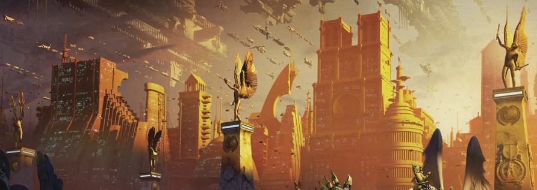

<!-- A0429-B0209 -->

原译文

Magna Macragge Civitas, capital city of Macragge, Ultramar 奥特拉玛，马库拉格的首都，大马库拉格城

**校订译文**

Magna Macragge Civitas, capital city of Macragge, Ultramar 奥特拉玛，马库拉格的首都，大马库拉格城

<!-- /A0429-B0209 -->

<!-- A0429-B0210 -->
**英文原文**

Some small children on Ultramarian worlds go to Scholum, which they often find dull and predictable.

<!-- /A0429-B0210 -->

<!-- A0429-B0211 -->

原译文

奥特拉玛的世界的一些小孩去学校，他们经常觉得无聊和可预测。

**校订译文**

奥特拉玛各世界的一些儿童会进入学塾（Scholum）读书；他们常觉得课程枯燥、千篇一律。

<!-- /A0429-B0211 -->

<!-- A0429-B0212 -->
## Military 军事

<!-- /A0429-B0212 -->

<!-- A0429-B0213 -->
**英文原文**

Following the conclusion of the Plague Wars, Chapters besides the Ultramarines began to guard regions of Ultramar as well. Guilliman ordered that ten Chapters would be permanently stationed within Ultramar so the newly reformed 500 Worlds would be under the permanent protection of about 10,000 Astartes at all times. These Shield Chapters of Ultramar are all descended from the Ultramarines and operate from worlds located within the Realm. This increased military buildup was also so that future operations, such as the Vengeance Campaigns, could be conducted against the Scourge Stars and other regions around Ultramar, that had been overrun by the enemies of the Imperium.

<!-- /A0429-B0213 -->

<!-- A0429-B0214 -->

原译文

瘟疫战争结束后，除了极限战士之外，其他战团也开始守卫奥特拉玛地区。基里曼下令将十个战团永久驻扎在奥特拉玛，这样新改革的500世界将始终受到约10000名阿斯塔特的永久保护。这些奥特拉玛之盾战团都是极限战士的子战团，在领域内的世界中运作。这种增加的军事积累也是为了使未来的行动，如复仇战役，能够针对被帝国之敌占领的天灾群星和奥特拉玛周围的其他地区进行。

**校订译文**

瘟疫战争结束后，其他战团也开始与极限战士一同守卫奥特拉玛。基里曼命令十个战团永久驻留，确保重新统一的五百世界始终有约一万名阿斯塔特保护。这些“奥特拉玛之盾战团”均出自极限战士血脉，以领地内的世界为基地。扩充军力也为未来的复仇战役等行动作准备，以便进攻天灾群星及奥特拉玛周围已被帝国之敌占领的地区。

<!-- /A0429-B0214 -->

<!-- A0429-B0215 图片 -->
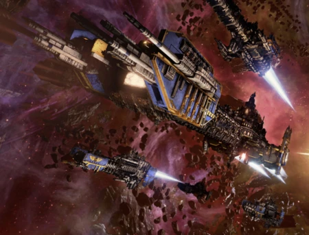

<!-- A0429-B0216 -->

原译文

Ultramarine Fleet 极限战士舰队

**校订译文**

Ultramarine Fleet 极限战士舰队

<!-- /A0429-B0216 -->

<!-- A0429-B0217 -->
### Shield Chapters of Ultramar 奥特拉玛之盾战团

<!-- /A0429-B0217 -->

<!-- A0429-B0218 -->
**英文原文**

Ultramarines - Macragge

<!-- /A0429-B0218 -->

<!-- A0429-B0219 -->

原译文

极限战士 - 马库拉格

**校订译文**

极限战士 - 马库拉格

<!-- /A0429-B0219 -->

<!-- A0429-B0220 -->
**英文原文**

Avenging Sons - Callimachus

<!-- /A0429-B0220 -->

<!-- A0429-B0221 -->

原译文

复仇之子 - 卡利马科斯

**校订译文**

复仇之子 - 卡利马科斯

<!-- /A0429-B0221 -->

<!-- A0429-B0222 -->
**英文原文**

Praetors of Ultramar - Howsbridge

<!-- /A0429-B0222 -->

<!-- A0429-B0223 -->

原译文

奥特拉玛执政 - 豪斯布里奇

**校订译文**

奥特拉玛执政官——豪斯布里奇。

<!-- /A0429-B0223 -->

<!-- A0429-B0224 -->

原译文

Scythes of the Emperor 帝皇之镰

**校订译文**

Scythes of the Emperor 帝皇之镰

<!-- /A0429-B0224 -->

<!-- A0429-B0225 -->

原译文

Sons of Orar 奥拉尔之子

**校订译文**

Sons of Orar 奥拉尔之子

<!-- /A0429-B0225 -->

<!-- A0429-B0226 -->

原译文

Novamarines 新星战士

**校订译文**

Novamarines 新星战士

<!-- /A0429-B0226 -->

<!-- A0429-B0227 -->

原译文

Doom Eagles 末日雄鹰

**校订译文**

Doom Eagles 末日天鹰

<!-- /A0429-B0227 -->

<!-- A0429-B0228 -->

原译文

Aquiloan Brotherhood 北方兄弟会

**校订译文**

Aquiloan Brotherhood 北方兄弟会

<!-- /A0429-B0228 -->

<!-- A0429-B0229 -->

原译文

Silver Skulls 银色颅骨

**校订译文**

Silver Skulls 银色颅骨

<!-- /A0429-B0229 -->

<!-- A0429-B0230 -->

原译文

Reborn 重生者

**校订译文**

Reborn 复生者

<!-- /A0429-B0230 -->

<!-- A0429-B0231 -->
**英文原文**

The worlds of Ultramar do not pay the usual tithes, instead contributing directly to the upkeep of the Ultramarines Chapter. Though the need has diminished since the days of the Legion, each world still provides the Chapter with new recruits. It is a point of pride for a family to have provided a recruit, especially among the older aristocratic families, with many communities proudly displaying statues of the Ultramarines who were born there. For a family that has provided a renowned hero or even Chapter Master, the considerable fame and honour such a distinction provides can last generations.

<!-- /A0429-B0231 -->

<!-- A0429-B0232 -->

原译文

奥特拉玛的世界不支付通常的什一税，而是直接为极限战士战团的维护做出贡献。尽管自军团时代以来，这种需求已经减少，但每个世界仍然为战团提供新兵。对于一个家庭来说，提供新兵是一种自豪，尤其是在年长的贵族家庭中，许多社会自豪地展示着出生在那里的极限战士的雕像。对于一个提供了著名英雄甚至战团长的家庭来说，这种区别所提供的相当大的名声和荣誉可以延续几代人。

**校订译文**

奥特拉玛各世界无须缴纳通常的什一税，而是直接承担极限战士战团的供养。虽然需求比军团时代有所减少，每颗星球仍会输送新兵。家族若有子弟入选，便视为荣耀，历史悠久的贵族世家尤其如此。许多地方都会骄傲地树立出身本地的极限战士雕像；若家族中诞生了著名英雄乃至战团长，这份声名与荣誉更能流传数代。

<!-- /A0429-B0232 -->

<!-- A0429-B0233 -->
**英文原文**

Each world also maintains their own Planetary Defence Force, a well-disciplined and equipped force known as the Ultramar Auxilia. These forces are similarly exempt from the tithe system; however, the efficiency and prosperity of Ultramar is such that several hundred regiments are maintained to join the Imperial Guard when needed. As a result, the regiments of Ultramar have fought all over the galaxy, often in campaigns alongside the Ultramarines themselves.

<!-- /A0429-B0233 -->

<!-- A0429-B0234 -->

原译文

每个世界都有自己的行星防御部队，一支纪律严明、装备精良的部队，被称为奥特拉玛辅助军。这些部队同样不受什一税制度的约束；然而，奥特拉玛的效率和繁荣使得数百个兵团得以在需要时加入帝国卫队。因此，奥特拉玛的兵团在整个银河系作战，经常与极限战士一起作战。

**校订译文**

各世界也维持自身的行星防御部队，统称“奥特拉玛辅助军”，纪律严明、装备精良。这些部队同样免于常规什一税征调。不过，奥特拉玛的富庶与高效仍足以维持数百个团，随时按需加入帝国卫队。因此，奥特拉玛部队征战银河各地，也常与极限战士并肩作战。

<!-- /A0429-B0234 -->

<!-- A0429-B0235 -->
**英文原文**

For space and orbital defences, Ultramar can rely not only on the fleet of the Ultramarines but also the Ultramar Defence Fleet, the naval counterpart of the Ultramar Auxilia. Meanwhile no fewer than six massive star fortresses – with Galatan being the largest – stand sentinel over shipping lanes and critical strategic positions, each a formidable bastion protected by void shields and possessed of enough firepower to destroy a moon.

<!-- /A0429-B0235 -->

<!-- A0429-B0236 -->

原译文

对于太空和轨道防御，奥特拉玛不仅可以依靠极限战士的舰队，还可以依靠奥特拉玛辅助军的海军对应，奥特拉玛防御舰队。与此同时，至少有六座巨大的星堡 — 加拉坦是最大的 — 在航道和关键战略位置上哨戒，每座都是由虚空盾保护的强大堡垒，拥有足够的火力摧毁卫星。

**校订译文**

太空与轨道防御方面，奥特拉玛除依靠极限战士舰队外，还有与奥特拉玛辅助军对应的海军力量——奥特拉玛防御舰队。至少六座巨型星堡镇守航路与战略要地，其中加拉坦最大。每座星堡都有虚空盾防护，火力足以摧毁一颗卫星。

<!-- /A0429-B0236 -->

<!-- A0429-B0237 -->
**英文原文**

Internal security and suppression of rebellion is overseen by the secretive agency known as the Vigil Opertii and Praecental Guard.

<!-- /A0429-B0237 -->

<!-- A0429-B0238 -->

原译文

内部安全和镇压叛乱由名为守秘人和执中守卫的秘密机构监督。

**校订译文**

内部安全和镇压叛乱由名为守秘人和执中守卫的秘密机构监督。

<!-- /A0429-B0238 -->

本篇核心术语与暂定项

以下列出本篇出现的英文原形及核心术语表用词。同形词可能指不同对象，具体词义以本篇正文和校注为准；单复数、别名和仅见于图注的名称可能尚未列入。完整候选见[术语表](../../术语表/双语术语候选.csv)。

| 英文 | 采用中文 | 状态 |
| --- | --- | --- |
| Space Marines | 星际战士 | 官方已核对 |
| Imperial Guard | 帝国卫队 | 暂定·语境区分 |
| World Eaters | 吞世者 | 官方已核对 |
| T'au Empire | 钛帝国 | 官方已核对 |
| Roboute Guilliman | 罗保特·基里曼 | 官方已核对 |
| Ultramar | 奥特拉玛 | 官方已核对 |
| Ultramarines | 极限战士 | 官方已核对 |
| Horus Heresy | 荷鲁斯之乱 | 官方已核对 |
| Astronomican | 星炬 | 暂定 |
| Imperium of Man | 人类帝国 | 官方已核对 |
| Imperium | 帝国 | 暂定·简称 |
| Nurgle | 纳垢 | 官方已核对 |
| Emperor | 帝皇 | 官方已核对 |
| Primarch | 原体 | 官方已核对 |
| Agri-World | 农业世界 | 暂定·官方待核 |
| Forge World | 铸造世界 | 暂定·官方待核 |
| Word Bearers | 怀言者 | 暂定·官方待核 |
| Black Legion | 黑色军团 | 暂定·官方待核 |
| Iron Warriors | 钢铁勇士 | 暂定·官方待核 |
| Great Crusade | 大远征 | 暂定·官方待核 |
| Mortarion | 莫塔里安 | 官方已核对 |
| Age of Strife | 纷争时代 | 暂定·官方待核 |
| Terra | 泰拉 | 暂定·官方待核 |
| Horus | 荷鲁斯 | 暂定·官方待核 |
| Fulgrim | 福格瑞姆 | 官方已核对 |
| Imperial Cult | 帝皇信仰 | 暂定·官方待核 |
| Plague Wars | 瘟疫战争 | 暂定·官方待核 |
| Ultima Segmentum | 极限星域 | 暂定·官方待核 |
| Segmentum | 星域 | 暂定·官方待核 |
| Sector | 星区 | 暂定·官方待核 |
| Eastern Fringe | 东部边缘 | 暂定·官方待核 |
| Low Gothic | 低哥特语 | 暂定·官方待核 |
| High Gothic | 高哥特语 | 暂定·官方待核 |
| Ichar IV | 伊卡尔四号 | 暂定·官方待核 |
| Konor | 康诺 | 暂定·官方待核 |
| Iax | 艾克斯 | 暂定·官方待核 |
| Quintarn | 昆坦 | 暂定·官方待核 |
| Masali | 马萨里 | 暂定·官方待核 |
| Espandor | 埃斯潘多 | 暂定·官方待核 |
| Calth | 考斯 | 暂定·官方待核 |
| Talasa Prime | 塔拉萨主星 | 暂定·官方待核 |
| Macragge | 马库拉格 | 暂定·官方待核 |
| Sotha | 索萨 | 暂定·官方待核 |
| Industrial Worlds | 工业世界 | 暂定·官方待核 |
| Imperium Secundus | 第二帝国 | 暂定·官方待核 |
| Warsmith | 战争铁匠 | 暂定·官方待核 |
| Cant Mechanicus | 机械之语 | 暂定·官方待核 |
| Master | 导师（审判庭职衔）／舰务官（舰员职务） | 语境定译·官方待核 |
| Cardinal | 红衣主教 | 暂定 |
| Vigil | 警戒团（静默修女编制）／警戒堡（红蝎空间站）／守夜星（行星） | 语境定译·官方待核 |
| First Captain | 第一连长 | 暂定·官方待核 |
| Space Marine | 星际战士 | 暂定·官方待核 |
| Chapter | 战团 | 暂定·官方待核 |
| Fortress-monastery | 要塞修道院 | 暂定·官方待核 |
| Chapter Master | 战团长 | 暂定·官方待核 |
| Captain | 连长 | 暂定·官方待核 |
| Marneus Calgar | 马涅乌斯·卡尔加 | 暂定·官方待核 |
| Cato Sicarius | 卡托·西卡留斯 | 暂定·官方待核 |
| Severus Agemman | 西弗勒斯·阿格曼 | 暂定·官方待核 |
| Uriel Ventris | 乌瑞尔·文崔斯 | 官方已核 |
| Doom Eagles | 末日天鹰 | 暂定·官方待核 |
| Genesis Chapter | 起源战团 | 暂定·官方待核 |
| Avenging Sons | 复仇之子 | 暂定·官方待核 |
| Praetors of Ultramar | 奥特拉玛执政官 | 暂定·官方待核 |
| Regent of Ultramar | 奥特拉玛摄政 | 暂定·官方待核 |
| High Suzerain of Ultramar | 奥特拉玛高领主 | 暂定·官方待核 |
| Decimus Felix | 德西穆斯·菲利克斯 | 暂定·官方待核 |
| Invaders | 侵略者 | 暂定·官方待核 |
| Reborn | 复生者（战团）／重生者（死神军自称） | 语境定译·官方待核 |
| Equerry | 近侍 | 暂定·官方待核 |
| Shadow Crusade | 暗影远征 | 暂定·官方待核 |
| T'au | 钛族 | 暂定·官方待核 |
| Tetrarch | 四方领主 | 暂定·官方待核 |
| Vigil Opertii | 守秘人 | 暂定·官方待核 |
| Praecental Guard | 执中守卫 | 暂定·官方待核 |
| Parmenio | 帕尔梅尼奥 | 暂定·官方待核 |
| Prandium | 普兰蒂姆 | 暂定·官方待核 |
| The Beast | 野兽 | 暂定·官方待核 |
| Vengeance | 复仇号 | 暂定·官方待核 |
| Battle of Calth | 考斯之战 | 暂定·官方待核 |
| Severus | 西弗勒斯 | 暂定·官方待核 |
| Realm of Ultramar | 奥特拉玛领地 | 暂定·官方待核 |
| Eucladus | 欧克拉德斯 | 暂定·官方待核 |
| Andermung | 安德蒙 | 暂定·官方待核 |
| Callimachus | 卡利马科斯 | 暂定·官方待核 |
| Howsbridge | 豪斯布里奇 | 暂定·官方待核 |
| Protos | 普鲁托斯 | 暂定·官方待核 |
| Talassar | 塔拉萨 | 暂定·官方待核 |
| Vespator | 维斯帕托 | 暂定·官方待核 |
| Armatura | 阿玛图拉 | 暂定·官方待核 |
| Master of Ultramar | 奥特拉玛之主 | 暂定·官方待核 |
| Tetrarch of Andermung | 安德蒙四方领主 | 暂定·官方待核 |
| Tetrarch of Protos | 普鲁托斯四方领主 | 暂定·官方待核 |
| Tetrarch of Vespator | 维斯帕托四方领主 | 暂定·官方待核 |
| Shield Chapters of Ultramar | 奥特拉玛之盾战团 | 暂定·官方待核 |
| Ruinstorm | 毁灭风暴 | 暂定·官方待核 |
| War in the Rift | 裂隙战争 | 暂定·官方待核 |
| System | 星系（恒星系统） | 暂定·官方待核 |
| Gantz | 甘茨 | 暂定·官方待核 |
| Cardinal World | 红衣主教世界 | 暂定·官方待核 |
| Garden World | 花园世界 | 暂定·官方待核 |
| Lord Defender of Greater Ultramar | 大奥特拉玛守护领主 | 暂定·官方待核 |
| Scourge Stars | 天灾群星 | 暂定·官方待核 |
| Honsou | 洪索 | 暂定·官方待核 |
| Terran Crusade | 泰拉远征 | 暂定·官方待核 |
| Sotharan League | 索萨兰联盟 | 暂定·官方待核 |
| Vengeance Campaigns | 复仇战役 | 暂定·官方待核 |
| Kraken | 克拉肯 | 暂定·官方待核 |

