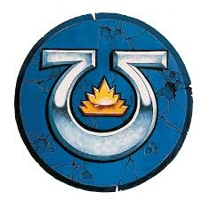

# 0430 马库拉格领主 Lord Macragge

精校状态：中文行文已逐段精校，部分术语仍为暂定

分类：通用概念 / 帝国 Imperium / 中央政务部 Adeptus Terra / 阿斯塔特修会 Adeptus Astartes

原文来源：https://www.bilibili.com/opus/1113194732217958421

原作者：帝国神选罐头

原文时间：2025年09月16日 20:04

[返回分类目录](目录.md) · [全书目录](../../目录.md)

<!-- A0430-B0001 -->
**英文原文**

Lord Macragge (or Lord of Macragge) is a title adopted by Roboute Guilliman, which is traditionally held by the Chapter Master of the Ultramarines Chapter. The Lord Macragge is the overall ruler of the stellar realm of Ultramar, including the world of Macragge.

<!-- /A0430-B0001 -->

<!-- A0430-B0002 -->

原译文

马库拉格领主（或马库拉格勋爵）是罗伯特·基里曼采用的头衔，传统上由极限战士战团的战团长持有。马库拉格领主是奥特拉玛群星王国的总统治者，包括马库拉格世界。

**校订译文**

马库拉格领主是罗保特·基里曼采用的头衔，英文也写作 Lord of Macragge。传统上，这一头衔由极限战士战团长持有，作为包括马库拉格在内的整个奥特拉玛星际领地的统治者。

**校注：** Lord Macragge 与 Lord of Macragge 是同一职衔的英文形式，不分别译成领主和勋爵。

<!-- /A0430-B0002 -->

<!-- A0430-B0003 图片 -->

<!-- A0430-B0004 -->

原译文

Symbol of the Lord Macragge 马库拉格领主的标志

**校订译文**

Symbol of the Lord Macragge 马库拉格领主的标志

<!-- /A0430-B0004 -->

<!-- A0430-B0005 -->
**英文原文**

Upon the return of Roboute Guilliman, he took on the title of Master of Ultramar but left Marneus Calgar the title of Lord Macragge.

<!-- /A0430-B0005 -->

<!-- A0430-B0006 -->

原译文

在罗伯特·基里曼回归后，他获得了奥特拉玛之主的称号，但让马涅乌斯·卡尔加获得了马库拉格领主的称号。

**校订译文**

罗保特·基里曼回归后，自任奥特拉玛之主，仍让马涅乌斯·卡尔加保有马库拉格领主的头衔。

<!-- /A0430-B0006 -->

<!-- A0430-B0007 -->
## Known Lords Macragge 著名马库拉格领主

<!-- /A0430-B0007 -->

<!-- A0430-B0008 -->
**英文原文**

Roboute Guilliman - Lord of Macragge during the Great Crusade and the Horus Heresy.

<!-- /A0430-B0008 -->

<!-- A0430-B0009 -->

原译文

罗伯特·基里曼 - 大远征和荷鲁斯叛乱期间的马库拉格领主。

**校订译文**

罗保特·基里曼——大远征及荷鲁斯之乱时期的马库拉格领主。

<!-- /A0430-B0009 -->

<!-- A0430-B0010 -->
**英文原文**

Decon - 3rd Lord Macragge during the Third Founding.

<!-- /A0430-B0010 -->

<!-- A0430-B0011 -->

原译文

德康 - 第三次建军期间的第三任马库拉格领主

**校订译文**

德康 - 第三次建军期间的第三任马库拉格领主

<!-- /A0430-B0011 -->

<!-- A0430-B0012 -->
**英文原文**

Agnathio - Lord Macragge in 646.M32.

<!-- /A0430-B0012 -->

<!-- A0430-B0013 -->

原译文

阿格纳西奥 - 646.M32的马库拉格领主

**校订译文**

阿格纳西奥 - 646.M32的马库拉格领主

<!-- /A0430-B0013 -->

<!-- A0430-B0014 -->
**英文原文**

Balthus Dardanus - 17th Lord Macragge.

<!-- /A0430-B0014 -->

<!-- A0430-B0015 -->

原译文

巴尔蒂斯·达尔达纽斯 - 第十七任马库拉格领主

**校订译文**

巴尔蒂斯·达尔达纽斯 - 第十七任马库拉格领主

<!-- /A0430-B0015 -->

<!-- A0430-B0016 -->
**英文原文**

Marneus Calgar - Current Lord Macragge.

<!-- /A0430-B0016 -->

<!-- A0430-B0017 -->

原译文

马涅乌斯·卡尔加 - 当前的马库拉格领主

**校订译文**

马涅乌斯·卡尔加 - 当前的马库拉格领主

<!-- /A0430-B0017 -->

本篇核心术语与暂定项

以下列出本篇出现的英文原形及核心术语表用词。同形词可能指不同对象，具体词义以本篇正文和校注为准；单复数、别名和仅见于图注的名称可能尚未列入。完整候选见[术语表](../../术语表/双语术语候选.csv)。

| 英文 | 采用中文 | 状态 |
| --- | --- | --- |
| Roboute Guilliman | 罗保特·基里曼 | 官方已核对 |
| Ultramar | 奥特拉玛 | 官方已核对 |
| Ultramarines | 极限战士 | 官方已核对 |
| Horus Heresy | 荷鲁斯之乱 | 官方已核对 |
| Great Crusade | 大远征 | 暂定·官方待核 |
| Horus | 荷鲁斯 | 暂定·官方待核 |
| Macragge | 马库拉格 | 暂定·官方待核 |
| Master | 导师（审判庭职衔）／舰务官（舰员职务） | 语境定译·官方待核 |
| Founding | 建军 | 暂定·官方待核 |
| Chapter | 战团 | 暂定·官方待核 |
| Chapter Master | 战团长 | 暂定·官方待核 |
| Marneus Calgar | 马涅乌斯·卡尔加 | 暂定·官方待核 |
| Third Founding | 第三次建军 | 暂定·官方待核 |
| Realm of Ultramar | 奥特拉玛领地 | 暂定·官方待核 |
| Master of Ultramar | 奥特拉玛之主 | 暂定·官方待核 |
| Decon | 德康 | 暂定·官方待核 |
| Agnathio | 阿格纳西奥 | 暂定·官方待核 |
| Balthus Dardanus | 巴尔蒂斯·达尔达纽斯 | 暂定·官方待核 |

