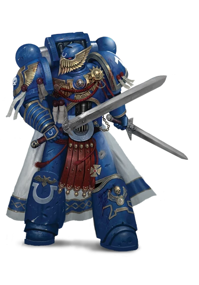
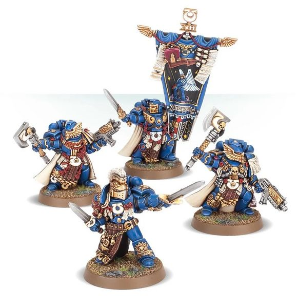

# 0432 极限战士荣誉卫队 Ultramarines Honour Guard

精校状态：中文行文已逐段精校，部分术语仍为暂定

分类：通用概念 / 帝国 Imperium / 中央政务部 Adeptus Terra / 阿斯塔特修会 Adeptus Astartes

原文来源：https://www.bilibili.com/opus/1036357896117420037

原作者：帝国神选罐头

原文时间：2025年02月21日 18:37

[返回分类目录](目录.md) · [全书目录](../../目录.md)

<!-- A0432-B0001 -->
**英文原文**

The Ultramarines Honour Guard is a highly elite group of Space Marines unique to the Ultramarines Chapter.

<!-- /A0432-B0001 -->

<!-- A0432-B0002 -->

原译文

极限战士荣誉卫队是极限战士战团独有的一支高度精英的星际战士。

**校订译文**

极限战士荣誉卫队是极限战士战团独有的一支星际战士精锐。

<!-- /A0432-B0002 -->

<!-- A0432-B0003 图片 -->

<!-- A0432-B0004 -->

原译文

Ultramarines Honour Guard 极限战士荣誉卫队

**校订译文**

Ultramarines Honour Guard 极限战士荣誉卫队

<!-- /A0432-B0004 -->

<!-- A0432-B0005 -->
## Overview 概述

<!-- /A0432-B0005 -->

<!-- A0432-B0006 -->
**英文原文**

In battle they act either as a group or as squad leaders. Each bears an Axe of Ultramar, potent weapons constructed from a rare metal found on Prandium. Only the most courageous of the Ultramarines ever come close to earning this honour, and then only some of them will achieve it. They are responsible for guarding the Chapter's ancient banner, the Banner of Macragge. Members of the Honour Guard are dispersed throughout the Chapter's companies. When the banner is taken into battle by a company, a squad will be formed from the company's Honour Guard members.

<!-- /A0432-B0006 -->

<!-- A0432-B0007 -->

原译文

在战斗中，他们要么作为一个团体，要么作为队长。每一个都有一把奥特拉玛之斧，这是一种由普兰迪乌姆上发现的稀有金属制成的强大武器。只有最勇敢的极限战士才能接近获得这一荣誉，而且只有他们中的一些人才能实现这一荣誉。他们负责守卫战团的古老旗帜，即马库拉格之旗。荣誉卫队成员分散在战团的各个连队中。当旗帜被一个连队投入战斗时，该连队的荣誉卫队成员将组成一个小队。

**校订译文**

战斗中，荣誉卫队成员可集体行动，也可担任各小队领队。每人持有一把奥特拉玛之斧，以普兰蒂姆出产的稀有金属制成，威力强大。只有最勇敢的极限战士才有望获此殊荣，而最终入选者更是凤毛麟角。他们负责守护战团古老的马库拉格之旗。荣誉卫队成员平时分布于各连；某连携战旗出征时，便由该连的荣誉卫队成员组成专门的小队。

<!-- /A0432-B0007 -->

<!-- A0432-B0008 -->
**英文原文**

Additionally, Honour Guard members may be seconded to the Deathwatch for brief tours to assist in missions concerning enemies of the Ultramarines in particular; such tasks may range in the number of Ultramarines sent from a single soldier to an entire strike force. Likewise, while most Ultramarine Honour Guards are sent to the Deathwatch for but a single operation, there are rare secondments that can extend to months, years or even decades.

<!-- /A0432-B0008 -->

<!-- A0432-B0009 -->

原译文

此外，荣誉卫队成员可能会被借调到死亡守望进行短暂的巡逻，以协助执行特别是与极限战士敌人有关的任务；这些任务的范围可能从单个士兵到整个打击部队派遣的极限战士的数量不等。同样，虽然大多数极限战士荣誉卫队只被派往死亡守望进行一次行动，但也有极少数借调人员可能长达数月、数年甚至数十年。

**校订译文**

荣誉卫队成员也可能短期借调到死亡守望，协助处理特别涉及极限战士宿敌的任务。派出人数可以少至一名战士，多至一整支打击部队。多数借调只持续一次行动，但极少数也可能延长至数月、数年，乃至数十年。

**校注：** tour 在借调军旅语境指一段服役期，非原译短暂巡逻。

<!-- /A0432-B0009 -->

<!-- A0432-B0010 图片 -->

<!-- A0432-B0011 -->

原译文

Ultramarines Honour Guard 极限战士荣誉卫队

**校订译文**

Ultramarines Honour Guard 极限战士荣誉卫队

<!-- /A0432-B0011 -->

<!-- A0432-B0012 -->
**英文原文**

In battle, the Honour Guard Squad numbers between two and seven Honour Guards as well as the Chapter Ancient (Bearer of the Chapter Banner) and the Chapter Champion. They are armed with bolters, Axes of Ultramar, frags and krak grenades. The Chapter Ancient is the bearer of the sacred Banner of Macragge and is entrusted with a suit of Artificer Armour. The Champion is equipped with Powered weapons and artificer armour. They may be mounted in a Rhino, Razorback or Land Raider. They may also replace a single unit in a Command, Tactical or Devastator Squad.

<!-- /A0432-B0012 -->

<!-- A0432-B0013 -->

原译文

在战斗中，荣誉卫队的人数在两到七名荣誉卫队之间，还有战团旗手（战团持旗者）和战团冠军。他们装备了爆矢枪、奥特拉玛之斧、破片和穿甲手榴弹。战团旗手是神圣的马库拉格之旗的持有者，并被赋予了一套精工盔甲。冠军装备有动力武器和精工盔甲。他们可以配备犀牛装甲车、豪猪战车或兰德掠袭者上。它们也可能取代指挥、战术或毁灭小队中的单个单位。

**校订译文**

作战时，一支荣誉卫队小队通常包括两至七名荣誉卫士，另加战团旗手与战团冠军。他们装备爆矢枪、奥特拉玛之斧、破片手榴弹与穿甲手榴弹。战团旗手负责擎举神圣的马库拉格之旗，并获配精工护甲；战团冠军则使用动力武器与精工护甲。小队可乘坐犀牛战车、豪猪战车或兰德掠袭者。荣誉卫士也可替换指挥小队、战术小队或破坏者小队中的一名成员。

**校注：** 英文最后一句 single unit 处于单名荣誉卫士替代小队成员的编制语境，暂按单名成员理解；不将一名士兵写成替代整支小队。

<!-- /A0432-B0013 -->

<!-- A0432-B0014 -->
## Notable Honour Guard 著名荣誉卫队

<!-- /A0432-B0014 -->

<!-- A0432-B0015 -->
**英文原文**

Commander of the Guard Aloysius — sacrificed his life to single-handily hold back the Swarmlord and its attending Tyrant Guard at Cold Steel Ridge during the Battle for Macragge to allow Marneus Calgar, gravely wounded by the Swarmlord, to be evacuated off-world by the rest of his Honour Guard.

<!-- /A0432-B0015 -->

<!-- A0432-B0016 -->

原译文

卫队指挥官阿洛伊修斯 — 牺牲了自己的生命，在马库拉格之战中单枪匹马地在冷钢岭阻止了虫群领主及其随行的暴君卫队，马涅乌斯·卡尔加被虫群领主重伤，由他的荣誉卫队其他成员协助撤离世界。

**校订译文**

卫队指挥官阿洛伊修斯——马库拉格之战中，他在冷钢岭独力阻挡虫群领主及其随行的暴君卫队，最终牺牲。正是他的断后，使其他荣誉卫队成员得以带着遭虫群领主重创的马涅乌斯·卡尔加撤离行星。

<!-- /A0432-B0016 -->

本篇核心术语与暂定项

以下列出本篇出现的英文原形及核心术语表用词。同形词可能指不同对象，具体词义以本篇正文和校注为准；单复数、别名和仅见于图注的名称可能尚未列入。完整候选见[术语表](../../术语表/双语术语候选.csv)。

| 英文 | 采用中文 | 状态 |
| --- | --- | --- |
| Space Marines | 星际战士 | 官方已核对 |
| Deathwatch | 死亡守望 | 官方已核对 |
| Ultramar | 奥特拉玛 | 官方已核对 |
| Ultramarines | 极限战士 | 官方已核对 |
| Macragge | 马库拉格 | 暂定·官方待核 |
| Land Raider | 兰德掠袭者战车 | 官方已核对 |
| Chapter Champion | 战团冠军 | 暂定·官方待核 |
| Chapter Ancient | 战团旗手 | 暂定·官方待核 |
| Ancient | 旗手 | 官方已核对 |
| Rhino | 犀牛战车 | 官方已核对 |
| Razorback | 豪猪战车 | 官方已核对 |
| Devastator Squad | 破坏者小队 | 官方已核对 |
| Honour Guard | 荣誉卫队 | 暂定·官方待核 |
| Champion | 冠军 | 暂定·官方待核 |
| Krak Grenades | 穿甲手榴弹 | 暂定·官方待核 |
| Chapter | 战团 | 暂定·官方待核 |
| Devastator | 破坏者 | 暂定·官方待核 |
| Marneus Calgar | 马涅乌斯·卡尔加 | 暂定·官方待核 |
| Artificer | 技工 | 暂定·官方待核 |
| Prandium | 普兰蒂姆 | 暂定·官方待核 |
| Raider | 掠袭者飞艇 | 官方已核对 |
| The Swarmlord | 虫群领主 | 官方已核对 |
| Banner of Macragge | 马库拉格之旗 | 暂定·官方待核 |
| Ultramarines Honour Guard | 极限战士荣誉卫队 | 暂定·官方待核 |
| Artificer Armour | 精工盔甲 | 暂定·官方待核 |

