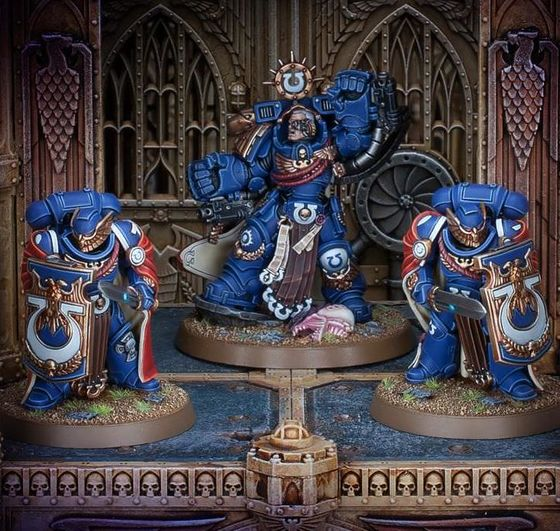
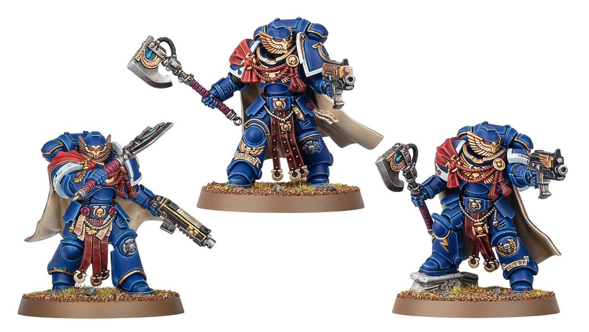

# 0434 常胜卫队 Victrix Guard

精校状态：中文行文已逐段精校，部分术语仍为暂定

分类：通用概念 / 帝国 Imperium / 中央政务部 Adeptus Terra / 阿斯塔特修会 Adeptus Astartes

原文来源：https://www.bilibili.com/opus/1113572732291776513

原作者：帝国神选罐头

原文时间：2025年09月17日 20:30

[返回分类目录](目录.md) · [全书目录](../../目录.md)

<!-- A0434-B0001 -->
**英文原文**

The Victrix Guard is a group of veteran warriors within the Ultramarines Chapter.

<!-- /A0434-B0001 -->

<!-- A0434-B0002 -->

原译文

常胜卫队是极限战士战团的一群老兵战士。

**校订译文**

常胜卫队由极限战士战团的老兵组成。

<!-- /A0434-B0002 -->

<!-- A0434-B0003 图片 -->

<!-- A0434-B0004 -->

原译文

The Victrix Guard defend Chapter Master Marneus Calgar, during the War of Beasts 在野兽战争期间，常胜卫队保卫战团长马涅乌斯·卡尔加

**校订译文**

The Victrix Guard defend Chapter Master Marneus Calgar, during the War of Beasts 常胜卫队在野兽之战中保护战团长马涅乌斯·卡尔加

<!-- /A0434-B0004 -->

<!-- A0434-B0005 -->
## Overview 概述

<!-- /A0434-B0005 -->

<!-- A0434-B0006 -->
**英文原文**

The Victrix Guard was created by the Primarch Guilliman following his rebirth and each has been hand-picked by him to act as bodyguards and envoys. Guilliman has declared them to be as much statesmen as warriors and because of this, the Victrix Guard seek to excel in every aspect of statecraft and battle alike. As such, their tactical skill is matched only by their martial prowess and the members of the Victrix Guard are more than capable of cutting their way through entire armies of foes.

<!-- /A0434-B0006 -->

<!-- A0434-B0007 -->

原译文

常胜卫队是由原体基里曼在重生后创建的，每个人都是他亲自挑选的护卫和使者。基里曼宣称他们既是战士，也是政治家，因此，常胜卫队在治国方略和战斗的各个方面都力求出类拔萃。因此，他们的战术技能能与他们的军事实力相媲美，而常胜卫队的成员完全有能力在整个敌军中穿行。

**校订译文**

基里曼原体复苏后建立了常胜卫队，亲自挑选每位成员，让他们担任护卫与使者。他明确要求这些人既是战士，也是治国之才，因此卫队在军事与政务的各个方面都力求卓越。他们的战术素养与武艺同样出众，足以在敌军重围中杀出一条血路。

<!-- /A0434-B0007 -->

<!-- A0434-B0008 -->
## Known Battles 著名战斗

<!-- /A0434-B0008 -->

<!-- A0434-B0009 -->

原译文

Indomitus Crusade 不屈远征

**校订译文**

Indomitus Crusade 不屈远征

<!-- /A0434-B0009 -->

<!-- A0434-B0010 -->

原译文

Pariah Crusade 帕里亚远征

**校订译文**

Pariah Crusade 被遗弃者远征

<!-- /A0434-B0010 -->

<!-- A0434-B0011 -->

原译文

War of Beasts 野兽战争

**校订译文**

War of Beasts 野兽之战

<!-- /A0434-B0011 -->

<!-- A0434-B0012 -->

原译文

Plague Wars 瘟疫战争

**校订译文**

Plague Wars 瘟疫战争

<!-- /A0434-B0012 -->

<!-- A0434-B0013 -->
## Wargear 战备

<!-- /A0434-B0013 -->

<!-- A0434-B0014 -->
**英文原文**

The Victrix Guard wear ornate and decorated Power Armour and carry Storm Shields and Power Swords to battle.

<!-- /A0434-B0014 -->

<!-- A0434-B0015 -->

原译文

常胜卫队穿着华丽装饰的动力盔甲，携带风暴盾和动力剑参加战斗。

**校订译文**

常胜卫队穿着华丽装饰的动力盔甲，携带风暴盾和动力剑参加战斗。

<!-- /A0434-B0015 -->

<!-- A0434-B0016 图片 -->

<!-- A0434-B0017 -->

原译文

Victrix Honour Guard 常胜荣誉卫队

**校订译文**

Victrix Honour Guard 常胜荣誉卫队

<!-- /A0434-B0017 -->

<!-- A0434-B0018 -->
## Known Members 著名成员

<!-- /A0434-B0018 -->

<!-- A0434-B0019 -->
**英文原文**

Captain Cato Sicarius - Commander

<!-- /A0434-B0019 -->

<!-- A0434-B0020 -->

原译文

连长卡托·西卡留斯 - 指挥官

**校订译文**

连长卡托·西卡留斯 - 指挥官

<!-- /A0434-B0020 -->

<!-- A0434-B0021 -->

原译文

Lethro Ados 莱斯罗·阿多斯

**校订译文**

Lethro Ados 莱斯罗·阿多斯

<!-- /A0434-B0021 -->

<!-- A0434-B0022 -->

原译文

Nemus Adranus 尼穆斯·阿德兰努斯

**校订译文**

Nemus Adranus 尼穆斯·阿德兰努斯

<!-- /A0434-B0022 -->

<!-- A0434-B0023 -->

原译文

Dibus 狄巴斯

**校订译文**

Dibus 狄巴斯

<!-- /A0434-B0023 -->

<!-- A0434-B0024 -->

原译文

Trismerus Gerorian 特瑞斯墨斯·杰罗里安

**校订译文**

Trismerus Gerorian 特瑞斯墨斯·杰罗里安

<!-- /A0434-B0024 -->

<!-- A0434-B0025 -->

原译文

Macullus 马库卢斯

**校订译文**

Macullus 马库卢斯

<!-- /A0434-B0025 -->

<!-- A0434-B0026 -->

原译文

Issoros Praernon 伊索罗斯·普瑞尔农

**校订译文**

Issoros Praernon 伊索罗斯·普瑞尔农

<!-- /A0434-B0026 -->

<!-- A0434-B0027 -->

原译文

Morvio Tarilis 莫维奥·塔瑞利斯

**校订译文**

Morvio Tarilis 莫维奥·塔瑞利斯

<!-- /A0434-B0027 -->

<!-- A0434-B0028 -->

原译文

Tierinus 蒂耶努斯

**校订译文**

Tierinus 蒂耶努斯

<!-- /A0434-B0028 -->

本篇核心术语与暂定项

以下列出本篇出现的英文原形及核心术语表用词。同形词可能指不同对象，具体词义以本篇正文和校注为准；单复数、别名和仅见于图注的名称可能尚未列入。完整候选见[术语表](../../术语表/双语术语候选.csv)。

| 英文 | 采用中文 | 状态 |
| --- | --- | --- |
| Ultramarines | 极限战士 | 官方已核对 |
| Primarch | 原体 | 官方已核对 |
| Power Armour | 动力盔甲 | 暂定·官方待核 |
| Chapter | 战团 | 暂定·官方待核 |
| Captain | 连长 | 暂定·官方待核 |
| Veteran | 老兵 | 暂定·官方待核 |
| Cato Sicarius | 卡托·西卡留斯 | 暂定·官方待核 |
| Victrix Guard | 常胜卫队 | 暂定·官方待核 |

