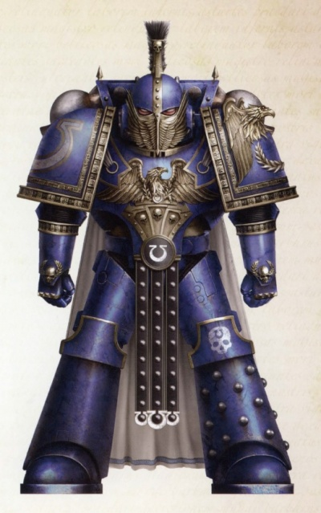
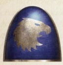
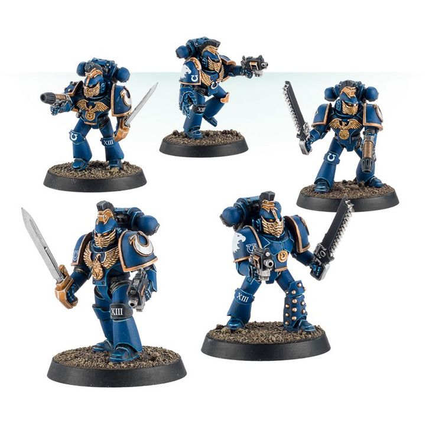
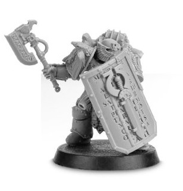

# 0435 常胜军 Invictarii

精校状态：中文行文已逐段精校，部分术语仍为暂定

分类：通用概念 / 帝国 Imperium / 中央政务部 Adeptus Terra / 阿斯塔特修会 Adeptus Astartes

原文来源：https://www.bilibili.com/opus/1025142606926970914

原作者：帝国神选罐头

原文时间：2025年01月22日 13:16

[返回分类目录](目录.md) · [全书目录](../../目录.md)

<!-- A0435-B0001 -->
**英文原文**

The Invictarii was an elite sub-formation of the Ultramarines during the Great Crusade and Horus Heresy.

<!-- /A0435-B0001 -->

<!-- A0435-B0002 -->

原译文

常胜军是大远征和荷鲁斯叛乱期间极限战士的精英小队。

**校订译文**

常胜军是大远征及荷鲁斯之乱时期极限战士的一支精锐分支部队。

<!-- /A0435-B0002 -->

<!-- A0435-B0003 图片 -->

<!-- A0435-B0004 -->

原译文

Invictarii Centurion 常胜军百夫长

**校订译文**

Invictarii Centurion 常胜军百夫长

<!-- /A0435-B0004 -->

<!-- A0435-B0005 -->
## Overview 概述

<!-- /A0435-B0005 -->

<!-- A0435-B0006 -->
**英文原文**

The ranks of the Invictarii were made up of the finest warriors of the Legion and many future Ultramarines officers were drawn from its members. Selection into the unit was seen as a mark of a potential future in high command. Their Legatine Axes were once symbols of the battle-kings of Macragge.

<!-- /A0435-B0006 -->

<!-- A0435-B0007 -->

原译文

常胜军的队伍由军团中最优秀的战士组成，许多未来的极限战士军官都是从其成员中挑选出来的。被选入该部队被视为未来可能担任高级指挥官的标志。他们的使节之斧曾经是马库拉格战斗之王的象征。

**校订译文**

常胜军由军团最优秀的战士组成，许多后来的极限战士军官都出自其行列。入选常胜军，意味着有望日后跻身高级指挥层。他们所用的统帅之斧，曾是马库拉格诸武王的权力象征。

**校注：** Legatine 为 Legate 职衔的形容词，参照本稿军团统帅暂译统帅之斧；原“使节之斧”容易误指外交使者。

<!-- /A0435-B0007 -->

<!-- A0435-B0008 图片 -->

<!-- A0435-B0009 -->

原译文

Symbol of the Invictarii 常胜军的标志

**校订译文**

Symbol of the Invictarii 常胜军的标志

<!-- /A0435-B0009 -->

<!-- A0435-B0010 -->
**英文原文**

Outside of the Suzerain forces, members of the Invictarii could also be found in limited numbers spread out through the Legion's veteran units and various sub-stratas of command (although by number only a fraction of all veterans, officers or sergeants ranked amongst them ) gaining further battlefield experience and honing their skills by field command.

<!-- /A0435-B0010 -->

<!-- A0435-B0011 -->

原译文

在宗主部队之外，常胜军的成员也可以在军团的老兵部队和各种指挥下级部队中找到有限的数量（尽管从数量上看，只有一小部分老兵、军官或军士在其中），他们通过战地指挥获得了进一步的战场经验并磨练了技能。

**校订译文**

除宗主部队外，也有少量常胜军成员分布于军团老兵单位及不同层级的指挥岗位，通过实战指挥继续积累经验、磨练技艺。不过，在所有老兵、军官和军士中，具有常胜军身份者仅占一小部分。

<!-- /A0435-B0011 -->

<!-- A0435-B0012 图片 -->

<!-- A0435-B0013 -->

原译文

Ultramarines Invictarii 极限战士常胜军

**校订译文**

Ultramarines Invictarii 极限战士常胜军

<!-- /A0435-B0013 -->

<!-- A0435-B0014 -->
## Suzerain Invictarus 宗主常胜军

<!-- /A0435-B0014 -->

<!-- A0435-B0015 -->
**英文原文**

Its most famous sub-formation was the Suzerain Invictarus. These warriors acted elite honor guard of the four Tetrarchs of Ultramar and best symbolized the ideals of Roboute Guilliman. The Suzerain Invictarus functioned as both a military force and arbiters of law for the populations they oversaw. The individual size of Suzerain Invictarus units varied, with Tetrarch Stolos Amyntas maintaing thousands as feared peacekeepers on Iax while Tetrarch Eikos Lamiad had but 100 in his personal guard.

<!-- /A0435-B0015 -->

<!-- A0435-B0016 -->

原译文

它最著名的亚种是宗主常胜军。这些战士充当了奥特拉玛四英杰的精英荣誉卫队，最能象征罗伯特·基里曼的理想。宗主常胜军既是一支军事力量，也是他们所监督的人口的法律仲裁者。宗主常胜军部队的个体规模各不相同，英杰斯托洛斯·阿明塔斯在亚克斯上留下了数千名令人畏惧的和平守卫，而英杰埃科斯·拉米亚德的个人卫队只有100人。

**校订译文**

常胜军最著名的下属部队是宗主常胜军。他们担任奥特拉玛四位四方领主的精锐荣誉卫队，最能体现罗保特·基里曼的理想。他们既是战斗部队，也负责在辖区民众间执法裁断。各支宗主常胜军规模差异很大：四方领主斯托洛斯·阿明塔斯在艾克斯保有数千名令人敬畏的治安卫士，而四方领主埃科斯·拉米亚德的私人卫队只有100人。

**校注：** sub-formation 指下属编制，不是生物分类上的亚种。Iax 与前文统一艾克斯，原亚克斯。

<!-- /A0435-B0016 -->

<!-- A0435-B0017 图片 -->

<!-- A0435-B0018 -->

原译文

Suzerain Invictarus with Legatine Axe and Boarding Shield 装备使节之斧和跳帮盾的宗主常胜军

**校订译文**

Suzerain Invictarus with Legatine Axe and Boarding Shield 手持统帅之斧与跳帮盾的宗主常胜军

<!-- /A0435-B0018 -->

<!-- A0435-B0019 -->
## Notable Members 著名成员

<!-- /A0435-B0019 -->

<!-- A0435-B0020 -->
**英文原文**

Drakus Gorod — Commander of the Invictus during the Horus Heresy

<!-- /A0435-B0020 -->

<!-- A0435-B0021 -->

原译文

德拉克斯·戈罗德 — 荷鲁斯叛乱期间常胜军指挥官

**校订译文**

德拉克斯·戈罗德 — 荷鲁斯之乱期间常胜军指挥官

**校注：** 本条英文写 Invictus，而全篇组织名为 Invictarii，相关部队另有 Invictarus；保留英文异写，中文依本条上下文仍作常胜军。

<!-- /A0435-B0021 -->

<!-- A0435-B0022 -->
**英文原文**

Maglios — Lieutenant

<!-- /A0435-B0022 -->

<!-- A0435-B0023 -->

原译文

马格洛斯 — 副官

**校订译文**

马格洛斯 — 副官

<!-- /A0435-B0023 -->

<!-- A0435-B0024 -->

原译文

Tacitun Ullitor 塔西顿·尤利托

**校订译文**

Tacitun Ullitor 塔西顿·尤利托

<!-- /A0435-B0024 -->

本篇核心术语与暂定项

以下列出本篇出现的英文原形及核心术语表用词。同形词可能指不同对象，具体词义以本篇正文和校注为准；单复数、别名和仅见于图注的名称可能尚未列入。完整候选见[术语表](../../术语表/双语术语候选.csv)。

| 英文 | 采用中文 | 状态 |
| --- | --- | --- |
| Roboute Guilliman | 罗保特·基里曼 | 官方已核对 |
| Ultramar | 奥特拉玛 | 官方已核对 |
| Ultramarines | 极限战士 | 官方已核对 |
| Horus Heresy | 荷鲁斯之乱 | 官方已核对 |
| Great Crusade | 大远征 | 暂定·官方待核 |
| Horus | 荷鲁斯 | 暂定·官方待核 |
| Iax | 艾克斯 | 暂定·官方待核 |
| Macragge | 马库拉格 | 暂定·官方待核 |
| Lieutenant | 副官 | 暂定·官方待核 |
| Veteran | 老兵 | 暂定·官方待核 |
| Tetrarch | 四方领主 | 暂定·官方待核 |
| Invictarii | 常胜军 | 暂定·官方待核 |
| Suzerain Invictarus | 宗主常胜军 | 暂定·官方待核 |
| Drakus Gorod | 德拉克斯·戈罗德 | 暂定·官方待核 |
| Maglios | 马格洛斯 | 暂定·官方待核 |
| Eikos Lamiad | 艾科斯·拉米亚德 | 暂定·官方待核 |

