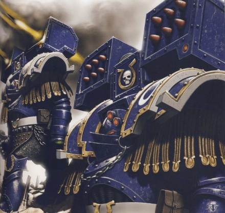

# 0436 辉脊 Fulmentarus

精校状态：中文行文已逐段精校，部分术语仍为暂定

分类：通用概念 / 帝国 Imperium / 中央政务部 Adeptus Terra / 阿斯塔特修会 Adeptus Astartes

原文来源：https://www.bilibili.com/opus/1023297896971239463

原作者：帝国神选罐头

原文时间：2025年01月17日 13:58

[返回分类目录](目录.md) · [全书目录](../../目录.md)

<!-- A0436-B0001 -->
**英文原文**

Fulmentarus were specialized Terminators used by the Ultramarines during the Great Crusade and Horus Heresy.

<!-- /A0436-B0001 -->

<!-- A0436-B0002 -->

原译文

辉脊是在大远征和荷鲁斯叛乱期间被极限战士使用的特殊终结者。

**校订译文**

辉脊是大远征及荷鲁斯之乱时期极限战士使用的一种专门化终结者部队。

<!-- /A0436-B0002 -->

<!-- A0436-B0003 图片 -->

<!-- A0436-B0004 -->

原译文

Fulmentarus Squad 辉脊小队

**校订译文**

Fulmentarus Squad 辉脊小队

<!-- /A0436-B0004 -->

<!-- A0436-B0005 -->
**英文原文**

Developed by Roboute Guilliman as a refinement of the Tyrant Siege Terminators used by his brother Perturabo, the Fulmentarus were equipped with Cataphractii Pattern Terminator Armour with special systems to allow for them to target their weapons in a highly coordinated fashion. When combining their targeting systems with Reaper Autocannons and Cyclone Missile Launchers first seen on their Iron Warriors counterparts, Fulmentarus squads were fearsome in a heavy assault role.

<!-- /A0436-B0005 -->

<!-- A0436-B0006 -->

原译文

由罗伯特·基里曼开发，作为其兄弟佩图拉博使用的暴君攻城终结者的改进，辉脊配备了带有特殊系统的铁骑型终结者盔甲，使他们能够以高度协调的方式令武器瞄准。当他们的瞄准系统与收割者自动炮和旋风导弹发射器相结合时，辉脊小队在重型突击任务中表现得非常可怕。

**校订译文**

罗保特·基里曼以兄弟佩图拉博麾下的暴君攻城终结者为基础，加以改良，建立了辉脊部队。他们穿戴铁骑型终结者护甲，内置专门系统，可让整个小队高度协同地瞄准射击。将这些瞄准系统与最先用于钢铁勇士同类部队的收割者自动炮、旋风导弹发射器相结合后，辉脊小队便成为重型突击作战中令人畏惧的力量。

<!-- /A0436-B0006 -->

本篇核心术语与暂定项

以下列出本篇出现的英文原形及核心术语表用词。同形词可能指不同对象，具体词义以本篇正文和校注为准；单复数、别名和仅见于图注的名称可能尚未列入。完整候选见[术语表](../../术语表/双语术语候选.csv)。

| 英文 | 采用中文 | 状态 |
| --- | --- | --- |
| Terminator | 终结者 | 官方已核对 |
| Roboute Guilliman | 罗保特·基里曼 | 官方已核对 |
| Ultramarines | 极限战士 | 官方已核对 |
| Horus Heresy | 荷鲁斯之乱 | 官方已核对 |
| Iron Warriors | 钢铁勇士 | 暂定·官方待核 |
| Great Crusade | 大远征 | 暂定·官方待核 |
| Horus | 荷鲁斯 | 暂定·官方待核 |
| Terminators | 终结者 | 暂定·官方待核 |
| Brother | 修士 | 暂定·官方待核 |
| Missile Launchers | 导弹发射器 | 暂定·官方待核 |
| Reaper | 收割者号 | 暂定·官方待核 |
| Terminator Armour | 终结者盔甲 | 暂定·官方待核 |
| Cataphractii Pattern | 铁骑型 | 暂定·官方待核 |

