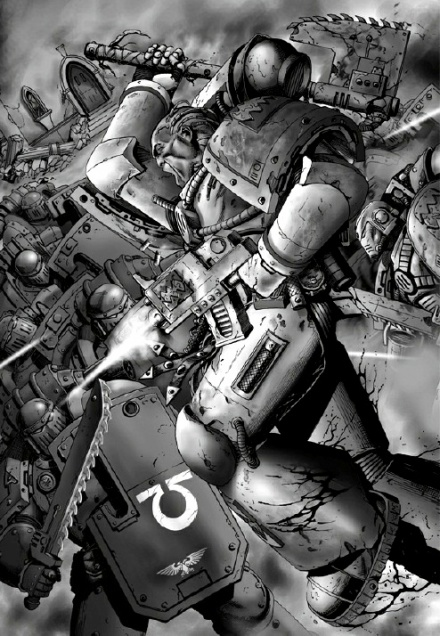

# 0437 后备军 Evocati

精校状态：中文行文已逐段精校，部分术语仍为暂定

分类：通用概念 / 帝国 Imperium / 中央政务部 Adeptus Terra / 阿斯塔特修会 Adeptus Astartes

原文来源：https://www.bilibili.com/opus/1022838571694817283

原作者：帝国神选罐头

原文时间：2025年01月16日 08:16

[返回分类目录](目录.md) · [全书目录](../../目录.md)

<!-- A0437-B0001 -->
**英文原文**

The Evocati were a division of the Ultramarines during the Great Crusade and Horus Heresy.

<!-- /A0437-B0001 -->

<!-- A0437-B0002 -->

原译文

后备军是大远征和荷鲁斯叛乱时期极限战士的一种军队。

**校订译文**

后备军是大远征及荷鲁斯之乱时期极限战士军团的一个分支。

<!-- /A0437-B0002 -->

<!-- A0437-B0003 图片 -->

<!-- A0437-B0004 -->

原译文

The Evocati battle World Eaters during the Horus Heresy 在荷鲁斯叛乱期间后备军与吞世者作战

**校订译文**

The Evocati battle World Eaters during the Horus Heresy 在荷鲁斯之乱期间后备军与吞世者作战

<!-- /A0437-B0004 -->

<!-- A0437-B0005 -->
**英文原文**

Comprised of two double-strength Chapters composed of both raw Neophytes and hardened veterans, these warriors were charged with the high honour of overseeing the defence of the Ultramar base of Armatura and training new recruits. Due to their defensive role, they commanded the strongest Imperial fleet in Ultramar.

<!-- /A0437-B0005 -->

<!-- A0437-B0006 -->

原译文

由两个双倍兵力的战团组成，其中既有初出茅庐的新手，也有经验丰富的老兵，这些战士肩负着光荣的使命，负责监督奥特拉玛和阿玛图拉的基地的防御并训练新兵。由于他们的防御职责，他们指挥着奥特拉玛地区最强大的帝国舰队。

**校订译文**

后备军由两个双倍兵力的战团组成，成员既有初入门的新兵，也有久经沙场的老兵。他们肩负守卫奥特拉玛军事基地阿玛图拉、训练新兵的重任，这被视为崇高荣誉。为履行防御职责，他们还指挥着奥特拉玛境内最强大的帝国舰队。

**校注：** Ultramar base of Armatura 指位于阿玛图拉的奥特拉玛基地，原译错误拆为奥特拉玛和阿玛图拉两处基地。

<!-- /A0437-B0006 -->

<!-- A0437-B0007 -->
**英文原文**

During the Shadow Crusade and in particular the Battle of Armatura, the Evocati took heavy losses against the Word Bearers and World Eaters.

<!-- /A0437-B0007 -->

<!-- A0437-B0008 -->

原译文

在暗影远征，特别是阿玛图拉战役中，后备军在与怀言者和吞世者的战斗中遭受了重大损失。

**校订译文**

在暗影远征，特别是阿玛图拉战役中，后备军在与怀言者和吞世者的战斗中遭受了重大损失。

<!-- /A0437-B0008 -->

本篇核心术语与暂定项

以下列出本篇出现的英文原形及核心术语表用词。同形词可能指不同对象，具体词义以本篇正文和校注为准；单复数、别名和仅见于图注的名称可能尚未列入。完整候选见[术语表](../../术语表/双语术语候选.csv)。

| 英文 | 采用中文 | 状态 |
| --- | --- | --- |
| World Eaters | 吞世者 | 官方已核对 |
| Ultramar | 奥特拉玛 | 官方已核对 |
| Ultramarines | 极限战士 | 官方已核对 |
| Horus Heresy | 荷鲁斯之乱 | 官方已核对 |
| Imperial Fleet | 帝国舰队 | 暂定 |
| Word Bearers | 怀言者 | 暂定·官方待核 |
| Great Crusade | 大远征 | 暂定·官方待核 |
| Horus | 荷鲁斯 | 暂定·官方待核 |
| Shadow Crusade | 暗影远征 | 暂定·官方待核 |
| Armatura | 阿玛图拉 | 暂定·官方待核 |

