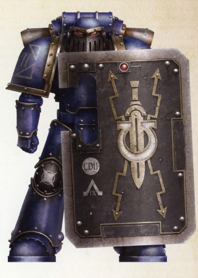
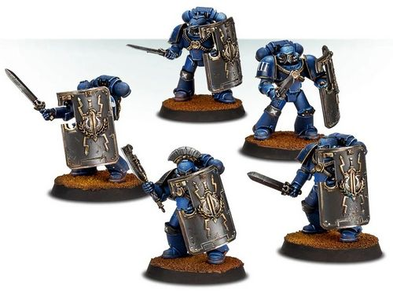

# 0439 禁卫军攻坚者 Praetorian Breacher

精校状态：中文行文已逐段精校，部分术语仍为暂定

分类：通用概念 / 帝国 Imperium / 中央政务部 Adeptus Terra / 阿斯塔特修会 Adeptus Astartes

原文来源：https://www.bilibili.com/opus/1031413924903256081

原作者：帝国神选罐头

原文时间：编辑于 2025年02月08日 14:41

[返回分类目录](目录.md) · [全书目录](../../目录.md)

原篇名：禁卫军破坏者 Praetorian Breacher

<!-- A0439-B0001 -->
**英文原文**

Praetorian Breacher Squads were a type of Breacher Squad variation used by the Ultramarines Legion during the Great Crusade and Horus Heresy.

<!-- /A0439-B0001 -->

<!-- A0439-B0002 -->

原译文

禁卫军破坏者小队是一种在大远征和荷鲁斯叛乱期间被极限战士军团使用的破坏者小队变体。

**校订译文**

禁卫军攻坚小队，是大远征及荷鲁斯之乱时期极限战士军团的一种攻坚小队变体。

<!-- /A0439-B0002 -->

<!-- A0439-B0003 图片 -->

<!-- A0439-B0004 -->

原译文

Ultramarines Breacher Marine Varinius 极限战士破坏者战士瓦里尼乌斯

**校订译文**

Ultramarines Breacher Marine Varinius 极限战士攻坚者瓦里尼乌斯

<!-- /A0439-B0004 -->

<!-- A0439-B0005 -->
**英文原文**

As the Ultramarines placed a high value on shield-equipped units, the elite Praetorians of the Legion were further equipped with Power Weapons. They eschewed the ranged power of the Bolter and instead focused on close combat. Praetorian squads were often assigned to shipboard security detail as well as rapid counter-boarding actions. In ground operations, they acted as the anvil upon which the enemy would be pinned in order for mobile Legion elements to outmanoeuvre and destroy them. Relentless in their advance and immovable in their defence, the Veterans of Praetorian Breacher Squads won countless battle honours over the Crusade.

<!-- /A0439-B0005 -->

<!-- A0439-B0006 -->

原译文

由于极限战士高度重视装备盾牌的部队，军团的精英禁卫军进一步配备了动力武器。他们回避了爆矢的远程力量，而是专注于近距离战斗。禁卫军小队经常被分配到船上局部安保以及快速的反跳帮行动。在地面作战中，他们充当了铁砧，敌人将被钉在铁砧上，以便移动的军团成员能技高一筹的摧毁他们。在大远征中，禁卫军破坏者小队的老兵在前进和防御方面毫不留情，赢得了无数的战斗荣誉。

**校订译文**

极限战士格外重视持盾部队，因此又为精锐禁卫军配备动力武器。他们舍弃爆矢枪的远程火力，专攻近战，常负责舰内警戒及快速反跳帮。在地面作战中，他们如同铁砧，牢牢牵制敌人，让军团机动部队从侧翼包抄歼敌。进攻时坚定不退，防守时岿然不动，禁卫军攻坚小队的老兵在大远征中赢得了无数战功。

<!-- /A0439-B0006 -->

<!-- A0439-B0007 图片 -->

<!-- A0439-B0008 -->

原译文

Praetorian Breacher Squad 禁卫军破坏者小队

**校订译文**

Praetorian Breacher Squad 禁卫军攻坚小队

<!-- /A0439-B0008 -->

本篇核心术语与暂定项

以下列出本篇出现的英文原形及核心术语表用词。同形词可能指不同对象，具体词义以本篇正文和校注为准；单复数、别名和仅见于图注的名称可能尚未列入。完整候选见[术语表](../../术语表/双语术语候选.csv)。

| 英文 | 采用中文 | 状态 |
| --- | --- | --- |
| Ultramarines | 极限战士 | 官方已核对 |
| Horus Heresy | 荷鲁斯之乱 | 官方已核对 |
| Great Crusade | 大远征 | 暂定·官方待核 |
| Horus | 荷鲁斯 | 暂定·官方待核 |
| Praetorian | 禁卫兵 | 暂定·官方待核 |
| Breacher Squad | 攻坚小队 | 暂定·官方待核 |
| The Anvil | 铁砧星堡 | 暂定·官方待核 |
| Bolter | 爆矢枪 | 暂定·官方待核 |
| Power Weapons | 动力武器 | 暂定·官方待核 |

