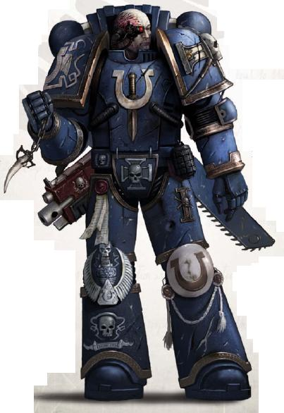
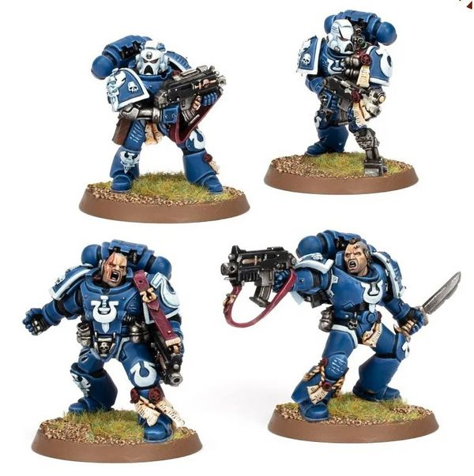

# 0440 泰伦战争老兵 Tyrannic War Veteran

精校状态：中文行文已逐段精校，部分术语仍为暂定

分类：通用概念 / 帝国 Imperium / 中央政务部 Adeptus Terra / 阿斯塔特修会 Adeptus Astartes

原文来源：https://www.bilibili.com/opus/1035980673450508312

原作者：帝国神选罐头

原文时间：2025年02月20日 18:14

[返回分类目录](目录.md) · [全书目录](../../目录.md)

<!-- A0440-B0001 -->
**英文原文**

Tyrannic War Veterans are an elite section of Ultramarines Chapter originally created under the watchful eyes of Chaplain Cassius. These veterans are made up of the warriors who have fought and survived battles against Tyranid forces since the attack of Hive Fleet Behemoth. Since then the Ultramarines have spared others the difficulty of fighting the Tyranids while constantly rebuilding their First Company with these specialists. Over half the First Company is now made up of Tyrannic War Veterans.

<!-- /A0440-B0001 -->

<!-- A0440-B0002 -->

原译文

泰伦战争老兵是极限战士战团的精英部分，最初是在牧师卡西乌斯的监督下创建的。这些老兵是由自虫巢舰队贝希摩斯袭击以来与泰伦军队作战并幸存下来的战士组成的。从那时起，极限战士在与这些专家不断重建他们的第一连的同时，也让其他人免受了与泰伦作战的困难。第一连现在有一半以上是由泰伦战争老兵组成的。

**校订译文**

泰伦战争老兵是极限战士的一支精锐部队，最初在卡西乌斯教士的督导下组建，成员都是自贝希摩斯虫巢舰队入侵以来，与泰伦作战并幸存的战士。此后，极限战士一面以这些专家重建第一连，一面帮助其他部队减轻对抗泰伦的困难。如今，第一连超过半数成员都是泰伦战争老兵。

<!-- /A0440-B0002 -->

<!-- A0440-B0003 图片 -->

<!-- A0440-B0004 -->

原译文

Tyrannic War Veteran 泰伦战争老兵

**校订译文**

Tyrannic War Veteran 泰伦战争老兵

<!-- /A0440-B0004 -->

<!-- A0440-B0005 -->
**英文原文**

Some Ultramarines Successor Chapters, such as the Imperial Reavers, are also known to operate formations of Tyrannic War Veterans.

<!-- /A0440-B0005 -->

<!-- A0440-B0006 -->

原译文

一些极限战士的子战团，如帝国收割者，也以控制泰伦战争老兵编队而闻名。

**校订译文**

一些极限战士子战团，如帝国收割者，也编有泰伦战争老兵部队。

**校注：** 本篇英文为 Imperial Reavers，前文另有 Imperius Reavers 帝国掠夺者。尚未核实两者是否为异写，故此处沿原译帝国收割者，保留区分。

<!-- /A0440-B0006 -->

<!-- A0440-B0007 -->
## History 历史

<!-- /A0440-B0007 -->

<!-- A0440-B0008 -->
**英文原文**

In the aftermath of the Battle of Macragge, the Ultramarines had suffered grievous losses, losses which would take decades to replace. In order to accelerate the process, the Ultramarines' Chapter Master, Marneus Calgar, began offering his warriors for secondment to the Deathwatch, the chamber militant of the Ordo Xenos. In service to the Inquisition these Ultramarines quickly gained experience fighting against the xenos threat, particularly Tyranids, and with the successive assaults of more Hive Fleets more warriors became quick learners in how to efficently kill the beasts. Under the personal direction of Chaplain Cassius, this new breed of warrior were formed into specialized squads called Tyrannic War Veterans.

<!-- /A0440-B0008 -->

<!-- A0440-B0009 -->

原译文

在马库拉格之战之后，极限战士遭受了严重的损失，这些损失需要几十年的时间才能弥补。为了加快这一进程，极限战士的战团长马涅乌斯·卡尔加开始将他的战士借调给攘外修会的军事辅军死亡守望。在为审判庭服务的过程中，这些极限战士很快获得了对抗异型威胁的经验，尤其是泰伦虫族，随着更多虫巢舰队的连续攻击，更多的战士成为了如何有效杀死野兽的快速学习者。在牧师卡西乌斯的亲自指导下，这种新型战士组成了名为泰伦战争老兵的专业小队。

**校订译文**

马库拉格之战后，极限战士伤亡惨重，预计需要数十年才能恢复。为加快重建，战团长马涅乌斯·卡尔加开始将战士借调到死亡守望——异形审判庭的武装分支。在为审判庭效力时，他们迅速积累了对抗异形、尤其是泰伦的经验。随着更多虫巢舰队接连入侵，也有更多战士迅速掌握了高效猎杀这些怪物的方法。在卡西乌斯教士亲自指导下，这些新一代战士被编成专门小队，称为泰伦战争老兵。

<!-- /A0440-B0009 -->

<!-- A0440-B0010 图片 -->

<!-- A0440-B0011 -->

原译文

Tyrannic War Veterans 泰伦战争老兵

**校订译文**

Tyrannic War Veterans 泰伦战争老兵

<!-- /A0440-B0011 -->

<!-- A0440-B0012 -->
**英文原文**

However, despite the Master of Sanctity's approval, there was resistance to such a specialized formation created within the Chapter, especially its lack of sanction by the Codex Astartes. To break the deadlock of arguments for and against their formation, Marneus Calgar called for a great meeting, the Conclave of Hera, to be held after the Feast of Remembrance where every member of the Chapter would have their say in the matter. Waiting for as many Space Marines to arrive as possible, Calgar began the proceedings within the shadow of Roboute Guilliman himself, and for the next several months each warrior was allowed to speak before the assembly, with Cassius and Captain Severus Agemman passionately pleading in favor of the Veterans.

<!-- /A0440-B0012 -->

<!-- A0440-B0013 -->

原译文

然而，尽管获得了圣洁导师的批准，但战团内创建的这种专业形式仍遭到抵制，特别是它缺乏阿斯塔特圣典的批准。为了打破支持和反对成立该组织的争论僵局，马涅乌斯·卡尔加呼吁在纪念盛宴后举行一次伟大的会议，即赫拉最高会议，届时战团的每个成员都将对此事发表意见。在等待尽可能多的星际战士到达后，卡尔加在罗伯特·基里曼本人的影子下开始了一系列行动，在接下来的几个月里，每个战士都被允许在会议上发言，卡西乌斯和西弗勒斯·阿格曼连长热情地恳求老兵。

**校订译文**

尽管获得圣洁导师支持，在战团内创建这种专门部队仍遭到反对，尤其因为《阿斯塔特圣典》并未认可这一编制。为打破争论的僵局，马涅乌斯·卡尔加宣布在纪念盛宴后召开赫拉大会，让战团每位成员都能陈述意见。他等候尽可能多的战士赶回，才在基里曼原体的见证之下开会。此后数月，每名战士都有机会在大会前发言，卡西乌斯与西弗勒斯·阿格曼连长则热切地为保留老兵部队辩护。

**校注：** in the shadow of Roboute Guilliman 为地点／象征性表述，本段时序在原体复苏前；中文“见证之下”为修辞，不代表原体当时清醒参会。

<!-- /A0440-B0013 -->

<!-- A0440-B0014 -->
**英文原文**

At the end, Calgar declared he had heard everything he had needed, and for the next several weeks he retired to his chambers, fasting and praying for guidance from Guilliman and the Emperor. At dawn on the 40th day, Calgar emerged and declared his answer: the Tyrannic War Veterans would prove themselves on Espandor, where word had just arrived of Tyranid forces infesting its forests. Should they prove successful in extinguishing this threat, the Veterans would prove themselves worthy and be formally recognized into the Chapter and Codex Astartes. Captain Agemman, Chaplain Cassius and several squads of Tyrannic War Veterans set off to Espandor, where they successfully cleansed the xenos taint without losing a single battle-brother in combat. Thanks to their unmitigated success, the formation was formally recognized, and soon Tyrannic War Veterans began sharing their skills and knowledge with all Ultramarines, as well as be seconded to other Imperial units likely to see combat with the Tyranids.

<!-- /A0440-B0014 -->

<!-- A0440-B0015 -->

原译文

最后，卡尔加宣布他已经听到了他所需要的一切，在接下来的几周里，他回到自己的房间，禁食并祈祷基里曼和帝皇的指导。第40天黎明时分，卡尔加出现并宣布了他的答案：泰伦战争老兵将在埃斯潘多证明自己，那里刚刚传出泰伦军队侵扰森林的消息。如果他们成功地消除了这一威胁，老兵将证明自己是值得的，并被正式纳入战团和阿斯塔特圣典。阿格曼连长、卡西乌斯牧师和几队泰伦战争老兵出发前往埃斯潘多，在那里他们成功地清除了异型的污点，在战斗中没有失去一个战斗兄弟。由于他们取得了彻底的成功，该编队得到了正式认可，不久，泰伦战争老兵开始与所有极限战士分享他们的技能和知识，并被借调到其他可能与泰伦作战的帝国部队。

**校订译文**

最后，卡尔加宣布自己已听取所有必要意见，随后闭居房内，禁食祈祷，向基里曼与帝皇寻求指引。第40天黎明，他走出房间，给出决定：泰伦战争老兵须前往埃斯潘多证明自己，那里刚传来森林遭泰伦侵扰的消息。若能成功消灭威胁，他们便证明了自身价值，这一编制也将获战团正式认可，纳入圣典体系。阿格曼连长、卡西乌斯教士与数支老兵小队遂赴埃斯潘多，成功肃清异形，战斗中无一名兄弟阵亡。凭借这一完胜，他们的编制得到正式承认。此后，泰伦战争老兵开始向所有极限战士传授经验与技能，也会借调到其他可能遭遇泰伦的帝国部队。

<!-- /A0440-B0015 -->

<!-- A0440-B0016 -->
## Combat Doctrine 作战理论

<!-- /A0440-B0016 -->

<!-- A0440-B0017 -->
**英文原文**

Each squad is composed of a Space Marine Sergeant and four to nine Space Marines, armed with a bolter, frag and krak grenades, wearing their distinct power armour displaying purity seals and, should they earn it, Terminator Honours. One squad member may take a heavy bolter, while another may take a flamer, in place of their bolter. They may also take a Rhino or Razorback for transportation.

<!-- /A0440-B0017 -->

<!-- A0440-B0018 -->

原译文

每个小队由一名星际战士军士和四至九名星际战士组成，他们配备了一个爆矢枪、破片和穿甲手榴弹，身穿独特的动力盔甲，上面印有纯洁印章，如果他们获得了终结者盔甲，还将获得终结者十字章。一名队员可能会携带重型爆矢枪，而另一名队员则可能会携带火焰枪来代替他们的爆矢枪。他们也可能配备犀牛装甲车或豪猪战车进行运输。

**校订译文**

每个小队由一名军士和四至九名星际战士组成，装备爆矢枪、破片手榴弹与穿甲手榴弹，穿戴样式独特的动力甲，上饰纯洁印章；获得终结者荣誉者还会佩带相应标志。一名成员可将爆矢枪换成重爆矢枪，另一名可换装喷火器。小队也可乘坐犀牛战车或豪猪战车。

**校注：** Terminator Honours 是资格荣誉，不是原译所说“先获得终结者护甲才获得十字章”；本段没有把授甲列为前提。

<!-- /A0440-B0018 -->

<!-- A0440-B0019 -->
**英文原文**

Tyrannic War Veterans are specially trained in how to kill Tyranids, both with close-combat and long-range weaponry, by targeting known weak points for maximum penetration and damage. Tyrannic War Veterans have honed their reflexes to incredible heights to better combat Tyranid warriors in hand-to-hand combat, particularly the use of krak grenades normally reserved only for armoured vehicles. They also use special Hellfire Rounds in their heavy bolters, and are trained to work with other Space Marine squads to bring down both large and small Tyranid creatures.

<!-- /A0440-B0019 -->

<!-- A0440-B0020 -->

原译文

泰伦战争老兵经过专门训练，通过瞄准已知的弱点以获得最大的穿透力和伤害，使用近战和远程武器杀死泰伦虫族。泰伦战争老兵已经将他们的反应能力磨练到了令人难以置信的高度，以便在肉搏战中更好地与泰伦战士作战，特别是使用通常只用于装甲车的穿甲手榴弹。他们也在重型爆矢枪中使用特殊的地狱火弹药，并接受过与其他星际战士小队合作的训练，以击落大大小小的泰伦生物。

**校订译文**

泰伦战争老兵接受专门训练，能以近战与远程武器瞄准泰伦已知弱点，取得最大的穿透与杀伤效果。他们把反应速度磨练到惊人的程度，以便在肉搏中对抗泰伦战士，尤其擅长把通常用于反装甲的穿甲手榴弹用于这类战斗。他们还为重爆矢枪配备特制地狱火弹，并学会与其他星际战士小队协作，击杀大小各异的泰伦生物。

<!-- /A0440-B0020 -->

本篇核心术语与暂定项

以下列出本篇出现的英文原形及核心术语表用词。同形词可能指不同对象，具体词义以本篇正文和校注为准；单复数、别名和仅见于图注的名称可能尚未列入。完整候选见[术语表](../../术语表/双语术语候选.csv)。

| 英文 | 采用中文 | 状态 |
| --- | --- | --- |
| Space Marines | 星际战士 | 官方已核对 |
| Deathwatch | 死亡守望 | 官方已核对 |
| Tyranids | 泰伦虫族 | 官方已核对 |
| Terminator | 终结者 | 官方已核对 |
| Roboute Guilliman | 罗保特·基里曼 | 官方已核对 |
| Ultramarines | 极限战士 | 官方已核对 |
| Inquisition | 审判庭 | 暂定 |
| Emperor | 帝皇 | 官方已核对 |
| Ordo Xenos | 异形审判庭 | 用户指定 |
| Espandor | 埃斯潘多 | 暂定·官方待核 |
| Macragge | 马库拉格 | 暂定·官方待核 |
| Master | 导师（审判庭职衔）／舰务官（舰员职务） | 语境定译·官方待核 |
| Master of Sanctity | 圣洁导师 | 暂定·官方待核 |
| Hellfire Rounds | 地狱火弹 | 暂定·官方待核 |
| Chaplain | 教士 | 官方已核对 |
| Rhino | 犀牛战车 | 官方已核对 |
| Razorback | 豪猪战车 | 官方已核对 |
| Power Armour | 动力盔甲 | 暂定·官方待核 |
| Krak Grenades | 穿甲手榴弹 | 暂定·官方待核 |
| Space Marine | 星际战士 | 暂定·官方待核 |
| Chapter | 战团 | 暂定·官方待核 |
| Chapter Master | 战团长 | 暂定·官方待核 |
| Captain | 连长 | 暂定·官方待核 |
| Sergeant | 军士 | 暂定·官方待核 |
| Brother | 修士 | 暂定·官方待核 |
| Battle-Brother | 战斗兄弟 | 暂定·官方待核 |
| Marneus Calgar | 马涅乌斯·卡尔加 | 暂定·官方待核 |
| Severus Agemman | 西弗勒斯·阿格曼 | 暂定·官方待核 |
| Codex Astartes | 阿斯塔特圣典 | 暂定·官方待核 |
| Xenos | 异形 | 暂定·官方待核 |
| Imperial Reavers | 帝国收割者 | 暂定·官方待核 |
| Conclave of Hera | 赫拉大会 | 暂定·官方待核 |
| Reavers | 劫掠者 | 官方已核对 |
| Tyranid Warriors | 泰伦武士 | 官方词根参考·通称待核 |
| Severus | 西弗勒斯 | 暂定·官方待核 |
| Tyrannic War Veterans | 泰伦战争老兵 | 暂定·官方待核 |
| Bolter | 爆矢枪 | 暂定·官方待核 |
| Heavy bolter | 重型爆矢枪 | 官方已核对 |
| Flamer | 火焰喷射器（武器）／火妖（奸奇单位） | 语境定译·对应官译已核 |

