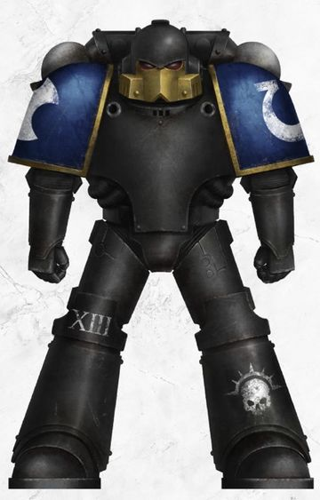
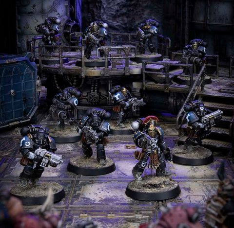

# 0441 复仇女神毁灭者 Nemesis Destroyer

精校状态：中文行文已逐段精校，部分术语仍为暂定

分类：通用概念 / 帝国 Imperium / 中央政务部 Adeptus Terra / 阿斯塔特修会 Adeptus Astartes

原文来源：https://www.bilibili.com/opus/1030761888761249795

原作者：帝国神选罐头

原文时间：2025年02月06日 16:42

[返回分类目录](目录.md) · [全书目录](../../目录.md)

<!-- A0441-B0001 -->
**英文原文**

The Nemesis Destroyers were Ultramarine Destroyer Marines, who served in the Legion's 22nd 'Nemesis' Chapter, during the Great Crusade and Horus Heresy.

<!-- /A0441-B0001 -->

<!-- A0441-B0002 -->

原译文

复仇女神毁灭者是极限战士星际战士毁灭者，在大远征和荷鲁斯叛乱期间，他们在军团第22‘复仇女神’战团服役。

**校订译文**

复仇女神毁灭者是极限战士军团的毁灭者部队，在大远征及荷鲁斯之乱时期隶属第22“复仇女神”战团。

<!-- /A0441-B0002 -->

<!-- A0441-B0003 图片 -->

<!-- A0441-B0004 -->

原译文

Nemesis Destroyer 复仇女神毁灭者

**校订译文**

Nemesis Destroyer 复仇女神毁灭者

<!-- /A0441-B0004 -->

<!-- A0441-B0005 -->
## History 历史

<!-- /A0441-B0005 -->

<!-- A0441-B0006 -->
**英文原文**

Unlike other Destroyer Marine formations, the Nemesis Destroyers retained a high proportion of bolters as their primary armaments. This augmented the Destroyers' tactical flexibility, with the addition of specialist ammunition loads they carried. The ammo consisted of chem-agents and toxins concocted to inflict unimaginable pain. They rapidly adapted to the genetic structure of their targets, who were rendered down into grey slurry. The ammo was experimental, though, and the Ultramarines' artificers reworked the bolters' ammunition feed systems and firing mechanisms, so the bolt rounds fired at a reduced velocity. It was once purported that the Nemesis Destroyers' ammo was a further continuation of the development of toxiferran munitions started by the Death Guard during the Great Crusade. However there are no extant records that describe how the Ultramarines armorers came to devise the Nemesis' ammo, and Imperial inquiries into the matter were silenced by the highest authorities of Macragge and Terra.

<!-- /A0441-B0006 -->

<!-- A0441-B0007 -->

原译文

与其他星际战士毁灭者编队不同，复仇女神毁灭者保留了很高比例的爆矢枪作为其主要武器。这增强了毁灭者的战术灵活性，增加了他们携带的特殊弹药。弹药由化学试剂和毒素组成，这些试剂和毒素会造成难以想象的疼痛。它们迅速适应了目标的遗传结构，目标被转化为灰色泥浆。不过，这种弹药是实验性的，极限战士的工匠重新设计了爆矢枪的弹药供给系统和射击机制，因此爆矢弹以较低的速度发射。曾经有人声称，复仇女神毁灭者的弹药是死亡守卫在大远征期间开始开发的毒素弹药的进一步延续。然而，没有现存的记录描述极限战士的军械士是如何设计复仇女神的弹药的，帝国对此事的调查被马库拉格和泰拉的最高权力机构压制了。

**校订译文**

与其他毁灭者部队不同，复仇女神毁灭者仍大量使用爆矢枪作为主武器，搭配特种弹药，因而拥有更灵活的战术选择。这些弹药内含化学药剂与毒素，能使目标遭受难以想象的痛苦，并迅速针对其遗传结构发挥作用，将其化为灰色浆液。由于弹药仍具实验性质，极限战士工匠改造了爆矢枪的供弹与击发机构，使弹丸以较低初速射出。有人声称，这些弹药是在死亡守卫于大远征中开发的毒铁弹药基础上继续研制的，但现存记录并未说明极限战士军械师如何设计出它们；帝国方面的相关调查也被马库拉格与泰拉的最高当局压下。

**校注：** toxiferran munitions 为专名，暂译毒铁弹药并保留词条；与死亡守卫的关系仅为源文中的传言，不确认为已证实技术谱系。

<!-- /A0441-B0007 -->

<!-- A0441-B0008 图片 -->

<!-- A0441-B0009 -->

原译文

Nemesis Destroyers 复仇女神毁灭者

**校订译文**

Nemesis Destroyers 复仇女神毁灭者

<!-- /A0441-B0009 -->

<!-- A0441-B0010 -->
**英文原文**

Regardless of their origin, the Nemesis' ammo was specifically created to ensure they caused harrowing destruction to their enemies. So much so, that the spirits of any who survived the attacks, would be broken by fear. This, combined with the Ultramarines' prodigious skill and steadfast discipline, would prove the 22nd 'Nemesis' Chapter's Destroyers to be invaluable when combating Warmaster Horus' Traitor forces, during the Horus Heresy. As the Heresy raged, the Nemesis Destroyers became instrumental in their Legion's resistance to the Word Bearers assault on Calth. However the hellish battles they endured against the Traitor Legion and their Daemon allies, forever marked the soul of the 22nd Chapter. It turned the Nemesis Destroyers into grim shadows of their former selves, which continued to persist even after new members joined their ranks.

<!-- /A0441-B0010 -->

<!-- A0441-B0011 -->

原译文

无论其来源如何，复仇女神的弹药都是专门为确保他们对敌人造成可怕的破坏而制造的。以至于任何在袭击中幸存下来的人的精神都会被恐惧所摧毁。这一点，再加上极限战士惊人的技能和坚定的纪律，将证明在荷鲁斯叛乱期间，第22“复仇女神”战团的毁灭者在对抗战帅荷鲁斯的叛徒部队时是无价的。随着叛乱的肆虐，复仇女神毁灭者在他们的军团抵抗怀言者对考斯的攻击中发挥了重要作用。然而，他们与叛徒军团及其恶魔盟友所经历的地狱般的战斗，永远标记着第22战团的灵魂。它把复仇女神毁灭者变成了他们以前的可怕阴影，即使在新成员加入他们的行列后，这种阴影仍然存在。

**校订译文**

无论来源如何，这些弹药都旨在造成令人胆寒的毁伤，使袭击中的幸存者也因恐惧而精神崩溃。配合极限战士精湛的战技与坚定纪律，第22“复仇女神”战团的毁灭者在荷鲁斯之乱中成为对抗战帅叛军的重要力量，尤其为军团抵御怀言者对考斯的进攻作出了关键贡献。然而，同叛徒军团及其恶魔盟友的地狱般苦战，也在第22战团的灵魂上留下永久烙印。复仇女神毁灭者从此阴郁严酷，仿佛只剩昔日自我的影子；即使不断有新人补入，这一气质也未消退。

<!-- /A0441-B0011 -->

本篇核心术语与暂定项

以下列出本篇出现的英文原形及核心术语表用词。同形词可能指不同对象，具体词义以本篇正文和校注为准；单复数、别名和仅见于图注的名称可能尚未列入。完整候选见[术语表](../../术语表/双语术语候选.csv)。

| 英文 | 采用中文 | 状态 |
| --- | --- | --- |
| Death Guard | 死亡守卫 | 官方已核对 |
| Ultramarines | 极限战士 | 官方已核对 |
| Horus Heresy | 荷鲁斯之乱 | 官方已核对 |
| Word Bearers | 怀言者 | 暂定·官方待核 |
| Great Crusade | 大远征 | 暂定·官方待核 |
| Terra | 泰拉 | 暂定·官方待核 |
| Horus | 荷鲁斯 | 暂定·官方待核 |
| Calth | 考斯 | 暂定·官方待核 |
| Macragge | 马库拉格 | 暂定·官方待核 |
| Destroyer | 毁灭者 | 暂定·官方待核 |
| Nemesis Destroyers | 复仇女神毁灭者 | 暂定·官方待核 |
| Chapter | 战团 | 暂定·官方待核 |
| Nemesis | 复仇女神 | 暂定·官方待核 |
| Destroyers | 毁灭者 | 暂定·官方待核 |
| toxiferran munitions | 毒铁弹药 | 暂定·官方待核 |
| Bolt | 爆矢 | 暂定·官方待核 |

