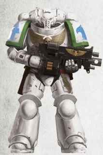
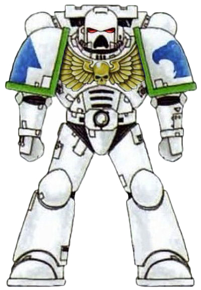

# 0443 白色执政官 White Consuls

精校状态：中文行文已逐段精校，部分术语仍为暂定

分类：通用概念 / 帝国 Imperium / 中央政务部 Adeptus Terra / 阿斯塔特修会 Adeptus Astartes

原文来源：https://www.bilibili.com/opus/1109477257622061065

原作者：帝国神选罐头

原文时间：2025年09月06日 19:38

[返回分类目录](目录.md) · [全书目录](../../目录.md)

<!-- A0443-B0001 -->
**英文原文**

The White Consuls are a Successor Chapter of the Ultramarines Legion, and are one of the Astartes Praeses Chapters which, according to the ancient tome Mythos Angelica Mortis, were created to guard the Eye of Terror.

<!-- /A0443-B0001 -->

<!-- A0443-B0002 -->

原译文

白色执政官是极限战士军团的子战团，也是阿斯塔特总督战团的一员，根据古代巨著《死亡天使传说》，他们是为了守卫恐惧之眼而创建的。

**校订译文**

白色执政官是极限战士军团的子战团，也是阿斯塔特总督战团的一员，根据古代巨著《死亡天使传说》，他们是为了守卫恐惧之眼而创建的。

<!-- /A0443-B0002 -->

<!-- A0443-B0003 图片 -->

<!-- A0443-B0004 图片 -->

<!-- A0443-B0005 -->
**英文原文**

Founding Chapter:Ultramarines

<!-- /A0443-B0005 -->

<!-- A0443-B0006 -->

原译文

建军战团：极限战士

**校订译文**

母战团：极限战士

<!-- /A0443-B0006 -->

<!-- A0443-B0007 -->
**英文原文**

Founding:Second Founding

<!-- /A0443-B0007 -->

<!-- A0443-B0008 -->

原译文

建军：二次建军

**校订译文**

建军：二次建军

<!-- /A0443-B0008 -->

<!-- A0443-B0009 -->
**英文原文**

Chapter Master:Borsellius

<!-- /A0443-B0009 -->

<!-- A0443-B0010 -->

原译文

战团长：博尔塞利乌斯

**校订译文**

战团长：博尔塞利乌斯

<!-- /A0443-B0010 -->

<!-- A0443-B0011 -->
**英文原文**

Homeworld:Formerly Sabatine

<!-- /A0443-B0011 -->

<!-- A0443-B0012 -->

原译文

家园世界：以前是萨巴蒂尼

**校订译文**

母星：原为萨巴蒂尼。

<!-- /A0443-B0012 -->

<!-- A0443-B0013 -->
**英文原文**

Fortress-Monastery:Formerly Vigilia Carceris

<!-- /A0443-B0013 -->

<!-- A0443-B0014 -->

原译文

要塞修道院：以前是为警戒牢笼

**校订译文**

要塞修道院：原为警戒牢笼。

<!-- /A0443-B0014 -->

<!-- A0443-B0015 -->
**英文原文**

Colours:White with blue tactical markings. Golden aquila

<!-- /A0443-B0015 -->

<!-- A0443-B0016 -->

原译文

颜色：白色，带蓝色战术标记。金色天鹰

**校订译文**

颜色：白色，带蓝色战术标记。金色天鹰

<!-- /A0443-B0016 -->

<!-- A0443-B0017 -->
**英文原文**

Strength:Unknown, greatly depleted

<!-- /A0443-B0017 -->

<!-- A0443-B0018 -->

原译文

力量：未知，极度减少

**校订译文**

兵力：具体数量不明，已严重减员。

<!-- /A0443-B0018 -->

<!-- A0443-B0019 -->
## Background 背景

<!-- /A0443-B0019 -->

<!-- A0443-B0020 -->
**英文原文**

As one of the Ultramarines successors located farthest from Ultramar, it is rare and a cause for celebration when the White Consuls appear in the court of Marneus Calgar.

<!-- /A0443-B0020 -->

<!-- A0443-B0021 -->

原译文

作为距离奥特拉玛最远的极限战士子战团之一，当白色执政官出现在马涅乌斯·卡尔加的法庭上时，这是罕见的，也是值得庆祝的。

**校订译文**

白色执政官是距离奥特拉玛最遥远的极限战士子战团之一，因此他们造访马涅乌斯·卡尔加的宫廷十分罕见，每次到来都值得庆贺。

**校注：** court 此处指战团领主宫廷，非司法法庭。

<!-- /A0443-B0021 -->

<!-- A0443-B0022 图片 -->

<!-- A0443-B0023 -->
**英文原文**

Unusually the White Consuls have two Chapter Masters; one oversees the defences of the Chapter's home world of Sabatine and commands a standing force ready at a moment’s notice to respond to Chaos incursions through the Cadian Gate, and the other is responsible for the operations of the Chapter's forces in war zones further afield. It is doubtful that this is sanctioned by any entry in the Codex Astartes, and the reason it has never been challenged is the Chapter's homeworld's distance from Ultramar. Also unusually the White Consuls seem to worship the Emperor as a god and seem to be part of the Imperial Cult, unlike most other Astartes Chapters.

<!-- /A0443-B0023 -->

<!-- A0443-B0024 -->

原译文

不同寻常的是，白色执政官有两个战团长；一个负责监督战团家园世界萨巴蒂尼的防御，并指挥一支常备部队随时准备应对通过卡迪亚之门的混沌入侵，另一个负责战团部队在更远战区的行动。令人怀疑的是，这是否得到了《阿斯塔特圣典》中任何条目的认可，而它从未受到质疑的原因是该战团的家园世界与奥特拉玛的距离。同样不同寻常的是，与大多数其他阿斯塔特战团不同，白色执政官似乎将帝皇视为神来崇拜，似乎是帝国教派的一部分。

**校订译文**

白色执政官罕见地同时设有两位战团长：一位负责母星萨巴蒂尼的防御，统领常备部队，随时应对从卡迪亚之门涌出的混沌入侵；另一位则指挥战团在远方战区的行动。《阿斯塔特圣典》是否允许这种制度，颇为可疑；它始终未受挑战，原因在于母星远离奥特拉玛。另一项异于多数阿斯塔特战团的习俗是，白色执政官似乎将帝皇尊为神祇，也似乎遵奉帝皇信仰。

<!-- /A0443-B0024 -->

<!-- A0443-B0025 -->
**英文原文**

The White Consuls maintain sovereignty over several nearby systems, and the chapter officers are expected to oversee the administration of each world before advancing to a higher rank. As such, these officers are often found in command of local troops. This is considered as a smaller version of the Ultramarines' practices within Ultramar. One of these was the Boros System, which they ruled from the star fort Kronos (the largest space station in Segmentum Obscurus), until the entire system was corrupted and the star fort destroyed by the dark crusade of the Word Bearers and the subsequent invasion of the Necrons, under the Undying One. Proconsul Cassius Ostorius & Coadjutor Gaius Aquilius seemed to be the only two Astartes involved with the governorship, however.

<!-- /A0443-B0025 -->

<!-- A0443-B0026 -->

原译文

白色执政官对附近的几个星系拥有主权，战团军官在晋升到更高级别之前，预计将监督每个世界的管理。因此，这些军官经常指挥当地部队。这被认为是奥特拉玛中极限战士惯例的一个较小版本。其中之一是博罗斯星系，他们从星堡克洛诺斯（朦胧星域最大的空间站）统治该星系，直到整个系统被摧毁，星堡被怀言者的黑暗远征和随后的不灭者麾下的死灵入侵摧毁。然而，总督卡西乌斯·奥斯托瑞斯和助理盖乌斯·阿奎留斯似乎是唯二两位参与总督职位的阿斯塔特。

**校订译文**

白色执政官统治周围数个星系，军官晋升前须先负责某个世界的行政事务，因此也常兼领当地部队。这可以看作极限战士治理奥特拉玛的缩小版本。他们曾从克洛诺斯星堡——朦胧星域最大的空间站——统治博罗斯星系，直到怀言者的黑暗远征，以及不灭者率领的太空死灵入侵，使整个星系遭到腐化、星堡被摧毁。不过，参与当地治理的阿斯塔特似乎只有总督卡西乌斯·奥斯托瑞斯及助理官盖乌斯·阿奎留斯两人。

<!-- /A0443-B0026 -->

<!-- A0443-B0027 -->
**英文原文**

Every battle brother has to serve as a Coadjutor in the years after rising from the rank of neophyte. A selection of veterans are also chosen to act as Proconsuls; becoming a Proconsul is a necessary prerequisite to becoming a Sergeant or Captain. Proconsuls have led local troops of Sabatine or their vassal worlds into battle, granting them some knowledge on the Imperial Guard.

<!-- /A0443-B0027 -->

<!-- A0443-B0028 -->

原译文

每个战斗兄弟在从新进者晋升后的几年里都必须担任助理。还挑选了一些老兵担任总督；成为总督是成为军士或连长的必要先决条件。总督们带领萨巴蒂尼或其附庸世界的当地军队投入战斗，让他们对帝国卫队有了一些了解。

**校订译文**

每名战斗兄弟从见习阶段晋升后，都须在接下来的数年内担任助理官。部分老兵还会被选为总督，这是晋升军士或连长的必要资历。总督们曾带领萨巴蒂尼及附庸世界的当地军队作战，由此获得对帝国卫队的实际认识。

<!-- /A0443-B0028 -->

<!-- A0443-B0029 -->
**英文原文**

During the 12th Black Crusade the White Consuls were one of three chapters – together with the Exorcists and Red Talons – that entered the Gothic Sector after the Warp storm that had isolated the sector ended and fought in the Gothic War.

<!-- /A0443-B0029 -->

<!-- A0443-B0030 -->

原译文

在第12次黑色远征期间，在隔离哥特星区的亚空间风暴结束并在哥特战争中作战后，白色执政官与驱魔者和红爪一起进入了哥特星区。

**校订译文**

第十二次黑色远征期间，隔绝哥特星区的亚空间风暴消散后，白色执政官与驱魔者、红爪共同成为进入该星区参战的三支战团，投入哥特战争。

<!-- /A0443-B0030 -->

<!-- A0443-B0031 -->
**英文原文**

When the Thirteenth Black Crusade started, the White Counsuls answered to call of Cadia by sending all of their Companies, except the Fourth, who were left as a skeletal guard of the planet Celestine.

<!-- /A0443-B0031 -->

<!-- A0443-B0032 -->

原译文

当第十三次黑色远征开始时，白色执政官响应了卡迪亚的号召，派遣了他们所有的连队，除了第四连队，他们只剩下塞莱斯廷星球的骷髅守卫。

**校订译文**

第十三次黑色远征爆发后，白色执政官响应卡迪亚的求援，派出除第四连之外的所有连队。第四连则留在塞莱斯廷星球，维持最低限度的守备。

**校注：** skeletal guard 指最少兵力的留守部队，非“骷髅守卫”。

<!-- /A0443-B0032 -->

<!-- A0443-B0033 图片 -->

<!-- A0443-B0034 -->

原译文

White Consuls Space Marine 白色执政官星际战士

**校订译文**

White Consuls Space Marine 白色执政官星际战士

<!-- /A0443-B0034 -->

<!-- A0443-B0035 -->
**英文原文**

In the aftermath of the Great Rift's creation, during the Thirteenth Black Crusade, the Chapter's Homeworld was overrun by the forces of Chaos, though the remnants of the Chapter managed to escape before Sabatine was corrupted by the forces of Nurgle. The Chapter then sought out a new world to claim as their own and rebuild. Following the heroic actions of Captain Messinius during the Pariah Crusade, Roboute Guilliman selected a new world to serve as the Consuls homeworld as several hundred Greyshields were selected from the stocks of Belisarius Cawl to restock the Chapter with fresh warriors.

<!-- /A0443-B0035 -->

<!-- A0443-B0036 -->

原译文

在大裂隙形成之后，在第十三次黑色远征期间，战团的家园世界被混沌势力占领，尽管战团的残余势力在萨巴蒂尼被纳垢部队腐化之前设法逃脱了。然后，该战团寻找了一个新的世界来宣称为自己的世界并进行重建。继梅西尼乌斯连长在帕里亚远征期间的英勇行为之后，罗伯特·基里曼选择了一个新世界作为白色执政官的家园世界，因为从贝利萨留·考尔的库存中选出了数百名灰盾，为战团补充了新的战士。

**校订译文**

第十三次黑色远征、大裂隙形成之后，战团母星被混沌军队攻陷；残部在萨巴蒂尼遭纳垢势力彻底腐化前逃脱，随后寻找新的世界重建家园。梅西尼乌斯连长在被遗弃者远征中表现英勇，其后罗保特·基里曼为白色执政官选定新母星，并从贝利萨留斯·考尔所备的兵员中抽调数百名灰盾，为战团补充新血。

<!-- /A0443-B0036 -->

<!-- A0443-B0037 -->
### Notable Campaigns 著名战役

<!-- /A0443-B0037 -->

<!-- A0443-B0038 -->
**英文原文**

798.M37: The Chapter prevails against the Daemonic legions of Fateweaver.

<!-- /A0443-B0038 -->

<!-- A0443-B0039 -->

原译文

战团战胜了织命者的恶魔军团。

**校订译文**

798.M37：战团击败织命者的恶魔军团。

<!-- /A0443-B0039 -->

<!-- A0443-B0040 -->
**英文原文**

143-151.M41: 12th Black Crusade — The White Consuls were stationed around the Gothic Sector during the Gothic War.

<!-- /A0443-B0040 -->

<!-- A0443-B0041 -->

原译文

第十二次黑色远征 — 在哥特战争期间，白色执政官驻扎在哥特星区周围。

**校订译文**

143—151.M41：第十二次黑色远征——哥特战争期间，白色执政官驻扎在哥特星区周围。

<!-- /A0443-B0041 -->

<!-- A0443-B0042 -->
**英文原文**

777.M41: Achilus Crusade — The White Consuls contributed a large contingent to the Achilus Crusade, amounting to around two companies and their support units. Their largest action was the extraction of a Deathwatch Kill-Team on the Death world of Polyphemnos against Ogryn mutants. It concluded with the successful rescue of the Kill-team, at the cost of a Consuls squad which was consumed by the mutants. As a consequence of this mission the White Consuls are demanding for the Deathwatch to help recover the squad's wargear and kill the Ogryn leader responsible.

<!-- /A0443-B0042 -->

<!-- A0443-B0043 -->

原译文

阿基里斯远征 — 白色执政官为阿基里斯远征派遣了一支庞大的队伍，约有两个连队及其支援部队。他们最大的行动是在波吕斐诺斯死亡世界中，针对欧格林变种人，组建了一支死亡守望小队。最后，以一支被变种人消耗的白色执政官小队为代价，成功营救了杀戮小队。作为这次任务的结果，白色执政官要求死亡守望帮助恢复小队的武器装备，并杀死其负责的奥格林首领。

**校订译文**

777.M41：阿基里斯远征——白色执政官投入约两个连队及其支援部队。最大的一次行动，是从死亡世界波吕斐诺斯的欧格林变种人手中救出一支死亡守望杀戮小队。营救虽然成功，一支白色执政官小队却被变种人吞食。此后，战团要求死亡守望协助回收阵亡小队的装备，并杀死造成这一惨剧的欧格林首领。

**校注：** extraction 指营救撤出，并非组建小队；consumed 在变种人攻击语境指被吞食，非抽象兵力消耗。

<!-- /A0443-B0043 -->

<!-- A0443-B0044 -->
**英文原文**

The Siege of Boros Gate: All ten companies were fielded to repel the Word Bearers, and later the Necrons. Almost five full companies were completely wiped out, one battle-barge was lost, and one of the two Chapter Masters was killed.

<!-- /A0443-B0044 -->

<!-- A0443-B0045 -->

原译文

博罗斯之门围城：所有十个连队都被派往击退怀言者，后来又击退了死灵。几乎有五个连队被完全摧毁，一艘战斗驳船损失，两名战团长中的一人被杀。

**校订译文**

博罗斯之门围城——全团十个连队出动，先后迎战怀言者与太空死灵。近五个满编连队全军覆没，损失一艘战斗驳船，两位战团长也有一位阵亡。

<!-- /A0443-B0045 -->

<!-- A0443-B0046 -->
**英文原文**

999.M41: The 13th Black Crusade — All Companies but the Fourth sent to Cadia.

<!-- /A0443-B0046 -->

<!-- A0443-B0047 -->

原译文

第十三次黑色远征 — 除第四连队外的所有连队都派往卡迪亚。

**校订译文**

999.M41：第十三次黑色远征——除第四连外，所有连队均被派往卡迪亚。

<!-- /A0443-B0047 -->

<!-- A0443-B0048 -->
**英文原文**

The Defense of Ulthor — 3rd, 5th and 7th Companies

<!-- /A0443-B0048 -->

<!-- A0443-B0049 -->

原译文

乌索尔防御 — 第三、第五和第七连队

**校订译文**

乌索尔防御 — 第三、第五和第七连队

<!-- /A0443-B0049 -->

<!-- A0443-B0050 -->
**英文原文**

???.M42: The invasion of Sabatine — The Lords of Silence and the Weeping Veil warbands invaded the White Consuls homeworld. With the majority of the Chapter engaged in the 13th Black crusade, only 80 Battle-Brothers are present on Sabatine. Chaos forces from the Lords of Silence and Weeping Veil are able to destroy the White Consuls garrison on the planet before corrupting it in the name of Nurgle.

<!-- /A0443-B0050 -->

<!-- A0443-B0051 -->

原译文

萨巴蒂尼入侵 — 寂静领主和哭泣面纱战帮入侵了白色执政官的家园世界。由于该战团的大部分成员都参与了第13次黑色远征，萨巴蒂尼只有80名战斗兄弟。来自寂静领主和哭泣面纱的混沌部队摧毁了行星上的白色执政官驻军，然后以纳垢之名将其腐化。

**校订译文**

???.M42：萨巴蒂尼入侵——寂静领主与哭泣面纱战帮进攻白色执政官母星。全团主力正投入第十三次黑色远征，萨巴蒂尼仅有80名战斗兄弟留守。混沌军消灭驻军，继而以纳垢之名腐化行星。

<!-- /A0443-B0051 -->

<!-- A0443-B0052 -->
**英文原文**

???.M42: The Pariah Crusade under Vitrian Messinius.

<!-- /A0443-B0052 -->

<!-- A0443-B0053 -->

原译文

维特里安·梅西尼乌斯领导的帕里亚远征。

**校订译文**

???.M42：维特里安·梅西尼乌斯率部参加被遗弃者远征。

**校注：** under Vitrian Messinius 在白色执政官战团战役列表中按其部队由梅西尼乌斯指挥理解，不据此扩大为其统率整场远征。

<!-- /A0443-B0053 -->

<!-- A0443-B0054 -->
**英文原文**

???.M42: The War of Beasts — The White Consuls send 5 companies.

<!-- /A0443-B0054 -->

<!-- A0443-B0055 -->

原译文

野兽战争 — 白色执政官派出5个连队。

**校订译文**

???.M42：野兽之战——白色执政官派出五个连队。

<!-- /A0443-B0055 -->

<!-- A0443-B0056 -->

原译文

???.M42: The Nachmund Rift War 纳克蒙德走廊战争

**校订译文**

???.M42: The Nachmund Rift War 纳克蒙德裂隙战争

<!-- /A0443-B0056 -->

<!-- A0443-B0057 -->
## Heraldry 纹章

<!-- /A0443-B0057 -->

<!-- A0443-B0058 -->
**英文原文**

Their Chapter colour scheme is the reverse of the Ultramarines', replacing the blue with the white and vice-versa, although the shoulder trim still displays the company colour as per Codex Astartes dictate.

<!-- /A0443-B0058 -->

<!-- A0443-B0059 -->

原译文

他们的战团配色方案与极限战士相反，用白色代替蓝色，反之亦然，尽管肩部装饰仍然按照阿斯塔特圣典的规定显示连队颜色。

**校订译文**

他们的战团配色方案与极限战士相反，用白色代替蓝色，反之亦然，尽管肩部装饰仍然按照阿斯塔特圣典的规定显示连队颜色。

<!-- /A0443-B0059 -->

<!-- A0443-B0060 -->
## Chapter Elements 战团成员

<!-- /A0443-B0060 -->

<!-- A0443-B0061 -->
### Fleet 舰队

<!-- /A0443-B0061 -->

<!-- A0443-B0062 -->
**英文原文**

Divine Splendour — Battle Barge.

<!-- /A0443-B0062 -->

<!-- A0443-B0063 -->

原译文

神圣壮丽号 — 战斗驳船

**校订译文**

神圣壮丽号 — 战斗驳船

<!-- /A0443-B0063 -->

<!-- A0443-B0064 -->
**英文原文**

Righteous Fury — Battle Barge.

<!-- /A0443-B0064 -->

<!-- A0443-B0065 -->

原译文

正义之怒号 — 战斗驳船

**校订译文**

正义之怒号 — 战斗驳船

<!-- /A0443-B0065 -->

<!-- A0443-B0066 -->
**英文原文**

Sword of Truth — Battle Barge.

<!-- /A0443-B0066 -->

<!-- A0443-B0067 -->

原译文

真理之剑号 — 战斗驳船

**校订译文**

真理之剑号 — 战斗驳船

<!-- /A0443-B0067 -->

<!-- A0443-B0068 -->
**英文原文**

Eternal Faith — Strike Cruiser.

<!-- /A0443-B0068 -->

<!-- A0443-B0069 -->

原译文

永恒信仰号 — 打击巡洋舰

**校订译文**

永恒信仰号 — 打击巡洋舰

<!-- /A0443-B0069 -->

<!-- A0443-B0070 -->
**英文原文**

Hermes — Strike Cruiser.

<!-- /A0443-B0070 -->

<!-- A0443-B0071 -->

原译文

赫尔墨斯号 — 打击巡洋舰

**校订译文**

赫尔墨斯号 — 打击巡洋舰

<!-- /A0443-B0071 -->

<!-- A0443-B0072 -->
**英文原文**

Hero of Sabatine — Strike Cruiser.

<!-- /A0443-B0072 -->

<!-- A0443-B0073 -->

原译文

萨巴蒂尼英雄号 — 打击巡洋舰

**校订译文**

萨巴蒂尼英雄号 — 打击巡洋舰

<!-- /A0443-B0073 -->

<!-- A0443-B0074 -->
### Notable White Consuls 著名白色执政官

<!-- /A0443-B0074 -->

<!-- A0443-B0075 -->

原译文

Borsellius 博尔塞利乌斯

**校订译文**

Borsellius 博尔塞利乌斯

<!-- /A0443-B0075 -->

<!-- A0443-B0076 -->
**英文原文**

Cymar Xydias - Former Co-Chapter Master (deceased)

<!-- /A0443-B0076 -->

<!-- A0443-B0077 -->

原译文

赛玛尔·泽迪亚斯 - 前联合战团长（已故）

**校订译文**

赛玛尔·泽迪亚斯 - 前联合战团长（已故）

<!-- /A0443-B0077 -->

<!-- A0443-B0078 -->
**英文原文**

Ridian Artemanis - Former Co-Chapter Master

<!-- /A0443-B0078 -->

<!-- A0443-B0079 -->

原译文

瑞迪安·阿尔特马尼斯 - 前联合战团长

**校订译文**

瑞迪安·阿尔特马尼斯 - 前联合战团长

<!-- /A0443-B0079 -->

<!-- A0443-B0080 -->
**英文原文**

Titus Valens - Former Co-Chapter Master (deceased)

<!-- /A0443-B0080 -->

<!-- A0443-B0081 -->

原译文

泰图斯·瓦伦斯 - 前联合战团长（已故）

**校订译文**

泰图斯·瓦伦斯 - 前联合战团长（已故）

<!-- /A0443-B0081 -->

<!-- A0443-B0082 -->
**英文原文**

Daceus - 2nd Company Captain

<!-- /A0443-B0082 -->

<!-- A0443-B0083 -->

原译文

达修斯 - 第二连队连长

**校订译文**

达修斯 - 第二连队连长

<!-- /A0443-B0083 -->

<!-- A0443-B0084 -->
**英文原文**

Memnon - 4th Company Captain

<!-- /A0443-B0084 -->

<!-- A0443-B0085 -->

原译文

门农 - 第四连队连长

**校订译文**

门农 - 第四连队连长

<!-- /A0443-B0085 -->

<!-- A0443-B0086 -->
**英文原文**

Gaius Aquilius - 5th Company Captain and Coadjutor of Boros Prime

<!-- /A0443-B0086 -->

<!-- A0443-B0087 -->

原译文

盖乌斯·阿奎留斯 - 第五连队连长和博罗斯主星助理

**校订译文**

盖乌斯·阿奎留斯——第五连长，兼博罗斯主星助理官。

<!-- /A0443-B0087 -->

<!-- A0443-B0088 -->
**英文原文**

Palatine - Captain

<!-- /A0443-B0088 -->

<!-- A0443-B0089 -->

原译文

帕拉蒂尼 - 连长

**校订译文**

帕拉蒂尼 - 连长

<!-- /A0443-B0089 -->

<!-- A0443-B0090 -->
**英文原文**

Vitrian Messinius - 10th Company Captain and Master of Recruits

<!-- /A0443-B0090 -->

<!-- A0443-B0091 -->

原译文

维特里安·梅西尼乌斯 - 第十连队连长和新兵之主

**校订译文**

维特里安·梅西尼乌斯 - 第十连队连长和新兵大师

<!-- /A0443-B0091 -->

<!-- A0443-B0092 -->
**英文原文**

Kandred - Chaplain

<!-- /A0443-B0092 -->

<!-- A0443-B0093 -->

原译文

康莱德 - 牧师

**校订译文**

康莱德——教士。

<!-- /A0443-B0093 -->

<!-- A0443-B0094 -->
**英文原文**

Atramo - Librarian

<!-- /A0443-B0094 -->

<!-- A0443-B0095 -->

原译文

阿特拉莫 - 智库

**校订译文**

阿特拉莫——智库员。

<!-- /A0443-B0095 -->

<!-- A0443-B0096 -->
**英文原文**

Argan - Dreadnought

<!-- /A0443-B0096 -->

<!-- A0443-B0097 -->

原译文

阿尔甘 - 无畏

**校订译文**

阿尔甘——无畏机甲驾驶员。

<!-- /A0443-B0097 -->

<!-- A0443-B0098 -->
**英文原文**

Jerimias - Dreadnought

<!-- /A0443-B0098 -->

<!-- A0443-B0099 -->

原译文

杰瑞米亚斯 - 无畏

**校订译文**

杰瑞米亚斯——无畏机甲驾驶员。

<!-- /A0443-B0099 -->

<!-- A0443-B0100 -->
**英文原文**

Thaniel Ectros - Member of Deathwatch Kill Team Excis. Killed during the initial investigation of Ghosar Quintus.

<!-- /A0443-B0100 -->

<!-- A0443-B0101 -->

原译文

塔尼尔·埃克特罗斯 - 死亡守望杀戮小队成员。在对戈萨尔五号的初步调查中被杀。

**校订译文**

塔尼尔·埃克特罗斯——死亡守望埃克西斯杀戮小队成员，在对戈萨尔五号进行初步调查时阵亡。

**校注：** 补回原译漏掉的杀戮小队专名 Excis，暂音译埃克西斯。

<!-- /A0443-B0101 -->

<!-- A0443-B0102 -->
**英文原文**

Titus Constantine - Served a tour of duty with the Deathwatch

<!-- /A0443-B0102 -->

<!-- A0443-B0103 -->

原译文

泰图斯·康斯坦丁 - 在死亡守望服役

**校订译文**

泰图斯·康斯坦丁 - 在死亡守望服役

<!-- /A0443-B0103 -->

<!-- A0443-B0104 -->
**英文原文**

Malgar Irongrasp - Traitor who joined the Black Legion

<!-- /A0443-B0104 -->

<!-- A0443-B0105 -->

原译文

马尔加·铁握 - 加入黑色军团的叛徒

**校订译文**

马尔加·铁握 - 加入黑色军团的叛徒

<!-- /A0443-B0105 -->

<!-- A0443-B0106 -->
**英文原文**

Arias - Tactical Marine Sergeant - Squad Arias, 2nd Company

<!-- /A0443-B0106 -->

<!-- A0443-B0107 -->

原译文

阿里亚斯 - 战术战士军士 - 阿里亚斯小队，第二连队

**校订译文**

阿里亚斯 - 战术战士军士 - 阿里亚斯小队，第二连队

<!-- /A0443-B0107 -->

<!-- A0443-B0108 -->
**英文原文**

Cossos - Tactical Marine - Squad Arias, 2nd Company

<!-- /A0443-B0108 -->

<!-- A0443-B0109 -->

原译文

科索斯 - 战术战士军士 - 阿里亚斯小队，第二连队

**校订译文**

科索斯——第二连阿里亚斯小队的战术战士。

**校注：** 本表仅 Arias 为军士；Cossos、Lertes、Probis、Tiberian 的英文均仅 Tactical Marine，删除原译无依据增添的军士头衔。

<!-- /A0443-B0109 -->

<!-- A0443-B0110 -->
**英文原文**

Lertes - Tactical Marine - Squad Arias, 2nd Company

<!-- /A0443-B0110 -->

<!-- A0443-B0111 -->

原译文

勒特斯 - 战术战士军士 - 阿里亚斯小队，第二连队

**校订译文**

勒特斯——第二连阿里亚斯小队的战术战士。

<!-- /A0443-B0111 -->

<!-- A0443-B0112 -->
**英文原文**

Probis - Tactical Marine - Squad Arias, 2nd Company

<!-- /A0443-B0112 -->

<!-- A0443-B0113 -->

原译文

普罗比斯 - 战术战士军士 - 阿里亚斯小队，第二连队

**校订译文**

普罗比斯——第二连阿里亚斯小队的战术战士。

<!-- /A0443-B0113 -->

<!-- A0443-B0114 -->
**英文原文**

Tiberian - Tactical Marine - Squad Arias, 2nd Company

<!-- /A0443-B0114 -->

<!-- A0443-B0115 -->

原译文

提贝里安 - 战术战士军士 - 阿里亚斯小队，第二连队

**校订译文**

提贝里安——第二连阿里亚斯小队的战术战士。

<!-- /A0443-B0115 -->

<!-- A0443-B0116 -->
**英文原文**

Cadras - Epistolary

<!-- /A0443-B0116 -->

<!-- A0443-B0117 -->

原译文

卡德拉斯 - 星语官

**校订译文**

卡德拉斯 - 星语官

<!-- /A0443-B0117 -->

本篇核心术语与暂定项

以下列出本篇出现的英文原形及核心术语表用词。同形词可能指不同对象，具体词义以本篇正文和校注为准；单复数、别名和仅见于图注的名称可能尚未列入。完整候选见[术语表](../../术语表/双语术语候选.csv)。

| 英文 | 采用中文 | 状态 |
| --- | --- | --- |
| Deathwatch | 死亡守望 | 官方已核对 |
| Imperial Guard | 帝国卫队 | 暂定·语境区分 |
| Necrons | 太空死灵 | 官方已核对 |
| Librarian | 智库员 | 官方已核对 |
| Ogryn | 欧格林 | 官方已核对 |
| Roboute Guilliman | 罗保特·基里曼 | 官方已核对 |
| Ultramar | 奥特拉玛 | 官方已核对 |
| Ultramarines | 极限战士 | 官方已核对 |
| Warp | 亚空间 | 官方已核对 |
| Great Rift | 大裂隙 | 官方已核对 |
| Nurgle | 纳垢 | 官方已核对 |
| Eye of Terror | 恐惧之眼 | 官方已核对 |
| Emperor | 帝皇 | 官方已核对 |
| Battle Barge | 战斗驳船 | 暂定·官方待核 |
| Word Bearers | 怀言者 | 暂定·官方待核 |
| Black Legion | 黑色军团 | 暂定·官方待核 |
| Lords of Silence | 寂静领主 | 暂定·官方待核 |
| Imperial Cult | 帝皇信仰 | 暂定·官方待核 |
| War of Beasts | 野兽之战 | 暂定·官方待核 |
| Segmentum Obscurus | 朦胧星域 | 暂定·官方待核 |
| Segmentum | 星域 | 暂定·官方待核 |
| Sector | 星区 | 暂定·官方待核 |
| Cadia | 卡迪亚 | 暂定·官方待核 |
| Ghosar Quintus | 戈萨尔五号 | 暂定·官方待核 |
| Obscurus | 朦胧星 | 暂定·官方待核 |
| Pariah | 贱民 | 暂定·官方待核 |
| Aquila | 天鹰 | 暂定·官方待核 |
| Epistolary | 星语官 | 暂定·官方待核 |
| Master | 导师（审判庭职衔）／舰务官（舰员职务） | 语境定译·官方待核 |
| Neophyte | 新进者 | 暂定 |
| Mission | 教团／传教机构 | 暂定 |
| Palatine | 宫廷官 | 官方已核对 |
| Chaplain | 教士 | 官方已核对 |
| Ancient | 旗手 | 官方已核对 |
| Veil | 韦尔 | 暂定·官方待核 |
| Vitrian Messinius | 维特里安·梅西尼乌斯 | 暂定·官方待核 |
| Belisarius Cawl | 贝利萨留斯·考尔 | 官方已核对 |
| Second Founding | 二次建军 | 暂定·官方待核 |
| Founding | 建军 | 暂定·官方待核 |
| Chapter | 战团 | 暂定·官方待核 |
| Fortress-monastery | 要塞修道院 | 暂定·官方待核 |
| Chapter Master | 战团长 | 暂定·官方待核 |
| Captain | 连长 | 暂定·官方待核 |
| Sergeant | 军士 | 暂定·官方待核 |
| Brother | 修士 | 暂定·官方待核 |
| Master of Recruits | 新兵大师 | 暂定·官方待核 |
| Marneus Calgar | 马涅乌斯·卡尔加 | 暂定·官方待核 |
| Codex Astartes | 阿斯塔特圣典 | 暂定·官方待核 |
| Red Talons | 红爪 | 暂定·官方待核 |
| White Consuls | 白色执政官 | 暂定·官方待核 |
| Exorcists | 驱魔者 | 暂定·官方待核 |
| Remnants | 残骸 | 暂定·官方待核 |
| Strike Cruiser | 打击巡洋舰 | 暂定·官方待核 |
| Astartes Praeses | 阿斯塔特总督 | 暂定·官方待核 |
| Mythos Angelica Mortis | 死亡天使传说 | 暂定·官方待核 |
| Proconsul | 总督 | 暂定·官方待核 |
| Coadjutor | 助理官 | 暂定·官方待核 |
| Vigilia Carceris | 警戒牢笼 | 暂定·官方待核 |
| Excis | 埃克西斯 | 暂定·官方待核 |
| Kill Team Excis | 埃克西斯杀戮小队 | 暂定·官方待核 |
| Pariah Crusade | 被遗弃者远征 | 暂定·官方待核 |
| Dreadnought | 无畏机甲 | 暂定·官方待核 |
| Divine Splendour | 神圣壮丽号 | 暂定·官方待核 |
| Righteous Fury | 正义之怒号 | 暂定·官方待核 |
| Sword of Truth | 真理之剑号 | 暂定·官方待核 |
| Eternal Faith | 永恒信仰号 | 暂定·官方待核 |
| Hermes | 赫尔墨斯号 | 暂定·官方待核 |
| Hero of Sabatine | 萨巴蒂尼英雄号 | 暂定·官方待核 |
| Borsellius | 博尔塞利乌斯 | 暂定·官方待核 |
| Cymar Xydias | 赛玛尔·泽迪亚斯 | 暂定·官方待核 |
| Ridian Artemanis | 瑞迪安·阿尔特马尼斯 | 暂定·官方待核 |
| Titus Valens | 泰图斯·瓦伦斯 | 暂定·官方待核 |
| Daceus | 达修斯（连长）／达修斯号（战车） | 语境定译·官方待核 |
| Memnon | 门农 | 暂定·官方待核 |
| Gaius Aquilius | 盖乌斯·阿奎留斯 | 暂定·官方待核 |
| Kandred | 康莱德 | 暂定·官方待核 |
| Atramo | 阿特拉莫 | 暂定·官方待核 |
| Argan | 阿尔甘 | 暂定·官方待核 |
| Jerimias | 杰瑞米亚斯 | 暂定·官方待核 |
| Thaniel Ectros | 塔尼尔·埃克特罗斯 | 暂定·官方待核 |
| Titus Constantine | 泰图斯·康斯坦丁 | 暂定·官方待核 |
| Malgar Irongrasp | 马尔加·铁握 | 暂定·官方待核 |
| Arias | 阿里亚斯 | 暂定·官方待核 |
| Cossos | 科索斯 | 暂定·官方待核 |
| Lertes | 勒特斯 | 暂定·官方待核 |
| Probis | 普罗比斯 | 暂定·官方待核 |
| Tiberian | 提贝里安 | 暂定·官方待核 |
| Cadras | 卡德拉斯 | 暂定·官方待核 |
| Dark Crusade | 黑暗远征 | 暂定·官方待核 |
| Tactical Marine | 战术战士 | 暂定·官方待核 |
| Battle Brother | 战斗兄弟 | 暂定·官方待核 |
| The Dark | 《黑暗》 | 暂定·官方待核 |
| Quintus | 昆图斯 | 暂定·官方待核 |
| Warp Storm | 亚空间风暴 | 暂定·官方待核 |
| System | 星系（恒星系统） | 暂定·官方待核 |
| Death World | 死亡世界 | 暂定·官方待核 |
| Ulthor | 乌尔索尔 | 暂定·官方待核 |
| Boros Gate | 博罗斯之门 | 暂定·官方待核 |
| Greyshields | 灰盾 | 暂定·官方待核 |
| The Lords of Silence | 寂静领主 | 暂定·官方待核 |

