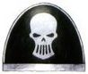
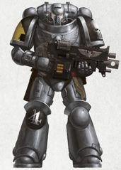
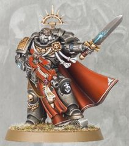
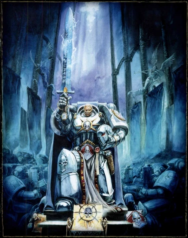
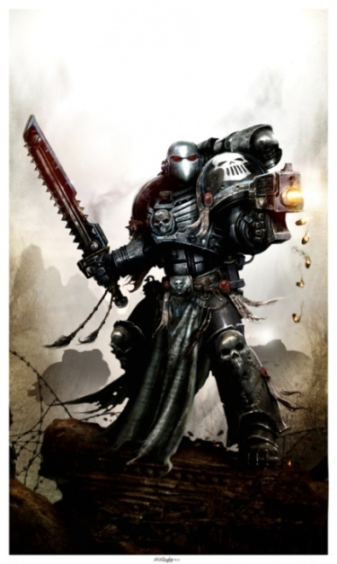
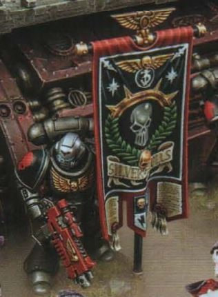

# 0444 银色颅骨 Silver Skulls

精校状态：中文行文已逐段精校，部分术语仍为暂定

分类：通用概念 / 帝国 Imperium / 中央政务部 Adeptus Terra / 阿斯塔特修会 Adeptus Astartes

原文来源：https://www.bilibili.com/opus/1123846216719794176

原作者：帝国神选罐头

原文时间：2025年10月15日 12:57

[返回分类目录](目录.md) · [全书目录](../../目录.md)

<!-- A0444-B0001 -->
**英文原文**

Victory does not always rest with the big guns, but if we rest in front of them we shall be lost. - Lord Commander Argentius, Chapter Master of the Silver Skulls

<!-- /A0444-B0001 -->

<!-- A0444-B0002 -->

原译文

胜利并不总是取决于枪炮，但如果我们在它们面前休息，我们就会失败。-银色颅骨战团长，领主指挥官阿根提乌斯

**校订译文**

“胜利未必总由巨炮决定，但若在炮口前停歇，我们就必败无疑。”——银色颅骨战团长、领主指挥官阿根提乌斯

<!-- /A0444-B0002 -->

<!-- A0444-B0003 -->
**英文原文**

The Silver Skulls are listed as an Ultramarines Successor Chapter. However, their gene-seed records are "inconclusive" and under investigation by the Ordo Hereticus.

<!-- /A0444-B0003 -->

<!-- A0444-B0004 -->

原译文

银色颅骨被列为极限战士的子战团。然而，他们的基因种子记录是“不确定的”，并且正在接受讨逆修会的调查。

**校订译文**

银色颅骨被列为极限战士子战团。不过，他们的基因种子记录“无法得出确切结论”，正由异端审判庭调查。

<!-- /A0444-B0004 -->

<!-- A0444-B0005 图片 -->

<!-- A0444-B0006 图片 -->

<!-- A0444-B0007 -->
**英文原文**

Founding Chapter:Ultramarines

<!-- /A0444-B0007 -->

<!-- A0444-B0008 -->

原译文

建军战团：极限战士

**校订译文**

母战团：极限战士

<!-- /A0444-B0008 -->

<!-- A0444-B0009 -->
**英文原文**

Founding:Possibly Second Founding

<!-- /A0444-B0009 -->

<!-- A0444-B0010 -->

原译文

建军：可能是二次建军

**校订译文**

建军：可能是二次建军

<!-- /A0444-B0010 -->

<!-- A0444-B0011 -->
**英文原文**

Chapter Master:Argentius

<!-- /A0444-B0011 -->

<!-- A0444-B0012 -->

原译文

战团长：阿根提乌斯

**校订译文**

战团长：阿根提乌斯

<!-- /A0444-B0012 -->

<!-- A0444-B0013 -->
**英文原文**

Homeworld:Varsavia (current); Lyria (former)

<!-- /A0444-B0013 -->

<!-- A0444-B0014 -->

原译文

家园世界：瓦萨维亚（现在）；利瑞亚（从前）

**校订译文**

母星：瓦萨维亚（现）；利瑞亚（原）。

<!-- /A0444-B0014 -->

<!-- A0444-B0015 -->
**英文原文**

Fortress-Monastery:Argent Mons

<!-- /A0444-B0015 -->

<!-- A0444-B0016 -->

原译文

堡垒修道院：银色山脉

**校订译文**

要塞修道院：银色山脉

<!-- /A0444-B0016 -->

<!-- A0444-B0017 -->
**英文原文**

Colours:Steel color armor, silver helmet, and black shoulder guards. Right shoulder markings are in company color. Symbol is a stylized silver skull.

<!-- /A0444-B0017 -->

<!-- A0444-B0018 -->

原译文

颜色：钢色盔甲、银色头盔和黑色肩甲。右肩标志为连队颜色。符号是一个风格化的银色颅骨。

**校订译文**

颜色：钢色盔甲、银色头盔和黑色肩甲。右肩标志为连队颜色。符号是一个风格化的银色颅骨。

<!-- /A0444-B0018 -->

<!-- A0444-B0019 -->
**英文原文**

Specialty:Siege Warfare and the use of Prognosticators

<!-- /A0444-B0019 -->

<!-- A0444-B0020 -->

原译文

专长：攻城战和预言者的使用

**校订译文**

专长：攻城战，以及运用预言者的占卜。

<!-- /A0444-B0020 -->

<!-- A0444-B0021 -->
**英文原文**

Battle Cry:Primus inter pares(First Amongst Equals)

<!-- /A0444-B0021 -->

<!-- A0444-B0022 -->

原译文

战吼：平等间之首

**校订译文**

战吼：同侪之首。

<!-- /A0444-B0022 -->

<!-- A0444-B0023 -->
## Background 背景

<!-- /A0444-B0023 -->

<!-- A0444-B0024 -->
**英文原文**

The Silver Skulls were created during the Second Founding, in the days following the Horus Heresy. Originally the Silver Skulls' homeworld was Lyria. Sometime in M33 the world was rendered a Dead World when the Silver Skulls enacted the sanction of Exterminatus upon it, to prevent it from falling under the control of the forces of Nurgle.

<!-- /A0444-B0024 -->

<!-- A0444-B0025 -->

原译文

银色颅骨是在荷鲁斯叛乱之后的二次建军期间创造的。最初，银色颅骨的家园世界是利瑞亚。在M33的某个时候，当银色骷髅对其实施灭绝令的制裁以防止其落入纳垢部队的控制之下时，世界变成了一个死亡世界。

**校订译文**

按本段记载，银色颅骨创建于荷鲁斯之乱后的二次建军，最初以利瑞亚为母星。M33某时，为防止星球落入纳垢势力控制，他们对其执行灭绝令，将其化为毫无生机的死寂世界。

**校注：** Dead World 指无生命的死寂世界，不是生命繁盛但凶险的 Death World 死亡世界。建军时间与本篇末尾来源冲突并存，未判定其中一说为唯一事实。

<!-- /A0444-B0025 -->

<!-- A0444-B0026 图片 -->

<!-- A0444-B0027 -->
**英文原文**

Since then, the chapter's homeworld has been the planet of Varsavia in the Ultima Segmentum, on the border of the Segmentum Obscurus and near the Gildar Rift, and now in the area known as Imperium Nihilus. Here the Silver Skulls are surrounded by numerous Xenos species, recently fighting costly yet significant battles against the Dark Eldar and Necrons.

<!-- /A0444-B0027 -->

<!-- A0444-B0028 -->

原译文

从那时起，该战团的家园世界一直是极限星域中的瓦萨维亚行星，位于朦胧星域的边界，靠近吉尔达裂隙，现在位于被称为帝国暗面的地区。在这里，银色骷髅被众多异型物种包围，最近与黑暗灵族和死灵进行了代价高昂但意义重大的战斗。

**校订译文**

此后，战团迁至极限星域的瓦萨维亚，靠近朦胧星域边界与吉尔达裂隙，如今位于帝国暗面。这里周围盘踞着许多异形种族，银色颅骨近来曾与黑暗灵族、太空死灵交战，虽付出高昂代价，却取得了重要战果。

<!-- /A0444-B0028 -->

<!-- A0444-B0029 -->
**英文原文**

The Silver Skulls also patrol the nearby Gildar Rift, accepting the challenges of maintaining peace in the sector, despite it being a plain and inglorious duty.

<!-- /A0444-B0029 -->

<!-- A0444-B0030 -->

原译文

银色颅骨也在附近的吉尔达裂隙巡逻，接受维护该地区和平的挑战，尽管这是一项简单而不光彩的任务。

**校订译文**

银色颅骨也巡逻邻近的吉尔达裂隙，承担维持当地和平的责任。尽管这项工作平凡、难以赢得显赫荣誉，他们仍坦然肩负。

**校注：** inglorious 指没有显赫荣耀，并非带有道德贬义的“不光彩”。

<!-- /A0444-B0030 -->

<!-- A0444-B0031 -->
**英文原文**

After the opening of the Great Rift, the Silver Skulls have been amongst the most active of all Chapters fighting against the forces of Chaos and are now fighting on many fronts across it. They have been named as one of the 10 Shield Chapters of Ultramar.

<!-- /A0444-B0031 -->

<!-- A0444-B0032 -->

原译文

大裂隙打开后，银色颅骨一直是所有对抗混沌部队的战团中最活跃的战团之一，现在正在它的许多战线上作战。他们被任命为奥特拉玛的10个盾牌战团之一。

**校订译文**

大裂隙出现后，银色颅骨是对抗混沌最积极的战团之一，在裂隙周边多条战线作战。他们也被列入十个奥特拉玛之盾战团。

<!-- /A0444-B0032 -->

<!-- A0444-B0033 -->
### Notable Campaigns 著名战役

<!-- /A0444-B0033 -->

<!-- A0444-B0034 -->
**英文原文**

In M35 the Silver Skulls along with the Howling Griffons aided the Salamanders in an invasion of Commorragh. However this invasion ultimately assisted Asdrubael Vect as he orchestrated it in order to topple Commorragh's noble houses and leave the city open for his rise to power.

<!-- /A0444-B0034 -->

<!-- A0444-B0035 -->

原译文

银色颅骨和咆哮狮鹫协助火蜥蜴入侵科摩罗。然而，这场入侵最终帮助了阿斯鲁拜尔·维克特，因为他策划了这场入侵，目的是推翻科摩罗的贵族家族，让这座城市为他掌权敞开大门。

**校订译文**

M35：银色颅骨与咆哮狮鹫协助火蜥蜴入侵科摩罗。然而，这实际上落入阿斯杜巴尔·维克特的谋划：他借入侵推翻科摩罗贵族家族，为自己夺权铺平道路。

<!-- /A0444-B0035 -->

<!-- A0444-B0036 -->
**英文原文**

Suppressing the Cult of the Red Heresy during the Plague of Unbelief with the aid of the mysterious Cypher.

<!-- /A0444-B0036 -->

<!-- A0444-B0037 -->

原译文

借助神秘的塞弗的援助，在无信瘟疫期间压制红色异端教派。

**校订译文**

借助神秘的塞弗的援助，在无信瘟疫期间压制红色异端教派。

<!-- /A0444-B0037 -->

<!-- A0444-B0038 -->
**英文原文**

679.M36: The Silver Skulls' 7th Company were deployed in support of the Beta-Garmon IV Expeditionary Force, aiding the Rogue Trader Khorlu to re-discover and conquer the fabled Beta-Garmon System in the Veil of Kanth region. For their sacrifice and aid in helping him secure the System, Khorlu later ceded them the planet Beta-Garmon IV, considered the jewel of this System.

<!-- /A0444-B0038 -->

<!-- A0444-B0039 -->

原译文

银色颅骨的第七连队被部署以支援贝塔·伽蒙四号远征部队，帮助行商浪人霍鲁重新发现并征服了坎特面纱地区中传说中的贝塔·伽蒙星系。由于他们的牺牲和帮助，霍鲁后来将贝塔·伽蒙四号行星割让给了他们，贝塔·伽蒙四号被认为是这个星系的宝石。

**校订译文**

679.M36：银色颅骨第七连支援贝塔·伽蒙四号远征军，帮助行商浪人霍鲁重新发现并征服坎特面纱地区传说中的贝塔·伽蒙星系。为酬谢战团的牺牲与援助，霍鲁后来将被视为星系明珠的贝塔·伽蒙四号割让给他们。

<!-- /A0444-B0039 -->

<!-- A0444-B0040 -->
**英文原文**

165.M37: The Antecanis Massacre — During the 9th Black Crusade, Abaddon, the Black Legion and their allies attack and decimate the Hive World of Antecanis with the aim of denying the Imperial Naval Shipyards at Cancephalus with their source of manpower. As Chaos rampages across the planet, the Silver Skulls are the first to arrive and harry the Chaos fleet in hit and run attacks, denying orbital support to Chaos ground forces. Finally, with Imperial reinforcements inbound, Abaddon loads the Black Legion ships with slaves and plunder and breaks the Silver Skulls blockade of the system, leaving his allies behind to distract the Imperium.

<!-- /A0444-B0040 -->

<!-- A0444-B0041 -->

原译文

南河三大屠杀 - 在第九次黑色远征期间，阿巴顿、黑色军团及其盟友袭击并摧毁了南河三的巢都世界，目的是否认位于坎塞法鲁斯的帝国海军造船厂的人力资源。当混沌在行星上肆虐时，银色颅骨是第一个到达并在跑打攻击中骚扰混沌舰队的人，否定为混沌地面部队提供的轨道支援。最后，随着帝国援军的到来，阿巴顿将奴隶和战利品装载到黑色军团的舰船上，打破了银色颅骨对星系的封锁，留下他的盟友来分散帝国的注意力。

**校订译文**

165.M37：南河三大屠杀——第九次黑色远征中，阿巴顿率黑色军团与盟友攻袭巢都世界南河三，意图切断坎塞法鲁斯帝国海军船坞的兵源。混沌军肆虐行星时，银色颅骨率先赶到，以打了就走的袭扰战术牵制敌方舰队，阻止其支援地面部队。帝国援军将至时，阿巴顿把奴隶与掠夺品装满黑色军团战舰，突破战团的星系封锁，并抛下盟友牵制帝国军。

<!-- /A0444-B0041 -->

<!-- A0444-B0042 -->
**英文原文**

770-791.M38: The Great Malagantine Purge — The Silver Skulls are one of five Space Marine Chapters in a group referred to as the Manus Irae. This group is ordered by the High Lords to "Spare none and set a bloody, fearful example to the realm of Mankind" by cleansing the Malagantine Sector. The reasons remain to this day unknown to anyone, not even the Inquisition, with the knowledge hidden in the vaults of Terra.

<!-- /A0444-B0042 -->

<!-- A0444-B0043 -->

原译文

大马拉甘廷净化 — 银色颅骨是被称为愤怒之手的五个星际战士战团之一。这群人被高领主命令“毫不留情，为人类王国树立一个血腥、可怕的示例”通过清洗马拉甘廷星区。至今，任何人都不知道原因，即使是审判庭也不知道，因为知识隐藏在泰拉的秘库里。

**校订译文**

770—791.M38：马拉甘廷大清洗——银色颅骨与另外四个星际战士战团组成“愤怒之手”。高领主命他们清洗马拉甘廷星区，“一个不留，为人类疆域立下血腥而可怖的警示”。行动原因至今不为外界所知，就连审判庭也无从得知，相关秘密仍封存在泰拉密库中。

<!-- /A0444-B0043 -->

<!-- A0444-B0044 -->
**英文原文**

698.M41: The Corinth Crusade — The Silver Skulls were part of combined Space Marine force led by Marneus Calgar, consisting of the Angels of Absolution, Lamenters, Marines Errant, Scythes of the Emperor, the Ultramarines and over fifty Imperial Guard Regiments. During a seven year crusade the force inflicted a series of major defeats on Waaagh! Skargor in the Corinth system within the Ork empire of Charadon. By the time the crusade finished, Waaagh! Skargor was destroyed and the invasion of Waaagh! Argluk was delayed for thirty years.

<!-- /A0444-B0044 -->

<!-- A0444-B0045 -->

原译文

科林斯远征 - 银色颅骨是马涅乌斯·卡尔加领导的联合星际战士部队的一部分，由赦免天使、恸哭者、游侠战士、帝皇之镰、极限战士和五十多个帝国卫队兵团组成。在为期七年的远征中，该部队由于查拉顿的欧克帝国里的科林斯星系里的斯卡戈尔的Waaagh！遭受了一系列重大失败。远征结束时，斯卡戈尔的Waaagh！被摧毁，阿格鲁克的Waaagh！的入侵被推迟了三十年。

**校订译文**

698.M41：科林斯远征——银色颅骨加入马涅乌斯·卡尔加指挥的联合部队，与赦免天使、恸哭者、游侠战士、帝皇之镰、极限战士及五十余个帝国卫队团共同作战。七年间，他们在查拉顿欧克帝国境内的科林斯星系，接连重创 Waaagh! 斯卡戈尔。远征结束时，这支欧克大军已被摧毁，Waaagh! 阿格鲁克的入侵也被延迟了三十年。

**校注：** inflicted defeats on 指帝国部队重创欧克，原译却写成帝国部队遭受失败，现修复胜负关系。

<!-- /A0444-B0045 -->

<!-- A0444-B0046 -->
**英文原文**

954.M41: The imminent attack by the Soulmaw. The Silver Skulls' Librarians suspected an imminent attack by the Daemonic warband, the Soulmaw, on their homeworld. Most of the chapter was absent from Varsavia due to answering a distress call from the Silver Skull vassal world of Aragave which was being ravaged by an unidentified warband of Daemons. The Daemons quickly vanished as soon as the Silver Skulls forces arrived, successfully luring them away from Varsavia. This could have be in retribution for Librarian Lucius Clave reportedly destroying the Soulmaw champion years before in 892.M40 during the scouring of Ammas. In 956.M41, the Soulmaw assaulted the Silver Skulls homeworld, but they managed to resist the attack.

<!-- /A0444-B0046 -->

<!-- A0444-B0047 -->

原译文

魂喉即将发动的攻击。银色颅骨的智库怀疑恶魔战帮魂喉即将对他们的家园世界发动袭击。战团的大部分成员都没有出现在瓦萨维亚，因为他们接到了银色颅骨附庸世界阿拉吉夫的求救呼叫，而阿拉吉夫正被一个身份不明的恶魔战帮蹂躏。银色颅骨部队一到，恶魔们就迅速消失了，成功地将他们从瓦萨维亚引诱走。这可能是对智库卢修斯·克拉夫的报复，据报告，他在892.M40在搜查阿玛斯期间摧毁了魂喉冠军。956.M41，魂喉袭击了银色颅骨的家园世界，但他们设法抵抗了这次袭击。

**校订译文**

954.M41：魂喉威胁——银色颅骨智库员预感恶魔战帮魂喉即将攻击母星。当时，战团主力应附庸世界阿拉吉夫的求援离开瓦萨维亚，前去对付一支身份不明的恶魔战帮；援军一到，恶魔就迅速消失，成功调开了母星守军。此举可能是报复智库员卢修斯·克拉夫，据称他在892.M40清剿阿玛斯时杀死过魂喉的一名冠军。956.M41，魂喉正式袭击母星，但被战团抵挡。

**校注：** 原文为892.M40与954／956.M41，相距超过千年；保留源文年代，不将其改写为仅数年前。

<!-- /A0444-B0047 -->

<!-- A0444-B0048 -->
**英文原文**

998.M41: The Third War for Armageddon — Records show them to have been deployed to Armageddon during the Third War. Here they deployed seven out of ten companies of Space Marines to fight the Orks.

<!-- /A0444-B0048 -->

<!-- A0444-B0049 -->

原译文

第三次阿玛吉多顿战争 — 记录显示，他们在第三次战争期间被部署到阿玛吉多顿。在这里，他们部署了十分之七的星际战士连队与欧克作战。

**校订译文**

998.M41：第三次阿玛吉多顿战争——战团派出十个连队中的七个，前往阿玛吉多顿对抗欧克。

<!-- /A0444-B0049 -->

<!-- A0444-B0050 -->
**英文原文**

999.M41: The Zeist Campaign — The Silver Skulls heeded the call of Lord Macragge, and provided tactical squads to fight for the liberation of Augura (a staging point for the Tau forces).

<!-- /A0444-B0050 -->

<!-- A0444-B0051 -->

原译文

泽斯特战役 — 银色颅骨响应了马库拉格领主的号召，提供战术小队为解放奥古拉（钛部队的集结点）而战。

**校订译文**

999.M41：泽斯特战役——银色颅骨响应马库拉格领主号召，派出战术小队，参与解放作为钛族集结地的奥古拉。

<!-- /A0444-B0051 -->

<!-- A0444-B0052 -->

原译文

Late M41 - the Lazar Blockade 拉扎尔封锁

**校订译文**

Late M41 - the Lazar Blockade 拉扎尔封锁

<!-- /A0444-B0052 -->

<!-- A0444-B0053 -->

原译文

The Yria Massacre 伊里亚大屠杀

**校订译文**

The Yria Massacre 伊里亚大屠杀

<!-- /A0444-B0053 -->

<!-- A0444-B0054 -->
**英文原文**

The Gildar Rift (M41, exact date unknown) — after destroying a Red Corsairs battle force, the Silver Skulls under Captain Daerys Arrun pursue the renegade fugitives to a string of inhabited worlds across the Gildar Rift, wiping them out in a matter of weeks.

<!-- /A0444-B0054 -->

<!-- A0444-B0055 -->

原译文

吉尔达裂隙（M41，确切日期未知）— 在摧毁了一支红海盗战斗部队后，戴里斯·阿伦连长率领的银色颅骨将叛徒追捕到吉尔达裂隙另一边的一系列有人居住的世界，并在几周内将他们消灭。

**校订译文**

吉尔达裂隙（M41，确切日期未知）— 在摧毁了一支红海盗战斗部队后，戴里斯·阿伦连长率领的银色颅骨将叛徒追捕到吉尔达裂隙另一边的一系列有人居住的世界，并在几周内将他们消灭。

<!-- /A0444-B0055 -->

<!-- A0444-B0056 -->
**英文原文**

The Purging — (M41, exact date unknown) - Receiving distress signals from the planet Equinox, a small detachment of Silver Skulls arrived, with the aim of cleansing the planet of the influence of Chaos. They tirelessly swept through the city-states of Equinox one by one in a bloody massacre. The population, already halved by disease and starvation, was halved again and whole areas of city-states were used as mass graves. The Silver Skulls left as quickly as they had struck, fading to nothing more than a bloody memory in the collective consciousness of the survivors.

<!-- /A0444-B0056 -->

<!-- A0444-B0057 -->

原译文

大净化（M41，确切日期未知）— 接收到来自二分行星的求救信号后，一小队银色颅骨抵达，目的是清除行星上的混沌影响。他们不知疲倦地一个接一个地席卷了二分的城邦，进行了一场血腥的大屠杀。由于疾病和饥饿，人口已经减半，现在又减半了，整个城邦地区都被用作万人坑。银色颅骨像袭击一样迅速地离开了，在幸存者的集体意识中只剩下一段血腥的记忆。

**校订译文**

大净化（M41，确切日期不明）——收到二分行星的求救信号后，一支银色颅骨小规模分遣队抵达，准备肃清混沌影响。他们逐一席卷各城邦，展开血腥屠杀。当地人口原已因疾病与饥荒减少一半，如今再次减半，大片城邦区域沦为集体坟场。战团来去同样迅速，最终只在幸存者的共同记忆中留下一道血痕。

<!-- /A0444-B0057 -->

<!-- A0444-B0058 -->
**英文原文**

The Second Relief of Mordian, M42 — The Silver Skulls aid the Iron Hands and their successor chapters against Chaos forces.

<!-- /A0444-B0058 -->

<!-- A0444-B0059 -->

原译文

第二次莫迪安救援，M42 — 银色骷髅帮助钢铁之手及其子战团对抗混沌部队。

**校订译文**

第二次莫迪安救援，M42 — 银色颅骨帮助钢铁之手及其子战团对抗混沌部队。

<!-- /A0444-B0059 -->

<!-- A0444-B0060 -->
**英文原文**

The Battle of Horestis (M41, date unknown) — Prognosticator Vorxec Calvarus leads 50 battle-brothers against Nurgle cultists, but most are exposed to a Virus Bomb. After narrowly surviving, Calvarus endures 49 days of agony before he turns to Nurgle and forms a band of raiders.

<!-- /A0444-B0060 -->

<!-- A0444-B0061 -->

原译文

霍斯蒂斯之战（M41，日期未知）-预言者沃雷克斯·卡尔瓦鲁斯带领50名战斗兄弟对抗纳垢邪教徒，但大多数人都暴露在了病毒炸弹中。在勉强幸存下来后，卡尔瓦鲁斯忍受了49天的痛苦，然后转向纳垢并组成了一队袭击者。

**校订译文**

霍斯蒂斯之战（M41，年份不详）——预言者沃雷克斯·卡尔瓦鲁斯率50名战斗兄弟讨伐纳垢信徒，多数人却遭病毒炸弹侵袭。卡尔瓦鲁斯勉强活下来，忍受49天折磨后投向纳垢，组建了一支掠袭战帮。

<!-- /A0444-B0061 -->

<!-- A0444-B0062 -->
**英文原文**

Battle of Skataurus — year unknown. There Silver Skulls found that only Centurion Assault Squad could make headway through the rubble of previously proud avenues of the main city. Heretics of Skataurus soon understand that not dug-in tanks, not reinforced bunkers of the hive could stop the hulking warriors. Massed cultist ambushes also proved useless and soon rebellion was suppressed.

<!-- /A0444-B0062 -->

<!-- A0444-B0063 -->

原译文

斯卡陶洛斯之战 — 年份不详。在那里，银色颅骨发现，只有百夫长突击小队才能在主城区以前引以为傲的街道的废墟中取得进展。斯卡陶洛斯的异端很快就明白，没有战壕坦克，也没有巢都的加固掩体，能阻止庞大的战士。大规模的邪教徒伏击也被证明是无用的，叛乱很快就被镇压了。

**校订译文**

斯卡陶洛斯之战（年份不详）——银色颅骨发现，只有百夫长突击小队能在主城昔日宏伟大道的废墟中持续推进。异端很快明白，无论掘壕隐蔽的坦克，还是巢都加固碉堡，都拦不住这些庞大战士。大批信徒发动的伏击也徒劳无功，叛乱不久便被镇压。

<!-- /A0444-B0063 -->

<!-- A0444-B0064 -->
**英文原文**

The War of Beasts on Vigilus in early M42 — The Silver Skulls send a single company.

<!-- /A0444-B0064 -->

<!-- A0444-B0065 -->

原译文

M42早期警戒星的野兽战争 — 银色颅骨派了一个连队。

**校订译文**

M42早期：警戒星野兽之战——银色颅骨派出一个连队。

<!-- /A0444-B0065 -->

<!-- A0444-B0066 -->

原译文

The Nachmund Rift War 纳克蒙德走廊战争

**校订译文**

The Nachmund Rift War 纳克蒙德裂隙战争

<!-- /A0444-B0066 -->

<!-- A0444-B0067 -->

原译文

The Season of Blood 血季

**校订译文**

The Season of Blood 血季

<!-- /A0444-B0067 -->

<!-- A0444-B0068 -->
## Culture 文化

<!-- /A0444-B0068 -->

<!-- A0444-B0069 -->
**英文原文**

The Silver Skulls are recruited from the fierce tribesmen of Varsavia and this culture has bled into the Chapter. They bury their warriors upon Varsavia's moon of Pax Argentius, believing that the spirits of their ancestors watch over them. The ashes of the fallen are placed in urns and put on display after prayer rituals. The honored dead include not just warriors but also Chapter Serfs. The Chapter homeworld's culture has also given them a fearful reputation as headhunters. As part of its post-battle rituals, the Chapter selects the heads of the most powerful enemies, flense flesh from bone and layer the skulls in a coat of silver to be displayed within the Fortress-Monastery. The Silver Skulls also tattoo the skin of their entire bodies in honour markings, with the face being the last area to be marked; the right to do so must be earned in battle.

<!-- /A0444-B0069 -->

<!-- A0444-B0070 -->

原译文

银色颅骨是从瓦萨维亚的凶猛部落中招募的，这种文化已经渗透到了战团。他们将战士埋葬在瓦萨维亚的卫星银白和平上，相信他们祖先的灵魂会守护他们。死者的骨灰被放入骨灰瓮，在祈祷仪式后展出。光荣的死者不仅包括战士，还包括战团侍从。战团的家园世界文化也给他们带来了猎头的可怕声誉。作为其战后仪式的一部分，该战团选择了最强大的敌人的头，从骨头上剥下血肉，并将头骨包裹在银涂层中，在堡垒修道院内展示。银色颅骨也在全身皮肤上纹上荣誉标记，脸是最后一个被标记的区域；这样做的权利必须在战斗中获得。

**校订译文**

银色颅骨是从瓦萨维亚的凶猛部落中招募的，这种文化已经渗透到了战团。他们将战士埋葬在瓦萨维亚的卫星银白和平上，相信他们祖先的灵魂会守护他们。死者的骨灰被放入骨灰瓮，在祈祷仪式后展出。光荣的死者不仅包括战士，还包括战团农奴。战团的家园世界文化也给他们带来了猎头的可怕声誉。作为其战后仪式的一部分，该战团选择了最强大的敌人的头，从骨头上剥下血肉，并将头骨包裹在银涂层中，在要塞修道院内展示。银色颅骨也在全身皮肤上纹上荣誉标记，脸是最后一个被标记的区域；这样做的权利必须在战斗中获得。

<!-- /A0444-B0070 -->

<!-- A0444-B0071 图片 -->

<!-- A0444-B0072 -->

原译文

Silver Skulls Captain 银色颅骨连长

**校订译文**

Silver Skulls Captain 银色颅骨连长

<!-- /A0444-B0072 -->

<!-- A0444-B0073 -->
**英文原文**

Presumably, the chapter did not have these cultural influences when their homeworld was the planet of Lyria.

<!-- /A0444-B0073 -->

<!-- A0444-B0074 -->

原译文

据推测，当他们的家园世界是利瑞亚行星时，这一战团并没有这些文化影响。

**校订译文**

据推测，当他们的家园世界是利瑞亚行星时，这一战团并没有这些文化影响。

<!-- /A0444-B0074 -->

<!-- A0444-B0075 -->
**英文原文**

The current Chapter Master of the Silver Skulls always bears the name of Argentius upon assuming command. Currently, they are on their 27th bearer of the name. Likewise, their Chief Prognosticator bears the name of Vashiro, meaning "The One Who Sees". The current "Vashiro" has held the name for over 500 years.

<!-- /A0444-B0075 -->

<!-- A0444-B0076 -->

原译文

银色颅骨的现任战团长在担任指挥官时总是以阿根提乌斯之名命名。目前，他已经是该名字的第27位持有者。同样，他们的首席预言者名为瓦西罗，意思是“看得见的人”。现在的“瓦西罗”持有这个名字已经有500多年。

**校订译文**

银色颅骨的战团长就任时都会采用“阿根提乌斯”之名，现任已是第27位承名者。首席预言者同样承袭“瓦西罗”之名，意为“洞见者”；现任瓦西罗使用这一名字已超过500年。

<!-- /A0444-B0076 -->

<!-- A0444-B0077 -->
## Organization 组织

<!-- /A0444-B0077 -->

<!-- A0444-B0078 -->
**英文原文**

The Silver Skulls organize themselves primarily along the lines written in the Codex Astartes, however the 9th Company has been altered from a reserve Devastator Company into a designated "Siege" company, with the 9th Company's captain holding the title of "Siege Captain".

<!-- /A0444-B0078 -->

<!-- A0444-B0079 -->

原译文

银色颅骨主要按照《阿斯塔特圣典》中的规定组织起来，但第九连队已从一个预备的毁灭者连队改为一个指定的“攻城”连队，第九连的队长拥有“攻城连长”的头衔。

**校订译文**

银色颅骨大体遵循《阿斯塔特圣典》，但将第九连从预备破坏者连改编为专门的攻城连，其连长相应拥有“攻城连长”职衔。

<!-- /A0444-B0079 -->

<!-- A0444-B0080 -->
**英文原文**

The chapter hosts two orders of Chapter Champions:

<!-- /A0444-B0080 -->

<!-- A0444-B0081 -->

原译文

战团包含两种战团冠军：

**校订译文**

战团包含两种战团冠军：

<!-- /A0444-B0081 -->

<!-- A0444-B0082 -->
**英文原文**

The Prognosticars, elite battle-psykers and part of the Prognosticatum.

<!-- /A0444-B0082 -->

<!-- A0444-B0083 -->

原译文

预言者，精英战斗灵能者和预言厅的一部分。

**校订译文**

预言者（Prognosticars）——隶属预言厅的精锐战斗灵能者。

**校注：** 英文在此用 Prognosticars，后文通称用 Prognosticators；中文沿原稿均作预言者，并保留本段英文词形，未凭近似拼写另造未经证实的等级。

<!-- /A0444-B0083 -->

<!-- A0444-B0084 -->
**英文原文**

The Talriktug, the chapter's elite non-psychic warriors and considered second only to the Prognosticars, part of the 1st Company.

<!-- /A0444-B0084 -->

<!-- A0444-B0085 -->

原译文

塔尔里克图格，该战团的精英非灵能战士，被认为仅次于第一连队的预言者。

**校订译文**

塔尔里克图格——战团的非灵能精锐，地位仅次于预言者，隶属第一连。

**校注：** part of the 1st Company 指塔尔里克图格隶属第一连，原译错误接到预言者身上。

<!-- /A0444-B0085 -->

<!-- A0444-B0086 -->
**英文原文**

The Silver Skulls paint their company signifier as a number on their knee pad, while their squad number is paints upon their backpack. They also paint their role signifier on their right pauldron (with the signified painted in the company's colour), while they place their chapter emblem on their left pauldron.

<!-- /A0444-B0086 -->

<!-- A0444-B0087 -->

原译文

银色颅骨将他们的连队标志画在膝甲上的数字上，而他们的小队号码则画在背包上。他们还将他们的角色标志画在他们的右肩甲上（用连队的颜色绘制所指），同时将他们的战团徽章放在他们的左肩甲上。

**校订译文**

银色颅骨在膝甲上绘制连队编号，在背包上标明小队编号；右肩甲以所属连队颜色绘制兵种标志，左肩甲则佩戴战团徽记。

<!-- /A0444-B0087 -->

<!-- A0444-B0088 图片 -->

<!-- A0444-B0089 -->

原译文

Silver Skulls Marine 银色颅骨战士

**校订译文**

Silver Skulls Marine 银色颅骨战士

<!-- /A0444-B0089 -->

<!-- A0444-B0090 -->
## Combat Doctrine 作战理论

<!-- /A0444-B0090 -->

<!-- A0444-B0091 -->
**英文原文**

The Silver Skulls primarily hold to the tenants and tactics of the Codex Astartes, however they further specialize in siege warfare. In battle, the chapter is known for being relentless, efficient, and extremely pragmatic, not adverse to using whatever tactics it takes to win. When engaged in melee combat, they are known for their barbaric brutality.

<!-- /A0444-B0091 -->

<!-- A0444-B0092 -->

原译文

银色颅骨主要保留了阿斯塔特圣典的工作和战术，但他们还专门从事攻城战。在战斗中，该战团以无情、高效和极其务实而闻名，不反对使用任何战术来获胜。当进行近战时，他们以野蛮残忍而闻名。

**校订译文**

银色颅骨以《阿斯塔特圣典》的原则与战术为基础，进一步专精攻城战。作战时，他们坚定、高效且极为务实，只要能取胜，就不排斥使用相应战术。近战中，他们则以野蛮凶狠闻名。

**校注：** tenants 疑为 tenets，指原则／教条，并非原译工作。

<!-- /A0444-B0092 -->

<!-- A0444-B0093 -->
**英文原文**

Their most notable aspect is the use of Prognosticators, the Silver Skulls Librarians and partial spiritual advisor alongside their Chaplains. These warriors are the seers of the Chapter, reading the Emperor's Tarot or Rune-stones for divination of the future, granting the squads and companies they are attached to an edge for the coming battle. The Chapter takes the readings seriously, as such that on some occasions, the Prognosticators have counselled against the Chapter becoming embroiled in a particular war, however this can prove problematic as the honour of the chapter at times demands that they take part in a battle they know will end in defeat. Despite this somewhat fickle nature, the Chapter is known to fight with honour the length and breadth of the Imperium.

<!-- /A0444-B0093 -->

<!-- A0444-B0094 -->

原译文

他们最引人注目的方面是使用预言者、银色颅骨智库和部分精神顾问以及他们的牧师。这些战士是本战团的预言家，他们阅读帝皇塔罗牌或符文石来占卜未来，为即将到来的战斗赋予他们所属的小队和连队优势。本战团认真对待阅读材料，因此在某些情况下，预言者建议本战团不要卷入特定的战争，但这可能会带来问题，因为本战团的荣誉有时要求他们参加一场他们知道会以失败告终的战斗。尽管有点变化无常，但众所周知，该战团在帝国的长度和广度上都以荣誉而战。

**校订译文**

战团最显著的特点，是依赖预言者——也就是银色颅骨的智库员。他们与教士共同承担部分精神引导职责，并以帝皇塔罗牌或符文石占卜未来，为配属的小队和连队争取战前优势。战团极重视占卜结果，预言者有时会建议避免卷入某场战争。但这也会造成两难：为了维护荣誉，他们有时必须投身明知将败的战斗。尽管决策看似变化不定，银色颅骨仍以在帝国各地恪守荣誉而战著称。

**校注：** 原文为“预言者，即本战团智库员”，不是预言者、智库、精神顾问三类人并列；readings 指占卜结果，非阅读材料。

<!-- /A0444-B0094 -->

<!-- A0444-B0095 -->
## Geneseed 基因种子

<!-- /A0444-B0095 -->

<!-- A0444-B0096 -->
**英文原文**

The Silver Skulls claim and are believed to be descendants of the Ultramarines Chapter; however, with the passage of time this remains unconfirmed, although they behave as a Codex Chapter and fight alongside the Primogenitor Chapters as if they were their own kin. During the Thirteenth Black Crusade, the Primarch Guilliman returned to the Imperium and the Chapter was recognized as one of the Scions of Guilliman.

<!-- /A0444-B0096 -->

<!-- A0444-B0097 -->

原译文

银色颅骨声称并被认为是极限战士的后裔；然而，随着时间的推移，这一点仍未得到证实，尽管他们表现得像圣典战团一样，与始祖战团并肩作战，就好像他们是自己的血亲一样。在第十三次黑色远征期间，原体基里曼回到了帝国，该战团被公认为基里曼的一个后裔。

**校订译文**

银色颅骨声称并被认为是极限战士的后裔；然而，随着时间的推移，这一点仍未得到证实，尽管他们表现得像圣典战团一样，与始祖战团并肩作战，就好像他们是自己的血亲一样。在第十三次黑色远征期间，原体基里曼回到了帝国，该战团被公认为基里曼的一个后裔。

<!-- /A0444-B0097 -->

<!-- A0444-B0098 -->
**英文原文**

The Silver Skulls' geneseed has also been under investigation by the Ordo Hereticus. For unknown reasons, the chapter's geneseed records were so heavily classified that Inquisitor Liandra Callis struggled to obtain them, despite visiting the genevaults of Terra itself. However, the inquisitor eventually completed her investigation. While the chapter was shown to be free of taint or mutation, when the results of the investigation were presented to the Silver Skulls leadership, it was feared that their origins could cause a schism within the chapter were the rest of the Silver Skulls to learn of them.

<!-- /A0444-B0098 -->

<!-- A0444-B0099 -->

原译文

讨逆修会也在调查银色颅骨的基因种子。由于未知的原因，该战团的基因种子记录被严格保密，以至于审判官莉安德拉·卡利斯尽管参观了泰拉本身的基因库，但还是很难获得它们。然而，审判官最终完成了她的调查。虽然该战团被证明没有污点或突变，但当调查结果提交给银色颅骨领导层时，人们担心，如果其他银色颅骨了解到它们，它们的起源可能会导致该战团内部的分裂。

**校订译文**

异端审判庭也曾调查银色颅骨的基因种子。其记录因不明原因被列为高度机密，审判官莉安德拉·卡利斯即使亲赴泰拉基因密库，也难以取得。她最终还是完成了调查，证明战团没有污染或突变。然而，当结果呈交战团领导层时，人们担忧，一旦其余成员得知真正的血脉来源，可能引发内部分裂。

**校注：** 源文只称真正起源可能引发分裂，没有在本段明确揭示另一个母军团；因此未自行认定钢铁勇士血脉。

<!-- /A0444-B0099 -->

<!-- A0444-B0100 图片 -->

<!-- A0444-B0101 -->

原译文

Silver Skulls Primaris Ancient displaying the banner of the 3rd Company 银色颅骨原铸旗手展示第三连队旗帜

**校订译文**

Silver Skulls Primaris Ancient displaying the banner of the 3rd Company 银色颅骨原铸旗手展示第三连队旗帜

<!-- /A0444-B0101 -->

<!-- A0444-B0102 -->
## Known Chapter Elements 已知战团人物与事物

原题：Known Chapter Elements 著名战团成员

<!-- /A0444-B0102 -->

<!-- A0444-B0103 -->
### Relics 圣物

<!-- /A0444-B0103 -->

<!-- A0444-B0104 -->
**英文原文**

Argent Guide - Emperor's Tarot - Gifted to Watch Fortress Erioch and used by members of the chaptered seconded to them.

<!-- /A0444-B0104 -->

<!-- A0444-B0105 -->

原译文

银白指引 - 帝皇塔罗牌 - 被授予监视埃里奥要塞的天赋，并被借调给他们的战团成员使用。

**校订译文**

银白指引——一副赠予埃里奥守望要塞的帝皇塔罗牌，供借调至该处的银色颅骨成员使用。

**校注：** Gifted to 是赠予，非获得监视要塞的天赋；补明确接受者为守望要塞。

<!-- /A0444-B0105 -->

<!-- A0444-B0106 -->
**英文原文**

Silverstrike - Stalker Bolt Rifle - Mastercrafted. Wielded by Captain Argentus.

<!-- /A0444-B0106 -->

<!-- A0444-B0107 -->

原译文

银色打击 - 追猎者爆矢步枪 - 大师级。由阿根图斯连长挥舞。

**校订译文**

银色打击——一把大师精工追猎者爆矢步枪，由阿根图斯连长使用。

<!-- /A0444-B0107 -->

<!-- A0444-B0108 -->
**英文原文**

Soul Render - Force Sword - Wielded by Prognosticator Rhondus.

<!-- /A0444-B0108 -->

<!-- A0444-B0109 -->

原译文

供魂者 - 灵能剑 - 由预言者朗多斯使用。

**校订译文**

裂魂者——预言者朗多斯使用的灵能剑。

<!-- /A0444-B0109 -->

<!-- A0444-B0110 -->
### Chapter Fleet 战团舰队

<!-- /A0444-B0110 -->

<!-- A0444-B0111 -->
**英文原文**

Argent Hammer — Battle Barge

<!-- /A0444-B0111 -->

<!-- A0444-B0112 -->

原译文

银白之锤 — 战斗驳船

**校订译文**

银白之锤号——战斗驳船。

<!-- /A0444-B0112 -->

<!-- A0444-B0113 -->
**英文原文**

Manifest Destiny - Battle Barge

<!-- /A0444-B0113 -->

<!-- A0444-B0114 -->

原译文

天定命运 - 战斗驳船

**校订译文**

天定命运号——战斗驳船。

<!-- /A0444-B0114 -->

<!-- A0444-B0115 -->
**英文原文**

Silver Arrow — Strike Cruiser

<!-- /A0444-B0115 -->

<!-- A0444-B0116 -->

原译文

银色之剑 — 打击巡洋舰

**校订译文**

银色之箭号——打击巡洋舰。

**校注：** Arrow 是箭，原译银色之剑误作 Sword。

<!-- /A0444-B0116 -->

<!-- A0444-B0117 -->
**英文原文**

Quicksilver - Strike Cruiser

<!-- /A0444-B0117 -->

<!-- A0444-B0118 -->

原译文

快银 - 打击巡洋舰

**校订译文**

快银号——打击巡洋舰。

<!-- /A0444-B0118 -->

<!-- A0444-B0119 -->
**英文原文**

Dread Argent - Strike Cruiser

<!-- /A0444-B0119 -->

<!-- A0444-B0120 -->

原译文

恐惧白银 - 打击巡洋舰

**校订译文**

恐惧白银号——打击巡洋舰。

<!-- /A0444-B0120 -->

<!-- A0444-B0121 -->
**英文原文**

Spear of Destiny - Strike Cruiser

<!-- /A0444-B0121 -->

<!-- A0444-B0122 -->

原译文

命运之矛 - 打击巡洋舰

**校订译文**

命运之矛号——打击巡洋舰。

<!-- /A0444-B0122 -->

<!-- A0444-B0123 -->
**英文原文**

Seer's Steed - Thunderhawk

<!-- /A0444-B0123 -->

<!-- A0444-B0124 -->

原译文

预言家之骑 - 雷鹰

**校订译文**

预言者之骑号——雷鹰。

<!-- /A0444-B0124 -->

<!-- A0444-B0125 -->
### Notable Silver Skulls 著名银色颅骨

<!-- /A0444-B0125 -->

<!-- A0444-B0126 -->
### Chapter Master 战团长

<!-- /A0444-B0126 -->

<!-- A0444-B0127 -->
**英文原文**

Lord Commander Argentius — Silver Skulls' 27th Chapter Master. The current "Argentius" is believed to be "Artreus", formerly captain of 6th Company.

<!-- /A0444-B0127 -->

<!-- A0444-B0128 -->

原译文

领主指挥官阿根提乌斯 — 银色颅骨第27任战团长。目前的“阿根提乌斯”被认为是“阿特柔斯”，前第六连队连长。

**校订译文**

领主指挥官阿根提乌斯 — 银色颅骨第27任战团长。目前的“阿根提乌斯”被认为是“阿特柔斯”，前第六连队连长。

<!-- /A0444-B0128 -->

<!-- A0444-B0129 -->
### Prognosticatum 预言厅

原题：Prognosticatum 预言者

<!-- /A0444-B0129 -->

<!-- A0444-B0130 -->
**英文原文**

Chief Prognosticator Vashiro - the current "Vashiro"'s birth name is "Aerus".

<!-- /A0444-B0130 -->

<!-- A0444-B0131 -->

原译文

首席预言者瓦西罗 - 目前“瓦西罗”的出生名是“埃罗斯”。

**校订译文**

首席预言者瓦西罗 - 目前“瓦西罗”的出生名是“埃罗斯”。

<!-- /A0444-B0131 -->

<!-- A0444-B0132 -->

原译文

Epistolary Thule 星语官图勒

**校订译文**

Epistolary Thule 星语官图勒

<!-- /A0444-B0132 -->

<!-- A0444-B0133 -->

原译文

Prognosticator Andus 预言者安杜斯

**校订译文**

Prognosticator Andus 预言者安杜斯

<!-- /A0444-B0133 -->

<!-- A0444-B0134 -->
**英文原文**

Prognosticator Bhehan - attached to First Company, formerly attached to the 5th then 8th Companies

<!-- /A0444-B0134 -->

<!-- A0444-B0135 -->

原译文

预言者贝汉 - 隶属于第一连队，以前隶属于第五和第八连队

**校订译文**

预言者贝汉 - 隶属于第一连队，以前隶属于第五和第八连队

<!-- /A0444-B0135 -->

<!-- A0444-B0136 -->
**英文原文**

Prognosticator Brand - attached to the 4th Company and acts as its senior adviser.

<!-- /A0444-B0136 -->

<!-- A0444-B0137 -->

原译文

预言者布兰德 - 隶属于第四连队，担任其高级顾问。

**校订译文**

预言者布兰德 - 隶属于第四连队，担任其高级顾问。

<!-- /A0444-B0137 -->

<!-- A0444-B0138 -->
**英文原文**

Prognosticator Rennin Tri'el - currently serving in the Deathwatch

<!-- /A0444-B0138 -->

<!-- A0444-B0139 -->

原译文

预言者雷宁·特里尔 - 目前在死亡守望中服役

**校订译文**

预言者雷宁·特里尔 - 目前在死亡守望中服役

<!-- /A0444-B0139 -->

<!-- A0444-B0140 -->
**英文原文**

Prognosticator Rhondus - (deceased)

<!-- /A0444-B0140 -->

<!-- A0444-B0141 -->

原译文

预言者朗多斯 -（已故）

**校订译文**

预言者朗多斯 -（已故）

<!-- /A0444-B0141 -->

<!-- A0444-B0142 -->
**英文原文**

Prognosticator Aharan - (deceased)

<!-- /A0444-B0142 -->

<!-- A0444-B0143 -->

原译文

预言者阿哈兰 -（已故）

**校订译文**

预言者阿哈兰 -（已故）

<!-- /A0444-B0143 -->

<!-- A0444-B0144 -->
**英文原文**

(former) Prognosticator Vorxec Calvarius. Turned traitor while battling Nurgle Cultists on the world of Horestis. After surviving a Virus Bomb and enduring 49 days of agony, he converted to the Plague God and now leads a force of traitors that plunders the stars.

<!-- /A0444-B0144 -->

<!-- A0444-B0145 -->

原译文

（前）预言者沃雷克斯·卡尔瓦鲁斯。在霍斯蒂斯世界与纳垢邪教徒作战时叛变。在病毒炸弹中幸存下来并忍受了49天的痛苦后，他皈依了瘟疫之神，现在领导着一支掠夺群星的叛徒部队。

**校订译文**

前预言者沃雷克斯·卡尔瓦鲁斯——在霍斯蒂斯讨伐纳垢信徒时遭病毒炸弹侵袭，勉强生还，历经49天剧痛后皈依瘟疫之神，如今率叛军掠夺群星。

**校注：** 此条英文 Calvarius 与前文 Calvarus 拼写不同；中文暂沿同一现稿沃雷克斯·卡尔瓦鲁斯，英文异写保留，身份合并仍依相同事件上下文。

<!-- /A0444-B0145 -->

<!-- A0444-B0146 -->
### Apothecarion 药剂部

<!-- /A0444-B0146 -->

<!-- A0444-B0147 -->
**英文原文**

Apothecary Malus - guided Inquisitor Thraxx around the Silver Skulls' Apothecarion during his visit to inspect the Silver Skulls' gene-seed

<!-- /A0444-B0147 -->

<!-- A0444-B0148 -->

原译文

药剂师马吕斯 - 在视察银色颅骨的基因种子期间，引导审判官撒拉克斯的银色颅骨药剂师。

**校订译文**

药剂师马吕斯——审判官撒拉克斯来检查银色颅骨基因种子时，由他带领其巡视战团药剂部。

<!-- /A0444-B0148 -->

<!-- A0444-B0149 -->
**英文原文**

Apothecary Ryarus - attached to the 4th Company. He is renowned as a hero who had the names of every warrior whose gene-seed he recovered tattooed onto him. He eventually was slain by Orks in a heroic last stand during the Gildar Rift campaign.

<!-- /A0444-B0149 -->

<!-- A0444-B0150 -->

原译文

药剂师莱亚鲁斯 - 附属于第四连队。他是一位著名的英雄，他把每个被他回收基因种子的战士的名字都刻在了身上。他最终在吉尔达裂隙战役中英勇的最后一战中被欧克杀死。

**校订译文**

药剂师莱亚鲁斯 - 附属于第四连队。他是一位著名的英雄，他把每个被他回收基因种子的战士的名字都刻在了身上。他最终在吉尔达裂隙战役中英勇的最后一战中被欧克杀死。

<!-- /A0444-B0150 -->

<!-- A0444-B0151 -->
### Armorium 军械库

<!-- /A0444-B0151 -->

<!-- A0444-B0152 -->
**英文原文**

Techmarine Nodens - Member of the Deathwatch

<!-- /A0444-B0152 -->

<!-- A0444-B0153 -->

原译文

技术军士诺登斯 - 死亡守望成员

**校订译文**

科技战士诺登斯 - 死亡守望成员

<!-- /A0444-B0153 -->

<!-- A0444-B0154 -->
**英文原文**

Techmarine Correlan - Attached to the 4th Company. Known for his humorous attitude and tendency for insubordination. Took part in the Gildar Rift campaign.

<!-- /A0444-B0154 -->

<!-- A0444-B0155 -->

原译文

技术军士科雷兰 - 附属于第四连队。以幽默的态度和不服从命令的倾向而闻名。参加了吉尔达裂隙战役。

**校订译文**

科技战士科雷兰 - 附属于第四连队。以幽默的态度和不服从命令的倾向而闻名。参加了吉尔达裂隙战役。

<!-- /A0444-B0155 -->

<!-- A0444-B0156 -->
**英文原文**

Techmarine Kuruk - attached to 8th Company

<!-- /A0444-B0156 -->

<!-- A0444-B0157 -->

原译文

技术军士库鲁克 - 附属于第八连队

**校订译文**

科技战士库鲁克 - 附属于第八连队

<!-- /A0444-B0157 -->

<!-- A0444-B0158 -->
**英文原文**

Techmarine Theoderyk - (deceased)

<!-- /A0444-B0158 -->

<!-- A0444-B0159 -->

原译文

技术军士狄奥德里克 -（已故）

**校订译文**

科技战士狄奥德里克 -（已故）

<!-- /A0444-B0159 -->

<!-- A0444-B0160 -->
**英文原文**

Techmarine Rikolux - (deceased)

<!-- /A0444-B0160 -->

<!-- A0444-B0161 -->

原译文

技术军士里科勒克斯 -（已故）

**校订译文**

科技战士里科勒克斯 -（已故）

<!-- /A0444-B0161 -->

<!-- A0444-B0162 -->
**英文原文**

Techmarine Zilaris - Serving in the Deathwatch

<!-- /A0444-B0162 -->

<!-- A0444-B0163 -->

原译文

技术军士齐拉里斯 - 在死亡守望中服役

**校订译文**

科技战士齐拉里斯 - 在死亡守望中服役

<!-- /A0444-B0163 -->

<!-- A0444-B0164 -->
**英文原文**

1st Company - ‘Fortius quo fidelias’ "Strength through loyalty"

<!-- /A0444-B0164 -->

<!-- A0444-B0165 -->

原译文

第一连队 - '信笃则力强' "忠诚带来力量"

**校订译文**

第一连队 - '信笃则力强' "忠诚带来力量"

<!-- /A0444-B0165 -->

<!-- A0444-B0166 -->

原译文

Captain Kerelan 连长克勒兰

**校订译文**

Captain Kerelan 连长克勒兰

<!-- /A0444-B0166 -->

<!-- A0444-B0167 -->
**英文原文**

Brother Djul - Talriktug

<!-- /A0444-B0167 -->

<!-- A0444-B0168 -->

原译文

朱尔兄弟 - 塔尔里克图格

**校订译文**

朱尔兄弟 - 塔尔里克图格

<!-- /A0444-B0168 -->

<!-- A0444-B0169 -->
**英文原文**

Brother Vrakos - Talriktug

<!-- /A0444-B0169 -->

<!-- A0444-B0170 -->

原译文

维拉科斯兄弟 - 塔尔里克图格

**校订译文**

维拉科斯兄弟 - 塔尔里克图格

<!-- /A0444-B0170 -->

<!-- A0444-B0171 -->

原译文

Brother Ma’lok 玛'洛克兄弟

**校订译文**

Brother Ma’lok 玛'洛克兄弟

<!-- /A0444-B0171 -->

<!-- A0444-B0172 -->

原译文

Brother Dastillus 达斯蒂鲁斯兄弟

**校订译文**

Brother Dastillus 达斯蒂鲁斯兄弟

<!-- /A0444-B0172 -->

<!-- A0444-B0173 -->

原译文

Brother Ko 科兄弟

**校订译文**

Brother Ko 科兄弟

<!-- /A0444-B0173 -->

<!-- A0444-B0174 -->

原译文

Brother Asterios 阿斯特瑞奥斯兄弟

**校订译文**

Brother Asterios 阿斯特瑞奥斯兄弟

<!-- /A0444-B0174 -->

<!-- A0444-B0175 -->
**英文原文**

Sergeant Bastev Tor’ra - Jade Squad (deceased)

<!-- /A0444-B0175 -->

<!-- A0444-B0176 -->

原译文

巴斯捷夫·托尔'拉军士 - 翡翠小队（已故）

**校订译文**

巴斯捷夫·托尔'拉军士 - 翡翠小队（已故）

<!-- /A0444-B0176 -->

<!-- A0444-B0177 -->
**英文原文**

Brother Tek - Jade Squad (deceased)

<!-- /A0444-B0177 -->

<!-- A0444-B0178 -->

原译文

特克兄弟 - 翡翠小队（已故）

**校订译文**

特克兄弟 - 翡翠小队（已故）

<!-- /A0444-B0178 -->

<!-- A0444-B0179 -->
**英文原文**

Brother Vra’del - Jade Squad (deceased)

<!-- /A0444-B0179 -->

<!-- A0444-B0180 -->

原译文

弗拉'德尔兄弟 - 翡翠小队（已故）

**校订译文**

弗拉'德尔兄弟 - 翡翠小队（已故）

<!-- /A0444-B0180 -->

<!-- A0444-B0181 -->

原译文

2nd Company 第二连队

**校订译文**

2nd Company 第二连队

<!-- /A0444-B0181 -->

<!-- A0444-B0182 -->

原译文

Captain Eddan Bourne 连长埃德·伯恩

**校订译文**

Captain Eddan Bourne 连长埃德·伯恩

<!-- /A0444-B0182 -->

<!-- A0444-B0183 -->

原译文

3rd Company 第三连队

**校订译文**

3rd Company 第三连队

<!-- /A0444-B0183 -->

<!-- A0444-B0184 -->

原译文

Captain Argentus 连长阿根图斯

**校订译文**

Captain Argentus 连长阿根图斯

<!-- /A0444-B0184 -->

<!-- A0444-B0185 -->

原译文

Redemptor Dreadnought Lazarius 救赎者无畏拉扎琉斯

**校订译文**

Redemptor Dreadnought Lazarius 救赎者无畏机甲拉扎琉斯

<!-- /A0444-B0185 -->

<!-- A0444-B0186 -->

原译文

Venerable Dreadnought Alenso 神圣无畏阿伦索

**校订译文**

Venerable Dreadnought Alenso 神圣无畏机甲阿伦索

<!-- /A0444-B0186 -->

<!-- A0444-B0187 -->

原译文

4th Company 第四连队

**校订译文**

4th Company 第四连队

<!-- /A0444-B0187 -->

<!-- A0444-B0188 -->
**英文原文**

Captain Daerys Arrun - (deceased)

<!-- /A0444-B0188 -->

<!-- A0444-B0189 -->

原译文

连长戴里斯·阿伦 -（已故）

**校订译文**

连长戴里斯·阿伦 -（已故）

<!-- /A0444-B0189 -->

<!-- A0444-B0190 -->
**英文原文**

Sergeant Matteus - (deceased). Killed during the Gildar Rift campaign.

<!-- /A0444-B0190 -->

<!-- A0444-B0191 -->

原译文

马特斯军士 - （已故）。在吉尔达裂隙战役中被杀。

**校订译文**

马特斯军士 - （已故）。在吉尔达裂隙战役中被杀。

<!-- /A0444-B0191 -->

<!-- A0444-B0192 -->
**英文原文**

Sergeant Porteus - Squad Carnelian

<!-- /A0444-B0192 -->

<!-- A0444-B0193 -->

原译文

波蒂厄斯军士 - 红玛瑙小队

**校订译文**

波蒂厄斯军士 - 红玛瑙小队

<!-- /A0444-B0193 -->

<!-- A0444-B0194 -->

原译文

6th Company 第六连队

**校订译文**

6th Company 第六连队

<!-- /A0444-B0194 -->

<!-- A0444-B0195 -->
**英文原文**

Sergeant Braxus - Amethyst Squad (deceased)

<!-- /A0444-B0195 -->

<!-- A0444-B0196 -->

原译文

布拉克索斯军士 - 紫晶小队（已故）

**校订译文**

布拉克索斯军士 - 紫晶小队（已故）

<!-- /A0444-B0196 -->

<!-- A0444-B0197 -->
**英文原文**

Brother K'la - Amethyst Squad (deceased)

<!-- /A0444-B0197 -->

<!-- A0444-B0198 -->

原译文

凯'拉兄弟 - 紫晶小队（已故）

**校订译文**

凯'拉兄弟 - 紫晶小队（已故）

<!-- /A0444-B0198 -->

<!-- A0444-B0199 -->
**英文原文**

Brother Artum - Amethyst Squad (deceased)

<!-- /A0444-B0199 -->

<!-- A0444-B0200 -->

原译文

阿图姆兄弟 - 紫晶小队（已故）

**校订译文**

阿图姆兄弟 - 紫晶小队（已故）

<!-- /A0444-B0200 -->

<!-- A0444-B0201 -->
**英文原文**

8th Company - Vincit Qui Patitur "He who endures, conquers"

<!-- /A0444-B0201 -->

<!-- A0444-B0202 -->

原译文

第八连队 - 忍耐者胜"忍耐者，征服者"

**校订译文**

第八连队——“忍耐者终将征服”。

<!-- /A0444-B0202 -->

<!-- A0444-B0203 -->
**英文原文**

Assault Captain Kyaerus - formerly a sergeant of the 7th Company

<!-- /A0444-B0203 -->

<!-- A0444-B0204 -->

原译文

突击连长凯亚鲁斯 - 前第七连队军士

**校订译文**

突击连长凯亚鲁斯 - 前第七连队军士

<!-- /A0444-B0204 -->

<!-- A0444-B0205 -->
**英文原文**

(former) Captain Keile Meyoran - (deceased)

<!-- /A0444-B0205 -->

<!-- A0444-B0206 -->

原译文

（前）凯勒·梅约兰连长 -（已故）

**校订译文**

（前）凯勒·梅约兰连长 -（已故）

<!-- /A0444-B0206 -->

<!-- A0444-B0207 -->
**英文原文**

(former) Captain Andreas Kulle - (deceased)

<!-- /A0444-B0207 -->

<!-- A0444-B0208 -->

原译文

（前）安德烈亚斯·库勒连长 -（已故）

**校订译文**

（前）安德烈亚斯·库勒连长 -（已故）

<!-- /A0444-B0208 -->

<!-- A0444-B0209 -->
**英文原文**

Sergeant Gilaes Ur'ten - Squad Sergeant of The Reckoners squad

<!-- /A0444-B0209 -->

<!-- A0444-B0210 -->

原译文

吉拉斯·乌尔滕军士 - 清算者小队军士

**校订译文**

吉拉斯·乌尔滕军士 - 清算者小队军士

<!-- /A0444-B0210 -->

<!-- A0444-B0211 -->
**英文原文**

Brother Reuben - Gilaes's second in command of The Reckoners squad

<!-- /A0444-B0211 -->

<!-- A0444-B0212 -->

原译文

鲁本兄弟 - 吉拉斯在清算者小队的二号指挥官

**校订译文**

鲁本兄弟——清算者小队中吉拉斯的副手。

<!-- /A0444-B0212 -->

<!-- A0444-B0213 -->
**英文原文**

Brother Jalonis - The Reckoners squad

<!-- /A0444-B0213 -->

<!-- A0444-B0214 -->

原译文

贾洛尼斯兄弟 - 清算者小队

**校订译文**

贾洛尼斯兄弟 - 清算者小队

<!-- /A0444-B0214 -->

<!-- A0444-B0215 -->
**英文原文**

Brother Tikaye - The Reckoners squad

<!-- /A0444-B0215 -->

<!-- A0444-B0216 -->

原译文

提卡耶兄弟 - 清算者小队

**校订译文**

提卡耶兄弟 - 清算者小队

<!-- /A0444-B0216 -->

<!-- A0444-B0217 -->
**英文原文**

Brother Wulfric - The Reckoners (deceased)

<!-- /A0444-B0217 -->

<!-- A0444-B0218 -->

原译文

伍尔弗里克兄弟 - 清算者（已故）

**校订译文**

伍尔弗里克兄弟 - 清算者（已故）

<!-- /A0444-B0218 -->

<!-- A0444-B0219 -->

原译文

Dreadnought Diomedes 无畏狄俄墨得斯

**校订译文**

Dreadnought Diomedes 无畏机甲狄俄墨得斯

<!-- /A0444-B0219 -->

<!-- A0444-B0220 -->

原译文

9th Company 第九连队

**校订译文**

9th Company 第九连队

<!-- /A0444-B0220 -->

<!-- A0444-B0221 -->
**英文原文**

Siege Captain Rasheke Daviks - known as solid and dependable and frequently acts as the diplomatic leader of the Chapter.

<!-- /A0444-B0221 -->

<!-- A0444-B0222 -->

原译文

攻城连长拉希克·戴维克斯 - 被称为坚实可靠，经常担任该战团的外交领导人。

**校订译文**

攻城连长拉希克·戴维克斯——稳重可靠，常担任战团的首席外交代表。

<!-- /A0444-B0222 -->

<!-- A0444-B0223 -->

原译文

10th Company 第十连队

**校订译文**

10th Company 第十连队

<!-- /A0444-B0223 -->

<!-- A0444-B0224 -->
**英文原文**

Scout Captain Attellus - Chief of Recruits

<!-- /A0444-B0224 -->

<!-- A0444-B0225 -->

原译文

侦察连长阿泰卢斯 - 首席新兵

**校订译文**

侦察连长阿泰卢斯——新兵总管。

<!-- /A0444-B0225 -->

<!-- A0444-B0226 -->

原译文

(former) Scout Captain Sephera （前）侦察连长赛弗拉

**校订译文**

(former) Scout Captain Sephera （前）侦察连长赛弗拉

<!-- /A0444-B0226 -->

<!-- A0444-B0227 -->

原译文

Scout Sergeant Kyaerus 侦察军士凯亚鲁斯

**校订译文**

Scout Sergeant Kyaerus 侦察军士凯亚鲁斯

<!-- /A0444-B0227 -->

<!-- A0444-B0228 -->
### Other 其他

<!-- /A0444-B0228 -->

<!-- A0444-B0229 -->
**英文原文**

Volker Straub - Originally an Aspirant, he was chosen to undergo an experiment that would see him fused to the controls of the Strike Cruiser Dread Argent.

<!-- /A0444-B0229 -->

<!-- A0444-B0230 -->

原译文

沃尔克·斯特劳布 - 最初是一名有志者，他被选中接受一项实验，该实验将使他与打击巡洋舰恐惧白银的控制系统融合。

**校订译文**

沃尔克·斯特劳布——原为候选者，后获选参与实验，将身体与恐惧白银号打击巡洋舰的控制系统融合。

<!-- /A0444-B0230 -->

<!-- A0444-B0231 -->
**英文原文**

Ignatius - Chapter Serf / Cruor Primaris

<!-- /A0444-B0231 -->

<!-- A0444-B0232 -->

原译文

伊格纳修斯 - 战团侍从/凝血原铸

**校订译文**

伊格纳修斯——战团农奴，拥有 Cruor Primaris 职衔。

**校注：** Cruor Primaris 在此为战团侍从职衔；缺少充分释义，暂保留原文待核。原“凝血原铸”会把职衔误成原铸星际战士类别。

<!-- /A0444-B0232 -->

<!-- A0444-B0233 -->
**英文原文**

Berem - (deceased) Chapter Serf / Pilot

<!-- /A0444-B0233 -->

<!-- A0444-B0234 -->

原译文

贝雷姆 -（已故）战团侍从/驾驶员

**校订译文**

贝雷姆 -（已故）战团农奴/驾驶员

<!-- /A0444-B0234 -->

<!-- A0444-B0235 -->
### Unknown Company 未知连队

<!-- /A0444-B0235 -->

<!-- A0444-B0236 -->
**英文原文**

Captain Alkon - (deceased)

<!-- /A0444-B0236 -->

<!-- A0444-B0237 -->

原译文

阿尔康连长 -（已故）

**校订译文**

阿尔康连长 -（已故）

<!-- /A0444-B0237 -->

<!-- A0444-B0238 -->

原译文

Captain Sinopa 西诺珀连长

**校订译文**

Captain Sinopa 西诺珀连长

<!-- /A0444-B0238 -->

<!-- A0444-B0239 -->

原译文

Captain Solkun 索尔昆连长

**校订译文**

Captain Solkun 索尔昆连长

<!-- /A0444-B0239 -->

<!-- A0444-B0240 -->

原译文

Lieutenant Golrath Stern 副官戈拉斯·斯特恩

**校订译文**

Lieutenant Golrath Stern 副官戈拉斯·斯特恩

<!-- /A0444-B0240 -->

<!-- A0444-B0241 -->
**英文原文**

Veteran Sergeant Igneus - (deceased) possessed and corrupted by a lesser daemon of Nurgle in M33, causing the fall of Lyria. Slain 8,000 years later by a combined Silver Skulls and Eldar force.

<!-- /A0444-B0241 -->

<!-- A0444-B0242 -->

原译文

老兵军士伊涅乌斯 -（已故）在M33被较小的纳垢恶魔附身并腐化，导致利瑞亚沦陷。8000年后，被银色颅骨和灵族部队联合杀死。

**校订译文**

老兵军士伊涅乌斯——已故。M33遭一只纳垢低阶恶魔附身腐化，导致利瑞亚沦陷；八千年后，被银色颅骨与灵族联军杀死。

<!-- /A0444-B0242 -->

<!-- A0444-B0243 -->
**英文原文**

Brother Varlen - (deceased) Defended their original homeworld of Lyria until it was wiped clean of life.

<!-- /A0444-B0243 -->

<!-- A0444-B0244 -->

原译文

瓦伦兄弟 -（已故）捍卫了他们最初的家园世界利瑞亚，直到它被抹除清洗生命。

**校订译文**

瓦伦兄弟——已故。坚守最初的母星利瑞亚，直到星球上的生命被彻底抹除。

<!-- /A0444-B0244 -->

<!-- A0444-B0245 -->
**英文原文**

Brother Diamedes - Part of the Chosen of the Tetrarchy

<!-- /A0444-B0245 -->

<!-- A0444-B0246 -->

原译文

迪亚梅德斯兄弟 - 英杰亲选中的一员

**校订译文**

迪亚梅德斯兄弟——四方领主的受选者成员。

<!-- /A0444-B0246 -->

<!-- A0444-B0247 -->
## Trivia 琐事

<!-- /A0444-B0247 -->

<!-- A0444-B0248 -->
**英文原文**

Sarah Cawkwell, author of The Gildar Rift and Silver Skulls: Portents among other Silver Skull stories, originally planned for the Silver Skulls to be White Scars successors before being told by Games Workshop that they were Ultramarines successors.

<!-- /A0444-B0248 -->

<!-- A0444-B0249 -->

原译文

萨拉·考克韦尔是《吉尔达裂隙》和《银色颅骨：征兆》等银色颅骨故事的作者，她最初计划让银色颅骨成为白色疤痕的子战团，后来GW告诉她，他们是极限战士的子战团。

**校订译文**

萨拉·考克韦尔是《吉尔达裂隙》和《银色颅骨：征兆》等银色颅骨故事的作者，她最初计划让银色颅骨成为白疤的子战团，后来GW告诉她，他们是极限战士的子战团。

<!-- /A0444-B0249 -->

<!-- A0444-B0250 -->
### Conflicting sources 来源冲突

<!-- /A0444-B0250 -->

<!-- A0444-B0251 -->
**英文原文**

The Silver Skulls are listed as hailing from a later Founding (not 1st or 2nd) in Chapter Approved 2001, however, in other sources it is stated that the Silver Skulls are indeed a 2nd Founding Chapter.

<!-- /A0444-B0251 -->

<!-- A0444-B0252 -->

原译文

在2001年的批准战团中，银色颅骨被列为来自后来的建军（不是第一或第二），然而，在其他来源中，银色颅骨确实是二次建军战团。

**校订译文**

《战团核准2001》将银色颅骨列为较晚建军的战团，并非初次或二次建军；其他资料却明确称其出自二次建军。

<!-- /A0444-B0252 -->

本篇核心术语与暂定项

以下列出本篇出现的英文原形及核心术语表用词。同形词可能指不同对象，具体词义以本篇正文和校注为准；单复数、别名和仅见于图注的名称可能尚未列入。完整候选见[术语表](../../术语表/双语术语候选.csv)。

| 英文 | 采用中文 | 状态 |
| --- | --- | --- |
| Space Marines | 星际战士 | 官方已核对 |
| Deathwatch | 死亡守望 | 官方已核对 |
| Imperial Guard | 帝国卫队 | 暂定·语境区分 |
| Eldar | 灵族 | 暂定·语境区分 |
| Dark Eldar | 黑暗灵族 | 暂定·旧称对应 |
| Necrons | 太空死灵 | 官方已核对 |
| Orks | 欧克蛮人 | 官方已核对 |
| Librarian | 智库员 | 官方已核对 |
| Divination | 预知学派 | 官方已核对 |
| Ultramar | 奥特拉玛 | 官方已核对 |
| Ultramarines | 极限战士 | 官方已核对 |
| Horus Heresy | 荷鲁斯之乱 | 官方已核对 |
| Great Rift | 大裂隙 | 官方已核对 |
| Inquisition | 审判庭 | 暂定 |
| Inquisitor | 审判官 | 官方已核对 |
| Imperium | 帝国 | 暂定·简称 |
| Emperor's Tarot | 帝皇塔罗牌 | 暂定 |
| Nurgle | 纳垢 | 官方已核对 |
| Commorragh | 科摩罗 | 官方已核对 |
| Waaagh! | Waaagh! | 暂定·保留原文 |
| Rogue Trader | 行商浪人 | 暂定 |
| Techmarine | 科技战士 | 官方已核对 |
| Emperor | 帝皇 | 官方已核对 |
| Primarch | 原体 | 官方已核对 |
| Chapter Serf | 战团农奴 | 暂定·官方待核 |
| Battle Barge | 战斗驳船 | 暂定·官方待核 |
| Hive World | 巢都世界 | 暂定·官方待核 |
| Black Legion | 黑色军团 | 暂定·官方待核 |
| Asdrubael Vect | 阿斯杜巴尔·维克特 | 暂定·官方待核 |
| Terra | 泰拉 | 暂定·官方待核 |
| Horus | 荷鲁斯 | 暂定·官方待核 |
| Iron Hands | 钢铁之手 | 暂定·官方待核 |
| Stalker | 追猎者 | 暂定·官方待核 |
| Imperium Nihilus | 帝国暗面 | 暂定·官方待核 |
| War of Beasts | 野兽之战 | 暂定·官方待核 |
| Ordo Hereticus | 异端审判庭 | 用户指定 |
| Segmentum Obscurus | 朦胧星域 | 暂定·官方待核 |
| Ultima Segmentum | 极限星域 | 暂定·官方待核 |
| Segmentum | 星域 | 暂定·官方待核 |
| Sector | 星区 | 暂定·官方待核 |
| Salamanders | 火蜥蜴 | 暂定·官方待核 |
| Armageddon | 阿玛吉多顿 | 暂定·官方待核 |
| Mordian | 莫迪安 | 暂定·官方待核 |
| Lucius | 卢修斯 | 暂定·官方待核 |
| Beta-Garmon IV | 贝塔-伽蒙四号 | 暂定·官方待核 |
| Obscurus | 朦胧星 | 暂定·官方待核 |
| Macragge | 马库拉格 | 暂定·官方待核 |
| Vigilus | 警戒星 | 暂定·官方待核 |
| Master | 导师（审判庭职衔）／舰务官（舰员职务） | 语境定译·官方待核 |
| Apothecarion | 药剂部 | 暂定·官方待核 |
| Chosen of the Tetrarchy | 四方领主的受选者 | 暂定·官方待核 |
| Apothecary | 药剂师 | 官方已核对 |
| Centurion Assault Squad | 百夫长突击小队 | 官方已核对 |
| Veil | 韦尔 | 暂定·官方待核 |
| Aspirant | 候补骑士 | 暂定·官方待核 |
| Lord Commander | 领主指挥官 | 暂定·官方待核 |
| White Scars | 白疤 | 官方已核 |
| Second Founding | 二次建军 | 暂定·官方待核 |
| Scars | 伤疤 | 暂定·官方待核 |
| Founding | 建军 | 暂定·官方待核 |
| Silver Skulls | 银色颅骨 | 暂定·官方待核 |
| Champion | 冠军 | 暂定·官方待核 |
| Space Marine | 星际战士 | 暂定·官方待核 |
| Chapter | 战团 | 暂定·官方待核 |
| Fortress-monastery | 要塞修道院 | 暂定·官方待核 |
| Chapter Master | 战团长 | 暂定·官方待核 |
| Captain | 连长 | 暂定·官方待核 |
| Veteran | 老兵 | 暂定·官方待核 |
| Sergeant | 军士 | 暂定·官方待核 |
| Brother | 修士 | 暂定·官方待核 |
| Devastator | 破坏者 | 暂定·官方待核 |
| Scout | 侦察兵 | 暂定·官方待核 |
| Marneus Calgar | 马涅乌斯·卡尔加 | 暂定·官方待核 |
| Codex Astartes | 阿斯塔特圣典 | 暂定·官方待核 |
| Angels of Absolution | 赦免天使 | 暂定·官方待核 |
| Scythes of the Emperor | 帝皇之镰 | 暂定·官方待核 |
| Lamenters | 恸哭者 | 暂定·官方待核 |
| Marines Errant | 游侠战士 | 暂定·官方待核 |
| Tactical Squads | 战术小队 | 暂定·官方待核 |
| Howling Griffons | 咆哮狮鹫 | 暂定·官方待核 |
| Codex Chapter | 圣典战团 | 暂定·官方待核 |
| Gene-seed | 基因种子 | 暂定·官方待核 |
| Strike Cruiser | 打击巡洋舰 | 暂定·官方待核 |
| Virus Bomb | 病毒炸弹 | 暂定·官方待核 |
| Chapter serfs | 战团农奴 | 暂定·官方待核 |
| Prognosticator | 预言者（银色颅骨职衔）／预言器（跃迁设备） | 语境定译·官方待核 |
| Cypher | 塞弗 | 官方已核对 |
| Xenos | 异形 | 暂定·官方待核 |
| Charadon | 查拉顿 | 暂定·官方待核 |
| Prognosticars | 预言者 | 暂定·官方待核 |
| Prognosticatum | 预言厅 | 暂定·官方待核 |
| Soul Render | 裂魂者 | 暂定·官方待核 |
| Silver Arrow | 银色之箭号 | 暂定·官方待核 |
| Cruor Primaris | Cruor Primaris（职衔待核） | 暂定·官方待核 |
| Chief of Recruits | 新兵总管 | 暂定·官方待核 |
| Primus | 领军 | 官方已核对 |
| Chaplains | 教士 | 暂定·官方待核 |
| Shield Chapters of Ultramar | 奥特拉玛之盾战团 | 暂定·官方待核 |
| Diamedes | 迪亚梅德斯 | 暂定·官方待核 |
| Argent Guide | 银白指引 | 暂定·官方待核 |
| Silverstrike | 银色打击 | 暂定·官方待核 |
| Argent Hammer | 银白之锤号 | 暂定·官方待核 |
| Manifest Destiny | 天定命运号 | 暂定·官方待核 |
| Quicksilver | 快银号 | 暂定·官方待核 |
| Dread Argent | 恐惧白银号 | 暂定·官方待核 |
| Spear of Destiny | 命运之矛号 | 暂定·官方待核 |
| Seer's Steed | 预言者之骑号 | 暂定·官方待核 |
| Argentius | 阿根提乌斯 | 暂定·官方待核 |
| Vashiro | 瓦西罗 | 暂定·官方待核 |
| Bhehan | 贝汉 | 暂定·官方待核 |
| Brand | 布兰德 | 暂定·官方待核 |
| Rennin Tri'el | 雷宁·特里尔 | 暂定·官方待核 |
| Rhondus | 朗多斯 | 暂定·官方待核 |
| Aharan | 阿哈兰 | 暂定·官方待核 |
| Malus | 马吕斯 | 暂定·官方待核 |
| Nodens | 诺登斯 | 暂定·官方待核 |
| Kuruk | 库鲁克 | 暂定·官方待核 |
| Theoderyk | 狄奥德里克 | 暂定·官方待核 |
| Rikolux | 里科勒克斯 | 暂定·官方待核 |
| Zilaris | 齐拉里斯 | 暂定·官方待核 |
| Djul | 朱尔 | 暂定·官方待核 |
| Vrakos | 维拉科斯 | 暂定·官方待核 |
| Bastev Tor’ra | 巴斯捷夫·托尔'拉 | 暂定·官方待核 |
| Tek | 特克 | 暂定·官方待核 |
| Vra’del | 弗拉'德尔 | 暂定·官方待核 |
| Argentus | 阿根图斯 | 暂定·官方待核 |
| Daerys Arrun | 戴里斯·阿伦 | 暂定·官方待核 |
| Matteus | 马特斯 | 暂定·官方待核 |
| Porteus | 波蒂厄斯 | 暂定·官方待核 |
| Braxus | 布拉克索斯 | 暂定·官方待核 |
| K'la | 凯'拉 | 暂定·官方待核 |
| Artum | 阿图姆 | 暂定·官方待核 |
| Assault Captain Kyaerus | 突击连长凯亚鲁斯 | 暂定·官方待核 |
| (former) Captain Keile Meyoran | （前）凯勒·梅约兰连长 | 暂定·官方待核 |
| (former) Captain Andreas Kulle | （前）安德烈亚斯·库勒连长 | 暂定·官方待核 |
| Gilaes Ur'ten | 吉拉斯·乌尔滕 | 暂定·官方待核 |
| Reuben | 鲁本 | 暂定·官方待核 |
| Jalonis | 贾洛尼斯 | 暂定·官方待核 |
| Tikaye | 提卡耶 | 暂定·官方待核 |
| Wulfric | 伍尔弗里克 | 暂定·官方待核 |
| Siege Captain Rasheke Daviks | 攻城连长拉希克·戴维克斯 | 暂定·官方待核 |
| Scout Captain Attellus | 侦察连长阿泰卢斯 | 暂定·官方待核 |
| Volker Straub | 沃尔克·斯特劳布 | 暂定·官方待核 |
| Ignatius | 伊格纳修斯 | 暂定·官方待核 |
| Berem | 贝雷姆 | 暂定·官方待核 |
| Alkon | 阿尔康 | 暂定·官方待核 |
| Varlen | 瓦伦 | 暂定·官方待核 |
| Andreas | 安德烈亚斯 | 暂定·官方待核 |
| Force Sword | 灵能剑 | 暂定·官方待核 |
| The Dark | 《黑暗》 | 暂定·官方待核 |
| System | 星系（恒星系统） | 暂定·官方待核 |
| Kin | 炉裔 | 暂定·官方待核 |
| Dead World | 死寂世界 | 暂定·官方待核 |
| Beta | 贝塔号 | 暂定·官方待核 |
| Plague of Unbelief | 无信瘟疫 | 暂定·官方待核 |
| Bolt | 爆矢 | 暂定·官方待核 |
| Bolt Rifle | 爆矢步枪 | 暂定·官方待核 |
| Stalker Bolt Rifle | 追猎者爆矢步枪 | 暂定·官方待核 |
| Chapter Approved | 战团批准 | 暂定·官方待核 |
| Argent | 圣银权杖 | 暂定·官方待核 |
| Games Workshop | Games Workshop | 暂定·官方待核 |
| Khorlu | 霍尔鲁 | 暂定·官方待核 |

