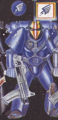
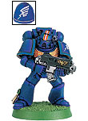
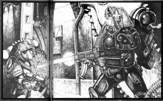

# 0445 彩虹勇士 Rainbow Warriors

精校状态：中文行文已逐段精校，部分术语仍为暂定

分类：通用概念 / 帝国 Imperium / 中央政务部 Adeptus Terra / 阿斯塔特修会 Adeptus Astartes

原文来源：https://www.bilibili.com/opus/1123842523075182594

原作者：帝国神选罐头

原文时间：2025年10月15日 12:42

[返回分类目录](目录.md) · [全书目录](../../目录.md)

原篇名：彩虹战士 Rainbow Warriors

<!-- A0445-B0001 -->
**英文原文**

The Rainbow Warriors are an Ultramarines Successor Chapter.

<!-- /A0445-B0001 -->

<!-- A0445-B0002 -->

原译文

彩虹战士是极限战士的子战团。

**校订译文**

彩虹勇士是极限战士的子战团。

**校注：** 按第225篇较早现稿统一 Rainbow Warriors 为彩虹勇士；本篇原标题彩虹战士保留追溯。

<!-- /A0445-B0002 -->

<!-- A0445-B0003 图片 -->

<!-- A0445-B0004 图片 -->

<!-- A0445-B0005 -->
**英文原文**

Founding Chapter:Ultramarines

<!-- /A0445-B0005 -->

<!-- A0445-B0006 -->

原译文

建军战团：极限战士

**校订译文**

母战团：极限战士

<!-- /A0445-B0006 -->

<!-- A0445-B0007 -->
**英文原文**

Homeworld:Prism

<!-- /A0445-B0007 -->

<!-- A0445-B0008 -->

原译文

家园世界：棱镜星

**校订译文**

母星：棱镜星。

<!-- /A0445-B0008 -->

<!-- A0445-B0009 -->
**英文原文**

Colours:Blue with multi-coloured helm

<!-- /A0445-B0009 -->

<!-- A0445-B0010 -->

原译文

配色：蓝色配多色头盔

**校订译文**

配色：蓝色配多色头盔

<!-- /A0445-B0010 -->

<!-- A0445-B0011 -->
## Notable Battles and Campaigns 著名战斗和战役

<!-- /A0445-B0011 -->

<!-- A0445-B0012 -->
**英文原文**

Blood Star Campaign — The Chapter loses its Chapter Master.

<!-- /A0445-B0012 -->

<!-- A0445-B0013 -->

原译文

血星战役 — 战团失去了它的战团长

**校订译文**

血星战役 — 战团失去了它的战团长

<!-- /A0445-B0013 -->

<!-- A0445-B0014 -->

原译文

Dark Crusade 黑暗远征

**校订译文**

Dark Crusade 黑暗远征

<!-- /A0445-B0014 -->

<!-- A0445-B0015 -->
## Notable members 著名成员

<!-- /A0445-B0015 -->

<!-- A0445-B0016 -->

原译文

Brother-Captain Varagol 兄弟连长瓦拉戈尔

**校订译文**

Brother-Captain Varagol 兄弟连长瓦拉戈尔

<!-- /A0445-B0016 -->

<!-- A0445-B0017 -->

原译文

Brother Vermillion 维米里恩兄弟

**校订译文**

Brother Vermillion 维米里恩兄弟

<!-- /A0445-B0017 -->

<!-- A0445-B0018 -->
## Trivia 琐事

<!-- /A0445-B0018 -->

<!-- A0445-B0019 -->
**英文原文**

The Rainbow Warriors are briefly mentioned in Warhammer 40,000: Rogue Trader, in which a Rainbow Warrior marine is illustrated being shot by an Adepta Sororitas. Their Chapter colours are listed as "multi-coloured".

<!-- /A0445-B0019 -->

<!-- A0445-B0020 -->

原译文

《战锤40k：行商浪人》中简要提到了彩虹战士，其中一名彩虹战士星际战士被修女会枪杀。他们的战团颜色被列为“多色”。

**校订译文**

《战锤40,000：行商浪人》简短提及彩虹勇士，并附有一幅战斗修女向彩虹勇士战士射击的插画。该战团的配色被列为“多色”。

**校注：** being shot 说明遭射击，未明确死亡，故不译枪杀；图中是一名战斗修女，非整个修女会直接开枪。

<!-- /A0445-B0020 -->

<!-- A0445-B0021 图片 -->

<!-- A0445-B0022 -->

原译文

1st Edition artwork of a Rainbow Warrior being shot by a Sister of Battle 第一版彩虹战士被战斗修女射击的插画

**校订译文**

1st Edition artwork of a Rainbow Warrior being shot by a Sister of Battle 第一版彩虹勇士被战斗修女射击的插画

<!-- /A0445-B0022 -->

本篇核心术语与暂定项

以下列出本篇出现的英文原形及核心术语表用词。同形词可能指不同对象，具体词义以本篇正文和校注为准；单复数、别名和仅见于图注的名称可能尚未列入。完整候选见[术语表](../../术语表/双语术语候选.csv)。

| 英文 | 采用中文 | 状态 |
| --- | --- | --- |
| Adepta Sororitas | 修女会 | 官方已核对 |
| Ultramarines | 极限战士 | 官方已核对 |
| Rogue Trader | 行商浪人 | 暂定 |
| Master | 导师（审判庭职衔）／舰务官（舰员职务） | 语境定译·官方待核 |
| Founding | 建军 | 暂定·官方待核 |
| Chapter | 战团 | 暂定·官方待核 |
| Chapter Master | 战团长 | 暂定·官方待核 |
| Rainbow Warriors | 彩虹勇士 | 暂定·官方待核 |
| Blood Star Campaign | 血星战役 | 暂定·官方待核 |
| Warhammer 40,000: Rogue Trader | 战锤40000：行商浪人 | 暂定·官方待核 |

