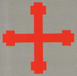
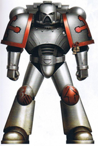
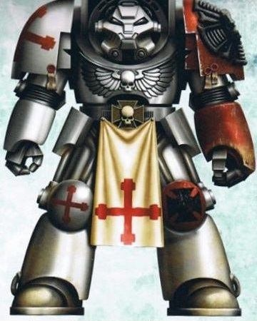
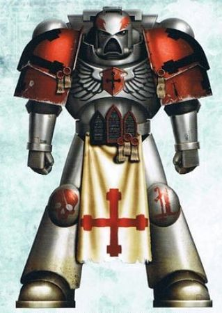
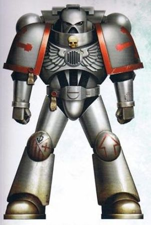
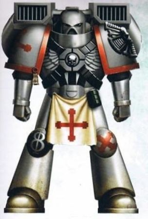
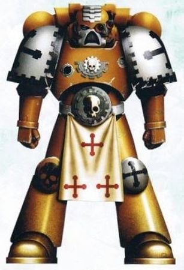
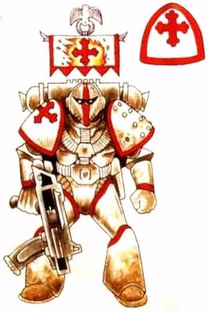
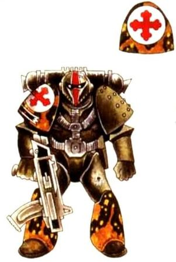

# 0446 火焰天使 Fire Angels

精校状态：中文行文已逐段精校，部分术语仍为暂定

分类：通用概念 / 帝国 Imperium / 中央政务部 Adeptus Terra / 阿斯塔特修会 Adeptus Astartes

原文来源：https://www.bilibili.com/opus/1210015995258732553

原作者：帝国神选罐头

原文时间：2026年06月04日 18:00

[返回分类目录](目录.md) · [全书目录](../../目录.md)

<!-- A0446-B0001 -->
**英文原文**

The Fire Angels are a Space Marine Chapter descended from the Ultramarines that have a zealous devotion to the Imperial Creed.

<!-- /A0446-B0001 -->

<!-- A0446-B0002 -->

原译文

火焰天使是一个星际战士战团，由对帝国信条狂热奉献的极限战士后裔组成。

**校订译文**

火焰天使是极限战士的子战团，对帝国教义怀有狂热信仰。

<!-- /A0446-B0002 -->

<!-- A0446-B0003 图片 -->

<!-- A0446-B0004 图片 -->

<!-- A0446-B0005 -->
**英文原文**

Founding Chapter:Ultramarines

<!-- /A0446-B0005 -->

<!-- A0446-B0006 -->

原译文

建军战团：极限战士

**校订译文**

母战团：极限战士

<!-- /A0446-B0006 -->

<!-- A0446-B0007 -->
**英文原文**

Founding:25th Founding (M40)

<!-- /A0446-B0007 -->

<!-- A0446-B0008 -->

原译文

建军：第25次建军(M40)

**校订译文**

建军：第25次建军(M40)

<!-- /A0446-B0008 -->

<!-- A0446-B0009 -->
**英文原文**

Homeworld:Lorin Alpha

<!-- /A0446-B0009 -->

<!-- A0446-B0010 -->

原译文

家园世界：洛林·阿尔法

**校订译文**

家园世界：洛林·阿尔法

<!-- /A0446-B0010 -->

<!-- A0446-B0011 -->
**英文原文**

Fortress-Monastery:Tower Athenaeum

<!-- /A0446-B0011 -->

<!-- A0446-B0012 -->

原译文

要塞修道院：雅典娜之塔

**校订译文**

要塞修道院：学宫之塔。

**校注：** Athenaeum 通常指学术馆、图书馆等场所，不等于 Athena 雅典娜本人；堡垒名暂译学宫之塔，待核官方。

<!-- /A0446-B0012 -->

<!-- A0446-B0013 -->
**英文原文**

Colours:Silver with red knee pads and rims on pauldrons

<!-- /A0446-B0013 -->

<!-- A0446-B0014 -->

原译文

配色：银色，红色膝甲和肩甲边缘

**校订译文**

配色：银色，红色膝甲和肩甲边缘

<!-- /A0446-B0014 -->

<!-- A0446-B0015 -->
**英文原文**

Specialty:Drop Pod assault, infiltration, tank combat

<!-- /A0446-B0015 -->

<!-- A0446-B0016 -->

原译文

专长：空投舱攻击、渗透、坦克作战

**校订译文**

专长：空降舱突击、渗透、坦克作战。

<!-- /A0446-B0016 -->

<!-- A0446-B0017 -->
## History 历史

<!-- /A0446-B0017 -->

<!-- A0446-B0018 -->
**英文原文**

The Fire Angels were created from Ultramarines gene-seed. They fought on the loyalist side during the Badab War. In one incident during the war, the rebel Astral Claws launched a suicidal counter-attack, in which a squadron of Rhinos broke through an Imperial salient to the Fire Angels' lines and detonated a virus missile, causing more deaths in one day than the Fire Angels had suffered in the war so far.

<!-- /A0446-B0018 -->

<!-- A0446-B0019 -->

原译文

火焰天使是由极限战士基因种子创造的。在巴达布战争期间，他们站在忠诚派一边战斗。在战争期间的一次事件中，叛乱者星辰之爪发动了自杀式反击，一支犀牛中队突破了火焰天使防线的帝国突出部，引爆了一枚病毒导弹，一天内造成的死亡人数比火焰天使在战争中迄今为止造成的死亡人数还多。

**校订译文**

火焰天使以极限战士的基因种子建立，在巴达布战争中效忠帝国。战争期间，星辰之爪叛军曾发动一次自杀式反击：一支犀牛战车中队突破帝国军突出部，冲至火焰天使阵线，引爆病毒导弹。火焰天使当天的阵亡人数，超过此前整场战争中累计遭受的损失。

**校注：** 原译混淆造成伤亡与遭受伤亡的主体；英文比较的是火焰天使当天阵亡数与此前累计损失。

<!-- /A0446-B0019 -->

<!-- A0446-B0020 -->
## Known Campaigns 已知战役

<!-- /A0446-B0020 -->

<!-- A0446-B0021 -->
**英文原文**

M39: Aegisine Crusade — The Fire Angels witnessed the effectiveness of the 'Iron Cyclone' drop pod deployment pattern employed by the Black Templars and would go on to use the strategy themselves.

<!-- /A0446-B0021 -->

<!-- A0446-B0022 -->

原译文

圣盾远征 — 火焰天使见证了黑色圣堂采用的“钢铁旋风”空投舱部署模式的有效性，并将继续使用该策略。

**校订译文**

M39：圣盾远征——火焰天使见识到黑色圣堂“钢铁旋风”空降舱部署法的效力，后来也将这一战术用于自身作战。

**校注：** 英文标M39，而本篇概况又称M40第25次建军；两处年代不相容，均保留并标疑，不擅改其中一项。

<!-- /A0446-B0022 -->

<!-- A0446-B0023 -->

原译文

760.M39-411.M40: Fenright Tithe Wars 芬莱特什一税战争

**校订译文**

760.M39-411.M40: Fenright Tithe Wars 芬莱特什一税战争

<!-- /A0446-B0023 -->

<!-- A0446-B0024 -->

原译文

143-151.M41: Magdellan Prime Civil War 马格德兰一号内战

**校订译文**

143-151.M41: Magdellan Prime Civil War 马格德兰主星内战

<!-- /A0446-B0024 -->

<!-- A0446-B0025 -->

原译文

666.M41: Battle for Grand Al'gul 大阿尔'古尔之战

**校订译文**

666.M41: Battle for Grand Al'gul 大阿尔'古尔之战

<!-- /A0446-B0025 -->

<!-- A0446-B0026 -->

原译文

901-912.M41: Badab War 巴达布战争

**校订译文**

901-912.M41: Badab War 巴达布战争

<!-- /A0446-B0026 -->

<!-- A0446-B0027 -->

原译文

Battle of Sagan's Moon 萨根之月之战

**校订译文**

Battle of Sagan's Moon 萨根之月之战

<!-- /A0446-B0027 -->

<!-- A0446-B0028 -->
**英文原文**

998.M41: Third War for Armageddon — At least sixth company fought there.

<!-- /A0446-B0028 -->

<!-- A0446-B0029 -->

原译文

第三次阿玛吉多顿战争 — 至少第六连队在那里作战。

**校订译文**

998.M41：第三次阿玛吉多顿战争——至少第六连参加了战斗。

<!-- /A0446-B0029 -->

<!-- A0446-B0030 -->
**英文原文**

Date Unknown: Destroying the Psyker Cult known as the Seven Daughters of Oblivion on the planet Lament.

<!-- /A0446-B0030 -->

<!-- A0446-B0031 -->

原译文

摧毁哀叹星上被称为遗忘七女的灵能者教派。

**校订译文**

日期不详：消灭哀叹星上名为“遗忘七女”的灵能者教派。

<!-- /A0446-B0031 -->

<!-- A0446-B0032 -->
## Culture 文化

<!-- /A0446-B0032 -->

<!-- A0446-B0033 -->
## Chapter Cult 战团教派

<!-- /A0446-B0033 -->

<!-- A0446-B0034 -->
**英文原文**

The Fire Angels are a rare example of a theist chapter, whose Chapter Cult embraces the Imperial Creed as an unassailable truth, viewing themselves as holy warriors in service to the divine God Emperor. Uniquely, they do not revere their ancestral primarch as a living saint, believing this to be a form of idolatry, instead viewing him as an exceptional warrior. They tend to rely on "basic" Imperial technology and codex equipment, such as Rhinos and Predators, while their 1st Company is mostly composed of Sternguard Veterans rather than Terminators. Despite this, their armoury on Lorin Alpha is sophisticated enough to churn out large amounts of tanks such as the Predator, Vindicator, and Whirlwind, which the Fire Angels wield disproportionate numbers of.

<!-- /A0446-B0034 -->

<!-- A0446-B0035 -->

原译文

火焰天使是有神论战团的一个罕见例子，其战团教派将帝国信条视为一个无懈可击的真理，将自己视为为神圣的神皇服务的圣战士。独特的是，他们不将他们的祖先原体作为活圣人，认为这是一种神像崇拜，而是将他视为一位卓越的战士。他们倾向于依赖“基础”的帝国技术和圣典装备，如犀牛和掠食者，而他们的第一连队主要由肃卫老兵组成，而不是终结者。尽管如此，他们在洛林·阿尔法的军械库已经足够复杂，可以生产出大量的坦克，如掠食者、维护者和旋风，而火焰天使使用的坦克数量不成比例。

**校订译文**

火焰天使是少见的信神战团之一。他们将帝国教义视为不可动摇的真理，自认是为神皇效力的圣战士。与众不同的是，他们不把血脉原体尊为活圣人，认为那属于偶像崇拜；在他们看来，原体是一位卓越战士。装备上，他们倾向使用基础的帝国技术与圣典制式军备，如犀牛战车和掠食者；第一连也主要由肃卫老兵而非终结者组成。不过，洛林·阿尔法的军械生产设施相当完善，能大量制造掠食者、维护者战车与旋风战车，使他们拥有远多于一般战团的这类坦克。

<!-- /A0446-B0035 -->

<!-- A0446-B0036 -->
**英文原文**

Known as a conservative chapter, the Fire Angels are strict adherents to the Codex Astartes. Due to their belief that the Emperor is a god, they share many links with the Ecclesiarchy and regularly fight alongside the Sisters of Battle.

<!-- /A0446-B0036 -->

<!-- A0446-B0037 -->

原译文

火焰天使被称为保守派战团，是阿斯塔特圣典的严格拥护者。由于他们相信帝皇是神，他们与国教有许多联系，并经常与战斗修女并肩作战。

**校订译文**

火焰天使素以保守著称，严格遵守《阿斯塔特圣典》。由于敬奉帝皇为神，他们与国教会联系紧密，也经常与战斗修女并肩作战。

<!-- /A0446-B0037 -->

<!-- A0446-B0038 -->
**英文原文**

The Fire Angels see discipline and holy duty as higher virtues than individual glory, and they tend to rely on rigid strategic doctrines that they rarely deviate from. Their Tactical Squads tend to wield disproportionate amounts of heavy bolters, their Fire Support Squads melta weapons, and their Assault Squads flamers. They also tend to favour using swords over any other close-combat weapon type, seeing them as a symbol of spiritual strength.

<!-- /A0446-B0038 -->

<!-- A0446-B0039 -->

原译文

火焰天使将纪律和神圣职责视为比个人荣耀更高的美德，他们倾向于依赖严格的战略教义，很少偏离这些教义。他们的战术小队倾向于使用不成比例的重型爆矢枪、火力支援小队的热熔武器和突击小队的火焰枪。他们也倾向于使用剑，而不是其他任何近战武器，将剑视为精神力量的象征。

**校订译文**

火焰天使将纪律与神圣职责置于个人荣耀之上，作战遵循固定原则，很少偏离。战术小队偏爱大量装备重爆矢枪，火力支援小队偏重热熔武器，突击小队则偏爱喷火器。他们也更青睐剑而非其他近战武器，将其视为精神力量的象征。

**校注：** 英文分别列战术、火力支援、突击小队三类偏好的武器；原译把后两项误接成战术小队所用武器。

<!-- /A0446-B0039 -->

<!-- A0446-B0040 -->
## Notable Elements 著名人物与事物

原题：Notable Elements 著名成员

<!-- /A0446-B0040 -->

<!-- A0446-B0041 -->
## Notable Vessels 著名舰船

原题：Notable Vessels 著名载具

<!-- /A0446-B0041 -->

<!-- A0446-B0042 -->
**英文原文**

Virtus Perdurat — Battle Barge

<!-- /A0446-B0042 -->

<!-- A0446-B0043 -->

原译文

持久勇气号 — 战斗驳船

**校订译文**

持久勇气号 — 战斗驳船

<!-- /A0446-B0043 -->

<!-- A0446-B0044 -->
**英文原文**

Polaris Rising — Strike Cruiser

<!-- /A0446-B0044 -->

<!-- A0446-B0045 -->

原译文

北极星升号 — 打击巡洋舰

**校订译文**

北极星升号 — 打击巡洋舰

<!-- /A0446-B0045 -->

<!-- A0446-B0046 -->
## Notable Members 著名成员

<!-- /A0446-B0046 -->

<!-- A0446-B0047 -->
**英文原文**

Haran Stark — Chapter Master.

<!-- /A0446-B0047 -->

<!-- A0446-B0048 -->

原译文

哈兰·斯塔克 — 战团长

**校订译文**

哈兰·斯塔克 — 战团长

<!-- /A0446-B0048 -->

<!-- A0446-B0049 -->
**英文原文**

Mathias Dee — Chief Librarian.

<!-- /A0446-B0049 -->

<!-- A0446-B0050 -->

原译文

马蒂亚斯·迪 — 首席智库

**校订译文**

马蒂亚斯·迪——首席智库员。

<!-- /A0446-B0050 -->

<!-- A0446-B0051 -->
**英文原文**

Narthaniel — Chaplain, KIA in 666.M41.

<!-- /A0446-B0051 -->

<!-- A0446-B0052 -->

原译文

纳萨尼尔 — 牧师，在666.M41死亡

**校订译文**

纳萨尼尔——教士，于666.M41阵亡。

<!-- /A0446-B0052 -->

<!-- A0446-B0053 -->
**英文原文**

Tarnus Vale — Praetor of the 3rd Company.

<!-- /A0446-B0053 -->

<!-- A0446-B0054 -->

原译文

塔尔努斯·维尔 — 第三连队的执政官

**校订译文**

塔尔努斯·维尔 — 第三连队的执政官

<!-- /A0446-B0054 -->

<!-- A0446-B0055 -->
**英文原文**

Aviddan Tagas — Member of the Deathwatch.

<!-- /A0446-B0055 -->

<!-- A0446-B0056 -->

原译文

阿维丹·塔加斯 — 死亡守望成员

**校订译文**

阿维丹·塔加斯 — 死亡守望成员

<!-- /A0446-B0056 -->

<!-- A0446-B0057 图片 -->

<!-- A0446-B0058 -->

原译文

Veteran Brother Landgrave 老兵修士兰德格雷夫

**校订译文**

Veteran Brother Landgrave 老兵兄弟兰德格雷夫

<!-- /A0446-B0058 -->

<!-- A0446-B0059 图片 -->

<!-- A0446-B0060 -->

原译文

Veteran Sgt Revok 老兵军士雷沃克

**校订译文**

Veteran Sgt Revok 老兵军士雷沃克

<!-- /A0446-B0060 -->

<!-- A0446-B0061 图片 -->

<!-- A0446-B0062 -->

原译文

Brother Malsan 修士马尔桑

**校订译文**

Brother Malsan 马尔桑兄弟

<!-- /A0446-B0062 -->

<!-- A0446-B0063 图片 -->

<!-- A0446-B0064 -->

原译文

Brother Dravholt 修士德拉夫霍尔特

**校订译文**

Brother Dravholt 德拉夫霍尔特兄弟

<!-- /A0446-B0064 -->

<!-- A0446-B0065 图片 -->

<!-- A0446-B0066 -->

原译文

Techmarine Ortrun 技术军士奥尔特伦

**校订译文**

Techmarine Ortrun 科技战士奥尔特伦

<!-- /A0446-B0066 -->

<!-- A0446-B0067 图片 -->

<!-- A0446-B0068 -->

原译文

Original colour scheme, Badab War 最初配色，巴达布战争

**校订译文**

Original colour scheme, Badab War 最初配色，巴达布战争

<!-- /A0446-B0068 -->

<!-- A0446-B0069 图片 -->

<!-- A0446-B0070 -->

原译文

Drop Troop Camouflage, Battle of Sagan's Moon, Badab War 空降部队迷彩，萨根之月之战，巴达布战争

**校订译文**

Drop Troop Camouflage, Battle of Sagan's Moon, Badab War 空降部队迷彩，萨根之月之战，巴达布战争

<!-- /A0446-B0070 -->

本篇核心术语与暂定项

以下列出本篇出现的英文原形及核心术语表用词。同形词可能指不同对象，具体词义以本篇正文和校注为准；单复数、别名和仅见于图注的名称可能尚未列入。完整候选见[术语表](../../术语表/双语术语候选.csv)。

| 英文 | 采用中文 | 状态 |
| --- | --- | --- |
| Black Templars | 黑色圣堂 | 官方已核对 |
| Deathwatch | 死亡守望 | 官方已核对 |
| Psyker | 灵能者 | 官方已核对 |
| Librarian | 智库员 | 官方已核对 |
| Ultramarines | 极限战士 | 官方已核对 |
| Equipment | 装备 | 编辑用语已统一 |
| Emperor | 帝皇 | 官方已核对 |
| Primarch | 原体 | 官方已核对 |
| Ecclesiarchy | 国教会 | 暂定 |
| Battle Barge | 战斗驳船 | 暂定·官方待核 |
| Sisters of Battle | 战斗修女 | 暂定·官方待核 |
| Imperial Creed | 帝国教义 | 暂定·官方待核 |
| Armageddon | 阿玛吉多顿 | 暂定·官方待核 |
| Badab | 巴达布 | 暂定·官方待核 |
| Chief Librarian | 首席智库员 | 暂定·官方待核 |
| Master | 导师（审判庭职衔）／舰务官（舰员职务） | 语境定译·官方待核 |
| Chaplain | 教士 | 官方已核对 |
| Drop Pod | 空降舱 | 官方已核·中英对照 |
| Vindicator | 维护者战车 | 官方已核对 |
| Whirlwind | 旋风战车 | 官方已核对 |
| Founding | 建军 | 暂定·官方待核 |
| Mathias | 马蒂亚斯 | 暂定·官方待核 |
| Praetor | 执政官 | 暂定·官方待核 |
| Space Marine | 星际战士 | 暂定·官方待核 |
| Chapter | 战团 | 暂定·官方待核 |
| Fortress-monastery | 要塞修道院 | 暂定·官方待核 |
| Chapter Master | 战团长 | 暂定·官方待核 |
| Terminators | 终结者 | 暂定·官方待核 |
| Chapter cult | 战团教派 | 暂定·官方待核 |
| Codex Astartes | 阿斯塔特圣典 | 暂定·官方待核 |
| Fire Angels | 火焰天使 | 暂定·官方待核 |
| The Black Templars | 黑色圣堂 | 暂定·官方待核 |
| Armoury | 军械库 | 暂定·官方待核 |
| Rhinos | 犀牛 | 暂定·官方待核 |
| Predators | 掠食者 | 暂定·官方待核 |
| Sternguard Veterans | 肃卫老兵 | 暂定·官方待核 |
| Tactical Squads | 战术小队 | 暂定·官方待核 |
| Assault Squads | 突击小队 | 暂定·官方待核 |
| Gene-seed | 基因种子 | 暂定·官方待核 |
| Strike Cruiser | 打击巡洋舰 | 暂定·官方待核 |
| Virtues | 力天使 | 暂定·官方待核 |
| Flamers | 火妖（奸奇单位）／火焰喷射器（武器） | 语境定译·对应官译已核 |
| Tower Athenaeum | 学宫之塔 | 暂定·官方待核 |
| Virtus Perdurat | 持久勇气号 | 暂定·官方待核 |
| Polaris Rising | 北极星升号 | 暂定·官方待核 |
| Haran Stark | 哈兰·斯塔克 | 暂定·官方待核 |
| Mathias Dee | 马蒂亚斯·迪 | 暂定·官方待核 |
| Narthaniel | 纳萨尼尔 | 暂定·官方待核 |
| Tarnus Vale | 塔尔努斯·维尔 | 暂定·官方待核 |
| Aviddan Tagas | 阿维丹·塔加斯 | 暂定·官方待核 |
| Haran | 哈兰 | 暂定·官方待核 |
| Astral Claws | 星辰之爪 | 暂定·官方待核 |
| Lament | 哀悼 | 暂定·官方待核 |
| Melta Weapons | 热熔武器 | 暂定·官方待核 |

