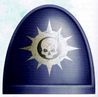
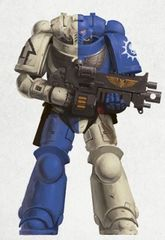
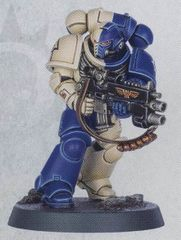
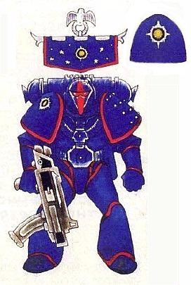
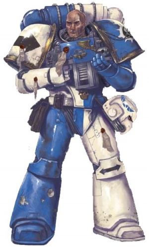
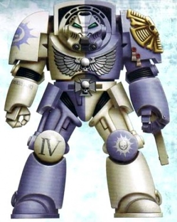
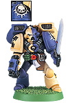
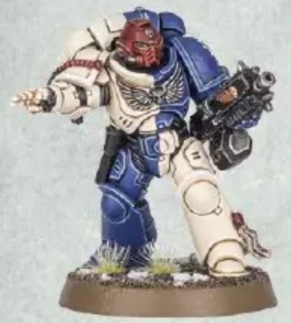
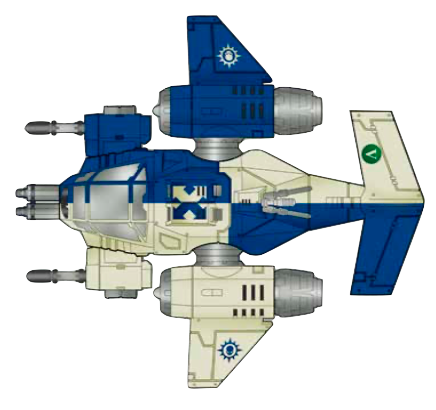

# 0447 新星战士 Novamarines

精校状态：中文行文已逐段精校，部分术语仍为暂定

分类：通用概念 / 帝国 Imperium / 中央政务部 Adeptus Terra / 阿斯塔特修会 Adeptus Astartes

原文来源：https://www.bilibili.com/opus/1210379345207492642

原作者：帝国神选罐头

原文时间：2026年06月05日 17:30

[返回分类目录](目录.md) · [全书目录](../../目录.md)

<!-- A0447-B0001 -->
**英文原文**

The Novamarines are a Successor Chapter of the Ultramarines Legion, created during the Second Founding. They are one of the ten Shield Chapters of Ultramar.

<!-- /A0447-B0001 -->

<!-- A0447-B0002 -->

原译文

新星战士是二次建军期间创建的极限战士军团的子战团。它们是奥特拉玛的十大盾牌战团之一。

**校订译文**

新星战士是诞生于M31二次建军的极限战士子战团，也是十个奥特拉玛之盾战团之一。

<!-- /A0447-B0002 -->

<!-- A0447-B0003 图片 -->

<!-- A0447-B0004 图片 -->

<!-- A0447-B0005 图片 -->

<!-- A0447-B0006 -->
**英文原文**

Founding Chapter:Ultramarines

<!-- /A0447-B0006 -->

<!-- A0447-B0007 -->

原译文

建军战团：极限战士

**校订译文**

母战团：极限战士

<!-- /A0447-B0007 -->

<!-- A0447-B0008 -->
**英文原文**

Founding:Second Founding M31

<!-- /A0447-B0008 -->

<!-- A0447-B0009 -->

原译文

建军时间：二次建军M31

**校订译文**

建军时间：二次建军M31

<!-- /A0447-B0009 -->

<!-- A0447-B0010 -->
**英文原文**

Descendants:Dark Sons

<!-- /A0447-B0010 -->

<!-- A0447-B0011 -->

原译文

子战团：黑暗之子

**校订译文**

子战团：黑暗之子

<!-- /A0447-B0011 -->

<!-- A0447-B0012 -->
**英文原文**

Homeworld:Honourum

<!-- /A0447-B0012 -->

<!-- A0447-B0013 -->

原译文

家园世界：荣誉星

**校订译文**

母星：荣誉星。

<!-- /A0447-B0013 -->

<!-- A0447-B0014 -->
**英文原文**

Fortress-Monastery:The Fortress Novum

<!-- /A0447-B0014 -->

<!-- A0447-B0015 -->

原译文

堡垒修道院：新星堡垒

**校订译文**

要塞修道院：新星堡垒

<!-- /A0447-B0015 -->

<!-- A0447-B0016 -->
**英文原文**

Colours:Quartered blue and bone.

<!-- /A0447-B0016 -->

<!-- A0447-B0017 -->

原译文

配色：四分之一的蓝色和骨色。

**校订译文**

配色：蓝色与骨色交替构成四分格。

**校注：** quartered 指纹章分成四格交替配色，不是蓝色仅占四分之一。

<!-- /A0447-B0017 -->

<!-- A0447-B0018 -->
**英文原文**

Specialty:Rapid Response, Anti-Xenos Warfare

<!-- /A0447-B0018 -->

<!-- A0447-B0019 -->

原译文

专长：快速反应，反异型战争

**校订译文**

专长：快速反应、对抗异形。

<!-- /A0447-B0019 -->

<!-- A0447-B0020 -->
## History 历史

<!-- /A0447-B0020 -->

<!-- A0447-B0021 -->
## Founding 建军

<!-- /A0447-B0021 -->

<!-- A0447-B0022 -->
**英文原文**

The first Chapter Master of the Novamarines was Ultramarines Captain Lucretius Corvo, an officer who won great renown fighting the Word Bearers during the Horus Heresy. Besieged during one particular battle on the world of Astagar, Corvo and his men resisted annihilation for six days, before managing to destroy a traitor Warlord Battle Titan and break out. For this act, Corvo was decorated by Roboute Guilliman himself - this decoration is now a sacred relic to the Novamarines, and is kept in the Fortress-Monastery.

<!-- /A0447-B0022 -->

<!-- A0447-B0023 -->

原译文

新星战士的第一位战团长是极限战士连长卢克莱修斯·科沃，他在荷鲁斯叛乱时期与怀言者作战时赢得了极大的声誉。在阿斯塔加行星的一场特殊战斗中，科沃和他的部下被围困，抵抗了六天的歼灭，然后设法摧毁了一个叛徒军阀战斗泰坦并逃脱。由于这一行为，科沃被罗伯特·基里曼亲自装饰 — 这一装饰现在是新星战士的神圣遗物，保存在堡垒修道院。

**校订译文**

新星战士的首任战团长是极限战士连长卢克莱修斯·科沃。他在荷鲁斯之乱中对抗怀言者，立下赫赫战功。阿斯塔加之战中，他与部下被围困六天，始终未被歼灭，最终摧毁一台叛军战将级战斗泰坦，杀出重围。罗保特·基里曼亲自授勋表彰；那枚勋章如今成为新星战士的圣物，保存在要塞修道院。

**校注：** decorated 指授勋，decoration 指所得勋章，非给科沃本人做装饰；Warlord 是泰坦型号，不是叛军统帅本人。

<!-- /A0447-B0023 -->

<!-- A0447-B0024 图片 -->

<!-- A0447-B0025 -->

原译文

Novamarines battle-brother in original colour scheme during the Badab War 巴达布战争期间，新星战士战斗兄弟以原初配色方案

**校订译文**

Novamarines battle-brother in original colour scheme during the Badab War 巴达布战争中采用早期配色的新星战士战斗兄弟

<!-- /A0447-B0025 -->

<!-- A0447-B0026 -->
**英文原文**

At their founding they were assigned the pre-Imperial Fortress World of Honourum by Guilliman, a world that marked the farthest point the Ultramarines had penetrated into the galactic north of Ultima Segmentum during the Great Crusade, and took oaths to protect the entire Segmentum. Inhabited by a feral people, the Honourum tribesmen selected for Novamarines training take on the quartered colours of the Novamarines- based on Corvo's personal heraldry - and the manners and culture a citizen of Ultramar would recognise as akin to their own. The only notable surface difference between an unplated Novamarine and an Ultramarine is that the Novamarines retain the tribal practice of tattooing their skin, incorporating it into their beliefs as an blessed way of armouring their souls, as well as recording their deeds upon their bodies.

<!-- /A0447-B0026 -->

<!-- A0447-B0027 -->

原译文

在他们建军时，他们被基里曼分配到前帝国要塞世界荣誉星，这个世界标志着在大远征期间，极限战士已经渗透到极限星域以北银河系的最远点，并宣誓保护整个星域。居住在一个野蛮民族中的荣誉星部落成员被选为新星战士训练的对象，他们根据科沃的个人纹章，采用了新星战士的四分之一配色，以及奥特拉玛公民认为与自己相似的礼仪和文化。未涂装新星战士和极限战士之间唯一显著的表面区别是，新星战士保留了部落纹身皮肤的做法，将其融入他们的信仰中，作为一种神圣的方式来武装他们的灵魂，并将他们的行为记录在他们的身上。

**校订译文**

建军时，基里曼将帝国建立前便已存在的要塞世界荣誉星赐予战团。这里是大远征中极限战士在极限星域向银河北方推进的最远地点，新星战士也立誓守护整个星域。当地居住着部落居民，被选入战团者会采用源自科沃个人纹章的四分格配色，并学习与奥特拉玛文化相近的礼仪和习俗。脱下护甲后，新星战士与极限战士在外观上最显著的区别，是前者仍保留部落的纹身传统。他们将纹身融入信仰，视为给灵魂披甲、蒙受祝福的方式，也用它在身上记载功业。

**校注：** unplated 指不着甲，非护甲未涂装；地理方位为极限星域内向银河北方推进，非星域以北。

<!-- /A0447-B0027 -->

<!-- A0447-B0028 -->
## Recent Years 近年

<!-- /A0447-B0028 -->

<!-- A0447-B0029 -->
**英文原文**

The Novamarines have been involved in many significant conflicts during the 41st Millennium, taking part in combating the emergent Tau life-form, as well as aiding fellow Astartes in the Badab War. During the latter conflict they deployed 2 companies in 3 Strike Cruisers as well as smaller attack vessels and were used in a "fire brigade" role, rushing to aid beleaguered brother Space Marines in small detachments and guarding supply lines. After two years of honourably participating in the war the Novamarines forces withdrew in order to contest an Ork invasion that threatened their homeworld, although some records of the event claim that the Inquisition reassigned them in fear that they would not be enthusiastic enough to be 'in-at-the-kill' of the secessionist forces. Since then they have deployed a large amount of their manpower to aid in defending against the Thirteenth Black Crusade.

<!-- /A0447-B0029 -->

<!-- A0447-B0030 -->

原译文

在第41个千年期间，新星战士参与了许多重大冲突，参与了对抗新兴的钛生命形态，并在巴达布战争中帮助了阿斯塔特同伴。在后一场冲突中，他们部署了3艘打击巡洋舰中的2个连队以及较小的攻击战舰，并被用于“救火队”的角色，以小分遣队的形式迅速援助陷入困境的星际战士兄弟，并守卫补给线。在光荣地参加了两年的战争后，新星战士部队撤退，以对抗威胁他们家园世界的欧克入侵，尽管一些事件记录声称，审判庭重新分配了他们，因为担心他们不够热情，无法“杀死”分离势力。从那时起，他们部署了大量的人力来协助防御第十三次黑色远征。

**校订译文**

M41，新星战士参与多场重大战事，既对抗新兴的钛族，也在巴达布战争中支援阿斯塔特同袍。巴达布战争期间，他们派出两个连队，搭乘三艘打击巡洋舰及若干小型攻击舰，以“救火队”方式作战：分成小股部队迅速救援受困兄弟，并保护补给线。光荣参战两年后，他们撤回，迎击威胁母星的欧克入侵。不过，另一些记录称，是审判庭担心他们不愿积极参与最后歼灭分离派的行动，才将其调离。后来，他们又投入大量兵力，抵御第十三次黑色远征。

**校注：** 原文将撤离原因列为母星遇袭与审判庭担忧其态度两种说法，均保留。

<!-- /A0447-B0030 -->

<!-- A0447-B0031 图片 -->

<!-- A0447-B0032 -->

原译文

Novamarines battle-brother in current color scheme 新星战士战斗兄弟在当前配色方案

**校订译文**

Novamarines battle-brother in current color scheme 采用现行配色的新星战士战斗兄弟

<!-- /A0447-B0032 -->

<!-- A0447-B0033 -->
**英文原文**

Novamarines forces were part of the resurrected Roboute Guilliman's army during the Terran Crusade. During the Plague Wars of M42, the Novamarines contributed significant forces to defend Ultramar, where they were instrumental in the defense of the star fort Galatan. It was during this battle that they incurred heavy losses, including that of their Chapter Master, Bardan Dovaro, to Typhus.

<!-- /A0447-B0033 -->

<!-- A0447-B0034 -->

原译文

在泰拉远征期间，新星战士是复活的罗伯特·基里曼军队的一部分。在M42瘟疫战争期间，新星战士为保卫奥特拉玛贡献了大量部队，在那里他们为保卫加拉坦号星堡发挥了重要作用。正是在这场战斗中，他们遭受了重大损失，包括他们的战团长巴丹·多瓦罗死于泰丰斯之手。

**校订译文**

泰拉远征期间，新星战士加入复苏的罗保特·基里曼所率大军。M42瘟疫战争中，他们大举支援奥特拉玛，并为守卫加拉坦星堡发挥关键作用，但也遭受惨重损失，战团长巴丹·多瓦罗阵亡于泰弗斯之手。

<!-- /A0447-B0034 -->

<!-- A0447-B0035 -->
**英文原文**

Since the formation of the Great Rift and the return of Roboute Guilliman, the Novamarines have become one of the 10 Shield Chapters of Ultramar.

<!-- /A0447-B0035 -->

<!-- A0447-B0036 -->

原译文

自从大裂隙形成和罗伯特·基里曼回归以来，新星战士已成为奥特拉玛的10个盾牌战团之一。

**校订译文**

大裂隙形成、罗保特·基里曼回归后，新星战士成为十个奥特拉玛之盾战团之一。

<!-- /A0447-B0036 -->

<!-- A0447-B0037 图片 -->

<!-- A0447-B0038 -->

原译文

Novamarines veteran battle-brother in Tactical Dreadnought Armour 在战术无畏盔甲中的新星战士老兵战斗兄弟

**校订译文**

Novamarines veteran battle-brother in Tactical Dreadnought Armour 身穿战术无畏护甲的新星战士老兵

<!-- /A0447-B0038 -->

<!-- A0447-B0039 -->
## Timeline 时间线

<!-- /A0447-B0039 -->

<!-- A0447-B0040 -->

原译文

M31 — Founded 建军

**校订译文**

M31 — Founded 建军

<!-- /A0447-B0040 -->

<!-- A0447-B0041 -->

原译文

???.M31 - Battle of Tsagualsa 察瓜尔萨之战

**校订译文**

???.M31 - Battle of Tsagualsa 察瓜尔萨之战

<!-- /A0447-B0041 -->

<!-- A0447-B0042 -->

原译文

121.M31 — Battle of Thessala 塞萨拉之战

**校订译文**

121.M31 — Battle of Thessala 色萨拉之战

<!-- /A0447-B0042 -->

<!-- A0447-B0043 -->
**英文原文**

544.M32 — During the War of the Beast the Novamarines allied with the Blood Angels to destroy an Ork Attack Moon. They later aided the Ultramarines and several of their Successor Chapters in defending Ultramar.

<!-- /A0447-B0043 -->

<!-- A0447-B0044 -->

原译文

在野兽战争期间，新星战士与圣血天使结盟，摧毁了一个欧克攻击月亮。后来，他们协助极限战士和他们的几个子战团保卫奥特拉玛。

**校订译文**

544.M32：野兽战争——新星战士与圣血天使合力摧毁一颗欧克战斗月亮，随后支援极限战士及数个子战团守卫奥特拉玛。

<!-- /A0447-B0044 -->

<!-- A0447-B0045 -->
**英文原文**

M34 — Defended the Imperium against the threat of the Pale Wasting that arose from the Ghoul Stars.

<!-- /A0447-B0045 -->

<!-- A0447-B0046 -->

原译文

保卫帝国免受来自食尸鬼群星的苍白消耗的威胁。

**校订译文**

M34：抵御来自食尸鬼群星的“苍白消耗”，守护帝国。

<!-- /A0447-B0046 -->

<!-- A0447-B0047 -->
**英文原文**

M37

<!-- /A0447-B0047 -->

<!-- A0447-B0048 -->
**英文原文**

119.M37 — Initiated the Lok'kroll Xenocide; the systematic extermination of the Lok'kroll species.

<!-- /A0447-B0048 -->

<!-- A0447-B0049 -->

原译文

发起洛克'罗尔种族灭绝：洛克'罗尔种族的系统性灭绝。

**校订译文**

119.M37：发起洛克’罗尔种族灭绝行动，系统性歼灭该族。

<!-- /A0447-B0049 -->

<!-- A0447-B0050 -->
**英文原文**

164.M37 — Successful completion of the Lo'Kroll Xenocide; last time the entire chapter was gathered together.

<!-- /A0447-B0050 -->

<!-- A0447-B0051 -->

原译文

成功完成洛克'罗尔种族灭绝；最后一次把整个战团都集中在一起。

**校订译文**

164.M37：完成洛克’罗尔种族灭绝行动。这也是已知最后一次全团集结。

**校注：** 前条 Lok’kroll、本条 Lo’Kroll 拼写不同，中文依同一灭绝行动语境统一，英文异写不改。

<!-- /A0447-B0051 -->

<!-- A0447-B0052 -->
**英文原文**

M39

<!-- /A0447-B0052 -->

<!-- A0447-B0053 -->
**英文原文**

887.M39 — The purging of the Space Hulk Death of Integrity; 53-1 kill ratio against Genestealers achieved alongside the Blood Drinkers.

<!-- /A0447-B0053 -->

<!-- A0447-B0054 -->

原译文

净化太空废船正直之死号；与饮血者一起，对基因窃取者的杀伤率达到53比1。

**校订译文**

887.M39：清剿太空废船正直之死号——与饮血者并肩作战，对基因窃取者取得53∶1的杀伤比。

<!-- /A0447-B0054 -->

<!-- A0447-B0055 -->
**英文原文**

M41

<!-- /A0447-B0055 -->

<!-- A0447-B0056 -->
**英文原文**

???.M41 — Aiding the Sable Swords against a Mutant horde invasion of their homeworld of Obsidia

<!-- /A0447-B0056 -->

<!-- A0447-B0057 -->

原译文

帮助阴暗之剑对抗入侵他们的家园世界黑曜石星的变种人部落

**校订译文**

???.M41：援助阴暗之剑，抵御入侵其母星黑曜石星的大批变种人。

<!-- /A0447-B0057 -->

<!-- A0447-B0058 -->
**英文原文**

c.740s.M41 — Damocles Crusade, Lithesh Sector Crusade. Novamarines fail to remove Tau presence from Kronus.

<!-- /A0447-B0058 -->

<!-- A0447-B0059 -->

原译文

达摩克利斯远征，利斯星区远征。新星战士未能从克罗诺斯去除钛的存在。

**校订译文**

约740年代.M41：达摩克利斯远征、利斯星区远征——新星战士未能将钛族逐出克罗诺斯。

<!-- /A0447-B0059 -->

<!-- A0447-B0060 -->
**英文原文**

745.M41 — The First Tyrannic War: The crusade force was ordered by Inquisitor Lord Kryptman to redirect to Macragge to face Hive Fleet Behemoth.

<!-- /A0447-B0060 -->

<!-- A0447-B0061 -->

原译文

第一次泰伦战争：远征部队审判官领主克里普特曼命令重定向到马库拉格，面对虫巢舰队贝希摩斯。

**校订译文**

745.M41：第一次泰伦战争——审判官领主克瑞普特曼命远征军转赴马库拉格，迎击贝希摩斯虫巢舰队。

<!-- /A0447-B0061 -->

<!-- A0447-B0062 -->
**英文原文**

777-Present.M41 — Achilus Crusade: After the Battle for Macragge, the Novamarines contingent remained in the region for several months, rearming and refitting before making for the Jericho Reach. Their first battles in this crusade were exclusively against the Tau of the Velk'Han Sept in the rimward of the Black Reef. They also have taken losses from the turncoat human warlords on Iphigenia.

<!-- /A0447-B0062 -->

<!-- A0447-B0063 -->

原译文

阿基里斯远征：在马库拉格之战之后，新星战士分遣队在该地区停留了几个月，重新武装和整修，然后前往杰里科河段。他们在这场远征中的第一场战斗完全是针对黑礁边缘的钛维尔克'汉家门。他们还从伊菲格尼亚的变节人类军阀那里遭受了损失。

**校订译文**

777.M41至原条目所述“当前”：阿基里斯远征——马库拉格之战后，新星战士分遣队在当地停留数月，补充装备并整修，随后前往杰里科疆域。在此次远征的初期，他们只与黑礁朝向银河边缘一侧的维尔克’汉家门钛族交战，也曾在伊菲格尼亚遭变节的人类军阀重创。

**校注：** 英文时间栏为777-Present.M41，说明该条沿用以M41为“当前”的较早记述；与其他M42事件不强行改成同一更新时间。马库拉格之战后数月与远征年份的时距疑点也保留。

<!-- /A0447-B0063 -->

<!-- A0447-B0064 -->
**英文原文**

812.M41 — The Luxor Uprising; crushed Alpha Legion-sponsored rebellion.

<!-- /A0447-B0064 -->

<!-- A0447-B0065 -->

原译文

卢克索叛乱；粉碎了阿尔法军团支持的叛乱。

**校订译文**

812.M41：卢克索叛乱——粉碎阿尔法军团支持的叛乱。

<!-- /A0447-B0065 -->

<!-- A0447-B0066 -->
**英文原文**

906.M41 — 2 companies enter the Badab War.

<!-- /A0447-B0066 -->

<!-- A0447-B0067 -->

原译文

两个连队加入了巴达布战争。

**校订译文**

906.M41：两个连队投入巴达布战争。

<!-- /A0447-B0067 -->

<!-- A0447-B0068 -->
**英文原文**

908.M41 — Badab War companies reassigned.

<!-- /A0447-B0068 -->

<!-- A0447-B0069 -->

原译文

巴达布战争连队重新分配。

**校订译文**

908.M41：参与巴达布战争的连队被调离。

<!-- /A0447-B0069 -->

<!-- A0447-B0070 -->
**英文原文**

999.M41 — The Thirteenth Black Crusade; six companies sent to aid the Imperial defence forces.

<!-- /A0447-B0070 -->

<!-- A0447-B0071 -->

原译文

第十三次黑色远征；六个连队被派去援助帝国防御部队。

**校订译文**

999.M41：第十三次黑色远征——六个连队支援帝国守军。

<!-- /A0447-B0071 -->

<!-- A0447-B0072 -->
**英文原文**

M42

<!-- /A0447-B0072 -->

<!-- A0447-B0073 -->

原译文

The Indomitus Crusade 不屈远征

**校订译文**

The Indomitus Crusade 不屈远征

<!-- /A0447-B0073 -->

<!-- A0447-B0074 -->
**英文原文**

The War of Beasts. 1 Company is sent to Vigilus.

<!-- /A0447-B0074 -->

<!-- A0447-B0075 -->

原译文

野兽战争，一个连队被派往警戒星。

**校订译文**

野兽之战——一个连队被派往警戒星。

<!-- /A0447-B0075 -->

<!-- A0447-B0076 -->

原译文

The Nachmund Rift War 纳克蒙德裂隙战争

**校订译文**

The Nachmund Rift War 纳克蒙德裂隙战争

<!-- /A0447-B0076 -->

<!-- A0447-B0077 -->
**英文原文**

~12.M42 — The Plague Wars. The Chapter Master of the Novamarines Bardan Dovaro is lost in the defense of the Star Fort Galatan.

<!-- /A0447-B0077 -->

<!-- A0447-B0078 -->

原译文

瘟疫战争。新星战士战团长巴丹·多瓦罗在加拉坦号星堡的防守中牺牲。

**校订译文**

约012.M42：瘟疫战争——战团长巴丹·多瓦罗在守卫加拉坦星堡时阵亡。

<!-- /A0447-B0078 -->

<!-- A0447-B0079 -->
**英文原文**

~12.M42 - The Siege of Talasa Secundus - Took place during the Plague Wars. Captain Lobos battles the Death Guard on Talasa Secundus alongside the Silver Templars, resulting in tensions between the two Chapters that linger to this day.

<!-- /A0447-B0079 -->

<!-- A0447-B0080 -->

原译文

塔拉萨二号围城 — 发生在瘟疫战争期间。洛波斯连长与银色圣堂一起在塔拉萨二号与死亡守卫作战，导致两个战团之间的矛盾一直持续到今天。

**校订译文**

约012.M42：塔拉萨二号围城——瘟疫战争期间，洛波斯连长率部与银色圣堂一同对抗死亡守卫。此役引发的两团矛盾延续至原条目所述的当前时期。

<!-- /A0447-B0080 -->

<!-- A0447-B0081 -->
**英文原文**

???.M42: - The Charadon Campaign. The Novamarines alongside the Excruciators and Mentors Chapters lead a mixed host of Battle Sisters, Skitarii and Imperial Guard in the invasion of the Industrial World of Ferryk.

<!-- /A0447-B0081 -->

<!-- A0447-B0082 -->

原译文

查拉顿战役。新星战士与施刑者和导师战团一起领导了一支由战斗修女、护教军和帝国卫队组成的混合队伍入侵工业世界费里克。

**校订译文**

???.M42：查拉顿战役——新星战士、施刑者与导师战团共同指挥战斗修女、护教军及帝国卫队组成的联军，进攻工业世界费里克。

<!-- /A0447-B0082 -->

<!-- A0447-B0083 -->
**英文原文**

???.M42: - The Battle for the Rock. The Novamarines alongside the Ultramarines and Knights of House Raven support the Dark Angels against the invasion of The Rock, orchestrated by Vashtorr the Arkifane.

<!-- /A0447-B0083 -->

<!-- A0447-B0084 -->

原译文

巨石之战。新星战士与极限战士和渡鸦家族骑士一起支援黑暗天使抵抗由造物者瓦什托尔策划的对巨石的入侵。

**校订译文**

???.M42：巨石之战——新星战士与极限战士、渡鸦家族骑士共同支援黑暗天使，抵御造物者瓦什托尔策划的巨石入侵。

<!-- /A0447-B0084 -->

<!-- A0447-B0085 -->

原译文

???.M42: The Ultramarian Reclamation 极限战士收复

**校订译文**

???.M42: The Ultramarian Reclamation 奥特拉玛收复行动

<!-- /A0447-B0085 -->

<!-- A0447-B0086 -->
### Undated Events 年代不详的事件

原题：Undated Events 未注明日期时间

<!-- /A0447-B0086 -->

<!-- A0447-B0087 -->

原译文

Kor'var Campaign 科尔'瓦尔战役

**校订译文**

Kor'var Campaign 科尔'瓦尔战役

<!-- /A0447-B0087 -->

<!-- A0447-B0088 -->
**英文原文**

Battle on Bleakfrost — Devastators and Sternguard units of the Novamarines managed to hold back attacking Orks for six hours until a reinforcement of Titans arrived and purged the raged greenskins.

<!-- /A0447-B0088 -->

<!-- A0447-B0089 -->

原译文

暗霜星战斗 — 新星战士的毁灭者和肃卫部队成功地将欧克攻击的行动遏制了六个小时，直到泰坦的增援部队到达并清除了肆虐的绿皮。

**校订译文**

暗霜星之战——新星战士破坏者与肃卫部队坚守六小时，挡住欧克进攻，直至泰坦援军赶到，肃清肆虐的绿皮。

<!-- /A0447-B0089 -->

<!-- A0447-B0090 -->
**英文原文**

Second Battle of Sagan — at least one Predator Destructor of Chapter Reserve 7th Heavy Support Detachment fought there.

<!-- /A0447-B0090 -->

<!-- A0447-B0091 -->

原译文

第二次萨根之战 — 第七预备连队重型支援分遣队至少有一架掠食者破坏者在那里作战。

**校订译文**

第二次萨根之战——战团预备队第七重型支援分遣队至少投入了一辆破坏者型掠食者战车。

**校注：** 原文 Chapter Reserve 7th Heavy Support Detachment 未写第七连；此处为第七重型支援分遣队，删除无依据添加的连队层级。

<!-- /A0447-B0091 -->

<!-- A0447-B0092 -->
## Culture 文化

<!-- /A0447-B0092 -->

<!-- A0447-B0093 -->

原译文

"The existence of the Alien is a problem with but one solution; Extermination. When Mankind is alone in the cosmos, only then will we have achieved our destiny."— Chapter Master Lucretius Corvo “异型的存在是一个只有一个解决方案的问题：灭绝。只有当人类在宇宙中独处时，我们才能实现自己的命运。” — 战团长卢克莱修斯·科沃

**校订译文**

"The existence of the Alien is a problem with but one solution; Extermination. When Mankind is alone in the cosmos, only then will we have achieved our destiny."— Chapter Master Lucretius Corvo “异型的存在是一个只有一个解决方案的问题：灭绝。只有当人类在宇宙中独处时，我们才能实现自己的命运。” — 战团长卢克莱修斯·科沃

<!-- /A0447-B0093 -->

<!-- A0447-B0094 -->
## Chapter Cult 战团教派

<!-- /A0447-B0094 -->

<!-- A0447-B0095 -->
**英文原文**

The Novamarines are, with one apparent exception in regards to their Librarians, hardline followers of the Codex Astartes, the great organisational work of the Ultramarines Primarch Roboute Guilliman. This reverence for the Codex goes beyond mere respect. Although in line with most Chapter Cults in that they do not see the Emperor or Roboute as a god, they see the Codex Astartes as divinely-inspired, rather than just a treatise of war, though they make no comment on what deity inspired it. Their adherence to most aspects of the Codex is so strong that they have drawn the blood of those who would scorn it, as well as being noted as exemplars of Guilliman's writ by other Imperial authorities. This hardline attitude extends to other facets of Imperial thought, with the Novamarines being notable proponents of the monodominant philosophy; deviation from Imperial norms is considered anathema, with a particular disgust saved for xenos life-forms.

<!-- /A0447-B0095 -->

<!-- A0447-B0096 -->

原译文

除了智库方面的一个明显例外外，新星战士是阿斯塔特圣典的坚定追随者，该圣典是极限战士原体罗伯特·基里曼的伟大组织工作成果。这种对圣典的崇敬超越了单纯的尊重。尽管与大多数战团教派一致，他们不把帝皇或罗伯特视为神，但他们认为阿斯塔特圣典是受神启发的，而不仅仅是一篇关于战争的论文，尽管他们没有评论是什么神启发了它。他们对圣典的大多数方面的坚持是如此之强，以至于他们描绘了那些蔑视它的人的鲜血，并被其他帝国当局视为基里曼令状的典范。这种强硬态度延伸到帝国思想的其他方面，新星战士是单主体哲学的著名支持者；偏离帝国规范被认为是可憎的，尤其是对异型生命形态的厌恶。

**校订译文**

新星战士坚定遵循《阿斯塔特圣典》——罗保特·基里曼编写的组织典范——仅在智库员制度上存在一项明显例外。他们对圣典的态度已超出单纯尊重。与多数战团一样，他们不将帝皇或基里曼视为神祇，却相信圣典是受神圣启示而成，并非普通的战争论著；至于启示来自何神，他们不予置评。他们如此执着于圣典，甚至曾让蔑视它的人流血，也因此被其他帝国当局视为奉行基里曼教导的典范。这种强硬态度延伸到其他思想领域：新星战士支持唯人类独尊的观念，将偏离帝国规范视为不可容忍之事，尤其憎恶异形生命。

**校注：** drawn the blood 指令轻慢圣典者流血，不是“描绘鲜血”。monodominant 暂按唯人类独尊的思想内涵译出，专门流派名称待全书统一。

<!-- /A0447-B0096 -->

<!-- A0447-B0097 -->
## Organisation 组织

<!-- /A0447-B0097 -->

<!-- A0447-B0098 -->
**英文原文**

Often thought of as a fleet-based Chapter, the Novamarines still retain Honourum as their Homeworld, near the Halo Stars. Because of their homeworld's location, near a vast zone of unexplored space, the Novamarines fight a wide range of enemies, including isolationist lost human realms, nascent alien empires and ancient threats. But because they swore to defend the Ultima Segmentum at their inception, they looked to expanding their fleet resources significantly. As a result, the Novamarines spend most of their time ranging through Imperial space, watching over the territory they have chosen to safeguard and responding to any Imperial call for aid. Their quick reaction times and willingness to unquestioningly help defend the Imperium have resulted in the Novamarines developing a record of being one of the first forms of aid other Space Marine chapters receive should they ask for it, perhaps most famously in recent times being their defence of Obsidia and the resultant honour-debt sworn to them by the Sable Swords chapter.

<!-- /A0447-B0098 -->

<!-- A0447-B0099 -->

原译文

通常被认为是一个舰基战团，新星战士仍然保留着荣誉星作为他们的家园世界，靠近光环群星。由于他们的家园世界位于一片广阔的未开发空域附近，新星战士与各种各样的敌人作战，包括孤立主义失落的人类领域、新生的异型帝国和古老的威胁。但由于他们一开始就发誓要保卫极限星域，他们希望大幅扩大舰队资源。因此，新星战士大部分时间都在帝国空域中巡逻，监视他们选择保护的领土，并回应帝国的任何援助呼吁。他们的快速反应时间和毫无疑问地帮助保卫帝国的意愿，使新星战士形成了一种记录，即如果其他星际战士战团提出要求，他们将成为首批援助的形式之一，也许最近最著名的是他们的黑曜石星防御以及由此产生的阴暗之剑战团向他们宣誓的荣誉恩情。

**校订译文**

新星战士虽常被视作以舰队为基地的战团，仍以接近光环群星的荣誉星为母星。因毗邻大片未探索宙域，他们面对的敌人极其多样，包括奉行孤立主义的失落人类政权、新兴异形帝国，以及古老威胁。建军时立下守护极限星域的誓言后，战团大幅扩充舰队，因而多数时间都在帝国境内巡弋，巡视所守护的疆域，响应各方求援。他们反应迅速，援助帝国时毫不犹豫，所以其他战团遇险，往往最先得到他们支援。近来最著名的例子，是他们守卫黑曜石星，让阴暗之剑战团立誓铭记并偿还这份荣誉之债。

<!-- /A0447-B0099 -->

<!-- A0447-B0100 图片 -->

<!-- A0447-B0101 -->

原译文

Novamarines Firstborn 新星战士长子

**校订译文**

Novamarines Firstborn 新星战士长子

<!-- /A0447-B0101 -->

<!-- A0447-B0102 -->
**英文原文**

The Chapter maintains close links to the Ultramarines and its other Successor Chapters, but the great distance between Honourum and Macragge means that the Chapter is unable to send representatives to the court of Marneus Calgar as often as other Chapters. Still, many Novamarines aspire to make a pilgrimage to the Shrine of the Primarch at least once in their lifetimes, with those that have done such pilgrimage adorning their battle helmets with a laurel wreath, a mark of honour that the Chapter's Scouts regard with awe and dream of one day gaining for themselves.

<!-- /A0447-B0102 -->

<!-- A0447-B0103 -->

原译文

该战团与极限战士及其他子战团保持着密切的联系，但荣誉星和马库拉格之间的巨大距离意味着该战团无法像其他战团那样经常向马涅乌斯·卡尔加王庭派遣代表。尽管如此，许多新星战士仍渴望在他们的一生中至少去一次原体圣地朝圣，那些朝圣者会用桂冠装饰他们的战斗头盔，这是战团侦察兵怀着敬畏之心和梦想有一天能为自己赢得的荣誉。

**校订译文**

该战团与极限战士及其他子战团保持着密切的联系，但荣誉星和马库拉格之间的巨大距离意味着该战团无法像其他战团那样经常向马涅乌斯·卡尔加王庭派遣代表。尽管如此，许多新星战士仍渴望在他们的一生中至少去一次原体圣地朝圣，那些朝圣者会用桂冠装饰他们的战斗头盔，这是战团侦察兵怀着敬畏之心和梦想有一天能为自己赢得的荣誉。

<!-- /A0447-B0103 -->

<!-- A0447-B0104 -->
**英文原文**

Novamarines companies are often spread across the segmentum - or further - but the chapter does not allow this distance to result in a deterioration of their traditions and philosophies. The Chapter has very rarely gathered its full strength in one place and the last time it occurred was in the 37th Millennium. Their adherence to the past is such that their heraldry and organisational markings are much the same as they were originally codified at the Second Founding. This of course means that they are very similar to those of the Ultramarines, and the chapter as a whole can be comfortably compared to the Ultramarines in most matters.

<!-- /A0447-B0104 -->

<!-- A0447-B0105 -->

原译文

新星战士连队通常分布在整个星域，甚至更远，但战团不允许这种距离导致其传统和哲学的退化。战团很少在一个地方聚集全部力量，上一次是在第37个千年。他们对过去的坚持使他们的纹章和组织标记与二次建军时最初编纂的标记大致相同。这当然意味着它们与极限战士非常相似，在大多数方面，整个战团都可以与极限战士进行比较。

**校订译文**

新星战士连队通常分布在整个星域，甚至更远，但战团不允许这种距离导致其传统和哲学的退化。战团很少在一个地方聚集全部力量，上一次是在第37个千年。他们对过去的坚持使他们的纹章和组织标记与二次建军时最初编纂的标记大致相同。这当然意味着它们与极限战士非常相似，在大多数方面，整个战团都可以与极限战士进行比较。

<!-- /A0447-B0105 -->

<!-- A0447-B0106 -->
**英文原文**

This attention to the details of the past also mean that the Novamarines have been able to maintain much of their original chapter armoury in excellent condition. As a result they are able to field their entire 1st Company in Tactical Dreadnought Armour should they so wish, as well as deploy a wide variety of Astartes-pattern vehicles and equipment, as well as significant fleet elements including a (relatively) newly commissioned Strike Cruiser gifted to them by the Adeptus Mechanicus in reward for the securing of STC materials from the Space Hulk Death of Integrity.

<!-- /A0447-B0106 -->

<!-- A0447-B0107 -->

原译文

这种对过去细节的关注也意味着，新星战士能够将其大部分原始战团军械库保持在良好状态。因此，如果他们愿意，他们可以将整个第一连队部署在战术无畏盔甲中，并部署各种各样的阿斯塔特载具车辆和装备，以及重要的舰队成员，包括一艘（相对）新服役的打击巡洋舰，这是机械神教为奖励他们从太空废船正直之死号中获得STC材料而赠送给他们的。

**校订译文**

对古老传统与细节的重视，也让战团大量早期军备保存完好。因此，只要愿意，他们能让第一连全员装备战术无畏护甲，也能部署多种阿斯塔特型载具、装备与可观舰队。其中包括一艘相对新近服役的打击巡洋舰，是机械修会为酬谢他们从正直之死号太空废船回收STC资料而赠予的。

<!-- /A0447-B0107 -->

<!-- A0447-B0108 -->
**英文原文**

The Novamarines also have a notable cadre of Deathwatch veterans in their ranks; their experiences purging xenos and proud history of swift, just actions make them a favourite chapter for the Inquisition to draw on for Deathwatch Kill-Teams. The returned Deathwatch marines still have access to any arms and equipment they drew while in Inquisition service, marking them out amidst their brothers.

<!-- /A0447-B0108 -->

<!-- A0447-B0109 -->

原译文

新星战士也有一批著名的死亡守望老兵；他们清除异型的经历和迅速、公正行动的自豪历史使他们成为审判庭最喜欢的战团，供死亡守望杀戮小队借鉴。返回的死亡守望战士仍然可以使用他们在审判庭服役期间使用的任何武器和装备，将他们与兄弟区分开来。

**校订译文**

战团中也有一批出色的死亡守望老兵。新星战士清剿异形的经验，以及迅速果断、秉公行动的传统，使其成为审判庭为死亡守望杀戮小队选拔成员时青睐的战团。归队者仍可使用在审判庭服役时领用的武器装备，因此在兄弟中格外醒目。

<!-- /A0447-B0109 -->

<!-- A0447-B0110 图片 -->

<!-- A0447-B0111 -->

原译文

Novamarines Intercessor Sergeant equipped with an Auto Bolt Rifle 新星战士仲裁者军士装备自动爆矢步枪

**校订译文**

Novamarines Intercessor Sergeant equipped with an Auto Bolt Rifle 新星战士仲裁者军士装备自动爆矢步枪

<!-- /A0447-B0111 -->

<!-- A0447-B0112 -->
**英文原文**

The Librarians of the Novamarines are a notable exception to those proscribed in the Codex Astartes. Precisely how the Librarium functions is unknown, though the atypical nature of its operation is said to be somehow comparable to that of the Rune Priests of the Space Wolves, the Stormseers of the White Scars, and the Librarians of the Crimson Shades.

<!-- /A0447-B0112 -->

<!-- A0447-B0113 -->

原译文

新星战士的智库是阿斯塔特圣典中被禁止的一个明显例外。智库馆究竟是如何运作的尚不清楚，尽管其运作的非典型性质据说与太空野狼的符文牧师、白色疤痕的风暴先知和深红阴影的智库有某种程度的相似性。

**校订译文**

新星战士的智库员制度明显有别于《阿斯塔特圣典》的常规规定。智库馆究竟如何运作尚不清楚，但据说其特殊做法与太空野狼的符文牧师、白疤的风暴先知，以及深红阴影的智库员有某些相似之处。

**校注：** proscribed 在本句疑应为 prescribed，结合“制度例外”语境译为圣典规定，不作圣典禁止智库员。

<!-- /A0447-B0113 -->

<!-- A0447-B0114 -->
## Heraldry 纹章

<!-- /A0447-B0114 -->

<!-- A0447-B0115 -->
**英文原文**

The Novamarines' colours are quartered blue and bone. Their symbol is a skull in a 12 pointed star. Notably, the Novamarines do not use Company markings.

<!-- /A0447-B0115 -->

<!-- A0447-B0116 -->

原译文

新星战士的配色是四分之一的蓝色和骨色。他们的象征是一颗12角星上的颅骨。值得注意的是，新星战士没有使用连队标志。

**校订译文**

新星战士的护甲采用蓝色、骨色交替的四分格配色，战团徽记是一枚十二芒星中的颅骨。他们不使用连队识别标志。

<!-- /A0447-B0116 -->

<!-- A0447-B0117 -->
## Notable Elements 著名人物与事物

原题：Notable Elements 著名成员

<!-- /A0447-B0117 -->

<!-- A0447-B0118 -->
## Notable Vessels 著名战舰

<!-- /A0447-B0118 -->

<!-- A0447-B0119 -->
**英文原文**

Inexorable Fury — Battle Barge, destroyed.

<!-- /A0447-B0119 -->

<!-- A0447-B0120 -->

原译文

无情愤怒号 — 战斗驳船，被摧毁

**校订译文**

无情愤怒号 — 战斗驳船，被摧毁

<!-- /A0447-B0120 -->

<!-- A0447-B0121 -->
**英文原文**

Liberator — Battle Barge.

<!-- /A0447-B0121 -->

<!-- A0447-B0122 -->

原译文

解放者号 — 战斗驳船

**校订译文**

解放者号 — 战斗驳船

<!-- /A0447-B0122 -->

<!-- A0447-B0123 -->
**英文原文**

Novum in Honourum — Battle Barge.

<!-- /A0447-B0123 -->

<!-- A0447-B0124 -->

原译文

荣誉新星号 — 战斗驳船

**校订译文**

荣誉新星号 — 战斗驳船

<!-- /A0447-B0124 -->

<!-- A0447-B0125 -->
**英文原文**

Ceaseless Vigilance — Strike Cruiser

<!-- /A0447-B0125 -->

<!-- A0447-B0126 -->

原译文

无间警戒号 — 打击巡洋舰

**校订译文**

无间警戒号 — 打击巡洋舰

<!-- /A0447-B0126 -->

<!-- A0447-B0127 -->
**英文原文**

Corvo's Hammer — Strike Cruiser

<!-- /A0447-B0127 -->

<!-- A0447-B0128 -->

原译文

科沃之锤号 — 打击巡洋舰

**校订译文**

科沃之锤号 — 打击巡洋舰

<!-- /A0447-B0128 -->

<!-- A0447-B0129 -->
**英文原文**

Spear of the Void — Strike Cruiser

<!-- /A0447-B0129 -->

<!-- A0447-B0130 -->

原译文

虚空之矛号 — 打击巡洋舰

**校订译文**

虚空之矛号 — 打击巡洋舰

<!-- /A0447-B0130 -->

<!-- A0447-B0131 -->
## Notable Vehicles 著名载具

<!-- /A0447-B0131 -->

<!-- A0447-B0132 -->
**英文原文**

Ulixis Rex – Stormtalon Gunship

<!-- /A0447-B0132 -->

<!-- A0447-B0133 -->

原译文

尤利克西斯国王号 — 风暴爪炮艇

**校订译文**

尤利西斯之王号——风暴爪炮艇。

<!-- /A0447-B0133 -->

<!-- A0447-B0134 图片 -->

<!-- A0447-B0135 -->

原译文

Ulixis Rex, Stormtalon Gunship 尤利克西斯国王号, 风暴爪炮艇

**校订译文**

Ulixis Rex, Stormtalon Gunship 尤利西斯之王号，风暴爪炮艇

<!-- /A0447-B0135 -->

<!-- A0447-B0136 -->
## Notable Members 著名成员

<!-- /A0447-B0136 -->

<!-- A0447-B0137 -->
**英文原文**

Lucretius Corvo — First Chapter Master.

<!-- /A0447-B0137 -->

<!-- A0447-B0138 -->

原译文

卢克莱修斯·科沃 — 第一任战团长

**校订译文**

卢克莱修斯·科沃 — 第一任战团长

<!-- /A0447-B0138 -->

<!-- A0447-B0139 -->
**英文原文**

Gaius Hadraichus — Former Chapter Master.

<!-- /A0447-B0139 -->

<!-- A0447-B0140 -->

原译文

盖乌斯·哈德拉伊库斯 — 前战团长

**校订译文**

盖乌斯·哈德拉伊库斯 — 前战团长

<!-- /A0447-B0140 -->

<!-- A0447-B0141 -->
**英文原文**

Bardan Dovaro — Former Chapter Master.

<!-- /A0447-B0141 -->

<!-- A0447-B0142 -->

原译文

巴丹·多瓦罗 — 前战团长

**校订译文**

巴丹·多瓦罗 — 前战团长

<!-- /A0447-B0142 -->

<!-- A0447-B0143 -->
**英文原文**

Mordecai Blaylock — 1st Company Captain, led Novamarine forces in the Badab War.

<!-- /A0447-B0143 -->

<!-- A0447-B0144 -->

原译文

莫迪凯·布莱洛克 — 第一连队连长，在巴达布战争期间领导新星战士部队

**校订译文**

莫迪凯·布莱洛克 — 第一连队连长，在巴达布战争期间领导新星战士部队

<!-- /A0447-B0144 -->

<!-- A0447-B0145 -->
**英文原文**

Gilad Nerva — Captain and Master of the Arsenal.

<!-- /A0447-B0145 -->

<!-- A0447-B0146 -->

原译文

吉拉德·涅尔瓦 — 连长和军械大师

**校订译文**

吉拉德·涅尔瓦 — 连长和军械大师

<!-- /A0447-B0146 -->

<!-- A0447-B0147 -->
**英文原文**

Halvros — Captain.

<!-- /A0447-B0147 -->

<!-- A0447-B0148 -->

原译文

哈尔夫罗斯 — 连长

**校订译文**

哈尔夫罗斯 — 连长

<!-- /A0447-B0148 -->

<!-- A0447-B0149 -->
**英文原文**

Lyonus — Captain.

<!-- /A0447-B0149 -->

<!-- A0447-B0150 -->

原译文

莱昂纳斯 — 连长

**校订译文**

莱昂纳斯 — 连长

<!-- /A0447-B0150 -->

<!-- A0447-B0151 -->
**英文原文**

Lyonne — Captain.

<!-- /A0447-B0151 -->

<!-- A0447-B0152 -->

原译文

莱昂恩 — 连长

**校订译文**

莱昂恩 — 连长

<!-- /A0447-B0152 -->

<!-- A0447-B0153 -->
**英文原文**

Aethorian — Captain

<!-- /A0447-B0153 -->

<!-- A0447-B0154 -->

原译文

埃索瑞恩 — 连长

**校订译文**

埃索瑞恩 — 连长

<!-- /A0447-B0154 -->

<!-- A0447-B0155 -->
**英文原文**

Lobos — 5th Company Captain. Fought in the Siege of Talasa Secundus.

<!-- /A0447-B0155 -->

<!-- A0447-B0156 -->

原译文

洛波斯 — 第五连队连长。在塔拉萨二号围城中战斗

**校订译文**

洛波斯 — 第五连队连长。在塔拉萨二号围城中战斗

<!-- /A0447-B0156 -->

<!-- A0447-B0157 -->
**英文原文**

Ishmayn — Captain who commands Strike Force Ishmayn, which is part of Indomitus Crusade Fleet Secundus.

<!-- /A0447-B0157 -->

<!-- A0447-B0158 -->

原译文

伊斯曼 — 指挥伊斯曼打击部队的连长，不屈远征第二舰队的一员

**校订译文**

伊斯曼——指挥伊斯曼打击部队的连长，该部队隶属不屈远征第二舰队。

<!-- /A0447-B0158 -->

<!-- A0447-B0159 -->
**英文原文**

Vortes - Captain

<!-- /A0447-B0159 -->

<!-- A0447-B0160 -->

原译文

沃特斯 - 连长

**校订译文**

沃特斯 - 连长

<!-- /A0447-B0160 -->

<!-- A0447-B0161 -->
**英文原文**

Alathresis — Watch Master of the Deathwatch.

<!-- /A0447-B0161 -->

<!-- A0447-B0162 -->

原译文

阿拉瑟瑞斯 — 死亡守望的守望大师

**校订译文**

阿拉瑟瑞斯 — 死亡守望的守望堡主

<!-- /A0447-B0162 -->

<!-- A0447-B0163 -->
**英文原文**

Astopites — Lieutenant from the Unnumbered Sons.

<!-- /A0447-B0163 -->

<!-- A0447-B0164 -->

原译文

阿斯托派 — 来自未计之子的副官

**校订译文**

阿斯托派 — 来自未计之子的副官

<!-- /A0447-B0164 -->

<!-- A0447-B0165 -->
**英文原文**

Edermo — Lieutenant of the Third Company.

<!-- /A0447-B0165 -->

<!-- A0447-B0166 -->

原译文

埃德莫 — 第三连队的副官

**校订译文**

埃德莫 — 第三连队的副官

<!-- /A0447-B0166 -->

<!-- A0447-B0167 -->
**英文原文**

Phedarus — Lieutenant.

<!-- /A0447-B0167 -->

<!-- A0447-B0168 -->

原译文

费达罗斯 — 副官

**校订译文**

费达罗斯 — 副官

<!-- /A0447-B0168 -->

<!-- A0447-B0169 -->
**英文原文**

Galius — Epistolary and member of the Deathwatch.

<!-- /A0447-B0169 -->

<!-- A0447-B0170 -->

原译文

盖利乌斯 — 星语官和死亡守望的成员

**校订译文**

盖利乌斯 — 星语官和死亡守望的成员

<!-- /A0447-B0170 -->

<!-- A0447-B0171 -->
**英文原文**

Haevron — Sergeant of the Deathwatch. He was stationed on Talasa Prime.

<!-- /A0447-B0171 -->

<!-- A0447-B0172 -->

原译文

海夫隆 — 死亡守望军士。驻扎在塔拉萨一号上

**校订译文**

海夫隆——死亡守望军士，驻扎于塔拉萨主星。

<!-- /A0447-B0172 -->

<!-- A0447-B0173 -->
**英文原文**

Rextrus — Member of the Deathwatch.

<!-- /A0447-B0173 -->

<!-- A0447-B0174 -->

原译文

雷克斯楚斯 — 死亡守卫成员

**校订译文**

雷克斯楚斯——死亡守望成员。

**校注：** 英文为 Deathwatch 死亡守望，原译死亡守卫混淆忠诚派组织与叛军军团。

<!-- /A0447-B0174 -->

<!-- A0447-B0175 -->
**英文原文**

Stentor Pranus — was a part of Kill Team Excis of the Deathwatch. He was killed during the initial investigation of Ghosar Quintus.

<!-- /A0447-B0175 -->

<!-- A0447-B0176 -->

原译文

斯坦托·普拉纳斯 — 是死亡守望埃克西斯杀戮小队的一员。他在戈萨尔五号的初步调查中被杀。

**校订译文**

斯坦托·普拉纳斯 — 是死亡守望埃克西斯杀戮小队的一员。他在戈萨尔五号的初步调查中被杀。

<!-- /A0447-B0176 -->

<!-- A0447-B0177 -->
**英文原文**

Decebal — Contemptor Dreadnought.

<!-- /A0447-B0177 -->

<!-- A0447-B0178 -->

原译文

德切巴尔 — 蔑视者无畏

**校订译文**

德切巴尔——蔑视者无畏机甲驾驶员。

<!-- /A0447-B0178 -->

<!-- A0447-B0179 -->
**英文原文**

Herulian — Dreadnought.

<!-- /A0447-B0179 -->

<!-- A0447-B0180 -->

原译文

赫鲁里安 — 无畏

**校订译文**

赫鲁里安——无畏机甲驾驶员。

<!-- /A0447-B0180 -->

<!-- A0447-B0181 -->
**英文原文**

Lyone — Primaris Intercessor and Deathwatch member.

<!-- /A0447-B0181 -->

<!-- A0447-B0182 -->

原译文

莱昂 — 原铸仲裁者和死亡守望成员

**校订译文**

莱昂 — 原铸仲裁者和死亡守望成员

<!-- /A0447-B0182 -->

<!-- A0447-B0183 -->
**英文原文**

Mallas Bomont — Sergeant, Fourth Company, 1st Assault Squad.

<!-- /A0447-B0183 -->

<!-- A0447-B0184 -->

原译文

马拉斯·博蒙特 — 军士，第四连队，第一突击小队

**校订译文**

马拉斯·博蒙特 — 军士，第四连队，第一突击小队

<!-- /A0447-B0184 -->

<!-- A0447-B0185 -->
**英文原文**

Justinian Parris — Primaris Sergeant.

<!-- /A0447-B0185 -->

<!-- A0447-B0186 -->

原译文

查士丁尼·帕里斯 — 原铸军士

**校订译文**

查士丁尼·帕里斯 — 原铸军士

<!-- /A0447-B0186 -->

<!-- A0447-B0187 -->
**英文原文**

Tullio — Member of the Chosen of the Tetrarchy.

<!-- /A0447-B0187 -->

<!-- A0447-B0188 -->

原译文

图利奥 — 英杰亲选的成员

**校订译文**

图利奥——四方领主的受选者成员。

<!-- /A0447-B0188 -->

<!-- A0447-B0189 -->
**英文原文**

Hancarn — Librarian.

<!-- /A0447-B0189 -->

<!-- A0447-B0190 -->

原译文

汉卡恩 — 智库

**校订译文**

汉卡恩——智库员。

<!-- /A0447-B0190 -->

<!-- A0447-B0191 -->
**英文原文**

Maldinus - Lieutenant

<!-- /A0447-B0191 -->

<!-- A0447-B0192 -->

原译文

马尔丁努斯 - 副官

**校订译文**

马尔丁努斯 - 副官

<!-- /A0447-B0192 -->

<!-- A0447-B0193 -->
**英文原文**

Balus Karath — Company Champion of the Third Company.

<!-- /A0447-B0193 -->

<!-- A0447-B0194 -->

原译文

巴卢斯·卡拉特 — 第三连队的连队冠军

**校订译文**

巴卢斯·卡拉特 — 第三连队的连队冠军

<!-- /A0447-B0194 -->

本篇核心术语与暂定项

以下列出本篇出现的英文原形及核心术语表用词。同形词可能指不同对象，具体词义以本篇正文和校注为准；单复数、别名和仅见于图注的名称可能尚未列入。完整候选见[术语表](../../术语表/双语术语候选.csv)。

| 英文 | 采用中文 | 状态 |
| --- | --- | --- |
| Space Marines | 星际战士 | 官方已核对 |
| Blood Angels | 圣血天使 | 官方已核对 |
| Dark Angels | 黑暗天使 | 官方已核对 |
| Deathwatch | 死亡守望 | 官方已核对 |
| Space Wolves | 太空野狼 | 官方已核对 |
| Adeptus Mechanicus | 机械修会 | 官方已核对 |
| Imperial Guard | 帝国卫队 | 暂定·语境区分 |
| Death Guard | 死亡守卫 | 官方已核对 |
| Orks | 欧克蛮人 | 官方已核对 |
| Librarian | 智库员 | 官方已核对 |
| Roboute Guilliman | 罗保特·基里曼 | 官方已核对 |
| Ultramar | 奥特拉玛 | 官方已核对 |
| Ultramarines | 极限战士 | 官方已核对 |
| Horus Heresy | 荷鲁斯之乱 | 官方已核对 |
| Great Rift | 大裂隙 | 官方已核对 |
| Inquisition | 审判庭 | 暂定 |
| Inquisitor | 审判官 | 官方已核对 |
| Imperium | 帝国 | 暂定·简称 |
| Indomitus | 不屈学派 | 暂定·学派语境 |
| History | 历史 | 编辑用语已统一 |
| Equipment | 装备 | 编辑用语已统一 |
| Emperor | 帝皇 | 官方已核对 |
| Primarch | 原体 | 官方已核对 |
| Battle Barge | 战斗驳船 | 暂定·官方待核 |
| Mutant | 变种人 | 暂定·官方待核 |
| Word Bearers | 怀言者 | 暂定·官方待核 |
| Great Crusade | 大远征 | 暂定·官方待核 |
| Horus | 荷鲁斯 | 暂定·官方待核 |
| STC | 标准建造模板 | 暂定·官方待核 |
| Skitarii | 护教军 | 暂定·官方待核 |
| Indomitus Crusade | 不屈远征 | 暂定·官方待核 |
| War of Beasts | 野兽之战 | 暂定·官方待核 |
| Plague Wars | 瘟疫战争 | 暂定·官方待核 |
| Kryptman | 克瑞普特曼 | 暂定·官方待核 |
| Ultima Segmentum | 极限星域 | 暂定·官方待核 |
| Segmentum | 星域 | 暂定·官方待核 |
| Sector | 星区 | 暂定·官方待核 |
| Halo Stars | 光环群星 | 暂定·官方待核 |
| Ghoul Stars | 食尸鬼群星 | 暂定·官方待核 |
| Damocles Crusade | 达摩克利斯远征 | 暂定·官方待核 |
| Badab | 巴达布 | 暂定·官方待核 |
| Kronus | 克洛诺斯 | 暂定·官方待核 |
| Talasa Prime | 塔拉萨主星 | 暂定·官方待核 |
| Ghosar Quintus | 戈萨尔五号 | 暂定·官方待核 |
| Macragge | 马库拉格 | 暂定·官方待核 |
| Titan | 泰坦 | 暂定·官方待核 |
| Bleakfrost | 荒霜星 | 暂定·官方待核 |
| Vigilus | 警戒星 | 暂定·官方待核 |
| Epistolary | 星语官 | 暂定·官方待核 |
| Inquisitor Lord | 领主审判官 | 暂定 |
| Master | 导师（审判庭职衔）／舰务官（舰员职务） | 语境定译·官方待核 |
| Librarium | 智库馆 | 暂定·官方待核 |
| Mentors | 导师战团 | 暂定·官方待核 |
| Company Champion | 连队冠军 | 暂定·官方待核 |
| Master of the Arsenal | 军械大师 | 暂定·官方待核 |
| Chosen of the Tetrarchy | 四方领主的受选者 | 暂定·官方待核 |
| Ancient | 旗手 | 官方已核对 |
| Predator Destructor | 破坏者型掠食者战车 | 官方已核对 |
| Cadre | 骨干连（寂静修女）／核心队（钛族） | 语境定译·钛族词根参考 |
| Lieutenant | 副官 | 暂定·官方待核 |
| White Scars | 白疤 | 官方已核 |
| Alpha Legion | 阿尔法军团 | 暂定·官方待核 |
| Second Founding | 二次建军 | 暂定·官方待核 |
| Scars | 伤疤 | 暂定·官方待核 |
| Founding | 建军 | 暂定·官方待核 |
| Champion | 冠军 | 暂定·官方待核 |
| Space Marine | 星际战士 | 暂定·官方待核 |
| Chapter | 战团 | 暂定·官方待核 |
| Fortress-monastery | 要塞修道院 | 暂定·官方待核 |
| Chapter Master | 战团长 | 暂定·官方待核 |
| Captain | 连长 | 暂定·官方待核 |
| Sergeant | 军士 | 暂定·官方待核 |
| Brother | 修士 | 暂定·官方待核 |
| Marneus Calgar | 马涅乌斯·卡尔加 | 暂定·官方待核 |
| Codex Astartes | 阿斯塔特圣典 | 暂定·官方待核 |
| Blood Drinkers | 饮血者 | 暂定·官方待核 |
| Novamarines | 新星战士 | 暂定·官方待核 |
| Silver Templars | 银色圣堂 | 暂定·官方待核 |
| Sable Swords | 阴暗之剑 | 暂定·官方待核 |
| Armoury | 军械库 | 暂定·官方待核 |
| Intercessor | 仲裁者 | 暂定·官方待核 |
| Justinian Parris | 查士丁尼·帕里斯 | 暂定·官方待核 |
| Crimson Shades | 深红阴影 | 暂定·官方待核 |
| Dark Sons | 黑暗之子 | 暂定·官方待核 |
| Excruciators | 施刑者 | 暂定·官方待核 |
| Exemplars | 模范者 | 暂定·官方待核 |
| Strike Cruiser | 打击巡洋舰 | 暂定·官方待核 |
| Stormtalon Gunship | 风暴爪炮艇 | 官方已核 |
| Unnumbered Sons | 未计之子 | 暂定·官方待核 |
| Honourum | 荣誉星 | 暂定·官方待核 |
| Obsidia | 奥布西迪亚 | 暂定·官方待核 |
| Host | 天军 | 暂定·官方待核 |
| Jericho Reach | 杰里科疆域 | 暂定·官方待核 |
| Xenos | 异形 | 暂定·官方待核 |
| Vashtorr the Arkifane | 造物者瓦什托尔 | 官方已核对 |
| Typhus | 泰弗斯 | 官方已核对 |
| Destructor | 破坏者（史洛斯类别） | 暂定·官方待核 |
| Horde | 部落 | 暂定·官方待核 |
| Ulixis | 尤利西斯 | 暂定·官方待核 |
| Excis | 埃克西斯 | 暂定·官方待核 |
| Charadon | 查拉顿 | 暂定·官方待核 |
| The Beast | 野兽 | 暂定·官方待核 |
| Warlord Battle Titan | 战将级战斗泰坦 | 官方词根参考·全称待核 |
| Ulixis Rex | 尤利西斯之王号 | 暂定·官方待核 |
| Pale Wasting | 苍白消耗 | 暂定·官方待核 |
| Kill Team Excis | 埃克西斯杀戮小队 | 暂定·官方待核 |
| Sept | 家门 | 暂定·官方待核 |
| Dreadnought | 无畏机甲 | 暂定·官方待核 |
| Lucretius Corvo | 卢克莱修斯·科沃 | 暂定·官方待核 |
| Talasa Secundus | 塔拉萨二号 | 暂定·官方待核 |
| Shield Chapters of Ultramar | 奥特拉玛之盾战团 | 暂定·官方待核 |
| Tullio | 图利奥 | 暂定·官方待核 |
| Second Battle of Sagan | 第二次萨根之战 | 暂定·官方待核 |
| Inexorable Fury | 无情愤怒号 | 暂定·官方待核 |
| Liberator | 解放者号 | 暂定·官方待核 |
| Novum in Honourum | 荣誉新星号 | 暂定·官方待核 |
| Ceaseless Vigilance | 无间警戒号 | 暂定·官方待核 |
| Corvo's Hammer | 科沃之锤号 | 暂定·官方待核 |
| Spear of the Void | 虚空之矛号 | 暂定·官方待核 |
| Gaius Hadraichus | 盖乌斯·哈德拉伊库斯 | 暂定·官方待核 |
| Bardan Dovaro | 巴丹·多瓦罗 | 暂定·官方待核 |
| Mordecai Blaylock | 莫迪凯·布莱洛克 | 暂定·官方待核 |
| Gilad Nerva | 吉拉德·涅尔瓦 | 暂定·官方待核 |
| Halvros | 哈尔夫罗斯 | 暂定·官方待核 |
| Lyonus | 莱昂纳斯 | 暂定·官方待核 |
| Lyonne | 莱昂恩 | 暂定·官方待核 |
| Aethorian | 埃索瑞恩 | 暂定·官方待核 |
| Lobos | 洛波斯 | 暂定·官方待核 |
| Ishmayn | 伊斯曼 | 暂定·官方待核 |
| Vortes | 沃特斯 | 暂定·官方待核 |
| Alathresis | 阿拉瑟瑞斯 | 暂定·官方待核 |
| Astopites | 阿斯托派 | 暂定·官方待核 |
| Edermo | 埃德莫 | 暂定·官方待核 |
| Phedarus | 费达罗斯 | 暂定·官方待核 |
| Galius | 盖利乌斯 | 暂定·官方待核 |
| Haevron | 海夫隆 | 暂定·官方待核 |
| Rextrus | 雷克斯楚斯 | 暂定·官方待核 |
| Stentor Pranus | 斯坦托·普拉纳斯 | 暂定·官方待核 |
| Decebal | 德切巴尔 | 暂定·官方待核 |
| Herulian | 赫鲁里安 | 暂定·官方待核 |
| Lyone | 莱昂 | 暂定·官方待核 |
| Mallas Bomont | 马拉斯·博蒙特 | 暂定·官方待核 |
| Hancarn | 汉卡恩 | 暂定·官方待核 |
| Maldinus | 马尔丁努斯 | 暂定·官方待核 |
| Balus Karath | 巴卢斯·卡拉特 | 暂定·官方待核 |
| Watch Master | 守望堡主 | 官方已核 |
| Sable | 暗夜星 | 暂定·官方待核 |
| Attack Moon | 战斗月亮 | 暂定·官方待核 |
| The Dark | 《黑暗》 | 暂定·官方待核 |
| The Blood | 鲜血 | 暂定·官方待核 |
| Quintus | 昆图斯 | 暂定·官方待核 |
| Lo | 洛 | 暂定·官方待核 |
| Fortress World | 堡垒世界 | 暂定·官方待核 |
| Industrial World | 工业世界 | 暂定·官方待核 |
| House Raven | 渡鸦家族 | 暂定·官方待核 |
| Terran Crusade | 泰拉远征 | 暂定·官方待核 |
| Lithesh Sector | 利斯星区 | 暂定·官方待核 |
| Shrine of the Primarch | 原体圣地 | 暂定·官方待核 |

