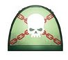
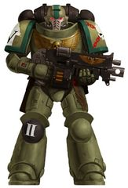
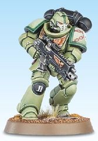
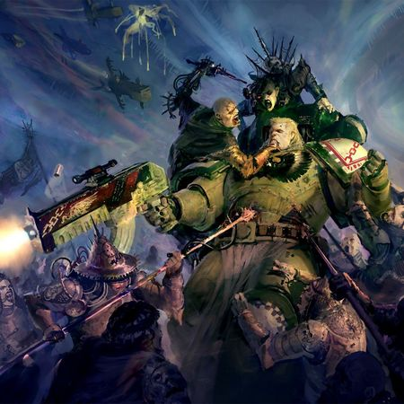
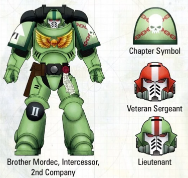

# 0448 裂隙堡主 Castellans of the Rift

精校状态：中文行文已逐段精校，部分术语仍为暂定

分类：通用概念 / 帝国 Imperium / 中央政务部 Adeptus Terra / 阿斯塔特修会 Adeptus Astartes

原文来源：https://www.bilibili.com/opus/1212884170154442818

原作者：帝国神选罐头

原文时间：2026年06月12日 11:30

[返回分类目录](目录.md) · [全书目录](../../目录.md)

<!-- A0448-B0001 -->
**英文原文**

The Castellans of the Rift are an Ultramarines Successor Chapter.

<!-- /A0448-B0001 -->

<!-- A0448-B0002 -->

原译文

裂隙堡主是极限战士的子战团。

**校订译文**

裂隙堡主是极限战士的子战团。

<!-- /A0448-B0002 -->

<!-- A0448-B0003 图片 -->

<!-- A0448-B0004 图片 -->

<!-- A0448-B0005 图片 -->

<!-- A0448-B0006 -->
**英文原文**

Founding Chapter:Ultramarines

<!-- /A0448-B0006 -->

<!-- A0448-B0007 -->

原译文

建军战团：极限战士

**校订译文**

母战团：极限战士

<!-- /A0448-B0007 -->

<!-- A0448-B0008 -->
**英文原文**

Founding:Ultima Founding

<!-- /A0448-B0008 -->

<!-- A0448-B0009 -->

原译文

建军时间：极限建军

**校订译文**

建军时间：极限建军

<!-- /A0448-B0009 -->

<!-- A0448-B0010 -->
**英文原文**

Chapter Master:Ba'stien Grix

<!-- /A0448-B0010 -->

<!-- A0448-B0011 -->

原译文

战团长：巴'斯提恩·格里克斯

**校订译文**

战团长：巴'斯提恩·格里克斯

<!-- /A0448-B0011 -->

<!-- A0448-B0012 -->
**英文原文**

Colours:Green

<!-- /A0448-B0012 -->

<!-- A0448-B0013 -->

原译文

配色：绿色

**校订译文**

配色：绿色

<!-- /A0448-B0013 -->

<!-- A0448-B0014 -->
**英文原文**

Battle Cry:Guard the gate! Hunt the hellspawn

<!-- /A0448-B0014 -->

<!-- A0448-B0015 -->

原译文

战吼：守卫大门！狩猎狱魔

**校订译文**

战吼：守卫大门！狩猎狱魔

<!-- /A0448-B0015 -->

<!-- A0448-B0016 -->
## Overview 概述

<!-- /A0448-B0016 -->

<!-- A0448-B0017 -->
**英文原文**

The Castellans of the Rift were among the Primaris Space Marine Chapters created during the Ultima Founding, at the direct order of Roboute Guilliman, and were created during the Indomitus Crusade. The Chapter have a dire duty entrusted to them by Guilliman himself, to clear the Nachmund Gauntlet of the numerous Daemon Engines and Renegade Knights blighting it. As of right now, the Castellans of the Rift are locked in a struggle to achieve this goal and drive back the Chaos hordes infesting one of the only stable routes through the Great Rift.

<!-- /A0448-B0017 -->

<!-- A0448-B0018 -->

原译文

裂隙堡主是极限建军期间在基里曼的直接命令下建立的原铸星际战士战团，在不屈远征期间，基里曼亲自赋予战团一项艰巨的任务，即清除纳克蒙德走廊的众多损害它的恶魔引擎和变节骑士。截至目前，裂隙堡主正忙于实现这一目标，并击退困扰大裂隙唯一稳定路线之一的混沌部落。

**校订译文**

裂隙堡主是罗保特·基里曼直接下令创建的原铸星际战士战团之一，诞生于不屈远征期间的极限建军。基里曼亲自交给他们一项艰险使命：肃清蹂躏纳克蒙德走廊的众多恶魔引擎与变节骑士。按照原条目所述，他们仍在为此苦战，力图赶走盘踞于这条罕有、可稳定穿越大裂隙的航路上的混沌大军。

<!-- /A0448-B0018 -->

<!-- A0448-B0019 图片 -->

<!-- A0448-B0020 -->

原译文

Castellan of the Rift fights against Chaos Cultists 裂谷堡主与混沌邪教徒作战

**校订译文**

Castellan of the Rift fights against Chaos Cultists 裂隙堡主战士与混沌信徒作战

<!-- /A0448-B0020 -->

<!-- A0448-B0021 -->
## Known Campaigns 已知战役

<!-- /A0448-B0021 -->

<!-- A0448-B0022 -->
**英文原文**

War of Beasts: 2 Companies on Vigilus and 2 on Sangua Terra.

<!-- /A0448-B0022 -->

<!-- A0448-B0023 -->

原译文

野兽战争：警戒星的两个连队和赤地星的两个连队

**校订译文**

野兽之战：两个连队驻于警戒星，另两个连队驻于赤地星。

<!-- /A0448-B0023 -->

<!-- A0448-B0024 -->
**英文原文**

Nachmund Rift War: 250-300 Battle-Brothers from the 1st, 2nd, 5th, and 9th Companies under Chapter Master Grix himself.

<!-- /A0448-B0024 -->

<!-- A0448-B0025 -->

原译文

纳克蒙德走廊战争：第1、第2、第5和第9连队的250-300名战斗兄弟，隶属于战团长格里克斯本人。

**校订译文**

纳克蒙德裂隙战争：战团长格里克斯亲自指挥第一、第二、第五与第九连抽调的250至300名战斗兄弟。

<!-- /A0448-B0025 -->

<!-- A0448-B0026 -->
## Heraldry 纹章

<!-- /A0448-B0026 -->

<!-- A0448-B0027 -->
**英文原文**

The Castellans of the Rift wear olive-green armour detailed with dark green pauldron trims and helmet stripes, as well as black power packs and right kneepads, and golden chest Imperialis. Faceplates are painted white, while the other colours on the helmet indicate rank.

<!-- /A0448-B0027 -->

<!-- A0448-B0028 -->

原译文

裂隙堡主穿着橄榄绿色盔甲，上面有深绿色的肩甲边缘和头盔条纹，还有黑色动力背包和右膝甲，以及金色的帝国胸甲。面甲被漆成白色，而头盔上的其他颜色则表示等级。

**校订译文**

裂隙堡主穿戴橄榄绿护甲，肩甲镶边与头盔条纹为深绿色，动力背包和右膝甲为黑色，胸前饰有金色帝国徽记。面甲涂白，头盔其余配色表示军阶。

**校注：** Imperialis 指胸前徽记，非整个胸甲涂成金色。

<!-- /A0448-B0028 -->

<!-- A0448-B0029 图片 -->

<!-- A0448-B0030 -->

原译文

Castellans of the Rift heraldry 裂隙堡主纹章

**校订译文**

Castellans of the Rift heraldry 裂隙堡主纹章

<!-- /A0448-B0030 -->

<!-- A0448-B0031 -->
**英文原文**

Company is indicated through a white Roman numeral upon a marine's black right kneepad. The Castellans of the Rift do not display company colours anywhere on their armour. Squad designation is displayed in the Codex-compliant fashion using a black Roman numeral, indicating squad number, laid over a white squad battlefield role icon on a marine's right pauldron.

<!-- /A0448-B0031 -->

<!-- A0448-B0032 -->

原译文

连队通过战士黑色右膝甲上的白色罗马数字表示。裂隙堡主的盔甲上没有任何地方显示连队颜色。小队任命以符合圣典的方式显示，使用黑色罗马数字表示小队编号，放置在战士右肩甲上的白色小队战场角色图标上。

**校订译文**

连队番号以白色罗马数字绘于黑色右膝甲上，护甲其他部位也不采用连队识别色。小队标识遵循圣典格式：右肩甲绘白色战场职能徽记，其上叠加黑色罗马数字，标明小队编号。

<!-- /A0448-B0032 -->

<!-- A0448-B0033 -->
**英文原文**

The Chapter Badge, displayed on a Castellan's left pauldron, is a white skull upon two diagonally crossed red chains, upon a background of olive green.

<!-- /A0448-B0033 -->

<!-- A0448-B0034 -->

原译文

战团徽章，展示在一名堡主的左肩甲上，是一个白色的头骨，上面有两条斜交的红色锁链，背景是橄榄绿色。

**校订译文**

战团徽记位于左肩甲：橄榄绿底色上，两条红色锁链斜向交叉，一枚白色颅骨叠在锁链之上。

**校注：** 原译将锁链与颅骨的叠放关系倒置；英文为颅骨在交叉锁链之上。

<!-- /A0448-B0034 -->

<!-- A0448-B0035 -->
## Chapter Elements 战团人物与事物

原题：Chapter Elements 战团成员

<!-- /A0448-B0035 -->

<!-- A0448-B0036 -->
## Relics 圣物

<!-- /A0448-B0036 -->

<!-- A0448-B0037 -->

原译文

Armour of Phourion 福里昂之甲

**校订译文**

Armour of Phourion 福里昂之甲

<!-- /A0448-B0037 -->

<!-- A0448-B0038 -->

原译文

Gauntlet of the Imperium 帝国臂铠

**校订译文**

Gauntlet of the Imperium 帝国臂铠

<!-- /A0448-B0038 -->

<!-- A0448-B0039 -->

原译文

Muruk's Wrath 姆洛克之怒

**校订译文**

Muruk's Wrath 姆洛克之怒

<!-- /A0448-B0039 -->

<!-- A0448-B0040 -->

原译文

Primarch's Codex 原体圣典

**校订译文**

Primarch's Codex 原体圣典

<!-- /A0448-B0040 -->

<!-- A0448-B0041 -->
## Known Vessels 已知战舰

<!-- /A0448-B0041 -->

<!-- A0448-B0042 -->
**英文原文**

Bulwark — Battle Barge.

<!-- /A0448-B0042 -->

<!-- A0448-B0043 -->

原译文

壁垒号 — 战斗驳船

**校订译文**

壁垒号 — 战斗驳船

<!-- /A0448-B0043 -->

<!-- A0448-B0044 -->
**英文原文**

Eternal Watchman — Battle Barge.

<!-- /A0448-B0044 -->

<!-- A0448-B0045 -->

原译文

永恒守望者号 — 战斗驳船

**校订译文**

永恒守望者号 — 战斗驳船

<!-- /A0448-B0045 -->

<!-- A0448-B0046 -->
**英文原文**

Dark Sentry — Strike Cruiser.

<!-- /A0448-B0046 -->

<!-- A0448-B0047 -->

原译文

黑暗哨兵号 — 打击巡洋舰

**校订译文**

黑暗哨兵号 — 打击巡洋舰

<!-- /A0448-B0047 -->

<!-- A0448-B0048 -->
**英文原文**

Night Guard — Strike Cruiser.

<!-- /A0448-B0048 -->

<!-- A0448-B0049 -->

原译文

午夜守卫号 — 打击巡洋舰

**校订译文**

午夜守卫号 — 打击巡洋舰

<!-- /A0448-B0049 -->

<!-- A0448-B0050 -->
**英文原文**

Twilight Sentinel — Strike Cruiser.

<!-- /A0448-B0050 -->

<!-- A0448-B0051 -->

原译文

黄昏哨兵号 — 打击巡洋舰

**校订译文**

黄昏哨兵号 — 打击巡洋舰

<!-- /A0448-B0051 -->

<!-- A0448-B0052 -->
**英文原文**

Bizarme — Gladius Escort.

<!-- /A0448-B0052 -->

<!-- A0448-B0053 -->

原译文

比扎姆号 — 短剑护卫舰

**校订译文**

比扎姆号 — 短剑护卫舰

<!-- /A0448-B0053 -->

<!-- A0448-B0054 -->
**英文原文**

Fauchard — Gladius Escort.

<!-- /A0448-B0054 -->

<!-- A0448-B0055 -->

原译文

战镰号 — 短剑护卫舰

**校订译文**

战镰号 — 短剑护卫舰

<!-- /A0448-B0055 -->

<!-- A0448-B0056 -->
**英文原文**

Glaive — Gladius Escort.

<!-- /A0448-B0056 -->

<!-- A0448-B0057 -->

原译文

长刀号 — 短剑护卫舰

**校订译文**

长刀号 — 短剑护卫舰

<!-- /A0448-B0057 -->

<!-- A0448-B0058 -->
**英文原文**

Halberd — Gladius Escort.

<!-- /A0448-B0058 -->

<!-- A0448-B0059 -->

原译文

长戟号 — 短剑护卫舰

**校订译文**

长戟号 — 短剑护卫舰

<!-- /A0448-B0059 -->

<!-- A0448-B0060 -->
**英文原文**

Poleaxe — Gladius Escort.

<!-- /A0448-B0060 -->

<!-- A0448-B0061 -->

原译文

长斧号 — 短剑护卫舰

**校订译文**

长斧号 — 短剑护卫舰

<!-- /A0448-B0061 -->

<!-- A0448-B0062 -->
**英文原文**

Voulge — Gladius Escort.

<!-- /A0448-B0062 -->

<!-- A0448-B0063 -->

原译文

斧枪号 — 短剑护卫舰

**校订译文**

斧枪号 — 短剑护卫舰

<!-- /A0448-B0063 -->

<!-- A0448-B0064 -->
**英文原文**

Svonya — Escort.

<!-- /A0448-B0064 -->

<!-- A0448-B0065 -->

原译文

斯沃尼亚号 — 护卫舰

**校订译文**

斯沃尼亚号 — 护卫舰

<!-- /A0448-B0065 -->

<!-- A0448-B0066 -->
**英文原文**

Trident — Escort.

<!-- /A0448-B0066 -->

<!-- A0448-B0067 -->

原译文

三叉戟号 — 护卫舰

**校订译文**

三叉戟号 — 护卫舰

<!-- /A0448-B0067 -->

<!-- A0448-B0068 -->
## Notable Members 著名成员

<!-- /A0448-B0068 -->

<!-- A0448-B0069 -->
**英文原文**

Ba'stien Grix — Chapter Master.

<!-- /A0448-B0069 -->

<!-- A0448-B0070 -->

原译文

巴'斯提恩·格里克斯 — 战团长

**校订译文**

巴'斯提恩·格里克斯 — 战团长

<!-- /A0448-B0070 -->

<!-- A0448-B0071 -->
**英文原文**

Krenel Pors — Captain, 2nd Company.

<!-- /A0448-B0071 -->

<!-- A0448-B0072 -->

原译文

克雷内尔·波斯 — 连长，第二连队

**校订译文**

克雷内尔·波斯 — 连长，第二连队

<!-- /A0448-B0072 -->

<!-- A0448-B0073 -->
**英文原文**

Oppidus Glaukis — Captain, 5th Company.

<!-- /A0448-B0073 -->

<!-- A0448-B0074 -->

原译文

奥皮达斯·格劳基斯 — 连长，第五连队

**校订译文**

奥皮达斯·格劳基斯 — 连长，第五连队

<!-- /A0448-B0074 -->

<!-- A0448-B0075 -->
**英文原文**

Tenalus Proteik — Captain, 9th Company.

<!-- /A0448-B0075 -->

<!-- A0448-B0076 -->

原译文

特纳鲁斯·普罗泰克 — 连长，第九连队

**校订译文**

特纳鲁斯·普罗泰克 — 连长，第九连队

<!-- /A0448-B0076 -->

<!-- A0448-B0077 -->
**英文原文**

Artung Muruk — Former Captain, the very first Castellan to be killed in battle.

<!-- /A0448-B0077 -->

<!-- A0448-B0078 -->

原译文

阿通·穆鲁克 — 前连长，第一个在战斗中牺牲的堡主。

**校订译文**

阿通·姆洛克——前连长，首位战死的裂隙堡主成员。

**校注：** Muruk 在圣物名原作姆洛克、人物名原穆鲁克，此处按本篇较早圣物词根统一姆洛克。

<!-- /A0448-B0078 -->

<!-- A0448-B0079 -->
**英文原文**

Argis Phourion — Original Captain of the 8th Company, known for his speed and skill with a blade.

<!-- /A0448-B0079 -->

<!-- A0448-B0080 -->

原译文

阿吉斯·福里昂 — 第八连队的原连长，以速度和剑术闻名。

**校订译文**

阿吉斯·福里昂 — 第八连队的原连长，以速度和剑术闻名。

<!-- /A0448-B0080 -->

<!-- A0448-B0081 -->
**英文原文**

Bartizan Nikol — Techmarine.

<!-- /A0448-B0081 -->

<!-- A0448-B0082 -->

原译文

巴蒂赞·尼科尔 — 技术军士

**校订译文**

巴蒂赞·尼科尔——科技战士。

<!-- /A0448-B0082 -->

<!-- A0448-B0083 -->
## Trivia 琐事

<!-- /A0448-B0083 -->

<!-- A0448-B0084 -->
**英文原文**

The Castellans of the Rift were originally created by Max Faleij, who explained his thoughts behind their background and design in White Dwarf October 2017. The Chapter was later given supplement rules in War Zone Nachmund: Rift War.

<!-- /A0448-B0084 -->

<!-- A0448-B0085 -->

原译文

裂隙堡主最初由马克斯·法莱伊创作，他在2017年10月的《白矮人》中解释了他们的背景和设计背后的想法。该战团后来在《纳克蒙德战区：裂隙战争》中得到了补充规则。

**校订译文**

裂隙堡主最初由马克斯·法莱伊创作，他在2017年10月的《白矮人》中解释了他们的背景和设计背后的想法。该战团后来在《纳克蒙德战区：裂隙战争》中得到了补充规则。

<!-- /A0448-B0085 -->

<!-- A0448-B0086 -->
**英文原文**

All of the Castellans' known escort vessels are named after types of polearm.

<!-- /A0448-B0086 -->

<!-- A0448-B0087 -->

原译文

所有已知的堡主护卫战舰都是以各种类型的长柄武器命名的。

**校订译文**

所有已知的堡主护卫战舰都是以各种类型的长柄武器命名的。

<!-- /A0448-B0087 -->

本篇核心术语与暂定项

以下列出本篇出现的英文原形及核心术语表用词。同形词可能指不同对象，具体词义以本篇正文和校注为准；单复数、别名和仅见于图注的名称可能尚未列入。完整候选见[术语表](../../术语表/双语术语候选.csv)。

| 英文 | 采用中文 | 状态 |
| --- | --- | --- |
| Roboute Guilliman | 罗保特·基里曼 | 官方已核对 |
| Ultramarines | 极限战士 | 官方已核对 |
| Great Rift | 大裂隙 | 官方已核对 |
| Indomitus | 不屈学派 | 暂定·学派语境 |
| Techmarine | 科技战士 | 官方已核对 |
| Battle Barge | 战斗驳船 | 暂定·官方待核 |
| Terra | 泰拉 | 暂定·官方待核 |
| Indomitus Crusade | 不屈远征 | 暂定·官方待核 |
| War of Beasts | 野兽之战 | 暂定·官方待核 |
| Nachmund Rift War | 纳克蒙德裂隙战争 | 暂定·官方待核 |
| Nachmund Gauntlet | 纳克蒙德走廊 | 暂定·官方待核 |
| Vigilus | 警戒星 | 暂定·官方待核 |
| Clear | 清明 | 暂定·官方待核 |
| Master | 导师（审判庭职衔）／舰务官（舰员职务） | 语境定译·官方待核 |
| Founding | 建军 | 暂定·官方待核 |
| Space Marine | 星际战士 | 暂定·官方待核 |
| Chapter | 战团 | 暂定·官方待核 |
| Chapter Master | 战团长 | 暂定·官方待核 |
| Captain | 连长 | 暂定·官方待核 |
| Primaris Space Marine | 原铸星际战士 | 暂定·官方待核 |
| Ultima Founding | 极限建军 | 暂定·官方待核 |
| Castellans of the Rift | 裂隙堡主 | 暂定·官方待核 |
| Strike Cruiser | 打击巡洋舰 | 暂定·官方待核 |
| Castellan | 堡主 | 官方已核对 |
| Muruk | 姆洛克 | 暂定·官方待核 |
| Imperialis | 帝国徽记 | 暂定·官方待核 |
| Bulwark | 壁垒号 | 暂定·官方待核 |
| Eternal Watchman | 永恒守望者号 | 暂定·官方待核 |
| Dark Sentry | 黑暗哨兵号（打击巡洋舰）／黑暗哨兵（游荡行星） | 语境定译·官方待核 |
| Night Guard | 午夜守卫号 | 暂定·官方待核 |
| Twilight Sentinel | 黄昏哨兵号 | 暂定·官方待核 |
| Bizarme | 比扎姆号 | 暂定·官方待核 |
| Fauchard | 战镰号 | 暂定·官方待核 |
| Glaive | 长刀号（舰船）／飞刃（坦克） | 语境定译·官方待核 |
| Halberd | 长戟号 | 暂定·官方待核 |
| Poleaxe | 长斧号 | 暂定·官方待核 |
| Voulge | 斧枪号 | 暂定·官方待核 |
| Svonya | 斯沃尼亚号 | 暂定·官方待核 |
| Trident | 三叉戟号 | 暂定·官方待核 |
| Ba'stien Grix | 巴'斯提恩·格里克斯 | 暂定·官方待核 |
| Krenel Pors | 克雷内尔·波斯 | 暂定·官方待核 |
| Oppidus Glaukis | 奥皮达斯·格劳基斯 | 暂定·官方待核 |
| Tenalus Proteik | 特纳鲁斯·普罗泰克 | 暂定·官方待核 |
| Artung Muruk | 阿通·姆洛克 | 暂定·官方待核 |
| Argis Phourion | 阿吉斯·福里昂 | 暂定·官方待核 |
| Bartizan Nikol | 巴蒂赞·尼科尔 | 暂定·官方待核 |
| Sangua Terra | 赤地星 | 暂定·官方待核 |

