# 0449 咆哮狮鹫 Howling Griffons

精校状态：中文行文已逐段精校，部分术语仍为暂定

分类：通用概念 / 帝国 Imperium / 中央政务部 Adeptus Terra / 阿斯塔特修会 Adeptus Astartes

原文来源：https://www.bilibili.com/opus/1216239389999366162

原作者：帝国神选罐头

原文时间：2026年06月21日 12:30

[返回分类目录](目录.md) · [全书目录](../../目录.md)

<!-- A0449-B0001 -->
**英文原文**

The Howling Griffons are a Space Marine Chapter with a long and glorious history. Few Chapters have won as much renown as quickly as the Howling Griffons. Their heroism has placed them amidst the most hallowed honour rolls of the Imperium.

<!-- /A0449-B0001 -->

<!-- A0449-B0002 -->

原译文

咆哮狮鹫是一个有着悠久而辉煌历史的星际战士战团。很少有战团能像咆哮狮鹫那样迅速赢得如此大的声望。他们的英雄主义使他们跻身帝国最神圣的荣誉卷轴。

**校订译文**

咆哮狮鹫是一个有着悠久而辉煌历史的星际战士战团。很少有战团能像咆哮狮鹫那样迅速赢得如此大的声望。他们的英雄主义使他们跻身帝国最神圣的荣誉卷轴。

<!-- /A0449-B0002 -->

<!-- A0449-B0003 图片 -->
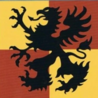

<!-- A0449-B0004 图片 -->
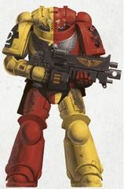

<!-- A0449-B0005 -->
**英文原文**

Founding Chapter:Ultramarines

<!-- /A0449-B0005 -->

<!-- A0449-B0006 -->

原译文

建军战团：极限战士

**校订译文**

母战团：极限战士

<!-- /A0449-B0006 -->

<!-- A0449-B0007 -->
**英文原文**

Founding:Unknown (Circa M33)

<!-- /A0449-B0007 -->

<!-- A0449-B0008 -->

原译文

建军时间：未知（约M33）

**校订译文**

建军时间：未知（约M33）

<!-- /A0449-B0008 -->

<!-- A0449-B0009 -->
**英文原文**

Chapter Master:Alvaro or Kenot Friche

<!-- /A0449-B0009 -->

<!-- A0449-B0010 -->

原译文

战团长：阿尔瓦罗或基诺·弗里切

**校订译文**

战团长：阿尔瓦罗或基诺·弗里切

<!-- /A0449-B0010 -->

<!-- A0449-B0011 -->
**英文原文**

Homeworld:Mancora

<!-- /A0449-B0011 -->

<!-- A0449-B0012 -->

原译文

家园世界：曼科拉

**校订译文**

家园世界：曼科拉

<!-- /A0449-B0012 -->

<!-- A0449-B0013 -->
**英文原文**

Fortress-Monastery:The Proud Eyrie

<!-- /A0449-B0013 -->

<!-- A0449-B0014 -->

原译文

堡垒修道院：高傲鹰巢

**校订译文**

要塞修道院：高傲鹰巢

<!-- /A0449-B0014 -->

<!-- A0449-B0015 -->
**英文原文**

Colours:Quartered yellow and red

<!-- /A0449-B0015 -->

<!-- A0449-B0016 -->

原译文

配色：四分之一的黄色和红色

**校订译文**

配色：黄色与红色交替构成四分格。

<!-- /A0449-B0016 -->

<!-- A0449-B0017 -->
**英文原文**

Specialty:Codex Chapter

<!-- /A0449-B0017 -->

<!-- A0449-B0018 -->

原译文

特长：圣典战团

**校订译文**

特长：圣典战团

<!-- /A0449-B0018 -->

<!-- A0449-B0019 -->
**英文原文**

Battle Cry:For Guilliman, son of the Emperor! For the Founding Father! For the oath and the word! For the honour that men fear! Howling Griffons, what say you to the oath sworn by your brothers long dead? Honour them! Even though it may cost your life? Though your soul be rent and your bodies broken? Shall you honour this oath, Howling Griffons, inheritors of Guilliman?

<!-- /A0449-B0019 -->

<!-- A0449-B0020 -->

原译文

战吼：为了基里曼，帝皇之子！为了建军之父！为了誓言和言语！为了男人害怕的荣誉！咆哮狮鹫，你对你死去很久的兄弟们宣誓的誓言有什么看法？向他们致敬！即使这可能会让你付出生命的代价？尽管你的灵魂被撕裂，你的身体被损坏？基里曼的继承者，咆哮狮鹫，你会遵守这个誓言吗？

**校订译文**

战吼：“为了帝皇之子基里曼！为了建军之父！为了誓言与承诺！为了令人敬畏的荣耀！咆哮狮鹫，对于早已逝去的兄弟所立下的誓言，你们如何回应？”“践行到底！”“即使付出生命？即使灵魂撕裂、身躯破碎？基里曼的继承者，咆哮狮鹫，你们仍会坚守这份誓言吗？”

<!-- /A0449-B0020 -->

<!-- A0449-B0021 -->
## Overview 概述

<!-- /A0449-B0021 -->

<!-- A0449-B0022 -->
**英文原文**

The Howling Griffons are staunch traditionalists and consider their primary role to be defenders of the Imperium and an instrument of the Emperor's ideals. They see the Codex Astartes as a treatise that has yet to be bettered, rather than holy scripture. As a Chapter, they do not specialize in any one form of warfare and as such maintain an even balance across all disciplines covered by the Codex. Competition within the Chapter is high, but never allowed to degenerate into discord.

<!-- /A0449-B0022 -->

<!-- A0449-B0023 -->

原译文

咆哮狮鹫是坚定的传统主义者，他们认为自己的主要角色是帝国的捍卫者和帝皇的理想的工具。他们认为阿斯塔特圣典是一篇有待改进的论文，而不是神圣的经文。作为一个战团，它们不专门研究任何一种形式的战争，因此在圣典涵盖的所有学说之间保持了平衡。战团内的竞争很激烈，但决不允许恶化成纷争。

**校订译文**

咆哮狮鹫坚定遵从传统，将守卫帝国、践行帝皇理想视为首要使命。他们认为《阿斯塔特圣典》是一部至今无可超越的军事论著，而非神圣经文。战团不专精某一种战法，而在圣典涵盖的各领域保持均衡。内部竞争激烈，却绝不允许演变成纷争。

**校注：** has yet to be bettered 指尚无作品胜过圣典，非原译有待改进；二者对战团的评价相反。

<!-- /A0449-B0023 -->

<!-- A0449-B0024 图片 -->
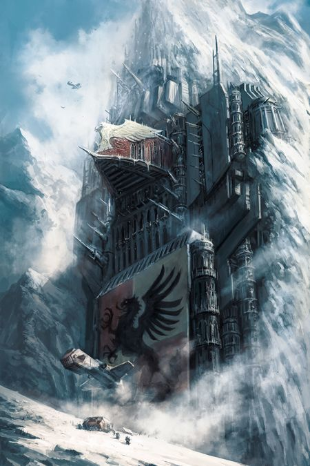

<!-- A0449-B0025 -->

原译文

The Howling Griffons fortress-monastery, The Proud Eyrie 咆哮狮鹫堡垒修道院，高傲鹰巢

**校订译文**

The Howling Griffons fortress-monastery, The Proud Eyrie 咆哮狮鹫要塞修道院，高傲鹰巢

<!-- /A0449-B0025 -->

<!-- A0449-B0026 -->
**英文原文**

They take special pride in their oaths, seeing each as an eternal conflict until the deed is finished. Before battle, additional oaths are added to their already exceedingly long lists, some for the chapter and others more personal. Once an oath is taken, a battle brother goes to extreme lengths to complete it and it is never forgotten, even after decades. Completed or satisfied oaths are a badge of honour, often inscribed on parchments or directly in the armour of the Howling Griffons Space Marines.

<!-- /A0449-B0026 -->

<!-- A0449-B0027 -->

原译文

他们对自己的誓言特别自豪，认为每一个誓言都是永恒的冲突，直到契约完成。在战斗之前，额外的誓言被添加到他们已经非常长的列表中，有些是针对战团的，有些则更个人化。一旦宣誓，一个战斗兄弟就会竭尽全力完成它，即使在几十年后，它也永远不会被遗忘。完成或满足的誓言是一种荣誉徽章，通常刻在羊皮纸上或直接刻在咆哮狮鹫星际战士的盔甲上。

**校订译文**

战团尤其以誓言为荣，认为每一项誓言都意味着必须持续奋斗，直到承诺之事完成。每次战前，他们还会向本已极长的誓言清单中增添新誓，有些属于全团，有些出于个人。一旦立誓，战斗兄弟便竭尽所能践行，哪怕数十年后也绝不遗忘。完成的誓言成为荣誉，记在羊皮纸上，或直接镌刻于护甲。

<!-- /A0449-B0027 -->

<!-- A0449-B0028 -->
**英文原文**

The events of 220.M38 has set the Chapter on a dangerous road. Upon being raised to the rank of full Battle-brother, each warrior takes an oath to avenge the fallen whenever possible and as a Chapter the Howling Griffons have sworn to destroy Periclitor whatever the cost, even if this means going into the depths of hell itself. The Daemon Prince Jago has also declared the Howling Griffons to be his sworn enemies. This hatred is shared by his Warband, the Raptorous Flayhost, and the Griffons' helmets are particularity collected as trophies by its Chaos Terminators.

<!-- /A0449-B0028 -->

<!-- A0449-B0029 -->

原译文

220.M38的事件使战团走上了一条危险的道路。当被提升为战斗兄弟时，每个战士都宣誓尽可能为倒下的人报仇，作为一个战团，咆哮狮鹫发誓不惜一切代价毁灭佩里克利托，即使这意味着要进入地狱深处。恶魔王子雅各也宣布咆哮狮鹫是他的死敌。这种仇恨是由他的战帮狂热剥皮军共享的，狮鹫之盔是由其混沌终结者特别收集的战利品。

**校订译文**

220.M38的惨剧让战团踏上一条危险道路。每名战士晋升为正式战斗兄弟时，都要立誓随时为阵亡者复仇；全团更发誓不惜代价消灭佩里克利托，即使必须深入地狱。恶魔王子雅各也将咆哮狮鹫列为死敌，其狂热剥皮军战帮同样怀此仇恨，其中的混沌终结者尤其热衷收集咆哮狮鹫头盔作为战利品。

<!-- /A0449-B0029 -->

<!-- A0449-B0030 -->
**英文原文**

Due to their glorious battle records and a near permanent campaigning status, they have gained the right to recruit initiates from several different worlds, including Dennar IV, in order to counteract the high levels of attrition that they face. As their main point of recruitment Mancora is kept in a constant state of warfare in order to provide them with a solid base of well disciplined initiates. The high birth rate of psykers on Mancora has also led to a high number of powerful Battle-Psykers within their ranks.

<!-- /A0449-B0030 -->

<!-- A0449-B0031 -->

原译文

由于他们辉煌的战斗记录和近乎永久的领导运动地位，他们获得了从几个不同世界招募修士的权利，包括丹纳尔四号，以抵消他们面临的高损耗。作为他们的主要招募点，曼科拉一直处于战争状态，以便为他们提供一个受过训练的修士的坚实基础。曼科拉的灵能者出生率很高，这也导致了他们队伍中有大量强大的战斗灵能者。

**校订译文**

辉煌战绩与近乎常年征战的状态，使咆哮狮鹫获准从丹纳尔四号等多个世界征兵，以弥补高昂损耗。主要征兵世界曼科拉被维持在持续战争之中，为战团提供稳定、训练有素的候选者。当地灵能者出生率较高，也让战团拥有大量强大的战斗灵能者。

**校注：** campaigning 指持续征战，不是领导运动；征兵是弥补作战损耗。

<!-- /A0449-B0031 -->

<!-- A0449-B0032 -->
**英文原文**

The Howling Griffons are known to have seconded many Battle-Brothers to the Deathwatch over the years.

<!-- /A0449-B0032 -->

<!-- A0449-B0033 -->

原译文

众所周知，咆哮狮鹫多年来借调了许多战斗兄弟到死亡守望。

**校订译文**

众所周知，咆哮狮鹫多年来借调了许多战斗兄弟到死亡守望。

<!-- /A0449-B0033 -->

<!-- A0449-B0034 -->
**英文原文**

Howling Griffons Bike Squads are known for excelling at spearhead line-breaking assaults.

<!-- /A0449-B0034 -->

<!-- A0449-B0035 -->

原译文

咆哮狮鹫摩托小队以擅长先锋突破攻击而闻名。

**校订译文**

咆哮狮鹫摩托小队以擅长先锋突破攻击而闻名。

<!-- /A0449-B0035 -->

<!-- A0449-B0036 -->
## History 历史

<!-- /A0449-B0036 -->

<!-- A0449-B0037 -->
**英文原文**

The Howling Griffons have fought with honour in a thousand campaigns vital to the Imperium.

<!-- /A0449-B0037 -->

<!-- A0449-B0038 -->

原译文

咆哮狮鹫在对帝国至关重要的一千场战役中光荣作战。

**校订译文**

咆哮狮鹫在对帝国至关重要的一千场战役中光荣作战。

<!-- /A0449-B0038 -->

<!-- A0449-B0039 图片 -->
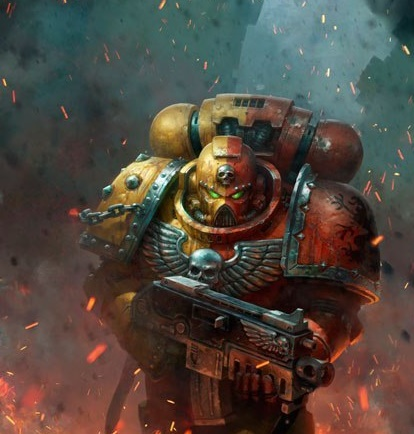

<!-- A0449-B0040 -->

原译文

Howling Griffon 咆哮狮鹫

**校订译文**

Howling Griffon 咆哮狮鹫

<!-- /A0449-B0040 -->

<!-- A0449-B0041 -->
**英文原文**

???.M33: The Howling Griffons Chapter is founded as a successor to the Ultramarines.

<!-- /A0449-B0041 -->

<!-- A0449-B0042 -->

原译文

咆哮狮鹫战团是作为极限战士的子战团而建立的。

**校订译文**

???.M33：咆哮狮鹫以极限战士子战团的身份建立。

<!-- /A0449-B0042 -->

<!-- A0449-B0043 -->
**英文原文**

???.M35: The Howling Griffons aboard their strike cruisers were among the Chapters that took part in the Commorragh Raid.

<!-- /A0449-B0043 -->

<!-- A0449-B0044 -->

原译文

他们的打击巡洋舰上的咆哮狮鹫是参加科摩罗突袭的战团之一。

**校订译文**

???.M35：咆哮狮鹫搭乘打击巡洋舰，参与科摩罗突袭。

<!-- /A0449-B0044 -->

<!-- A0449-B0045 -->
**英文原文**

???.M36: The Howling Griffons destroyed the Necroteks of Naath.

<!-- /A0449-B0045 -->

<!-- A0449-B0046 -->

原译文

咆哮狮鹫摧毁了纳斯的死灵技师。

**校订译文**

???.M36：消灭纳斯的死灵技师。

<!-- /A0449-B0046 -->

<!-- A0449-B0047 -->
**英文原文**

220.M38: Arios Point Ambush — The Howling Griffons were ambushed by then Chaos Lord Periclitor on their return to Mancora. The ambush led to the death of Chapter Master Orlando Furioso as well as most of their First and Eighth Companies. This has sparked a long standing feud between the Word Bearers and the Howling Griffons.

<!-- /A0449-B0047 -->

<!-- A0449-B0048 -->

原译文

阿里奥斯点伏击 — 咆哮狮鹫在返回曼科拉时遭到了当时的混沌领主佩里克利托的伏击。伏击导致了战团长奥兰多·弗里奥索以及他们第一和第八连队的大部分的死亡。这引发了怀言者和咆哮狮鹫之间的世仇。

**校订译文**

220.M38：阿里奥斯点伏击——返航曼科拉途中，咆哮狮鹫遭当时仍为混沌领主的佩里克利托伏击。战团长奥兰多·弗里奥索与第一、第八连大多数成员阵亡，由此结下与怀言者延续至今的血仇。

<!-- /A0449-B0048 -->

<!-- A0449-B0049 -->

原译文

322-384.M39: Angevin Crusade 安茹远征

**校订译文**

322-384.M39: Angevin Crusade 安茹远征

<!-- /A0449-B0049 -->

<!-- A0449-B0050 -->
**英文原文**

109.M40 or 109.M41:The Dennar IV Suppression — The Howling Griffons 3rd Company, led by Captain Penvath Joachim, responded to a call for aid from Dennar IV. When they arrived at the agri world, they discovered a handfull of city-states full of refugees holding out against a horde of cultists, some of whom were possessed by daemons. Using their superior armour and tactics, the Howling Griffons rallied the local forces and led a long and bloody struggle to clear the planet of the uprising. After this action, the Howling Griffons have kept a lasting oath to protect the planet; in return they are able to count Dennar IV as one of their recruiting planets.

<!-- /A0449-B0050 -->

<!-- A0449-B0051 -->

原译文

丹纳尔四号镇压 - 由彭瓦特·约阿希姆连长领导的咆哮狮鹫第三连队响应了丹纳尔四号的援助呼唤。当他们到达农业世界时，他们发现了一大群城邦，里面满是难民，他们抵抗着一群邪教徒部落，其中一些人被恶魔附身。咆哮狮鹫凭借其卓越的盔甲和战术，召集了当地部队，并领导了一场漫长而血腥的斗争，以清除行星上的叛乱。在这次行动之后，咆哮狮鹫一直坚守着保护行星的誓言；作为回报，他们能够将丹纳尔四号视为他们的招募行星之一。

**校订译文**

109.M40或109.M41：丹纳尔四号镇压——彭瓦特·约阿希姆连长率第三连响应当地求援。抵达这颗农业世界时，他们发现只有少数挤满难民的城邦仍在抵抗大批邪教徒，其中部分已遭恶魔附身。凭借优良护甲与战术，咆哮狮鹫重整当地部队，历经漫长血战平定叛乱。此后，他们立誓长期保护行星，并获准将其作为征兵世界。

**校注：** handful 指少数，原译一大群反转数量；109.M40与109.M41两种日期按英文同时保留，末节有明确版本说明。

<!-- /A0449-B0051 -->

<!-- A0449-B0052 图片 -->
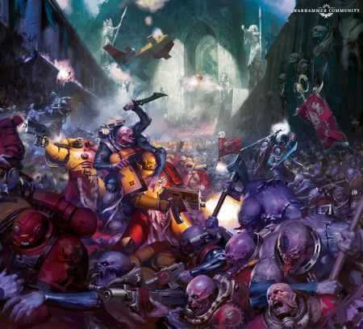

<!-- A0449-B0053 -->

原译文

Marines of the Howling Griffons fighting Genestealers 咆哮狮鹫的战士与基因窃取者作战

**校订译文**

Marines of the Howling Griffons fighting Genestealers 咆哮狮鹫的战士与基因窃取者作战

<!-- /A0449-B0053 -->

<!-- A0449-B0054 -->
**英文原文**

143.M41: The Jorun Retaliation — En route to the Gothic War an Imperial Battlegroup, the 15th Heraklion Ironclads, turned on their Commissariat attachment and went renegade. Investigations into this turn of events uncovered the foul Xenos taint of Dark Eldar, who had managed to ensnare and corrupt General Jorun and his command structure. Jorun and his fleet raided planet after planet, enslaving whole populations for their masters. The full Howling Griffons Chapter (about 8 Companies worth of Marines) was given command of the strike force, with support from the Ultramarines and Sons of Orar Chapters. Initial contact was made as the traitor forces were landing on Asturia. With no armour unloaded, it became a massacre, with over 5,000 Guard dying in an hour. The Howling Griffons' 4th Company, led by Chaplain Armand Titus, led the final strike on Jorun's forces, fighting through Jorun's Ogryn cadre as well as Dark Eldar troops. Titus delivered the killing blow to Jorun, while slowly succumbing to poisoned wounds and sealing the fate of the Heraklion Ironclads. The campaign was not completed before the Howling.

<!-- /A0449-B0054 -->

<!-- A0449-B0055 -->

原译文

约伦报复 — 在前往哥特战争的途中，第十五伊拉克利翁铁甲军帝国战斗群反戈了他们的政委部，叛变了。对这一事件的调查揭示了黑暗灵族的邪恶异型污染，他们设法诱捕并腐化了约伦将军及其指挥结构。约伦和他的舰队袭击了一个又一个行星，为他们的主人奴役了所有人口。整个咆哮狮鹫（约8个连队的星际战士）在极限战士和奥拉尔之子的支援下，指挥着打击部队。最初的接触是在叛徒部队登陆阿斯图里亚时进行的。由于没有卸下盔甲，这场大屠杀在一小时内造成5000多名卫队死亡。由牧师阿曼德·提图斯领导的咆哮狮鹫第四连队领导了对约伦部队的最后一次打击，与约伦的欧格林干部以及黑暗灵族部队进行战斗。提图斯给了约伦致命的一击，同时缓慢地死于中毒的伤口，并决定了伊拉克利翁铁甲军的命运。这场战役在咆哮狮鹫之前还没有结束。

**校订译文**

143.M41：约伦报复行动——前往哥特战争的途中，帝国第十五伊拉克利翁铁甲军战斗群攻击配属政委机构，随后叛变。调查揭示，黑暗灵族诱骗并腐化了约伦将军及其指挥层。约伦舰队接连劫掠行星，为异形主人掳掠整批居民。咆哮狮鹫以全团可用的约八个连队，统领一支获极限战士与奥拉尔之子支援的打击部队。首次接战时，叛军正在阿斯图里亚登陆，装甲车辆尚未卸载，结果遭到屠杀，一小时内五千余名卫队士兵丧生。阿曼德·提图斯教士率第四连发动最后突击，突破约伦的欧格林亲兵与黑暗灵族部队。提图斯虽因中毒伤势逐渐衰弱，仍给予约伦致命一击，终结了伊拉克利翁铁甲军的命运。（英文末句在此残缺。）

**校注：** armour 指尚未卸载的装甲部队／车辆，不是士兵未脱下护甲。最后英文句“The campaign was not completed before the Howling.”明显残缺，未臆造缺失后半句。

<!-- /A0449-B0055 -->

<!-- A0449-B0056 -->
**英文原文**

857.M41: Lazar Blockade — The Howling Griffons' fleet, along with 4 other Space Marine Chapters, overwhelmed and obliterated the main Tomb World. However, secondary bases throughout the system suddenly came to life.

<!-- /A0449-B0056 -->

<!-- A0449-B0057 -->

原译文

拉扎尔封锁 — 咆哮狮鹫的舰队，连同其他4个星际战士战团，压倒并摧毁了主要的墓穴世界。然而，整个星系的次级基地突然活跃起来。

**校订译文**

857.M41：拉扎尔封锁——咆哮狮鹫舰队联合其他四个战团，攻克并摧毁主要墓穴世界；但星系各处的次级基地随即突然苏醒。

<!-- /A0449-B0057 -->

<!-- A0449-B0058 -->
**英文原文**

905-906.M41: Shortly before the Badab War, the Howling Griffons' Fourth Company along with parts of their Sixth, Tenth and First Companies carried out a lengthy search and destroy campaign within the Caradryad Sector. It can be safely assumed that a large number of planetary assaults were carried out during this action as they were severely lacking in Thunderhawks and drop pods when answering the call for aid in the Badab War as they had not had the chance to return to Mancora.

<!-- /A0449-B0058 -->

<!-- A0449-B0059 -->

原译文

巴达布战争前不久，咆哮狮鹫的第四连队及其第六、第十和第一连队的一部分在卡拉德里德星区进行了漫长的搜索和摧毁行动。可以安全地假设，在这次行动中进行了大量的行星突击，因为他们在巴达布战争中响应援助呼吁时严重缺乏雷鹰和空投舱，因为他们没有机会返回曼科拉。

**校订译文**

905—906.M41：在受召参与巴达布战争前不久，第四连与第六、第十、第一连的部分兵力在卡拉德里德星区执行长期搜索歼灭行动。后来，他们尚未来得及返回曼科拉补给便应召赴战，雷鹰和空降舱严重不足；原条目据此推测，此前曾实施大量行星突击。

<!-- /A0449-B0059 -->

<!-- A0449-B0060 图片 -->
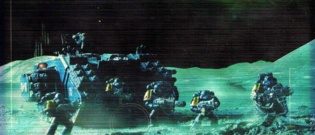

<!-- A0449-B0061 -->

原译文

Howling Griffons raid reaction force during the Khymarian Raids 咆哮狮鹫在凯玛利安突袭中突袭了反应部队

**校订译文**

Howling Griffons raid reaction force during the Khymarian Raids 凯玛利安突袭期间，咆哮狮鹫用于应对袭击的部队

<!-- /A0449-B0061 -->

<!-- A0449-B0062 -->
**英文原文**

906-909.M41: Badab War — The Howling Griffons, along with the Novamarines, responded to calls for aid. Having just finished a campaign in the Caradryad Sector, the Howling Griffons' task force was no more than 250 Space Marines and had insufficient planetary assault resources to aid in front line assaults. As a result, their initial engagements were to carry out garrison duties or convoy protection. Their largest deployment was to garrison the airless moons in the Khymara system, rebuilding old listening posts as staging areas for later in the war. Unfortunately in 4.003.907.M41, this posting put them in the path of the Executioners who were coming to aid the Secessionists as part of their blood oath to Huron. The Howling Griffons were annihilated; after the Executioners withdrawal, the casualty rate was more than 70%, including the catastrophic loss of their strike cruiser, Augeias, and Chaplain Dreadnought Titus. Despite these losses, the remaining force continued to fight wherever they could until officially relieved in 909.M41 The Howling Griffons made use of Insurgency Forces (five Marines, one armed with a sniper rifle.) and at least one Callidus Assassin during the war.

<!-- /A0449-B0062 -->

<!-- A0449-B0063 -->

原译文

巴达布战争 — 咆哮狮鹫和新星战士响应了援助呼吁。刚刚在卡拉德里德星区完成了一场战役，咆哮狮鹫的特遣队不超过250名星际战士，没有足够的行星突击资源来协助前线突击。因此，他们最初的任务是执行驻军任务或船队保护。他们最大的部署是在凯玛拉星系的无空气卫星上驻军，重建旧的监听站作为战争后期的集结地。不幸的是，在4.003.907.M41，一个消息让他们走上了处刑者的道路，这些处刑者是来帮助分离主义者的，这是他们对休伦的血誓的一部分。咆哮狮鹫被歼灭；处刑者撤退后，伤亡率超过70%，包括他们的打击巡洋舰奥吉亚斯号和牧师无畏提图斯的灾难性损失。尽管遭受了这些损失，但剩下的部队继续尽其所能地战斗，直到909.M41正式解除。咆哮狮鹫在战争中利用了叛乱部队（五名战士，一名携带狙击步枪）和至少一名卡利都司刺客。

**校订译文**

906—909.M41：巴达布战争——咆哮狮鹫与新星战士响应求援。刚结束卡拉德里德战役的咆哮狮鹫特遣队不超过250人，行星突击装备不足，难以承担前线强攻，最初主要负责守备与护航。最大一处部署位于凯玛拉星系无大气的卫星上：他们重建旧监听站，作为战争后续行动的集结地。4.003.907.M41，处刑者为履行对休伦的血誓前来支援分离派，这处驻地恰好挡在其进军路线上。咆哮狮鹫遭毁灭性打击，处刑者撤走后，伤亡超过70%，打击巡洋舰奥吉亚斯号及提图斯教士无畏机甲也损失。残部仍继续作战，直到909.M41被正式替换下来。战争中，他们使用过由五名战士组成、其中一人携狙击步枪的渗透破袭部队，并获得至少一名卡利都司刺客支援。

**校注：** posting 指驻守任务／驻地，非收到消息；annihilated 与超过70%伤亡及仍有残部并置，中文作毁灭性打击，保留具体损失。Insurgency Forces 此处为帝国方小规模特种部队，暂译渗透破袭部队，非其已背叛帝国。

<!-- /A0449-B0063 -->

<!-- A0449-B0064 图片 -->
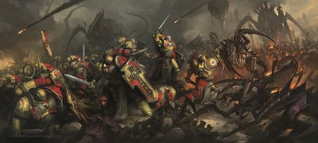

<!-- A0449-B0065 -->

原译文

The Howling Griffons battle tyranids 咆哮狮鹫与泰伦作战

**校订译文**

The Howling Griffons battle tyranids 咆哮狮鹫与泰伦作战

<!-- /A0449-B0065 -->

<!-- A0449-B0066 -->
**英文原文**

939.M41: Leviathan Maimed — Battle Barges from the Howling Griffons and Aurora Chapter under the command of Chaplain Cassius onboard the Ultramarines Strike Cruiser Vengeance of Macragge track a tendril of Hive Fleet Leviathan. As the tendril passes an asteroid belt near the Jomm System, they destroy the moon of Vendorak. The resulting shockwave causes asteroids to crash into the planet, depleting the hive fleet so it can't reach the planets of Jomm.

<!-- /A0449-B0066 -->

<!-- A0449-B0067 -->

原译文

利维坦残废 — 在牧师卡西乌斯的指挥下，来自咆哮狮鹫和曙光女神战团的战斗驳船在极限战士打击巡洋舰马库拉格复仇号上追踪虫巢舰队利维坦的卷须。当卷须经过乔姆星系附近的小行星带时，他们摧毁了卫星温多拉克。由此产生的冲击波导致小行星撞击行星，耗尽了虫巢舰队，使其无法到达乔姆行星。

**校订译文**

939.M41：重创利维坦——卡西乌斯教士坐镇极限战士打击巡洋舰马库拉格复仇号，指挥咆哮狮鹫与曙光女神的战斗驳船，追踪利维坦虫巢舰队的一条触须。触须途经乔姆星系附近的小行星带时，舰队摧毁温多拉克卫星。按原文叙述，冲击波使小行星撞向行星，严重消耗了虫巢舰队，使其无力抵达乔姆诸世界。

**校注：** 坐镇巡洋舰的是卡西乌斯教士，不是战斗驳船被装入巡洋舰。源文在此写“小行星撞击行星”却直接推得虫巢舰队受损，因果叙述不清；保留其说法并标疑，不凭记忆改为小行星撞击舰队。

<!-- /A0449-B0067 -->

<!-- A0449-B0068 -->
**英文原文**

951.M41: The Amar secession was brought to a swift end by the rapid strikes of the Howling Griffons. The Howling Griffons' tactical use of Land Speeder Storms allowed them to take the outer bastion of the Regent's palace and use his artillery against the inner palace.

<!-- /A0449-B0068 -->

<!-- A0449-B0069 -->

原译文

咆哮狮鹫的快速进攻迅速结束了阿马尔分裂。咆哮狮鹫战术性地使用了风暴兰德速攻艇，使他们能够占领摄政宫殿的外堡垒，并使用他的火炮攻击内宫。

**校订译文**

951.M41：咆哮狮鹫迅猛出击，终结阿马尔分离叛乱。他们巧用风暴兰德速攻艇夺取摄政宫殿外围堡垒，再掉转敌方火炮，轰击内宫。

<!-- /A0449-B0069 -->

<!-- A0449-B0070 -->
**英文原文**

978.M41: War for Bhorc Prime (Scrap at da Scrap Yard) — A contingent of Howling Griffons was dispatched to prevent the Orks from building bigger and better idols. They managed to seize the high ground, and, with commanding fire positions, they could press their attack on the Warlord's Gargantt fields and slow the invasion.

<!-- /A0449-B0070 -->

<!-- A0449-B0071 -->

原译文

博尔克一号之战（废料厂的废料）— 一支咆哮狮鹫分遣队被派往阻止兽人建造更大更好的神像。他们设法占领了高地，并通过指挥火力阵地，可以向军阀的加冈特场地发起进攻，减缓入侵。

**校订译文**

978.M41：博尔克主星之战（废料场恶战）——咆哮狮鹫奉命阻止欧克建造更庞大、更强力的神像。他们夺取高地，占据有利射界，继而攻击战争头目的加冈特建造场，迟滞入侵。

<!-- /A0449-B0071 -->

<!-- A0449-B0072 图片 -->
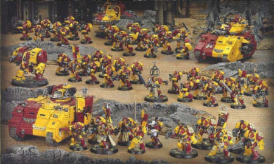

<!-- A0449-B0073 -->

原译文

Howling Griffons force during the Crusade of Fire 火焰远征期间的咆哮狮鹫部队

**校订译文**

Howling Griffons force during the Crusade of Fire 火焰远征期间的咆哮狮鹫部队

<!-- /A0449-B0073 -->

<!-- A0449-B0074 -->
**英文原文**

???.M41: The Howling Griffons under Captain Xerxes took part in the Crusade of Fire.

<!-- /A0449-B0074 -->

<!-- A0449-B0075 -->

原译文

薛西斯连长率领的咆哮狮鹫参加了火焰远征。

**校订译文**

???.M41：薛西斯连长率咆哮狮鹫参加火焰远征。

<!-- /A0449-B0075 -->

<!-- A0449-B0076 -->
**英文原文**

998.M41-present Third War for Armageddon — The Howling Griffons sent 2 Companies to participate in the campaign.

<!-- /A0449-B0076 -->

<!-- A0449-B0077 -->

原译文

现在的第三次阿玛吉多顿战争 — 咆哮狮鹫派遣了2个连队参加这场战役。

**校订译文**

998.M41至原条目所述“当前”：第三次阿玛吉多顿战争——战团派出两个连队参战。

<!-- /A0449-B0077 -->

<!-- A0449-B0078 -->
**英文原文**

999.M41: 13th Black Crusade — The Howling Griffons sent 8 Companies to participate in the campaign.

<!-- /A0449-B0078 -->

<!-- A0449-B0079 -->

原译文

第13次黑色远征 — 咆哮狮鹫派遣了8个连队参加这场战役。

**校订译文**

999.M41：第十三次黑色远征——战团派出八个连队。

<!-- /A0449-B0079 -->

<!-- A0449-B0080 -->
**英文原文**

The 1st Company of the Howling Griffons, including Chapter Master Alvaro, were based on the battle-barge Force of Destiny and engaged upon a mission to track down and persecute a company of Night Lords under the command of the infamous Daemon Prince Periclitor.

<!-- /A0449-B0080 -->

<!-- A0449-B0081 -->

原译文

咆哮狮鹫的第一连队，包括战团长阿尔瓦罗，以命运之力号战斗驳船为基，执行追踪和骚扰臭名昭著的恶魔王子佩里克利托指挥下的一队午夜领主的任务。

**校订译文**

第一连与战团长阿尔瓦罗以命运之力号战斗驳船为基地，追捕臭名昭著的恶魔王子佩里克利托所率领的一个午夜领主连队。

<!-- /A0449-B0081 -->

<!-- A0449-B0082 -->
**英文原文**

The Griffon Resurgent — The Howling Griffons Fought Daemon Prince Periclitor over the Planet Albitern, where they successfully banished him.

<!-- /A0449-B0082 -->

<!-- A0449-B0083 -->

原译文

狮鹫复兴 — 咆哮狮鹫在阿尔比特恩行星上与恶魔王子佩里克利托作战，在那里他们成功地放逐了他。

**校订译文**

狮鹫复兴 — 咆哮狮鹫在阿尔比特恩行星上与恶魔王子佩里克利托作战，在那里他们成功地放逐了他。

<!-- /A0449-B0083 -->

<!-- A0449-B0084 -->
**英文原文**

During the campaign in the Mackan System, the 5th Company of the Howling Griffons was flushed from cover by the mutants of the Stigmatus Covenant and then attacked by Chaos Knights of House Khomentis.

<!-- /A0449-B0084 -->

<!-- A0449-B0085 -->

原译文

在马坎星系的战役中，咆哮狮鹫第五连队被圣痕盟约的变种人从掩护中冲散，然后被科门蒂斯家族的混沌骑士攻击。

**校订译文**

马坎星系战役中，圣痕盟约的变种人将咆哮狮鹫第五连逼出掩体，随后科门蒂斯家族的混沌骑士发动攻击。

<!-- /A0449-B0085 -->

<!-- A0449-B0086 -->
**英文原文**

Members of the Howling Griffons fought against the Death Guard on the planet Amistel Majoris where they were bolstered by the First Company of the Iron Knights Chapter.

<!-- /A0449-B0086 -->

<!-- A0449-B0087 -->

原译文

嚎叫狮鹫的成员在阿弥斯陶主星行星上与死亡守卫作战，在那里他们得到了铁骑士战团第一连队的支援。

**校订译文**

咆哮狮鹫在阿弥斯陶主星对抗死亡守卫，得到钢铁骑士战团第一连支援。

<!-- /A0449-B0087 -->

<!-- A0449-B0088 -->
**英文原文**

999.M41: The Howling Griffons were one of the twelve Chapters to accompany the Dark Angels in the Siege of the Fenris System

<!-- /A0449-B0088 -->

<!-- A0449-B0089 -->

原译文

咆哮狮鹫是芬里斯星系围城中陪伴黑暗天使的十二个战团之一

**校订译文**

999.M41：战团与另外十一个战团一同跟随黑暗天使，参加芬里斯星系围城。

<!-- /A0449-B0089 -->

<!-- A0449-B0090 -->
**英文原文**

~999.M41 - Present: The Howling Griffons, accompanied by Chapter Master Alvaro, took part in the Indomitus Crusade

<!-- /A0449-B0090 -->

<!-- A0449-B0091 -->

原译文

目前：咆哮狮鹫，陪同战团长阿尔瓦罗，参加不屈远征

**校订译文**

约999.M41至今：战团与战团长阿尔瓦罗一同投入不屈远征。

<!-- /A0449-B0091 -->

<!-- A0449-B0092 -->
**英文原文**

001-025.M42: Nachmund Gauntlet — The Howling Griffons sent 3 companies to Vigilus in the War of Beasts and later to the Nachmund Rift War.

<!-- /A0449-B0092 -->

<!-- A0449-B0093 -->

原译文

纳克蒙德走廊 — 咆哮狮鹫在野兽战争中向警戒星派遣了3个连队，后来又向纳克蒙德裂隙战争派遣了3个连队。

**校订译文**

001—025.M42：纳克蒙德走廊——战团派出三个连队前往警戒星，参加野兽之战，随后投入纳克蒙德裂隙战争。

**校注：** 英文为三个连队先后参加两场战事，不另加总为六个连队。

<!-- /A0449-B0093 -->

<!-- A0449-B0094 -->

原译文

Storming of Perditas Keep 佩尔迪塔斯要塞的风暴

**校订译文**

Storming of Perditas Keep 强攻佩尔迪塔斯要塞

<!-- /A0449-B0094 -->

<!-- A0449-B0095 -->
**英文原文**

012.M42: Plague Wars — The Chapter provided 6 Companies to aid Ultramar when it was invaded by the Death Guard.

<!-- /A0449-B0095 -->

<!-- A0449-B0096 -->

原译文

瘟疫战争 — 当奥特拉玛被死亡守卫入侵时，战团提供了6个连队来帮助它。

**校订译文**

012.M42：瘟疫战争——死亡守卫入侵奥特拉玛时，战团派出六个连队增援。

<!-- /A0449-B0096 -->

<!-- A0449-B0097 -->

原译文

???.M42: Arks of Omen Campaign 恶魔方舟战役

**校订译文**

???.M42: Arks of Omen Campaign 噩兆方舟战役

<!-- /A0449-B0097 -->

<!-- A0449-B0098 -->
**英文原文**

Battle of Malak — The Chapter's proud warships under the command of Ira Threnodar and Persepha Xeng battled the warfleet of Angron.

<!-- /A0449-B0098 -->

<!-- A0449-B0099 -->

原译文

马拉克之战 — 在艾拉·斯雷诺达尔和佩尔塞法·辛格的指挥下，战团的自豪战舰与安格隆的战争舰队作战。

**校订译文**

马拉克之战——艾拉·斯雷诺达尔与佩尔塞法·辛格指挥战团引以为傲的舰队，迎战安格隆的战争舰队。

<!-- /A0449-B0099 -->

<!-- A0449-B0100 -->
**英文原文**

???.M42: Orks have increasingly attacked Mancora from the Charadon Sector. The Griffons have yet to show any weakness.

<!-- /A0449-B0100 -->

<!-- A0449-B0101 -->

原译文

越来越多的欧克从查拉顿星区袭击曼科拉。狮鹫还没有表现出任何弱点。

**校订译文**

???.M42：来自查拉顿星区的欧克愈发频繁地攻击曼科拉，但咆哮狮鹫迄今未显露软弱。

<!-- /A0449-B0101 -->

<!-- A0449-B0102 -->
## Undated 未注明日期

<!-- /A0449-B0102 -->

<!-- A0449-B0103 图片 -->
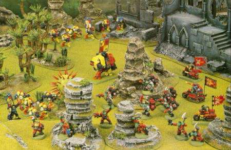

<!-- A0449-B0104 -->

原译文

Howling Griffons force during A Bitter Harvest 苦涩收割期间的咆哮狮鹫部队

**校订译文**

Howling Griffons force during A Bitter Harvest 苦涩收割期间的咆哮狮鹫部队

<!-- /A0449-B0104 -->

<!-- A0449-B0105 -->
**英文原文**

A Bitter Harvest — Procon Secundus was under attack by Ghazghkull Thraka. The Howling Griffons launched themselves at Ghazghkull Thraka's hordes. There was much bitter fighting between the two sides. The Howling Griffons destroyed the invading Orks in a series of battles, that ended their threat and saved what remained of the planet's population.

<!-- /A0449-B0105 -->

<!-- A0449-B0106 -->

原译文

苦涩收割 — 普罗孔二号遭到碎骨者萨拉卡的袭击。咆哮狮鹫向碎骨者萨拉卡的部落发起进攻。双方发生了许多激烈的战斗。咆哮狮鹫在一系列战斗中摧毁了入侵的兽人，结束了他们的威胁，拯救了行星上剩下的人口。

**校订译文**

苦涩收割——碎骨者·斯拉卡进攻普罗孔二号，咆哮狮鹫迎战其大军。经过连番激烈战斗，他们歼灭入侵欧克，解除了威胁，救下星球残存的居民。

<!-- /A0449-B0106 -->

<!-- A0449-B0107 -->
**英文原文**

Dennar IV Rebellion — The Howling Griffons' Third Company took part in this campaign. One of the battles was termed the Assault on Hill 103

<!-- /A0449-B0107 -->

<!-- A0449-B0108 -->

原译文

丹纳尔四号叛乱 — 咆哮狮鹫第三连队参加了这场战役。其中一场战斗被称为103号山突袭

**校订译文**

丹纳尔四号叛乱——第三连参加此役，其中一战称为103高地突击。

<!-- /A0449-B0108 -->

<!-- A0449-B0109 -->
**英文原文**

The Fall of Medusa V — The Howling Griffons with other chapters rallied to Cato Sicarius's banner to defend the planet of Medusa V.

<!-- /A0449-B0109 -->

<!-- A0449-B0110 -->

原译文

美杜莎五号陷落 — 咆哮狮鹫与其他战团集合在卡托·西卡留斯的旗帜下，保卫美杜莎五号行星。

**校订译文**

美杜莎五号陷落 — 咆哮狮鹫与其他战团集合在卡托·西卡留斯的旗帜下，保卫美杜莎五号行星。

<!-- /A0449-B0110 -->

<!-- A0449-B0111 -->
**英文原文**

Liberation of Vanqualis — Vanqualis was under attack by Orks. The Howling Griffons along with the 901st Penal Legion fought against the Orks. Shortly after landing they turned on the Soul Drinkers chapter, believing them to be the bearers of a Chaos Artefact, the Black Chalice.

<!-- /A0449-B0111 -->

<!-- A0449-B0112 -->

原译文

凡奎利斯解放 — 凡奎利斯遭到了欧克的攻击。咆哮狮鹫和第901刑罚军团与欧克作战。着陆后不久，他们转向了饮魂者战团，相信他们是混沌造物 — 黑色圣杯的持有者。

**校订译文**

解放凡奎利斯——欧克入侵凡奎利斯，咆哮狮鹫与第901惩戒军团共同迎战。登陆后不久，他们转而攻击饮魂者战团，误以为后者持有混沌圣物“黑色圣杯”。

<!-- /A0449-B0112 -->

<!-- A0449-B0113 -->
**英文原文**

Valerian Purges — The Howling Griffons, with the Cadian 108th "Wyverns", saw action in this campaign.

<!-- /A0449-B0113 -->

<!-- A0449-B0114 -->

原译文

缬草清洗 — 咆哮狮鹫和卡迪安108“飞龙”团在这场战役中采取了行动。

**校订译文**

瓦勒里安清洗——咆哮狮鹫与卡迪亚第108“飞龙”团参加此役。

**校注：** Valerian 在战役名中按专名暂作瓦勒里安，原缬草误套普通植物义。

<!-- /A0449-B0114 -->

<!-- A0449-B0115 -->
**英文原文**

Veidt's Schism — During this the Howling Griffons' Homeworld, Mancora, was separated from the rest of the Imperium.

<!-- /A0449-B0115 -->

<!-- A0449-B0116 -->

原译文

维德特分裂 — 在此期间，咆哮狮鹫的家园世界曼科拉与帝国的其他部分分离。

**校订译文**

维德特分裂 — 在此期间，咆哮狮鹫的家园世界曼科拉与帝国的其他部分分离。

<!-- /A0449-B0116 -->

<!-- A0449-B0117 -->
## Gene-Seed 基因种子

<!-- /A0449-B0117 -->

<!-- A0449-B0118 -->
**英文原文**

The Howling Griffons' Gene-Seed is free from defects and produces all organs like their parent chapter the Ultramarines. The Howling Griffons focus on harvesting the progenoid glands of their fallen and getting them returned to their homeworld. This is how the chapter is able to keep their force strength while having a high turnover rate.

<!-- /A0449-B0118 -->

<!-- A0449-B0119 -->

原译文

咆哮狮鹫的基因种子没有缺陷，可以生产所有器官，就像它们的初始战团极限战士一样。咆哮狮鹫专注于采集他们牺牲者的基因存收腺，并让它们回到它们的家园世界。这就是战团如何在保持高周转率的同时维持他们的部队力量。

**校订译文**

咆哮狮鹫的基因种子没有缺陷，与母战团极限战士一样，能培育全部改造器官。战团高度重视回收阵亡者的基因存收腺，并将其运回母星，因此即使成员折损、更替频繁，也能维持兵力。

<!-- /A0449-B0119 -->

<!-- A0449-B0120 -->
## Heraldry 纹章

<!-- /A0449-B0120 -->

<!-- A0449-B0121 -->
**英文原文**

The standard Howling Griffons armour colour scheme is quartered red and yellow without any company markings. Sergeants sport a black helmet with a red skull, while Veteran Sergeants add an additional white stripe.

<!-- /A0449-B0121 -->

<!-- A0449-B0122 -->

原译文

咆哮狮鹫的标准盔甲配色方案是红色和黄色四分之一，没有任何连队标记。军士戴着带红色头骨的黑色头盔，而老兵军士则增加了一条额外的白色条纹。

**校订译文**

咆哮狮鹫的常规护甲采用红黄交替的四分格配色，不使用连队标记。军士戴黑盔，上饰红色颅骨；老兵军士另加一条白纹。

<!-- /A0449-B0122 -->

<!-- A0449-B0123 图片 -->
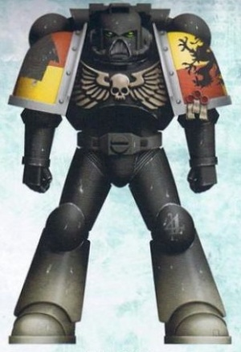

<!-- A0449-B0124 -->

原译文

As with many of the Howling Griffons stationed at the Khymara system during the Badab War, many of the battle-brothers still maintained their Codex Approved Night World Battle Livery from their prior deployment in the Caradryad Sector 与巴达布战争期间驻扎在凯玛拉星系的许多咆哮狮鹫一样，许多战斗兄弟仍然保留着他们之前部署在卡拉德里德星区的圣典批准午夜世界战斗制服

**校订译文**

As with many of the Howling Griffons stationed at the Khymara system during the Badab War, many of the battle-brothers still maintained their Codex Approved Night World Battle Livery from their prior deployment in the Caradryad Sector 巴达布战争期间驻扎凯玛拉星系的许多战斗兄弟，仍沿用先前在卡拉德里德星区作战时、经圣典认可的黑夜世界战斗涂装

<!-- /A0449-B0124 -->

<!-- A0449-B0125 -->
**英文原文**

During activities on Khymara during the Badab War, the Howling Griffons wore approved Night World camo which combines black armour with a grey chest eagle. The shoulder pads are quartered red/yellow with grey rims and Sergeants wore grey helmets. Khymara camo for Terminators was pure black with the right shoulder bearing the red/yellow quartered livery. The Terminator's Power Fists were also painted red

<!-- /A0449-B0125 -->

<!-- A0449-B0126 -->

原译文

在巴达布战争期间，在凯玛拉的行动中，咆哮狮鹫穿着经批准的午夜世界迷彩，该迷彩将黑色盔甲与灰色胸甲天鹰相结合。肩甲分为红色/黄色，边缘为灰色，军士戴着灰色头盔。终结者的凯玛拉迷彩是纯黑色的，右肩承载红/黄四分之一的制服。终结者的动力拳也被涂成了红色

**校订译文**

巴达布战争中的凯玛拉作战期间，咆哮狮鹫采用经圣典认可的黑夜世界迷彩：黑色护甲配灰色胸鹰，肩甲为红黄四分格、灰色镶边，军士头盔涂灰。终结者整体采用纯黑涂装，右肩保留红黄四分格徽色，动力拳则涂红。

<!-- /A0449-B0126 -->

<!-- A0449-B0127 -->
## Noted Elements of the Howling Griffons 咆哮狮鹫的著名人物与事物

原题：Noted Elements of the Howling Griffons 咆哮狮鹫的著名成员

<!-- /A0449-B0127 -->

<!-- A0449-B0128 -->
## Relics 圣物

<!-- /A0449-B0128 -->

<!-- A0449-B0129 -->
**英文原文**

The Griffon's Pride — Ancient Terminator Lightning Claws now in the possession of the Blood Ravens.

<!-- /A0449-B0129 -->

<!-- A0449-B0130 -->

原译文

狮鹫之傲 — 古代终结者闪电爪现在归血鸦所有。

**校订译文**

狮鹫之傲 — 古代终结者闪电爪现在归血鸦所有。

<!-- /A0449-B0130 -->

<!-- A0449-B0131 图片 -->
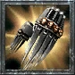

<!-- A0449-B0132 -->

原译文

The Griffon's Pride Terminator Lightning Claws 狮鹫之傲终结者闪电爪

**校订译文**

The Griffon's Pride Terminator Lightning Claws 狮鹫之傲终结者闪电爪

<!-- /A0449-B0132 -->

<!-- A0449-B0133 -->
**英文原文**

The Lost Halo — A Force Field used in the Angevin Crusade, but lost at its conclusion. It was later discovered in the Omega Vault.

<!-- /A0449-B0133 -->

<!-- A0449-B0134 -->

原译文

失落光环 — 安茹远征中使用的力场，但在其结束时丢失了。后来在欧米伽密库中被发现。

**校订译文**

失落光环 — 安茹远征中使用的力场，但在其结束时丢失了。后来在欧米伽密库中被发现。

<!-- /A0449-B0134 -->

<!-- A0449-B0135 -->
## Vessels 战舰

<!-- /A0449-B0135 -->

<!-- A0449-B0136 -->
**英文原文**

Force of Destiny — Battle Barge. Used by Chapter Master Alvaro during The Third War for Armageddon.

<!-- /A0449-B0136 -->

<!-- A0449-B0137 -->

原译文

命运之力号 — 战斗驳船。第三次阿玛吉多顿战争期间，被战团长阿尔瓦罗使用。

**校订译文**

命运之力号 — 战斗驳船。第三次阿玛吉多顿战争期间，被战团长阿尔瓦罗使用。

<!-- /A0449-B0137 -->

<!-- A0449-B0138 -->
**英文原文**

Augeias — Strike Cruiser. Destroyed by the Executioners during The Badab War.

<!-- /A0449-B0138 -->

<!-- A0449-B0139 -->

原译文

奥吉亚斯号 — 打击巡洋舰。在巴达布战争期间被处刑者摧毁。

**校订译文**

奥吉亚斯号 — 打击巡洋舰。在巴达布战争期间被处刑者摧毁。

<!-- /A0449-B0139 -->

<!-- A0449-B0140 -->
**英文原文**

Cerulean Claw — Strike Cruiser. Used by Chief Librarian Mercaeno during the Liberation of Vanqualis.

<!-- /A0449-B0140 -->

<!-- A0449-B0141 -->

原译文

天蓝之爪号 — 打击巡洋舰。凡奎利斯解放期间，被首席智库梅尔凯诺使用。

**校订译文**

天蓝之爪号——打击巡洋舰，首席智库员梅尔凯诺在解放凡奎利斯时使用。

<!-- /A0449-B0141 -->

<!-- A0449-B0142 -->
**英文原文**

Rampant — Strike Cruiser Used by Captain Falchian and Lieutenant Aldanuth of the Chapter's Fifth Company before deploying to claim the Guns of Enth.

<!-- /A0449-B0142 -->

<!-- A0449-B0143 -->

原译文

猖獗号 — 打击巡洋舰，由第五连队的连长法尔钦和副官阿尔达努斯使用，然后部署以夺取恩斯火炮。

**校订译文**

猖獗号 — 打击巡洋舰，由第五连队的连长法尔钦和副官阿尔达努斯使用，然后部署以夺取恩斯火炮。

<!-- /A0449-B0143 -->

<!-- A0449-B0144 -->
## Vehicles 载具

<!-- /A0449-B0144 -->

<!-- A0449-B0145 -->
**英文原文**

Gloriam — Rhino. Attached to Tactical Squad Maximus of the Fifth Company.

<!-- /A0449-B0145 -->

<!-- A0449-B0146 -->

原译文

荣耀号 —犀牛。隶属于第五连队马克西姆斯战术小队。

**校订译文**

荣耀号——犀牛战车，配属第五连马克西姆斯战术小队。

<!-- /A0449-B0146 -->

<!-- A0449-B0147 图片 -->
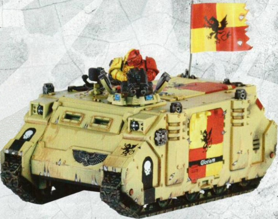

<!-- A0449-B0148 -->

原译文

Rhino Gloriam Attached to Tactical Squad Maximus of the Howling Griffons Fifth Company 犀牛荣耀号隶属于咆哮狮鹫第五连队马克西姆斯战术小队

**校订译文**

Rhino Gloriam Attached to Tactical Squad Maximus of the Howling Griffons Fifth Company 配属咆哮狮鹫第五连马克西姆斯战术小队的犀牛战车荣耀号

<!-- /A0449-B0148 -->

<!-- A0449-B0149 -->
**英文原文**

Maneus — Razorback. Attached to Devastator Squad Tercon of the Fifth Company. Armed with twin linked lascannons and a hunter killer missile launcher.

<!-- /A0449-B0149 -->

<!-- A0449-B0150 -->

原译文

曼纽斯号 —豪猪。隶属于第五连队的特尔康者破坏小队。配备双联激光炮和猎杀飞弹发射器。

**校订译文**

曼纽斯号——豪猪战车，配属第五连特尔康破坏者小队，装备双联激光炮与猎杀导弹发射器。

<!-- /A0449-B0150 -->

<!-- A0449-B0151 图片 -->
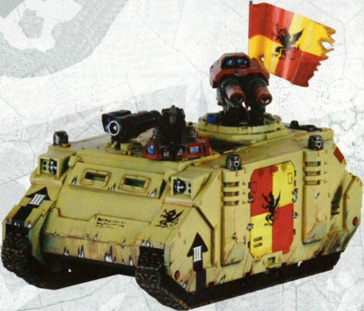

<!-- A0449-B0152 -->

原译文

Razorback Maneus Attached to Devastator Squad Tercon of the Howling Griffons Fifth Company 豪猪曼纽斯号隶属于咆哮狮鹫第五连队的特尔康破坏者小队

**校订译文**

Razorback Maneus Attached to Devastator Squad Tercon of the Howling Griffons Fifth Company 配属咆哮狮鹫第五连特尔康破坏者小队的豪猪战车曼纽斯号

<!-- /A0449-B0152 -->

<!-- A0449-B0153 -->
**英文原文**

Daceus — Whirlwind Helios. Attached to the Fifth Company.

<!-- /A0449-B0153 -->

<!-- A0449-B0154 -->

原译文

达修斯号 —旋风赫利俄斯。隶属于第五连队。

**校订译文**

达修斯号——赫利俄斯型旋风战车，配属第五连。

<!-- /A0449-B0154 -->

<!-- A0449-B0155 图片 -->
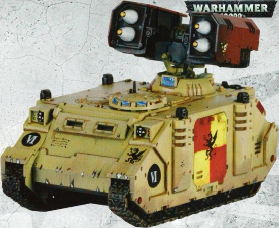

<!-- A0449-B0156 -->

原译文

Whirlwind Helios Daceus Attached to the Howling Griffons Fifth Company 旋风赫利俄斯达修斯号隶属于咆哮狮鹫第五连队

**校订译文**

Whirlwind Helios Daceus Attached to the Howling Griffons Fifth Company 配属咆哮狮鹫第五连的赫利俄斯型旋风战车达修斯号

<!-- /A0449-B0156 -->

<!-- A0449-B0157 -->
**英文原文**

Trajan — Predator Destructor. Attached to the Fifth Company.

<!-- /A0449-B0157 -->

<!-- A0449-B0158 -->

原译文

图拉真号 —掠食者破坏者。隶属于第五连队。

**校订译文**

图拉真号——破坏者型掠食者战车，配属第五连。

<!-- /A0449-B0158 -->

<!-- A0449-B0159 图片 -->
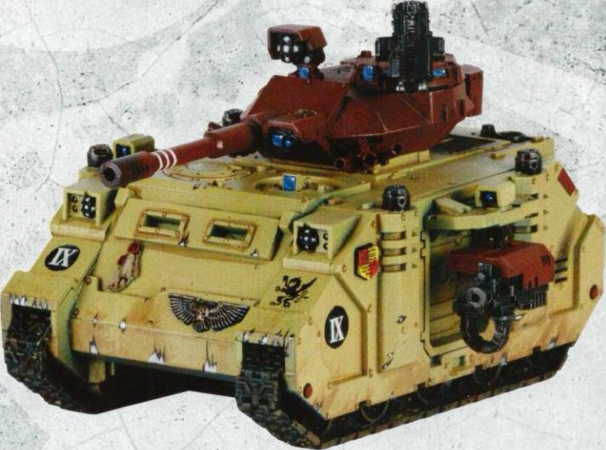

<!-- A0449-B0160 -->

原译文

Predator Destructor Trajan Attached to the Howling Griffons Fifth Company 咆哮狮鹫第五连队的掠食者破坏者图拉真号

**校订译文**

Predator Destructor Trajan Attached to the Howling Griffons Fifth Company 咆哮狮鹫第五连的破坏者型掠食者战车图拉真号

<!-- /A0449-B0160 -->

<!-- A0449-B0161 -->
**英文原文**

Sword of Fire — Land Raider. Built during and used in Veidt's Schism. Built using lower quality materials due to a blockade.

<!-- /A0449-B0161 -->

<!-- A0449-B0162 -->

原译文

火焰之剑号 — 兰德掠袭者者。制造于维德特分裂时期，并在该时期使用。由于封锁，使用较低质量的材料制造。

**校订译文**

火焰之剑号——兰德掠袭者，制造于维德特分裂时期并投入战斗。因封锁所限，建造时使用了较低品质的材料。

<!-- /A0449-B0162 -->

<!-- A0449-B0163 图片 -->
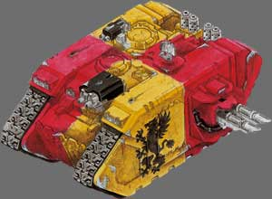

<!-- A0449-B0164 -->

原译文

Howling Griffons Land Raider Sword of Fire 咆哮狮鹫兰德掠袭者者火焰之剑号

**校订译文**

Howling Griffons Land Raider Sword of Fire 咆哮狮鹫的兰德掠袭者火焰之剑号

<!-- /A0449-B0164 -->

<!-- A0449-B0165 -->
**英文原文**

Shield of Mancora — Land Raider Prometheus. Used by the 4th Company during the Badab War. It was immobilised and captured by the Executioners.

<!-- /A0449-B0165 -->

<!-- A0449-B0166 -->

原译文

曼科拉之盾 — 兰德掠袭者普罗米修斯。巴达布战争期间由第四连队使用。它被处刑者困住并俘虏了。

**校订译文**

曼科拉之盾号——普罗米修斯型兰德掠袭者，巴达布战争中由第四连使用，后被处刑者打瘫并俘获。

<!-- /A0449-B0166 -->

<!-- A0449-B0167 图片 -->
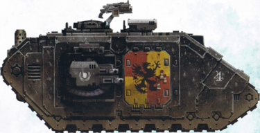

<!-- A0449-B0168 -->

原译文

Howling Griffons Land Raider Prometheus Shield of Mancora 咆哮狮鹫兰德掠袭者普罗米修斯曼科拉之盾号

**校订译文**

Howling Griffons Land Raider Prometheus Shield of Mancora 咆哮狮鹫的普罗米修斯型兰德掠袭者曼科拉之盾号

<!-- /A0449-B0168 -->

<!-- A0449-B0169 -->
**英文原文**

Talon of Intollerance — Stormtalon Gunship piloted by Techmarine Vastus

<!-- /A0449-B0169 -->

<!-- A0449-B0170 -->

原译文

偏狭之爪号 — 技术军士瓦斯塔斯驾驶的风暴爪

**校订译文**

偏狭之爪号——科技战士瓦斯塔斯驾驶的风暴爪炮艇。

<!-- /A0449-B0170 -->

<!-- A0449-B0171 图片 -->
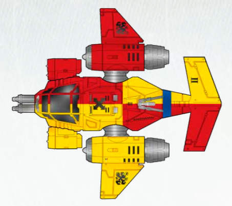

<!-- A0449-B0172 -->

原译文

Talon of Intollerance 偏狭之爪号

**校订译文**

Talon of Intollerance 偏狭之爪号

<!-- /A0449-B0172 -->

<!-- A0449-B0173 -->
## Notable Members of the Howling Griffons 咆哮狮鹫的著名人员

<!-- /A0449-B0173 -->

<!-- A0449-B0174 -->
### Chapter Command 战团指挥

<!-- /A0449-B0174 -->

<!-- A0449-B0175 -->
**英文原文**

Orlando Furioso — Late in the year 220.M38 the Howling Griffons Chapter were preparing to celebrate their 5,000th anniversary of their Founding. As Chapter Master Orlando Furioso and the First Company made their way to the Chapter's home world, Lord Periclitor of the Word Bearers, a substantial force of his Chosen and his Night Lords allies fell upon the Howling Griffons' ship as it traversed the Arios beacon. The battle was a furious one, culminating with Periclitor and his elite boarding Furioso's battle barge aboard their Dreadclaws. The attack crippled the ship, and the defenders were forced to evacuate aboard their Thunderhawks and escape pods. The battle was continued upon the surface of Arios Quintus, where the survivors were surrounded and eventually cut down. The body of Orlando Furioso was mounted upon the fore of his Thunderhawk and left to drift in orbit above the planet for a month before it could be recovered. And now the Howling Griffons Chapter has another date to mark in their calendar each year.

<!-- /A0449-B0175 -->

<!-- A0449-B0176 -->

原译文

奥兰多·弗里奥索 — 220.M38末，咆哮狮鹫战团正准备庆祝建军5000周年。当战团长奥兰多·弗里奥索和第一连队前往战团的家园世界时，怀言者的佩里克利托领主，他的亲选和他的午夜领主盟友的一支强大部队，在咆哮狮鹫的舰船穿过阿里奥斯信标时，向其袭来。这场战斗非常激烈，佩里克利托和他的精英跳帮了弗里奥索的战斗驳船，登上了他们的恐惧爪。这次袭击使船只瘫痪，防御者被迫乘坐雷鹰和逃生舱撤离。战斗在阿里奥斯五号的表面继续进行，幸存者被包围并最终被击倒。奥兰多·弗里奥索的尸体被安置在他的雷鹰的前部，在行星上方的轨道上漂流了一个月，然后才被发现。现在，咆哮狮鹫战团每年都会在日历上标记另一个日期。

**校订译文**

奥兰多·弗里奥索——220.M38末，咆哮狮鹫正准备庆祝建军五千周年。战团长弗里奥索与第一连返航母星，途经阿里奥斯信标时，怀言者领主佩里克利托率大批亲选战士及午夜领主盟友突袭其舰船。恶战中，佩里克利托与精锐乘恐惧爪突击艇登上战斗驳船，将其重创，守军被迫乘雷鹰和逃生舱撤离。战斗延续至阿里奥斯五号地表，幸存者最终被包围歼灭。弗里奥索的尸体被钉在其雷鹰机首，任其在行星轨道漂流，直到一个月后才得以回收。从此，战团每年又多了一日必须铭记的纪念日。

**校注：** 恐惧爪是叛军登舰所乘突击载具，原译把登舰方向倒置成登上恐惧爪。recovered 指回收遗体，非一个月后才发现。

<!-- /A0449-B0176 -->

<!-- A0449-B0177 -->
**英文原文**

Alvaro — Chapter Master of as of M42.

<!-- /A0449-B0177 -->

<!-- A0449-B0178 -->

原译文

阿尔瓦罗 — M42的战团长。

**校订译文**

阿尔瓦罗 — M42的战团长。

<!-- /A0449-B0178 -->

<!-- A0449-B0179 -->
**英文原文**

Kenot Friche — Chapter Master as of M42.

<!-- /A0449-B0179 -->

<!-- A0449-B0180 -->

原译文

基诺·弗里切 — M42的战团长。

**校订译文**

基诺·弗里切 — M42的战团长。

<!-- /A0449-B0180 -->

<!-- A0449-B0181 -->
**英文原文**

Mercaeno — Chief Librarian. Mercaeno fulfilled the oath of avenging Chapter Master Orlando's death by vanquishing the daemon prince Periclitor during the 13th Black Crusade. He then led the strike cruiser Cerulean Claw to Vanqualis in the Obsidian System to fulfil an oath to the ruling Falken family to defeat the Soul Drinkers who were mistakenly identified as the bearers of the Chaos artifact, the Black Chalice. He had a titanic physical and psychic duel with Sarpedon in the Soul Drinkers' space hulk Brokenback. He broke Sarpendon's force staff and defeated him. Before he dealt the death blow to Sarpedon with his force-axe, he met his demise by Eumenes's sneak attack.

<!-- /A0449-B0181 -->

<!-- A0449-B0182 -->

原译文

梅尔凯诺 — 首席智库。梅尔凯诺在第13次黑色远征中击败了恶魔王子佩里克利托，履行了为奥兰多之死复仇的誓言。然后，他带领打击巡洋舰天蓝之爪号前往黑曜石星系的凡奎利斯，履行对执政的法尔肯家族的誓言，击败被误认为是混沌造物黑色圣杯的持有者的饮魂者。他与萨尔佩冬在饮魂者的太空废船断背号中进行了一场宏大的身体和灵能决斗。他破坏了萨尔佩冬的灵能杖并击败了他。在他用他的灵能斧对萨尔佩冬进行致命一击之前，他被欧迈尼斯的偷袭杀死了。

**校订译文**

梅尔凯诺——首席智库员。第十三次黑色远征中，他击败恶魔王子佩里克利托，履行为战团长奥兰多复仇的誓言。随后，他率天蓝之爪号前往黑曜石星系的凡奎利斯，践行对统治当地的法尔肯家族所立誓约，攻击被误认为持有混沌圣物“黑色圣杯”的饮魂者。他在断背号太空废船上与萨尔佩冬展开激烈的武艺及灵能对决，折断对手的灵能杖并将其击败。但在挥出灵能斧给予致命一击前，梅尔凯诺遭欧迈尼斯偷袭身亡。

**校注：** 同段英文 Sarpedon／Sarpendon 拼写不一，中文按同一角色保留萨尔佩冬。保留其被击败但尚未被杀、梅尔凯诺遭偷袭的事件顺序。

<!-- /A0449-B0182 -->

<!-- A0449-B0183 -->
### Captains 连长

<!-- /A0449-B0183 -->

<!-- A0449-B0184 -->
**英文原文**

Penvath Joachim — Captain of the Third Company, responded to a call for aid from Dennar IV.

<!-- /A0449-B0184 -->

<!-- A0449-B0185 -->

原译文

彭瓦特·约阿希姆 — 第三连队连长，回应了丹纳尔四号的求救呼唤。

**校订译文**

彭瓦特·约阿希姆 — 第三连队连长，回应了丹纳尔四号的求救呼唤。

<!-- /A0449-B0185 -->

<!-- A0449-B0186 -->
**英文原文**

Alvaro — Past Captain of the Fifth Company.

<!-- /A0449-B0186 -->

<!-- A0449-B0187 -->

原译文

阿尔瓦罗 — 第五连队的前任连长。

**校订译文**

阿尔瓦罗 — 第五连队的前任连长。

<!-- /A0449-B0187 -->

<!-- A0449-B0188 图片 -->
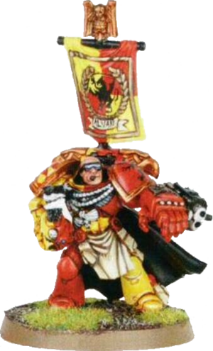

<!-- A0449-B0189 -->

原译文

Captain Alvaro 阿尔瓦罗连长

**校订译文**

Captain Alvaro 阿尔瓦罗连长

<!-- /A0449-B0189 -->

<!-- A0449-B0190 -->
**英文原文**

Falchian - Captain of the Fifth Company injured during the campaign to capture the Guns of Enth.

<!-- /A0449-B0190 -->

<!-- A0449-B0191 -->

原译文

法尔钦 - 第五连队连长在夺取恩斯火炮的战役中受伤。

**校订译文**

法尔钦——第五连长，在夺取恩斯火炮的战役中负伤。

<!-- /A0449-B0191 -->

<!-- A0449-B0192 -->
**英文原文**

Darion — Captain of the Ninth Company, participated in killing Periclitor and The Liberation of Vanqualis. His armour is studded with gems for notable kills.

<!-- /A0449-B0192 -->

<!-- A0449-B0193 -->

原译文

达里恩 — 第九连队连长，参与了杀死佩里克利托和解放凡奎利斯。他的盔甲上镶嵌着宝石为了值得注意的杀戮。

**校订译文**

达里恩——第九连长，参加诛杀佩里克利托与解放凡奎利斯的行动。他在护甲上镶嵌宝石，纪念击杀强敌的战功。

**校注：** 本条英文作 killing Periclitor，较早段落作 banished；中文保留本条的诛杀口径，不自行判定恶魔被永久消灭。

<!-- /A0449-B0193 -->

<!-- A0449-B0194 -->
**英文原文**

Borganor — Captain of the Tenth Company, participated in killing Periclitor and The Liberation of Vanqualis. He has many bionics for all of his lost body parts.

<!-- /A0449-B0194 -->

<!-- A0449-B0195 -->

原译文

博尔加诺 — 第十连队连长，参与了杀死佩里克利托和解放凡奎利斯。他有很多仿生部件来处理他所有失去的身体部位。

**校订译文**

博尔加诺——第十连长，参加诛杀佩里克利托与解放凡奎利斯的行动。他失去的许多身体部位均以机械义体替代。

<!-- /A0449-B0195 -->

<!-- A0449-B0196 -->
**英文原文**

Torkos — Captain taking part in the Plague Wars.

<!-- /A0449-B0196 -->

<!-- A0449-B0197 -->

原译文

托尔科斯 — 参与瘟疫战争的连长。

**校订译文**

托尔科斯 — 参与瘟疫战争的连长。

<!-- /A0449-B0197 -->

<!-- A0449-B0198 -->
**英文原文**

Xerxes — Captain lead the Howling Griffons in the Crusade of Fire.

<!-- /A0449-B0198 -->

<!-- A0449-B0199 -->

原译文

薛西斯 — 率领咆哮狮鹫参加了火焰远征的连长。

**校订译文**

薛西斯 — 率领咆哮狮鹫参加了火焰远征的连长。

<!-- /A0449-B0199 -->

<!-- A0449-B0200 -->
### Other Ranks 其他等级

<!-- /A0449-B0200 -->

<!-- A0449-B0201 -->
**英文原文**

Armand Titus — In 143.M41 Chaplain Armand Titus, along with the Fourth Company, led the final assault against the renegade General Jorun and his forces during the Jorun Retaliation. Fighting his way through renegade guard, Ogryn and Dark Eldar he was wounded by xenos poisons; despite this he broke through to face General Jorun and delivered the Emperor's justice. Upon returning to Mancora Titus was encased in a dreadnought to continue his service to the Chapter. Titus continued to serve with the 4th Company throughout M41, including the campaign in the Caradryad system and into the Badab War. He was present on Khymara when the Executioners assaulted the moon base and was one of the large number of losses.

<!-- /A0449-B0201 -->

<!-- A0449-B0202 -->

原译文

阿曼德·提图斯 — 143.M41，牧师阿曼德·提图斯与第四连队一起，在约伦报复期间领导了对叛徒将军约伦及其部队的最后一次进攻。他穿过叛徒卫队、欧格林和黑暗灵族，被异型毒药击伤；尽管如此，他还是挺身而出，直面约伦将军，履行帝皇的审判。回到曼科拉后，提图斯被置入一架无畏中，继续为战团服务。提图斯在整个M41期间继续在第四连队服役，包括卡拉德里德星系的战役和巴达布战争。当处刑者袭击卫星基地时，他就在凯玛拉，是许多损失之一。

**校订译文**

阿曼德·提图斯——143.M41，提图斯教士与第四连在约伦报复行动中发动最后突击，攻向叛变的约伦将军及其军队。他杀穿叛军卫队、欧格林和黑暗灵族防线，虽受异形毒素侵袭，仍突破阻拦，给予约伦帝皇的制裁。返回曼科拉后，他被置入无畏机甲，继续效力战团。此后整个M41，他都随第四连作战，包括卡拉德里德战役与巴达布战争。处刑者攻击凯玛拉卫星基地时，他也在场，并最终阵亡。

<!-- /A0449-B0202 -->

<!-- A0449-B0203 图片 -->
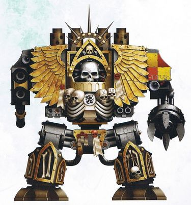

<!-- A0449-B0204 -->

原译文

Chaplain Dreadnought Armand Titus during the Badab War 巴达布战争期间的牧师无畏阿曼德·提图斯

**校订译文**

Chaplain Dreadnought Armand Titus during the Badab War 巴达布战争中的阿曼德·提图斯教士无畏机甲

<!-- /A0449-B0204 -->

<!-- A0449-B0205 -->
**英文原文**

Malegran — Chaplain and member of the Deathwatch.

<!-- /A0449-B0205 -->

<!-- A0449-B0206 -->

原译文

马勒格兰 — 牧师和死亡守望成员。

**校订译文**

马勒格兰——教士，死亡守望成员。

<!-- /A0449-B0206 -->

<!-- A0449-B0207 -->
**英文原文**

Prodyn Keruv — Lieutenant who received the call for aid from the Nachmund Gauntlet.

<!-- /A0449-B0207 -->

<!-- A0449-B0208 -->

原译文

普罗丁·凯鲁夫 — 接到纳克蒙德走廊救援呼唤的副官。

**校订译文**

普罗丁·凯鲁夫 — 接到纳克蒙德走廊救援呼唤的副官。

<!-- /A0449-B0208 -->

<!-- A0449-B0209 图片 -->
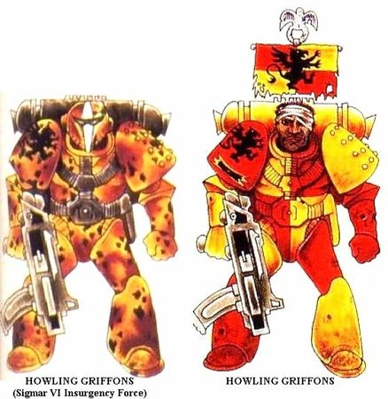

<!-- A0449-B0210 -->

原译文

Howling Griffons original colour scheme as they appeared during the Badab War 咆哮狮鹫在巴达布战争期间出现的原始配色方案

**校订译文**

Howling Griffons original colour scheme as they appeared during the Badab War 咆哮狮鹫在巴达布战争期间出现的原始配色方案

<!-- /A0449-B0210 -->

<!-- A0449-B0211 图片 -->
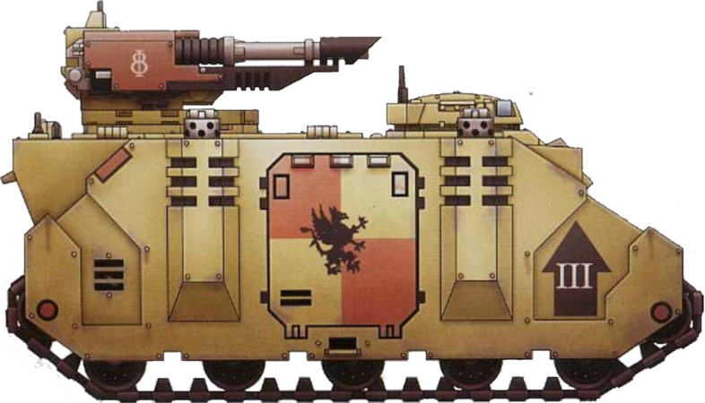

<!-- A0449-B0212 -->

原译文

MkVI Razorback attached to the Howling Griffons Third Company MkVI 豪猪隶属于咆哮狮鹫第三连队

**校订译文**

MkVI Razorback attached to the Howling Griffons Third Company MkVI 豪猪战车，配属咆哮狮鹫第三连。

<!-- /A0449-B0212 -->

<!-- A0449-B0213 图片 -->
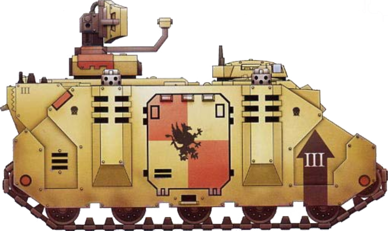

<!-- A0449-B0214 -->

原译文

Damocles Command Rhino attached to the Howling Griffons Third Company 达摩克利斯指挥犀牛隶属于咆哮狮鹫第三连队

**校订译文**

Damocles Command Rhino attached to the Howling Griffons Third Company 配属咆哮狮鹫第三连的达摩克利斯指挥型犀牛战车

<!-- /A0449-B0214 -->

<!-- A0449-B0215 图片 -->
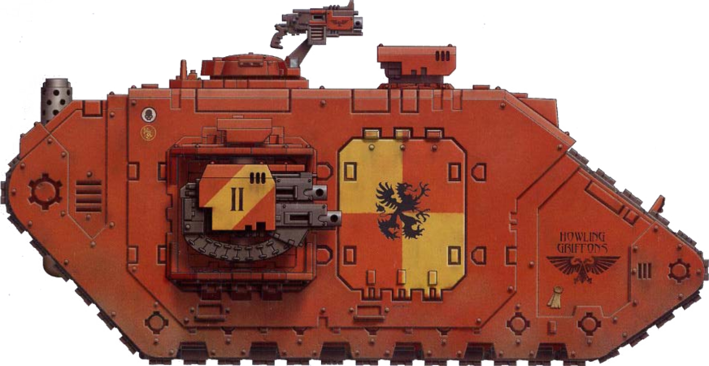

<!-- A0449-B0216 -->

原译文

Howling Griffons Land Raider Prometheus used in the Dennar IV Rebellion 咆哮狮鹫兰德掠袭者普罗米修斯在德纳尔四号叛乱中使用

**校订译文**

Howling Griffons Land Raider Prometheus used in the Dennar IV Rebellion 丹纳尔四号叛乱中使用的咆哮狮鹫普罗米修斯型兰德掠袭者

<!-- /A0449-B0216 -->

<!-- A0449-B0217 -->
## Trivia 琐事

<!-- /A0449-B0217 -->

<!-- A0449-B0218 -->
## Conflicting Sources 来源冲突

<!-- /A0449-B0218 -->

<!-- A0449-B0219 -->
**英文原文**

In the 1st edition of the novel Dark Imperium, Alvaro is stated to be Chapter Master of the Howling Griffons during the Indomitus Crusade. However the 2021 2nd edition changed this to Kenot Friche for unknown reasons.

<!-- /A0449-B0219 -->

<!-- A0449-B0220 -->

原译文

在小说《黑暗帝国》的第一版中，阿尔瓦罗被宣称为不屈远征期间咆哮狮鹫的战团长。然而，2021年的第二版出于未知原因将其改为基诺·弗里切。

**校订译文**

在小说《黑暗帝国》的第一版中，阿尔瓦罗被宣称为不屈远征期间咆哮狮鹫的战团长。然而，2021年的第二版出于未知原因将其改为基诺·弗里切。

**校注：** 阿尔瓦罗与基诺·弗里切为《黑暗帝国》不同版本的战团长称谓；全篇保留对应来源，不擅定一个唯一名字覆盖所有版本。

<!-- /A0449-B0220 -->

<!-- A0449-B0221 -->
**英文原文**

In Imperial Armour Volume Two - Second Edition: War Machines of the Adeptus Astartes, The Dennar IV Suppression is stated to have occurred in 109.M41:. However Imperial Armour Volume Nine - The Badab War - Part One lists it as 109.M40: for unknown reasons.

<!-- /A0449-B0221 -->

<!-- A0449-B0222 -->

原译文

在《帝国装甲》第二卷第二版：阿斯塔特修会的战争机器中，据称丹纳尔四号镇压发生在109.M41:。然而，《帝国装甲》第九卷 — 巴达布战争 — 第一部分将其列为109.M40：原因不明。

**校订译文**

《帝国装甲》第2卷第2版《阿斯塔特修会战争机器》将丹纳尔四号镇压记为109.M41；《帝国装甲》第9卷《巴达布战争》上册却记为109.M40，原因不明。

<!-- /A0449-B0222 -->

本篇核心术语与暂定项

以下列出本篇出现的英文原形及核心术语表用词。同形词可能指不同对象，具体词义以本篇正文和校注为准；单复数、别名和仅见于图注的名称可能尚未列入。完整候选见[术语表](../../术语表/双语术语候选.csv)。

| 英文 | 采用中文 | 状态 |
| --- | --- | --- |
| Space Marines | 星际战士 | 官方已核对 |
| Adeptus Astartes | 阿斯塔特修会 | 官方已核对 |
| Dark Angels | 黑暗天使 | 官方已核对 |
| Deathwatch | 死亡守望 | 官方已核对 |
| Death Guard | 死亡守卫 | 官方已核对 |
| Eldar | 灵族 | 暂定·语境区分 |
| Dark Eldar | 黑暗灵族 | 暂定·旧称对应 |
| Orks | 欧克蛮人 | 官方已核对 |
| Librarian | 智库员 | 官方已核对 |
| Terminator | 终结者 | 官方已核对 |
| Ogryn | 欧格林 | 官方已核对 |
| Ultramar | 奥特拉玛 | 官方已核对 |
| Ultramarines | 极限战士 | 官方已核对 |
| Imperium | 帝国 | 暂定·简称 |
| Commorragh | 科摩罗 | 官方已核对 |
| Indomitus | 不屈学派 | 暂定·学派语境 |
| History | 历史 | 编辑用语已统一 |
| Blood Ravens | 血鸦 | 暂定 |
| Techmarine | 科技战士 | 官方已核对 |
| Emperor | 帝皇 | 官方已核对 |
| Battle Barge | 战斗驳船 | 暂定·官方待核 |
| Word Bearers | 怀言者 | 暂定·官方待核 |
| Daemon Prince | 恶魔亲王 | 官方已核对 |
| Night Lords | 午夜领主 | 暂定·官方待核 |
| Sniper rifle | 狙击步枪 | 暂定·官方待核 |
| Ghazghkull Thraka | 碎骨者·斯拉卡 | 官方已核对 |
| Dark Imperium | 黑暗帝国 | 暂定·官方待核 |
| Indomitus Crusade | 不屈远征 | 暂定·官方待核 |
| War of Beasts | 野兽之战 | 暂定·官方待核 |
| Nachmund Rift War | 纳克蒙德裂隙战争 | 暂定·官方待核 |
| Nachmund Gauntlet | 纳克蒙德走廊 | 暂定·官方待核 |
| Plague Wars | 瘟疫战争 | 暂定·官方待核 |
| Hive Fleet Leviathan | 利维坦虫巢舰队 | 暂定·官方待核 |
| Sector | 星区 | 暂定·官方待核 |
| Armageddon | 阿玛吉多顿 | 暂定·官方待核 |
| Badab | 巴达布 | 暂定·官方待核 |
| Fenris | 芬里斯 | 暂定·官方待核 |
| Mancora | 曼科拉 | 暂定·官方待核 |
| Medusa V | 美杜莎五号 | 暂定·官方待核 |
| Macragge | 马库拉格 | 暂定·官方待核 |
| Medusa | 美杜莎 | 暂定·官方待核 |
| Vigilus | 警戒星 | 暂定·官方待核 |
| Land Raider | 兰德掠袭者战车 | 官方已核对 |
| Bionics | 仿生改造／仿生部件（依语境） | 语境定译·官方待核 |
| Clear | 清明 | 暂定·官方待核 |
| Crash | 崩溃 | 暂定·官方待核 |
| Chief Librarian | 首席智库员 | 暂定·官方待核 |
| Master | 导师（审判庭职衔）／舰务官（舰员职务） | 语境定译·官方待核 |
| Mission | 教团／传教机构 | 暂定 |
| Progenoid glands | 基因存收腺 | 暂定·官方待核 |
| Chaplain | 教士 | 官方已核对 |
| Ancient | 旗手 | 官方已核对 |
| Rhino | 犀牛战车 | 官方已核对 |
| Razorback | 豪猪战车 | 官方已核对 |
| Devastator Squad | 破坏者小队 | 官方已核对 |
| Tactical Squad | 战术小队 | 官方已核对 |
| Predator Destructor | 破坏者型掠食者战车 | 官方已核对 |
| Whirlwind | 旋风战车 | 官方已核对 |
| Valerian | 瓦里瑞安 | 官方已核对 |
| Cadre | 骨干连（寂静修女）／核心队（钛族） | 语境定译·钛族词根参考 |
| Lieutenant | 副官 | 暂定·官方待核 |
| Founding | 建军 | 暂定·官方待核 |
| Space Marine | 星际战士 | 暂定·官方待核 |
| Chapter | 战团 | 暂定·官方待核 |
| Fortress-monastery | 要塞修道院 | 暂定·官方待核 |
| Chapter Master | 战团长 | 暂定·官方待核 |
| Captain | 连长 | 暂定·官方待核 |
| Veteran | 老兵 | 暂定·官方待核 |
| Terminators | 终结者 | 暂定·官方待核 |
| Brother | 修士 | 暂定·官方待核 |
| Devastator | 破坏者 | 暂定·官方待核 |
| Battle-Brother | 战斗兄弟 | 暂定·官方待核 |
| Cato Sicarius | 卡托·西卡留斯 | 暂定·官方待核 |
| Codex Astartes | 阿斯塔特圣典 | 暂定·官方待核 |
| Soul Drinkers | 饮魂者 | 暂定·官方待核 |
| Aurora Chapter | 曙光女神 | 暂定·官方待核 |
| Novamarines | 新星战士 | 暂定·官方待核 |
| Executioners | 处刑者 | 语境定译·官方待核 |
| Howling Griffons | 咆哮狮鹫 | 暂定·官方待核 |
| Iron Knights | 钢铁骑士 | 暂定·官方待核 |
| Sons of Orar | 奥拉尔之子 | 暂定·官方待核 |
| Codex Chapter | 圣典战团 | 暂定·官方待核 |
| Gene-seed | 基因种子 | 暂定·官方待核 |
| Strike Cruiser | 打击巡洋舰 | 暂定·官方待核 |
| Stormtalon Gunship | 风暴爪炮艇 | 官方已核 |
| Bike Squads | 摩托小队 | 暂定·官方待核 |
| Sarpedon | 萨尔佩冬 | 暂定·官方待核 |
| Veteran Sergeants | 老兵军士 | 暂定·官方待核 |
| Initiates | 进阶者 | 官方已核 |
| Malak | 马拉克 | 暂定·官方待核 |
| Xenos | 异形 | 暂定·官方待核 |
| Destructor | 破坏者（史洛斯类别） | 暂定·官方待核 |
| Horde | 部落 | 暂定·官方待核 |
| Raider | 掠袭者飞艇 | 官方已核对 |
| Charadon | 查拉顿 | 暂定·官方待核 |
| Valerian Purges | 瓦勒里安清洗 | 暂定·官方待核 |
| Insurgency Forces | 渗透破袭部队 | 暂定·官方待核 |
| Leviathan Maimed | 重创利维坦 | 暂定·官方待核 |
| Angron | 安格隆 | 官方已核对 |
| Dreadnought | 无畏机甲 | 暂定·官方待核 |
| Vengeance | 复仇号 | 暂定·官方待核 |
| Daceus | 达修斯（连长）／达修斯号（战车） | 语境定译·官方待核 |
| Griffon Resurgent | 狮鹫复兴 | 暂定·官方待核 |
| Battle of Malak | 马拉克之战 | 暂定·官方待核 |
| Dennar IV Rebellion | 丹纳尔四号叛乱 | 暂定·官方待核 |
| Fall of Medusa V | 美杜莎五号陷落 | 暂定·官方待核 |
| Veidt's Schism | 维德特分裂 | 暂定·官方待核 |
| Griffon's Pride | 狮鹫之傲 | 暂定·官方待核 |
| Lost Halo | 失落光环 | 暂定·官方待核 |
| Force of Destiny | 命运之力号 | 暂定·官方待核 |
| Augeias | 奥吉亚斯号 | 暂定·官方待核 |
| Cerulean Claw | 天蓝之爪号 | 暂定·官方待核 |
| Rampant | 猖獗号 | 暂定·官方待核 |
| Gloriam | 荣耀号 | 暂定·官方待核 |
| Maneus | 曼纽斯号 | 暂定·官方待核 |
| Trajan | 图拉真号 | 暂定·官方待核 |
| Sword of Fire | 火焰之剑号 | 暂定·官方待核 |
| Shield of Mancora | 曼科拉之盾号 | 暂定·官方待核 |
| Talon of Intollerance | 偏狭之爪号 | 暂定·官方待核 |
| Alvaro | 阿尔瓦罗 | 暂定·官方待核 |
| Kenot Friche | 基诺·弗里切 | 暂定·官方待核 |
| Penvath Joachim | 彭瓦特·约阿希姆 | 暂定·官方待核 |
| Falchian | 法尔钦 | 暂定·官方待核 |
| Darion | 达里恩 | 暂定·官方待核 |
| Borganor | 博尔加诺 | 暂定·官方待核 |
| Torkos | 托尔科斯 | 暂定·官方待核 |
| Xerxes | 薛西斯 | 暂定·官方待核 |
| Malegran | 马勒格兰 | 暂定·官方待核 |
| Prodyn Keruv | 普罗丁·凯鲁夫 | 暂定·官方待核 |
| Battle Brother | 战斗兄弟 | 暂定·官方待核 |
| Land Raider Prometheus | 普罗米修斯型兰德掠袭者战车 | 暂定·官方待核 |
| The Dark | 《黑暗》 | 暂定·官方待核 |
| The Blood | 鲜血 | 暂定·官方待核 |
| Quintus | 昆图斯 | 暂定·官方待核 |
| System | 星系（恒星系统） | 暂定·官方待核 |
| Orar | 奥拉尔 | 暂定·官方待核 |
| Vanqualis | 凡奎利斯 | 暂定·官方待核 |
| Amistel Majoris | 阿弥斯陶主星 | 暂定·官方待核 |
| Khymara | 凯马拉 | 暂定·官方待核 |
| Helios | 赫利俄斯 | 暂定·官方待核 |
| Force Staff | 灵能权杖 | 暂定·官方待核 |
| Missile Launcher | 导弹发射器 | 暂定·官方待核 |
| claw | 利爪分队 | 暂定·官方待核 |
| The Proud Eyrie | 骄傲鹰巢 | 暂定·官方待核 |
| Caradryad Sector | 卡拉德里亚星区 | 暂定·官方待核 |
| Persepha Xeng | 佩尔塞法·辛格 | 暂定·官方待核 |
| Ira Threnodar | 艾拉·斯雷诺达尔 | 暂定·官方待核 |
| Imperial Armour | 帝国装甲 | 暂定·官方待核 |
| Angevin Crusade | 安茹远征 | 暂定·官方待核 |
| Brokenback | 断背号 | 暂定·官方待核 |
| Chaplain Dreadnought | 教士无畏机甲 | 暂定·官方待核 |
| Armand Titus | 阿曼德·泰图斯 | 暂定·官方待核 |
| Whirlwind Helios | 赫利俄斯型旋风战车 | 暂定·官方待核 |
| Inner Palace | 内殿 | 暂定·官方待核 |

