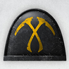
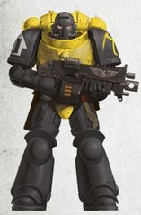
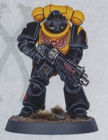
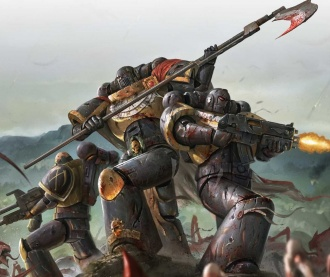
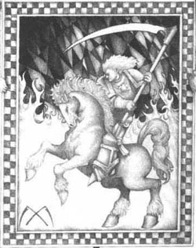

# 0450 帝皇之镰 Scythes of the Emperor

精校状态：中文行文已逐段精校，部分术语仍为暂定

分类：通用概念 / 帝国 Imperium / 中央政务部 Adeptus Terra / 阿斯塔特修会 Adeptus Astartes

原文来源：https://www.bilibili.com/opus/1221063501548617761

原作者：帝国神选罐头

原文时间：2026年07月04日 12:30

[返回分类目录](目录.md) · [全书目录](../../目录.md)

<!-- A0450-B0001 -->
**英文原文**

The Scythes of the Emperor (or Emperor's Scythes) are a Codex Chapter of the Adeptus Astartes. The advance of Hive Fleet Kraken overwhelmed the Chapter's home world of Sotha and virtually destroyed the Chapter for many years. However, in the Age of the Dark Imperium they have experienced a rebirth. They are one of the ten Shield Chapters of Ultramar.

<!-- /A0450-B0001 -->

<!-- A0450-B0002 -->

原译文

帝皇之镰（或帝皇镰刀）是阿斯塔特修会的圣典战团。虫巢舰队克拉肯的推进压倒了战团的家园世界索萨，并在多年内几乎摧毁了战团。然而，在黑暗帝国时代，他们经历了重生。它们是奥特拉玛的十个盾牌战团之一。

**校订译文**

帝皇之镰是阿斯塔特修会中遵循圣典编制的战团，英文也称 Emperor’s Scythes。克拉肯虫巢舰队吞没母星索萨，使战团濒临覆灭，多年未能恢复；但在黑暗帝国时代，他们获得新生，成为十个奥特拉玛之盾战团之一。

**校注：** Scythes of the Emperor 与 Emperor’s Scythes 是同一战团的英文形式，中文统一帝皇之镰，不另造帝皇镰刀。

<!-- /A0450-B0002 -->

<!-- A0450-B0003 图片 -->

<!-- A0450-B0004 图片 -->

<!-- A0450-B0005 图片 -->

<!-- A0450-B0006 -->
**英文原文**

Founding Chapter:Ultramarines

<!-- /A0450-B0006 -->

<!-- A0450-B0007 -->

原译文

建军战团：极限战士

**校订译文**

母战团：极限战士

<!-- /A0450-B0007 -->

<!-- A0450-B0008 -->
**英文原文**

Founding:Third Founding

<!-- /A0450-B0008 -->

<!-- A0450-B0009 -->

原译文

建军时间：第三次建军

**校订译文**

建军时间：第三次建军

<!-- /A0450-B0009 -->

<!-- A0450-B0010 -->
**英文原文**

Chapter Master:Unknown (formerly Thrasius)

<!-- /A0450-B0010 -->

<!-- A0450-B0011 -->

原译文

战团长：未知（前特拉修斯）

**校订译文**

战团长：现任不明，前任为特拉修斯。

<!-- /A0450-B0011 -->

<!-- A0450-B0012 -->
**英文原文**

Homeworld:Sotha

<!-- /A0450-B0012 -->

<!-- A0450-B0013 -->

原译文

家园世界：索萨

**校订译文**

母星：索萨。

<!-- /A0450-B0013 -->

<!-- A0450-B0014 -->
**英文原文**

Fortress-Monastery:Aegida

<!-- /A0450-B0014 -->

<!-- A0450-B0015 -->

原译文

堡垒修道院：神盾

**校订译文**

要塞修道院：神盾

<!-- /A0450-B0015 -->

<!-- A0450-B0016 -->
**英文原文**

Colours:Black with yellow torso and backpack. Imperialis colours show Company affiliation.

<!-- /A0450-B0016 -->

<!-- A0450-B0017 -->

原译文

配色：黑色，黄色躯干和背包。帝国天鹰颜色表示连队隶属关系。

**校订译文**

配色：黑色护甲，躯干与动力背包为黄色；胸前帝国徽记的颜色表示连队归属。

<!-- /A0450-B0017 -->

<!-- A0450-B0018 -->
## History 历史

<!-- /A0450-B0018 -->

<!-- A0450-B0019 -->
### Origins 起源

<!-- /A0450-B0019 -->

<!-- A0450-B0020 -->
**英文原文**

The Scythes of the Emperor's history originated during the Horus Heresy, where the 199th "Aegida" company of the Ultramarines fought bravely against the Night Lords in the Battle of Sotha. Subsequently, Roboute Guilliman honoured the company with the emblem of two crossed scythes, representing their defence of the farmers of Sotha.

<!-- /A0450-B0020 -->

<!-- A0450-B0021 -->

原译文

帝皇之镰的历史起源于荷鲁斯叛乱时期，在那里，极限战士第199“神盾”连队在索萨之战中勇敢地与午夜领主作战。随后，罗伯特·基里曼向该连队颁发了两把交叉镰刀的徽章，代表他们对索塔农民的捍卫。

**校订译文**

战团的历史可追溯至荷鲁斯之乱。索萨之战中，极限战士第199“神盾”连英勇对抗午夜领主。罗保特·基里曼随后赐予他们两把交叉镰刀的徽记，表彰其守护索萨农民的功绩。

<!-- /A0450-B0021 -->

<!-- A0450-B0022 图片 -->

<!-- A0450-B0023 -->

原译文

The Scythes of the Emperor battle Tyranids 帝皇之镰与泰伦战斗

**校订译文**

The Scythes of the Emperor battle Tyranids 帝皇之镰与泰伦战斗

<!-- /A0450-B0023 -->

<!-- A0450-B0024 -->
**英文原文**

After the Heresy and the Second Founding, the Aegida Company was maintained as a phantom 11th Company under the command of Captain Oberdeii, in defiance of Guilliman's own Codex Astartes. When Rogal Dorn initiated the Third Founding nearly a millennium later, Oberdeii was the last surviving member of the company. Nevertheless, the Ultramarines' Chapter Master, Tigris Decon, wished to remove the evidence of Guilliman's 'heresy', sending Chaplain Segas and Brother Wenlocke to offer Oberdeii the choice of being reassigned to the 5th Company or continuing to guard the Pharos by becoming Master of a new 'Aegida Chapter'. Oberdeii reluctantly agreed to found a new Chapter, but chose to name them the Scythes of the Emperor. In addition to Chaplain Segas and Brother Wenlocke, seventy-two veterans of the Orlan Conquest were assigned to the new Chapter.

<!-- /A0450-B0024 -->

<!-- A0450-B0025 -->

原译文

叛乱和二次建军后，神盾连队被维持为一个幽灵般的第11连队，由奥伯德伊连长指挥，无视基里曼自己的阿斯塔特圣典。当罗格·多恩在近千年后发起第三次建军时，奥伯德伊是该连队最后一位幸存的成员。尽管如此，极限战士的战团长提格里斯·迪肯希望消除基里曼“异端”的证据，派遣牧师塞加斯和温洛克兄弟让奥伯德伊选择被重新分配到第五连队，或者通过成为新的“神盾战团”的战团长来继续守卫灯塔。奥伯德伊不情愿地同意成立一个新的战团，但选择将他们命名为帝皇之镰。除了牧师塞加斯和温洛克兄弟，奥尔兰征服的72名老兵也被分配到新的战团。

**校订译文**

荷鲁斯之乱与二次建军后，神盾连仍由奥伯德伊连长统领，以未公开的“第十一连”形式保留下来，违背了基里曼本人编写的圣典。近千年后，多恩发起第三次建军时，奥伯德伊已是这一连队最后的幸存者。极限战士战团长提格里斯·德康希望消除基里曼曾经“违制”的证据，便派塞加斯教士与温洛克兄弟前来，给奥伯德伊两个选择：调入第五连，或成为新建“神盾战团”的战团长，继续守护灯塔。奥伯德伊勉强同意建立新战团，却将其命名为“帝皇之镰”。除两位使者外，奥尔兰征服战争的72名老兵也被调入。

**校注：** phantom 11th Company 为未公开、违反编制上限的额外连队，并非真正的幽灵部队。Decon 姓氏与第430篇德康统一。

<!-- /A0450-B0025 -->

<!-- A0450-B0026 -->

原译文

The Corinth Crusade (698-705.M41)科林斯远征

**校订译文**

The Corinth Crusade (698-705.M41)科林斯远征

<!-- /A0450-B0026 -->

<!-- A0450-B0027 -->
**英文原文**

The Corinth Crusade was led by Marneus Calgar, with forces from the Ultramarines, Angels of Absolution, Lamenters, Silver Skulls, Scythes of the Emperor and Marines Errant as well as more than fifty Imperial Guard Regiments. They fought against the Ork hordes of Waaagh! Skargor, in the Corinth system within the Ork empire of Charadon.

<!-- /A0450-B0027 -->

<!-- A0450-B0028 -->

原译文

科林斯远征由马涅乌斯·卡尔加领导，其部队来自极限战士、赦免天使、恸哭者、银色颅骨、帝皇之镰和游侠战士，以及五十多个帝国卫队兵团。他们与斯卡戈尔的Waaagh！的欧克部落作战，位于查拉顿的欧克帝国的科林斯星系内。

**校订译文**

马涅乌斯·卡尔加统率科林斯远征军，参战者包括极限战士、赦免天使、恸哭者、银色颅骨、帝皇之镰、游侠战士，以及五十余个帝国卫队团。他们在查拉顿欧克帝国境内的科林斯星系，与 Waaagh! 斯卡戈尔交战。

<!-- /A0450-B0028 -->

<!-- A0450-B0029 -->
**英文原文**

The successful crusade not only crushed Waaagh! Skargor but also delayed any further Ork incursions from Charadon for more than thirty years.

<!-- /A0450-B0029 -->

<!-- A0450-B0030 -->

原译文

远征的成功不仅粉碎了斯卡戈尔的Waaagh！还推迟了三十多年欧克从查拉顿的进一步入侵。

**校订译文**

远征不仅摧毁了 Waaagh! 斯卡戈尔，还将查拉顿欧克的进一步入侵延迟了三十多年。

<!-- /A0450-B0030 -->

<!-- A0450-B0031 -->

原译文

Damocles Gulf Crusade (745.M41) 达摩克利斯湾远征

**校订译文**

Damocles Gulf Crusade (745.M41) 达摩克利斯湾远征

<!-- /A0450-B0031 -->

<!-- A0450-B0032 -->
**英文原文**

It was in the years following the Damocles Crusade against the T'au in 742.M41 the Scythes of the Emperor would come to the forefront of Eastern Fringe warfare. The Scythes led the first landing onto T'au territory, the world of Sy'l'kell. After establishing the landing zone. The Brimlock Dragoons moved on to expand the Imperial foothold. The Dragoons were nearly destroyed by a T'au ambush which the Scythes, leading Imperial Storm Troopers, broke through averting a near disaster. After claiming Sy'l'kell, the Crusade moved to cross the Damocles Gulf. After a brutal first fleet engagement with the Tau, the Imperials landed on the major Tau world of Dal'yth Prime. Joining members of the venerated Ultramarines and Iron Hands Chapters, the Scythes were part of several spearhead assaults and kept up constant night patrols against Tau infiltrators during the months long fighting.

<!-- /A0450-B0032 -->

<!-- A0450-B0033 -->

原译文

742.M41达摩克利斯远征后的几年里，帝皇之镰出现在东部边缘战争的前沿。帝皇之镰带领第一次登陆钛领土，西'尔'凯尔世界。建立着陆区后。布里姆洛克龙骑兵继续扩张帝国的立足点。龙骑兵几乎被钛伏击摧毁，领导帝国风暴兵的帝皇之镰突破了这一伏击，避免了近处的灾难的发生。在占领西'尔'凯尔之后，远征军开始穿越达摩克利斯湾。在与钛进行了残酷的第一次舰队交战后，帝国登陆了达尔'伊斯一号的主要钛世界。帝皇之镰加入了受人尊敬的极限战士和钢铁之手战团的成员，是几次先锋攻击的一部分，并在长达数月的战斗中不断对钛渗透者进行夜间巡逻。

**校订译文**

在742.M41针对钛族的达摩克利斯远征及其后的战事中，帝皇之镰走到银河东部边缘战线的最前沿。他们率先登陆钛族世界西’尔’凯尔，建立着陆场，随后布里姆洛克龙骑兵推进，扩大帝国控制区。龙骑兵遭钛族伏击，几乎覆灭，幸而帝皇之镰率帝国风暴兵破围来援，避免了灾难。攻占西’尔’凯尔后，远征军穿越达摩克利斯湾，经历一场惨烈的舰队首战，继而登陆钛族重要世界达尔’伊斯主星。帝皇之镰与极限战士、钢铁之手并肩，参加多次先锋突击，并在数月苦战中不断夜间巡逻，防范钛族渗透。

**校注：** 标题745.M41，正文叙述远征起于742.M41，保留起止时段差异。Dal’yth Prime 按主星处理，未擅写第一号行星。

<!-- /A0450-B0033 -->

<!-- A0450-B0034 -->
**英文原文**

With news of Hivefleet Behemoth bearing down upon the Eastern fringe and the stalemate between the two sides, the Crusade withdrew, though a mutual respect between both sides had been forged.

<!-- /A0450-B0034 -->

<!-- A0450-B0035 -->

原译文

随着虫巢舰队贝希摩斯逼近东部边缘的消息和双方之间的僵局，远征军撤退了，尽管双方之间已经建立了相互尊重。

**校订译文**

双方僵持不下之际，贝希摩斯虫巢舰队逼近东部边缘的消息传来，远征军遂撤退；不过，交战中双方已对彼此生出尊重。

<!-- /A0450-B0035 -->

<!-- A0450-B0036 -->

原译文

Verdeworlds Campaign (865.M41)绿色世界战役

**校订译文**

Verdeworlds Campaign (865.M41)绿色世界战役

<!-- /A0450-B0036 -->

<!-- A0450-B0037 -->

原译文

Second Tyrannic War (992.M41) 第二次泰伦战争

**校订译文**

Second Tyrannic War (992.M41) 第二次泰伦战争

<!-- /A0450-B0037 -->

<!-- A0450-B0038 -->
**英文原文**

Among the planets overwhelmed by the locust-tide of Tyranid hive fleet Kraken was the chapter's homeworld Sotha. Even for a well-defended Chapter planet, there was little hope against such vast numbers and relentless hunger, and in the end due to Genestealer Cult uprisings the Chapter brethren were killed in the last stand on the planet. All brethren were presumed destroyed, but a small number had escaped to preserve their chapter and gene-seed.

<!-- /A0450-B0038 -->

<!-- A0450-B0039 -->

原译文

在被泰伦虫巢舰队克拉肯的虫潮淹没的行星中，有战团的家园世界索萨。即使是一个防御良好的战团行星，面对如此庞大的数量和无情的饥饿，也几乎没有希望，最终由于基因窃取者教派的叛乱，战团兄弟在行星上的最后一战中被杀。所有兄弟都被认为被摧毁了，但有少数人逃脱了，以保护他们的战团和基因种子。

**校订译文**

克拉肯虫巢舰队如蝗潮般席卷诸世界，帝皇之镰母星索萨也未能幸免。即使防御严密的战团母星，也难以抵挡如此庞大而饥饿的敌人。最后，基因窃取者教派起事，战团战士在行星上的决死抵抗中被杀。外界以为全团覆灭，但实际上少数人逃出，保住了血脉与基因种子。

<!-- /A0450-B0039 -->

<!-- A0450-B0040 -->
**英文原文**

Sotha, along with so many other planets in the inexorable advance of the Kraken, was reduced to the state of an asteroid by the Tyranid swarms. Two hundred Marines broke through the Tyranid assault. With much of the region overwhelmed by the Tyranids, there was nowhere to escape. The last of the Scythes evacuated to the Miral System eventually landed on the death world of Miral.

<!-- /A0450-B0040 -->

<!-- A0450-B0041 -->

原译文

索萨和许多其他行星一起，在克拉肯无情的推进中，被泰伦虫群降低到小行星的状态。200名战士突破了泰伦的进攻。由于该地区大部分地区被泰伦淹没，无处可逃。最后一批撤离到米拉尔星系的帝皇之镰最终降落在米拉尔死亡世界。

**校订译文**

索萨与其他受害世界一样，被虫群吞噬成宛如荒芜小行星的死地。两百名星际战士突破攻势逃出，可周边大部也已遭泰伦侵占，无处可去。残部最终撤至米拉尔星系，登陆死亡世界米拉尔。

**校注：** reduced to the state of an asteroid 描述被吞噬后荒芜失去生命的状态，未称行星体积真的缩成小行星。

<!-- /A0450-B0041 -->

<!-- A0450-B0042 -->
**英文原文**

Somewhere on the surface of this planet, a huge rocky outcrop called the Giant's Coffin rose from the jungle. The surviving forces of the Scythes prepared to make this their final stronghold. The Giant's Coffin was a tremendous natural citadel whose steep cliffs would slow the invaders, and the rocky promontories would provide excellent firing positions for heavy weapons. Although the defenses of the Scythes were strong they were still overwhelmed. Their Chapter Master Thorcyra met his end on Miral and the Scythes were forced to withdraw. The fate of Miral is unknown, although little more than a Company of the Scythes of the Emperor escaped with their lives.

<!-- /A0450-B0042 -->

<!-- A0450-B0043 -->

原译文

在这个行星表面的某个地方，一块名为巨人之棺的巨岩露出地面的部分从丛林中升起。帝皇之镰幸存的部队准备将其作为最后的据点。巨人之棺是一座巨大的天然城堡，陡峭的悬崖会减缓入侵者的速度，岩石岬会为重型武器提供绝佳的射击位置。虽然帝皇之镰的防御很强大，但他们仍然被压倒了。他们的战团长索西拉在米拉尔上迎来了他的结束，帝皇之镰被迫撤退。米拉尔的命运是未知的，尽管只有一个帝皇之镰的连队带着他们的生命逃脱了。

**校订译文**

米拉尔丛林间耸立着一片巨大岩体，称为“巨人之棺”。幸存者准备据此死守。这座天然要塞悬崖陡峭，可迟滞进攻，突出的岩台又适合部署重武器。尽管防守顽强，他们仍被虫群压倒，战团长索西拉阵亡，残部被迫再次撤离。米拉尔命运不明，最终生还的帝皇之镰仅略多于一个连队。

**校注：** little more than a Company 是略多于一个连队，原译只有一个连队遗漏人数限定。

<!-- /A0450-B0043 -->

<!-- A0450-B0044 -->
**英文原文**

Captain Thrasius became the new Chapter Master and planned a series of hit and run attacks against the Tyranids. This pattern of defense and retreat continued until they received word that Hive Fleet Kraken's unstoppable advance had finally been staggered by the Ultramarines on Ichar IV. At that time, the Scythes were engaged in the preparation of defences on Bosphor, and were bitterly disappointed not to have been present when that first great victory was won. Thereafter, Thrasius's strategy became principally concerned with the preservation of his Chapter and the salvaging of as much material as possible from the devastation wrought by the Tyranids.

<!-- /A0450-B0044 -->

<!-- A0450-B0045 -->

原译文

特拉修斯连长成为了新的战团长，并计划了一系列针对泰伦的跑打攻击。这种防御和撤退的模式一直持续到他们收到消息，虫巢舰队克拉肯不可阻挡的前进终于被伊卡尔四号上的极限战士震惊了。当时，帝皇之镰正在博斯弗尔准备防御，并对在赢得第一次大胜时没有在场感到非常失望。此后，特拉修斯的战略主要是保护他的战团，并从泰伦造成的破坏中尽可能多地抢救原料。

**校订译文**

特拉修斯连长继任战团长，策划针对泰伦的机动袭扰。一边抵抗、一边撤退的战局持续到消息传来：极限战士终于在伊卡尔四号遏止克拉肯势不可挡的推进。当时，帝皇之镰正在博斯弗尔构筑防线，未能参加这场首次大捷，令他们深感遗憾。此后，特拉修斯将保存战团、从虫群蹂躏后的废墟中尽量回收军需物资，作为战略重点。

<!-- /A0450-B0045 -->

<!-- A0450-B0046 -->
**英文原文**

The Scythes no longer have any Codex-approved Terminator squads, since they have only three remaining suits of Terminator armour. Forge Master Sebastion is known to have acquired a fourth partial suit and restored it to combat-readiness.

<!-- /A0450-B0046 -->

<!-- A0450-B0047 -->

原译文

帝皇之镰不再有任何圣典批准的终结者小队，因为他们只剩下三套终结者盔甲。众所周知，铸造大师塞巴斯蒂安已经获得了第四个部分套装，并将其恢复到战备状态。

**校订译文**

当时，战团仅剩三套终结者护甲，已无法组成符合圣典编制的终结者小队。后来，铸造大师塞巴斯蒂安又取得第四套残缺护甲，将其修复到能够作战的状态。

<!-- /A0450-B0047 -->

<!-- A0450-B0048 -->
**英文原文**

Since the destruction of their homeworld, the Scythes have become a secretive Chapter. This is because many of their Battle-Brothers were infected with the Genestealer's Kiss during the invasion. The Astartes were strong enough to resist the calls of the Hive Mind, but wore psychic dampening hoods to lessen its power.

<!-- /A0450-B0048 -->

<!-- A0450-B0049 -->

原译文

自从他们的家园世界被摧毁以来，帝皇之镰已经成为一个秘密战团。这是因为他们的许多战斗兄弟在入侵期间感染了基因窃取者之吻。阿斯塔特足够强大，可以抵抗虫巢思维的召唤，但他们戴着灵能抑制头罩来削弱它的力量。

**校订译文**

母星毁灭后，帝皇之镰行事愈发隐秘，因为许多战斗兄弟在入侵中遭到基因窃取者之吻感染。阿斯塔特足够强韧，能够抵抗虫巢意志召唤，但仍佩戴灵能抑制头罩，削弱其影响。

**校注：** 此处隐秘的是战团行为，并非其建军或存在本身不公开。

<!-- /A0450-B0049 -->

<!-- A0450-B0050 -->
### Rebirth (Present)重生（目前）

<!-- /A0450-B0050 -->

<!-- A0450-B0051 -->
**英文原文**

At the beginning of 999.M41 it is understood that the Scythes of the Emperor were still attempting to rebuild, and seek vengeance upon the Tyranid race. In 970999.M41 the Scythes unexpectedly re-emerged from the shadow of Hive Fleet Kraken and announced that their Chapter would be "born anew".

<!-- /A0450-B0051 -->

<!-- A0450-B0052 -->

原译文

在999.M41初，据了解，帝皇之镰仍在试图重建，并向泰伦种族寻求复仇。970999.M41，帝皇之镰出人意料地从虫巢舰队克拉肯的阴影中重新出现，并宣布他们的战团将“重生”。

**校订译文**

在999.M41初，据了解，帝皇之镰仍在试图重建，并向泰伦种族寻求复仇。970999.M41，帝皇之镰出人意料地从虫巢舰队克拉肯的阴影中重新出现，并宣布他们的战团将“重生”。

<!-- /A0450-B0052 -->

<!-- A0450-B0053 -->
**英文原文**

Later during the Indomitus Crusade the Scythes of the Emperor were formally reborn thanks to reinforcements of Primaris Space Marines from Belisarius Cawl's Ultima Founding. They have since gone back to fighting for the Emperor, such as in the Battle of Hamagora. After the Indomitus Crusade, the Scythes of the Emperor were among the Chapter's chosen by Roboute Guilliman to guard the reformed realm of Ultramar.

<!-- /A0450-B0053 -->

<!-- A0450-B0054 -->

原译文

不屈远征后期，多亏了来自贝利萨留·考尔的极限建军的原铸星际战士援军，让帝皇之镰战团得以正式重建。自此回归为帝皇而战，比如在哈马戈拉之战。不屈远征之后，帝皇之镰是基里曼选择的守卫改变后的奥特拉玛领域的其中一个战团。

**校订译文**

后来，不屈远征期间，贝利萨留斯·考尔的极限建军为帝皇之镰送来原铸援军，战团由此正式重建，再度为帝皇征战，包括参加哈马戈拉之战。不屈远征后，他们被罗保特·基里曼选为守卫重新统一的奥特拉玛的战团之一。

**校注：** Later during 表示后来在远征期间，不足以精确断言不屈远征后期；保留其与后句远征结束后的时序差别。

<!-- /A0450-B0054 -->

<!-- A0450-B0055 -->
**英文原文**

A force of Scythes later accompanied Belisarius Cawl to Sotha to study the Pharos, but were beset by a force of Genestealer Cultists that had infiltrated their Chapter Serfs. During the fight Chapter Master Thrasius died slaying the same Genestealer Patriarch that had originally led the assault on Sotha. All the remaining Scythes Firstborn died with him in the battle.

<!-- /A0450-B0055 -->

<!-- A0450-B0056 -->

原译文

后来，一支帝皇之镰部队陪同贝利撒留·考尔前往索萨研究灯塔，但被一支渗透到他们的战团侍从的基因窃取者邪教徒部队所包围。在战斗中，战团长特拉修斯牺牲，杀死了最初领导对索萨进攻的同一位基因窃取者族长。所有剩下的帝皇之镰长子都在战斗中与他一起死去。

**校订译文**

一支帝皇之镰部队后来陪同贝利萨留斯·考尔返回索萨研究灯塔，却遭到早已渗透战团农奴群体的基因窃取者信徒围攻。特拉修斯战团长在战斗中与当年率军攻陷索萨的基因窃取者族长同归于尽；全团剩余的长子战士也全部战死。

<!-- /A0450-B0056 -->

<!-- A0450-B0057 -->
**英文原文**

The previously abandoned orbital station of Aegida above Sotha was rebuilt and assigned as their fortress-monastery until the planet would be fully revived. From there Scythes of Emperor will fulfil their ancient obligations of honour and watch the eastern marches of Greater Ultramar for various and numerous threats.

<!-- /A0450-B0057 -->

<!-- A0450-B0058 -->

原译文

索萨上空先前废弃的神盾轨道站被重建并指定为他们的堡垒修道院，直到行星完全复苏。从那里，帝皇之镰将履行他们古老的荣誉职责，并观察大奥特拉马的东部行军，以应对各种各样的威胁。

**校订译文**

索萨上空原已废弃的神盾轨道站被重建，作为战团要塞修道院，直至行星完全恢复生机。帝皇之镰将以此为据点，履行古老的守护誓言，抵御威胁大奥特拉玛东部边疆的各路敌人。

**校注：** marches 在疆域语境指边疆，不是军队行军。

<!-- /A0450-B0058 -->

<!-- A0450-B0059 -->
**英文原文**

The Chapter later contributed forces to the Ultramarian Reclamation.

<!-- /A0450-B0059 -->

<!-- A0450-B0060 -->

原译文

战团后来为极限战士收回派遣了部队。

**校订译文**

战团后来也派兵参加奥特拉玛收复行动。

<!-- /A0450-B0060 -->

<!-- A0450-B0061 -->
## Recruitment 招募

<!-- /A0450-B0061 -->

<!-- A0450-B0062 -->
**英文原文**

The Scythes of the Emperor did not restrict the recruitment of new Aspirants to their homeworld; even before the loss of Sotha, the Chapter maintained bastions on a number of Imperial worlds, which were used for resupply along with recruiting Marines. Planets known to feature such outposts include Miral Prime (which was consumed by the tyranids not long after they attacked Sotha), Brakur IV and Beremin.

<!-- /A0450-B0062 -->

<!-- A0450-B0063 -->

原译文

帝皇之镰并没有限制招募新的有志者到他们的家园世界；甚至在失去索萨之前，战团就在许多帝国世界上建立了堡垒，这些堡垒与招募战士一起用于补给。已知有此类前哨的行星包括米拉尔一号（在泰伦袭击索萨后不久就被其吞噬）、布拉库尔四号和贝雷明。

**校订译文**

帝皇之镰并不只从母星选拔候选者。索萨陷落前，他们便在多个帝国世界建立堡垒，同时用于补给与征兵。已知前哨分布于米拉尔主星、布拉库尔四号与贝雷明；米拉尔主星在泰伦袭击索萨后不久，也被虫群吞噬。

<!-- /A0450-B0063 -->

<!-- A0450-B0064 -->
## Heraldry 纹章

<!-- /A0450-B0064 -->

<!-- A0450-B0065 -->
**英文原文**

The Power Armour worn by the Scythes of the Emperor is black, with a yellow breastplate, groin, and backpack, and Company affiliation is indicated by the colour of the Marine's chest aquila. The Chapter's symbol is a pair of yellow crossed scythes on a black background.

<!-- /A0450-B0065 -->

<!-- A0450-B0066 -->

原译文

帝皇之镰所穿的动力盔甲是黑色的，有黄色的胸甲、腹股沟和背包，战士胸部天鹰的颜色表明了连队的隶属关系。战团的标志是一对黑色背景上的黄色交叉镰刀。

**校订译文**

帝皇之镰穿戴黑色动力甲，胸甲、裆甲与动力背包涂黄，胸前天鹰的颜色标示连队归属。战团徽记为黑底上的两把黄色交叉镰刀。

<!-- /A0450-B0066 -->

<!-- A0450-B0067 图片 -->

<!-- A0450-B0068 -->

原译文

Chapter banner of the Emperor's Scythes 帝皇之镰的战团旗帜

**校订译文**

Chapter banner of the Emperor's Scythes 帝皇之镰的战团旗帜

<!-- /A0450-B0068 -->

<!-- A0450-B0069 -->
**英文原文**

Veteran status is indicated by a yellow left kneepad with a black skull on it.

<!-- /A0450-B0069 -->

<!-- A0450-B0070 -->

原译文

老兵身份由一个黄色的左膝甲表示，上有一个黑色的颅骨。

**校订译文**

老兵身份由一个黄色的左膝甲表示，上有一个黑色的颅骨。

<!-- /A0450-B0070 -->

<!-- A0450-B0071 -->
**英文原文**

Many of the Company Banners of the Scythes, along with the Chapter Standard, feature an armoured warrior clad in the Chapter's colours astride a horse. This is regarded by some as an unusual choice of animal, as horses are not native to Sotha and there are no records of any Scythes ever riding into battle on one. Each Company Standard features a legendary horse from the tales told by Oberdeii. Amongst the horses featured are Abrax and Conabos.

<!-- /A0450-B0071 -->

<!-- A0450-B0072 -->

原译文

许多帝皇之镰的连队旗帜，以及战团旗帜，都有一个穿着战团颜色的盔甲战士骑在马上。有些人认为这是一种不寻常的动物选择，因为马不是索萨的本土生物，也没有任何记录表明任何帝皇之镰骑着马参加过战斗。每个连队旗帜都有一匹奥伯德伊讲述的故事中的传奇马。包括阿布拉克斯和科纳博斯。

**校订译文**

许多帝皇之镰的连队旗帜，以及战团旗帜，都有一个穿着战团颜色的盔甲战士骑在马上。有些人认为这是一种不寻常的动物选择，因为马不是索萨的本土生物，也没有任何记录表明任何帝皇之镰骑着马参加过战斗。每个连队旗帜都有一匹奥伯德伊讲述的故事中的传奇马。包括阿布拉克斯和科纳博斯。

<!-- /A0450-B0072 -->

<!-- A0450-B0073 -->
## Notable Elements 著名人物与事物

原题：Notable Elements 著名成员

<!-- /A0450-B0073 -->

<!-- A0450-B0074 -->
### Relics 圣物

<!-- /A0450-B0074 -->

<!-- A0450-B0075 -->
**英文原文**

Mask of Dantioch - Helmet - Originally worn by Barabas Dantioch, it was taken as a symbol of office of the Chapter Master.

<!-- /A0450-B0075 -->

<!-- A0450-B0076 -->

原译文

丹提欧克面具 - 头盔 - 最初由巴拉巴斯·丹提欧克佩戴，被视为战团长职位的象征。

**校订译文**

丹提欧克面具 - 头盔 - 最初由巴拉巴斯·丹提欧克佩戴，被视为战团长职位的象征。

<!-- /A0450-B0076 -->

<!-- A0450-B0077 -->
### Fleet 舰队

<!-- /A0450-B0077 -->

<!-- A0450-B0078 -->
**英文原文**

Prior to the Fall of Sotha, the Chapter fleet numbered over a hundred vessels in total. Following Kraken's attack, and the Chapter's evacuation to the Miral System, only twenty-six ships remained, many heavily damaged.

<!-- /A0450-B0078 -->

<!-- A0450-B0079 -->

原译文

在索萨陷落之前，战团舰队总共有一百多艘战舰。在克拉肯的攻击和战团撤退到米拉尔星系后，只剩下26艘船，其中许多严重受损。

**校订译文**

索萨陷落前，战团舰队共有百余艘舰船。克拉肯进攻、战团撤向米拉尔星系后，仅余26艘，其中许多已严重损坏。

**校注：** 舰队表称26艘，末尾引文称25艘；这是原文自身数量差异，分别保留，未强行统一。

<!-- /A0450-B0079 -->

<!-- A0450-B0080 -->
### Notable Vessels 著名战舰

<!-- /A0450-B0080 -->

<!-- A0450-B0081 -->
**英文原文**

Aegida — Space Station, currently serving as the Chapter's Fortress-Monastery.

<!-- /A0450-B0081 -->

<!-- A0450-B0082 -->

原译文

神盾 — 空间站，目前是战团的堡垒修道院。

**校订译文**

神盾 — 空间站，目前是战团的要塞修道院。

<!-- /A0450-B0082 -->

<!-- A0450-B0083 -->
**英文原文**

Heart of Cronus — Battle Barge. Last flagship of the Chapter after the battle at Giant's Coffin (previously known as the Heart of Sotha in older publications).

<!-- /A0450-B0083 -->

<!-- A0450-B0084 -->

原译文

克洛诺斯之心号 — 战斗驳船。巨人之棺之战后的最后一艘旗舰（在旧出版物中称为索萨之心号）。

**校订译文**

克洛诺斯之心号 — 战斗驳船。巨人之棺之战后的最后一艘旗舰（在旧出版物中称为索萨之心号）。

<!-- /A0450-B0084 -->

<!-- A0450-B0085 -->
**英文原文**

Honour's Might — Battle Barge. Chapter flagship around the time of the fall of Sotha.

<!-- /A0450-B0085 -->

<!-- A0450-B0086 -->

原译文

荣誉之力号 — 战斗驳船。索萨陷落前后的战团旗舰。

**校订译文**

荣誉之力号 — 战斗驳船。索萨陷落前后的战团旗舰。

<!-- /A0450-B0086 -->

<!-- A0450-B0087 -->
**英文原文**

Atreides — Strike Cruiser. Participated in a gene-seed recovery mission to the planet Brakur IV, in the Brakur System.

<!-- /A0450-B0087 -->

<!-- A0450-B0088 -->

原译文

亚崔迪号 — 打击巡洋舰。参与了布拉库尔星系中布拉库尔四号行星的基因种子回收任务。

**校订译文**

亚崔迪号 — 打击巡洋舰。参与了布拉库尔星系中布拉库尔四号行星的基因种子回收任务。

<!-- /A0450-B0088 -->

<!-- A0450-B0089 -->
**英文原文**

Callandra — Strike Cruiser.

<!-- /A0450-B0089 -->

<!-- A0450-B0090 -->

原译文

卡兰德拉号 — 打击巡洋舰。

**校订译文**

卡兰德拉号 — 打击巡洋舰。

<!-- /A0450-B0090 -->

<!-- A0450-B0091 -->
**英文原文**

Gift of Enyo — Strike Cruiser.

<!-- /A0450-B0091 -->

<!-- A0450-B0092 -->

原译文

厄倪俄之礼号 — 打击巡洋舰

**校订译文**

厄倪俄之礼号 — 打击巡洋舰

<!-- /A0450-B0092 -->

<!-- A0450-B0093 -->
**英文原文**

Nova Prospectum — Cruiser.

<!-- /A0450-B0093 -->

<!-- A0450-B0094 -->

原译文

新星视野号 — 巡洋舰

**校订译文**

新星视野号 — 巡洋舰

<!-- /A0450-B0094 -->

<!-- A0450-B0095 -->
**英文原文**

Sterope — Light Cruiser.

<!-- /A0450-B0095 -->

<!-- A0450-B0096 -->

原译文

斯忒洛珀号 — 轻型巡洋舰

**校订译文**

斯忒洛珀号 — 轻型巡洋舰

<!-- /A0450-B0096 -->

<!-- A0450-B0097 -->
**英文原文**

Xenophon — Hunter-class Destroyer. Destroyed before the fall of Sotha.

<!-- /A0450-B0097 -->

<!-- A0450-B0098 -->

原译文

色诺芬号 — 猎手级驱逐舰。在索萨陷落前被摧毁

**校订译文**

色诺芬号 — 猎手级驱逐舰。在索萨陷落前被摧毁

<!-- /A0450-B0098 -->

<!-- A0450-B0099 -->
**英文原文**

Light of the Pharos — Destroyer. Severely damaged in the Chapter's evacuation from Sotha.

<!-- /A0450-B0099 -->

<!-- A0450-B0100 -->

原译文

灯塔之光号 — 驱逐舰。在战团从索萨撤离时严重受损。

**校订译文**

灯塔之光号 — 驱逐舰。在战团从索萨撤离时严重受损。

<!-- /A0450-B0100 -->

<!-- A0450-B0101 -->
**英文原文**

Laodameia's Lament — Nova-class Frigate.

<!-- /A0450-B0101 -->

<!-- A0450-B0102 -->

原译文

拉俄达弥亚之悼号 — 新星级护卫舰

**校订译文**

拉俄达弥亚之悼号 — 新星级护卫舰

<!-- /A0450-B0102 -->

<!-- A0450-B0103 -->
**英文原文**

Pale Rider — Nova-class Frigate.

<!-- /A0450-B0103 -->

<!-- A0450-B0104 -->

原译文

苍白骑手号 — 新星级护卫舰

**校订译文**

苍白骑手号 — 新星级护卫舰

<!-- /A0450-B0104 -->

<!-- A0450-B0105 -->

原译文

Calixtus 卡利克斯托斯号

**校订译文**

Calixtus 卡利克斯托斯号

<!-- /A0450-B0105 -->

<!-- A0450-B0106 -->

原译文

Dromea Bathos 深径之程号

**校订译文**

Dromea Bathos 深径之程号

<!-- /A0450-B0106 -->

<!-- A0450-B0107 -->
**英文原文**

Ionia — Severely damaged in the Chapter's evacuation from Sotha.

<!-- /A0450-B0107 -->

<!-- A0450-B0108 -->

原译文

伊奥尼亚号 — 在战团从索塔撤离时严重受损。

**校订译文**

伊奥尼亚号——战团撤离索萨时严重受损。

<!-- /A0450-B0108 -->

<!-- A0450-B0109 -->

原译文

Lamentarion 哀悼号

**校订译文**

Lamentarion 哀悼号

<!-- /A0450-B0109 -->

<!-- A0450-B0110 -->
### Notable Vehicles 著名载具

<!-- /A0450-B0110 -->

<!-- A0450-B0111 -->
**英文原文**

Chrepan Steed — Thunderhawk.

<!-- /A0450-B0111 -->

<!-- A0450-B0112 -->

原译文

神谕骏马号 — 雷鹰

**校订译文**

神谕骏马号 — 雷鹰

<!-- /A0450-B0112 -->

<!-- A0450-B0113 -->
**英文原文**

Harpagus — Thunderhawk.

<!-- /A0450-B0113 -->

<!-- A0450-B0114 -->

原译文

哈帕古斯号 — 雷鹰

**校订译文**

哈帕古斯号 — 雷鹰

<!-- /A0450-B0114 -->

<!-- A0450-B0115 -->
**英文原文**

Reaper — Vindicator. Fought in the defence of Miral Prime where was destroyed by Tyranids of the Hive Fleet Kraken

<!-- /A0450-B0115 -->

<!-- A0450-B0116 -->

原译文

收割者号 — 维护者。为保卫米拉尔一号而战，被虫巢舰队克拉肯的泰伦摧毁

**校订译文**

收割者号——维护者战车，在米拉尔主星防御战中被克拉肯虫巢舰队摧毁。

<!-- /A0450-B0116 -->

<!-- A0450-B0117 -->
### Notable Members 著名成员

<!-- /A0450-B0117 -->

<!-- A0450-B0118 -->
**英文原文**

Chapter Master Oberdeii — (deceased) Warden of the Pharos, the old man on the mountain, Founder.

<!-- /A0450-B0118 -->

<!-- A0450-B0119 -->

原译文

战团长奥伯德伊 — （已故）灯塔守望者，山中老人，创始人。

**校订译文**

战团长奥伯德伊 — （已故）灯塔守望者，山中老人，创始人。

<!-- /A0450-B0119 -->

<!-- A0450-B0120 -->
**英文原文**

Chapter Master Thorcyra — (deceased) Chapter Master before the fall of Sotha. Killed on the death world of Miral.

<!-- /A0450-B0120 -->

<!-- A0450-B0121 -->

原译文

战团长索西拉 — （已故）索萨陷落前的战团长。在米拉尔死亡世界中牺牲。

**校订译文**

战团长索西拉 — （已故）索萨陷落前的战团长。在米拉尔死亡世界中牺牲。

<!-- /A0450-B0121 -->

<!-- A0450-B0122 -->
**英文原文**

Chapter Master Thracian (also known as Thrasius) - (deceased) Chapter Master, concerned with preserving and rebuilding his Chapter. Killed during Belisarius Cawl's expedition to Sotha in the Age of the Dark Imperium.

<!-- /A0450-B0122 -->

<!-- A0450-B0123 -->

原译文

战团长斯拉西安（也被称为特拉修斯）-（已故）战团长，关心保护和重建他的战团。在黑暗帝国时代，贝利撒留·考尔考察索萨时牺牲。

**校订译文**

特拉修斯战团长，英文又称 Thracian，原稿别译斯拉西安——已故。他致力于保存、重建战团，在黑暗帝国时代随贝利萨留斯·考尔远征索萨时阵亡。

**校注：** 源文明示 Thracian 与 Thrasius 为同一战团长别名；中文按较早采用的特拉修斯统一，原斯拉西安保留作别名，不合并其他同词形历史人物。

<!-- /A0450-B0123 -->

<!-- A0450-B0124 -->
**英文原文**

Chaplain Segas — (deceased) the Chapter's first Chaplain, whose remains were interred on the reliquary world of Egottha.

<!-- /A0450-B0124 -->

<!-- A0450-B0125 -->

原译文

牧师塞加斯 — （已故）战团的第一牧师，他的遗体被安葬在伊戈萨圣骨匣世界。

**校订译文**

塞加斯教士——已故。战团首任教士，遗体安葬于圣物世界伊戈萨。

<!-- /A0450-B0125 -->

<!-- A0450-B0126 -->
## Trivia 琐事

<!-- /A0450-B0126 -->

<!-- A0450-B0127 -->
**英文原文**

Parts of the Scythes' background are inspired by the Thracian civilisation - in particular their use of polearms called falces.

<!-- /A0450-B0127 -->

<!-- A0450-B0128 -->

原译文

帝皇之镰的部分背景受到色雷斯文明的启发，特别是他们使用被称为法尔塞斯镰的长柄武器。

**校订译文**

帝皇之镰的部分背景受到色雷斯文明的启发，特别是他们使用被称为法尔塞斯镰的长柄武器。

<!-- /A0450-B0128 -->

<!-- A0450-B0129 -->
### Notes 注释

<!-- /A0450-B0129 -->

<!-- A0450-B0130 -->
**英文原文**

Note 1: Captain Thracian remarks shortly after the evacuation to the Miral System,"Only twenty-five. Less than a quarter of the Chapter fleet."

<!-- /A0450-B0130 -->

<!-- A0450-B0131 -->

原译文

注释1：斯拉西安连长在撤退到米拉尔星系后不久说：“只有二十五艘。不到战团舰队的四分之一。”

**校订译文**

注释1：特拉修斯连长在撤退到米拉尔星系后不久感叹：“只有二十五艘，不到战团舰队的四分之一。”

<!-- /A0450-B0131 -->

本篇核心术语与暂定项

以下列出本篇出现的英文原形及核心术语表用词。同形词可能指不同对象，具体词义以本篇正文和校注为准；单复数、别名和仅见于图注的名称可能尚未列入。完整候选见[术语表](../../术语表/双语术语候选.csv)。

| 英文 | 采用中文 | 状态 |
| --- | --- | --- |
| Space Marines | 星际战士 | 官方已核对 |
| Adeptus Astartes | 阿斯塔特修会 | 官方已核对 |
| Imperial Guard | 帝国卫队 | 暂定·语境区分 |
| Tyranids | 泰伦虫族 | 官方已核对 |
| Terminator | 终结者 | 官方已核对 |
| Roboute Guilliman | 罗保特·基里曼 | 官方已核对 |
| Ultramar | 奥特拉玛 | 官方已核对 |
| Ultramarines | 极限战士 | 官方已核对 |
| Horus Heresy | 荷鲁斯之乱 | 官方已核对 |
| Imperium | 帝国 | 暂定·简称 |
| Waaagh! | Waaagh! | 暂定·保留原文 |
| Hive Mind | 虫巢意志 | 官方已核对 |
| Patriarch | 族长 | 官方已核对 |
| Indomitus | 不屈学派 | 暂定·学派语境 |
| History | 历史 | 编辑用语已统一 |
| Emperor | 帝皇 | 官方已核对 |
| Battle Barge | 战斗驳船 | 暂定·官方待核 |
| Night Lords | 午夜领主 | 暂定·官方待核 |
| Horus | 荷鲁斯 | 暂定·官方待核 |
| Iron Hands | 钢铁之手 | 暂定·官方待核 |
| Dark Imperium | 黑暗帝国 | 暂定·官方待核 |
| Indomitus Crusade | 不屈远征 | 暂定·官方待核 |
| Eastern Fringe | 东部边缘 | 暂定·官方待核 |
| Damocles Crusade | 达摩克利斯远征 | 暂定·官方待核 |
| Ichar IV | 伊卡尔四号 | 暂定·官方待核 |
| Sotha | 索萨 | 暂定·官方待核 |
| Barabas Dantioch | 巴拉巴斯·丹提欧克 | 暂定·官方待核 |
| Pharos | 灯塔 | 暂定·官方待核 |
| Aquila | 天鹰 | 暂定·官方待核 |
| Master | 导师（审判庭职衔）／舰务官（舰员职务） | 语境定译·官方待核 |
| Mission | 教团／传教机构 | 暂定 |
| Chaplain | 教士 | 官方已核对 |
| Ancient | 旗手 | 官方已核对 |
| Vindicator | 维护者战车 | 官方已核对 |
| Belisarius Cawl | 贝利萨留斯·考尔 | 官方已核对 |
| Second Founding | 二次建军 | 暂定·官方待核 |
| Founding | 建军 | 暂定·官方待核 |
| Silver Skulls | 银色颅骨 | 暂定·官方待核 |
| Power Armour | 动力盔甲 | 暂定·官方待核 |
| Destroyer | 毁灭者 | 暂定·官方待核 |
| Chapter | 战团 | 暂定·官方待核 |
| Fortress-monastery | 要塞修道院 | 暂定·官方待核 |
| Chapter Master | 战团长 | 暂定·官方待核 |
| Captain | 连长 | 暂定·官方待核 |
| Veteran | 老兵 | 暂定·官方待核 |
| Brother | 修士 | 暂定·官方待核 |
| Marneus Calgar | 马涅乌斯·卡尔加 | 暂定·官方待核 |
| Codex Astartes | 阿斯塔特圣典 | 暂定·官方待核 |
| Angels of Absolution | 赦免天使 | 暂定·官方待核 |
| Third Founding | 第三次建军 | 暂定·官方待核 |
| Scythes of the Emperor | 帝皇之镰 | 暂定·官方待核 |
| Lamenters | 恸哭者 | 暂定·官方待核 |
| Marines Errant | 游侠战士 | 暂定·官方待核 |
| Ultima Founding | 极限建军 | 暂定·官方待核 |
| Firstborn | 长子 | 暂定·官方待核 |
| Emperor's Scythes | 帝皇镰刀 | 暂定·官方待核 |
| Invaders | 侵略者 | 暂定·官方待核 |
| Reborn | 复生者（战团）／重生者（死神军自称） | 语境定译·官方待核 |
| Codex Chapter | 圣典战团 | 暂定·官方待核 |
| Gene-seed | 基因种子 | 暂定·官方待核 |
| Strike Cruiser | 打击巡洋舰 | 暂定·官方待核 |
| Terminator Squads | 终结者小队 | 暂定·官方待核 |
| Chapter serfs | 战团农奴 | 暂定·官方待核 |
| T'au | 钛族 | 暂定·官方待核 |
| Charadon | 查拉顿 | 暂定·官方待核 |
| Imperialis | 帝国徽记 | 暂定·官方待核 |
| Tigris Decon | 提格里斯·德康 | 暂定·官方待核 |
| Brimlock Dragoons | 边锁龙骑兵 | 暂定·官方待核 |
| Oberdeii | 奥伯德伊 | 暂定·官方待核 |
| Aegida Company | 神盾连 | 暂定·官方待核 |
| Warden of the Pharos | 灯塔守望者 | 暂定·官方待核 |
| Vengeance | 复仇号 | 暂定·官方待核 |
| Realm of Ultramar | 奥特拉玛领地 | 暂定·官方待核 |
| Shield Chapters of Ultramar | 奥特拉玛之盾战团 | 暂定·官方待核 |
| Decon | 德康 | 暂定·官方待核 |
| Mask of Dantioch | 丹提欧克面具 | 暂定·官方待核 |
| Aegida | 神盾 | 暂定·官方待核 |
| Heart of Cronus | 克洛诺斯之心号 | 暂定·官方待核 |
| Honour's Might | 荣誉之力号 | 暂定·官方待核 |
| Atreides | 亚崔迪号 | 暂定·官方待核 |
| Callandra | 卡兰德拉号 | 暂定·官方待核 |
| Gift of Enyo | 厄倪俄之礼号 | 暂定·官方待核 |
| Nova Prospectum | 新星视野号 | 暂定·官方待核 |
| Sterope | 斯忒洛珀号 | 暂定·官方待核 |
| Xenophon | 色诺芬号 | 暂定·官方待核 |
| Light of the Pharos | 灯塔之光号 | 暂定·官方待核 |
| Laodameia's Lament | 拉俄达弥亚之悼号 | 暂定·官方待核 |
| Pale Rider | 苍白骑手号 | 暂定·官方待核 |
| Ionia | 伊奥尼亚号 | 暂定·官方待核 |
| Chrepan Steed | 神谕骏马号 | 暂定·官方待核 |
| Harpagus | 哈帕古斯号 | 暂定·官方待核 |
| Reaper | 收割者号 | 暂定·官方待核 |
| Segas | 塞加斯 | 暂定·官方待核 |
| Forge Master | 铸造大师 | 暂定·官方待核 |
| Wrought | 锻造秘库 | 暂定·官方待核 |
| First Chaplain | 首席教士 | 暂定·官方待核 |
| The Dark | 《黑暗》 | 暂定·官方待核 |
| System | 星系（恒星系统） | 暂定·官方待核 |
| Death World | 死亡世界 | 暂定·官方待核 |
| Defiance | 反抗号 | 暂定·官方待核 |
| Lament | 哀悼 | 暂定·官方待核 |
| Terminator Armour | 终结者盔甲 | 暂定·官方待核 |
| Miral Prime | 米拉尔主星 | 暂定·官方待核 |
| Kraken | 克拉肯 | 暂定·官方待核 |
| The Loss | 失落 | 暂定·官方待核 |

