# 0451 XVIII - 火蜥蜴 Salamanders

精校状态：中文行文已逐段精校，部分术语仍为暂定

分类：通用概念 / 帝国 Imperium / 中央政务部 Adeptus Terra / 阿斯塔特修会 Adeptus Astartes

原文来源：https://www.bilibili.com/opus/1103382166414295064

原作者：帝国神选罐头

原文时间：2025年08月21日 09:26

[返回分类目录](目录.md) · [全书目录](../../目录.md)

<!-- A0451-B0001 -->
**英文原文**

The Salamanders, originally known as the Dragon Warriors, were the XVIII Legion of the 20 Space Marine Legions created by the Emperor of Mankind. Their Primarch was Vulkan. The legion remained loyal during the Horus Heresy, but were severely mauled in the first great opening battle, limiting the role they could play in the remainder of the war. Their primarch is never recorded as perishing, and in fact is believed simply to be missing; the search for him and his presumed great purpose is a defining trait of the Salamanders. Other aspects of the legion of Vulkan are their great hardiness as warriors and their equally strong constitutions, willpower and devotion to humanity. In some ways, they can be considered the ideal of what it means to be a Space Marine.

<!-- /A0451-B0001 -->

<!-- A0451-B0002 -->

原译文

火蜥蜴最初被称为火龙勇士，是人类帝皇创建的20个星际战士军团中的第十八军团。他们的原体是沃坎。军团在荷鲁斯叛乱期间保持忠诚，但在第一次大战中受到严重打击，限制了他们在战争剩余时间里的作用。他们的原体从未被记录为死亡，事实上，人们认为他只是失踪了；寻找他和他假定的伟大目标是火蜥蜴的一个决定性特征。沃坎的军团的其他方面是他们作为战士的坚韧，以及同样强大的体质、意志力和对人类的奉献精神。在某些方面，他们可以被视为成为星际战士的理想选择。

**校订译文**

火蜥蜴最初名为火龙勇士，是人类帝皇创建的二十个星际战士军团中的第十八军团，原体为沃坎。他们在荷鲁斯之乱期间始终忠诚，却在战争初期的首次大战中遭到重创，因而在此后的战争中作用有限。没有记录证实他们的原体最终陨落；人们相信他只是失踪了。寻找沃坎，并探寻他们相信他肩负的宏大使命，成为火蜥蜴的重要特征。沃坎麾下的战士不仅坚韧顽强，还拥有强健的体魄、坚定的意志和为人类献身的精神。从某些方面看，他们堪称星际战士的理想典范。

<!-- /A0451-B0002 -->

<!-- A0451-B0003 图片 -->

<!-- A0451-B0004 图片 -->
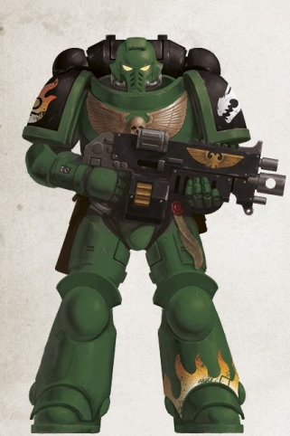

<!-- A0451-B0005 -->
**英文原文**

Legion Number:XVIII

<!-- /A0451-B0005 -->

<!-- A0451-B0006 -->

原译文

军团编号：XVII

**校订译文**

军团编号：XVIII（第十八军团）

<!-- /A0451-B0006 -->

<!-- A0451-B0007 -->
**英文原文**

Primarch:Vulkan

<!-- /A0451-B0007 -->

<!-- A0451-B0008 -->

原译文

原体：沃坎

**校订译文**

原体：沃坎

<!-- /A0451-B0008 -->

<!-- A0451-B0009 -->
**英文原文**

Homeworld:Nocturne

<!-- /A0451-B0009 -->

<!-- A0451-B0010 -->

原译文

家园世界：夜曲星

**校订译文**

母星：夜曲星

<!-- /A0451-B0010 -->

<!-- A0451-B0011 -->
**英文原文**

Fortress-Monastery:Prometheus

<!-- /A0451-B0011 -->

<!-- A0451-B0012 -->

原译文

要塞修道院：普罗米修斯

**校订译文**

要塞修道院：普罗米修斯

<!-- /A0451-B0012 -->

<!-- A0451-B0013 -->
**英文原文**

Chapter Master:Tu\`Shan

<!-- /A0451-B0013 -->

<!-- A0451-B0014 -->

原译文

战团长：图’杉

**校订译文**

战团长：图杉

<!-- /A0451-B0014 -->

<!-- A0451-B0015 -->
**英文原文**

Colours:Green, Black and Gold

<!-- /A0451-B0015 -->

<!-- A0451-B0016 -->

原译文

颜色：绿色，黑色和金色

**校订译文**

配色：绿色、黑色与金色

<!-- /A0451-B0016 -->

<!-- A0451-B0017 -->
**英文原文**

Specialty:Close Combat, Flame Weaponry, anti-armor

<!-- /A0451-B0017 -->

<!-- A0451-B0018 -->

原译文

专业：近战，火焰武器，反装甲

**校订译文**

专长：近战、火焰武器、反装甲作战

<!-- /A0451-B0018 -->

<!-- A0451-B0019 -->
**英文原文**

Battle Cry:Into the fires of battle, unto the anvil of war!

<!-- /A0451-B0019 -->

<!-- A0451-B0020 -->

原译文

战吼：投身于战火，铸炼于铁砧！

**校订译文**

战吼：投身于战火，铸炼于铁砧！

<!-- /A0451-B0020 -->

<!-- A0451-B0021 -->
**英文原文**

Successor Chapters:

<!-- /A0451-B0021 -->

<!-- A0451-B0022 -->

原译文

子战团：

**校订译文**

子战团：

<!-- /A0451-B0022 -->

<!-- A0451-B0023 -->

原译文

Black Dragons 黑龙

**校订译文**

Black Dragons 黑龙

<!-- /A0451-B0023 -->

<!-- A0451-B0024 -->

原译文

Black Vipers 黑色蝰蛇

**校订译文**

Black Vipers 黑色蝰蛇

<!-- /A0451-B0024 -->

<!-- A0451-B0025 -->

原译文

Covenant of Fire 火焰圣约

**校订译文**

Covenant of Fire 火焰圣约

<!-- /A0451-B0025 -->

<!-- A0451-B0026 -->

原译文

Dark Krakens 黑暗海妖

**校订译文**

Dark Krakens 黑暗海妖

<!-- /A0451-B0026 -->

<!-- A0451-B0027 -->
**英文原文**

Disciples of the Flames (de facto)

<!-- /A0451-B0027 -->

<!-- A0451-B0028 -->

原译文

火焰门徒（实际上）

**校订译文**

火焰门徒（事实上的子战团）

<!-- /A0451-B0028 -->

<!-- A0451-B0029 -->

原译文

Dragonspears 火龙长矛

**校订译文**

Dragonspears 火龙长矛

<!-- /A0451-B0029 -->

<!-- A0451-B0030 -->

原译文

Hammers of Nocturne 夜曲星之锤

**校订译文**

Hammers of Nocturne 夜曲星之锤

<!-- /A0451-B0030 -->

<!-- A0451-B0031 -->

原译文

Iron Drakes 钢铁龙兽

**校订译文**

Iron Drakes 钢铁龙兽

<!-- /A0451-B0031 -->

<!-- A0451-B0032 -->

原译文

Storm Giants 风暴巨人

**校订译文**

Storm Giants 风暴巨人

<!-- /A0451-B0032 -->

<!-- A0451-B0033 -->
## Homeworld 母星

原题：Homeworld 家园世界

<!-- /A0451-B0033 -->

<!-- A0451-B0034 -->
**英文原文**

The Salamanders hail from the harsh and hot Nocturne, though are also based upon that world's moon, Prometheus. The moon occupies an erratic orbit, thus causing great seasons of severe tectonic activity and weather disruption on Nocturne. The worst of these is known as the Time of Trial, when, once every fifteen Terran years, the moon passes so close that thousands of volcanoes erupt, their ash so thick it blots out the sun. With the ground gripped by constant earthquakes at the same time as this ash winter, much of Nocturne becomes effectively uninhabitable.

<!-- /A0451-B0034 -->

<!-- A0451-B0035 -->

原译文

火蜥蜴来自严酷而炎热的夜曲星，尽管它们也基于那个世界的卫星普罗米修斯。卫星占据了一个不稳定的轨道，因此在夜曲星上造成了严重的构造活动和天气混乱的季节。其中最糟糕的时期被称为“审判之时”，每十五年一次，卫星离行星如此之近，数千座火山爆发，火山灰如此之厚，遮住了太阳。在这个火山灰冬天的同时，地面不断发生地震，夜曲星的大部分地区实际上变得不适合居住。

**校订译文**

火蜥蜴来自环境严酷、酷热难耐的夜曲星，也在其卫星普罗米修斯上设有基地。这颗卫星的轨道不稳定，导致夜曲星周期性地遭受剧烈的地壳活动与气象灾变。最严重的时期称为“审判之时”：每隔十五个泰拉年，卫星就会极度接近夜曲星，引发数千座火山同时喷发，浓厚的火山灰遮天蔽日。火山灰造成的寒冬与持续不断的地震交织在一起，使夜曲星大部分地区几乎无法居住。

<!-- /A0451-B0035 -->

<!-- A0451-B0036 -->
**英文原文**

Rewards for enduring the Time of Trial can be great; the tectonic upheavals bring materials and ores to the surface of great value, and the aftermaths of such altered geography usually reveal new pockets of natural resources to be explored, mined or siphoned. This translates to vast wealth by Imperial standards, meaning that Nocturne's supplies of livestock and whatever items the forges of the Salamanders themselves cannot construct can be traded for with the Adeptus Mechanicus or other Imperial corporate bodies.

<!-- /A0451-B0036 -->

<!-- A0451-B0037 -->

原译文

忍受审判之时会带来巨大的回报；构造剧变将具有巨大价值的材料和矿石带到了地表，这种地理变化的后果通常会揭示出新的自然资源区，需要勘探、开采或抽取。按照帝国的标准，这意味着夜曲星的牲畜供应以及火蜥蜴铸造厂自己无法建造的任何物品都可以与机械神教或其他帝国全体团体进行交易。

**校订译文**

熬过审判之时也能带来丰厚回报：剧烈的地壳运动会将珍贵材料与矿石推到地表，地形变化后往往还会显露新的资源矿藏，可供勘探、开采或抽取。按帝国的标准，这是一笔巨大的财富。夜曲星因此可以用这些资源与机械修会或帝国的其他机构和商业团体交易，换取牲畜，以及火蜥蜴自身的锻造工坊无法生产的各种物品。

<!-- /A0451-B0037 -->

<!-- A0451-B0038 -->
**英文原文**

The Salamanders' fortress-monastery is located upon the giant moon, Prometheus, acting as the orbital dock for their space vessels. While it is permanently staffed, much of the Salamanders not on deployment can be found scattered over Nocturne, acting as the elders of the settlements from which they came; the Salamanders maintain close contact with their origins and see watching over their homeworld's citizens - and by extension, all people of the Imperium - as part of their duty.

<!-- /A0451-B0038 -->

<!-- A0451-B0039 -->

原译文

火蜥蜴的堡垒修道院位于巨大的卫星普罗米修斯上，是他们太空战舰的轨道码头。虽然它有常设人员，但大部分未部署的火蜥蜴分散在夜曲星，充当他们来自的定居点的长者；火蜥蜴与他们的起源保持密切联系，并将照顾他们家园世界的公民 — 以及帝国的所有人民 — 视为他们职责的一部分。

**校订译文**

火蜥蜴的要塞修道院位于巨大的卫星普罗米修斯上，同时充当战舰的轨道船坞。那里虽有常驻人员，但大多数没有出征任务的火蜥蜴都散居夜曲星，在自己的故乡聚落中担任长者。他们始终与出身之地保持密切联系，将守护母星居民乃至帝国所有人民视为职责的一部分。

<!-- /A0451-B0039 -->

<!-- A0451-B0040 -->
## History 历史

<!-- /A0451-B0040 -->

<!-- A0451-B0041 -->
### Formation 组建

原题：Formation 形成

<!-- /A0451-B0041 -->

<!-- A0451-B0042 -->
**英文原文**

Originally known as the XVIIIth Legion, the origins of what would become the Salamanders are largely shrouded in mystery. In order to protect the nascent Legiones Astartes from both hostile action and espionage, the origins and deployments of several early Legion gene-seeds are further classified beyond usual protocol. These Legion groups were formed and established largely in separation from the rest, and it is generally thought to a very specific end. The XVIIIth Legion, along with the VIth Legion and XXth Legion, comprised this group of proto-legions. That this 'trefoil' of three proto-Legions was somehow veiled from the rest during their creation and establishment was something known only to a few. Deliberate effort was made to distance these three legions from the others. There are none save the Emperor and a handful of his aides who know what the exact purpose behind this policy was. Sometime in its history the Legion was named the Dragon Warriors, but it was a name few knew or spoke of.

<!-- /A0451-B0042 -->

<!-- A0451-B0043 -->

原译文

最初被称为第十八军团，后来成为火蜥蜴的起源在很大程度上笼罩在神秘之中。为了保护新生的阿斯塔特军团免受敌对行动和间谍活动的侵害，几个早期军团基因种子的起源和部署被进一步分类，超出了通常的协议。这些军团团体在很大程度上是与其他团体分开组建和建立的，人们普遍认为这是为了一个非常具体的目的。第十八军团与第六军团和第二十军团一起组成了这一原初军团。这个由三个原初军团组成的“三叶草”在他们的创建和建立过程中不知何故被其他军团所掩盖，这只有少数人知道。人们刻意努力使这三个军团与其他军团保持距离。除了帝皇和他的少数助手，没有人知道这项政策背后的确切目的是什么。在其历史上的某个时候，军团被命名为火龙勇士，但很少有人知道或谈论这个名字。

**校订译文**

火蜥蜴最初称为第十八军团，其起源大多笼罩在迷雾中。为了保护新生的阿斯塔特军团免遭敌对攻击与间谍渗透，部分早期军团基因种子的来源与部署情况被列为超出常规保密等级的机密。这些军团基本上独立于其他军团组建，一般认为是为实现某种特定目的。第十八、第六和第二十军团正是这样一组早期军团。极少有人知道，这三个被称为“三叶草”的军团在创建和组建期间，始终以某种方式向其他军团隐去了自身情况。有关方面有意让他们与其他军团保持距离；除了帝皇与少数助手，无人知晓这项安排的确切目的。第十八军团曾在某个时期获名“火龙勇士”，但知道或提起这个名字的人寥寥无几。

<!-- /A0451-B0043 -->

<!-- A0451-B0044 图片 -->
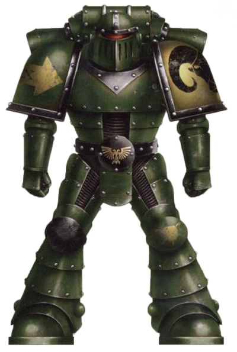

<!-- A0451-B0045 -->

原译文

Great Crusade-era Salamanders Space Marine 大远征时期火蜥蜴星际战士

**校订译文**

Great Crusade-era Salamanders Space Marine 大远征时期火蜥蜴星际战士

<!-- /A0451-B0045 -->

<!-- A0451-B0046 -->
**英文原文**

The Legion's first recorded significant action was during the Assault on the Tempest Galleries against the Ethnarchy during the Unification Wars. Achieving victory against impossible odds, though the Legion's active strength was reduced from 26,000 to around 1,000. Nonetheless they achieved a place of glory in the Imperial military establishment, and this helped the Legion rapidly rebuild with new waves of recruits and wargear. But the losses from the Tempest Galleries battle still lingered, and as a result the Legion was often deployed piecemeal, with many Legionaries of the XVIIIth spread throughout numerous warzones. In particular, they were used to deal with sudden threats that may appear to the rear, such as Space Hulks or Xenos pirates. Seldom did the XVIIIth fight on a battlefield of its own choosing, but they nonetheless received extensive battle honors. Meanwhile, it is believed that the Legion's Primarch Vulkan did not immediately reunite with his forces upon his rediscovery, instead serving alongside the Emperor for several years.

<!-- /A0451-B0046 -->

<!-- A0451-B0047 -->

原译文

军团的第一次有记录的重大行动是在统一战争期间对风暴回廊的袭击。尽管军团的现役人数从26000人减少到1000人左右，但还是克服了不可能的困难取得了胜利。尽管如此，他们在帝国军事机构中取得了辉煌的地位，这有助于军团迅速重建新一轮的新兵和战备。但风暴回廊之战的损失仍然存在，因此军团经常被零星部署，第十八军团的许多军团成员分散在许多战区。特别是，它们被用来应对可能出现在后方的突然威胁，如太空废船或异型海盗。第十八军团的战斗很少在自己选择的战场上进行，但他们仍然获得了广泛的战斗荣誉。与此同时，据信，军团的原体沃坎在被重新发现后并没有立即与他的部队重聚，而是与帝皇并肩作战了几年。

**校订译文**

军团有记载的首次重大行动，是统一战争期间对族政国（Ethnarchy）发动的风暴回廊突击。他们在胜算渺茫的情况下取得了胜利，现役兵力却从二万六千人锐减至约一千人。这一战为他们赢得了帝国军中的崇高声望，也使军团得以迅速获得新兵与装备，开始重建。然而，风暴回廊之战留下的创伤迟迟未愈，第十八军团此后经常被拆分部署，战士分散于众多战区，尤其负责应付突然出现在后方的太空废船、异形海盗等威胁。他们很少能够自行选择战场，却仍赢得了众多战斗荣誉。与此同时，据说原体沃坎在被寻回后，并未立刻与军团会合，而是先在帝皇身边服役了数年。

<!-- /A0451-B0047 -->

<!-- A0451-B0048 -->
### The Great Crusade 大远征

<!-- /A0451-B0048 -->

<!-- A0451-B0049 -->
**英文原文**

When Vulkan came to his Legion, it was in the hour of their need. The XVIII, led by their Lord Commander Cassian Vaughn had become embroiled in the defence of a cluster of worlds near the Taras Division against a horde of Orks. The XVIII was the only Space Marine Legion able to respond to the crisis. Fighting against vast and overwhelming odds, 19,000 Space Marines held out against millions of Ork raiders and their fleet of Roks. The actions of the Legion had allowed the evacuations of three entire planetary populations to the nominal safety of the Taras System, but at a terrible cost. Their Primarch, however, learning of their plight refused to stand by and instead joined the fray.

<!-- /A0451-B0049 -->

<!-- A0451-B0050 -->

原译文

当沃坎来到他的军团时，正是他们需要的时候。由他们的领主指挥官卡西安·沃恩领导的第十八军团卷入了塔拉斯分部附近一组世界的防御，以对抗一群欧克。第十八军团是唯一能够应对这场危机的星际战士军团。尽管面临巨大而压倒性的困难，19000名星际战士仍顽强抵抗了数百万欧克袭击者及其巨石舰队。军团的行动使三个行星的人口得以疏散到塔拉斯星系的名义安全地带，但代价惨重。然而，他们的原体在得知他们的困境后拒绝袖手旁观，而是加入了战斗。

**校订译文**

沃坎来到军团时，恰逢他们最需要他的时刻。第十八军团在领主指挥官卡西安·沃恩率领下，正抵御欧克大军，保卫塔拉斯分区附近的一组世界。他们是唯一能够应对这场危机的星际战士军团：一万九千名战士顶住了数百万欧克袭击者及其巨石舰队的猛烈攻势。军团以惨重代价，为三个行星的全部居民争取到了撤往相对安全的塔拉斯星系的机会。沃坎得知子嗣的困境后，不肯袖手旁观，亲自投入战斗。

<!-- /A0451-B0050 -->

<!-- A0451-B0051 图片 -->
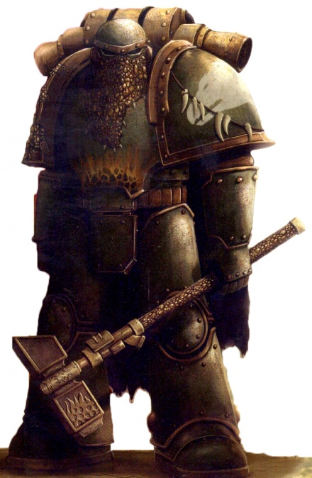

<!-- A0451-B0052 -->

原译文

Salamanders legionary 火蜥蜴军团士兵

**校订译文**

Salamanders legionary 火蜥蜴军团士兵

<!-- /A0451-B0052 -->

<!-- A0451-B0053 -->
**英文原文**

When Vulkan arrived he did not do so alone, he brought with him 3,000 new initiates and equipment from Nocturne. The reinforcements brutally fell upon the Orks, spurring the surviving Space Marines to counterattack. Caught between this hammer and anvil of savagery that over-matched their own, the Ork horde was broken and put to flight, and the survivors were relentlessly pursued and consumed by fire. In the aftermath, the two halves of the XVIII Legion met and were unified when Vulkan finally revealed himself to his sons. The survivors of the XVIIIth Legion knelt immediately, but Vulkan bid them rise, saying that all his sons were equals and he was no petty king needing shows of obedience. Instead, it was he who knelt in honour of the lives they had saved and the price they had paid. Then, seeking out the mortally wounded Lord Commander Vaughn, he conferred the formal transfer of the Legion's mastery by presenting the fallen warrior with the broken power klaw of the slain Ork Warlord.

<!-- /A0451-B0053 -->

<!-- A0451-B0054 -->

原译文

当沃坎到达时，他并不是独自一人，他从夜曲星带了3000名新信徒和装备。增援部队残酷地袭击了欧克，促使幸存的星际战士进行反击。被夹在这把比他们自己更野蛮的铁锤和铁砧之间，欧克部落被击溃并逃跑，幸存者被无情地追捕并被大火吞噬。之后，第十八军团的两半相遇并统一，沃坎最终向他的子嗣透露了自己的身份。第十八军团的幸存者立即跪下，但沃坎命令他们起来，说他所有的子嗣都是平等的，他不是需要服从的微小国王。相反，是他跪下纪念他们挽救的生命和付出的代价。然后，他找到了身受重伤的领主指挥官沃恩，向这位倒下的战士赠送了被杀的欧克军阀的破碎的动力爪，正式移交了军团的控制权。

**校订译文**

沃坎并非独自前来：他从夜曲星带来了三千名新兵和大批装备。援军猛攻欧克，鼓舞幸存的星际战士发动反击。两面夹击的攻势如铁锤与铁砧，凶猛程度更胜欧克。绿皮大军被击溃，仓皇逃窜，残部在穷追不舍的追击中被烈焰吞噬。战后，第十八军团的两支部队会师，沃坎终于向子嗣表明身份，将他们团结在一起。原军团的幸存者当即跪下，沃坎却让他们起身：他的所有子嗣都是平等的，他也不是需要臣民行礼效忠的小小君王。随后，他反而跪下，向他们挽救的生命和为此付出的牺牲致敬。他又找到身负致命伤的领主指挥官沃恩，将被杀欧克军阀的断裂动力爪交给这位倒下的战士，以这一仪式正式接掌军团。

<!-- /A0451-B0054 -->

<!-- A0451-B0055 -->
**英文原文**

The Salamanders were apparently reorganised by Vulkan upon his discovery and assumption of command, with that organisation said to still be in effect in their current form, with seven companies to a Chapter, each company being founded by the seven different great settlements of Nocturne and commanded by a Captain from that settlement. The number of Chapters in the Great Crusade-era Legion is currently unknown, but they had at least 34 Companies. The Salamanders are often said to have "always been" the smallest legion, though other sources show them as being slightly larger than the Thousand Sons.

<!-- /A0451-B0055 -->

<!-- A0451-B0056 -->

原译文

沃坎发现并接管指挥权后，显然对火蜥蜴进行了重组，据说该组织仍以目前的形式表现，一个战团有七个连队，每个连队由夜曲星的七个不同大定居点建立，并由该定居点的一名连长指挥。大远征时期军团的战团数目前尚不清楚，但他们至少有34个连队。人们常说火蜥蜴军团“一直是”最小的军团，尽管其他资料显示他们比千子军团稍大。

**校订译文**

沃坎被寻回并接掌指挥权后，似乎重新编组了火蜥蜴。据说今天的编制仍保留着当时的形式：每个战团下辖七个连队，分别由夜曲星七大聚落之一组建，并由出身该聚落的连长指挥。大远征时期军团究竟下辖多少个战团，如今已不得而知，但至少拥有三十四个连队。火蜥蜴常被称为“一直以来规模最小的军团”，不过另一些资料指出，他们的规模略大于千子军团。

<!-- /A0451-B0056 -->

<!-- A0451-B0057 -->
**英文原文**

Nobles campaigns of the Salamanders waged during the Great Crusade were the Compliance of Kharaatan and Conquest of One-Five-Four Four.

<!-- /A0451-B0057 -->

<!-- A0451-B0058 -->

原译文

大远征期间，火蜥蜴的著名战役是哈拉坦的征服和1544的征服。

**校订译文**

火蜥蜴在大远征期间的著名战役包括哈拉坦归顺战役，以及对“一五四四”（One-Five-Four Four）的征服。

<!-- /A0451-B0058 -->

<!-- A0451-B0059 -->
### Horus Heresy 荷鲁斯之乱

原题：Horus Heresy 荷鲁斯叛乱

<!-- /A0451-B0059 -->

<!-- A0451-B0060 -->
**英文原文**

The Salamander's role during the Horus Heresy is not well known to Imperial Scholars; what is for certain is that the legion, along with the Iron Hands and Raven Guard, was part of the first wave of attackers during the battle of Isstvan V. After the announcement of Horus's treachery and the destruction of Isstvan III, the Emperor ordered seven Legions of Space Marines to attack the forces serving his former son and friend. But among those seven Legions, four were already traitors.

<!-- /A0451-B0060 -->

<!-- A0451-B0061 -->

原译文

帝国学者并不清楚火蜥蜴在荷鲁斯叛乱中的作用；可以肯定的是，该军团与钢铁之手和暗鸦守卫一起，是伊斯塔万五号之战中第一波袭击者的一部分。在荷鲁斯的背叛和伊斯塔万三号的毁灭被宣布后，帝皇命令七支星际战士军团袭击为他前儿子和朋友服务的部队。但在这七个军团中，有四个已经是叛徒了。

**校订译文**

帝国学者对火蜥蜴在荷鲁斯之乱中的经历了解有限。可以确定的是，在伊斯塔万五号之战中，他们与钢铁之手、暗鸦守卫一同组成了第一波进攻部队。荷鲁斯的背叛与伊斯塔万三号的毁灭公之于世后，帝皇命令七个星际战士军团，进攻这位昔日子嗣与友人麾下的部队。然而，七个军团中已有四个叛变。

<!-- /A0451-B0061 -->

<!-- A0451-B0062 图片 -->
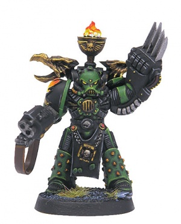

<!-- A0451-B0063 -->

原译文

Heresy-Era Salamanders Space Marine 叛乱时期火蜥蜴星际战士

**校订译文**

Heresy-Era Salamanders Space Marine 叛乱时期火蜥蜴星际战士

<!-- /A0451-B0063 -->

<!-- A0451-B0064 -->
**英文原文**

The initial landing force fell into a trap and, despite their martial skills, the three loyal Legions were forced to begin a tactical withdrawal toward their landing site, which had been fortified by the four traitor legions forming the second wave. At this moment the second wave opened fire on the retreating Marines, crushing them between the hammer of Horus's forces and the anvil of the fortified drop site. Despite a heroic defence, the three loyal Legions were practically destroyed; all but a handful of battle brothers fell on that fateful day. First Captain Artellus Numeon managed to leave a scattered group of survivors off the planet, but their Primarch was missing.

<!-- /A0451-B0064 -->

<!-- A0451-B0065 -->

原译文

最初的登陆部队掉入了陷阱，尽管他们的军事技能很高，但三个忠诚的军团被迫开始战术撤退到他们的登陆点，该登陆点已被组成第二波的四个叛徒军团加固。此时，第二波向撤退的战士开火，将他们压在荷鲁斯部队的铁锤和设防登陆点的铁砧之间。尽管进行了英勇的防御，但三支忠诚的军团几乎被摧毁；在那决定性的一天，除了少数战斗兄弟外，其他人都倒下了。第一连长阿泰勒斯·努梅昂设法将一群分散的幸存者留在了行星上，但他们的原体不见了。

**校订译文**

首批登陆部队落入陷阱。三个忠诚军团虽然作战精湛，仍被迫开始战术撤退，向登陆区退去；组成第二波部队的四个叛徒军团已经在那里构筑了防御工事。就在此时，第二波部队向撤回的战士开火，将他们夹在荷鲁斯大军的铁锤与坚固登陆阵地的铁砧之间。尽管奋勇抵抗，三个忠诚军团仍几乎全军覆没，只有极少数战斗兄弟熬过了那命运攸关的一天。第一连连长阿泰勒斯·努梅昂设法带领一批零散的幸存者逃离行星，但原体下落不明。

**校注：** 英文“leave a scattered group ... off the planet”句法有误；结合 off the planet，应为带幸存者离开行星，原译“留在行星上”方向相反。

<!-- /A0451-B0065 -->

<!-- A0451-B0066 -->
**英文原文**

After this sad defeat the Salamanders, as well as the other two betrayed Legions were largely unable to perform any tasks the Emperor had planned for them and spent much of the rest of the time of the Heresy rebuilding their forces. Vulkan was briefly made a captive of Night Lords Primarch Konrad Curze, but despite multiple executions the Night Haunter could not figure out a way to kill the Perpetual Primarch. Eventually Vulkan was able to escape, and along with scattered survivors of his Legion they reorganized in Imperium Secundus under Roboute Guilliman. There they came across the shattered body and mind of Vulkan, who had his sanity restored after being stabbed by John Grammaticus wielding the Fulgurite, but apparently died in the process. The Salamanders on Macragge thought Vulkan dead and placed him in the stasis-capsule Unbound Flame to lay in state, in preparation for funerary rites to be undertaken by his Legion. During this time, the casket was given an honour guard, which some of their number believed they heard a heartbeat from. Later, the Salamanders led by Artellus Numeon brought Vulkan back to Nocturne but were pursued by the Death Guard. After a brief but fierce battle, the Salamanders were able to resurrect Vulkan after Numeon provided himself as the final sacrifice.

<!-- /A0451-B0066 -->

<!-- A0451-B0067 -->

原译文

在这场惨痛的失败之后，火蜥蜴以及另外两个被背叛的军团基本上无法执行帝皇为他们计划的任何任务，并在叛乱的大部分时间里重建了他们的部队。沃坎曾短暂地被午夜领主原体康拉德·科兹俘虏，但尽管多次被处决，午夜幽魂仍无法找到杀死这位永生者原体的方法。最终，沃坎得以逃脱，并与他的军团中分散的幸存者一起，在罗伯特·基里曼的指挥下，在第二帝国进行了重组。在那里，他们遇到了沃坎破碎的身心，他在被挥舞着雷击石的约翰·格拉马迪库斯刺伤后恢复了理智，但显然在此过程中死亡。马库拉格上的火蜥蜴认为沃坎已经死了，并将他放在无拘之火的停滞舱中，以使他处于静滞状态，为他的军团举行的葬礼做准备。在此期间，棺材旁有一支荣誉卫队，他们中的一些人认为他们听到了他的心跳。后来，由阿泰勒斯·努梅昂率领的火蜥蜴将沃坎带回了夜曲星，但遭到了死亡守卫的追击。经过一场短暂但激烈的战斗，火蜥蜴在努梅昂献出自己作为最后的祭品后，得以复活沃坎。

**校订译文**

这场惨败后，火蜥蜴与另外两个遭到背叛的军团基本无力执行帝皇原先赋予的任务，叛乱余下的大部分时间都用于重建。沃坎一度沦为午夜领主原体康拉德·科兹的俘虏；尽管反复处决他，午夜幽魂始终无法真正杀死这位永生者原体。沃坎最终逃脱，火蜥蜴零散的幸存者则在罗保特·基里曼治下的第二帝国重新集结。他们在那里遇见了身心俱已崩溃的沃坎。约翰·格拉马迪库斯用雷击石刺中他，使他恢复神志，他却似乎也因此死去。马库拉格上的火蜥蜴以为原体已经死亡，将他安置在名为“无拘之火”的静滞舱中停灵，准备由军团为他举行葬礼。灵柩旁设有荣誉卫队，其中有人声称听见了心跳。后来，阿泰勒斯·努梅昂率火蜥蜴将沃坎运回夜曲星，途中却遭到死亡守卫追击。经历一场短暂而激烈的战斗后，努梅昂献出自己，成为最后的祭品，火蜥蜴终于使沃坎复活。

**校注：** 原文先称沃坎与幸存者在第二帝国重组，紧接着又说他们在那里遇到身心崩溃的沃坎，叙述衔接存在矛盾；译文保留逃脱、幸存者重组与相遇三个事件，不据此断言沃坎主持重组。lay in state 指停灵供瞻仰，不是解释静滞舱功能。

<!-- /A0451-B0067 -->

<!-- A0451-B0068 -->
**英文原文**

Following his resurrection, Vulkan was discovered by three Salamanders (Atok Abidemi, Barek Zytos, and Igen Gargo) but forbade any else of knowing of his rebirth. Instead, Vulkan led the three, dubbed his Draaksward, into the depths of Nocturne where they entered the Webway. During a perilous journey guided by the Talisman of Seven Hammers, Vulkan and the trio eventually arrived at the Imperial Palace. There, Vulkan met with the Emperor and learned of his purpose to oversee the activation of the Talisman, and the destruction of Terra it would bring, should Horus emerge victorious in the coming struggle.

<!-- /A0451-B0068 -->

<!-- A0451-B0069 -->

原译文

复活后，沃坎被三名火蜥蜴（阿托克·阿比德米、巴雷克·兹托斯和伊根·伽戈）发现，但禁止任何其他人知道他的重生。相反，沃坎带领这三个人，被称为他的火龙之剑，进入了夜曲星的深处，在那里他们进入了网道。在七锤护身符的带领下，沃坎和三人最终抵达了皇宫。在那里，沃坎会见了帝皇，并了解到他的目的是监督护身符的激活，以及如果荷鲁斯在即将到来的战斗中获胜，它将带来泰拉的毁灭。

**校订译文**

沃坎复活后，阿托克·阿比德米、巴雷克·兹托斯与伊根·伽戈三名火蜥蜴发现了他。他禁止三人向任何其他人透露此事，随后率领这三名“火龙之剑护卫”深入夜曲星内部，进入网道。在七锤护身符的指引下，一行人历经险途，最终抵达帝皇皇宫。沃坎在那里觐见帝皇，得知自己的使命：如果荷鲁斯赢得即将到来的决战，他必须负责启动护身符，让泰拉随之毁灭。

<!-- /A0451-B0069 -->

<!-- A0451-B0070 图片 -->
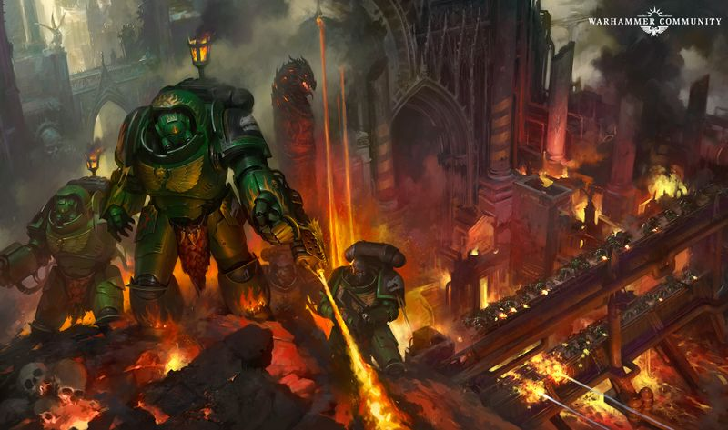

<!-- A0451-B0071 -->

原译文

The Salamanders at war 战争中的火蜥蜴

**校订译文**

The Salamanders at war 战争中的火蜥蜴

<!-- /A0451-B0071 -->

<!-- A0451-B0072 -->
**英文原文**

Meanwhile, Salamanders (along with Iron Hands and Raven Guard) survivors of the Dropsite Massacre based on the Sisypheum began a campaign of vengeance against those who betrayed them, striking at Fulgrim and Perturabo on the Crone World of Iydris as well as Alpha Legion outposts. Other Salamanders survivors began a similar guerrilla war against the traitors, pershaps most notably those under Shadrak Meduson. One force of Salamanders, supported by other Shattered Legion members, ventured to Isstvan V on the Ebon Drake, where they recovered Cassian Vaughn (known as Cassian Dracos since being entombed in a Dreadnought). The former Lord Commander assumed command of the mixed band and reorganized them as Disciples of the Flames. The Disciples went on to fight in the Mezoan Campaign, saving Mezoa from traitors and absorbing a large contingent of Iron Warriors. Having morphed into an almost religious cult, the Disciples of the Flames defended Mezoa and fought Horus' armies for the rest of the Heresy, but their ultimate fate remains unclear.

<!-- /A0451-B0072 -->

<!-- A0451-B0073 -->

原译文

与此同时，基于西西弗姆号的登陆点大屠杀的火蜥蜴（以及钢铁之手和暗鸦守卫）幸存者开始了一场针对背叛他们的人的复仇战役，袭击了伊德瑞斯老妪世界的福格瑞姆和佩图拉博以及阿尔法军团前哨。其他火蜥蜴幸存者开始了一场类似的游击战，对抗叛徒，也许最著名的是沙德拉克·梅杜森领导下的部队。一支火蜥蜴部队在其他破碎军团成员的支持下，冒险通过黑檀之龙号前往伊斯塔万五号，在那里他们找到了卡西安·沃恩（自从被埋葬在无畏中后被称为卡西安·德拉科斯）。前领主指挥官接管了混合小队的指挥权，并将他们重组为火焰门徒。门徒继续在梅佐亚战役中作战，将梅佐安从叛徒手中拯救出来，并吸收了一大批钢铁勇士。火焰门徒已经演变成一个近乎宗教的教派，他们保卫了梅佐亚，并为叛乱的其余部分与荷鲁斯的军队作战，但他们的最终命运尚不清楚。

**校订译文**

与此同时，驻于西西弗姆号的登陆点大屠杀幸存者——包括火蜥蜴、钢铁之手和暗鸦守卫——向背叛他们的人展开复仇。他们曾在老妪世界伊德瑞斯袭击福格瑞姆与佩图拉博，也袭击过阿尔法军团的前哨。其他火蜥蜴幸存者同样对叛徒发动游击战，其中最著名的或许是沙德拉克·梅杜森麾下的部队。一支火蜥蜴部队在其他破碎军团战士协助下，搭乘黑檀之龙号冒险重返伊斯塔万五号，找回了卡西安·沃恩；自被安置进无畏机甲后，他便以“卡西安·德拉科斯”之名为人所知。这位前领主指挥官接掌混编部队，将其重组为火焰门徒。门徒随后参加梅佐亚战役，从叛徒手中保住梅佐亚，并吸收了一支规模可观的钢铁勇士部队。他们逐渐演变成近乎宗教团体的组织，在叛乱余下的岁月里保卫梅佐亚、对抗荷鲁斯大军，最终命运却仍不明。

<!-- /A0451-B0073 -->

<!-- A0451-B0074 -->
**英文原文**

The Salamanders on Nocturne meanwhile continued to wage war on the traitors even as the Siege of Terra raged, battling the Emperor's Children in the Pale Stars following the destruction of Chemos.

<!-- /A0451-B0074 -->

<!-- A0451-B0075 -->

原译文

与此同时，夜曲星上的火蜥蜴继续对叛徒发动战争，即使在泰拉围城肆虐之际，在彻莫斯被摧毁后，他们仍在苍白群星与帝皇之子作战。

**校订译文**

即使泰拉围城战正酣，夜曲星上的火蜥蜴仍在与叛徒交战；在彻莫斯遭到毁灭后，他们曾在苍白群星迎战帝皇之子。

<!-- /A0451-B0075 -->

<!-- A0451-B0076 -->
### Post-Heresy 叛乱后

<!-- /A0451-B0076 -->

<!-- A0451-B0077 -->
### Reforging 重铸

<!-- /A0451-B0077 -->

<!-- A0451-B0078 -->
**英文原文**

Whilst the Salamanders altered their squad-level organisation to follow the strictures of the new Codex Astartes, they were able to retain much else of their Legion organisation - some say because there were too few of them to split into successor Chapters. Until the coming of Primaris Space Marines and the Ultima Founding of M42, the Salamanders were officially reckoned to have no descendants, though several Imperial scholars have pointed out various similarities in unit markings and tactical dogma in the Storm Giants and Black Dragons Chapters. It is possible that these Chapters were created at some unknown, later date from stockpiled gene-seed.

<!-- /A0451-B0078 -->

<!-- A0451-B0079 -->

原译文

虽然火蜥蜴改变了他们的小队级组织，以遵循新的阿斯塔特圣典的限制，但他们能够保留其军团组织的其他大部分内容 — 有人说，因为他们的人数太少，无法分成子战团。在原铸星际战士和M42的极限建军到来之前，火蜥蜴被正式认为没有子战团，尽管一些帝国学者指出了风暴巨人和黑龙粘贴中单位标记和战术教条的各种相似之处。这些战团可能是在某个未知的、后来的日期从储存的基因种子中创建的。

**校订译文**

火蜥蜴依照新颁布的《阿斯塔特圣典》调整了小队编制，却保留了军团时代的许多其他组织形式。有人认为，这是因为他们人数太少，无法再拆分出子战团。在原铸星际战士问世及第四十二个千年的极限建军之前，帝国官方一直认为火蜥蜴没有子战团。不过，一些帝国学者指出，风暴巨人与黑龙战团在部队标识和战术理念上与他们有多处相似。这些战团可能是后来某个不明时期，利用封存的火蜥蜴基因种子创建的。

<!-- /A0451-B0079 -->

<!-- A0451-B0080 图片 -->
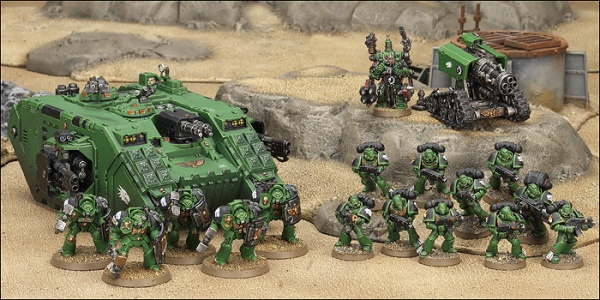

<!-- A0451-B0081 -->

原译文

Salamanders 火蜥蜴

**校订译文**

Salamanders 火蜥蜴

<!-- /A0451-B0081 -->

<!-- A0451-B0082 -->
**英文原文**

According to the Dark Krakens member Patara, a large number of Salamanders Successor Chapters were created during the Ultima Founding. His Ultima Chapter was not given the exact number of Successors, though, and he only knew of the Dragonspears and Iron Drakes.

<!-- /A0451-B0082 -->

<!-- A0451-B0083 -->

原译文

根据黑暗海妖成员帕塔拉的说法，在极限建军期间创建了大量的火蜥蜴子战团。然而，他的极限战团并没有给出子战团的确切成员，他只知道火龙长矛和钢铁龙兽。

**校订译文**

据黑暗海妖成员帕塔拉所说，极限建军时创建了大量火蜥蜴子战团。然而，他所属的战团虽也诞生于极限建军，却并未获知这些子战团的确切数量；他只知道火龙长矛与钢铁龙兽。

<!-- /A0451-B0083 -->

<!-- A0451-B0084 -->
**英文原文**

Oft-considered the smallest Legion, the casualties of the Horus Heresy, plus their own highly stringent recruitment and indoctrination processes made not only their rebuilding seemingly glacial, but resulted in them coming in under Codex-approved strength for a single Codex Chapter. In accordance with Vulkan' original reorganisation of the Legion, the Salamanders Chapter is formed of only 7 permanent companies; each one nominally staffed at a little over the Codex-approved 100 Astartes. Nevertheless, the sons of Vulkan were able to forge themselves anew, and their steel has ever since been drawn in the defence of the Imperium of Man.

<!-- /A0451-B0084 -->

<!-- A0451-B0085 -->

原译文

通常被认为是最小的军团，荷鲁斯叛乱的伤亡，再加上他们自己高度严格的招募和教育过程，不仅使他们的重建看起来很缓慢，而且导致他们以圣典批准的单一圣典战团的兵力进入。根据沃坎对军团的最初重组，火蜥蜴战团仅由7个永久连队组成；每一个的名义人员配备略高于圣典批准的100名阿斯塔特。然而，沃坎的子嗣能够重铸自己，他们的钢铁从那时起就被用来保卫人类帝国。

**校订译文**

火蜥蜴常被认为是规模最小的军团。荷鲁斯之乱造成的伤亡，加上其极为严苛的招募和教化程序，使重建进展异常缓慢，兵力甚至不足《圣典》规定的一个标准战团。依照沃坎最初重组军团时的安排，火蜥蜴战团只设七个常备连，每连名义人数略高于《圣典》规定的一百名阿斯塔特。尽管如此，沃坎的子嗣依然将自身重新锻造成军，此后始终拔剑守护人类帝国。

<!-- /A0451-B0085 -->

<!-- A0451-B0086 -->
**英文原文**

In the absence of Vulkan, the Captain of the First Company is considered the Chapter Master. This position is seen as a regency, however, and is occupied in the belief that it will one day be relinquished to the true holder of the position.

<!-- /A0451-B0086 -->

<!-- A0451-B0087 -->

原译文

在沃坎缺席的情况下，第一连队的连长被视为战团长。然而，这一职位被视为摄政，并相信总有一天会被交给职位的真正持有者。

**校订译文**

沃坎不在时，第一连连长被视为战团长。不过，这个职位带有摄政性质；任职者相信，总有一天必须将它交还给真正的主人。

<!-- /A0451-B0087 -->

<!-- A0451-B0088 -->
**英文原文**

In the ten thousand years since Vulkan's disappearance, the Salamanders have perpetually sought out his artefacts, most of all the Forgefather of the Chapter. This used to be solitary work for the Salamanders, but in recent years thanks to the Ultima Founding several successor chapters of the Salamanders such as the Hammers of Nocturne and Covenant of Fire have also joined the hunt.

<!-- /A0451-B0088 -->

<!-- A0451-B0089 -->

原译文

在沃坎失踪后的一万年里，火蜥蜴一直在寻找他的造物，尤其是战团的铸造之父。这曾经是火蜥蜴的一项单独工作，但近年来，由于极限建军，火蜥蜴的几个子战团，如夜曲星之锤和火焰圣约，也加入了狩猎。

**校订译文**

沃坎失踪后的一万年间，火蜥蜴始终在寻找他留下的造物，其中以战团的铸造之父最为执着。过去，这项使命由火蜥蜴独自承担；近年来，随着极限建军，夜曲星之锤、火焰圣约等子战团也加入了搜寻。

<!-- /A0451-B0089 -->

<!-- A0451-B0090 图片 -->
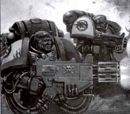

<!-- A0451-B0091 -->

原译文

Salamanders in action 行动中的火蜥蜴

**校订译文**

Salamanders in action 行动中的火蜥蜴

<!-- /A0451-B0091 -->

<!-- A0451-B0092 -->
### Recent Events 近世事件

原题：Recent Events 当前事件

<!-- /A0451-B0092 -->

<!-- A0451-B0093 -->
**英文原文**

???.M31 - The Hunt For Bile. Vulkan himself leads a hunt for Fabius Bile after learning of the horrors inflicted upon the civilians of Terra by the Emperor's Children during the final stages of the Heresy.

<!-- /A0451-B0093 -->

<!-- A0451-B0094 -->

原译文

拜尔狩猎。沃坎在得知叛乱最后阶段帝皇之子给泰拉平民带来的恐怖后，亲自领导了对法比乌斯·拜尔的追捕。

**校订译文**

???.M31——追猎拜尔。沃坎得知帝皇之子在叛乱末期对泰拉平民犯下的暴行后，亲自率队追捕法比乌斯·拜尔。

<!-- /A0451-B0094 -->

<!-- A0451-B0095 -->

原译文

544.M32 - The War of the Beast 野兽战争

**校订译文**

544.M32 - The War of the Beast 野兽战争

<!-- /A0451-B0095 -->

<!-- A0451-B0096 -->
**英文原文**

M35 - Commorragh Raid. After the strike cruiser Forgehammer is disabled by the Dark Eldar and brought to Commoragh as a prize, a rescue force of Salamanders, Howling Griffons, and Silver Skulls invade the Dark City. The operation is costly but successful.

<!-- /A0451-B0096 -->

<!-- A0451-B0097 -->

原译文

科摩罗突袭。在打击巡洋舰铸锤号被黑暗灵族摧毁并作为战利品带到科摩罗后，一支由火蜥蜴、咆哮狮鹫和银色骷髅组成的救援部队入侵了黑暗之城。行动代价高昂，但很成功。

**校订译文**

M35——科摩罗突袭。打击巡洋舰铸锤号被黑暗灵族击瘫，作为战利品拖入科摩罗。火蜥蜴、咆哮狮鹫与银色颅骨组成救援部队，攻入黑暗之城。行动付出了高昂代价，但最终成功。

<!-- /A0451-B0097 -->

<!-- A0451-B0098 -->
**英文原文**

M36 - The War of Flames. The Salamanders battle Perigno, the right-hand man of Goge Vandire.

<!-- /A0451-B0098 -->

<!-- A0451-B0099 -->

原译文

火焰战争。火蜥蜴与高戈·范迪尔的右手佩里尼奥作战。

**校订译文**

M36——火焰战争。火蜥蜴与高戈·范迪尔的得力助手佩里尼奥交战。

<!-- /A0451-B0099 -->

<!-- A0451-B0100 -->
**英文原文**

M38 - repelling of Daemon incursion on a Shrine World Innocence III. Daemons were successfully purged.

<!-- /A0451-B0100 -->

<!-- A0451-B0101 -->

原译文

击退了恶魔对圣地世界无罪三号的入侵。恶魔被成功净化。

**校订译文**

M38——火蜥蜴击退对圣地世界无罪三号的恶魔入侵，成功肃清恶魔。

<!-- /A0451-B0101 -->

<!-- A0451-B0102 -->
**英文原文**

533.M39 - The Fires of Phaistos. The entire Salamanders chapter mobilizes to defend the Cardinal World of Phaistos Osiris from Ork invasion. Together with an army of trained scholars, the Salamanders set an intricate and subtle series of traps and ambushes to destroy the Ork force, culminating in the Ork assault on the capital city Sanctis's Great Basilica, which was countered by flooding the city with promethium, which was subsequently set alight, destroying the majority of the Ork invasion.

<!-- /A0451-B0102 -->

<!-- A0451-B0103 -->

原译文

菲斯托斯之焰。整个火蜥蜴战团动员起来，保卫菲斯托斯·奥西里斯红衣主教世界免受欧克的入侵。火蜥蜴与一群训练有素的学者一起，设置了一系列复杂而微妙的陷阱和伏击来摧毁欧克的部队，最终导致欧克对首都桑蒂斯大教堂的袭击，并用钷素淹没了这座城市，随后被点燃，摧毁了欧克入侵的大部分。

**校订译文**

533.M39——菲斯托斯之焰。火蜥蜴全战团出动，抵御欧克对红衣主教世界菲斯托斯·奥西里斯的入侵。他们与一支由受过训练的学者组成的军队并肩作战，布置精巧隐秘的连环陷阱与伏击，逐步消灭敌军。战事的高潮是欧克进攻首都桑蒂斯的大教堂：守军以大量钷素灌入城中，随后将其点燃，一举烧毁了大部分入侵部队。

<!-- /A0451-B0103 -->

<!-- A0451-B0104 -->

原译文

???.M40 - The Battle of Parshamesh. 帕尔沙梅什之战

**校订译文**

???.M40 - The Battle of Parshamesh. 帕尔沙梅什之战

<!-- /A0451-B0104 -->

<!-- A0451-B0105 -->

原译文

793.M40 - The Salamanders aid of Orbulac 奥布拉克火蜥蜴救援

**校订译文**

793.M40 - The Salamanders aid of Orbulac 火蜥蜴驰援奥布拉克

<!-- /A0451-B0105 -->

<!-- A0451-B0106 -->
**英文原文**

???.M41 - Vulkan He'stan leads half of the third company aboard the Space Hulk Grim Scythe

<!-- /A0451-B0106 -->

<!-- A0451-B0107 -->

原译文

伏尔甘·赫斯坦领导着太空废船残酷之镰号上第三连队的一半

**校订译文**

???.M41——伏尔甘·赫斯坦率第三连的一半兵力，登上太空废船残酷之镰号。

<!-- /A0451-B0107 -->

<!-- A0451-B0108 -->
**英文原文**

754-756.M41 - The Purging of the Ymgarl Moons. As the Tyranids were first encountered, and began to invade the Imperium, the Genestealer species was tentatively linked to the Tyranids, and the Salamanders 2nd Company were given the duty by the High Lords of Terra themselves to purge the moons of Ymgarl of a suspected Genestealer infestation. After fighting a deadly campaign of attrition for 2 years, the Magos Biologis declared Ymgarl free of the Xenos taint.

<!-- /A0451-B0108 -->

<!-- A0451-B0109 -->

原译文

伊姆加尔卫星的净化。当第一次遇到泰伦并开始入侵帝国时，基因窃取者物种被初步与泰伦联系在一起，而火蜥蜴第二连队则被泰拉的高领主委托，负责清除伊姆加尔卫星上疑似基因窃取者的侵扰。在经历了两年的致命消耗战后，生物贤者宣布伊姆加尔已经没有异型的污染。

**校订译文**

754—756.M41——伊姆加尔诸卫星净化战。帝国初次遭遇泰伦、泰伦开始入侵之际，研究者初步推断基因窃取者与泰伦有关。泰拉高领主亲自命令火蜥蜴第二连，清除伊姆加尔诸卫星上疑似存在的基因窃取者感染。经历两年惨烈的消耗战后，生物贤者宣布伊姆加尔已彻底清除异形污染。

<!-- /A0451-B0109 -->

<!-- A0451-B0110 -->
**英文原文**

761.M41 - Nocturne is invaded by an army of Daemon Engines under the command of Soulsmelter. The Daemon Engines are defeated by the Firedrakes and the Soulsmelter's remains are launched into Nocturnes sun.

<!-- /A0451-B0110 -->

<!-- A0451-B0111 -->

原译文

夜曲星被灵魂熔炉指挥的恶魔引擎军队入侵。恶魔引擎被火龙击败，灵魂熔炉的残骸被发射到夜曲星的太阳中。

**校订译文**

761.M41——熔魂者率领恶魔引擎大军入侵夜曲星。火龙击败了这支军队，熔魂者的残骸随后被抛入夜曲星所在星系的恒星。

<!-- /A0451-B0111 -->

<!-- A0451-B0112 -->
**英文原文**

???.M41 - Casvsarae Insurrection. Salamanders fought with the Black Legion and abhuman rebels. Bray'arth Ashmantle took part in this war.

<!-- /A0451-B0112 -->

<!-- A0451-B0113 -->

原译文

卡斯瓦萨雷叛乱。火蜥蜴与黑色军团和亚人叛军作战。布莱’厄斯·灰烬帷幕参加了这场战争。

**校订译文**

???.M41——卡斯瓦萨雷叛乱。火蜥蜴与黑色军团及亚人叛军交战，布莱’厄斯·灰烬帷幕也参加了这场战争。

<!-- /A0451-B0113 -->

<!-- A0451-B0114 -->
**英文原文**

905.M41 - The Badab War. The 2nd Company took part in the Badab War fighting against the Astral Claws.

<!-- /A0451-B0114 -->

<!-- A0451-B0115 -->

原译文

巴达布战争。第二连队参加了巴达布战争，与星辰之爪作战。

**校订译文**

905.M41——巴达布战争。第二连参战，迎战星辰之爪。

<!-- /A0451-B0115 -->

<!-- A0451-B0116 -->
**英文原文**

910.M41 - Siege of Xaros – Nearly hundred days battle between armies of the Salamanders and the Imperial Guard against the Necrons of Sautekh Dynasty at the awakened tomb world of Zykorak. Eventually the Strike Force Ultra of Salamanders Chapter managed to destroy the xenos horde and the Necron Overlord, Aramakh was smashed to pieces.

<!-- /A0451-B0116 -->

<!-- A0451-B0117 -->

原译文

扎罗斯围城 — 火蜥蜴军队和帝国卫队在西科拉克苏醒的墓穴世界与索泰克王朝的死灵进行了近百天的战斗。最终，火蜥蜴极限打击部队成功摧毁了异型部落和死灵霸王阿拉马克。

**校订译文**

910.M41——扎罗斯围城战。火蜥蜴与帝国卫队在刚刚苏醒的墓穴世界西科拉克，与索泰克王朝的太空死灵激战近百日。火蜥蜴战团的极限打击部队最终摧毁异形大军，并将太空死灵霸主阿拉马克砸得粉碎。

<!-- /A0451-B0117 -->

<!-- A0451-B0118 -->
**英文原文**

???.M41 - Following the assassination of the planetary governor of the monsoon world Vaporis, and a subsequent secessionist rebellion, the Salamanders are deployed to assist the bogged down 135th Phalanx in retaking the planet's capital, Aphium.

<!-- /A0451-B0118 -->

<!-- A0451-B0119 -->

原译文

在季风世界瓦波瑞斯的行星总督被暗杀以及随后的分离主义叛乱之后，火蜥蜴被部署协助陷入困境的第135方阵夺回行星的首都阿菲厄姆。

**校订译文**

???.M41——季风世界瓦波瑞斯的行星总督遭到暗杀，随后爆发分离主义叛乱。火蜥蜴奉命支援陷入苦战的第135方阵部队，协助夺回行星首都阿菲厄姆。

<!-- /A0451-B0119 -->

<!-- A0451-B0120 -->
**英文原文**

???.M41 - The Salamanders battle an uprising on the Mining World of Stratos. However the uprising is a distraction orchestrated by the Dragon Warriors led by the Sorcerer Nihilan in order to steal an artifact known as the decyphrex from the floating cities of the planet.

<!-- /A0451-B0120 -->

<!-- A0451-B0121 -->

原译文

火蜥蜴在斯特拉托斯矿业世界与叛乱作斗争。然而，这场叛乱是由巫师尼希兰领导的火龙战士精心策划的，目的是从行星上的悬浮城市偷走一件名为解码器的神器。

**校订译文**

???.M41——火蜥蜴前往矿业世界斯特拉托斯平叛。然而，叛乱只是巫师尼希兰率领的火龙勇士策划的牵制行动，真正目的是从行星的浮空城市中盗取名为“解码器”的神器。

<!-- /A0451-B0121 -->

<!-- A0451-B0122 -->
**英文原文**

941.M41 - Second War for Armageddon. Led by Chapter Master Tu'Shan, whose tenure as Chapter Master had begun only 3 years previously, the Salamanders fought with distinction. Among other feats, they managed to defend the bridge over the River Stygies from a thousand-strong Speed Freeks Army and prevented the Orks from destroying a water purification plant, thus saving Hive Tempestora from a slow death by dehydration. Although the hive eventually fell, their efforts allowed it to be evacuated before the Orks could capture the hive. The Salamanders have been involved in many magnificent wars and conquests, but in recent times even these great achievements have been eclipsed by their stalwart fighting during the Second Armageddon War. While the Blood Angels set about destroying the Ork horde, and the Ultramarines bent their strength to the defense of the surviving hive cities, the Salamanders took upon themselves the essential but neglected task of protecting the supply convoys, fighting rearguard actions against the Ork advances and escorting refugee columns. So unstinting were they in these arduous duties, the Salamanders became renowned amongst the human defenders of Armageddon as sturdy and dependable allies; a reputation not shared by other, more unpredictable, Chapters.

<!-- /A0451-B0122 -->

<!-- A0451-B0123 -->

原译文

第二次阿玛吉多顿战争。在仅仅3年前才开始担任战团长的战团长图’杉的带领下，火蜥蜴进行了出色的战斗。除其他壮举外，他们还成功地从一千名极速狂飙部队手中保卫了冥河上的桥梁，并阻止了欧克摧毁一座净水厂，从而使坦佩斯托拉巢都免于因脱水而缓慢死亡。尽管巢都最终陷落了，但他们的努力使它在欧克占领巢都之前就被疏散了。火蜥蜴参与了许多伟大的战争和征服，但最近，即使是这些伟大的成就也被他们在第二次阿玛吉多顿战争中的顽强战斗所掩盖。当圣血天使开始摧毁欧克部落，极限战士将力量用于保卫幸存的巢都城市时，火蜥蜴承担了保护补给车队、对抗欧克前进的后卫行动和护送难民纵队的重要但被忽视的任务。由于他们在这些艰巨的任务中表现得如此慷慨，火蜥蜴在阿玛吉多顿的人类防御者中以坚固可靠的盟友而闻名；这是其他更不可预测的战团所没有的声誉。

**校订译文**

941.M41——第二次阿玛吉多顿战争。图杉就任战团长仅三年，便率火蜥蜴在战争中立下卓越战功。他们的壮举包括顶住一支千人规模的极速狂飙军团，守住冥河上的桥梁，并阻止欧克摧毁净水厂，让坦佩斯托拉巢都免于在缺水中慢慢灭亡。巢都最终仍然失守，但居民得以在欧克占领前撤离。火蜥蜴经历过许多辉煌的战争与征服，然而在近世，他们于第二次阿玛吉多顿战争中的坚毅表现，甚至令这些旧日功业黯然失色。圣血天使着力歼灭欧克大军，极限战士全力保卫尚存的巢都，火蜥蜴则承担起至关重要、却常被忽视的任务：守护补给车队，以后卫战迟滞欧克推进，并护送难民队伍。他们在这些艰苦任务中毫无保留地投入力量，因而被阿玛吉多顿的人类守军视为坚毅可靠的盟友；行事更难预测的其他战团并不享有这样的声誉。

<!-- /A0451-B0123 -->

<!-- A0451-B0124 -->
**英文原文**

???.M41 - The Legion of the Damned appear on Luna freeing a Salamanders kill team from the vacuum traps of the renegade Draco Clan. This act allowed the Space Marines to intercept a transfer shuttle that had been wired to detonate upon landing within the Great Terran Autoarchive. If the Autoarchive had been lost, the Adeptus Administratum would have suffered a blow that would have compromised their logic engines across the galaxy, and possibly even prevented the Imperium from coordinating its military actions for the best part of a century.

<!-- /A0451-B0124 -->

<!-- A0451-B0125 -->

原译文

咒缚军团出现在月球上，将一支火蜥蜴杀戮小队从叛徒天龙氏族的真空陷阱中解放出来。这一行为使星际战士能够拦截一架穿梭机，在着陆时将在大泰拉自动档案馆内引爆。如果自动档案馆丢失，内务部将遭受打击，这将损害他们在整个银河系的逻辑引擎，甚至可能阻止帝国在一个世纪的大部分时间里协调其军事行动。

**校订译文**

???.M41——诅咒军团现身月球，将一支火蜥蜴杀戮小队从叛变的天龙氏族布设的真空陷阱中救出。小队因此得以截住一艘运输穿梭机；它已被装上炸弹，原本会在泰拉大自动档案馆内着陆时爆炸。档案馆一旦毁灭，内政部遍及银河的逻辑引擎都会受到严重影响，帝国甚至可能在此后近一个世纪内无法协调军事行动。

<!-- /A0451-B0125 -->

<!-- A0451-B0126 -->
**英文原文**

???.M41 - Flame Wars. Battles between the Salamanders and the Orks of the Arch-Arsonist of Charadon

<!-- /A0451-B0126 -->

<!-- A0451-B0127 -->

原译文

火焰战争。火蜥蜴与查拉顿的头号纵火狂的欧克之间的战斗

**校订译文**

???.M41——火焰战争。火蜥蜴迎战查拉顿头号纵火狂麾下的欧克。

<!-- /A0451-B0127 -->

<!-- A0451-B0128 -->

原译文

???.M41 - The Battle of Slathergraft 斯拉瑟格拉夫特之战

**校订译文**

???.M41 - The Battle of Slathergraft 斯拉瑟格拉夫特之战

<!-- /A0451-B0128 -->

<!-- A0451-B0129 -->

原译文

???.M41 - The Battle of Shen'tzi Vo 申'茨·沃之战

**校订译文**

???.M41 - The Battle of Shen'tzi Vo 申'茨·沃之战

<!-- /A0451-B0129 -->

<!-- A0451-B0130 -->

原译文

???.M41 - The Battle of Hespher II. 赫斯弗二号之战

**校订译文**

???.M41 - The Battle of Hespher II. 赫斯弗二号之战

<!-- /A0451-B0130 -->

<!-- A0451-B0131 -->

原译文

???.M41 - The War against Borzog. 对抗博尔佐格战争

**校订译文**

???.M41 - The War against Borzog. 对抗博尔佐格战争

<!-- /A0451-B0131 -->

<!-- A0451-B0132 -->

原译文

900s.M41 - The purging of Imhathok. 伊姆哈托克净化

**校订译文**

900s.M41 - The purging of Imhathok. 伊姆哈托克净化

<!-- /A0451-B0132 -->

<!-- A0451-B0133 -->
**英文原文**

943.M41 - The Tochran Crusade. The Salamanders are lured into a trap by Trazyn the Infinite, who seeks the Spear of Vulkan

<!-- /A0451-B0133 -->

<!-- A0451-B0134 -->

原译文

托克兰远征。火蜥蜴被寻找沃坎之矛的无限者塔拉辛引诱到陷阱中

**校订译文**

943.M41——托克兰远征。无尽者塔拉辛为夺取沃坎之矛，将火蜥蜴诱入陷阱。

<!-- /A0451-B0134 -->

<!-- A0451-B0135 -->

原译文

955.M41 - Killeneth Rebellion 基伦内斯叛乱

**校订译文**

955.M41 - Killeneth Rebellion 基伦内斯叛乱

<!-- /A0451-B0135 -->

<!-- A0451-B0136 -->

原译文

966.M41 - Protean Incident 普罗蒂安事件

**校订译文**

966.M41 - Protean Incident 普罗蒂安事件

<!-- /A0451-B0136 -->

<!-- A0451-B0137 -->

原译文

975.M41 - The Defense of Nocturne 夜曲星防御

**校订译文**

975.M41 - The Defense of Nocturne 夜曲星防御

<!-- /A0451-B0137 -->

<!-- A0451-B0138 -->

原译文

980.M41 - The Promethean War 普罗米修斯战争

**校订译文**

980.M41 - The Promethean War 普罗米修斯战争

<!-- /A0451-B0138 -->

<!-- A0451-B0139 -->

原译文

988.M41 - Campaign of Fire and Steel 火焰与钢铁战役

**校订译文**

988.M41 - Campaign of Fire and Steel 火焰与钢铁战役

<!-- /A0451-B0139 -->

<!-- A0451-B0140 -->

原译文

989.M41 - Burning of Myze 迈兹之焚

**校订译文**

989.M41 - Burning of Myze 迈兹之焚

<!-- /A0451-B0140 -->

<!-- A0451-B0141 -->

原译文

995.M41 - The Bloodplague Crusade 血疫远征

**校订译文**

995.M41 - The Bloodplague Crusade 血疫远征

<!-- /A0451-B0141 -->

<!-- A0451-B0142 -->
**英文原文**

998.M41 - The 5th Company carry out search-and-destroy missions against several worlds in the Heracles sub-sector suspected of being Necron Tomb Worlds.

<!-- /A0451-B0142 -->

<!-- A0451-B0143 -->

原译文

第五连队对赫拉克勒斯分区的几个世界进行搜索和摧毁任务，这些世界被怀疑是死灵墓穴世界。

**校订译文**

998.M41——第五连对赫拉克勒斯次星区的数个世界执行搜索歼灭任务，这些行星疑似太空死灵墓穴世界。

<!-- /A0451-B0143 -->

<!-- A0451-B0144 -->
**英文原文**

999.M41 - Third War for Armageddon. When Ghazghkull launched his new offensive against the Imperial forces on Armageddon, the Salamanders were one of the first Chapters to respond, sending six Companies to combat the Orks, including Chapter Master Tu'Shan personally leading his Firedrakes.

<!-- /A0451-B0144 -->

<!-- A0451-B0145 -->

原译文

第三次阿玛吉多顿战争。当碎骨者在阿玛吉多顿对帝国军队发动新的进攻时，火蜥蜴是首批作出回应的战团之一，派遣了六个连队与欧克作战，其中包括战团长图’杉亲自领导他的火龙。

**校订译文**

999.M41——第三次阿玛吉多顿战争。碎骨者向阿玛吉多顿的帝国军队发动新一轮攻势时，火蜥蜴是最早响应的战团之一。他们派出六个连迎战欧克，战团长图杉也亲率火龙参战。

<!-- /A0451-B0145 -->

<!-- A0451-B0146 -->
**英文原文**

70 Salamanders of the 6th Company, under the command of Sergeant V'reth, were deployed to Hive Helsreach in support of the Black Templars.

<!-- /A0451-B0146 -->

<!-- A0451-B0147 -->

原译文

第六连队的70名火蜥蜴在军士维’雷斯的指挥下被部署到赫尔斯利奇巢都，以支援黑色圣堂。

**校订译文**

第六连队的70名火蜥蜴在军士维’雷斯的指挥下被部署到赫尔斯利奇巢都，以支援黑色圣堂。

<!-- /A0451-B0147 -->

<!-- A0451-B0148 -->
**英文原文**

The Salamanders launched several counter-attacks against the rock-forts landed by the Orks along the Hemlock river. Preferring the close-quarter fighting within the maze of crudely carved tunnels within the Roks to the long-range duels in the desert, the Salamanders made the Orks pay a high price for their audacity. By the Season of Fire at least nine Roks were destroyed by the Salamanders' attacks, slaughtering untold thousands of filthy greenskins.

<!-- /A0451-B0148 -->

<!-- A0451-B0149 -->

原译文

火蜥蜴对欧克沿着铁杉河登陆的岩石堡垒发动了几次反击。与沙漠中的远程决斗相比，火蜥蜴更喜欢在巨石内部雕刻粗糙的隧道迷宫中进行近距离战斗，这让欧克为他们的大胆付出了高昂的代价。到了火之季节，至少有九个巨石被火蜥蜴的袭击摧毁，屠杀了无数肮脏的绿皮。

**校订译文**

火蜥蜴向欧克沿铁杉河投下的岩石堡垒发起多次反击。相比沙漠中的远程对射，他们更擅长在巨石堡垒内粗凿而成、迷宫般的隧道中近距离交战，让欧克为自己的狂妄付出惨重代价。至火之季节，火蜥蜴已摧毁至少九座巨石堡垒，消灭数以千计的绿皮。

<!-- /A0451-B0149 -->

<!-- A0451-B0150 -->
**英文原文**

Many chapters fought in the name of the Emperor, or for personal glory. Of the fully twenty chapters, only the Salamanders fought for the people of Armageddon. According to rumors, Tu'Shan himself came to blows with Captain Vinyar of the Marines Malevolent, when the latter shelled a refugee camp the Orks had penetrated. Vinyar is said to have left the civilians to die because he "hadn´t time" to defend them, a notion which greatly angered the Chapter Master.

<!-- /A0451-B0150 -->

<!-- A0451-B0151 -->

原译文

许多战团以帝皇的名义或为个人荣誉而战。在整整二十个战团中，只有火蜥蜴为阿玛吉多顿的人民而战。据传，图’杉本人与恶意战士的维尼亚连长发生了冲突，后者炮击了欧克渗透的难民营。据说维尼亚让平民死去，因为他“没有时间”保护他们，这一想法极大地激怒了战团长。

**校订译文**

许多战团为帝皇之名或自身荣耀而战；原文称，参战的整整二十个战团中，唯有火蜥蜴是为阿玛吉多顿的人民而战。据传，恶意战士连长维尼亚炮击了欧克已渗入的难民营，图杉甚至因此与他大打出手。维尼亚据说以“没有时间”保护平民为由，任其死去，这种态度令火蜥蜴战团长怒不可遏。

<!-- /A0451-B0151 -->

<!-- A0451-B0152 -->
**英文原文**

After the Season of Fire, only two Companies were left to protect the major population centers, while the Chapter's Techmarines busied themselves rebuilding the destroyed infrastructure. Tu'Shan also left a squad of Firedrakes with the Blood Angels as an honour guard for the fallen Captain Tycho.

<!-- /A0451-B0152 -->

<!-- A0451-B0153 -->

原译文

火之季节过后，只剩下两个连队来保护主要的人口中心，而该战团的技术军士则忙于重建被摧毁的基础设施。图’杉还留下了一队火龙和圣血天使，作为阵亡的第谷连长的荣誉卫队。

**校订译文**

火之季节结束后，火蜥蜴留下两个连保护主要人口聚居地，战团的科技战士则忙于重建遭到破坏的基础设施。图杉还将一支火龙小队留在圣血天使身边，为阵亡的第谷连长担任荣誉卫队。

<!-- /A0451-B0153 -->

<!-- A0451-B0154 -->
**英文原文**

The war raged into the period known as the Noctis Aeterna where many of the Salamanders reinforcements were cut off from Armageddon. When Warp Travel was reestablished, the Salamanders and elements from 8 other Chapters found that nearly half of Armageddon had been transformed into a Daemon World. The Salamanders led an effort that succeeded in halting a Daemonic ritual that would have summoned Angron to Armageddon.

<!-- /A0451-B0154 -->

<!-- A0451-B0155 -->

原译文

战争一直持续到被称为永恒之夜的时期，许多火蜥蜴增援部队被切断了与阿玛吉多顿的联系。当亚空间航行重新建立时，火蜥蜴和其他8个战团的成员发现，阿玛吉多顿的近一半已经变成了一个恶魔世界。火蜥蜴领导了一项努力，成功地阻止了一场召唤安格隆到阿玛吉多顿的恶魔仪式。

**校订译文**

战火一直延续至永恒之夜，许多火蜥蜴援军因而无法抵达阿玛吉多顿。亚空间航行恢复后，火蜥蜴与另外八个战团的部队发现，行星近半区域已化为恶魔世界。他们率队阻止了一场本将召唤安格隆降临阿玛吉多顿的恶魔仪式。

<!-- /A0451-B0155 -->

<!-- A0451-B0156 -->
**英文原文**

M42 - The Indomitus Crusade. The Salamanders send strike forces to take part in the Crusade and take part in the battles such as on Feldros.

<!-- /A0451-B0156 -->

<!-- A0451-B0157 -->

原译文

不屈远征。火蜥蜴派打击部队参加远征，并参加费尔德罗斯等战斗。

**校订译文**

M42——不屈远征。火蜥蜴派遣打击部队参加远征，在费尔德罗斯等地作战。

<!-- /A0451-B0157 -->

<!-- A0451-B0158 -->
**英文原文**

???.M42 - The Battle of Lagros against Khaz'khul. Tu'Shan himself leads Salamanders forces against the Rage Legion.

<!-- /A0451-B0158 -->

<!-- A0451-B0159 -->

原译文

拉格罗斯之战对抗卡兹’库尔。图’杉亲自率领火蜥蜴部队对抗愤怒军团。

**校订译文**

???.M42——拉格罗斯之战。图杉亲率火蜥蜴，迎战卡兹’库尔及其愤怒军团。

<!-- /A0451-B0159 -->

<!-- A0451-B0160 -->
**英文原文**

???.M42 - The Cleansing of Ybrannis against the Death Guard

<!-- /A0451-B0160 -->

<!-- A0451-B0161 -->

原译文

阿布兰尼斯清洗对抗死亡守卫

**校订译文**

???.M42——阿布兰尼斯清洗战，对抗死亡守卫。

<!-- /A0451-B0161 -->

<!-- A0451-B0162 -->

原译文

???.M42 - The Battle of Warsylask 沃西拉斯克之战

**校订译文**

???.M42 - The Battle of Warsylask 沃西拉斯克之战

<!-- /A0451-B0162 -->

<!-- A0451-B0163 -->

原译文

???.M42 - Waaagh! Wazkrumpa 瓦兹克伦帕的Waaagh！

**校订译文**

???.M42 - Waaagh! Wazkrumpa 瓦兹克伦帕的Waaagh！

<!-- /A0451-B0163 -->

<!-- A0451-B0164 -->

原译文

???.M42 - Battle on Torquar 托夸尔之战

**校订译文**

???.M42 - Battle on Torquar 托夸尔之战

<!-- /A0451-B0164 -->

<!-- A0451-B0165 -->
**英文原文**

???.M42 - Battling the Thousand Sons on Monai Landing

<!-- /A0451-B0165 -->

<!-- A0451-B0166 -->

原译文

在莫奈登陆点与千子作战

**校订译文**

???.M42——在莫奈登陆点迎战千子。

<!-- /A0451-B0166 -->

<!-- A0451-B0167 -->

原译文

???.M42 - The Talledus War 塔列多斯战争

**校订译文**

???.M42 - The Talledus War 塔列多斯战争

<!-- /A0451-B0167 -->

<!-- A0451-B0168 -->
**英文原文**

???.M42 - The Third War for Damnos, the Salamanders aid the Ultramarines and their allies against the Necrons

<!-- /A0451-B0168 -->

<!-- A0451-B0169 -->

原译文

在第三次达姆诺斯战争中，火蜥蜴帮助极限战士及其盟友对抗死灵

**校订译文**

???.M42——第三次达姆诺斯战争。火蜥蜴支援极限战士及其盟友，迎战太空死灵。

<!-- /A0451-B0169 -->

<!-- A0451-B0170 -->
**英文原文**

???.M42 - Battle on Kouliaas III against Necrons

<!-- /A0451-B0170 -->

<!-- A0451-B0171 -->

原译文

库利亚斯三号之战对抗死灵

**校订译文**

???.M42——在库利亚斯三号迎战太空死灵。

<!-- /A0451-B0171 -->

<!-- A0451-B0172 -->

原译文

???.M42 - The Nachmund Rift War 纳克蒙德走廊战争

**校订译文**

???.M42 - The Nachmund Rift War 纳克蒙德裂隙战争

<!-- /A0451-B0172 -->

<!-- A0451-B0173 -->

原译文

???.M42 - The Season of Blood 血之季节

**校订译文**

???.M42 - The Season of Blood 血之季节

<!-- /A0451-B0173 -->

<!-- A0451-B0174 -->
**英文原文**

???.M42 - Salamanders forces under Vulkan He'Stan along with Hammers of Nocturne and Covenant of Fire troops journey to the world of Zero within Imperium Nihilus. Once there however, it was revealed that the Alpha Legion had infiltrated the allied Covenant of Fire marines and managed to sway much of the world to their cause. In the subsequent battle Vulkan and his forces prevailed and forced the Alpha Legion to retreat, but no clue as to the Unbound Flame could be found.

<!-- /A0451-B0174 -->

<!-- A0451-B0175 -->

原译文

伏尔甘·赫斯坦率领的火蜥蜴部队与夜曲星之锤和火焰圣约部队一起前往帝国暗面内的零世界。然而，一旦到达那里，阿尔法军团就被揭露已经渗透到盟军的火焰圣约战士中，并设法说服世界大部分地区支持他们的事业。在随后的战斗中，伏尔甘和他的部队取得了胜利，迫使阿尔法军团撤退，但找不到关于无拘之火的任何线索。

**校订译文**

???.M42——伏尔甘·赫斯坦率火蜥蜴，与夜曲星之锤、火焰圣约的部队一道，前往帝国暗面中的零世界。抵达后，他们发现阿尔法军团已经渗透进盟军火焰圣约，并争取到了行星上相当一部分势力的支持。赫斯坦率部赢得随后的战斗，迫使阿尔法军团撤退，却未能找到任何有关无拘之火的线索。

<!-- /A0451-B0175 -->

<!-- A0451-B0176 -->
**英文原文**

Year Unknown - Using Land Raider Redeemers, the Salamanders spearheaded the cleansing of the hive city of Dhormus III.

<!-- /A0451-B0176 -->

<!-- A0451-B0177 -->

原译文

使用兰德掠袭者救赎者，火蜥蜴率先清理了巢都城市多穆斯三号。

**校订译文**

年份不详——火蜥蜴使用救赎者型兰德掠袭者战车，担任净化多穆斯三号巢都行动的先锋。

<!-- /A0451-B0177 -->

<!-- A0451-B0178 -->
## Gene-seed 基因种子

<!-- /A0451-B0178 -->

<!-- A0451-B0179 -->
**英文原文**

Salamanders Gene-Seed is highly unique and mysterious in origin. Along with the Space Wolves and Alpha Legion, the Salamanders had unique gene-seed created for a specific purpose by the Emperor. This "Trefoil" were all kept apart and distinct from the other Legions during the Unification Wars and Great Crusade. There are none save the Emperor and a handful of his aides who know what the exact purpose behind this policy was.

<!-- /A0451-B0179 -->

<!-- A0451-B0180 -->

原译文

火蜥蜴基因种子的起源非常独特和神秘。与太空野狼和阿尔法军团一样，火蜥蜴拥有帝皇为特定目的创造的独特基因种子。在统一战争和大远征期间，这个“三叶草”都与其他军团分开并区别开来。除了帝皇和他的少数助手，没有人知道这项政策背后的确切目的是什么。

**校订译文**

火蜥蜴的基因种子极为独特，其起源也异常神秘。与太空野狼和阿尔法军团一样，他们拥有帝皇为某种特定目的创造的独特基因种子。这三个被合称为“三叶草”的军团，在统一战争和大远征期间都被刻意与其他军团隔离。除帝皇及其少数助手外，无人知晓这一安排的确切目的。

<!-- /A0451-B0180 -->

<!-- A0451-B0181 图片 -->
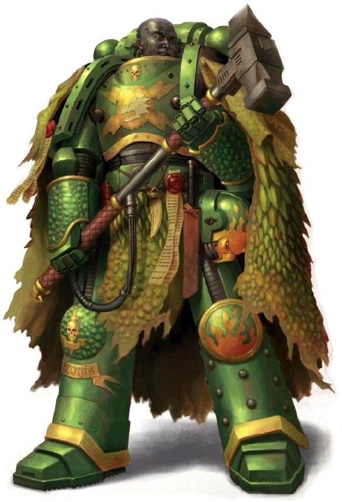

<!-- A0451-B0182 -->

原译文

A Salamander without his helmet, showing his coal-black skin 一名没有戴头盔的火蜥蜴，露出煤黑色的皮肤

**校订译文**

A Salamander without his helmet, showing his coal-black skin 一名没有戴头盔的火蜥蜴，露出煤黑色的皮肤

<!-- /A0451-B0182 -->

<!-- A0451-B0183 -->
**英文原文**

As far as can be determined by the Magos Biologis of the Adeptus Mechanicus, the Salamander's gene-seed appears to be both stable and as yet uncorrupted. An unusual trait of the Salamanders is that their Battle-Brothers tend to be slower in reflex reaction than other Chapters, though the origin of this factor is debated; it is unknown whether this defect is due to a problem with the gene-seed that manifested as a result of most Salamanders being raised on their high-gravity world, or the psychological result of the Chapter's doctrines and psycho-conditioning against hastiness and impetuosity. However, it has been noted that a Salamanders Space Marine can move just as quickly as any Astartes equipped with Power Armour, and are still significantly faster than those of a normal human.

<!-- /A0451-B0183 -->

<!-- A0451-B0184 -->

原译文

据机械神教的生物贤者所确定，火蜥蜴的基因种子似乎既稳定又未被破坏。火蜥蜴的一个不同寻常的特点是，他们的战斗兄弟的反射反应往往比其他战团慢，尽管这一因素的起源存在争议；目前尚不清楚这种缺陷是由于大多数火蜥蜴在高重力世界中长大而表现出的基因种子问题，还是战团针对急躁和冲动的教义和心理调节的心理结果。然而，人们注意到，火蜥蜴星际战士的行动速度与任何配备动力盔甲的阿斯塔特一样快，而且仍然比正常人快得多。

**校订译文**

就机械修会生物贤者目前所能查明的情况而言，火蜥蜴的基因种子似乎相当稳定，也未受污染。他们有一项异于其他战团的特征：战斗兄弟的反射反应通常稍慢。对此原因仍有争议：可能是多数战士成长于高重力世界，使基因种子的某种缺陷显现；也可能是战团反对急躁冒进的训导与心理塑造所致。不过，观察表明，火蜥蜴的行动速度与其他身穿动力甲的阿斯塔特并无差别，仍远超普通人类。

<!-- /A0451-B0184 -->

<!-- A0451-B0185 -->
**英文原文**

Also, as a result of a reaction between their genetics and the high levels of radiation on Nocturne, Salamanders battle brothers have dark or jet black skin and bright, burning eyes. This frightening appearance is entirely superficial, but has intimidated more than one rebellion into submission without firing a shot.

<!-- /A0451-B0185 -->

<!-- A0451-B0186 -->

原译文

此外，由于他们的基因与夜曲星的高辐射水平之间的反应，火蜥蜴的战斗兄弟拥有深色或乌黑的皮肤和明亮灼热的眼睛。这种可怕的外表完全是表面的，但它恐吓了不止一个叛乱者，让他们在不开枪的情况下屈服。

**校订译文**

此外，他们的基因与夜曲星的高辐射环境相互作用，使战斗兄弟拥有深黑乃至乌黑的皮肤，以及明亮如燃的双眼。这只是令人畏惧的外貌特征，却曾让不止一场叛乱在未发一枪的情况下便告平息。

<!-- /A0451-B0186 -->

<!-- A0451-B0187 -->
### Fire-Sight 火焰视觉

<!-- /A0451-B0187 -->

<!-- A0451-B0188 -->
**英文原文**

A unique genetic trait given by the Salamanders gene-seed is known as Fire-Sight. This visual sensitivity to infrared emissions allows Salamanders to focus on particular heat signatures. Millennia ago, Salamanders Artificers perfected the manufacture of a material that could generate minute pulses of heat at the specific signatures detectable by their modified eyes. Ever since, this material has been layered into the dermis of their ceramite armour and woven in electro-tapestral strands through the fabric of robes and standards. This substance is even applied to the flanks of Salamanders vehicles. When connected to the Noosphere, it generates enough heat to be seen by Salamanders while remaining unseen by those not attuned to its presence. With this artifice, sub-levels of strategic designation can be communicated and hidden tactical markings trace the air with fire.

<!-- /A0451-B0188 -->

<!-- A0451-B0189 -->

原译文

火蜥蜴基因种子所赋予的一种独特的遗传性状被称为火焰视觉。这种对红外辐射的视觉敏感性使火蜥蜴能够专注于特定的热特征。数千年前，火蜥蜴工匠完善了一种材料的制造，这种材料可以在他们改良的眼睛可以检测到的特定特征下产生微小的热脉冲。从那时起，这种材料就被层压到他们的陶钢盔甲的真皮层中，并通过长袍和标准的织物编织成电带状线。这种物质甚至被应用于火蜥蜴载具的侧翼。当连接到思维空间时，它会产生足够的热量，让火蜥蜴看到，而那些不熟悉它存在的人则看不见。通过这种技巧，可以传达战略指定的子级别，隐藏的战术标记可以用火力追踪空中。

**校订译文**

火蜥蜴基因种子赋予的一项独有特征，称为“火焰视觉”。他们的眼睛对红外辐射敏感，能够分辨特定的热信号。数千年前，火蜥蜴工匠完善了一种材料的制作工艺，使其能发出微弱的热脉冲，恰好可被他们经过改造的双眼辨认。此后，这种材料被覆入陶钢护甲的表层，也以电织纤维的形式织入长袍和军旗，甚至涂在战团载具的侧面。材料接入思维空间后，便会产生火蜥蜴能够看见的热量；不具备相应感官者则无法察觉。借助这项工艺，他们能够传达更细分的战略标识，让隐藏的战术标记如火焰般在视野中显现。

**校注：** standards 在此为军旗，非“标准”；dermis 比喻护甲表层，非生物真皮。末句 trace the air with fire 为视觉化描述，不表示标记引导火力或飞行轨迹。Noosphere 沿原稿“思维空间”，待核。

<!-- /A0451-B0189 -->

<!-- A0451-B0190 -->
**英文原文**

For more precise and broad visual perception, the Salamanders continue to rely on their Power Armour systems.

<!-- /A0451-B0190 -->

<!-- A0451-B0191 -->

原译文

为了获得更精确和更广泛的视觉感知，火蜥蜴继续依靠他们的动力盔甲系统。

**校订译文**

需要更精确、范围更广的视觉感知时，火蜥蜴仍会依赖动力甲的系统。

<!-- /A0451-B0191 -->

<!-- A0451-B0192 -->
### Other Traits 其他特征

<!-- /A0451-B0192 -->

<!-- A0451-B0193 -->
**英文原文**

Besides Fire-Sight, the Salamanders gene-seed also allows for greater tolerance of extreme temperature and radiation and a higher level of cellular repair.

<!-- /A0451-B0193 -->

<!-- A0451-B0194 -->

原译文

除了火焰视觉，火蜥蜴基因种子还允许对极端温度和辐射有更大的耐受性，以及更高水平的细胞修复。

**校订译文**

除了火焰视觉，火蜥蜴的基因种子还赋予他们更强的极端温度与辐射耐受力，以及更高效的细胞修复能力。

<!-- /A0451-B0194 -->

<!-- A0451-B0195 -->
## Culture 文化

<!-- /A0451-B0195 -->

<!-- A0451-B0196 -->
**英文原文**

Drawing from the teachings of Vulkan, the Salamanders are renowned as compassionate towards the average citizens of the Imperium and as defenders of the weak. Rare amongst Chapters, the Salamanders (with the exception of Firedrakes) live amongst the civilian population of their homeworld Nocturne and serve as guardians, exemplars, and caretakers. While some decry this as a weakness, the Salamanders see it as a strength. Even the High Lords of Terra have in the past condemned the Salamanders for this. Similarly the Salamanders have always evinced a readiness to ally themselves with other Imperial forces, to the extent that they are often the first Chapter to extend diplomatic overtures.

<!-- /A0451-B0196 -->

<!-- A0451-B0197 -->

原译文

根据沃坎的教义，火蜥蜴以对帝国普通公民的同情心和弱者的捍卫者而闻名。在战团中罕见的是，火蜥蜴（火龙除外）生活在他们家园世界夜曲星的平民中，并担任监护人、榜样和看护人。虽然有些人谴责这是一个弱点，但火蜥蜴认为这是一种优势。就连泰拉的高领主过去也曾为此谴责过火蜥蜴。同样，火蜥蜴一直表示愿意与其他帝国军队结盟，因为他们往往是第一个提出外交建议的人。

**校订译文**

火蜥蜴遵循沃坎的教诲，以体恤帝国普通民众、保护弱者而闻名。与大多数战团不同，除了火龙以外，他们通常与夜曲星的平民共同生活，充当守护者、榜样与照料者。有人视此为软弱，火蜥蜴却认为这正是力量的来源；即便泰拉高领主过去也曾因此斥责他们，他们仍不改其志。同样，他们始终愿意与其他帝国部队合作，往往是率先主动建立联系、提出协作的战团。

<!-- /A0451-B0197 -->

<!-- A0451-B0198 图片 -->
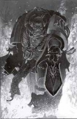

<!-- A0451-B0199 -->

原译文

Salamanders Librarian 火蜥蜴智库

**校订译文**

Salamanders Librarian 火蜥蜴智库员

<!-- /A0451-B0199 -->

<!-- A0451-B0200 -->
**英文原文**

Although the Salamanders follow the Codex Astartes, they nonetheless also follow the doctrines of their own Promethean Cult. The Promethean Cult places high emphasis on self-reliance, self-sacrifice and loyalty. It also sees importance in collective decision-making and the good of the whole. To that end, the people of Nocturne and by extension the Salamanders are prone to holding political councils of elders to debate and decide upon important courses of action in a way not dissimilar to the quorums of Macragge.

<!-- /A0451-B0200 -->

<!-- A0451-B0201 -->

原译文

尽管火蜥蜴遵循阿斯塔特圣典，但他们也遵循自己普罗米修斯教派的教义。普罗米修斯教派高度重视自力更生、自我牺牲和忠诚。它也看到了集体决策和整体利益的重要性。为此，夜曲星人和火蜥蜴倾向于举行长者议会，以与马库拉格法定人数相似的方式辩论和决定重要的行动方案。

**校订译文**

火蜥蜴遵循《阿斯塔特圣典》，也奉行自身普罗米修斯教派的教义。该教派高度重视自立、牺牲与忠诚，同时强调集体决策和整体利益。因此，夜曲星居民以及火蜥蜴，常会召集长者议会，讨论并决定重要行动；这种做法与马库拉格的议事制度颇为相似。

<!-- /A0451-B0201 -->

<!-- A0451-B0202 -->
**英文原文**

Symbols of the forge - such as fire and hammers - are prominent throughout Promethean iconography. As such, Flamers, Melta Weapons and Thunder Hammers are widely used throughout the chapter. As one can imagine, this preference for Flamers and Meltas leads to a strong affinity among the Salamanders for close-range firefight when in combat, although they are just as capable at other aspects of Space Marine battle doctrine.

<!-- /A0451-B0202 -->

<!-- A0451-B0203 -->

原译文

锻造的象征，如火焰和铁锤，在整个普罗米修斯图像中都很突出。因此，战团中广泛使用了火焰枪、热熔武器和雷霆锤。可以想象，这种对火焰枪和热熔的偏好导致火蜥蜴在战斗中对近距离射击有很强的亲和力，尽管他们在星际战士作战理论的其他方面也同样有能力。

**校订译文**

火焰、锻锤等与锻造相关的象征，在普罗米修斯教派的图像中随处可见。因此，火焰喷射器、热熔武器和雷霆锤在战团内广泛使用。对前两类武器的偏爱，也让火蜥蜴特别擅长近距离交火；不过，他们同样精通星际战士的其他作战方式。

<!-- /A0451-B0203 -->

<!-- A0451-B0204 -->
**英文原文**

Because of their early training as blacksmiths, all Salamanders are fully capable of maintaining and performing moderate repair on their weapons and armour, leaving the Chapter's artificers with the free time necessary to create great works of technology and metallurgy. As a result, the Salamanders Chapter has an unusually high number of Master-Crafted Weapons, Artificer Armour and even Tactical Dreadnought Armour. The Chapter also favours the use of Land Raider Redeemers.

<!-- /A0451-B0204 -->

<!-- A0451-B0205 -->

原译文

由于他们早期接受过铁匠训练，所有火蜥蜴都完全有能力维护和适度修理他们的武器和盔甲，使战团的工匠们有必要的空闲时间来创造伟大的技术和冶金作品。因此，火蜥蜴战团拥有异常多的精工武器、精工盔甲，甚至战术无畏盔甲。战团还喜欢使用兰德掠袭者救赎者。

**校订译文**

所有火蜥蜴都在早年接受过铁匠训练，能够自行维护武器与护甲，完成一定程度的修理。这让战团工匠得以腾出时间，专注于高水平的技术与冶金造物。因此，火蜥蜴拥有数量格外多的精工武器、精工护甲，乃至战术无畏甲。他们也偏爱使用救赎者型兰德掠袭者战车。

<!-- /A0451-B0205 -->

<!-- A0451-B0206 -->
**英文原文**

In an interesting example of juxtaposition, however, the fluctuating gravity of Nocturne makes training with certain units such as Land Speeders and Bikes difficult, therefore the chapter makes little use of them, in favour of Devastator squads and Terminator Squads. Trained never to give up or retreat, Salamanders are capable of going on when their entire squad is dead, holding positions for months on end. This is one of the more significant effects of Promethean doctrines upon the Chapter's collective psyche. Before each battle the Salamanders get a brand mark each by a Brander-Priest. This symbolizes their respect for the chapter. Only veterans ever get brand marks on their faces.

<!-- /A0451-B0206 -->

<!-- A0451-B0207 -->

原译文

然而，在一个有趣的并置例子中，夜曲星的波动重力使得与兰德速攻艇和摩托等特定单位的训练变得困难，因此战团很少使用它们，而是倾向于毁灭者小队和终结者小队。经过永不放弃或撤退的训练，火蜥蜴能够在整个小队都死亡的情况下继续推进，连续几个月保持阵地。这是普罗米修斯学说对战团集体心理的更重要影响之一。每次战斗前，火蜥蜴都会得到一个烙印祭司的烙印标记。这象征着他们对战团的尊重。只有老兵才会在脸上留下烙印。

**校订译文**

另一方面，夜曲星不断变化的重力使兰德速攻艇和摩托等装备难以用于训练，因此战团很少使用它们，更倚重破坏者小队与终结者小队。火蜥蜴接受的训练要求他们永不放弃、绝不退缩；即使同队战友全部阵亡，他们也能独自坚持，连续数月守住阵地。这是普罗米修斯教义塑造战团集体心性的重要体现之一。每场战斗前，烙印祭司都会为战士烙下印记，象征他们对战团的敬意。只有老兵获准在面部留下烙印。

<!-- /A0451-B0207 -->

<!-- A0451-B0208 图片 -->
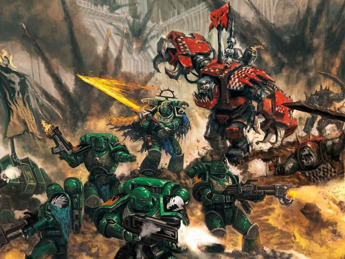

<!-- A0451-B0209 -->

原译文

The Salamanders battle Orks 火蜥蜴与欧克战斗

**校订译文**

The Salamanders battle Orks 火蜥蜴与欧克战斗

<!-- /A0451-B0209 -->

<!-- A0451-B0210 -->
### Rituals of the Promethean Cult 普罗米修斯教派的仪式

<!-- /A0451-B0210 -->

<!-- A0451-B0211 -->
**英文原文**

The Burning Walk - An ancient ritual of trial, the Burning Walk is undertaken by an individual as a solitary pilgrimage into the vast Pyre Desert of Nocturne. Usually, the aged, infirm or crippled pursue such a path with the intention of ending their last days in fire. Some Salamanders may choose to undertake the journey as a means of restoring a troubled soul or die in the attempt. To date, only one Salamander has ever returned from the Burning Walk - Apothecary Fugis of the 3rd Company.

<!-- /A0451-B0211 -->

<!-- A0451-B0212 -->

原译文

燃烧之路-一种古老的试炼仪式，燃烧之路是由一个人独自前往夜曲星广阔的柴堆沙漠夜行的朝圣之旅。通常，年老、体弱或残疾的人会选择这样的道路，目的是在火焰中结束他们的最后几天。一些火蜥蜴可能会选择踏上这段旅程，作为恢复陷入困境的灵魂的一种手段，或者在尝试中死去。迄今为止，只有一位火蜥蜴从燃烧之路归来 — 第三连队的药剂师福吉斯。

**校订译文**

燃烧之路——一种古老的试炼仪式。参与者独自深入夜曲星广袤的柴堆沙漠，完成孤身朝圣。通常，年迈、衰弱或伤残者会踏上这条道路，希望在火焰中结束余生。有些火蜥蜴则希望借此抚平受创的灵魂，纵死也在所不惜。原文记载时，只有一名火蜥蜴曾从燃烧之路归来：第三连药剂师福吉斯。

<!-- /A0451-B0212 -->

<!-- A0451-B0213 -->
**英文原文**

Rituals of Interment and Ascension - When a Captain of the Salamanders is slain, this ceremony is performed to commemorate his passing, and celebrate his successors promotion. The ritual involves chaining what remains of the fallen to a vast, ceramite coated slab of black marble. This slab is then lowered into a lava flow which pools within a vast, ceramite-sided basin of volcanic rock. The slab is lowered by means of two chosen Astartes robed in the traditional garb of Nocturnean metalworkers, who pass chains twice the size of an Astartes fist and etched with symbols of the forge - the flame, the anvil and the hammer - through their hands. As the chains are red-hot from the heat of the lava below, the symbols are branded into the palms of the incumbents.

<!-- /A0451-B0213 -->

<!-- A0451-B0214 -->

原译文

埋葬和升天仪式 - 当一名火蜥蜴连长被杀时，会举行这个仪式来纪念他的牺牲，并庆祝他的继任者晋升。仪式包括将死者的遗体拴在一块巨大的、覆有陶钢的黑色大理石板上。然后，这块板被放入熔岩流中，熔岩流汇集在一个巨大的火山岩陶钢盆地中。这块板是通过两名受选的穿着夜曲星金属工人传统服装的阿斯塔特放下的，他们用手传递两倍于阿斯塔特拳头大小的链条，上面刻着锻造的符号 — 火焰、铁砧和铁锤。由于下方熔岩的热量使链条变得炽热，这些符号被刻在现任者的手掌上。

**校订译文**

安葬与晋升仪式——火蜥蜴连长阵亡后，战团会举行此仪式，悼念逝者并庆祝继任者晋升。阵亡者的遗骸被铁链固定在一块覆有陶钢的巨大黑色大理石板上，再缓缓放入熔岩。熔岩汇聚在火山岩凿成、内壁衬以陶钢的巨大池中。两名受选的阿斯塔特身着夜曲星金属工匠的传统服饰，亲手放下石板，让链条从掌中缓缓滑过。链条粗大，足有阿斯塔特拳头的两倍，上面刻有火焰、铁砧与锻锤等锻造符号。下方熔岩将链条烤得通红，这些符号也随之烙入执链者的掌心。

<!-- /A0451-B0214 -->

<!-- A0451-B0215 -->
**英文原文**

The Astartes must grip the chains precisely and in unison, for any deviation will result in an irregular brand - a mark of great shame that will be scoured away in disgrace. Following this Ritual of Interment, comes the Ritual of Ascension. The prospective Captain is stripped naked aside from a sash to preserve his dignity and branded with the marks of a Captain upon his chest and right shoulder. Stepping onto a dais, the ascendant is subjected to a blast of flame from below, surrounding him in a pillar-like inferno for a few seconds. This complete, the ascendant is addressed by the Regent of Prometheus with the words'"Vulkan's fire beats in my breast...", to which the ascendant concludes,"...with it, I shall smite the foes of the Emperor." Finally, the Regent bids the new Captain to rise.

<!-- /A0451-B0215 -->

<!-- A0451-B0216 -->

原译文

阿斯塔特必须准确、一致地抓住链条，因为任何偏差都会导致不规则的印记 — 这是一种巨大的耻辱，将在耻辱中被抹去。在这个埋葬仪式之后，是升天仪式。为了维护尊严，这位未来的连长被剥光衣服，只系着腰带，胸前和右肩上还刻着连长的印记。踏上讲台，升格者受到来自下方的火焰冲击，在柱状炼狱中围绕他几秒钟。普罗米修斯摄政对这位完整的升格者说：“沃坎的火焰在我胸中燃烧……”，升格者总结道：“……用它，我将打败帝皇之敌。”最后，摄政命令新连长站起来。

**校订译文**

两名阿斯塔特必须准确而同步地握住链条，任何偏差都会留下歪斜的烙印。那是莫大的耻辱，只能羞惭地将其磨去。安葬仪式之后便是晋升仪式。即将就任的连长脱去衣物，只留一条遮体的腰布；胸前与右肩被烙上连长标记。他登上高台，下方喷出的烈焰将他笼罩于火柱之中，持续数秒。完成这一过程后，普罗米修斯摄政向他说道：“沃坎之火在我胸中跃动……”晋升者接道：“……我将以此击溃帝皇之敌。”最后，摄政命新任连长起身。

**校注：** Ascension 在这里指继任连长的晋升仪式，非死者“升天”；This complete 是“上述步骤完成后”，非“完整的升格者”。

<!-- /A0451-B0216 -->

<!-- A0451-B0217 -->
**英文原文**

Upon the start of a new campaign, each Salamander builds his own pyre, separate from his battle-brothers and leaves, returning when the flames are at their apex. In solitude, they anoint their armour and focus upon the key tenets of the Promethean Cult.

<!-- /A0451-B0217 -->

<!-- A0451-B0218 -->

原译文

在新的战役开始时，每个火蜥蜴都会建造自己的柴堆，与他的战斗兄弟和叶子分开，在火焰达到顶峰时返回。在孤独中，他们涂抹盔甲，专注于普罗米修斯教派的关键教义。

**校订译文**

每次新战役开始时，每名火蜥蜴都会与战斗兄弟分开，独自搭起柴堆后离去，待火焰最盛时再返回。他们在独处中为护甲涂油，并默思普罗米修斯教派的核心教义。

**校注：** leaves 在句中是离开的动词，原译误作“叶子”。

<!-- /A0451-B0218 -->

<!-- A0451-B0219 -->
**英文原文**

Upon the death of a Salamander, if the body is not returned to Nocturne and ritually burned in the Pyreum under Mount Deathfire, his brothers may elect to cremate the body locally during or after a campaign. In such a situation, as the fallen Fireborn burns, his fellow Salamanders thrust their arms into the flames of the pyre. As a very personal ritual, singular touches may be added to the ceremony. In some cases a Lament may be sung, or the comrades of the fallen may offer a few words of wisdom or remembrance. The ritual is conducted individually in the case of the fallen, with each of the slain having their own pyre, attended by his squad and closest brothers.

<!-- /A0451-B0219 -->

<!-- A0451-B0220 -->

原译文

一名火蜥蜴死后，如果尸体没有被送回夜曲星并在死火之山下的派瑞姆进行仪式性焚烧，他的兄弟们可以选择在战役期间或之后在当地火化尸体。在这种情况下，当倒下的长子燃烧时，他的火蜥蜴战友们将手臂伸进柴堆的火焰中。作为一种非常私人的仪式，仪式上可能会加入一些独特的元素。在某些情况下，可能会唱一首哀歌，或者牺牲者的战友们可能会说几句智慧或怀念的话。对于倒下的人，仪式是单独进行的，每个被杀者都有自己的柴堆，由他的小队和最亲密的兄弟参加。

**校订译文**

火蜥蜴阵亡后，如果遗体未能运回夜曲星、在死火之山下的派瑞姆按仪式焚化，战友可选择在战役期间或结束后就地火葬。阵亡的火焰之子在柴堆上燃烧时，同袍会将手臂伸入火焰。这个仪式带有强烈的个人色彩，可以加入各自的纪念方式：有人唱起哀歌，也有人献上箴言，或讲述对逝者的回忆。每名阵亡者都单独举行仪式，拥有自己的柴堆，由所属小队与最亲近的兄弟陪伴送别。

**校注：** Fireborn 指火蜥蜴的“火焰之子”，原译误作 Firstborn“长子”。

<!-- /A0451-B0220 -->

<!-- A0451-B0221 -->
## Tactics 战术

<!-- /A0451-B0221 -->

<!-- A0451-B0222 -->
**英文原文**

Though the Salamanders can fight in any theatre under any conditions, they have a special proclivity towards close combat through the use of Flame Weapons and Melta Weapons. In the time of the Great Crusade, they also made great use of Volkite Weaponry. The individual technical aptitude of Salamanders, thanks to the Promethean Cult espoused by Vulkan, allows them to maintain complicated weapons and machinery in the field.

<!-- /A0451-B0222 -->

<!-- A0451-B0223 -->

原译文

尽管火蜥蜴可以在任何条件下在任何战区作战，但他们有一种特殊的倾向，即通过使用火焰武器和热熔武器进行近距离战斗。在大远征时期，他们也大量使用了爆燃武器。由于沃坎信奉的普罗米修斯教派，火蜥蜴的个人技术才能使他们能够在野外维护复杂的武器和机械。

**校订译文**

火蜥蜴能够在任何环境、任何战区作战，尤其偏爱用火焰武器和热熔武器进行近距离交战。大远征时期，他们也广泛使用爆燃武器。沃坎倡导的普罗米修斯教派培养了战士个人的技术素养，使他们能在野战条件下维护复杂武器与机械。

<!-- /A0451-B0223 -->

<!-- A0451-B0224 -->
**英文原文**

The Salamanders are fond of deploying mass heavy armor alongside fire-wielding heavy infantry, making a methodical advance that annihilates the enemy with incendiaries and heavy firepower. Their skills also have proven able to translate into being extremely effective in defence and boarding actions. In battle, the Salamanders are known to be incredibly patient and will wait until the enemy is in range of their flame weaponry before unleashing their fire.

<!-- /A0451-B0224 -->

<!-- A0451-B0225 -->

原译文

火蜥蜴喜欢在挥舞着火力的重步兵旁边部署重型装甲，有条不紊地前进，用燃烧弹和重型火力消灭敌人。他们的技能也被证明能够转化为在防守和跳帮行动中极其有效。在战斗中，众所周知，火蜥蜴非常有耐心，会等到敌人在他们的火焰武器射程内才开火。

**校订译文**

火蜥蜴偏爱以大批重型装甲配合装备火焰武器的重步兵，有条不紊地推进，用燃烧武器与猛烈火力歼灭敌人。他们的专长同样使其在防御战与跳帮战中极为有效。他们在战场上耐心惊人，往往等到敌人进入火焰武器射程后才开火。

<!-- /A0451-B0225 -->

<!-- A0451-B0226 -->
**英文原文**

The Salamanders maintain unusually large amounts of Terminator Armour, which can only be maintained by the skill of a Chapter known to be artisans.

<!-- /A0451-B0226 -->

<!-- A0451-B0227 -->

原译文

火蜥蜴拥有异常大量的终结者盔甲，这只能通过战团已知的工匠的技能来维护。

**校订译文**

火蜥蜴保有数量格外庞大的终结者护甲；唯有这样一个以工匠技艺著称的战团，才能妥善维护如此多的装备。

<!-- /A0451-B0227 -->

<!-- A0451-B0228 -->
## Organization 组织

<!-- /A0451-B0228 -->

<!-- A0451-B0229 -->
### Pre-Heresy 叛乱前

<!-- /A0451-B0229 -->

<!-- A0451-B0230 -->
**英文原文**

When Vulkan assumed command of the Salamanders on the Great Crusade he radically reorganized the Legion. One of Vulkan's first actions was to largely unify his scattered Legion and do away with its ad-hoc strategic operations, but he did so in a way that preserved, where possible, the spirit of autonomy and self-sufficiency the component units of the XVIII had developed, which he saw as inherent virtues where tempered with purpose. Vulkan ordered his Legion into the formation of seven "Realms", each linked with one of Nocturne's seven great city-settlements. To each of these he assigned a Lord Commander, known also as a Protector, as it was also their duty to protect their settlement in time of attack. Each Nocturnean city-settlement served as a focus of the Legion's recruitment and their governance of the planet, anchoring the Legionaries to the humans for whom they fought, and each city-settlement went on to exhibit its own unique influences on the Salamanders traditions.

<!-- /A0451-B0230 -->

<!-- A0451-B0231 -->

原译文

当沃坎在大远征中接管火蜥蜴时，他彻底重组了军团。沃坎的首要行动之一是在很大程度上统一他分散的军团，并取消其临时战略行动，但他这样做的方式尽可能地保留了第十八军团各组成单位所发展的自治和自给自足的精神，他认为这是与目的相调和的内在美德。沃坎命令他的军团组成七个“领域”，每个领域都与夜曲星的七个大城市定居点之一相连。他为每个指派了一名领主指挥官，也称为保护者，因为他们也有责任在袭击时保护他们的定居点。每个夜曲星城市定居点都是军团招募和治理行星的重点，将军团与他们为之战斗的人类联系起来，每个城市定居点都对火蜥蜴传统产生了独特的影响。

**校订译文**

沃坎在大远征期间接掌火蜥蜴后，彻底重组了军团。他首先将分散各处的部队大体整合起来，结束临时拼凑的战略行动，同时尽可能保留各部队此前形成的自主性与自给能力。他认为，只要受到明确目标的引导，这些品质便是美德。沃坎将军团划为七个“领域”，分别对应夜曲星的七大城市聚落，每个领域任命一名领主指挥官。他们也称“保护者”，因为在聚落遭到攻击时，保卫当地同样是其职责。七大聚落各自成为军团招募与行星治理的中心，使战士与自己所守护的人类保持紧密联系；每个聚落也都为火蜥蜴的传统留下了独特影响。

<!-- /A0451-B0231 -->

<!-- A0451-B0232 图片 -->
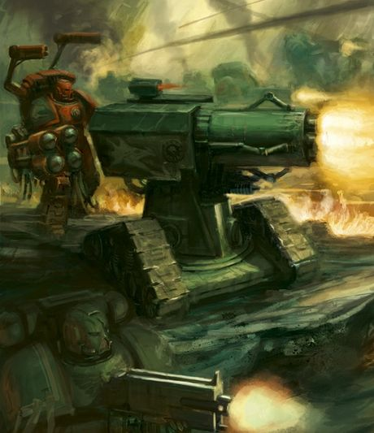

<!-- A0451-B0233 -->

原译文

Salamanders Techmarine with Thunderfire Cannon 火蜥蜴技术军士和雷火炮

**校订译文**

Salamanders Techmarine with Thunderfire Cannon 火蜥蜴科技战士和雷火炮

<!-- /A0451-B0233 -->

<!-- A0451-B0234 -->
### Known units of the Great Crusade and Horus Heresy 大远征与荷鲁斯之乱时期的已知部队

原题：Known units of the Great Crusade and Horus Heresy 大远征和荷鲁斯叛乱的著名单位

<!-- /A0451-B0234 -->

<!-- A0451-B0235 -->
### Companies 连队

<!-- /A0451-B0235 -->

<!-- A0451-B0236 -->

原译文

1st Company 第一连队

**校订译文**

1st Company 第一连队

<!-- /A0451-B0236 -->

<!-- A0451-B0237 -->

原译文

3rd Company 第三连队

**校订译文**

3rd Company 第三连队

<!-- /A0451-B0237 -->

<!-- A0451-B0238 -->

原译文

5th Company 第五连队

**校订译文**

5th Company 第五连队

<!-- /A0451-B0238 -->

<!-- A0451-B0239 -->

原译文

14th Company 第14连队

**校订译文**

14th Company 第14连队

<!-- /A0451-B0239 -->

<!-- A0451-B0240 -->

原译文

15th Company 第15连队

**校订译文**

15th Company 第15连队

<!-- /A0451-B0240 -->

<!-- A0451-B0241 -->

原译文

17th Company 第17连队

**校订译文**

17th Company 第17连队

<!-- /A0451-B0241 -->

<!-- A0451-B0242 -->

原译文

21st Company 第21连队

**校订译文**

21st Company 第21连队

<!-- /A0451-B0242 -->

<!-- A0451-B0243 -->

原译文

24th Company 第24连队

**校订译文**

24th Company 第24连队

<!-- /A0451-B0243 -->

<!-- A0451-B0244 -->

原译文

34th Company 第34连队

**校订译文**

34th Company 第34连队

<!-- /A0451-B0244 -->

<!-- A0451-B0245 -->

原译文

43rd Company 第43连队

**校订译文**

43rd Company 第43连队

<!-- /A0451-B0245 -->

<!-- A0451-B0246 -->

原译文

51st Company 第51连队

**校订译文**

51st Company 第51连队

<!-- /A0451-B0246 -->

<!-- A0451-B0247 -->

原译文

53rd Company 第53连队

**校订译文**

53rd Company 第53连队

<!-- /A0451-B0247 -->

<!-- A0451-B0248 -->
### Post-Heresy 叛乱后

<!-- /A0451-B0248 -->

<!-- A0451-B0249 -->
**英文原文**

The Salamanders comply with much of the Codex Astartes, but instead of ten companies continues to maintain the seven warrior houses of the original Legion. Each great settlement of Nocturne forms the basis of one of the companies. Also unusually, the Chapter Master of the Chapter directly oversees the 1st Company. Another significant deviation from the Codex Astartes is that the Salamanders maintain three Masters of the Forge instead of one. This allows for the efficient maintaining of the chapter's machinery alongside the creation of technological artifacts of great beauty and perfect function.

<!-- /A0451-B0249 -->

<!-- A0451-B0250 -->

原译文

火蜥蜴遵守了阿斯塔特圣典的大部分规定，但不是十个连队，而是继续维护原初军团的七个战士家园。夜曲星的每个大定居点都是其中一个连队的基地。同样不同寻常的是，战团的战团长直接监督第一连队。与阿斯塔特圣典的另一个重大偏差是，火蜥蜴保留了三位铸造大师，而不是一位。这使得战团的机械能够得到有效的维护，同时创造出美观、功能完美的科技造物。

**校订译文**

火蜥蜴遵守《阿斯塔特圣典》的大部分规定，但仍保留原军团的七个战士家族，编成七个连队，而非标准的十个连。每个连都以夜曲星的一座大聚落为根基。另一项独特之处是，战团长直接统辖第一连。此外，战团设有三位铸造大师，而非《圣典》通常规定的一位。这让他们既能高效维护机械装备，又能打造外形精美、功能完善的技术造物。

<!-- /A0451-B0250 -->

<!-- A0451-B0251 -->
**英文原文**

While the Chapter Master of the Salamanders has the final say on matters, the Chapter maintains the Pantheon Council to forge its direction and oversee new appointments.

<!-- /A0451-B0251 -->

<!-- A0451-B0252 -->

原译文

虽然火蜥蜴战团长对事情有最终决定权，但战团仍保留万神殿议会来制定方向并监督新的任命。

**校订译文**

火蜥蜴战团长虽拥有最终裁决权，战团仍设有万神殿议会，以商定发展方向，并监督新的人事任命。

<!-- /A0451-B0252 -->

<!-- A0451-B0253 -->
### Chapter Disposition 战团编制

原题：Chapter Disposition 战团布置

<!-- /A0451-B0253 -->

<!-- A0451-B0254 -->
**英文原文**

The Companies and their Captains are as follows:

<!-- /A0451-B0254 -->

<!-- A0451-B0255 -->

原译文

各连队及其连长如下：

**校订译文**

各连队及其连长如下：

<!-- /A0451-B0255 -->

<!-- A0451-B0256 -->
**英文原文**

The chapter disposition of the Salamanders before the liberation of the Largos System in M42 is as follows; as the squads are standard size, this means the chapter as shown is presumably severely under-strength, with only 840 company squad-level marines (as usual, not counting marines at the company command level, or in non-company roles). The presumably is necessary as the number of squads in the first company is not explicitly stated, but the other six companies all have 12 squads each.

<!-- /A0451-B0256 -->

<!-- A0451-B0257 -->

原译文

M42中拉格斯星系解放前火蜥蜴的战团配置如下；由于这些小队是标准规模的，这意味着所示的部队可能严重兵力不足，只有840名连队小队级战士（像往常一样，不包括连队指挥级或非连队角色的战士）。这可能是必要的，因为第一个连队的小队数量没有明确说明，但其他六个连队都有12个小队。

**校订译文**

以下列出第四十二个千年解放拉格斯星系之前的火蜥蜴编制。若各小队均按标准人数编成，表中连队的小队战士合计应为840人，显示战团可能严重缺员；照例，这不计连队指挥人员及不隶属连队的战士。之所以只能推测，是因为第一连的小队数量并未明确列出，而其余六个连均各有十二个小队。

**校注：** 840人为英文作者的推算，第一连小队数量未明，不能作为确定编制。此段 Largos 与前文战役 Lagros 拼写不同，原文保留，未擅自认定同地。

<!-- /A0451-B0257 -->

<!-- A0451-B0258 -->
### Headquarters 总部

<!-- /A0451-B0258 -->

<!-- A0451-B0259 -->
**英文原文**

The first company is displayed here, as the Salamanders do not maintain a first company captain - instead, the chapter master acts as the captain of the first company.

<!-- /A0451-B0259 -->

<!-- A0451-B0260 -->

原译文

这里显示的是第一连队，因为火蜥蜴没有第一连队连长，而是由战团长担任第一连队的连长。

**校订译文**

第一连列在总部项下，因为火蜥蜴并不另设第一连连长，而由战团长兼任。

<!-- /A0451-B0260 -->

<!-- A0451-B0261 -->
### Chapter Command 战团指挥

<!-- /A0451-B0261 -->

<!-- A0451-B0262 图片 -->
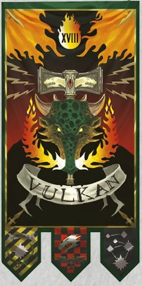

<!-- A0451-B0263 -->

原译文

First Company 第一连队

**校订译文**

First Company 第一连队

<!-- /A0451-B0263 -->

<!-- A0451-B0264 图片 -->
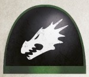

<!-- A0451-B0265 -->

原译文

"Firedrakes" “火龙”

**校订译文**

"Firedrakes" “火龙”

<!-- /A0451-B0265 -->

<!-- A0451-B0266 -->
**英文原文**

Chapter Master Tu'Shan,Regent of Prometheus

<!-- /A0451-B0266 -->

<!-- A0451-B0267 -->

原译文

战团长图’杉，普罗米修斯摄政

**校订译文**

战团长图杉，普罗米修斯摄政

<!-- /A0451-B0267 -->

<!-- A0451-B0268 -->

原译文

Forgefather Vulkan He'stan 铸造之父伏尔甘·赫斯坦

**校订译文**

Forgefather Vulkan He'stan 铸造之父伏尔甘·赫斯坦

<!-- /A0451-B0268 -->

<!-- A0451-B0269 -->

原译文

Honour Guard 荣誉卫队

**校订译文**

Honour Guard 荣誉卫队

<!-- /A0451-B0269 -->

<!-- A0451-B0270 -->

原译文

Chapter Standard Bearer 战团标准旗手

**校订译文**

Chapter Standard Bearer 战团掌旗手

<!-- /A0451-B0270 -->

<!-- A0451-B0271 -->

原译文

Chapter Ancient 战团旗手

**校订译文**

Chapter Ancient 战团旗手

<!-- /A0451-B0271 -->

<!-- A0451-B0272 -->

原译文

Chapter Champion 战团冠军

**校订译文**

Chapter Champion 战团冠军

<!-- /A0451-B0272 -->

<!-- A0451-B0273 -->

原译文

2 Lieutenants 2名副官

**校订译文**

2 Lieutenants 2名副官

<!-- /A0451-B0273 -->

<!-- A0451-B0274 -->

原译文

Firedrakes 火龙

**校订译文**

Firedrakes 火龙

<!-- /A0451-B0274 -->

<!-- A0451-B0275 -->

原译文

Veteran Squads 老兵小队

**校订译文**

Veteran Squads 老兵小队

<!-- /A0451-B0275 -->

<!-- A0451-B0276 -->

原译文

Dreadnoughts 无畏

**校订译文**

Dreadnoughts 无畏机甲

<!-- /A0451-B0276 -->

<!-- A0451-B0277 -->

原译文

Land Raiders 兰德掠袭者

**校订译文**

Land Raiders 兰德掠袭者战车

<!-- /A0451-B0277 -->

<!-- A0451-B0278 -->
### Armoury 军械库

<!-- /A0451-B0278 -->

<!-- A0451-B0279 图片 -->

<!-- A0451-B0280 -->
**英文原文**

Masters of the Forge:

<!-- /A0451-B0280 -->

<!-- A0451-B0281 -->

原译文

铸造大师

**校订译文**

铸造大师

<!-- /A0451-B0281 -->

<!-- A0451-B0282 -->

原译文

Argos 阿尔戈斯

**校订译文**

Argos 阿尔戈斯

<!-- /A0451-B0282 -->

<!-- A0451-B0283 -->

原译文

Kor'hadron 科尔’哈顿

**校订译文**

Kor'hadron 科尔’哈顿

<!-- /A0451-B0283 -->

<!-- A0451-B0284 -->

原译文

Rhoshan 罗尚

**校订译文**

Rhoshan 罗尚

<!-- /A0451-B0284 -->

<!-- A0451-B0285 -->
**英文原文**

Personnel :

<!-- /A0451-B0285 -->

<!-- A0451-B0286 -->

原译文

全体人员

**校订译文**

人员：

<!-- /A0451-B0286 -->

<!-- A0451-B0287 -->

原译文

Techmarines 技术军士

**校订译文**

Techmarines 科技战士

<!-- /A0451-B0287 -->

<!-- A0451-B0288 -->

原译文

Servitors 机仆

**校订译文**

Servitors 机仆

<!-- /A0451-B0288 -->

<!-- A0451-B0289 -->

原译文

Battle Tanks 战斗坦克

**校订译文**

Battle Tanks 战斗坦克

<!-- /A0451-B0289 -->

<!-- A0451-B0290 -->

原译文

Land Raiders 兰德掠袭者

**校订译文**

Land Raiders 兰德掠袭者战车

<!-- /A0451-B0290 -->

<!-- A0451-B0291 -->

原译文

Gunships 炮艇

**校订译文**

Gunships 炮艇

<!-- /A0451-B0291 -->

<!-- A0451-B0292 -->

原译文

Centurion Warsuits 百夫长战甲

**校订译文**

Centurion Warsuits 百夫长战甲

<!-- /A0451-B0292 -->

<!-- A0451-B0293 -->
### Librarius 智库

<!-- /A0451-B0293 -->

<!-- A0451-B0294 图片 -->

<!-- A0451-B0295 -->
**英文原文**

Vel'cona, Chief Librarian

<!-- /A0451-B0295 -->

<!-- A0451-B0296 -->

原译文

维尔’科纳，首席智库

**校订译文**

维尔’科纳，首席智库员

<!-- /A0451-B0296 -->

<!-- A0451-B0297 -->

原译文

Epistolaries 星语官

**校订译文**

Epistolaries 星语官

<!-- /A0451-B0297 -->

<!-- A0451-B0298 -->

原译文

Codiciers 典记员

**校订译文**

Codiciers 典记员

<!-- /A0451-B0298 -->

<!-- A0451-B0299 -->

原译文

Lexicaniums 编修员

**校订译文**

Lexicaniums 编修员

<!-- /A0451-B0299 -->

<!-- A0451-B0300 -->

原译文

Acolytum 侍僧

**校订译文**

Acolytum 侍僧

<!-- /A0451-B0300 -->

<!-- A0451-B0301 -->
### Fleet 舰队

<!-- /A0451-B0301 -->

<!-- A0451-B0302 -->
**英文原文**

Xavus, Master of the Fleet

<!-- /A0451-B0302 -->

<!-- A0451-B0303 -->

原译文

萨沃斯，舰队之主

**校订译文**

萨沃斯，舰队大师

<!-- /A0451-B0303 -->

<!-- A0451-B0304 -->

原译文

Battle Barges 战斗驳船

**校订译文**

Battle Barges 战斗驳船

<!-- /A0451-B0304 -->

<!-- A0451-B0305 -->

原译文

Strike Cruisers 打击巡洋舰

**校订译文**

Strike Cruisers 打击巡洋舰

<!-- /A0451-B0305 -->

<!-- A0451-B0306 -->

原译文

Rapid Strike Vessels 快速打击战舰

**校订译文**

Rapid Strike Vessels 快速打击战舰

<!-- /A0451-B0306 -->

<!-- A0451-B0307 -->

原译文

Thunderhawks 雷鹰

**校订译文**

Thunderhawks 雷鹰

<!-- /A0451-B0307 -->

<!-- A0451-B0308 -->
### Apothecarion 药剂部

<!-- /A0451-B0308 -->

<!-- A0451-B0309 图片 -->

<!-- A0451-B0310 -->
**英文原文**

Sul Dra'Nerr, Chief Apothecary

<!-- /A0451-B0310 -->

<!-- A0451-B0311 -->

原译文

苏尔·德拉’内尔，首席药剂师

**校订译文**

苏尔·德拉’内尔，首席药剂师

<!-- /A0451-B0311 -->

<!-- A0451-B0312 -->

原译文

Apothecaries 药剂师

**校订译文**

Apothecaries 药剂师

<!-- /A0451-B0312 -->

<!-- A0451-B0313 -->
### Reclusiam 隐修室

<!-- /A0451-B0313 -->

<!-- A0451-B0314 图片 -->

<!-- A0451-B0315 -->
**英文原文**

Leotrak Esar,Master of Sanctity

<!-- /A0451-B0315 -->

<!-- A0451-B0316 -->

原译文

利奥崔克·埃萨尔，圣洁导师

**校订译文**

利奥崔克·埃萨尔，圣洁导师

<!-- /A0451-B0316 -->

<!-- A0451-B0317 -->

原译文

Reclusiarch T'Kell Konn 隐修士特’凯尔·科恩

**校订译文**

Reclusiarch T'Kell Konn 隐修长特’凯尔·科恩

<!-- /A0451-B0317 -->

<!-- A0451-B0318 -->

原译文

Chaplains 牧师

**校订译文**

Chaplains 教士

<!-- /A0451-B0318 -->

<!-- A0451-B0319 -->
### Companies 连队

<!-- /A0451-B0319 -->

<!-- A0451-B0320 -->
### Battle Companies 战斗连队

<!-- /A0451-B0320 -->

<!-- A0451-B0321 -->

原译文

2nd Company 第二连队

**校订译文**

2nd Company 第二连队

<!-- /A0451-B0321 -->

<!-- A0451-B0322 图片 -->

<!-- A0451-B0323 -->

原译文

Defenders of Nocturne 夜曲星卫士

**校订译文**

Defenders of Nocturne 夜曲星卫士

<!-- /A0451-B0323 -->

<!-- A0451-B0324 -->
**英文原文**

Captain N'kelm, Master of the Watch or Pellas Mir'san,The Winter Blade

<!-- /A0451-B0324 -->

<!-- A0451-B0325 -->

原译文

连长恩'凯姆，守望之主或佩拉斯·米尔’杉，寒冬之刃

**校订译文**

连长恩’凯姆，守望大师；或佩拉斯·米尔’杉，寒冬之刃。

**校注：** 英文并列两名第二连连长，未确定任职先后；文末明确列出两部来源对继任关系的冲突，因此保留“或”。

<!-- /A0451-B0325 -->

<!-- A0451-B0326 -->

原译文

2 Lieutenants 2名副官

**校订译文**

2 Lieutenants 2名副官

<!-- /A0451-B0326 -->

<!-- A0451-B0327 -->

原译文

Company Ancient 连队旗手

**校订译文**

Company Ancient 连队旗手

<!-- /A0451-B0327 -->

<!-- A0451-B0328 -->

原译文

Company Champion 连队冠军

**校订译文**

Company Champion 连队冠军

<!-- /A0451-B0328 -->

<!-- A0451-B0329 -->

原译文

Company Veterans 连队老兵

**校订译文**

Company Veterans 连队老兵

<!-- /A0451-B0329 -->

<!-- A0451-B0330 -->

原译文

7 Battleline Squads 7个战线小队

**校订译文**

7 Battleline Squads 7个战线小队

<!-- /A0451-B0330 -->

<!-- A0451-B0331 -->

原译文

3 Fire Support Squads 3个火力支援小队

**校订译文**

3 Fire Support Squads 3个火力支援小队

<!-- /A0451-B0331 -->

<!-- A0451-B0332 -->

原译文

2 Close Support Squads 2个近战支援小队

**校订译文**

2 Close Support Squads 2个近战支援小队

<!-- /A0451-B0332 -->

<!-- A0451-B0333 -->

原译文

Dreadnoughts 无畏

**校订译文**

Dreadnoughts 无畏机甲

<!-- /A0451-B0333 -->

<!-- A0451-B0334 -->

原译文

Transport Vehicles 运输载具

**校订译文**

Transport Vehicles 运输载具

<!-- /A0451-B0334 -->

<!-- A0451-B0335 -->

原译文

Land Speeders 兰德速攻艇

**校订译文**

Land Speeders 兰德速攻艇

<!-- /A0451-B0335 -->

<!-- A0451-B0336 -->

原译文

Bikes 摩托

**校订译文**

Bikes 摩托

<!-- /A0451-B0336 -->

<!-- A0451-B0337 -->

原译文

3rd Company 第三连队

**校订译文**

3rd Company 第三连队

<!-- /A0451-B0337 -->

<!-- A0451-B0338 图片 -->
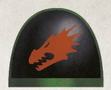

<!-- A0451-B0339 -->

原译文

The Pyroclasts 火山岩

**校订译文**

The Pyroclasts 焚火者

<!-- /A0451-B0339 -->

<!-- A0451-B0340 -->
**英文原文**

Captain Adrax Agatone,Master of the Arsenal

<!-- /A0451-B0340 -->

<!-- A0451-B0341 -->

原译文

连长阿德拉克斯·阿加顿，军械之主

**校订译文**

连长阿德拉克斯·阿伽顿，军械大师

<!-- /A0451-B0341 -->

<!-- A0451-B0342 -->

原译文

2 Lieutenants 2名副官

**校订译文**

2 Lieutenants 2名副官

<!-- /A0451-B0342 -->

<!-- A0451-B0343 -->

原译文

Company Ancient 连队旗手

**校订译文**

Company Ancient 连队旗手

<!-- /A0451-B0343 -->

<!-- A0451-B0344 -->

原译文

Company Champion 连队冠军

**校订译文**

Company Champion 连队冠军

<!-- /A0451-B0344 -->

<!-- A0451-B0345 -->

原译文

Company Veterans 连队老兵

**校订译文**

Company Veterans 连队老兵

<!-- /A0451-B0345 -->

<!-- A0451-B0346 -->

原译文

7 Battleline Squads 7个战线小队

**校订译文**

7 Battleline Squads 7个战线小队

<!-- /A0451-B0346 -->

<!-- A0451-B0347 -->

原译文

3 Fire Support Squads 3个火力支援小队

**校订译文**

3 Fire Support Squads 3个火力支援小队

<!-- /A0451-B0347 -->

<!-- A0451-B0348 -->

原译文

2 Close Support Squads 2个近战支援小队

**校订译文**

2 Close Support Squads 2个近战支援小队

<!-- /A0451-B0348 -->

<!-- A0451-B0349 -->

原译文

Dreadnoughts 无畏

**校订译文**

Dreadnoughts 无畏机甲

<!-- /A0451-B0349 -->

<!-- A0451-B0350 -->

原译文

Transport Vehicles 运输载具

**校订译文**

Transport Vehicles 运输载具

<!-- /A0451-B0350 -->

<!-- A0451-B0351 -->

原译文

Land Speeders 兰德速攻艇

**校订译文**

Land Speeders 兰德速攻艇

<!-- /A0451-B0351 -->

<!-- A0451-B0352 -->

原译文

Bikes 摩托

**校订译文**

Bikes 摩托

<!-- /A0451-B0352 -->

<!-- A0451-B0353 -->

原译文

4th Company 第四连队

**校订译文**

4th Company 第四连队

<!-- /A0451-B0353 -->

<!-- A0451-B0354 图片 -->
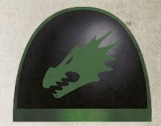

<!-- A0451-B0355 -->

原译文

The Branded 烙印者

**校订译文**

The Branded 烙印者

<!-- /A0451-B0355 -->

<!-- A0451-B0356 -->
**英文原文**

Captain Xavus,Master of the Fleet, Lord of the Burning Skies

<!-- /A0451-B0356 -->

<!-- A0451-B0357 -->

原译文

连长萨沃斯，舰队之主，燃空领主

**校订译文**

连长萨沃斯，舰队大师，燃空领主

<!-- /A0451-B0357 -->

<!-- A0451-B0358 -->

原译文

2 Lieutenants 2名副官

**校订译文**

2 Lieutenants 2名副官

<!-- /A0451-B0358 -->

<!-- A0451-B0359 -->

原译文

Company Ancient 连队旗手

**校订译文**

Company Ancient 连队旗手

<!-- /A0451-B0359 -->

<!-- A0451-B0360 -->

原译文

Company Champion 连队冠军

**校订译文**

Company Champion 连队冠军

<!-- /A0451-B0360 -->

<!-- A0451-B0361 -->

原译文

Company Veterans 连队老兵

**校订译文**

Company Veterans 连队老兵

<!-- /A0451-B0361 -->

<!-- A0451-B0362 -->

原译文

7 Battleline Squads 7个战线小队

**校订译文**

7 Battleline Squads 7个战线小队

<!-- /A0451-B0362 -->

<!-- A0451-B0363 -->

原译文

3 Fire Support Squads 3个火力支援小队

**校订译文**

3 Fire Support Squads 3个火力支援小队

<!-- /A0451-B0363 -->

<!-- A0451-B0364 -->

原译文

2 Close Support Squads 2个近战支援小队

**校订译文**

2 Close Support Squads 2个近战支援小队

<!-- /A0451-B0364 -->

<!-- A0451-B0365 -->

原译文

Dreadnoughts 无畏

**校订译文**

Dreadnoughts 无畏机甲

<!-- /A0451-B0365 -->

<!-- A0451-B0366 -->

原译文

Transport Vehicles 运输载具

**校订译文**

Transport Vehicles 运输载具

<!-- /A0451-B0366 -->

<!-- A0451-B0367 -->

原译文

Land Speeders 兰德速攻艇

**校订译文**

Land Speeders 兰德速攻艇

<!-- /A0451-B0367 -->

<!-- A0451-B0368 -->

原译文

Bikes 摩托

**校订译文**

Bikes 摩托

<!-- /A0451-B0368 -->

<!-- A0451-B0369 -->
### Reserve Companies 预备连队

<!-- /A0451-B0369 -->

<!-- A0451-B0370 -->

原译文

5th Company 第五连队

**校订译文**

5th Company 第五连队

<!-- /A0451-B0370 -->

<!-- A0451-B0371 图片 -->
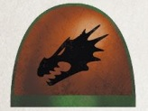

<!-- A0451-B0372 -->

原译文

The Drake Hunters' 火龙猎手

**校订译文**

The Drake Hunters' 火龙猎手

<!-- /A0451-B0372 -->

<!-- A0451-B0373 -->
**英文原文**

Captain Mulcebar, Master of the Rites

<!-- /A0451-B0373 -->

<!-- A0451-B0374 -->

原译文

连长穆尔西巴，祭仪之主

**校订译文**

连长穆尔西巴，祭仪大师

<!-- /A0451-B0374 -->

<!-- A0451-B0375 -->

原译文

2 Lieutenants 2名副官

**校订译文**

2 Lieutenants 2名副官

<!-- /A0451-B0375 -->

<!-- A0451-B0376 -->

原译文

Company Ancient 连队旗手

**校订译文**

Company Ancient 连队旗手

<!-- /A0451-B0376 -->

<!-- A0451-B0377 -->

原译文

Company Champion 连队冠军

**校订译文**

Company Champion 连队冠军

<!-- /A0451-B0377 -->

<!-- A0451-B0378 -->

原译文

Company Veterans 连队老兵

**校订译文**

Company Veterans 连队老兵

<!-- /A0451-B0378 -->

<!-- A0451-B0379 -->

原译文

8 Battleline Squads 8个战线小队

**校订译文**

8 Battleline Squads 8个战线小队

<!-- /A0451-B0379 -->

<!-- A0451-B0380 -->

原译文

4 Fire Support Squads 4个火力支援小队

**校订译文**

4 Fire Support Squads 4个火力支援小队

<!-- /A0451-B0380 -->

<!-- A0451-B0381 -->

原译文

Dreadnoughts 无畏

**校订译文**

Dreadnoughts 无畏机甲

<!-- /A0451-B0381 -->

<!-- A0451-B0382 -->

原译文

Transport Vehicles 运输载具

**校订译文**

Transport Vehicles 运输载具

<!-- /A0451-B0382 -->

<!-- A0451-B0383 -->

原译文

Land Speeders 兰德速攻艇

**校订译文**

Land Speeders 兰德速攻艇

<!-- /A0451-B0383 -->

<!-- A0451-B0384 -->

原译文

Bikes 摩托

**校订译文**

Bikes 摩托

<!-- /A0451-B0384 -->

<!-- A0451-B0385 -->

原译文

6th Company 第六连队

**校订译文**

6th Company 第六连队

<!-- /A0451-B0385 -->

<!-- A0451-B0386 图片 -->
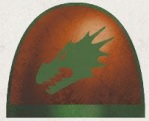

<!-- A0451-B0387 -->

原译文

Flamehammers 火焰之锤

**校订译文**

Flamehammers 火焰之锤

<!-- /A0451-B0387 -->

<!-- A0451-B0388 -->
**英文原文**

Captain Nehr Ur'Venn, Master of Relics

<!-- /A0451-B0388 -->

<!-- A0451-B0389 -->

原译文

连长奈尔·乌尔’文，遗物之主

**校订译文**

连长奈尔·乌尔’文，遗物大师

<!-- /A0451-B0389 -->

<!-- A0451-B0390 -->

原译文

2 Lieutenants 2名副官

**校订译文**

2 Lieutenants 2名副官

<!-- /A0451-B0390 -->

<!-- A0451-B0391 -->

原译文

Company Ancient 连队旗手

**校订译文**

Company Ancient 连队旗手

<!-- /A0451-B0391 -->

<!-- A0451-B0392 -->

原译文

Company Champion 连队冠军

**校订译文**

Company Champion 连队冠军

<!-- /A0451-B0392 -->

<!-- A0451-B0393 -->

原译文

Company Veterans 连队老兵

**校订译文**

Company Veterans 连队老兵

<!-- /A0451-B0393 -->

<!-- A0451-B0394 -->

原译文

4 Battleline Squads 4个战线小队

**校订译文**

4 Battleline Squads 4个战线小队

<!-- /A0451-B0394 -->

<!-- A0451-B0395 -->

原译文

8 Fire Support Squads 8个火力支援小队

**校订译文**

8 Fire Support Squads 8个火力支援小队

<!-- /A0451-B0395 -->

<!-- A0451-B0396 -->

原译文

Dreadnoughts 无畏

**校订译文**

Dreadnoughts 无畏机甲

<!-- /A0451-B0396 -->

<!-- A0451-B0397 -->

原译文

Transport Vehicles 运输载具

**校订译文**

Transport Vehicles 运输载具

<!-- /A0451-B0397 -->

<!-- A0451-B0398 -->

原译文

Land Speeders 兰德速攻艇

**校订译文**

Land Speeders 兰德速攻艇

<!-- /A0451-B0398 -->

<!-- A0451-B0399 -->

原译文

Bikes 摩托

**校订译文**

Bikes 摩托

<!-- /A0451-B0399 -->

<!-- A0451-B0400 -->
### Scout Company 侦察连队

<!-- /A0451-B0400 -->

<!-- A0451-B0401 -->

原译文

7th Company 第七连队

**校订译文**

7th Company 第七连队

<!-- /A0451-B0401 -->

<!-- A0451-B0402 图片 -->
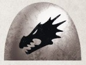

<!-- A0451-B0403 -->

原译文

Sons of Nocturne 夜曲星之子

**校订译文**

Sons of Nocturne 夜曲星之子

<!-- /A0451-B0403 -->

<!-- A0451-B0404 -->
**英文原文**

Captain Sol Ba'ken,Master of the Recruits

<!-- /A0451-B0404 -->

<!-- A0451-B0405 -->

原译文

连长索尔·巴’肯，新兵之主

**校订译文**

连长索尔·巴’肯，新兵大师

<!-- /A0451-B0405 -->

<!-- A0451-B0406 -->

原译文

2 Lieutenants 2名副官

**校订译文**

2 Lieutenants 2名副官

<!-- /A0451-B0406 -->

<!-- A0451-B0407 -->

原译文

Company Ancient 连队旗手

**校订译文**

Company Ancient 连队旗手

<!-- /A0451-B0407 -->

<!-- A0451-B0408 -->

原译文

Company Champion 连队冠军

**校订译文**

Company Champion 连队冠军

<!-- /A0451-B0408 -->

<!-- A0451-B0409 -->

原译文

Company Veterans 连队老兵

**校订译文**

Company Veterans 连队老兵

<!-- /A0451-B0409 -->

<!-- A0451-B0410 -->

原译文

12 Vanguard Squads 12个先锋小队

**校订译文**

12 Vanguard Squads 12个先锋小队

<!-- /A0451-B0410 -->

<!-- A0451-B0411 -->

原译文

Scouts 侦察兵

**校订译文**

Scouts 侦察兵

<!-- /A0451-B0411 -->

<!-- A0451-B0412 -->

原译文

Scout Bikes 侦察摩托

**校订译文**

Scout Bikes 侦察摩托

<!-- /A0451-B0412 -->

<!-- A0451-B0413 -->

原译文

Transport Vehicles 运输载具

**校订译文**

Transport Vehicles 运输载具

<!-- /A0451-B0413 -->

<!-- A0451-B0414 -->

原译文

Land Speeders 兰德速攻艇

**校订译文**

Land Speeders 兰德速攻艇

<!-- /A0451-B0414 -->

<!-- A0451-B0415 -->
**英文原文**

As of 980.M41, following the events of the Dragon Strife in 975.M41, the Salamanders began the inception of a 7th Battle Company - an event which has not occurred since before the 2nd Founding.

<!-- /A0451-B0415 -->

<!-- A0451-B0416 -->

原译文

截至980.M41，继975.M41的火龙冲突事件之后，火蜥蜴开始成立第七战斗连队，这是自二次建军以来从未发生过的事件。

**校订译文**

继975.M41火龙冲突之后，到980.M41，火蜥蜴开始着手建立第七个战斗连。这是第二次建军前以来未曾再有的举措。

**校注：** 原文称“第七个战斗连”，与上文七连编制中的第七侦察连并不等同；原稿资料时代与编制叙述存在差异，保留。

<!-- /A0451-B0416 -->

<!-- A0451-B0417 -->
### Company Descriptions 连队描述

<!-- /A0451-B0417 -->

<!-- A0451-B0418 -->
**英文原文**

The 1st Company, known as the Firedrakes. To join the ranks of the 1st one must not only be an experienced warrior but also a paragon of the Chapter's values. The 1st maintains a large amount of Terminator Squads alongside Sternguard Veterans and Venerable Dreadnoughts. Like all Companies the 1st maintains ceremonial ties with a settlement upon Nocturne, but they are unique in that they have no barracks on the planet. Instead, they dwell in the fortress-monastery on Prometheus. Here, the Firedrakes are responsible for some elements of Chapter command, directing training cadres or coordinating security protocols, honing their leadership skills even as they train. When attached to larger strike forces, squads of 1st Company Veterans are valued as much for their leadership and tactical advice as for their sheer destructive power. In this way, the 1st acts as a preparation body for Veteran Sergeants, officers, and ship captains. While Chapter Master Tu'Shan is the ceremonial lord of the 1st, in truth he oversees larger Chapter matters while his Lieutenants manage the Company. However the 1st does maintain the Honour Guard for the Chapter Master.

<!-- /A0451-B0418 -->

<!-- A0451-B0419 -->

原译文

第一连队，被称为火龙。要加入第一连队，不仅要成为一名经验丰富的战士，还要成为战团价值观的典范。第一连队与肃卫老兵和神圣无畏一起维持着大量的终结者小队。与所有连队一样，第一连队与夜曲星上的定居点保持着仪式关系，但他们的独特之处在于，他们在这个行星上没有军营。相反，他们住在普罗米修斯的堡垒修道院。在这里，火龙负责战团指挥的一些要素，指导培训干部或协调安全协议，在培训过程中磨练他们的领导技能。当隶属于更大的打击部队时，第一连队老兵小队因其领导力和战术建议而受到重视，也因其纯粹的破坏力而受到重视。通过这种方式，第一连队充当了老兵军士、军官和连长的预备役。虽然战团长图’杉是第一连队的礼节领主，但事实上，他监督更大的战团事务，而他的副官则管理连队。然而，第一连队确实为战团长维持了荣誉卫队。

**校订译文**

第一连，称为“火龙”。加入者不仅须身经百战，更要成为战团价值观的典范。该连拥有大量终结者小队，以及肃卫老兵和神圣无畏机甲。与其他连一样，他们与夜曲星的一座聚落保持礼仪上的联系，但独特之处在于不在行星地表设营，而是驻于普罗米修斯的要塞修道院。他们在那里分担部分战团指挥职责，如指导训练队伍、协调安保安排，在日常训练中不断磨练领导能力。编入较大打击部队时，第一连老兵小队不仅凭强大战力受到重视，也因其指挥能力与战术建议而备受倚重。第一连因此成为培养老兵军士、军官与舰长的摇篮。图杉虽在名义上统领该连，实际上主要处理战团大事，连队事务由其副官管理。战团长的荣誉卫队仍由第一连提供。

<!-- /A0451-B0419 -->

<!-- A0451-B0420 -->
**英文原文**

The 2nd Company, known as the Defenders of Nocturne. The 2nd best exemplifies the Salamanders compassionate attitude towards the most vulnerable citizens of the Imperium. Yet despite the detraction this sometimes brings, the 2nd's attitude has a practical purpose. They will save factory workers, only to have them boost munitions production for the next warzone. The 2nd is also the most ready to ally itself with other Imperial forces such as the Imperial Guard or Knights. Taking the leadership role in these deployments, the 2nd will transform bloated expeditions into coordinated alliances.

<!-- /A0451-B0420 -->

<!-- A0451-B0421 -->

原译文

第二连队，被称为夜曲星卫士。第二连队最好的例子是火蜥蜴对帝国最弱势公民的同情态度。然而，尽管这有时会带来贬损，但第二连队的态度是有实际意义的。他们将拯救工厂工人，只是为了让他们为下一个战区提高弹药产量。第二连队也是最愿意与帝国卫队或骑士等其他帝国军队结盟的。在这些部署中发挥领导作用，第二连队将把臃肿的探险队转变为协调的联盟。

**校订译文**

第二连，称为“夜曲星卫士”。他们最能体现火蜥蜴对帝国弱势民众的体恤，尽管有时因此受到非议，这种做法也具有实际价值：他们救出的工厂工人，能够提高弹药产量，支援下一个战区。第二连也最愿意与帝国卫队、帝国骑士等其他帝国力量合作。他们在联合作战中担任领导者，将组织臃肿的远征部队整合成协调一致的联盟。

<!-- /A0451-B0421 -->

<!-- A0451-B0422 -->
**英文原文**

The 3rd Company, known as the Pyroclasts. Even amongst a Chapter noted for its use of Flame Weapons, the 3rd always endeavours to close with their foe and unleash purging fire. As such, they are the Chapter's foremost answer to entrenched enemies. They also have the grim duty of purging populations condemned as heretic or xenos sympathizers. They are always careful to balance the Promethean Cult's teachings of protecting the weak with Vulkan's noted pragmatism.

<!-- /A0451-B0422 -->

<!-- A0451-B0423 -->

原译文

第三连队，被称为火山岩。即使在以使用火焰武器而闻名的战团中，第三连队也总是努力与敌人接近，并释放净化之火。因此，它们是战团对根深蒂固的敌人的首要回应。他们还肩负着清除被谴责为异端或异教徒同情者的民众的艰巨责任。他们总是小心翼翼地平衡普罗米修斯教派保护弱者的教义和沃坎著名的实用主义。

**校订译文**

第三连，称为“焚火者”。即使在以火焰武器闻名的火蜥蜴内部，他们也格外致力于迫近敌人，释放净化烈焰。因此，面对盘踞坚固阵地的敌军时，战团首先倚仗的便是第三连。他们还承担一项沉重职责：净化被判为异端或异形同情者的人群。他们始终谨慎权衡普罗米修斯教派保护弱者的训诫，与沃坎素来秉持的务实原则。

<!-- /A0451-B0423 -->

<!-- A0451-B0424 -->
**英文原文**

The 4th Company, known as the Branded. The 4th are the most closely tied to the Salamanders Reclusiam and admittance to the Company is a recognition of the Battle-Brother's faith and commitment. The 4th practices Brander-Priest rituals to an obsessive level, with nearly their entire body save their face becoming adorned with various brand-oaths. Tactically, the 4th specializes in close combat and short range firefights, often battling with a large number of Chaplains.

<!-- /A0451-B0424 -->

<!-- A0451-B0425 -->

原译文

第四连队，被称为烙印者。第四连队是与火蜥蜴隐修室关系最密切的，加入该连队是对战斗兄弟的信仰和承诺的认可。第四连队练习烙印祭司仪式到了痴迷的程度，除了脸，他们几乎全身都装饰着各种烙印誓言。从战术上讲，第四连队擅长近战和短程交火，经常与大量牧师共同作战。

**校订译文**

第四连，称为“烙印者”。他们与战团隐修室的联系最为紧密，获准加入该连，本身就是对战斗兄弟信仰与献身精神的认可。第四连对烙印祭司的仪式近乎痴迷，除面部外，几乎全身都布满各种誓言烙印。他们擅长近战与短距离交火，常有众多教士随队作战。

<!-- /A0451-B0425 -->

<!-- A0451-B0426 -->
**英文原文**

The 5th Company, known as the Drake Hunters. The 5th has a reputation of destroying large enemy constructs and alien horrors. Its members specialize in slaying the salamander drakes of Nocturne. As a Reserve Company, they rarely fight together but instead are used to reinforce other companies during campaigns. In battle, they favor acting as mobile weapons platforms instead of static defense and use a large amount of Dreadnoughts. They also make extensive use of attack craft and heavy gunships.

<!-- /A0451-B0426 -->

<!-- A0451-B0427 -->

原译文

第五连队，被称为火龙猎手。第五连队以摧毁敌方大型建筑和外星人恐怖而闻名。其成员专门捕杀夜曲星的火龙。作为预备连队，他们很少一起战斗，而是在战役期间用来增援其他连队。在战斗中，他们更喜欢充当移动武器平台，而不是静态防御，并使用大量无畏。他们还广泛使用攻击机和重型炮艇。

**校订译文**

第五连，称为“火龙猎手”。他们以摧毁敌方巨型造物、斩杀可怖异形而闻名，成员擅长猎杀夜曲星的火蜥蜴龙兽。作为预备连，他们很少全连作战，通常拆分支援其他连队。在战场上，他们偏爱以移动火力平台作战，而非固守防线，大量使用无畏机甲，也广泛运用攻击机与重型炮艇。

<!-- /A0451-B0427 -->

<!-- A0451-B0428 -->
**英文原文**

The 6th Company, known as the Flamehammers. Unlike many reserve companies which consist of Fire Support Squads and Battleline Squads, the 6th utilizes fast-moving transports alongside its heavy firepower. The 6th is usually the first Company in which new Battle-Brothers are first transferred after finishing their time as Scouts.

<!-- /A0451-B0428 -->

<!-- A0451-B0429 -->

原译文

第六连队，被称为火焰之锤。与许多由火力支援小队和战线小队组成的预备连队不同，第六连队在火力强大的同时使用快速移动的运输工具。第六连队通常是第一个新的战斗兄弟在完成侦察任务后首次被调往的连队。

**校订译文**

第六连，称为“火焰之锤”。与许多由火力支援小队和战线小队组成的预备连相比，他们格外重视将重火力与快速运输载具结合使用。新晋战斗兄弟结束侦察兵服役期后，通常首先被调入第六连。

<!-- /A0451-B0429 -->

<!-- A0451-B0430 -->
**英文原文**

The 7th Company, known as the Sons of Nocturne. The Warriors of the 7th consist of Vanguard and Scout troops. The 7th has slow and exacting standards for a Neophyte to be promoted to full Battle-Brother.

<!-- /A0451-B0430 -->

<!-- A0451-B0431 -->

原译文

第七连队，被称为夜曲星之子。第七连队的战士由先锋和侦察部队组成。对于新进者晋升为完全的战斗兄弟，第七连队有着缓慢而严格的标准。

**校订译文**

第七连，称为“夜曲星之子”，由先锋部队与侦察部队组成。该连对新进者晋升正式战斗兄弟的考察十分严格，整个过程也格外漫长。

<!-- /A0451-B0431 -->

<!-- A0451-B0432 -->
## Recruitment 招募

<!-- /A0451-B0432 -->

<!-- A0451-B0433 -->
**英文原文**

Like all Chapters, the rigors meted out to Aspirants recruited from the population of Nocturne are harsh and the deadly world makes for the perfect proving ground for these potential warriors. A large part of Salamanders training aims to transform the aspirant not only physically but also mentally, weeding out those who would not live up to the ideals espoused by Vulkan. Commonly, the first major challenge Aspirants face is a grueling march across Nocturne's ash wastes, braving native fauna. After this, they will oversee a series of challenges based around the concepts of earth and fire. What challenges are presented vary.

<!-- /A0451-B0433 -->

<!-- A0451-B0434 -->

原译文

与所有战团一样，从夜曲星人口中招募的有志者所面临的严酷考验是残酷的，致命的世界为这些潜在的战士提供了完美的试炼场。火蜥蜴训练的很大一部分旨在不仅在身体上而且在精神上改变有志者，淘汰那些不符合沃坎所倡导的理想的人。通常，有志者面临的第一个主要挑战是在夜曲星的灰烬废料中艰难跋涉，与当地动物搏斗。在此之后，他们将监督围绕大地和火的概念的一系列挑战。所面临的挑战各不相同。

**校订译文**

与其他战团一样，火蜥蜴对来自夜曲星居民中的候选者施以严酷考验；这颗致命世界，正是检验未来战士的理想场所。训练不仅塑造他们的身体，更锤炼其精神，淘汰无法践行沃坎理想的人。通常，第一项重大考验是艰难穿越夜曲星的灰烬荒原，直面当地野兽的威胁。之后，候选者还要接受围绕大地与火焰设计的一系列考验，具体内容并不固定。

**校注：** 英文 oversee 在此与候选者参加试炼的上下文不合，按经历后续考验译，未理解为候选者主持考核。

<!-- /A0451-B0434 -->

<!-- A0451-B0435 图片 -->
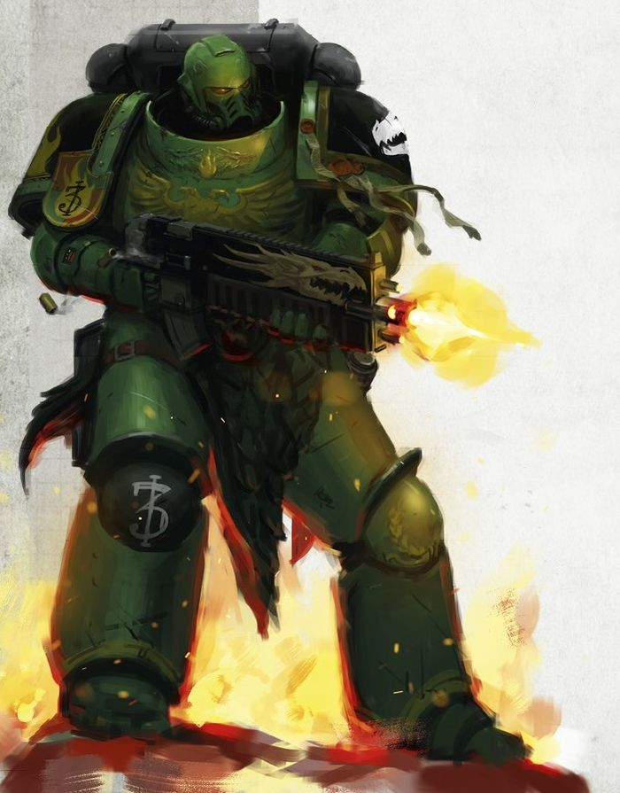

<!-- A0451-B0436 -->

原译文

Salamanders Primaris Space Marine 火蜥蜴原铸星际战士

**校订译文**

Salamanders Primaris Space Marine 火蜥蜴原铸星际战士

<!-- /A0451-B0436 -->

<!-- A0451-B0437 -->
**英文原文**

The Salamanders are noted to stipulate a long and arduous recruitment process for initiates. They start young, at around ages six or seven; for these first years the apprentice is merely that; a worker in the forge of a Space Marine, who will watch over and judge the prospects of the initiates. After some years, the apprentices are judged by the Chapter's Apothecaries and Chaplains in a series of examinations. Those successful will be taken for first-stage implantation. At set intervals throughout their training, the initiates must replicate feats performed by Vulkan in his youth, including those he performed in contest with the Emperor; this will culminate in them being required to hunt and slay a salamander. This final task sees the Initiate accepted as a full Battle-Brother, and they forever will preserve and respect the drake's hide as part of their duty as a warrior. Some warriors will wear the hide upon their Power Armour.

<!-- /A0451-B0437 -->

<!-- A0451-B0438 -->

原译文

众所周知，火蜥蜴为信徒规定了一个漫长而艰巨的招募过程。他们从六七岁左右开始；在最初的几年里，学徒只是这样；一名星际战士铸造厂的工人，他将监督和判断信徒的前景。几年后，学徒们会在一系列考试中接受战团药剂师和牧师的评判。成功者将进行第一阶段植入。在整个训练过程中，信徒必须每隔一段时间复制沃坎年轻时表演的技艺，包括他在与帝皇的比赛中表演的技艺；这将导致他们被要求猎杀火蜥蜴。在这最后一项任务中，信徒被接受为一名完全的战斗兄弟，他们将永远保护和尊重火龙的皮，这是他们作为战士职责的一部分。一些战士会在他们的动力盔甲上佩戴龙皮。

**校订译文**

火蜥蜴的招募过程以漫长艰苦著称。候选者通常六七岁便开始接受培养；最初几年，他们只是某位星际战士锻造工坊里的学徒，由这名战士观察并评估其潜力。数年后，战团药剂师与教士会通过一系列考核筛选学徒，合格者开始接受第一阶段的植入手术。在整个训练过程中，新兵必须定期重现沃坎年轻时完成的壮举，包括他与帝皇比试时的功业。最终考验是猎杀一头火蜥蜴龙兽。完成这一步后，新兵才获准成为正式的战斗兄弟，并将终身珍藏、敬重猎物的龙皮，视之为战士职责的一部分。有些人会将龙皮披在动力甲上。

<!-- /A0451-B0438 -->

<!-- A0451-B0439 -->
## Noted Elements of the Salamanders 火蜥蜴的著名成员

<!-- /A0451-B0439 -->

<!-- A0451-B0440 -->
### Relics and Artefacts 遗物和造物

<!-- /A0451-B0440 -->

<!-- A0451-B0441 -->

原译文

Artefacts of Vulkan 沃坎造物

**校订译文**

Artefacts of Vulkan 沃坎造物

<!-- /A0451-B0441 -->

<!-- A0451-B0442 -->
**英文原文**

Stormbearer, the personal weapon of Chapter Master Tu'Shan.

<!-- /A0451-B0442 -->

<!-- A0451-B0443 -->

原译文

风暴承载者，战团长图’杉的个人武器

**校订译文**

风暴承载者，战团长图杉的个人武器

<!-- /A0451-B0443 -->

<!-- A0451-B0444 -->

原译文

The Malleus Noctum 夜曲之锤

**校订译文**

The Malleus Noctum 夜曲之锤

<!-- /A0451-B0444 -->

<!-- A0451-B0445 -->
### Fleet 舰队

<!-- /A0451-B0445 -->

<!-- A0451-B0446 -->
**英文原文**

The Master of the Fleet of the Salamanders Chapter also holds the title of Lord of the Burning Skies. The Salamanders Fleet is based on Nocturne's moon Prometheus and as such, it plays host to a great dock where the chapters' Strike Cruisers and Battle Barges can be restored.

<!-- /A0451-B0446 -->

<!-- A0451-B0447 -->

原译文

火蜥蜴战团的舰队之主还拥有燃空领主的头衔。火蜥蜴舰队以夜曲星的卫星普罗米修斯为基地，因此，它拥有一个巨大的码头，在那里可以修复战团的打击巡洋舰和战斗驳船。

**校订译文**

火蜥蜴的舰队大师同时拥有“燃空领主”的头衔。舰队以夜曲星的卫星普罗米修斯为基地；卫星上的大型船坞能够维修战团的打击巡洋舰与战斗驳船。

<!-- /A0451-B0447 -->

<!-- A0451-B0448 -->
**英文原文**

Salamanders pilots ritually scar themselves with the dactyl sigil. Pilots are the only Salamanders allowed to scar their faces before the rest of their body.

<!-- /A0451-B0448 -->

<!-- A0451-B0449 -->

原译文

火蜥蜴飞行员会用指印给自己打上疤痕。飞行员是唯一被允许在身体其他部位之前在脸上留下疤痕的火蜥蜴。

**校订译文**

火蜥蜴飞行员会以仪式在身上刻下达克提尔符印。他们是唯一获准先在面部刻痕、再为身体其他部位刻痕的火蜥蜴。

**校注：** dactyl sigil 原稿译“指印”，此处为飞行员的仪式符号，缺少足够上下文确定造型，暂保留音译“达克提尔符印”，不径断为指纹。

<!-- /A0451-B0449 -->

<!-- A0451-B0450 -->
### Vessels & Gunships 战舰&炮艇

<!-- /A0451-B0450 -->

<!-- A0451-B0451 -->
**英文原文**

Flamewrought - Gloriana Class Battleship. Primarch's Vessel.

<!-- /A0451-B0451 -->

<!-- A0451-B0452 -->

原译文

火焰精炼号 - 荣光女王级战列舰，原体的战舰

**校订译文**

火焰精炼号 - 荣光女王级战列舰，原体的战舰

<!-- /A0451-B0452 -->

<!-- A0451-B0453 -->
### Vehicles 载具

<!-- /A0451-B0453 -->

<!-- A0451-B0454 -->
**英文原文**

Fire Drake - Land Raider Crusader.

<!-- /A0451-B0454 -->

<!-- A0451-B0455 -->

原译文

火龙号 - 兰德掠袭者十字军

**校订译文**

火龙号——十字军型兰德掠袭者战车。

<!-- /A0451-B0455 -->

<!-- A0451-B0456 -->
**英文原文**

Fire Anvil - Land Raider Redeemer.

<!-- /A0451-B0456 -->

<!-- A0451-B0457 -->

原译文

火焰铁砧号 - 兰德掠袭者救赎者

**校订译文**

火焰铁砧号——救赎者型兰德掠袭者战车。

<!-- /A0451-B0457 -->

<!-- A0451-B0458 -->
**英文原文**

Promethean - Land Raider Redeemer.

<!-- /A0451-B0458 -->

<!-- A0451-B0459 -->

原译文

普罗米修斯号 - 兰德掠袭者救赎者

**校订译文**

普罗米修斯号——救赎者型兰德掠袭者战车。

<!-- /A0451-B0459 -->

<!-- A0451-B0460 -->
**英文原文**

Immortal Anvil - Predator Annihilator.

<!-- /A0451-B0460 -->

<!-- A0451-B0461 -->

原译文

永恒铁砧号 - 掠食者歼灭者

**校订译文**

永恒铁砧号——歼灭者型掠食者战车。

<!-- /A0451-B0461 -->

<!-- A0451-B0462 -->
**英文原文**

Nocturnean - Predator Annihilator (Destroyed, circa 980.M41, Heletine).

<!-- /A0451-B0462 -->

<!-- A0451-B0463 -->

原译文

夜曲星号 - 掠食者歼灭者（摧毁，约980M41，赫勒廷）

**校订译文**

夜曲星号——歼灭者型掠食者战车，约于980.M41在赫勒廷被毁。

<!-- /A0451-B0463 -->

<!-- A0451-B0464 -->
**英文原文**

Strength of Xavier - Predator Annihilator

<!-- /A0451-B0464 -->

<!-- A0451-B0465 -->

原译文

泽维尔之力号 - 掠食者歼灭者

**校订译文**

泽维尔之力号——歼灭者型掠食者战车。

<!-- /A0451-B0465 -->

<!-- A0451-B0466 -->
**英文原文**

Vulcanus - Vindicator.

<!-- /A0451-B0466 -->

<!-- A0451-B0467 -->

原译文

火神号 - 维护者

**校订译文**

火神号——维护者战车。

<!-- /A0451-B0467 -->

<!-- A0451-B0468 -->
**英文原文**

Nocturne's Hammer - Rhino. The oldest Rhino still in existence.

<!-- /A0451-B0468 -->

<!-- A0451-B0469 -->

原译文

夜曲星之锤 - 犀牛，现存最古老的犀牛。

**校订译文**

夜曲星之锤号——犀牛战车，现存最古老的一辆犀牛战车。

<!-- /A0451-B0469 -->

<!-- A0451-B0470 -->
### Notable Members of the Salamanders 火蜥蜴著名成员

<!-- /A0451-B0470 -->

<!-- A0451-B0471 -->
### Heresy Era 叛乱时期

原题：Heresy Era 叛乱前

<!-- /A0451-B0471 -->

<!-- A0451-B0472 -->
**英文原文**

Vulkan - Primarch of the Salamanders.

<!-- /A0451-B0472 -->

<!-- A0451-B0473 -->

原译文

沃坎 - 火蜥蜴的原体

**校订译文**

沃坎 - 火蜥蜴的原体

<!-- /A0451-B0473 -->

<!-- A0451-B0474 -->
**英文原文**

Artellus Numeon - First Captain and Commander of the Pyre Guard

<!-- /A0451-B0474 -->

<!-- A0451-B0475 -->

原译文

阿泰勒斯·努梅昂 - 第一连长和烈焰守卫指挥官

**校订译文**

阿泰勒斯·努梅昂 - 第一连长和烈焰守卫指挥官

<!-- /A0451-B0475 -->

<!-- A0451-B0476 -->
**英文原文**

T'kell - Forgefather

<!-- /A0451-B0476 -->

<!-- A0451-B0477 -->

原译文

特凯尔 - 铸造之父

**校订译文**

特凯尔 - 铸造之父

<!-- /A0451-B0477 -->

<!-- A0451-B0478 -->
**英文原文**

Atesh Tarsa - Apothecary, survived the Drop Site Massacre and led survivors in a vengeance campaign from the Sisypheum

<!-- /A0451-B0478 -->

<!-- A0451-B0479 -->

原译文

阿特什·塔萨 - 药剂师，在登陆点大屠杀中幸存下来，并带领幸存者从西西弗姆号发起复仇战役

**校订译文**

阿泰什·塔尔萨——药剂师，登陆点大屠杀的幸存者，曾以西西弗姆号为基地，率其他幸存者展开复仇战役。

<!-- /A0451-B0479 -->

<!-- A0451-B0480 -->
**英文原文**

Cassian Vaughn - Original Legion Commander, later the Dreadnought Cassian Dracos

<!-- /A0451-B0480 -->

<!-- A0451-B0481 -->

原译文

卡西恩·沃恩 - 最初的军团指挥官，后来的无畏卡西安·德拉科斯

**校订译文**

卡西安·沃恩——军团最初的指挥官，后来被安置进无畏机甲，以卡西安·德拉科斯之名为人所知。

<!-- /A0451-B0481 -->

<!-- A0451-B0482 -->

原译文

Gravius 格拉维斯

**校订译文**

Gravius 格拉维斯

<!-- /A0451-B0482 -->

<!-- A0451-B0483 -->
**英文原文**

Barek Zytos - Draaksward

<!-- /A0451-B0483 -->

<!-- A0451-B0484 -->

原译文

巴雷克·兹托斯 - 火龙之剑

**校订译文**

巴雷克·兹托斯——火龙之剑护卫。

<!-- /A0451-B0484 -->

<!-- A0451-B0485 -->
**英文原文**

Igen Gargo - Draaksward

<!-- /A0451-B0485 -->

<!-- A0451-B0486 -->

原译文

伊根·伽戈 - 火龙之剑

**校订译文**

伊根·伽戈——火龙之剑护卫。

<!-- /A0451-B0486 -->

<!-- A0451-B0487 -->
**英文原文**

Atok Abidemi - Draaksward

<!-- /A0451-B0487 -->

<!-- A0451-B0488 -->

原译文

阿托克·阿比德米 - 火龙之剑

**校订译文**

阿托克·阿比德米——火龙之剑护卫。

<!-- /A0451-B0488 -->

<!-- A0451-B0489 -->
### Post-Heresy 叛乱后

<!-- /A0451-B0489 -->

<!-- A0451-B0490 -->
**英文原文**

Adrax Agatone - Captain of the 3rd Company.

<!-- /A0451-B0490 -->

<!-- A0451-B0491 -->

原译文

阿德拉克斯·阿加顿 - 第三连队的连长

**校订译文**

阿德拉克斯·阿伽顿 - 第三连队的连长

<!-- /A0451-B0491 -->

<!-- A0451-B0492 -->
**英文原文**

Argos - Master of the Forge.

<!-- /A0451-B0492 -->

<!-- A0451-B0493 -->

原译文

阿尔戈斯 - 铸造之主

**校订译文**

阿尔戈斯 - 铸造大师

<!-- /A0451-B0493 -->

<!-- A0451-B0494 -->
**英文原文**

Sol Ba'ken - 7th Company Captain.

<!-- /A0451-B0494 -->

<!-- A0451-B0495 -->

原译文

索尔·巴’肯 - 第七连队连长

**校订译文**

索尔·巴’肯 - 第七连队连长

<!-- /A0451-B0495 -->

<!-- A0451-B0496 -->
**英文原文**

Dak'ir - Librarian.

<!-- /A0451-B0496 -->

<!-- A0451-B0497 -->

原译文

达克'尔 - 智库

**校订译文**

达克'尔——智库员。

<!-- /A0451-B0497 -->

<!-- A0451-B0498 -->
**英文原文**

Ur'zan Drakgaard - 6th Company Captain.

<!-- /A0451-B0498 -->

<!-- A0451-B0499 -->

原译文

乌尔’赞·德拉克加德 - 第六连队连长

**校订译文**

乌尔’赞·德拉克加德 - 第六连队连长

<!-- /A0451-B0499 -->

<!-- A0451-B0500 -->
**英文原文**

Elysius - Chaplain.

<!-- /A0451-B0500 -->

<!-- A0451-B0501 -->

原译文

伊莱修斯 - 牧师

**校订译文**

伊莱修斯——教士。

<!-- /A0451-B0501 -->

<!-- A0451-B0502 -->
**英文原文**

Fugis - Apothecary.

<!-- /A0451-B0502 -->

<!-- A0451-B0503 -->

原译文

福吉斯 - 药剂师

**校订译文**

福吉斯 - 药剂师

<!-- /A0451-B0503 -->

<!-- A0451-B0504 -->
**英文原文**

Pellas Mir'san - Captain of the 2nd Company, the Winter Blade, Defender of Nocturne.

<!-- /A0451-B0504 -->

<!-- A0451-B0505 -->

原译文

佩拉斯·米尔’杉 - 第二连队的连长，寒冬之刃，夜曲星卫士

**校订译文**

佩拉斯·米尔’杉 - 第二连队的连长，寒冬之刃，夜曲星卫士

<!-- /A0451-B0505 -->

<!-- A0451-B0506 -->
**英文原文**

Pyriel - Librarian.

<!-- /A0451-B0506 -->

<!-- A0451-B0507 -->

原译文

派瑞尔 - 智库

**校订译文**

派瑞尔——智库员。

<!-- /A0451-B0507 -->

<!-- A0451-B0508 -->
**英文原文**

Tsu'Gan - Veteran Sergeant.

<!-- /A0451-B0508 -->

<!-- A0451-B0509 -->

原译文

苏’甘 - 老兵军士

**校订译文**

苏’甘 - 老兵军士

<!-- /A0451-B0509 -->

<!-- A0451-B0510 -->
**英文原文**

Tu'Shan - Chapter Master.

<!-- /A0451-B0510 -->

<!-- A0451-B0511 -->

原译文

图’杉 - 战团长

**校订译文**

图杉 - 战团长

<!-- /A0451-B0511 -->

<!-- A0451-B0512 -->
**英文原文**

Vulkan He'stan - Forgefather.

<!-- /A0451-B0512 -->

<!-- A0451-B0513 -->

原译文

伏尔甘·赫斯坦 - 铸造之父

**校订译文**

伏尔甘·赫斯坦 - 铸造之父

<!-- /A0451-B0513 -->

<!-- A0451-B0514 -->
**英文原文**

Xavier - Chaplain.

<!-- /A0451-B0514 -->

<!-- A0451-B0515 -->

原译文

泽维尔 - 牧师

**校订译文**

泽维尔——教士。

<!-- /A0451-B0515 -->

<!-- A0451-B0516 -->
### Unique Troops 独特部队

<!-- /A0451-B0516 -->

<!-- A0451-B0517 -->

原译文

Forgefathers 铸造之父

**校订译文**

Forgefathers 铸造之父

<!-- /A0451-B0517 -->

<!-- A0451-B0518 -->
**英文原文**

Forge Wardens (Heresy-era)

<!-- /A0451-B0518 -->

<!-- A0451-B0519 -->

原译文

铸炉看守（叛乱时期）

**校订译文**

铸炉看守（叛乱时期）

<!-- /A0451-B0519 -->

<!-- A0451-B0520 -->
**英文原文**

Firedrakes (Heresy-era)

<!-- /A0451-B0520 -->

<!-- A0451-B0521 -->

原译文

火龙（叛乱时期）

**校订译文**

火龙（叛乱时期）

<!-- /A0451-B0521 -->

<!-- A0451-B0522 -->
**英文原文**

Pyroclasts (Heresy-era)

<!-- /A0451-B0522 -->

<!-- A0451-B0523 -->

原译文

火山岩（叛乱时期）

**校订译文**

焚火者（叛乱时期）。

<!-- /A0451-B0523 -->

<!-- A0451-B0524 -->
**英文原文**

Sanctifiers (Heresy-era)

<!-- /A0451-B0524 -->

<!-- A0451-B0525 -->

原译文

净化者（叛乱时期）

**校订译文**

净化者（叛乱时期）

<!-- /A0451-B0525 -->

<!-- A0451-B0526 -->

原译文

Pyre Guard 烈焰守卫

**校订译文**

Pyre Guard 烈焰守卫

<!-- /A0451-B0526 -->

<!-- A0451-B0527 -->
## Trivia 琐事

<!-- /A0451-B0527 -->

<!-- A0451-B0528 -->
**英文原文**

In the 1st Edition, the Salamanders were not depicted as coal-black or naturally black in skin tone or possessing red eyes. This is clear on the cover of the Battle for Armageddon box cover art, which also depicted their symbol as being an actual salamander.

<!-- /A0451-B0528 -->

<!-- A0451-B0529 -->

原译文

在第一版中，火蜥蜴没有被描绘成煤黑色或自然黑色的肤色，也没有红眼睛。这一点在阿玛吉多顿之战的封面上很明显，封面上还将他们的象征描绘成一只真正的蝾螈。

**校订译文**

在第一版中，火蜥蜴并未被描绘成拥有煤黑或天然深色皮肤，也没有红色眼睛。《阿玛吉多顿之战》盒装封绘清楚地展现了这一点；当时的徽记也画成了一只真正的蝾螈。

<!-- /A0451-B0529 -->

<!-- A0451-B0530 -->
**英文原文**

The Salamanders were at one stage conceptualized as being black of skin tone; this was commonly interpreted (by the 'Eavy Metal painters as well as the fandom) to mean a natural black skin tone. In Fifth edition however, it was made clear that this meant actual black skin; as in jet black, coal black etc. Additionally, the Salamanders were also given 'burning' red eyes that actually glow.

<!-- /A0451-B0530 -->

<!-- A0451-B0531 -->

原译文

火蜥蜴曾一度被概念化为肤色呈黑色；这通常被（重金属画家和粉丝们）解释为自然的黑色肤色。然而，在第五版中，明确表示这意味着真正的黑色皮肤；如乌黑、煤黑等。此外，火蜥蜴还被赋予了“燃烧”的红眼睛，实际上会发光。

**校订译文**

火蜥蜴后来曾被设定为黑色肤色，官方重金属涂装团队（’Eavy Metal）与爱好者通常将其理解为人类自然的深色肤色。第五版则明确说明，这里指的是字面意义上的漆黑、煤黑等颜色；此外，他们还被赋予了真正发光、仿佛燃烧的红色双眼。

<!-- /A0451-B0531 -->

<!-- A0451-B0532 -->
## Conflicting sources 来源冲突

<!-- /A0451-B0532 -->

<!-- A0451-B0533 -->
**英文原文**

Pellas Mir'san is listed as 2nd Company Captain in Psychic Awakening: Faith and Fury, contradicting the earlier revelation in Codex Supplement: Salamanders (8th Edition) that N'kelm had replaced him as captain.

<!-- /A0451-B0533 -->

<!-- A0451-B0534 -->

原译文

佩拉斯·米尔’杉在 灵能觉醒：信仰与愤怒 中被列为第二连队连长，这与圣典补充：火蜥蜴（第8版）中早些时候的展示相矛盾，即恩'凯姆已经取代了他担任连长。

**校订译文**

《灵能觉醒：信仰与愤怒》将佩拉斯·米尔’杉列为第二连连长，而更早的《圣典增补：火蜥蜴》（第八版）已称恩’凯姆接替他出任连长。两部资料的说法存在冲突。

<!-- /A0451-B0534 -->

本篇核心术语与暂定项

以下列出本篇出现的英文原形及核心术语表用词。同形词可能指不同对象，具体词义以本篇正文和校注为准；单复数、别名和仅见于图注的名称可能尚未列入。完整候选见[术语表](../../术语表/双语术语候选.csv)。

| 英文 | 采用中文 | 状态 |
| --- | --- | --- |
| Space Marines | 星际战士 | 官方已核对 |
| Black Templars | 黑色圣堂 | 官方已核对 |
| Blood Angels | 圣血天使 | 官方已核对 |
| Space Wolves | 太空野狼 | 官方已核对 |
| Adeptus Mechanicus | 机械修会 | 官方已核对 |
| Imperial Guard | 帝国卫队 | 暂定·语境区分 |
| Death Guard | 死亡守卫 | 官方已核对 |
| Thousand Sons | 千子 | 官方已核对 |
| Eldar | 灵族 | 暂定·语境区分 |
| Dark Eldar | 黑暗灵族 | 暂定·旧称对应 |
| Tyranids | 泰伦虫族 | 官方已核对 |
| Necrons | 太空死灵 | 官方已核对 |
| Orks | 欧克蛮人 | 官方已核对 |
| Librarian | 智库员 | 官方已核对 |
| Terminator | 终结者 | 官方已核对 |
| Roboute Guilliman | 罗保特·基里曼 | 官方已核对 |
| Ultramarines | 极限战士 | 官方已核对 |
| Horus Heresy | 荷鲁斯之乱 | 官方已核对 |
| Warp | 亚空间 | 官方已核对 |
| Imperium of Man | 人类帝国 | 官方已核对 |
| Imperium | 帝国 | 暂定·简称 |
| Webway | 网道 | 暂定 |
| Sorcerer | 巫师 | 官方已核对 |
| Commorragh | 科摩罗 | 官方已核对 |
| Trazyn the Infinite | 无尽者塔拉辛 | 官方已核对 |
| Promethean | 普罗米修斯学派 | 暂定·学派语境 |
| Indomitus | 不屈学派 | 暂定·学派语境 |
| History | 历史 | 编辑用语已统一 |
| Equipment | 装备 | 编辑用语已统一 |
| Administratum | 内政部 | 暂定 |
| Adeptus Administratum | 内政部 | 暂定 |
| Phalanx | 山阵号 | 暂定 |
| Emperor of Mankind | 人类帝皇 | 暂定 |
| Emperor | 帝皇 | 官方已核对 |
| Primarch | 原体 | 官方已核对 |
| Shrine World | 圣地世界 | 暂定·官方待核 |
| Abhuman | 亚人 | 暂定·官方待核 |
| Goge Vandire | 高戈·范迪尔 | 暂定·官方待核 |
| Magos Biologis | 生物贤者 | 暂定·官方待核 |
| Black Legion | 黑色军团 | 暂定·官方待核 |
| Emperor's Children | 帝皇之子 | 官方已核对 |
| Iron Warriors | 钢铁勇士 | 暂定·官方待核 |
| Night Lords | 午夜领主 | 暂定·官方待核 |
| Sautekh Dynasty | 索泰克王朝 | 暂定·官方待核 |
| Great Crusade | 大远征 | 暂定·官方待核 |
| Compliance | 归顺；纳入帝国统治 | 暂定·官方待核 |
| Terra | 泰拉 | 暂定·官方待核 |
| Horus | 荷鲁斯 | 暂定·官方待核 |
| Isstvan III | 伊斯塔万三号 | 暂定·官方待核 |
| Iron Hands | 钢铁之手 | 暂定·官方待核 |
| Fulgrim | 福格瑞姆 | 官方已核对 |
| High Lords of Terra | 泰拉高领主 | 暂定·官方待核 |
| Imperium Nihilus | 帝国暗面 | 暂定·官方待核 |
| Indomitus Crusade | 不屈远征 | 暂定·官方待核 |
| Legiones Astartes | 阿斯塔特军团 | 暂定·官方待核 |
| Unification Wars | 统一战争 | 暂定·官方待核 |
| Sector | 星区 | 暂定·官方待核 |
| Perpetual | 永生者 | 暂定·官方待核 |
| Fulgurite | 雷击石 | 暂定·官方待核 |
| John Grammaticus | 约翰·格拉马迪库斯 | 暂定·官方待核 |
| Vulkan | 沃坎 | 暂定·官方待核 |
| Protector | 守护者 | 暂定·官方待核 |
| Redeemer | 救赎者 | 暂定·官方待核 |
| Salamanders | 火蜥蜴 | 暂定·官方待核 |
| Konrad Curze | 康拉德·科兹 | 暂定·官方待核 |
| Armageddon | 阿玛吉多顿 | 暂定·官方待核 |
| Badab | 巴达布 | 暂定·官方待核 |
| Mezoa | 梅佐亚 | 暂定·官方待核 |
| Nocturne | 夜曲星 | 暂定·官方待核 |
| Luna | 月球 | 暂定·官方待核 |
| Damnos | 达蒙斯 | 暂定·官方待核 |
| Chemos | 彻莫斯 | 暂定·官方待核 |
| Reth | 瑞斯 | 暂定·官方待核 |
| Macragge | 马库拉格 | 暂定·官方待核 |
| Land Raider | 兰德掠袭者战车 | 官方已核对 |
| Imperium Secundus | 第二帝国 | 暂定·官方待核 |
| Zytos | 赛托斯 | 暂定·官方待核 |
| Slab | 肉砖 | 暂定·官方待核 |
| Clear | 清明 | 暂定·官方待核 |
| Chief Librarian | 首席智库员 | 暂定·官方待核 |
| Master | 导师（审判庭职衔）／舰务官（舰员职务） | 语境定译·官方待核 |
| Neophyte | 新进者 | 暂定 |
| Cardinal | 红衣主教 | 暂定 |
| Master of Sanctity | 圣洁导师 | 暂定·官方待核 |
| Reclusiam | 隐修圣殿 | 暂定·官方待核 |
| Xavier | 泽维尔 | 暂定·官方待核 |
| Master of the Forge | 铸造大师 | 暂定·官方待核 |
| Chief Apothecary | 首席药剂师 | 暂定·官方待核 |
| Master of the Watch | 守望大师 | 暂定·官方待核 |
| Master of the Arsenal | 军械大师 | 暂定·官方待核 |
| Master of the Fleet | 舰队大师 | 暂定·官方待核 |
| Master of the Rites | 祭仪大师 | 暂定·官方待核 |
| Master of Relics | 遗物大师 | 暂定·官方待核 |
| Master of the Recruits | 新兵大师 | 暂定·官方待核 |
| Chaplain | 教士 | 官方已核对 |
| Apothecary | 药剂师 | 官方已核对 |
| Fabius Bile | 法比乌斯·拜尔 | 官方已核对 |
| Ancient | 旗手 | 官方已核对 |
| Rhino | 犀牛战车 | 官方已核对 |
| Vindicator | 维护者战车 | 官方已核对 |
| Predator Annihilator | 歼灭者型掠食者战车 | 官方已核对 |
| Talisman of Seven Hammers | 七锤护身符 | 暂定·官方待核 |
| Draaksward | 火龙之剑护卫 | 暂定·官方待核 |
| Aspirant | 候补骑士 | 暂定·官方待核 |
| Shadrak Meduson | 沙德拉克·梅杜森 | 暂定·官方待核 |
| Space Marine Legion | 星际战士军团 | 暂定·官方待核 |
| Honour Guard | 荣誉卫队 | 暂定·官方待核 |
| Lord Commander | 领主指挥官 | 暂定·官方待核 |
| Alpha Legion | 阿尔法军团 | 暂定·官方待核 |
| Raven Guard | 暗鸦守卫 | 官方已核 |
| The Mezoan Campaign | 梅佐安战役 | 暂定·官方待核 |
| Artellus Numeon | 阿泰勒斯·努梅昂 | 暂定·官方待核 |
| Barek Zytos | 巴雷克·齐托斯 | 暂定·官方待核 |
| Igen Gargo | 伊根·加戈 | 暂定·官方待核 |
| Atesh Tarsa | 阿泰什·塔尔萨 | 暂定·官方待核 |
| Disciples of the Flames | 火焰门徒 | 暂定·官方待核 |
| Founding | 建军 | 暂定·官方待核 |
| Sol | 太阳系 | 暂定·官方待核 |
| Isstvan | 伊斯塔万 | 暂定·官方待核 |
| Cassian Vaughn | 卡索·沃恩 | 暂定·官方待核 |
| First Captain | 第一连长 | 暂定·官方待核 |
| Silver Skulls | 银色颅骨 | 暂定·官方待核 |
| Power Armour | 动力盔甲 | 暂定·官方待核 |
| Space Marine | 星际战士 | 暂定·官方待核 |
| Chapter | 战团 | 暂定·官方待核 |
| Fortress-monastery | 要塞修道院 | 暂定·官方待核 |
| Chapter Master | 战团长 | 暂定·官方待核 |
| Captain | 连长 | 暂定·官方待核 |
| Veteran | 老兵 | 暂定·官方待核 |
| Sergeant | 军士 | 暂定·官方待核 |
| Brother | 修士 | 暂定·官方待核 |
| Devastator | 破坏者 | 暂定·官方待核 |
| Scout | 侦察兵 | 暂定·官方待核 |
| Vanguard | 先锋 | 暂定·官方待核 |
| Battle-Brother | 战斗兄弟 | 暂定·官方待核 |
| Vulkan He'stan | 伏尔甘·赫斯坦 | 暂定·官方待核 |
| Adrax Agatone | 阿德拉克斯·阿伽顿 | 官方已核 |
| Codex Astartes | 阿斯塔特圣典 | 暂定·官方待核 |
| Black Dragons | 黑龙 | 暂定·官方待核 |
| Ultima Founding | 极限建军 | 暂定·官方待核 |
| Covenant of Fire | 火焰圣约 | 暂定·官方待核 |
| Dark Krakens | 黑暗海妖 | 暂定·官方待核 |
| Dragonspears | 龙矛 | 暂定·官方待核 |
| Hammers of Nocturne | 夜曲星之锤 | 暂定·官方待核 |
| Iron Drakes | 钢铁龙兽 | 暂定·官方待核 |
| The War of Flames | 火焰战争 | 暂定·官方待核 |
| The Black Templars | 黑色圣堂 | 暂定·官方待核 |
| Land Speeders | 兰德速攻艇 | 暂定·官方待核 |
| Forgefather | 铸造之父 | 暂定·官方待核 |
| Sternguard Veterans | 肃卫老兵 | 暂定·官方待核 |
| Devastator Squads | 破坏者小队 | 暂定·官方待核 |
| Overlord | 霸主 | 官方已核对 |
| Exemplars | 模范者 | 暂定·官方待核 |
| Howling Griffons | 咆哮狮鹫 | 暂定·官方待核 |
| Legion of the Damned | 诅咒军团 | 暂定·官方待核 |
| Marines Malevolent | 恶意战士 | 暂定·官方待核 |
| Redeemers | 救赎者 | 暂定·官方待核 |
| Storm Giants | 风暴巨人 | 暂定·官方待核 |
| Codex Chapter | 圣典战团 | 暂定·官方待核 |
| Gene-seed | 基因种子 | 暂定·官方待核 |
| Gloriana Class Battleship | 荣光女王级战列舰 | 暂定·官方待核 |
| Strike Cruiser | 打击巡洋舰 | 暂定·官方待核 |
| Master of the Chapter | 战团长 | 暂定·官方待核 |
| Reserve Companies | 预备连队 | 暂定·官方待核 |
| Terminator Squads | 终结者小队 | 暂定·官方待核 |
| Artificer | 技工 | 暂定·官方待核 |
| Brander-Priest | 烙印祭司 | 暂定·官方待核 |
| Tu'Shan | 图杉 | 暂定·官方待核 |
| Ur'zan Drakgaard | 乌尔赞·德拉克加德 | 暂定·官方待核 |
| Veteran Sergeants | 老兵军士 | 暂定·官方待核 |
| Initiates | 进阶者 | 官方已核 |
| Virtues | 力天使 | 暂定·官方待核 |
| Host | 天军 | 暂定·官方待核 |
| Ash Wastes | 灰烬荒原 | 暂定·官方待核 |
| Xenos | 异形 | 暂定·官方待核 |
| Initiate | 正式成员 | 暂定·官方待核 |
| Flamers | 火妖（奸奇单位）／火焰喷射器（武器） | 语境定译·对应官译已核 |
| Horde | 部落 | 暂定·官方待核 |
| Land Raider Redeemer | 救赎者型兰德掠袭者战车 | 官方已核对 |
| Raider | 掠袭者飞艇 | 官方已核对 |
| Speed Freeks | 极速怪胎 | 暂定·官方待核 |
| Charadon | 查拉顿 | 暂定·官方待核 |
| Arch-Arsonist | 头号纵火狂 | 暂定·官方待核 |
| Pale Stars | 苍白群星 | 暂定·官方待核 |
| Iydris | 伊德瑞斯 | 暂定·官方待核 |
| Power Klaw | 动力爪 | 暂定·官方待核 |
| Strike Force Ultra | 超级打击部队 | 暂定·官方待核 |
| Ethnarchy | 族政国 | 暂定·官方待核 |
| Time of Trial | 审判之时 | 暂定·官方待核 |
| Soulsmelter | 熔魂者 | 暂定·官方待核 |
| Fire-Sight | 火焰视觉 | 暂定·官方待核 |
| Noosphere | 思维空间 | 暂定·官方待核 |
| Fireborn | 火焰之子 | 暂定·官方待核 |
| Rituals of Interment and Ascension | 安葬与晋升仪式 | 暂定·官方待核 |
| dactyl sigil | 达克提尔符印 | 暂定·官方待核 |
| Pantheon Council | 万神殿议会 | 暂定·官方待核 |
| T'kell | 特凯尔 | 暂定·官方待核 |
| Angron | 安格隆 | 官方已核对 |
| Burning Eyes | 燃烧之眼 | 暂定·官方待核 |
| Dreadnought | 无畏机甲 | 暂定·官方待核 |
| Vengeance | 复仇号 | 暂定·官方待核 |
| Venerable Dreadnoughts | 神圣无畏机甲 | 暂定·官方待核 |
| Bikes | 摩托 | 暂定·官方待核 |
| Sisypheum | 西西弗姆号 | 暂定·官方待核 |
| Chaplains | 教士 | 暂定·官方待核 |
| Cassian | 卡西安 | 暂定·官方待核 |
| Brand | 布兰德 | 暂定·官方待核 |
| Firedrakes | 火龙 | 暂定·官方待核 |
| Argos | 阿尔戈斯 | 暂定·官方待核 |
| Defenders of Nocturne | 夜曲星卫士 | 暂定·官方待核 |
| Pyroclasts | 焚火者 | 暂定·官方待核 |
| Branded | 烙印者 | 暂定·官方待核 |
| Flamehammers | 火焰之锤 | 暂定·官方待核 |
| Sons of Nocturne | 夜曲星之子 | 暂定·官方待核 |
| Flamewrought | 火焰精炼号 | 暂定·官方待核 |
| Fire Drake | 火龙号 | 暂定·官方待核 |
| Fire Anvil | 火焰铁砧号 | 暂定·官方待核 |
| Immortal Anvil | 永恒铁砧号 | 暂定·官方待核 |
| Nocturnean | 夜曲星号 | 暂定·官方待核 |
| Strength of Xavier | 泽维尔之力号 | 暂定·官方待核 |
| Vulcanus | 火神号 | 暂定·官方待核 |
| Nocturne's Hammer | 夜曲星之锤号 | 暂定·官方待核 |
| Atok Abidemi | 阿托克·阿比德米 | 暂定·官方待核 |
| Sol Ba'ken | 索尔·巴’肯 | 暂定·官方待核 |
| Dak'ir | 达克'尔 | 暂定·官方待核 |
| Elysius | 伊莱修斯 | 暂定·官方待核 |
| Fugis | 福吉斯 | 暂定·官方待核 |
| Pellas Mir'san | 佩拉斯·米尔’杉 | 暂定·官方待核 |
| Pyriel | 派瑞尔 | 暂定·官方待核 |
| Tsu'Gan | 苏’甘 | 暂定·官方待核 |
| Pyre Guard | 烈焰守卫 | 暂定·官方待核 |
| Revelation | 启示 | 暂定·官方待核 |
| The Key | 钥匙 | 暂定·官方待核 |
| The Anvil | 铁砧星堡 | 暂定·官方待核 |
| Perigno | 佩里尼奥 | 暂定·官方待核 |
| Promethean Cult | 普罗米修斯教派 | 暂定·官方待核 |
| War of Flames | 火焰战争 | 暂定·官方待核 |
| Caretakers | 看护者 | 暂定·官方待核 |
| Kharaatan | 哈拉坦 | 暂定·官方待核 |
| Unbound Flame | 无拘之火 | 暂定·官方待核 |
| Mount Deathfire | 死火山 | 暂定·官方待核 |
| Cassian Dracos | 卡西安·德拉科斯 | 暂定·官方待核 |
| Ebon Drake | 黑檀龙兽号 | 暂定·官方待核 |
| Dwell | 德威尔 | 暂定·官方待核 |
| The Dark | 《黑暗》 | 暂定·官方待核 |
| The Blood | 鲜血 | 暂定·官方待核 |
| Tochran Crusade | 托克兰远征 | 暂定·官方待核 |
| Zero | 零世界 | 暂定·官方待核 |
| Spear of Vulkan | 沃坎之矛 | 暂定·官方待核 |
| Price | 普莱斯 | 暂定·官方待核 |
| System | 星系（恒星系统） | 暂定·官方待核 |
| Hive City | 巢都城市 | 暂定·官方待核 |
| Noctis Aeterna | 永恒之夜 | 暂定·官方待核 |
| Cardinal World | 红衣主教世界 | 暂定·官方待核 |
| Heletine | 赫勒廷 | 暂定·官方待核 |
| Phaistos Osiris | 费斯托斯·奥西里斯 | 暂定·官方待核 |
| Mining World | 矿业世界 | 暂定·官方待核 |
| Assault on the Tempest Galleries | 暴风回廊突袭 | 暂定·官方待核 |
| Hive Helsreach | 赫尔斯利奇巢都 | 暂定·官方待核 |
| Astral Claws | 星辰之爪 | 暂定·官方待核 |
| Regency | 摄政区 | 暂定·官方待核 |
| One-Five-Four Four | 154-4 | 暂定·官方待核 |
| Promethium | 钷素 | 暂定·官方待核 |
| Lament | 哀悼 | 暂定·官方待核 |
| Flame Weapons | 火焰武器 | 暂定·官方待核 |
| Melta Weapons | 热熔武器 | 暂定·官方待核 |
| Pyre Desert | 葬火沙漠 | 暂定·官方待核 |
| Pyreum | 派瑞姆 | 暂定·官方待核 |
| Terminator Armour | 终结者盔甲 | 暂定·官方待核 |
| Artificer Armour | 精工盔甲 | 暂定·官方待核 |
| Ascendant | 升腾星堡 | 暂定·官方待核 |
| Land Raider Crusader | 十字军型兰德掠袭者战车 | 官方已核对 |

