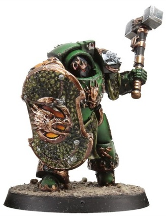
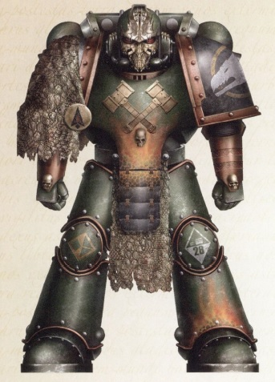

# 0453 火龙 Firedrake

精校状态：中文行文已逐段精校，部分术语仍为暂定

分类：通用概念 / 帝国 Imperium / 中央政务部 Adeptus Terra / 阿斯塔特修会 Adeptus Astartes

原文来源：https://www.bilibili.com/opus/1022838910994087938

原作者：帝国神选罐头

原文时间：2025年01月16日 08:17

[返回分类目录](目录.md) · [全书目录](../../目录.md)

<!-- A0453-B0001 -->
**英文原文**

The Firedrakes were the elite Terminators of the Salamanders Space Marine Legion during the Great Crusade and Horus Heresy.

<!-- /A0453-B0001 -->

<!-- A0453-B0002 -->

原译文

火龙是大远征和荷鲁斯叛乱期间火蜥蜴星际战士军团的精英终结者。

**校订译文**

火龙是大远征和荷鲁斯之乱期间火蜥蜴星际战士军团的精英终结者。

<!-- /A0453-B0002 -->

<!-- A0453-B0003 图片 -->

<!-- A0453-B0004 -->

原译文

Firedrake Terminator 火龙终结者

**校订译文**

Firedrake Terminator 火龙终结者

<!-- /A0453-B0004 -->

<!-- A0453-B0005 -->
## Overview 概述

<!-- /A0453-B0005 -->

<!-- A0453-B0006 -->
**英文原文**

They were chosen not simply because of their skill but also because of their resilience, discipline, and self-sacrificing nature (these being the traits that the Promethean Cult holds in the highest esteem). Firedrakes possessed a singular focus in battle which bordered on preternatural and legendary resilience - a matter as much to do with their willpower as their superhuman physiology. Firedrakes could be found fulfilling numerous rules throughout the Salamanders ranks rather than concentrated into elitist cadres (as was the case in most other Legions). The exception to this, however, was the Pyre Guard, who served as Vulkan's praetorian guard and advisers.

<!-- /A0453-B0006 -->

<!-- A0453-B0007 -->

原译文

他们之所以被选中，不仅是因为他们的技能，还因为他们的韧性、纪律性和自我牺牲的天性（这些是普罗米修斯教派最推崇的特质）。火龙在战斗中具有一种独特的专注力，这种专注力近乎超自然和传奇般的韧性——这与他们的意志力和超人的生理一样重要。火龙可以被发现是在整个火蜥蜴军团的各级中履行众多角色，而不是像大多数其他军团那样集中到精英干部中。然而，烈焰守卫是个例外，他们担任沃坎的禁卫军和顾问。

**校订译文**

他们获选，不仅因为武艺精湛，也因为坚韧、守纪和勇于牺牲；这些都是普罗米修斯教派最推崇的品质。火龙在战斗中的专注近乎超凡，耐力更是传奇。他们的坚韧既源于超人的生理构造，也源于顽强意志。与多数军团将精英集中编成专队的做法不同，火龙分布于火蜥蜴各部，承担多种职责。烈焰守卫是例外：他们集中担任沃坎的近卫与顾问。

<!-- /A0453-B0007 -->

<!-- A0453-B0008 图片 -->

<!-- A0453-B0009 -->

原译文

Firedrake during the Horus Heresy 荷鲁斯叛乱期间的火龙

**校订译文**

Firedrake during the Horus Heresy 荷鲁斯之乱期间的火龙

<!-- /A0453-B0009 -->

<!-- A0453-B0010 -->
**英文原文**

Following the Horus Heresy, the Firedrakes were made the First Company of the Salamanders Chapter. The Captain of the Firedrakes also serves as Regent of Nocturne and Chapter Master, as the Salamanders believe that Vulkan lives and will return to lead the Chapter once more. For operations involving the Firedrakes, the senior Veteran Sergeant is chosen to lead the Firedrakes when the Chapter Master is unable to so.

<!-- /A0453-B0010 -->

<!-- A0453-B0011 -->

原译文

在荷鲁斯叛乱之后，火龙成为了火蜥蜴战团的第一连队。火龙连长同时担任夜曲星摄政王和战团长，因为火蜥蜴相信沃坎还活着，并将再次回来领导战团。对于涉及火龙的行动，当连长无法领导火龙时，会选择老兵军士长来领导火龙。

**校订译文**

荷鲁斯之乱后，火龙编成火蜥蜴战团的第一连。连长兼任夜曲星摄政与战团长，因为火蜥蜴相信沃坎仍然活着，终将归来，再次率领战团。当战团长无法亲自指挥火龙作战时，会选出资历最高的老兵军士统领部队。

**校注：** 英文此篇作 Regent of Nocturne 夜曲星摄政，451 篇作 Regent of Prometheus 普罗米修斯摄政；保留来源差异。senior Veteran Sergeant 为资历较深的老兵军士，非新造“军士长”职衔。

<!-- /A0453-B0011 -->

<!-- A0453-B0012 -->
**英文原文**

Today, Firedrakes are the only Salamanders whose home garrison is not amongst the civilian population of Nocturne. They instead serve as the guardians of the Salamanders Fortress-Monastery of Prometheus. They are singular fighters who favor Heavy Flamers, Thunder Hammers, and Storm Shields.

<!-- /A0453-B0012 -->

<!-- A0453-B0013 -->

原译文

如今，火龙是唯一其驻防主场不在夜曲星平民之中的火蜥蜴。他们转而担任普罗米修斯的火蜥蜴要塞修道院的守护者。他们是喜欢重型火焰枪、雷霆锤和风暴盾的非凡战士。

**校订译文**

如今，火龙是唯一不与夜曲星平民共同驻居的火蜥蜴。他们驻守普罗米修斯的战团要塞修道院，担任其守护者。这些出类拔萃的战士偏爱重型火焰喷射器、雷霆锤与风暴盾。

<!-- /A0453-B0013 -->

本篇核心术语与暂定项

以下列出本篇出现的英文原形及核心术语表用词。同形词可能指不同对象，具体词义以本篇正文和校注为准；单复数、别名和仅见于图注的名称可能尚未列入。完整候选见[术语表](../../术语表/双语术语候选.csv)。

| 英文 | 采用中文 | 状态 |
| --- | --- | --- |
| Horus Heresy | 荷鲁斯之乱 | 官方已核对 |
| Promethean | 普罗米修斯学派 | 暂定·学派语境 |
| Great Crusade | 大远征 | 暂定·官方待核 |
| Horus | 荷鲁斯 | 暂定·官方待核 |
| Vulkan | 沃坎 | 暂定·官方待核 |
| Salamanders | 火蜥蜴 | 暂定·官方待核 |
| Nocturne | 夜曲星 | 暂定·官方待核 |
| Master | 导师（审判庭职衔）／舰务官（舰员职务） | 语境定译·官方待核 |
| Praetorian | 禁卫兵 | 暂定·官方待核 |
| Space Marine Legion | 星际战士军团 | 暂定·官方待核 |
| Vulkan Lives | 沃坎永生 | 暂定·官方待核 |
| Space Marine | 星际战士 | 暂定·官方待核 |
| Chapter | 战团 | 暂定·官方待核 |
| Fortress-monastery | 要塞修道院 | 暂定·官方待核 |
| Chapter Master | 战团长 | 暂定·官方待核 |
| Captain | 连长 | 暂定·官方待核 |
| Veteran | 老兵 | 暂定·官方待核 |
| Terminators | 终结者 | 暂定·官方待核 |
| Sergeant | 军士 | 暂定·官方待核 |
| Flamers | 火妖（奸奇单位）／火焰喷射器（武器） | 语境定译·对应官译已核 |
| Firedrakes | 火龙 | 暂定·官方待核 |
| Pyre Guard | 烈焰守卫 | 暂定·官方待核 |
| Promethean Cult | 普罗米修斯教派 | 暂定·官方待核 |

