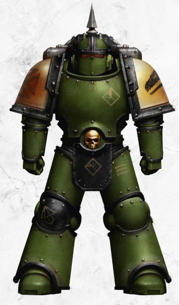

# 0455 净化者 Sanctifier

精校状态：中文行文已逐段精校，部分术语仍为暂定

分类：通用概念 / 帝国 Imperium / 中央政务部 Adeptus Terra / 阿斯塔特修会 Adeptus Astartes

原文来源：https://www.bilibili.com/opus/1032883636956823584

原作者：帝国神选罐头

原文时间：2025年02月12日 09:56

[返回分类目录](目录.md) · [全书目录](../../目录.md)

<!-- A0455-B0001 -->
**英文原文**

The Sanctifiers were close-quarters warfare specialist formations of the Salamanders Legion during the Great Crusade and Horus Heresy.

<!-- /A0455-B0001 -->

<!-- A0455-B0002 -->

原译文

净化者是大远征和荷鲁斯叛乱期间火蜥蜴军团的近距离作战专家编队。

**校订译文**

净化者是大远征与荷鲁斯之乱时期，火蜥蜴军团专精近距离作战的部队。

<!-- /A0455-B0002 -->

<!-- A0455-B0003 图片 -->

<!-- A0455-B0004 -->

原译文

Sanctifier 净化者

**校订译文**

Sanctifier 净化者

<!-- /A0455-B0004 -->

<!-- A0455-B0005 -->
**英文原文**

These experienced veterans were called upon by their Legion for pacification or containment missions, where they would be deployed for navigating tight corridors in anything from urban hive environments, to subterranean passages and starship corridors. Wielding a great variety of weapons, including Bolt Pistols and Rotor Cannons, on the battlefield they had great tactical flexibility beyond that of standard Tactical or Support squads and this often saw them deployed in missions where other Legions would have deployed Destroyer units.

<!-- /A0455-B0005 -->

<!-- A0455-B0006 -->

原译文

这些经验丰富的老兵被他们的军团召唤执行安抚或控制任务，他们将被部署在从巢都环境到地下通道和战舰走廊的任何狭窄通道中。他们在战场上挥舞着各种各样的武器，包括爆矢手枪和旋转炮，具有超越标准战术或支援小队的巨大战术灵活性，经常看到他们被部署在其他军团会部署毁灭者部队的任务中。

**校订译文**

这些经验丰富的老兵负责镇压或遏制任务，作战环境包括巢都市区、地下通道与星舰走廊等各种狭窄空间。他们使用爆矢手枪、转管炮等多种武器，战术灵活性远超标准战术小队或支援小队，因此常被用于其他军团通常交给毁灭者部队的任务。

<!-- /A0455-B0006 -->

本篇核心术语与暂定项

以下列出本篇出现的英文原形及核心术语表用词。同形词可能指不同对象，具体词义以本篇正文和校注为准；单复数、别名和仅见于图注的名称可能尚未列入。完整候选见[术语表](../../术语表/双语术语候选.csv)。

| 英文 | 采用中文 | 状态 |
| --- | --- | --- |
| Horus Heresy | 荷鲁斯之乱 | 官方已核对 |
| Great Crusade | 大远征 | 暂定·官方待核 |
| Horus | 荷鲁斯 | 暂定·官方待核 |
| Salamanders | 火蜥蜴 | 暂定·官方待核 |
| Destroyer | 毁灭者 | 暂定·官方待核 |
| Bolt | 爆矢 | 暂定·官方待核 |

