# 0456 XIX - 暗鸦守卫 Raven Guard

精校状态：中文行文已逐段精校，部分术语仍为暂定

分类：通用概念 / 帝国 Imperium / 中央政务部 Adeptus Terra / 阿斯塔特修会 Adeptus Astartes

原文来源：https://www.bilibili.com/opus/1060007708303818820

原作者：帝国神选罐头

原文时间：编辑于 2026年09月11日 09:35

[返回分类目录](目录.md) · [全书目录](../../目录.md)

<!-- A0456-B0001 -->
**英文原文**

The Raven Guard were the XIX Legion of the original Space Marine Legions. Their Primarch is Corvus Corax. Their homeworld is Deliverance (originally named Lycaeus), a moon which orbits the Hive World Kiavahr.

<!-- /A0456-B0001 -->

<!-- A0456-B0002 -->

原译文

暗鸦守卫是原初星际战士军团的第十九军团。他们的首领是科沃斯·科拉克斯。他们的家园是拯救星（原名吕凯乌斯），这是一颗围绕基亚瓦尔巢都世界运行的卫星。

**校订译文**

暗鸦守卫是最初星际战士军团中的第十九军团，原体为科沃斯·科拉克斯。母星拯救星原名吕凯乌斯，是一颗围绕巢都世界基亚瓦尔运行的卫星。

<!-- /A0456-B0002 -->

<!-- A0456-B0003 -->
**英文原文**

The Legion was devastated at the outbreak of the Horus Heresy and survived only by the most desperate of measures.

<!-- /A0456-B0003 -->

<!-- A0456-B0004 -->

原译文

军团在荷鲁斯叛乱爆发时遭受了重创，只能通过最绝望的措施幸存下来。

**校订译文**

军团在荷鲁斯之乱爆发时遭到毁灭性打击，唯有采取孤注一掷的手段才得以延续。

<!-- /A0456-B0004 -->

<!-- A0456-B0005 -->
**英文原文**

The Raven Guard specialise in guerrilla warfare, moving behind enemy lines with unrivaled stealth and striking with precise application of force.

<!-- /A0456-B0005 -->

<!-- A0456-B0006 -->

原译文

暗鸦守卫擅长游击战，以无与伦比的隐蔽性在敌后移动，并精确使用武力进行打击。

**校订译文**

暗鸦守卫专精游击战，以无与伦比的潜行能力深入敌后，精准施加武力。

<!-- /A0456-B0006 -->

<!-- A0456-B0007 图片 -->
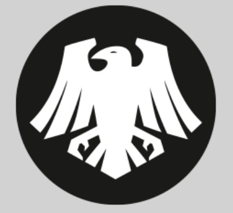

<!-- A0456-B0008 图片 -->
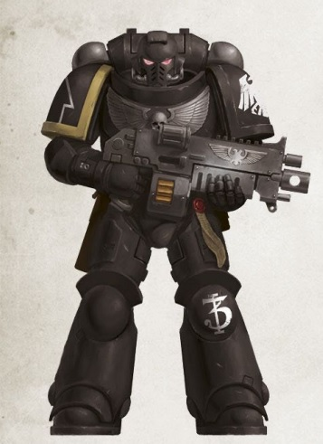

<!-- A0456-B0009 -->
**英文原文**

Legion Number:XIX

<!-- /A0456-B0009 -->

<!-- A0456-B0010 -->

原译文

军团编号：XIX

**校订译文**

军团编号：XIX

<!-- /A0456-B0010 -->

<!-- A0456-B0011 -->
**英文原文**

Primarch:Corvus Corax

<!-- /A0456-B0011 -->

<!-- A0456-B0012 -->

原译文

原体：科沃斯·科拉克斯

**校订译文**

原体：科沃斯·科拉克斯

<!-- /A0456-B0012 -->

<!-- A0456-B0013 -->
**英文原文**

Homeworld:Deliverance

<!-- /A0456-B0013 -->

<!-- A0456-B0014 -->

原译文

家园世界：拯救星

**校订译文**

母星：拯救星

<!-- /A0456-B0014 -->

<!-- A0456-B0015 -->
**英文原文**

Fortress-Monastery:Ravenspire

<!-- /A0456-B0015 -->

<!-- A0456-B0016 -->

原译文

要塞修道院：渡鸦尖塔

**校订译文**

要塞修道院：渡鸦尖塔

<!-- /A0456-B0016 -->

<!-- A0456-B0017 -->
**英文原文**

Chapter Master:Aethon Shaan

<!-- /A0456-B0017 -->

<!-- A0456-B0018 -->

原译文

战团长：艾森·沙恩

**校订译文**

战团长：艾索·沙恩

<!-- /A0456-B0018 -->

<!-- A0456-B0019 -->
**英文原文**

Colours:Black, white. Right pauldron trim colours show company

<!-- /A0456-B0019 -->

<!-- A0456-B0020 -->

原译文

颜色：黑色、白色。右肩甲装饰颜色展示连队

**校订译文**

配色：黑色与白色；右肩甲饰边颜色表示所属连队。

<!-- /A0456-B0020 -->

<!-- A0456-B0021 -->
**英文原文**

Specialty:Post-Heresy: Infiltration, Guerrilla Warfare, Fast Attack, Liberation & aiding insurgencies; Pre-Heresy: Rapid Deployment Operations, Strategic Interdiction Operations, Reconnaissance in Force, Guerrilla Actions, Low-collateral Damage Imperative Compliance Operations

<!-- /A0456-B0021 -->

<!-- A0456-B0022 -->

原译文

专长：叛乱后：渗透、游击战、快速进攻、解放和协助起义；叛乱前：快速部署行动、战略阻截行动、部队侦察、游击行动、低附带损害紧急平定行动

**校订译文**

专长：叛乱后——渗透、游击战、快速突击、解放行动及支援起义；叛乱前——快速部署、战略阻截、武装侦察、游击行动，以及以降低附带损害为首要要求的归顺作战。

<!-- /A0456-B0022 -->

<!-- A0456-B0023 -->
**英文原文**

Strength:~1000 Marines

<!-- /A0456-B0023 -->

<!-- A0456-B0024 -->

原译文

力量：约1000名战士

**校订译文**

兵力：约一千名星际战士。

<!-- /A0456-B0024 -->

<!-- A0456-B0025 -->
**英文原文**

Battle Cry:Victorus Aut Mortis (Victory or Death)

<!-- /A0456-B0025 -->

<!-- A0456-B0026 -->

原译文

战吼：胜利或死亡

**校订译文**

战吼：Victorus Aut Mortis（胜利或死亡）

<!-- /A0456-B0026 -->

<!-- A0456-B0027 -->
**英文原文**

Successor Chapters:Ashen Claws,Black Guard,Carcharodons (speculated),Dark Eagles, Death Eagles, Death Spectres,Flame Eagles,Hawk Lords (conflicting sources),Imperial Talons, Iron Ravens,Knights of the Raven,Necropolis Hawks,Raptors, Raven's Watch, Revilers, Rift Stalkers, Shadow Haunters, Shadow Hunters, Storm Hawks, Storm Wings,The Silent (enegade warband),Void Sabres

<!-- /A0456-B0027 -->

<!-- A0456-B0028 -->

原译文

子战团：灰烬之爪、黑色卫队、噬人鲨（推测）、黑鹰、死鹰、死亡幽灵、火鹰、雄鹰领主（相互矛盾的来源）、帝国之爪、铁鸦、渡鸦骑士、死灵天鹰、猛禽、渡鸦守望、谩骂者、裂隙追猎者、暗影超能者、暗影猎手、风暴天鹰、风暴之翼、寂静者（变节战帮）、虚空长剑

**校订译文**

子战团：灰烬之爪、黑色守卫、噬人鲨（推测）、黑鹰、死鹰、死亡幽灵、火焰天鹰、雄鹰领主（来源存在冲突）、帝国之爪、钢铁渡鸦、渡鸦骑士、墓地雄鹰、猛禽、渡鸦守望、谩骂者、裂隙追猎者、暗影猎手（Shadow Haunters）、暗影猎手（Shadow Hunters）、风暴天鹰、风暴之翼、寂静者（变节战帮）、虚空长剑。

**校注：** Shadow Haunters 核心现定为暗影猎手，原列表另有 Shadow Hunters 也译暗影猎手；英文为两个条目，暂保留英文消歧，不能无据合并。enegade 显为 renegade 拼写缺失，译作变节。

<!-- /A0456-B0028 -->

<!-- A0456-B0029 -->
## History 历史

<!-- /A0456-B0029 -->

<!-- A0456-B0030 -->
### The Great Crusade 大远征

<!-- /A0456-B0030 -->

<!-- A0456-B0031 -->
### Founding 建军

<!-- /A0456-B0031 -->

<!-- A0456-B0032 -->
**英文原文**

The XIXth Legion was created from the genetic material of their Primarch, Corvus Corax and used by the Emperor as his hidden hand in its early years during the Unification Wars on Terra. The original recruits of the Legion were firstborn sons drawn from tribes of savage yet technologically adept Xeric warriors of the Asiatic Dustfields, which regularly battled with the much larger Yndonesic Bloc.

<!-- /A0456-B0032 -->

<!-- A0456-B0033 -->

原译文

第十九军团是由他们的原体科沃斯·科拉克斯的遗传物质创建的，在泰拉统一战争的早期，该军团被帝皇用作他的隐蔽之手。军团最初的新兵是来自亚洲尘域野蛮但技术娴熟的薛里克战士部落的长子，他们经常与更大的印度尼西集团作战。

**校订译文**

第十九军团以原体科沃斯·科拉克斯的遗传物质创建。泰拉统一战争早期，帝皇将他们作为隐秘行动的利刃。军团最初的新兵来自亚洲尘域的薛里克战士部落，都是家中长子。这些部族作风凶悍，却精于技术，经常与规模远大的印度尼西集团交战。

**校注：** firstborn sons 指家庭出生次序的长子，非相对于原铸战士的 Firstborn 身份。

<!-- /A0456-B0033 -->

<!-- A0456-B0034 图片 -->
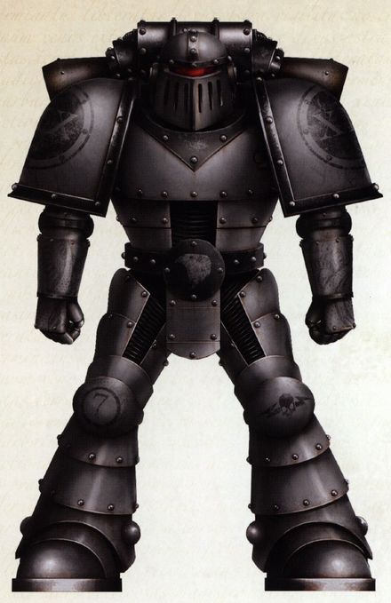

<!-- A0456-B0035 -->

原译文

Pre-Corax XIXth Legionnaire 科拉克斯回归前十九军团士兵

**校订译文**

Pre-Corax XIXth Legionnaire 科拉克斯回归前十九军团士兵

<!-- /A0456-B0035 -->

<!-- A0456-B0036 -->
**英文原文**

In its earliest days, the XIXth Legion was used for infiltration, reconnaissance, and target identification operations. The Legion was covertly used to quickly annihilate any faction which refused to submit to the new Imperium, striking from the shadows without warning. The XIXth used terror tactics similar to the Night Lords. One of the earliest known campaigns by the Legion was the conquest of the central Asiatic region, which was ruled by a tyrant known as Kalagann of Ursh. They won many battle honors on Terra, and later took part in the expansion of the Imperium into the rest of the Sol System, liberating Jupiter's moon of Lysithea from xenos. The battle on Lysithea proved costly for the Legion and veterans of the battle wore Jovian runes in its commemoration for many years after.

<!-- /A0456-B0036 -->

<!-- A0456-B0037 -->

原译文

在早期，第19军团被用于渗透、侦察和目标识别行动。军团被秘密地用来迅速消灭任何拒绝屈服于新帝国的派系，在没有任何警告的情况下从阴影中出击。十九军团使用了类似于午夜领主的恐怖战术。军团最早的已知战役之一是征服中亚地区，该地区由一位被称为乌尔什的卡拉甘的暴君统治。他们在泰拉上赢得了许多战斗荣誉，后来参与了帝国向太阳系其他部分的扩张，将木星的卫星木卫十从异教徒手中解放出来。事实证明，木卫十之战对军团来说代价高昂，战斗的老兵在此后的许多年里都佩戴着木星符文进行纪念。

**校订译文**

第十九军团最初承担渗透、侦察与目标识别任务。他们隐秘出动，毫无预警地从阴影中袭击，迅速消灭拒不归顺新生帝国的势力。他们曾采用与午夜领主相似的恐怖战术。已知最早的战役之一，是征服暴君乌尔什的卡拉甘统治下的中亚地区。军团在泰拉赢得众多战功，随后参与帝国向太阳系其他地区的扩张，从异形手中解放木卫十。此战损失惨重，参战老兵此后多年仍佩戴木星符文，以示纪念。

<!-- /A0456-B0037 -->

<!-- A0456-B0038 -->
**英文原文**

In the early days of the Great Crusade, the Legion found itself in the shadow of Horus and his Luna Wolves. While Horus valued the XIXth greatly, the Legions forces were largely serving as support troops for the Wolves.

<!-- /A0456-B0038 -->

<!-- A0456-B0039 -->

原译文

在大远征的早期，军团发现自己处于荷鲁斯和他的影月苍狼的阴影之下。虽然荷鲁斯非常重视十九军团，但军团部队主要是作为野狼的支援部队。

**校订译文**

大远征初期，第十九军团笼罩在荷鲁斯与影月苍狼的光芒之下。荷鲁斯虽十分器重他们，却主要将其用于支援影月苍狼。

<!-- /A0456-B0039 -->

<!-- A0456-B0040 -->
**英文原文**

The Legion's Primarch Corax was not reunited with the Legion for many decades. When the Emperor discovered Corax on Deliverance, he had just liberated the moon from Kiavahr Forge-Guilds by using nuclear weapons. The first meeting between Corax and the Emperor is shrouded in mystery, as the two spent a day and a night in private discussion, with no records kept about the conversation's contents. At dawn the next day, though, Corax agreed to take command of the Legion on the condition that Kiavahr be conquered and brought into the Imperial fold.

<!-- /A0456-B0040 -->

<!-- A0456-B0041 -->

原译文

军团的原体科拉克斯几十年来一直没有与军团重聚。当帝皇在救赎星发现科拉克斯时，他刚刚用核武器将卫星从基亚瓦尔铸造行会解放出来。科拉克斯和帝皇的第一次会面笼罩在神秘之中，因为两人花了一天一夜的时间进行私人讨论，没有关于对话内容的记录。然而，第二天黎明时分，科拉克斯同意指挥军团，条件是征服基亚瓦尔并将其纳入帝国版图。

**校订译文**

科拉克斯直到数十年后才与军团会合。帝皇在拯救星找到他时，他刚以核武器推翻基亚瓦尔铸造行会的统治，解放这颗卫星。他与帝皇的首次会面充满谜团：两人私下交谈了一天一夜，没有留下任何谈话记录。次日黎明，科拉克斯同意接掌军团，条件是征服基亚瓦尔，将其纳入帝国。

<!-- /A0456-B0041 -->

<!-- A0456-B0042 -->
**英文原文**

The Great Crusade was already a century old by the time Corax took command of his Legion, but he quickly imposed the style of war he had learned on Deliverance on his new troops. Stealth, swiftness, and guile were impressed on a Legion already renowned for its reconnaissance and rapid-strike capability. In particular, the old ways of the Xeric tribes were purged. Corax was also disheartened by how his Legion had been used as a repression, higher counter-insurgency, and occupation force, not unlike what he had fought against on Deliverance. As such, he purged or banished the Legion of its old Terran commanders, such as Lord Arkhas Fal. Corax also used factories on Kiavahr to commission several vehicles unique to his forces, most notably the Shadowhawk, a stealth variant of the Thunderhawk as well as the Whispercutter.

<!-- /A0456-B0042 -->

<!-- A0456-B0043 -->

原译文

当科拉克斯指挥他的军团时，大远征已经有一个世纪的历史了，但他很快将他在拯救星学到的战争风格强加给了他的新部队。隐形、敏捷和狡猾给一个以侦察和快速打击能力而闻名的军团留下了深刻的印象。特别是，薛里克部落的旧方式被清除了。科拉克斯还对他的军团如何被用作镇压、更高级别的反叛乱和占领军感到沮丧，这与他在拯救星中所反对的不同。因此，他清除或驱逐了军团中的旧泰拉指挥官，如阿卡斯·法尔领主。科拉克斯还利用基亚瓦尔的工厂调试了几辆他部队独有的载具，最著名的是暗影鹰，一种雷鹰的隐形变体，以及低语切割者。

**校订译文**

科拉克斯接掌军团时，大远征已持续一个世纪。他很快将自己在拯救星形成的作战方式贯彻到部队中，让这支本就以侦察和快速突击闻名的军团更加重视潜行、速度与谋略，尤其清除了薛里克部落留下的旧习。得知军团长期充当镇压、平叛与占领力量，他深感失望：这与他在拯救星反抗过的压迫者何其相似。因此，他清洗或放逐了阿尔卡斯·法尔领主等旧有的泰拉籍指挥官。科拉克斯还委托基亚瓦尔的工厂，为军团制造多种专属载具，最著名的是雷鹰的隐形改型“暗影鹰”，以及“低语切割者”。

<!-- /A0456-B0043 -->

<!-- A0456-B0044 -->
### Doctrine and Record 学说与记录

<!-- /A0456-B0044 -->

<!-- A0456-B0045 -->
**英文原文**

Before the discovery of Corax, the Raven Guard utilized terror tactics similar to the Night Lords. However, when their Primarch was discovered, he was disgusted with these methods and introduced changes. Following the discovery of Corax the Raven Guard, based upon his teachings, became masters of sabotage, assassination, and other covert operations. Planets that were thought impossible to take fell quickly as the Raven Guard applied precise military pressure to its vulnerable sectors. Such was the Legion's reputation that Warmaster Horus frequently requested their assistance to assure victory, though there was little admiration between the two; unconfirmed reports include the two sides nearly coming to blows on one occasion. In addition, Corax displayed a consistent ill-favour and mistrust towards veteran warriors of his Legion born of Terra, as opposed to those native to Deliverance.

<!-- /A0456-B0045 -->

<!-- A0456-B0046 -->

原译文

在发现科拉克斯之前，暗鸦守卫使用了类似于午夜领主的恐怖战术。然而，当他们的原体回归时，他对这些方法感到厌恶，并引入了变化。在发现科拉克斯之后，暗鸦守卫根据他的教导，成为了破坏、暗杀和其他秘密行动的大师。由于暗鸦守卫对其脆弱区域施加了精确的军事压力，被认为不可能占领的行星迅速陷落。军团的声誉如此之高，以至于战帅荷鲁斯经常请求他们的帮助以确保胜利，尽管他们之间几乎没有什么钦佩之情；未经证实的报道称，双方一度差点发生冲突。此外，科拉克斯对出生于泰拉的老兵表现出一贯的恶意和不信任，而不是那些出生于拯救星的老兵。

**校订译文**

科拉克斯归来前，暗鸦守卫曾采用近似午夜领主的恐怖战术；原体对此深恶痛绝，随即推动改革。此后，军团在他的教导下成为破坏、暗杀与隐秘行动的行家。他们精准打击防御薄弱处，使原本被认为不可能攻克的行星迅速陷落。声望之盛，令战帅荷鲁斯频繁请求他们协助，以确保胜利。然而，两人并不欣赏彼此，甚至有未经证实的说法称，他们一度险些大打出手。与对待拯救星出身的战士不同，科拉克斯始终对军团的泰拉籍老兵抱有厌恶与猜忌。

<!-- /A0456-B0046 -->

<!-- A0456-B0047 图片 -->
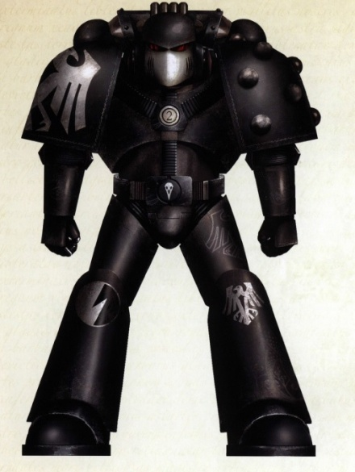

<!-- A0456-B0048 -->

原译文

Pre-Heresy Raven Guard Sergeant 叛乱前暗鸦守卫军士

**校订译文**

Pre-Heresy Raven Guard Sergeant 叛乱前暗鸦守卫军士

<!-- /A0456-B0048 -->

<!-- A0456-B0049 -->
**英文原文**

Tensions between the two boiled after during the Battle of Gate Forty-Two, where Horus had the Raven Guard launch a bloody frontal assault on enemy defenses that decimated the Legion's numbers despite Corax's warnings that the plan was reckless beforehand. After the battle, the Raven Guard was reduced to 80,000 Astartes. Corax removed his forces from Horus' command, bitterly swearing to never serve alongside the Warmaster again. He also began to send his Terran-born forces into forgotten Crusades on the galactic fringes, ensuring in his eyes that the Raven Guard remain "pure".

<!-- /A0456-B0049 -->

<!-- A0456-B0050 -->

原译文

在42号门之战中，两人之间的紧张关系加剧，荷鲁斯让暗鸦守卫对敌人的防御发动了血腥的正面进攻，尽管科拉克斯事先警告说该计划是鲁莽的，但还是摧毁了军团的成员。战斗结束后，暗鸦守卫减少到80000阿斯塔特。科拉克斯将他的部队从荷鲁斯的指挥下撤离，痛苦地发誓再也不与战帅并肩作战。他还开始派遣他在泰拉出生的部队参加银河系边缘被遗忘的远征，在他眼中确保暗鸦守卫保持“纯洁”。

**校订译文**

四十二号门之战将两人之间的紧张关系推至顶点。荷鲁斯不顾科拉克斯事先对计划过于鲁莽的警告，命暗鸦守卫正面强攻敌军阵地，造成惨重伤亡。战后，军团兵力减至八万人。科拉克斯将部队撤出荷鲁斯的指挥体系，愤然发誓不再与战帅并肩作战。他还开始将泰拉籍部队派往银河边缘那些无人关注的远征，在自己看来，借此确保暗鸦守卫的“纯洁”。

<!-- /A0456-B0050 -->

<!-- A0456-B0051 -->
### Notable Operations 著名行动

<!-- /A0456-B0051 -->

<!-- A0456-B0052 -->
**英文原文**

M30 — Counterinsurgency operation on Lux Majoris against Terocrati dissidents

<!-- /A0456-B0052 -->

<!-- A0456-B0053 -->

原译文

至高之光的平叛行动对抗贵族异见者

**校订译文**

M30——在至高之光世界开展平叛行动，对抗特罗克拉蒂异见者。

**校注：** Terocrati 为势力专名，未见足够依据直接译成一般“贵族”，暂音译特罗克拉蒂。

<!-- /A0456-B0053 -->

<!-- A0456-B0054 -->

原译文

M30 — Battle of Hell's Anvil 地狱铁砧之战

**校订译文**

M30 — Battle of Hell's Anvil 地狱铁砧之战

<!-- /A0456-B0054 -->

<!-- A0456-B0055 -->
**英文原文**

M30 — Combat operations on Belfagor against Orks

<!-- /A0456-B0055 -->

<!-- A0456-B0056 -->

原译文

在贝尔法戈对欧克的作战行动

**校订译文**

M30——在贝尔法戈迎战欧克。

<!-- /A0456-B0056 -->

<!-- A0456-B0057 -->

原译文

M30 — The Battle of Gate Forty-Two 四十二号门之战

**校订译文**

M30 — The Battle of Gate Forty-Two 四十二号门之战

<!-- /A0456-B0057 -->

<!-- A0456-B0058 -->

原译文

M30 — The Scalland Campaign 斯卡兰德战役

**校订译文**

M30 — The Scalland Campaign 斯卡兰德战役

<!-- /A0456-B0058 -->

<!-- A0456-B0059 -->

原译文

M30 — The Compliance of Indra-sul 印德拉-苏尔平定

**校订译文**

M30 — The Compliance of Indra-sul 印德拉-苏尔平定

<!-- /A0456-B0059 -->

<!-- A0456-B0060 -->

原译文

M30 — The Carinae Retribution 船底座报复

**校订译文**

M30 — The Carinae Retribution 船底座报复

<!-- /A0456-B0060 -->

<!-- A0456-B0061 -->

原译文

862.M30 - Second Rangdan Xenocide 第二次冉丹异形灭绝

**校订译文**

862.M30 - Second Rangdan Xenocide 第二次冉丹异形灭绝

<!-- /A0456-B0061 -->

<!-- A0456-B0062 -->

原译文

972.M30 — The Farinatus Extermination 法里纳图斯灭绝

**校订译文**

972.M30 — The Farinatus Extermination 法里纳图斯灭绝

<!-- /A0456-B0062 -->

<!-- A0456-B0063 -->

原译文

994.M30 — The Compliance of Isstvan III 伊斯塔万三号平定

**校订译文**

994.M30 — The Compliance of Isstvan III 伊斯塔万三号平定

<!-- /A0456-B0063 -->

<!-- A0456-B0064 -->
### The Horus Heresy 荷鲁斯之乱

原题：The Horus Heresy 荷鲁斯叛乱

<!-- /A0456-B0064 -->

<!-- A0456-B0065 -->
**英文原文**

The Raven Guard legion was one of the smallest legions during the Great Crusade, numbering 80,000 Astartes as well as an Imperial Army Regiment known as the Therion Cohort attached to the legion's expeditionary force. As a legion they were a fierce enemy for anyone who opposed the Imperium of Man, using time honoured tactics of guerrilla warfare which Corax himself had learnt during the Revolution he himself had commanded to free his people from the merciless slavery forced upon them by the Tech Guilds of Kiavahr. Extremely efficient and trained, the Raven Guard would engage in acts of mass sabotage along with infiltration, blink-of-an-eye Strikes, and expert covert operations, all of which they had perfected into what would look like ease to any other warrior.

<!-- /A0456-B0065 -->

<!-- A0456-B0066 -->

原译文

暗鸦守卫军团是大远征期间规模最小的军团之一，有80000名阿斯塔特，还有一个被称为圣兽大队的帝国陆军兵团，隶属于该军团的远征部队。作为一个军团，对于任何反对人类帝国的人来说，他们都是一个死敌，他们使用历史悠久的游击战战术，这是科拉克斯自己在革命期间学到的，他亲自指挥革命，将人民从基亚瓦尔技术行会强加于他们的无情奴隶制中解放出来。暗鸦守卫效率极高，训练有素，他们会进行大规模破坏行动，以及渗透、转瞬攻击和专业秘密行动，所有这些行动他们都已经完善到任何其他战士都能轻松应对的程度。

**校订译文**

大远征时期，暗鸦守卫是规模最小的军团之一，拥有八万名阿斯塔特，远征部队中还编有一支称为“圣兽大队”的帝国军步兵团。他们是帝国敌人的强劲对手，擅长久经检验的游击战术。这些战术源自科拉克斯亲自领导的革命：他曾以此将同胞从基亚瓦尔技术行会的残酷奴役中解放出来。暗鸦守卫训练有素、行动高效，将大规模破坏、渗透、瞬间突击与隐秘作战磨练得炉火纯青，娴熟得令旁观的战士也觉得一切仿佛轻而易举。

<!-- /A0456-B0066 -->

<!-- A0456-B0067 图片 -->
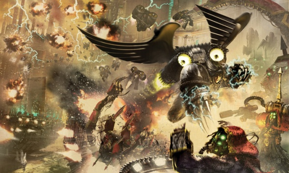

<!-- A0456-B0068 -->

原译文

Corax leads the Raven Guard against the Dark Mechanicus during the Horus Heresy 荷鲁斯叛乱期间科拉克斯领导暗鸦守卫对抗黑暗机械教

**校订译文**

Corax leads the Raven Guard against the Dark Mechanicus during the Horus Heresy 荷鲁斯之乱期间科拉克斯领导暗鸦守卫对抗黑暗机械教

<!-- /A0456-B0068 -->

<!-- A0456-B0069 -->
**英文原文**

The Raven Guard was one of seven legions to be sent to the Istvaan system (Others present were the Iron Hands, Salamanders, Alpha Legion, Iron Warriors, Night Lords and Word Bearers) to quell a rebellion lead by the former Warmaster, Horus — Primarch of the Sons of Horus Legion (Formerly the Luna Wolves). Horus and his other three traitor primarchs (Fulgrim, Angron and Mortarion) had entrenched themselves on the planet of Istvaan V, and lay in wait for the Loyalist forces to land and engage. The fighting once joined was fierce and hot-blooded, brother versus brother, and no quarter was given on either side. Mid way into the fighting, Horus and his allies retreated back into their fortifications for no reason that could be grasped by the loyalist factions. The Raven Guard were in the thick of the fighting from the start, though out of their element due to the lack of tactical planning and the close-up-and-personal combat spreading like wildfire across the plains of Istvaan V. They fought both with as much honour and as much skill as any other legion would in the circumstances. When the traitors made a surprise withdrawal back to their fortifications, the Raven Guard used this cease in the fighting to regroup and re-arm.

<!-- /A0456-B0069 -->

<!-- A0456-B0070 -->

原译文

暗鸦守卫是被派往伊斯塔万星系的七个军团之一（其他出席的军团包括钢铁之手、火蜥蜴、阿尔法军团、钢铁勇士、午夜领主和怀言者），以平息由前战帅、荷鲁斯之子军团（前身为影月苍狼）的原体荷鲁斯领导的叛乱。荷鲁斯和他的其他三位叛徒原体（福格瑞姆、安格隆和莫塔里安）已经在伊斯塔万五号星球上站稳了脚跟，埋伏在那里等待忠诚派部队登陆并交战。一旦加入，战斗就变得激烈而热血沸腾，兄弟对兄弟，双方都没有让步。在战斗进行到一半时，荷鲁斯和他的盟友无缘无故地撤退到他们的防御工事中，而忠诚派则无法掌握。暗鸦守卫从一开始就处于战斗的最激烈阶段，但由于缺乏战术规划，近战和决斗像野火般蔓延到伊斯塔万五号的平原。他们与任何其他军团在这种情况下一样，以同样的荣誉和技巧进行战斗。当叛徒出其不意地撤退回防御工事时，暗鸦守卫利用这一停止战斗的机会重新集结并重新武装。

**校订译文**

暗鸦守卫与钢铁之手、火蜥蜴、阿尔法军团、钢铁勇士、午夜领主和怀言者，共七个军团，奉命前往伊斯塔万星系，镇压前战帅荷鲁斯的叛乱。荷鲁斯是荷鲁斯之子军团的原体，该军团前身为影月苍狼。他与福格瑞姆、安格隆、莫塔里安三位叛徒原体已在伊斯塔万五号筑垒，等待忠诚派登陆。战斗打响后，兄弟相残，双方都毫不留情。激战途中，荷鲁斯及盟军突然撤回工事，忠诚派不明其意。暗鸦守卫从一开始便深陷苦战：缺少战术筹划，贴身肉搏又像野火般蔓延于平原，使他们难以发挥所长。即便如此，他们仍以不逊于任何军团的勇武与荣誉奋战。叛徒突然撤退后，暗鸦守卫趁战斗暂歇，重新集结并补充武器弹药。

<!-- /A0456-B0070 -->

<!-- A0456-B0071 -->
**英文原文**

However, when they neared the "loyalist" defences (which were tenfold reinforced by the expert siege engineers of the Iron Warriors legion under their Primarch Perturabo's direction, they were fired upon by the very guns meant to protect them. Hundreds were gunned down in the first few minutes of the betrayal before they even realised that there were traitors in their midst. Four of the seven loyalist legions sent to Istvaan V had thrown off the colours and pretenses of the Imperium, and set their betrayal into motion. The Iron Warriors, Night Lords, Alpha Legion, and Word Bearers turned on their brethren in a bloody thunderstorm of bolters and blades, decimating their numbers in a multitude of seemingly never ending skirmishes and drudging battles for ground that cost lives for every metre gained or lost. Corax and his legion were reduced from their mighty 80,000 warriors to a meager 3,000 battle hardened veterans.

<!-- /A0456-B0071 -->

<!-- A0456-B0072 -->

原译文

然而，当他们接近“忠诚者”的防御工事时（在他们的原体佩图拉博的指挥下，钢铁勇士军团的专业攻城工程师对防御工事进行了十倍的强化），他们遭到了旨在保护他们的枪支的袭击。在背叛的前几分钟，数百人被枪杀，他们甚至还没有意识到他们中间有叛徒。派往伊斯塔万五号的七个忠诚派军团中有四个已经摆脱了帝国的色彩和伪装，并开始了他们的背叛。钢铁勇士、午夜领主、阿尔法军团和怀言者在一场血腥的枪林弹雨中向他们的兄弟开火，他们的人被大量看似永无止境的人摧毁。小规模冲突和艰难的地面战斗，每前进或后退一米都会造成生命损失。科拉克斯和他的军团从强大的8万名战士减少到只有3000名久经沙场的老兵。

**校订译文**

然而，他们接近“忠诚派”阵地时，本该保护他们的枪炮竟向他们开火。这些工事由佩图拉博指挥钢铁勇士的攻城专家强化了十倍。背叛发生后的最初几分钟里，数百名战士便遭枪杀，甚至来不及意识到己方阵营中藏着叛徒。派往伊斯塔万五号的七个军团中，四个撕下了忠于帝国的伪装。钢铁勇士、午夜领主、阿尔法军团与怀言者以爆矢枪和利刃掀起血雨腥风，屠戮昔日兄弟。在仿佛永无止境的遭遇战和艰苦的阵地争夺中，每进退一米都要付出生命。科拉克斯的八万大军最终仅剩三千名久经战火的老兵。

<!-- /A0456-B0072 -->

<!-- A0456-B0073 -->
**英文原文**

Corax was by now a brooding vengeful demigod, wielding a whip in place of his normal customary left set of talons which were lost in a rage fueled duel with the traitorous primarch Lorgar, which would have ended in Lorgar's death had Konrad Curze, Primarch of the Night Lords (also known as the Night Haunter) not intervened and shattered it with a swipe of his own claws. Respite came in the form of a single battle barge the Avenger, captained by Commander Branne Nev, a captain originally stationed on Deliverance as a garrison commander, with him came the battered remains of the Therion Cohort normally serving with the legion under Praefactor Marcus Valerius who ironically brought Isstvan V into compliance with Corax the first time. Unbeknownst to both sides, Corax only narrowly escaped death at the hands of Angron and his World Eaters thanks to the machinations of the Alpha Legion, whose own Primarch Alpharius had greater plans regarding the Raven Guard.

<!-- /A0456-B0073 -->

<!-- A0456-B0074 -->

原译文

科拉克斯现在是一个沉思的复仇半神，挥舞着鞭子代替了他在与叛徒原体珞珈的愤怒决斗中失去的通常习惯的左爪，如果午夜领主（也称为午夜猎手）的原图康拉德·科兹没有介入并用自己的爪拍打它，这场决斗本会在珞珈的死亡中结束。喘息以一艘战斗驳船复仇者号的形式出现，由指挥官布兰·涅夫担任队长，他最初是作为驻军指挥官驻扎在拯救星的连长，与他一起来的是通常在军团服役的兵团长马库斯·瓦莱里乌斯领导下的圣兽大队的重创残余，讽刺的是，他第一次让伊斯塔万五号遵从了科拉克斯。双方都不知道，由于阿尔法军团的阴谋诡计，科拉克斯勉强逃脱了安格隆和他的吞世者的死亡，阿尔法军团的原体阿尔法瑞斯对暗鸦守卫有更大的计划。

**校订译文**

此时的科拉克斯已经成为一位阴郁的复仇半神。他左手惯用的爪刃在与叛徒原体珞珈的暴怒决斗中被毁，只得改用长鞭。若非午夜领主原体康拉德·科兹——即午夜幽魂——出手，以自己的爪刃击碎科拉克斯的武器，珞珈本会死在那场决斗中。转机来自一艘孤身赶到的战斗驳船复仇者号，其舰长是原本驻守拯救星的连长布兰·涅夫。随他前来的，还有兵团长马库斯·瓦莱里乌斯麾下遭受重创的圣兽大队残部。讽刺的是，瓦莱里乌斯当年正是与科拉克斯一道使伊斯塔万五号归顺帝国的人。交战双方并不知道，科拉克斯之所以勉强逃过安格隆与吞世者的追杀，实际上是阿尔法军团暗中操纵的结果：原体阿尔法瑞斯对暗鸦守卫另有更大的图谋。

<!-- /A0456-B0074 -->

<!-- A0456-B0075 -->
**英文原文**

Upon escaping the tailing forces of World Eater's picket ships, Avenger broke real-space into the warp, and headed for Terra. Upon arriving Corax headed for the Imperial Palace, which was being fortified by Rogal Dorn and his Imperial Fists in preparation for the coming Siege, upon which after much argument with Dorn and Malcador the Imperial Regent, The Emperor himself boomed in a psychic voice for the arguing to cease and pulled Corax into a vision of extreme light, and showed him the secrets he had been asking for - the gene forging tech used to create the Primarchs by the Emperor himself. After navigating the treacherous and dangerous contraption which was the ever shape-shifting maze on Luna, by using his advanced logic, and the skill of his sons to out-think its logic engine and freeze it in place, he retrieved the gene tech and returned to Deliverance under the watchful eye of the Adeptus Custodes (who were charged by Malcador to keep an eye on its safety).

<!-- /A0456-B0075 -->

<!-- A0456-B0076 -->

原译文

在逃离了吞世者哨兵的尾随部队后，复仇者号冲破了亚空间，驶向泰拉。抵达后，科拉克斯前往皇宫，皇宫正由罗格·多恩和他的帝国之拳加固，为即将到来的围攻做准备，在与多恩和帝国摄政马卡多进行了多次争论后，帝皇本人用一种灵能传音发出低沉的声音，要求停止争论，并将科拉克斯拉到一个极度光亮的视野中，并向他展示了他一直要求的秘密 — 帝皇用来创造原体的基因编辑技术。在月球上不断变形的迷宫中，他利用自己先进的逻辑和子嗣们超越逻辑引擎并将其冻结在适当位置的技能，驾驭了这个奸诈而危险的装置后，他取回了基因技术，并在禁军的监视下返回了拯救星（马卡多要求他们注意其安全）。

**校订译文**

摆脱尾追的吞世者警戒舰后，复仇者号离开现实空间，跃入亚空间，向泰拉驶去。抵达后，科拉克斯前往帝皇皇宫；罗格·多恩正率帝国之拳加固防御，准备迎接围城。他与多恩及帝国摄政马卡多争执良久，最终帝皇以雷鸣般的灵能声音喝止争论，将科拉克斯带入炽烈光芒构成的幻象，向他揭示其请求的秘密：帝皇用于创造原体的基因锻造技术。此后，科拉克斯深入月球上不断变形、险象环生的迷宫。他凭借严密推理与子嗣的技能，胜过迷宫的逻辑引擎，使结构停止变化，成功取回基因技术，返回拯救星。帝皇禁军全程严密监护，奉马卡多之命确保这项技术安全。

<!-- /A0456-B0076 -->

<!-- A0456-B0077 -->
**英文原文**

At first the Astartes created by the gene tech were a marvel, a splice of primarch and Astartes, but not in an imbalanced degree so as to cause malfunction, a perfect meld. These new warriors were faster, stronger, and more intelligent than any of the older warriors of the Legion, and within a few weeks more aspirants had been successfully implanted with stable gene-seed than ever before (the new gene seed also meant that warriors matured into their new forms rapidly compared to standard Astartes). The new warriors would be placed under the command of Captain Branne Nev under the moniker "Raptors", and would be used against a Word Bearer fortress as their first deployment, which would see them successfully slaughter veteran Word Bearers with the ease of much older warriors. Raptors would take injuries that would have killed even an Astartes, and still remain fighting due to their enhanced bodies. Word of this reached the ears of Omegon, twin primarch of the Alpha Legion, whom had been laying dormant on Kiavahr below stirring up a rebellion amongst the tech guilds, and he sprung into action.

<!-- /A0456-B0077 -->

<!-- A0456-B0078 -->

原译文

第一个基因技术创造的阿斯塔特是一个奇迹，是原体和阿斯塔特的拼接，但并没有达到不平衡的程度，从而导致故障，这是一个完美的融合。这些新战士比军团中任何一位年长的战士都更快、更强壮、更聪明，在几周内，比以往任何时候都有更多的有志者成功植入了稳定的基因种子（新的基因种子也意味着与标准的阿斯塔特相比，战士们很快就会成长成新的形态）。新的战士将以“猛禽”的名义被置于布兰·涅夫连长的指挥之下，并将作为他们的第一次部署，用来对抗一个怀言者堡垒，这将使他们能够像年长的战士一样轻松地成功屠杀资深的怀言者。猛禽的伤病甚至会杀死阿斯塔特，但由于身体的增强，他们仍然会继续战斗。这件事传到了阿尔法军团的双胞胎首领欧米伽的耳朵里，他一直在基亚瓦尔的下面蛰伏，在技术行会中煽动叛乱，于是他迅速采取了行动。

**校订译文**

最初，这项技术创造出的阿斯塔特堪称奇迹：原体与阿斯塔特的遗传特征完美融合，没有因失衡而出现缺陷。新战士比军团的旧有战士更快、更强、更聪明。短短数周，成功植入稳定基因种子的候选者便超过以往；他们成长为成熟战士的速度，也远快于标准阿斯塔特。这些被称为“猛禽”的新战士归布兰·涅夫连长指挥，首次任务便是攻击一座怀言者要塞。他们轻易斩杀资深怀言者，表现得如同身经百战的老兵；即便遭受足以杀死普通阿斯塔特的创伤，强化后的身体仍能支撑他们继续作战。消息传到了欧米伽耳中。这位阿尔法军团的孪生原体一直潜伏在卫星下方的基亚瓦尔，煽动技术行会叛乱，此刻立刻采取行动。

<!-- /A0456-B0078 -->

<!-- A0456-B0079 -->
**英文原文**

The rebellion and even the Alpha Legionnaires supporting it were a distraction, while the Raven Guard were caught off guard, Omegon and several Alpha Legion operatives managed to covertly spike the gene tech with a daemon blood poison (while managing to keep the pure technology for themselves) using the Raven Guard gene-seed to produce deformed monsters. The battle finally began as the first Raven Guard recruits to receive the secretly spiked gene seed were implanted, and by the time it raged into the gene labs of Ravendelve, only to be met by deformed warriors created by the spiked gene seed's effects. While deformed, these astartes still fought with otherworldly strength, overpowering even the Alpha Legion Astartes. By the time the battle was over, Agents had been found amidst the legion, explaining how news reached the traitors about the gene tech, and thus the loss of such a boon to the crippled legion, gene screening was to be implemented to find and destroy the agents with the stolen faces of Raven Guard Legionnaires.

<!-- /A0456-B0079 -->

<!-- A0456-B0080 -->

原译文

叛乱，甚至是支持它的阿尔法军团都是分散的，而暗鸦守卫措手不及，欧米伽和几名阿尔法军团特工设法使用暗鸦守卫基因种子秘密地用一种恶魔血毒素刺入基因技术（同时设法为自己保留纯粹技术），以制造畸形怪物。这场战斗终于开始了，因为第一批接受秘密刺入基因种子的暗鸦守卫新兵被植入体内，当它在鸦巢的基因实验室肆虐时，只会遇到刺入基因的效果所造成的畸形战士。虽然变形了，但这些阿斯塔特仍然以超凡脱俗的力量战斗，甚至击败了阿尔法军团阿斯塔特。战斗结束时，在军团中发现了特工，这解释了基因技术的消息是如何传到叛徒手中的，因此残废的军团失去了这样的福音，基因筛查将被实施，以找到并摧毁那些有着暗鸦守卫军团被盗面孔的特工。

**校订译文**

叛乱乃至支援叛军的阿尔法军团部队，都只是佯攻。趁暗鸦守卫措手不及，欧米伽与数名特工秘密将恶魔血制成的毒剂掺入基因技术的产物，同时为自己保留了未受污染的技术。受到污染的暗鸦守卫基因种子，随之制造出畸形怪物。战斗在首批新兵接受被暗中污染的基因种子时打响；战火蔓延到鸦巢的基因实验室后，入侵者迎面撞上了那些突变战士。他们虽已畸形，仍拥有超乎常理的力量，甚至压倒了阿尔法军团的阿斯塔特。战后，军团内部的间谍终于暴露，基因技术消息泄露的原因也由此明了，而这项本可挽救残破军团的恩赐已然毁损。军团随后开展基因筛查，以查出并消灭那些盗用暗鸦守卫战士面孔的特工。

<!-- /A0456-B0080 -->

<!-- A0456-B0081 -->
**英文原文**

Corax nevertheless led the Raven Guard in full strength (~4000 Astartes) and his allies (over 500,000 Therion Cohort, 100-150 Imperial Fists, ~20 Custodes against The Perfect Fortress, an Emperors Children stronghold. Planned to be conducted with his legion rebuild to be at least 10.000 Astartes strong, the Fortress was taken by luring the Traitor forces out with an failed assault by the Therion Cohort. While Raven Guard losses were small, the Traitor force was totally destroyed. The Perfect Fortress was on a important strategic planet for the whole sector, but Corax withdrew his legion to strike the next Traitor force, leaving the garrison to the Therion Cohort, and the expected Imperial Army and Titan Legion Reinforcements. Corax again led the Raven Guard in full strength against traitor forces in the Battle of Yarant, rescuing the Space Wolves. After the battle, Corax expressed his intent to continue to resist Horus from the shadows.

<!-- /A0456-B0081 -->

<!-- A0456-B0082 -->

原译文

尽管如此，科拉克斯还是率领着全副武装的暗鸦守卫（约4000名阿斯塔特）和他的盟友（超过500000名圣兽大队，100-150名帝国之拳，约20名禁军，对抗帝皇之子要塞完美堡垒。计划重建至少10000名阿斯塔特的军团，通过圣兽大队的失败攻击引诱叛徒部队出来，占领了堡垒。虽然暗鸦守卫损失很小，但叛徒部队被完全摧毁。完美堡垒位于整个地区的一个重要战略星球上，但科拉克斯撤回了他的军团，打击下一支叛徒部队，将驻军留给圣兽大队和预期的帝国军队。以及泰坦军团增援部队。在雅兰特之战中，科拉克斯再次率领暗鸦守卫全力对抗叛徒势力，拯救了太空野狼。战斗结束后，科拉克斯表示他打算继续从阴影中抵抗荷鲁斯。

**校订译文**

科拉克斯仍率暗鸦守卫全部兵力——约四千名阿斯塔特——出征，与五十余万圣兽大队士兵、一百至一百五十名帝国之拳及约二十名帝皇禁军一道，攻击帝皇之子的完美堡垒。原计划是在军团恢复至至少一万人后再发动攻势，实际却由圣兽大队以一次失败的进攻将叛军诱出，最终攻陷要塞。暗鸦守卫损失很小，叛军则遭全歼。完美堡垒所在行星对整个星区都具有重要战略价值，但科拉克斯仍率军转战下一个目标，将驻防任务交给圣兽大队，以及预期将抵达的帝国军和泰坦军团援军。后来，他又在雅兰特之战中投入全军，救出太空野狼。战后，科拉克斯表明决心，继续从阴影中对抗荷鲁斯。

<!-- /A0456-B0082 -->

<!-- A0456-B0083 -->
**英文原文**

Lion El'Jonson and his Dark Angels eventually rendezvoused with the Raven Guard and Space Wolves on Deliverance and offered them a place in his crusade of vengeance against the Traitors. While the Wolves wholly committed themselves, Corax was more cautious and only committed a small expeditionary force to scout ahead and eliminate key targets in order to spare entire worlds from The Lion's destruction. This force also engaged in regular war, taking part in the Siege of Barbarus against the Death Guard.

<!-- /A0456-B0083 -->

<!-- A0456-B0084 -->

原译文

莱昂·艾尔庄森和他的黑暗天使最终在救赎星与暗鸦守卫和太空野狼会合，并在他对叛徒的复仇行动中为他们提供了一席之地。虽然野狼全身心投入，但科拉克斯更加谨慎，只派出了一支小型远征军来侦察前方并消灭关键目标，以使整个世界免受莱昂的毁灭。这支部队还参加了常规战争，参加了针对死亡守卫的巴巴鲁斯围城。

**校订译文**

莱昂·艾尔’庄森与黑暗天使最终在拯救星同暗鸦守卫、太空野狼会合，邀请他们加入针对叛徒的复仇远征。太空野狼全力投入，科拉克斯却更为谨慎，只派出一支小型远征军，负责前出侦察和清除关键目标，希望借此让整个世界免遭雄狮毁灭。这支部队也参加常规战斗，曾在巴巴鲁斯围城战中迎战死亡守卫。

<!-- /A0456-B0084 -->

<!-- A0456-B0085 -->
**英文原文**

Without the gene tech the Raven Guard Legion remained a small legion, though their continued work with small cells of warriors allowed them to remain no less of a fighting force, though fewer in number then before. Tales of the Space Wolves report the use of Astartes more beasts than man. The Space Wolves never reported this to any imperial authorities, most likely because they shared a sympathy with the Raven Guard because of their own similar flaw.

<!-- /A0456-B0085 -->

<!-- A0456-B0086 -->

原译文

如果没有基因技术，暗鸦守卫军团仍然是一个小军团，尽管他们继续与小规模的战士合作，使他们仍然是一支战斗力量，尽管人数比以前少了。太空野狼的故事叙述称，阿斯塔特使用的野兽比人类多。太空野狼从未向任何帝国当局报告过这一点，很可能是因为他们与暗鸦守卫有着相似的缺陷，因此他们也同情暗鸦守卫。

**校订译文**

失去这项基因技术后，暗鸦守卫依然是个规模很小的军团。不过，他们继续以小队为单位作战，人数虽减，战斗能力仍然可观。太空野狼的记述提到，暗鸦守卫曾使用外貌更近于野兽而非人类的阿斯塔特。野狼从未将此事上报帝国当局，很可能因为自身有相似缺陷，因而对暗鸦守卫抱有同情。

<!-- /A0456-B0086 -->

<!-- A0456-B0087 -->
**英文原文**

Meanwhile, scattered Raven Guard survivors of Isstvan V managed to join with fellow Salamanders and Iron Hands aboard the Sisypheum, beginning a campaign of vengeance against those who had betrayed them.

<!-- /A0456-B0087 -->

<!-- A0456-B0088 -->

原译文

与此同时，伊斯塔万五号上分散的暗鸦守卫幸存者设法与西西弗姆号上的火蜥蜴和钢铁之手同伴会合，开始了一场针对背叛他们的人的复仇行动。

**校订译文**

与此同时，伊斯塔万五号上分散的暗鸦守卫幸存者设法与西西弗姆号上的火蜥蜴和钢铁之手同伴会合，开始了一场针对背叛他们的人的复仇行动。

<!-- /A0456-B0088 -->

<!-- A0456-B0089 -->
### Notable Operations 著名行动

<!-- /A0456-B0089 -->

<!-- A0456-B0090 -->

原译文

Drop Assault on Istvaan V 伊斯塔万五号登陆点突击

**校订译文**

Drop Assault on Istvaan V 伊斯塔万五号登陆点突击

<!-- /A0456-B0090 -->

<!-- A0456-B0091 -->

原译文

Space Skirmishes in the Istvaan-System 伊斯塔万星系太空遭遇战

**校订译文**

Space Skirmishes in the Istvaan-System 伊斯塔万星系太空遭遇战

<!-- /A0456-B0091 -->

<!-- A0456-B0092 -->

原译文

Perditum Incursion 毁灭入侵

**校订译文**

Perditum Incursion 迷失入侵

<!-- /A0456-B0092 -->

<!-- A0456-B0093 -->

原译文

Attack on Word Bearers Communication Outpost 对怀言者前哨的攻击

**校订译文**

Attack on Word Bearers Communication Outpost 袭击怀言者通信前哨

<!-- /A0456-B0093 -->

<!-- A0456-B0094 -->

原译文

The Battle of Ravendelve 鸦巢之战

**校订译文**

The Battle of Ravendelve 鸦巢之战

<!-- /A0456-B0094 -->

<!-- A0456-B0095 -->

原译文

Assault on The Perfect Fortress 完美堡垒突击

**校订译文**

Assault on The Perfect Fortress 完美堡垒突击

<!-- /A0456-B0095 -->

<!-- A0456-B0096 -->

原译文

The Battle of Constanix II 康斯坦尼克斯二号之战

**校订译文**

The Battle of Constanix II 康斯坦尼克斯二号之战

<!-- /A0456-B0096 -->

<!-- A0456-B0097 -->

原译文

The liberation of Scarato 解放斯卡拉托

**校订译文**

The liberation of Scarato 解放斯卡拉托

<!-- /A0456-B0097 -->

<!-- A0456-B0098 -->
**英文原文**

Raid on the asteroid base of Kapel-5642A, where the Raven Guard led by Corvus Corax attacked a Sons of Horus garrison guarding the shipyards constructing battleships for the traitors, ultimately destroying the whole production.

<!-- /A0456-B0098 -->

<!-- A0456-B0099 -->

原译文

突袭卡佩尔-5642A小行星基地，由科沃斯·科拉克斯领导的暗鸦守卫袭击了守卫为叛徒建造战列舰的造船厂的荷鲁斯之子驻军，最终摧毁了整个生产。

**校订译文**

突袭卡佩尔-5642A小行星基地。科沃斯·科拉克斯率暗鸦守卫进攻荷鲁斯之子驻军；后者守护着为叛军建造战列舰的船坞。暗鸦守卫最终摧毁了整套生产设施。

<!-- /A0456-B0099 -->

<!-- A0456-B0100 -->

原译文

The liberation of Carandiru 解放卡兰迪鲁

**校订译文**

The liberation of Carandiru 解放卡兰迪鲁

<!-- /A0456-B0100 -->

<!-- A0456-B0101 -->

原译文

The Malagant Conflict 玛拉甘特冲突

**校订译文**

The Malagant Conflict 玛拉甘特冲突

<!-- /A0456-B0101 -->

<!-- A0456-B0102 -->

原译文

The Battle of the Aragna Chain 阿拉贡纳星链之战

**校订译文**

The Battle of the Aragna Chain 阿拉格纳星链之战

<!-- /A0456-B0102 -->

<!-- A0456-B0103 -->

原译文

The Battle of Yarant 雅兰特之战

**校订译文**

The Battle of Yarant 雅兰特之战

<!-- /A0456-B0103 -->

<!-- A0456-B0104 -->

原译文

The Siege of Barbarus 巴巴鲁斯围城

**校订译文**

The Siege of Barbarus 巴巴鲁斯围城

<!-- /A0456-B0104 -->

<!-- A0456-B0105 -->

原译文

The Ydursk Incident 伊杜尔斯克事件

**校订译文**

The Ydursk Incident 伊杜尔斯克事件

<!-- /A0456-B0105 -->

<!-- A0456-B0106 -->

原译文

The Halting of Vramon Muster 弗拉蒙停滞集合

**校订译文**

The Halting of Vramon Muster 阻止弗拉蒙集结

<!-- /A0456-B0106 -->

<!-- A0456-B0107 -->

原译文

The Siege of Cthonia 科索尼亚围城

**校订译文**

The Siege of Cthonia 科索尼亚围城

<!-- /A0456-B0107 -->

<!-- A0456-B0108 -->
**英文原文**

Assault on Word Bearer Stronghold (planned)

<!-- /A0456-B0108 -->

<!-- A0456-B0109 -->

原译文

怀言者据点突袭（计划）

**校订译文**

怀言者据点突袭（计划）

<!-- /A0456-B0109 -->

<!-- A0456-B0110 -->
**英文原文**

Joined Operation in an assault on a traitor stronghold with the Space Wolves

<!-- /A0456-B0110 -->

<!-- A0456-B0111 -->

原译文

加入行动，与太空野狼一起袭击叛徒据点

**校订译文**

与太空野狼联合行动，共同突袭叛军据点。

<!-- /A0456-B0111 -->

<!-- A0456-B0112 -->
### Horus Heresy Aftermath 荷鲁斯之乱余波

原题：Horus Heresy Aftermath 荷鲁斯叛乱余波

<!-- /A0456-B0112 -->

<!-- A0456-B0113 -->
**英文原文**

When Roboute Guilliman announced his "Codex Astartes" which would split the legions into organised chapters, Corax was circumstantially forced to adapt to the new rules. He retained his legions overall structure, but in smaller chapters of 1,000 Astartes.

<!-- /A0456-B0113 -->

<!-- A0456-B0114 -->

原译文

当罗伯特·基里曼宣布他的阿斯塔特圣典将军团分成有组织的战团时，科拉克斯被迫适应新规则。他保留了他的军团的整体结构，但在1000个阿斯塔特的较小战团中。

**校订译文**

罗保特·基里曼颁布《阿斯塔特圣典》，要求将军团拆分为有统一编制的战团后，科拉克斯迫于形势接受了新规。他保留原军团的大体组织结构，将其缩编为各一千名阿斯塔特的战团。

<!-- /A0456-B0114 -->

<!-- A0456-B0115 -->
**英文原文**

The Raven Guard chapter birthed in the Second Founding from the Raven Guard legion remained a successful fighting force, even with diminished numbers (1,000 Astartes from the 3,000 survivors of the Drop Site Massacre). The hunt for Kernax Voldorius alongside the White Scars, 4th Company's deployment of several Raven Guard warriors to aid the Ultramarines in their capture of Adaric Vaanes, and the defence of Ultramar, and many other campaigns have been successfully won by these masters of shadow.

<!-- /A0456-B0115 -->

<!-- A0456-B0116 -->

原译文

在二次建军时从暗鸦守卫军团中诞生的暗鸦守卫战团仍然是一支成功的战斗力量，尽管人数有所减少（3000名登陆点大屠杀幸存者中有1000名阿斯塔特）。这些暗影大师成功地赢得了白色伤疤对克纳克斯·沃尔多里乌斯的狩猎、第四连部署了几名暗鸦守卫战士来帮助极限战士捕获阿达里克·瓦内斯、保卫奥特拉玛以及许多其他战役。

**校订译文**

第二次建军时从暗鸦守卫军团中诞生的暗鸦守卫战团，虽然人数锐减——登陆点大屠杀的三千名幸存者中，一千人留在本团——仍是一支战绩卓著的力量。他们与白疤联手追猎克纳克斯·沃尔多里乌斯；第四连派出战士协助极限战士追捕阿达里克·瓦内斯、保卫奥特拉玛。这些暗影大师还赢得了许多其他战役。

<!-- /A0456-B0116 -->

<!-- A0456-B0117 图片 -->
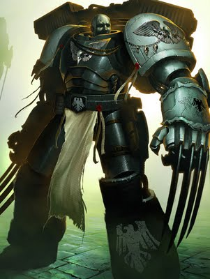

<!-- A0456-B0118 -->

原译文

Raven Guard Space Marine 暗鸦守卫星际战士

**校订译文**

Raven Guard Space Marine 暗鸦守卫星际战士

<!-- /A0456-B0118 -->

<!-- A0456-B0119 -->
### Recent Events 近期事件

<!-- /A0456-B0119 -->

<!-- A0456-B0120 -->
### Timeline 时间线

<!-- /A0456-B0120 -->

<!-- A0456-B0121 -->

原译文

544.M32: The War of the Beast 野兽战争

**校订译文**

544.M32: The War of the Beast 野兽战争

<!-- /A0456-B0121 -->

<!-- A0456-B0122 -->

原译文

???.M36 — The Plague of Unbelief 无信瘟疫

**校订译文**

???.M36 — The Plague of Unbelief 无信瘟疫

<!-- /A0456-B0122 -->

<!-- A0456-B0123 -->
**英文原文**

018.M36: The Battle of Parocheus — The Raven Guard under Yaroslan Medexus battle Dark Eldar Haemonculi on the world of Parocheus.

<!-- /A0456-B0123 -->

<!-- A0456-B0124 -->

原译文

帕罗切乌斯之战 — 亚罗斯兰·梅德休斯率领的暗鸦守卫在帕罗切乌斯世界与黑暗灵族血伶人作战。

**校订译文**

018.M36——帕罗切乌斯之战。亚罗斯兰·梅德休斯率暗鸦守卫，在帕罗切乌斯迎战黑暗灵族血伶人。

<!-- /A0456-B0124 -->

<!-- A0456-B0125 -->
**英文原文**

508.M40: The Raider Raided — A battle between the Strike Force Ultra under the command of the Captain Oradias and the Dark Eldar pirate forces of the Subaron Rift.

<!-- /A0456-B0125 -->

<!-- A0456-B0126 -->

原译文

掠夺者突袭 — 奥拉迪亚斯连长指挥的超级打击部队与萨巴隆裂隙的黑暗灵族海盗部队之间的战斗。

**校订译文**

508.M40——袭击者遭袭。奥拉迪亚斯连长率极限打击部队，与萨巴隆裂隙的黑暗灵族海盗交战。

<!-- /A0456-B0126 -->

<!-- A0456-B0127 -->
**英文原文**

???.M41: Battle on Rhorsch — The planet Rhorsch was infested firstly by a Blood Cults and then - by Daemons themselves. The Raven Guards with the aid of the Mortifactors Chapter eliminated the enemies. Led by Shadow Captain Rykas, the Raven Guard slayed the High Bloodcaller of the horde and stopped the Heresy.

<!-- /A0456-B0127 -->

<!-- A0456-B0128 -->

原译文

罗尔沙赫之战 — 罗尔沙赫星球首先被鲜血教派侵扰，然后被恶魔侵扰。暗鸦守卫在苦行者战团的帮助下消灭了敌人。在暗影连长莱卡斯的带领下，暗鸦守卫杀死了部落的至高鲜血召唤者，并阻止了异端。

**校订译文**

???.M41——罗尔沙赫之战。行星最初遭鲜血教派渗透，随后恶魔亲自降临。暗鸦守卫在苦行者战团协助下歼灭敌军。暗影连长莱卡斯率部斩杀敌军的至高鲜血召唤者，终结了这场异端祸乱。

<!-- /A0456-B0128 -->

<!-- A0456-B0129 -->
**英文原文**

???.M41: Conquering of Obdurus — The Heretic Fortress World was taken by the Raven Guard Chapter in less than a day, after its Scouts managed to disable Obdurus's orbital defences.

<!-- /A0456-B0129 -->

<!-- A0456-B0130 -->

原译文

征服奥布杜尔斯 — 在侦察兵成功摧毁奥布杜尔斯的轨道防御后，异教徒要塞世界在不到一天的时间里被暗鸦守卫战团占领。

**校订译文**

???.M41——征服奥布杜尔斯。侦察兵先使轨道防御失效，暗鸦守卫随后在不到一天的时间内攻陷了这颗异端要塞世界。

<!-- /A0456-B0130 -->

<!-- A0456-B0131 -->
**英文原文**

204.M41 — 224.M41: The Baran War — The Raven Guard leads a campaign to secure the Exodite World of Baran from Orks. Shadow Captain Moradius leads a small contingent to secure the Sub-sector around Baran, based out of a small moon. However Moradius and his Marines are killed by Eldar after being encircled and ambushed.

<!-- /A0456-B0131 -->

<!-- A0456-B0132 -->

原译文

巴兰战争 — 暗鸦守卫领导了一场战役，以保护巴兰蛮荒世界免受欧克的侵扰。暗影连长莫拉迪乌斯率领一支小分队，在一个小卫星上保护巴兰周围的分区。然而，莫拉迪乌斯和他的战士在被包围和伏击后被灵族杀死。

**校订译文**

204—224.M41——巴兰战争。暗鸦守卫发动战役，试图从欧克手中夺回蛮荒灵族世界巴兰。暗影连长莫拉迪乌斯以一颗小卫星为基地，率小股部队肃清巴兰周边次星区；然而，他们遭灵族伏击包围，莫拉迪乌斯及麾下战士全部被杀。

<!-- /A0456-B0132 -->

<!-- A0456-B0133 -->

原译文

260.M41: The Battle for Columnus 哥伦布之战

**校订译文**

260.M41: The Battle for Columnus 科卢姆努斯之战

<!-- /A0456-B0133 -->

<!-- A0456-B0134 -->

原译文

748.M41: The Thruskus Rebellion 瑟拉斯克斯叛乱

**校订译文**

748.M41: The Thruskus Rebellion 瑟拉斯克斯叛乱

<!-- /A0456-B0134 -->

<!-- A0456-B0135 -->
**英文原文**

Mid-Late 700's.M41: The Sabbat Worlds Crusade — A detachment of Raven Guard take part in the assault on Caligula.

<!-- /A0456-B0135 -->

<!-- A0456-B0136 -->

原译文

萨巴特世界远征 — 暗鸦守卫的一支分队参加了对卡利古拉的袭击。

**校订译文**

M41第八个百年的中后期——萨巴特诸世界远征。暗鸦守卫的一支分遣队参加对卡利古拉的突袭。

**校注：** Mid-Late 700’s.M41 指700至799年间的中后期，译作第八个百年中后期，避免误写为第七个百年。

<!-- /A0456-B0136 -->

<!-- A0456-B0137 -->
**英文原文**

862.M41: Waaagh! Skullkrak invades the Targus system. Kayvaan Shrike and the Raven Guard 3rd company were amongst the forces that respond.

<!-- /A0456-B0137 -->

<!-- A0456-B0138 -->

原译文

碎颅的Waaagh！入侵了塔古斯星系。凯万·史瑞克和暗鸦守卫第三连是做出回应的部队之一。

**校订译文**

862.M41——碎颅的Waaagh！入侵塔古斯星系，凯万·史瑞克率暗鸦守卫第三连参与应战。

<!-- /A0456-B0138 -->

<!-- A0456-B0139 -->

原译文

865.M41: The Heraclad Massacre 赫拉克勒德大屠杀

**校订译文**

865.M41: The Heraclad Massacre 赫拉克勒德大屠杀

<!-- /A0456-B0139 -->

<!-- A0456-B0140 -->

原译文

868.M41: The Battle for Targus VIII 塔古斯八号之战

**校订译文**

868.M41: The Battle for Targus VIII 塔古斯八号之战

<!-- /A0456-B0140 -->

<!-- A0456-B0141 -->
**英文原文**

871.M41: The Liberation of Quintus — Kayvaan Shrike leads a pursuit of the infamous Alpha Legion Daemon Prince Kernax Voldorius.

<!-- /A0456-B0141 -->

<!-- A0456-B0142 -->

原译文

昆图斯的解放 — 凯万·史瑞克领导了对臭名昭著的阿尔法军团恶魔王子克纳克斯·沃尔多里乌斯的追捕。

**校订译文**

871.M41——解放昆图斯。凯万·史瑞克追捕臭名昭著的阿尔法军团恶魔亲王克纳克斯·沃尔多里乌斯。

<!-- /A0456-B0142 -->

<!-- A0456-B0143 -->

原译文

890.M41: The Shadowblade War 影刃战争

**校订译文**

890.M41: The Shadowblade War 影刃战争

<!-- /A0456-B0143 -->

<!-- A0456-B0144 -->

原译文

938.M41: The Blindhope Planetstrike 目盲希望行星打击

**校订译文**

938.M41: The Blindhope Planetstrike 目盲希望行星打击

<!-- /A0456-B0144 -->

<!-- A0456-B0145 -->
**英文原文**

991.M41: The Sargassion Reach Campaign. The Raven Guard deployed at least 3 squads from 4th Company under Shadow Captain Koryn to aid the Brazen Minotaurs in their fight against Death Guard Warband Empyrion's Blight.

<!-- /A0456-B0145 -->

<!-- A0456-B0146 -->

原译文

萨加希恩河段行动。暗鸦守卫在暗影连长科林的带领下，从第四连部署了至少三个小队，以协助黄铜米诺陶对抗死亡守卫战帮炽域之疫。

**校订译文**

991.M41——萨加希恩疆域战役。暗影连长科林率第四连至少三个小队，支援黄铜米诺陶，迎战死亡守卫战帮炽域之疫。

<!-- /A0456-B0146 -->

<!-- A0456-B0147 -->
**英文原文**

992.M41: The Raid on Kastorel Novem — Shadow Captain Korvydae leads the 10th Company against the Ork Warboss Garaghak on the world of Kastorel-Novem.

<!-- /A0456-B0147 -->

<!-- A0456-B0148 -->

原译文

卡斯特罗十一号突袭 — 暗影连长卡尔维戴带领第十连在卡斯特罗十一号世界上对抗欧克战争头目加拉哈克。

**校订译文**

992.M41——卡斯特罗·诺文突袭。暗影连长卡尔维戴率第十连，在卡斯特罗·诺文迎战欧克战争头目加拉哈克。

**校注：** Kastorel Novem 原译卡斯特罗十一号，Novem 并非十一。暂保留音译诺文，等待正式地名核对。

<!-- /A0456-B0148 -->

<!-- A0456-B0149 -->

原译文

996.M41: The Lonal Ambush 洛纳尔伏击

**校订译文**

996.M41: The Lonal Ambush 洛纳尔伏击

<!-- /A0456-B0149 -->

<!-- A0456-B0150 -->
**英文原文**

999.M41: The Invasion of Ultramar — An elite squad from the 4th Company under Shadow Captain Aethon Shaan is deployed to aid Ultramar in its battle against the Bloodborn.

<!-- /A0456-B0150 -->

<!-- A0456-B0151 -->

原译文

奥特拉玛入侵 — 暗影连长艾森·沙恩率领的第四连精英小队被部署协助奥特拉玛对抗血裔。

**校订译文**

999.M41——奥特拉玛入侵。暗影连长艾索·沙恩率第四连的一支精锐小队，支援奥特拉玛，迎战血裔。

<!-- /A0456-B0151 -->

<!-- A0456-B0152 -->
**英文原文**

757.999.M41: The Battle of Mu'gulath Bay — The Raven Guard under Chapter Master Corvin Severax himself attempts to defend Agrellan from Tau assault.

<!-- /A0456-B0152 -->

<!-- A0456-B0153 -->

原译文

穆古拉湾之战 — 科文·塞维拉克斯连长率领的暗鸦守卫试图保护阿格雷兰免受钛的攻击。

**校订译文**

757.999.M41——穆古拉湾之战。战团长科文·塞维拉克斯亲率暗鸦守卫，试图守住阿格雷兰，抵御钛族进攻。

<!-- /A0456-B0153 -->

<!-- A0456-B0154 -->
**英文原文**

999.M41: The Battle of Voltoris — Reeling from his defeat at Mu'gulath Bay, Severax successfully ambushes the Tau.

<!-- /A0456-B0154 -->

<!-- A0456-B0155 -->

原译文

沃尔托利斯之战 — 在穆古拉湾战败后，塞维拉克斯成功伏击了钛。

**校订译文**

999.M41——沃尔托利斯之战。穆古拉湾战败的余波未平，塞维拉克斯已成功设伏袭击钛族。

<!-- /A0456-B0155 -->

<!-- A0456-B0156 -->
**英文原文**

999.M41: The Prefectia Campaign — Chapter Master Severax is slain battling Commander Shadowsun. Kayvaan Shrike is elected the new Chapter Master.

<!-- /A0456-B0156 -->

<!-- A0456-B0157 -->

原译文

总督战役 - 战团长赛维拉克斯在与影阳指挥官的战斗中被杀。凯万·史瑞克被选为新的战团长。

**校订译文**

999.M41——总督星战役。战团长塞维拉克斯在与指挥官影阳交战时阵亡，凯万·史瑞克被推举为新任战团长。

**校注：**  Prefectia 与18及713—714为同一世界，按全书统一决定使用总督星；原普雷费克提亚留原译对照。

<!-- /A0456-B0157 -->

<!-- A0456-B0158 -->
**英文原文**

999.M41: The Second Agrellan Campaign — Shrike leads forces to recapture the Hive World of Agrellan from the Tau.

<!-- /A0456-B0158 -->

<!-- A0456-B0159 -->

原译文

第二次阿格雷兰战役 — 史瑞克带领部队从钛手中夺回阿格雷兰巢都世界。

**校订译文**

999.M41——第二次阿格雷兰战役。史瑞克率军反攻，试图从钛族手中夺回阿格雷兰巢都世界。

<!-- /A0456-B0159 -->

<!-- A0456-B0160 -->
**英文原文**

996.999.M41: Waaagh! Garaghak — The entire chapter stands ready to defend their homeworld against Ork Waaagh! of titanic proportions.

<!-- /A0456-B0160 -->

<!-- A0456-B0161 -->

原译文

加拉哈克的Waaagh！— 整个战团都准备好保卫他们的家园世界，对抗巨大规模的欧克Waaagh！。

**校订译文**

996.999.M41——加拉哈克的Waaagh！全战团严阵以待，准备保卫母星，抵御规模惊人的欧克Waaagh！

<!-- /A0456-B0161 -->

<!-- A0456-B0162 -->
**英文原文**

~999.M41: The Terran Crusade — Raven Guard elements answer the call of the reborn Roboute Guilliman.

<!-- /A0456-B0162 -->

<!-- A0456-B0163 -->

原译文

泰拉远征 — 暗鸦守卫成员响应了重生的罗伯特·基里曼的号召。

**校订译文**

约999.M41——泰拉远征。暗鸦守卫部分部队响应复生的罗保特·基里曼的号召。

<!-- /A0456-B0163 -->

<!-- A0456-B0164 -->

原译文

???.M41/M42: The Reclamation of Safiniyus 萨菲尼尤斯收复

**校订译文**

???.M41/M42: The Reclamation of Safiniyus 萨菲尼尤斯收复

<!-- /A0456-B0164 -->

<!-- A0456-B0165 -->
**英文原文**

???.M42: The Scattering — Kayvaan Shrike convenes the Chapter and orders their strategic deployment across the Imperium.

<!-- /A0456-B0165 -->

<!-- A0456-B0166 -->

原译文

大分散 — 凯万·史瑞克召集战团，命令他们在整个帝国进行战略部署。

**校订译文**

???.M42——大分散。凯万·史瑞克召集战团，下令将部队战略部署至帝国各地。

<!-- /A0456-B0166 -->

<!-- A0456-B0167 -->

原译文

???.M42: The War for Tarrovar 塔罗瓦尔战争

**校订译文**

???.M42: The War for Tarrovar 塔罗瓦尔战争

<!-- /A0456-B0167 -->

<!-- A0456-B0168 -->

原译文

???.M42: The Invasion of the Odoacer System 奥多亚克星系入侵

**校订译文**

???.M42: The Invasion of the Odoacer System 奥多亚克星系入侵

<!-- /A0456-B0168 -->

<!-- A0456-B0169 -->

原译文

???.M42: The Battle of Xalladin 沙拉丁之战

**校订译文**

???.M42: The Battle of Xalladin 沙拉丁之战

<!-- /A0456-B0169 -->

<!-- A0456-B0170 -->

原译文

???.M42: The War for the Sithoza System 西托扎星系战争

**校订译文**

???.M42: The War for the Sithoza System 西托扎星系战争

<!-- /A0456-B0170 -->

<!-- A0456-B0171 -->

原译文

???.M42: The Charadon Campaign 查拉顿战役

**校订译文**

???.M42: The Charadon Campaign 查拉顿战役

<!-- /A0456-B0171 -->

<!-- A0456-B0172 -->

原译文

???.M42: The Fourth Tyrannic War 第四次泰伦战争

**校订译文**

???.M42: The Fourth Tyrannic War 第四次泰伦战争

<!-- /A0456-B0172 -->

<!-- A0456-B0173 -->

原译文

Battle of Bastior 巴斯蒂奥之战

**校订译文**

Battle of Bastior 巴斯蒂奥之战

<!-- /A0456-B0173 -->

<!-- A0456-B0174 -->
**英文原文**

Unknown: Campaign against the Word Bearers on the planet Hope's Pyre.

<!-- /A0456-B0174 -->

<!-- A0456-B0175 -->

原译文

在希望柴薪对抗怀言者的战役。

**校订译文**

年代不详——在希望柴薪世界迎战怀言者。

<!-- /A0456-B0175 -->

<!-- A0456-B0176 -->

原译文

Unknown: Purging of Shondor 桑多尔净化

**校订译文**

Unknown: Purging of Shondor 桑多尔净化

<!-- /A0456-B0176 -->

<!-- A0456-B0177 -->

原译文

Unknown: The Siege of Kantarel 坎塔雷尔围城

**校订译文**

Unknown: The Siege of Kantarel 坎塔雷尔围城

<!-- /A0456-B0177 -->

<!-- A0456-B0178 -->
**英文原文**

Unknown: Fighting in the ruined city of Ghastorgrad

<!-- /A0456-B0178 -->

<!-- A0456-B0179 -->

原译文

在被毁的死魂之城作战

**校订译文**

年代不详——在废墟城市死魂之城作战。

<!-- /A0456-B0179 -->

<!-- A0456-B0180 -->

原译文

Unknown: Assault on Hive Lin-Mei 林梅巢都突袭

**校订译文**

Unknown: Assault on Hive Lin-Mei 林梅巢都突袭

<!-- /A0456-B0180 -->

<!-- A0456-B0181 -->

原译文

Unknown: Last March on the Sapphire Worlds 蓝宝石世界最后行军

**校订译文**

Unknown: Last March on the Sapphire Worlds 蓝宝石世界最后行军

<!-- /A0456-B0181 -->

<!-- A0456-B0182 -->

原译文

Unknown: Battle of the Ring of Night 午夜之环之战

**校订译文**

Unknown: Battle of the Ring of Night 午夜之环之战

<!-- /A0456-B0182 -->

<!-- A0456-B0183 -->

原译文

Unknown: Fall of Kordon 科尔登陷落

**校订译文**

Unknown: Fall of Kordon 科尔登陷落

<!-- /A0456-B0183 -->

<!-- A0456-B0184 -->

原译文

Unknown: Operation Chronos 克罗诺斯行动

**校订译文**

Unknown: Operation Chronos 克罗诺斯行动

<!-- /A0456-B0184 -->

<!-- A0456-B0185 -->
## Homeworld 母星

原题：Homeworld 家园世界

<!-- /A0456-B0185 -->

<!-- A0456-B0186 -->
**英文原文**

The Raven Guard homeworld is Deliverance, a moon which their Fortress Monastery "Raven Spire" is built on. Deliverance was once known as Lycaeus, where 10,000 years previous to current events, Corvus Corax (soon to be Primarch of the Raven Guard Legion) lead a revolution to free his fellow slaves, and eventually the whole moon from the Slavery enforced on them by the Tech Guilds of the planet below, Kiavahr. Kiavahr was converted into a forge world by the Adeptus Mechanicus upon the Emperor's arrival, due to Corax's wishes that the Tech Guilds no longer held sway, this meant that the Legion also received a vital supply line for materials.

<!-- /A0456-B0186 -->

<!-- A0456-B0187 -->

原译文

暗鸦守卫的家园世界是拯救星，这是他们的堡垒修道院渡鸦尖塔所在的卫星。拯救星曾被称为吕凯乌斯，在当前事件发生前10000年，科沃斯·科拉克斯（即将成为暗鸦守卫军团的原体）领导了一场革命，解放了他的奴隶同胞，并最终使整个卫星摆脱了基亚瓦尔星球下面的技术行会对他们实施的奴隶制。帝皇抵达后，由于科拉克斯希望技术行会不再占据主导地位，基亚瓦尔被机械神教改造成了铸造世界，这意味着军团也获得了重要的物资供应线。

**校订译文**

暗鸦守卫的母星拯救星，是战团要塞修道院渡鸦尖塔所在的卫星，曾名吕凯乌斯。约一万年前，尚未与军团相认的科沃斯·科拉克斯在这里领导革命，解放奴隶同胞，最终推翻了下方行星基亚瓦尔的技术行会对整颗卫星的奴役统治。帝皇抵达后，为满足科拉克斯终结行会权势的要求，机械修会将基亚瓦尔改造为铸造世界，也为军团建立了至关重要的物资供应线。

<!-- /A0456-B0187 -->

<!-- A0456-B0188 -->
**英文原文**

The Raven Guard's chapter planet and base of operations has the production capacity of a small forge world, ensuring that the Chapter rarely lacks for the material to prosecute its campaigns.

<!-- /A0456-B0188 -->

<!-- A0456-B0189 -->

原译文

暗鸦守卫的战团行星和行动基地具有小型铸造世界的生产能力，确保战团很少缺乏开展战役的物资。

**校订译文**

暗鸦守卫的战团行星和行动基地具有小型铸造世界的生产能力，确保战团很少缺乏开展战役的物资。

<!-- /A0456-B0189 -->

<!-- A0456-B0190 -->
## Other Domains 其他领地

原题：Other Domains 其他值域

<!-- /A0456-B0190 -->

<!-- A0456-B0191 -->
**英文原文**

Before and then for a time alongside the Legion homeworld of Deliverance, the Raven Guard held dominion over the Central Asiatic Dustfields of Terra. However, the Raven Guard would eventually abandon this domain, and renounced their tithe rights over the region in 998.M30.

<!-- /A0456-B0191 -->

<!-- A0456-B0192 -->

原译文

在此之前，暗鸦守卫曾一度与军团的拯救星家园世界并肩作战，统治着尘土飞扬的泰拉中亚。然而，暗鸦守卫最终放弃了这一领地，并于998.M30年放弃了对该地区的什一税权利。

**校订译文**

在获得拯救星之前，第十九军团曾领有泰拉的中亚尘域；拯救星成为母星后的一段时期内，这片领地仍归他们统治。后来，暗鸦守卫逐渐放弃此地，并于998.M30正式放弃对该地区征收什一税的权利。

<!-- /A0456-B0192 -->

<!-- A0456-B0193 -->
## Gene-seed 基因种子

<!-- /A0456-B0193 -->

<!-- A0456-B0194 -->
**英文原文**

The degeneration of the Raven Guard gene-seed means several of the unique organs of the Space Marines no longer work properly or no longer grow. Raven Guard do not have the Mucranoid or Betcher's Gland. The Melanchromic Organ has a unique mutation that causes the skin of the Space Marine to grow paler. Eventually each Marine's skin becomes pure white while their hair and eyes darken, becoming black as coal. The main issues could have come from Corax's experimentation with the Raven Guard Gene-Seed to try and create stronger and faster-maturing astartes (although the Alpha Legion is primarily to blame for causing his project's failure); it is never explicitly stated what the actual cause is.

<!-- /A0456-B0194 -->

<!-- A0456-B0195 -->

原译文

暗鸦守卫基因种子的退化意味着星际战士的几个独特器官不再正常工作或不再生长。暗鸦守卫没有强化汗腺或贝彻腐蚀唾液腺。黑色素器官有一种独特的突变，导致星际战士的皮肤变得更苍白。最终，每个星际战士的皮肤都变成了纯白色，而他们的头发和眼睛却变黑了，变得像煤一样黑。主要问题可能来自科拉克斯对暗鸦守卫基因种子的实验，试图创造更强壮、更成熟的阿斯塔特（尽管阿尔法军团是导致其项目失败的主要原因）；他从未明确说明实际原因是什么。

**校订译文**

暗鸦守卫基因种子退化，使星际战士特有的部分器官无法正常运作，甚至不再生长。他们缺少汗腺改进器官与贝彻腺体；色素控制器官则有独特突变，使皮肤日益苍白，最终变成纯白，头发与双眼却逐渐转为煤黑。这些问题可能与科拉克斯当年试图创造更强壮、成熟更快的阿斯塔特而开展的基因实验有关，尽管导致计划失败的主要责任在于阿尔法军团。实际成因始终未被明确说明。

<!-- /A0456-B0195 -->

<!-- A0456-B0196 图片 -->
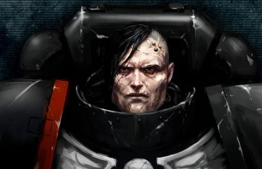

<!-- A0456-B0197 -->

原译文

warrior of the Raven Guard without his helmet 不带头盔的暗鸦守卫战士

**校订译文**

warrior of the Raven Guard without his helmet 未戴头盔的暗鸦守卫战士

<!-- /A0456-B0197 -->

<!-- A0456-B0198 -->
**英文原文**

In M32, a sudden degeneration afflicted the Raven Guard's gene-seed, causing organs to fail and implants to be rejected. From this time onward, the Chapter was forced to rely on gene-seed stocks from Terra, a factor that slowed the Chapter’s recruitment rates significantly but did not curtail their willingness for battle.

<!-- /A0456-B0198 -->

<!-- A0456-B0199 -->

原译文

在M32，暗鸦守卫的基因种子突然退化，导致器官衰竭和植入物被排斥。从那时起，战团被迫依赖泰拉的基因种子库，这一因素大大减缓了战团的招募速度，但并没有削弱他们的战斗意愿。

**校订译文**

在M32，暗鸦守卫的基因种子突然退化，导致器官衰竭和植入物被排斥。从那时起，战团被迫依赖泰拉的基因种子库，这一因素大大减缓了战团的招募速度，但并没有削弱他们的战斗意愿。

<!-- /A0456-B0199 -->

<!-- A0456-B0200 -->
### The Sable Brand 黑色烙印

<!-- /A0456-B0200 -->

<!-- A0456-B0201 -->
**英文原文**

Since the earliest days of the Raven Guard, some of their number have been prone to a battle madness known as the Sable Brand. This consists of cold-blooded determination to fight on with no regard for self-preservation coupled with an inability to separate the whispers of the dead from the words of the living. Thought to be an original flaw in Corax's gene-seed that he himself may have suffered, it is marked by one's eyes becoming completely black. Though its effects are not permanent, it is often ever-present amongst those who suffer from it. During the Great Crusade, Corax organized those afflicted into units of Shadow Killers. However, after the Legion's near extinction on Isstvan V, the Primarch could no longer waste troops like this.

<!-- /A0456-B0201 -->

<!-- A0456-B0202 -->

原译文

自暗鸦守卫成立之初，他们中的一些人就容易陷入一种被称为黑色烙印的疯狂战斗。这包括冷血的决心，不考虑自我保护，再加上无法将死者的低语与生者的言语分开。这被认为是科拉克斯基因种子中的一个原始缺陷，他自己也可能遭受过，其特征是一个人的眼睛完全变黑了。虽然它的影响不是永久性的，但它经常出现在那些遭受它的人身上。在大远征期间，科拉克斯将那些受折磨的人组织成暗影杀手部队。然而，在军团在伊斯塔万五号几乎毁灭后，原体再也不能像这样浪费军队了。

**校订译文**

自军团创立之初，部分暗鸦守卫便容易陷入名为“黑色烙印”的战斗狂乱。发作者会冷酷而决绝地继续战斗，完全不顾自身存亡，同时无法分辨死者的低语与生者的话音。据认为，这源于科拉克斯基因种子的先天缺陷，甚至原体本人也可能深受其苦；其征兆是双眼彻底变黑。症状虽非永久持续，却往往反复纠缠患者。大远征时期，科拉克斯将发作者编为暗影杀手部队；然而，伊斯塔万五号之后军团几近覆灭，他再也承担不起这样消耗兵力。

**校注：** 原文先称影响非永久，后又称常持续存在，语意存在张力；译文保留其可能消退又长期困扰的描述，不增订医学或设定解释。

<!-- /A0456-B0202 -->

<!-- A0456-B0203 -->
**英文原文**

After Isstvan V, Corax labored with various methods to control the Sable Brand. He developed the Trifold Path of Shadow as a result in an attempt to control the outbreaks of madness. The doctrine has indeed led to fewer battle-brothers becoming afflicted with the Sable Brand. However, should the afflicted not be slain in battle, they are eventually incarcerated in the Ravenspire and used in experimentation by the Chapter's apothecaries. This attempt to cure their gene-seed is carried out in total secrecy.

<!-- /A0456-B0203 -->

<!-- A0456-B0204 -->

原译文

在伊斯塔万五号之后，科拉克斯用各种方法控制黑色烙印。他发展了三重阴影之路，试图控制疯狂的爆发。这一学说确实导致更少的战斗兄弟患上黑色烙印。然而，如果受折磨的人没有在战斗中被杀死，他们最终会被关进渡鸦尖塔的监狱，并被战团的药剂师用于实验。这种治愈他们基因种子的尝试是在完全保密的情况下进行的。

**校订译文**

伊斯塔万五号之战后，科拉克斯尝试各种方法控制黑色烙印，并创立“三重阴影之路”，希望抑制狂乱发作。这套教义确实减少了受影响的战斗兄弟。不过，发作者若未战死，最终便会被囚禁于渡鸦尖塔，成为战团药剂师的实验对象。这些寻求修复基因种子的尝试，始终在绝密状态下进行。

<!-- /A0456-B0204 -->

<!-- A0456-B0205 -->
## Culture and combat doctrine 文化与战斗学说

<!-- /A0456-B0205 -->

<!-- A0456-B0206 -->
### Tactics 战术

<!-- /A0456-B0206 -->

<!-- A0456-B0207 -->
**英文原文**

The Raven Guard are known for hitting weak points in enemy defenses hard and they perform lightning strikes upon locations of tactical importance to cripple their enemy. The Raven Guard disdain the notion of recklessly charging into enemy ranks. This differentiates their tactics from those of the Blood Angels. The Raven Guard rely heavily on their Scouts for pinpointing enemy positions and to scout for good drop sites. In recent years, this preference for stealth, disruption, and assassination missions has seen them heavily use Vanguard Space Marine formations.

<!-- /A0456-B0207 -->

<!-- A0456-B0208 -->

原译文

暗鸦守卫以猛烈打击敌人防御中的弱点而闻名，他们对战术上重要的地点进行闪电打击，以削弱敌人。暗鸦守卫不屑于鲁莽地冲进敌人队伍的想法。这使他们的战术与圣血天使的战术不同。暗鸦守卫在很大程度上依赖他们的侦察兵来精确定位敌人的位置，并侦察良好的投放地点。近年来，这种对隐形、破坏和暗杀任务的偏好使他们大量使用先锋星际战士编队。

**校订译文**

暗鸦守卫擅长猛击敌军防线的薄弱点，以闪电突袭摧毁关键战术目标，瘫痪对手。他们不屑于鲁莽冲入敌阵，这使其战术有别于圣血天使。战团高度依赖侦察兵，以精确定位敌军并寻找合适的空降地点。近年来，对潜行、破坏和暗杀任务的偏重，也使他们大量采用先锋星际战士编队。

<!-- /A0456-B0208 -->

<!-- A0456-B0209 图片 -->
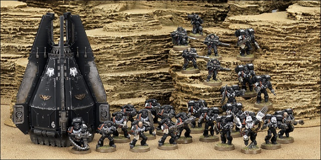

<!-- A0456-B0210 -->

原译文

Raven Guard 暗鸦守卫

**校订译文**

Raven Guard 暗鸦守卫

<!-- /A0456-B0210 -->

<!-- A0456-B0211 -->
**英文原文**

Because of their hit and run tactics and sowing confusion in enemy ranks, the Raven Guard also make extensive use of Assault Squads as well as any other formation that uses Jump Packs. The Tactical Squads of the Raven Guard are often deployed via Thunderhawks or Drop Pods. The favorite weapons of the Raven Guard Commanders are the Lightning Claws and it is a common sight that their command squads also come equipped with these weapons in addition to their Jump Packs.

<!-- /A0456-B0211 -->

<!-- A0456-B0212 -->

原译文

由于他们的跑打战术和在敌人队伍中制造混乱，暗鸦守卫还广泛使用突击小队以及使用跳跃背包的任何其他编队。暗鸦守卫的战术小队通常通过雷鹰或空投舱部署。暗鸦守卫指挥官最喜欢的武器是闪电爪，他们的指挥组除了跳跃背包外，还配备了这些武器，这是一个常见的景象。

**校订译文**

为了贯彻打了就走的战术、在敌阵制造混乱，暗鸦守卫大量使用突击小队及其他配备跳跃背包的部队。战术小队则通常搭乘雷鹰或空降舱投入战场。指挥官最偏爱的武器是闪电爪，其指挥小队也经常同时装备跳跃背包与闪电爪。

<!-- /A0456-B0212 -->

<!-- A0456-B0213 -->
**英文原文**

Raven Guard Captains are fiercely independent, and it's incredibly rare for the chapter to fight as a whole. Individual companies are completely autonomous and are quick to lend their aid to Imperial commanders across the galaxy, with or without the sanction of their Chapter Master. Such behaviour has led to some to question the Raven Guard's soundness, but most recognise that such fluidity of command proves the presence of formidable discipline, not its absence.

<!-- /A0456-B0213 -->

<!-- A0456-B0214 -->

原译文

暗鸦守卫的连长非常独立，很少有整支队伍参与战斗。各个连队是完全自主的，无论是否得到其战团的批准，都会迅速向银河系各地的帝国指挥官提供援助。这种行为导致一些人质疑暗鸦守卫的健全性，但大多数人认识到，这种指挥的流动性证明了强大的纪律的存在，而不是它的缺失。

**校订译文**

暗鸦守卫的连长拥有极高自主权，战团极少全员集中作战。各连独立行动，无论是否获得战团长批准，都能迅速支援银河各地的帝国指挥官。这种做法曾引发对战团是否可靠的质疑，但大多数人明白：如此灵活的指挥方式，恰恰以过硬的纪律为基础。

<!-- /A0456-B0214 -->

<!-- A0456-B0215 -->
**英文原文**

Core to Corax’s teachings was the Trifold Path of Shadow, often rendered in pictorial form as a short-bladed trident, or a triple-bladed lightning claw. The first path of shadow is Ambush, the second Stealth, and the third Vigilance. Mastering one Path, he taught, brought the possibility of victory; mastery of two rendered triumph likely, and accomplishment in all three made the foe’s defeat all but inevitable. From the very first, the Chapter’s Battle Companies were founded around this Trifold Path. Companies 3 through 5 each specialised in one branch, and a battle-brother’s promotion to the 2nd came only when true mastery was attained. Such promotion is far from guaranteed. Even amongst Corax’s sons, there are few who can replicate his skill so completely, and many battle-brothers live out a life of war in the same Battle Company, peerless in their own path, but never truly able to grasp the fathomless depths of the others.

<!-- /A0456-B0215 -->

<!-- A0456-B0216 -->

原译文

科拉克斯教义的核心是阴影的三重路径，通常以图形形式呈现为短刃三叉戟或三刃闪电爪。阴影的第一条路径是伏击，第二条是隐形，第三条是警戒。他教导说，掌握一条道路带来了胜利的可能性；掌握了两个使胜利成为可能，而在所有三个方面的成就使敌人的失败几乎不可避免。从一开始，战团的战斗连就围绕这条三重路径成立。第三至第五连队各专注于一个分支，只有当真正掌握了技能时，一名战斗兄弟才能晋升到第二连。这样的晋升远非板上钉钉。即使在科拉克斯的子嗣中，也很少有人能如此完全地复制他的技能，许多战斗兄弟在同一个战斗连队中度过了战争生活，在自己的道路上无与伦比，但从未真正掌握其他人的深不可测的深度。

**校订译文**

科拉克斯教诲的核心，是常以短刃三叉戟或三刃闪电爪为图像象征的“三重阴影之路”：第一道为伏击，第二道为潜行，第三道为警戒。他教导子嗣，精通一道，便有获胜的可能；精通两道，胜利便更有把握；三道尽通，敌人的败亡几乎注定。战团的战斗连自创立起便围绕此道组建，第三至第五连各精研其中一支，只有真正掌握三道的战斗兄弟才有资格晋入第二连。这种晋升远非必然。即便是科拉克斯的子嗣，也很少有人能如此全面地重现他的技艺。许多人终身留在同一战斗连，在自己的一道上登峰造极，却始终无法穷尽其余两道的深奥。

<!-- /A0456-B0216 -->

<!-- A0456-B0217 -->
**英文原文**

Due to their specialised combat style, the Raven Guard makes less use of heavier vehicles and tanks (such as the Land Raider and Predator) than most chapters. However they conversely make heavy use of Land Speeders and gunships, and due to their extreme tactical autonomy and genetic instability nearly every deployment with see an Apothecary of some sort of included. As a result, the Raven Guard maintains more Apothecaries and Helix Adepts then most chapters.

<!-- /A0456-B0217 -->

<!-- A0456-B0218 -->

原译文

由于其特殊的作战风格，暗鸦守卫比大多数部队更少使用重型载具和坦克（如兰德掠袭者和掠食者）。然而，他们反过来大量使用兰德速攻艇和炮艇，由于其极端的战术自主性和遗传不稳定性，几乎每次部署都包括某种药剂师。因此，暗鸦守卫维持的药剂师和先锋药剂师比大多数战团都多。

**校订译文**

独特的战法使暗鸦守卫比多数战团更少使用兰德掠袭者、掠食者等重型载具与坦克，却大量配备兰德速攻艇和炮艇。由于各部队战术自主性极高，基因又不稳定，几乎每次出动都会安排医疗人员。因此，战团拥有的药剂师与螺旋医疗员也多于多数战团。

<!-- /A0456-B0218 -->

<!-- A0456-B0219 -->
### Shadowmasters 暗影大师

<!-- /A0456-B0219 -->

<!-- A0456-B0220 -->
**英文原文**

The Shadowmasters or Mor Deythan were a unit of Raven Guard during the Great Crusade and Horus Heresy. They were ordinary battle-brothers who had their primarch's ability to Shadow-walk. It was a quirk of the gene-seed in a few Deliverancian born Raven Guard that had more than just the standard gene code. One unique trait about the Shadowmasters is that they were completely unknown to their own legion. The marines were selected for testing "Thermal Technology" which was considered "highly temperamental". Corax and select apothecaries were the only marines in the legion that knew of the group at the time of the Horus Heresy. The Mor Deythan acted as an elite stealth team and saboteurs and communicated through Stalk-Argot while working in concert with the rest of the legion. The Shadowmasters performed flanking manoeuvres and sabotaged columns of rogue Skitarii on Constanix II.

<!-- /A0456-B0220 -->

<!-- A0456-B0221 -->

原译文

暗影大师或摩尔戴斯是大远征和荷鲁斯叛乱期间暗鸦守卫的一个单位。他们是普通的战斗兄弟，拥有原体的暗影行走能力。这是少数出生于拯救星的暗鸦守卫的基因种子的奇事，它们不仅仅具有标准的基因密码。暗影大师的一个独特之处是，他们自己的军团完全不知道他们。战士被选中测试“热能技术”，该技术被认为“喜怒不定”。科拉克斯和受选的药剂师是荷鲁斯叛乱时期军团中唯一知道该组织的战士。摩尔戴斯作为一支精英隐形团队和破坏者，在与军团其他成员合作的同时，通过潜行暗语进行沟通。暗影大师在康斯坦尼斯二号进行了侧翼机动，并破坏了失常的护教军纵队。

**校订译文**

暗影大师，又称摩尔戴斯，是大远征与荷鲁斯之乱时期暗鸦守卫的一支部队。他们原本是普通战斗兄弟，却继承了原体的暗影行走能力。少数出生于拯救星的战士，其基因种子并非只有标准遗传编码，还带有这一特殊特征。这支部队对军团绝大多数人都保密，对外以选拔战士测试“性能极不稳定的热能技术”为掩护。荷鲁斯之乱时期，只有科拉克斯与少数获选的药剂师知情。摩尔戴斯执行精锐潜行与破坏任务，以潜行暗语彼此交流，同时配合军团其他部队作战。在康斯坦尼克斯二号，他们曾实施侧翼迂回，破坏叛变护教军的纵队。

<!-- /A0456-B0221 -->

<!-- A0456-B0222 图片 -->
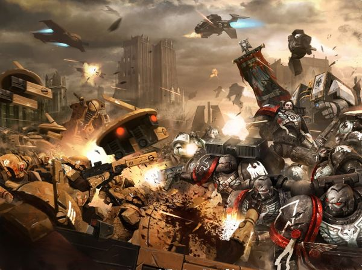

<!-- A0456-B0223 -->

原译文

Raven Guard battle the Tau 暗鸦守卫与钛战斗

**校订译文**

Raven Guard battle the Tau 暗鸦守卫与钛战斗

<!-- /A0456-B0223 -->

<!-- A0456-B0224 -->
### Moritait Protocol 死亡战术协议

<!-- /A0456-B0224 -->

<!-- A0456-B0225 -->
**英文原文**

The Moritat Protocol dates back to the Horus Heresy, and sees individual Raven Guard dropped into warzones to train local defenders or pro-Imperial elements in order to wage a local insurgency in support of the Chapters own war effort. Other chapters that also employ local insurgencies to their own ends include the Alpha Legion and Word Bearers.

<!-- /A0456-B0225 -->

<!-- A0456-B0226 -->

原译文

死亡战术协议可以追溯到荷鲁斯叛乱时期，当时个别暗鸦守卫被派往战区训练当地防御者或亲帝国分子，以发动当地叛乱，支援战团的战争努力。其他也利用当地叛乱达到自己目的的战团包括阿尔法军团和怀言者。

**校订译文**

死亡战术协议可追溯至荷鲁斯之乱。依照这一做法，暗鸦守卫会将个别战士投送到战区，训练当地守军或亲帝国势力，发动本土起义，以支援战团的作战。阿尔法军团与怀言者同样会利用地方叛乱达成自身目的。

**校注：** 标题英文作 Moritait，正文作 Moritat，原文拼写差异保留。此协议名称沿原稿，不与大远征 Moritat 兵种身份直接合并。

<!-- /A0456-B0226 -->

<!-- A0456-B0227 -->
### Culture and Traditions 文化与传统

<!-- /A0456-B0227 -->

<!-- A0456-B0228 -->
### Culture 文化

<!-- /A0456-B0228 -->

<!-- A0456-B0229 -->
**英文原文**

The Raven Guard are known for their grim and brooding nature. They are thought to be isolationist, dour, and laconic. These traits combined with their preference for secretive and stealth has made them few friends in the wider Imperium. However due to their history as liberators of slaves, the Raven Guard maintain close ties with mortals, particularly those of their homeworld Deliverance.

<!-- /A0456-B0229 -->

<!-- A0456-B0230 -->

原译文

暗鸦守卫以其冷酷和沉思的天性而闻名。他们被认为是孤立主义者，沉默寡言，言简意赅。这些特征加上他们对秘密和隐秘的偏好，使他们在更广泛的帝国中几乎没有朋友。然而，由于他们作为奴隶解放者的历史，暗鸦守卫与凡人保持着密切的联系，尤其是那些来自他们家园拯救星的人。

**校订译文**

暗鸦守卫以冷峻、内敛而闻名，常被视为孤僻、严肃、寡言。这些性情加上对隐秘潜行的偏爱，使他们在帝国中少有朋友。然而，作为昔日奴隶的解放者，他们仍与凡人保持紧密联系，尤其亲近母星拯救星的居民。

<!-- /A0456-B0230 -->

<!-- A0456-B0231 -->
**英文原文**

Unknown to many, the culture of the Raven Guard also embraces art. Before the liberation of Deliverance, originally known as Lycaeus, self-expression among the slave miners was a deeply private matter, shared only with great reluctance. Anything beautiful had to be small enough to hide it from the overseers. In those hidden details, Corax learned to see art in small things. The prisoners of Lycaeus used what little free time they possessed to chip stone into beautiful, flowing forms.

<!-- /A0456-B0231 -->

<!-- A0456-B0232 -->

原译文

许多人都不知道，暗鸦守卫的文化也包含艺术。在最初被称为吕凯乌斯的解放之前，奴隶矿工之间的自我表达是一件非常私人的事情，只是非常不情愿地分享。任何漂亮的东西都必须足够小，才能让监工看不见。在这些隐藏的细节中，科拉克斯学会了从小事中看到艺术。吕凯乌斯的囚犯利用他们仅有的一点空闲时间，将石头凿成美丽流畅的形状。

**校订译文**

鲜为人知的是，暗鸦守卫的文化也珍视艺术。拯救星尚名吕凯乌斯、尚未获解放时，奴隶矿工将自我表达视为极其私密的事情，很少愿意与人分享。一切美丽之物都必须足够小，才能避开监工的耳目。科拉克斯正是从这些隐秘细节中学会欣赏微小事物中的艺术。囚犯们利用所剩无几的闲暇，将石块雕凿成优美而流畅的形态。

<!-- /A0456-B0232 -->

<!-- A0456-B0233 -->
**英文原文**

As a reminder of these traditions, some Raven Guard adorn their armour with mass of subtle geometric patterns and flowing motifs deriving from the decorative arts of Lycaean miners.

<!-- /A0456-B0233 -->

<!-- A0456-B0234 -->

原译文

作为对这些传统的提醒，一些暗鸦守卫用大量微妙的几何图案和流动的图形装饰他们的盔甲，这些源于吕凯乌斯矿工的装饰艺术。

**校订译文**

为了纪念这些传统，一些暗鸦守卫会以细微的几何纹样与流畅图案装饰护甲，其风格源自吕凯乌斯矿工的装饰艺术。

<!-- /A0456-B0234 -->

<!-- A0456-B0235 -->
**英文原文**

Known cultural traditions of the Raven Guard include the Contest of Shadows.

<!-- /A0456-B0235 -->

<!-- A0456-B0236 -->

原译文

暗鸦守卫的已知文化传统包括暗影竞赛。

**校订译文**

暗鸦守卫的已知文化传统包括暗影竞赛。

<!-- /A0456-B0236 -->

<!-- A0456-B0237 -->
### Rites of Shadow 暗影仪式

<!-- /A0456-B0237 -->

<!-- A0456-B0238 -->
**英文原文**

The Rites of Shadow are a Raven Guard and Successor Chapter silent ritual with ancient roots. Conducted in complete silence, Corspake sign language is used for traditional questions and answers. The Rites teach that the shadow contains both trues and lies, the purpose of each is the separation of one from the other, and glimpsing of verities otherwise hidden. This is applied to one's Battle-Brother's, one's cause, and even one's foes. Once one has completed the rites, they will earn the status of "Shadow". The title holds great respect, but no rank or authority.

<!-- /A0456-B0238 -->

<!-- A0456-B0239 -->

原译文

暗影仪式是一个有着古老根源的暗鸦守卫和子战团的无声仪式。鸦语手语在完全沉默的情况下进行，用于传统的问答。仪式教导阴影既包含真理也包含谎言，每一个的目的都是将一个与另一个分开，并瞥见隐藏的真理。这适用于一个人的战斗兄弟、一个人的事业，甚至一个人的敌人。一旦完成仪式，他们将获得暗影的地位。头衔很受尊重，但没有等级或权力。

**校订译文**

暗影仪式是暗鸦守卫及其子战团传承已久的无声仪式。全程不得出声，传统问答以鸦语手势进行。仪式教导参与者：阴影中既有真相，也有谎言；他们应学会将两者分开，窥见原本隐藏的真实。这种辨别同样适用于战斗兄弟、自身事业，乃至敌人。完成仪式者获授“暗影”之名。这是备受尊敬的荣誉称号，并不赋予军阶或职权。

<!-- /A0456-B0239 -->

<!-- A0456-B0240 -->
### Corvia 鸦印

<!-- /A0456-B0240 -->

<!-- A0456-B0241 -->
**英文原文**

All Raven Guard during their initiation or as a form of meditation or spirit quest hunt the tiny ravens native to the forests of Kiavahr. It takes months of training and practice for recruits to sneak up on the small and alert birds, grab them in their bare hands and snap their necks. The skulls of these birds are worn as small totems hanging from a marine's belt on small chains. These totems are known as Corvia and represent a warrior's honour. If a battle-brother falls, one of his surviving comrades will recover his Corvia and carry it, and thus the fallen warrior's honour, into battle until he can return to Kiavahr and bury the small skulls in the soil of the Chapter's homeworld.

<!-- /A0456-B0241 -->

<!-- A0456-B0242 -->

原译文

所有暗鸦守卫在入会期间，或作为冥想或精神探索的一种形式，都会猎杀基亚瓦尔森林中的小渡鸦。新兵需要数月的训练和练习才能悄悄接近这些小而警觉的鸟类，徒手抓住它们，然后拧断它们的脖子。这些鸟的头骨被制成小图腾，用小链子挂在星际战士的腰带上。这些图腾被称为鸦印，代表战士的荣誉。如果一个战斗兄弟倒下了，他的一个幸存的战友将回收他的鸦印，并将其以及倒下的战士的荣誉带入战斗，直到他可以返回基亚瓦尔并将小头骨埋在战团家园世界的土壤中。

**校订译文**

所有暗鸦守卫都会在入团考验中，或为冥想、寻求精神启示，而猎捕基亚瓦尔森林中的小型渡鸦。新兵需要数月训练，才能悄然接近这些小巧警觉的鸟，徒手抓住并拧断其脖颈。鸟头骨制成小图腾，用细链悬于腰带。这些“鸦印”代表战士的荣誉。一名战斗兄弟阵亡后，幸存同袍会收回他的鸦印，带着它与逝者的荣誉继续作战，直到能返回基亚瓦尔，将头骨葬入故土。

**校注：** 原文称回到 Kiavahr 又说埋入“战团母星”土中，但本篇已明确母星为其卫星 Deliverance。译文保留回到基亚瓦尔的具体地名，不擅自改为拯救星。

<!-- /A0456-B0242 -->

<!-- A0456-B0243 -->
### Treatment of the Dead 遗体处置

原题：Treatment of the Dead 死亡处理

<!-- /A0456-B0243 -->

<!-- A0456-B0244 -->
**英文原文**

Upon death, where practical, the body of a Raven Guard Marine will be stripped of its equipment and trappings (including the Corvia), harvested of its gene-seed and left for the local carrion birds to feed upon.

<!-- /A0456-B0244 -->

<!-- A0456-B0245 -->

原译文

一旦死亡，在可行的情况下，暗鸦守卫战士的尸体将被回收其装备和装饰（包括鸦印），回收其基因种子，身体留给当地的腐肉鸟食用。

**校订译文**

战士阵亡后，只要条件允许，同袍便会卸下其装备与饰物，包括鸦印，回收基因种子，然后将遗体留给当地食腐鸟类。

<!-- /A0456-B0245 -->

<!-- A0456-B0246 -->

原译文

"Wraith-Slipping" “幽灵滑行”

**校订译文**

"Wraith-Slipping" “幽灵滑行”

<!-- /A0456-B0246 -->

<!-- A0456-B0247 -->
**英文原文**

Described as being a combination of mental discipline and martial art, the process of "wraith-slipping" is to take advantage of one's surroundings to conceal one's presence. This is not a psychic power but rather a collection of disciplines and techniques that the Raven Guard use to conceal their visual and aural presence despite their use of power armour. It is a technique that is described both prior to the outbreak of civil war in the Horus Heresy and up to the 41st Millennium.

<!-- /A0456-B0247 -->

<!-- A0456-B0248 -->

原译文

被描述为精神训练和武艺的结合，“幽灵滑行”的过程是利用周围的环境来隐藏自己的存在。这不是一种灵能力量，而是暗鸦守卫用来隐藏视觉和听觉存在的一系列纪律和技术，尽管他们使用了动力盔甲。这是一种在荷鲁斯叛乱内战爆发之前和第41个千年之前都有描述的技术。

**校订译文**

“幽灵滑行”结合了精神训练与武艺，利用周围环境掩藏自身。它并非灵能，而是一整套技巧与训练，使暗鸦守卫即便穿着动力甲，也能隐藏身影、压低声响。从荷鲁斯之乱爆发前到第四十一个千年，都有关于这种技艺的记载。

<!-- /A0456-B0248 -->

<!-- A0456-B0249 -->
### Corspake 鸦语

<!-- /A0456-B0249 -->

<!-- A0456-B0250 -->
**英文原文**

Corspake is a form of sign language taught to all members of the Raven Guard. This allows them to communicate on the battlefield without having to risk themselves to exposure by speaking or using Vox technology. Notable signs include The Crowfane; the Feast of Bones; the Empty Chime; even the Murder Call, which calls for vengeance against the slayer of a great hero. The 2nd Company is known for its prodigious use of Corspake, and none can rise to the rank of Shadow Captain without mastering it.

<!-- /A0456-B0250 -->

<!-- A0456-B0251 -->

原译文

鸦语是一种手语，教授给暗鸦守卫的所有成员。这使他们能够在战场上进行交流，而不必通过说话或使用音阵技术来冒险暴露自己。著名的手势包括乌鸦神殿；骨头盛宴；空无钟鸣；甚至是谋杀呼唤，它呼吁对一位伟大英雄的凶手进行复仇。第二连以其对鸦语的惊人使用而闻名，没有人能在不掌握它的情况下晋升为暗影连长。

**校订译文**

鸦语是一种所有暗鸦守卫都要学习的手语，使他们无需冒着暴露的风险开口说话或使用音阵，便能在战场上交流。知名手势包括乌鸦神殿、白骨盛宴、空无钟鸣，以及号召为遭杀害的伟大英雄复仇的“谋杀呼唤”。第二连尤其精通鸦语；未能掌握者，不能晋升暗影连长。

<!-- /A0456-B0251 -->

<!-- A0456-B0252 -->
## Organisation 组织

<!-- /A0456-B0252 -->

<!-- A0456-B0253 -->
## Legion 军团

<!-- /A0456-B0253 -->

<!-- A0456-B0254 -->
**英文原文**

During the Great Crusade the Raven Guard Legion followed the basic organizational doctrine. The Legion was divided into chapters, chapters were divided into battalions, battalions into companies, and companies into squads. However companies were preferred for most independent operations. Legion officers devolved command responsibility to sub-commanders, allowing them to make tactical decisions and to seek the initiative without interfering with the command chain. The influence of Terran recruits from the Xeric tribes was the cause of this.

<!-- /A0456-B0254 -->

<!-- A0456-B0255 -->

原译文

在大远征期间，暗鸦守卫军团遵循了基本的组织学说。军团分为战团，战团分为营，营分为连队，连分为小队。然而，大多数独立行动的连队更受欢迎。老兵军官将指挥权下放给副指挥官，使他们能够在不干扰指挥链的情况下做出战术决策并寻求主动权。来自薛里克部落的泰拉新兵的影响是造成这一现象的原因。

**校订译文**

大远征时期，暗鸦守卫遵循军团的基本编制：军团下辖战团，战团下辖营，营下辖连，连下辖小队。不过，多数独立行动更偏好以连为单位。军团军官将指挥责任下放给下属指挥官，使其能够在不破坏指挥体系的前提下，自主决策并争取主动。这种传统源于泰拉薛里克部落新兵的影响。

<!-- /A0456-B0255 -->

<!-- A0456-B0256 -->
**英文原文**

During Corax's restructuring of the Raven Guard, he was able to commission several innovations for his own use from Mars. These were all then modified further by the Legion itself to maximize stealth and speed. Unique combat vehicles included the Whispercutter - an open-topped airframe flyer that was capable of dropping 10 Space Marines into a war zone in utter silence and with practically no chance of detection. Other unique variants included the stealthy Thunderhawk variant known as the Shadowhawk and the similar Storm eagle pattern dubbed the Dark Wing.

<!-- /A0456-B0256 -->

<!-- A0456-B0257 -->

原译文

在科拉克斯重组暗鸦守卫期间，他能够从火星上委托进行几项创造供自己使用。这些都被军团本身进一步修改，以最大限度地提高隐蔽性和速度。独特的战斗载具包括低语切割者，这是一种顶部开放机身的飞行器，能够在完全寂静的情况下将10名星际战士投入战区，几乎没有被发现的机会。其他独特的变体包括被称为暗影鹰的隐形雷鹰变体和被称为暗翼的类似的风暴鹰型号。

**校订译文**

科拉克斯重组军团时，曾委托火星开发多种创新装备。军团随后进一步改装，以最大程度提高隐蔽性与速度。专属载具包括“低语切割者”：一种敞顶飞行器，能悄无声息地将十名星际战士送入战区，几乎不会被察觉。其他改型包括雷鹰的隐形版本“暗影鹰”，以及以风暴鹰为基础、具有类似功能的“暗翼”。

<!-- /A0456-B0257 -->

<!-- A0456-B0258 -->
**英文原文**

After the Dropsite Massacre Corax was left with a tattered Legion and had to reorganize them. They were combined into divisions based on combat specializations. The tactical companies became the Talons, the assault companies became the Falcons, and light vehicle squadrons and air support were renamed the Hawks. Another unit of genetically enhanced Astartes dubbed the Raptors was later added as well.

<!-- /A0456-B0258 -->

<!-- A0456-B0259 -->

原译文

在登陆点大屠杀之后，科拉克斯被留下了一个破败的军团，不得不重组他们。他们根据作战专长被合并为部。战术连变成了鹰爪，突击连变成了猎鹰，轻型载具中队和空中支援被重新命名为雄鹰。后来又增加了另一支被称为猛禽的基因增强阿斯塔特。

**校订译文**

登陆点大屠杀后，科拉克斯不得不重组残破的军团。他将部队按作战专长合并编组：战术连组成“鹰爪”，突击连组成“猎鹰”，轻型载具中队与空中支援部队则合称“雄鹰”。后来，又加入了基因强化阿斯塔特组成的“猛禽”。

<!-- /A0456-B0259 -->

<!-- A0456-B0260 -->
### Known units of the Great Crusade and Horus Heresy 大远征和荷鲁斯之乱的已知单位

原题：Known units of the Great Crusade and Horus Heresy 大远征和荷鲁斯叛乱的已知单位

<!-- /A0456-B0260 -->

<!-- A0456-B0261 -->
### Chapters 战团

<!-- /A0456-B0261 -->

<!-- A0456-B0262 -->

原译文

2nd Chapter 第二战团

**校订译文**

2nd Chapter 第二战团

<!-- /A0456-B0262 -->

<!-- A0456-B0263 -->

原译文

3rd Chapter 第三战团

**校订译文**

3rd Chapter 第三战团

<!-- /A0456-B0263 -->

<!-- A0456-B0264 -->

原译文

4th Chapter 第四战团

**校订译文**

4th Chapter 第四战团

<!-- /A0456-B0264 -->

<!-- A0456-B0265 -->

原译文

5th Chapter 第五战团

**校订译文**

5th Chapter 第五战团

<!-- /A0456-B0265 -->

<!-- A0456-B0266 -->
**英文原文**

7th Chapter (The "Stormcrows")

<!-- /A0456-B0266 -->

<!-- A0456-B0267 -->

原译文

第七战团（“风暴鸦”）

**校订译文**

第七战团（“风暴鸦”）

<!-- /A0456-B0267 -->

<!-- A0456-B0268 -->
**英文原文**

11th Chapter (The "Pale Nomads")

<!-- /A0456-B0268 -->

<!-- A0456-B0269 -->

原译文

第十一战团（“苍白游牧人”）

**校订译文**

第十一战团（“苍白游牧人”）

<!-- /A0456-B0269 -->

<!-- A0456-B0270 -->

原译文

17th Chapter 第十七战团

**校订译文**

17th Chapter 第十七战团

<!-- /A0456-B0270 -->

<!-- A0456-B0271 -->
**英文原文**

18th Chapter (The "Ashen Claws"): Turned renegade during the Horus Heresy and still exists as a piratical warband of Renegade Space Marines in the current imperium.

<!-- /A0456-B0271 -->

<!-- A0456-B0272 -->

原译文

第十八战团（“灰烬之爪”）：在荷鲁斯叛乱期间成为叛徒，在当前的帝国中仍然作为叛徒星际战士的海盗武装存在。

**校订译文**

第十八战团（“灰烬之爪”）：荷鲁斯之乱期间脱离帝国；原文记载时，仍以从事海盗活动的变节星际战士战帮形式存在。

<!-- /A0456-B0272 -->

<!-- A0456-B0273 -->
### Battalions 营

<!-- /A0456-B0273 -->

<!-- A0456-B0274 -->

原译文

1st Battalion 第一营

**校订译文**

1st Battalion 第一营

<!-- /A0456-B0274 -->

<!-- A0456-B0275 -->

原译文

3rd Assault Battalion 第三突击营

**校订译文**

3rd Assault Battalion 第三突击营

<!-- /A0456-B0275 -->

<!-- A0456-B0276 -->

原译文

4th Battalion 第四营

**校订译文**

4th Battalion 第四营

<!-- /A0456-B0276 -->

<!-- A0456-B0277 -->

原译文

7th Battalion 第七营

**校订译文**

7th Battalion 第七营

<!-- /A0456-B0277 -->

<!-- A0456-B0278 -->
### Companies 连队

<!-- /A0456-B0278 -->

<!-- A0456-B0279 -->

原译文

3rd Company 第三连队

**校订译文**

3rd Company 第三连队

<!-- /A0456-B0279 -->

<!-- A0456-B0280 -->

原译文

13th Company 第十三连队

**校订译文**

13th Company 第十三连队

<!-- /A0456-B0280 -->

<!-- A0456-B0281 -->

原译文

14th Interdiction Company 第十四封锁连队

**校订译文**

14th Interdiction Company 第十四封锁连队

<!-- /A0456-B0281 -->

<!-- A0456-B0282 -->

原译文

18th Company 第十八连队

**校订译文**

18th Company 第十八连队

<!-- /A0456-B0282 -->

<!-- A0456-B0283 -->

原译文

19th Battle Company 第十九战斗连队

**校订译文**

19th Battle Company 第十九战斗连队

<!-- /A0456-B0283 -->

<!-- A0456-B0284 -->

原译文

29th Company 第二十九连队

**校订译文**

29th Company 第二十九连队

<!-- /A0456-B0284 -->

<!-- A0456-B0285 -->

原译文

31st Shadow Company 第三十一暗影连队

**校订译文**

31st Shadow Company 第三十一暗影连队

<!-- /A0456-B0285 -->

<!-- A0456-B0286 -->

原译文

44th Armoured Company 第四十四装甲连队

**校订译文**

44th Armoured Company 第四十四装甲连队

<!-- /A0456-B0286 -->

<!-- A0456-B0287 -->

原译文

48th Heavy Company 第四十八重型连队

**校订译文**

48th Heavy Company 第四十八重型连队

<!-- /A0456-B0287 -->

<!-- A0456-B0288 -->

原译文

66th Company 第六十六连队

**校订译文**

66th Company 第六十六连队

<!-- /A0456-B0288 -->

<!-- A0456-B0289 -->

原译文

89th Company 第八十九连队

**校订译文**

89th Company 第八十九连队

<!-- /A0456-B0289 -->

<!-- A0456-B0290 -->
## Chapter 战团

<!-- /A0456-B0290 -->

<!-- A0456-B0291 -->
**英文原文**

The Raven Guard are a Codex Chapter who generally adhere to the Codex Astartes in their Organisation.

<!-- /A0456-B0291 -->

<!-- A0456-B0292 -->

原译文

暗鸦守卫是一个圣典战团，在其组织中通常遵守阿斯塔特圣典。

**校订译文**

暗鸦守卫是圣典战团，组织编制大体遵循《阿斯塔特圣典》。

<!-- /A0456-B0292 -->

<!-- A0456-B0293 -->
### Headquarters 总部

<!-- /A0456-B0293 -->

<!-- A0456-B0294 -->
**英文原文**

The current headquarters staff as of the Age of the Dark Imperium are as follows.

<!-- /A0456-B0294 -->

<!-- A0456-B0295 -->

原译文

截至黑暗帝国时代，目前的总部人员如下。

**校订译文**

黑暗帝国时代的总部人员与编制如下。

<!-- /A0456-B0295 -->

<!-- A0456-B0296 图片 -->
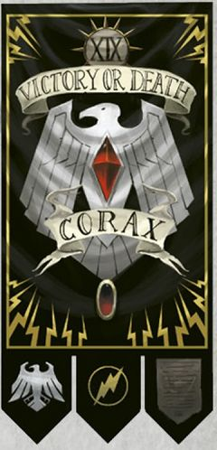

<!-- A0456-B0297 -->

原译文

Aethon Shaan 艾森·沙恩

**校订译文**

Aethon Shaan 艾索·沙恩

<!-- /A0456-B0297 -->

<!-- A0456-B0298 -->
### Master of Shadows 暗影之主

<!-- /A0456-B0298 -->

<!-- A0456-B0299 -->

原译文

Honour Guard 荣誉卫队

**校订译文**

Honour Guard 荣誉卫队

<!-- /A0456-B0299 -->

<!-- A0456-B0300 -->

原译文

Chapter Ancient 战团旗手

**校订译文**

Chapter Ancient 战团旗手

<!-- /A0456-B0300 -->

<!-- A0456-B0301 -->

原译文

Chapter Champion 战团冠军

**校订译文**

Chapter Champion 战团冠军

<!-- /A0456-B0301 -->

<!-- A0456-B0302 -->

原译文

Servitors 机仆

**校订译文**

Servitors 机仆

<!-- /A0456-B0302 -->

<!-- A0456-B0303 -->
### Reclusium 隐修室

原题：Reclusium 隐修会

<!-- /A0456-B0303 -->

<!-- A0456-B0304 图片 -->
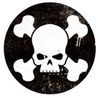

<!-- A0456-B0305 -->

原译文

Jolaran Tael 乔拉兰·泰尔

**校订译文**

Jolaran Tael 乔拉兰·泰尔

<!-- /A0456-B0305 -->

<!-- A0456-B0306 -->
### Master of Sanctity 圣洁导师

<!-- /A0456-B0306 -->

<!-- A0456-B0307 -->
**英文原文**

Olys Kol, Reclusiarch

<!-- /A0456-B0307 -->

<!-- A0456-B0308 -->

原译文

奥林斯·科尔，隐修长

**校订译文**

奥林斯·科尔，隐修长

<!-- /A0456-B0308 -->

<!-- A0456-B0309 -->

原译文

Chaplains 牧师

**校订译文**

Chaplains 教士

<!-- /A0456-B0309 -->

<!-- A0456-B0310 -->

原译文

Judiciars 裁决士

**校订译文**

Judiciars 裁决者

<!-- /A0456-B0310 -->

<!-- A0456-B0311 -->
### Librarius 智库

<!-- /A0456-B0311 -->

<!-- A0456-B0312 图片 -->

<!-- A0456-B0313 -->

原译文

Taalis Shraek 塔里斯·沙耶克

**校订译文**

Taalis Shraek 塔里斯·沙耶克

<!-- /A0456-B0313 -->

<!-- A0456-B0314 -->
### Chief Librarian 首席智库员

原题：Chief Librarian 首席智库

<!-- /A0456-B0314 -->

<!-- A0456-B0315 -->

原译文

Epistolaries 星语官

**校订译文**

Epistolaries 星语官

<!-- /A0456-B0315 -->

<!-- A0456-B0316 -->

原译文

Codiciers 典记员

**校订译文**

Codiciers 典记员

<!-- /A0456-B0316 -->

<!-- A0456-B0317 -->

原译文

Lexicaniums 编修员

**校订译文**

Lexicaniums 编修员

<!-- /A0456-B0317 -->

<!-- A0456-B0318 -->

原译文

Acolytum 侍僧

**校订译文**

Acolytum 侍僧

<!-- /A0456-B0318 -->

<!-- A0456-B0319 -->
### Armoury 军械库

<!-- /A0456-B0319 -->

<!-- A0456-B0320 图片 -->

<!-- A0456-B0321 -->

原译文

Saar Laeron 萨尔·莱尔隆

**校订译文**

Saar Laeron 萨尔·莱尔隆

<!-- /A0456-B0321 -->

<!-- A0456-B0322 -->
### Master of the Forge 铸造大师

原题：Master of the Forge 铸造之主

<!-- /A0456-B0322 -->

<!-- A0456-B0323 -->

原译文

Techmarines 技术军士

**校订译文**

Techmarines 科技战士

<!-- /A0456-B0323 -->

<!-- A0456-B0324 -->

原译文

Techmarine Novitiates 新进技术军士

**校订译文**

Techmarine Novitiates 新进科技战士

<!-- /A0456-B0324 -->

<!-- A0456-B0325 -->

原译文

Servitors 机仆

**校订译文**

Servitors 机仆

<!-- /A0456-B0325 -->

<!-- A0456-B0326 -->

原译文

Transports 运输载具

**校订译文**

Transports 运输载具

<!-- /A0456-B0326 -->

<!-- A0456-B0327 -->

原译文

Battle Tanks 战斗坦克

**校订译文**

Battle Tanks 战斗坦克

<!-- /A0456-B0327 -->

<!-- A0456-B0328 -->

原译文

Aircraft 飞行器

**校订译文**

Aircraft 飞行器

<!-- /A0456-B0328 -->

<!-- A0456-B0329 -->

原译文

Light Attack Vehicles 轻型攻击载具

**校订译文**

Light Attack Vehicles 轻型攻击载具

<!-- /A0456-B0329 -->

<!-- A0456-B0330 -->

原译文

Centurion Warsuits 百夫长战甲

**校订译文**

Centurion Warsuits 百夫长战甲

<!-- /A0456-B0330 -->

<!-- A0456-B0331 -->
### Apothecarion 药剂部

<!-- /A0456-B0331 -->

<!-- A0456-B0332 图片 -->
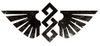

<!-- A0456-B0333 -->

原译文

Aark Selleck 阿克·塞勒克

**校订译文**

Aark Selleck 阿克·塞勒克

<!-- /A0456-B0333 -->

<!-- A0456-B0334 -->
### Chief Apothecary 首席药剂师

<!-- /A0456-B0334 -->

<!-- A0456-B0335 -->

原译文

Apothecaries 药剂师

**校订译文**

Apothecaries 药剂师

<!-- /A0456-B0335 -->

<!-- A0456-B0336 -->
### Fleet Command 舰队指挥

<!-- /A0456-B0336 -->

<!-- A0456-B0337 -->
### Vynda Aason 温达·亚松

<!-- /A0456-B0337 -->

<!-- A0456-B0338 -->
### Master of the Fleet 舰队大师

原题：Master of the Fleet 舰队之主

<!-- /A0456-B0338 -->

<!-- A0456-B0339 -->

原译文

Battle Barges 战斗驳船

**校订译文**

Battle Barges 战斗驳船

<!-- /A0456-B0339 -->

<!-- A0456-B0340 -->

原译文

Strike Cruisers 打击巡洋舰

**校订译文**

Strike Cruisers 打击巡洋舰

<!-- /A0456-B0340 -->

<!-- A0456-B0341 -->

原译文

Rapid Strike vessels 快速打击战舰

**校订译文**

Rapid Strike vessels 快速打击战舰

<!-- /A0456-B0341 -->

<!-- A0456-B0342 -->

原译文

Thunderhawk Gunships 雷鹰炮艇

**校订译文**

Thunderhawk Gunships 雷鹰炮艇

<!-- /A0456-B0342 -->

<!-- A0456-B0343 -->
### Companies 连队

<!-- /A0456-B0343 -->

<!-- A0456-B0344 -->
**英文原文**

Like all Codex chapters, the Raven Guard are divided into ten Companies. Each Company is led by a hero of the Raven Guard who bears the title Shadow Captain and who - in addition to his Company command - is in charge of a particular aspect of the Chapter's logistics. The current Company commanders are as follows:

<!-- /A0456-B0344 -->

<!-- A0456-B0345 -->

原译文

与所有圣典战团一样，暗鸦守卫分为十个连队。每个连队都由暗鸦守卫的英雄领导，他拥有暗影连长的头衔，除了他的连队指挥权外，他还负责该章后勤的特定方面。现任公司指挥官如下：

**校订译文**

与其他圣典战团一样，暗鸦守卫分为十个连。每连由一位获授“暗影连长”称号的战团英雄统领；除指挥本连外，他还分管战团后勤的某一领域。原文列出的各连指挥官如下。

<!-- /A0456-B0345 -->

<!-- A0456-B0346 -->
### Veteran Company 老兵连队

<!-- /A0456-B0346 -->

<!-- A0456-B0347 -->

原译文

1st Company 第一连队

**校订译文**

1st Company 第一连队

<!-- /A0456-B0347 -->

<!-- A0456-B0348 图片 -->
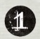

<!-- A0456-B0349 -->

原译文

"The Black Wings" “黑翼”

**校订译文**

"The Black Wings" “黑翼”

<!-- /A0456-B0349 -->

<!-- A0456-B0350 -->
### Shadow Captain 暗影连长

<!-- /A0456-B0350 -->

<!-- A0456-B0351 -->
### Lord of Deliverance 拯救星领主

<!-- /A0456-B0351 -->

<!-- A0456-B0352 -->

原译文

2 Lieutenants 两名副官

**校订译文**

2 Lieutenants 两名副官

<!-- /A0456-B0352 -->

<!-- A0456-B0353 -->

原译文

Company Command Squad 连队指挥组

**校订译文**

Company Command Squad 连队指挥小队

<!-- /A0456-B0353 -->

<!-- A0456-B0354 -->

原译文

Company Ancient 连队旗手

**校订译文**

Company Ancient 连队旗手

<!-- /A0456-B0354 -->

<!-- A0456-B0355 -->

原译文

Company Champion 连队冠军

**校订译文**

Company Champion 连队冠军

<!-- /A0456-B0355 -->

<!-- A0456-B0356 -->

原译文

Company Veterans 连队老兵

**校订译文**

Company Veterans 连队老兵

<!-- /A0456-B0356 -->

<!-- A0456-B0357 -->

原译文

10 Veteran Squads/Terminator Squads 十个老兵小队/终结者小队

**校订译文**

10 Veteran Squads/Terminator Squads 十个老兵小队/终结者小队

<!-- /A0456-B0357 -->

<!-- A0456-B0358 -->

原译文

Dreadnoughts 无畏机甲

**校订译文**

Dreadnoughts 无畏机甲

<!-- /A0456-B0358 -->

<!-- A0456-B0359 -->

原译文

Transports 运输载具

**校订译文**

Transports 运输载具

<!-- /A0456-B0359 -->

<!-- A0456-B0360 -->

原译文

Land Raiders 兰德掠袭者

**校订译文**

Land Raiders 兰德掠袭者战车

<!-- /A0456-B0360 -->

<!-- A0456-B0361 -->
### Battle Companies 战斗连队

<!-- /A0456-B0361 -->

<!-- A0456-B0362 -->

原译文

2nd Company 第二连队

**校订译文**

2nd Company 第二连队

<!-- /A0456-B0362 -->

<!-- A0456-B0363 图片 -->

<!-- A0456-B0364 -->

原译文

"The Shadowborn" “影裔”

**校订译文**

"The Shadowborn" “影裔”

<!-- /A0456-B0364 -->

<!-- A0456-B0365 -->
### Shadow Captain Aajz Solari 暗影连长阿基兹·索拉里

<!-- /A0456-B0365 -->

<!-- A0456-B0366 -->
### Master of Secrets 守密之主

<!-- /A0456-B0366 -->

<!-- A0456-B0367 -->

原译文

2 Lieutenants 两名副官

**校订译文**

2 Lieutenants 两名副官

<!-- /A0456-B0367 -->

<!-- A0456-B0368 -->

原译文

Company Command Squad 连队指挥组

**校订译文**

Company Command Squad 连队指挥小队

<!-- /A0456-B0368 -->

<!-- A0456-B0369 -->

原译文

Company Ancient 连队旗手

**校订译文**

Company Ancient 连队旗手

<!-- /A0456-B0369 -->

<!-- A0456-B0370 -->

原译文

Company Champion 连队冠军

**校订译文**

Company Champion 连队冠军

<!-- /A0456-B0370 -->

<!-- A0456-B0371 -->

原译文

Company Veterans 连队老兵

**校订译文**

Company Veterans 连队老兵

<!-- /A0456-B0371 -->

<!-- A0456-B0372 -->

原译文

6 Battleline Squads 六个战线小队

**校订译文**

6 Battleline Squads 六个战线小队

<!-- /A0456-B0372 -->

<!-- A0456-B0373 -->

原译文

2 Close Support Squads 两个近战支援小队

**校订译文**

2 Close Support Squads 两个近战支援小队

<!-- /A0456-B0373 -->

<!-- A0456-B0374 -->

原译文

2 Fire Support Squads 两个火力支援小队

**校订译文**

2 Fire Support Squads 两个火力支援小队

<!-- /A0456-B0374 -->

<!-- A0456-B0375 -->

原译文

Transport Vehicles 运输载具

**校订译文**

Transport Vehicles 运输载具

<!-- /A0456-B0375 -->

<!-- A0456-B0376 -->

原译文

Dreadnoughts 无畏机甲

**校订译文**

Dreadnoughts 无畏机甲

<!-- /A0456-B0376 -->

<!-- A0456-B0377 -->

原译文

3rd Company 第三连队

**校订译文**

3rd Company 第三连队

<!-- /A0456-B0377 -->

<!-- A0456-B0378 图片 -->
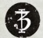

<!-- A0456-B0379 -->

原译文

"The Ghoststalkers" “幽灵追猎者”

**校订译文**

"The Ghoststalkers" “幽灵追猎者”

<!-- /A0456-B0379 -->

<!-- A0456-B0380 -->
### Shadow Captain Vordin Krayn 暗影连长沃丁·科莱恩

<!-- /A0456-B0380 -->

<!-- A0456-B0381 -->
### Master of the Ambush 伏击大师

<!-- /A0456-B0381 -->

<!-- A0456-B0382 -->

原译文

2 Lieutenants 两名副官

**校订译文**

2 Lieutenants 两名副官

<!-- /A0456-B0382 -->

<!-- A0456-B0383 -->

原译文

Company Command Squad 连队指挥组

**校订译文**

Company Command Squad 连队指挥小队

<!-- /A0456-B0383 -->

<!-- A0456-B0384 -->

原译文

Company Ancient 连队旗手

**校订译文**

Company Ancient 连队旗手

<!-- /A0456-B0384 -->

<!-- A0456-B0385 -->

原译文

Company Champion 连队冠军

**校订译文**

Company Champion 连队冠军

<!-- /A0456-B0385 -->

<!-- A0456-B0386 -->

原译文

Company Veterans 连队老兵

**校订译文**

Company Veterans 连队老兵

<!-- /A0456-B0386 -->

<!-- A0456-B0387 -->

原译文

6 Battleline Squads 六个战线小队

**校订译文**

6 Battleline Squads 六个战线小队

<!-- /A0456-B0387 -->

<!-- A0456-B0388 -->

原译文

2 Close Support Squads 两个近战支援小队

**校订译文**

2 Close Support Squads 两个近战支援小队

<!-- /A0456-B0388 -->

<!-- A0456-B0389 -->

原译文

2 Fire Support Squads 两个火力支援小队

**校订译文**

2 Fire Support Squads 两个火力支援小队

<!-- /A0456-B0389 -->

<!-- A0456-B0390 -->

原译文

Transport Vehicles 运输载具

**校订译文**

Transport Vehicles 运输载具

<!-- /A0456-B0390 -->

<!-- A0456-B0391 -->

原译文

Dreadnoughts 无畏机甲

**校订译文**

Dreadnoughts 无畏机甲

<!-- /A0456-B0391 -->

<!-- A0456-B0392 -->

原译文

4th Company 第四连队

**校订译文**

4th Company 第四连队

<!-- /A0456-B0392 -->

<!-- A0456-B0393 图片 -->
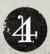

<!-- A0456-B0394 -->

原译文

"The Silent" “寂静”

**校订译文**

"The Silent" “寂静”

<!-- /A0456-B0394 -->

<!-- A0456-B0395 -->
### Shadow Captain Vynda Aason 暗影连长温达·亚松

<!-- /A0456-B0395 -->

<!-- A0456-B0396 -->
### Master of the Fleet 舰队大师

原题：Master of the Fleet 舰队之主

<!-- /A0456-B0396 -->

<!-- A0456-B0397 -->

原译文

2 Lieutenants 两名副官

**校订译文**

2 Lieutenants 两名副官

<!-- /A0456-B0397 -->

<!-- A0456-B0398 -->

原译文

Company Command Squad 连队指挥组

**校订译文**

Company Command Squad 连队指挥小队

<!-- /A0456-B0398 -->

<!-- A0456-B0399 -->

原译文

Company Ancient 连队旗手

**校订译文**

Company Ancient 连队旗手

<!-- /A0456-B0399 -->

<!-- A0456-B0400 -->

原译文

Company Champion 连队冠军

**校订译文**

Company Champion 连队冠军

<!-- /A0456-B0400 -->

<!-- A0456-B0401 -->

原译文

Company Veterans 连队老兵

**校订译文**

Company Veterans 连队老兵

<!-- /A0456-B0401 -->

<!-- A0456-B0402 -->

原译文

6 Battleline Squads 六个战线小队

**校订译文**

6 Battleline Squads 六个战线小队

<!-- /A0456-B0402 -->

<!-- A0456-B0403 -->

原译文

2 Close Support Squads 两个近战支援小队

**校订译文**

2 Close Support Squads 两个近战支援小队

<!-- /A0456-B0403 -->

<!-- A0456-B0404 -->

原译文

2 Fire Support Squads 两个火力支援小队

**校订译文**

2 Fire Support Squads 两个火力支援小队

<!-- /A0456-B0404 -->

<!-- A0456-B0405 -->

原译文

Transport Vehicles 运输载具

**校订译文**

Transport Vehicles 运输载具

<!-- /A0456-B0405 -->

<!-- A0456-B0406 -->

原译文

Dreadnoughts 无畏机甲

**校订译文**

Dreadnoughts 无畏机甲

<!-- /A0456-B0406 -->

<!-- A0456-B0407 -->

原译文

5th Company 第五连队

**校订译文**

5th Company 第五连队

<!-- /A0456-B0407 -->

<!-- A0456-B0408 图片 -->

<!-- A0456-B0409 -->

原译文

"The Watchful" “警戒”

**校订译文**

"The Watchful" “警戒”

<!-- /A0456-B0409 -->

<!-- A0456-B0410 -->
### Shadow Captain Aevar Qeld 暗影连长艾瓦尔·奎德

<!-- /A0456-B0410 -->

<!-- A0456-B0411 -->
### Master of Truth 真言之主

<!-- /A0456-B0411 -->

<!-- A0456-B0412 -->

原译文

2 Lieutenants 两名副官

**校订译文**

2 Lieutenants 两名副官

<!-- /A0456-B0412 -->

<!-- A0456-B0413 -->

原译文

Company Command Squad 连队指挥组

**校订译文**

Company Command Squad 连队指挥小队

<!-- /A0456-B0413 -->

<!-- A0456-B0414 -->

原译文

Company Ancient 连队旗手

**校订译文**

Company Ancient 连队旗手

<!-- /A0456-B0414 -->

<!-- A0456-B0415 -->

原译文

Company Champion 连队冠军

**校订译文**

Company Champion 连队冠军

<!-- /A0456-B0415 -->

<!-- A0456-B0416 -->

原译文

Company Veterans 连队老兵

**校订译文**

Company Veterans 连队老兵

<!-- /A0456-B0416 -->

<!-- A0456-B0417 -->

原译文

6 Battleline Squads 六个战线小队

**校订译文**

6 Battleline Squads 六个战线小队

<!-- /A0456-B0417 -->

<!-- A0456-B0418 -->

原译文

2 Close Support Squads 两个近战支援小队

**校订译文**

2 Close Support Squads 两个近战支援小队

<!-- /A0456-B0418 -->

<!-- A0456-B0419 -->

原译文

2 Fire Support Squads 两个火力支援小队

**校订译文**

2 Fire Support Squads 两个火力支援小队

<!-- /A0456-B0419 -->

<!-- A0456-B0420 -->

原译文

Transport Vehicles 运输载具

**校订译文**

Transport Vehicles 运输载具

<!-- /A0456-B0420 -->

<!-- A0456-B0421 -->

原译文

Dreadnoughts 无畏机甲

**校订译文**

Dreadnoughts 无畏机甲

<!-- /A0456-B0421 -->

<!-- A0456-B0422 -->
### Reserve Companies 预备连队

<!-- /A0456-B0422 -->

<!-- A0456-B0423 -->

原译文

6th Company 第六连队

**校订译文**

6th Company 第六连队

<!-- /A0456-B0423 -->

<!-- A0456-B0424 图片 -->

<!-- A0456-B0425 -->

原译文

"The Darkened Blades" “黑暗之刃”

**校订译文**

"The Darkened Blades" “黑暗之刃”

<!-- /A0456-B0425 -->

<!-- A0456-B0426 -->
### Shadow Captain Sard Gaeron 暗影连长萨德·加隆

<!-- /A0456-B0426 -->

<!-- A0456-B0427 -->
### Master of Liberation 解放之主

<!-- /A0456-B0427 -->

<!-- A0456-B0428 -->

原译文

2 Lieutenants 两名副官

**校订译文**

2 Lieutenants 两名副官

<!-- /A0456-B0428 -->

<!-- A0456-B0429 -->

原译文

Company Ancient 连队旗手

**校订译文**

Company Ancient 连队旗手

<!-- /A0456-B0429 -->

<!-- A0456-B0430 -->

原译文

Company Champion 连队冠军

**校订译文**

Company Champion 连队冠军

<!-- /A0456-B0430 -->

<!-- A0456-B0431 -->

原译文

Company Veterans 连队老兵

**校订译文**

Company Veterans 连队老兵

<!-- /A0456-B0431 -->

<!-- A0456-B0432 -->

原译文

10 Battleline Squads 十个战线小队

**校订译文**

10 Battleline Squads 十个战线小队

<!-- /A0456-B0432 -->

<!-- A0456-B0433 -->

原译文

Battle Tanks 战斗坦克

**校订译文**

Battle Tanks 战斗坦克

<!-- /A0456-B0433 -->

<!-- A0456-B0434 -->

原译文

Transport Vehicles 运输载具

**校订译文**

Transport Vehicles 运输载具

<!-- /A0456-B0434 -->

<!-- A0456-B0435 -->

原译文

Dreadnoughts 无畏机甲7th Company 第七连队

**校订译文**

Dreadnoughts 无畏机甲

7th Company 第七连队

<!-- /A0456-B0435 -->

<!-- A0456-B0436 图片 -->
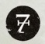

<!-- A0456-B0437 -->

原译文

"The Whisperclaws" “低语之爪”

**校订译文**

"The Whisperclaws" “低语之爪”

<!-- /A0456-B0437 -->

<!-- A0456-B0438 -->
### Shadow Captain Oras Brael 暗影连长奥拉斯·布雷尔

<!-- /A0456-B0438 -->

<!-- A0456-B0439 -->
### Master of Lies 谎言之主

<!-- /A0456-B0439 -->

<!-- A0456-B0440 -->

原译文

2 Lieutenants 两名副官

**校订译文**

2 Lieutenants 两名副官

<!-- /A0456-B0440 -->

<!-- A0456-B0441 -->

原译文

Company Command Squad 连队指挥组

**校订译文**

Company Command Squad 连队指挥小队

<!-- /A0456-B0441 -->

<!-- A0456-B0442 -->

原译文

Company Ancient 连队旗手

**校订译文**

Company Ancient 连队旗手

<!-- /A0456-B0442 -->

<!-- A0456-B0443 -->

原译文

Company Champion 连队冠军

**校订译文**

Company Champion 连队冠军

<!-- /A0456-B0443 -->

<!-- A0456-B0444 -->

原译文

Company Veterans 连队老兵

**校订译文**

Company Veterans 连队老兵

<!-- /A0456-B0444 -->

<!-- A0456-B0445 -->

原译文

10 Battleline Squads 十个战线小队

**校订译文**

10 Battleline Squads 十个战线小队

<!-- /A0456-B0445 -->

<!-- A0456-B0446 -->

原译文

Land Speeders 兰德速攻艇

**校订译文**

Land Speeders 兰德速攻艇

<!-- /A0456-B0446 -->

<!-- A0456-B0447 -->

原译文

Transport Vehicles 运输载具

**校订译文**

Transport Vehicles 运输载具

<!-- /A0456-B0447 -->

<!-- A0456-B0448 -->

原译文

Dreadnoughts 无畏机甲

**校订译文**

Dreadnoughts 无畏机甲

<!-- /A0456-B0448 -->

<!-- A0456-B0449 -->

原译文

8th Company 第八连队

**校订译文**

8th Company 第八连队

<!-- /A0456-B0449 -->

<!-- A0456-B0450 图片 -->

<!-- A0456-B0451 -->

原译文

"The Unseen" “无形”

**校订译文**

"The Unseen" “无形”

<!-- /A0456-B0451 -->

<!-- A0456-B0452 -->
### Shadow Captain Reszasz Krevaan 暗影连长雷斯扎·克雷万

<!-- /A0456-B0452 -->

<!-- A0456-B0453 -->
### Lord Executioner 处刑者领主

<!-- /A0456-B0453 -->

<!-- A0456-B0454 -->

原译文

2 Lieutenants 两名副官

**校订译文**

2 Lieutenants 两名副官

<!-- /A0456-B0454 -->

<!-- A0456-B0455 -->

原译文

Company Command Squad 连队指挥组

**校订译文**

Company Command Squad 连队指挥小队

<!-- /A0456-B0455 -->

<!-- A0456-B0456 -->

原译文

Company Ancient 连队旗手

**校订译文**

Company Ancient 连队旗手

<!-- /A0456-B0456 -->

<!-- A0456-B0457 -->

原译文

Company Champion 连队冠军

**校订译文**

Company Champion 连队冠军

<!-- /A0456-B0457 -->

<!-- A0456-B0458 -->

原译文

Company Veterans 连队老兵

**校订译文**

Company Veterans 连队老兵

<!-- /A0456-B0458 -->

<!-- A0456-B0459 -->

原译文

10 Close Support Squads 十个近战支援小队

**校订译文**

10 Close Support Squads 十个近战支援小队

<!-- /A0456-B0459 -->

<!-- A0456-B0460 -->

原译文

Bikes 摩托

**校订译文**

Bikes 摩托

<!-- /A0456-B0460 -->

<!-- A0456-B0461 -->

原译文

Dreadnoughts 无畏机甲

**校订译文**

Dreadnoughts 无畏机甲

<!-- /A0456-B0461 -->

<!-- A0456-B0462 -->

原译文

9th Company 第九连队

**校订译文**

9th Company 第九连队

<!-- /A0456-B0462 -->

<!-- A0456-B0463 图片 -->
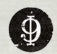

<!-- A0456-B0464 -->

原译文

"The Dirge Singers" “挽歌颂唱者”

**校订译文**

"The Dirge Singers" “挽歌颂唱者”

<!-- /A0456-B0464 -->

<!-- A0456-B0465 -->
### Shadow Captain Vos Delorn 暗影连长沃斯·德朗

<!-- /A0456-B0465 -->

<!-- A0456-B0466 -->
### Master of Relics 遗物大师

原题：Master of Relics 圣物之主

<!-- /A0456-B0466 -->

<!-- A0456-B0467 -->

原译文

2 Lieutenants 两名副官

**校订译文**

2 Lieutenants 两名副官

<!-- /A0456-B0467 -->

<!-- A0456-B0468 -->

原译文

Company Command Squad 连队指挥组

**校订译文**

Company Command Squad 连队指挥小队

<!-- /A0456-B0468 -->

<!-- A0456-B0469 -->

原译文

Company Ancient 连队旗手

**校订译文**

Company Ancient 连队旗手

<!-- /A0456-B0469 -->

<!-- A0456-B0470 -->

原译文

Company Champion 连队冠军

**校订译文**

Company Champion 连队冠军

<!-- /A0456-B0470 -->

<!-- A0456-B0471 -->

原译文

Company Veterans 连队老兵

**校订译文**

Company Veterans 连队老兵

<!-- /A0456-B0471 -->

<!-- A0456-B0472 -->

原译文

10 Fire Support Squads 十个火力支援小队

**校订译文**

10 Fire Support Squads 十个火力支援小队

<!-- /A0456-B0472 -->

<!-- A0456-B0473 -->

原译文

Dreadnoughts 无畏机甲

**校订译文**

Dreadnoughts 无畏机甲

<!-- /A0456-B0473 -->

<!-- A0456-B0474 -->
### Scout Company 侦察连队

<!-- /A0456-B0474 -->

<!-- A0456-B0475 -->

原译文

10th Company 第十连队

**校订译文**

10th Company 第十连队

<!-- /A0456-B0475 -->

<!-- A0456-B0476 图片 -->
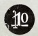

<!-- A0456-B0477 -->

原译文

"The Subtle" “狡猾”

**校订译文**

"The Subtle" “狡猾”

<!-- /A0456-B0477 -->

<!-- A0456-B0478 -->
### Shadow Captain Kalae Korvydae 暗影连长卡莱·卡尔维戴

<!-- /A0456-B0478 -->

<!-- A0456-B0479 -->
### Master of the Recruits 新兵大师

原题：Master of the Recruits 新兵之主

<!-- /A0456-B0479 -->

<!-- A0456-B0480 -->

原译文

2 Lieutenants 两名副官

**校订译文**

2 Lieutenants 两名副官

<!-- /A0456-B0480 -->

<!-- A0456-B0481 -->

原译文

Company Command Squad 连队指挥组

**校订译文**

Company Command Squad 连队指挥小队

<!-- /A0456-B0481 -->

<!-- A0456-B0482 -->

原译文

Company Ancient 连队旗手

**校订译文**

Company Ancient 连队旗手

<!-- /A0456-B0482 -->

<!-- A0456-B0483 -->

原译文

Company Champion 连队冠军

**校订译文**

Company Champion 连队冠军

<!-- /A0456-B0483 -->

<!-- A0456-B0484 -->

原译文

Company Veterans 连队老兵

**校订译文**

Company Veterans 连队老兵

<!-- /A0456-B0484 -->

<!-- A0456-B0485 -->

原译文

10 Vanguard Squads 十个先锋小队

**校订译文**

10 Vanguard Squads 十个先锋小队

<!-- /A0456-B0485 -->

<!-- A0456-B0486 -->

原译文

Scouts 侦察兵

**校订译文**

Scouts 侦察兵

<!-- /A0456-B0486 -->

<!-- A0456-B0487 -->

原译文

Scout Bike Squads 侦查摩托小队

**校订译文**

Scout Bike Squads 侦察摩托小队

<!-- /A0456-B0487 -->

<!-- A0456-B0488 -->

原译文

Land Speeders 兰德速攻艇

**校订译文**

Land Speeders 兰德速攻艇

<!-- /A0456-B0488 -->

<!-- A0456-B0489 -->

原译文

Transport Vehicles 运输载具

**校订译文**

Transport Vehicles 运输载具

<!-- /A0456-B0489 -->

<!-- A0456-B0490 -->
### Company Information 连队信息

<!-- /A0456-B0490 -->

<!-- A0456-B0491 -->
**英文原文**

The 1st Company, known as the Blackwings. the 1st Company are the mightiest warriors of the Raven Guard known for their mastery of assassination.

<!-- /A0456-B0491 -->

<!-- A0456-B0492 -->

原译文

第一连，被称为黑翼。第一连是暗鸦守卫中最强大的战士，以精通暗杀而闻名。

**校订译文**

第一连，被称为黑翼。第一连是暗鸦守卫中最强大的战士，以精通暗杀而闻名。

<!-- /A0456-B0492 -->

<!-- A0456-B0493 -->
**英文原文**

The 2nd Company, known as the Shadowborne. These are the Raven Guard's preeminent assassins.

<!-- /A0456-B0493 -->

<!-- A0456-B0494 -->

原译文

第二连，被称为承影。这些是暗鸦守卫最杰出的刺客。

**校订译文**

第二连，称为“影裔”，由战团最出色的刺客组成。

**校注：** 表格英文为 Shadowborn，正文为 Shadowborne；本篇同指第二连，统一中文影裔，英文异写不改。

<!-- /A0456-B0494 -->

<!-- A0456-B0495 -->
**英文原文**

The 3rd Company, known as the Ghoststalkers. Less subtle than most of their brethren, the 3rd uses sudden and overwhelming force to silence their foe, embracing ambush, the first aspect of Corax's Trifold Path of Shadows.

<!-- /A0456-B0495 -->

<!-- A0456-B0496 -->

原译文

第三连，被称为幽灵追猎者。与大多数兄弟相比，第三连不那么狡猾，他们使用突然和压倒性的力量来压制敌人，拥抱伏击，这是科拉克斯三重阴影之路的第一个方面。

**校订译文**

第三连，称为“幽灵追猎者”。他们不像多数同袍那样迂回隐秘，而是以突如其来的压倒性武力让敌人噤声，践行三重阴影之路的第一道：伏击。

<!-- /A0456-B0496 -->

<!-- A0456-B0497 -->
**英文原文**

The 4th Company, known as the Silent. The 4th strives for the second aspect of the Trifold Path of Shadow, stealth.

<!-- /A0456-B0497 -->

<!-- A0456-B0498 -->

原译文

第四连，被称为寂静。第四连追求三重阴影之路的第二个方面，隐形。

**校订译文**

第四连，称为“寂静”，专精三重阴影之路的第二道：潜行。

<!-- /A0456-B0498 -->

<!-- A0456-B0499 -->
**英文原文**

The 5th Company, known as the Watchful. The 5th utilizes the third and final path of shadow, vigilance.

<!-- /A0456-B0499 -->

<!-- A0456-B0500 -->

原译文

第五连，被称为警惕。第五连使用第三条也是最后一条阴影之路，警惕。

**校订译文**

第五连，称为“警戒”，践行三重阴影之路的第三道，也是最后一道：警戒。

<!-- /A0456-B0500 -->

<!-- A0456-B0501 -->
**英文原文**

The 6th Company, known as the Darkened Blades. Unlike the Reserve Companies in other Chapters, the 6th of the Raven Guard is not tasked with reinforcing Battle Companies on campaign. Instead it is tasked with a specific purpose: to infiltrate enslaved worlds and deliver them anew into the Imperial fold.

<!-- /A0456-B0501 -->

<!-- A0456-B0502 -->

原译文

第六连，被称为黑暗之刃。与其他战团中的预备连不同，暗鸦守卫第6连的任务不是在战役中增援作战连。相反，它的任务是有一个特定的目的：渗透被奴役的世界，并将它们重新交给帝国。

**校订译文**

第六连，称为“黑暗之刃”。他们与其他战团的预备连不同，并不以增援出征的战斗连为主要任务，而承担特定使命：潜入遭奴役的世界，使其重归帝国。

<!-- /A0456-B0502 -->

<!-- A0456-B0503 -->
**英文原文**

The 7th Company, known as the Whisperclaws. The 7th specializes in hit-and-run attacks, maintaining an agile and responsive war footing.

<!-- /A0456-B0503 -->

<!-- A0456-B0504 -->

原译文

第七连，被称为低语之爪。第七连专门从事跑打攻击，保持敏捷和反应灵敏的战备状态。

**校订译文**

第七连，称为“低语之爪”，专精打了就走的突袭，始终保持机动灵活、反应迅速的作战姿态。

<!-- /A0456-B0504 -->

<!-- A0456-B0505 -->
**英文原文**

The 8th Company, known as the Unseen. The 8th serves as the Raven Guard's Close Support Squad reserves but in keeping with the Chapter's tenets are often found fighting their own campaigns.

<!-- /A0456-B0505 -->

<!-- A0456-B0506 -->

原译文

第八连，被称为无形。第八连是暗鸦守卫的近战支援小队的预备连，但根据战团的宗旨，他们经常参加自己的战役。

**校订译文**

第八连，称为“无形”，承担近战支援小队的预备兵力职能；但遵循战团的行事原则，他们也经常独立发动战役。

<!-- /A0456-B0506 -->

<!-- A0456-B0507 -->
**英文原文**

The 9th Company, known as the Dirge Singers. The 9th act as the Raven Guard's Fire Support Squad reserves.

<!-- /A0456-B0507 -->

<!-- A0456-B0508 -->

原译文

第九连，被称为挽歌颂者。第九连担任暗鸦守卫火力支援小队预备连。

**校订译文**

第九连，称为“挽歌颂唱者”，承担战团火力支援小队的预备兵力职能。

<!-- /A0456-B0508 -->

<!-- A0456-B0509 -->
**英文原文**

The 10th Company, known as the Subtle. The 10th acts as the Raven Guard recruiting force and operates both Scout and Vanguard forces.

<!-- /A0456-B0509 -->

<!-- A0456-B0510 -->

原译文

第十连，被称为狡猾。第十连是暗鸦守卫的新兵部队，同时负责侦察兵和先锋部队的作战。

**校订译文**

第十连，称为“狡猾”，负责战团的新兵培养，并统辖侦察部队与先锋部队。

<!-- /A0456-B0510 -->

<!-- A0456-B0511 -->
## Recruitment 招募

<!-- /A0456-B0511 -->

<!-- A0456-B0512 -->
**英文原文**

Owing to the instability of the Raven Guard gene-seed and the experiments of Corax, much of the chapter's genetic stock has been irreparably damaged. Now, much of their genetic material comes from supplies held on Terra. This means the cycle of recruitment for the Raven Guard is much slower than other Chapters and fewer Raven Guard candidates for the Chapter prove able to survive their training and genetic modification. This means the chapter is constantly short-handed.

<!-- /A0456-B0512 -->

<!-- A0456-B0513 -->

原译文

由于暗鸦守卫基因种子的不稳定性和科拉克斯的实验，本章的大部分基因资源都受到了不可挽回的损害。现在，他们的大部分基因物质来自泰拉上的供应。这意味着暗鸦守卫的招募周期比其他战团慢得多，并且该战团的暗鸦守卫候选人中能够经受住训练和基因改造的人更少。这意味着这一战团总是人手不足。

**校订译文**

由于基因种子不稳定，加之科拉克斯实验的影响，战团的大量遗传材料储备已遭到无法修复的损伤，如今主要依赖泰拉供给。这使暗鸦守卫的招募周期远长于其他战团，候选者中能熬过训练与基因改造的人也更少，战团因而长期缺员。

**校注：** 本段将科拉克斯的实验明确列为损伤因素，上文基因种子段则称真正原因未明；原文确定性不同，分别保留。

<!-- /A0456-B0513 -->

<!-- A0456-B0514 -->
**英文原文**

The Raven Guard's homeworld Deliverance is said to lack the population resources available on other chapter's homeworlds. By the time of the Horus Heresy only a few thousand marines in the Raven Guard's number were recruited from Deliverance, the rest made up of the original Terran forces inducted before the Great Crusade.

<!-- /A0456-B0514 -->

<!-- A0456-B0515 -->

原译文

据说暗鸦守卫的家园世界拯救星缺乏其他战团家园世界可用的人口资源。到荷鲁斯叛乱时期，只有几千名暗鸦守卫星际战士从拯救星招募，其余的由大远征前加入的原初泰拉部队组成。

**校订译文**

据说，拯救星可供招募的人口少于其他战团母星。荷鲁斯之乱时，军团中只有几千名战士来自拯救星，其余仍是大远征开始前征入的泰拉籍原始部队。

**校注：** 原文将其余部队一概称为大远征前入伍的泰拉籍战士；与前文长期远征、泰拉部队遭放逐等叙述的数量关系不明，未擅改年代或比例。

<!-- /A0456-B0515 -->

<!-- A0456-B0516 -->
**英文原文**

Today, Aspirants are considered to be given a high honor of receiving the rare and unstable Gene-seed of the Chapter. They are thus subjected to harsh training in the force-domes of Deliverance and Kiavahr. They face lethal conditions with little food, water, or sleep, and are required to evade or kill monsters and Mutants and must learn patience, stealth, and the art of the hunt in order to survive. In the Trial of the Watcher, an Aspirant is required to navigate the ganglands of Kiavahr and undertake missions with only the most minimal of visual clues to guide them to their objective.

<!-- /A0456-B0516 -->

<!-- A0456-B0517 -->

原译文

今天，有志者被认为获得了战团罕见且不稳定的基因种子的高度荣誉。因此，他们在拯救星和基亚瓦尔的部队穹顶中接受了艰苦的训练。他们面临着几乎没有食物、水或睡眠的致命环境，需要躲避或杀死怪物和变种人，必须学会耐心、隐形和狩猎技艺才能生存。在《守望者的审判》中，一名有志者需要在基亚瓦尔的黑帮中穿行，并在只有最少量视觉线索的情况下执行任务，以引导他们实现目标。

**校订译文**

如今，获准接受战团稀少而不稳定的基因种子，被视为候选者的莫大荣誉。为此，他们必须在拯救星与基亚瓦尔的力场穹顶内接受严酷训练，在食物、饮水与睡眠都严重不足的致命环境中，躲避或猎杀怪物与变种人。唯有学会耐心、潜行与狩猎，才能生存。在“守望者试炼”中，候选者必须穿行于基亚瓦尔的帮派地盘，仅凭极少的视觉线索寻找目标并完成任务。

<!-- /A0456-B0517 -->

<!-- A0456-B0518 -->
**英文原文**

In the Trial of Justice, they are tested to see if they can uphold to the ideals of Corax. In this challenge, Aspirants are strapped to a chair in near total darkness and has their mind examined by Chapter Librarians as they are given questions by Chaplains on questions relating to loyalty, courage, freedom, and justice. They are often given hypothetical scenarios and complex moral dilemmas and forced to give solutions. There are no true right or wrong answers to these questions, though due to the presence of Librarians an Aspirant can not lie and give responses he knows will please his overseers. A mere attempt at dishonesty sees one killed on the spot or made into a Servitor.

<!-- /A0456-B0518 -->

<!-- A0456-B0519 -->

原译文

在正义试炼中，他们接受了考验，看看他们是否能够坚持科拉克斯的理想。在这个挑战中，有志者被绑在近乎完全黑暗的椅子上，当牧师就忠诚、勇气、自由和正义等问题向他们提问时，战团智库会检查他们的思想。他们经常被给予假设的情景和复杂的道德困境，并被迫给出解决方案。这些问题没有真正的对错答案，尽管由于智控的存在，有志者不能撒谎，也不能给出他知道会取悦监督者的答案。仅仅是一次不诚实的尝试，就会看到一个人当场被杀或被变成一个机仆。

**校订译文**

“正义试炼”检验候选者能否践行科拉克斯的理想。候选者被绑在一把椅子上，身处近乎全黑的环境，智库员审视其思想，教士则围绕忠诚、勇气、自由与正义发问。他们经常被置于假想情境和复杂道德困境中，必须提出解决办法。问题并无绝对正确或错误的答案，但在智库员监督下，候选者不能谎报想法、迎合考官。哪怕只是试图欺瞒，也会当场被杀，或被改造成机仆。

<!-- /A0456-B0519 -->

<!-- A0456-B0520 -->
**英文原文**

The Trial of the Wraith is a more physical challenge and forces Aspirants to be dropped alone into the Ologothien Wastes on Kiavahr. They must then traverse 199 miles of lethal territory in three days without sustenance and to be not spotted by a native predator. Thus aspirants are forced to utilize their stealth training to the utmost extreme.

<!-- /A0456-B0520 -->

<!-- A0456-B0521 -->

原译文

幽灵试炼是一个更具体力的挑战，迫使有志者独自被扔进基亚瓦尔的奥洛戈提恩荒原。然后，他们必须在三天内穿越199英里的致命区域，没有食物，也不会被本土捕食者发现。因此，有志者被迫将他们的隐形训练发挥到极致。

**校订译文**

“幽灵试炼”更着重体能。候选者被独自投放至基亚瓦尔的奥洛戈提恩荒原，必须在没有补给的情况下，于三天内穿越199英里的致命地带，且不能被当地捕食者发现。这迫使他们将潜行训练发挥到极限。

<!-- /A0456-B0521 -->

<!-- A0456-B0522 -->
**英文原文**

Those that complete their trials can expect long service in the 10th Company as Scouts, which the Raven Guard maintains a higher amount of compared to other Chapters. Upon proving themselves after years of service in the 10th Company, a full Battle-Brother can take on a new name, often that of a past Chapter champion or a Kiavahran word for beast, weapons, or folk hero.

<!-- /A0456-B0522 -->

<!-- A0456-B0523 -->

原译文

那些完成试炼的人可以期待在第十连队作为侦察兵长期服役，与其他战团相比，暗鸦守卫保持了更高的侦察兵数量。在第十连队服役多年后，一个完全的战斗兄弟可以取一个新名字，通常是过去的战团冠军的名字，或者基亚瓦尔语中野兽、武器或民间英雄的名字。

**校订译文**

完成试炼后，新兵还须在第十连长期担任侦察兵；暗鸦守卫的侦察兵数量本就多于其他战团。经过多年服役、证明自身能力并成为正式战斗兄弟后，他们可以选择一个新名字：通常取自昔日战团冠军，或基亚瓦尔语中某种野兽、武器及民间英雄的名称。

<!-- /A0456-B0523 -->

<!-- A0456-B0524 -->
## Equipment 装备

<!-- /A0456-B0524 -->

<!-- A0456-B0525 -->
## Stealth Modifications 隐形改装

<!-- /A0456-B0525 -->

<!-- A0456-B0526 -->
**英文原文**

The Chapter makes wide use of the "beaked" and older marks of Power Armour (Mk. IV-VI). After their near-destruction at Isstvan V, the Raven Guard techmarines created ad hoc suits using salvaged parts and components from other suits or vehicles. When the battle barge Avenger returned to Deliverance, the Raven Guard received a shipment of 2 000 suits of Mark VI Power Armour. At that time, the Mk. VI, designed as the "Corvus suit", was the newest and most advanced version. Because this mark of Power Armour carries the name of the primarch Corax it is natural that the Raven Guard feel a bond to this mark of armour.

<!-- /A0456-B0526 -->

<!-- A0456-B0527 -->

原译文

战团广泛使用了“喙”和较旧的动力盔甲型号（Mk.IV-VI）。在伊斯塔万五号几乎被摧毁后，暗鸦守卫技术军事使用从其他套装或车辆中回收的零部件制作了临时套装。当战斗驳船复仇者号返回救援时，暗鸦守卫收到了2000套Mark VI动力盔甲。当时，被设计为“渡鸦套装”的Mk.VI是最新、最先进的版本。因为这个动力盔甲型号上有原体科拉克斯的名字，所以暗鸦守卫自然会对这个盔甲型号产生感情。

**校订译文**

战团广泛使用带有“鸟喙”头盔的动力甲，以及第四至第六型等较早型号。伊斯塔万五号惨败后，科技战士用从其他护甲或载具中抢救出的零部件，临时拼装修复装备。战斗驳船复仇者号返回拯救星后，军团收到两千套第六型动力甲。彼时，这种称为“渡鸦型”（Corvus）的护甲是最新、最先进的型号。其名称与原体科拉克斯的名字相呼应，暗鸦守卫自然对此情有独钟。

<!-- /A0456-B0527 -->

<!-- A0456-B0528 -->
**英文原文**

With the initiation of Primaris Marines and the Mark X armour, Raven Guard marines frequently make use of the Phobos variant, due to its lighter weight.

<!-- /A0456-B0528 -->

<!-- A0456-B0529 -->

原译文

随着原铸星际战士和Mark X盔甲的开始，暗鸦守卫战士经常使用福波斯变体，因为它的重量更轻。

**校订译文**

原铸星际战士与第十型动力甲引入后，暗鸦守卫经常选用重量较轻的恐惧型护甲。

<!-- /A0456-B0529 -->

<!-- A0456-B0530 图片 -->
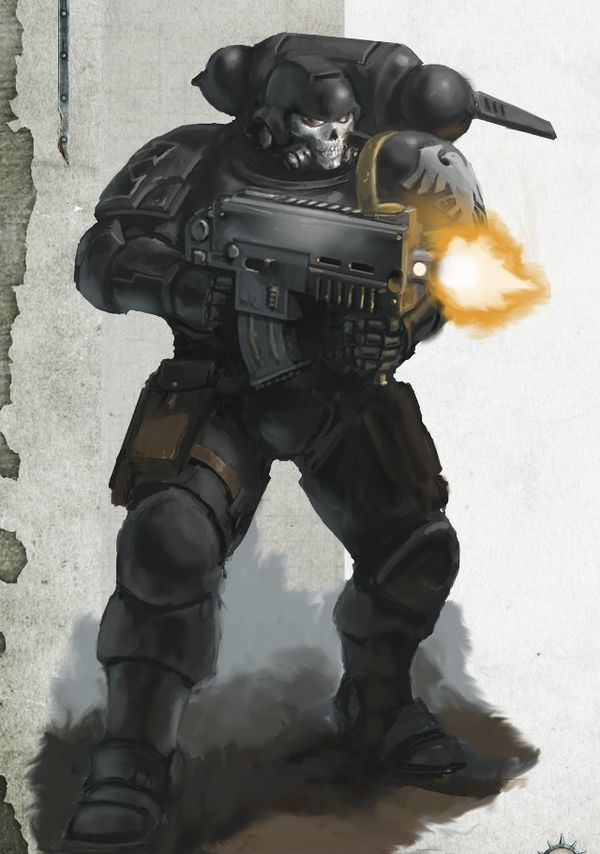

<!-- A0456-B0531 -->

原译文

Raven Guard Reiver 暗鸦守卫掠夺者

**校订译文**

Raven Guard Reiver 暗鸦守卫掠夺者

<!-- /A0456-B0531 -->

<!-- A0456-B0532 -->
**英文原文**

Raven Guard power armour utilises enhanced cooling systems that which helps it to blend in better with the background. This means Raven Guard Marines are harder to detect by thermal or infrared devices.

<!-- /A0456-B0532 -->

<!-- A0456-B0533 -->

原译文

暗鸦守卫动力盔甲采用增强的冷却系统，有助于更好地融入背景。这意味着暗鸦守卫战士更难被热射或红外设备探测到。

**校订译文**

暗鸦守卫的动力甲配有强化冷却系统，使自身热信号更好地融入环境背景，降低被热成像或红外设备发现的可能。

<!-- /A0456-B0533 -->

<!-- A0456-B0534 -->
### Vehicles 载具

<!-- /A0456-B0534 -->

<!-- A0456-B0535 -->
**英文原文**

The Raven Guard makes use of an array of unique vehicles tailored to the Chapter's specialization in stealth assault. These include the Whispercutter.

<!-- /A0456-B0535 -->

<!-- A0456-B0536 -->

原译文

暗鸦守卫使用了一系列独特的载具，这些载具是为战团在隐形突击方面的专业化量身定制的。其中包括低语切割者。

**校订译文**

暗鸦守卫使用多种为潜行突击量身定制的专属载具，其中包括低语切割者。

<!-- /A0456-B0536 -->

<!-- A0456-B0537 -->
### Fleet 舰队

<!-- /A0456-B0537 -->

<!-- A0456-B0538 -->
**英文原文**

During the Horus Heresy, the Raven Guard's fleet was equipped with special stealth technology: a ship's void shields could be modified so that they provided only minimal protection, but at the benefit of making the vessel nearly undetectable either visually or by sensors. It took only a few minutes for this adjustment to be made. The Raven Guard also operates a stealthy variant of the Thunderhawk, the Shadowhawk.

<!-- /A0456-B0538 -->

<!-- A0456-B0539 -->

原译文

在荷鲁斯叛乱期间，暗鸦守卫的舰队配备了特殊的隐形技术：可以修改船只的虚空盾，使其仅提供最低限度的保护，但有利于使船只几乎无法被视觉或传感器探测到。只花几分钟就能完成这一调整。暗鸦守卫还使用着雷鹰的隐形变种—影鹰。

**校订译文**

荷鲁斯之乱时期，暗鸦守卫舰队配备特殊隐形技术：调整虚空盾，使其仅保留最低限度的防护，换取战舰在目视与传感器下几乎不可察觉的效果。这种调整只需几分钟。他们还使用雷鹰的隐形改型“暗影鹰”。

<!-- /A0456-B0539 -->

<!-- A0456-B0540 -->
## Noted Elements of the Raven Guard 著名暗鸦守卫成员

<!-- /A0456-B0540 -->

<!-- A0456-B0541 -->
### Relics 圣物

<!-- /A0456-B0541 -->

<!-- A0456-B0542 -->

原译文

Raven's Talons 渡鸦之爪

**校订译文**

Raven's Talons 渡鸦之爪

<!-- /A0456-B0542 -->

<!-- A0456-B0543 -->
### Notable Vessels 著名战舰

<!-- /A0456-B0543 -->

<!-- A0456-B0544 -->
**英文原文**

Shadow of the Emperor — Battle Barge and flagship of the Raven Guard Legion fleet. Destroyed by the Terminus Est during the Dropsite Massacre.

<!-- /A0456-B0544 -->

<!-- A0456-B0545 -->

原译文

帝皇之影号 — 暗鸦守卫舰队的战斗驳船和旗舰。在登陆点大屠杀期间被终焉号摧毁。

**校订译文**

帝皇之影号 — 暗鸦守卫舰队的战斗驳船和旗舰。在登陆点大屠杀期间被终焉号摧毁。

<!-- /A0456-B0545 -->

<!-- A0456-B0546 -->
**英文原文**

Sins of the Lost — Strike Cruiser of 6th Company.

<!-- /A0456-B0546 -->

<!-- A0456-B0547 -->

原译文

迷失之罪号 — 第六连队的打击巡洋舰

**校订译文**

迷失之罪号 — 第六连队的打击巡洋舰

<!-- /A0456-B0547 -->

<!-- A0456-B0548 -->
**英文原文**

Wings of Deliverance — Battle Barge.

<!-- /A0456-B0548 -->

<!-- A0456-B0549 -->

原译文

拯救之翼号 — 战斗驳船

**校订译文**

拯救之翼号 — 战斗驳船

<!-- /A0456-B0549 -->

<!-- A0456-B0550 -->
**英文原文**

Stormshadow — Strike Cruiser.

<!-- /A0456-B0550 -->

<!-- A0456-B0551 -->

原译文

风暴暗影号 — 打击巡洋舰

**校订译文**

风暴暗影号 — 打击巡洋舰

<!-- /A0456-B0551 -->

<!-- A0456-B0552 -->
### Known Named Vehicles 著名载具

<!-- /A0456-B0552 -->

<!-- A0456-B0553 -->
**英文原文**

Sable Talon — Thunderhawk.

<!-- /A0456-B0553 -->

<!-- A0456-B0554 -->

原译文

黑爪 — 雷鹰

**校订译文**

黑爪 — 雷鹰

<!-- /A0456-B0554 -->

<!-- A0456-B0555 -->
**英文原文**

Silent Slayer – Stormtalon Gunship

<!-- /A0456-B0555 -->

<!-- A0456-B0556 -->

原译文

寂静杀手 - 风暴爪炮艇

**校订译文**

寂静杀手 - 风暴爪炮艇

<!-- /A0456-B0556 -->

<!-- A0456-B0557 -->
**英文原文**

Umbra Scion — Thunderhawk Transporter

<!-- /A0456-B0557 -->

<!-- A0456-B0558 -->

原译文

影裔 — 雷鹰运输机

**校订译文**

影裔 — 雷鹰运输机

<!-- /A0456-B0558 -->

<!-- A0456-B0559 -->
**英文原文**

Unmerciful Disaster — Heresy-era Kratos Heavy Assault Tank

<!-- /A0456-B0559 -->

<!-- A0456-B0560 -->

原译文

无情灾祸 — 叛乱前奎托斯重型突击坦克

**校订译文**

无情灾祸号——叛乱时期的奎托斯重型突击坦克。

<!-- /A0456-B0560 -->

<!-- A0456-B0561 -->
### Notable Members 著名成员

<!-- /A0456-B0561 -->

<!-- A0456-B0562 -->
### Heresy Era 叛乱时期

原题：Heresy Era 叛乱前

<!-- /A0456-B0562 -->

<!-- A0456-B0563 -->
**英文原文**

Corvus Corax — Primarch of the Raven Guard

<!-- /A0456-B0563 -->

<!-- A0456-B0564 -->

原译文

科沃斯·科拉克斯 — 暗鸦守卫原体

**校订译文**

科沃斯·科拉克斯 — 暗鸦守卫原体

<!-- /A0456-B0564 -->

<!-- A0456-B0565 -->
**英文原文**

Branne Nev — Commander of the Raptors

<!-- /A0456-B0565 -->

<!-- A0456-B0566 -->

原译文

布兰·涅夫 — 猛禽的指挥官

**校订译文**

布兰·涅夫 — 猛禽的指挥官

<!-- /A0456-B0566 -->

<!-- A0456-B0567 -->
**英文原文**

Agapito Nev — Commander of the Talons

<!-- /A0456-B0567 -->

<!-- A0456-B0568 -->

原译文

阿加皮托·涅夫 — 鹰爪的指挥官

**校订译文**

阿加皮托·涅夫 — 鹰爪的指挥官

<!-- /A0456-B0568 -->

<!-- A0456-B0569 -->
**英文原文**

Solaro An — Commander of the Hawks

<!-- /A0456-B0569 -->

<!-- A0456-B0570 -->

原译文

索拉罗·安 — 雄鹰的指挥官

**校订译文**

索拉罗·安 — 雄鹰的指挥官

<!-- /A0456-B0570 -->

<!-- A0456-B0571 -->
**英文原文**

Soukhounou — Commander of the Hawks after the death of Solaro An and later Nuran Tesk

<!-- /A0456-B0571 -->

<!-- A0456-B0572 -->

原译文

苏库胡努 — 索拉罗·安和后来的努兰·泰斯克死亡后的雄鹰的指挥官

**校订译文**

苏库胡努——在索拉罗·安、继任者努兰·泰斯克相继阵亡后，接任雄鹰指挥官。

<!-- /A0456-B0572 -->

<!-- A0456-B0573 -->
**英文原文**

Vincente Sixx — Chief Apothecary of the Raven Guard

<!-- /A0456-B0573 -->

<!-- A0456-B0574 -->

原译文

文森特·西克斯 — 暗鸦守卫首席药剂师

**校订译文**

文森特·西克斯 — 暗鸦守卫首席药剂师

<!-- /A0456-B0574 -->

<!-- A0456-B0575 -->
**英文原文**

Gherith Arendi — Commander of the Shadow Wardens

<!-- /A0456-B0575 -->

<!-- A0456-B0576 -->

原译文

格瑞斯·阿伦迪 — 暗影监察者指挥官

**校订译文**

格里思·阿伦迪——暗影守望指挥官。

<!-- /A0456-B0576 -->

<!-- A0456-B0577 -->
**英文原文**

Nykona Sharrowkyn — Battle Brother of the Raven Guard.

<!-- /A0456-B0577 -->

<!-- A0456-B0578 -->

原译文

尼康纳·沙罗金 — 暗鸦守卫战斗兄弟

**校订译文**

尼科纳·沙罗金——暗鸦守卫战斗兄弟。

<!-- /A0456-B0578 -->

<!-- A0456-B0579 -->
**英文原文**

Navar Hef — Sergeant of the Raptors

<!-- /A0456-B0579 -->

<!-- A0456-B0580 -->

原译文

纳瓦尔·赫夫 — 猛禽军士

**校订译文**

纳瓦尔·赫夫 — 猛禽军士

<!-- /A0456-B0580 -->

<!-- A0456-B0581 -->
**英文原文**

Arkhas Fal — Commander of the Legion before the discovery of Corax

<!-- /A0456-B0581 -->

<!-- A0456-B0582 -->

原译文

阿尔卡斯·法尔 — 发现科拉克斯之前的军团指挥官

**校订译文**

阿尔卡斯·法尔——科拉克斯被寻回前的军团指挥官。

<!-- /A0456-B0582 -->

<!-- A0456-B0583 -->
**英文原文**

Dravian Klayde — Member of the Knights-Errant

<!-- /A0456-B0583 -->

<!-- A0456-B0584 -->

原译文

德拉维安·克莱德 — 游侠骑士的成员

**校订译文**

德拉维安·克莱德 — 游侠骑士的成员

<!-- /A0456-B0584 -->

<!-- A0456-B0585 -->
**英文原文**

Balsar Kurthuri — Librarian

<!-- /A0456-B0585 -->

<!-- A0456-B0586 -->

原译文

巴尔萨·库图里 — 智库

**校订译文**

巴尔萨·库图里——智库员。

<!-- /A0456-B0586 -->

<!-- A0456-B0587 -->
**英文原文**

Kaedes Nex — Moritat-Prime of the Raven Guard Legion's 14th Interdiction Company

<!-- /A0456-B0587 -->

<!-- A0456-B0588 -->

原译文

凯德斯·奈克斯 — 暗鸦守卫第14封锁连队的暗杀精英首席

**校订译文**

凯德斯·奈克斯 — 暗鸦守卫第14封锁连队的暗杀精英首席

<!-- /A0456-B0588 -->

<!-- A0456-B0589 -->
### Post-Heresy 叛乱后

<!-- /A0456-B0589 -->

<!-- A0456-B0590 -->
**英文原文**

Aajz Solari — Captain of the 2nd Company.

<!-- /A0456-B0590 -->

<!-- A0456-B0591 -->

原译文

阿基兹·索拉里 — 第二连队连长

**校订译文**

阿基兹·索拉里 — 第二连队连长

<!-- /A0456-B0591 -->

<!-- A0456-B0592 -->
**英文原文**

Aethon Shaan- Current Master of Shadows

<!-- /A0456-B0592 -->

<!-- A0456-B0593 -->

原译文

艾森·沙恩 - 现任战团长

**校订译文**

艾索·沙恩——原文记载时的现任暗影之主。

<!-- /A0456-B0593 -->

<!-- A0456-B0594 -->
**英文原文**

Ardaric Vaanes- Former Brother-Captain of the 4th Company now a member of an Iron Warriors Grand Company

<!-- /A0456-B0594 -->

<!-- A0456-B0595 -->

原译文

阿达瑞克·瓦纳斯 - 前第四连队连长，现为钢铁勇士大连成员

**校订译文**

阿达里克·瓦内斯——前第四连连长，后加入钢铁勇士的一个大连。

**校注：** 本段英文 Ardaric、前文 Adaric 存在拼写差异，语境同指变节的第四连军官，统一中文阿达里克·瓦内斯；英文保留。

<!-- /A0456-B0595 -->

<!-- A0456-B0596 -->
**英文原文**

Kayvaan Shrike — Former Chapter Master, previously Shadow Captain of the Raven Guard 3rd Company

<!-- /A0456-B0596 -->

<!-- A0456-B0597 -->

原译文

凯万·史瑞克 — 前战团长，现暗鸦守卫第三连队暗影连长

**校订译文**

凯万·史瑞克——前任战团长，在此之前曾任暗鸦守卫第三连暗影连长。

**校注：** previously 意为更早之前，原译“现第三连连长”错误；英文未声称他卸任战团长后回任连长。

<!-- /A0456-B0597 -->

<!-- A0456-B0598 -->
**英文原文**

Korvydae — Captain of the 10th Company - Master of Recruits

<!-- /A0456-B0598 -->

<!-- A0456-B0599 -->

原译文

卡尔维戴 — 第十连队连长，新兵之主

**校订译文**

卡尔维戴 — 第十连队连长，新兵大师

<!-- /A0456-B0599 -->

<!-- A0456-B0600 -->
**英文原文**

Kyrin Solaq — Captain of the 5th Company

<!-- /A0456-B0600 -->

<!-- A0456-B0601 -->

原译文

基林·索拉克 — 第五连队连长

**校订译文**

基林·索拉克 — 第五连队连长

<!-- /A0456-B0601 -->

<!-- A0456-B0602 -->
### Unique Troops & Vehicles 独特部队&载具

<!-- /A0456-B0602 -->

<!-- A0456-B0603 -->

原译文

Raptor (Heresy-era) 猛禽（叛乱前）

**校订译文**

Raptor (Heresy-era) 猛禽（叛乱时期）

<!-- /A0456-B0603 -->

<!-- A0456-B0604 -->

原译文

Shadow Wardens (Heresy-era) 暗影监察者（叛乱前）

**校订译文**

Shadow Wardens (Heresy-era) 暗影守望（叛乱时期）

<!-- /A0456-B0604 -->

<!-- A0456-B0605 -->

原译文

Mor Deythan 摩尔戴斯

**校订译文**

Mor Deythan 摩尔戴斯

<!-- /A0456-B0605 -->

<!-- A0456-B0606 -->

原译文

Dark Fury (Heresy-era) 黑暗狂怒（叛乱前）

**校订译文**

Dark Fury (Heresy-era) 黑暗狂怒（叛乱时期）

<!-- /A0456-B0606 -->

<!-- A0456-B0607 -->

原译文

Whispercutter (Heresy-era) 低语切割者（叛乱前）

**校订译文**

Whispercutter (Heresy-era) 低语切割者（叛乱时期）

<!-- /A0456-B0607 -->

<!-- A0456-B0608 -->

原译文

Darkwing (Heresy-era) 暗翼（叛乱前）

**校订译文**

Darkwing (Heresy-era) 暗翼（叛乱时期）

<!-- /A0456-B0608 -->

<!-- A0456-B0609 -->

原译文

Deliverers (Heresy-era) 拯救者（叛乱前）

**校订译文**

Deliverers (Heresy-era) 拯救者（叛乱时期）

<!-- /A0456-B0609 -->

<!-- A0456-B0610 -->

原译文

Shadow Bird (Heresy-era) 暗影鸟（叛乱前）

**校订译文**

Shadow Bird (Heresy-era) 暗影鸟（叛乱时期）

<!-- /A0456-B0610 -->

<!-- A0456-B0611 -->

原译文

Symphalia Class Warp Runner 辛法利亚级亚空间跑者

**校订译文**

Symphalia Class Warp Runner 辛法利亚级亚空间跑者

<!-- /A0456-B0611 -->

<!-- A0456-B0612 -->
## Trivia 琐事

<!-- /A0456-B0612 -->

<!-- A0456-B0613 -->
**英文原文**

While stated in the background that all Raven Guard have black hair, there is at least one instance where Games Workshop showed a miniature with a different hair colour (accessed 2011/09/08). If this is a mistake or deliberate is unknown.

<!-- /A0456-B0613 -->

<!-- A0456-B0614 -->

原译文

虽然背景中提到所有暗鸦守卫都有黑色头发，但至少有一个例子是GW展示了一个头发颜色不同的模型（2011/09/08访问）。这是一个错误还是故意的尚不清楚。

**校订译文**

背景设定称暗鸦守卫全员拥有黑发，但Games Workshop至少曾展示过一个发色不同的模型，原文记录的访问日期为2011年9月8日。这是疏漏还是有意设计，尚不清楚。

<!-- /A0456-B0614 -->

本篇核心术语与暂定项

以下列出本篇出现的英文原形及核心术语表用词。同形词可能指不同对象，具体词义以本篇正文和校注为准；单复数、别名和仅见于图注的名称可能尚未列入。完整候选见[术语表](../../术语表/双语术语候选.csv)。

| 英文 | 采用中文 | 状态 |
| --- | --- | --- |
| Space Marines | 星际战士 | 官方已核对 |
| Blood Angels | 圣血天使 | 官方已核对 |
| Dark Angels | 黑暗天使 | 官方已核对 |
| Space Wolves | 太空野狼 | 官方已核对 |
| Adeptus Custodes | 帝皇禁军 | 官方已核对 |
| Adeptus Mechanicus | 机械修会 | 官方已核对 |
| Imperial Army | 帝国军 | 暂定·官方待核 |
| Death Guard | 死亡守卫 | 官方已核对 |
| World Eaters | 吞世者 | 官方已核对 |
| Eldar | 灵族 | 暂定·语境区分 |
| Dark Eldar | 黑暗灵族 | 暂定·旧称对应 |
| Orks | 欧克蛮人 | 官方已核对 |
| Librarian | 智库员 | 官方已核对 |
| Roboute Guilliman | 罗保特·基里曼 | 官方已核对 |
| Ultramar | 奥特拉玛 | 官方已核对 |
| Ultramarines | 极限战士 | 官方已核对 |
| Horus Heresy | 荷鲁斯之乱 | 官方已核对 |
| Warp | 亚空间 | 官方已核对 |
| Imperium of Man | 人类帝国 | 官方已核对 |
| Imperium | 帝国 | 暂定·简称 |
| Servitor | 机仆 | 暂定 |
| Waaagh! | Waaagh! | 暂定·保留原文 |
| History | 历史 | 编辑用语已统一 |
| Equipment | 装备 | 编辑用语已统一 |
| Conflicting sources | 来源冲突 | 编辑用语已统一 |
| Imperial Fists | 帝国之拳 | 暂定 |
| Emperor | 帝皇 | 官方已核对 |
| Primarch | 原体 | 官方已核对 |
| Slavery | 奴隶制 | 编辑用语已统一 |
| Battle Barge | 战斗驳船 | 暂定·官方待核 |
| Hive World | 巢都世界 | 暂定·官方待核 |
| Forge World | 铸造世界 | 暂定·官方待核 |
| Word Bearers | 怀言者 | 暂定·官方待核 |
| Daemon Prince | 恶魔亲王 | 官方已核对 |
| Iron Warriors | 钢铁勇士 | 暂定·官方待核 |
| Night Lords | 午夜领主 | 暂定·官方待核 |
| Exodite | 蛮荒灵族 | 暂定·官方待核 |
| Great Crusade | 大远征 | 暂定·官方待核 |
| Mortarion | 莫塔里安 | 官方已核对 |
| Barbarus | 巴巴鲁斯 | 暂定·官方待核 |
| Compliance | 归顺；纳入帝国统治 | 暂定·官方待核 |
| Terra | 泰拉 | 暂定·官方待核 |
| Murder | 谋杀 | 暂定·官方待核 |
| Luna Wolves | 影月苍狼 | 暂定·官方待核 |
| Horus | 荷鲁斯 | 暂定·官方待核 |
| Sons of Horus | 荷鲁斯之子 | 暂定·官方待核 |
| Lion El'Jonson | 莱昂·艾尔’庄森 | 官方已核对 |
| Iron Hands | 钢铁之手 | 暂定·官方待核 |
| Fulgrim | 福格瑞姆 | 官方已核对 |
| Mor Deythan | 摩尔戴斯 | 暂定·官方待核 |
| Skitarii | 护教军 | 暂定·官方待核 |
| Imperial Regent | 帝国摄政 | 暂定·官方待核 |
| Dark Imperium | 黑暗帝国 | 暂定·官方待核 |
| Unification Wars | 统一战争 | 暂定·官方待核 |
| Sector | 星区 | 暂定·官方待核 |
| Salamanders | 火蜥蜴 | 暂定·官方待核 |
| Konrad Curze | 康拉德·科兹 | 暂定·官方待核 |
| Mars | 火星 | 暂定·官方待核 |
| Jupiter | 木星 | 暂定·官方待核 |
| Kiavahr | 基亚瓦尔 | 暂定·官方待核 |
| Prefectia | 总督星 | 暂定·官方待核 |
| Luna | 月球 | 暂定·官方待核 |
| Phobos | 火卫一 | 暂定·官方待核 |
| Voltoris | 沃尔托利斯 | 暂定·官方待核 |
| Deliverance | 拯救星 | 暂定·官方待核 |
| Titan | 泰坦 | 暂定·官方待核 |
| Land Raider | 兰德掠袭者战车 | 官方已核对 |
| Tech | 技术语 | 暂定·官方待核 |
| Master | 导师（审判庭职衔）／舰务官（舰员职务） | 语境定译·官方待核 |
| Reclusiarch | 隐修长 | 暂定·官方待核 |
| Minotaurs | 米诺陶 | 暂定·官方待核 |
| Chief Apothecary | 首席药剂师 | 暂定·官方待核 |
| Chapter Champion | 战团冠军 | 暂定·官方待核 |
| Apothecary | 药剂师 | 官方已核对 |
| Ancient | 旗手 | 官方已核对 |
| Aethon Shaan | 艾索·沙恩 | 官方已核对 |
| Adept | 帝国任职者（广义）／文吏（行政语境） | 语境定译·官方待核 |
| Aspirant | 候补骑士 | 暂定·官方待核 |
| White Scars | 白疤 | 官方已核 |
| Alpha Legion | 阿尔法军团 | 暂定·官方待核 |
| Raven Guard | 暗鸦守卫 | 官方已核 |
| Second Founding | 二次建军 | 暂定·官方待核 |
| The Primarchs | 原体 | 暂定·官方待核 |
| Scars | 伤疤 | 暂定·官方待核 |
| Agapito Nev | 阿加皮托·涅夫 | 暂定·官方待核 |
| Branne Nev | 布兰尼·涅夫 | 暂定·官方待核 |
| Navar Hef | 纳瓦尔·赫夫 | 暂定·官方待核 |
| Gherith Arendi | 格里思·阿伦迪 | 暂定·官方待核 |
| Soukhounou | 索胡努 | 暂定·官方待核 |
| Balsar Kurthuri | 巴尔萨·库尔图里 | 暂定·官方待核 |
| Vincente Sixx | 文森特·西克斯 | 暂定·官方待核 |
| Nykona Sharrowkyn | 尼科纳·沙罗金 | 暂定·官方待核 |
| Kaedes Nex | 凯德斯·奈克斯 | 暂定·官方待核 |
| Ashen Claws | 灰烬之爪 | 暂定·官方待核 |
| Death Eagles | 死亡天鹰 | 暂定·官方待核 |
| Knights-Errant | 游侠骑士 | 暂定·官方待核 |
| Founding | 建军 | 暂定·官方待核 |
| Sol | 太阳系 | 暂定·官方待核 |
| Isstvan | 伊斯塔万 | 暂定·官方待核 |
| Dravian Klayde | 德拉维安·克莱德 | 暂定·官方待核 |
| Arkhas Fal | 阿尔卡斯·法尔 | 暂定·官方待核 |
| Solaro An | 索罗拉·安 | 暂定·官方待核 |
| Champion | 冠军 | 暂定·官方待核 |
| Moritat | 暗杀精英 | 暂定·官方待核 |
| Power Armour | 动力盔甲 | 暂定·官方待核 |
| Space Marine | 星际战士 | 暂定·官方待核 |
| Chapter | 战团 | 暂定·官方待核 |
| Fortress-monastery | 要塞修道院 | 暂定·官方待核 |
| Chapter Master | 战团长 | 暂定·官方待核 |
| Captain | 连长 | 暂定·官方待核 |
| Veteran | 老兵 | 暂定·官方待核 |
| Sergeant | 军士 | 暂定·官方待核 |
| Brother | 修士 | 暂定·官方待核 |
| Scout | 侦察兵 | 暂定·官方待核 |
| Vanguard | 先锋 | 暂定·官方待核 |
| Master of Recruits | 新兵大师 | 暂定·官方待核 |
| Battle-Brother | 战斗兄弟 | 暂定·官方待核 |
| Vanguard Space Marine | 先锋星际战士 | 暂定·官方待核 |
| Kayvaan Shrike | 凯万·史瑞克 | 官方已核 |
| Codex Astartes | 阿斯塔特圣典 | 暂定·官方待核 |
| Black Guard | 黑色守卫 | 暂定·官方待核 |
| Raptors | 猛禽 | 暂定·官方待核 |
| Revilers | 谩骂者 | 暂定·官方待核 |
| Mortifactors | 苦行者 | 暂定·官方待核 |
| Death Spectres | 死亡幽灵 | 暂定·官方待核 |
| Iron Ravens | 钢铁渡鸦 | 暂定·官方待核 |
| Necropolis Hawks | 墓地雄鹰 | 暂定·官方待核 |
| Rift Stalkers | 裂隙追猎者 | 暂定·官方待核 |
| Void Sabres | 虚空军刀 | 暂定·官方待核 |
| Land Speeders | 兰德速攻艇 | 暂定·官方待核 |
| Firstborn | 长子 | 暂定·官方待核 |
| Tactical Squads | 战术小队 | 暂定·官方待核 |
| Assault Squads | 突击小队 | 暂定·官方待核 |
| Brazen Minotaurs | 黄铜米诺陶 | 暂定·官方待核 |
| Carcharodons | 噬人鲨 | 暂定·官方待核 |
| Dark Eagles | 黑暗天鹰 | 暂定·官方待核 |
| The Falcons | 猎鹰 | 暂定·官方待核 |
| Flame Eagles | 火焰天鹰 | 暂定·官方待核 |
| Hawk Lords | 雄鹰领主 | 暂定·官方待核 |
| Imperial Talons | 帝国之爪 | 暂定·官方待核 |
| Knights of the Raven | 渡鸦骑士 | 暂定·官方待核 |
| Liberators | 解放者 | 暂定·官方待核 |
| Reborn | 复生者（战团）／重生者（死神军自称） | 语境定译·官方待核 |
| Shadow Haunters | 暗影猎手 | 暂定·官方待核 |
| Storm Hawks | 风暴天鹰 | 暂定·官方待核 |
| Storm Wings | 风暴之翼 | 暂定·官方待核 |
| Codex Chapter | 圣典战团 | 暂定·官方待核 |
| Gene-seed | 基因种子 | 暂定·官方待核 |
| Strike Cruiser | 打击巡洋舰 | 暂定·官方待核 |
| Stormtalon Gunship | 风暴爪炮艇 | 官方已核 |
| Battle Companies | 战斗连队 | 暂定·官方待核 |
| Reserve Companies | 预备连队 | 暂定·官方待核 |
| Melanchromic Organ | 色素控制器官 | 暂定·官方待核 |
| Mucranoid | 汗腺改进器官 | 暂定·官方待核 |
| Betcher's Gland | 贝彻腺体 | 暂定·官方待核 |
| Close Support Squad | 近战支援小队 | 暂定·官方待核 |
| Fire Support Squad | 火力支援小队 | 暂定·官方待核 |
| Kyrin Solaq | 基林·索拉克 | 暂定·官方待核 |
| Cohort | 大队 | 暂定·官方待核 |
| Brother-Captain | 兄弟会连长（灰骑士）／兄弟连长（通称） | 语境定译·灰骑士职衔官译已核 |
| Lorgar | 珞珈 | 暂定·官方待核 |
| Dominion | 主天使 | 暂定·官方待核 |
| Alpharius | 阿尔法瑞斯 | 暂定·官方待核 |
| Omegon | 欧米伽 | 暂定·官方待核 |
| Kernax Voldorius | 克纳克斯·沃尔多里乌斯 | 暂定·官方待核 |
| Xenos | 异形 | 暂定·官方待核 |
| Umbra | 本影 | 暂定·官方待核 |
| Empyrion's Blight | 埃姆皮里昂之疫 | 暂定·官方待核 |
| Horde | 部落 | 暂定·官方待核 |
| Raider | 掠袭者飞艇 | 官方已核对 |
| Warboss | 战争头目 | 官方已核对 |
| Garaghak | 加拉哈克 | 暂定·官方待核 |
| The Perfect Fortress | 完美堡垒 | 暂定·官方待核 |
| Strike Force Ultra | 超级打击部队 | 暂定·官方待核 |
| Terocrati | 特罗克拉蒂 | 暂定·官方待核 |
| Kastorel Novem | 卡斯特罗·诺文 | 暂定·官方待核 |
| Corvin Severax | 科文·塞维拉克斯 | 暂定·官方待核 |
| Prefectia Campaign | 总督星战役 | 暂定·官方待核 |
| Sargassion Reach | 萨加希恩疆域 | 暂定·官方待核 |
| Trifold Path of Shadow | 三重阴影之路 | 暂定·官方待核 |
| Shadow Hunters | 暗影猎手（Shadow Hunters） | 暂定·官方待核 |
| Aajz Solari | 阿基兹·索拉里 | 暂定·官方待核 |
| Shadow Wardens | 暗影守望 | 暂定·官方待核 |
| Corvia | 鸦印 | 暂定·官方待核 |
| Corspake | 鸦语 | 暂定·官方待核 |
| force-domes | 力场穹顶 | 暂定·官方待核 |
| Pale Nomads | 苍白游牧人 | 暂定·官方待核 |
| Commander Shadowsun | 指挥官影阳 | 官方已核对 |
| Shadowsun | 影阳 | 官方词根参考·语境定译 |
| Angron | 安格隆 | 官方已核对 |
| Terminus Est | 终焉号 | 暂定·官方待核 |
| Terminus | 终点站 | 暂定·官方待核 |
| Bloodcaller | 唤血者号 | 暂定·官方待核 |
| Merciless | 无情号 | 暂定·官方待核 |
| Vengeance | 复仇号 | 暂定·官方待核 |
| Sisypheum | 西西弗姆号 | 暂定·官方待核 |
| Chaplains | 教士 | 暂定·官方待核 |
| Brand | 布兰德 | 暂定·官方待核 |
| Trident | 三叉戟号 | 暂定·官方待核 |
| Sable Brand | 黑色烙印 | 暂定·官方待核 |
| Shadowmasters | 暗影大师 | 暂定·官方待核 |
| Master of Shadows | 暗影之主 | 暂定·官方待核 |
| Shadow Captain | 暗影连长 | 暂定·官方待核 |
| Shadow of the Emperor | 帝皇之影号 | 暂定·官方待核 |
| Sins of the Lost | 迷失之罪号 | 暂定·官方待核 |
| Wings of Deliverance | 拯救之翼号 | 暂定·官方待核 |
| Stormshadow | 风暴暗影号 | 暂定·官方待核 |
| Sable Talon | 黑爪 | 暂定·官方待核 |
| Silent Slayer | 寂静杀手 | 暂定·官方待核 |
| Umbra Scion | 影裔 | 暂定·官方待核 |
| Unmerciful Disaster | 无情灾祸号 | 暂定·官方待核 |
| Corvus Corax | 科沃斯·科拉克斯 | 暂定·官方待核 |
| Korvydae | 卡尔维戴 | 暂定·官方待核 |
| Battle Brother | 战斗兄弟 | 暂定·官方待核 |
| Sable | 暗夜星 | 暂定·官方待核 |
| Perfect Fortress | 完美堡垒 | 暂定·官方待核 |
| The Dark | 《黑暗》 | 暂定·官方待核 |
| The Blood | 鲜血 | 暂定·官方待核 |
| Lycaeus | 利凯厄斯 | 暂定·官方待核 |
| Ravenspire | 渡鸦尖塔 | 暂定·官方待核 |
| Marcus Valerius | 马库斯·瓦莱里乌斯 | 暂定·官方待核 |
| Therion Cohort | 圣兽大队 | 暂定·官方待核 |
| Ravendelve | 鸦巢 | 暂定·官方待核 |
| Constanix II | 康斯坦尼克斯二号 | 暂定·官方待核 |
| Shadow-Walk | 阴影行走 | 暂定·官方待核 |
| Targus System | 塔古斯星系 | 暂定·官方待核 |
| Waaagh! Skullkrak | 碎颅 Waaagh! | 暂定·官方待核 |
| Quintus | 昆图斯 | 暂定·官方待核 |
| Bloodborn | 血裔 | 暂定·官方待核 |
| System | 星系（恒星系统） | 暂定·官方待核 |
| Agrellan | 阿格瑞兰 | 暂定·官方待核 |
| Ashen | 灰白星 | 暂定·官方待核 |
| Therion | 圣兽星 | 暂定·官方待核 |
| Sabbat Worlds | 萨巴特诸世界 | 暂定·官方待核 |
| Fortress World | 堡垒世界 | 暂定·官方待核 |
| Kalagann | 卡拉甘 | 暂定·官方待核 |
| Yndonesic Bloc | 因德尼赛克集团 | 暂定·官方待核 |
| Ursh | 乌尔什 | 暂定·官方待核 |
| Avenger | 复仇者号 | 暂定·官方待核 |
| Terran Crusade | 泰拉远征 | 暂定·官方待核 |
| claw | 利爪分队 | 暂定·官方待核 |
| Invasion of Ultramar | 入侵奥特拉玛 | 暂定·官方待核 |
| Thunderhawk Transporter | 雷鹰运输机 | 暂定·官方待核 |
| Shadowhawk | 影鹰 | 暂定·官方待核 |
| Games Workshop | Games Workshop | 暂定·官方待核 |
| Caligula | 卡里古拉 | 暂定·官方待核 |
| The Loss | 失落 | 暂定·官方待核 |
| Sol System | 太阳系 | 暂定·官方待核 |

