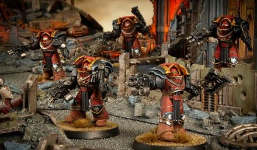

# 0457 拯救者 Deliverer

精校状态：中文行文已逐段精校，部分术语仍为暂定

分类：通用概念 / 帝国 Imperium / 中央政务部 Adeptus Terra / 阿斯塔特修会 Adeptus Astartes

原文来源：https://www.bilibili.com/opus/1022076588669272064

原作者：帝国神选罐头

原文时间：2025年01月14日 06:59

[返回分类目录](目录.md) · [全书目录](../../目录.md)

<!-- A0457-B0001 -->
**英文原文**

The Deliverers were among the few Raven Guard to wear Terminator Armour in the Great Crusade and Horus Heresy, as its use was often shunned by the Legion.

<!-- /A0457-B0001 -->

<!-- A0457-B0002 -->

原译文

在大远征和荷鲁斯叛乱中，拯救者是少数穿着终结者盔甲的暗鸦守卫之一，因为它的使用经常被军团所回避。

**校订译文**

大远征与荷鲁斯之乱时期，暗鸦守卫军团通常不愿使用终结者护甲；拯救者便是少数身穿这种护甲的战士。

<!-- /A0457-B0002 -->

<!-- A0457-B0003 -->
## Description 描述

<!-- /A0457-B0003 -->

<!-- A0457-B0004 -->
**英文原文**

Squadrons were led by Deliverer Chieftains and during the course of the Great Crusade they perfected clearing enemy-held entrances and holding foes in brutally grinding stalemates.

<!-- /A0457-B0004 -->

<!-- A0457-B0005 -->

原译文

中队由拯救者之首领导，在大远征期间，他们完美地清理了敌人控制的通道，并将敌人控制在残酷的僵局中。

**校订译文**

这些小队由拯救者之首统领，在大远征中将强攻敌方据守的入口、以惨烈持久战牵制敌人的战术磨练得炉火纯青。

<!-- /A0457-B0005 -->

<!-- A0457-B0006 图片 -->

<!-- A0457-B0007 -->

原译文

Deliverer Squad 拯救者小队

**校订译文**

Deliverer Squad 拯救者小队

<!-- /A0457-B0007 -->

<!-- A0457-B0008 -->
## History 历史

<!-- /A0457-B0008 -->

<!-- A0457-B0009 -->
**英文原文**

Deliverers were usually Terran born Raven Guard, who had fought beside the Luna Wolves and trained under the infamous Justaerin and mastered the tactics of close range shock assault from both aerial transport and teleport deployment. The Legionaries of the Raven Guard and the Luna Wolves came to refer to these detachments as ‘Deliverers’, both for the carnage they brought to the enemy and for their tendency to be deployed when the daring assaults favoured by the XIXth Legion floundered and threatened to fail. Horus himself is known to have honoured the Deliverers attached to the Pale Nomads Chapter for the ferocity of their counter-attack at the Siege of Novas-Praxim, including them as part of his personal entourage until the Raven Lord reclaimed command of his Legion.

<!-- /A0457-B0009 -->

<!-- A0457-B0010 -->

原译文

拯救者通常是泰拉出生的暗鸦守卫，他们曾与影月苍狼并肩作战，在臭名昭著的加斯塔林手下训练，掌握了从空中运输和远程传送部署进行近距离突击的战术。暗鸦守卫和影月苍狼的军团成员将这些分遣队称为“拯救者”，这既是因为他们给敌人带来了大屠杀，也是因为他们倾向于在第19军团支持的大胆攻击陷入困境并有失败的危险时部署。众所周知，荷鲁斯本人曾向隶属于苍白牧者战团的拯救者致敬，感谢他们在诺瓦斯·普拉辛围城战中的猛烈反击，包括他们作为他的私人随从，直到暗鸦领主夺回了他的军团指挥权。

**校订译文**

拯救者通常是泰拉籍暗鸦守卫，曾与影月苍狼并肩作战，并在声名狼藉的加斯塔林指导下训练，精通以空中运输或传送部署展开近距离冲击突击。两军团的战士称他们为“拯救者”，既因为他们给敌人带来杀戮，也因为第十九军团偏爱的大胆攻势一旦受挫、濒临失败，往往便要由他们出动解围。隶属苍白游牧人战团的拯救者，在诺瓦斯·普拉辛围城战中发起猛烈反击，赢得荷鲁斯亲自表彰，甚至被纳入其私人扈从，直至暗鸦之主科拉克斯接掌军团。

<!-- /A0457-B0010 -->

<!-- A0457-B0011 -->
**英文原文**

After Corax took command, though, their past with the Luna Wolves, as well as their brutal manner of fighting, led the Deliverers to become ill-favoured by their Primarch, and they were rarely called upon by him. Most were assigned to distant Great Crusade fleets, and those that remained at Corax’s side became the avatars of his carefully controlled anger, loosed when an enemy proved itself worthy only of utter destruction. They then became a dour brotherhood, but never balked at sacrificing themselves for the Raven Guard and still sought to prove their worth to Corax.

<!-- /A0457-B0011 -->

<!-- A0457-B0012 -->

原译文

然而，在科拉克斯接管指挥权后，他们与影月苍狼的过去，以及他们残酷的战斗方式，导致拯救者受到了他们的原体的不喜欢，他们很少被他召唤。大多数人被分配到遥远的大远征舰队，那些留在科拉克斯身边的人成为了他精心控制的愤怒的化身，当敌人证明自己只值得彻底毁灭时，这些愤怒就会消散。然后，他们变成了一个严肃的兄弟会，但从不犹豫为暗鸦守卫牺牲自己，仍然试图向科拉克斯证明自己的价值。

**校订译文**

然而，科拉克斯接掌军团后，拯救者与影月苍狼的旧日关系及残酷战法，都令他不悦，因此很少调用他们。多数人被分派至遥远的大远征舰队；仍留在他身边的人，则成为原体刻意压抑的怒火之化身，唯有当敌人只配遭受彻底毁灭时，才会被放出。拯救者由此成为一群阴郁的兄弟，却从不吝于为暗鸦守卫牺牲，始终渴望向科拉克斯证明自身价值。

**校注：** loosed 指这些战士被放出作战，原译误作“愤怒消散”，意思相反。

<!-- /A0457-B0012 -->

<!-- A0457-B0013 -->
**英文原文**

By the time of the Horus Heresy, the Deliverers had long been exiled from any position of honour in their own Legion and felt abandoned by the Primarch that the Emperor appointed as their master. When their old patron Horus raised his banners in rebellion, some of the few remaining Deliverers would see an opportunity to rise to glory in his name once more, abandoning the Raven Lord to serve the Warmaster. Others though would see in the tumult a chance to prove themselves worthy of Corax's notice, even if only in death.

<!-- /A0457-B0013 -->

<!-- A0457-B0014 -->

原译文

到荷鲁斯叛乱时期，拯救者们早已被从他们自己的军团中任何荣耀的位置上放逐，并感觉被帝皇任命为他们主人的原体所抛弃。当他们的老主顾荷鲁斯举起旗帜反抗时，一些所剩无几的拯救者认为这是一个以荷鲁斯的名义再次崛起并获得荣耀的机会，因而抛弃了暗鸦领主去为战帅效力。而另一些人则会在这场动荡中看到一个证明自己值得科拉克斯关注的机会，哪怕是以死来证明。

**校订译文**

荷鲁斯之乱爆发时，拯救者早已被排斥在军团的荣耀职位之外，自觉遭到了帝皇为他们选定的原体的遗弃。旧日庇护者荷鲁斯举旗叛乱后，所剩无几的拯救者中，有人将此视为再次以其名义赢得荣耀的机会，离开暗鸦之主，转投战帅。另一些人则希望借这场动乱证明自己值得科拉克斯关注，纵然代价是死亡。

<!-- /A0457-B0014 -->

<!-- A0457-B0015 -->
## Known Members 著名成员

<!-- /A0457-B0015 -->

<!-- A0457-B0016 -->
**英文原文**

Beyar Kedron - Centurion.

<!-- /A0457-B0016 -->

<!-- A0457-B0017 -->

原译文

贝亚尔·凯德伦 - 百夫长

**校订译文**

贝亚尔·凯德伦 - 百夫长

<!-- /A0457-B0017 -->

<!-- A0457-B0018 -->
**英文原文**

Caeden - Deliverer Chieftain.

<!-- /A0457-B0018 -->

<!-- A0457-B0019 -->

原译文

凯登 - 拯救者之首

**校订译文**

凯登 - 拯救者之首

<!-- /A0457-B0019 -->

<!-- A0457-B0020 -->
**英文原文**

Syban Nethkal - Shade-Captain.

<!-- /A0457-B0020 -->

<!-- A0457-B0021 -->

原译文

赛班·内特卡尔 - 阴影连长

**校订译文**

赛班·内特卡尔 - 阴影连长

<!-- /A0457-B0021 -->

<!-- A0457-B0022 -->

原译文

Heklan 赫克兰

**校订译文**

Heklan 赫克兰

<!-- /A0457-B0022 -->

本篇核心术语与暂定项

以下列出本篇出现的英文原形及核心术语表用词。同形词可能指不同对象，具体词义以本篇正文和校注为准；单复数、别名和仅见于图注的名称可能尚未列入。完整候选见[术语表](../../术语表/双语术语候选.csv)。

| 英文 | 采用中文 | 状态 |
| --- | --- | --- |
| Terminator | 终结者 | 官方已核对 |
| Horus Heresy | 荷鲁斯之乱 | 官方已核对 |
| Emperor | 帝皇 | 官方已核对 |
| Primarch | 原体 | 官方已核对 |
| Great Crusade | 大远征 | 暂定·官方待核 |
| Luna Wolves | 影月苍狼 | 暂定·官方待核 |
| Horus | 荷鲁斯 | 暂定·官方待核 |
| Brotherhood | 兄弟会 | 暂定·官方待核 |
| Luna | 月球 | 暂定·官方待核 |
| Master | 导师（审判庭职衔）／舰务官（舰员职务） | 语境定译·官方待核 |
| Justaerin | 加斯塔林 | 暂定·官方待核 |
| Raven Guard | 暗鸦守卫 | 官方已核 |
| Syban Nethkal | 赛班·内斯卡尔 | 暂定·官方待核 |
| Chapter | 战团 | 暂定·官方待核 |
| Captain | 连长 | 暂定·官方待核 |
| Pale Nomads | 苍白游牧人 | 暂定·官方待核 |
| Beyar Kedron | 贝亚尔·凯德伦 | 暂定·官方待核 |
| Caeden | 凯登 | 暂定·官方待核 |
| Deliverers | 拯救者 | 暂定·官方待核 |
| Ferocity | 凶猛 | 暂定·官方待核 |
| Terminator Armour | 终结者盔甲 | 暂定·官方待核 |

