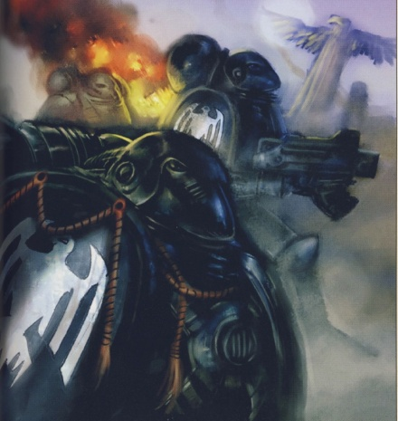

# 0458 暗影守望 Shadow Warden

精校状态：中文行文已逐段精校，部分术语仍为暂定

分类：通用概念 / 帝国 Imperium / 中央政务部 Adeptus Terra / 阿斯塔特修会 Adeptus Astartes

原文来源：https://www.bilibili.com/opus/1033598096153509889

原作者：帝国神选罐头

原文时间：编辑于 2025年07月26日 11:35

[返回分类目录](目录.md) · [全书目录](../../目录.md)

<!-- A0458-B0001 -->
**英文原文**

The Shadow Wardens were the elite Honour Guard of Raven Guard Primarch Corvus Corax.

<!-- /A0458-B0001 -->

<!-- A0458-B0002 -->

原译文

暗影监察者是暗鸦守卫原体科沃斯·科拉克斯的精英荣誉卫队。

**校订译文**

暗影守望是暗鸦守卫原体科沃斯·科拉克斯的精锐荣誉卫队。

<!-- /A0458-B0002 -->

<!-- A0458-B0003 -->
## Overview 概述

<!-- /A0458-B0003 -->

<!-- A0458-B0004 -->
**英文原文**

Formed before his discovery by the Emperor while he was leading his slave uprising on the world of Lycaeus, Corax was reluctant to allow the unit's formation despite warnings by his lieutenants that his enemies may try to assassinate him. In the end Corax agreed, and these warriors not only served with Corax on Lycaeus but were later inducted into the Raven Guard Space Marine Legion where they continued to serve at their Primarch's side. The Shadow Wardens were renowned for their stealth and ability to remain unseen despite always being at their Primarch's side.

<!-- /A0458-B0004 -->

<!-- A0458-B0005 -->

原译文

科拉克斯在被帝皇发现之前就已经成立，当时他正在领导利卡埃乌斯世界的奴隶起义，尽管他的副手警告说他的敌人可能会试图暗杀他，但他还是不愿意允许该部队的组建。最后，科拉克斯同意了，这些战士不仅与科拉克斯一起在利卡埃乌斯战役中服役，而且后来被编入暗鸦守卫星际战士军团，在那里他们继续在原体身边服役。暗影监察者以他们的隐秘和化为无形的能力而闻名，他们总是站在原体一边。

**校订译文**

这支部队在帝皇寻获科拉克斯之前便已组建，当时他仍在吕凯乌斯领导奴隶起义。尽管副手警告敌人可能行刺，科拉克斯起初仍不愿设立专门卫队，最终才同意。他们先在吕凯乌斯随他作战，后来被编入暗鸦守卫星际战士军团，继续守护原体。暗影守望以高超潜行能力闻名，即使时刻伴随科拉克斯，也能不被旁人察觉。

<!-- /A0458-B0005 -->

<!-- A0458-B0006 图片 -->

<!-- A0458-B0007 -->

原译文

Shadow Wardens squad 暗影监察者小队

**校订译文**

Shadow Wardens squad 暗影守望小队

<!-- /A0458-B0007 -->

<!-- A0458-B0008 -->
**英文原文**

The Shadow Wardens took heavy losses during the Drop Site Massacre, but some such as their Captain Gherith Arendi survived. Shortly before the Battle of Yarant, the badly depleted Shadow Wardens were reorganized into the Black Guard, which later became a Second Founding Chapter.

<!-- /A0458-B0008 -->

<!-- A0458-B0009 -->

原译文

暗影监察者在登陆点大屠杀中损失惨重，但他们的连长格里瑟·阿伦迪等一些人幸存下来。在雅兰特战役前不久，精疲力尽的暗影监察者被重组为黑色守卫，后来成为二次建军战团。

**校订译文**

暗影守望在登陆点大屠杀中损失惨重，但连长格里思·阿伦迪等人幸存。雅兰特之战前不久，兵力严重不足的卫队被重组为黑色守卫，后来发展为第二次建军中的一个战团。

**校注：** depleted 是兵员折损、缺编，不是疲惫。

<!-- /A0458-B0009 -->

<!-- A0458-B0010 -->
## Notable Shadow Wardens 著名暗影守望

原题：Notable Shadow Wardens 著名暗影监察者

<!-- /A0458-B0010 -->

<!-- A0458-B0011 -->
**英文原文**

Gherith Arendi — Captain.

<!-- /A0458-B0011 -->

<!-- A0458-B0012 -->

原译文

格里瑟·阿伦迪 — 连长

**校订译文**

格里思·阿伦迪——连长。

<!-- /A0458-B0012 -->

本篇核心术语与暂定项

以下列出本篇出现的英文原形及核心术语表用词。同形词可能指不同对象，具体词义以本篇正文和校注为准；单复数、别名和仅见于图注的名称可能尚未列入。完整候选见[术语表](../../术语表/双语术语候选.csv)。

| 英文 | 采用中文 | 状态 |
| --- | --- | --- |
| Emperor | 帝皇 | 官方已核对 |
| Primarch | 原体 | 官方已核对 |
| Space Marine Legion | 星际战士军团 | 暂定·官方待核 |
| Honour Guard | 荣誉卫队 | 暂定·官方待核 |
| Raven Guard | 暗鸦守卫 | 官方已核 |
| Second Founding | 二次建军 | 暂定·官方待核 |
| Gherith Arendi | 格里思·阿伦迪 | 暂定·官方待核 |
| Founding | 建军 | 暂定·官方待核 |
| Space Marine | 星际战士 | 暂定·官方待核 |
| Chapter | 战团 | 暂定·官方待核 |
| Captain | 连长 | 暂定·官方待核 |
| Black Guard | 黑色守卫 | 暂定·官方待核 |
| Shadow Wardens | 暗影守望 | 暂定·官方待核 |
| Corvus Corax | 科沃斯·科拉克斯 | 暂定·官方待核 |
| Lycaeus | 利凯厄斯 | 暂定·官方待核 |

