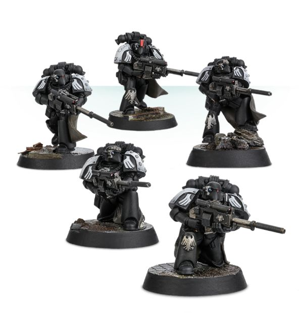

# 0459 摩尔戴斯 Mor Deythan

精校状态：中文行文已逐段精校，部分术语仍为暂定

分类：通用概念 / 帝国 Imperium / 中央政务部 Adeptus Terra / 阿斯塔特修会 Adeptus Astartes

原文来源：https://www.bilibili.com/opus/1030340376366415926

原作者：帝国神选罐头

原文时间：2025年02月05日 13:26

[返回分类目录](目录.md) · [全书目录](../../目录.md)

<!-- A0459-B0001 -->
**英文原文**

The Mor Deythan were elite infantry of the Raven Guard during the Great Crusade and Horus Heresy.

<!-- /A0459-B0001 -->

<!-- A0459-B0002 -->

原译文

摩尔戴斯是大远征和荷鲁斯叛乱时期暗鸦守卫的精英步兵。

**校订译文**

摩尔戴斯是大远征和荷鲁斯之乱时期暗鸦守卫的精英步兵。

<!-- /A0459-B0002 -->

<!-- A0459-B0003 -->
## Overview 概述

<!-- /A0459-B0003 -->

<!-- A0459-B0004 -->
**英文原文**

Informally known as 'Shadow Masters', these were a small cadre of infiltration squads within the Legion already well known for their skill in such tactics. Each is a veteran of the Lycaen Uprising who fought at the side of Corax himself. When the Emperor of Mankind arrived on Deliverance he judged many of the rebels who had fought alongside his son worthy of transformation into a Space Marine and helped remind Corax of his roots as a revolutionary and freedom fighter.

<!-- /A0459-B0004 -->

<!-- A0459-B0005 -->

原译文

非正式称为“暗影大师”，这些人是军团中的一小群渗透小队，以其战术技巧而闻名。每个人都是莱肯起义的老兵，自己也在科拉克斯身边作战。当人类帝皇抵达拯救星时，他认为许多与儿子并肩作战的叛军值得转变为星际战士，并帮助提醒科拉克斯他是一名革命者和自由战士。

**校订译文**

他们也非正式地称为“暗影大师”，是军团中数量不多的渗透小队；即使在本就擅长潜行的暗鸦守卫中，也享有盛名。成员都是吕凯乌斯起义的老兵，曾与科拉克斯本人并肩作战。帝皇来到拯救星后，认为许多曾追随其子嗣的起义军都值得改造为星际战士；他们也不断提醒科拉克斯，莫忘自己曾是革命者与自由斗士。

<!-- /A0459-B0005 -->

<!-- A0459-B0006 图片 -->

<!-- A0459-B0007 -->

原译文

Mor Deythan Strike Squad 摩尔戴斯打击小队

**校订译文**

Mor Deythan Strike Squad 摩尔戴斯打击小队

<!-- /A0459-B0007 -->

<!-- A0459-B0008 -->
**英文原文**

At the beginning of the Horus Heresy, the Mor Deythan were few in number after eight decades of constant warfare and rarely admitted new recruits into their ranks. Most who remained were grizzled veterans who were masters of moving silently through the shadows and attacking at the best opportunity. They utilized a range of specialized equipment. However rumor had it that they possessed the ability of their Primarch's ability of nigh-invisibility.

<!-- /A0459-B0008 -->

<!-- A0459-B0009 -->

原译文

在荷鲁斯叛乱开始时，经过八十年的持续战争，摩尔戴斯的人数很少，也很少有新兵加入他们的队伍。剩下的大多数人都是头发花白的老兵，他们擅长在阴影中默默地移动，并在最佳时机发起进攻。他们使用了一系列专业设备。然而，有传言说，他们拥有原体的隐形能力。

**校订译文**

荷鲁斯之乱开始时，经过八十年不间断战争，摩尔戴斯已寥寥无几，且很少接纳新兵。幸存者大多是久经风霜的老兵，精于无声穿行阴影，并在最佳时机发起攻击。他们使用多种专用装备；也有传言称，他们继承了原体近乎隐形的能力。

<!-- /A0459-B0009 -->

<!-- A0459-B0010 -->
**英文原文**

By M42, the abilities of the Mor Deythan, have become incredibly rare among those Space Mariness descended from the Primarch Corax. However after the Great Rift left the Imperium beset by foes, the Raven Guard's Chapter Master, Kayvaan Shrike, restored the Mor Deythan in order to help topple these threats. So far, though, they only have four members in the re-established order.

<!-- /A0459-B0010 -->

<!-- A0459-B0011 -->

原译文

到了M42，摩尔戴斯的能力在从原铸手术进化而来的星际战士中变得极其罕见。然而，在大裂隙使帝国被敌人包围后，暗鸦守卫的战团长凯万·史瑞克恢复了摩尔戴斯，以帮助推翻这些威胁。不过，到目前为止，在重新建立的秩序中，他们只有四名成员。

**校订译文**

到了第四十二个千年，在科拉克斯血脉的星际战士中，摩尔戴斯所拥有的能力已极其罕见。然而，大裂隙让帝国陷入群敌环伺的困境后，时任暗鸦守卫战团长凯万·史瑞克重建了这支部队，以协助消除威胁。原文记载时，重建后的摩尔戴斯仅有四名成员。

**校注：** descended from the Primarch Corax 指继承科拉克斯血脉，原译“从原铸手术进化而来”完全误解，已恢复。

<!-- /A0459-B0011 -->

<!-- A0459-B0012 -->
## Known Mor Deythan 著名摩尔戴斯

<!-- /A0459-B0012 -->

<!-- A0459-B0013 -->
**英文原文**

Aevar Qeld — M42 Raven Guard Shadow Captain.

<!-- /A0459-B0013 -->

<!-- A0459-B0014 -->

原译文

艾瓦尔·奎德 — M42暗鸦守卫暗影连长

**校订译文**

艾瓦尔·奎德 — M42暗鸦守卫暗影连长

<!-- /A0459-B0014 -->

<!-- A0459-B0015 -->
**英文原文**

Illith — M42 Raven Guard Shadow Captain.

<!-- /A0459-B0015 -->

<!-- A0459-B0016 -->

原译文

伊利斯 — M42暗鸦守卫暗影连长

**校订译文**

伊利斯 — M42暗鸦守卫暗影连长

<!-- /A0459-B0016 -->

<!-- A0459-B0017 -->
**英文原文**

Mordren — M42 Knights of the Raven Captain.

<!-- /A0459-B0017 -->

<!-- A0459-B0018 -->

原译文

莫德伦 — M42渡鸦骑士连长

**校订译文**

莫德伦 — M42渡鸦骑士连长

<!-- /A0459-B0018 -->

<!-- A0459-B0019 -->
**英文原文**

Artarix — M42 Raven Guard Sergeant.

<!-- /A0459-B0019 -->

<!-- A0459-B0020 -->

原译文

阿塔里克斯 — M42暗鸦守卫军士

**校订译文**

阿塔里克斯 — M42暗鸦守卫军士

<!-- /A0459-B0020 -->

本篇核心术语与暂定项

以下列出本篇出现的英文原形及核心术语表用词。同形词可能指不同对象，具体词义以本篇正文和校注为准；单复数、别名和仅见于图注的名称可能尚未列入。完整候选见[术语表](../../术语表/双语术语候选.csv)。

| 英文 | 采用中文 | 状态 |
| --- | --- | --- |
| Horus Heresy | 荷鲁斯之乱 | 官方已核对 |
| Great Rift | 大裂隙 | 官方已核对 |
| Imperium | 帝国 | 暂定·简称 |
| Equipment | 装备 | 编辑用语已统一 |
| Emperor of Mankind | 人类帝皇 | 暂定 |
| Emperor | 帝皇 | 官方已核对 |
| Primarch | 原体 | 官方已核对 |
| Great Crusade | 大远征 | 暂定·官方待核 |
| Horus | 荷鲁斯 | 暂定·官方待核 |
| Mor Deythan | 摩尔戴斯 | 暂定·官方待核 |
| Deliverance | 拯救星 | 暂定·官方待核 |
| Master | 导师（审判庭职衔）／舰务官（舰员职务） | 语境定译·官方待核 |
| Cadre | 骨干连（寂静修女）／核心队（钛族） | 语境定译·钛族词根参考 |
| Raven Guard | 暗鸦守卫 | 官方已核 |
| Space Marine | 星际战士 | 暂定·官方待核 |
| Chapter | 战团 | 暂定·官方待核 |
| Chapter Master | 战团长 | 暂定·官方待核 |
| Captain | 连长 | 暂定·官方待核 |
| Veteran | 老兵 | 暂定·官方待核 |
| Sergeant | 军士 | 暂定·官方待核 |
| Kayvaan Shrike | 凯万·史瑞克 | 官方已核 |
| Knights of the Raven | 渡鸦骑士 | 暂定·官方待核 |
| Shadow Captain | 暗影连长 | 暂定·官方待核 |
| Aevar Qeld | 艾瓦尔·奎德 | 暂定·官方待核 |
| Illith | 伊利斯 | 暂定·官方待核 |
| Mordren | 莫德伦 | 暂定·官方待核 |
| Artarix | 阿塔里克斯 | 暂定·官方待核 |

