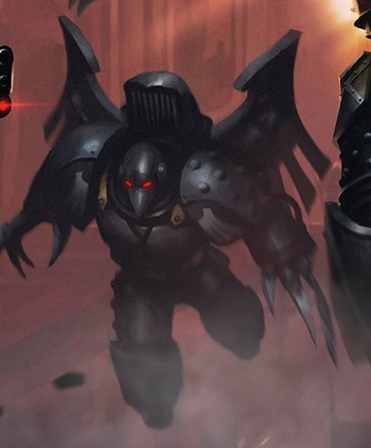
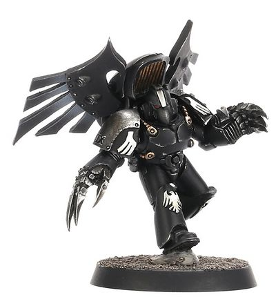

# 0460 黑暗狂怒 Dark Furies

精校状态：中文行文已逐段精校，部分术语仍为暂定

分类：通用概念 / 帝国 Imperium / 中央政务部 Adeptus Terra / 阿斯塔特修会 Adeptus Astartes

原文来源：https://www.bilibili.com/opus/1021090906575470614

原作者：帝国神选罐头

原文时间：2025年01月11日 15:14

[返回分类目录](目录.md) · [全书目录](../../目录.md)

<!-- A0460-B0001 -->
**英文原文**

Dark Furies were Raven Guard fast attack infantry units during the Great Crusade and Horus Heresy.

<!-- /A0460-B0001 -->

<!-- A0460-B0002 -->

原译文

黑暗狂怒是大远征和荷鲁斯叛乱时期的暗鸦守卫的快速攻击步兵部队。

**校订译文**

黑暗狂怒是大远征和荷鲁斯之乱时期的暗鸦守卫的快速攻击步兵部队。

<!-- /A0460-B0002 -->

<!-- A0460-B0003 图片 -->

<!-- A0460-B0004 -->

原译文

Dark Fury 黑暗狂怒

**校订译文**

Dark Fury 黑暗狂怒

<!-- /A0460-B0004 -->

<!-- A0460-B0005 -->
**英文原文**

These special Assault Squads were utilized by the Raven Guard to conduct focused decapitation strikes on specific enemy leaders during battle. Far from subtle assassins, they descended directly into the midst of battle. Their squad leaders, known as the Choosers of the Slain, engaged the target while the warriors cut down any retainers who attempted to intervene. The squads were equipped with Lightning Claws fashioned after those carried by their Primarch, Corvus Corax, and the Choosers of the Slain were issued Artificer Armour.

<!-- /A0460-B0005 -->

<!-- A0460-B0006 -->

原译文

暗鸦守卫利用这些特殊突击队在战斗中对特定的敌方领导人进行集中斩首打击。他们远非狡猾的刺客，而是直接潜入战斗之中。他们的小队领导者，被称为择杀者，与目标交战，而战士们则消灭了任何试图干预的随从。这些小队装备了闪电爪，这些闪电爪是根据他们的原体科沃斯·科拉克斯携带的闪电爪制成的，而择杀者则被授予了精工盔甲。

**校订译文**

暗鸦守卫利用这些特殊突击小队，在战场上对特定敌方首领实施精准斩首。他们并非悄然行刺，而是直接降入激战中心。小队指挥者称为“择杀者”，负责迎击目标，其余战士则斩杀任何试图插手的扈从。小队配备仿照原体科沃斯·科拉克斯武器制成的闪电爪，择杀者还另获精工护甲。

<!-- /A0460-B0006 -->

<!-- A0460-B0007 图片 -->

<!-- A0460-B0008 -->

原译文

Dark Fury warrior 黑暗狂怒战士

**校订译文**

Dark Fury warrior 黑暗狂怒战士

<!-- /A0460-B0008 -->

<!-- A0460-B0009 -->
**英文原文**

The squads were often deployed from Darkwing or Whispercutter aircraft, leaping from great heights with their silenced jump packs to descend upon the enemy.

<!-- /A0460-B0009 -->

<!-- A0460-B0010 -->

原译文

这些小队经常从暗翼或低语者飞艇上部署，带着无声的跳跃背包从高处跳下，向敌人扑去。

**校订译文**

他们通常搭乘暗翼或低语切割者飞行器出击，凭借经过消音处理的跳跃背包从高空跃下，直扑敌人。

<!-- /A0460-B0010 -->

<!-- A0460-B0011 -->
## Notable Dark Furies 著名黑暗狂怒

<!-- /A0460-B0011 -->

<!-- A0460-B0012 -->
**英文原文**

Ghelt - Dark Fury Sergeant

<!-- /A0460-B0012 -->

<!-- A0460-B0013 -->

原译文

盖尔特 - 黑暗狂怒军士

**校订译文**

盖尔特 - 黑暗狂怒军士

<!-- /A0460-B0013 -->

本篇核心术语与暂定项

以下列出本篇出现的英文原形及核心术语表用词。同形词可能指不同对象，具体词义以本篇正文和校注为准；单复数、别名和仅见于图注的名称可能尚未列入。完整候选见[术语表](../../术语表/双语术语候选.csv)。

| 英文 | 采用中文 | 状态 |
| --- | --- | --- |
| Horus Heresy | 荷鲁斯之乱 | 官方已核对 |
| Primarch | 原体 | 官方已核对 |
| Great Crusade | 大远征 | 暂定·官方待核 |
| Horus | 荷鲁斯 | 暂定·官方待核 |
| Raven Guard | 暗鸦守卫 | 官方已核 |
| Ghelt | 盖尔特 | 暂定·官方待核 |
| Sergeant | 军士 | 暂定·官方待核 |
| Assault Squads | 突击小队 | 暂定·官方待核 |
| Artificer | 技工 | 暂定·官方待核 |
| Choosers of the Slain | 择杀者 | 暂定·官方待核 |
| Corvus Corax | 科沃斯·科拉克斯 | 暂定·官方待核 |
| Dark Fury | 黑暗狂怒 | 暂定·官方待核 |
| Artificer Armour | 精工盔甲 | 暂定·官方待核 |
| Darkwing | 暗翼 | 暂定·官方待核 |

