# 0462 死亡守望 Deathwatch

精校状态：中文行文已逐段精校，部分术语仍为暂定

分类：通用概念 / 帝国 Imperium / 中央政务部 Adeptus Terra / 阿斯塔特修会 Adeptus Astartes

原文来源：https://www.bilibili.com/opus/1122007146083385376

原作者：帝国神选罐头

原文时间：编辑于 2026年04月08日 10:55

[返回分类目录](目录.md) · [全书目录](../../目录.md)

<!-- A0462-B0001 -->
**英文原文**

The Deathwatch is a unique and specially trained Space Marine Chapter that dedicates its every hour to xenos hunting.

<!-- /A0462-B0001 -->

<!-- A0462-B0002 -->

原译文

死亡守望是一个独特的、经过专门训练的星际战士战团，每小时都致力于狩猎异型。

**校订译文**

死亡守望是一个独特的星际战士战团，接受专门训练，时刻以猎杀异形为使命。

<!-- /A0462-B0002 -->

<!-- A0462-B0003 图片 -->

<!-- A0462-B0004 -->
**英文原文**

Known as the Shield that Slays, they are the Chamber Militant of the Ordo Xenos, charged with protecting it in its search of information, containment, and ultimate destruction of all xeno species. Consisting of Battle-Brothers drawn from many Chapters, the Deathwatch operates from Watch Fortresses and Watch Stations across the whole of the Imperium.

<!-- /A0462-B0004 -->

<!-- A0462-B0005 -->

原译文

他们被称为杀戮之盾，是攘外修会的军事辅军，负责保护它搜索信息、遏制和最终摧毁所有异型物种。死亡守望由来自多个战团的战斗兄弟组成，在整个帝国的守望堡垒和守望空间站运作。

**校订译文**

他们被称为“杀戮之盾”，是异形审判庭的军事分支，负责在其搜集情报、遏制威胁并最终消灭各异形种族的过程中提供武力保护。成员来自众多战团，以遍布帝国的守望堡垒与守望站为据点行动。

<!-- /A0462-B0005 -->

<!-- A0462-B0006 图片 -->
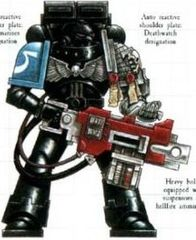

<!-- A0462-B0007 图片 -->
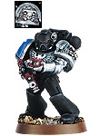

<!-- A0462-B0008 -->
**英文原文**

Founding Chapter:None, members inducted from several different chapters.

<!-- /A0462-B0008 -->

<!-- A0462-B0009 -->

原译文

建军战团：无，成员来自几个不同的战团。

**校订译文**

起源战团：无，成员由多个不同战团选派。

<!-- /A0462-B0009 -->

<!-- A0462-B0010 -->
**英文原文**

Founding:During the War of the Beast

<!-- /A0462-B0010 -->

<!-- A0462-B0011 -->

原译文

建军：野兽战争期间

**校订译文**

建军：野兽战争期间

<!-- /A0462-B0011 -->

<!-- A0462-B0012 -->
**英文原文**

Chapter Master:Unknown, the first Chapter Master was known as the Watch Commander but today multiple holders of the title exist

<!-- /A0462-B0012 -->

<!-- A0462-B0013 -->

原译文

战团长：未知，第一任战团长被称为守望指挥官，但如今有多个头衔持有者

**校订译文**

战团长：不明。首任战团长称为守望指挥官；原文记载时，已有多人各自持有这一头衔。

<!-- /A0462-B0013 -->

<!-- A0462-B0014 -->
**英文原文**

Homeworld:Talasa Prime

<!-- /A0462-B0014 -->

<!-- A0462-B0015 -->

原译文

家园世界：塔拉萨一号

**校订译文**

母星：塔拉萨主星

<!-- /A0462-B0015 -->

<!-- A0462-B0016 -->
**英文原文**

Fortress-Monastery:Inquisitorial Fortress at Talasa Prime

<!-- /A0462-B0016 -->

<!-- A0462-B0017 -->

原译文

堡垒修道院：塔拉萨一号的审判庭堡垒

**校订译文**

要塞修道院：塔拉萨主星的审判庭堡垒。

<!-- /A0462-B0017 -->

<!-- A0462-B0018 -->
**英文原文**

Colours:Blacked out armour with silver left arm. Right shoulder as per chapter of origin.

<!-- /A0462-B0018 -->

<!-- A0462-B0019 -->

原译文

颜色：黑色盔甲，左臂银色。右肩符合起源战团。

**校订译文**

配色：黑色护甲，左臂为银色；右肩保留原属战团标识。

<!-- /A0462-B0019 -->

<!-- A0462-B0020 -->
**英文原文**

Specialty:Anti-Xenos Warfare

<!-- /A0462-B0020 -->

<!-- A0462-B0021 -->

原译文

专业：反异型战争

**校订译文**

专长：反异形作战。

<!-- /A0462-B0021 -->

<!-- A0462-B0022 -->
**英文原文**

Strength:Unknown

<!-- /A0462-B0022 -->

<!-- A0462-B0023 -->

原译文

力量：未知

**校订译文**

兵力：不明。

<!-- /A0462-B0023 -->

<!-- A0462-B0024 -->
**英文原文**

Battle Cry:"Suffer Not The Alien to Live"

<!-- /A0462-B0024 -->

<!-- A0462-B0025 -->

原译文

战吼：“异型无存”Rather than following the standard Codex Astartes organization, the Space Marines themselves are drawn from many different chapters. These chapters have sworn sacred oaths to raise a unit of Space Marines specifically for this task. The warriors are then gathered together to fight where and when they are needed. Giant fortresses orbit desolate worlds at the edge of the galaxy, keeping constant vigil over possible xenos forces. There are also several secret bases spread throughout the Imperium, which provide a launch site for their crusades.并没有遵循标准的圣典阿斯塔特组织，星际战士来自许多不同的战团。这些战团宣誓成立一支专门负责这项任务的星际战士。然后，战士们聚集在一起，在需要的时间和地点作战。巨大的堡垒围绕银河系边缘的荒凉世界运行，对可能的异型部队保持警惕。帝国中还有几个秘密基地，为他们的远征提供了发射场。

**校订译文**

战吼：“异形无存”

Rather than following the standard Codex Astartes organization, the Space Marines themselves are drawn from many different chapters. These chapters have sworn sacred oaths to raise a unit of Space Marines specifically for this task. The warriors are then gathered together to fight where and when they are needed. Giant fortresses orbit desolate worlds at the edge of the galaxy, keeping constant vigil over possible xenos forces. There are also several secret bases spread throughout the Imperium, which provide a launch site for their crusades.

死亡守望并不采用标准的《阿斯塔特圣典》组织形式，而是从许多不同战团征调星际战士。这些战团立下神圣誓言，专门为此提供部队。战士随后汇集，在需要的时间与地点投入战斗。巨大的堡垒环绕银河边缘的荒凉世界，持续警戒可能出现的异形威胁。帝国境内还散布着若干秘密基地，作为其远征的出发地。

<!-- /A0462-B0025 -->

<!-- A0462-B0026 图片 -->
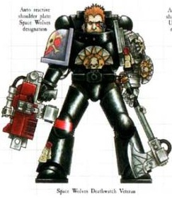

<!-- A0462-B0027 -->

原译文

Deathwatch Marine (Space Wolves) 死亡守望战士（太空野狼）

**校订译文**

Deathwatch Marine (Space Wolves) 死亡守望战士（太空野狼）

<!-- /A0462-B0027 -->

<!-- A0462-B0028 -->
**英文原文**

The warriors who fight are given the honour of painting their armour black (to show their service to the Emperor), while leaving one shoulder pad with the original insignia of the Chapter from which the marine came. Although the armour is painted black, it is never all painted black as this action would dishonour the armour's Machine Spirit. They also are equipped with a new shoulder pad with the symbol of Deathwatch onto their other side. Once in the employ of the Deathwatch, there is no set length of time for service, rather it is as long as the commander deems necessary. Each Space Marine may serve a discrete amount of time, or for the duration of a mission, which may be a number of years. Once the mission is complete, the Space Marine is allowed to return to his chapter, under an oath of silence, as their duty has been fulfilled. How long a Space Marine is part of the Deathwatch varies greatly. It can last a single mission, decades, or even centuries. His length of service depends on a number of factors, not least of which are the immediate needs of his Watch Fortress.

<!-- /A0462-B0028 -->

<!-- A0462-B0029 -->

原译文

参加战斗的战士有幸将他们的盔甲涂成黑色（以显示他们对帝皇的服务），同时留下一个肩甲，上面有这位战士来自的那一战团的原始徽章。虽然盔甲被漆成黑色，但它不会永远都漆成黑色的，因为这种行为会玷污盔甲的机魂。他们还配备了一个新的肩甲，肩甲的另一侧有死亡守望的象征。一旦加入死亡守望，服役时间没有固定的长度，而是指挥官认为必要的时间。每个星际战士可能服役于一段离散的时间，或者在任务的持续时间内服役，这可能是几年。任务完成后，星际战士被允许在宣誓保持沉默的情况下返回他的战团，因为他们的职责已经履行完毕。一名星际战士参加死亡守望的时间差异很大。它可以持续一次任务，几十年，甚至几个世纪。他的服役时间取决于许多因素，其中最重要的是他的守望堡垒的迫切需求。

**校订译文**

加入死亡守望的战士获准将护甲涂黑，以象征为帝皇效力，同时在一侧肩甲上保留原属战团的徽记。护甲绝不能全部涂黑，否则便会冒犯机魂；另一侧肩甲则更换为带有死亡守望徽记的新肩甲。服役期没有统一期限，由指挥官按需要决定。战士可能服役一段指定时间，也可能执行一项持续数年的任务。职责完成后，他们立下保密誓言，便可返回原战团。实际服役期可能只有一次任务，也可能长达数十年乃至数百年，取决于多种因素，尤其是所属守望堡垒的即时需要。

<!-- /A0462-B0029 -->

<!-- A0462-B0030 -->
**英文原文**

The orders of the Deathwatch are not merely the cleansing of xenos cultures. They also include the recovery and study of alien devices and artifacts. Sometimes it is necessary to use a weapon against the enemy who created it, although this is not taken lightly. The Deathwatch are constantly vigilant for sabotage, or to advise if it is truly safe to use a weapon of xenos origin. The Adeptus Mechanicus are always on the lookout for alien technology; the C'tan Phase Sword, used by the Callidus assassin was recovered from a Necron tomb world and successfully integrated into the arsenal of the Imperium.

<!-- /A0462-B0030 -->

<!-- A0462-B0031 -->

原译文

死亡守望的命令不仅仅是对异型文化的清洗。它们还包括外星设备和造物的恢复和研究。有时，有必要对制造武器的敌人使用武器，尽管这并不是一件轻而易举的事。死亡守望时刻警惕蓄意破坏，或建议使用异型来源的武器是否真的安全。机械神教一直在寻找外星技术；卡利都司刺客使用的星神相位剑从死灵墓穴世界中被发现，并成功地融入了帝国的武器库。

**校订译文**

死亡守望的职责不限于摧毁异形文明，也包括回收与研究异形设备和造物。有时必须以敌人制造的武器反击其自身，但这种决定从不轻率作出。死亡守望要防范暗藏的破坏手段，并判断异形武器能否安全使用。机械修会同样一直搜寻异形技术：卡利都司刺客使用的星神相位剑，便是从太空死灵墓穴世界中取回，并成功纳入帝国武库的成果。

<!-- /A0462-B0031 -->

<!-- A0462-B0032 -->
**英文原文**

Usually, a Deathwatch team is led by an Inquisitor, but in extreme circumstances, a Deathwatch Captain or Librarian may take command of the unit. Their word is law, and can requisition anything they desire to complete their objective. They are the best armed and trained units in the Imperium. They might be deployed in areas where conventional methods are insufficient or if the troops available are not properly equipped or trained for the task. The presence of a Deathwatch team is always welcomed, even though they are feared by all those who know of them.

<!-- /A0462-B0032 -->

<!-- A0462-B0033 -->

原译文

通常，死亡守望小队由审判官领导，但在极端情况下，死亡守望连长或智库可能会指挥该小队。他们的话就是法律，可以要求任何他们想要的东西来完成他们的目标。他们是帝国中装备最精良、训练有素的部队。他们可能被部署在传统方法不足的地区，或者如果可用的部队没有适当的装备或训练来执行任务。死亡守望小队的存在总是受到欢迎，尽管所有知道他们的人都害怕他们。

**校订译文**

通常，死亡守望小队由审判官指挥，极端情况下也可由死亡守望连长或智库员接掌指挥权。指挥者之言即为法令，为完成任务可以征调所需资源。这些部队是帝国中装备最精良、训练最有素的力量之一，常被派往常规手段无效，或现有部队装备与训练不足以胜任任务的战区。尽管知晓死亡守望之人无不敬畏，他们的到来仍总是受到欢迎。

**校注：** 本段说通常由审判官指挥、连长仅极端情况接掌；下文常态编制则由守望指挥官及守望连长负责。原稿汇集不同表述，未将其改写为统一制度。

<!-- /A0462-B0033 -->

<!-- A0462-B0034 -->
## History 历史

<!-- /A0462-B0034 -->

<!-- A0462-B0035 -->
**英文原文**

The seeds of the Deathwatch were first sown during the War of the Beast, when a mighty warboss known only as The Beast nearly destroyed the Imperium. During the war, Lord Commander of the Imperium and Chapter Master of the Imperial Fists Koorland realized that small Kill-Teams of Astartes were required to eliminate The Beast and key strategic assets. Needing experience and knowing that no new Foundings could be created in such a short time, the recruits were to be drawn from a multitude of existing Chapters. Despite the reluctance of the High Lords of Terra to approve the creation of this force, desperation forced their hand. The original recruits were drawn from units of survivors of Koorland's invasion of Ullanor which saw heavy Astartes losses. Thus standing in vigil of their fallen brothers, the Deathwatch came to be. Their first mission was to eliminate the Ork Attack Moon plaguing Terra. Shortly before the second invasion of Ullanor to try and slay The Beast, Koorland reached a power-sharing agreement with Inquisitorial Representative Wienand to try and avert crisis with the suspicious High Lords of Terra. It was agreed that the Deathwatch would fall under the purview of the Inquisition but that a Space Marine would serve as a Chapter Master. The first Chapter Master of the Deathwatch, known as the Watch Commander, was Asger Warfist.

<!-- /A0462-B0035 -->

<!-- A0462-B0036 -->

原译文

死亡守望的种子最早是在野兽战争期间播下的，当时一位只被称为野兽的强大战争头目几乎摧毁了帝国。战争期间，帝国领主指挥官兼帝国之拳战团长库兰德意识到，需要阿斯塔特的小型杀戮小队来消灭野兽和关键战略资产。由于需要经验，并且知道在如此短的时间内无法进行新的建军，新兵将从现有的众多战团中招募。尽管泰拉高领主们不愿意批准这支部队的创建，但绝望迫使他们采取行动。最初的新兵来自库兰德入侵乌兰诺的幸存者部队，阿斯塔特损失惨重。因此，为了纪念他们死去的兄弟，死亡守望应运而生。他们的第一个任务是消灭困扰泰拉的欧克战斗月亮。在第二次入侵乌兰诺试图杀死野兽之前不久，库兰德与审判庭代表维南德达成了一项权力分享协议，试图避免与多疑的泰拉高领主发生危机。双方同意，死亡守望将属于审判庭的职权范围，但一名星际战士将担任战团长。死亡守望的第一任战团长，被称为守望指挥官，是阿斯格·战拳。

**校订译文**

死亡守望的起源可追溯至野兽战争。当时，一位只以“野兽”为名的强大欧克战争头目，几乎摧毁了帝国。帝国最高统帅兼帝国之拳战团长库兰德意识到，必须以小型阿斯塔特杀戮小队，清除野兽及其关键战略目标。行动需要经验丰富的战士，而又不可能短期内完成新的建军，于是成员从多个现存战团中抽调。泰拉高领主虽不愿批准组建，仍在绝境中被迫同意。首批成员来自库兰德进攻乌兰诺时遭到重创的阿斯塔特部队，他们为阵亡兄弟守望，死亡守望由此诞生。首项任务是摧毁威胁泰拉的欧克战斗月亮。第二次进攻乌兰诺、试图击杀野兽之前，库兰德为避免与多疑的高领主陷入危机，同审判庭代表维南德达成权力分享协议：死亡守望归审判庭管辖，但由星际战士担任战团长。首任战团长称为守望指挥官，由阿斯格·战拳出任。

<!-- /A0462-B0036 -->

<!-- A0462-B0037 图片 -->
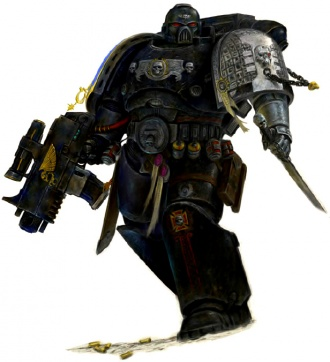

<!-- A0462-B0038 -->

原译文

Deathwatch Veteran 死亡守望老兵

**校订译文**

Deathwatch Veteran 死亡守望老兵

<!-- /A0462-B0038 -->

<!-- A0462-B0039 -->
**英文原文**

An account from older editions states that centuries ago, a Conclave of Ordo Xenos Inquisitor Lords, known as the Apocryphon Conclave of Orphite IV, convened with the purpose of formulating a galaxy-wide strategy to combat the many xenos civilizations assailing mankind. Foreseeing an age where mankind would eventually consume the Imperium itself, the conclave sat and debated for many years. Some advocated the annihilation of all xenos, some that certain less-violent civilizations should be "tolerated". However, a strategy was eventually formed and the Conclave requested an audience with many assembled Chapter Masters of the Adeptus Astartes. After hearing the Inquisitor's pleas, the Chapter Masters deliberated for one night before giving their verdict: they and the Inquisitors would together take a solemn oath and form a new Chapter, one drawn entirely from Battle Brothers from existing chapters. The alliance dubbed it the 'Deathwatch', for it would stand guard against the doom foretold by the conclave.

<!-- /A0462-B0039 -->

<!-- A0462-B0040 -->

原译文

旧版本的一篇报告指出，几个世纪前，攘外修会审判官领主的秘会，即奥尔菲特四号的守密秘会，召开了一次会议，目的是制定一项全银河战略，以打击许多攻击人类的异型文明。预见到人类最终将吞噬帝国本身的时代，秘会坐下来进行了多年的辩论。一些人主张消灭所有异型，一些人主张应该“容忍”某些不那么暴力的文明。然而，最终形成了一个策略，秘会要求与许多聚集在一起的阿斯塔特战团长会面。在听取了审判官的请求后，战团长们商议了一个晚上，然后做出了裁决：他们和审判官一起庄严宣誓，组成一个新的战团，这个战团完全来自现有战团的战斗兄弟。联合称之为“死亡守望”，因为它将防范秘会预言的毁灭。

**校订译文**

较旧版本另有一种起源说：数个世纪前，异形审判庭的领主审判官们召开“奥尔菲特四号守密秘会”，准备制定覆盖全银河的战略，以应对不断攻击人类的异形文明。他们预见，人类自身终有一日会吞噬帝国。为此，秘会辩论多年：有人主张灭绝所有异形，有人认为应“容忍”某些不那么好战的文明。最终，秘会形成方略，请求与多位阿斯塔特修会战团长会晤。听取请求后，战团长们商议一夜，决定与审判官共同立下庄严誓言，创建一支成员完全来自现存战团的新战团。他们将其命名为“死亡守望”，以抵御秘会预言中的毁灭。

**校注：** 英文确为 mankind would eventually consume the Imperium itself，即“人类将吞噬帝国”；与前后反异形宗旨衔接突兀，疑有源文笔误，未擅自将 mankind 改为 aliens。较旧版本起源说与野兽战争起源并列保留。

<!-- /A0462-B0040 -->

<!-- A0462-B0041 -->
**英文原文**

The Mantis Warriors were once second only to the Crimson Fists in the amount of recruits sent into service in the Deathwatch. However, after the Badab War, the Chapter would not be requested to join the Deathwatch's ranks due to the Inquisition's view of the Mantis Warriors' heresy during that conflict. This would last for nearly a hundred years, until Librarian Shaidan, Sergeant Soron and Brother Ruinus were seconded to Inquisitor Kalypsia's Deathwatch Kill Team. However, the Mantis Warriors were not full-fledged members - merely filling in for the losses the Kill Team sustained in a Tyranid ambush on Herodian IV (in particular, the three members kept their Chapter colours during this mission and wore no iconography of the Inquisition or the Deathwatch).

<!-- /A0462-B0041 -->

<!-- A0462-B0042 -->

原译文

在死亡守望中，螳螂勇士的新兵数量一度仅次于绯红之拳。然而，在巴达布战争之后，由于审判庭认为螳螂勇士在那场冲突中是异端，该战团不会被要求加入死亡观察的行列。这种情况持续了近一百年，直到智库沙伊丹、军士索伦和鲁伊纳斯兄弟被借调到审判官卡利普西亚的死亡守望杀戮小队。然而，螳螂勇士并不是正式的成员，只是弥补了杀戮小队在泰伦伏击赫罗提安四号时所遭受的损失（特别是，这三名成员在这次任务中保持了他们的战团颜色，没有佩戴审判庭或死亡守望的图像）。

**校订译文**

螳螂勇士曾向死亡守望输送大量成员，人数仅次于绯红之拳。巴达布战争后，审判庭认为其在战争中的行为属于异端，因此不再邀请该团派员。这种状况持续了近百年，直至智库员沙伊丹、军士索伦与鲁伊纳斯兄弟被借调至卡利普西亚审判官的死亡守望杀戮小队。不过，他们并非正式成员，只是补充该小队在赫罗提安四号遭泰伦伏击后的损失。三人在任务中保留原战团配色，没有佩戴审判庭或死亡守望徽记。

<!-- /A0462-B0042 -->

<!-- A0462-B0043 图片 -->
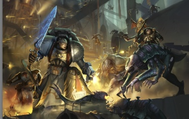

<!-- A0462-B0044 -->

原译文

Deathwatch forces battle Genestealers 死亡守望部队与基因窃取者战斗

**校订译文**

Deathwatch forces battle Genestealers 死亡守望部队与基因窃取者战斗

<!-- /A0462-B0044 -->

<!-- A0462-B0045 -->
## Notable Engagements 著名交战

<!-- /A0462-B0045 -->

<!-- A0462-B0046 -->
**英文原文**

544.M32 - The War of the Beast sees the Deathwatch created

<!-- /A0462-B0046 -->

<!-- A0462-B0047 -->

原译文

野兽战争见证了死亡守望的诞生

**校订译文**

544.M32——死亡守望在野兽战争中成立。

<!-- /A0462-B0047 -->

<!-- A0462-B0048 -->

原译文

??? - The Purging of Hrud on Rhidl 里德尔的赫鲁德净化

**校订译文**

??? - The Purging of Hrud on Rhidl 里德尔的赫鲁德净化

<!-- /A0462-B0048 -->

<!-- A0462-B0049 -->

原译文

??? - War against Orks on Endasch 恩达什上对抗欧克的战争

**校订译文**

??? - War against Orks on Endasch 恩达什上对抗欧克的战争

<!-- /A0462-B0049 -->

<!-- A0462-B0050 -->

原译文

??? - The battle for Fortress Omega 欧米伽堡垒之战

**校订译文**

??? - The battle for Fortress Omega 欧米伽堡垒之战

<!-- /A0462-B0050 -->

<!-- A0462-B0051 -->

原译文

??? - Waaagh! Dregsmasha 德雷格马沙的Waaagh！

**校订译文**

??? - Waaagh! Dregsmasha 德雷格马沙的Waaagh！

<!-- /A0462-B0051 -->

<!-- A0462-B0052 -->

原译文

??? - The purging of Ur-Ghuls on Plenitia 普林提亚的乌古尔净化

**校订译文**

??? - The purging of Ur-Ghuls on Plenitia 普林提亚的乌古尔净化

<!-- /A0462-B0052 -->

<!-- A0462-B0053 -->

原译文

??? - The purging of Sslyth in the Vensine Sector 韦塞星区的蛇人净化

**校订译文**

??? - The purging of Sslyth in the Vensine Sector 韦塞星区的蛇人净化

<!-- /A0462-B0053 -->

<!-- A0462-B0054 -->

原译文

??? - The Purging of Yddylia 伊迪利亚净化

**校订译文**

??? - The Purging of Yddylia 伊迪利亚净化

<!-- /A0462-B0054 -->

<!-- A0462-B0055 -->

原译文

??? - The war for Tharsis Prime 塔尔西斯一号战争

**校订译文**

??? - The war for Tharsis Prime 塔尔西斯一号战争

<!-- /A0462-B0055 -->

<!-- A0462-B0056 -->

原译文

??? - The Fall of Ebon Vale 黑檀谷的陷落

**校订译文**

??? - The Fall of Ebon Vale 黑檀谷的陷落

<!-- /A0462-B0056 -->

<!-- A0462-B0057 -->

原译文

??? - Invasions of Calverna 入侵卡尔弗纳

**校订译文**

??? - Invasions of Calverna 入侵卡尔弗纳

<!-- /A0462-B0057 -->

<!-- A0462-B0058 -->

原译文

??? - The purging of Anthasem 安萨瑟姆净化

**校订译文**

??? - The purging of Anthasem 安萨瑟姆净化

<!-- /A0462-B0058 -->

<!-- A0462-B0059 -->

原译文

??? - Cleansing of Siora 希奥拉清洗

**校订译文**

??? - Cleansing of Siora 希奥拉清洗

<!-- /A0462-B0059 -->

<!-- A0462-B0060 -->

原译文

??? - The battle for Gruk's World 格鲁克世界之战

**校订译文**

??? - The battle for Gruk's World 格鲁克世界之战

<!-- /A0462-B0060 -->

<!-- A0462-B0061 -->

原译文

??? - Battle for Calast's Hame 卡拉斯之居之战

**校订译文**

??? - Battle for Calast's Hame 卡拉斯之居之战

<!-- /A0462-B0061 -->

<!-- A0462-B0062 -->

原译文

335.M36 - The Xenarite Schism 异务派分裂

**校订译文**

335.M36 - The Xenarite Schism 异技派分裂

<!-- /A0462-B0062 -->

<!-- A0462-B0063 -->

原译文

???.M36 - The Szaeyr Deathwatch Crusade 赛伊尔死亡守望远征

**校订译文**

???.M36 - The Szaeyr Deathwatch Crusade 赛伊尔死亡守望远征

<!-- /A0462-B0063 -->

<!-- A0462-B0064 -->

原译文

119.M37 - The Lok'kroll Xenocide 洛克'克罗尔大屠杀

**校订译文**

119.M37 - The Lok'kroll Xenocide 洛克'克罗尔异形灭绝战

<!-- /A0462-B0064 -->

<!-- A0462-B0065 -->
**英文原文**

182.M38 - A full company of Deathwatch fail to protect Lord Inquisitor Korscht from the Kabal of Immortality Denied

<!-- /A0462-B0065 -->

<!-- A0462-B0066 -->

原译文

一整个连队的死亡守望未能从否定不朽阴谋团手中保护审判官领主科尔施特

**校订译文**

182.M38——一整连死亡守望未能从否定不朽阴谋团手中保住领主审判官科尔施特。

<!-- /A0462-B0066 -->

<!-- A0462-B0067 -->

原译文

???.M41 - The Crusade of Fire 火焰远征

**校订译文**

???.M41 - The Crusade of Fire 火焰远征

<!-- /A0462-B0067 -->

<!-- A0462-B0068 -->

原译文

???.M41 - Torhaven incident 托尔黑文事件

**校订译文**

???.M41 - Torhaven incident 托尔黑文事件

<!-- /A0462-B0068 -->

<!-- A0462-B0069 -->

原译文

???.M41 - The Purging of Castillium 卡斯蒂利亚净化

**校订译文**

???.M41 - The Purging of Castillium 卡斯蒂利亚净化

<!-- /A0462-B0069 -->

<!-- A0462-B0070 -->

原译文

???.M41 - The defense of Namatoria 纳马托利亚防御

**校订译文**

???.M41 - The defense of Namatoria 纳马托利亚防御

<!-- /A0462-B0070 -->

<!-- A0462-B0071 -->
**英文原文**

???.M41 - War against Xenarite Tech-Priests on Stygies VIII

<!-- /A0462-B0071 -->

<!-- A0462-B0072 -->

原译文

黄泉八号上与异务派技术神甫的战争

**校订译文**

???.M41——在黄泉八号与异技派技术祭司交战。

<!-- /A0462-B0072 -->

<!-- A0462-B0073 -->

原译文

240.M41 - The destruction of the Saruthi 萨鲁蒂的毁灭

**校订译文**

240.M41 - The destruction of the Saruthi 萨鲁蒂的毁灭

<!-- /A0462-B0073 -->

<!-- A0462-B0074 -->
**英文原文**

681.M41 - The purging of the Cult of the Four-Armed Emperor on Ghosar Quintus

<!-- /A0462-B0074 -->

<!-- A0462-B0075 -->

原译文

对戈萨尔五号的四手帝皇教派的清除

**校订译文**

681.M41——净化戈萨尔五号的四臂帝皇教派。

<!-- /A0462-B0075 -->

<!-- A0462-B0076 -->

原译文

745.M41 - The First Tyrannic War 第一次泰伦战争

**校订译文**

745.M41 - The First Tyrannic War 第一次泰伦战争

<!-- /A0462-B0076 -->

<!-- A0462-B0077 -->

原译文

777.M41 - The Achilus Crusade 阿基里斯远征

**校订译文**

777.M41 - The Achilus Crusade 阿基里斯远征

<!-- /A0462-B0077 -->

<!-- A0462-B0078 -->

原译文

964.M41 - The Tyrama Secundus Campaign 泰拉玛次星战役

**校订译文**

964.M41 - The Tyrama Secundus Campaign 泰拉玛次星战役

<!-- /A0462-B0078 -->

<!-- A0462-B0079 -->

原译文

993.M41 - The Second Tyrannic War 第二次泰伦战争

**校订译文**

993.M41 - The Second Tyrannic War 第二次泰伦战争

<!-- /A0462-B0079 -->

<!-- A0462-B0080 -->

原译文

997.M41 - The Battle of Tarsis Ultra 塔西斯·极限之战

**校订译文**

997.M41 - The Battle of Tarsis Ultra 塔西斯·极限之战

<!-- /A0462-B0080 -->

<!-- A0462-B0081 -->

原译文

999.M41 - The Third Tyrannic War 第三次泰伦战争

**校订译文**

999.M41 - The Third Tyrannic War 第三次泰伦战争

<!-- /A0462-B0081 -->

<!-- A0462-B0082 -->

原译文

999.M41 - The Third War for Armageddon 第三次阿玛吉多顿战争

**校订译文**

999.M41 - The Third War for Armageddon 第三次阿玛吉多顿战争

<!-- /A0462-B0082 -->

<!-- A0462-B0083 -->

原译文

999.M41 - The Reclamation of Damnos 达姆诺斯收回

**校订译文**

999.M41 - The Reclamation of Damnos 收复达姆诺斯

<!-- /A0462-B0083 -->

<!-- A0462-B0084 -->

原译文

999.M41 - The Second Battle of Damnos 第二次达姆诺斯之战

**校订译文**

999.M41 - The Second Battle of Damnos 第二次达姆诺斯之战

<!-- /A0462-B0084 -->

<!-- A0462-B0085 -->

原译文

999.M41 - The Second Agrellan Campaign 第二次阿格瑞兰之战

**校订译文**

999.M41 - The Second Agrellan Campaign 第二次阿格雷兰战役

<!-- /A0462-B0085 -->

<!-- A0462-B0086 -->

原译文

999.M41 - Raids into the Farsight Enclaves 突袭远见飞地

**校订译文**

999.M41 - Raids into the Farsight Enclaves 突袭远见飞地

<!-- /A0462-B0086 -->

<!-- A0462-B0087 -->

原译文

999.M41 - The Battle of Port Demesnus 德米斯诺斯港之战

**校订译文**

999.M41 - The Battle of Port Demesnus 德米斯诺斯港之战

<!-- /A0462-B0087 -->

<!-- A0462-B0088 -->

原译文

~012.M42 - The Plague Wars 瘟疫战争

**校订译文**

~012.M42 - The Plague Wars 瘟疫战争

<!-- /A0462-B0088 -->

<!-- A0462-B0089 -->

原译文

???.M42 - The Battle of Black Gulch 黑峡之战

**校订译文**

???.M42 - The Battle of Black Gulch 黑峡之战

<!-- /A0462-B0089 -->

<!-- A0462-B0090 -->
**英文原文**

???.M42 - The battle for Ghyre against Genestealer Cultists

<!-- /A0462-B0090 -->

<!-- A0462-B0091 -->

原译文

在吉尔与基因窃取者教派的战斗

**校订译文**

???.M42——在吉尔迎战基因窃取者教派。

<!-- /A0462-B0091 -->

<!-- A0462-B0092 -->

原译文

???.M42 - The Battle for Kendashi 肯德什之战

**校订译文**

???.M42 - The Battle for Kendashi 肯德什之战

<!-- /A0462-B0092 -->

<!-- A0462-B0093 -->

原译文

???.M42 - The Battle of Tymatros Aleph 泰马特罗斯·阿尔法之战

**校订译文**

???.M42 - The Battle of Tymatros Aleph 泰马特罗斯·阿尔法之战

<!-- /A0462-B0093 -->

<!-- A0462-B0094 -->
**英文原文**

???.M42 - Battle of Ghoria Forge against Tyranids

<!-- /A0462-B0094 -->

<!-- A0462-B0095 -->

原译文

歌利亚铸造厂之战对抗泰伦

**校订译文**

???.M42——歌利亚铸造厂之战，对抗泰伦。

<!-- /A0462-B0095 -->

<!-- A0462-B0096 -->

原译文

???.M42 - The Battle of Masuchi Parr 马苏奇·帕尔之战

**校订译文**

???.M42 - The Battle of Masuchi Parr 马苏奇·帕尔之战

<!-- /A0462-B0096 -->

<!-- A0462-B0097 -->

原译文

???.M42 - The Battle of Paragon III 帕拉贡之战

**校订译文**

???.M42 - The Battle of Paragon III 帕拉贡三号之战

<!-- /A0462-B0097 -->

<!-- A0462-B0098 -->
**英文原文**

???.M42 - The Battle against the Bringers of Enraptured Joy

<!-- /A0462-B0098 -->

<!-- A0462-B0099 -->

原译文

与狂喜使者的战斗

**校订译文**

???.M42——迎战狂喜使者。

<!-- /A0462-B0099 -->

<!-- A0462-B0100 -->

原译文

???.M42 - The Battle of K'tokh 克'托克之战

**校订译文**

???.M42 - The Battle of K'tokh 克'托克之战

<!-- /A0462-B0100 -->

<!-- A0462-B0101 -->

原译文

???.M42 - The Battle of Damhal 达摩哈尔之战

**校订译文**

???.M42 - The Battle of Damhal 达摩哈尔之战

<!-- /A0462-B0101 -->

<!-- A0462-B0102 -->

原译文

???.M42 - The Battle of Astraghala 阿斯特拉加拉之战

**校订译文**

???.M42 - The Battle of Astraghala 阿斯特拉加拉之战

<!-- /A0462-B0102 -->

<!-- A0462-B0103 -->

原译文

???.M42 - The Chalnath Expanse Campaign 查尔纳特扩张战役

**校订译文**

???.M42 - The Chalnath Expanse Campaign 查尔纳斯广域战役

<!-- /A0462-B0103 -->

<!-- A0462-B0104 -->

原译文

???.M42 - The War in the Pariah Nexus 驱灵死域之战

**校订译文**

???.M42 - The War in the Pariah Nexus 驱灵死域之战

<!-- /A0462-B0104 -->

<!-- A0462-B0105 -->

原译文

???.M42 - The Fourth Tyrannic War 第四次泰伦战争

**校订译文**

???.M42 - The Fourth Tyrannic War 第四次泰伦战争

<!-- /A0462-B0105 -->

<!-- A0462-B0106 -->

原译文

???.M42 - The Invasion of Mordian 莫迪安入侵The Deathwatch has developed several distinct tactical deployments over its long history, developed over its wars against Xenos. These tactical methods are taught at every Watch Fortress and are used to determine the composition and armament of Kill-Teams.在其漫长的历史中，死亡守望已经开发了几种不同的战术部署，这些部署是在与异型的战争中发展起来的。这些战术方法在每个守望要塞都有教授，用于确定杀戮小队的组成和武器。

**校订译文**

???.M42 - The Invasion of Mordian 莫迪安入侵

The Deathwatch has developed several distinct tactical deployments over its long history, developed over its wars against Xenos. These tactical methods are taught at every Watch Fortress and are used to determine the composition and armament of Kill-Teams.

死亡守望在漫长的反异形战争中，发展出数种各具特点的战术运用方式。每座守望堡垒都会传授这些方法，并据此决定杀戮小队的人员组成和武器配备。

<!-- /A0462-B0106 -->

<!-- A0462-B0107 图片 -->
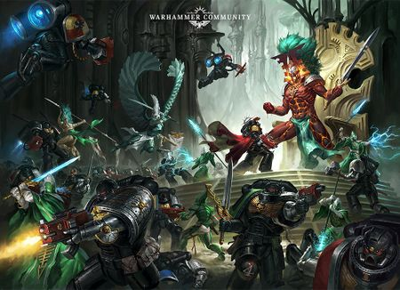

<!-- A0462-B0108 -->

原译文

Deathwatch battle Eldar 死亡守卫与灵族作战

**校订译文**

Deathwatch battle Eldar 死亡守望与灵族作战

<!-- /A0462-B0108 -->

<!-- A0462-B0109 -->
**英文原文**

Aquila Tactics are generalist, versatile tactics. These are used when the exact nature of an enemy force is unknown, either because of a simple lack of opportunity to gather information on an opponent or because the Deathwatch are facing a newly-discovered species or variety of xenos.

<!-- /A0462-B0109 -->

<!-- A0462-B0110 -->

原译文

天鹰战术是多面手、多才多艺的战术。当敌方部队的确切性质未知时，无论是因为缺乏收集对手信息的机会，还是因为死亡守望面临新发现的异型物种或品种，都会使用这些方法。

**校订译文**

天鹰战术通用而灵活，适用于尚不清楚敌人确切性质的情况：可能是缺乏搜集情报的机会，也可能是遇到了新发现的异形种族或变体。

<!-- /A0462-B0110 -->

<!-- A0462-B0111 -->
**英文原文**

Dominatus Tactics are designed to directly combat the most elite warriors of a xenos enemy, aiming to deny them a crucial resource.

<!-- /A0462-B0111 -->

<!-- A0462-B0112 -->

原译文

统御战术旨在直接对抗敌方最精锐的战士，旨在剥夺他们的关键资源。

**校订译文**

统御战术直接针对异形敌军最精锐的战士，旨在剥夺敌方这一关键战力。

<!-- /A0462-B0112 -->

<!-- A0462-B0113 -->
**英文原文**

Furor Tactics involve the delivery of explosive firepower across a wide frontage. By concentrating on tightly-packed hordes of their foes, corpses of the enemy slow the advances of those behind. They were developed by Squad Veridium during the War of the Beast to combat hordes of Orks, but have since been applied as anti-swarm tactics against many foes, most notably the Tyranids.

<!-- /A0462-B0113 -->

<!-- A0462-B0114 -->

原译文

狂热战术涉及在广阔的战线上发射爆炸性的火力。敌人的尸体集中在拥挤的敌人身上，减缓了后面敌人的前进速度。它们是由维瑞迪姆小队在野兽战争期间开发的，用于对抗成群的兽人，但此后被用作对抗许多敌人的反群战术，最著名的是泰伦。

**校订译文**

狂热战术将爆炸火力覆盖宽阔正面，集中打击密集敌群，使倒下的尸体进一步阻碍后续敌军推进。这套战术由维瑞迪姆小队在野兽战争中创立，用于对抗欧克大军，后来成为针对多种敌人的反群集战术，尤其适合迎战泰伦。

<!-- /A0462-B0114 -->

<!-- A0462-B0115 -->
**英文原文**

Malleus Tactics were first used by Captain Brontos on Rakkor IX against the Tyranids. Malleus tactics involve using Land Raiders to claim larger enemies before using Power Weapons to engage them in close combat.

<!-- /A0462-B0115 -->

<!-- A0462-B0116 -->

原译文

圣锤战术最早是由布朗托斯连长在拉科尔九号上对泰伦使用的。圣锤战术包括使用兰德掠袭者来吸引更大的敌人，然后使用动力武器与他们进行近距离战斗。

**校订译文**

布朗托斯连长最早在拉科尔九号迎战泰伦时使用圣锤战术：先以兰德掠袭者战车牵制大型敌人，再用动力武器与其近身交战。

**校注：** 英文 claim larger enemies 用法含糊，按原译所指吸引／牵制大型敌人处理；不擅自补入具体撞击或伏击步骤。

<!-- /A0462-B0116 -->

<!-- A0462-B0117 -->
**英文原文**

Purgatus Tactics were developed by the Librarian del Athyu and involve the application of utmost force on the leadership figures in alien hordes.

<!-- /A0462-B0117 -->

<!-- A0462-B0118 -->

原译文

净化战术是由智库德尔·阿休开发的，涉及对外星部落的领导人物施加最大的力量。

**校订译文**

净化战术由智库员德尔·阿休创立，集中最强大的力量打击异形军队的首领。

<!-- /A0462-B0118 -->

<!-- A0462-B0119 -->
**英文原文**

Venator Tactics were originally created by Jaaghen Khan to fight Wych Cults. Venator tactics involve using bikes and other fast units to engage in long running battles leading their fire, anchored by heavier units that hold at a particular location. The enemy is eventually struck by an encirclement maneuver that swings back to surround them.

<!-- /A0462-B0119 -->

<!-- A0462-B0120 -->

原译文

巡猎战术最初由贾根可汗创建，用于对抗女巫邪教。Venator战术包括使用自行车和其他快速单位进行长时间的战斗，由固定在特定位置的较重单位引导火力。敌人最终被一次包围机动击中，该机动会向后摆动以包围他们。Due to its vast mission the Deathwatch is scattered across the galaxy on Watch Fortresses and Watch Stations, the largest of which is Talasa Prime. Until the formation of the Great Rift Talasa Prime was also the primary training station of the Deathwatch, but the dangerous travel from Imperium Nihilus has seen this disrupted. It is said that within Imperium Nihilus such duties now fall to Fort Excalibris and Praefex Venatoris. Each Watch Fortress is a sovereign domain standing sentinel over an area of the Imperium, each having its own number of Watch Stations. The structure of most Watch Fortresses are identical, with ultimate responsibilities falling to a Watch Commander who is supported be a strategic council of Watch Captains and Lieutenants. Each Watch Fortress also has its own Librarius, Apothecarium, Armoury, and Reclusiam. The Watch Fortress Commander is the highest level of command within the Deathwatch, no single Chapter Master exists due to the vastness of their missions and deployments. However initially during the War of the Beast, the Deathwatch did have a Chapter Master.由于其庞大的任务，死亡守望分散在银河系的守望堡垒和守望空间站，其中最大的是塔拉萨一号。在大裂隙形成之前，塔拉萨一号也是死亡守望的主要训练空间站，但从帝国暗面出发的危险航行已经中断了这一点。据说，在帝国暗面内，这些职责现在落到了神剑堡和狩猎统领。每个守望要塞都是一个主权领地，守卫着帝国的一个地区，每个要塞都有自己的守望太空站。大多数守望堡垒的结构都是相同的，最终责任落在守望指挥官身上，由守望连长和副官组成的战略议会为其提供支持。每个守望堡垒都有自己的智库馆、药剂部、军械库和隐修室。守望要塞指挥官是死亡守望中的最高指挥级别，由于任务和部署的广泛性，没有单一的战团长存在。然而，最初在野兽战争期间，死亡守望确实有一个战团长。

**校订译文**

巡猎战术最初由贾根可汗创立，用于对抗巫灵教团。摩托及其他快速部队展开持续的机动作战、牵引敌方火力，较重的部队则固守特定位置，充当战术支点。机动部队最终回转合围，将敌人包围。

Due to its vast mission the Deathwatch is scattered across the galaxy on Watch Fortresses and Watch Stations, the largest of which is Talasa Prime. Until the formation of the Great Rift Talasa Prime was also the primary training station of the Deathwatch, but the dangerous travel from Imperium Nihilus has seen this disrupted. It is said that within Imperium Nihilus such duties now fall to Fort Excalibris and Praefex Venatoris. Each Watch Fortress is a sovereign domain standing sentinel over an area of the Imperium, each having its own number of Watch Stations. The structure of most Watch Fortresses are identical, with ultimate responsibilities falling to a Watch Commander who is supported be a strategic council of Watch Captains and Lieutenants. Each Watch Fortress also has its own Librarius, Apothecarium, Armoury, and Reclusiam. The Watch Fortress Commander is the highest level of command within the Deathwatch, no single Chapter Master exists due to the vastness of their missions and deployments. However initially during the War of the Beast, the Deathwatch did have a Chapter Master.

死亡守望肩负的任务范围极广，因此分驻银河各地的守望堡垒与守望站，其中规模最大的是塔拉萨主星。大裂隙出现前，它也是主要训练基地；帝国暗面通往此地的航路变得危险后，这一体系受到破坏。据说，暗面内的训练职责如今由神剑堡与狩猎统领堡承担。每座守望堡垒都是自主领地，警戒帝国的一片区域，下辖若干守望站。大多数堡垒组织相仿，守望指挥官负最终责任，由守望连长及副官组成的战略议会辅佐，另设智库、药剂部、军械库和隐修室。由于任务和部署遍布银河，守望堡垒指挥官已是死亡守望的最高指挥层级，并无一位统辖全军的战团长；不过，野兽战争初创时确曾设有这一职位。

**校注：** Praefex Venatoris 与 Fort Excalibris 在这里是承担训练职责的地点，原“狩猎统领”容易误读为个人职务，暂加堡。混合段落中的原英文已完整保留并分段。

<!-- /A0462-B0120 -->

<!-- A0462-B0121 图片 -->
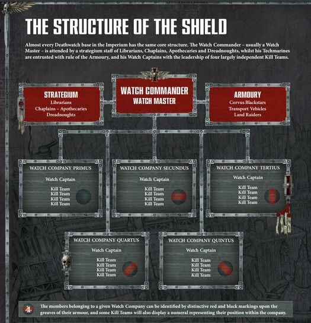

<!-- A0462-B0122 -->

原译文

Organization of a typical Deathwatch Watch Fortress 典型死亡守望堡垒的组织

**校订译文**

Organization of a typical Deathwatch Watch Fortress 典型死亡守望堡垒的组织

<!-- /A0462-B0122 -->

<!-- A0462-B0123 -->
**英文原文**

Each Watch Fortress typically has five Watch Companies, each of which is headed by a Watch Captain. Most Watch Companies are smaller than their Codex Astartes equivalents and usually comprise no more than 50 Battle-Brothers. Each Watch Company is then further divided into Kill-Teams, specialized combat units consisting of Marines from various Chapters. The formations of these Teams is extremely flexible and dependent upon their specific mission. No two Kill-Teams are ever the same, with one comprising Veterans wearing Terminator Armour while another may field Bikers and Jump Pack equipped infantry.

<!-- /A0462-B0123 -->

<!-- A0462-B0124 -->

原译文

每个守望要塞通常有五个守望连队，每个守望连队由一名守望连长领导。大多数守望连队都比他们的圣典阿斯塔特同行小，通常不超过50个战斗兄弟。然后，每个守望连队进一步分为杀戮小队，这是由来自不同战团的战士组成的专业战斗单位。这些小队的组成非常灵活，取决于他们的具体任务。没有两支杀戮小队是完全相同的，一支由穿着终结者盔甲的老兵组成，另一支可能由骑摩托的人和装备跳跃背包的步兵组成。

**校订译文**

每座守望堡垒通常下辖五个守望连，各由一名守望连长指挥。多数守望连比《阿斯塔特圣典》规定的标准连更小，通常不超过五十名战斗兄弟。连下再划分为杀戮小队，由来自不同战团的战士组成专门作战单位。小队编成完全服从任务，极为灵活：一队可能全是身穿终结者护甲的老兵，另一队则混编摩托骑手与配有跳跃背包的步兵。

<!-- /A0462-B0124 -->

<!-- A0462-B0125 -->
**英文原文**

The Deathwatch is highly integrated with the Ordo Xenos of the Inquisition, acting as its chamber Militant and frequently working alongside its Inquisitors.

<!-- /A0462-B0125 -->

<!-- A0462-B0126 -->

原译文

死亡守望与审判庭的攘外修会高度整合，充当其军事辅军，并经常与审判庭一起工作。

**校订译文**

死亡守望与异形审判庭紧密结合，充当其军事分支，经常与该庭审判官并肩行动。

<!-- /A0462-B0126 -->

<!-- A0462-B0127 -->
### Deathwatch ranks and positions 死亡守望等级与职责

<!-- /A0462-B0127 -->

<!-- A0462-B0128 -->
**英文原文**

Watch Commander (Chapter Master)

<!-- /A0462-B0128 -->

<!-- A0462-B0129 -->

原译文

守望指挥官（战团长）

**校订译文**

守望指挥官（战团长）

<!-- /A0462-B0129 -->

<!-- A0462-B0130 -->

原译文

Watch Master 守望大师

**校订译文**

Watch Master 守望堡主

<!-- /A0462-B0130 -->

<!-- A0462-B0131 -->

原译文

Watch Captain 守望连长

**校订译文**

Watch Captain 守望连长

<!-- /A0462-B0131 -->

<!-- A0462-B0132 -->

原译文

Watch Lieutenant 守望副官

**校订译文**

Watch Lieutenant 守望副官

<!-- /A0462-B0132 -->

<!-- A0462-B0133 -->

原译文

Deathwatch Chaplain 死亡守望牧师

**校订译文**

Deathwatch Chaplain 死亡守望教士

<!-- /A0462-B0133 -->

<!-- A0462-B0134 -->

原译文

Deathwatch Apothecary 死亡守望药剂师

**校订译文**

Deathwatch Apothecary 死亡守望药剂师

<!-- /A0462-B0134 -->

<!-- A0462-B0135 -->

原译文

Deathwatch Librarian 死亡守望智库

**校订译文**

Deathwatch Librarian 死亡守望智库员

<!-- /A0462-B0135 -->

<!-- A0462-B0136 -->

原译文

Deathwatch Epistolary 死亡守望星语官

**校订译文**

Deathwatch Epistolary 死亡守望星语官

<!-- /A0462-B0136 -->

<!-- A0462-B0137 -->

原译文

Deathwatch Techmarine 死亡守望技术军士

**校订译文**

Deathwatch Techmarine 死亡守望科技战士

<!-- /A0462-B0137 -->

<!-- A0462-B0138 -->

原译文

Deathwatch Forge Master 死亡守望铸造大师

**校订译文**

Deathwatch Forge Master 死亡守望铸造大师

<!-- /A0462-B0138 -->

<!-- A0462-B0139 -->

原译文

Castellan of the Black Vault 黑库堡主

**校订译文**

Castellan of the Black Vault 黑库堡主

<!-- /A0462-B0139 -->

<!-- A0462-B0140 -->

原译文

Deathwatch Dreadnought 死亡守望无畏

**校订译文**

Deathwatch Dreadnought 死亡守望无畏机甲

<!-- /A0462-B0140 -->

<!-- A0462-B0141 -->

原译文

Deathwatch Keeper 死亡守望守护者

**校订译文**

Deathwatch Keeper 死亡守望守护者

<!-- /A0462-B0141 -->

<!-- A0462-B0142 -->

原译文

Deathwatch Champion 死亡守望冠军

**校订译文**

Deathwatch Champion 死亡守望冠军

<!-- /A0462-B0142 -->

<!-- A0462-B0143 -->

原译文

Deathwatch First Company Veteran 死亡守望第一连队老兵

**校订译文**

Deathwatch First Company Veteran 死亡守望第一连队老兵

<!-- /A0462-B0143 -->

<!-- A0462-B0144 -->

原译文

Terminator Squad 终结者小队

**校订译文**

Terminator Squad 终结者小队

<!-- /A0462-B0144 -->

<!-- A0462-B0145 -->

原译文

Sternguard Veteran Squad 肃卫老兵小队

**校订译文**

Sternguard Veteran Squad 肃卫老兵小队

<!-- /A0462-B0145 -->

<!-- A0462-B0146 -->

原译文

Deathwatch Kill-marine 死亡守望杀戮战士

**校订译文**

Deathwatch Kill-marine 死亡守望杀戮战士

<!-- /A0462-B0146 -->

<!-- A0462-B0147 -->

原译文

Deathwatch Black Shield 死亡守望黑盾

**校订译文**

Deathwatch Black Shield 死亡守望黑盾

<!-- /A0462-B0147 -->

<!-- A0462-B0148 -->

原译文

Tactical Marine 战术战士

**校订译文**

Tactical Marine 战术战士

<!-- /A0462-B0148 -->

<!-- A0462-B0149 -->

原译文

Assault Marine 突击战士

**校订译文**

Assault Marine 突击战士

<!-- /A0462-B0149 -->

<!-- A0462-B0150 -->

原译文

Devastator Marine 毁灭者战士

**校订译文**

Devastator Marine 破坏者战士

<!-- /A0462-B0150 -->

<!-- A0462-B0151 -->

原译文

Intercessor Squad 仲裁者小队

**校订译文**

Intercessor Squad 仲裁者小队

<!-- /A0462-B0151 -->

<!-- A0462-B0152 -->

原译文

Assault Intercessor Squad 突击仲裁者小队

**校订译文**

Assault Intercessor Squad 突击仲裁者小队

<!-- /A0462-B0152 -->

<!-- A0462-B0153 -->

原译文

Heavy Intercessor Squad 重装仲裁者小队

**校订译文**

Heavy Intercessor Squad 重装仲裁者小队

<!-- /A0462-B0153 -->

<!-- A0462-B0154 -->

原译文

Inceptor Squad 先驱者小队

**校订译文**

Inceptor Squad 先驱者小队

<!-- /A0462-B0154 -->

<!-- A0462-B0155 -->

原译文

Hellblaster Squad 地狱轰击者小队

**校订译文**

Hellblaster Squad 地狱轰击者小队

<!-- /A0462-B0155 -->

<!-- A0462-B0156 -->

原译文

Aggressor Squad 侵略者小队

**校订译文**

Aggressor Squad 侵略者小队

<!-- /A0462-B0156 -->

<!-- A0462-B0157 -->

原译文

Reiver Squad 掠夺者小队

**校订译文**

Reiver Squad 掠夺者小队

<!-- /A0462-B0157 -->

<!-- A0462-B0158 -->

原译文

Eradicator Squad 根除者小队

**校订译文**

Eradicator Squad 根除者小队

<!-- /A0462-B0158 -->

<!-- A0462-B0159 -->

原译文

Elminator Squad 歼灭者小队

**校订译文**

Elminator Squad 歼灭者小队

<!-- /A0462-B0159 -->

<!-- A0462-B0160 -->

原译文

Incursor Squad 入侵者小队

**校订译文**

Incursor Squad 入侵者小队

<!-- /A0462-B0160 -->

<!-- A0462-B0161 -->

原译文

Infiltrator Squad 渗透者小队Equipment 装备Deathwatch members have access to a range of specialist equipment such as the Stalker Boltgun and variant bolter ammunition such as Inferno Bolts, Cryo-Shells, Kraken Penetrator Rounds, Metal Storm Frag Shells and Stalker Silenced Shells. Their devastating array of weaponry includes carapace-shredding Shotgun shells known as Xenospurges and grenades containing chemically altered promethium. Ammunition canisters of phasic plasma and amplifiers that saturate grav-fields with warped ions are among their most closely guarded secrets. Their molecular realignment fields of Xenophase Blades in particular arouse interest most radical Xenarite cults of Tech-Priests. Their technology is not only designed to kill but also includes Archaeotech to disrupt alien mechanichanisms such as Ork engines and Eldar psychomaterials.死亡守望成员可以使用一系列专业装备，如追猎者爆矢枪和变体爆矢弹药，如炼狱爆矢、冷冻弹药、克拉肯穿透弹药、金属风暴破片弹药和追猎者静音弹药。他们毁灭性的武器包括被称为净化异型的碎甲霰弹枪和含有化学改性钷的手榴弹。相位等离子体弹药罐和用扭曲离子充满重力场的放大器是他们最严格保密的秘密之一。他们的异型相位刃的分子重组立场尤其引起了技术神甫中最激进的异务派的兴趣。他们的技术不仅旨在杀人，还包括考古技术来破坏欧克引擎和灵族灵能材料等外星机械。

**校订译文**

Infiltrator Squad 渗透者小队

Equipment 装备

Deathwatch members have access to a range of specialist equipment such as the Stalker Boltgun and variant bolter ammunition such as Inferno Bolts, Cryo-Shells, Kraken Penetrator Rounds, Metal Storm Frag Shells and Stalker Silenced Shells. Their devastating array of weaponry includes carapace-shredding Shotgun shells known as Xenospurges and grenades containing chemically altered promethium. Ammunition canisters of phasic plasma and amplifiers that saturate grav-fields with warped ions are among their most closely guarded secrets. Their molecular realignment fields of Xenophase Blades in particular arouse interest most radical Xenarite cults of Tech-Priests. Their technology is not only designed to kill but also includes Archaeotech to disrupt alien mechanichanisms such as Ork engines and Eldar psychomaterials.

死亡守望能够使用多种专门装备，包括追猎者爆矢枪，以及炼狱爆矢弹、冷冻弹、克拉肯穿透弹、金属风暴破片弹和追猎者消音弹等特殊弹药。他们的强大武库还包括可撕裂甲壳、称为“净化异形”的霰弹，以及装填经过化学改性的钷素的手榴弹。相位等离子弹药罐和向重力场注入扭曲离子的增幅器，都是最严密保守的秘密。异形相位刃的分子重排力场，尤其引起了技术祭司中激进异技派的兴趣。他们的技术不仅用于杀伤，也包括能干扰欧克引擎、灵族灵能材料等异形装置的考古科技。

**校注：** Xenospurges 指霰弹弹药而非整把霰弹枪；realignment fields 为分子重排力场，原译“立场”错误。mechanichanisms 为英文误拼，未改原文。

<!-- /A0462-B0161 -->

<!-- A0462-B0162 图片 -->
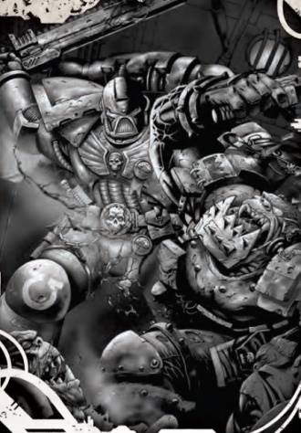

<!-- A0462-B0163 -->

原译文

Deathwatch battles Orks 死亡守望与欧克作战

**校订译文**

Deathwatch battles Orks 死亡守望与欧克作战

<!-- /A0462-B0163 -->

<!-- A0462-B0164 -->
**英文原文**

The Deathwatch is freed from the usual technological dogma that plagues the Imperium and their arsenal also consists of vast amounts of Xenos technology. Their wargear is highly specialized and reflects the varied requirements of their mission and vast array of potential threats. Development of weapons often includes Apothecaries, who specialize in analyzing maximum bio-damage to enemy xenos. Their equipment is produced by specifically vetted Tech-Priests sworn to secrecy and regularly put under hypno-therapy to allow for maximum discretion.

<!-- /A0462-B0164 -->

<!-- A0462-B0165 -->

原译文

死亡守望摆脱了困扰帝国的常规技术教条，他们的武器库也包括大量的异型科技。他们的作战装备高度专业化，反映了他们任务的不同要求和大量潜在威胁。武器的开发通常包括药剂师，他们专门分析对敌方异型的最大生物损伤。他们的装备由经过专门审查的技术神甫生产，他们宣誓保密，并定期接受催眠，以获得最大的自由裁量权。

**校订译文**

死亡守望不受帝国通常的技术教条束缚，武库中也收藏大量异形技术。其装备高度专门化，以满足多样的任务需求、应对各种潜在威胁。药剂师常参与武器研发，分析怎样对敌方异形造成最大的生理损伤。装备由经过严格甄选的技术祭司制造；他们须宣誓保密，并定期接受催眠处理，确保绝不泄密。

<!-- /A0462-B0165 -->

<!-- A0462-B0166 -->
**英文原文**

The most widely used aircraft by the Deathwatch is the Chapter-exclusive Corvus Blackstar.

<!-- /A0462-B0166 -->

<!-- A0462-B0167 -->

原译文

死亡守望使用最广泛的飞行器是战团独有的渡鸦黑星。

**校订译文**

死亡守望使用最广泛的飞行器是战团独有的黑星渡鸦。

<!-- /A0462-B0167 -->

<!-- A0462-B0168 -->
### Imperial Navy Pilots 帝国海军飞行员

<!-- /A0462-B0168 -->

<!-- A0462-B0169 -->
**英文原文**

The Ordo Xenos recruits decorated veterans of the Imperial Navy, to pilot the Deathwatch's aircraft the Ordo possesses. This is due to the Ordo Xenos deeming the Deathwatch to be too important to be left in in their aircrafts' cockpits, instead of carrying out the Ordo's missions. The Imperial Navy veterans are lured into serving the Ordo Xenos with the promise of piloting unparalleled aircraft, the use of technological resources and attaining honor and glory. Those that accept the offer are then heavily modified and permanently fused into the aircraft, so that they become the machines' living brains. The result is highly effective, as the aircraft become the pilots' bodies and will respond to their thoughts, in much the same way as power armor responds to Space Marines. Some members of the Deathwatch do not approve of this, however, as they feel Humans piloting Space Marine aircraft is unheard of.

<!-- /A0462-B0169 -->

<!-- A0462-B0170 -->

原译文

攘外修会招募了帝国海军的老兵，驾驶修会拥有的死亡守望飞行器。这是因为攘外修会认为死亡守望太重要了，不能把它留在飞机的驾驶舱里，而不能执行修会的任务。帝国海军老兵被吸引到攘外修会服役，承诺驾驶无与伦比的飞机，利用技术资源并获得荣誉和荣耀。接受该提议的人随后会被大量改造并永久融合到飞行器中，使其成为机械的活体大脑。结果非常有效，因为飞机成为驾驶员的身体，并会对他们的想法做出反应，就像动力盔甲对星际战士的反应一样。然而，死亡守望的一些成员并不赞成这一点，因为他们觉得人类驾驶星际战士飞行器是闻所未闻的。

**校订译文**

异形审判庭招募功勋卓著的帝国海军老兵，驾驶其拥有的死亡守望飞行器。审判庭认为，死亡守望战士太过宝贵，应当执行战斗任务，而非留在驾驶舱里。它以驾驶无与伦比的飞行器、使用先进技术资源并赢得荣耀为诱因，吸引海军老兵应征。接受者随后被大幅改造，与飞行器永久融合，成为机械的活体大脑。效果十分出色：飞行器如同驾驶员的身体，能够响应其思想，就像动力甲响应星际战士一样。不过，有些死亡守望成员并不赞成，因为让凡人驾驶星际战士飞行器，在他们看来闻所未闻。

<!-- /A0462-B0170 -->

<!-- A0462-B0171 -->
### Chapter Fleet 战团舰队

<!-- /A0462-B0171 -->

<!-- A0462-B0172 -->
**英文原文**

The Deathwatch operates its own fleet, and most notable of these ships are Kill-ships, specialized bombardment craft to enact Exterminatus upon worlds lost to the Imperium. The Deathwatch often deploys from Inquisitorial Black Ships for planetary strike operations.

<!-- /A0462-B0172 -->

<!-- A0462-B0173 -->

原译文

死亡守望拥有自己的舰队，其中最著名的是杀戮舰，这是一种专门的轰炸飞船，可以在帝国陷落的世界上实施灭绝令。死亡守望经常从审判庭的黑船上部署行星打击行动。

**校订译文**

死亡守望拥有自己的舰队，其中最具代表性的是杀戮舰：专门对帝国已经失去的世界执行灭绝令的轰炸舰。死亡守望也常以审判庭黑船为出发平台，对行星发动突袭。

<!-- /A0462-B0173 -->

<!-- A0462-B0174 图片 -->
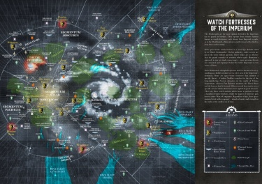

<!-- A0462-B0175 -->

原译文

Deployments of the Deathwatch across the Galaxy 死亡守望跨越银河系的部署

**校订译文**

Deployments of the Deathwatch across the Galaxy 死亡守望跨越银河系的部署

<!-- /A0462-B0175 -->

<!-- A0462-B0176 -->
### Notable ships of the Deathwatch 著名死亡守望舰船

<!-- /A0462-B0176 -->

<!-- A0462-B0177 -->
**英文原文**

Eye of Retribution — Frigate.

<!-- /A0462-B0177 -->

<!-- A0462-B0178 -->

原译文

报复之眼 — 护卫舰

**校订译文**

报复之眼号——护卫舰

<!-- /A0462-B0178 -->

<!-- A0462-B0179 -->
**英文原文**

Fatal Redress — Rapid Strike Vessel.

<!-- /A0462-B0179 -->

<!-- A0462-B0180 -->

原译文

致命补救 — 快速打击战舰。

**校订译文**

致命补救号——快速打击战舰。

<!-- /A0462-B0180 -->

<!-- A0462-B0181 -->
**英文原文**

Final Mercy — Rapid Strike Vessel.

<!-- /A0462-B0181 -->

<!-- A0462-B0182 -->

原译文

最终仁慈 — 快速打击战舰。

**校订译文**

最终仁慈号——快速打击战舰。

<!-- /A0462-B0182 -->

<!-- A0462-B0183 -->
**英文原文**

Hallowed Sword — Nova Class Frigate.

<!-- /A0462-B0183 -->

<!-- A0462-B0184 -->

原译文

圣剑 — 新星级护卫舰。

**校订译文**

圣剑号——新星级护卫舰。

<!-- /A0462-B0184 -->

<!-- A0462-B0185 -->
**英文原文**

Lance of Darkness — Nova Class Frigate.

<!-- /A0462-B0185 -->

<!-- A0462-B0186 -->

原译文

黑暗长枪 — 新星级护卫舰。

**校订译文**

黑暗长枪号——新星级护卫舰。

<!-- /A0462-B0186 -->

<!-- A0462-B0187 -->
**英文原文**

Nemesis — Strike Cruiser.

<!-- /A0462-B0187 -->

<!-- A0462-B0188 -->

原译文

复仇女神 — 打击巡洋舰。

**校订译文**

复仇女神号——打击巡洋舰。

<!-- /A0462-B0188 -->

<!-- A0462-B0189 -->
**英文原文**

Pyre Imperius — Strike Cruiser

<!-- /A0462-B0189 -->

<!-- A0462-B0190 -->

原译文

帝国柴薪 — 打击巡洋舰

**校订译文**

帝国柴薪号——打击巡洋舰

<!-- /A0462-B0190 -->

<!-- A0462-B0191 -->
**英文原文**

Robidoux — Strike Cruiser.

<!-- /A0462-B0191 -->

<!-- A0462-B0192 -->

原译文

罗比杜 — 打击巡洋舰。

**校订译文**

罗比杜号——打击巡洋舰。

<!-- /A0462-B0192 -->

<!-- A0462-B0193 -->
**英文原文**

Silent Slayer — Strike Cruiser.

<!-- /A0462-B0193 -->

<!-- A0462-B0194 -->

原译文

寂静屠杀者 — 打击巡洋舰

**校订译文**

寂静屠杀者号——打击巡洋舰

<!-- /A0462-B0194 -->

<!-- A0462-B0195 -->
**英文原文**

Spear of Fury — Hunter Class Destroyer.

<!-- /A0462-B0195 -->

<!-- A0462-B0196 -->

原译文

愤怒之矛 — 猎手级驱逐舰

**校订译文**

愤怒之矛号——猎手级驱逐舰

<!-- /A0462-B0196 -->

<!-- A0462-B0197 -->
**英文原文**

Thunder’s Word — Gladius Class Frigate.

<!-- /A0462-B0197 -->

<!-- A0462-B0198 -->

原译文

雷霆之语 — 短剑级护卫舰

**校订译文**

雷霆之语号——短剑级护卫舰

<!-- /A0462-B0198 -->

<!-- A0462-B0199 -->
**英文原文**

Wrathbringer — Strike Cruiser.

<!-- /A0462-B0199 -->

<!-- A0462-B0200 -->

原译文

愤怒使者 — 打击巡洋舰Notable Kill-Teams 著名杀戮小队

**校订译文**

愤怒使者号——打击巡洋舰。

Notable Kill-Teams 著名杀戮小队

<!-- /A0462-B0200 -->

<!-- A0462-B0201 -->

原译文

The Fearless 无畏者

**校订译文**

The Fearless 无畏者

<!-- /A0462-B0201 -->

<!-- A0462-B0202 -->

原译文

Kill Team Artemis 阿尔忒弥斯杀戮小队

**校订译文**

Kill Team Artemis 阿尔忒弥斯杀戮小队

<!-- /A0462-B0202 -->

<!-- A0462-B0203 -->

原译文

Kill Team Cassius 卡西乌斯杀戮小队

**校订译文**

Kill Team Cassius 卡西乌斯杀戮小队

<!-- /A0462-B0203 -->

<!-- A0462-B0204 -->

原译文

Kill Team Azkarael 阿扎瑞尔杀戮小队

**校订译文**

Kill Team Azkarael 阿扎瑞尔杀戮小队

<!-- /A0462-B0204 -->

<!-- A0462-B0205 -->

原译文

Kill Team Brontos 勃朗特杀戮小队

**校订译文**

Kill Team Brontos 布朗托斯杀戮小队

<!-- /A0462-B0205 -->

<!-- A0462-B0206 -->

原译文

Kill Team Excis 切除杀戮小队

**校订译文**

Kill Team Excis 埃克西斯杀戮小队

<!-- /A0462-B0206 -->

<!-- A0462-B0207 -->

原译文

Kill Team Talon 利爪杀戮小队

**校订译文**

Kill Team Talon 利爪杀戮小队

<!-- /A0462-B0207 -->

<!-- A0462-B0208 -->

原译文

Kill Team Vorens 沃伦斯杀戮小队

**校订译文**

Kill Team Vorens 沃伦斯杀戮小队

<!-- /A0462-B0208 -->

<!-- A0462-B0209 -->

原译文

Squad Veridium 维尔迪姆小队Notable Members 著名成员

**校订译文**

Squad Veridium 维瑞迪姆小队

Notable Members 著名成员

<!-- /A0462-B0209 -->

<!-- A0462-B0210 图片 -->
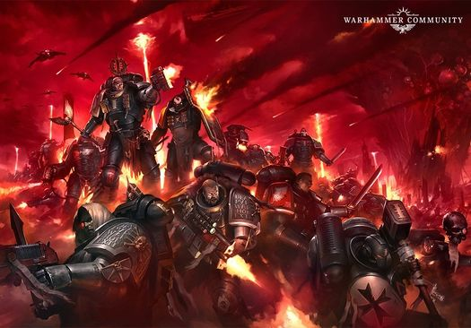

<!-- A0462-B0211 -->

原译文

Deathwatch Forces 死亡守望部队

**校订译文**

Deathwatch Forces 死亡守望部队

<!-- /A0462-B0211 -->

<!-- A0462-B0212 -->
### Watch Commanders 守望指挥官

<!-- /A0462-B0212 -->

<!-- A0462-B0213 -->
**英文原文**

Asger Warfist of the Space Wolves- The first Watch Commander of the Deathwatch.

<!-- /A0462-B0213 -->

<!-- A0462-B0214 -->

原译文

太空野狼的阿斯格·战拳 - 死亡守望的第一任守望指挥官

**校订译文**

太空野狼的阿斯格·战拳 - 死亡守望的第一任守望指挥官

<!-- /A0462-B0214 -->

<!-- A0462-B0215 -->

原译文

Gideon Borleos 吉迪恩·博莱奥斯

**校订译文**

Gideon Borleos 吉迪恩·博莱奥斯

<!-- /A0462-B0215 -->

<!-- A0462-B0216 -->

原译文

Valesnus 瓦莱斯诺斯Watch Masters 守望大师

**校订译文**

Valesnus 瓦莱斯诺斯

Watch Masters 守望堡主

<!-- /A0462-B0216 -->

<!-- A0462-B0217 -->

原译文

Mordelai of the Imperial Fists 帝国之拳的莫迪莱

**校订译文**

Mordelai of the Imperial Fists 帝国之拳的莫迪莱

<!-- /A0462-B0217 -->

<!-- A0462-B0218 -->

原译文

Alathresis of the Novamarines 新星战士的阿拉斯瑞斯

**校订译文**

Alathresis of the Novamarines 新星战士的阿拉瑟瑞斯

**校注：** 同一人物姓名统一采用本稿较早篇章的译法。

<!-- /A0462-B0218 -->

<!-- A0462-B0219 -->

原译文

Astoren Korr 阿斯特伦·科尔

**校订译文**

Astoren Korr 阿斯特伦·科尔

<!-- /A0462-B0219 -->

<!-- A0462-B0220 -->

原译文

Feron 费龙

**校订译文**

Feron 费龙

<!-- /A0462-B0220 -->

<!-- A0462-B0221 -->

原译文

Utorian Denash 托里安•迪纳什

**校订译文**

Utorian Denash 乌托里安·迪纳什

<!-- /A0462-B0221 -->

<!-- A0462-B0222 -->

原译文

Vaedrian Shenol 韦德里安·谢诺

**校订译文**

Vaedrian Shenol 韦德里安·谢诺

<!-- /A0462-B0222 -->

<!-- A0462-B0223 -->

原译文

Vilnus 维尔纽斯Watch Captains 守望连长

**校订译文**

Vilnus 维尔纽斯

Watch Captains 守望连长

<!-- /A0462-B0223 -->

<!-- A0462-B0224 -->
**英文原文**

Brother-Captain Uriel Ventris of the Ultramarines.

<!-- /A0462-B0224 -->

<!-- A0462-B0225 -->

原译文

极限战士的兄弟连长乌瑞尔·文崔斯

**校订译文**

极限战士的兄弟连长乌瑞尔·文崔斯

<!-- /A0462-B0225 -->

<!-- A0462-B0226 -->
**英文原文**

Brother-Captain Bannon of the Imperial Fists. Killed by Tyranids on Tarsis Ultra.

<!-- /A0462-B0226 -->

<!-- A0462-B0227 -->

原译文

帝国之拳的兄弟连长班农，在塔西斯·极限上被泰伦杀死

**校订译文**

帝国之拳的兄弟连长班农，在塔西斯·极限上被泰伦杀死

<!-- /A0462-B0227 -->

<!-- A0462-B0228 -->
**英文原文**

Brother-Captain Artemis of the Mortifactors.

<!-- /A0462-B0228 -->

<!-- A0462-B0229 -->

原译文

苦行者的兄弟连长阿尔忒弥斯

**校订译文**

苦行者的兄弟连长阿尔忒弥斯

<!-- /A0462-B0229 -->

<!-- A0462-B0230 -->
**英文原文**

Brother-Captain Quiron Octavius of the Imperial Fists. Killed by a Dark Eldar Talos.

<!-- /A0462-B0230 -->

<!-- A0462-B0231 -->

原译文

帝国之拳的兄弟连长奎伦·奥克塔维斯，被黑暗领主利爪杀死

**校订译文**

帝国之拳的连长奎伦·奥克塔维斯，遭黑暗灵族的塔洛斯杀死。

<!-- /A0462-B0231 -->

<!-- A0462-B0232 -->
**英文原文**

Lothar Redfang - Space Wolves

<!-- /A0462-B0232 -->

<!-- A0462-B0233 -->

原译文

洛萨·红牙 - 太空野狼

**校订译文**

洛萨·红牙 - 太空野狼

<!-- /A0462-B0233 -->

<!-- A0462-B0234 -->

原译文

Captain Daxis 连长达西斯

**校订译文**

Captain Daxis 连长达西斯

<!-- /A0462-B0234 -->

<!-- A0462-B0235 -->
**英文原文**

Captain Alessio Cortez - Master of the Charge, Nigh-invulnerable Captain of the 4th Company.

<!-- /A0462-B0235 -->

<!-- A0462-B0236 -->

原译文

连长阿莱西奥·科尔特斯 - 冲锋大师，近乎无敌的第四连队连长

**校订译文**

连长阿莱西奥·科尔特斯 - 冲锋大师，近乎无敌的第四连队连长

<!-- /A0462-B0236 -->

<!-- A0462-B0237 -->

原译文

Esteban de Dominova 埃斯特万·德·多米诺万

**校订译文**

Esteban de Dominova 埃斯特万·德·多米诺万

<!-- /A0462-B0237 -->

<!-- A0462-B0238 -->

原译文

Mathias 马蒂亚斯

**校订译文**

Mathias 马蒂亚斯

<!-- /A0462-B0238 -->

<!-- A0462-B0239 -->

原译文

Kail Vibius 凯尔·维比乌斯

**校订译文**

Kail Vibius 凯尔·维比乌斯

<!-- /A0462-B0239 -->

<!-- A0462-B0240 -->

原译文

Andar Scarion 安达尔·斯凯瑞恩

**校订译文**

Andar Scarion 安达尔·斯凯瑞恩

<!-- /A0462-B0240 -->

<!-- A0462-B0241 -->

原译文

Marius Avincus 马里乌斯·阿文科斯

**校订译文**

Marius Avincus 马里乌斯·阿文科斯

<!-- /A0462-B0241 -->

<!-- A0462-B0242 -->

原译文

Peratos 佩拉托斯

**校订译文**

Peratos 佩拉托斯

<!-- /A0462-B0242 -->

<!-- A0462-B0243 -->

原译文

Brontos 勃朗特

**校订译文**

Brontos 布朗托斯

<!-- /A0462-B0243 -->

<!-- A0462-B0244 -->

原译文

Holgjar Ironfang of the Space Wolves 太空野狼的霍尔加尔·铁牙

**校订译文**

Holgjar Ironfang of the Space Wolves 太空野狼的霍尔加尔·铁牙

<!-- /A0462-B0244 -->

<!-- A0462-B0245 图片 -->
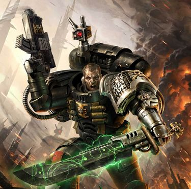

<!-- A0462-B0246 -->

原译文

Deathwatch Space Marine 死亡守望星际战士

**校订译文**

Deathwatch Space Marine 死亡守望星际战士

<!-- /A0462-B0246 -->

<!-- A0462-B0247 -->
### Librarians 智库员

原题：Librarians 智库

<!-- /A0462-B0247 -->

<!-- A0462-B0248 -->

原译文

Librarian Ashok of the Angels Sanguine 血红天使的智库阿肖克

**校订译文**

Librarian Ashok of the Angels Sanguine 鲜血天使的智库员阿肖克

<!-- /A0462-B0248 -->

<!-- A0462-B0249 -->

原译文

Librarian Shaidan of the Mantis Warriors 螳螂勇士的智库沙伊丹

**校订译文**

Librarian Shaidan of the Mantis Warriors 螳螂勇士的智库员沙伊丹

<!-- /A0462-B0249 -->

<!-- A0462-B0250 -->
**英文原文**

Codicer Librarian Lyandro Karras of the Death Spectres

<!-- /A0462-B0250 -->

<!-- A0462-B0251 -->

原译文

死亡幽灵的典记员智库莱安德罗·卡拉斯

**校订译文**

死亡幽灵的典记员级智库员莱安德罗·卡拉斯

<!-- /A0462-B0251 -->

<!-- A0462-B0252 -->

原译文

Librarian Andreas 智库安德烈亚斯

**校订译文**

Librarian Andreas 智库员安德烈亚斯

<!-- /A0462-B0252 -->

<!-- A0462-B0253 -->

原译文

Epistolary Zadkiel 星语官扎德基尔

**校订译文**

Epistolary Zadkiel 星语官扎德基尔

<!-- /A0462-B0253 -->

<!-- A0462-B0254 -->

原译文

Codicier Jensus Natorian of the Blood Ravens 血鸦的典记员詹瑟斯·纳托里安

**校订译文**

Codicier Jensus Natorian of the Blood Ravens 血鸦的典记员詹瑟斯·纳托里安

<!-- /A0462-B0254 -->

<!-- A0462-B0255 -->

原译文

Codicier Velim 典记员维林

**校订译文**

Codicier Velim 典记员维林

<!-- /A0462-B0255 -->

<!-- A0462-B0256 -->

原译文

Codicier Kaelar of the Celestial Lions 天狮的典记员凯拉Chaplains 牧师

**校订译文**

Codicier Kaelar of the Celestial Lions 天狮的典记员凯拉

Chaplains 教士

<!-- /A0462-B0256 -->

<!-- A0462-B0257 -->

原译文

Chaplain Broec of the Black Templars 黑色圣堂的牧师布罗克

**校订译文**

Chaplain Broec of the Black Templars 黑色圣堂的教士布罗克

<!-- /A0462-B0257 -->

<!-- A0462-B0258 -->

原译文

Ortan Cassius of the Ultramarines 极限战士的奥坦·卡西乌斯

**校订译文**

Ortan Cassius of the Ultramarines 极限战士的奥坦·卡西乌斯

<!-- /A0462-B0258 -->

<!-- A0462-B0259 -->

原译文

Idemon 艾迪蒙

**校订译文**

Idemon 艾迪蒙

<!-- /A0462-B0259 -->

<!-- A0462-B0260 -->

原译文

Brother Vigilant 维吉兰特兄弟Techmarines 技术军士

**校订译文**

Brother Vigilant 维吉兰特兄弟

Techmarines 科技战士

<!-- /A0462-B0260 -->

<!-- A0462-B0261 -->

原译文

Master of the Forge Xerill of the Iron Hands. 钢铁之手的铸造大师薛瑞尔Apothecaries 药剂师

**校订译文**

Master of the Forge Xerill of the Iron Hands. 钢铁之手的铸造大师薛瑞尔

Apothecaries 药剂师

<!-- /A0462-B0261 -->

<!-- A0462-B0262 -->

原译文

Kregor Thann 克雷戈尔·坦恩Dreadnoughts 无畏

**校订译文**

Kregor Thann 克雷戈尔·坦恩

Dreadnoughts 无畏机甲

<!-- /A0462-B0262 -->

<!-- A0462-B0263 -->

原译文

Dreadnought Chyron of the Lamenters 恸哭者的无畏凯隆

**校订译文**

Dreadnought Chyron of the Lamenters 恸哭者的无畏机甲凯隆

<!-- /A0462-B0263 -->

<!-- A0462-B0264 -->

原译文

Dreadnought Szobczak of the Imperial Fists 帝国之拳的无畏斯佐贝扎克

**校订译文**

Dreadnought Szobczak of the Imperial Fists 帝国之拳的无畏机甲斯佐贝扎克

<!-- /A0462-B0264 -->

<!-- A0462-B0265 -->

原译文

Dreadnought Nihilus 无畏尼希勒斯

**校订译文**

Dreadnought Nihilus 无畏机甲尼希勒斯

<!-- /A0462-B0265 -->

<!-- A0462-B0266 -->

原译文

Dreadnought Xandor 无畏赞多尔

**校订译文**

Dreadnought Xandor 无畏机甲赞多尔

<!-- /A0462-B0266 -->

<!-- A0462-B0267 图片 -->
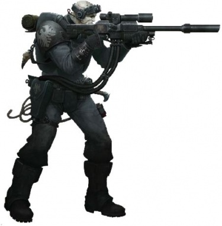

<!-- A0462-B0268 -->

原译文

Deathwatch Scout (Raven Guard) 死亡守望侦察兵（暗鸦守卫）

**校订译文**

Deathwatch Scout (Raven Guard) 死亡守望侦察兵（暗鸦守卫）

<!-- /A0462-B0268 -->

<!-- A0462-B0269 -->
### Others 其他

<!-- /A0462-B0269 -->

<!-- A0462-B0270 -->
**英文原文**

Sergeant Grevius of the Crimson Fists. Killed by a Tyranid Lictor on Herodian IV.

<!-- /A0462-B0270 -->

<!-- A0462-B0271 -->

原译文

绯红之拳的军士格雷维斯。在赫罗提安四号被泰伦利卡特杀死。

**校订译文**

绯红之拳的军士格雷维斯，在赫罗提安四号被一只泰伦刀斧虫杀死。

<!-- /A0462-B0271 -->

<!-- A0462-B0272 -->

原译文

Sergeant Gjunheim 军士格琼海姆

**校订译文**

Sergeant Gjunheim 军士格琼海姆

<!-- /A0462-B0272 -->

<!-- A0462-B0273 -->

原译文

Sergeant Soron of the Mantis Warriors. 螳螂勇士的军士索伦

**校订译文**

Sergeant Soron of the Mantis Warriors. 螳螂勇士的军士索伦

<!-- /A0462-B0273 -->

<!-- A0462-B0274 -->

原译文

Sergeant Pasanius of the Ultramarines. 极限战士的军士帕萨尼乌斯

**校订译文**

Sergeant Pasanius of the Ultramarines. 极限战士的军士帕撒尼乌斯

**校注：** 同一人物姓名统一采用本稿较早篇章的译法。

<!-- /A0462-B0274 -->

<!-- A0462-B0275 -->

原译文

Sergeant Crull of the Flesh Tearers. 撕肉者的军士克鲁尔

**校订译文**

Sergeant Crull of the Flesh Tearers. 撕肉者的军士克鲁尔

<!-- /A0462-B0275 -->

<!-- A0462-B0276 -->

原译文

Sergeant Galatael of the Blood Angels. 圣血天使的军士加拉泰

**校订译文**

Sergeant Galatael of the Blood Angels. 圣血天使的军士加拉泰

<!-- /A0462-B0276 -->

<!-- A0462-B0277 -->

原译文

Sergeant Angeloi of the Scythes of the Emperor. 帝皇之镰的军士安杰洛依

**校订译文**

Sergeant Angeloi of the Scythes of the Emperor. 帝皇之镰的军士安杰洛依

<!-- /A0462-B0277 -->

<!-- A0462-B0278 -->

原译文

Sergeant Jetek Suberei of the White Scars. 白色疤痕的军士杰特克·苏贝雷

**校订译文**

Sergeant Jetek Suberei of the White Scars. 白疤的军士杰特克·苏贝雷

<!-- /A0462-B0278 -->

<!-- A0462-B0279 -->

原译文

Sergeant Antor Delassio of the Blood Angels. 圣血天使的军士安托·德拉西奥

**校订译文**

Sergeant Antor Delassio of the Blood Angels. 圣血天使的军士安托·德拉西奥

<!-- /A0462-B0279 -->

<!-- A0462-B0280 -->
**英文原文**

Sergeant Haevron of the Novamarines. Stationed on Talasa Prime

<!-- /A0462-B0280 -->

<!-- A0462-B0281 -->

原译文

新星战士的军士海夫隆。驻扎在塔拉萨一号

**校订译文**

新星战士的军士海夫隆。驻扎在塔拉萨主星

<!-- /A0462-B0281 -->

<!-- A0462-B0282 -->

原译文

Scout Sergeant Cyrus of the Blood Ravens 血鸦的侦察军士塞勒斯

**校订译文**

Scout Sergeant Cyrus of the Blood Ravens 血鸦的侦察军士塞勒斯

<!-- /A0462-B0282 -->

<!-- A0462-B0283 -->

原译文

Brother Neleus of the White Consuls 白色执政官的奈琉斯兄弟

**校订译文**

Brother Neleus of the White Consuls 白色执政官的奈琉斯兄弟

<!-- /A0462-B0283 -->

<!-- A0462-B0284 -->

原译文

Brother Trythios of the Blood Ravens 血鸦的特里西奥斯兄弟

**校订译文**

Brother Trythios of the Blood Ravens 血鸦的特里西奥斯兄弟

<!-- /A0462-B0284 -->

<!-- A0462-B0285 -->
**英文原文**

Brother Edryc Setorax of the Raven Guard

<!-- /A0462-B0285 -->

<!-- A0462-B0286 -->

原译文

暗鸦守卫的埃德里克·塞托拉克斯兄弟

**校订译文**

暗鸦守卫的埃德里克·塞托拉克斯兄弟

<!-- /A0462-B0286 -->

<!-- A0462-B0287 -->

原译文

Brother Vael Donatus of the Ultramarines 极限战士的瓦尔·多纳图斯兄弟

**校订译文**

Brother Vael Donatus of the Ultramarines 极限战士的瓦尔·多纳图斯兄弟

<!-- /A0462-B0287 -->

<!-- A0462-B0288 -->

原译文

Brother Zameon Gydrael of the Dark Angels 黑暗天使的扎梅恩·吉德拉尔兄弟

**校订译文**

Brother Zameon Gydrael of the Dark Angels 黑暗天使的扎梅恩·吉德拉尔兄弟

<!-- /A0462-B0288 -->

<!-- A0462-B0289 -->

原译文

Brother Garran Branatar of the Salamanders 火蜥蜴的加兰·布拉纳塔尔兄弟

**校订译文**

Brother Garran Branatar of the Salamanders 火蜥蜴的加兰·布拉纳塔尔兄弟

<!-- /A0462-B0289 -->

<!-- A0462-B0290 -->
**英文原文**

Brother Ignatio Solarian of the Ultramarines

<!-- /A0462-B0290 -->

<!-- A0462-B0291 -->

原译文

极限战士的伊格纳西奥·索拉里兄弟

**校订译文**

极限战士的伊格纳西奥·索拉里兄弟

<!-- /A0462-B0291 -->

<!-- A0462-B0292 -->

原译文

Brother Darrion Rauth of the Exorcists 驱魔人的达里恩·劳斯兄弟

**校订译文**

Brother Darrion Rauth of the Exorcists 驱魔者的达里恩·劳斯兄弟

<!-- /A0462-B0292 -->

<!-- A0462-B0293 -->

原译文

Brother Maximmon Voss of the Imperial Fists 帝国之拳的马克西蒙·沃斯兄弟

**校订译文**

Brother Maximmon Voss of the Imperial Fists 帝国之拳的马克西蒙·沃斯兄弟

<!-- /A0462-B0293 -->

<!-- A0462-B0294 -->

原译文

Brother Siefer Zeed of the Raven Guard 暗鸦守卫的谢弗·泽德兄弟

**校订译文**

Brother Siefer Zeed of the Raven Guard 暗鸦守卫的谢弗·泽德兄弟

<!-- /A0462-B0294 -->

<!-- A0462-B0295 -->

原译文

Brother Henghast of the Space Wolves 太空野狼的恒哈斯特兄弟

**校订译文**

Brother Henghast of the Space Wolves 太空野狼的恒哈斯特兄弟

<!-- /A0462-B0295 -->

<!-- A0462-B0296 -->

原译文

Brother Rennin Tri'el of the Silver Skulls 银色颅骨的雷宁·特里尔兄弟

**校订译文**

Brother Rennin Tri'el of the Silver Skulls 银色颅骨的雷宁·特里尔兄弟

<!-- /A0462-B0296 -->

<!-- A0462-B0297 -->

原译文

Brother Alric 奥瑞克兄弟

**校订译文**

Brother Alric 奥瑞克兄弟

<!-- /A0462-B0297 -->

<!-- A0462-B0298 -->

原译文

Brother Rurik Warsong of the Space Wolves 太空野狼的鲁里克·战歌兄弟

**校订译文**

Brother Rurik Warsong of the Space Wolves 太空野狼的鲁里克·战歌兄弟

<!-- /A0462-B0298 -->

<!-- A0462-B0299 -->

原译文

Brother Drenn Redblade of the Space Wolves 太空野狼的德雷恩·红刃兄弟

**校订译文**

Brother Drenn Redblade of the Space Wolves 太空野狼的德雷恩·红刃兄弟

<!-- /A0462-B0299 -->

<!-- A0462-B0300 -->
**英文原文**

Brother Rodricus Grytt of the Imperial Fists

<!-- /A0462-B0300 -->

<!-- A0462-B0301 -->

原译文

帝国之拳的罗德里库斯·格里特兄弟

**校订译文**

帝国之拳的罗德里库斯·格里特兄弟

<!-- /A0462-B0301 -->

<!-- A0462-B0302 -->

原译文

Brother Ennox Sorrlock of the Iron Hands 钢铁之手的恩诺克斯·索洛克兄弟

**校订译文**

Brother Ennox Sorrlock of the Iron Hands 钢铁之手的恩诺克斯·索洛克兄弟

<!-- /A0462-B0302 -->

<!-- A0462-B0303 -->
**英文原文**

Brother Dienekas Agathon of the Imperial Fists

<!-- /A0462-B0303 -->

<!-- A0462-B0304 -->

原译文

帝国之拳的迪内卡斯·阿伽松兄弟

**校订译文**

帝国之拳的迪内卡斯·阿伽松兄弟

<!-- /A0462-B0304 -->

<!-- A0462-B0305 -->

原译文

Brother Tiberius of the Ultramarines 极限战士的提比略兄弟

**校订译文**

Brother Tiberius of the Ultramarines 极限战士的提比略兄弟

<!-- /A0462-B0305 -->

<!-- A0462-B0306 -->

原译文

Brother Izrafel of the Flesh Tearers 撕肉者的伊兹拉菲尔兄弟

**校订译文**

Brother Izrafel of the Flesh Tearers 撕肉者的伊斯拉菲尔兄弟

<!-- /A0462-B0306 -->

<!-- A0462-B0307 -->

原译文

Brother Lyone of the Novamarines 新星战士的里昂兄弟

**校订译文**

Brother Lyone of the Novamarines 新星战士的莱昂兄弟

**校注：** 同一人物姓名统一采用本稿较早篇章的译法。

<!-- /A0462-B0307 -->

<!-- A0462-B0308 -->

原译文

Brother Pharanos 法拉诺斯兄弟

**校订译文**

Brother Pharanos 法拉诺斯兄弟

<!-- /A0462-B0308 -->

<!-- A0462-B0309 -->

原译文

Brother Ruinus of the Mantis Warriors 螳螂勇士的鲁伊纳斯兄弟Hundreds of Chapters have contributed to the Deathwatch over its history. Only one has been found wanting, its honor forever tarnished. Specific chapters that are known to contribute troops to the Deathwatch include:数百个战团为死亡守望的历史做出了贡献。只有一个被发现不足，它的荣誉永远被玷污了。已知向死亡守望派遣部队的具体战团包括：

**校订译文**

Brother Ruinus of the Mantis Warriors 螳螂勇士的鲁伊纳斯兄弟

Hundreds of Chapters have contributed to the Deathwatch over its history. Only one has been found wanting, its honor forever tarnished. Specific chapters that are known to contribute troops to the Deathwatch include:

历史上，数百个战团曾为死亡守望提供兵员。只有一个被认定未能尽责，荣誉从此永遭污损。已知曾派遣战士的战团包括：

<!-- /A0462-B0309 -->

<!-- A0462-B0310 图片 -->
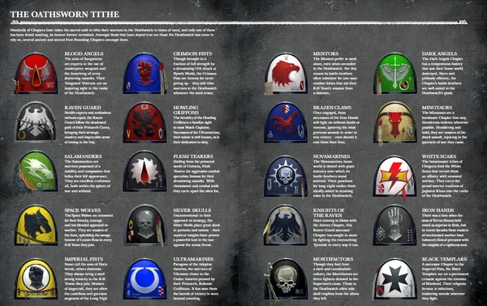

<!-- A0462-B0311 -->

原译文

Some of the Chapters tithed to the Deathwatch 一些战团提供什一税给死亡守望

**校订译文**

Some of the Chapters tithed to the Deathwatch 部分向死亡守望提供兵员贡赋的战团

<!-- /A0462-B0311 -->

<!-- A0462-B0312 -->

原译文

Absolvers 赦免者

**校订译文**

Absolvers 赦免者

<!-- /A0462-B0312 -->

<!-- A0462-B0313 -->

原译文

Angels Encarmine 赤红天使

**校订译文**

Angels Encarmine 赤红天使

<!-- /A0462-B0313 -->

<!-- A0462-B0314 -->

原译文

Angels of Absolution 赦免天使

**校订译文**

Angels of Absolution 赦免天使

<!-- /A0462-B0314 -->

<!-- A0462-B0315 -->

原译文

Angels of Redemption 救赎天使

**校订译文**

Angels of Redemption 救赎天使

<!-- /A0462-B0315 -->

<!-- A0462-B0316 -->

原译文

Angels of Vengeance 复仇天使

**校订译文**

Angels of Vengeance 复仇天使

<!-- /A0462-B0316 -->

<!-- A0462-B0317 -->

原译文

Angels Resplendent 辉煌天使

**校订译文**

Angels Resplendent 辉煌天使

<!-- /A0462-B0317 -->

<!-- A0462-B0318 -->

原译文

Angels Sanguine 血红天使

**校订译文**

Angels Sanguine 鲜血天使

<!-- /A0462-B0318 -->

<!-- A0462-B0319 -->

原译文

Angels Vermillion 朱红天使

**校订译文**

Angels Vermillion 朱红天使

<!-- /A0462-B0319 -->

<!-- A0462-B0320 -->

原译文

Astral Castellans 星界堡主

**校订译文**

Astral Castellans 星界堡主

<!-- /A0462-B0320 -->

<!-- A0462-B0321 -->
**英文原文**

Astral Claws (formerly)

<!-- /A0462-B0321 -->

<!-- A0462-B0322 -->

原译文

星辰之爪（前）

**校订译文**

星辰之爪（曾经）。

<!-- /A0462-B0322 -->

<!-- A0462-B0323 -->

原译文

Astral Fists 星辰之拳

**校订译文**

Astral Fists 星辰之拳

<!-- /A0462-B0323 -->

<!-- A0462-B0324 -->

原译文

Aurora Chapter 曙光女神

**校订译文**

Aurora Chapter 曙光女神

<!-- /A0462-B0324 -->

<!-- A0462-B0325 -->

原译文

Azure Hawks 蔚蓝雄鹰

**校订译文**

Azure Hawks 蔚蓝雄鹰

<!-- /A0462-B0325 -->

<!-- A0462-B0326 -->

原译文

Black Consuls 黑色执政官

**校订译文**

Black Consuls 黑色执政官

<!-- /A0462-B0326 -->

<!-- A0462-B0327 -->

原译文

Black Dragons 黑龙

**校订译文**

Black Dragons 黑龙

<!-- /A0462-B0327 -->

<!-- A0462-B0328 -->

原译文

Black Guard 黑色守卫

**校订译文**

Black Guard 黑色守卫

<!-- /A0462-B0328 -->

<!-- A0462-B0329 -->

原译文

Black Pegasi 黑色天马

**校订译文**

Black Pegasi 黑色天马

<!-- /A0462-B0329 -->

<!-- A0462-B0330 -->

原译文

Black Templars 黑色圣堂

**校订译文**

Black Templars 黑色圣堂

<!-- /A0462-B0330 -->

<!-- A0462-B0331 -->

原译文

Black Wings 黑翼

**校订译文**

Black Wings 黑翼

<!-- /A0462-B0331 -->

<!-- A0462-B0332 -->

原译文

Blood Angels 圣血天使

**校订译文**

Blood Angels 圣血天使

<!-- /A0462-B0332 -->

<!-- A0462-B0333 -->

原译文

Blood Drinkers 饮血者

**校订译文**

Blood Drinkers 饮血者

<!-- /A0462-B0333 -->

<!-- A0462-B0334 -->

原译文

Blood Ravens 血鸦

**校订译文**

Blood Ravens 血鸦

<!-- /A0462-B0334 -->

<!-- A0462-B0335 -->

原译文

Brazen Claws 黄铜之爪

**校订译文**

Brazen Claws 黄铜之爪

<!-- /A0462-B0335 -->

<!-- A0462-B0336 -->

原译文

Brazen Consuls 黄铜执政官

**校订译文**

Brazen Consuls 黄铜执政官

<!-- /A0462-B0336 -->

<!-- A0462-B0337 -->

原译文

Brazen Minotaurs 黄铜米诺陶

**校订译文**

Brazen Minotaurs 黄铜米诺陶

<!-- /A0462-B0337 -->

<!-- A0462-B0338 -->

原译文

Brotherhood of a Thousand 千军兄弟会

**校订译文**

Brotherhood of a Thousand 千军兄弟会

<!-- /A0462-B0338 -->

<!-- A0462-B0339 -->

原译文

Carcharodons 噬人鲨

**校订译文**

Carcharodons 噬人鲨

<!-- /A0462-B0339 -->

<!-- A0462-B0340 -->

原译文

Celebrants 司仪神父

**校订译文**

Celebrants 司仪神父

<!-- /A0462-B0340 -->

<!-- A0462-B0341 -->

原译文

Celestial Lions 天狮

**校订译文**

Celestial Lions 天狮

<!-- /A0462-B0341 -->

<!-- A0462-B0342 -->

原译文

Consecrators 奉献者

**校订译文**

Consecrators 奉献者

<!-- /A0462-B0342 -->

<!-- A0462-B0343 -->

原译文

Crimson Consuls 深红执政官

**校订译文**

Crimson Consuls 深红执政官

<!-- /A0462-B0343 -->

<!-- A0462-B0344 -->

原译文

Crimson Fists 绯红之拳

**校订译文**

Crimson Fists 绯红之拳

<!-- /A0462-B0344 -->

<!-- A0462-B0345 -->

原译文

Cruor Blades 凝血之刃

**校订译文**

Cruor Blades 凝血之刃

<!-- /A0462-B0345 -->

<!-- A0462-B0346 -->

原译文

Dark Angels 黑暗天使

**校订译文**

Dark Angels 黑暗天使

<!-- /A0462-B0346 -->

<!-- A0462-B0347 -->

原译文

Death Spectres 死亡幽灵

**校订译文**

Death Spectres 死亡幽灵

<!-- /A0462-B0347 -->

<!-- A0462-B0348 -->

原译文

Destroyers 毁灭者

**校订译文**

Destroyers 毁灭者

<!-- /A0462-B0348 -->

<!-- A0462-B0349 -->

原译文

Disciples of Caliban 卡利班门徒

**校订译文**

Disciples of Caliban 卡利班门徒

<!-- /A0462-B0349 -->

<!-- A0462-B0350 -->

原译文

Doom Eagles 末日天鹰

**校订译文**

Doom Eagles 末日天鹰

<!-- /A0462-B0350 -->

<!-- A0462-B0351 -->

原译文

Eagle Warriors 雄鹰勇士

**校订译文**

Eagle Warriors 雄鹰勇士

<!-- /A0462-B0351 -->

<!-- A0462-B0352 -->

原译文

Emperor's Scythes 帝皇镰刀

**校订译文**

Emperor's Scythes 帝皇之镰

**校注：** 英文名单同时出现 Emperor's Scythes 与 Scythes of the Emperor，中文按同名词根统一；未擅自删除其可能重复的原文条目。

<!-- /A0462-B0352 -->

<!-- A0462-B0353 -->

原译文

Excoriators 责难者

**校订译文**

Excoriators 责难者

<!-- /A0462-B0353 -->

<!-- A0462-B0354 -->

原译文

Exorcists 驱魔者

**校订译文**

Exorcists 驱魔者

<!-- /A0462-B0354 -->

<!-- A0462-B0355 -->

原译文

Fire Angels 火焰天使

**校订译文**

Fire Angels 火焰天使

<!-- /A0462-B0355 -->

<!-- A0462-B0356 -->
**英文原文**

Fire Hawks (formerly)

<!-- /A0462-B0356 -->

<!-- A0462-B0357 -->

原译文

火鹰（前）

**校订译文**

火鹰（曾经）。

<!-- /A0462-B0357 -->

<!-- A0462-B0358 -->

原译文

Fire Lords 火焰领主

**校订译文**

Fire Lords 火焰领主

<!-- /A0462-B0358 -->

<!-- A0462-B0359 -->

原译文

Fists Exemplar 典范之拳

**校订译文**

Fists Exemplar 典范之拳

<!-- /A0462-B0359 -->

<!-- A0462-B0360 -->

原译文

Flame Falcons 火焰猎鹰

**校订译文**

Flame Falcons 火焰猎鹰

<!-- /A0462-B0360 -->

<!-- A0462-B0361 -->

原译文

Flesh Tearers 撕肉者

**校订译文**

Flesh Tearers 撕肉者

<!-- /A0462-B0361 -->

<!-- A0462-B0362 -->

原译文

Genesis Chapter 起源战团

**校订译文**

Genesis Chapter 起源战团

<!-- /A0462-B0362 -->

<!-- A0462-B0363 -->

原译文

Gore Golems 凝血魔像

**校订译文**

Gore Golems 凝血魔像

<!-- /A0462-B0363 -->

<!-- A0462-B0364 -->

原译文

Guardians of the Covenant 圣约守卫者

**校订译文**

Guardians of the Covenant 圣约守卫者

<!-- /A0462-B0364 -->

<!-- A0462-B0365 -->

原译文

Hammers of Dorn 多恩之锤

**校订译文**

Hammers of Dorn 多恩之锤

<!-- /A0462-B0365 -->

<!-- A0462-B0366 -->

原译文

Hammers of Retribution 报应之锤

**校订译文**

Hammers of Retribution 报应之锤

<!-- /A0462-B0366 -->

<!-- A0462-B0367 -->

原译文

Hawk Lords 雄鹰领主

**校订译文**

Hawk Lords 雄鹰领主

<!-- /A0462-B0367 -->

<!-- A0462-B0368 -->

原译文

Hospitallers 医院骑士

**校订译文**

Hospitallers 医院骑士

<!-- /A0462-B0368 -->

<!-- A0462-B0369 -->

原译文

Howling Griffons 咆哮狮鹫

**校订译文**

Howling Griffons 咆哮狮鹫

<!-- /A0462-B0369 -->

<!-- A0462-B0370 -->

原译文

Imperial Fists 帝国之拳

**校订译文**

Imperial Fists 帝国之拳

<!-- /A0462-B0370 -->

<!-- A0462-B0371 -->

原译文

Invaders 侵略者

**校订译文**

Invaders 侵略者

<!-- /A0462-B0371 -->

<!-- A0462-B0372 -->

原译文

Iron Hands 钢铁之手

**校订译文**

Iron Hands 钢铁之手

<!-- /A0462-B0372 -->

<!-- A0462-B0373 -->

原译文

Iron Lords 钢铁领主

**校订译文**

Iron Lords 钢铁领主

<!-- /A0462-B0373 -->

<!-- A0462-B0374 -->

原译文

Iron Ravens 钢铁渡鸦

**校订译文**

Iron Ravens 钢铁渡鸦

<!-- /A0462-B0374 -->

<!-- A0462-B0375 -->

原译文

Iron Snakes 铁蛇

**校订译文**

Iron Snakes 铁蛇

<!-- /A0462-B0375 -->

<!-- A0462-B0376 -->

原译文

Jade Scorpions 玉蝎

**校订译文**

Jade Scorpions 玉蝎

<!-- /A0462-B0376 -->

<!-- A0462-B0377 -->

原译文

Knights of Abhorrence 憎恶骑士

**校订译文**

Knights of Abhorrence 憎恶骑士

<!-- /A0462-B0377 -->

<!-- A0462-B0378 -->
**英文原文**

Knights of Blood (formerly)

<!-- /A0462-B0378 -->

<!-- A0462-B0379 -->

原译文

鲜血骑士（前）

**校订译文**

鲜血骑士（曾经）。

<!-- /A0462-B0379 -->

<!-- A0462-B0380 -->

原译文

Knights of the Raven 渡鸦骑士

**校订译文**

Knights of the Raven 渡鸦骑士

<!-- /A0462-B0380 -->

<!-- A0462-B0381 -->

原译文

Lamenters 恸哭者

**校订译文**

Lamenters 恸哭者

<!-- /A0462-B0381 -->

<!-- A0462-B0382 -->

原译文

Mantis Warriors 螳螂勇士

**校订译文**

Mantis Warriors 螳螂勇士

<!-- /A0462-B0382 -->

<!-- A0462-B0383 -->

原译文

Marines Errant 游侠战士

**校订译文**

Marines Errant 游侠战士

<!-- /A0462-B0383 -->

<!-- A0462-B0384 -->

原译文

Marines Malevolent 恶意战士

**校订译文**

Marines Malevolent 恶意战士

<!-- /A0462-B0384 -->

<!-- A0462-B0385 -->

原译文

Mentors 导师

**校订译文**

Mentors 导师

<!-- /A0462-B0385 -->

<!-- A0462-B0386 -->

原译文

Minotaurs 米诺陶

**校订译文**

Minotaurs 米诺陶

<!-- /A0462-B0386 -->

<!-- A0462-B0387 -->

原译文

Mortifactors 苦行者

**校订译文**

Mortifactors 苦行者

<!-- /A0462-B0387 -->

<!-- A0462-B0388 -->

原译文

Night Raptors 午夜猛禽

**校订译文**

Night Raptors 午夜猛禽

<!-- /A0462-B0388 -->

<!-- A0462-B0389 -->

原译文

Novamarines 新星战士

**校订译文**

Novamarines 新星战士

<!-- /A0462-B0389 -->

<!-- A0462-B0390 -->

原译文

Patriarchs of Ulixis 尤利西斯宗主

**校订译文**

Patriarchs of Ulixis 尤利西斯宗主

<!-- /A0462-B0390 -->

<!-- A0462-B0391 -->

原译文

Penitent Blades 忏悔之刃

**校订译文**

Penitent Blades 忏悔之刃

<!-- /A0462-B0391 -->

<!-- A0462-B0392 -->

原译文

Praetors of Orpheus 俄耳甫斯执政官

**校订译文**

Praetors of Orpheus 俄耳甫斯执政官

<!-- /A0462-B0392 -->

<!-- A0462-B0393 -->

原译文

Rampagers 狂暴者

**校订译文**

Rampagers 狂暴者

<!-- /A0462-B0393 -->

<!-- A0462-B0394 -->

原译文

Raptors 猛禽

**校订译文**

Raptors 猛禽

<!-- /A0462-B0394 -->

<!-- A0462-B0395 -->

原译文

Raven Guard 暗鸦守卫

**校订译文**

Raven Guard 暗鸦守卫

<!-- /A0462-B0395 -->

<!-- A0462-B0396 -->

原译文

Red Hunters 红色猎手

**校订译文**

Red Hunters 红色猎手

<!-- /A0462-B0396 -->

<!-- A0462-B0397 -->

原译文

Red Scorpions 红蝎

**校订译文**

Red Scorpions 红蝎

<!-- /A0462-B0397 -->

<!-- A0462-B0398 -->

原译文

Red Talons 红爪

**校订译文**

Red Talons 红爪

<!-- /A0462-B0398 -->

<!-- A0462-B0399 -->

原译文

Relictors 遗物守护者

**校订译文**

Relictors 遗物守护者

<!-- /A0462-B0399 -->

<!-- A0462-B0400 -->

原译文

Revilers 谩骂者

**校订译文**

Revilers 谩骂者

<!-- /A0462-B0400 -->

<!-- A0462-B0401 -->

原译文

Salamanders 火蜥蜴

**校订译文**

Salamanders 火蜥蜴

<!-- /A0462-B0401 -->

<!-- A0462-B0402 -->

原译文

Scimitar Guard 弯刀守卫

**校订译文**

Scimitar Guard 弯刀守卫

<!-- /A0462-B0402 -->

<!-- A0462-B0403 -->

原译文

Scions of Sanguinius 圣吉列斯之裔

**校订译文**

Scions of Sanguinius 圣吉列斯之裔

<!-- /A0462-B0403 -->

<!-- A0462-B0404 -->

原译文

Scythes of the Emperor 帝皇之镰

**校订译文**

Scythes of the Emperor 帝皇之镰

<!-- /A0462-B0404 -->

<!-- A0462-B0405 -->

原译文

Silver Sabres 银色军刀

**校订译文**

Silver Sabres 银色军刀

<!-- /A0462-B0405 -->

<!-- A0462-B0406 -->

原译文

Silver Skulls 银色颅骨

**校订译文**

Silver Skulls 银色颅骨

<!-- /A0462-B0406 -->

<!-- A0462-B0407 -->

原译文

Sons of Antaeus 安泰乌斯之子

**校订译文**

Sons of Antaeus 安泰乌斯之子

<!-- /A0462-B0407 -->

<!-- A0462-B0408 -->

原译文

Sons of Medusa 美杜莎之子

**校订译文**

Sons of Medusa 美杜莎之子

<!-- /A0462-B0408 -->

<!-- A0462-B0409 -->

原译文

Sons of Orar 奥拉尔之子

**校订译文**

Sons of Orar 奥拉尔之子

<!-- /A0462-B0409 -->

<!-- A0462-B0410 -->

原译文

Soul Drinkers 饮魂者

**校订译文**

Soul Drinkers 饮魂者

<!-- /A0462-B0410 -->

<!-- A0462-B0411 -->

原译文

Space Wolves 太空野狼

**校订译文**

Space Wolves 太空野狼

<!-- /A0462-B0411 -->

<!-- A0462-B0412 -->

原译文

Star Dragons 星龙

**校订译文**

Star Dragons 星龙

<!-- /A0462-B0412 -->

<!-- A0462-B0413 -->

原译文

Star Phantoms 星辰幻影

**校订译文**

Star Phantoms 星辰幻影

<!-- /A0462-B0413 -->

<!-- A0462-B0414 -->

原译文

Storm Giants 风暴巨人

**校订译文**

Storm Giants 风暴巨人

<!-- /A0462-B0414 -->

<!-- A0462-B0415 -->

原译文

Storm Lords 风暴领主

**校订译文**

Storm Lords 风暴领主

<!-- /A0462-B0415 -->

<!-- A0462-B0416 -->

原译文

Storm Wardens 风暴看守者

**校订译文**

Storm Wardens 风暴看守者

<!-- /A0462-B0416 -->

<!-- A0462-B0417 -->

原译文

Subjugators 压制者

**校订译文**

Subjugators 压制者

<!-- /A0462-B0417 -->

<!-- A0462-B0418 -->

原译文

Taurans 蛮牛

**校订译文**

Taurans 陶兰战团

**校注：** 沿225/316同战团名称陶兰战团，原蛮牛；保留英语Taurans。

<!-- /A0462-B0418 -->

<!-- A0462-B0419 -->

原译文

Tigers Argent 银白猛虎

**校订译文**

Tigers Argent 银白猛虎

<!-- /A0462-B0419 -->

<!-- A0462-B0420 -->

原译文

Tome Keepers 典籍守护者

**校订译文**

Tome Keepers 典籍守护者

<!-- /A0462-B0420 -->

<!-- A0462-B0421 -->

原译文

Ultramarines 极限战士

**校订译文**

Ultramarines 极限战士

<!-- /A0462-B0421 -->

<!-- A0462-B0422 -->

原译文

Warmongers 好战者

**校订译文**

Warmongers 好战者

<!-- /A0462-B0422 -->

<!-- A0462-B0423 -->

原译文

White Consuls 白色执政官

**校订译文**

White Consuls 白色执政官

<!-- /A0462-B0423 -->

<!-- A0462-B0424 -->

原译文

White Scars 白色疤痕

**校订译文**

White Scars 白疤

<!-- /A0462-B0424 -->

本篇核心术语与暂定项

以下列出本篇出现的英文原形及核心术语表用词。同形词可能指不同对象，具体词义以本篇正文和校注为准；单复数、别名和仅见于图注的名称可能尚未列入。完整候选见[术语表](../../术语表/双语术语候选.csv)。

| 英文 | 采用中文 | 状态 |
| --- | --- | --- |
| Space Marines | 星际战士 | 官方已核对 |
| Adeptus Astartes | 阿斯塔特修会 | 官方已核对 |
| Deathwatch | 死亡守望 | 官方已核对 |
| Space Wolves | 太空野狼 | 官方已核对 |
| Adeptus Mechanicus | 机械修会 | 官方已核对 |
| Eldar | 灵族 | 暂定·语境区分 |
| Dark Eldar | 黑暗灵族 | 暂定·旧称对应 |
| Tyranids | 泰伦虫族 | 官方已核对 |
| Orks | 欧克蛮人 | 官方已核对 |
| Librarian | 智库员 | 官方已核对 |
| Terminator | 终结者 | 官方已核对 |
| Ultramarines | 极限战士 | 官方已核对 |
| Inquisition | 审判庭 | 暂定 |
| Inquisitor | 审判官 | 官方已核对 |
| Imperium | 帝国 | 暂定·简称 |
| Imperial Navy | 帝国海军 | 暂定 |
| Equipment | 装备 | 编辑用语已统一 |
| Imperial Fists | 帝国之拳 | 暂定 |
| Emperor | 帝皇 | 官方已核对 |
| Kabal | 阴谋团 | 暂定·官方待核 |
| Wych | 巫灵 | 官方已核对 |
| Terra | 泰拉 | 暂定·官方待核 |
| High Lords of Terra | 泰拉高领主 | 暂定·官方待核 |
| Lord Commander of the Imperium | 帝国最高统帅 | 暂定·官方待核 |
| Ordo Xenos | 异形审判庭 | 用户指定 |
| Inquisitorial Black Ships | 审判庭黑船 | 暂定·官方待核 |
| Badab | 巴达布 | 暂定·官方待核 |
| Stygies VIII | 黄泉八号 | 暂定·官方待核 |
| Talasa Prime | 塔拉萨主星 | 暂定·官方待核 |
| Ghosar Quintus | 戈萨尔五号 | 暂定·官方待核 |
| Tech | 技术语 | 暂定·官方待核 |
| Aquila | 天鹰 | 暂定·官方待核 |
| Inquisitorial Representative | 审判庭代表 | 暂定 |
| Master | 导师（审判庭职衔）／舰务官（舰员职务） | 语境定译·官方待核 |
| Mission | 教团／传教机构 | 暂定 |
| Lance | 骑士矛阵 | 暂定·官方待核 |
| Vigil | 警戒团（静默修女编制）／警戒堡（红蝎空间站）／守夜星（行星） | 语境定译·官方待核 |
| Ullanor | 乌兰诺 | 暂定·官方待核 |
| Lord Commander | 领主指挥官 | 暂定·官方待核 |
| Raven Guard | 暗鸦守卫 | 官方已核 |
| Founding | 建军 | 暂定·官方待核 |
| Crimson Fists | 绯红之拳 | 暂定·官方待核 |
| Destroyer | 毁灭者 | 暂定·官方待核 |
| Space Marine | 星际战士 | 暂定·官方待核 |
| Chapter | 战团 | 暂定·官方待核 |
| Fortress-monastery | 要塞修道院 | 暂定·官方待核 |
| Chapter Master | 战团长 | 暂定·官方待核 |
| Captain | 连长 | 暂定·官方待核 |
| Sergeant | 军士 | 暂定·官方待核 |
| Brother | 修士 | 暂定·官方待核 |
| Uriel Ventris | 乌瑞尔·文崔斯 | 官方已核 |
| Artemis | 阿尔忒弥斯 | 暂定·官方待核 |
| Codex Astartes | 阿斯塔特圣典 | 暂定·官方待核 |
| Mortifactors | 苦行者 | 暂定·官方待核 |
| Nemesis | 复仇女神 | 暂定·官方待核 |
| Novamarines | 新星战士 | 暂定·官方待核 |
| Mantis Warriors | 螳螂勇士 | 暂定·官方待核 |
| Death Spectres | 死亡幽灵 | 暂定·官方待核 |
| Fire Hawks | 火鹰 | 暂定·官方待核 |
| Land Raiders | 兰德掠袭者 | 暂定·官方待核 |
| Strike Cruiser | 打击巡洋舰 | 暂定·官方待核 |
| Corvus Blackstar | 黑星渡鸦 | 官方已核 |
| Brother-Captain | 兄弟会连长（灰骑士）／兄弟连长（通称） | 语境定译·灰骑士职衔官译已核 |
| Xenos | 异形 | 暂定·官方待核 |
| C'tan | 星神 | 暂定·官方待核 |
| Wych Cults | 巫灵教团 | 官方词根参考·组织全称待核 |
| Warboss | 战争头目 | 官方已核对 |
| The Beast | 野兽 | 暂定·官方待核 |
| Koorland | 库兰德 | 暂定·官方待核 |
| Lictor | 刀斧虫（泰伦单位）／侍从官（禁军职衔） | 语境定译·泰伦单位官译已核 |
| Tarsis Ultra | 塔西斯·极限 | 暂定·官方待核 |
| Ghyre | 吉尔 | 暂定·官方待核 |
| Cult of the Four-Armed Emperor | 四臂帝皇教派 | 暂定·官方待核 |
| Brontos | 布朗托斯 | 暂定·官方待核 |
| Veridium | 维瑞迪姆 | 暂定·官方待核 |
| Bikes | 摩托 | 暂定·官方待核 |
| Haevron | 海夫隆 | 暂定·官方待核 |
| Silent Slayer | 寂静杀手 | 暂定·官方待核 |
| Watch Captain | 守望连长 | 暂定·官方待核 |
| Eye of Retribution | 报复之眼号 | 暂定·官方待核 |
| Fatal Redress | 致命补救号 | 暂定·官方待核 |
| Final Mercy | 最终仁慈号 | 暂定·官方待核 |
| Hallowed Sword | 圣剑号 | 暂定·官方待核 |
| Lance of Darkness | 黑暗长枪号 | 暂定·官方待核 |
| Pyre Imperius | 帝国柴薪号 | 暂定·官方待核 |
| Robidoux | 罗比杜号 | 暂定·官方待核 |
| Spear of Fury | 愤怒之矛号 | 暂定·官方待核 |
| Thunder’s Word | 雷霆之语号 | 暂定·官方待核 |
| Wrathbringer | 愤怒使者号 | 暂定·官方待核 |
| Squad Veridium | 维瑞迪姆小队 | 暂定·官方待核 |
| Lothar Redfang | 洛萨·红牙 | 暂定·官方待核 |
| Alessio Cortez | 阿莱西奥·科尔特斯 | 暂定·官方待核 |
| Shaidan | 沙伊丹 | 暂定·官方待核 |
| Vigilant | 维吉兰特 | 暂定·官方待核 |
| Soron | 索伦 | 暂定·官方待核 |
| Bannon | 班农 | 暂定·官方待核 |
| Captain Bannon | 班农连长 | 暂定·官方待核 |
| Attack Moon | 战斗月亮 | 暂定·官方待核 |
| Mercy | 仁慈 | 暂定·官方待核 |
| Quintus | 昆图斯 | 暂定·官方待核 |
| Wienand | 维南德 | 暂定·官方待核 |
| Asger Warfist | 阿斯格·战拳 | 暂定·官方待核 |
| Kill-ships | 杀戮船 | 暂定·官方待核 |
| Imperius | 英普瑞斯号 | 暂定·官方待核 |
| Astral Claws | 星辰之爪 | 暂定·官方待核 |
| Purgatus | 净化者 | 暂定·官方待核 |
| Power Weapons | 动力武器 | 暂定·官方待核 |
| Jump Pack | 跳跃背包 | 暂定·官方待核 |
| Terminator Armour | 终结者盔甲 | 暂定·官方待核 |
| Rapid Strike Vessel | 快速打击战舰 | 暂定·官方待核 |

