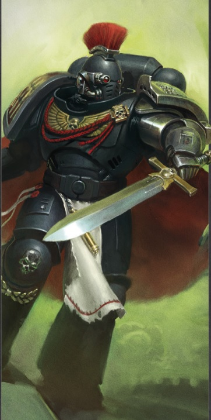
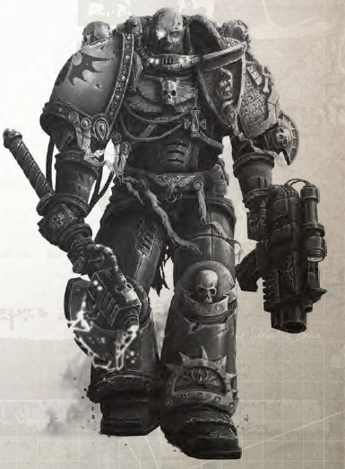
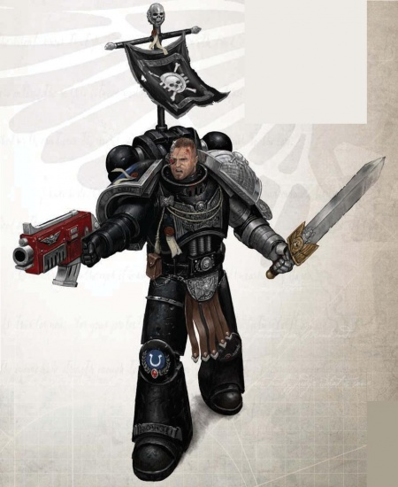
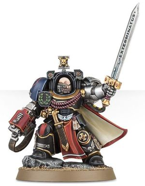

# 0463 守望连长 Watch Captain

精校状态：中文行文已逐段精校，部分术语仍为暂定

分类：通用概念 / 帝国 Imperium / 中央政务部 Adeptus Terra / 阿斯塔特修会 Adeptus Astartes

原文来源：https://www.bilibili.com/opus/1122044065603387415

原作者：帝国神选罐头

原文时间：2025年10月10日 16:24

[返回分类目录](目录.md) · [全书目录](../../目录.md)

<!-- A0463-B0001 -->
**英文原文**

Watch Captains are Adeptus Astartes that belong to the Deathwatch, which is the Chamber Militant of the Ordo Xenos of the Inquisition.

<!-- /A0463-B0001 -->

<!-- A0463-B0002 -->

原译文

守望连长是属于阿斯塔特修会的死亡守望，死亡守望是审判庭攘外修会的军事辅军。

**校订译文**

守望连长是死亡守望中的阿斯塔特战士；死亡守望则是审判庭下属异形审判庭的军事分支。

<!-- /A0463-B0002 -->

<!-- A0463-B0003 -->
## Overview 概述

<!-- /A0463-B0003 -->

<!-- A0463-B0004 -->
**英文原文**

These individuals are often Battle-Brothers who have served in Kill-teams with great distinction and taken multiple tours of service. As such, it is not uncommon for those skilled Battle-Brothers to be called to serve many times with these veteran alien-hunters and given the honour of being awarded the rank of Watch Captain. Those that accept this duty know that they will not return to their parent Chapter for many years as their time as Watch Captain is counted as a single "mission." Their role is to oversee one or more Kill-teams, where they have the duty of watching over every aspect of equipment, recruitment and training. They are also responsible for their Battle-Brothers' record of deeds in battle and ensure, if possible, that the remains of fallen Astartes are returned to their parent Chapter with all due honours. It is unusual for Watch Captains to accompany their warriors on a mission, though they will do so in cases where they face a particularly dangerous foe and where their personal intervention may aid in achieving victory in the battle.

<!-- /A0463-B0004 -->

<!-- A0463-B0005 -->

原译文

这些人通常是战斗兄弟，他们在杀戮小队中表现出色，并多次服役。因此，那些熟练的战斗兄弟被召唤多次与这些老兵外星猎手一起服役，并被授予守望连长的荣誉，这种情况并不罕见。那些接受这一职责的人知道，他们多年内不会回到他们的前战团，因为他们作为守望连长的时间被视为一个“任务”。他们的职责是监督一个或多个杀戮小队，在那里他们有责任监督装备、招募和训练的各个方面。他们还对他们的战斗兄弟在战斗中的行为记录负责，并确保在可能的情况下，将倒下的阿斯塔特的遗体以应有的荣誉归还回他们的母团。守望连长陪同战士执行任务是不寻常的，尽管他们会在面对特别危险的敌人时这样做，并且他们的个人干预可能有助于在战斗中取得胜利。

**校订译文**

他们通常是曾多次在杀戮小队服役、战功卓著的战斗兄弟。技艺精湛的异形猎手经常被反复征召，最终获授守望连长之衔。接受任命者明白，自己此后多年都无法返回原战团，因为整段连长任期被算作同一项“任务”。他们统辖一个或多个杀戮小队，负责装备、招募与训练的所有事务，记录战斗兄弟的功业，并在条件允许时，以应有礼遇将阵亡者遗骸运回母团。守望连长通常不会随队执行任务，但面对特别危险的敌人、且亲自介入有望争取胜利时，也会出征。

<!-- /A0463-B0005 -->

<!-- A0463-B0006 图片 -->

<!-- A0463-B0007 -->

原译文

Deathwatch Watch Captain 死亡守望守望连长

**校订译文**

Deathwatch Watch Captain 死亡守望守望连长

<!-- /A0463-B0007 -->

<!-- A0463-B0008 -->
**英文原文**

In most cases, Watch Captains oversee missions from nearby posts such as Thunderhawk gunships that are equipped to serve as command centers, emergency surgery, arsenal and quarantine facilities for captured enemies. From the gunship, they are able to monitor the progress of the mission where they are able to see each Battle-Brother's operations by way of multi-band sensors that are built into their power armour. Through this post, a Watch Captain can monitor the physiological condition of his Kill-team which ensures that no Xenos biological contaminants are transmitted to the Imperium upon the return of his warriors. On those occasions when they take to the battlefield, their presence can help turn the tide of battle as a Watch Captain serves as an experienced leader and inspires his men to greater acts of heroism. In addition, they are fearsome warriors who have seen every horror the galaxy has to offer and stood against them all. They are known to stand unshaken before massive alien terrors that are able to devastate entire armies and still determine a weakness in this foe. Watch Captains of the Deathwatch are amongst the most heroic servants of the Imperium, even if their names or deeds are not known by anyone except their Battle-Brothers.

<!-- /A0463-B0008 -->

<!-- A0463-B0009 -->

原译文

在大多数情况下，守望连长从附近的哨所监督任务，如雷鹰炮艇，这些哨所配备有指挥中心、紧急手术室、军械库和被俘敌人的隔离设施。从炮艇上，他们能够监控任务的进展，通过内置在其动力盔甲中的多波段传感器，他们能够看到每个战斗兄弟的行动。通过这个哨所，守望连长可以监测他的杀戮小队的生理状况，确保他的战士返回后没有异型生物污染物传播到帝国。在他们奔赴战场的那些场合，他们的存在可以帮助扭转战局，因为守望连长是一位经验丰富的领导者，激励他的部下做出更大的英雄主义行为。此外，他们是可怕的战士，目睹了银河系所提供的每一种恐怖，并与他们所有人对抗。众所周知，他们在大规模的外星恐怖面前坚定不移，这些恐怖能够摧毁整个军队，但仍然决定了这个敌人的弱点。死亡守望的守望连长是帝国最英勇的仆人之一，即使他们的名字或事迹除了他们的战斗兄弟外，没有人知道。

**校订译文**

守望连长通常在任务区域附近的指挥据点督导行动，例如经过改装的雷鹰炮艇。这类炮艇兼具指挥中心、急救手术室、武库和敌方俘虏隔离设施的功能。他们通过战士动力甲内的多波段传感器，监看每名战斗兄弟的行动与小队整体进展，也监测生理状况，避免战士归来时将异形生物污染带入帝国。亲赴战场时，守望连长丰富的经验与威望足以扭转局势，激励部下奋勇作战。他们本身也是令人畏惧的战士，直面过银河中种种恐怖；哪怕遭遇足以摧毁整支军队的庞大异形，他们仍能岿然不动，寻出敌人弱点。他们是帝国最英勇的仆从之一，尽管姓名与功业可能只有同袍知晓。

<!-- /A0463-B0009 -->

<!-- A0463-B0010 -->
**英文原文**

A Space Marine Captain has to be a remarkable individual. He must be a scholarly adept of the teachings of the Codex Astartes and show himself to be an astute tactician through the maelstrom of uncounted battles. He must be a diplomat and act as a representative of the Chapter to Imperial authorities. He must be charismatic hero able to win the confidence and respect of his Battle-Brothers in both triumph and adversity. Under their Captain’s command a company of Space Marines can defeat seemingly insurmountable odds, the individual prowess of the Battle-Brothers magnified a hundredfold when coordinated by the ferocious tactical acumen of their leader.

<!-- /A0463-B0010 -->

<!-- A0463-B0011 -->

原译文

星际战士连长必须是一个非凡的人。他必须是一位精通《阿斯塔特圣典》教义的学者，并在无数战斗的漩涡中表现出自己是一位精明的战术家。他必须是一名外交官，并作为该战团在帝国当局的代表。他必须是一个有魅力的英雄，能够在胜利和逆境中赢得战斗兄弟的信任和尊重。在连长的指挥下，一个星际战士连队可以击败看似不可逾越的困难，战斗兄弟的个人实力在其领导人的凶猛战术智慧的协调下放大了一百倍。

**校订译文**

星际战士连长必须出类拔萃。他须精研《阿斯塔特圣典》，在无数战斗中证明自己的战术眼光；也须善于外交，代表战团与帝国当局交涉。他还必须具备英雄的感召力，无论凯旋还是身陷逆境，都能赢得战斗兄弟的信任与尊敬。在连长指挥下，一连星际战士足以克服看似无法战胜的困难；他敏锐的战术协调，能使每名战士的力量百倍发挥。

<!-- /A0463-B0011 -->

<!-- A0463-B0012 图片 -->

<!-- A0463-B0013 -->

原译文

Deathwatch Watch Captain 死亡守望守望连长

**校订译文**

Deathwatch Watch Captain 死亡守望守望连长

<!-- /A0463-B0013 -->

<!-- A0463-B0014 -->
**英文原文**

Space Marine Captains are clear-eyed enough to understand the necessity of the Deathwatch. When the time comes they dutifully set aside their own desires to remain with their company and undertake their Vigil with humility. The Deathwatch traditionally extends the rank of Captain to a Space Marine company commander during their Vigil, but most Captains entering the Watch refuse to accept such a lofty position until they have earned it. Thus, the scarred hero of a thousand battles will accept a role in a Kill-team as a simple Battle–Brother under the command of an individual centuries his junior until he feels he has learned the ropes.

<!-- /A0463-B0014 -->

<!-- A0463-B0015 -->

原译文

星际战士连长们足够清醒，能够理解死亡守望的必要性。当时机到来时，他们尽职尽责地放下自己的欲望，留下来陪伴他们，谦逊地进行警戒。传统上，在警戒期间，死亡守望会将连长的军衔扩展到星际战士连队指挥官，但大多数进入警戒的连长在获得这样一个崇高的职位之前都拒绝接受。因此，一千场战斗中伤痕累累的英雄将接受一个简单的战斗兄弟在比他小几个世纪的人的指挥下，直到他觉得自己已经学会了诀窍。

**校订译文**

星际战士连长深知死亡守望的必要性。征召到来时，他们会尽责地放下留在自己连队中的愿望，谦逊地前往服役。按传统，死亡守望允许原本的连队指挥官在守望服役期内保留连长军阶，但多数人认为，必须重新证明自己配得上这一高位才肯接受。因此，哪怕是身经千战、伤痕累累的英雄，也愿先在杀戮小队中担任普通战斗兄弟，听命于比自己年轻数百年的战士，直到熟悉这里的作战方式。

**校注：** 原译将“放下留在自己连队的愿望”倒转成留下陪伴；此处 Vigil 指在死亡守望服役的一期，非单纯警戒动作。

<!-- /A0463-B0015 -->

<!-- A0463-B0016 -->
**英文原文**

There is wisdom behind the pride of such an approach. A Deathwatch Captain must learn how to fight a new kind of war, a shadow war against opponents on a dozen fronts where a single Kill-team must tip the balance. The methods, tactics and targets of the Deathwatch are best learned in the field, and a Space Marine Captain will stand side-by-side with his Battle-Brothers to learn their way of battle before presuming to take command of them. Deathwatch Captains are also raised from Battle-Brothers that have served in the ranks of the Kill-teams with great distinction and undertaken many vigils in the watch. A particularly skilled xenos-hunter may be called to duty with the Deathwatch repeatedly. Eventually such a renowned Battle-Brother may be afforded the honour of assuming the rank of Watch Captain and leading the Kill-teams he has fought as a part of for so long.

<!-- /A0463-B0016 -->

<!-- A0463-B0017 -->

原译文

这种做法的骄傲背后有智慧。死亡守望连长必须学会如何打一场新的战争，一场在十几条战线上对抗对手的影子战争，一支杀戮小队必须打破平衡。死亡守望的方法、战术和目标最好在战场上学习，星际战士连长将与他的战斗兄弟并肩作战，学习他们的作战方式，然后再决定指挥他们。死亡守望连长也是从战斗兄弟中培养出来的，他们在杀戮小队中表现出色，并在死亡守望中进行了许多警戒。一个特别熟练的异型猎手可能会被反复召唤到死亡守望的岗位上。最终，这样一位著名的战斗兄弟可能会获得担任守望连长的荣誉，并领导他长期参与战斗的杀戮小队。

**校订译文**

这种自尊背后有着智慧。死亡守望连长必须学习一种新的战争：在十余条战线上隐秘作战，往往仅凭一支杀戮小队便要左右战局。死亡守望的手段、战术与目标，最适合在实战中理解。来自其他战团的连长会先与战斗兄弟并肩作战，学会他们的方式，再考虑接掌指挥。死亡守望也会从多次服役、功绩卓著的普通战斗兄弟中选拔连长。一位特别出色的异形猎手可能被反复征召，最终获此殊荣，率领自己长期奋战其中的杀戮小队。

<!-- /A0463-B0017 -->

<!-- A0463-B0018 -->
**英文原文**

The demands on a Deathwatch Captain are very different to those found in other Space Marine Chapters. A Deathwatch Captain is usually placed in charge of several Kill-teams and given guidance on broad objectives by the Watch Commander. Beyond that and advice from Chaplains and Librarians the Watch Captain sets his own missions and organizes his Kill-teams appropriately. He is responsible for every detail of their recruitment, training, equipment and deployment. It is also his solemn duty to record their deeds in battle and, where possible, to return the remains of a fallen Battle-Brother to their parent Chapter with all due honour.

<!-- /A0463-B0018 -->

<!-- A0463-B0019 -->

原译文

对死亡守望连长的要求与其他星际战士战团中的要求非常不同。死亡守望连长通常负责几个杀戮小队，并由守望指挥官就广泛的目标提供指导。除此之外，还有牧师和智库的建议，守望连长制定了自己的任务，并适当地组织了他的杀戮小队。他负责他们的招募、培训、装备和部署的每一个细节。他还有庄严的义务记录他们在战斗中的行为，并在可能的情况下，以应有的荣誉将一名倒下的战斗兄弟的遗体归还给他们的母团。

**校订译文**

死亡守望对连长的要求，与其他星际战士战团很不一样。他通常统辖数支杀戮小队，由守望指挥官指明总体目标，并听取教士和智库员的建议，再自行制订任务、编组小队。他对招募、训练、装备和部署的每个细节负责，也负有庄严职责：记录同袍的战场功业，并在可能时以应有礼遇，将阵亡战斗兄弟的遗骸运回原战团。

<!-- /A0463-B0019 -->

<!-- A0463-B0020 图片 -->

<!-- A0463-B0021 -->

原译文

Deathwatch Watch Captain 死亡守望守望连长

**校订译文**

Deathwatch Watch Captain 死亡守望守望连长

<!-- /A0463-B0021 -->

<!-- A0463-B0022 -->
**英文原文**

It is unlikely the Watch Captain will ever have a full hundred Battle-Brothers to command in the Deathwatch, and the handful of Space Marines available will always be widely scattered across the vast area under the scrutiny of a single Watch Fortress. Instead the Watch Captain must learn how to best employ a changing roster of Battle-Brothers from different Chapters to assemble the most effective Kill-teams for the missions required.

<!-- /A0463-B0022 -->

<!-- A0463-B0023 -->

原译文

守望连长不太可能在死亡守望中指挥整整一百名战斗兄弟，而少数可用的星际战士将在一个守望堡垒的审查下，分散在广阔的地区。相反，守望连长必须学会如何最好地利用来自不同战团的不断变化的战斗兄弟名单，为所需的任务组建最有效的杀戮小队。

**校订译文**

守望连长几乎不可能统领满编的一百名战斗兄弟。他手头有限的战士，总是分散在一座守望堡垒监护的辽阔区域内。因此，他必须善用不断轮换、来自不同战团的人员，为每项任务编成最有效的杀戮小队。

<!-- /A0463-B0023 -->

<!-- A0463-B0024 -->
**英文原文**

Much of the Watch Captain’s time is occupied by endless analysis of data and closeted consultations with Librarians and Inquisitors in an attempt to determine when and where to intervene. It is rare to have the luxury of planning campaigns in the Watch. All too often the Watch Captain is engaged in long-term triage of a series of alien threats across an entire sector. Precision strikes by Kill-teams to keep the enemy off balance, often in collusion with Ordo Xenos Inquisitors, and some subtle prodding of Imperium military forces in the right direction is commonly the best that can be achieved.

<!-- /A0463-B0024 -->

<!-- A0463-B0025 -->

原译文

守望连长的大部分时间都被无休止的数据分析和与智库和审判官的秘密协商所占据，试图确定何时何地进行干预。在死亡守望策划活动是罕见的。守望连长经常对整个星区的一系列外星威胁进行长期分类。杀戮小队进行精确打击以保持敌人的不平衡，通常与攘外修会的审判官密谋，并微妙地推动帝国军队朝着正确的方向前进，这通常是可以实现的最佳目标。

**校订译文**

守望连长的大量时间，都花在无尽的数据分析，以及与智库员和审判官的秘密磋商上，以判断应在何时、何地介入。死亡守望很少有从容筹划完整战役的余裕；更常见的是，连长必须长期权衡整个星区内一连串异形威胁的轻重缓急。他们通常与异形审判庭审判官协作，派杀戮小队精准突袭，使敌人无法稳住阵脚，再暗中引导帝国军队向正确方向行动。这往往已是有限资源所能达成的最佳结果。

**校注：** triage 为按紧迫程度取舍处置威胁，非单纯分类；campaigns 指军事战役，不是一般活动。

<!-- /A0463-B0025 -->

<!-- A0463-B0026 -->
**英文原文**

A Watch Captain will often take personal command of important missions, particularly ones that involve multiple Kill-teams or diverse objectives. A Watch Captain makes for a truly deadly opponent but one armed with the ancient weaponry and forbidden wargear available to the Deathwatch is more terrible still. Under his deft control the most diverse Kill-teams work together with the smooth efficiency of a well-oiled bolter. Unconquerable fortresses and indestructible war machines are meat and drink to the fertile mind of a Watch Captain. Even the strongest enemy forces are liable to be pulled apart and defeated at the hands of a Watch Captain’s Kill-teams before they know they are under attack.

<!-- /A0463-B0026 -->

<!-- A0463-B0027 -->

原译文

守望连长经常亲自指挥重要任务，特别是涉及多个杀戮小队或不同目标的任务。守望连长是一个真正致命的对手，但一个装备着死亡守望可用的古老武器和禁忌武器的人更可怕。在他的巧妙控制下，最多样化的杀戮小队以井井有条的爆矢枪的平稳效率协同工作。不可征服的堡垒和坚不可摧的战争机器对一个守望连长丰富的思维来说是食物和饮品。即使是最强大的敌军，在知道自己受到攻击之前，也可能被守望连长的杀戮小队撕裂和击败。

**校订译文**

重要任务，尤其涉及多支杀戮小队或多重目标时，守望连长常会亲自指挥。他本已是致命对手，若再配上死亡守望拥有的古老武器与禁忌装备，就更加可怖。在其娴熟调度下，成分迥异的小队也能如保养精良的爆矢枪一般顺畅协作。对守望连长富于创造力的头脑而言，难以攻克的堡垒与看似无法摧毁的战争机器，不过是其最善应付的挑战。即便最强大的敌军，也可能尚未察觉袭击便被他的杀戮小队瓦解歼灭。

**校注：** meat and drink 为擅长且乐于应付的事情，原译食物饮品是误读习语。

<!-- /A0463-B0027 -->

<!-- A0463-B0028 -->
**英文原文**

When a major xenos threat is identified by a Watch Captain, his role is to formally warn nearby Imperial Commanders of the threat. If the Imperial response proves weak or ineffective it may then fall to the Deathwatch to intervene directly and put an end to the matter. The Deathwatch has access to weaponry that is the doom of worlds. Where conventional defences fail, a Watch Captain may have to sorrowfully order the complete destruction of a planet, potentially sacrificing innocent lives in their billions to protect other worlds in peril.

<!-- /A0463-B0028 -->

<!-- A0463-B0029 -->

原译文

当一名守望连长发现一个主要的外来威胁时，他的职责是正式警告附近的帝国指挥官这一威胁。如果帝国的反应被证明是软弱或无效的，那么死亡守望可能会直接介入并结束这件事。死亡守望可以获得毁灭世界的武器。在常规防御失败的地方，守望连长可能不得不悲伤地下令彻底摧毁一个行星，可能会牺牲数十亿无辜的生命来保护处于危险中的其他世界。

**校订译文**

发现重大异形威胁后，守望连长须正式警告附近的帝国指挥官。若帝国应对薄弱或无效，死亡守望便可能直接介入，终结威胁。他们掌握足以毁灭世界的武器；当常规防御失败时，连长可能不得不痛心地下令摧毁整颗行星，牺牲数十亿无辜者，以保全其他岌岌可危的世界。

<!-- /A0463-B0029 -->

<!-- A0463-B0030 -->
**英文原文**

It is not unknown for Imperial Commanders to beg a Watch Captain to take command of their defences in the event of an alien invasion in hopes of saving their world from Exterminatus. A Watch Captain is a wise choice of supreme commander in such times as their skill and zeal will wring the very best out of even the most lackluster planetary defence forces. It is also a pitiless choice, as a Watch Captain will not hesitate to turn the whole world into a charnel house for the invaders, a devastated war zone piled high with countless dead. Destroying the alien is the Watch Captain’s primary objective; preservation of the world and its people is a secondary concern.

<!-- /A0463-B0030 -->

<!-- A0463-B0031 -->

原译文

帝国指挥官在外星入侵的情况下请求一名守望连长指挥他们的防御，以期将他们的世界从灭绝令中拯救出来，这并不罕见。在这样一个时代，守望连长是最高指挥官的明智选择，因为他们的技能和热情将使即使是最乏善可陈的行星防御部队也能发挥出最大的作用。这也是一个无情的选择，因为一个守望连长会毫不犹豫地把整个世界变成侵略者的停尸房，一个堆满无数死者的毁灭性战区。摧毁外星人是守望连长的首要目标；保护世界及其人民是次要问题。

**校订译文**

异形入侵时，帝国指挥官请求守望连长接管防御、希望借此让自己的世界免遭灭绝令，并非没有先例。选他担任最高指挥官确实明智：他的本领与热忱，能让最平庸的行星防卫部队也发挥出全部潜力。但这同样是一个冷酷选择。他会毫不迟疑地将整颗行星变为入侵者的葬场，哪怕战区因此满目疮痍、尸积如山。消灭异形是他的首要目标，保全世界及其居民则居于其次。

**校注：** not unknown 为有此先例，不能据此强化为普遍或常见。

<!-- /A0463-B0031 -->

<!-- A0463-B0032 -->
**英文原文**

Such dreadful power is also a Watch Captain’s greatest potential peril. A Space Marines’ stalwart character is a proud and ferocious one as befits such a mighty warrior. But in these traits the seeds of damnation can also be sown. Overweening pride can turn to hubris and narcissism; excessive ferocity can beget bloodlust and madness. A Watch Captain can order whole worlds burned with a single word and entire populations slaughtered without fear of censure. The temptation to abuse such power, often with purest of motivations, can be a seductive one.

<!-- /A0463-B0032 -->

<!-- A0463-B0033 -->

原译文

这种可怕的力量也是守望连长最大的潜在危险。星际战士的坚强性格是一个骄傲而凶猛的性格，适合这样一个强大的战士。但在这些特征中，也可能播下诅咒的种子。过度的骄傲会变成傲慢和自恋；过度的凶猛会导致嗜血和疯狂。一个守望连长可以用一句话命令整个世界被烧毁，整个人口被屠杀，而不必担心受到谴责。滥用这种权力的诱惑，往往是出于最纯粹的动机，可能是一种诱人的诱惑。

**校订译文**

如此可怕的权力，也构成守望连长最大的潜在危险。星际战士坚毅、骄傲而凶悍，与其强大战力相称；然而，堕落的种子也可能潜藏其中。过度骄傲会滋生狂妄与自恋，过度凶悍则可能走向嗜血与疯狂。守望连长一句话便能焚毁世界、屠尽居民，且不必担忧追责。即便以最纯粹的动机为出发点，滥用这种权力的诱惑依旧危险而强烈。

<!-- /A0463-B0033 -->

<!-- A0463-B0034 -->
**英文原文**

There is a certain grim hopelessness in the eternal battle against the alien, fighting an unwinnable war against a galaxy full of enemies. The belief that the threat of the xenos must be attacked directly with every weapon available is a form of lurking madness that a Watch Captain must learn to always keep at bay. In truth, the adamantium protecting the flesh of a Deathwatch Captain is weak and brittle in comparison to the unbreakable steel to be found in his soul.

<!-- /A0463-B0034 -->

<!-- A0463-B0035 -->

原译文

在与外星人的永恒斗争中，有一种可怕的绝望，与一个充满敌人的星系进行一场无法获胜的战争。认为必须用一切可用的武器直接攻击异型的威胁，这是一种潜在的疯狂，守望连长必须学会始终保持克制。事实上，与他灵魂中牢不可破的钢铁相比，保护死亡守望连长肉体的精金是脆弱的。

**校订译文**

与异形无休止地交战，在满是敌人的银河中打一场无法彻底取胜的战争，难免令人陷入阴郁的绝望。认为一切异形威胁都必须动用所有武器正面消灭，是守望连长必须时刻克制的一种潜在疯狂。事实上，与他灵魂中不可摧折的钢铁相比，保护肉身的精金也显得脆弱不堪。

<!-- /A0463-B0035 -->

<!-- A0463-B0036 图片 -->

<!-- A0463-B0037 -->

原译文

Deathwatch Watch Captain in Terminator Armour 终结者盔甲死亡守望守望连长

**校订译文**

Deathwatch Watch Captain in Terminator Armour 身穿终结者护甲的死亡守望连长

<!-- /A0463-B0037 -->

<!-- A0463-B0038 -->
## Notable Watch Captains 著名守望连长

<!-- /A0463-B0038 -->

<!-- A0463-B0039 -->

原译文

Andar Scarion 安达尔·斯凯瑞恩

**校订译文**

Andar Scarion 安达尔·斯凯瑞恩

<!-- /A0463-B0039 -->

<!-- A0463-B0040 -->

原译文

Artemis 阿尔忒弥斯

**校订译文**

Artemis 阿尔忒弥斯

<!-- /A0463-B0040 -->

<!-- A0463-B0041 -->

原译文

Azkarion 阿扎里翁

**校订译文**

Azkarion 阿扎里翁

<!-- /A0463-B0041 -->

<!-- A0463-B0042 -->

原译文

Bannon 班农

**校订译文**

Bannon 班农

<!-- /A0463-B0042 -->

<!-- A0463-B0043 -->

原译文

Barradan 巴拉丹

**校订译文**

Barradan 巴拉丹

<!-- /A0463-B0043 -->

<!-- A0463-B0044 -->

原译文

Daxis 达西斯

**校订译文**

Daxis 达西斯

<!-- /A0463-B0044 -->

<!-- A0463-B0045 -->

原译文

Denassio 德纳西奥

**校订译文**

Denassio 德纳西奥

<!-- /A0463-B0045 -->

<!-- A0463-B0046 -->

原译文

Daox Glykas 道克斯·格莱卡斯

**校订译文**

Daox Glykas 道克斯·格莱卡斯

<!-- /A0463-B0046 -->

<!-- A0463-B0047 -->

原译文

Esteban de Dominova 埃斯特万·德·多米诺万

**校订译文**

Esteban de Dominova 埃斯特万·德·多米诺万

<!-- /A0463-B0047 -->

<!-- A0463-B0048 -->

原译文

Galesus 盖勒苏斯

**校订译文**

Galesus 盖勒苏斯

<!-- /A0463-B0048 -->

<!-- A0463-B0049 -->

原译文

Ijasos 伊贾索斯

**校订译文**

Ijasos 伊贾索斯

<!-- /A0463-B0049 -->

<!-- A0463-B0050 -->

原译文

Kail Vibius 凯尔·维比乌斯

**校订译文**

Kail Vibius 凯尔·维比乌斯

<!-- /A0463-B0050 -->

<!-- A0463-B0051 -->

原译文

Lothar Redfang 洛萨·红牙

**校订译文**

Lothar Redfang 洛萨·红牙

<!-- /A0463-B0051 -->

<!-- A0463-B0052 -->

原译文

Marius Avincus 马里乌斯·阿文科斯

**校订译文**

Marius Avincus 马里乌斯·阿文科斯

<!-- /A0463-B0052 -->

<!-- A0463-B0053 -->

原译文

Mathias 马蒂亚斯

**校订译文**

Mathias 马蒂亚斯

<!-- /A0463-B0053 -->

<!-- A0463-B0054 -->

原译文

Peratos 佩拉托斯

**校订译文**

Peratos 佩拉托斯

<!-- /A0463-B0054 -->

<!-- A0463-B0055 -->

原译文

Prium 普瑞姆

**校订译文**

Prium 普瑞姆

<!-- /A0463-B0055 -->

<!-- A0463-B0056 -->

原译文

Ska Mordentodt 斯卡·莫登托特

**校订译文**

Ska Mordentodt 斯卡·莫登托特

<!-- /A0463-B0056 -->

<!-- A0463-B0057 -->

原译文

Sephanor 塞法诺

**校订译文**

Sephanor 塞法诺

<!-- /A0463-B0057 -->

<!-- A0463-B0058 -->

原译文

Holgjar Ironfang 霍尔加尔·铁牙

**校订译文**

Holgjar Ironfang 霍尔加尔·铁牙

<!-- /A0463-B0058 -->

<!-- A0463-B0059 -->

原译文

Ghasubai 加苏拜

**校订译文**

Ghasubai 加苏拜

<!-- /A0463-B0059 -->

本篇核心术语与暂定项

以下列出本篇出现的英文原形及核心术语表用词。同形词可能指不同对象，具体词义以本篇正文和校注为准；单复数、别名和仅见于图注的名称可能尚未列入。完整候选见[术语表](../../术语表/双语术语候选.csv)。

| 英文 | 采用中文 | 状态 |
| --- | --- | --- |
| Space Marines | 星际战士 | 官方已核对 |
| Adeptus Astartes | 阿斯塔特修会 | 官方已核对 |
| Deathwatch | 死亡守望 | 官方已核对 |
| Inquisition | 审判庭 | 暂定 |
| Imperium | 帝国 | 暂定·简称 |
| Equipment | 装备 | 编辑用语已统一 |
| Maelstrom | 大漩涡 | 官方已核对 |
| Ordo Xenos | 异形审判庭 | 用户指定 |
| Sector | 星区 | 暂定·官方待核 |
| Clear | 清明 | 暂定·官方待核 |
| Mission | 教团／传教机构 | 暂定 |
| Ancient | 旗手 | 官方已核对 |
| Adept | 帝国任职者（广义）／文吏（行政语境） | 语境定译·官方待核 |
| Vigil | 警戒团（静默修女编制）／警戒堡（红蝎空间站）／守夜星（行星） | 语境定译·官方待核 |
| Power Armour | 动力盔甲 | 暂定·官方待核 |
| Space Marine | 星际战士 | 暂定·官方待核 |
| Chapter | 战团 | 暂定·官方待核 |
| Captain | 连长 | 暂定·官方待核 |
| Veteran | 老兵 | 暂定·官方待核 |
| Brother | 修士 | 暂定·官方待核 |
| Battle-Brother | 战斗兄弟 | 暂定·官方待核 |
| Codex Astartes | 阿斯塔特圣典 | 暂定·官方待核 |
| Invaders | 侵略者 | 暂定·官方待核 |
| Space Marine Company | 星际战士连队 | 暂定·官方待核 |
| Monitor | 监视者 | 暂定·官方待核 |
| Xenos | 异形 | 暂定·官方待核 |
| Chaplains | 教士 | 暂定·官方待核 |
| Watch Captain | 守望连长 | 暂定·官方待核 |
| Hubris | 傲慢星 | 暂定·官方待核 |
| Ferocity | 凶猛 | 暂定·官方待核 |
| Pitiless | 无情者 | 暂定·官方待核 |
| Bolter | 爆矢枪 | 暂定·官方待核 |

