# 0464 灰骑士 Grey Knights

精校状态：中文行文已逐段精校，部分术语仍为暂定

分类：通用概念 / 帝国 Imperium / 中央政务部 Adeptus Terra / 阿斯塔特修会 Adeptus Astartes

原文来源：https://www.bilibili.com/opus/1062997821628612617

原作者：帝国神选罐头

原文时间：2025年05月04日 13:34

[返回分类目录](目录.md) · [全书目录](../../目录.md)

<!-- A0464-B0001 -->
**英文原文**

"One unbreakable shield against the coming darkness, one last blade forged in defiance of fate, let them be my legacy to the galaxy I conquered, and my final gift to the species I failed."

<!-- /A0464-B0001 -->

<!-- A0464-B0002 -->

原译文

“抵御即将到来的黑暗的坚不可摧的盾牌，无视命运锻造的最后一把剑，让它们成为我征服的银河系的遗产，也是我失败的种族的最后礼物。”

**校订译文**

“一面坚不可摧的盾，抵御将至的黑暗；一柄为抗拒命运而铸成的最后之剑。愿他们成为我留给已征服银河的遗产，也成为我赠予自己所辜负种族的最后礼物。”

**校注：** the species I failed 指“我所辜负的种族”，非失败的种族。

<!-- /A0464-B0002 -->

<!-- A0464-B0003 -->
**英文原文**

- Inscription upon the Arcus Daemonica, attributed to the Emperor of Mankind.\*

<!-- /A0464-B0003 -->

<!-- A0464-B0004 -->

原译文

邪魔拱门上的铭文，被认为是人类帝皇所刻

**校订译文**

——邪魔拱门上的铭文，据传出自人类帝皇。\*

**校注：** attributed to 指话语被归于帝皇，不证明是帝皇亲手刻字。

<!-- /A0464-B0004 -->

<!-- A0464-B0005 -->
**英文原文**

The Grey Knights are a Space Marines Chapter and the Chamber Militant for the Ordo Malleus. The Chapter specialises in the hunting and extermination of Chaos daemons.

<!-- /A0464-B0005 -->

<!-- A0464-B0006 -->

原译文

灰骑士是星际战士的一个分支，也是圣锤修会的军事辅军。战团专门研究混沌恶魔的狩猎和灭绝。

**校订译文**

灰骑士是一个星际战士战团，也是恶魔审判庭的军事分支，专职猎杀与消灭混沌恶魔。

<!-- /A0464-B0006 -->

<!-- A0464-B0007 图片 -->
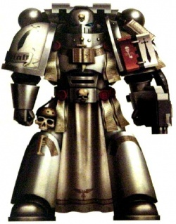

<!-- A0464-B0008 -->
**英文原文**

Founding Chapter:Derived from the Emperor

<!-- /A0464-B0008 -->

<!-- A0464-B0009 -->

原译文

建军战团：源自帝皇

**校订译文**

起源战团：无，基因据称直接源于帝皇。

<!-- /A0464-B0009 -->

<!-- A0464-B0010 -->
**英文原文**

Founding:Second Founding

<!-- /A0464-B0010 -->

<!-- A0464-B0011 -->

原译文

建军：二次建军

**校订译文**

建军：二次建军

<!-- /A0464-B0011 -->

<!-- A0464-B0012 -->
**英文原文**

Descendants:None Known

<!-- /A0464-B0012 -->

<!-- A0464-B0013 -->

原译文

后裔：未知

**校订译文**

已知子战团：无。

<!-- /A0464-B0013 -->

<!-- A0464-B0014 -->
**英文原文**

Chapter Master:Supreme Grand Master Kaldor Draigo

<!-- /A0464-B0014 -->

<!-- A0464-B0015 -->

原译文

战团长：至高大导师卡尔多·迪亚哥

**校订译文**

战团长：至高大导师卡尔多·迪亚哥

<!-- /A0464-B0015 -->

<!-- A0464-B0016 -->
**英文原文**

Homeworld:Titan

<!-- /A0464-B0016 -->

<!-- A0464-B0017 -->

原译文

家园世界：泰坦

**校订译文**

母星：泰坦。

<!-- /A0464-B0017 -->

<!-- A0464-B0018 -->
**英文原文**

Fortress-Monastery:The Citadel of Titan

<!-- /A0464-B0018 -->

<!-- A0464-B0019 -->

原译文

要塞修道院：泰坦城堡

**校订译文**

要塞修道院：泰坦城堡

<!-- /A0464-B0019 -->

<!-- A0464-B0020 -->
**英文原文**

Colours:Steel-grey

<!-- /A0464-B0020 -->

<!-- A0464-B0021 -->

原译文

颜色：钢-灰

**校订译文**

配色：钢灰色。

<!-- /A0464-B0021 -->

<!-- A0464-B0022 -->
**英文原文**

Specialty:Combating Daemons and Chaos

<!-- /A0464-B0022 -->

<!-- A0464-B0023 -->

原译文

专长：对抗恶魔和混沌

**校订译文**

专长：对抗恶魔和混沌

<!-- /A0464-B0023 -->

<!-- A0464-B0024 -->
**英文原文**

Strength:approx. 1,000

<!-- /A0464-B0024 -->

<!-- A0464-B0025 -->

原译文

兵力：约1000

**校订译文**

兵力：约1000

<!-- /A0464-B0025 -->

<!-- A0464-B0026 -->
**英文原文**

Battle Cry:'"We are the hammer!"'

<!-- /A0464-B0026 -->

<!-- A0464-B0027 -->

原译文

战吼：“我们是铁锤”

**校订译文**

战吼：“我们是战锤！”

<!-- /A0464-B0027 -->

<!-- A0464-B0028 -->
## Overview 概述

<!-- /A0464-B0028 -->

<!-- A0464-B0029 -->
**英文原文**

The Grey Knights are the legendary Chapter 666 - and although nominally a Chapter of the Astartes, they are in the Chamber Militant of the Inquisition. Each member of the chapter undergoes a gruelling and torturous selection process, and even once inducted, their harsh training regime is without equal. In battle, they move as an army of silver ghosts, surrounded by awe, and equipped to the teeth to deal with the worst foes that Chaos can raise to meet them.

<!-- /A0464-B0029 -->

<!-- A0464-B0030 -->

原译文

灰骑士是传说中的第666个战团，虽然名义上是的一个阿斯塔特战团，但他们是审判庭的军事辅军。战团的每个成员都经历了一个艰苦而痛苦的选拔过程，即使一旦服役，他们严厉的训练制度也是无与伦比的。在战斗中，他们像一支银色的幽灵军队一样行动，被敬畏所包围，装备精良，可以对付所能对付混沌的最坏的敌人。

**校订译文**

灰骑士是传说中的第666号战团。虽然名义上属于阿斯塔特战团，他们实际上是审判庭的军事力量。每名成员都须通过艰苦痛苦的选拔；即便正式加入，所受训练之严酷也无可比拟。他们在战场上如银色幽灵大军般前进，令人敬畏，全副武装以迎击混沌所能派出的最可怕敌人。

<!-- /A0464-B0030 -->

<!-- A0464-B0031 图片 -->
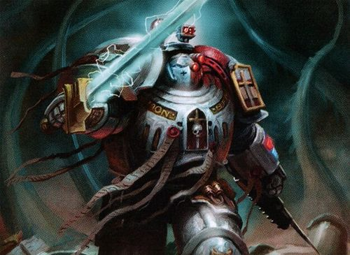

<!-- A0464-B0032 -->

原译文

Paragon of the Grey Knights 灰骑士典范

**校订译文**

Paragon of the Grey Knights 灰骑士典范

<!-- /A0464-B0032 -->

<!-- A0464-B0033 -->
**英文原文**

Ever since the Chapter's founding, only the Inquisition and Chapter Masters have been allowed to know of the Grey Knight's existence. Many chapters believe the Grey Knights to be a myth, if they have even heard of them at all. Space Marines who encounter them are telepathically scoured, while Imperial Guard regiments they fight beside are simply executed. The Space Wolves know of their existence, however, after slaughtering Grey Knights, Red Hunters and Inquisition Forces, during what the Grey Knights call the Months of Shame.

<!-- /A0464-B0033 -->

<!-- A0464-B0034 -->

原译文

自战团成立以来，只有审判庭和战团长才被允许知道灰骑士的存在。许多战团认为灰骑士是一个神话，如果他们听说过的话。遇到他们的星际战士会被传心搜查，而他们并肩作战的帝国卫队兵团则会被处决。然而，在灰骑士所称的“耻辱之月”期间，太空野狼在屠杀了灰骑士、红色猎手和审判庭之后，知道了他们的存在。

**校订译文**

自战团创建以来，只有审判庭与各战团长获准知晓灰骑士的存在。许多战团即便听过传闻，也只将他们当作神话。与他们接触的星际战士会被灵能清洗相关记忆，而与之并肩作战的帝国卫队部队则往往直接被处决。不过，太空野狼知道灰骑士确实存在：在灰骑士称为“耻辱之月”的冲突中，他们曾杀死大量灰骑士、红色猎手和审判庭部队成员。

**校注：** telepathically scoured 是以灵能清洗记忆，非单纯传心搜查；后文对保密政策另有具体历史语境。

<!-- /A0464-B0034 -->

<!-- A0464-B0035 -->
**英文原文**

To battle such enemies as Daemons, creatures that are not of this realm but formed of sorcery and madness, a Grey Knight must embrace the power of the Warp to battle a Daemon with its own weapons. Each Grey Knight is an accomplished, powerful psyker whose psychic presence is anathema to creatures of the Warp. They are trained to channel their psychic energies into a halo of protective wards known as The Aegis. Thusly armoured, a Grey Knight's presence becomes unpalatable to Daemons, making him immune to corruption, able to wield forbidden black magic, harness tainted artefacts and scour blasphemous tomes all without risk of being overwhelmed by the cursed power of Chaos.

<!-- /A0464-B0035 -->

<!-- A0464-B0036 -->

原译文

为了对抗像恶魔这样的敌人，这些生物不属于这个领域，而是由巫术和疯狂组成的，灰骑士必须接受亚空间的力量，用自己的武器与恶魔作战。每个灰骑士都是一个有成就的、强大的灵能者，他的灵能存在是亚空间生物所憎恶的。他们被训练成将他们的灵能能量引导到一个名为“宙斯盾”的保护性光环中。如此全副武装，灰骑士的存在对恶魔来说变得令人不快，使他免受腐化的影响，能够施展被禁止的黑魔法，驾驭被污染的圣物，并阅读亵渎的书籍—所有这些都没有被混沌的诅咒力量压倒的风险。

**校订译文**

恶魔并非现实世界的生物，而是巫术与疯狂的产物。要与之对抗，灰骑士必须运用亚空间力量，以恶魔赖以生存的力量反击它们。每名灰骑士都是强大而训练有素的灵能者，其灵能存在令亚空间生物憎恶。他们学会将灵能汇聚成由防护符印构成的光环，称为“神盾”。在这种保护下，灰骑士令恶魔难以接近，也不受腐化侵蚀，能够施展禁忌黑魔法、使用受污染的造物、研读亵渎典籍，而不致被混沌的诅咒力量吞没。

**校注：** Aegis 暂译神盾，避免误套现代武器专名宙斯盾；原文绝对化的免腐化说法照录。

<!-- /A0464-B0036 -->

<!-- A0464-B0037 -->
**英文原文**

The Grey Knights hold a unique honour among the chapters of the Adeptus Astartes - in over ten thousand years of service, not a single one of their number has ever defected to Chaos.

<!-- /A0464-B0037 -->

<!-- A0464-B0038 -->

原译文

灰骑士在阿斯塔特修会中享有独特的荣誉—在一万多年的服役中，他们中没有一个人叛逃到混沌。

**校订译文**

灰骑士在阿斯塔特修会中享有独特的荣誉—在一万多年的服役中，他们中没有一个人叛逃到混沌。

<!-- /A0464-B0038 -->

<!-- A0464-B0039 -->
**英文原文**

Their armour is left unpainted, leaving the silver-grey of the ceramite exposed. This tradition is thought to have originated from their desire to lead lives of absolute purity. Acid-etched into their left gauntlet, as well as tattooed upon the flesh beneath, is the sigil of Malcador the Sigilite.

<!-- /A0464-B0039 -->

<!-- A0464-B0040 -->

原译文

他们的盔甲没有上漆，露出了银灰色的陶钢。这一传统被认为源于他们渴望过上绝对纯洁的生活。刻在他们左手臂铠上的酸蚀，以及下面的血肉上的纹身，是掌印者马卡多的印记。

**校订译文**

他们的护甲不施漆色，露出陶钢本身的银灰。这一传统据说源于对绝对纯洁的追求。左手护手甲上，以酸蚀刻有掌印者马卡多的符印；护甲下的皮肤上，也纹着同样的标记。

<!-- /A0464-B0040 -->

<!-- A0464-B0041 -->
## History 历史

<!-- /A0464-B0041 -->

<!-- A0464-B0042 -->
### Origins 起源

<!-- /A0464-B0042 -->

<!-- A0464-B0043 -->
**英文原文**

Much of the Grey Knights history remains in mystery and secrecy or has been purposefully removed from archives. However according to legend, the Grey Knights began as a project during the final days of the Horus Heresy. The Emperor foresaw that the Heresy would likely end at such a great personal cost to himself that he would be prevented from actively defending mankind from the great threat of Chaos and its Daemons, so he set in motion a plan to form a defence against such evil. Malcador the Sigilite, closest of the Emperor's servants, was sent to search across the Imperium for men suitable to rise to such a burden.

<!-- /A0464-B0043 -->

<!-- A0464-B0044 -->

原译文

灰骑士的大部分历史仍然是神秘和保密的，或者被有意从档案中删除。然而，据传说，灰骑士是在荷鲁斯叛乱的最后几天开始的一个项目。帝皇预见到叛乱可能会以如此巨大的个人代价结束，以至于他将无法积极保护人类免受混沌及其恶魔的巨大威胁，因此他启动了一项计划来防御这种邪恶。掌印者马卡多是帝皇最亲密的仆人，被派往帝国各地寻找适合承担这种负担的人。

**校订译文**

灰骑士的大部分历史仍藏于谜团与机密中，或已被有意从档案抹去。据传，创建计划始于荷鲁斯之乱末期。帝皇预见，平定叛乱可能令自己付出极大代价，使他再无力亲自守护人类、抵御混沌及其恶魔。因此，他开始筹建对抗这种邪恶的防线，派遣最亲近的仆从掌印者马卡多，遍寻帝国，寻找能够承担这一重任的人选。

<!-- /A0464-B0044 -->

<!-- A0464-B0045 图片 -->
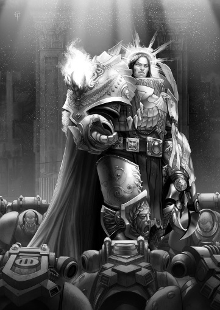

<!-- A0464-B0046 -->

原译文

The Emperor approving of the Knights-Errant chosen to become the first Grey Knights 帝皇批准了被选为第一批灰骑士的游侠骑士

**校订译文**

The Emperor approving of the Knights-Errant chosen to become the first Grey Knights 帝皇批准了被选为第一批灰骑士的游侠骑士

<!-- /A0464-B0046 -->

<!-- A0464-B0047 -->
**英文原文**

Malcador found twelve worthy champions; four were lords and administrators, and eight were Space Marines from both loyalist and traitor legions. These included survivors of the Eisenstein incident, Nathaniel Garro, Amendera Kendel, Lemuel Gaumon, and Kyril Sindermann. During the founding of the organisation others would join them including Tylos Rubio, Macer Varren, Janus, the Nemean, Fel Zharost, and Garviel Loken. Many of the Space Marines that joined the cause hailed from Legions that had turned traitor, though they themselves had remained loyal to the Emperor. However, not all of these Knights-Errant would go on to form the Grey Knights. Ultimately shortly before the Siege of Terra, Malcador gathered the original Grey Knights to his side. Their original identities were made secret, but were known to history as Janus, Epimetheus, Khyron, Koios, Ogen, Iapto, Yotun, and Satre. Once they had been gathered, the Emperor surveyed the chosen recruits and granted both his approval and consent to proceed with the project. So the recruits split ways to go off towards separate tasks; the four lords ventured off to lay the framework of the Inquisition, whilst the Space Marines and Malcador traveled to Saturn's moon of Titan.

<!-- /A0464-B0047 -->

<!-- A0464-B0048 -->

原译文

马卡多找到了十二位当之无愧的冠军；其中四名是领主和行政人员，八名是来自忠诚和叛徒军团的星际战士。其中包括爱森斯坦事件的幸存者纳撒尼尔·伽罗、阿蒙德菈·肯德尔、莱缪尔·高蒙和基里尔·辛德曼。在该组织成立期间，其他人也加入了他们，包括泰洛斯·卢比奥、马克尔·瓦伦、雅努斯、尼米亚、费尔·扎罗斯特和加维尔·洛肯。许多加入这项事业的星际战士来自叛变的军团，尽管他们自己仍然忠于帝皇。然而，并非所有这些游侠骑士都会继续组建灰骑士。最终，在泰拉围城之前不久，马卡多召集了最初的灰骑士到他身边。他们最初的身份被保密，但历史上称为雅努斯、厄庇墨透斯、凯戎、科俄斯、奥根、拉普托、尤顿和萨彻。他们聚集在一起，帝皇调查了被选中的新兵，并批准和同意继续进行该项目。因此，新兵们分道扬镳，各司其职；四位领主冒险建立了审判庭的框架，而星际战士和马尔卡多则前往土星的卫星泰坦。

**校订译文**

马卡多找到了十二名合适人选：四名领主与行政人员，以及八名来自忠诚或叛变军团的星际战士。记载涉及爱森斯坦事件的幸存者，以及纳撒尼尔·伽罗、阿蒙德菈·肯德尔、莱缪尔·高蒙和基里尔·辛德曼等人。组织筹建期间，泰洛斯·卢比奥、马塞尔·瓦伦、雅努斯、尼米亚、费尔·扎罗斯特与加维尔·洛肯等也相继加入。许多星际战士来自已经叛变的军团，却始终忠于帝皇。不过，并非所有游侠骑士后来都成为灰骑士。泰拉围城前不久，马卡多将最初的灰骑士召至身边。他们原先的身份被封为机密，历史只记得他们后来的名字：雅努斯、厄庇墨透斯、凯戎、科俄斯、奥根、伊阿普托、尤顿与萨彻。帝皇亲自审视这些人选，批准继续执行计划。此后，众人分头承担不同任务：四名领主着手建立审判庭的基础，星际战士则与马卡多一道前往土星卫星泰坦。

**校注：** 英文名单的语法将 Eisenstein incident survivors 与若干人名直接相连，不能据此断言后列每个人均在爱森斯坦事件中；列名不删。Iapto 首字母为 I，原译拉普托疑误读为小写 l，暂改伊阿普托。

<!-- /A0464-B0048 -->

<!-- A0464-B0049 -->
**英文原文**

Titan, through Malcador's mystical means, had been hidden away from the ravages of the Horus Heresy. When they arrived they found a Fortress-monastery already fully prepared and stocked with everything necessary to create a new army of Space Marines including supplies of gene-seed, which is suspected to have been taken from the Emperor directly, and all the necessary armaments. The fortress was also already populated with hundreds upon hundreds of suitable recruits from across the Galaxy. Some were raw and untrained, whilst others were selected in secret from among the ranks of loyalist Legions. This new army would be a Chapter — a smaller, tighter brotherhood of Space Marines than a Legion. Malcador could no longer remain and thus he appointed Janus, one of the eight original Space Marines, to be the Grey Knights leader and take the title of Supreme Grand Master. Before leaving, Malcador cast his greatest enchantment yet; he hid Titan away from Horus in the most unlikely of places, inside the Warp itself. Titan was protected by Macro-Geller fields and sigilic rites whilst the final battles of the Heresy took place in Real Space.

<!-- /A0464-B0049 -->

<!-- A0464-B0050 -->

原译文

泰坦，通过马卡多的神秘手段，躲过了荷鲁斯叛乱的蹂躏。当他们到达时，他们发现一座堡垒修道院已经准备充分，并储备了创建一支新的星际战士所需的一切，包括基因种子的供应，怀疑是直接从帝皇那里拿走的，以及所有必要的武器。这座堡垒已经挤满了来自银河系各地的数百名合适的新兵。有些是未经训练的原始士兵，而另一些则是从忠诚的军团中秘密挑选出来的。这支新军队将是一个战团—一个比军团更小、更紧密的星际战士兄弟会。马卡多再也不能留下来了，因此他任命八名原初星际战士之一的雅努斯为灰骑士领袖，并获得至高大导师的称号。临走前，马卡多施展了他迄今为止最强大的魔法；他把泰坦藏在最不可能的地方，也就是亚空间本身，远离荷鲁斯。泰坦受到宏盖勒力场和魔纹仪式的保护，而叛乱的最后一场战斗发生在真实空间。

**校订译文**

马卡多以神秘手段隐藏泰坦，使其免遭荷鲁斯之乱蹂躏。众人抵达时，一座要塞修道院早已准备就绪，储有组建星际战士新军所需的一切，包括全部武器装备与基因种子；这些基因种子疑似直接取自帝皇。要塞中还聚集着来自银河各地的大批合适新兵，一些全无训练，另一些则从忠诚军团中秘密选拔。这支新军将组成战团，规模小于军团，成员关系也更紧密。马卡多无法继续停留，便任命最初八人之一的雅努斯担任领袖，授予至高大导师之衔。离去前，他施展了迄今最强大的法术，将泰坦藏进荷鲁斯最难料到的地方——亚空间本身。叛乱最后的诸场决战在现实空间上演时，泰坦由巨型盖勒力场与符印仪式护卫。

<!-- /A0464-B0050 -->

<!-- A0464-B0051 -->
**英文原文**

When Titan eventually returned, the Second Founding was taking place. Whilst in the Warp, time had passed at a greater rate for Titan and so it had emerged not with the original eight Space Marines and their raw recruits, but with a full Chapter of one thousand fully trained Battle-Brothers. The Second Founding was being directed by the newly formed Inquisition under the control of the same lords who Malcador had selected years before. So they secretly included the Grey Knights amongst the growing list of new Chapters, designating them Chapter 666, despite there being barely 400 Chapters commissioned at the time. The Grey Knights, different from all the other new Chapters, were embedded within the Inquisition to serve as the Chamber Militant of the Ordo Malleus to fight against all things Daemonic.

<!-- /A0464-B0051 -->

<!-- A0464-B0052 -->

原译文

当泰坦最终回归时，二次建军正在进行。在亚空间中，泰坦的时间以更快的速度流逝，因此它不是与最初的八名星际战士及其新兵一起出现的，而是与一千名训练有素的战斗兄弟组成的完整战团一起出现的。二次建军由新成立的审判庭领导，由马卡多多年前选定的同一批领主控制。因此，他们秘密地将灰骑士列入了越来越多的新战团名单中，将其指定为第666战团，尽管当时只有400个战团被建立。与所有其他新战团不同，灰骑士团被嵌入审判庭，担任圣锤修会的军事辅军，与所有恶魔作战。

**校订译文**

泰坦最终重返现实空间时，第二次建军正在进行。亚空间中的时间对泰坦而言流逝得更快，因此归来的已不只是原先八名星际战士和未经训练的新兵，而是一个拥有千名训练完备的战斗兄弟的满编战团。按本段记载，第二次建军由新成立的审判庭主持，主事者正是马卡多当年选定的那几名领主。他们秘密将灰骑士列入新战团名单，编号666；当时获准组建的战团其实尚不足四百个。与其他新战团不同，灰骑士被纳入审判庭，成为恶魔审判庭的军事分支，专事对抗恶魔。

**校注：** 英文明确将二次建军主持者归为审判庭，与书中基里曼主导的概述有差异，照实保留并提示来源限定；Chapter 666 是编号，不表示当时已有666个战团。

<!-- /A0464-B0052 -->

<!-- A0464-B0053 -->
### War of the Beast 野兽战争

<!-- /A0464-B0053 -->

<!-- A0464-B0054 -->
**英文原文**

Kyril Sindermann, later known as Inquisitor Lastan Neemagiun Veritus, survived for 1,500 years until the end of the War of the Beast. After being poisoned by High Lord Drakan Vangorich, head of the Assassinorum, he confided in fellow Inquisitor Wienand that he was the last of the four Inquisitors to know of the founding of the Grey Knights. He revealed that he ordered the Grey Knights to battle the forces of Chaos during the centuries following the Horus Heresy, but knowledge of them were kept to only himself, the Grey Knights, and those who were currently deceased. They were too important of a force to be wasted during the War of the Beast, and the current structure of the Inquisition would prevent them from being used properly to defeat the threat of Chaos.

<!-- /A0464-B0054 -->

<!-- A0464-B0055 -->

原译文

凯里尔·辛德曼，后来被称为审判官拉斯坦·尼玛珺·维里图斯，存活了1500年，直到野兽战争结束。在被刺客组织首领高领主德拉坎·万戈里奇毒死前，他向同为审判官的维南德吐露，他是四位审判官中最后一位知道灰骑士成立的人。他透露，在荷鲁斯叛乱之后的几个世纪里，他命令灰骑士与混沌势力作战，但关于他们的知识只留给他自己、灰骑士和那些目前已经去世的人。他们是一支非常重要的力量，不能在野兽战争中浪费，而目前审判庭的结构将阻止他们被正确地用来击败混乱的威胁。

**校订译文**

基里尔·辛德曼后来以审判官拉斯坦·尼玛珺·维里图斯之名为人所知，活过一千五百年，直到野兽战争结束。遭刺客庭首脑、高领主德拉坎·万戈里奇下毒后，他向审判官同僚维南德透露：当年知晓灰骑士成立的四名审判官，如今只剩自己。他曾在荷鲁斯之乱后的数个世纪里指派灰骑士迎战混沌，而知晓这支部队的人，除他与灰骑士本身外，都已故去。灰骑士太过重要，不能消耗在野兽战争中；当时审判庭的组织结构，也妨碍正确运用他们对抗混沌。

<!-- /A0464-B0055 -->

<!-- A0464-B0056 图片 -->
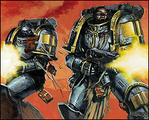

<!-- A0464-B0057 -->

原译文

Grey Knights during the chapter's early conception 战团早期构思中的灰骑士

**校订译文**

Grey Knights during the chapter's early conception 战团早期构思中的灰骑士

<!-- /A0464-B0057 -->

<!-- A0464-B0058 -->
**英文原文**

Before dying, he imparted to her a code chip that allowed her access to Titan and to meet with Supreme Grand Master Janus. Once having navigated through the various environmental protections offered by the moon, she discussed the splitting of the Inquisition into the Ordo Xenos and Ordo Malleus, with the Grey Knights serving as Ordo Malleus's chamber militant. She later died on Terra a century later after helping to ensure that Vangorich was overthrown, leaving it unclear as to the restructuring of the Inquisition was yet implemented or not.

<!-- /A0464-B0058 -->

<!-- A0464-B0059 -->

原译文

临死前，他给了她一个代码芯片，让她能够进入泰坦并与至高大导师雅努斯会面。在探索了卫星提供的各种环境保护措施后，她讨论了将审判庭分为攘外修会和圣锤修会的问题，其中灰骑士担任圣锤修会的军事辅军。一个世纪后，她在泰拉上去世，此前她帮助确保了万戈里奇被推翻，因此不清楚审判庭的重组是否已经实施。

**校订译文**

临终前，他交给维南德一枚密码芯片，使她得以进入泰坦、会见至高大导师雅努斯。通过卫星重重防护后，她与雅努斯讨论将审判庭划分为异形审判庭与恶魔审判庭，并由灰骑士担任后者军事分支的方案。此后，她协助推翻万戈里奇，又过了一个世纪才在泰拉去世。到那时，这项审判庭重组究竟是否实施，记载并不清楚。

<!-- /A0464-B0059 -->

<!-- A0464-B0060 -->
### First War for Armageddon 第一次阿玛吉多顿战争

<!-- /A0464-B0060 -->

<!-- A0464-B0061 -->
**英文原文**

In 444.M41, an entire Grey Knight Terminator brotherhood held back the last large-scale incursion but incurred heavy losses. Leader of the taskforce, Brother-Captain Aurellian died after personally banishing the Daemon Prince, Angron back into the Warp. Altogether, a bodyguard of over a dozen powerful Bloodthirster daemons, along with countless other minions of Khorne were destroyed by the Grey Knights, effectively ending the incursion. Only about a dozen Grey Knights survived the climatic battle, but the daemonic horde was completely decimated. The war is also notable for the veterans that survived, including future Grand Masters Vorth Mordrak and Mandulis; Brother-Captains Arvann Stern, Caddon Varn and Dhark Tegvar; and the current Castellan of the Purifier brotherhood — Garran Crowe.

<!-- /A0464-B0061 -->

<!-- A0464-B0062 -->

原译文

444.M41年，整个灰骑士终结者兄弟会阻止了最后一次大规模入侵，但遭受了重大损失。特遣部队的领导者，兄弟连长奥瑞利安，在亲自将恶魔王子安格隆驱逐回亚空间后牺牲。总之，一个由十几个强大的嗜血狂魔组成的护卫，以及无数其他恐虐的恶魔被灰骑士摧毁，有效地结束了入侵。只有大约十几名灰骑士在战斗中幸存下来，但恶魔部落被彻底摧毁。这场战争幸存的老兵也得以闻名，包括未来的大导师沃尔斯·莫德拉克和曼杜利斯；兄弟连长艾维安·斯特恩、卡顿·瓦恩和达克·泰格瓦尔；还有净化者兄弟会的现任堡主加兰·克洛维。

**校订译文**

444.M41，一整支灰骑士终结者兄弟会挡住了当时最近的一场大规模入侵，却损失惨重。特遣部队统领、兄弟会连长奥瑞利安亲自将恶魔亲王安格隆放逐回亚空间，随后牺牲。灰骑士还消灭了十余名强大的嗜血狂魔近卫，以及无数恐虐爪牙，最终终结入侵。高潮决战后，幸存灰骑士仅有十余人，恶魔大军则几乎全灭。此战也因幸存老兵而闻名：他们包括后来的大导师沃尔斯·莫德拉克、曼杜利斯，兄弟会连长艾维安·斯特恩、卡顿·瓦恩、达克·泰格瓦尔，以及原文记载时净化者兄弟会的堡主加兰·克罗。

<!-- /A0464-B0062 -->

<!-- A0464-B0063 -->
**英文原文**

After the war, the Grey Knights were instrumental in purging the Imperial Guard and civilian survivors to cleanse any remaining taint of Chaos. The Grey Knights also purged a multitude of planets and outposts that had come into any contact with the survivors. This led them into a conflict with the Space Wolves and the death of Grand Master Joros at the hands of Logan Grimnar. Some in the Grey Knights dub the entire aftermath of the war and ensuing conflict with the Space Wolves to be the Months of Shame.

<!-- /A0464-B0063 -->

<!-- A0464-B0064 -->

原译文

战争结束后，灰骑士在清除帝国卫队和平民幸存者以清除任何剩余的混沌污染方面发挥了重要作用。灰骑士还清除了与幸存者有过任何接触的众多行星和前哨。这导致他们与太空野狼发生冲突，大导师乔洛斯死于罗根·格里姆纳尔之手。灰骑士的一些人将战争的整个后果以及随后与太空野狼的冲突称为“耻辱之月”。

**校订译文**

战后，为消除残余混沌污染，灰骑士参与清洗帝国卫队与平民幸存者，并净化了许多曾与这些人接触的行星和前哨。这使他们与太空野狼发生冲突，大导师乔洛斯死于洛根·格里姆纳尔之手。一些灰骑士将战后的清洗以及与太空野狼的整场冲突，称为“耻辱之月”。

<!-- /A0464-B0064 -->

<!-- A0464-B0065 -->
### Noctis Aeterna 永恒之夜

<!-- /A0464-B0065 -->

<!-- A0464-B0066 -->
**英文原文**

During the formation of the Great Rift at the beginning of M42, the Imperium was beset by an unprecedented number of Daemonic outbreaks. The Grey Knights were at the forefront of the fighting in the subsequent Terran Crusade and Battle of Lion's Gate on Terra. In the aftermath, The Grey Knights worked desperately to curb Daemonic outbreaks in the Dark Imperium and beyond. During these campaigns they were forced to annihilate billions of Imperial citizens.

<!-- /A0464-B0066 -->

<!-- A0464-B0067 -->

原译文

在M42开始形成大裂隙期间，帝国受到前所未有的恶魔爆发的困扰。灰骑士在随后的泰拉远征和狮门之战中处于战斗的最前沿。之后，灰骑士拼命遏制黑暗帝国内外的恶魔爆发。在这些战役中，他们被迫消灭了数十亿帝国公民。

**校订译文**

第四十二个千年之初，大裂隙形成，帝国各地爆发了数量空前的恶魔入侵。灰骑士在随后的泰拉远征与泰拉狮门之战中奋战于最前线，此后又竭力压制黑暗帝国及其他地区的恶魔灾祸。在这些行动中，他们被迫杀死数十亿帝国公民。

<!-- /A0464-B0067 -->

<!-- A0464-B0068 图片 -->
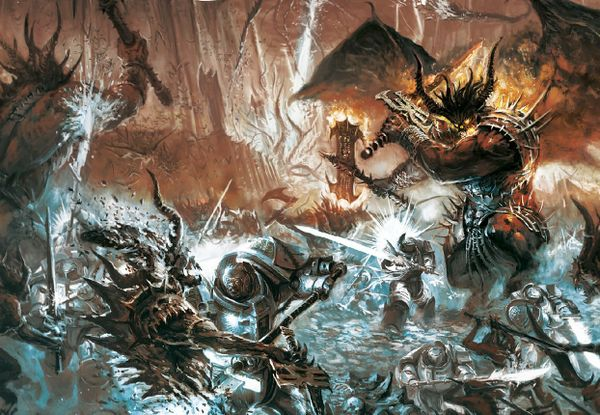

<!-- A0464-B0069 -->

原译文

The Grey Knights battle Daemons of Khorne 灰骑士与恐虐恶魔作战

**校订译文**

The Grey Knights battle Daemons of Khorne 灰骑士与恐虐恶魔作战

<!-- /A0464-B0069 -->

<!-- A0464-B0070 -->
### Other campaigns 其他战役

<!-- /A0464-B0070 -->

<!-- A0464-B0071 -->

原译文

290.M34 — War against the Hollow Cult 空心邪教对抗战争

**校订译文**

290.M34 — War against the Hollow Cult 对抗空心教派的战争

<!-- /A0464-B0071 -->

<!-- A0464-B0072 -->

原译文

948.M38 — First Scouring of Coriolanthe 第一次科里奥兰净化

**校订译文**

948.M38 — First Scouring of Coriolanthe 第一次科里奥兰净化

<!-- /A0464-B0072 -->

<!-- A0464-B0073 -->

原译文

453.M40 — Cleansing of Hovar III 霍瓦尔三号清洗

**校订译文**

453.M40 — Cleansing of Hovar III 霍瓦尔三号清洗

<!-- /A0464-B0073 -->

<!-- A0464-B0074 -->
**英文原文**

649.M40 — Suppressing the Garanhir Rebellion with the forces of Inquisition, Black Wings and Dark Swords Chapters

<!-- /A0464-B0074 -->

<!-- A0464-B0075 -->

原译文

用审判庭、黑翼和黑剑战团的力量镇压加兰希尔叛乱

**校订译文**

649.M40——与审判庭、黑翼及黑剑战团的部队共同镇压加兰希尔叛乱。

<!-- /A0464-B0075 -->

<!-- A0464-B0076 -->

原译文

728.M40 — Thule Decimation 图勒毁灭

**校订译文**

728.M40 — Thule Decimation 图勒毁灭

<!-- /A0464-B0076 -->

<!-- A0464-B0077 -->

原译文

447.M41 — Сounteraction the Godjera Incursion 对抗哥吉拉入侵

**校订译文**

447.M41 — Сounteraction the Godjera Incursion 对抗哥吉拉入侵

<!-- /A0464-B0077 -->

<!-- A0464-B0078 -->

原译文

601.M41 — The Battle of Crytor 克瑞托之战

**校订译文**

601.M41 — The Battle of Crytor 克瑞托之战

<!-- /A0464-B0078 -->

<!-- A0464-B0079 -->

原译文

799.M41 — The First Cleansing of Acrelem 第一次阿克雷勒姆清洗

**校订译文**

799.M41 — The First Cleansing of Acrelem 第一次阿克雷勒姆清洗

<!-- /A0464-B0079 -->

<!-- A0464-B0080 -->

原译文

827.M41 — The Siege of Vraks 弗拉克斯围城

**校订译文**

827.M41 — The Siege of Vraks 弗拉克斯围城

<!-- /A0464-B0080 -->

<!-- A0464-B0081 -->

原译文

841.M41 - The Raxos Civil War 拉索斯内战

**校订译文**

841.M41 - The Raxos Civil War 拉索斯内战

<!-- /A0464-B0081 -->

<!-- A0464-B0082 -->

原译文

855.M41 - The Destruction of the Red Talon Cults 摧毁红爪邪教

**校订译文**

855.M41 - The Destruction of the Red Talon Cults 摧毁红爪邪教

<!-- /A0464-B0082 -->

<!-- A0464-B0083 -->

原译文

901.M41 - The Battle of Kornovin 科尔诺温之战

**校订译文**

901.M41 - The Battle of Kornovin 科尔诺温之战

<!-- /A0464-B0083 -->

<!-- A0464-B0084 -->

原译文

913.M41 — The Purging of Jollana 乔拉纳净化

**校订译文**

913.M41 — The Purging of Jollana 乔拉纳净化

<!-- /A0464-B0084 -->

<!-- A0464-B0085 -->

原译文

941.M41 - The Plague of Madness 疯狂瘟疫

**校订译文**

941.M41 - The Plague of Madness 疯狂瘟疫

<!-- /A0464-B0085 -->

<!-- A0464-B0086 -->

原译文

959-961.M41 - The Pandorax Campaign 潘多拉克斯战役

**校订译文**

959-961.M41 - The Pandorax Campaign 潘多拉克斯战役

<!-- /A0464-B0086 -->

<!-- A0464-B0087 -->

原译文

980.M41 - The Raid on Bakka 巴卡突袭

**校订译文**

980.M41 - The Raid on Bakka 巴卡突袭

<!-- /A0464-B0087 -->

<!-- A0464-B0088 -->

原译文

989.M41 - The Perun Cross Incident 佩伦十字事件

**校订译文**

989.M41 - The Perun Cross Incident 佩伦十字事件

<!-- /A0464-B0088 -->

<!-- A0464-B0089 -->

原译文

997.M41 - The battle for Sondheim V 桑德海姆五号之战

**校订译文**

997.M41 - The battle for Sondheim V 桑德海姆五号之战

<!-- /A0464-B0089 -->

<!-- A0464-B0090 -->

原译文

pre-999.M41 - The War in Gheldrith's Eye 盖尔德里斯之眼战争

**校订译文**

pre-999.M41 - The War in Gheldrith's Eye 盖尔德里斯之眼战争

<!-- /A0464-B0090 -->

<!-- A0464-B0091 -->

原译文

999.M41 - The Battle of the Boros Gate 波罗斯门之战

**校订译文**

999.M41 - The Battle of the Boros Gate 波罗斯门之战

<!-- /A0464-B0091 -->

<!-- A0464-B0092 -->
**英文原文**

999.M41 - The Hunt for the Wulfen and the Siege of the Fenris System

<!-- /A0464-B0092 -->

<!-- A0464-B0093 -->

原译文

对狼人的追猎与芬里斯星系围攻

**校订译文**

999.M41——追猎狼人，以及芬里斯星系围城战。

<!-- /A0464-B0093 -->

<!-- A0464-B0094 -->

原译文

999.M41 - The 13th Black Crusade 第十三次黑色远征

**校订译文**

999.M41 - The 13th Black Crusade 第十三次黑色远征

<!-- /A0464-B0094 -->

<!-- A0464-B0095 -->

原译文

999.M41 - The Purging of the Relictors chapter 净化遗物战团

**校订译文**

999.M41 - The Purging of the Relictors chapter 净化遗物守护者战团

<!-- /A0464-B0095 -->

<!-- A0464-B0096 -->
**英文原文**

~999.M41 - The Ultramar Campaign and subsequent Terran Crusade and Battle of Lion's Gate

<!-- /A0464-B0096 -->

<!-- A0464-B0097 -->

原译文

奥特拉玛战役及其后的泰拉远征和狮门之战

**校订译文**

约999.M41——奥特拉玛战役，以及随后的泰拉远征与狮门之战。

<!-- /A0464-B0097 -->

<!-- A0464-B0098 -->

原译文

~999.M41 - The cleansing of Ganymede 清洗木卫三

**校订译文**

~999.M41 - The cleansing of Ganymede 清洗木卫三

<!-- /A0464-B0098 -->

<!-- A0464-B0099 -->

原译文

???.M41 - The Assault on Beroghast 袭击贝罗格斯特

**校订译文**

???.M41 - The Assault on Beroghast 袭击贝罗格斯特

<!-- /A0464-B0099 -->

<!-- A0464-B0100 -->

原译文

???.M41 - The Bray-Nexus 布雷-奈克瑟斯

**校订译文**

???.M41 - The Bray-Nexus 布雷-奈克瑟斯

<!-- /A0464-B0100 -->

<!-- A0464-B0101 -->

原译文

???.M41 - The Cauldon of Biletide 比莱泰德大锅

**校订译文**

???.M41 - The Cauldon of Biletide 比莱泰德大锅

<!-- /A0464-B0101 -->

<!-- A0464-B0102 -->

原译文

???.M41 - The Gore Sun Incursion 戈尔·孙入侵

**校订译文**

???.M41 - The Gore Sun Incursion 血日入侵

**校注：** Gore Sun 按词义暂译血日，原戈尔·孙误作人名式音译。

<!-- /A0464-B0102 -->

<!-- A0464-B0103 -->

原译文

???.M41 - The Battle of Stynarous IV 斯泰纳罗斯四号之战

**校订译文**

???.M41 - The Battle of Stynarous IV 斯泰纳罗斯四号之战

<!-- /A0464-B0103 -->

<!-- A0464-B0104 -->

原译文

???.M41 - The Dierna System Campaign 迪耶纳星系战役

**校订译文**

???.M41 - The Dierna System Campaign 迪耶纳星系战役

<!-- /A0464-B0104 -->

<!-- A0464-B0105 -->

原译文

???.M42 - The Battle of Antraxes 心宿二之战

**校订译文**

???.M42 - The Battle of Antraxes 安特拉克西斯之战

**校注：** Antraxes 不同于心宿二 Antares，原译混淆；暂音译安特拉克西斯。

<!-- /A0464-B0105 -->

<!-- A0464-B0106 -->

原译文

???.M42 — The Battle of Gathalamor 加塔拉莫之战

**校订译文**

???.M42 — The Battle of Gathalamor 加塔拉莫之战

<!-- /A0464-B0106 -->

<!-- A0464-B0107 -->

原译文

???.M42 — The Invasion of the Stygius Sector 冥河星区入侵

**校订译文**

???.M42 — The Invasion of the Stygius Sector 冥河星区入侵

<!-- /A0464-B0107 -->

<!-- A0464-B0108 -->

原译文

~100s.M42 — The Plague Wars 瘟疫战争

**校订译文**

~100s.M42 — The Plague Wars 瘟疫战争

<!-- /A0464-B0108 -->

<!-- A0464-B0109 -->

原译文

~100s.M42 — The Battle of Hamagora 哈马戈拉之战

**校订译文**

~100s.M42 — The Battle of Hamagora 哈马戈拉之战

<!-- /A0464-B0109 -->

<!-- A0464-B0110 -->

原译文

???.M42 — The Invasion of Konor 康诺入侵

**校订译文**

???.M42 — The Invasion of Konor 康诺入侵

<!-- /A0464-B0110 -->

<!-- A0464-B0111 -->

原译文

???.M42 — The Battle for the Aspis System 阿斯匹斯星系之战

**校订译文**

???.M42 — The Battle for the Aspis System 阿斯匹斯星系之战

<!-- /A0464-B0111 -->

<!-- A0464-B0112 -->

原译文

???.M42 - The Assault on Sortiarius 索提尔瑞斯突击

**校订译文**

???.M42 - The Assault on Sortiarius 索提尔瑞斯突击

<!-- /A0464-B0112 -->

<!-- A0464-B0113 -->

原译文

???.M42 - The Charadon Campaign 查拉顿战役

**校订译文**

???.M42 - The Charadon Campaign 查拉顿战役

<!-- /A0464-B0113 -->

<!-- A0464-B0114 -->

原译文

???.M42 - The battle for Hexenfast 赫克森法斯特之战

**校订译文**

???.M42 - The battle for Hexenfast 赫克森法斯特之战

<!-- /A0464-B0114 -->

<!-- A0464-B0115 -->

原译文

???.M42 - The Battle of Manask 马纳斯克之战

**校订译文**

???.M42 - The Battle of Manask 马纳斯克之战

<!-- /A0464-B0115 -->

<!-- A0464-B0116 -->
**英文原文**

???.M42 - The Battle of Malak during the Arks of Omen Campaign. Over 60 Grey Knights from the 4th Brotherhood under Drystann Cromm attempt to banish the returned Daemon Primarch Angron, but all are slain.

<!-- /A0464-B0116 -->

<!-- A0464-B0117 -->

原译文

噩兆方舟战役中的马拉克之战。来自德里斯坦·克罗姆领导的第四兄弟会的60多名灰骑士试图驱逐返回的恶魔原体安格隆，但所有人都被杀了。

**校订译文**

???.M42——噩兆方舟战役期间的马拉克之战。德里斯坦·克罗姆率第四兄弟会六十余名灰骑士，试图放逐再度现世的恶魔原体安格隆，最终全军覆没。

<!-- /A0464-B0117 -->

<!-- A0464-B0118 -->

原译文

??? - The great victory at Archaenologos 阿尔切诺戈斯大捷

**校订译文**

??? - The great victory at Archaenologos 阿尔切诺戈斯大捷

<!-- /A0464-B0118 -->

<!-- A0464-B0119 -->

原译文

??? - The battle of Sarkon's Knell 沙克昂凶兆之战

**校订译文**

??? - The battle of Sarkon's Knell 沙克昂凶兆之战

<!-- /A0464-B0119 -->

<!-- A0464-B0120 -->

原译文

??? - The Sturmhex Incident 斯图姆海克斯事件

**校订译文**

??? - The Sturmhex Incident 斯图姆海克斯事件

<!-- /A0464-B0120 -->

<!-- A0464-B0121 -->
## Organisation 组织

<!-- /A0464-B0121 -->

<!-- A0464-B0122 -->
**英文原文**

The Bulk of the Grey Knights Chapter is organized into Brotherhoods, fighting formations roughly equivalent to a Space Marine Company and consisting of around one hundred Battle Brothers. Each Brotherhood is overseen by a Grand Master There are eight known Grey Knights Brotherhoods plus the Purifier and Paladin Orders.

<!-- /A0464-B0122 -->

<!-- A0464-B0123 -->

原译文

灰骑士战团的大部分被组织成兄弟会，战斗编队大致相当于一个星际战士连队，由大约一百名战斗兄弟组成。每个兄弟会都由一位大导师监督。有八个已知的灰骑士兄弟会，以及净化者和圣骑士修会。

**校订译文**

灰骑士战团的主体编成兄弟会，每个兄弟会约一百名战斗兄弟，规模大致相当于星际战士的一连，由一位大导师统辖。已知共有八个兄弟会，另设净化者修会与圣骑士修会。

<!-- /A0464-B0123 -->

<!-- A0464-B0124 -->
**英文原文**

Most of the Chapter's strength is spread through the Imperium, ensuring that the fighting skills of the Grey Knights can be quickly called upon by the Ordo Malleus wherever a daemonic incursion may occur. These small forces are often deployed far from their fortress-monastery for long periods at a time, and are usually organised into small teams that have trained and fought together for their entire lives.

<!-- /A0464-B0124 -->

<!-- A0464-B0125 -->

原译文

该战团的大部分部队都在帝国中游荡，确保灰骑士的战斗技能可以在任何可能发生恶魔入侵的地方被圣锤修会迅速调用。这些小部队经常一次长期部署在远离要塞修道院的地方，通常被组织成小团队，他们一生都在一起训练和战斗。

**校订译文**

战团大部分兵力分驻帝国各地，以便恶魔审判庭能够迅速调遣灰骑士，应对任何地方爆发的恶魔入侵。这些小部队常年远离要塞修道院，通常由一生共同训练、并肩作战的战士组成小队。

<!-- /A0464-B0125 -->

<!-- A0464-B0126 -->
### Brotherhoods 兄弟会

<!-- /A0464-B0126 -->

<!-- A0464-B0127 -->
**英文原文**

The current Brotherhood strength and commanders of the Chapter are:

<!-- /A0464-B0127 -->

<!-- A0464-B0128 -->

原译文

目前兄弟会的力量和战团的指挥官是：

**校订译文**

原文列出的各兄弟会兵力与指挥官如下：

<!-- /A0464-B0128 -->

<!-- A0464-B0129 -->
### Hall of Champions 冠军大厅

<!-- /A0464-B0129 -->

<!-- A0464-B0130 图片 -->
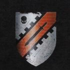

<!-- A0464-B0131 -->

原译文

High Paladin Koiar Tempus 至高圣骑士科亚尔·坦帕斯

**校订译文**

High Paladin Koiar Tempus 至高圣骑士科亚尔·坦帕斯

<!-- /A0464-B0131 -->

<!-- A0464-B0132 -->

原译文

1 Paladin Ancient 一名圣骑士旗手

**校订译文**

1 Paladin Ancient 一名圣骑士旗手

<!-- /A0464-B0132 -->

<!-- A0464-B0133 -->

原译文

98 Paladins 98名圣骑士

**校订译文**

98 Paladins 98名圣骑士

<!-- /A0464-B0133 -->

<!-- A0464-B0134 -->

原译文

12 Venerable Dreadnoughts 12位神圣无畏

**校订译文**

12 Venerable Dreadnoughts 12台神圣无畏机甲

<!-- /A0464-B0134 -->

<!-- A0464-B0135 -->
### Chamber of Purity 纯洁圣堂

<!-- /A0464-B0135 -->

<!-- A0464-B0136 图片 -->
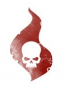

<!-- A0464-B0137 -->

原译文

Castellan Garran Crowe 堡主加兰·克洛维

**校订译文**

Castellan Garran Crowe 加兰·克罗堡主

<!-- /A0464-B0137 -->

<!-- A0464-B0138 -->

原译文

44 Purifiers 44名净化者

**校订译文**

44 Purifiers 44名净化者

<!-- /A0464-B0138 -->

<!-- A0464-B0139 -->

原译文

1st Brotherhood 第一兄弟会

**校订译文**

1st Brotherhood 第一兄弟会

<!-- /A0464-B0139 -->

<!-- A0464-B0140 图片 -->
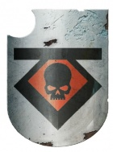

<!-- A0464-B0141 -->

原译文

Steward of the Armoury 军械库统筹者

**校订译文**

Steward of the Armoury 军械库统筹者

<!-- /A0464-B0141 -->

<!-- A0464-B0142 -->

原译文

Grand Master Vardan Kai 大导师瓦尔丹·凯

**校订译文**

Grand Master Vardan Kai 大导师瓦尔丹·凯

<!-- /A0464-B0142 -->

<!-- A0464-B0143 -->

原译文

23 Grey Knights Techmarines 23名灰骑士技术军士

**校订译文**

23 Grey Knights Techmarines 23名灰骑士科技战士

<!-- /A0464-B0143 -->

<!-- A0464-B0144 -->

原译文

75 Servitors 75名机仆

**校订译文**

75 Servitors 75名机仆

<!-- /A0464-B0144 -->

<!-- A0464-B0145 -->

原译文

20 Land Raiders, 24 Rhinos 20辆兰德掠袭者，24辆犀牛

**校订译文**

20 Land Raiders, 24 Rhinos 20辆兰德掠袭者战车、24辆犀牛战车

<!-- /A0464-B0145 -->

<!-- A0464-B0146 -->

原译文

21 Stormraven Gunships 21架风暴鸦炮艇

**校订译文**

21 Stormraven Gunships 21架风暴鸦炮艇

<!-- /A0464-B0146 -->

<!-- A0464-B0147 -->

原译文

18 Nemesis Dreadknights 18位天罚恐惧骑士

**校订译文**

18 Nemesis Dreadknights 18台涅墨西斯骇骑机甲

<!-- /A0464-B0147 -->

<!-- A0464-B0148 -->

原译文

16 Stormtalon Gunships 16架风暴爪炮艇

**校订译文**

16 Stormtalon Gunships 16架风暴爪炮艇

<!-- /A0464-B0148 -->

<!-- A0464-B0149 -->

原译文

12 Stormhawk Interceptors 12架风暴隼截击机

**校订译文**

12 Stormhawk Interceptors 12架风暴鹰拦截者战机

<!-- /A0464-B0149 -->

<!-- A0464-B0150 -->

原译文

Brother Captain Cadrig Pelenas 兄弟连长卡德里格·佩莱纳斯

**校订译文**

Brother Captain Cadrig Pelenas 兄弟会连长卡德里格·佩莱纳斯

<!-- /A0464-B0150 -->

<!-- A0464-B0151 -->

原译文

Brotherhood Champion Feydor Ankhalas 兄弟会冠军费多·安卡拉斯

**校订译文**

Brotherhood Champion Feydor Ankhalas 兄弟会勇士费多·安卡拉斯

<!-- /A0464-B0151 -->

<!-- A0464-B0152 -->

原译文

1 Brotherhood Ancient 一名兄弟会旗手

**校订译文**

1 Brotherhood Ancient 一名兄弟会旗手

<!-- /A0464-B0152 -->

<!-- A0464-B0153 -->

原译文

5 Terminator Squads 五个终结者小队

**校订译文**

5 Terminator Squads 五个终结者小队

<!-- /A0464-B0153 -->

<!-- A0464-B0154 -->

原译文

5 Interceptor Squads 五个拦截者小队

**校订译文**

5 Interceptor Squads 五个拦截者小队

<!-- /A0464-B0154 -->

<!-- A0464-B0155 -->

原译文

5 Purgation Squads 五个净化者小队

**校订译文**

5 Purgation Squads 五个洗罪小队

<!-- /A0464-B0155 -->

<!-- A0464-B0156 -->

原译文

5 Strike Squads 五个打击小队

**校订译文**

5 Strike Squads 五个打击小队

<!-- /A0464-B0156 -->

<!-- A0464-B0157 -->

原译文

1 Dreadnought 一位无畏

**校订译文**

1 Dreadnought 一台无畏机甲

<!-- /A0464-B0157 -->

<!-- A0464-B0158 -->

原译文

2nd Brotherhood 第二兄弟会

**校订译文**

2nd Brotherhood 第二兄弟会

<!-- /A0464-B0158 -->

<!-- A0464-B0159 图片 -->
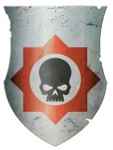

<!-- A0464-B0160 -->

原译文

Admiral of the Fleet 舰队元帅

**校订译文**

Admiral of the Fleet 舰队元帅

<!-- /A0464-B0160 -->

<!-- A0464-B0161 -->

原译文

Grand Master Vorth Mordrak 大导师沃尔斯·莫德拉克

**校订译文**

Grand Master Vorth Mordrak 大导师沃尔斯·莫德拉克

<!-- /A0464-B0161 -->

<!-- A0464-B0162 -->

原译文

4 Battle Barges 4艘战斗驳船

**校订译文**

4 Battle Barges 4艘战斗驳船

<!-- /A0464-B0162 -->

<!-- A0464-B0163 -->

原译文

12 Strike Cruisers 12艘打击巡洋舰

**校订译文**

12 Strike Cruisers 12艘打击巡洋舰

<!-- /A0464-B0163 -->

<!-- A0464-B0164 -->

原译文

8 Rapid Strike Vessels 8艘快速打击战舰

**校订译文**

8 Rapid Strike Vessels 8艘快速打击战舰

<!-- /A0464-B0164 -->

<!-- A0464-B0165 -->

原译文

8 Thunderhawk Gunships 8架雷鹰炮艇

**校订译文**

8 Thunderhawk Gunships 8架雷鹰炮艇

<!-- /A0464-B0165 -->

<!-- A0464-B0166 -->

原译文

Brother-Captain Arno Trevan 兄弟连长阿诺·特里万

**校订译文**

Brother-Captain Arno Trevan 兄弟会连长阿诺·特里万

<!-- /A0464-B0166 -->

<!-- A0464-B0167 -->

原译文

1 Brotherhood Champion 一名兄弟会冠军

**校订译文**

1 Brotherhood Champion 一名兄弟会勇士

<!-- /A0464-B0167 -->

<!-- A0464-B0168 -->

原译文

1 Brotherhood Ancient 一名兄弟会旗手

**校订译文**

1 Brotherhood Ancient 一名兄弟会旗手

<!-- /A0464-B0168 -->

<!-- A0464-B0169 -->

原译文

6 Terminator Squads 六个终结者小队

**校订译文**

6 Terminator Squads 六个终结者小队

<!-- /A0464-B0169 -->

<!-- A0464-B0170 -->

原译文

7 Interceptor Squads 七个拦截者小队

**校订译文**

7 Interceptor Squads 七个拦截者小队

<!-- /A0464-B0170 -->

<!-- A0464-B0171 -->

原译文

6 Purgation Squads 六个净化者小队

**校订译文**

6 Purgation Squads 六个洗罪小队

<!-- /A0464-B0171 -->

<!-- A0464-B0172 -->

原译文

7 Strike Squads 七个打击小队

**校订译文**

7 Strike Squads 七个打击小队

<!-- /A0464-B0172 -->

<!-- A0464-B0173 -->

原译文

2 Dreadnoughts 两位无畏

**校订译文**

2 Dreadnoughts 两台无畏机甲

<!-- /A0464-B0173 -->

<!-- A0464-B0174 -->

原译文

3rd Brotherhood 第三兄弟会

**校订译文**

3rd Brotherhood 第三兄弟会

<!-- /A0464-B0174 -->

<!-- A0464-B0175 图片 -->
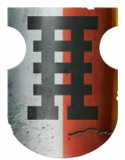

<!-- A0464-B0176 -->

原译文

Warden of the Librarius 智库守望者

**校订译文**

Warden of the Librarius 智库守望者

<!-- /A0464-B0176 -->

<!-- A0464-B0177 -->

原译文

Grand Master Aldrik Voldus 大导师阿尔德里克·沃尔达斯

**校订译文**

Grand Master Aldrik Voldus 大导师阿尔德里克·沃尔达斯

<!-- /A0464-B0177 -->

<!-- A0464-B0178 -->

原译文

3 Epistolaries 三名星语官

**校订译文**

3 Epistolaries 三名星语官

<!-- /A0464-B0178 -->

<!-- A0464-B0179 -->

原译文

12 Codiciers 12名典记员

**校订译文**

12 Codiciers 12名典记员

<!-- /A0464-B0179 -->

<!-- A0464-B0180 -->

原译文

9 Lexicanum 九名编修员

**校订译文**

9 Lexicanum 九名编修员

<!-- /A0464-B0180 -->

<!-- A0464-B0181 -->

原译文

12 Acolytum 12名侍僧

**校订译文**

12 Acolytum 12名侍僧

<!-- /A0464-B0181 -->

<!-- A0464-B0182 -->

原译文

Brother-Captain Arvann Stern 兄弟连长艾维安·斯特恩

**校订译文**

Brother-Captain Arvann Stern 兄弟会连长艾维安·斯特恩

<!-- /A0464-B0182 -->

<!-- A0464-B0183 -->

原译文

1 Brotherhood Champion 一名兄弟会冠军

**校订译文**

1 Brotherhood Champion 一名兄弟会勇士

<!-- /A0464-B0183 -->

<!-- A0464-B0184 -->

原译文

1 Brotherhood Ancient 一名兄弟会旗手

**校订译文**

1 Brotherhood Ancient 一名兄弟会旗手

<!-- /A0464-B0184 -->

<!-- A0464-B0185 -->

原译文

6 Terminator Squads 六个终结者小队

**校订译文**

6 Terminator Squads 六个终结者小队

<!-- /A0464-B0185 -->

<!-- A0464-B0186 -->

原译文

3 Interceptor Squads 三个拦截者小队

**校订译文**

3 Interceptor Squads 三个拦截者小队

<!-- /A0464-B0186 -->

<!-- A0464-B0187 -->

原译文

4 Purgation Squads 四名净化者小队

**校订译文**

4 Purgation Squads 四个洗罪小队

<!-- /A0464-B0187 -->

<!-- A0464-B0188 -->

原译文

5 Strike Squads 五个打击小队

**校订译文**

5 Strike Squads 五个打击小队

<!-- /A0464-B0188 -->

<!-- A0464-B0189 -->

原译文

3 Dreadnoughts 三位无畏

**校订译文**

3 Dreadnoughts 三台无畏机甲

<!-- /A0464-B0189 -->

<!-- A0464-B0190 -->

原译文

4th Brotherhood 第四兄弟会

**校订译文**

4th Brotherhood 第四兄弟会

<!-- /A0464-B0190 -->

<!-- A0464-B0191 图片 -->
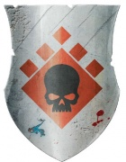

<!-- A0464-B0192 -->

原译文

Keeper of the Augurium 占卜守护者

**校订译文**

Keeper of the Augurium 占卜殿守护者

<!-- /A0464-B0192 -->

<!-- A0464-B0193 -->

原译文

Grand Master Drystann Cromm (deceased) 大导师德里斯坦·克罗姆（已故）

**校订译文**

Grand Master Drystann Cromm (deceased) 大导师德里斯坦·克罗姆（已故）

<!-- /A0464-B0193 -->

<!-- A0464-B0194 -->

原译文

12 Prognosticars 12名预言者

**校订译文**

12 Prognosticars 12名预言者

<!-- /A0464-B0194 -->

<!-- A0464-B0195 -->

原译文

50 Mono-Task Servitors 50名单任务机仆

**校订译文**

50 Mono-Task Servitors 50名单任务机仆

<!-- /A0464-B0195 -->

<!-- A0464-B0196 -->

原译文

Brother-Captain Ionan Grud 兄弟连长伊奥南·格鲁德

**校订译文**

Brother-Captain Ionan Grud 兄弟会连长伊奥南·格鲁德

<!-- /A0464-B0196 -->

<!-- A0464-B0197 -->

原译文

1 Brotherhood Champion 一名兄弟会冠军

**校订译文**

1 Brotherhood Champion 一名兄弟会勇士

<!-- /A0464-B0197 -->

<!-- A0464-B0198 -->

原译文

1 Brotherhood Ancient 一名兄弟会旗手

**校订译文**

1 Brotherhood Ancient 一名兄弟会旗手

<!-- /A0464-B0198 -->

<!-- A0464-B0199 -->

原译文

3 Terminator Squads 三个终结者小队

**校订译文**

3 Terminator Squads 三个终结者小队

<!-- /A0464-B0199 -->

<!-- A0464-B0200 -->

原译文

6 Interceptor Squads 六个拦截者小队

**校订译文**

6 Interceptor Squads 六个拦截者小队

<!-- /A0464-B0200 -->

<!-- A0464-B0201 -->

原译文

5 Purgation Squads 五个净化者小队

**校订译文**

5 Purgation Squads 五个洗罪小队

<!-- /A0464-B0201 -->

<!-- A0464-B0202 -->

原译文

6 Strike Squads 六个打击小队

**校订译文**

6 Strike Squads 六个打击小队

<!-- /A0464-B0202 -->

<!-- A0464-B0203 -->

原译文

3 Dreadnoughts 三位无畏

**校订译文**

3 Dreadnoughts 三台无畏机甲

<!-- /A0464-B0203 -->

<!-- A0464-B0204 -->

原译文

5th Brotherhood 第五兄弟会

**校订译文**

5th Brotherhood 第五兄弟会

<!-- /A0464-B0204 -->

<!-- A0464-B0205 图片 -->
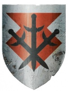

<!-- A0464-B0206 -->

原译文

Protector of the Sanctum Sanctorum 至圣守护者

**校订译文**

Protector of the Sanctum Sanctorum 至圣所守护者

<!-- /A0464-B0206 -->

<!-- A0464-B0207 -->

原译文

Grand Master Rothwyr Morvans 大导师罗斯维尔·墨万斯

**校订译文**

Grand Master Rothwyr Morvans 大导师罗斯维尔·墨万斯

<!-- /A0464-B0207 -->

<!-- A0464-B0208 -->

原译文

20 Sanctum Guardians 20名圣所卫士

**校订译文**

20 Sanctum Guardians 20名圣所卫士

<!-- /A0464-B0208 -->

<!-- A0464-B0209 -->

原译文

12 Grey Knights Apothecaries 12名灰骑士药剂师

**校订译文**

12 Grey Knights Apothecaries 12名灰骑士药剂师

<!-- /A0464-B0209 -->

<!-- A0464-B0210 -->

原译文

Brother-Captain Tauros Hendron 兄弟连长陶罗斯·亨德伦

**校订译文**

Brother-Captain Tauros Hendron 兄弟会连长陶罗斯·亨德伦

<!-- /A0464-B0210 -->

<!-- A0464-B0211 -->

原译文

1 Brotherhood Champion 一名兄弟会冠军

**校订译文**

1 Brotherhood Champion 一名兄弟会勇士

<!-- /A0464-B0211 -->

<!-- A0464-B0212 -->

原译文

1 Brotherhood Ancient 一名兄弟会旗手

**校订译文**

1 Brotherhood Ancient 一名兄弟会旗手

<!-- /A0464-B0212 -->

<!-- A0464-B0213 -->

原译文

4 Terminator Squads 四个终结者小队

**校订译文**

4 Terminator Squads 四个终结者小队

<!-- /A0464-B0213 -->

<!-- A0464-B0214 -->

原译文

4 Interceptor Squads 四个拦截者小队

**校订译文**

4 Interceptor Squads 四个拦截者小队

<!-- /A0464-B0214 -->

<!-- A0464-B0215 -->

原译文

4 Purgation Squads 四个净化者小队

**校订译文**

4 Purgation Squads 四个洗罪小队

<!-- /A0464-B0215 -->

<!-- A0464-B0216 -->

原译文

8 Strike Squads 八个打击小队

**校订译文**

8 Strike Squads 八个打击小队

<!-- /A0464-B0216 -->

<!-- A0464-B0217 -->

原译文

5 Dreadnoughts 五位无畏

**校订译文**

5 Dreadnoughts 五台无畏机甲

<!-- /A0464-B0217 -->

<!-- A0464-B0218 -->

原译文

6th Brotherhood 第六兄弟会

**校订译文**

6th Brotherhood 第六兄弟会

<!-- /A0464-B0218 -->

<!-- A0464-B0219 图片 -->
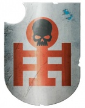

<!-- A0464-B0220 -->

原译文

High Seneschal of the Fortress 要塞至高总管

**校订译文**

High Seneschal of the Fortress 要塞至高总管

<!-- /A0464-B0220 -->

<!-- A0464-B0221 -->

原译文

Grand Master Caddon Varn 大导师卡顿·瓦恩

**校订译文**

Grand Master Caddon Varn 大导师卡顿·瓦恩

<!-- /A0464-B0221 -->

<!-- A0464-B0222 -->

原译文

271 Chapter Equerries 271名战团仆役

**校订译文**

271 Chapter Equerries 271名战团近侍

<!-- /A0464-B0222 -->

<!-- A0464-B0223 -->

原译文

500 Servitors 500名机仆

**校订译文**

500 Servitors 500名机仆

<!-- /A0464-B0223 -->

<!-- A0464-B0224 -->

原译文

Brother-Captain Kerda Tannasek 兄弟连长克尔达·坦纳塞克

**校订译文**

Brother-Captain Kerda Tannasek 兄弟会连长克尔达·坦纳塞克

<!-- /A0464-B0224 -->

<!-- A0464-B0225 -->

原译文

1 Brotherhood Champion 一名兄弟会冠军

**校订译文**

1 Brotherhood Champion 一名兄弟会勇士

<!-- /A0464-B0225 -->

<!-- A0464-B0226 -->

原译文

1 Brotherhood Ancient 一名兄弟会旗手

**校订译文**

1 Brotherhood Ancient 一名兄弟会旗手

<!-- /A0464-B0226 -->

<!-- A0464-B0227 -->

原译文

5 Terminator Squads 五个终结者小队

**校订译文**

5 Terminator Squads 五个终结者小队

<!-- /A0464-B0227 -->

<!-- A0464-B0228 -->

原译文

6 Interceptor Squads 六个拦截者小队

**校订译文**

6 Interceptor Squads 六个拦截者小队

<!-- /A0464-B0228 -->

<!-- A0464-B0229 -->

原译文

3 Purgation Squads 三个净化者小队

**校订译文**

3 Purgation Squads 三个洗罪小队

<!-- /A0464-B0229 -->

<!-- A0464-B0230 -->

原译文

6 Strike Squads 六个打击小队

**校订译文**

6 Strike Squads 六个打击小队

<!-- /A0464-B0230 -->

<!-- A0464-B0231 -->

原译文

2 Dreadnoughts 两位无畏

**校订译文**

2 Dreadnoughts 两台无畏机甲

<!-- /A0464-B0231 -->

<!-- A0464-B0232 -->

原译文

7th Brotherhood 第七兄弟会

**校订译文**

7th Brotherhood 第七兄弟会

<!-- /A0464-B0232 -->

<!-- A0464-B0233 图片 -->
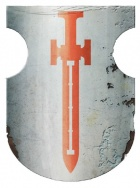

<!-- A0464-B0234 -->

原译文

Inquisition Representative 审判庭代表

**校订译文**

Inquisition Representative 审判庭代表

<!-- /A0464-B0234 -->

<!-- A0464-B0235 -->

原译文

Grand Master Covan Leorac 大导师科文·莱奥拉克

**校订译文**

Grand Master Covan Leorac 大导师科文·莱奥拉克

<!-- /A0464-B0235 -->

<!-- A0464-B0236 -->

原译文

24 Scribes 24名抄写员

**校订译文**

24 Scribes 24名抄写员

<!-- /A0464-B0236 -->

<!-- A0464-B0237 -->

原译文

3 Astropaths 三名星语者

**校订译文**

3 Astropaths 三名星语者

<!-- /A0464-B0237 -->

<!-- A0464-B0238 -->

原译文

Brother-Captain Darig Tegvar 兄弟连长达里格·泰格瓦尔

**校订译文**

Brother-Captain Darig Tegvar 兄弟会连长达里格·泰格瓦尔

<!-- /A0464-B0238 -->

<!-- A0464-B0239 -->

原译文

1 Brotherhood Champion 一名兄弟会冠军

**校订译文**

1 Brotherhood Champion 一名兄弟会勇士

<!-- /A0464-B0239 -->

<!-- A0464-B0240 -->

原译文

1 Brotherhood Ancient 一名兄弟会旗手

**校订译文**

1 Brotherhood Ancient 一名兄弟会旗手

<!-- /A0464-B0240 -->

<!-- A0464-B0241 -->

原译文

3 Terminator Squads 三个终结者小队

**校订译文**

3 Terminator Squads 三个终结者小队

<!-- /A0464-B0241 -->

<!-- A0464-B0242 -->

原译文

5 Interceptor Squads 五个拦截者小队

**校订译文**

5 Interceptor Squads 五个拦截者小队

<!-- /A0464-B0242 -->

<!-- A0464-B0243 -->

原译文

3 Purgation Squads 三个净化者小队

**校订译文**

3 Purgation Squads 三个洗罪小队

<!-- /A0464-B0243 -->

<!-- A0464-B0244 -->

原译文

3 Strike Squads 三个打击小队

**校订译文**

3 Strike Squads 三个打击小队

<!-- /A0464-B0244 -->

<!-- A0464-B0245 -->

原译文

2 Dreadnoughts 两位无畏

**校订译文**

2 Dreadnoughts 两台无畏机甲

<!-- /A0464-B0245 -->

<!-- A0464-B0246 -->

原译文

8th Brotherhood 第八兄弟会

**校订译文**

8th Brotherhood 第八兄弟会

<!-- /A0464-B0246 -->

<!-- A0464-B0247 图片 -->
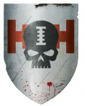

<!-- A0464-B0248 -->

原译文

Knight Commander of the Recruits 新兵骑士指挥官

**校订译文**

Knight Commander of the Recruits 新兵骑士指挥官

<!-- /A0464-B0248 -->

<!-- A0464-B0249 -->

原译文

Grand Master Aidan Perdron 大导师艾丹·佩德隆

**校订译文**

Grand Master Aidan Perdron 大导师艾丹·佩德隆

<!-- /A0464-B0249 -->

<!-- A0464-B0250 -->

原译文

32 Neophytes 32名新进者

**校订译文**

32 Neophytes 32名新进者

<!-- /A0464-B0250 -->

<!-- A0464-B0251 -->

原译文

1,005 Recruits 1005名新兵

**校订译文**

1,005 Recruits 1005名新兵

<!-- /A0464-B0251 -->

<!-- A0464-B0252 -->

原译文

38 Mono-Task Servitors 38名单任务机仆

**校订译文**

38 Mono-Task Servitors 38名单任务机仆

<!-- /A0464-B0252 -->

<!-- A0464-B0253 -->

原译文

Brother-Captain Mithrac Tor 兄弟连长米思拉克·托尔

**校订译文**

Brother-Captain Mithrac Tor 兄弟会连长米思拉克·托尔

<!-- /A0464-B0253 -->

<!-- A0464-B0254 -->

原译文

1 Brotherhood Champion 一名兄弟会冠军

**校订译文**

1 Brotherhood Champion 一名兄弟会勇士

<!-- /A0464-B0254 -->

<!-- A0464-B0255 -->

原译文

1 Brotherhood Ancient 一名兄弟会旗手

**校订译文**

1 Brotherhood Ancient 一名兄弟会旗手

<!-- /A0464-B0255 -->

<!-- A0464-B0256 -->

原译文

7 Terminator Squads 七个终结者小队

**校订译文**

7 Terminator Squads 七个终结者小队

<!-- /A0464-B0256 -->

<!-- A0464-B0257 -->

原译文

3 Interceptor Squads 三个拦截者小队

**校订译文**

3 Interceptor Squads 三个拦截者小队

<!-- /A0464-B0257 -->

<!-- A0464-B0258 -->

原译文

7 Purgation Squads 七个净化者小队

**校订译文**

7 Purgation Squads 七个洗罪小队

<!-- /A0464-B0258 -->

<!-- A0464-B0259 -->

原译文

3 Strike Squads 三个打击小队

**校订译文**

3 Strike Squads 三个打击小队

<!-- /A0464-B0259 -->

<!-- A0464-B0260 -->

原译文

1 Dreadnought 一名无畏

**校订译文**

1 Dreadnought 一台无畏机甲

<!-- /A0464-B0260 -->

<!-- A0464-B0261 -->
### Known Strike Forces 已知打击部队

<!-- /A0464-B0261 -->

<!-- A0464-B0262 -->

原译文

Strike Force Calern 卡勒恩打击部队

**校订译文**

Strike Force Calern 卡勒恩打击部队

<!-- /A0464-B0262 -->

<!-- A0464-B0263 -->

原译文

Knights of Crowe 克洛维骑士

**校订译文**

Knights of Crowe 克罗骑士

<!-- /A0464-B0263 -->

<!-- A0464-B0264 -->

原译文

The Emperor's Vengeance 帝皇的复仇

**校订译文**

The Emperor's Vengeance 帝皇的复仇

<!-- /A0464-B0264 -->

<!-- A0464-B0265 -->
### Hierarchy 等级制度

<!-- /A0464-B0265 -->

<!-- A0464-B0266 -->
**英文原文**

The hierarchy of the Grey Knights is drastically different from Codex-adherent Chapters. A council of the Chapter's eight Grand Masters serving under a Supreme Grand Master form the command echelon of the Chapter. Each Grand Master in turn oversees a specific aspect of the Chapter, such as the armoury or fleet. A Grand Master (or possibly Supreme Grand Master) is always a member of the Inner Conclave of the Inquisition.

<!-- /A0464-B0266 -->

<!-- A0464-B0267 -->

原译文

灰骑士的等级制度与圣典附属战团截然不同。由一位至高大导师领导的八位大导师组成的议会组成了战团的指挥梯队。每位大导师依次监督战团的特定方面，如军械库或舰队。大导师（或可能是至高大导师）总是审判庭内环密会的成员。

**校订译文**

灰骑士的指挥体系与遵循《圣典》的战团迥然不同。八位大导师在至高大导师领导下组成议会，构成战团最高指挥层。每位大导师还分管军械库、舰队等特定事务。始终有一位大导师——也可能是至高大导师本人——担任审判庭内环密会成员。

<!-- /A0464-B0267 -->

<!-- A0464-B0268 图片 -->
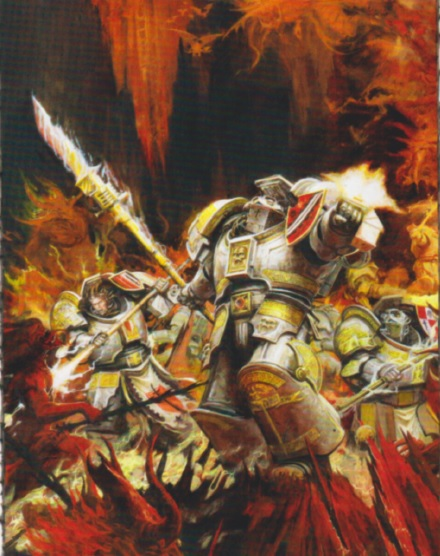

<!-- A0464-B0269 -->

原译文

Grey Knights 灰骑士

**校订译文**

Grey Knights 灰骑士

<!-- /A0464-B0269 -->

<!-- A0464-B0270 -->

原译文

Supreme Grand Master 至高大导师

**校订译文**

Supreme Grand Master 至高大导师

<!-- /A0464-B0270 -->

<!-- A0464-B0271 -->
**英文原文**

The highest rank attainable by a Grey Knight. Also referred to as the Chapter Lord, the Supreme Grand Master has complete authority over the chapter. However, a Grey Knight can only be appointed as the Supreme Grand Master with the unanimous consent of every other Grand Master, thus ensuring that an unsuitable candidate does not attain dominion over the chapter.

<!-- /A0464-B0271 -->

<!-- A0464-B0272 -->

原译文

灰骑士所能达到的最高等级。也被称为战团长，至高大导师对战团有完全的权威。然而，只有在所有其他大导师一致同意的情况下，才能任命灰骑士为至高大导师，从而确保不合适的候选人不会获得对战团的统治权。

**校订译文**

至高大导师是灰骑士所能晋升的最高职衔，也称战团之主，对全团拥有最高权威。但任命须获其余所有大导师一致同意，以防不合适的人选掌控战团。

<!-- /A0464-B0272 -->

<!-- A0464-B0273 -->

原译文

Grand Master 大导师

**校订译文**

Grand Master 大导师

<!-- /A0464-B0273 -->

<!-- A0464-B0274 -->
**英文原文**

The Grey Knight chapter usually has 8 Grand Masters, each having command of a Grey Knights brotherhood. An unmatched daemonslayer, the Grand Master wears Terminator Armour and wields a powerful Nemesis force weapon in battle, He is also a powerful psyker. Few Daemons have been able to stand against a Grand Master and survive. The death of such a powerful defender of the Emperor's will is always mourned by the Grey Knights and the Ordo Malleus — though never will a common citizen know of him.

<!-- /A0464-B0274 -->

<!-- A0464-B0275 -->

原译文

灰骑士战团通常有8位大导师，每位大导师都指挥着一个灰骑士兄弟会。作为一名无与伦比的守护者，大导师穿着终结者盔甲，在战斗中挥舞着强大的复仇女神动力武器，他也是一名强大的灵能者。很少有恶魔能够对抗大导师并幸存下来。灰骑士团和圣锤修会总是为这位强大的帝皇意志捍卫者的牺牲而哀悼，尽管普通公民永远不会知道他。

**校订译文**

战团通常设八位大导师，各统率一个兄弟会。他们是无与伦比的屠魔者，也是强大的灵能者，身穿终结者护甲，以威力惊人的复仇女神灵能武器作战。很少有恶魔能在与大导师交锋后生还。这样一位贯彻帝皇意志的强大战士若告牺牲，灰骑士与恶魔审判庭都会为其哀悼，普通帝国居民却永远不会知道他的存在。

**校注：** Nemesis force weapon 为灵能武器，原译动力武器混淆了不同武器机制。完整专名沿核心复仇女神灵能武器，未据另一完整单位名的官译强行改动。

<!-- /A0464-B0275 -->

<!-- A0464-B0276 -->

原译文

Brother Captain 兄弟连长

**校订译文**

Brother Captain 兄弟会连长

<!-- /A0464-B0276 -->

<!-- A0464-B0277 -->
**英文原文**

A Grey Knights Brother-Captain ranks below a Grand Master and is in command of one hundred of the galaxy's finest warriors - a heavy responsibility, but one undertaken with sombre dignity. Upon the battlefield, a Brother-Captain will be found at the forefront of the fighting, grinding his foes beneath his feet, setting an example for his Battle-Brother to live up to and commanding his troops through psychic communication.

<!-- /A0464-B0277 -->

<!-- A0464-B0278 -->

原译文

一位灰骑士兄弟连长的级别低于一位大导师，他指挥着银河系一百名最优秀的战士—这是一项艰巨的责任，但也是一项庄严肃穆的责任。在战场上，一位兄弟连长将站在战斗的最前线，把敌人踩在脚下，为他的战斗兄弟树立榜样，通过灵能交流来指挥他的部队。

**校订译文**

兄弟会连长位阶低于大导师，统率约一百名银河中最优秀的战士。这份重任由他们以肃穆的尊严承担。战场上，他们总在最前线击溃敌人，为战斗兄弟树立榜样，并通过灵能通信指挥部队。

<!-- /A0464-B0278 -->

<!-- A0464-B0279 -->

原译文

Librarian 智库

**校订译文**

Librarian 智库员

<!-- /A0464-B0279 -->

<!-- A0464-B0280 -->
**英文原文**

Akin to the Librarians of other Chapters, The Grey Knights Librarian supports his Battle-Brothers with psychic powers far stronger than those of his brethren.

<!-- /A0464-B0280 -->

<!-- A0464-B0281 -->

原译文

与其他战团的智库一样，灰骑士智库以比他的兄弟们强大得多的灵能力量支援他的战斗兄弟。

**校订译文**

与其他战团的智库员一样，灰骑士智库员也以远强于一般同袍的灵能力量支援战斗兄弟。

<!-- /A0464-B0281 -->

<!-- A0464-B0282 -->

原译文

Chaplain 牧师

**校订译文**

Chaplain 教士

<!-- /A0464-B0282 -->

<!-- A0464-B0283 -->
**英文原文**

Grey Knights Chaplains fulfil the same functions as in other Marine chapters, albeit on a much higher level, as they have to minister to the spiritual needs of soldiers destined to fight the most horrible of foes. They are rare specimens indeed, and the Chapter has precious few of them. Yet, thanks to them, not one Grey Knight has fallen to Chaos.

<!-- /A0464-B0283 -->

<!-- A0464-B0284 -->

原译文

灰骑士牧师履行与其他星际战士战团相同的职能，尽管在更高的层次上，因为他们必须满足注定要与最可怕的敌人作战的士兵的精神需求。它们确实是罕见的，战团几乎没有。然而，多亏了他们，没有一个灰骑士堕入混沌。

**校订译文**

灰骑士教士履行与其他星际战士战团教士相同的职责，却须达到更高水准，因为他们要照料那些注定迎战最可怕敌人的战士的精神需求。教士极为罕见，战团内人数寥寥；然而，正因他们的努力，才从未有灰骑士堕入混沌。

<!-- /A0464-B0284 -->

<!-- A0464-B0285 -->

原译文

Techmarine 技术军士

**校订译文**

Techmarine 科技战士

<!-- /A0464-B0285 -->

<!-- A0464-B0286 -->
**英文原文**

As with other chapters, the Grey Knights employ Techmarines to maintain and operate their war machines.

<!-- /A0464-B0286 -->

<!-- A0464-B0287 -->

原译文

与其他战团一样，灰骑士使用技术军士来维护和操作他们的战争机器。

**校订译文**

与其他战团一样，灰骑士由科技战士维护并操作战争机器。

<!-- /A0464-B0287 -->

<!-- A0464-B0288 -->

原译文

Brotherhood Champion 兄弟会冠军

**校订译文**

Brotherhood Champion 兄弟会勇士

<!-- /A0464-B0288 -->

<!-- A0464-B0289 -->
**英文原文**

At the forefront of every Grey Knight Brotherhood is the Brotherhood Champion — a warrior who has forsaken all other forms of combat to become a master of the blade. His chief duty is to act as a bodyguard for his Brother-Captain and sacrifice himself if necessary. This ultimate sacrifice is rare, however, as few foes are skilled enough to defeat the Champion in combat.

<!-- /A0464-B0289 -->

<!-- A0464-B0290 -->

原译文

在每一个灰骑士兄弟会的最前沿都是兄弟会冠军—一个放弃了所有其他形式的战斗，成为剑刃大师的战士。他的主要职责是为他的兄弟连长担任护卫，并在必要时牺牲自己。然而，这种终极牺牲是罕见的，因为很少有敌人有足够的技能在战斗中击败冠军。

**校订译文**

每个灰骑士兄弟会的最前列都有一位兄弟会勇士。他舍弃其他战法，专精剑术，首要职责是保护兄弟会连长，必要时以身相代。不过，真正需要献出生命的情况并不多，因为鲜有敌人能在武艺上击败他。

<!-- /A0464-B0290 -->

<!-- A0464-B0291 -->

原译文

Justicar 仲裁官

**校订译文**

Justicar 仲裁官

<!-- /A0464-B0291 -->

<!-- A0464-B0292 -->
**英文原文**

Justicars are the leaders of the Grey Knight squads (akin to a codex Chapter's Sergeant).

<!-- /A0464-B0292 -->

<!-- A0464-B0293 -->

原译文

仲裁官是灰骑士小队的领导者（类似于圣典战团的军士）。

**校订译文**

仲裁官是灰骑士小队的领导者（类似于圣典战团的军士）。

<!-- /A0464-B0293 -->

<!-- A0464-B0294 -->

原译文

Terminators 终结者

**校订译文**

Terminators 终结者

<!-- /A0464-B0294 -->

<!-- A0464-B0295 -->
**英文原文**

Unlike other Space Marine Chapters, upon completion of an initiate's training, a new brother of the chapter is so elite as to inherently be considered skilled enough to have access to Terminator armour. Similarly, the Grey Knights also differ from most other Chapters in that they can muster enough Tactical Dreadnought armour to outfit almost their entire chapter. With every Grey Knight thus able to don Terminator Armour, Terminator Squads are able to form the heart of the Grey Knights' armies. Standing above even these elite warriors are the Paladins, warriors who are bound to protect one of the chapters Grand Masters.

<!-- /A0464-B0295 -->

<!-- A0464-B0296 -->

原译文

与其他星际战士战团不同，在完成新兵训练后，该战团的新兄弟是如此精英，以至于天生就被认为有足够的技能来获得终结者盔甲。同样，灰骑士也与大多数其他战团不同，因为他们可以召集足够的战术无畏装甲来装备几乎整个战团。每个灰骑士都能穿上终结者盔甲，终结者小队就能成为灰骑士军队的核心。在这些精英战士之上的是圣骑士，他们注定要保护其中一个战团大导师。

**校订译文**

与其他战团不同，灰骑士新兵一旦完成训练，便已达到足以使用终结者护甲的精锐水准。战团还拥有几乎可装备全体成员的战术无畏甲，这一点同样罕见。因此，每名灰骑士都能披挂终结者护甲，终结者小队也得以成为军队核心。而地位更高的圣骑士，则肩负守护战团大导师的职责。

<!-- /A0464-B0296 -->

<!-- A0464-B0297 -->

原译文

Battle Brother 战斗兄弟

**校订译文**

Battle Brother 战斗兄弟

<!-- /A0464-B0297 -->

<!-- A0464-B0298 -->
**英文原文**

The "standard" Grey Knight trooper, equipped in Power Armour. Grey Knights Battle-Brothers can serve in several different types of squad: Strike Squads - the most basic form of unit, Interceptor Squads - equipped with personal teleporters, Purgation Squads — heavy support squads carrying multiple heavy weapons or as Purifier Squads — elite units considered even more incorruptible than the rest of their brethren.

<!-- /A0464-B0298 -->

<!-- A0464-B0299 -->

原译文

“标准”灰骑士，装备动力盔甲。灰骑士战斗兄弟可以在几种不同类型的小队中服役：打击小队——最基本的单位形式，拦截者小队——配备个人传送装置，净化者小队——携带多种重型武器的重型支援小队，或纯洁小队——被认为比其他兄弟更纯洁的精英部队。

**校订译文**

战斗兄弟是身穿动力甲的“标准”灰骑士，可编入多种小队：最基础的打击小队，配备个人传送器的拦截者小队，携带多件重型武器的洗罪小队，以及被认为比其他同袍更加不受腐化侵蚀的精锐净化者小队。

<!-- /A0464-B0299 -->

<!-- A0464-B0300 -->

原译文

Ferrymen 摆渡人

**校订译文**

Ferrymen 摆渡人

<!-- /A0464-B0300 -->

<!-- A0464-B0301 -->
**英文原文**

The Ferrymen are former Grey Knights who have become Pariahs. They serve as seneschals to the Sepulcars who tend the Dead Fields.

<!-- /A0464-B0301 -->

<!-- A0464-B0302 -->

原译文

摆渡人是现已成为被遗弃者的前灰骑士。他们担任墓地的管理者，负责照料亡者之地。

**校订译文**

摆渡人曾是灰骑士，如今已成为“贱民”。他们担任侍奉守墓者的总管，而守墓者负责照料亡者之地。

**校注：** Pariahs 在此是空白者一类的反灵能身份，沿已定专词“贱民”，非一般遭遗弃者。原文从灵能灰骑士转变为贱民的机制未解释；Sepulcars 为照料亡者之地者，不能误作墓地本身。

<!-- /A0464-B0302 -->

<!-- A0464-B0303 -->

原译文

Prognosticar 预言者

**校订译文**

Prognosticar 预言者

<!-- /A0464-B0303 -->

<!-- A0464-B0304 -->
**英文原文**

The Prognosticars are gifted psykers among the Grey Knights who specialized in detecting daemonic incursions into realspace.

<!-- /A0464-B0304 -->

<!-- A0464-B0305 -->

原译文

预言者是灰骑士中天赋异禀的灵能者，专门探测恶魔入侵现实空间的行为。

**校订译文**

预言者是灰骑士中天赋异禀的灵能者，专门探测恶魔入侵现实空间的行为。

<!-- /A0464-B0305 -->

<!-- A0464-B0306 -->
## Tactics 战术

<!-- /A0464-B0306 -->

<!-- A0464-B0307 -->
**英文原文**

The Grey Knights often teleport themselves directly into combat, as near to the target as possible, both to ensure they arrive without any unnecessary losses and to minimise their presence. Any remaining hostile forces are left to be dealt with by additional Imperial troops, usually to whom squads of Grey Knights have been assigned as a specialist division.

<!-- /A0464-B0307 -->

<!-- A0464-B0308 -->

原译文

灰骑士经常将自己直接传送到战斗中，尽可能靠近目标，以确保他们到达时没有任何不必要的损失，并尽量减少他们的存在。任何剩余的敌对势力都将由额外的帝国军队处理，通常灰骑士小队被分配为专业指定。

**校订译文**

灰骑士常直接传送进入战场，尽可能靠近目标，既避免抵达途中不必要的伤亡，也减少暴露。残余敌军则交给其他帝国部队处理；灰骑士小队通常作为专门作战分队，配属这些部队行动。

<!-- /A0464-B0308 -->

<!-- A0464-B0309 -->
**英文原文**

In battle, the Grey Knights make use of an egregore - a psychic link that allows for faster communication and better synchronisation.

<!-- /A0464-B0309 -->

<!-- A0464-B0310 -->

原译文

在战斗中，灰骑士们使用了一种集体思维 — 一种灵能联系，可以实现更快的沟通和更好的同步。

**校订译文**

作战时，灰骑士会建立称为“集体思维”的灵能联结，以加快沟通，并使行动更加协调一致。

<!-- /A0464-B0310 -->

<!-- A0464-B0311 -->
## Recruitment 招募

<!-- /A0464-B0311 -->

<!-- A0464-B0312 -->
**英文原文**

Considering the role of the Grey Knights, potential recruits are put through even more stringent trials than other Space Marine Neophytes. Unlike most Space Marine Chapters, the Grey Knight recruits are often drawn directly from the Black Ships after they return to Terra by the Gatherers. They are then brought to the Chamber of Trials on Titan for testing. The most advanced bio-engineering and psycho-surgery available is utilized to condition the Neophytes, and each recruit must pass the six hundred and sixty six Rituals of Detestation, to prove that he is capable of withstanding horrors that would break even the greatest of 'normal' Space Marines. Upon success, the recruit also has the majority of their memories and personality erased. One of the main criteria for selection is that the recruit must show great psychic potential, as the entire Chapter is made up of psykers.

<!-- /A0464-B0312 -->

<!-- A0464-B0313 -->

原译文

考虑到灰骑士的角色，潜在的新兵比其他星际战士新进者要经历更严格的考验。与大多数星际战士不同，灰骑士新兵在返回泰拉后，通常直接从黑船中招募。然后，他们被带到泰坦上的审判厅进行测试。最先进的生物工程和灵能外科技术被用来治疗新进者，每个新兵都必须通过六百六十六次憎恶仪式，以证明他有能力承受即使是最伟大的“正常”星际战士也会崩溃的恐怖。一旦成功，新兵的大部分记忆和个性也会被抹去。选拔的主要标准之一是新兵必须表现出巨大的灵能潜力，因为整个战团都是由灵能者组成的。

**校订译文**

灰骑士职责特殊，因此候选者必须经历比其他星际战士新进者更严苛的考验。与大多数战团不同，收集者经常在黑船返回泰拉后，直接从船上挑选灰骑士新兵，再送往泰坦的试炼厅接受考核。他们以最先进的生物工程和心智外科手段塑造新进者；每人都须通过六百六十六项憎恶仪式，证明自己能承受连最出色的“普通”星际战士也会为之崩溃的恐怖。成功后，新兵的大部分记忆与原有人格还会被抹去。由于全团均为灵能者，强大的灵能潜力始终是首要选拔条件之一。

<!-- /A0464-B0313 -->

<!-- A0464-B0314 图片 -->
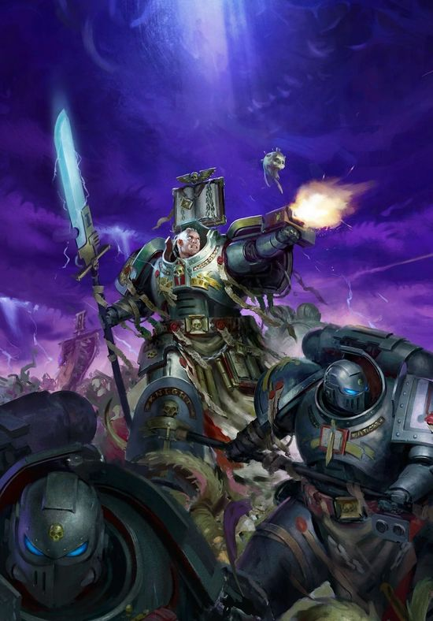

<!-- A0464-B0315 -->

原译文

Grey Knights 灰骑士

**校订译文**

Grey Knights 灰骑士

<!-- /A0464-B0315 -->

<!-- A0464-B0316 -->
**英文原文**

These successful Neophytes are then separated into groups and each is assigned to a Justicar, who will oversee their further training. Once they reach the Chamber's upper levels, the Neophytes become Novitiates and upon completing the Chamber of Trials they are accepted into the Chapter. They are then inducted into the Chapter's line Brotherhoods. After undergoing the standard process to transform into a member of the Adeptus Astartes, the new Grey Knight is also implanted with silver purity wards under his skin which cover his entire body.

<!-- /A0464-B0316 -->

<!-- A0464-B0317 -->

原译文

这些成功的新进者随后被分成小组，每个小组都被分配给一名仲裁官，他将监督他们的进一步培训。一旦他们到达大厅的上层，新进者就成为见习者，在完成审判厅后，他们被接纳进入战团。然后，他们被纳入战团的兄弟会。在经过标准程序转变为阿斯塔特修会的成员后，新的灰骑士还被植入了覆盖全身的皮肤下的银色纯洁保护。

**校订译文**

通过初步考核的新进者被分组，各由一名仲裁官负责后续训练。进入试炼厅更高阶段后，他们成为见习者；完成全部试炼才获准正式加入战团，编入作战兄弟会。经历阿斯塔特改造的标准程序后，新灰骑士还会在皮下植入银制纯洁符印，遍布全身。

**校注：** Chamber upper levels 兼有建筑层级与考核阶段意味，此处按试炼进度表达，不擅增具体建筑形制。

<!-- /A0464-B0317 -->

<!-- A0464-B0318 -->
## Names 名称

<!-- /A0464-B0318 -->

<!-- A0464-B0319 -->
**英文原文**

During training each Grey Knight recruit is designated a number to be referred by, and only upon completion of training are they given a new name; they must discard their original birth name and be given a new one. This is in part to signify being reborn, but also in part because the training a recruit undergoes is so intense that they are unlikely to remember their past and original name anyway. Furthermore, each Grey Knight name is actually a fragment of magical lore that acts in perfect opposition to the true name of a particular Daemon, making even a Grey Knight's name a deadly weapon.

<!-- /A0464-B0319 -->

<!-- A0464-B0320 -->

原译文

在训练过程中，每个灰骑士新兵都会被推荐人指定一个号码，只有在训练结束后，他们才会被赋予一个新名字；他们必须放弃原来的出生名字，换一个新的。这在一定程度上意味着重生，但也有一部分是因为新兵所接受的训练非常激烈，他们无论如何都不太可能记住自己的过去和原名。此外，每个灰骑士的名字实际上都是魔法传说的一部分，与特定恶魔的真名完全相反，甚至使灰骑士的名称成为致命武器。

**校订译文**

训练期间，每名新兵只以一个编号称呼，结业后才获授新名字，原先的本名必须舍弃。这既象征重生，也因为训练太过严酷，他们往往早已忘却过去与本名。更重要的是，每个灰骑士的名字，本身便是一片秘法知识，与某个恶魔的真名完全相克。因此，就连他们的名字也能成为致命武器。

<!-- /A0464-B0320 -->

<!-- A0464-B0321 -->
## Gene-Seed 基因种子

<!-- /A0464-B0321 -->

<!-- A0464-B0322 -->
**英文原文**

The Grey Knights are unique among the Astartes in that their Gene-Seed isn't derived from one of the Emperor's twenty Primarchs, but instead their genetic progenitor is none other than the Emperor of Mankind himself. Thus do Grey Knights refer to their implantations as the "Emperor's Gift", something outsiders sometimes consider a jest or symbolic statement as opposed to a literal one.

<!-- /A0464-B0322 -->

<!-- A0464-B0323 -->

原译文

灰骑士在阿斯塔特中是独一无二的，因为他们的基因种子不是来自帝皇的二十位原体之一，而是他们的基因祖先正是人类帝皇本人。因此，灰骑士将他们的植入称为“帝皇的礼物”，外人有时认为这是一种玩笑或象征性的陈述，而不是字面意义上的陈述。

**校订译文**

灰骑士在阿斯塔特中独树一帜：他们的基因种子并非源自帝皇的二十位原体之一，遗传源头正是帝皇本人。因此，他们将自身的植入物称为“帝皇的礼物”。外人有时以为这是玩笑或象征说法，不知他们所言竟是字面意义。

**校注：** 此段断言基因源自帝皇，前文起源段只说疑似；保留同一稿内的确定性差异。

<!-- /A0464-B0323 -->

<!-- A0464-B0324 -->
## Chapter Assets 战团资产

<!-- /A0464-B0324 -->

<!-- A0464-B0325 -->
### Homeworld 母星

原题：Homeworld 家园世界

<!-- /A0464-B0325 -->

<!-- A0464-B0326 -->
**英文原文**

The fortress-monastery of the Grey Knights is based on Saturn's largest moon, Titan, and is carved entirely of basalt. Within the fortress hang pennants, banners and flags commemorating the victories and sacrifices made by the chapter in their war against the daemonic, but none other than the Grey Knights would recognise the names of these campaigns. The chapter operates in oppressive secrecy, beyond the knowledge of the Adeptus Terra and even the High Lords of Terra — as a part of the Ordo Malleus, the Grey Knights are answerable only to the Ordo and the Emperor. Even the location of the fortress-monastery is known only to the Ordo Malleus. Titan itself is surrounded by the rings of Saturn and multiple confidential Malleus-controlled moons: Mimas, the prison and execution centre of the Ordo Malleus, Enceladus, home of the leaders of the Ordo Malleus and other influential Malleus Inquisitors, and several other worlds.

<!-- /A0464-B0326 -->

<!-- A0464-B0327 -->

原译文

灰骑士的堡垒修道院以土星最大的卫星泰坦为基础，完全由玄武岩雕刻而成。堡垒内悬挂着三角旗、横幅和旗帜，纪念战团在与恶魔的战争中取得的胜利和牺牲，但只有灰骑士会认出这些战役的名字。战团在压迫性的秘密中运作，超出了中央政务部甚至泰拉高领主的知识范围——作为圣锤修会的一部分，灰骑士只对修会和帝皇负责。就连堡垒修道院的位置也只有圣锤修会知道。土卫六本身被土星环和多个保密的圣锤修会控制的卫星所包围：土卫一，圣锤修会的监狱和执行中心，土卫二，圣锤修会领导人和其他有影响力的圣锤审判官的家园，以及其他几个世界。

**校订译文**

灰骑士的要塞修道院坐落于土星最大卫星泰坦，由玄武岩整体雕凿而成。堡内悬挂各种军旗，纪念对恶魔作战中的胜利与牺牲，却只有灰骑士认得那些战役名称。战团实行极端严格的保密，连中央政务部与泰拉高领主也不知其详。作为恶魔审判庭的军事分支，他们只对该庭与帝皇负责；要塞的位置也只有恶魔审判庭知晓。原文将泰坦描述为处于土星环及若干由该庭秘密控制的卫星环绕之中，其中包括充当监狱与处刑中心的土卫一、恶魔审判庭领袖及其他要员驻居的土卫二，以及其他数个世界。

**校注：** 原文将土星环及其他土星卫星描述为环绕泰坦，天体空间关系表述不准确；未悄改为现实天文学位置，以来源限定保留。

<!-- /A0464-B0327 -->

<!-- A0464-B0328 -->
**英文原文**

Beneath the fortress lies a cool, damp crypt. It is here that every Grey Knight wishes to finally reside, in the hallowed halls of the glorious dead. Almost every member of the chapter will have their body recovered and brought to this crypt beneath the Emperor's Temple. As a final tribute to those that have given their lives, the names of the dead are carved ceremoniously into a great basalt wall in the heart of the fortress. Among these names are some of the Imperium's greatest heroes who died in the most heroic circumstances imaginable. And like all other matters in regard to Grey Knights, they will remain almost completely unknown.

<!-- /A0464-B0328 -->

<!-- A0464-B0329 -->

原译文

堡垒下面是一个凉爽潮湿的地下室。正是在这里，每个灰骑士都希望最终居住在光荣死者的神圣大厅里。几乎每一位成员的尸体都会被找到，并被带到帝皇圣殿下的这个地下室。作为对那些献出生命的人的最后致敬，死者的名字被庄严地雕刻在堡垒中心的一堵巨大的玄武岩墙上。在这些名字中，有一些帝国最伟大的英雄，他们在可以想象的最英勇的情况下死去。就像所有其他关于灰骑士的事情一样，他们将几乎完全不为人知。

**校订译文**

要塞下方有一座阴凉潮湿的地下墓室。每名灰骑士都渴望最终安息于此，与荣耀逝者同归神圣殿堂。几乎所有阵亡成员的遗体都会被寻回，送入帝皇圣殿下的墓室。为向牺牲者致以最后敬意，他们的名字按仪式刻在要塞中心巨大的玄武岩墙上。其中有帝国最伟大的英雄，以无比英勇的方式赴死；然而，与灰骑士的一切一样，他们的故事几乎永远不为外界所知。

<!-- /A0464-B0329 -->

<!-- A0464-B0330 -->
**英文原文**

The fortress-monastery also contains the Librarium Daemonica, the Imperium's foremost repository of Warp lore and daemonology. The Librarium is a forbidding place, filled with the tens of thousands of the ancient tomes of diabolic lore the Ordo Malleus has accumulated over the millennia.

<!-- /A0464-B0330 -->

<!-- A0464-B0331 -->

原译文

堡垒修道院还拥有帝国最重要的亚空间传说和恶魔学宝库的恶魔图书馆。图书馆是一个令人望而生畏的地方，里面装满了数千年来圣锤修会积累的数以万计的古代恶魔传说。

**校订译文**

要塞内还设有恶魔图书馆，是帝国最重要的亚空间知识与恶魔学典藏地。这里令人望而生畏，收藏着恶魔审判庭数千年来积累的数以万计部古老魔学典籍。

<!-- /A0464-B0331 -->

<!-- A0464-B0332 -->
### Equipment 装备

<!-- /A0464-B0332 -->

<!-- A0464-B0333 -->
**英文原文**

Of all the armies of the Imperium, the Grey Knights can boast to have the most technologically advanced and murderously efficient weaponry under their command. This level of weaponry comes about from ancient pacts with the Adeptus Mechanicus and even some alien factions, the threat of the Daemonic considered to outweigh even considerations of race. Most of the wargear of the Grey Knights is produced on their aligned Forge World of Deimos, which hangs in orbit over Titan.

<!-- /A0464-B0333 -->

<!-- A0464-B0334 -->

原译文

在帝国的所有军队中，灰骑士可以自豪地拥有技术最先进、杀伤力最强的武器。这种水平的武器来自与机械神教甚至一些外星派系的古老协议，恶魔的威胁被认为甚至超过了种族的考虑。灰骑士的大部分战斗装备都是在他们对齐的迪莫斯铸造世界上生产的，该世界悬挂在泰坦的轨道上。

**校订译文**

放眼帝国诸军，灰骑士拥有技术最先进、杀伤效能最强的武器。这得益于他们与机械修会乃至某些异形势力订立的古老盟约：恶魔威胁严重到足以让双方暂且超越种族顾虑。他们的大部分装备由盟属铸造世界迪莫斯生产，该世界在泰坦上空的轨道上运行。

<!-- /A0464-B0334 -->

<!-- A0464-B0335 图片 -->
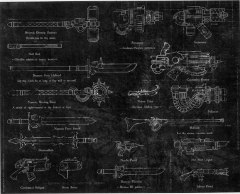

<!-- A0464-B0336 -->

原译文

Grey Knights Weaponry 灰骑士武器

**校订译文**

Grey Knights Weaponry 灰骑士武器

<!-- /A0464-B0336 -->

<!-- A0464-B0337 -->
**英文原文**

Some notable forms of Grey Knight equipment include:

<!-- /A0464-B0337 -->

<!-- A0464-B0338 -->

原译文

灰骑士装备的一些著名形式包括：

**校订译文**

主要专用装备包括：

<!-- /A0464-B0338 -->

<!-- A0464-B0339 -->
**英文原文**

Nemesis Force Weapon — The characteristic weapon of the Grey Knights is the Nemesis force weapon. It can take the form of a halberd, sword, mace, axe, or the rarer hammer. It is a powerful force weapon, housing a psi-matrix attuned to the unique psyche of its owner. In original versions, the haft incorporated a bolter weapon, similar to the Adeptus Custodes guardian spear; on newer models of the Grey Knights the bolter is a wrist-mounted storm bolter, incorporated into the armour itself. Like all force weapons, the power of the weapon itself directly corresponds to the psychic talent of the wielder; as the Grey Knights are some of the greatest psykers of the Imperium, a Nemesis weapon is a truly devastating weapon.

<!-- /A0464-B0339 -->

<!-- A0464-B0340 -->

原译文

复仇女神灵能武器 — 灰骑士的特色武器是复仇女神灵能武器。它可以是戟、剑、狼牙棒、斧头或更稀有的锤子。它是一种强大的灵能武器，拥有一个与主人独特灵能适应的灵能矩阵。在最初的版本中，柄附了一把爆矢枪，类似于禁军卫士之矛；在较新型号的灰骑士身上的爆矢枪是一种腕戴式风暴爆矢枪，被整合到盔甲本身中。与所有灵能武器一样，武器本身的力量直接对应于使用者的灵能天赋；由于灰骑士是帝国中最伟大的灵能者之一，复仇女神武器是一种真正的毁灭性武器。

**校订译文**

复仇女神灵能武器——灰骑士的标志性武器，可以是戟、剑、钉头锤、斧，或较为罕见的战锤。每件武器内都有与使用者独特灵能相调谐的灵能矩阵。早期版本在长柄上集成爆矢枪，类似帝皇禁军的卫士之矛；较新的灰骑士模型则将腕装风暴爆矢枪直接整合进护甲。与所有灵能武器一样，其威力与使用者的灵能天赋直接相关。灰骑士本就是帝国最强大的灵能者之一，因此这种武器拥有骇人的毁灭力。

<!-- /A0464-B0340 -->

<!-- A0464-B0341 -->
**英文原文**

Incinerator — Similar to a Heavy Flamer but fueled with special mix of consecrated promethium and blessed oils which are especially effective against daemons.

<!-- /A0464-B0341 -->

<!-- A0464-B0342 -->

原译文

焚化枪 — 类似于重型火焰枪，但燃料是神圣钷素和祝圣之油的特殊混合物，对恶魔特别有效。

**校订译文**

焚化枪 — 类似于重型火焰喷射器，但燃料是神圣钷素和祝圣之油的特殊混合物，对恶魔特别有效。

<!-- /A0464-B0342 -->

<!-- A0464-B0343 -->
**英文原文**

Psycannon — Bolt weapons firing ammunition impregnated with negative psychic energy.

<!-- /A0464-B0343 -->

<!-- A0464-B0344 -->

原译文

灵能炮 — 爆矢武器发射的弹药充满了负面的灵能能量。

**校订译文**

灵能炮——发射浸注负向灵能弹药的爆矢武器。

<!-- /A0464-B0344 -->

<!-- A0464-B0345 -->
**英文原文**

Psilencer — An unusual heavy weapon of Xenos origin.

<!-- /A0464-B0345 -->

<!-- A0464-B0346 -->

原译文

灭灵武器 — 一种起源于异型的不同寻常的重型武器。

**校订译文**

灭灵武器——一种源自异形技术的特殊重型武器。

<!-- /A0464-B0346 -->

<!-- A0464-B0347 -->
**英文原文**

Aegis Armour — The suits of power and Terminator armour worn by the Grey Knights are incredibly well crafted lattice of psychoconductive filaments and amulets; anointed and inscribed with prayers and wards, ritually consecrated and psychically charged. Working in tandem with the Grey Knights' formidable psychic powers, the Aegis armour protects the wearers from the effects of the Immaterium and the Daemons it spawns. The armour's ritual blessings and psychic resonance also serve to confound the perception of any enemy, resulting in an effect called the Shrouding. The psychically charged nature of the armour allows its mere presence to induce intense terror and pain in any nearby daemons and warp spawn, also loosening their grip on the material realm.

<!-- /A0464-B0347 -->

<!-- A0464-B0348 -->

原译文

宙斯盾盔甲—灰骑士所穿的动力盔甲和终结者盔甲是由导灵能细丝和护符精心制作的框架；受膏并刻有祷言和保护，在仪式上被奉献，在精神上被赋予。宙斯盾盔甲与灰骑士强大的灵能力量协同工作，保护穿戴者免受非物质界和恶魔的影响。盔甲的仪式祝福和灵能共鸣也有助于混淆任何敌人的感知，从而产生一种称为遮蔽的效果。盔甲的灵能性使其仅仅存在就可以在附近的任何恶魔和亚空间生物中引起强烈的恐惧和痛苦，也会放松他们对物质世界的控制。

**校订译文**

神盾护甲——灰骑士的动力甲与终结者护甲，内布精密的导灵能丝线与护符网络，涂抹圣油、刻写祷文与防护符印，经仪式祝圣并灌注灵能。护甲与战士的强大灵能协同，保护穿戴者免遭非物质界及其恶魔侵扰。仪式祝福和灵能共振还会扰乱敌人的感知，形成称为“遮蔽”的效果。其充盈的灵能仅凭存在，就能令附近恶魔和亚空间生物陷入强烈恐惧与痛苦，削弱它们在物质世界中的立足能力。

<!-- /A0464-B0348 -->

<!-- A0464-B0349 -->
**英文原文**

Dreadnoughts — Like other Space Marine Chapters, mortally wounded Grey Knights are sometimes placed within the massive battle armour known as a Dreadnought. Unlike other Chapters, however, Grey Knights do not look upon this extension of their life as an honour - all Grey Knights desire to be brought to the crypts underneath the Temple of the Emperor on Titan and laid to rest with their brothers over continuing life inside a machine. As such, Grey Knight Dreadnoughts are extremely rare.

<!-- /A0464-B0349 -->

<!-- A0464-B0350 -->

原译文

无畏 — 和其他星际战士一样，受致命伤的灰骑士有时会被放置在被称为无畏的巨大战斗装甲中。然而，与其他战团不同的是，灰骑士并不把延长寿命视为一种荣誉—所有灰骑士都希望被带到泰坦帝皇圣殿下的地穴，与他们的兄弟一起安息，而不是在机器内继续生存。因此，灰骑士无畏极为罕见。

**校订译文**

无畏机甲——与其他星际战士战团一样，灰骑士有时会将身负致命伤的战士安置进这种巨型战斗装甲。然而，他们并不将此视为荣誉。比起在机械内延续生命，他们更愿被送回泰坦帝皇圣殿下的墓穴，与兄弟一同安息。因此，灰骑士无畏机甲极为罕见。

<!-- /A0464-B0350 -->

<!-- A0464-B0351 -->
**英文原文**

Nemesis Dreadknight — The chapter uniquely has access to a large suit of mechanised armour known as a Nemesis Dreadknight. The Dreadknight is designed to face Greater Daemons in one-on-one combat. This huge construct towers over even dreadnoughts.

<!-- /A0464-B0351 -->

<!-- A0464-B0352 -->

原译文

天罚恐惧骑士 - 战团独特地拥有一套被称为天罚恐惧骑士的大型机械化装甲。恐惧骑士的设计是在一对一的战斗中面对大魔。这个巨大的结构体甚至高过无畏。

**校订译文**

涅墨西斯骇骑机甲——灰骑士独有的大型机械化战甲，专为与大魔一对一交战而设计。其庞大身躯甚至高过无畏机甲。

<!-- /A0464-B0352 -->

<!-- A0464-B0353 -->
### Chapter Fleet 战团舰队

<!-- /A0464-B0353 -->

<!-- A0464-B0354 -->
**英文原文**

Like other Space Marine chapters, the Grey Knights' primary mode of transport is the strike cruiser class of ship that is exclusive to the chapters of the Adeptus Astartes. The Grey Knights' ships however are specially modified in several ways. One is the hexagrammic and anti-daemonic wards that are built into the entire ship from bridge to landing struts and every bulkhead in between, similar to those that are placed under the skin of the Grey Knights themselves that lend the ship added protection from the forces of Chaos. Also, the Grey Knights' strike cruisers are equipped with significantly more advanced armour than the ships of other chapters. This is to allow them to close with more powerful foes and reach their destination safely since the Grey Knights have to fight more powerful enemies than the standard Adeptus Astartes chapters. Finally, the landing and drop pod bays are enlarged to be able to deploy larger numbers of marines faster.

<!-- /A0464-B0354 -->

<!-- A0464-B0355 -->

原译文

与其他星际战士战团一样，灰骑士的主要运输方式是阿斯塔特修会独有的打击巡洋舰级战舰。然而，灰骑士的战舰在几个方面进行了特殊改装。一个是从舰桥到登陆架以及其间的每个舱壁都内置在整艘船上的六芒星和反恶魔保护中，类似于放置在灰骑士皮肤下的那些保护，为战舰提供了额外的保护，使其免受混沌势力的影响。此外，灰骑士的打击巡洋舰配备了比其他战团的战舰更先进的装甲。这是为了让他们能够与更强大的敌人接近，并安全地到达目的地，因为灰骑士必须与比标准的阿斯塔特修会战团更强大的对手作战。最后，着陆和空降舱室被扩大，以便能够更快地部署更多的战士。

**校订译文**

与其他星际战士战团一样，灰骑士主要以阿斯塔特修会专属的打击巡洋舰运送部队，但其舰艇经过多重改装。从舰桥、各道舱壁到着陆支架，遍布六芒星符印与反恶魔防护，类似战士皮下的符印，为舰船抵御混沌提供额外屏障。灰骑士打击巡洋舰的装甲也比其他战团舰艇更先进，使其能逼近更强大的敌舰，安全抵达目的地。此外，登陆艇舱与空降舱发射区经过扩建，能够更快投送更多战士。

<!-- /A0464-B0355 -->

<!-- A0464-B0356 图片 -->
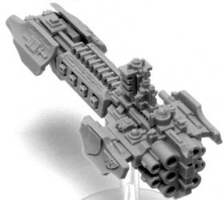

<!-- A0464-B0357 -->

原译文

Grey Knights Strike Cruiser 灰骑士打击巡洋舰

**校订译文**

Grey Knights Strike Cruiser 灰骑士打击巡洋舰

<!-- /A0464-B0357 -->

<!-- A0464-B0358 -->
**英文原文**

The modifications to their ships are made possible by two factors. The first is their fortress-monastery's location in the rings of Saturn, its close proximity to Mars, the greatest Forge World in the Imperium of Man, allowing access to technology that was forgotten or is impossible to replicate anywhere else in the Imperium (this could also explain the high quality of all Grey Knights equipment). The other reason is the resources that the Ordo Malleus gives the Grey Knights due to their close working relationship as the Ordo's Chamber Militant.

<!-- /A0464-B0358 -->

<!-- A0464-B0359 -->

原译文

他们的战舰的改装是由两个因素造成的。首先是他们的堡垒修道院位于土星环中，靠近火星，火星是人类帝国中最大的铸造世界，可以获得被遗忘或无法在帝国其他任何地方复制的技术（这也可以解释所有灰骑士装备的高质量）。另一个原因是，由于他们作为修会军事的密切工作关系，圣锤修会给了灰骑士资源。

**校订译文**

这些舰艇改装有两项基础。其一，原文称要塞修道院位于土星环区域，距离帝国最重要的铸造世界火星较近，因此能取得帝国其他地区早已失传或无法复制的技术；这也可能解释灰骑士其他装备的卓越品质。其二，灰骑士作为恶魔审判庭的军事分支，与之合作紧密，因此获拨大量资源。

**校注：** 土星环位置说法同前，保留原稿；“靠近火星”是来源的相对距离表述，未据此补写太阳系轨道关系。

<!-- /A0464-B0359 -->

<!-- A0464-B0360 -->
### Known Vessels 著名战舰

<!-- /A0464-B0360 -->

<!-- A0464-B0361 -->
**英文原文**

Bright Sword — Battle Barge

<!-- /A0464-B0361 -->

<!-- A0464-B0362 -->

原译文

闪耀之剑 — 战斗驳船

**校订译文**

闪耀之剑号——战斗驳船

<!-- /A0464-B0362 -->

<!-- A0464-B0363 -->
**英文原文**

Emperor's Will — Battle Barge.

<!-- /A0464-B0363 -->

<!-- A0464-B0364 -->

原译文

帝皇意志 — 战斗驳船

**校订译文**

帝皇意志号——战斗驳船

<!-- /A0464-B0364 -->

<!-- A0464-B0365 -->
**英文原文**

Fire of Dawn — Battle Barge

<!-- /A0464-B0365 -->

<!-- A0464-B0366 -->

原译文

黎明之火 — 战斗驳船

**校订译文**

黎明之火号——战斗驳船

<!-- /A0464-B0366 -->

<!-- A0464-B0367 -->
**英文原文**

Redeemer of Souls — Battle Barge

<!-- /A0464-B0367 -->

<!-- A0464-B0368 -->

原译文

灵魂救赎者 — 战斗驳船

**校订译文**

灵魂救赎者号——战斗驳船

<!-- /A0464-B0368 -->

<!-- A0464-B0369 -->
**英文原文**

Argent Sceptre — Strike Cruiser

<!-- /A0464-B0369 -->

<!-- A0464-B0370 -->

原译文

白银权杖 — 打击巡洋舰

**校订译文**

白银权杖号——打击巡洋舰

<!-- /A0464-B0370 -->

<!-- A0464-B0371 -->
**英文原文**

Righteous Dawn — Strike Cruiser

<!-- /A0464-B0371 -->

<!-- A0464-B0372 -->

原译文

正义黎明 — 打击巡洋舰

**校订译文**

正义黎明号——打击巡洋舰

<!-- /A0464-B0372 -->

<!-- A0464-B0373 -->
**英文原文**

Ruler of the Black Skies — Strike Cruiser.

<!-- /A0464-B0373 -->

<!-- A0464-B0374 -->

原译文

黑空裁定者 — 打击巡洋舰

**校订译文**

黑空裁定者号——打击巡洋舰

<!-- /A0464-B0374 -->

<!-- A0464-B0375 -->
**英文原文**

Sword of Dione — Strike Cruiser

<!-- /A0464-B0375 -->

<!-- A0464-B0376 -->

原译文

狄俄涅之剑 — 打击巡洋舰

**校订译文**

狄俄涅之剑号——打击巡洋舰

<!-- /A0464-B0376 -->

<!-- A0464-B0377 -->
**英文原文**

Unrelenting - Strike Cruiser

<!-- /A0464-B0377 -->

<!-- A0464-B0378 -->

原译文

无情 - 打击巡洋舰

**校订译文**

无情号——打击巡洋舰

<!-- /A0464-B0378 -->

<!-- A0464-B0379 -->
**英文原文**

Titan's Hand — Strike Cruiser

<!-- /A0464-B0379 -->

<!-- A0464-B0380 -->

原译文

泰坦之手 — 打击巡洋舰

**校订译文**

泰坦之手号——打击巡洋舰

<!-- /A0464-B0380 -->

<!-- A0464-B0381 -->
**英文原文**

Blade's Fall — Destroyer

<!-- /A0464-B0381 -->

<!-- A0464-B0382 -->

原译文

剑刃之陨 — 毁灭者

**校订译文**

剑刃之陨号——驱逐舰。

<!-- /A0464-B0382 -->

<!-- A0464-B0383 -->
**英文原文**

Flawless Reprieve — Destroyer

<!-- /A0464-B0383 -->

<!-- A0464-B0384 -->

原译文

无暇缓刑 — 毁灭者

**校订译文**

无暇缓刑号——驱逐舰。

<!-- /A0464-B0384 -->

<!-- A0464-B0385 -->
**英文原文**

Glaive of Janus — Frigate

<!-- /A0464-B0385 -->

<!-- A0464-B0386 -->

原译文

雅努斯长刀 — 护卫舰

**校订译文**

雅努斯长刀号——护卫舰

<!-- /A0464-B0386 -->

<!-- A0464-B0387 -->
**英文原文**

Karabela — Frigate

<!-- /A0464-B0387 -->

<!-- A0464-B0388 -->

原译文

卡拉贝拉 — 护卫舰

**校订译文**

卡拉贝拉号——护卫舰

<!-- /A0464-B0388 -->

<!-- A0464-B0389 -->
**英文原文**

Kaskara — Frigate

<!-- /A0464-B0389 -->

<!-- A0464-B0390 -->

原译文

卡斯卡拉 — 护卫舰

**校订译文**

卡斯卡拉号——护卫舰

<!-- /A0464-B0390 -->

<!-- A0464-B0391 -->
**英文原文**

Titanicus Rex — Frigate

<!-- /A0464-B0391 -->

<!-- A0464-B0392 -->

原译文

泰坦君王 — 护卫舰

**校订译文**

泰坦君王号——护卫舰

<!-- /A0464-B0392 -->

<!-- A0464-B0393 -->

原译文

Blade's Peace 刀锋和平

**校订译文**

Blade's Peace 刀锋和平号

<!-- /A0464-B0393 -->

<!-- A0464-B0394 -->

原译文

Castigator 惩戒者

**校订译文**

Castigator 惩戒者号

<!-- /A0464-B0394 -->

<!-- A0464-B0395 -->
**英文原文**

The Strident — Cruiser

<!-- /A0464-B0395 -->

<!-- A0464-B0396 -->

原译文

强硬 — 巡洋舰

**校订译文**

强硬号——巡洋舰

<!-- /A0464-B0396 -->

<!-- A0464-B0397 -->
### Notable Aircraft 著名飞行器

<!-- /A0464-B0397 -->

<!-- A0464-B0398 -->
**英文原文**

Draigo's Wings — Stormraven

<!-- /A0464-B0398 -->

<!-- A0464-B0399 -->

原译文

迪亚哥之翼 — 风暴鸦

**校订译文**

迪亚哥之翼号——风暴鸦炮艇。

<!-- /A0464-B0399 -->

<!-- A0464-B0400 -->
**英文原文**

Kodachi — Stormraven

<!-- /A0464-B0400 -->

<!-- A0464-B0401 -->

原译文

小太刀 — 风暴鸦

**校订译文**

小太刀号——风暴鸦炮艇。

<!-- /A0464-B0401 -->

<!-- A0464-B0402 -->
**英文原文**

Longsword — Stormraven. Destroyed during the Sturmhex Incident

<!-- /A0464-B0402 -->

<!-- A0464-B0403 -->

原译文

长剑 — 风暴鸦，在斯图姆海克斯事件中被摧毁

**校订译文**

长剑号——风暴鸦炮艇，在斯图姆海克斯事件中被毁。

<!-- /A0464-B0403 -->

<!-- A0464-B0404 -->
**英文原文**

Purgation's Sword — Stormraven

<!-- /A0464-B0404 -->

<!-- A0464-B0405 -->

原译文

净化之剑 — 风暴鸦

**校订译文**

净化之剑号——风暴鸦炮艇。

<!-- /A0464-B0405 -->

<!-- A0464-B0406 -->
**英文原文**

Talwar — Stormraven

<!-- /A0464-B0406 -->

<!-- A0464-B0407 -->

原译文

弯刀 — 风暴鸦

**校订译文**

弯刀号——风暴鸦炮艇。

<!-- /A0464-B0407 -->

<!-- A0464-B0408 -->
### Notable Grey Knights 著名灰骑士

<!-- /A0464-B0408 -->

<!-- A0464-B0409 -->
### Heresy Era 叛乱时期

原题：Heresy Era 叛乱前

<!-- /A0464-B0409 -->

<!-- A0464-B0410 -->
**英文原文**

Janus — First Supreme Grand Master of the Grey Knights

<!-- /A0464-B0410 -->

<!-- A0464-B0411 -->

原译文

雅努斯 — 灰骑士的第一位至高大导师

**校订译文**

雅努斯 — 灰骑士的第一位至高大导师

<!-- /A0464-B0411 -->

<!-- A0464-B0412 -->
**英文原文**

Khyron — First Grand Master of the Eighth Brotherhood

<!-- /A0464-B0412 -->

<!-- A0464-B0413 -->

原译文

凯戎 — 第八兄弟会的第一位大导师

**校订译文**

凯戎 — 第八兄弟会的第一位大导师

<!-- /A0464-B0413 -->

<!-- A0464-B0414 -->
**英文原文**

Epimetheus — First Grand Master of the Fifth Brotherhood

<!-- /A0464-B0414 -->

<!-- A0464-B0415 -->

原译文

厄庇墨透斯 — 第五兄弟会的第一位大导师

**校订译文**

厄庇墨透斯 — 第五兄弟会的第一位大导师

<!-- /A0464-B0415 -->

<!-- A0464-B0416 -->
**英文原文**

Koios - Grand Master. One of the founding members of the Grey Knights

<!-- /A0464-B0416 -->

<!-- A0464-B0417 -->

原译文

科俄斯 - 大导师。灰骑士的创始成员之一

**校订译文**

科俄斯 - 大导师。灰骑士的创始成员之一

<!-- /A0464-B0417 -->

<!-- A0464-B0418 -->
**英文原文**

Ogen - Grand Master. One of the founding members of the Grey Knights

<!-- /A0464-B0418 -->

<!-- A0464-B0419 -->

原译文

奥根 - 大导师。灰骑士的创始成员之一

**校订译文**

奥根 - 大导师。灰骑士的创始成员之一

<!-- /A0464-B0419 -->

<!-- A0464-B0420 -->
**英文原文**

Satre - Grand Master. One of the founding members of the Grey Knights

<!-- /A0464-B0420 -->

<!-- A0464-B0421 -->

原译文

萨彻 - 大导师。灰骑士的创始成员之一

**校订译文**

萨彻 - 大导师。灰骑士的创始成员之一

<!-- /A0464-B0421 -->

<!-- A0464-B0422 -->
**英文原文**

Iapto - Grand Master. One of the founding members of the Grey Knights

<!-- /A0464-B0422 -->

<!-- A0464-B0423 -->

原译文

拉普托 - 大导师。灰骑士的创始成员之一

**校订译文**

伊阿普托——大导师，灰骑士创始成员之一。

<!-- /A0464-B0423 -->

<!-- A0464-B0424 -->
**英文原文**

Yotun - Grand Master. One of the founding members of the Grey Knights

<!-- /A0464-B0424 -->

<!-- A0464-B0425 -->

原译文

尤顿 - 大导师。灰骑士的创始成员之一

**校订译文**

尤顿 - 大导师。灰骑士的创始成员之一

<!-- /A0464-B0425 -->

<!-- A0464-B0426 -->
**英文原文**

Crius - Intended to become the 9th original Grand Master, but refused the honour

<!-- /A0464-B0426 -->

<!-- A0464-B0427 -->

原译文

克瑞斯 - 本能成为第九位原初大导师，但拒绝了这一荣誉

**校订译文**

克瑞斯——原定成为第九位初代大导师，却拒绝了这一荣誉。

<!-- /A0464-B0427 -->

<!-- A0464-B0428 -->
### Post-Heresy 叛乱后

<!-- /A0464-B0428 -->

<!-- A0464-B0429 -->
**英文原文**

Geronitan — Previous Supreme Grand Master. Succeeded by Kaldor Draigo

<!-- /A0464-B0429 -->

<!-- A0464-B0430 -->

原译文

杰罗尼坦 — 前任至高大导师。由卡尔多·迪亚哥接任

**校订译文**

杰罗尼坦 — 前任至高大导师。由卡尔多·迪亚哥接任

<!-- /A0464-B0430 -->

<!-- A0464-B0431 -->
**英文原文**

Kaldor Draigo — Current Supreme Grand Master of the Grey Knights

<!-- /A0464-B0431 -->

<!-- A0464-B0432 -->

原译文

卡尔多·迪亚哥 — 现任灰骑士至高大导师

**校订译文**

卡尔多·迪亚哥 — 现任灰骑士至高大导师

<!-- /A0464-B0432 -->

<!-- A0464-B0433 -->
**英文原文**

Vorth Mordrak — Grand Master. Known as The Haunted Knight of Mortain

<!-- /A0464-B0433 -->

<!-- A0464-B0434 -->

原译文

沃尔斯·莫德拉克 — 大导师。被称为莫坦的幽灵骑士

**校订译文**

沃尔斯·莫德拉克 — 大导师。被称为莫坦的幽灵骑士

<!-- /A0464-B0434 -->

<!-- A0464-B0435 -->
**英文原文**

Mandulis — Grand Master. Leader of the Grey Knight forces that banished Ghargatuloth on Khorion IX

<!-- /A0464-B0435 -->

<!-- A0464-B0436 -->

原译文

曼杜利斯 — 大导师。在霍里恩九号放逐迦戈图罗斯的灰骑士部队领袖

**校订译文**

曼杜利斯 — 大导师。在霍里恩九号放逐迦戈图罗斯的灰骑士部队领袖

<!-- /A0464-B0436 -->

<!-- A0464-B0437 -->
**英文原文**

Joros — Grand Master. Oversaw operations in the First War for Armageddon, killed by Logan Grimnar

<!-- /A0464-B0437 -->

<!-- A0464-B0438 -->

原译文

乔洛斯 — 大导师。在第一次阿玛吉多顿战争中监督行动，被罗根·格里姆纳尔杀害

**校订译文**

乔洛斯 — 大导师。在第一次阿玛吉多顿战争中监督行动，被洛根·格里姆纳尔杀害

<!-- /A0464-B0438 -->

<!-- A0464-B0439 -->
**英文原文**

Drystann Cromm — Grand Master

<!-- /A0464-B0439 -->

<!-- A0464-B0440 -->

原译文

德里斯坦·克罗姆 — 大导师

**校订译文**

德里斯坦·克罗姆 — 大导师

<!-- /A0464-B0440 -->

<!-- A0464-B0441 -->
**英文原文**

Vardan Kai — Grand Master

<!-- /A0464-B0441 -->

<!-- A0464-B0442 -->

原译文

瓦尔丹·凯 — 大导师

**校订译文**

瓦尔丹·凯 — 大导师

<!-- /A0464-B0442 -->

<!-- A0464-B0443 -->
**英文原文**

Orias — Grand Master

<!-- /A0464-B0443 -->

<!-- A0464-B0444 -->

原译文

欧里亚斯 — 大导师

**校订译文**

欧里亚斯 — 大导师

<!-- /A0464-B0444 -->

<!-- A0464-B0445 -->
**英文原文**

Regis Vortimer — Master Armourer

<!-- /A0464-B0445 -->

<!-- A0464-B0446 -->

原译文

雷吉斯·沃蒂默 — 军械库之主

**校订译文**

雷吉斯·沃蒂默——首席军械师。

**校注：** Master Armourer 为军械工艺职务，暂译首席军械师，以免与军械大师、军械库管理职责直接等同。

<!-- /A0464-B0446 -->

<!-- A0464-B0447 -->
**英文原文**

Castellan Garran Crowe — Captain & Champion of the Purifier Brotherhood

<!-- /A0464-B0447 -->

<!-- A0464-B0448 -->

原译文

堡主加兰·克洛维 — 净化者兄弟会的连长和冠军

**校订译文**

加兰·克罗堡主——净化者兄弟会的连长兼冠军。

<!-- /A0464-B0448 -->

<!-- A0464-B0449 -->
**英文原文**

Astura — Brother-Captain

<!-- /A0464-B0449 -->

<!-- A0464-B0450 -->

原译文

阿斯图拉 — 兄弟连长

**校订译文**

阿斯图拉 — 兄弟会连长

<!-- /A0464-B0450 -->

<!-- A0464-B0451 -->
**英文原文**

Taremar Aurellian — Brother-Captain. Leader of the Brotherhood sent to end the First War for Armageddon

<!-- /A0464-B0451 -->

<!-- A0464-B0452 -->

原译文

塔雷玛·奥瑞利安 — 兄弟连长。兄弟会领袖被派去结束第一次阿玛吉多顿战争

**校订译文**

塔雷玛·奥瑞利安——兄弟会连长，率兄弟会前往终结第一次阿玛吉多顿战争。

<!-- /A0464-B0452 -->

<!-- A0464-B0453 -->
**英文原文**

Caddon Varn — Brother-Captain

<!-- /A0464-B0453 -->

<!-- A0464-B0454 -->

原译文

卡顿·瓦恩 — 兄弟连长

**校订译文**

卡顿·瓦恩 — 兄弟会连长

<!-- /A0464-B0454 -->

<!-- A0464-B0455 -->
**英文原文**

Ceasarian — Brother-Captain

<!-- /A0464-B0455 -->

<!-- A0464-B0456 -->

原译文

西泽里安 — 兄弟连长

**校订译文**

西泽里安 — 兄弟会连长

<!-- /A0464-B0456 -->

<!-- A0464-B0457 -->
**英文原文**

Edeon — Brother-Captain

<!-- /A0464-B0457 -->

<!-- A0464-B0458 -->

原译文

艾登 — 兄弟连长

**校订译文**

艾登 — 兄弟会连长

<!-- /A0464-B0458 -->

<!-- A0464-B0459 -->
**英文原文**

Ignatius — Brother-Captain

<!-- /A0464-B0459 -->

<!-- A0464-B0460 -->

原译文

伊格纳修斯 — 兄弟连长

**校订译文**

伊格纳修斯 — 兄弟会连长

<!-- /A0464-B0460 -->

<!-- A0464-B0461 -->
**英文原文**

Issad — Brother-Captain

<!-- /A0464-B0461 -->

<!-- A0464-B0462 -->

原译文

伊萨德 — 兄弟连长

**校订译文**

伊萨德 — 兄弟会连长

<!-- /A0464-B0462 -->

<!-- A0464-B0463 -->
**英文原文**

Neodan — Brother-Captain

<!-- /A0464-B0463 -->

<!-- A0464-B0464 -->

原译文

纽丹 — 兄弟连长

**校订译文**

纽丹 — 兄弟会连长

<!-- /A0464-B0464 -->

<!-- A0464-B0465 -->
**英文原文**

Arvann Stern — Brother-Captain

<!-- /A0464-B0465 -->

<!-- A0464-B0466 -->

原译文

艾维安·斯特恩 — 兄弟连长

**校订译文**

艾维安·斯特恩 — 兄弟会连长

<!-- /A0464-B0466 -->

<!-- A0464-B0467 -->
**英文原文**

Zaebus — Brother-Captain

<!-- /A0464-B0467 -->

<!-- A0464-B0468 -->

原译文

泽巴斯 — 兄弟连长

**校订译文**

泽巴斯 — 兄弟会连长

<!-- /A0464-B0468 -->

<!-- A0464-B0469 -->
**英文原文**

Anval Thawn — Justicar

<!-- /A0464-B0469 -->

<!-- A0464-B0470 -->

原译文

安瓦尔·索恩 — 仲裁官

**校订译文**

安瓦尔·索恩 — 仲裁官

<!-- /A0464-B0470 -->

<!-- A0464-B0471 -->
**英文原文**

Alaric — Justicar. Main protagonist of the Grey Knights novel series.

<!-- /A0464-B0471 -->

<!-- A0464-B0472 -->

原译文

阿拉里克 — 仲裁官。《灰骑士》系列小说的主角。

**校订译文**

阿拉里克 — 仲裁官。《灰骑士》系列小说的主角。

<!-- /A0464-B0472 -->

<!-- A0464-B0473 -->
**英文原文**

Aelos — Justicar

<!-- /A0464-B0473 -->

<!-- A0464-B0474 -->

原译文

埃洛斯 — 仲裁官

**校订译文**

埃洛斯 — 仲裁官

<!-- /A0464-B0474 -->

<!-- A0464-B0475 -->
**英文原文**

Hyperion — Battle-Brother known as the Blade Breaker

<!-- /A0464-B0475 -->

<!-- A0464-B0476 -->

原译文

许珀里翁 — 被称为破刃者的战斗兄弟

**校订译文**

许珀里翁 — 被称为破刃者的战斗兄弟

<!-- /A0464-B0476 -->

<!-- A0464-B0477 -->
**英文原文**

Leodegarius — Leader of a strike force sent to Salinas

<!-- /A0464-B0477 -->

<!-- A0464-B0478 -->

原译文

莱奥德加里乌斯 — 被派往萨利纳斯的打击部队队长

**校订译文**

莱奥德加里乌斯 — 被派往萨利纳斯的打击部队队长

<!-- /A0464-B0478 -->

<!-- A0464-B0479 -->
**英文原文**

Graucis Telomane — Epistolary and commander of the Brotherhood of Thirteen

<!-- /A0464-B0479 -->

<!-- A0464-B0480 -->

原译文

格劳西斯.泰洛迈恩 — 星语官和第十三兄弟会的指挥官

**校订译文**

格劳西斯·泰洛迈恩——星语官，十三人兄弟会指挥官。

**校注：** Brotherhood of Thirteen 直指十三人的兄弟会，非第十三兄弟会；与全团八兄弟会的编号编制分开。

<!-- /A0464-B0480 -->

<!-- A0464-B0481 -->
**英文原文**

Aldred — Librarian. Led a small strike force of his Battle Brothers during the 13th Black Crusade and took part in The Scouring of Kasr XV

<!-- /A0464-B0481 -->

<!-- A0464-B0482 -->

原译文

奥尔德雷德 — 智库。在第13次黑色远征期间，领导了他的战斗兄弟的一支小型打击部队，并参加了卡斯尔十五号的清洗

**校订译文**

奥尔德雷德——智库员，第十三次黑色远征期间率一支小型打击部队作战，参加卡斯尔十五号净化战。

<!-- /A0464-B0482 -->

<!-- A0464-B0483 -->
**英文原文**

Umbrane — Librarian

<!-- /A0464-B0483 -->

<!-- A0464-B0484 -->

原译文

翁布兰 — 智库

**校订译文**

翁布兰——智库员。

<!-- /A0464-B0484 -->

<!-- A0464-B0485 -->
**英文原文**

Phlegyras — Ferryman

<!-- /A0464-B0485 -->

<!-- A0464-B0486 -->

原译文

法雷格拉斯 — 摆渡人

**校订译文**

法雷格拉斯 — 摆渡人

<!-- /A0464-B0486 -->

<!-- A0464-B0487 -->
**英文原文**

Dvorik - Paladin

<!-- /A0464-B0487 -->

<!-- A0464-B0488 -->

原译文

德沃瑞克 - 圣骑士

**校订译文**

德沃瑞克 - 圣骑士

<!-- /A0464-B0488 -->

本篇核心术语与暂定项

以下列出本篇出现的英文原形及核心术语表用词。同形词可能指不同对象，具体词义以本篇正文和校注为准；单复数、别名和仅见于图注的名称可能尚未列入。完整候选见[术语表](../../术语表/双语术语候选.csv)。

| 英文 | 采用中文 | 状态 |
| --- | --- | --- |
| Space Marines | 星际战士 | 官方已核对 |
| Adeptus Astartes | 阿斯塔特修会 | 官方已核对 |
| Grey Knights | 灰骑士 | 官方已核对 |
| Space Wolves | 太空野狼 | 官方已核对 |
| Adeptus Custodes | 帝皇禁军 | 官方已核对 |
| Adeptus Mechanicus | 机械修会 | 官方已核对 |
| Imperial Guard | 帝国卫队 | 暂定·语境区分 |
| Chaos Daemons | 混沌恶魔 | 官方已核对 |
| Psyker | 灵能者 | 官方已核对 |
| Librarian | 智库员 | 官方已核对 |
| Terminator | 终结者 | 官方已核对 |
| Ultramar | 奥特拉玛 | 官方已核对 |
| Horus Heresy | 荷鲁斯之乱 | 官方已核对 |
| Warp | 亚空间 | 官方已核对 |
| Great Rift | 大裂隙 | 官方已核对 |
| Inquisition | 审判庭 | 暂定 |
| Inquisitor | 审判官 | 官方已核对 |
| Imperium of Man | 人类帝国 | 官方已核对 |
| Imperium | 帝国 | 暂定·简称 |
| Khorne | 恐虐 | 官方已核对 |
| Daemonology | 恶魔学派 | 暂定 |
| History | 历史 | 编辑用语已统一 |
| Equipment | 装备 | 编辑用语已统一 |
| Ordo Malleus | 恶魔审判庭 | 用户指定 |
| Emperor of Mankind | 人类帝皇 | 暂定 |
| Emperor | 帝皇 | 官方已核对 |
| Primarch | 原体 | 官方已核对 |
| Adeptus Terra | 中央政务部 | 暂定 |
| Battle Barge | 战斗驳船 | 暂定·官方待核 |
| Forge World | 铸造世界 | 暂定·官方待核 |
| Daemon Prince | 恶魔亲王 | 官方已核对 |
| Terra | 泰拉 | 暂定·官方待核 |
| Horus | 荷鲁斯 | 暂定·官方待核 |
| Garviel Loken | 加维尔·洛肯 | 暂定·官方待核 |
| The Brotherhood | 兄弟会 | 暂定·官方待核 |
| High Lords of Terra | 泰拉高领主 | 暂定·官方待核 |
| Dark Imperium | 黑暗帝国 | 暂定·官方待核 |
| Ordo Xenos | 异形审判庭 | 用户指定 |
| Anval Thawn | 安瓦尔·索恩 | 暂定·官方待核 |
| Redeemer | 救赎者 | 暂定·官方待核 |
| Brotherhood | 兄弟会 | 暂定·官方待核 |
| Armageddon | 阿玛吉多顿 | 暂定·官方待核 |
| Mars | 火星 | 暂定·官方待核 |
| Deimos | 迪莫斯 | 暂定·官方待核 |
| Fenris | 芬里斯 | 暂定·官方待核 |
| Banish | 巴尼什 | 暂定·官方待核 |
| Titan | 泰坦 | 暂定·官方待核 |
| Amendera Kendel | 阿蒙德菈·肯德尔 | 暂定·官方待核 |
| Epistolary | 星语官 | 暂定·官方待核 |
| Tylos Rubio | 泰洛斯·鲁比奥 | 暂定·官方待核 |
| Master | 导师（审判庭职衔）／舰务官（舰员职务） | 语境定译·官方待核 |
| Librarium | 智库馆 | 暂定·官方待核 |
| Nemesis Force Weapon | 复仇女神灵能武器 | 暂定·官方待核 |
| Ancient | 旗手 | 官方已核对 |
| Drop Pod | 空降舱 | 官方已核·中英对照 |
| Second Founding | 二次建军 | 暂定·官方待核 |
| Crius | 克利俄斯 | 暂定·官方待核 |
| Nemean | 涅墨亚 | 暂定·官方待核 |
| Knights-Errant | 游侠骑士 | 暂定·官方待核 |
| Founding | 建军 | 暂定·官方待核 |
| Nathaniel Garro | 纳撒尼尔·伽罗 | 暂定·官方待核 |
| Macer Varren | 马塞尔·瓦伦 | 暂定·官方待核 |
| Fel Zharost | 费尔·扎罗斯特 | 暂定·官方待核 |
| Champion | 冠军 | 暂定·官方待核 |
| Power Armour | 动力盔甲 | 暂定·官方待核 |
| Destroyer | 毁灭者 | 暂定·官方待核 |
| Space Marine | 星际战士 | 暂定·官方待核 |
| Chapter | 战团 | 暂定·官方待核 |
| Fortress-monastery | 要塞修道院 | 暂定·官方待核 |
| Chapter Master | 战团长 | 暂定·官方待核 |
| Captain | 连长 | 暂定·官方待核 |
| Sergeant | 军士 | 暂定·官方待核 |
| Brother | 修士 | 暂定·官方待核 |
| Battle-Brother | 战斗兄弟 | 暂定·官方待核 |
| Logan Grimnar | 洛根·格里姆纳尔 | 官方已核 |
| Kaldor Draigo | 卡尔多·迪亚哥 | 暂定·官方待核 |
| Arvann Stern | 艾维安·斯特恩 | 暂定·官方待核 |
| Garran Crowe | 加兰·克罗 | 官方词根参考·全名待核 |
| Nemesis | 复仇女神 | 暂定·官方待核 |
| The Months of Shame | 耻辱之月 | 暂定·官方待核 |
| Armoury | 军械库 | 暂定·官方待核 |
| Supreme Grand Master | 至高大导师 | 暂定·官方待核 |
| Black Wings | 黑翼 | 暂定·官方待核 |
| Dark Swords | 黑暗之剑 | 暂定·官方待核 |
| Reborn | 复生者（战团）／重生者（死神军自称） | 语境定译·官方待核 |
| Red Hunters | 红色猎手 | 暂定·官方待核 |
| Codex Chapter | 圣典战团 | 暂定·官方待核 |
| Space Marine Company | 星际战士连队 | 暂定·官方待核 |
| Gene-seed | 基因种子 | 暂定·官方待核 |
| Strike Cruiser | 打击巡洋舰 | 暂定·官方待核 |
| Terminator Squads | 终结者小队 | 暂定·官方待核 |
| Castellan | 堡主 | 官方已核对 |
| Brother-Captain | 兄弟会连长（灰骑士）／兄弟连长（通称） | 语境定译·灰骑士职衔官译已核 |
| Anointed | 受膏者 | 暂定·官方待核 |
| Absolute | 绝对号 | 暂定·官方待核 |
| Malak | 马拉克 | 暂定·官方待核 |
| Powers | 能天使 | 暂定·官方待核 |
| Dominion | 主天使 | 暂定·官方待核 |
| Xenos | 异形 | 暂定·官方待核 |
| Initiate | 正式成员 | 暂定·官方待核 |
| Echelon | 梯队 | 暂定·官方待核 |
| Bloodthirster | 嗜血狂魔 | 官方已核对 |
| Horde | 部落 | 暂定·官方待核 |
| Wulfen | 狼人 | 官方已核对 |
| Ghargatuloth | 迦戈图罗斯 | 暂定·官方待核 |
| The Beast | 野兽 | 暂定·官方待核 |
| Prognosticars | 预言者 | 暂定·官方待核 |
| Iapto | 伊阿普托 | 暂定·官方待核 |
| Nemesis Dreadknight | 涅墨西斯骇骑机甲 | 官方已核对 |
| Brotherhood Champion | 兄弟会勇士 | 官方已核对 |
| Sepulcars | 守墓者 | 暂定·官方待核 |
| Gatherers | 收集者 | 暂定·官方待核 |
| Chamber of Trials | 试炼厅 | 暂定·官方待核 |
| Aegis Armour | 神盾护甲 | 暂定·官方待核 |
| Master Armourer | 首席军械师 | 暂定·官方待核 |
| Brotherhood of Thirteen | 十三人兄弟会 | 暂定·官方待核 |
| Angron | 安格隆 | 官方已核对 |
| Dreadnought | 无畏机甲 | 暂定·官方待核 |
| Chaplains | 教士 | 暂定·官方待核 |
| Ignatius | 伊格纳修斯 | 暂定·官方待核 |
| Glaive | 长刀号（舰船）／飞刃（坦克） | 语境定译·官方待核 |
| Halberd | 长戟号 | 暂定·官方待核 |
| Battle of Malak | 马拉克之战 | 暂定·官方待核 |
| Castellan Garran Crowe | 加兰·克罗堡主 | 暂定·官方待核 |
| Vardan Kai | 瓦尔丹·凯 | 暂定·官方待核 |
| Vorth Mordrak | 沃尔斯·莫德拉克 | 暂定·官方待核 |
| Drystann Cromm | 德里斯坦·克罗姆 | 暂定·官方待核 |
| Caddon Varn | 卡顿·瓦恩 | 暂定·官方待核 |
| Grand Master | 大导师 | 暂定·官方待核 |
| Justicar | 仲裁官 | 暂定·官方待核 |
| Ferrymen | 摆渡人 | 暂定·官方待核 |
| Incinerator | 焚化枪 | 暂定·官方待核 |
| Psycannon | 灵能炮 | 暂定·官方待核 |
| Psilencer | 灭灵武器 | 暂定·官方待核 |
| Bright Sword | 闪耀之剑号 | 暂定·官方待核 |
| Emperor's Will | 帝皇意志号 | 暂定·官方待核 |
| Fire of Dawn | 黎明之火号 | 暂定·官方待核 |
| Redeemer of Souls | 灵魂救赎者号 | 暂定·官方待核 |
| Argent Sceptre | 白银权杖号 | 暂定·官方待核 |
| Righteous Dawn | 正义黎明号 | 暂定·官方待核 |
| Ruler of the Black Skies | 黑空裁定者号 | 暂定·官方待核 |
| Sword of Dione | 狄俄涅之剑号 | 暂定·官方待核 |
| Unrelenting | 无情号 | 暂定·官方待核 |
| Titan's Hand | 泰坦之手号 | 暂定·官方待核 |
| Blade's Fall | 剑刃之陨号 | 暂定·官方待核 |
| Flawless Reprieve | 无暇缓刑号 | 暂定·官方待核 |
| Glaive of Janus | 雅努斯长刀号 | 暂定·官方待核 |
| Karabela | 卡拉贝拉号 | 暂定·官方待核 |
| Kaskara | 卡斯卡拉号 | 暂定·官方待核 |
| Titanicus Rex | 泰坦君王号 | 暂定·官方待核 |
| Strident | 强硬号 | 暂定·官方待核 |
| Draigo's Wings | 迪亚哥之翼号 | 暂定·官方待核 |
| Kodachi | 小太刀号 | 暂定·官方待核 |
| Longsword | 长剑号 | 暂定·官方待核 |
| Purgation's Sword | 净化之剑号 | 暂定·官方待核 |
| Talwar | 弯刀号 | 暂定·官方待核 |
| Janus | 雅努斯 | 暂定·官方待核 |
| Khyron | 凯戎 | 暂定·官方待核 |
| Epimetheus | 厄庇墨透斯 | 暂定·官方待核 |
| Koios | 科俄斯 | 暂定·官方待核 |
| Ogen | 奥根 | 暂定·官方待核 |
| Satre | 萨彻 | 暂定·官方待核 |
| Yotun | 尤顿 | 暂定·官方待核 |
| Geronitan | 杰罗尼坦 | 暂定·官方待核 |
| Mandulis | 曼杜利斯 | 暂定·官方待核 |
| Joros | 乔洛斯 | 暂定·官方待核 |
| Orias | 欧里亚斯 | 暂定·官方待核 |
| Regis Vortimer | 雷吉斯·沃蒂默 | 暂定·官方待核 |
| Astura | 阿斯图拉 | 暂定·官方待核 |
| Taremar Aurellian | 塔雷玛·奥瑞利安 | 暂定·官方待核 |
| Ceasarian | 西泽里安 | 暂定·官方待核 |
| Edeon | 艾登 | 暂定·官方待核 |
| Issad | 伊萨德 | 暂定·官方待核 |
| Neodan | 纽丹 | 暂定·官方待核 |
| Zaebus | 泽巴斯 | 暂定·官方待核 |
| Alaric | 阿拉里克 | 暂定·官方待核 |
| Aelos | 埃洛斯 | 暂定·官方待核 |
| Hyperion | 许珀里翁 | 暂定·官方待核 |
| Leodegarius | 莱奥德加里乌斯 | 暂定·官方待核 |
| Graucis Telomane | 格劳西斯·泰洛迈恩 | 暂定·官方待核 |
| Aldred | 奥尔德雷德 | 暂定·官方待核 |
| Umbrane | 翁布兰 | 暂定·官方待核 |
| Phlegyras | 法雷格拉斯 | 暂定·官方待核 |
| Dvorik | 德沃瑞克 | 暂定·官方待核 |
| Kyril Sindermann | 凯里尔·辛德曼 | 暂定·官方待核 |
| Lemuel Gaumon | 莱缪尔·高蒙 | 暂定·官方待核 |
| Macro-Geller Fields | 巨型盖勒力场 | 暂定·官方待核 |
| The Weapon | 武器 | 暂定·官方待核 |
| The Dark | 《黑暗》 | 暂定·官方待核 |
| The Aegis | 神盾 | 暂定·官方待核 |
| Drakan Vangorich | 德拉坎·万戈里奇 | 暂定·官方待核 |
| Wienand | 维南德 | 暂定·官方待核 |
| Veritus | 维瑞图斯 | 暂定·官方待核 |
| Real Space | 现实空间 | 暂定·官方待核 |
| System | 星系（恒星系统） | 暂定·官方待核 |
| Kai | 凯 | 暂定·官方待核 |
| Defiance | 反抗号 | 暂定·官方待核 |
| Corruption | 腐败 | 暂定·官方待核 |
| Guardian Spear | 卫士之矛 | 暂定·官方待核 |
| Force weapon | 灵能武器 | 暂定·官方待核 |
| Terran Crusade | 泰拉远征 | 暂定·官方待核 |
| Omen | 预兆号 | 暂定·官方待核 |
| Dead Fields | 亡者之地 | 暂定·官方待核 |
| Bolt | 爆矢 | 暂定·官方待核 |
| Promethium | 钷素 | 暂定·官方待核 |
| Bolter | 爆矢枪 | 暂定·官方待核 |
| Storm bolter | 风暴爆矢枪 | 官方已核对 |
| Flamer | 火焰喷射器（武器）／火妖（奸奇单位） | 语境定译·对应官译已核 |
| Heavy flamer | 重型火焰喷射器 | 官方已核对 |
| Force Weapons | 灵能武器 | 暂定·官方待核 |
| Argent | 圣银权杖 | 暂定·官方待核 |
| Terminator Armour | 终结者盔甲 | 暂定·官方待核 |
| Eisenstein | 艾森斯坦号 | 暂定·官方待核 |
| Garanhir Rebellion | 加拉尼尔叛乱 | 暂定·官方待核 |
| Saturn | 土星 | 暂定·官方待核 |
| Lion's Gate | 狮门 | 暂定·官方待核 |

