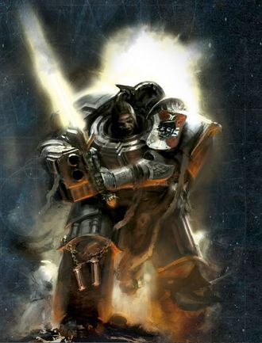
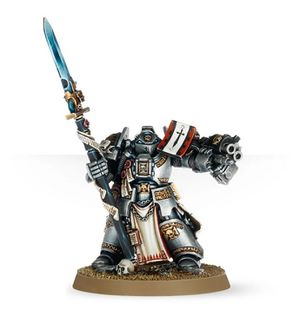

# 0467 兄弟会连长 Brother-Captain

精校状态：中文行文已逐段精校，部分术语仍为暂定

分类：通用概念 / 帝国 Imperium / 中央政务部 Adeptus Terra / 阿斯塔特修会 Adeptus Astartes

原文来源：https://www.bilibili.com/opus/1147924073987178512

原作者：帝国神选罐头

原文时间：2025年12月19日 10:11

[返回分类目录](目录.md) · [全书目录](../../目录.md)

原篇名：兄弟连长 Brother-Captain

<!-- A0467-B0001 -->
**英文原文**

Brother-Captain is a high rank in the Grey Knights hierarchy, below Grand Master, their hierarchic role falling between what is defined as Captain and Veteran Sergeant in other Chapters.

<!-- /A0467-B0001 -->

<!-- A0467-B0002 -->

原译文

兄弟连长是灰骑士等级制度中的一个高级职位，低于大导师，他们的等级角色介于其他战团中定义的连长和老兵中士之间。

**校订译文**

兄弟会连长是灰骑士指挥体系中的高级职务，位阶低于大导师。按本段说法，其组织地位介于其他战团的连长与老兵军士之间。

**校注：** 此处比较为介于连长与老兵军士，其他段又直接以连长层级类比，保留原文差异。

<!-- /A0467-B0002 -->

<!-- A0467-B0003 -->
## Overview 概述

<!-- /A0467-B0003 -->

<!-- A0467-B0004 -->
**英文原文**

Standing amongst the Chapter's foremost warriors, Brother-Captains are second in rank and experience only to a Grey Knights Grand Master. Each is a veteran warrior and commander who has been exclusively appointed from the ranks of the elite Paladins. Furthermore, a Brother-Captain is likely to have begun his service within the Brotherhood to which he is appointed, for to lead he must know intrinsically the rites, practices, and specialties of those he leads. Upon the battlefield, these warriors are placed in the very heart of the fighting, and as part of their training a Brother-Captain will learn how to make psychic contact with his warriors even amidst the fury of battle. This allows the Grey Knights in his presence to be filled with stillness of spirit and clarity of vision, and from this meditative state of purity they can better unleash psychic destruction upon the enemy.

<!-- /A0467-B0004 -->

<!-- A0467-B0005 -->

原译文

站在战团最重要的战士中，兄弟连长的级别和经验仅次于灰骑士大导师。每个人都是从精英圣骑士队伍中专门任命的老兵战士和指挥官。此外，一个兄弟连长很可能已经开始在他被任命的兄弟会中服役，因为要领导，他必须从本质上了解他所领导的人的仪式、习俗和专长。在战场上，这些战士被置于战斗的核心，作为他们训练的一部分，兄弟连长将学习如何在激烈的战斗中与他的战士进行灵能接触。这使得灰骑士在他面前充满了精神的宁静和清晰的视野，从这种纯粹的冥想状态中，他们可以更好地向敌人释放灵能毁灭。

**校订译文**

兄弟会连长跻身战团最杰出的战士之列，地位与经验仅次于大导师。他们都是从精锐圣骑士中选拔的资深战士与指挥官，通常也出身于自己受命统领的兄弟会，因而深谙同袍的仪式、习惯与专长。他们奋战于战场中心，训练中尤其要学会在激战中与战士建立灵能联系。这样的联结让身边的灰骑士心神宁静、感知清明，进入纯净的冥想状态，更有效地以灵能毁灭敌人。

<!-- /A0467-B0005 -->

<!-- A0467-B0006 图片 -->

<!-- A0467-B0007 -->

原译文

Grey Knights Brother-Captain 灰骑士兄弟连长

**校订译文**

Grey Knights Brother-Captain 灰骑士兄弟会连长

<!-- /A0467-B0007 -->

<!-- A0467-B0008 -->
**英文原文**

Each Brother-Captain has authority over an entire Brotherhood of Grey Knights and thus has multiple squads under their command. In matters of strategy and planning a Brother-Captain answers to none, not even to their Grand Master. Brother-Captains are known to gather many honors over their long careers, which often results in a dizzying number of titles for the most experienced of their kind. None as accrued so many as Aldar the Bold, whose traditional title of ‘Keeper of the Light’ has been supplemented by many other honorifics, of which ‘Slayer of the Bloodbeast’ can be considered the least, and ‘Liberator of the Solipsis Sector’ is by far the most prestigious. Whilst such a lengthy roster of honors can lead to ponderous moments at the Grey Knights’ high feasts – when each Captain’s titles must be announced in full – they stand as an important example of duty and heroism to all the Chapter’s warriors.

<!-- /A0467-B0008 -->

<!-- A0467-B0009 -->

原译文

每个兄弟连长都有权管理整个灰骑士兄弟会，因此他们指挥着多个小队。在战略和计划方面，一个兄弟连长不回答任何问题，甚至不回答他们的大导师。众所周知，兄弟连长在漫长的职业生涯中获得了许多荣誉，这往往会为他们中最有经验的人带来令人眼花缭乱的头衔。没有人像大胆者阿尔达尔那样积累了如此多的荣誉，他的传统头衔“光明守护者”已经得到了许多其他荣誉的补充，其中“血兽杀手”可以被认为是最后的，“索利普西斯星区的解放者”是迄今为止最负盛名的。虽然如此漫长的荣誉名单可能会导致灰骑士的盛大宴会上出现沉闷的时刻 — 每个连长的头衔都必须全部宣布 — 但它们是该战团所有战士的职责和英雄主义的重要例子。

**校订译文**

每名兄弟会连长统辖一整个灰骑士兄弟会，指挥多个小队。战略筹划方面，他不受任何人指挥，甚至不必向本会大导师负责。漫长的服役生涯使他们获得众多荣誉，最资深者的头衔往往多得令人目不暇接。其中无人胜过大胆者阿尔达尔：除了传统的“光明守护者”称号，他还拥有许多尊号，“血兽杀手”只能算其中最微不足道的一项，“索利普西斯星区解放者”则最为显赫。灰骑士盛宴上必须完整宣读每位连长的头衔，因此这些长长的名单有时让仪程格外冗长；但对全团战士而言，它们仍是尽忠与英勇的重要典范。

**校注：** answers to none 是不向任何人负责，非不回答问题；least 为最不起眼的荣誉，不表示最后获得。自主战略权限与大导师统辖关系属于原文规定，照实保留。

<!-- /A0467-B0009 -->

<!-- A0467-B0010 图片 -->

<!-- A0467-B0011 -->

原译文

Grey Knights Brother-Captain 灰骑士兄弟连长

**校订译文**

Grey Knights Brother-Captain 灰骑士兄弟会连长

<!-- /A0467-B0011 -->

<!-- A0467-B0012 -->
## Notable Brother Captains 著名兄弟会连长

原题：Notable Brother Captains 著名兄弟连长

<!-- /A0467-B0012 -->

<!-- A0467-B0013 -->

原译文

Aldar the Bold 大胆者阿尔达尔

**校订译文**

Aldar the Bold 大胆者阿尔达尔

<!-- /A0467-B0013 -->

<!-- A0467-B0014 -->

原译文

Arvann Stern 艾维安·斯特恩

**校订译文**

Arvann Stern 艾维安·斯特恩

<!-- /A0467-B0014 -->

<!-- A0467-B0015 -->

原译文

Astura 阿斯图拉

**校订译文**

Astura 阿斯图拉

<!-- /A0467-B0015 -->

<!-- A0467-B0016 -->

原译文

Caesarian 凯撒利亚

**校订译文**

Caesarian 西泽里安

**校注：** 464英文写Ceasarian，本篇Caesarian，姓名及职务相应，中文统一西泽里安，英文异写保留。

<!-- /A0467-B0016 -->

<!-- A0467-B0017 -->

原译文

Edeon 艾登

**校订译文**

Edeon 艾登

<!-- /A0467-B0017 -->

<!-- A0467-B0018 -->

原译文

Ignatius 伊格纳修斯

**校订译文**

Ignatius 伊格纳修斯

<!-- /A0467-B0018 -->

<!-- A0467-B0019 -->

原译文

Issad 伊萨德

**校订译文**

Issad 伊萨德

<!-- /A0467-B0019 -->

<!-- A0467-B0020 -->

原译文

Markhus 马尔库斯

**校订译文**

Markhus 马尔库斯

<!-- /A0467-B0020 -->

<!-- A0467-B0021 -->

原译文

Neodan 纽丹

**校订译文**

Neodan 纽丹

<!-- /A0467-B0021 -->

<!-- A0467-B0022 -->

原译文

Reed Vanar 里德·范纳

**校订译文**

Reed Vanar 里德·范纳

<!-- /A0467-B0022 -->

<!-- A0467-B0023 -->

原译文

Rugan 侞甘

**校订译文**

Rugan 鲁甘

<!-- /A0467-B0023 -->

<!-- A0467-B0024 -->

原译文

Nicolas Stephanus 尼古拉斯·斯特凡努斯

**校订译文**

Nicolas Stephanus 尼古拉斯·斯特凡努斯

<!-- /A0467-B0024 -->

<!-- A0467-B0025 -->

原译文

Taremar Aurellian 塔雷玛·奥瑞利安

**校订译文**

Taremar Aurellian 塔雷玛·奥瑞利安

<!-- /A0467-B0025 -->

<!-- A0467-B0026 -->

原译文

Zaebus 泽巴斯

**校订译文**

Zaebus 泽巴斯

<!-- /A0467-B0026 -->

本篇核心术语与暂定项

以下列出本篇出现的英文原形及核心术语表用词。同形词可能指不同对象，具体词义以本篇正文和校注为准；单复数、别名和仅见于图注的名称可能尚未列入。完整候选见[术语表](../../术语表/双语术语候选.csv)。

| 英文 | 采用中文 | 状态 |
| --- | --- | --- |
| Grey Knights | 灰骑士 | 官方已核对 |
| The Brotherhood | 兄弟会 | 暂定·官方待核 |
| Sector | 星区 | 暂定·官方待核 |
| Brotherhood | 兄弟会 | 暂定·官方待核 |
| Master | 导师（审判庭职衔）／舰务官（舰员职务） | 语境定译·官方待核 |
| Chapter | 战团 | 暂定·官方待核 |
| Captain | 连长 | 暂定·官方待核 |
| Veteran | 老兵 | 暂定·官方待核 |
| Sergeant | 军士 | 暂定·官方待核 |
| Brother | 修士 | 暂定·官方待核 |
| Brother-Captain | 兄弟会连长（灰骑士）／兄弟连长（通称） | 语境定译·灰骑士职衔官译已核 |
| Liberator | 解放者号 | 暂定·官方待核 |
| Grand Master | 大导师 | 暂定·官方待核 |
| Aldar the Bold | 大胆者阿尔达尔 | 暂定·官方待核 |

