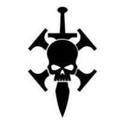
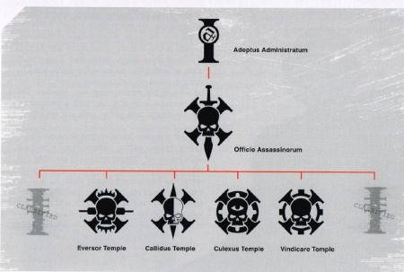
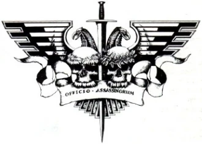
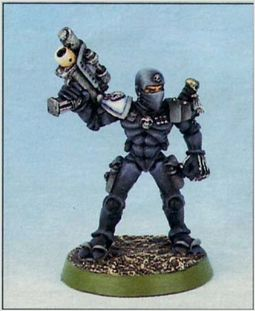

# 0482 刺客庭 Officio Assassinorum

精校状态：中文行文已逐段精校，部分术语仍为暂定

分类：通用概念 / 帝国 Imperium / 中央政务部 Adeptus Terra / 内务部 Adeptus Administratum

原文来源：https://www.bilibili.com/opus/1143240120085774355

原作者：帝国神选罐头

原文时间：2025年12月06日 19:15

[返回分类目录](目录.md) · [全书目录](../../目录.md)

<!-- A0482-B0001 -->
**英文原文**

"For those that defy the Imperium, only the Emperor can judge your crimes. Only in death can you receive the Emperor's judgement." - Motto of the Officio Assassinorum

<!-- /A0482-B0001 -->

<!-- A0482-B0002 -->

原译文

“对于那些反抗帝国的人，只有帝皇才能审判你的罪行。只有死亡，你才能接受帝皇的判决。" - 刺客庭箴言

**校订译文**

“反抗帝国者，你们的罪行唯有帝皇可以审判。唯有死亡，方能领受帝皇的裁决。”——刺客庭箴言

<!-- /A0482-B0002 -->

<!-- A0482-B0003 -->
**英文原文**

The Officio Assassinorum (Office of Assassins) is a subdivision of the Administratum responsible for the recruitment, training, and deployment of elite assassins.

<!-- /A0482-B0003 -->

<!-- A0482-B0004 -->

原译文

刺客庭是内务部的一个分支机构，负责招募、训练和部署精英刺客。

**校订译文**

刺客庭是内政部下属机构，负责招募、训练和派遣精锐刺客。

<!-- /A0482-B0004 -->

<!-- A0482-B0005 图片 -->

<!-- A0482-B0006 -->

原译文

Officio Assassinorum symbol 刺客庭标志

**校订译文**

Officio Assassinorum symbol 刺客庭标志

<!-- /A0482-B0006 -->

<!-- A0482-B0007 -->
**英文原文**

Parent Agency:Adeptus Administratum

<!-- /A0482-B0007 -->

<!-- A0482-B0008 -->

原译文

隶属机构：内务部

**校订译文**

隶属机构：内政部

<!-- /A0482-B0008 -->

<!-- A0482-B0009 -->
**英文原文**

Headquarters:Temple of Assassins, Terra

<!-- /A0482-B0009 -->

<!-- A0482-B0010 -->

原译文

总部：刺客圣殿，泰拉

**校订译文**

总部：刺客圣殿，泰拉

<!-- /A0482-B0010 -->

<!-- A0482-B0011 -->
**英文原文**

Leader:Grand Master Fadix

<!-- /A0482-B0011 -->

<!-- A0482-B0012 -->

原译文

领袖：大导师法迪克斯

**校订译文**

领袖：大导师法迪克斯

<!-- /A0482-B0012 -->

<!-- A0482-B0013 -->
**英文原文**

Armed Forces:Assassin Temples

<!-- /A0482-B0013 -->

<!-- A0482-B0014 -->

原译文

武装部队：刺客神庙

**校订译文**

武装部队：刺客神庙

<!-- /A0482-B0014 -->

<!-- A0482-B0015 -->
**英文原文**

Established:Unification Wars-era

<!-- /A0482-B0015 -->

<!-- A0482-B0016 -->

原译文

成立：统一战争时期

**校订译文**

成立：统一战争时期

<!-- /A0482-B0016 -->

<!-- A0482-B0017 -->
## Overview 概述

<!-- /A0482-B0017 -->

<!-- A0482-B0018 -->
**英文原文**

The Officio's head is the Grand Master of Assassins and due to the power of his organisation, and by tradition, he is always a member of the Senatorum Imperialis. Although the Grand Master oversees the organisation, they may only deploy assassins with the authority of the Senatorum, requiring a two-thirds majority of the High Lords to authorise the deployment of a single assassin.

<!-- /A0482-B0018 -->

<!-- A0482-B0019 -->

原译文

刺客庭的首领是刺客大导师，由于其组织的力量和传统，他一直是帝国参议院的成员。尽管大导师负责监督该组织，但他们只能在参议院的授权下部署刺客，需要三分之二的多数高领主授权部署一名刺客。

**校订译文**

刺客庭的首长为刺客庭大导师。凭借组织权势与传统，他始终在帝国参议院占有席位。不过，大导师虽掌管机构，也必须取得参议院授权才能派遣刺客；哪怕仅派出一人，也须获得三分之二高领主同意。

**校注：** 本段“大导师始终在参议院”与80篇中曾失去至高十二席位的记载，可能区分全体参议院与十二人核心；不能简单据此删去历史例外。

<!-- /A0482-B0019 -->

<!-- A0482-B0020 图片 -->

<!-- A0482-B0021 -->

原译文

The four principle types of Assassins of the Officio Assassinorum from left to right: Eversor, Culexus, Callidus, and Vindicare 从左到右，刺客庭的四种主要刺客类型：艾弗森、邱利萨斯、卡利都司和文迪卡

**校订译文**

The four principle types of Assassins of the Officio Assassinorum from left to right: Eversor, Culexus, Callidus, and Vindicare 从左到右，刺客庭的四种主要刺客类型：艾弗森、邱利萨斯、卡利都司和文迪卡

<!-- /A0482-B0021 -->

<!-- A0482-B0022 -->
**英文原文**

The agency is almost as secretive as the Inquisition itself and it is not surprising to see that the two organisations work closely with one another. The location of the Officio's headquarters on Terra is secret, and the Master of Assassins is never seen by the Adeptus Terra, though he is rumoured to have access to the Emperor himself. Typically, the Grand Master's loyalty to the Emperor must be beyond doubt, as he holds power that could feasibly topple the Imperium itself.

<!-- /A0482-B0022 -->

<!-- A0482-B0023 -->

原译文

该机构几乎和审判庭本身一样隐秘，看到这两个组织密切合作也就不足为奇了。刺客庭在泰拉的总部位置是秘密的，刺客之主从未被中央政务部看到过，尽管有传言说他可以亲自接近帝皇。通常情况下，大导师对帝皇的忠诚必须是毋庸置疑的，因为他拥有可能推翻帝国本身的权力。

**校订译文**

刺客庭的隐秘程度几乎不亚于审判庭，两者也密切合作。它在泰拉的总部位置严格保密，刺客之主从不在中央政务部面前露面，却据传能够直接觐见帝皇。大导师握有足以颠覆帝国的力量，因此其对帝皇的忠诚必须毋庸置疑。

**校注：** 本段声称中央政务部从不见其人，与参与参议院的描述可能属不同版本或秘密身份解释，保留底稿，未补写原因。

<!-- /A0482-B0023 -->

<!-- A0482-B0024 -->
**英文原文**

Under Imperial and Mechanicus law, the improper activation of a member of the Officio Assassinorum is considered treason of the highest order.

<!-- /A0482-B0024 -->

<!-- A0482-B0025 -->

原译文

根据帝国和机械教法律，刺客庭成员的不当激活被视为最高级别的叛国行为。

**校订译文**

根据帝国与机械修会的法律，未经正当授权启用刺客庭成员，属于最严重的叛国行为。

<!-- /A0482-B0025 -->

<!-- A0482-B0026 -->
## Training 训练

<!-- /A0482-B0026 -->

<!-- A0482-B0027 -->
**英文原文**

Assassins are recruited at a very young age, from the orphans of Imperial servants raised in the Schola Progenium, and from the populations of feral worlds. Prospective candidates are tested mercilessly even as they are shipped to Terra, pitted against hazardous environments as well as each other, with perhaps one in ten surviving the journey. The survivors are divided among the temples and then undergo ten years of intensive training under the Lord Assassins. From then onwards they live and operate from one of the Assassin temples said to be located somewhere on Terra. They are harshly tested and trained, their senses and resolve heightened with implants. Even after the initial training, the life of an agent of the Officio remains hard and unforgiving.

<!-- /A0482-B0027 -->

<!-- A0482-B0028 -->

原译文

刺客在很小的时候就被招募了，他们来自在忠嗣学院长大的帝国仆人的孤儿，以及来自蛮荒世界的人口。即使被运往泰拉，潜在的候选人也会接受无情的测试，在危险的环境中相互对抗，也许十分之一的人能在航程中幸存下来。幸存者被分配到神庙中，然后在刺客领主的指导下接受十年的强化训练。从那时起，他们就在据说位于泰拉某处的刺客神庙之一生活和运转。他们经过严格的测试和训练，植入物提高了他们的感官和决心。即使在最初的训练之后，刺客庭特工的生活仍然艰难而无情。

**校订译文**

刺客在幼年便被选拔，主要来自忠嗣学院抚养的帝国官员遗孤，以及蛮荒世界居民。运往泰拉的途中，候选者就须接受严酷考验，既要战胜危险环境，也要彼此竞争，往往只有十分之一能够活着抵达。幸存者被分配至各神庙，在刺客领主指导下接受十年强化训练。此后，他们以据说位于泰拉某处的刺客神庙为生活与行动基地，持续接受严苛训练和考验，并用植入物强化感官与意志。即使完成初期训练，刺客庭特工的生活也依然艰苦而残酷。

<!-- /A0482-B0028 -->

<!-- A0482-B0029 -->
**英文原文**

Some Inquisitors are known to organise Officio Assassinorum training for Death Cultists that serve in their retinue which transforms these already highly efficient killers into much more deadly and honed executioners.

<!-- /A0482-B0029 -->

<!-- A0482-B0030 -->

原译文

众所周知，一些审判官会为在其随从中服役的死亡教徒组织刺客庭培训，将这些已经非常高效的杀手变成更致命、更老练的刽子手。

**校订译文**

某些审判官会安排随从中的死亡教派成员接受刺客庭训练，使这些原本已极为高效的杀手，成为更加致命、技艺更加精湛的处刑者。

<!-- /A0482-B0030 -->

<!-- A0482-B0031 -->
## Organisation 组织

<!-- /A0482-B0031 -->

<!-- A0482-B0032 -->
**英文原文**

The primary division of the Officio is into temples (also called clades), each of which is led by a small group of Masters (often termed Lord Assassins or Grand Masters) and specialises in a unique brand of murder. These Masters rarely work directly but instead being responsible for planning, organising, research and watching over the younger Assassins. The greater number of the Assassins are unranked, though some can be more experienced than others.

<!-- /A0482-B0032 -->

<!-- A0482-B0033 -->

原译文

刺客庭的主要部门是分为神庙（也称为分支），每个神庙都由一小群大师（通常称为领主刺客或大导师）领导，专门从事一种独特的谋杀。这些大师很少直接工作，而是负责策划、组织、研究和监视年轻的刺客。更多的刺客没有等级，尽管有些人可能比其他人更有经验。

**校订译文**

刺客庭以神庙为主要分支，亦称 clade。每座神庙由少数大师领导，常被称为刺客领主或大导师，专精一种独特的杀戮方式。他们很少亲自执行任务，主要负责筹划、组织、研究，以及指导年轻刺客。绝大多数刺客没有正式等级，尽管经验深浅各异。

<!-- /A0482-B0033 -->

<!-- A0482-B0034 图片 -->

<!-- A0482-B0035 -->

原译文

The structure of the Officio Assassinorum. Note that the Vanus and Venenum Temples are dubbed "classified" 刺客庭的结构。瓦努斯和文纳姆神庙被称为“机密”

**校订译文**

The structure of the Officio Assassinorum. Note that the Vanus and Venenum Temples are dubbed "classified" 刺客庭的结构。瓦努斯和文纳姆神庙被称为“机密”

<!-- /A0482-B0035 -->

<!-- A0482-B0036 -->
**英文原文**

Despite their hard and often short lives, Assassins can rise in the organisation by successfully completing missions. Upon achieving Sicarius Primus, they gain the right of refusal to any sector-level mission and even take assignments intended for other Temples. This is the stepping stone for advancement to the central Temple on Terra, where they can become high-ranking masters of the organisation. Indeed, the Grand Master himself is a skilled assassin who has advanced to the Officio's highest position.

<!-- /A0482-B0036 -->

<!-- A0482-B0037 -->

原译文

尽管刺客的生命艰难且往往短暂，但他们可以通过成功完成任务在组织中崛起。在成为首席刺客后，他们获得了拒绝任何星区级任务的权利，甚至可以接受其他神庙的任务。这是晋升到泰拉中央圣殿的垫脚石，在那里他们可以成为该组织的高级大师。事实上，大导师本人是一名技艺精湛的刺客，已经晋升到了刺客庭的最高职位。

**校订译文**

刺客的生涯艰苦，往往也很短暂，但可凭成功完成任务获得晋升。达到“首席刺客”地位后，他们有权拒绝星区级任务，甚至接下原本交给其他神庙的任务。此身份也是进入泰拉中央圣殿、晋升高层大师的阶梯。事实上，大导师本人同样是一名技艺精湛、一路升至组织最高职位的刺客。

<!-- /A0482-B0037 -->

<!-- A0482-B0038 -->
**英文原文**

The temples, with the exception of the Culexus Temple, are located on Terra but their specific locations are a closely guarded secret. Each Temple also operates sub-temples on the Segmentum and then Sector level. These are in turn coordinated by the Temple of Assassins on Terra, which is home to the Grand Master of Assassins and the central command of the organisation. The Central Temple on Terra maintains several sub-departments to oversee Officio activities, such as the Office of Missions and Office of Operations. The heads of these departments answer in turn to the Grand Master himself. There are also Master Adepts, who can organize and sometimes even lead assassination operations.

<!-- /A0482-B0038 -->

<!-- A0482-B0039 -->

原译文

除了邱利萨斯神庙外，其他神庙都位于泰拉上，但它们的具体位置是一个严格保密的秘密。每个神庙还经营着星域和星区级别的子神庙。这些又由泰拉上的刺客神庙协调，是刺客大导师和该组织中央指挥部的所在地。泰拉中央圣殿设有几个下属部门，负责监督刺客庭活动，如任务部和行动部。这些部门的负责人依次向大导师本人负责。也有专家大师，他们可以组织，有时甚至领导暗杀行动。

**校订译文**

除邱利萨斯神庙外，各大神庙都位于泰拉，但具体位置严格保密。它们还在星域及星区层级设立分支，由泰拉的刺客圣殿统一协调；后者是大导师与中央指挥机构的驻地。中央圣殿设有任务部、行动部等部门，监督刺客庭运作，各部门首长直接向大导师负责。此外，还有主管文吏，能够组织，甚至亲自领导暗杀行动。

<!-- /A0482-B0039 -->

<!-- A0482-B0040 -->
**英文原文**

The Officio is also home to many non-assassin employees as for every assassin that is deployed, thousands of clerks and bureaucrats oversee the logistical work of the agency. These officials determine where the operatives should go, who they should kill, and how their equipment is produced and maintained. The ranks of the Officio Assassinorum also include ancillary staff, including intelligence operatives who are deployed across the Imperium to conduct reconnaissance and analysis, along with Astropaths, Navigators, and other such servants. Though these individuals are not Assassins themselves, they live entirely within the organisation and have no contact with the outside world.

<!-- /A0482-B0040 -->

<!-- A0482-B0041 -->

原译文

刺客庭也是许多非刺客员工的家，因为每部署一名刺客，都有数千名职员和官僚监督该机构的后勤工作。这些官员决定特工应该去哪里，他们应该杀死谁，以及他们的设备是如何生产和维护的。刺客庭的级别还包括辅助人员，包括部署在帝国各地进行侦察和分析的情报人员，以及星语者、导航者和其他此类仆人。虽然这些人本身不是刺客，但他们完全生活在组织内部，与外界没有联系。

**校订译文**

刺客庭还雇有大量非刺客人员。每派出一名刺客，背后便有数千名文书与官僚处理后勤事务，决定特工前往何处、杀死何人，以及装备如何制造和维护。辅助人员还包括分布于帝国各地、负责侦察分析的情报人员，以及星语者、导航员等。他们虽然不是刺客，却完全生活在组织体系之内，不与外界独立往来。

**校注：** 原文前述情报人员在帝国各地活动，又称与外界无接触；此处理解为生活与归属全在组织内，不否认履职时对外行动。

<!-- /A0482-B0041 -->

<!-- A0482-B0042 -->
**英文原文**

Assassins may be deployed to a battlefield to covertly 'help' an Imperial force, including Space Marines, Sisters of Battle, and the Imperial Guard, but rarely join any squad, as they work best alone. When Temples do decide to work together on a single mission, it is in an Execution Force.

<!-- /A0482-B0042 -->

<!-- A0482-B0043 -->

原译文

刺客可能被部署到战场上，秘密“帮助”一支帝国部队，包括星际战士、战斗修女和帝国卫队，但很少加入任何小队，因为他们最好独自工作。当圣殿决定共同完成一项任务时，它是在一支处决部队中。

**校订译文**

刺客可被派往战场，秘密“协助”星际战士、战斗修女或帝国卫队等部队，但很少加入其小队，因为单独行动最能发挥所长。若数个神庙决定共同执行同一任务，则会组成处刑部队。

<!-- /A0482-B0043 -->

<!-- A0482-B0044 -->
**英文原文**

The temples use many exotic types of equipment, such as synskin, a substance that once sprayed onto the body, forms a black outer skin which protects the wearer from the environment and enhances strength. The Temple also maintains a secret vault of forbidden and alien weapons, giving them access to some of the most advanced technology in the Imperium.

<!-- /A0482-B0044 -->

<!-- A0482-B0045 -->

原译文

圣殿使用许多奇异的设备，如合成皮肤，一种一旦喷到身体上就会形成黑色外皮的物质，可以保护穿戴者免受环境影响并增强力量。圣殿还保存着一个禁忌秘库和异型武器库，让他们可以使用帝国中一些最先进的技术。

**校订译文**

各神庙使用许多特殊装备，例如合成皮肤：这种物质喷在身上后，会形成黑色外层，抵御环境危害并增强力量。刺客庭还设有秘密武库，收藏禁忌与异形武器，因此能动用帝国中部分最先进的技术。

<!-- /A0482-B0045 -->

<!-- A0482-B0046 图片 -->

<!-- A0482-B0047 -->

原译文

Seal of the Officio Assassinorum刺客庭印章

**校订译文**

Seal of the Officio Assassinorum 刺客庭印章

<!-- /A0482-B0047 -->

<!-- A0482-B0048 -->
### Temples 神庙

<!-- /A0482-B0048 -->

<!-- A0482-B0049 -->
**英文原文**

Adamus Temple - The oldest of the formal Assassin orders, specializing in the decapitation strike.

<!-- /A0482-B0049 -->

<!-- A0482-B0050 -->

原译文

阿达姆斯神庙 - 最古老的正式刺客组织，专门从事斩首袭击。

**校订译文**

阿达姆斯神庙 - 最古老的正式刺客组织，专门从事斩首袭击。

<!-- /A0482-B0050 -->

<!-- A0482-B0051 -->
**英文原文**

Callidus Temple - chameleons, specialists in infiltration and impersonation.

<!-- /A0482-B0051 -->

<!-- A0482-B0052 -->

原译文

卡利都司神庙 - 变形者，渗透和模仿方面的专家。

**校订译文**

卡利都司神庙 - 变形者，渗透和模仿方面的专家。

<!-- /A0482-B0052 -->

<!-- A0482-B0053 -->
**英文原文**

Culexus Temple - pariahs, psykers are their exclusive targets.

<!-- /A0482-B0053 -->

<!-- A0482-B0054 -->

原译文

邱利萨斯神庙 - 被遗弃者，灵能者是他们的唯一目标。

**校订译文**

邱利萨斯神庙——由贱民组成，专以灵能者为目标。

<!-- /A0482-B0054 -->

<!-- A0482-B0055 -->
**英文原文**

Eversor Temple - berserkers, drug-fuelled killing machines.

<!-- /A0482-B0055 -->

<!-- A0482-B0056 -->

原译文

艾弗森神庙 - 狂战士，药物驱动的杀人机器。

**校订译文**

艾弗森神庙 - 狂战士，药物驱动的杀人机器。

<!-- /A0482-B0056 -->

<!-- A0482-B0057 -->
**英文原文**

Vanus Temple - intelligence-gatherers, in matters of strategy and tactics their insight is unparalleled. They often assassinate their targets indirectly using their intelligence and knowledge to bring down targets.

<!-- /A0482-B0057 -->

<!-- A0482-B0058 -->

原译文

瓦努斯神庙 - 情报收集者，在战略和战术方面的洞察力是无与伦比的。他们经常利用自己的情报和知识间接暗杀目标。

**校订译文**

瓦努斯神庙 - 情报收集者，在战略和战术方面的洞察力是无与伦比的。他们经常利用自己的情报和知识间接暗杀目标。

<!-- /A0482-B0058 -->

<!-- A0482-B0059 -->
**英文原文**

Venenum Temple - specialists in poisoning their targets.

<!-- /A0482-B0059 -->

<!-- A0482-B0060 -->

原译文

文纳姆神庙 - 毒杀目标的专家

**校订译文**

文纳姆神庙 - 毒杀目标的专家

<!-- /A0482-B0060 -->

<!-- A0482-B0061 -->
**英文原文**

Vindicare Temple - sharpshooters, specialists in sniping and marksmanship.

<!-- /A0482-B0061 -->

<!-- A0482-B0062 -->

原译文

文迪卡神庙 - 神射手，狙击和射击术专家。

**校订译文**

文迪卡神庙 - 神射手，狙击和射击术专家。

<!-- /A0482-B0062 -->

<!-- A0482-B0063 -->
**英文原文**

Over the millennia, there have been numerous temples. An additional temple, the Maerorus Temple, attempted to create an assassin using illegal human/mutant/xenos hybrids capable of absorbing the biomass of victims to rapidly evolve new bio-weapons. The temple is now extinct.

<!-- /A0482-B0063 -->

<!-- A0482-B0064 -->

原译文

几千年来，这里有许多神庙。一座额外的神庙，莫鲁斯神庙，试图使用能够吸收受害者生物质的非法人类/变种人/异型混合体来制造刺客，以迅速进化出新的生物武器。这座神庙现在已经绝迹了。

**校订译文**

数千年来，刺客庭曾有许多神庙。莫鲁斯神庙便是另一个例子：它试图非法融合人类、变种人与异形，制造能够吸收受害者生物质、迅速进化出新生物武器的刺客。如今，该神庙已经覆灭。

<!-- /A0482-B0064 -->

<!-- A0482-B0065 -->
## History 历史

<!-- /A0482-B0065 -->

<!-- A0482-B0066 -->
**英文原文**

Imperial Assassins are an ancient order, having dated back to the Unification Wars for the elimination of key enemies of the Emperor. During their earliest days, they answered to the Ephoroi of the Adeptus Custodes.

<!-- /A0482-B0066 -->

<!-- A0482-B0067 -->

原译文

帝国刺客是一个古老的组织，可以追溯到统一战争，以消灭帝皇的主要敌人。在他们最初的日子里，他们回答了禁军修会的监察卫士。

**校订译文**

帝国刺客的历史可追溯至统一战争，当时负责消灭帝皇的重要敌人。最早，他们向禁军的监察卫士负责。

<!-- /A0482-B0067 -->

<!-- A0482-B0068 -->
**英文原文**

The origins of the Officio Assassinorum itself are traced to the times of the Great Crusade where a pact was made on Mount Vengeance by the six Directors Primus of the Assassin Clades, headed by the Master of Assassins. All seven individuals were masked and their identities kept secret from one another and thus they were unaware that their leader was none other than Malcador the Sigilite. From the six Directors Primus, the founding Clades were formed from Sire Vindicare, Sire Eversor, Sire Culexus, Sire Vanus, Siress Venenum and Siress Callidus who all met in secret at the Shrouds. For decades, they hunted the enemies of the Emperor by way of stealth and subterfuge in order to show these foes that there was no place for them to hide. Such was the secrecy of this agency that its existence and actions were only marginally known to the Emperor as they intended to maintain his noble purity. As the deployment of an Imperial Assassin was a delicate matter, usually only a single agent was sent into the field or, at maximum, three, but always from the same primary Clade.

<!-- /A0482-B0068 -->

<!-- A0482-B0069 -->

原译文

刺客庭本身的起源可以追溯到大远征时期，刺客分支的六位首席理事在复仇山脉上达成了一项协议，由刺客之主领导。这七个人都戴着面具，他们的身份彼此保密，因此他们不知道他们的领袖正是掌印者马卡多。从六位首席理事中创立的分支由文迪卡、艾弗森、邱利萨斯、瓦努斯、文纳姆和卡利都司成立，他们都在寿衣处秘密会面。几十年来，他们通过秘密和诡计追捕帝皇的敌人，以向这些敌人表明他们没有藏身之处。这就是这个机构的秘密，帝皇对它的存在和行动知之甚少，因为他们打算保持他的高贵纯洁。由于部署帝国刺客是一件微妙的事情，通常只有一名特工被派往战场，或者最多三名特工，但总是来自同一个主要分支。

**校订译文**

刺客庭本身的起源则可追溯至大远征时期：刺客各分支的六位首席理事，在刺客之主率领下于复仇山立约。七人都戴着面具，互不知晓真实身份，因此无人发现领袖正是掌印者马卡多。六个创始分支分别由文迪卡、艾弗森、邱利萨斯、瓦努斯四位先生，以及文纳姆、卡利都司两位女士领导，他们在“帷幕”秘密会面。数十年间，刺客借隐匿与诡计追猎帝皇之敌，使其无处可藏。组织极其隐秘，甚至只让帝皇略知其存在与行动，以求维护他的崇高与纯洁。派遣帝国刺客事关重大，通常一次只出动一人，最多三人，而且始终来自同一主要分支。

**校注：** Shrouds 为会面地点专名，暂译“帷幕”；原译“寿衣处”可能误按普通名词，不与 Deathshroud 死亡寿衣混称。

<!-- /A0482-B0069 -->

<!-- A0482-B0070 -->
**英文原文**

Following the outbreak of the Horus Heresy, the agents of the Officio Assassinorum dispatched eight agents from the six primary Clades in order to eliminate the renegade Warmaster Horus, but all of them failed. The last attempt was made by Tobeld of the Venenum Clade outside the command tent of the rogue Primarch. During a meeting at the Shrouds, the Clade Directors Primus debated and argued over how to eliminate their foe. At this point the Master of Assassins, following the advice of Legio Custodes Captain-General Constantin Valdor, decided to assemble the first Officio Assassinorum Execution Force consisting of various Clades, to eliminate Horus. Such an act was unheard of in the history of the Officio Assassinorum.

<!-- /A0482-B0070 -->

<!-- A0482-B0071 -->

原译文

荷鲁斯叛乱爆发后，刺客庭的特工从六个主要分支中派遣了八名特工，以消灭叛变的战帅荷鲁斯，但他们都失败了。最后一次尝试是由文纳姆分支的托菲尔德在叛徒原体的指挥帐篷外进行的。在寿衣的一次会议上，分支首席理事就如何消灭敌人进行了辩论和争论。在这一点上，刺客之主，根据禁军元帅康斯坦丁·瓦尔多的建议，决定组建第一支由各分支组成的刺客庭处刑部队，以消灭荷鲁斯。这种行为在刺客庭的历史上是闻所未闻的。

**校订译文**

荷鲁斯之乱爆发后，刺客庭先后从六大分支派出八名特工，刺杀叛变的战帅荷鲁斯，均告失败。最后一次尝试由文纳姆分支的托贝尔德实施，地点在叛徒原体的指挥帐篷外。各首席理事随后在帷幕会晤，争论如何除掉荷鲁斯。刺客之主采纳禁军元帅康斯坦丁·瓦尔多的建议，决定从不同分支组建首支刺客庭处刑部队。这种跨分支联合行动，在刺客庭历史上前所未有。

<!-- /A0482-B0071 -->

<!-- A0482-B0072 -->
**英文原文**

In 546.M32 after the disastrous War of the Beast, the High Lords of Terra were slain to a man by the Grand Master of the Officio, Drakan Vangorich. A Space Marine strike force drawing from the Halo Brethren, Sable Swords, and Imperial Fists Chapters under Lord Commander Maximus Thane was scrambled to stop Vangorich. Storming the Assassinorum Temple on Terra, the force was assailed by a hundred Eversor Assassins. Only Thane survived to reach Vangorich and slay the mad Grand Master. Afterwards, the Imperium descended into a period of anarchy.

<!-- /A0482-B0072 -->

<!-- A0482-B0073 -->

原译文

546.M32，在灾难性的野兽战争之后，泰拉的高领主被刺客庭大导师德拉坎·万戈里奇杀死。一支来自光环兄弟会、阴暗之剑和帝国之拳战团的星际战士打击小队在领主指挥官马克西姆斯·塞恩的指挥下紧急行动，阻止了万戈里奇。这支部队突袭了泰拉上的刺客神殿，遭到了一百名艾弗森刺客的袭击。只有塞恩幸存下来，到达了万戈里奇并杀死了疯狂的大导师。之后，帝国陷入了无政府状态。

**校订译文**

546.M32，灾难性的野兽战争结束后，刺客庭大导师德拉坎·万戈里奇杀死了所有泰拉高领主。帝国最高统帅马克西姆斯·塞恩紧急集结光环兄弟会、阴暗之剑与帝国之拳的打击部队，前往制止他。部队强攻泰拉刺客圣殿，遭一百名艾弗森刺客袭击。只有塞恩生还，抵达万戈里奇面前，将这位疯狂的大导师杀死。此后，帝国陷入一段无政府状态。

<!-- /A0482-B0073 -->

<!-- A0482-B0074 -->
**英文原文**

During the Age of Apostasy, the Officio itself became afflicted by the general corruption of the Imperium, and certain high-ranking members of the Office utilised the assassins for Goge Vandire's own ends. During Vandire's purges, powerful individuals and even the Officio's Grand Master became victims of the assassins. The war within the Officio became known as the Wars of Vindication. Following the Apostasy, it was deemed wise to reorganise the Office, one change being that only the Senate could order an assassination. A section of the Inquisition, the Ordo Sicarius, was created to monitor and control the Officio Assassinorum from that date on. Since then, the Ordo has infiltrated the Officio Assassinorum with Assassin-Inquisitor spies, who pass information to their Inquisitor masters. The Assassin-Inquisitors were created by the Ordo Sicarius' founder, Inquisitor Jaeger, who used their information to foil several plots began by elements of the Assassinorum. This included two attempts to assassinate the High Lords of Terra and the attempt to assassinate a Radical Inquisitor who had been dealing with Orks in the Lamina Sector.

<!-- /A0482-B0074 -->

<!-- A0482-B0075 -->

原译文

在叛教时代，刺客庭本身也受到帝国普遍腐败的折磨，某些高级成员利用刺客来达到高戈·范迪尔自己的目的。在范迪尔的清洗期间，有权势的个人，甚至是刺客庭的大导师都成为了刺客的受害者。刺客庭内部的战争被称为辩护战争。叛教之后，重组刺客庭被认为是明智之举，其中一个变化是只有参议院可以下令暗杀。从那天起，审判庭的一个部门，即刺客修会，被创建来监视和控制刺客庭。从那时起，刺客修会就通过刺客审判官间谍渗透到刺客庭，他们将信息传递给他们的审判官大师。刺客审判官是由刺客修会的创始人审判官耶格尔创建的，他利用他们的信息挫败了刺客庭成员发起的几起阴谋。这包括两次暗杀泰拉高领主的企图，以及一次暗杀在拉米纳星区与欧克打交道的激进派审判官的企图。

**校订译文**

叛教时代，帝国普遍的腐败也侵蚀了刺客庭。一些高层滥用刺客，为高戈·范迪尔谋利。范迪尔清洗期间，诸多权贵，甚至刺客庭大导师都死于刺客之手。刺客庭内部的战争被称为辩护战争。叛教时代结束后，机构重组，规定只有参议院可以授权暗杀；审判庭还设立刺客审判庭，专门监督并约束刺客庭。此后，刺客审判庭派出刺客审判官潜入其中，为其上级传递情报。创立这一间谍体系的审判官耶格尔，利用所得情报挫败刺客庭内部的数起阴谋，包括两次暗杀泰拉高领主的企图，以及对一名曾在拉米纳星区与欧克蛮人交涉的激进派审判官的刺杀计划。

<!-- /A0482-B0075 -->

<!-- A0482-B0076 -->
**英文原文**

It was through intelligence gathered by the Officio Assassinorum that the Adeptus Astartes learnt that the Sorceror Ygethmor intended to claim the world of Medusa V in a Warp Storm. During the 13th Black Crusade, an assassin team was deployed to eliminate the Sorceror amongst other notable targets. It was known that at least seven agents of the Assassinorum failed in the attempt on Ygethmor's life.

<!-- /A0482-B0076 -->

<!-- A0482-B0077 -->

原译文

正是通过刺客庭收集的情报，阿斯塔特修会才得知，巫师伊戈斯莫打算在亚空间风暴中夺取美杜莎五号世界。在第13次黑色远征期间，一支刺客小队被部署来消灭这位巫师和其他著名目标。众所周知，至少有七名刺客庭的特工在暗杀伊戈斯莫的行动中失败了。

**校订译文**

刺客庭提供的情报，使阿斯塔特修会得知巫师伊戈斯莫试图用亚空间风暴吞没美杜莎五号行星。第十三次黑色远征期间，刺客小队奉命除掉这名巫师及其他重要目标，然而至少有七名刺客在针对伊戈斯莫的行动中失败。

<!-- /A0482-B0077 -->

<!-- A0482-B0078 图片 -->

<!-- A0482-B0079 -->

原译文

Imperial assassin 帝国刺客

**校订译文**

Imperial assassin 帝国刺客

<!-- /A0482-B0079 -->

<!-- A0482-B0080 -->
### Notable Operations 著名行动

<!-- /A0482-B0080 -->

<!-- A0482-B0081 -->
**英文原文**

M31 - The first Officio Assassinorum Execution Force is dispatched to kill the rogue Warmaster Horus. The operation ends in failure.

<!-- /A0482-B0081 -->

<!-- A0482-B0082 -->

原译文

第一支刺客庭处刑部队被派遣去杀死叛徒战帅荷鲁斯。行动以失败告终。

**校订译文**

M31——首支刺客庭处刑部队奉命刺杀叛徒战帅荷鲁斯，任务失败。

<!-- /A0482-B0082 -->

<!-- A0482-B0083 -->
**英文原文**

M31 - The Callidus Assassin M'Shen slays Night Lords Primarch Konrad Curze.

<!-- /A0482-B0083 -->

<!-- A0482-B0084 -->

原译文

卡利都司刺客穆'沈杀死了午夜领主原体康拉德·科兹。

**校订译文**

M31——卡利都司刺客穆’沈杀死午夜领主原体康拉德·科兹。

<!-- /A0482-B0084 -->

<!-- A0482-B0085 -->
**英文原文**

546.M32 - In the aftermath of the War of the Beast the High Lords of Terra are killed to a man on the orders of the rebellious Grand Master of Assassins Drakan Vangorich.

<!-- /A0482-B0085 -->

<!-- A0482-B0086 -->

原译文

在野兽战争之后，泰拉的高领主在反叛的刺客大导师德拉坎·万德里奇的命令下被一名男子杀害。

**校订译文**

546.M32——野兽战争结束后，反叛的刺客庭大导师德拉坎·万戈里奇下令，将泰拉高领主尽数杀死。

**校注：** to a man 意为全体、无一幸免，原译“被一名男子杀害”错误；与80同一事件统一。

<!-- /A0482-B0086 -->

<!-- A0482-B0087 -->
**英文原文**

990.M32 - Culexus Assassin Dranos slays the Sorcerer Xantaka.

<!-- /A0482-B0087 -->

<!-- A0482-B0088 -->

原译文

邱利萨斯刺客德拉诺斯杀死了巫师赞塔卡。

**校订译文**

990.M32——邱利萨斯刺客德拉诺斯杀死巫师赞塔卡。

<!-- /A0482-B0088 -->

<!-- A0482-B0089 -->
**英文原文**

340.M33 - The Callidus Assassin Mother Gullet steals away the son of the dangerously self-centered Governor Thygmus van Spracht.

<!-- /A0482-B0089 -->

<!-- A0482-B0090 -->

原译文

卡利都司刺客食道之母偷走了危险的自我中心的总督蒂格默斯·范·斯普拉赫特的儿子。

**校订译文**

340.M33——卡利都司刺客食道之母掳走总督蒂格默斯·范·斯普拉赫特的儿子；这位总督极端自私，已构成危险。

<!-- /A0482-B0090 -->

<!-- A0482-B0091 -->
**英文原文**

452.M34 - A Culexus Assassin assassinates the Eldar Farseer Lithandros-Esmanthil.

<!-- /A0482-B0091 -->

<!-- A0482-B0092 -->

原译文

一名邱利萨斯刺客刺杀了灵族先知利桑德罗斯·埃斯曼希尔。

**校订译文**

452.M34——一名邱利萨斯刺客刺杀灵族大先知利桑德罗斯·埃斯曼希尔。

<!-- /A0482-B0092 -->

<!-- A0482-B0093 -->
**英文原文**

372.M35 - Six Eversor Assassins massacre the Abhuman Thugrock Goliath blood cult of Thugrock Secundus

<!-- /A0482-B0093 -->

<!-- A0482-B0094 -->

原译文

六名艾弗森刺客屠杀了暴岩二号的亚人暴岩歌利亚鲜血教派

**校订译文**

372.M35——六名艾弗森刺客屠灭暴岩二号行星上由亚人暴岩歌利亚组成的鲜血教派。

<!-- /A0482-B0094 -->

<!-- A0482-B0095 -->
**英文原文**

M37-M40 - The War of the Golden Cog with the Adeptus Mechanicus.

<!-- /A0482-B0095 -->

<!-- A0482-B0096 -->

原译文

与机械神教的黄金齿轮战争。

**校订译文**

M37—M40——与机械修会进行黄金齿轮战争。

<!-- /A0482-B0096 -->

<!-- A0482-B0097 -->
**英文原文**

501.M37 - Cardinal Jerome the Unsaintly is killed by a Vindicare Assassin after trying to secede from the Imperium

<!-- /A0482-B0097 -->

<!-- A0482-B0098 -->

原译文

红衣主教不洁者杰罗姆在试图脱离帝国后被一名文迪卡刺客杀害

**校订译文**

501.M37——红衣主教“不洁者”杰罗姆企图脱离帝国，被一名文迪卡刺客杀死。

<!-- /A0482-B0098 -->

<!-- A0482-B0099 -->
**英文原文**

563.M37 - Venenum Temple Assassin Urhua Thereaux, originally targeting the renegade Governor Yawell of Morisha, instead finds him dead and replaced by an anti-Imperial democratic committee. Thereaux kills every committee member over the next three days.

<!-- /A0482-B0099 -->

<!-- A0482-B0100 -->

原译文

文纳姆神庙刺客乌尔华·特雷奥最初针对的是摩利沙的叛徒总督雅威尔，但发现他已经死了，取而代之的是一个反帝国民主委员会。在接下来的三天里，特雷奥杀死了所有委员会成员。

**校订译文**

563.M37——文纳姆刺客乌尔华·特雷奥原奉命刺杀摩利沙叛乱总督雅威尔，却发现他已死亡，政权由反帝国民主委员会接管。随后三天，特雷奥杀死了委员会全体成员。

<!-- /A0482-B0100 -->

<!-- A0482-B0101 -->
**英文原文**

003.M38 - The progressive astronomer Lenas Scard is declared heretical and killed by the Vindicare Assassin Erasmus Menst.

<!-- /A0482-B0101 -->

<!-- A0482-B0102 -->

原译文

进步的占星家莱纳斯·斯卡尔德被宣布为异端，并被文迪卡刺客伊拉斯谟·门斯特杀害。

**校订译文**

003.M38——思想进步的天文学家莱纳斯·斯卡尔德被判定为异端，死于文迪卡刺客伊拉斯谟·门斯特之手。

**校注：** astronomer 为天文学家，不是 astrologer 占星家。

<!-- /A0482-B0102 -->

<!-- A0482-B0103 -->
**英文原文**

386143.M38 - A Callidus Assassin manages to end the rebellion on Orlenza Triartes by replacing the rebellious lords chief military advisor

<!-- /A0482-B0103 -->

<!-- A0482-B0104 -->

原译文

一名卡利都司刺客通过替换叛乱领主的首席军事顾问，成功结束了奥伦扎三号的叛乱

**校订译文**

386143.M38——一名卡利都司刺客冒充叛乱领主的首席军事顾问，终结了奥伦扎·特里阿特斯的叛乱。

**校注：** Orlenza Triartes 是完整专名，Triartes 不能仅据词形改成三号；暂音译。英文日期386143.M38原样保留，不自行补零。

<!-- /A0482-B0104 -->

<!-- A0482-B0105 -->
**英文原文**

209.M38 - Callidus Assassin Militzia Scarvelli is able to impersonate a Gretchin, infiltrate the Ork mob of Big Mek Oilguzla, and assassinate him

<!-- /A0482-B0105 -->

<!-- A0482-B0106 -->

原译文

卡利都司刺客米蒂齐亚·斯卡维利能够冒充屁精，渗透到大技霸奥古拉兹的欧克暴徒中，并暗杀他

**校订译文**

209.M38——卡利都司刺客米蒂齐亚·斯卡维利伪装成屁精，潜入大技霸奥古拉兹的欧克蛮人战帮，将其暗杀。

<!-- /A0482-B0106 -->

<!-- A0482-B0107 -->
**英文原文**

243.M39 - Dark Eldar pirate pilot Skyknife is killed by the Vindicare Assassin Dejedris Garamach after the sniper waited in position for six years

<!-- /A0482-B0107 -->

<!-- A0482-B0108 -->

原译文

黑暗领主海盗驾驶员天刀在狙击手等待了六年后被文迪卡刺客德杰德里斯·加拉马赫杀死

**校订译文**

243.M39——文迪卡刺客德杰德里斯·加拉马赫在狙击位置守候六年，终于杀死黑暗灵族海盗飞行员“天刀”。

<!-- /A0482-B0108 -->

<!-- A0482-B0109 -->
**英文原文**

353.M41 - The Culexus Assassin known as the Revoker kills a group of Rogue Psykers known as the Gestalt

<!-- /A0482-B0109 -->

<!-- A0482-B0110 -->

原译文

被称为废除者的邱利萨斯刺客杀死了一群被称为格式塔的非法灵能者

**校订译文**

353.M41——绰号“废除者”的邱利萨斯刺客，杀死了称为格式塔的失控灵能者群体。

<!-- /A0482-B0110 -->

<!-- A0482-B0111 -->
**英文原文**

400.M41 - A Callidus Assassin dubbed Anna posing as an Inquisitorial Stormtrooper kills the already dying Warmaster and eventual Saint Lord Solar Macharius at the end of the Macharian Crusade. The assassination was part of a conspiracy involving the Inquisitor Hyronimus Drake, who was subsequently killed by the assassin as well to hide the truth of the matter. After the deaths of Macharius and Drake, Imperial authorities cover up the truth.

<!-- /A0482-B0111 -->

<!-- A0482-B0112 -->

原译文

在马卡里安远征结束时，一名被称为安娜的卡利都司刺客假扮成审判庭的风暴兵，杀死了已经垂死的战帅和最终的圣人太阳领主马卡里乌斯。暗杀是涉及审判庭希罗尼穆斯·德拉克的阴谋的一部分，他随后也被刺客杀害，以掩盖事情的真相。马卡里乌斯和德拉克去世后，帝国当局掩盖了真相。

**校订译文**

400.M41——马卡里乌斯远征结束时，卡利都司刺客安娜伪装成审判庭风暴兵，杀死了已濒临死亡的战帅、太阳领主马卡里乌斯；后者日后被尊为圣者。这次暗杀是一场阴谋的一部分，审判官希罗尼穆斯·德拉克也参与其中。为掩盖真相，安娜随后又杀死德拉克；两人死后，帝国当局隐瞒了事情的实情。

<!-- /A0482-B0112 -->

<!-- A0482-B0113 -->
**英文原文**

ca. 809.M41 - A Vindicare Assassin fails to neutralize Cardinal-Astral Xaphan on Vraks Prime, precipitating several days of civil disorder and ultimately the Siege of Vraks.

<!-- /A0482-B0113 -->

<!-- A0482-B0114 -->

原译文

一名文迪卡刺客未能在弗拉克斯一号上使红衣主教萨凡无效化，引发了几天的内乱，最终导致弗拉克斯围城。

**校订译文**

约 809.M41——一名文迪卡刺客未能除掉弗拉克斯主星的星界红衣主教萨凡，导致数日动乱，最终引发弗拉克斯围城战。

<!-- /A0482-B0114 -->

<!-- A0482-B0115 -->
**英文原文**

886.M41 - An Eversor Assassin massacres the Tech-Priests of the lubricant-worshiping Lubricae Cult

<!-- /A0482-B0115 -->

<!-- A0482-B0116 -->

原译文

一名艾弗森刺客屠杀了崇拜润滑油的润滑教派的技术神甫

**校订译文**

886.M41——一名艾弗森刺客屠杀润滑教派的技术祭司；该教派崇拜润滑油。

<!-- /A0482-B0116 -->

<!-- A0482-B0117 -->
**英文原文**

999.M41 - All attempts to assassinate Abaddon the Despoiler amid the Thirteenth Black Crusade fail

<!-- /A0482-B0117 -->

<!-- A0482-B0118 -->

原译文

在第十三次黑色远征期间，所有暗杀掠夺者阿巴顿的企图都失败了

**校订译文**

999.M41——第十三次黑色远征期间，针对掠夺者阿巴顿的所有刺杀行动均告失败。

<!-- /A0482-B0118 -->

<!-- A0482-B0119 -->
**英文原文**

999.M41 - An Execution Force succeeds in killing the Crimson Slaughter Sorcerer Lord Severin Drask before he can fully enact the Achyllan Atrocity.

<!-- /A0482-B0119 -->

<!-- A0482-B0120 -->

原译文

一支处刑部队成功杀死了深红屠杀者巫师领主塞韦林·德拉斯克，在他能够完全实施阿奇兰暴行之前。

**校订译文**

999.M41——一支处刑部队抢在阿奇兰暴行计划彻底实施之前，杀死深红屠杀者巫师领主塞韦林·德拉斯克。

<!-- /A0482-B0120 -->

<!-- A0482-B0121 -->
**英文原文**

999.M41 - During the Second Agrellan Campaign a Culexus Assassin attached to an Officio Execution Force succeeds in killing Aun'va, Ethereal Supreme of the Tau Empire.

<!-- /A0482-B0121 -->

<!-- A0482-B0122 -->

原译文

在第二次阿格瑞兰战役中，一名隶属于刺客庭处刑部队的邱利萨斯刺客成功杀死了钛帝国的至高以太铵'瓦。

**校订译文**

999.M41——第二次阿格瑞兰战役中，处刑部队的一名邱利萨斯刺客成功杀死钛帝国至高以太铵’瓦。

<!-- /A0482-B0122 -->

<!-- A0482-B0123 -->
**英文原文**

M42 - The Officio Assassinorum is deployed by Roboute Guilliman during his purge of Imperial Bureaucracy, known as the Primarch's Scourge.

<!-- /A0482-B0123 -->

<!-- A0482-B0124 -->

原译文

刺客庭是由罗伯特·基里曼在净化帝国官僚机构期间部署的，被称为原体之灾。

**校订译文**

M42——罗保特·基里曼在称为“原体之灾”的帝国官僚体系清洗中动用了刺客庭。

<!-- /A0482-B0124 -->

<!-- A0482-B0125 -->
**英文原文**

M42 - Three Callidus Assassins are dispatched to kill Grandsire Wurm, Genestealer Patriarch of the Cult of the Pauper Princes on Vigilus. Though none of the Assassins survive, they succeed in slaying Grandsire Wurm. In the aftermath however, another Grandsire Wurm reincarnates in its place.

<!-- /A0482-B0125 -->

<!-- A0482-B0126 -->

原译文

三名卡利都司刺客被派往警戒星杀死祖尊武尔姆，警戒星乞丐王子教派的基因窃取者族长。虽然没有一个刺客幸存下来，但他们成功地杀死了祖尊武尔姆。然而，在那之后，另一位祖尊武尔姆再生代替了它。

**校订译文**

M42——三名卡利都司刺客被派往警戒星，刺杀乞丐王子教派的基因窃取者族长祖尊武尔姆。她们虽然全部死亡，却成功除掉目标。然而，之后又有一位祖尊武尔姆重生，取代了死者。

<!-- /A0482-B0126 -->

<!-- A0482-B0127 -->
**英文原文**

M42 - A Callidus Assassin posing as a Mentors Chapter Serf kills Ekene Dubaku, Chapter Master of the Celestial Lions.

<!-- /A0482-B0127 -->

<!-- A0482-B0128 -->

原译文

一名乔装成导师战团侍从的卡利都司刺客杀死了天狮战团长埃肯·杜巴库。

**校订译文**

M42——一名卡利都司刺客伪装成导师战团农奴，杀死天狮战团长埃肯·杜巴库。

<!-- /A0482-B0128 -->

<!-- A0482-B0129 -->
**英文原文**

M42 - Grand Master of Assassins Fadix reveals his loyalty to Regent Roboute Guilliman by slaying the members of the Hexarchy before they could launch a coup against his regime.

<!-- /A0482-B0129 -->

<!-- A0482-B0130 -->

原译文

刺客大导师法迪克斯通过在六头成员发动政变对抗他的政权之前杀死他们，表明了他对摄政罗伯特·基里曼的忠诚。

**校订译文**

M42——刺客庭大导师法迪克斯在六头集团发动反对摄政统治的政变前，将其成员杀死，表明对罗保特·基里曼的忠诚。

**校注：** 本段将暗杀置于政变发动前，80篇写挫败政变、成员后来被杀，时序口径可能不同；保留各来源表述。

<!-- /A0482-B0130 -->

<!-- A0482-B0131 -->
**英文原文**

Undated - Word reaches the High Lords of a Chaos Lord claiming to be Alpharius ravaging the moons of the Danevra Sub-sector. Debate rages about whether this could potentially be the case, for the Primarch’s death has been recorded more than once across the span of Imperial history. Nonetheless, the Grand Master of Assassins dispatches a force of six Vindicare Assassins. Over a number of years they identify and slay a dozen Alpha Legion champions bearing the name of Alpharius, but the reports of raids upon the sub-sector’s mining operations only intensify. Five years later, the heads of all six Vindicare Assassins are found frozen in the food storage halls of the High Lords.

<!-- /A0482-B0131 -->

<!-- A0482-B0132 -->

原译文

消息传到了高领主那里，混沌领主声称自己是阿尔法瑞斯，正在破坏达内夫拉分区的卫星。关于这种情况是否可能发生的争论非常激烈，因为在帝国历史上，原体的死亡被记录了不止一次。尽管如此，刺客大导师还是派遣了一支由六名文迪卡刺客组成的部队。多年来，他们识别并杀死了十几名名为阿尔法瑞斯的阿尔法军团冠军，但关于袭击该分区采矿作业的报告只会愈演愈烈。五年后，在高领主的食品储藏室里发现了所有六名文迪卡刺客的头。

**校订译文**

日期不详——高领主获悉，一名自称阿尔法瑞斯的混沌领主正在蹂躏达内夫拉次星区的卫星。他们激烈争论其身份是否可能属实，因为帝国史中已不止一次记载这位原体死亡。尽管如此，大导师仍派出六名文迪卡刺客。数年间，他们找到并杀死十二名自称阿尔法瑞斯的阿尔法军团精英战士，当地采矿设施遇袭的报告却越来越多。五年后，六名刺客的头颅全部被发现冷冻在高领主的食物储藏厅里。

<!-- /A0482-B0132 -->

<!-- A0482-B0133 -->
### Known Operatives 已知特工

原题：Known Operatives 已知作业人员

<!-- /A0482-B0133 -->

<!-- A0482-B0134 -->

原译文

Callidus Assassins 卡利都司刺客

**校订译文**

Callidus Assassins 卡利都司刺客

<!-- /A0482-B0134 -->

<!-- A0482-B0135 -->

原译文

Culexus Assassins 邱利萨斯刺客

**校订译文**

Culexus Assassins 邱利萨斯刺客

<!-- /A0482-B0135 -->

<!-- A0482-B0136 -->

原译文

Eversor Assassins 艾弗森刺客

**校订译文**

Eversor Assassins 艾弗森刺客

<!-- /A0482-B0136 -->

<!-- A0482-B0137 -->

原译文

Vanus Assassins 瓦努斯刺客

**校订译文**

Vanus Assassins 瓦努斯刺客

<!-- /A0482-B0137 -->

<!-- A0482-B0138 -->

原译文

Venenum Assassins 文纳姆刺客

**校订译文**

Venenum Assassins 文纳姆刺客

<!-- /A0482-B0138 -->

<!-- A0482-B0139 -->

原译文

Vindicare Assassins 文迪卡刺客

**校订译文**

Vindicare Assassins 文迪卡刺客

<!-- /A0482-B0139 -->

<!-- A0482-B0140 -->

原译文

Other / Unknown Temple: 其他/未知神庙

**校订译文**

Other / Unknown Temple: 其他/未知神庙

<!-- /A0482-B0140 -->

<!-- A0482-B0141 -->
**英文原文**

Legienstrasse — Maerorus Temple

<!-- /A0482-B0141 -->

<!-- A0482-B0142 -->

原译文

莱吉恩斯特拉塞 — 莫鲁斯神庙

**校订译文**

莱吉恩斯特拉塞 — 莫鲁斯神庙

<!-- /A0482-B0142 -->

<!-- A0482-B0143 -->
**英文原文**

XX-00 — Unknown Temple

<!-- /A0482-B0143 -->

<!-- A0482-B0144 -->

原译文

XX-00 — 未知神庙

**校订译文**

XX-00 — 未知神庙

<!-- /A0482-B0144 -->

<!-- A0482-B0145 -->
## Connections to Space Marine Chapters 与星际战士战团的联系

<!-- /A0482-B0145 -->

<!-- A0482-B0146 -->
**英文原文**

Owing to their codes of conduct and their proud warrior nature, Space Marines find assassination distasteful, and will avoid any contact with assassins under most circumstances. However, as is to be expected from an institution which specialises in subterfuge and clandestine actions, there have been countless rumours and conspiracy theories concerning the Officio Assassinorum, and a number of these relate to disasters which have befallen certain Space Marine Chapters. A long string of coincidences have led some to lay the blame for the loss of the Fire Hawks' fleet in the warp, the unusual destruction of the Crimson Fists' fortress monastery by one of their own defensive missiles, the death of the Celestial Lions Apothecaries on Armageddon, and the ambush of the Angels of Retribution on Alantor X, as well as many other lesser known catastrophes squarely at the Assassins' door. It may never be known if Assassins were involved in any of these calamities, and if they were, whether they were working under the orders of the High Lords of Terra, some other institution or for their own agenda.

<!-- /A0482-B0146 -->

<!-- A0482-B0147 -->

原译文

由于他们的行为准则和自豪的战士本性，星际战士对暗杀感到厌恶，在大多数情况下都会避免与刺客接触。然而，正如一个专门从事诡计和秘密行动的机构所预料的那样，关于暗杀庭的谣言和阴谋论数不胜数，其中一些与某些星际战士战团遭受的灾难有关。一连串的巧合导致一些人将火鹰舰队在亚空间中的损失、绯红之拳堡垒修道院被他们自己的防御导弹不同寻常地摧毁、天狮药剂师在阿玛吉多顿的死亡、复仇天使在阿兰托十号的伏击，以及许多其他鲜为人知的灾难直接归咎于刺客。可能永远不会知道刺客是否参与了这些灾难中的任何一场，如果他们参与了，他们是在泰拉高领主、其他机构的命令下工作，还是为了自己的议程。

**校订译文**

受行为准则与骄傲的战士本性影响，星际战士厌恶暗杀，多数时候避免与刺客往来。不过，专司隐秘行动的刺客庭也引来无数传言与阴谋论，其中不少涉及星际战士战团遭遇的灾祸。一连串巧合使某些人怀疑：火鹰舰队迷失亚空间、绯红之拳的要塞修道院被己方防御导弹意外摧毁、天狮药剂师在阿玛吉多顿死亡，以及复仇天使在阿兰托十号遭伏击等事件，可能都出自刺客之手。刺客是否参与这些灾难，恐怕永远难有定论；若确曾参与，也无法确定他们奉了高领主或其他机构之命，还是出于自身目的。

<!-- /A0482-B0147 -->

<!-- A0482-B0148 -->
**英文原文**

What is known, however, though it is hardly common knowledge, is that, since the Horus Heresy, some secret departments of the Inquisition have researched methods of controlling and/or killing Space Marines, and some Assassins have access to their work.

<!-- /A0482-B0148 -->

<!-- A0482-B0149 -->

原译文

然而，尽管这很难成为常识，但众所周知的是，自荷鲁斯叛乱以来，审判庭的一些秘密部门已经研究了控制和/或杀死星际战士的方法，一些刺客可以接触到他们的工作。

**校订译文**

但可以确定的是，自荷鲁斯之乱以来，审判庭某些秘密部门一直研究控制或杀死星际战士的方法，部分刺客也能取得这些研究成果；只是这一事实很少为外界所知。

<!-- /A0482-B0149 -->

本篇核心术语与暂定项

以下列出本篇出现的英文原形及核心术语表用词。同形词可能指不同对象，具体词义以本篇正文和校注为准；单复数、别名和仅见于图注的名称可能尚未列入。完整候选见[术语表](../../术语表/双语术语候选.csv)。

| 英文 | 采用中文 | 状态 |
| --- | --- | --- |
| Space Marines | 星际战士 | 官方已核对 |
| Adeptus Astartes | 阿斯塔特修会 | 官方已核对 |
| Adeptus Custodes | 帝皇禁军 | 官方已核对 |
| Adeptus Mechanicus | 机械修会 | 官方已核对 |
| Imperial Guard | 帝国卫队 | 暂定·语境区分 |
| Eldar | 灵族 | 暂定·语境区分 |
| Dark Eldar | 黑暗灵族 | 暂定·旧称对应 |
| Orks | 欧克蛮人 | 官方已核对 |
| Roboute Guilliman | 罗保特·基里曼 | 官方已核对 |
| Horus Heresy | 荷鲁斯之乱 | 官方已核对 |
| Warp | 亚空间 | 官方已核对 |
| Inquisition | 审判庭 | 暂定 |
| Inquisitor | 审判官 | 官方已核对 |
| Imperium | 帝国 | 暂定·简称 |
| Sorcerer | 巫师 | 官方已核对 |
| Farseer | 大先知 | 官方已核对 |
| Ethereal | 以太 | 官方已核对 |
| Patriarch | 族长 | 官方已核对 |
| History | 历史 | 编辑用语已统一 |
| Equipment | 装备 | 编辑用语已统一 |
| Administratum | 内政部 | 暂定 |
| Adeptus Administratum | 内政部 | 暂定 |
| Imperial Fists | 帝国之拳 | 暂定 |
| Emperor | 帝皇 | 官方已核对 |
| Primarch | 原体 | 官方已核对 |
| Adeptus Terra | 中央政务部 | 暂定 |
| Officio Assassinorum | 刺客庭 | 暂定·官方待核 |
| Chapter Serf | 战团农奴 | 暂定·官方待核 |
| Abhuman | 亚人 | 暂定·官方待核 |
| Mutant | 变种人 | 暂定·官方待核 |
| Age of Apostasy | 叛教时代 | 暂定·官方待核 |
| Goge Vandire | 高戈·范迪尔 | 暂定·官方待核 |
| Schola Progenium | 忠嗣学院 | 暂定·官方待核 |
| Goliath | 歌利亚 | 暂定·官方待核 |
| Night Lords | 午夜领主 | 暂定·官方待核 |
| Gretchin | 屁精 | 官方已核对 |
| Great Crusade | 大远征 | 暂定·官方待核 |
| Terra | 泰拉 | 暂定·官方待核 |
| Murder | 谋杀 | 暂定·官方待核 |
| Horus | 荷鲁斯 | 暂定·官方待核 |
| COG | 机灵 | 暂定·官方待核 |
| High Lords of Terra | 泰拉高领主 | 暂定·官方待核 |
| Sisters of Battle | 战斗修女 | 暂定·官方待核 |
| Eversor Assassin | 艾弗森刺客 | 官方已核对 |
| Navigators | 导航员 | 官方已核对 |
| Eversor | 艾弗森 | 暂定·官方短名对应 |
| Unification Wars | 统一战争 | 暂定·官方待核 |
| Segmentum | 星域 | 暂定·官方待核 |
| Sector | 星区 | 暂定·官方待核 |
| Konrad Curze | 康拉德·科兹 | 暂定·官方待核 |
| Thugrock Secundus | 暴岩次星 | 暂定·官方待核 |
| Armageddon | 阿玛吉多顿 | 暂定·官方待核 |
| Medusa V | 美杜莎五号 | 暂定·官方待核 |
| Medusa | 美杜莎 | 暂定·官方待核 |
| Vigilus | 警戒星 | 暂定·官方待核 |
| Feral Worlds | 蛮荒世界 | 暂定·官方待核 |
| Culexus Temple | 邱利萨斯神庙 | 暂定·官方待核 |
| Tech | 技术语 | 暂定·官方待核 |
| Master | 导师（审判庭职衔）／舰务官（舰员职务） | 语境定译·官方待核 |
| Cardinal | 红衣主教 | 暂定 |
| Mission | 教团／传教机构 | 暂定 |
| Mentors | 导师战团 | 暂定·官方待核 |
| Ancient | 旗手 | 官方已核对 |
| Primarch's Scourge | 原体之灾 | 暂定·官方待核 |
| Ordo Sicarius | 刺客审判庭 | 暂定·官方待核 |
| Culexus Assassin | 丘里克斯刺客 | 官方已核对 |
| Captain-General | 禁军元帅 | 暂定·官方待核 |
| Grand Master of Assassins | 刺客庭大导师 | 暂定·官方待核 |
| Sicarius Primus | 首席刺客 | 暂定·官方待核 |
| Execution Force | 处刑部队 | 暂定·官方待核 |
| synskin | 合成皮肤 | 暂定·官方待核 |
| Shrouds | 帷幕 | 暂定·官方待核 |
| Tobeld | 托贝尔德 | 暂定·官方待核 |
| Orlenza Triartes | 奥伦扎·特里阿特斯 | 暂定·官方待核 |
| Lord Commander | 领主指挥官 | 暂定·官方待核 |
| Alpha Legion | 阿尔法军团 | 暂定·官方待核 |
| Founding | 建军 | 暂定·官方待核 |
| Crimson Fists | 绯红之拳 | 暂定·官方待核 |
| Despoiler | 劫掠者 | 暂定·官方待核 |
| Space Marine | 星际战士 | 暂定·官方待核 |
| Chapter | 战团 | 暂定·官方待核 |
| Chapter Master | 战团长 | 暂定·官方待核 |
| Captain | 连长 | 暂定·官方待核 |
| Constantin Valdor | 康斯坦丁·瓦尔多 | 暂定·官方待核 |
| Executioners | 处刑者 | 语境定译·官方待核 |
| Halo Brethren | 光环兄弟会 | 暂定·官方待核 |
| Fire Hawks | 火鹰 | 暂定·官方待核 |
| Celestial Lions | 天狮 | 暂定·官方待核 |
| Sable Swords | 阴暗之剑 | 暂定·官方待核 |
| Angels of Retribution | 报应天使 | 暂定·官方待核 |
| Monitor | 监视者 | 暂定·官方待核 |
| Alpharius | 阿尔法瑞斯 | 暂定·官方待核 |
| Lord Solar | 太阳领主 | 暂定·官方待核 |
| Xenos | 异形 | 暂定·官方待核 |
| Abaddon the Despoiler | 掠夺者阿巴顿 | 官方已核对 |
| Big Mek | 蛮人大技师 | 官方已核对 |
| Mek | 蛮人技师 | 官方已核对 |
| Mob | 战群（欧克组织） | 暂定·官方待核 |
| The Beast | 野兽 | 暂定·官方待核 |
| Imperialis | 帝国徽记 | 暂定·官方待核 |
| Maximus Thane | 马克西姆斯·塞恩 | 暂定·官方待核 |
| Cult of the Pauper Princes | 乞丐王子教派 | 暂定·官方待核 |
| Primus | 领军 | 官方已核对 |
| Ekene Dubaku | 埃肯·杜巴库 | 暂定·官方待核 |
| Ethereal Supreme | 至高以太 | 暂定·官方待核 |
| Gatherers | 收集者 | 暂定·官方待核 |
| Vengeance | 复仇号 | 暂定·官方待核 |
| Brand | 布兰德 | 暂定·官方待核 |
| Grand Master | 大导师 | 暂定·官方待核 |
| Sire Vanus | 赛尔·瓦努斯 | 暂定·官方待核 |
| Sable | 暗夜星 | 暂定·官方待核 |
| Hyronimus Drake | 海罗尼穆斯·德拉克 | 暂定·官方待核 |
| Danevra Sub-sector | 达内夫拉次星区 | 暂定·官方待核 |
| Vindicare Assassin | 文迪卡刺客 | 官方已核 |
| Hexarchy | 六头集团 | 暂定·官方待核 |
| Drakan Vangorich | 德拉坎·万戈里奇 | 暂定·官方待核 |
| Warp Storm | 亚空间风暴 | 暂定·官方待核 |
| Agrellan | 阿格瑞兰 | 暂定·官方待核 |
| Wars of Vindication | 辩护战争 | 暂定·官方待核 |
| Macharian Crusade | 马卡里安远征 | 暂定·官方待核 |
| Macharius | 马卡里乌斯 | 暂定·官方待核 |
| Corruption | 腐败 | 暂定·官方待核 |
| Grandsire Wurm | 祖尊乌尔姆 | 暂定·待核官方 |
| Tau Empire | 钛帝国 | 暂定·官方待核 |
| Emperor's Judgement | 帝皇审判 | 暂定·官方待核 |
| The Loss | 失落 | 暂定·官方待核 |
| The Shrouds | 寿衣 | 暂定·官方待核 |

