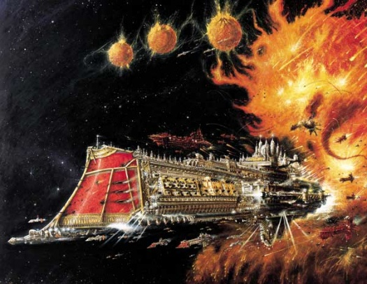

# 0484 帝国舰队 Imperial Fleet

精校状态：中文行文已逐段精校，部分术语仍为暂定

分类：通用概念 / 帝国 Imperium / 中央政务部 Adeptus Terra / 内务部 Adeptus Administratum

原文来源：https://www.bilibili.com/opus/1143866974831378433

原作者：帝国神选罐头

原文时间：2025年12月08日 11:48

[返回分类目录](目录.md) · [全书目录](../../目录.md)

<!-- A0484-B0001 -->
**英文原文**

The Imperial Fleet is controlled by the Adeptus Terra and includes almost every ship in the Imperium. The Imperial Fleet is divided into three distinct branches - the Warfleets of the Imperial Navy, the Merchant Fleets and the Civil fleets. The Navis Nobilite also fall under its administration. The few vessels that are not part of the Imperial Fleet instead belong to either the Adeptus Mechanicus, the Space Marines, the Inquisition, or a small number of honoured and ancient merchant families. Administratively, the Imperial Fleets fall under the control of the Administratum.

<!-- /A0484-B0001 -->

<!-- A0484-B0002 -->

原译文

帝国舰队由中央政务部控制，几乎包括帝国中的每一艘船。帝国舰队分为三个不同的分支 — 帝国海军的战争舰队、商船舰队和民用舰队。导航者家族也归其管理。少数不属于帝国舰队的战舰要么属于机械神教、星际战士、审判庭，要么属于少数受人尊敬的古代商人家族。在行政上，帝国舰队处于内务部的控制之下。

**校订译文**

帝国舰队受中央政务部统辖，涵盖帝国几乎所有舰船，分为三个体系：帝国海军的战争舰队、商船舰队与民用舰队。导航员家族也在其行政管辖范围内。少数例外分别属于机械修会、星际战士、审判庭，以及少数历史悠久、地位尊崇的商人家族。具体行政事务由内政部管理。

<!-- /A0484-B0002 -->

<!-- A0484-B0003 图片 -->

<!-- A0484-B0004 -->

原译文

Imperial Fleet symbol 帝国舰队标志

**校订译文**

Imperial Fleet symbol 帝国舰队标志

<!-- /A0484-B0004 -->

<!-- A0484-B0005 -->
**英文原文**

Parent Agency:Adeptus Administratum

<!-- /A0484-B0005 -->

<!-- A0484-B0006 -->

原译文

隶属机构：内务部

**校订译文**

隶属机构：内政部

<!-- /A0484-B0006 -->

<!-- A0484-B0007 -->
**英文原文**

Headquarters:Terra

<!-- /A0484-B0007 -->

<!-- A0484-B0008 -->

原译文

总部：泰拉

**校订译文**

总部：泰拉

<!-- /A0484-B0008 -->

<!-- A0484-B0009 -->
**英文原文**

Leader:Lord High Admiral of the Imperial Navy, Speaker for the Chartist Captains

<!-- /A0484-B0009 -->

<!-- A0484-B0010 -->

原译文

领袖：帝国海军领主至高海军上将，宪章船长发言人

**校订译文**

领袖：帝国海军至高海军司令、特许舰长代言人

<!-- /A0484-B0010 -->

<!-- A0484-B0011 -->
**英文原文**

Armed Forces:Imperial Navy

<!-- /A0484-B0011 -->

<!-- A0484-B0012 -->

原译文

武装部队：帝国海军

**校订译文**

武装部队：帝国海军

<!-- /A0484-B0012 -->

<!-- A0484-B0013 -->
**英文原文**

Established:M30

<!-- /A0484-B0013 -->

<!-- A0484-B0014 -->

原译文

成立时间：M30

**校订译文**

成立时间：M30

<!-- /A0484-B0014 -->

<!-- A0484-B0015 -->
## Overview 概述

<!-- /A0484-B0015 -->

<!-- A0484-B0016 -->
**英文原文**

The Imperial fleets are arranged around the five Segmentae Majoris that comprise the Imperium, and are based at the five Segmentum Fortresses.

<!-- /A0484-B0016 -->

<!-- A0484-B0017 -->

原译文

帝国舰队围绕组成帝国的五个主要星域部署，并以五个星域堡垒为基地。

**校订译文**

帝国舰队围绕组成帝国的五个主要星域部署，并以五个星域堡垒为基地。

<!-- /A0484-B0017 -->

<!-- A0484-B0018 图片 -->

<!-- A0484-B0019 -->

原译文

Imperial Warfleet 帝国战争舰队

**校订译文**

Imperial Warfleet 帝国战争舰队

<!-- /A0484-B0019 -->

<!-- A0484-B0020 -->
### Fleet Headquarters 舰队总部

<!-- /A0484-B0020 -->

<!-- A0484-B0021 -->
**英文原文**

Segmentum Solar - Mars

<!-- /A0484-B0021 -->

<!-- A0484-B0022 -->

原译文

太阳星域 - 火星

**校订译文**

太阳星域 - 火星

<!-- /A0484-B0022 -->

<!-- A0484-B0023 -->
**英文原文**

Segmentum Pacificus - Hydraphur

<!-- /A0484-B0023 -->

<!-- A0484-B0024 -->

原译文

太平星域 - 海德拉弗

**校订译文**

太平星域 - 海德拉弗

<!-- /A0484-B0024 -->

<!-- A0484-B0025 -->
**英文原文**

Segmentum Obscurus - Cypra Mundi

<!-- /A0484-B0025 -->

<!-- A0484-B0026 -->

原译文

朦胧星域 - 赛普拉·蒙迪

**校订译文**

朦胧星域 - 赛普拉·蒙迪

<!-- /A0484-B0026 -->

<!-- A0484-B0027 -->
**英文原文**

Segmentum Tempestus - Bakka

<!-- /A0484-B0027 -->

<!-- A0484-B0028 -->

原译文

暴风星域 - 巴卡

**校订译文**

暴风星域 - 巴卡

<!-- /A0484-B0028 -->

<!-- A0484-B0029 -->
**英文原文**

Ultima Segmentum - Kar Duniash

<!-- /A0484-B0029 -->

<!-- A0484-B0030 -->

原译文

极限星域 - 卡尔·杜尼亚什

**校订译文**

极限星域 - 卡尔·杜尼亚什

<!-- /A0484-B0030 -->

<!-- A0484-B0031 -->
**英文原文**

Each Segmentum has its own merchant, civil and war fleets - for example, the Warfleet Solar is the warfleet of the Segmentum Solar, the Merchant Pacificus is the merchant fleet of the Segmentum Pacificus and so on.

<!-- /A0484-B0031 -->

<!-- A0484-B0032 -->

原译文

每个星域都有自己的商船队、民用舰队和战争舰队 — 例如，太阳舰队是太阳星域的战争舰队，太平商船队是太平星域的商船队，以此类推。

**校订译文**

每个星域都有自己的商船队、民用舰队和战争舰队 — 例如，太阳舰队是太阳星域的战争舰队，太平商船队是太平星域的商船队，以此类推。

<!-- /A0484-B0032 -->

<!-- A0484-B0033 图片 -->

<!-- A0484-B0034 -->
## Imperial Navy Warfleets 帝国海军战争舰队

<!-- /A0484-B0034 -->

<!-- A0484-B0035 -->
**英文原文**

The Warfleets of the Imperial Navy are based around the five Segmentum Fortress planets. From these worlds the fleets are organised and sent to guard the various sectors and subsectors of that region. Each fleet is comprised of a wide array of different types of ship.

<!-- /A0484-B0035 -->

<!-- A0484-B0036 -->

原译文

帝国海军的战争舰队以五个星域堡垒行星为基地。从这些世界出发，舰队被组织并派往该地区的各个星区和分区进行守卫。每个舰队都由各种不同类型的船只组成。

**校订译文**

帝国海军的战争舰队以五颗星域堡垒行星为基地，在此编组，再派往各星区与次星区执行守备任务。每支舰队均包含多种舰型。

<!-- /A0484-B0036 -->

<!-- A0484-B0037 -->
## Merchant Fleet 商船舰队

<!-- /A0484-B0037 -->

<!-- A0484-B0038 -->
**英文原文**

The combined merchant fleets compose almost 90% of all the interstellar spacecraft in the Imperium.

<!-- /A0484-B0038 -->

<!-- A0484-B0039 -->

原译文

合并后的商船舰队几乎占帝国所有星际飞船的90%。

**校订译文**

各支商船舰队合计约占帝国星际舰船总量的百分之九十。

<!-- /A0484-B0039 -->

<!-- A0484-B0040 -->

原译文

Vagabond Class Merchant Trader 流浪者级贸易商船

**校订译文**

Vagabond Class Merchant Trader 浪人级贸易商船

<!-- /A0484-B0040 -->

<!-- A0484-B0041 -->

原译文

Carrack Hauler 运输武装商船

**校订译文**

Carrack Hauler 运输武装商船

<!-- /A0484-B0041 -->

<!-- A0484-B0042 -->

原译文

Universe Class Mass Conveyor 宇宙级大型运输舰

**校订译文**

Universe Class Mass Conveyor 宇宙级大型运输舰

<!-- /A0484-B0042 -->

<!-- A0484-B0043 -->

原译文

Fast Clipper 快船

**校订译文**

Fast Clipper 快船

<!-- /A0484-B0043 -->

<!-- A0484-B0044 -->

原译文

Galaxy Class Armed Freighter 银河级武装货船

**校订译文**

Galaxy Class Armed Freighter 银河级武装货船

<!-- /A0484-B0044 -->

<!-- A0484-B0045 -->

原译文

Tarask Class Merchantman 塔拉斯克级商船

**校订译文**

Tarask Class Merchantman 塔拉斯克级商船

<!-- /A0484-B0045 -->

<!-- A0484-B0046 -->

原译文

Goliath Class Forge Tender 歌利亚级铸造补给船

**校订译文**

Goliath Class Forge Tender 歌利亚级铸造补给船

<!-- /A0484-B0046 -->

<!-- A0484-B0047 -->

原译文

Heavy Transport 重型运输舰

**校订译文**

Heavy Transport 重型运输舰

<!-- /A0484-B0047 -->

<!-- A0484-B0048 -->

原译文

Super Heavy Troop Transports 超重型部队运输舰

**校订译文**

Super Heavy Troop Transports 超重型部队运输舰

<!-- /A0484-B0048 -->

<!-- A0484-B0049 -->

原译文

Super Heavy Fuel Transports 超重型燃料运输舰

**校订译文**

Super Heavy Fuel Transports 超重型燃料运输舰

<!-- /A0484-B0049 -->

<!-- A0484-B0050 -->
## Civil Fleet 民用舰队

<!-- /A0484-B0050 -->

<!-- A0484-B0051 -->
**英文原文**

The civil fleets contain privately-owned interstellar craft operating along routes licensed by the fleet authorities.

<!-- /A0484-B0051 -->

<!-- A0484-B0052 -->

原译文

民用舰队包括私人拥有的星际飞船，沿着舰队授权的路线运行。

**校订译文**

民用舰队包括私人拥有的星际飞船，沿着舰队授权的路线运行。

<!-- /A0484-B0052 -->

<!-- A0484-B0053 -->
## Fleets of other Imperial Organisations 其他帝国组织的舰队

<!-- /A0484-B0053 -->

<!-- A0484-B0054 -->
### Space Marine Fleets 星际战士舰队

<!-- /A0484-B0054 -->

<!-- A0484-B0055 -->
**英文原文**

Each Space Marine Chapter maintains its own Battlefleet. Whilst they often fight in concert with other Imperial forces, each Chapter-Fleet is an autonomous organisation.

<!-- /A0484-B0055 -->

<!-- A0484-B0056 -->

原译文

每个星际战士战团都有自己的战斗舰队。虽然他们经常与其他帝国军队协同作战，但每个战团舰队都是一个自治组织。

**校订译文**

每个星际战士战团都有自己的战斗舰队。虽然他们经常与其他帝国军队协同作战，但每个战团舰队都是一个自治组织。

<!-- /A0484-B0056 -->

<!-- A0484-B0057 -->
### Adeptus Mechanicus Fleets 机械修会舰队

原题：Adeptus Mechanicus Fleets 机械神教舰队

<!-- /A0484-B0057 -->

<!-- A0484-B0058 -->
**英文原文**

The Adeptus Mechanicus have at their disposal a large fleet of starships. These fleets are often dispatched to seek out lost archeotech and follow rumours of STC technology.

<!-- /A0484-B0058 -->

<!-- A0484-B0059 -->

原译文

机械神教拥有庞大的星舰舰队。这些舰队经常被派遣去寻找丢失的考古科技，并追随STC技术的谣言。

**校订译文**

机械修会拥有庞大的星舰舰队，常派它们寻找失落古科技，并追查有关标准建造模板技术的线索。

<!-- /A0484-B0059 -->

<!-- A0484-B0060 -->
### Rogue Traders 行商浪人

<!-- /A0484-B0060 -->

<!-- A0484-B0061 -->
**英文原文**

Rogue Traders usually have access to their own vessels, sometimes even small fleets.

<!-- /A0484-B0061 -->

<!-- A0484-B0062 -->

原译文

行商浪人通常可以拥有自己的战舰，有时甚至是小型舰队。

**校订译文**

行商浪人通常可以拥有自己的战舰，有时甚至是小型舰队。

<!-- /A0484-B0062 -->

<!-- A0484-B0063 -->

原译文

Rogue Trader Cruiser 行商浪人巡洋舰

**校订译文**

Rogue Trader Cruiser 行商浪人巡洋舰

<!-- /A0484-B0063 -->

<!-- A0484-B0064 -->

原译文

Xenos Vessel 异型战舰

**校订译文**

Xenos Vessel 异形舰船

<!-- /A0484-B0064 -->

<!-- A0484-B0065 -->

原译文

Armed Freighters 武装货船

**校订译文**

Armed Freighters 武装货船

<!-- /A0484-B0065 -->

<!-- A0484-B0066 -->

原译文

Conquest Class Star Galleon 征服级星际帆船

**校订译文**

Conquest Class Star Galleon 征服级星辰大船

<!-- /A0484-B0066 -->

<!-- A0484-B0067 -->

原译文

Ambition Class Cruiser 野心级巡洋舰

**校订译文**

Ambition Class Cruiser 野心级巡洋舰

<!-- /A0484-B0067 -->

<!-- A0484-B0068 -->

原译文

Recommissioned Vessel 重新服役的战舰

**校订译文**

Recommissioned Vessel 重新服役的战舰

<!-- /A0484-B0068 -->

<!-- A0484-B0069 -->

原译文

Auxiliary Vessels 辅助战舰

**校订译文**

Auxiliary Vessels 辅助战舰

<!-- /A0484-B0069 -->

<!-- A0484-B0070 -->
### Inquisition 审判庭

<!-- /A0484-B0070 -->

<!-- A0484-B0071 -->
**英文原文**

Whilst the inquisition are able to requisition the ships of other Imperial organisations, they also maintain vessels of their own.

<!-- /A0484-B0071 -->

<!-- A0484-B0072 -->

原译文

虽然审判庭能够征用其他帝国组织的船只，但他们也拥有自己的战舰。

**校订译文**

虽然审判庭能够征用其他帝国组织的船只，但他们也拥有自己的战舰。

<!-- /A0484-B0072 -->

<!-- A0484-B0073 -->

原译文

Inquisitorial Black Ship 审判庭黑船

**校订译文**

Inquisitorial Black Ship 审判庭黑船

<!-- /A0484-B0073 -->

<!-- A0484-B0074 -->

原译文

Inquisitorial Cruisers 审判庭巡洋舰

**校订译文**

Inquisitorial Cruisers 审判庭巡洋舰

<!-- /A0484-B0074 -->

<!-- A0484-B0075 -->

原译文

Grey Knights Strike Cruisers 灰骑士打击巡洋舰

**校订译文**

Grey Knights Strike Cruisers 灰骑士打击巡洋舰

<!-- /A0484-B0075 -->

<!-- A0484-B0076 -->

原译文

Stealthships 隐形舰

**校订译文**

Stealthships 隐形舰

<!-- /A0484-B0076 -->

<!-- A0484-B0077 -->
### Adeptus Astra Telepathica 星语庭

<!-- /A0484-B0077 -->

<!-- A0484-B0078 -->
**英文原文**

League of Blackships - consisting of a substantial fleet charged with collecting and transporting psykers from across the galaxy to Terra.

<!-- /A0484-B0078 -->

<!-- A0484-B0079 -->

原译文

黑船联盟 - 由一支庞大的舰队组成，负责从银河系收集和运输灵能者到泰拉。

**校订译文**

黑船联盟 - 由一支庞大的舰队组成，负责从银河系收集和运输灵能者到泰拉。

<!-- /A0484-B0079 -->

<!-- A0484-B0080 -->
### Adeptus Arbites 法务部

<!-- /A0484-B0080 -->

<!-- A0484-B0081 -->
**英文原文**

The Arbites also maintain a small fleet of patrol craft and counter-insurgency vessels, most notably among these the Punisher Class Strike Cruiser. The Arbites fleet also operates logistical vessels, transports, and other support craft.

<!-- /A0484-B0081 -->

<!-- A0484-B0082 -->

原译文

法务部拥有一支由巡逻舰和反叛乱战舰组成的小型舰队，其中最著名的是惩罚者级打击巡洋舰。法务部舰队还使用后勤战舰、运输舰和其他支援船。

**校订译文**

法务部拥有一支由巡逻舰和反叛乱战舰组成的小型舰队，其中最著名的是惩罚者级打击巡洋舰。法务部舰队还使用后勤战舰、运输舰和其他支援船。

<!-- /A0484-B0082 -->

<!-- A0484-B0083 -->
### Adeptus Ministorum 国教会

原题：Adeptus Ministorum 国教教会

<!-- /A0484-B0083 -->

<!-- A0484-B0084 -->
**英文原文**

The Ecclesiarchy operates its own exclusive naval vessels such as Missionary Ships. In addition, the Adepta Sororitas has its own warships such as Dauntless Class Light Cruisers.

<!-- /A0484-B0084 -->

<!-- A0484-B0085 -->

原译文

国教拥有自己的专属海军战舰，如传教士舰。此外，修女会拥有自己的战舰，如无畏级轻型巡洋舰。

**校订译文**

国教会拥有传教船等专用舰船。修女会也有自己的战舰，例如无畏级轻型巡洋舰。

<!-- /A0484-B0085 -->

本篇核心术语与暂定项

以下列出本篇出现的英文原形及核心术语表用词。同形词可能指不同对象，具体词义以本篇正文和校注为准；单复数、别名和仅见于图注的名称可能尚未列入。完整候选见[术语表](../../术语表/双语术语候选.csv)。

| 英文 | 采用中文 | 状态 |
| --- | --- | --- |
| Space Marines | 星际战士 | 官方已核对 |
| Adepta Sororitas | 修女会 | 官方已核对 |
| Adeptus Mechanicus | 机械修会 | 官方已核对 |
| Inquisition | 审判庭 | 暂定 |
| Imperium | 帝国 | 暂定·简称 |
| Imperial Navy | 帝国海军 | 暂定 |
| Administratum | 内政部 | 暂定 |
| Adeptus Administratum | 内政部 | 暂定 |
| Archeotech | 古科技 | 暂定 |
| Adeptus Terra | 中央政务部 | 暂定 |
| Ecclesiarchy | 国教会 | 暂定 |
| Navis Nobilite | 导航员家族 | 暂定·官方待核 |
| Imperial Fleet | 帝国舰队 | 暂定 |
| Terra | 泰拉 | 暂定·官方待核 |
| STC | 标准建造模板 | 暂定·官方待核 |
| Merchant Fleet | 商船队 | 暂定·官方待核 |
| Segmentum Solar | 太阳星域 | 暂定·官方待核 |
| Segmentum Pacificus | 太平星域 | 暂定·官方待核 |
| Segmentum Obscurus | 朦胧星域 | 暂定·官方待核 |
| Segmentum Tempestus | 暴风星域 | 暂定·官方待核 |
| Ultima Segmentum | 极限星域 | 暂定·官方待核 |
| Segmentum | 星域 | 暂定·官方待核 |
| Mars | 火星 | 暂定·官方待核 |
| Bakka | 巴卡 | 暂定·官方待核 |
| Hydraphur | 海德拉弗 | 暂定·官方待核 |
| Cypra Mundi | 塞浦拉·蒙迪 | 暂定·官方待核 |
| Kar Duniash | 卡杜尼亚斯 | 暂定·官方待核 |
| Obscurus | 朦胧星 | 暂定·官方待核 |
| Missionary | 传教士 | 暂定 |
| Ancient | 旗手 | 官方已核对 |
| Speaker for the Chartist Captains | 特许舰长代言人 | 暂定·官方待核 |
| Space Marine | 星际战士 | 暂定·官方待核 |
| Chapter | 战团 | 暂定·官方待核 |
| Strike Cruiser | 打击巡洋舰 | 暂定·官方待核 |
| Lord High Admiral | 海军至高上将 | 暂定·官方待核 |
| Segmentae Majoris | 五大星域 | 暂定·官方待核 |
| Segmentum Fortress | 星域堡垒 | 暂定·官方待核 |
| Punisher Class Strike Cruiser | 惩罚者级打击巡洋舰 | 暂定·官方待核 |

