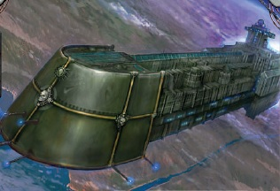

# 0485 商船舰队 Merchant Fleet

精校状态：中文行文已逐段精校，部分术语仍为暂定

分类：通用概念 / 帝国 Imperium / 中央政务部 Adeptus Terra / 内务部 Adeptus Administratum

原文来源：https://www.bilibili.com/opus/1138732530390794261

原作者：帝国神选罐头

原文时间：2025年11月24日 15:43

[返回分类目录](目录.md) · [全书目录](../../目录.md)

<!-- A0485-B0001 -->
**英文原文**

The Merchant Fleets are one of the three components of the Imperial Fleet, along with the civil fleets and warfleets.

<!-- /A0485-B0001 -->

<!-- A0485-B0002 -->

原译文

商船舰队是帝国舰队的三个组成部分之一，与民用舰队和战斗舰队并列。

**校订译文**

商船舰队是帝国舰队的三个组成部分之一，与民用舰队和战斗舰队并列。

<!-- /A0485-B0002 -->

<!-- A0485-B0003 -->
**英文原文**

Parent Agency:Imperial Fleet

<!-- /A0485-B0003 -->

<!-- A0485-B0004 -->

原译文

隶属机构：帝国舰队

**校订译文**

隶属机构：帝国舰队

<!-- /A0485-B0004 -->

<!-- A0485-B0005 -->
**英文原文**

Headquarters:Nexus Axiomatic, Terra

<!-- /A0485-B0005 -->

<!-- A0485-B0006 -->

原译文

总部：公理枢纽，泰拉

**校订译文**

总部：公理枢纽，泰拉

<!-- /A0485-B0006 -->

<!-- A0485-B0007 -->
**英文原文**

Leader:Speaker for the Chartist Captains Kania Dhanda

<!-- /A0485-B0007 -->

<!-- A0485-B0008 -->

原译文

领袖：宪章船长发言人卡尼亚·丹达

**校订译文**

领袖：特许舰长代言人卡尼亚·丹达

<!-- /A0485-B0008 -->

<!-- A0485-B0009 -->
**英文原文**

Armed Forces:Praeses Mercatura

<!-- /A0485-B0009 -->

<!-- A0485-B0010 -->

原译文

武装部队：贸易守护者

**校订译文**

武装部队：贸易守护者

<!-- /A0485-B0010 -->

<!-- A0485-B0011 -->
**英文原文**

Established:M30

<!-- /A0485-B0011 -->

<!-- A0485-B0012 -->

原译文

成立时间：M30

**校订译文**

成立时间：M30

<!-- /A0485-B0012 -->

<!-- A0485-B0013 -->
## Overview 概述

<!-- /A0485-B0013 -->

<!-- A0485-B0014 -->
**英文原文**

The Merchant Fleet is one of the oldest organizations in the Imperium, predating the Emperor's domain and dating back to the Dark Age of Technology itself when the original Merchant Charters were issued as part of Humanity's expansion into the Galaxy. Unlike most Imperial organizations which constantly attempt to police and control humanity's domain, the Merchant Fleet deals only in trade and as a result is supremely wealthy. The combined merchant fleets compose almost 90% of all the interstellar spacecraft in the Imperium. Each fleet is based in one of the five Segmentae Majoris, and its administrative staff operate from the Segmentum Fortress. Although these fleet bases are huge ports equipped with docks, shipyards and repair facilities, their main function is to administer the fleets operating within their area. Only a small proportion of ships ever travel to the Segmentum Fortress where they are theoretically based. The overall headquarters of the Merchant Fleet is located at the Nexus Axiomatic on Terra. Within the Nexus work the Magister Calculo Horarium which coordinate shipping travel across the Imperium.

<!-- /A0485-B0014 -->

<!-- A0485-B0015 -->

原译文

商船舰队是帝国中最古老的组织之一，早于帝皇的领土，可以追溯到黑暗技术时代，当时最初的宪章商船队是人类向银河系扩张的一部分。与大多数不断试图监管和控制人类领土的帝国组织不同，商船队只从事贸易，因此非常富有。合并后的商船队几乎占帝国所有星际飞船的90%。每个舰队都驻扎在五个主要星域中的一个，其行政人员在星域堡垒进行运作。尽管这些舰队基地是配备码头、造船厂和维修设施的大型港口，但它们的主要职能是管理在其区域内运营的舰队。理论上，只有一小部分船只会前往星域堡垒。商船舰队的总部设在泰拉上的公理枢纽。在枢纽内部，计时大师负责协调穿越帝国的航运航行。

**校订译文**

商船舰队是帝国最古老的组织之一，存在时间甚至早于帝皇建立的帝国，可追溯至黑暗科技时代。当时，人类向银河扩张，最早的商船特许状也随之颁发。与不断监管和控制人类疆域的其他帝国组织不同，商船舰队专司贸易，因此富庶至极。各支商船舰队合计约占帝国星际舰船的百分之九十。它们分别归属五大星域，行政人员在相应星域堡垒办公。虽然这些基地都是拥有船坞、造船厂和维修设施的巨港，主要职能却是管理辖区航运；只有少数船只真正造访其名义上的母港。商船舰队总署设于泰拉公理枢纽，由其中的计时大师协调帝国各地的航运。

<!-- /A0485-B0015 -->

<!-- A0485-B0016 -->
**英文原文**

Each merchant ship serves its fleet under an arrangement called a Merchant Charter. Not all charters are the same — some confer more power and responsibility to the ship's captain than others — but all types take the form of a feudal oath sworn to the fleet authorities on behalf of the Emperor. A captain may not register his vessel with the fleet authorities until this oath has been sworn and a record of it entered at the Segmentum Fortress for that zone and on the Segmentum Fortress on Mars.

<!-- /A0485-B0016 -->

<!-- A0485-B0017 -->

原译文

每艘商船都根据一种称为商船宪章的安排为其船队提供服务。并非所有的宪章都是一样的 — 有些宪章赋予船长比其他宪章更多的权力和责任 — 但所有类型的宪章都采取为了帝皇向舰队当局宣誓的封建誓言的形式。船长不得在舰队当局登记其战舰，直至宣誓并在该区域的星域堡垒和火星上的星域堡垒上输入宣誓记录。

**校订译文**

每艘商船都依据商船特许状为所属舰队效力。特许状内容各异，赋予舰长的权力和责任也有所不同，但均以向代表帝皇的舰队当局宣誓效忠为基础。只有完成宣誓，并在所属星域堡垒和火星的星域堡垒登记后，舰长才能正式注册船只。

**校注：** Merchant Charter 与70篇行商浪人的 Warrant of Trade 不同；统一为商船特许状与贸易许可，不混并。

<!-- /A0485-B0017 -->

<!-- A0485-B0018 -->
**英文原文**

Most merchant ships lack Navigators or Astropaths. Consequently, many take generations to fully complete their preset circuits, and often become home to communities of void born who never set foot on conventional worlds. These long circuits are often the only contact that the Imperium has with some of its more isolated worlds, and the Captains' reports can be the only method by which their existence is remembered. To the worlds that they visit, the arrival of the trading ships can become prophesied events of great spiritual significance.

<!-- /A0485-B0018 -->

<!-- A0485-B0019 -->

原译文

大多数商船都没有导航者或星语者。因此，许多需要几代人才能完全完成他们预设的环线，并经常成为从未涉足传统世界的虚空裔社会的家园。这些漫长的环路通常是帝国与其一些更孤立的世界的唯一联系，船长的报告可能是记住他们存在的唯一方法。对于他们所访问的世界来说，商船的到来可以成为具有重大精神意义的预告事件。

**校订译文**

多数商船既无导航员，也无星语者，因此完成预定航线的一次循环，往往就需要几代人。船上常形成世代生活于虚空、从未踏足普通行星的社群。对某些偏远世界而言，这种漫长的定期航行是与帝国仅存的联系，船长报告甚至可能是帝国仍记得它们存在的唯一依据。对于受访世界，商船抵达有时会成为预言中的大事，具有重大的精神意义。

<!-- /A0485-B0019 -->

<!-- A0485-B0020 -->
**英文原文**

One of the positions in the Senatorum Imperialis is sometimes held by the Speaker for the Chartist Captains. Though an unassuming position, the Speaker is both tremendously wealthy and powerful, for it is they who can devastate entire Sector's simply by halting merchant trade. The Speaker commands the armed wing of the Merchant Fleet, the Praeses Mercatura.

<!-- /A0485-B0020 -->

<!-- A0485-B0021 -->

原译文

帝国参议院的一个职位有时由宪章船长发言人担任。尽管这是一个谦逊的职位，但发言人既富有又强大，因为正是他们可以通过停止商业贸易来摧毁整个星区。发言人指挥着商船舰队的武装部队贸易守护者。

**校订译文**

特许舰长代言人有时在帝国参议院占有席位。这一职位看似低调，实则财富与权力惊人：只须切断商贸，就足以使整个星区遭受毁灭性打击。代言人还指挥商船舰队的武装分支——贸易守护者。

<!-- /A0485-B0021 -->

<!-- A0485-B0022 -->
**英文原文**

Rogue Traders do not fall under the purview of the Merchant Fleet, making them one of the few shipping entities not under its grip.

<!-- /A0485-B0022 -->

<!-- A0485-B0023 -->

原译文

行商浪人不属于商船舰队的管辖范围，使其成为少数不受其控制的航运实体之一。

**校订译文**

行商浪人不属于商船舰队的管辖范围，使其成为少数不受其控制的航运实体之一。

<!-- /A0485-B0023 -->

<!-- A0485-B0024 -->
### Ship Registration 船舶登记

<!-- /A0485-B0024 -->

<!-- A0485-B0025 -->
**英文原文**

Every ship has some form of ship ident (identification). One form of ident all ships have is a universal registration code, which is provided by the Chartists. These universal registration codes can be any length, some are a string of numbers while others are simply names. Regardless, all ships in the Imperium have to have them for the records of the Adeptus Terra. The mercantile guilds also maintain a strict registry of related information.

<!-- /A0485-B0025 -->

<!-- A0485-B0026 -->

原译文

每艘船都有某种形式的船只识别码。所有船只的一种身份识别方式是由宪章提供的通用登记码。这些通用登记码可以是任何长度，有些是一串数字，而另一些只是名称。不管怎样，帝国中的所有船只都必须拥有它们，以记录在中央政务部。贸易行会也对相关信息进行了严格的登记。

**校订译文**

每艘船都有身份标识，所有舰船共同采用的一种是由特许舰长体系核发的通用登记码。登记码长短不限，可以是一串数字，也可以仅是名称。帝国所有船只都必须拥有此类标识，供中央政务部备案；贸易行会也严格登记相关信息。

**校注：** Chartists 指特许舰长及其管理体系，不是文书本身“宪章”。

<!-- /A0485-B0026 -->

<!-- A0485-B0027 -->
**英文原文**

When a ship docks in port they provide a ship ident to Imperial port authorities, sometimes being their universal registration code or a local planetary registration number (as some planets legally require). However, some ship use their keel-laying dates or launch memoranda instead. Shipping is complicated, and even more-so in the Imperium. Commercial merchant exports often also need to provide detailed schedules departure weeks in advance, alongside their ship idents, to port authorities.

<!-- /A0485-B0027 -->

<!-- A0485-B0028 -->

原译文

当一艘船停靠在港口时，他们会向帝国港务局提供一个船只识别码，有时是他们的通用登记码或当地行星登记号（如某些行星法律所要求的）。然而，一些船只会使用龙骨铺设日期或下水报告代替。航运很复杂，在帝国更是如此。贸易商船出港通常还需要提前几周向港务局提供详细的出发时间表，以及他们的船只识别码。

**校订译文**

舰船入港时，须向帝国港务机构提供身份标识，例如通用登记码，或某些行星法律要求的当地登记号。也有船只改用铺设龙骨的日期或下水记录作为标识。航运手续本就复杂，在帝国尤其如此。经营货运的商船通常还须提前数周，向港务机构提交详细离港计划及船舶标识。

**校注：** 原英文 Commercial merchant exports 句法不完整，按航运申报语境译经营货运的商船须提交离港安排，不据此扩充额外税务要求。

<!-- /A0485-B0028 -->

<!-- A0485-B0029 -->
## Merchant Fleet Ships 商船舰队船只

<!-- /A0485-B0029 -->

<!-- A0485-B0030 -->

原译文

Armed Freighter 武装货船

**校订译文**

Armed Freighter 武装货船

<!-- /A0485-B0030 -->

<!-- A0485-B0031 -->

原译文

Vagabond Class Merchant Trader 流浪者级贸易商船

**校订译文**

Vagabond Class Merchant Trader 浪人级贸易商船

<!-- /A0485-B0031 -->

<!-- A0485-B0032 图片 -->

<!-- A0485-B0033 -->

原译文

Vagabond Merchant Trader 流浪者贸易商船

**校订译文**

Vagabond Merchant Trader 浪人级贸易商船

<!-- /A0485-B0033 -->

<!-- A0485-B0034 -->

原译文

Universe Class Mass Conveyor 宇宙级大型运输舰

**校订译文**

Universe Class Mass Conveyor 宇宙级大型运输舰

<!-- /A0485-B0034 -->

<!-- A0485-B0035 -->

原译文

Carrack Hauler 运输武装商船

**校订译文**

Carrack Hauler 运输武装商船

<!-- /A0485-B0035 -->

<!-- A0485-B0036 -->

原译文

Fast Clipper 快船

**校订译文**

Fast Clipper 快船

<!-- /A0485-B0036 -->

<!-- A0485-B0037 -->

原译文

Merchant Brig 双桅商船

**校订译文**

Merchant Brig 双桅商船

<!-- /A0485-B0037 -->

<!-- A0485-B0038 -->

原译文

Orion Class Star Clipper 猎户座级星际快船

**校订译文**

Orion Class Star Clipper 俄里翁级星辰快船

<!-- /A0485-B0038 -->

<!-- A0485-B0039 -->

原译文

Galaxy Class Armed Freighter 银河级武装货船

**校订译文**

Galaxy Class Armed Freighter 银河级武装货船

<!-- /A0485-B0039 -->

<!-- A0485-B0040 -->

原译文

Tarask Class Merchantman 塔拉斯克级商船

**校订译文**

Tarask Class Merchantman 塔拉斯克级商船

<!-- /A0485-B0040 -->

<!-- A0485-B0041 -->

原译文

Goliath Class Forge Tender 歌利亚级铸造补给船

**校订译文**

Goliath Class Forge Tender 歌利亚级铸造补给船

<!-- /A0485-B0041 -->

<!-- A0485-B0042 -->

原译文

Golthma-Ryzan Warp-Carrier 戈尔斯玛-瑞赞亚空间运输舰

**校订译文**

Golthma-Ryzan Warp-Carrier 戈尔斯玛-瑞赞亚空间运输舰

<!-- /A0485-B0042 -->

<!-- A0485-B0043 -->

原译文

Greathold 大堡垒

**校订译文**

Greathold 大堡垒

<!-- /A0485-B0043 -->

<!-- A0485-B0044 -->

原译文

Heavy Transport 重型运输舰

**校订译文**

Heavy Transport 重型运输舰

<!-- /A0485-B0044 -->

<!-- A0485-B0045 -->
## Known Merchant Houses 已知商船家族

<!-- /A0485-B0045 -->

<!-- A0485-B0046 -->
**英文原文**

Ios — Destroyed and expunged from all records.

<!-- /A0485-B0046 -->

<!-- A0485-B0047 -->

原译文

伊奥斯 — 被毁灭并从所有记录中删除。

**校订译文**

伊奥斯 — 被毁灭并从所有记录中删除。

<!-- /A0485-B0047 -->

<!-- A0485-B0048 -->
**英文原文**

Sansom — millennia old Trading House

<!-- /A0485-B0048 -->

<!-- A0485-B0049 -->

原译文

桑瑟姆 — 千年的贸易家族

**校订译文**

桑瑟姆 — 千年的贸易家族

<!-- /A0485-B0049 -->

<!-- A0485-B0050 -->
**英文原文**

Sorensen family — Captains of the Amaranthus for over nine thousand years.

<!-- /A0485-B0050 -->

<!-- A0485-B0051 -->

原译文

索伦森家庭 — 超过九千年的阿玛兰瑟斯船长。

**校订译文**

索伦森家族——九千余年来世代担任“阿玛兰瑟斯”号的船长。

<!-- /A0485-B0051 -->

<!-- A0485-B0052 -->
## Known Members 已知成员

<!-- /A0485-B0052 -->

<!-- A0485-B0053 -->
**英文原文**

Juskina Tull - Speaker for the Chartist Captains

<!-- /A0485-B0053 -->

<!-- A0485-B0054 -->

原译文

朱斯金娜·图尔 - 宪章船长发言人

**校订译文**

尤斯基娜·图尔——特许舰长代言人

<!-- /A0485-B0054 -->

<!-- A0485-B0055 -->
**英文原文**

Kania Dhanda - Speaker for the Chartist Captains

<!-- /A0485-B0055 -->

<!-- A0485-B0056 -->

原译文

卡尼亚·丹达 - 宪章船长发言人

**校订译文**

卡尼亚·丹达——特许舰长代言人

<!-- /A0485-B0056 -->

<!-- A0485-B0057 -->
**英文原文**

Quynn Torl — Fleet Master

<!-- /A0485-B0057 -->

<!-- A0485-B0058 -->

原译文

奎恩·托尔 — 舰队司令

**校订译文**

奎恩·托尔 — 舰队司令

<!-- /A0485-B0058 -->

本篇核心术语与暂定项

以下列出本篇出现的英文原形及核心术语表用词。同形词可能指不同对象，具体词义以本篇正文和校注为准；单复数、别名和仅见于图注的名称可能尚未列入。完整候选见[术语表](../../术语表/双语术语候选.csv)。

| 英文 | 采用中文 | 状态 |
| --- | --- | --- |
| Imperium | 帝国 | 暂定·简称 |
| Dark Age of Technology | 黑暗科技时代 | 暂定 |
| Emperor | 帝皇 | 官方已核对 |
| Adeptus Terra | 中央政务部 | 暂定 |
| Imperial Fleet | 帝国舰队 | 暂定 |
| Terra | 泰拉 | 暂定·官方待核 |
| Navigators | 导航员 | 官方已核对 |
| Merchant Fleet | 商船队 | 暂定·官方待核 |
| Praeses Mercatura | 贸易守护者 | 暂定·官方待核 |
| Segmentum | 星域 | 暂定·官方待核 |
| Sector | 星区 | 暂定·官方待核 |
| Mars | 火星 | 暂定·官方待核 |
| Master | 导师（审判庭职衔）／舰务官（舰员职务） | 语境定译·官方待核 |
| Merchant Charter | 商船特许状 | 暂定·官方待核 |
| Speaker for the Chartist Captains | 特许舰长代言人 | 暂定·官方待核 |
| Captain | 连长 | 暂定·官方待核 |
| Nexus Axiomatic | 公理枢纽 | 暂定·官方待核 |
| Magister Calculo Horarium | 计时大师 | 暂定·官方待核 |
| Sorensen family | 索伦森家族 | 暂定·官方待核 |
| Imperialis | 帝国徽记 | 暂定·官方待核 |
| The Dark | 《黑暗》 | 暂定·官方待核 |
| Juskina Tull | 尤斯基娜·图尔 | 暂定·官方待核 |
| Segmentae Majoris | 五大星域 | 暂定·官方待核 |
| Segmentum Fortress | 星域堡垒 | 暂定·官方待核 |
| Fleet Master | 舰队之主 | 暂定·官方待核 |

