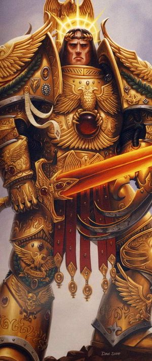
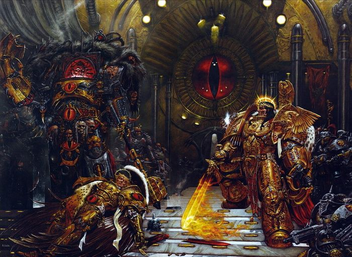
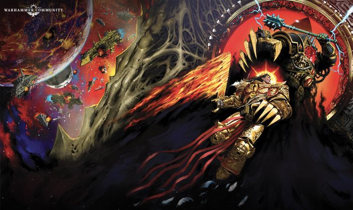
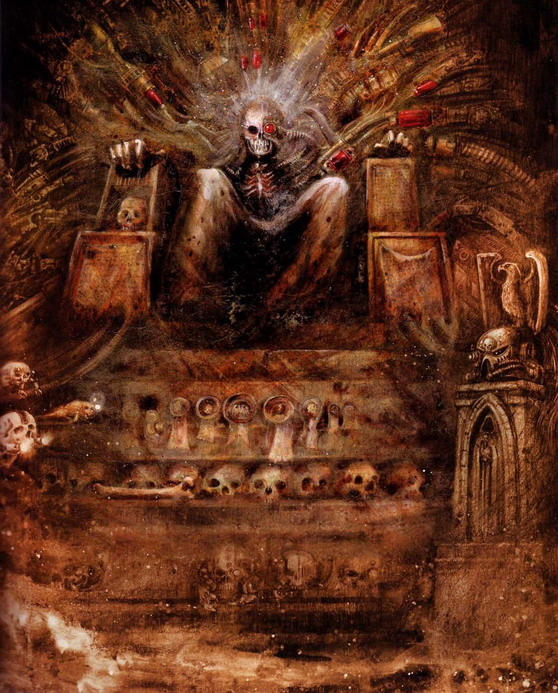

# 0588 人类之主 - 帝皇(上) Emperor of Mankind

精校状态：中文行文已逐段精校，部分术语仍为暂定

分类：人类帝国

原文来源：https://www.bilibili.com/opus/980320358295928870

原作者：帝国神选罐头

原文时间：编辑于 2025年05月08日 22:19

[返回分类目录](目录.md) · [全书目录](../../目录.md)

<!-- A0588-B0001 -->
**英文原文**

"No world shall be beyond my rule; no enemy shall be beyond my wrath."

<!-- /A0588-B0001 -->

<!-- A0588-B0002 -->

原译文

任何世界都不应违背我的统治；没有敌人可以抵挡我的怒火。

**校订译文**

“没有世界能置身于我的统治之外；没有敌人能逃脱我的怒火。”

<!-- /A0588-B0002 -->

<!-- A0588-B0003 图片 -->

<!-- A0588-B0004 -->

原译文

The Emperor of Mankind battles during the Great Crusade 在大远征时期战斗的帝皇

**校订译文**

The Emperor of Mankind battles during the Great Crusade 在大远征时期战斗的帝皇

<!-- /A0588-B0004 -->

<!-- A0588-B0005 -->
**英文原文**

The Emperor of Mankind also referred to by the Imperial Cult and the Adeptus Ministorum as the God-Emperor of Mankind is the sovereign ruler of the Imperium of Man, and Father, Guardian, and God of the human race. He has sat immobile within the Golden Throne of Terra for ten thousand years. Although once a living man, His shattered body can no longer support life, and remains intact only by a combination of ancient technology and the sheer force of His will, itself sustained by the soul-sacrifice of countless millions of psykers.

<!-- /A0588-B0005 -->

<!-- A0588-B0006 -->

原译文

帝皇，也被帝皇崇拜者和国教教会称为神皇，帝皇是人类帝国的最高统治者，也是人类的父亲、守护者和神。一万年来，他一直一动不动地坐在泰拉的黄金王座上。虽然他曾经是一个活着的人，但他破碎的身体已经无法维持生命，只有通过古代技术和他意志的纯粹力量的结合才能保持完整，而他的意志本身是由无数灵能者牺牲灵魂所维持的。

**校订译文**

人类帝皇是人类帝国的最高统治者，也是人类的父亲、守护者与神明；帝皇信仰及国教会称他为人类神皇。他已在泰拉的黄金王座上静坐一万年。虽然曾是活生生的人，如今残破的身体已无法自行维生，只有古老技术与无比强大的意志共同维持其完整；这份意志又靠数以百万计、难以计数的灵能者献出灵魂支撑。

**校注：** 已核同一人物、组织、型号或事件，与全书核心术语及后续专篇统一；原译保留对照。

<!-- /A0588-B0006 -->

<!-- A0588-B0007 -->
**英文原文**

His will is omnipotent, extending across the million worlds that comprise His Imperium. For ten thousand years the Master of Mankind has served humanity, simultaneously carrying out a multitude of tasks vital to its survival. All at once He guides his race through the Emperor's Tarot, soul-binds psykers, holds audiences with His most important servants and directs the Astronomican beacon that guides space vessels through the Warp. His immense psychic powers constantly keep the Chaos Gods in the Warp at bay, preventing their intrusion into the material universe and protecting his people throughout the galaxy.

<!-- /A0588-B0007 -->

<!-- A0588-B0008 -->

原译文

他的意志是绝对的，延伸到构成他的帝国的数百万个世界。一万年来，人类之主一直为人类服务，同时执行着众多对人类生存至关重要的任务。他同时通过帝皇塔罗指引人类，与灵能者进行灵魂绑定，接见最重要的臣仆，并引导星炬信标，为穿越亚空间的舰船指明航向。他巨大的灵能力量不断阻止亚空间中的混沌诸神，防止它们入侵现实宇宙，并保护他在整个银河系的人民。

**校订译文**

他的意志无所不能，延伸至组成帝国的百万世界。一万年来，人类之主同时承担着多项关乎人类存亡的职责：借帝皇塔罗指引族群，为灵能者施行灵魂绑定，接见最重要的臣仆，并引导星炬，为穿越亚空间的舰船导航。他无比强大的灵能不断抵御亚空间中的混沌诸神，阻止其侵入物质宇宙，庇护银河各处的子民。

**校注：** million worlds是百万世界，非数百万；全能与完全挡住混沌是本篇叙述措辞，不扩展为编辑者对设定绝对性的认证。

<!-- /A0588-B0008 -->

<!-- A0588-B0009 -->
**英文原文**

The Emperor's role as guardian of mankind seems to have been predestined for Him. Without the Emperor there would be no Imperium, little space travel, and no protection from the multitude of threats facing mankind. The Emperor knows that to protect his race he must survive as long as necessary for the emerging race of psychic humans to evolve sufficiently.

<!-- /A0588-B0009 -->

<!-- A0588-B0010 -->

原译文

帝皇作为人类守护者的角色似乎是命中注定的。没有帝皇，就没有帝国，很少有星际航行，人类面临众多威胁时也没有保护。帝皇知道，为了保护他的种族，他必须生存下去，直到新兴的灵能者充分发展。

**校订译文**

帝皇担任人类守护者的命运，仿佛早已注定。没有他，就不会有帝国，星际航行将极为有限，人类也难以抵御众多威胁。帝皇知道，要保护自己的种族，就必须坚持活下去，直至正在觉醒灵能的人类进化到足够成熟的阶段。

<!-- /A0588-B0010 -->

<!-- A0588-B0011 -->
**英文原文**

In the millennia since his ascension to the Golden Throne, the Emperor has become a god to his people, the worship of Him uniting humanity throughout his Imperium, superstition and dogma replacing his doctrine of Imperial Truth.

<!-- /A0588-B0011 -->

<!-- A0588-B0012 -->

原译文

自登上黄金王座以来的数千年里，帝皇已经成为了他的人民的神，对他的崇拜在帝国中团结了人类，迷信和教条取代了他的帝国真理学说。

**校订译文**

登上黄金王座后的数千年间，帝皇成了子民心中的神。对他的崇拜将帝国各地的人类团结起来，而迷信与教条取代了他倡导的帝国真理。

<!-- /A0588-B0012 -->

<!-- A0588-B0013 -->
**英文原文**

Daemonkind refers to the Emperor as The Anathema.

<!-- /A0588-B0013 -->

<!-- A0588-B0014 -->

原译文

恶魔称帝皇为被诅咒者。

**校订译文**

恶魔称帝皇为被诅咒者。

**校注：** The Anathema是恶魔对帝皇的称号，沿稿被诅咒者；亦有令混沌厌憎、排斥其力量之意，不等于叙述帝皇遭施法诅咒。

<!-- /A0588-B0014 -->

<!-- A0588-B0015 -->
## History 历史

<!-- /A0588-B0015 -->

<!-- A0588-B0016 -->
## Origins 起源

<!-- /A0588-B0016 -->

<!-- A0588-B0017 -->
**英文原文**

Little is known about the majority of the Emperor's life; of who he was and what he did before he emerged as the great Emperor of Mankind, only the Emperor himself remembers. It is said that the Emperor's birth, while a natural process, was actually the result of a scheme created by the wisest and most powerful of living humans at that time; the conclave of Shamans. These men, termed 'shamans' by their society, were powerful psykers with great experience of the Warp. Finding their souls - and those of humanity - endangered by the growing perils of the Warp-gods, these psykers decided to pool their power into one human, a being they called 'the New Man'. Already having gained the power to reincarnate themselves (upon death, the shamans' souls would transfer to the Warp, accumulating power enough to reincarnate as human) the shamans entered a suicide-pact. Thousands of them poisoned themselves and sped their souls to the warp at the same time. Presumably pooling their soul-energy and using their reincarnation ability, they brought about the birth of their New Man - the Emperor - one year later.

<!-- /A0588-B0017 -->

<!-- A0588-B0018 -->

原译文

关于帝皇一生的大部分时间，我们所知甚少；在他成为伟大的人类帝皇之前，他是谁，做了什么，只有帝皇自己记得。据说，帝皇的诞生虽然是一个自然过程，但实际上是当时最聪明、最强大的人类——萨满秘会——所策划的结果。这些人被他们的社会称为“萨满”，是强大的灵能者，对亚空间有着丰富的经验。这些灵能者发现他们的灵魂——以及人类的灵魂——受到了亚空间诸神日益增强的危险的威胁，决定将他们的力量集中到一个人身上，他们称之为“新人类”。萨满已经获得了能使他们转生的力量（死亡后，萨满的灵魂将转移到亚空间，积累足够的力量来作为人类转生），他们签订了牺牲契约。成千上万的人毒杀了自己，同时将灵魂快速转移到了亚空间。据推测，一年后，他们汇集了灵魂能量，利用转生能力，诞生了他们的新人类——帝皇。

**校订译文**

帝皇一生中的绝大部分经历鲜为人知。在以人类帝皇的身份崛起前，他究竟是谁、做过什么，只有他自己记得。据说，他虽经自然生育诞生，却是当时最睿智、最强大的一群人——萨满秘会——谋划的结果。萨满是熟悉亚空间的强大灵能者。他们发现，随着亚空间诸神愈发危险，自己乃至全人类的灵魂都受到威胁，于是决定将力量集中于一个人，称之为“新人类”。萨满早已掌握转生之术：死后灵魂进入亚空间，积累足够力量，再投生为人。他们约定共同赴死，数千名萨满服毒，将灵魂同时送入亚空间。据推测，他们汇聚灵魂能量、运用转生能力，促成了“新人类”——帝皇——在一年后的诞生。

**校注：** 萨满集体转生以It is said/Presumably限定，保持起源传说与推测语气，不能确认为唯一版本。

<!-- /A0588-B0018 -->

<!-- A0588-B0019 图片 -->

<!-- A0588-B0020 -->

原译文

The Emperor 帝皇

**校订译文**

The Emperor 帝皇

<!-- /A0588-B0020 -->

<!-- A0588-B0021 -->
**英文原文**

The Emperor was born to mortal parents on Terra in the 8th Millennium BC in a primitive proto-Hittite village along the banks of the Sakarya River (in Anatolia), manifesting his powers as a youth. While a young adolescent, the Emperor's father was murdered by his uncle. While preparing his father's body for a primitive funeral ritual, he received a vision of his murder. Later, the boy who would become the Emperor calmly approached his uncle and stopped his heart with his psychic abilities, displaying neither sorrow nor malice. According to the Emperor himself, this was the moment he realized that humanity needed law, order, and the guidance of a ruler. Shortly after, he left his village for the first city of humanity (likely ancient Sumeria). Sometime later the Perpetual Erda met the Emperor, already a warlord attempting to accelerate Human evolution and guide the race into a superior species. Erda became one of the Emperor's followers as He attempted to seek out and recruit every Perpetual on Earth to His cause. During this ancient time, the Emperor was known as Neoth.

<!-- /A0588-B0021 -->

<!-- A0588-B0022 -->

原译文

公元前第8个千年，帝皇出生在安纳托利亚萨卡里亚河岸边的一个原始赫梯村庄，父母都是凡人，年轻时就展现了他的力量。年轻时，帝皇的父亲被他的叔叔谋杀了。在为父亲的尸体准备葬礼仪式时，他看到了父亲被谋杀的景象。后来，这位后来成为帝皇的男孩平静地走近他的叔叔，用他的灵能能力停止了他的心脏，既没有表现出悲伤，也没有表现出恶意。据帝皇本人所说，这是他意识到人类需要法律、秩序和统治者领导的时刻。不久之后，他离开了村庄，前往人类的第一座城市（可能是古代苏美尔）。不久之后，永生者尔达遇到了帝皇；当时，帝皇已经是一位试图加速人类进化、将人类引导为更优越物种的军阀。尔达成为帝皇的追随者之一，因为帝皇试图寻找并招募地球上每一个永生者来支持他的事业。在这个古老的时代，皇帝被称为尼欧斯。

**校订译文**

公元前第八千年，帝皇出生在泰拉安纳托利亚的萨卡里亚河畔，一个前赫梯文化的原始村落，父母皆为凡人，少年时便展现力量。他尚年少时，父亲遭其兄弟杀害。在为父亲遗体准备原始葬礼仪式时，他看见父亲遇害的幻象。随后，这个日后成为帝皇的男孩平静走近父亲的兄弟，用灵能令其心脏停止跳动，既无悲伤，也无恶意。帝皇自己说，正是此刻让他明白，人类需要法律、秩序与统治者的指引。不久，他离村前往人类的第一座城市——原文推测位于古代苏美尔。后来，永生者尔达遇见了他；彼时他已是军阀，试图加速人类进化，引领人类成为更优越的物种。他寻找地球上所有永生者，招募他们投身自己的事业，尔达也成为追随者。在那个古老时代，他名叫尼欧斯。

**校注：** uncle仅能确定父亲的兄弟，不能据英文断定叔叔而非伯父；proto-Hittite为前赫梯文化语境，非已成立赫梯国家。原将城市直接等同苏美尔文明，译文显式保留原文推测。

<!-- /A0588-B0022 -->

<!-- A0588-B0023 -->
**英文原文**

At some point before recorded history, the Emperor became a king and organized his own armies with the Perpetual that will become known as Ollanius Persson as his Warmaster. Seeking to protect and guide Humanity, the two friends besieged a tower in East Phoenicia built by the Cult that will become known as the Cognitae. After their forces succeeded in capturing the tower, they discovered it covered in Enuncia and bleeding in the corruption power of the Warp. Ollanius demanded the tower destroyed, while the Emperor wished to preserve the knowledge it held within in order to better protect against Chaos in the future. Disillusioned with the Emperor, Ollanius stabbed his king with a dagger and then uttered a line of Enuncia to destroy the tower and escape.

<!-- /A0588-B0023 -->

<!-- A0588-B0024 -->

原译文

在有文字记录的历史之前的某个时候，帝皇成为了王者，并组建了自己的军队，启用了后来作为他的战帅而被知晓的永生者欧兰尼奥斯·佩松。为了保护和引导人类，这两位朋友围攻了东腓尼基的一座将作为闻道学派而闻名的邪教建造的塔。在他们的部队成功占领了这座塔后，他们发现它被暗言覆盖着，并在亚空间的腐败力量中血流不止。欧兰尼奥斯要求摧毁这座塔，而帝皇则希望保留其中的知识，以便在未来更好地抵御混沌。欧兰尼奥斯对帝皇感到失望，用匕首刺向他的王，然后发出一道暗言摧毁了塔楼并逃离。

**校订译文**

在有文字记载的历史之前，帝皇曾成为国王，组建军队，并任命后来以欧良尼乌斯·佩松之名为人所知的永生者为战帅。为保护、引导人类，这对朋友围攻了腓尼基东部的一座高塔，建造者正是后来称作闻道学派的教团。攻下塔后，他们发现塔身遍布暗言，渗出亚空间的腐化力量。欧良尼乌斯主张摧毁它，帝皇却想保留其中知识，以更好地防范混沌。失望的欧良尼乌斯用匕首刺向自己的君王，随后念出一句暗言，毁塔而逃。

**校注：** bleeding in corruption是腐化渗出，非塔实体流血；后来被称为欧良尼乌斯修饰人名，非战帅职位日后才知。

<!-- /A0588-B0024 -->

<!-- A0588-B0025 -->
**英文原文**

The immortal being who would become known as the Emperor proceeded to haunt the history of humanity as a ghost; watching, waiting and occasionally influencing. Living secretly amongst mankind, he developed his abilities until his psychic might allowed him to gain knowledge of not only his own world, but of the dangers beyond it. Aware then of the vast predations awaiting humanity, the being that would become known as the Emperor resolved to guide and protect humanity. The Emperor took many forms during this time, both male and female. Some were brutal conquerors, some became meek to inherit the Earth. One identity of the Emperor during this time was Alexander the Great, and in an account given by Horus it is said that He wept before the River Hyphasis when He thought there were no more worlds to conquer. Not long after, He discovered what would be named the Golden Throne.

<!-- /A0588-B0025 -->

<!-- A0588-B0026 -->

原译文

这位后来被称为帝皇的不朽之人继续以鬼魂的身份萦绕在人类历史上；观察、等待，偶尔施加影响。他隐秘地生活在人类之中，提升自己的能力，直到他的灵能能力允许他获得自己世界的知识，以及在那之上的危险。意识到等待着人类的巨大危机，这位后来被称为帝皇的存在决心指引并保护人类。在此期间，帝皇使用了多种形态，包括男性和女性。有些形态是残酷的征服者，有些形态是温和的地球继承者。在此期间，帝皇的一个身份是亚历山大大帝，在荷鲁斯的一份报告中，据说当他认为没有更多的世界可以征服时，他在希帕西斯河前落泪。不久之后，他发现了将被命名为黄金王座的物体。

**校订译文**

此后，这位不朽者如幽灵般穿行于人类历史，观察、等待，偶尔施加影响。他隐匿人群之中，不断发展能力，直至灵能足以让他了解本世界之外潜藏的危险。意识到人类将面对何等可怕的掠食者，他决心引导、保护人类。这一时期，他采用过男女多种形貌与身份，有的是残酷征服者，有的以谦卑温顺者的身份承继大地。其中一个身份是亚历山大大帝。荷鲁斯曾讲述，他以为再无世界可征服时，曾在希帕西斯河畔落泪。不久后，他发现了后来被称为黄金王座的装置。

**校注：** as a ghost是隐秘存在的比喻，非真化幽灵；亚历山大故事属于此设定的记述，不据此改写现实史。

<!-- /A0588-B0026 -->

<!-- A0588-B0027 -->
**英文原文**

During the Dark Age of Technology, Alivia Sureka traveled with the man who would become the Emperor to the planet Molech, where there was a gateway into the realm of Chaos. The Emperor entered the Gateway, and there made a bargain with the Dark Gods and emerged wielding a measure of their power, including the ability to create the Primarchs. However for some reason, the Emperor did not keep his end of the bargain to spread Chaos to humanity, and he became the anathema of Ruinous Powers. The Emperor was able to clone the energies he was imbued with, giving them to his Primarchs after combining his own genetic material with that of Erda's. At some point in Earth's history the Emperor discovered an ancient device beneath the ruins of Asia's deserts and became determined to completely cut off humanity from the malignant influence of the Warp. The first step of this grand project was to substitute warp travel with the Webway, and the final phase would see the Emperor shepherd humanity's evolution into a truly psychic race independent of Chaos, ascending to a level not even the Eldar were able to. This grand ambition was to guide all of the Emperor's undertakings and would be the culmination of his planning.

<!-- /A0588-B0027 -->

<!-- A0588-B0028 -->

原译文

在黑暗科技时代，阿里维亚·苏雷卡与后来成为帝皇的人一起前往摩洛星，那里有一个通往混沌领域的门户。帝皇进入了大门，在那里与黑暗诸神达成了协议，并带着从他们那里获得的一部分力量归来，包括创造原体的能力。然而出于某种原因，帝皇没有遵守将混沌传播给人类的协议，他成为了毁灭力量的被诅咒者。帝皇能复制他被灌输的能量，并将自己的遗传物质与尔达的遗传物质结合后，将这些能量赋予他的原体。在泰拉历史的某个时刻，帝皇在亚洲沙漠的废墟下发现了一个古老的装置，并决心完全切断亚空间对人类的恶性影响。这个宏伟项目的第一步是用网道代替亚空间航行，最终阶段将可以看到帝皇带领人类进化成一个独立于混沌的真正的灵能种族，提升到连艾达灵族都无法达到的水平。这个宏伟的抱负指引着帝皇的所有事业，并将成为他计划的终点。

**校订译文**

在黑暗科技时代，阿利维亚·苏雷卡与日后成为帝皇的人一同前往摩洛，那里有一座通往混沌领域的门户。帝皇进入其中，与黑暗诸神达成交易，回来时掌握了部分神力，包括创造原体的能力。然而，出于某种原因，他没有履行向人类传播混沌的约定，遂成为毁灭诸神口中的“被诅咒者”。他将自身与尔达的遗传物质结合，创造原体，又复制获赐的能量，将其赋予他们。在泰拉历史的某个时期，帝皇在亚洲沙漠废墟下发现一件古老装置，决心彻底切断亚空间对人类的恶性影响。这项大计首先要以网道取代亚空间航行，最终则要引导人类进化为摆脱混沌的真正灵能种族，达到连灵族也未能企及的高度。这一宏愿指引着他的一切行动，是所有筹划最终要实现的目标。

**校注：** 魔神交易内容为所给底稿的版本，保留其陈述及for some reason限定；不把后续材料的不同视角拼为新事实。

<!-- /A0588-B0028 -->

<!-- A0588-B0029 -->
## Rise of the Emperor 帝皇的崛起

<!-- /A0588-B0029 -->

<!-- A0588-B0030 -->
**英文原文**

The man who would later become known as the Emperor first appeared openly as one of the many warlords struggling for control of Terra during the latter part of the Age of Strife. He was at this point just another Terran warlord, but he met Malcador who convinced him to take the title of Emperor. He was once known as the Master of the Lines in a mountainous region of Terra. There he would seek out individuals whose genetics he could use in his Thunder Warrior project, as well as offer services of gene-editing the offspring children in the region to correct genetic mutations. It was during this time he met Amar Astarte, who he and Erda worked closely with on the Primarch Project. He also met Ezekiel Sedayne, who would later develop the Black Carapace for the successors of the Thunder Warriors: The Legio Astartes. The Emperor undertook a series of campaigns against all the other warlords on the planet that would later become termed as the Unification Wars. During these wars the Emperor employed several military formations - such as the Thunder Warriors and Geno Five-Two Chiliad — that consisted of genetically altered/engineered warriors, who played a significant role in his eventual victory. With this victory, the planet and population of Terra were at last unified under one rule; that of the Emperor. With this achievement behind him, the Emperor then set in motion his plans to take his purpose of uniting and guarding mankind out into the stars, to unify with the bastions of humanity scattered across the galaxy. This undertaking would become known as the Great Crusade. The prospect of the Great Crusade and the bitter fate of the Primarchs horrified Erda, who viewed the creations as her sons.

<!-- /A0588-B0030 -->

<!-- A0588-B0031 -->

原译文

这位后来被称为帝皇的人首次公开露面，是在纷争时代后期为控制泰拉而斗争的众多军阀之一。此时，他只是另一个人族军阀，但他遇到了马卡多，马卡多说服他接受了帝皇的称号。他曾在泰拉的山脉地区被称为血统大师。在那里，他正寻找可以在他的“雷霆战士”计划中能使用其基因的人，并为该地区的后代提供基因编辑服务，以纠正基因突变。正是在这段时间里，他遇到了阿马尔·阿斯塔特，与他和尔达在基因原体计划上密切合作。他还遇到了以西结·赛丹，后者后来为雷霆战士的接替者阿斯塔特军团研发了黑色甲壳。帝皇对星球上所有其他军阀发动了一系列战役，后来被称为统一战争。在这些战争中，皇帝使用了几种军队编队，如雷霆战士和千夫团，由基因改造/工程战士组成，在他最终的胜利中发挥了重要作用。通过这场胜利，泰拉的环境和人口终于统一在帝皇的统治之下。在达成这一成就之后，皇帝开始实施他的计划，在群星中团结并保护人类，与散布在银河各地的人类堡垒联合起来。这项事业后来被称为大远征。大远征的前景和原体们的悲惨命运让尔达感到震惊，她把这些造物视为自己的儿子。

**校订译文**

纷争时代后期，日后成为帝皇的人公开现身，起初只是争夺泰拉控制权的众多军阀之一。后来，他遇见马卡多，在其劝说下采用“帝皇”称号。他曾在泰拉一处山区被称为“血统大师”，寻找可用于雷霆战士计划的基因，也为当地人的子女提供基因编辑，修复突变。在此期间，他结识阿玛尔·阿斯塔特，之后与她、尔达紧密合作，开展原体计划。他还遇见以西结·赛丹；后者日后为雷霆战士的继承者——阿斯塔特军团——开发黑色甲壳。帝皇针对泰拉其他军阀发动一系列征战，后世称为统一战争。雷霆战士、基诺五二千连团等经过基因改造或设计的部队，在胜利中发挥了重要作用。泰拉的土地与人民最终统一于帝皇统治之下。此后，他将团结、守护人类的事业推向群星，要与散布银河的人类据点重新联合；这便是大远征。尔达视原体如亲生儿子，大远征的前景与等待他们的苦难命运令她惊惧。

**校注：** 漏译Geno Five-Two，补全基诺五二千连团；planet and population是土地/行星与人民，非生态环境。

<!-- /A0588-B0031 -->

<!-- A0588-B0032 图片 -->

<!-- A0588-B0033 -->

原译文

The Emperor of Mankind 人类帝皇

**校订译文**

The Emperor of Mankind 人类帝皇

<!-- /A0588-B0033 -->

<!-- A0588-B0034 -->
**英文原文**

The Emperor prepared extensively for the Great Crusade; he created the special astrotelepath corps to link his eventual dominion together, and caused the creation of the Astronomican, a supremely powerful signal device powered by the Emperor's own psychic might that would allow simplified and safer travel through the Warp. Chief amongst his designs, however, were the creation of superhuman warriors, the logical extension of the gene-troopers already under his command. He had first undertaken the Primarch Project, the creation of twenty infants from his own genetic code, designed to mature into powerful generals for his armies. However, this plan went awry with the intervention of the Chaos Powers. Other sources state that the Emperor's longtime collegue and fellow Perpetual Erda cast the Primarchs into the Warp to deny the Emperor His plans for them. While accounts vary as to exactly what happened, the end of the tale is always the same; the Primarchs were cast into the Warp and thought lost. During the tumultuous event, the Emperor's gene-lab was devastated by the forces that scattered the Primarchs. He held up the collapsing underground roof with his psychic power until the vaults workers and data could be safely evacuated. Afterwards Malcador and Constantin Valdor believed the Primarchs dead or corrupted. However, the Emperor sensed their echoes in the Warp and knew they were still alive. Malcador was surprised that the Emperor began to refer to the lost Primarchs as his "sons", something Valdor saw as an "ebb" in his attempts to suppress his human emotions.

<!-- /A0588-B0034 -->

<!-- A0588-B0035 -->

原译文

帝皇为大远征做了广泛的准备；他建立了特殊的星语者群体，最终将他的统治链接在一起，并促成了星炬的诞生，这是一种由帝皇自己的灵能力量驱动的极其强大的信号装置，可以允许更简单且安全地穿越亚空间。然而，他的主要设计是对超级人类战士的创造，这是已经在他的指挥下的基因战士的逻辑延伸。他首先负责了“原体计划”，根据自己的遗传编码创造了二十个婴儿，旨在为他的军队培育出强大的将领。然而，在混沌力量的干预下，这个计划出了差错。其他消息来源称，帝皇的老同事和同伴永生者尔达将原体们投入亚空间，以否定帝皇对他们的计划。虽然关于到底发生了什么，说法各不相同，但故事的结局总是一样的；原体们被投进亚空间并被认为失踪了。在动荡的事件中，帝皇的基因实验室被分散的原体的力量摧毁了。他用他的灵能力量支撑着倒塌的地下屋顶，直到工人们和数据能够安全转移。后来，马卡多和康斯坦丁·瓦尔多认为原体已经死亡或堕落。然而，帝皇感觉到他们在亚空间中的回响，知道他们还活着。令马卡多感到惊讶的是，帝皇开始将失踪的原体称为他的“儿子”，瓦尔多认为这是他试图抑制作为人类情感的“衰落”。

**校订译文**

帝皇为大远征作了充分准备。他组建专门的星语者队伍，准备联结未来疆域；又建造星炬，以自身灵能驱动这台极强的信标，使亚空间航行更简便、安全。但最重要的计划，是在现有基因战士的基础上进一步创造超人战士。他先开展原体计划，以自身遗传密码制造二十名婴儿，预期将他们培育为强大的将领。然而，混沌势力的干预使计划出错。另一种记载则说，是他的长期同僚、同为永生者的尔达，将原体投入亚空间，以挫败他为他们安排的命运。过程众说纷纭，结局却相同：原体流散亚空间，被视为失踪。造成这场流散的力量摧毁了基因实验室，帝皇用灵能托住地下设施坍塌的顶盖，直到工作人员与数据安全撤出。马卡多、康斯坦丁·瓦尔多随后认为原体已经死亡或遭到腐化；帝皇却感知到他们在亚空间的回响，知道他们仍活着。他开始称这些失踪原体为“儿子”，令马卡多惊讶。瓦尔多认为，这说明帝皇压抑人性的努力有所松动。

**校注：** 实验室被使原体流散的力量摧毁，非被原体自身的力量摧毁；ebb指压抑人性的力度减弱。两种流散说法平列。

<!-- /A0588-B0035 -->

<!-- A0588-B0036 -->
**英文原文**

In the aftermath of these events, the Emperor evolved a new plan. Using genetic material which had been derived from the Primarchs, he created a caste of warriors which would possess some of the qualities of the Primarchs. These successors to the genetically-altered warriors of the Unification Era were the Legiones Astartes, the Space Marines of the First Founding. After purging the Thunder Warriors and replacing them with these more efficient warriors, The Emperor led the Space Marines into the reconquest of the Sol System. He drove Xenos enslavers from the moons of Saturn and Jupiter and most importantly, achieved peace and eventual integration with the Mechanicum of Mars. This alliance provided the Emperor with much of the means and materiel to extend his crusade into the stars.

<!-- /A0588-B0036 -->

<!-- A0588-B0037 -->

原译文

在这些事件之后，帝皇制定了一项新计划。他利用从原体那里获得的遗传物质，创造了一种具有原体的某些特质的战士。这些统一时代基因改造战士的继任者是阿斯塔特军团，即初次建军的星际战士。在清除雷霆战士并用这些更高效的战士取而代之之后，帝皇带领星际战士重新征服了太阳系。他将异形奴役者从土星和木星的卫星上驱逐，最重要的是，他实现了和平，并最终与火星的机械神教结合。这一同盟为帝皇提供了大量的财富和物资，并将他的大远征扩张到群星之中。

**校订译文**

灾难之后，帝皇制订了新计划：利用原体衍生的遗传材料，创造具备部分原体特质的战士群体。这些统一时代基因战士的继承者，就是初次建军的星际战士——阿斯塔特军团。清除雷霆战士，以效率更高的新战士取代他们后，帝皇率军重征太阳系，将奴役人类的异形逐出土星与木星的卫星；更重要的是，与火星机械教达成和平，最终实现联合。这个同盟为大远征提供了大量手段与军用物资，使之能扩展至群星。

**校注：** Xenos enslavers为奴役人的异形，不据小写普通名词断定特定奴役者种族；means是手段资源，非仅财富。

<!-- /A0588-B0037 -->

<!-- A0588-B0038 -->
**英文原文**

With the final abatement of the Warp storms began the Great Crusade. The Emperor's forces rediscovered human worlds, cast out alien oppressors, and claimed new territory aplenty. Perhaps most importantly, the Emperor, leading his crusade, rediscovered his lost sons, the Primarchs. Scattered throughout space, the infants were found one-by-one over a period of many decades, and reunited with their father and their kin. All were placed in command of the Astartes Legions created from their respective gene-seed and played their part in forging their father's Imperium.

<!-- /A0588-B0038 -->

<!-- A0588-B0039 -->

原译文

随着亚空间风暴的最终减弱，大远征开始了。帝皇的军队重新收复了人类的众多世界，驱逐了外星压迫者，并宣称了大量新领土。也许最重要的是，帝皇在领导他的大远征时，重新发现了他失踪的儿子——原体。几十年来，这些婴儿分散在宇宙中，一个接一个地被发现，并与他们的父亲和子嗣团聚。所有人都被置于由他们各自的基因种子创建的阿斯塔特军团的指挥位置，并在铸造他们父亲的帝国中发挥了作用。

**校订译文**

亚空间风暴终于平息，大远征随之展开。帝皇的军队重新发现人类世界，驱逐异形压迫者，开拓广袤领土。也许更重要的是，他找回了流散的原体。那些曾被送往宇宙各处的婴儿，在此后数十年中陆续被寻获，与父亲、兄弟重聚。每位原体接掌以自身基因种子建立的军团，共同铸造父亲的帝国。

**校注：** kin为原体亲族兄弟，原子嗣改变关系；被找到时不是始终处于婴儿期。

<!-- /A0588-B0039 -->

<!-- A0588-B0040 -->
**英文原文**

First amongst the Primarchs was Horus, said to be first discovered and first honoured. However, a contradictory and dubious account given by Alpharius states that he was the first recovered by the Emperor, being found directly on Terra itself. Whatever the truth of Horus' order of discovery, the two fought together at the forefront of the early Great Crusade. The Emperor protected Horus during the Siege of Reillis while Horus repaid the favor during the Battle of Gorro. During the Battle of Gyros-Thravian, the Emperor slew the mighty Ork Warboss Gharkul Blackfang after it had held off three of his Primarchs. Some 200 years into the Great Crusade, the Emperor decided to return to Terra and placed Horus in charge of the military advancement of his Imperium in his stead. Granting him the title of Warmaster after the Ullanor Crusade, the Emperor declared that the time had come for his sons to show him what great leaders they were. Turning his back on direct military interventions, the Emperor then created the Council of Terra, the Imperial Tithe and expanded the civil governing bodies of the Imperium, before retiring in seclusion beneath the Imperial Palace to begin work upon his greatest ambition, the Webway Project. At some point, the Emperor left the Palace to decree the Edict of Nikea, forbidding the use of Librarians within the Astartes Legions.

<!-- /A0588-B0040 -->

<!-- A0588-B0041 -->

原译文

第一个回归和被尊重的原体是荷鲁斯。然而，阿尔法瑞斯给出的一个矛盾和可疑的说法是，他是第一个被帝皇直接在泰拉上发现的。无论荷鲁斯回归顺序的真相如何，两人都在大远征早期的前线并肩作战。帝皇在莱利斯围城期间保护了荷鲁斯，而荷鲁斯在戈罗战役中回报了他的恩惠。在杰罗斯-萨洛维安战役中，帝皇杀死了强大的兽人军阀伽尔库·黑牙，此时他已经找回了三位原体。大远征开始约200年后，帝皇决定返回泰拉，并让荷鲁斯代替他负责帝国的军事推进。在乌兰诺远征后，帝皇授予他战帅的称号，并宣布他的儿子们是时候向他展示他们是多么伟大的领袖了。帝皇放弃了直接的军事干预，随后创建了泰拉议会，即帝国议会，并扩大了帝国的民政管理机构，然后隐居在帝国皇宫之下，开始实现他最大的事业，即网道计划。在某个时刻，皇帝离开宫殿颁布了《尼凯亚法令》，禁止阿斯塔特军团使用智库。

**校订译文**

荷鲁斯被视为原体之首，据说最早被找回，也最早受到尊崇。但阿尔法瑞斯有一份相互矛盾且可信度存疑的自述，声称帝皇先在泰拉找到了自己。无论真实顺序如何，帝皇与荷鲁斯确曾在大远征早期并肩奋战：帝皇在莱利斯围攻战中保护荷鲁斯，后者又在戈罗之战回报父亲。杰罗斯-萨洛维安之战中，欧克战争头目伽尔库·黑牙抵挡住三位原体，最终由帝皇亲手击杀。大远征进行了约二百年后，帝皇决定回归泰拉，将帝国的军事扩张交给荷鲁斯。他在乌兰诺远征后授予荷鲁斯“战帅”称号，宣布该由儿子们展示领军才干。退出直接军事行动后，他设立泰拉议会、建立帝国什一税制度、扩大民政机构，随后隐入皇宫地下，开展最宏大的网道计划。其间，他曾离开皇宫，颁布尼凯亚法令，禁止阿斯塔特军团使用智库员。

**校注：** held off three Primarchs的主语是欧克，原译成帝皇已经找回三个原体；Imperial Tithe误为帝国议会，修什一税。 已核同一人物、组织、型号或事件，与全书核心术语及后续专篇统一；原译保留对照。

<!-- /A0588-B0041 -->

<!-- A0588-B0042 -->
## The Horus Heresy 荷鲁斯之乱

原题：The Horus Heresy 荷鲁斯叛乱

<!-- /A0588-B0042 -->

<!-- A0588-B0043 -->
**英文原文**

This turn of events did not please all of the Emperor's subjects, several of his sons in particular. In the final stages of the Great Crusade, the Emperor's most trusted son Horus succumbed to Chaos temptation. Horus was told that the reason the Emperor had left the Great Crusade was so he could attempt to reach godhood, abandon all his sons and betray one of the central tenants of the Great Crusade (to enlighten humanity and free it from the bonds of false gods). Horus saw it as his duty to save the Imperium and turned on his father. Having corrupted fully half of the Space Marine Legions, Horus led them against the Emperor and plunged the fledgling galactic empire into a colossal civil war. This became the most terrible conflict in human history, and billions perished as the Traitor Legions tore apart the empire they had helped to forge. The Emperor's son Magnus attempted to warn his father of the coming slaughter, but his telepathic message breached the Emperor's psychic wardings at the Imperial Palace and caused a grievous malfunction in the Golden Throne. Distraught, the Emperor ignored Magnus' warning and banished his son from his sight. The Emperor then dispatched the Space Wolves under Leman Russ to bring back Magnus before him in chains. However the now-corrupted Horus intercepted the Emperor's order and changed it, instead ordering the Thousand Sons destroyed.

<!-- /A0588-B0043 -->

<!-- A0588-B0044 -->

原译文

这一事件并没有使帝皇的所有臣民满意，尤其是他的几个儿子。在大远征的最后阶段，帝皇最信任的儿子荷鲁斯屈服于混沌的诱惑。荷鲁斯被告知，皇帝离开大远征的原因是为了登神，抛弃所有的儿子，背叛大远征的核心目标之一（启蒙人类，将其从虚假神灵的束缚中解放出来）。荷鲁斯认为拯救帝国是他的责任，于是背叛了他的父亲。在腐蚀了整整一半的星际战士后，荷鲁斯带领他们对抗帝皇，将这个羽翼未丰的银河帝国拖入了一场巨大的内战。这成为了人类历史上最可怕的冲突，随着叛乱军团撕裂他们帮助建立的帝国，数十亿人丧生。帝皇的儿子马格努斯试图警告他的父亲即将到来的屠杀，但他的灵能通信在帝皇在帝国皇宫设下的灵能防护上打开了一个缺口，导致黄金王座严重故障。心烦意乱的帝皇无视了马格努斯的警告，将他的儿子逐出了他的视线。随后，帝皇派遣黎曼·鲁斯率领的太空野狼军团，用锁链将马格努斯带回他面前。然而，现在堕落的荷鲁斯拦截了帝皇的命令并改变了它，下令摧毁千子军团。

**校订译文**

这番变化并未令所有臣民满意，尤其是帝皇的几名儿子。大远征末期，他最信任的荷鲁斯屈服于混沌诱惑。有人告诉荷鲁斯，帝皇离开远征是为谋求成神，抛弃众子，也背叛了启蒙人类、使其摆脱伪神束缚的远征核心宗旨。荷鲁斯因而自认有责拯救帝国，转而反抗父亲。他腐化了整整半数星际战士军团，率其开战，将初生的银河帝国拖入空前内战。叛军撕碎自己曾参与建造的帝国，数十亿人丧生，这成为人类史上最可怕的战争。马格努斯曾试图警告父亲，但传讯突破皇宫的灵能防护，造成黄金王座严重故障。帝皇悲愤失措，没有理会警告，将儿子逐出视线，继而派黎曼·鲁斯率太空野狼，把马格努斯锁拿至自己面前。按本篇记载，已堕落的荷鲁斯截获并改动命令，将其改为消灭千子。

**校注：** half修饰军团数，非所有星际战士恰半；荷鲁斯更改命令为本篇版本，保留源文归属，后续别篇不同表述另注。

<!-- /A0588-B0044 -->

<!-- A0588-B0045 图片 -->

<!-- A0588-B0046 -->

原译文

The Emperor confronting Horus 帝皇对抗荷鲁斯

**校订译文**

The Emperor confronting Horus 帝皇对抗荷鲁斯

<!-- /A0588-B0046 -->

<!-- A0588-B0047 -->
## Magnus' Folly 马格努斯的愚行

<!-- /A0588-B0047 -->

<!-- A0588-B0048 -->
**英文原文**

For the rest of the Heresy, the Emperor was forced to deal with the Golden Throne's malfunction, which created a Warp Breach in the depths of the Imperial Palace. As Daemons flooded through the breach, the Custodian Guard and Sisters of Silence held them at bay while the Emperor punishingly exerted himself on the Golden Throne to prevent all of Terra itself from being swallowed. With his attentions turned to this crisis, the Emperor left management of Horus' rebellion to Malcador and Rogal Dorn. During this sad state of affairs, the Emperor engaged in telepathic communications with the lowly Astropath Kai Zulane, who had been given a vision of the Heresy's conclusion. During their psychic communiques, the Emperor revealed he not only already knew his ultimate fate, but had accepted it.

<!-- /A0588-B0048 -->

<!-- A0588-B0049 -->

原译文

在叛乱的其余时间里，帝皇被迫处理黄金王座的故障，这在皇宫深处形成了亚空间裂隙。当恶魔们涌入缺口时，禁军守卫和寂静修女们将他们拒之于外，而帝皇则被迫地坐上了黄金王座，以防止整个泰拉被吞噬。随着他的注意力转向这场危机，帝皇将荷鲁斯叛乱的管理权交给了马卡多和罗格·多恩。在这种糟糕的情况下，帝皇与星语者凯祖兰进行了灵能交流，凯祖兰已经看到了叛乱的结局。在他们的灵能交流中，帝皇透露他不仅已经知道自己的最终命运，而且已经接受了。

**校订译文**

此后整个叛乱期间，帝皇不得不处理黄金王座故障，以及由此在皇宫深处形成的亚空间缺口。禁军与寂静修女阻挡涌来的恶魔，帝皇则在王座上付出极其痛苦的努力，防止整个泰拉被吞没。他将平叛事务交给马卡多与罗格·多恩，全力应对危机。其间，他与地位卑微的星语者凯·祖兰进行心灵交流；后者曾得到叛乱结局的预兆。帝皇在交谈中透露，自己不仅早知最终命运，而且已经接受。

<!-- /A0588-B0049 -->

<!-- A0588-B0050 -->
**英文原文**

Later Corax, distraught over the disaster on Isstvan V, arrived at the Emperor's palace and demanded audience with the Emperor. Diverting some of his attention to the strenuous task of maintaining the Golden Throne, the Emperor psychically imbued part of the secrets of creating Astartes into his son's mind. Thus, Corax was able to begin rebuilding the Raven Guard.

<!-- /A0588-B0050 -->

<!-- A0588-B0051 -->

原译文

后来，科拉克斯对伊斯特万五号的灾难感到心烦意乱，来到帝皇的宫殿，要求会见帝皇。帝皇将部分注意力转移到维护黄金王座的艰巨任务上，通过灵能将创造阿斯塔特的部分秘密灌输到儿子的脑海中。因此，科拉克斯得以开始重建暗鸦守卫。

**校订译文**

后来，因伊斯特万五号惨败而悲痛不已的科拉克斯抵达皇宫，要求觐见。帝皇一面维持黄金王座，一面分出心神，以灵能将部分阿斯塔特制造奥秘灌入儿子的意识。科拉克斯因此得以开始重建暗鸦守卫。

**校注：** 原英文Diverting...to与前后义略拗口，按同时维持王座并施行心灵传授处理，不虚构暂停王座。

<!-- /A0588-B0051 -->

<!-- A0588-B0052 -->
**英文原文**

After five years of maintaining the stability of Magnus' webway breach on the Golden Throne, the Emperor began to exhibit physical fatigue. He finally began to show signs of exhaustion and his nose would bleed, even in the telepathic visions he sent to his Custodian Tribune Ra Endymion. After sensing the birth of the powerful Daemon Drach'nyen in the Warp the Emperor knew the war in the Webway was reaching its climax and the fate of mankind would soon be decided. He ordered the Sisters of Silence to gather a thousand psykers across the galaxy and sacrifice them to the Golden Throne. This allowed the Throne to be powered for a single day without the Emperor's presence, and he used that time to plunge into the Webway and rescue the retreating Imperial forces. After sweeping aside the Daemonic hordes he confronted Drach'nyen and sealed it into the body of Ra Endymion, telling him to run as far as he could into the depths of the Webway in order to keep humanity safe from its influence. Afterwards the Emperor was forced to seal the Webway portal on Terra by again becoming a prisoner to the Golden Throne. The Emperor lamented that his great work was ruined and maintained that now that the Webway Project had failed, humanity was ultimately doomed. Horus would be defeated by his hands, but someone else would take his place. To the shock of his Custodian Diocletian, the Emperor declared the Imperium ultimately doomed, be it in a year or ten thousand, and for the first time admitted he did not know what to do.

<!-- /A0588-B0052 -->

<!-- A0588-B0053 -->

原译文

在维持马格努斯在黄金王座上的造成的网道缺口的稳定性五年后，帝皇开始表现出身体疲劳。他最终开始出现疲惫的迹象，鼻子会流血，即使在他发给禁军保民官拉·恩底弥翁的灵能幻象中也是如此。在感知到强大的恶魔德拉科·尼恩在亚空间中的诞生后，帝皇知道网道的战争正在达到高潮，人类的命运很快就会决定。他命令寂静修女会在银河系各地召集一千名灵能者，并将其牺牲给黄金王座。这使得王座可以在没有帝皇在场的情况下运行一天，他利用这段时间进入网道，营救撤退的帝国军队。在扫除了恶魔群后，他与德拉科·尼恩对峙，并将其封印在拉·恩底弥翁的体内，告诉他尽可能深入网道的深处，以保护人类免受其影响。后来，帝皇被迫再次成为黄金王座的囚犯，封锁了泰拉上的网道门户。帝皇哀叹他的伟大事业被摧毁了，并坚称既然网道计划失败了，人类最终注定要灭亡。荷鲁斯会被他击败，但其他人会取代他的位置。令他的禁军戴克里先震惊的是，帝皇宣言帝国最终注定要灭亡，无论是一年还是一万年，并首次承认他不知道该怎么办。

**校订译文**

在王座上维持马格努斯所造成的网道缺口稳定五年后，帝皇出现明显疲态。即使在传给禁军护民官拉·恩底弥翁的心灵幻象中，他也会鼻中流血。感知到强大恶魔德拉科尼恩在亚空间诞生后，他明白网道战争即将达到高潮，人类命运很快便要决定。他命寂静修女从银河各地聚集一千名灵能者，献祭给黄金王座，令王座可在他离开后独立运转一天。他趁此进入网道，营救撤退的帝国军。扫开恶魔大军后，他与德拉科尼恩交锋，将其封入拉·恩底弥翁体内，命他尽可能逃往网道深处，使人类免受恶魔影响。帝皇随后只能再次受困王座，封住泰拉的网道入口。他哀叹伟业尽毁，认为网道计划既已失败，人类终究难逃灭亡；即使亲手击败荷鲁斯，也会有别人接替其位置。令禁军戴克里先震惊的是，帝皇断言帝国迟早毁灭，无论是在一年后还是一万年后，并首次承认自己不知该如何是好。

**校注：** 网道缺口由马格努斯造成，帝皇坐在王座上维持，非马格努斯在王座上造成；Drach’nyen沿核心德拉科尼恩。 Tribune与核心表及627专篇职衔统一。

<!-- /A0588-B0053 -->

<!-- A0588-B0054 -->
**英文原文**

Shortly before the Siege of Terra, the Emperor appeared before the nine chosen champions of Malcador's Knights-Errant. The Master of Mankind stated that while his original Space Marines were built to wage war in the Material, these new chosen must build a new order to wage war against the immaterial. Their fight against Horus was over, but their mission to come would nonetheless be necessary for the survival of humanity. The Emperor revealed he was initially hesitant to fight against these forces directly, seeking instead to contain it. However Malcador was eventually able to convince him that direct action was needed. After telling them of their role, the Emperor bid them farewell as Malcador's confidant Ael Wyntor created a portal to Titan.

<!-- /A0588-B0054 -->

<!-- A0588-B0055 -->

原译文

在泰拉围城之前不久，皇帝出现在马卡多的游侠骑士的九名神选冠军面前。人类之主表示，虽然他最初的星际战士是为了发动现实宇宙的战争而创造的，但这些新选择的人必须建立一种新的秩序来对抗混沌。他们与荷鲁斯的战斗已经结束，但他们的使命对于人类的生存仍然是必要的。帝皇透露，他最初对直接对抗这些势力犹豫不决，试图遏制它们。然而，马卡多最终说服了他，需要采取直接行动。在告诉他们他们的角色后，皇帝向他们告别，马卡多的密友艾兰· 温特创造了一个通往泰坦(土卫六)的门户。

**校订译文**

泰拉围城前夕，帝皇出现在马卡多游侠骑士中选出的九名勇士面前。他说，最初的星际战士是为物质宇宙的战争而造，而他们必须建立新的组织，对抗非物质界。他们与荷鲁斯的战争已告结束，接下来的使命却仍关乎人类存亡。帝皇承认，自己起初不愿直接对抗这些力量，希望仅将其遏制；但马卡多终于说服他，必须主动出击。交代使命后，他向众人告别，马卡多的亲信艾尔·温特则打开一道通往泰坦的门户。

**校注：** chosen champions是被挑选的勇士，非混沌语境神选冠军；new order是新组织，非抽象新秩序。源文九人照录，后文拒绝或最终创立人数另辨。

<!-- /A0588-B0055 -->

<!-- A0588-B0056 -->
## Siege of Terra 泰拉围城

<!-- /A0588-B0056 -->

<!-- A0588-B0057 -->
**英文原文**

As Horus besieged the Sol System in the Materium, so did the Ruinous Powers assail the Imperium in the Immaterium. The Emperor alone held back the tides of the Warp from the Sol System. During these struggles, he often took the form of a prehistoric, weary, old man in a fur coat huddled over a dying fire. As Horus finally arrived in the Sol System he appeared to the Emperor as a feral wolf, goading the Emperor and declaring him a tyrant and liar. The Emperor refused to even respond to Horus in these exchanges, looking past him to instead announce his rejection of the Ruinous Powers and declaring their puppet as nothing. As the embers of his fire died, the shadows around him drew closer and closer. As Horus arrived directly over Terra, the fire finally died and Horus gloated that the only option left for his father was to run. In the early stages of the Siege of Terra the Emperor was confined to the Throne, maintaining a psychic barrier that kept Daemons from manifesting on Terra. The barrier was so strong that even the Daemon Primarchs were unable to penetrate it. The traitors were eventually able to overcome the barrier through a warp ritual involving the mass sacrifice of lives on Terra, though even then its remaining power kept the likes of Angron from being able to fly past the walls of the Imperial Palace.

<!-- /A0588-B0057 -->

<!-- A0588-B0058 -->

原译文

当荷鲁斯围攻现实宇宙中的太阳系时，毁灭的力量也在亚空间袭击了帝国。帝皇独自阻止了太阳系的亚空间浪潮。在这些抗争中，他经常显现为一个古老的、疲惫的、穿着毛皮大衣的老人蜷缩在一场将熄的火中。当荷鲁斯最终抵达太阳系时，他在帝皇面前表现的像一只野狼，激怒帝皇并宣告他是一个暴君和骗徒。帝皇甚至拒绝在这些交流中回应荷鲁斯，而是越过荷鲁斯宣布他对毁灭力量的否决，并断言他们的傀儡一无是处。随着余烬的熄灭，他周围的阴影越来越近。当荷鲁斯直接到达泰拉上空时，大火终于熄灭了，荷鲁斯幸灾乐祸地说，他父亲唯一的选择就是逃跑。在泰拉围城的早期阶段，帝皇被限制在王座上维持着灵能屏障，阻止恶魔在泰拉上显现。这道屏障非常坚固，就连恶魔原体也无法穿越它。叛徒最终通过一场在泰拉上的大规模献祭的亚空间仪式解决了这道屏障，即使在那时，它的剩余力量也阻止了像安格隆这样的人飞越皇宫的墙壁。

**校订译文**

荷鲁斯在物质宇宙围攻太阳系时，毁灭诸神也在非物质界进袭帝国。帝皇独自抵挡亚空间浪潮，保护太阳系。在这场交锋中，他常显现为一位史前老人，披着兽皮，疲惫地蜷在将熄的篝火旁。荷鲁斯抵达太阳系时，化作野狼出现在他面前，挑衅、辱骂父亲是暴君与骗子。帝皇不予回应，目光越过荷鲁斯，拒绝其背后的毁灭诸神，并宣称它们的傀儡不值一提。余烬渐灭，阴影步步逼近；待荷鲁斯来到泰拉上空，火终于熄尽，他得意地声称父亲只剩逃跑一途。围城初期，帝皇被困于王座，维持一道使恶魔无法在泰拉显形的灵能屏障，其力量之强，连恶魔原体也无法穿越。叛军最终以泰拉上的大规模献祭施展亚空间仪式，突破屏障；但残余力量仍使安格隆等存在无法直接飞越皇宫城墙。

<!-- /A0588-B0058 -->

<!-- A0588-B0059 -->
**英文原文**

During the Siege the Emperor deliberately allowed Magnus the Red to infiltrate the Imperial Palace. Deep inside the Imperial Dungeon a projection of the Emperor dubbed Revelation confronted Magnus and his men in the Hall of Victories. Revelation led them to the Throne Room, where Magnus came before the Emperor on the Golden Throne. Determined to go through with his vow to slay his father, Magnus obliterated the projection of Revelation and powered up his staff to deliver a killing blow to the Emperor upon the Golden Throne. However before he could carry through with the act he was blocked by Vulkan as his Thousand Sons engaged in battle with Vulkan's Draakward and Bjarki’s pack. The Emperor's eyes suddenly opened, and Magnus found himself floating through the ether with his father and witnessing the rise and fall of the galaxy's many empires. The Emperor showed Magnus a future where the Primarchs never turned against the Imperium and the last world in the galaxy was conquered in the name of mankind. In this future Magnus sat upon the Golden Throne to power the Imperial Webway, but his soul was in perpetual bliss as it drifted in the immaterium along the Emperor to discover the limits of cosmic knowledge. The Emperor stated that this future may yet happen, and Magnus could return to the loyalists side at the head of a new legion being prepared for him. Together, the Emperor and Magnus would expel the traitors from Terra and undertake the Great Scouring. However the price was steep, for the Emperor declared the Thousand Sons damned due to rampant flesh change. They could not follow Magnus back into the Emperor's embrace, and would need to be purged. This price was too much for Magnus to bear, and he again struck at the Emperor but found himself in battle with Vulkan, who eventually managed to chase the Crimson King from the Throne Room.

<!-- /A0588-B0059 -->

<!-- A0588-B0060 -->

原译文

在围城期间，帝皇故意允许马格努斯渗透到皇宫。在帝国地牢的深处，一个被称为启示的帝皇投影在胜利大厅里与马格努斯和他的子嗣对峙。启示把他们带到了王座厅，马格努斯在那里登上了黄金王座，来到帝皇面前。马格努斯决心履行杀死父亲的誓言，抹去了启示的投影，并为法杖蓄能，准备对黄金王座上的帝皇施以致命一击。然而，在他能够完成这一行动之前，他被沃坎阻止了，因为他的千子正在与沃坎的火龙卫队和比亚基的小队作战。帝皇的眼睛突然睁开，马格努斯发现自己和父亲一起漂浮在太空中，目睹了银河系许多帝国的兴衰。帝皇向马格努斯展示了一个未来，在这个未来里，原体们永远不会转过头来对抗帝国，银河系的最后一个世界是以人类之名被征服的。在这个未来，马格努斯坐在黄金王座上为帝国网道提供动力，但他的灵魂会处于永恒的极乐之中，因为他的灵魂会与帝皇一起在非物质界中遨游，探索宇宙知识的极限。帝皇表示，这种未来还有着发生的可能，马格努斯可以率领为他准备的新军团回归忠诚派。帝皇和马格努斯一起将叛徒驱逐出泰拉，并进行大清洗。然而代价很高，因为帝皇宣告千子因无约束的肉体变化而必死无疑。他们无法跟随马格努斯回到帝皇的怀抱，需要被清除。这个代价对马格努斯来说太高了，他再次向帝皇发起攻击，但却发现自己正与沃坎交战，沃坎最终设法将猩红之王赶出了王座室。

**校订译文**

围城期间，帝皇有意让红魔马格努斯潜入皇宫。在帝国地牢深处的胜利大厅，名为“启示”的帝皇投影迎上马格努斯与其部众，将他们引往王座厅。马格努斯来到坐于黄金王座的父亲面前，决心履行弑父誓言：他抹去投影，为法杖蓄能，准备施以致命一击。沃坎却拦住了他，同时，千子与沃坎的火龙之剑护卫、比亚尔基狼群交战。帝皇突然睁眼，马格努斯随即发现自己与父亲一同漂游于以太，目睹银河诸多帝国的兴衰。帝皇又展示一个未曾发生叛乱的未来：银河最后一个世界也在人类之名下被征服；马格努斯坐于黄金王座，为帝国网道供能，灵魂却与帝皇同游非物质界，探求宇宙知识的极限，永享极乐。帝皇说，这个未来仍可能实现，马格努斯可以回归，率领正在为他准备的新军团；父子将一同逐敌出泰拉，展开大清洗。但代价沉重：千子因肆虐的血肉异变已无可救药，不能随他回归，必须清除。马格努斯无法接受，再次攻向父亲，却与沃坎战成一团，最终被逐出王座厅。

**校注：** 未写马格努斯登上王座；on the Golden Throne修饰帝皇。Draakward同Draaksward，火龙之剑护卫。未来幻景及千子清除要求属此段叙述，不消除其他篇的视角争议。 与651博德瓦尔·比亚尔基专篇的简称统一。原文Draakward与其他篇Draaksward疑为异拼，中文火龙之剑护卫沿用；参考https://wh40k.lexicanum.com/wiki/The_Fury_of_Magnus_%28Novella%29只核英文人物表，未作官方中文认证。

<!-- /A0588-B0060 -->

<!-- A0588-B0061 -->
## The End and the Death 死亡与终结

<!-- /A0588-B0061 -->

<!-- A0588-B0062 -->
**英文原文**

Mere hours after Sanguinius made his heroic stand at the Eternity Gate and Rogal Dorn's own command center fell to traitor forces, Horus mysteriously lowered the Void Shields to his own flagship, the Vengeful Spirit. Malcador soon told the Emperor of this development, finally rousing the Master of Mankind. The Emperor gathered His remaining loyal generals to Him: Sanguinius, Dorn, Vulkan, and Constantin Valdor and against all of their objections announced his plans to teleport to the Vengeful Spirit and end His treacherous son once and for all. However, Vulkan was to stay behind and oversee the failsafe on the Golden Throne, while Sanguinius would stay behind to lead the loyalist armies on Terra. However the Blood Angels Primarch refused to obey this order, confronting his father as he donned His golden armour. Sanguinius finally told the Emperor of his prophetic death at Horus' hands and his intention to defy fate by defeating his traitorous brother instead. This was enough to move the Emperor to change His mind, as He had sought to change His own fate many times in the past. Unknown to the loyalists but already discovered by Horus, Guilliman's reinforcements were just 9 hours away.

<!-- /A0588-B0062 -->

<!-- A0588-B0063 -->

原译文

就在圣吉列斯在永恒之门英勇抵抗，罗格·多恩的指挥中心落入叛徒之手的几个小时后，荷鲁斯秘密地将自己的旗舰复仇之魂号上的虚空盾降下。马卡多很快将这一事态告诉了帝皇，最终唤醒了人类之主。帝皇召集了他剩余的忠诚将领：圣吉列斯、多恩、沃坎和康斯坦丁·瓦尔多，不顾他们的反对，宣布了他计划传送到复仇之魂号上，一劳永逸地结果他背信弃义的儿子。然而，沃坎将留下来，监督黄金王座的故障保护装置，而圣吉列斯将留下来领导泰拉上的忠诚部队。然而，圣血天使原体拒绝服从这一命令，在父亲穿上金甲时与他对峙。圣吉利斯最后告诉帝皇，他预言他将死于荷鲁斯之手，并打算通过击败他的叛徒兄弟来反抗命运。这足以让帝皇改变主意，因为他过去曾多次试图改变自己的命运。忠诚者们还不知道，但荷鲁斯已经发现，基里曼的增援部队距离这里只有9个小时的路程。

**校订译文**

圣吉列斯在永恒之门奋勇抵抗、罗格·多恩指挥中心失陷后仅数小时，荷鲁斯便莫名降下旗舰复仇之魂号的虚空盾。马卡多将消息带给帝皇，终于促使人类之主行动。他召集仅余的忠诚将领——圣吉列斯、多恩、沃坎与康斯坦丁·瓦尔多——不顾反对，宣布传送登舰，彻底终结叛子。沃坎奉命留下，看守黄金王座的最终保险；圣吉列斯也应留下指挥泰拉守军，但拒绝服从。他在父亲披甲时当面陈情，讲出自己将死于荷鲁斯之手的预言，以及击败兄弟、抗争命运的决心。帝皇自己也曾多次试图改命，终于因此改变主意。忠诚派尚不知晓、荷鲁斯却已得知：基里曼援军距此只有九小时。

**校注：** mysteriously为原因不明，非秘密无人察觉。

<!-- /A0588-B0063 -->

<!-- A0588-B0064 图片 -->

<!-- A0588-B0065 -->

原译文

The Emperor battles Horus aboard the Vengeful Spirit 帝皇与荷鲁斯在复仇之魂上的战斗

**校订译文**

The Emperor battles Horus aboard the Vengeful Spirit 帝皇与荷鲁斯在复仇之魂上的战斗

<!-- /A0588-B0065 -->

<!-- A0588-B0066 -->
**英文原文**

Dubbing the assault Operation Anabasis, Horus used his abilities to scatter the attackers throughout the Vengeful Spirit. The Emperor and His Custodes appeared in a seemingly ordinary hangar until Horus used his dark powers to take control of many of the Companions. Blood flowing from their eyes and screaming at the effort to maintain control, dozens of the Emperor's own bodyguards attacked their liege-lord. The Emperor reluctantly slew dozens of Custodes before the madness passed and He was able to cleanse the lingering taint from His companions. The Emperor and his Custodes then found themselves in the midst of Hell, with many of the warriors falling into daemonic traps until the Emperor unleashed the same psychic fire He had stolen from the Gods of Chaos to cleanse them. Horus revealed that he had held back the full measure of his strength in order to draw the Emperor in, but the Master of Mankind was undeterred by the madness unleashed on the Vengeful Spirit and announced that He was to bring death to Horus.

<!-- /A0588-B0066 -->

<!-- A0588-B0067 -->

原译文

这次突击称为“远征行动”，荷鲁斯利用自己的能力将攻击者分散到整个复仇之魂号中。帝皇和他的禁军出现在一个看似普通的机库里，直到荷鲁斯用他的黑暗力量控制了许多禁军。数十名禁军袭击了他们的至高领主，鲜血从他们的眼睛里流出来，尖叫着试图维持控制。在疯狂过去之前，帝皇不得已杀死了几十名禁军，他能够清除同伴身上挥之不去的腐败。帝皇和他的禁军发现自己身处地狱之中，许多战士落入到恶魔的陷阱之中，直到帝皇释放出他从混沌诸神那里偷走的灵能火焰来净化他们。荷鲁斯透露，他已经全力抑制力量来吸引帝皇，但人类之主并没有被复仇之魂号释放的疯狂所吓倒，并宣告他将给荷鲁斯带来死亡。

**校订译文**

这次突击代号“远征行动”。荷鲁斯用力量将登舰者分散到复仇之魂号各处。帝皇与禁军起初落在一间普通机库，但荷鲁斯随即施展黑暗力量，控制了许多近侍。数十名亲卫眼中流血，尖叫着抗拒控制，却仍向君主发动攻击。帝皇不得不亲手杀死数十人，直至这阵疯狂过去，才得以清除幸存同伴身上的残余腐化。此后众人仿佛身陷地狱，不断有战士落入恶魔陷阱，帝皇遂以从混沌诸神那里窃来的灵能之火扫除邪秽。荷鲁斯宣称，自己此前一直保留实力，正是为了诱父亲前来。但帝皇毫不畏惧舰上疯狂，宣布自己将为荷鲁斯带来死亡。

**校注：** 开头Dubbing修饰悬垂，不据此把行动命名归给荷鲁斯；maintain control指禁军努力夺回自控，不是努力控制帝皇。 英文大写Companions指禁军特定编制，沿既定近侍。

<!-- /A0588-B0067 -->

<!-- A0588-B0068 -->
**英文原文**

After the Emperor felt the true extent of Horus' power as He rushed to face him aboard the Vengeful Spirit, He realized that victory would be unlikely unless He empowered Himself greatly. Out of desperation, the Emperor drank from the Warp but on a scale previously unseen. Taking the form of a lightning-sheathed sphere of obsidian, the Emperor's power was such that He even unintentionally slew all of the Custodians around Him, turning them into little more than heavily burnt walking corpses. The Emperor proceeded to sweep across the madness of the Inevitable City, causing Daemons, the Lost and the Damned and even Traitor Space Marines to flee in panic before Him. Only his Custodian Proconsul Caecaltus Dusk survived the Emperor's presence, apparently due to an earlier blessing by Malcador.

<!-- /A0588-B0068 -->

<!-- A0588-B0069 -->

原译文

当帝皇在复仇之魂号上冲向荷鲁斯时，他感受到了荷鲁斯真正的力量，他意识到除非他赋予自己极大的力量，否则不可能胜利。出于绝望，帝皇使用了亚空间的力量，但使用的量是前所未有的。帝皇的力量就像一个被闪电覆盖的黑曜石球体，他甚至无意中杀死了他周围的所有禁军，把他们变成了严重烧伤的行尸。帝皇开始横扫必然之城的疯狂，导致恶魔、迷失者、混沌信徒甚至混沌星际战士都在他面前惊慌失措地逃跑。只有他的禁军凯卡尔图斯·达斯克在帝皇面前幸存下来，这显然是由于马卡多早些时候的祝福。

**校订译文**

赶往荷鲁斯所在之处时，帝皇感知到儿子的全部力量，明白若不大幅增强自身，胜算渺茫。绝望之下，他以前所未有的规模汲取亚空间力量，显现为闪电环绕的黑曜石球体。能量强大到连周围禁军也被无意杀死，化为严重焦灼、仍在行走的尸体。他横扫必然之城中的疯狂，使恶魔、迷失者与被诅咒者，乃至叛变星际战士都惊恐逃窜。只有禁军执政官凯卡尔图斯·达斯克承受住了他的存在，似乎归功于马卡多先前的祝福。

**校注：** Lost and the Damned为迷失者与被诅咒者统称，原拆成迷失者及混沌信徒。Proconsul在禁军特定职衔暂执政官，区别白色执政官附庸总督。

<!-- /A0588-B0069 -->

<!-- A0588-B0070 -->
**英文原文**

By now, the Emperor was ascending into a full Chaos God, though He believed the action was necessary in order to kill Horus and save humanity. Malcador was distressed at sensing what his friend had become, believing He had gone too far. However it was then that the Emperor was confronted by Ollanius Persson, John Grammaticus, Leetu, and Garviel Loken. Persson confronted his own friend, talking him down from the abyss of corruption by reminding Him of His humanity. Shocked that He had encountered Persson for the first time in millennia at this specific place at this specific time, Persson convinced the Emperor to have faith and give up the power He had built up even if it meant gambling humanity's future in a battle He was likely not to win. This ultimately convinced the Emperor to shed the mantle of the evolving Dark King, causing a blast of power to sweep across both Terra and the Vengeful Spirit that banished much of the Warp-madness spread by the traitors.

<!-- /A0588-B0070 -->

<!-- A0588-B0071 -->

原译文

到目前为止，帝皇正在升格为一个完全的混沌之神，尽管他认为为了杀死荷鲁斯和拯救人类，这一行动是必要的。马卡多感觉到了他的朋友变成了什么样子而痛苦，觉得他做得太过分了。然而，就在那时，帝皇遇到了欧兰尼奥斯·佩松、约翰·格拉马迪库斯、力图和加维尔·洛肯。佩松直面自己的朋友，通过提醒他的人性，把他从腐败的深渊中拉了出来。令人震惊的是，他数千年来第一次在这个特定的时间和地点遇到了佩松，佩松说服帝皇要有信心，放弃他拥有的力量，即使这意味着他在一场可能不会赢的战斗中赌上人类的未来。这最终说服了帝皇摆脱了升格到黑暗之王的职责，引发了一股席卷泰拉和复仇之魂号的力量冲击，驱逐了叛徒传播的大部分亚空间狂乱。

**校订译文**

此刻，帝皇正朝真正的混沌神升格，自认这是杀死荷鲁斯、拯救人类的必要之举。马卡多感知到朋友的变化，痛心地认为他已经走得太远。就在此时，欧良尼乌斯·佩松、约翰·格拉马迪库斯、勒图与加维尔·洛肯来到帝皇面前。佩松直面老友，唤醒他的人性，劝他远离腐化深渊。帝皇震惊于阔别数千年后，竟在这一时刻、这一地点重逢。佩松劝他保有信念，放弃积聚的神力，即便这意味着把人类未来押在一场胜算不大的战斗上。帝皇最终舍弃正在形成的黑暗之王形态，爆发的能量席卷泰拉与复仇之魂号，驱散叛军造成的大量亚空间狂乱。

**校注：** 震惊者是帝皇；shed the mantle放弃升格中的形态，不是放弃履行黑暗之王职责。

<!-- /A0588-B0071 -->

<!-- A0588-B0072 -->
**英文原文**

The Emperor then let out an announcement across the Vengeful Spirit for all remaining companions to come join Him in the final battle to kill Horus, a battle He was no longer certain to win. However according to Malcador, casting aside the power of the Dark King separated the Emperor from the last portion of his soul that contained compassion. Malcador hopes that one day, the Emperor may recover the fragment.

<!-- /A0588-B0072 -->

<!-- A0588-B0073 -->

原译文

然后，帝皇通过复仇之魂号发布宣告，让所有剩余的同伴加入他杀死荷鲁斯的最后一场战斗，这场战斗他不再确定会赢。然而，根据马卡多的说法，抛弃黑暗之王的力量使帝皇与他灵魂中包含同情的最后一部分分离开来。马卡多希望有一天，帝皇能找到碎片。

**校订译文**

帝皇随后向整艘复仇之魂号宣告，召集尚存同伴，共赴诛杀荷鲁斯的决战——一场他已无必胜把握的战斗。然而，马卡多认为，舍弃黑暗之王的力量，也让帝皇与灵魂中最后保有悲悯的部分分离。他希望帝皇有朝一日能找回这片灵魂。

<!-- /A0588-B0073 -->

<!-- A0588-B0074 -->
**英文原文**

The Emperor eventually reached Horus in Lupercal's Court, finding the strung up body of Sanguinius. Ignoring the Warmaster's taunts, he spoke directly to the Gods of Chaos and defied them. In the ensuing battle with Horus, the Emperor and His son battled both physically and in the metaphysical realms of time and space. However despite His best efforts, even the Emperor was no match for Horus' warp-infused might and He was repeatedly struck down and grievously wounded by His treacherous son. Both a Custodian Caecaltus Dusk and Ollanius Persson gave their lives protecting the Emperor from the monstrous Horus. In the end, the Emperor tricked Horus with an illusion of Garviel Loken to convince Horus to temporarily abandon his warp powers and deliver the final blow to the Emperor as a mere Primarch in order to demonstrate that he was not a slave to Chaos. The ruse gave the Emperor the opportunity he needed to launch a final attack on the temporarily weakened Horus and as he fell into agony Horus, free from the powers of Chaos for a mere moment, begged his father to kill him. The Emperor initially hesitated but granted His son the gift of mercy with the Athame blade he had gotten from Ollanius Persson. In the aftermath of the battle the Emperor immediately collapsed and was discovered by Dorn and Valdor. In part guided by a Tarot card The Throne, the two agreed to return Him to the Golden Throne. There the Emperor has sat in silence for the last 10,000 years.

<!-- /A0588-B0074 -->

<!-- A0588-B0075 -->

原译文

帝皇最终在卢佩卡尔王庭里找到了荷鲁斯，找到了被吊起的圣吉列斯尸体。他无视战帅的嘲讽，直接与混沌之神对话并对抗他们。在随后与荷鲁斯的战斗中，帝皇和他的儿子在物理和抽象的时间和空间领域进行了战斗。然而，尽管他尽了最大的努力，即使是帝皇也无法与荷鲁斯的亚空间力量相匹敌，他多次被背信弃义的儿子击倒并重伤。禁军凯卡尔图斯·达斯克和欧兰尼奥斯·佩松都献出了生命，保护帝皇免受可怕的荷鲁斯的攻击。最后，帝皇用加维尔·洛肯的幻像欺骗了荷鲁斯，说服荷鲁斯暂时放弃他的亚空间力量，并作为一名纯粹的原体对皇帝进行最后一击，以证明他不是混沌的奴隶。这个诡计给了皇帝一个机会，他需要对暂时被削弱的荷鲁斯发动最后的攻击，当荷鲁斯陷入痛苦时，他暂时摆脱了混沌的力量，恳求他的父亲杀了他。帝皇起初犹豫了一下，但最终用他从欧兰尼奥斯·佩松那里得到的仪式剑给了他的儿子名为仁慈的礼物。战斗结束后，帝皇立刻倒下了，被多恩和瓦尔多发现。在帝皇塔罗的王座牌的指引下，二人同意让他重返黄金王座。在过去的一万年里，皇帝一直沉默地坐在那里。

**校订译文**

帝皇终于来到卢佩卡尔王庭，见到荷鲁斯，以及被吊起的圣吉列斯遗体。他无视战帅的嘲讽，直接向混沌诸神宣示反抗。父子交战，既以肉身搏杀，也在时空的形而上领域争锋。帝皇虽竭尽全力，仍不敌荷鲁斯灌注亚空间的力量，一再被击倒、重创。凯卡尔图斯·达斯克与欧良尼乌斯·佩松先后为保护他献身。最后，帝皇制造加维尔·洛肯的幻象，诱使荷鲁斯为证明自己不是混沌奴隶，暂时舍弃亚空间力量，打算仅凭原体之身完成最后一击。这给了帝皇攻击其虚弱瞬间的机会。荷鲁斯陷入剧痛，也在短暂摆脱混沌之际恳求父亲杀死自己。帝皇起初犹豫，最终以从佩松手中取得的仪式之刃，赐予儿子最后的仁慈。战后他立即倒下，被多恩与瓦尔多发现。两人在一定程度上受到塔罗“王座”牌的指引，决定将他送回黄金王座。此后一万年，他一直静默地端坐其上。

**校注：** Athame沿统一仪式之刃，与基尼布拉赫母刃Anathame诅咒之刃区分。塔罗只是部分引导，未改成唯一决定因素。

<!-- /A0588-B0075 -->

<!-- A0588-B0076 -->
## Transcendence 超凡

<!-- /A0588-B0076 -->

<!-- A0588-B0077 -->
**英文原文**

Enthroned within the life-sustaining Golden Throne, the Emperor's will has transcended his maimed body. The Emperor is now divorced from the day-to-day running of the Imperium; this is left to the Adeptus Terra who govern in his name.

<!-- /A0588-B0077 -->

<!-- A0588-B0078 -->

原译文

登上维持生命的黄金王座，帝皇的意志已经超越了他残破的身体。帝皇现在脱离了帝国的日常运作；这留给了以他的名义统治的中央政务部。

**校订译文**

黄金王座维持着帝皇的生命，他的意志却超越了残躯。他已脱离帝国日常政务，由中央政务部奉其名义治理。

<!-- /A0588-B0078 -->

<!-- A0588-B0079 图片 -->

<!-- A0588-B0080 -->

原译文

The Emperor upon the Golden Throne 黄金王座上的帝皇

**校订译文**

The Emperor upon the Golden Throne 黄金王座上的帝皇

<!-- /A0588-B0080 -->

<!-- A0588-B0081 -->
**英文原文**

Now, his will is interpreted and executed by the High Lords of Terra, his worship is regulated by the Ecclesiarchy, his law enforced by the Adeptus Arbites, his form guarded by the Adeptus Custodes, and his people protected from the horrors of the galaxy and from even themselves by the Inquisition. The Emperor is confined within the Golden Throne, vast biomechanical machinery forming the great Sanctum Imperialis, located deep within the continent-spanning complex on Terra known as the Imperial Palace. There the Emperor's physical form is sustained by carefully maintained machinery. Physically, the enthroned Emperor of Mankind is a ravaged corpse. The last surviving cells in his shattered body are sustained by the Golden Throne, providing an anchor for the Emperor's spirit, which extends across the entire Imperium. The Emperor and the Golden Throne continue to function through the daily sacrifice of thousands of Psykers. While his body is sustained, his will endures. His existence is said to be an unending torment, with his every thought enslaved to the task of ruling, guiding and protecting his race. Ultimately it is only his will to endure that allows him to survive, as he knows his death would lead to the destruction of the Imperium and leave mankind without the guidance it needs to survive.

<!-- /A0588-B0081 -->

<!-- A0588-B0082 -->

原译文

现在，他的意志由泰拉高领主解释和执行，对他的崇拜由国教教会规范，他的法律由法务部执行，他的形体由禁军保护，他的人民免受银河系的恐怖，甚至免受审判庭的恐怖。皇帝被限制在黄金王座上，巨大的生物学机械形成了伟大的帝国圣地，位于被称为帝国皇宫的泰拉上横跨大陆的建筑群深处。在那里，帝皇的身体形态是由精心维护的机械结构维持的。从身体上讲，王座上的人类帝皇是一具损坏的尸体。他破碎的身体中最后幸存的细胞由黄金王座支持，为帝皇的精神提供了锚，这种精神贯穿整个帝国。帝皇和黄金王座继续通过每天成千上万灵能者的牺牲发挥作用。只要他的身体得到支持，他的意志就会持续。据说他的存在是一种无休止的折磨，他的每一个思想都被统治、引导和保护他的种族的任务所奴役。最终，只有他的忍耐意志才能让他生存下来，因为他知道他的死亡将导致帝国的毁灭，并使人类失去生存所需的引导。

**校订译文**

如今，泰拉高领主解释、执行他的意志；国教规范对他的崇拜；法务部执行法律；禁军守护他的肉身；审判庭则保护他的子民，使其免遭银河恐怖乃至人类自身所造成的危害。帝皇受困于黄金王座，这套庞大生体机械构成了帝国圣所，位于泰拉上横跨大陆的皇宫建筑群深处。精心维护的机械维系着他的身体。从肉体看，他已如一具毁损的尸骸；残存细胞依靠王座存续，成为那遍及帝国的精神的锚点。每天数千名灵能者献祭，才使帝皇与王座继续运转。肉身尚存，意志便坚持不灭。据说，他承受着永无止境的折磨，每一个念头都被统治、引导和保护人类的使命占据。唯有坚持承受的意志让他存活，因为他知道，一旦自己死去，帝国便会崩溃，人类也将失去赖以生存的指引。

**校注：** by the Inquisition表示审判庭执行保护，from even themselves指人类自身威胁；原译误成保护人类免受审判庭。

<!-- /A0588-B0082 -->

<!-- A0588-B0083 -->
**英文原文**

Only through his power can the Astronomican beam its guiding light, allowing Imperial ships to navigate the Warp in relative safety. The Emperor is not just a beacon for space travel, however, but is said to continue to guide humanity through his Tarot, and through dreams and visions given to selected individuals. It is also popularly believed that he created the warp storm known as the Storm of the Emperor's Wrath during the Age of Apostasy, and that the Emperor's will holds Chaos at bay. Were it not for his unceasing struggle, the Chaos of the Warp would flood the material realm with madness and horror, causing untold destruction. In addition, the Emperor's presence on the Golden Throne keeps the ruptured Webway portal beneath the Imperial Palace in check. Should it again open, Terra would become flooded by Daemons. In addition to these already profound powers, the Emperor is capable of stopping time for undetermined lengths and guiding his servants through manipulation of his Tarot and sheer influence.

<!-- /A0588-B0083 -->

<!-- A0588-B0084 -->

原译文

只有通过他的力量，星炬才能发出指引之光，让帝国船只在相对安全的情况下航行。然而，帝皇不仅仅是星际航行的灯塔，据说他将继续通过帝皇塔罗以及通过赋予特定个人梦境或幻象来引导人类。人们还普遍认为，他在叛教时代创造了被称为“帝皇之怒”的亚空间风暴，帝皇的意志遏制了混沌。如果不是因为他不断的斗争，亚空间的混沌将使疯狂和恐怖充斥在现实世界，造成无法估量的破坏。此外，帝皇登上黄金王座，使皇宫下方破裂的网道门户得以控制。如果它再次打开，泰拉将被恶魔淹没。除了这些已经很强大的力量，帝皇还能够让时间以不确定的长度停滞，并通过操纵帝皇塔罗和纯粹的影响来引导他的侍从。

**校订译文**

唯有依靠帝皇的力量，星炬才能放射引导之光，让帝国舰船较为安全地穿越亚空间。但帝皇不只是一座航行信标：据说，他仍通过塔罗，以及赐予特定人物的梦境、幻象，引导人类。人们普遍相信，叛教时代的“帝皇之怒”风暴由他引发，他的意志也在抵挡混沌。若非持续抗争，亚空间的疯狂与恐怖便会涌入物质宇宙，造成无尽破坏。他坐镇黄金王座，还压制着皇宫地下破裂的网道入口；一旦入口重开，恶魔将淹没泰拉。此外，他能使时间停止一段无法确定的时长，并以塔罗与强大影响力引导臣仆。

<!-- /A0588-B0084 -->

<!-- A0588-B0085 -->
**英文原文**

Shortly before his own death Konrad Curze spoke to a corpse-puppet of the Emperor he had created. Shockingly, the grotesque work of art began speaking back and shone with blinding light. The voice stated that Curze had acted as intended and like all the Primarchs had been built for a specific purpose, but Chaos had interfered with his plans in the end. At the same time, the voice scolded Curze for believing that fate was absolute and instead blamed the Primarch's own choices for what would soon befall him. The conversation sent Curze into a frenzy and he tore the corpse-puppet to pieces, and it is unknown if this was a mere hallucination or indeed the actual voice of the Emperor.

<!-- /A0588-B0085 -->

<!-- A0588-B0086 -->

原译文

康拉德·科兹在死亡前不久，与他创造的帝皇的尸傀交谈。令人震惊的是，这件怪诞的作品开始回话，并发出耀眼的光芒。那个声音说，科兹的行为符合他的意图，就像所有的原体都是为了特定的目的而创造的一样，但混沌最终干扰了他的计划。与此同时，这个声音斥责科兹相信命运是绝对的，而且将很快降临到他身上的事情归咎于原体自己的选择。这场谈话让科兹陷入疯狂，他把尸傀撕成碎片，不知道这是幻觉还是帝皇的真实声音。

**校订译文**

康拉德·科兹死前不久，曾对一具自己制作的帝皇尸傀说话。令人震惊的是，这件怪诞造物竟开口回应，放出刺目光芒。声音称，科兹与所有原体一样，都是为特定使命而造，也曾按预定目的行动；但混沌最终打乱了计划。同时，它斥责科兹相信宿命不可改变，指出即将降临的结局源于原体自己的选择。科兹因谈话陷入狂乱，将尸傀撕碎。究竟只是幻觉，还是帝皇真在说话，至今不明。

<!-- /A0588-B0086 -->

<!-- A0588-B0087 -->
**英文原文**

One of the few conversations between an Imperial subject and the immobilized Emperor occurred at the end of the 41st Millennium. Following the Terran Crusade, the reborn Roboute Guilliman stood before the Golden Throne and communed with the Emperor. The Primarch was disturbed by what had become of his father's mental state. He felt that the Emperor had lost all pretenses of humanity and gave off an overwhelming sense of coldness. The Emperor greeted Guilliman with interest, but as a creator would a long-lost tool, not as a father would with his son. Guilliman feared that the centuries of suffering had stripped away whatever warmth and humanity he once had. What exactly transpirted in the Throne room is unclear, with both Guilliman and Captain-General Trajann Valoris having no memory of what exactly transpired. Apparently, during their conversation the Emperor called Guilliman both a tool and his son and the last hope to save Mankind. He assaulted Guilliman's mind with an overload of information and dark truths of the Galaxy before going silent once more.

<!-- /A0588-B0087 -->

<!-- A0588-B0088 -->

原译文

在第41个千年末期，一位帝国臣民和动弹不得的帝皇之间发生了为数不多的对话之一。在人类远征之后，重生的罗伯特·基里曼站在黄金王座前与帝皇交谈。原体被他父亲的精神状态所困扰。他觉得帝皇已经失去了所有伪装的人性，散发出一种压倒性的冷漠感。帝皇饶有兴趣地迎接基里曼，但是是作为一个创造者对待一个失踪已久的工具，而不是像父亲对待儿子那样。基里曼担心，几个世纪的折磨剥夺了他曾经拥有的温暖和人性。目前尚不清楚在王座室里到底发生了什么，基里曼和大统领图拉真·瓦洛里斯都不记得到底发生了什么。显然，在他们的谈话中，帝皇称基里曼既是工具，也是儿子，是拯救人类的最后希望。在再次沉默之前，他用大量信息和银河系的黑暗真相突袭了基里曼的脑海。

**校订译文**

第41千年末，发生了帝国臣民与王座上的帝皇为数不多的一次交流。泰拉远征结束后，复生的罗保特·基里曼站到王座前，与父亲沟通。父亲的心智状态令他不安：帝皇仿佛连人性的表象也已剥落，只剩压倒性的冷漠。他饶有兴致地迎接基里曼，像创造者找回遗失多年的工具，而不像父亲见到儿子。基里曼担心，数百年的苦难已剥尽他曾有的温情与人性。王座厅内的具体经过仍不清楚，基里曼与禁军元帅图拉真·瓦洛瑞斯都无法完整回忆。似乎帝皇既称他为工具，又称他为儿子、拯救人类的最后希望；海量信息与银河的黑暗真相冲击着基里曼的心智，随后帝皇再次沉寂。

**校注：** Terran Crusade为泰拉远征，非人类远征；centuries源文数百年，虽全篇王座一万年，原时间表述保留。

<!-- /A0588-B0088 -->

<!-- A0588-B0089 -->
**英文原文**

During the Plague Wars the Emperor would seemingly intervene through Militant-Apostolic Mathieu in order to both destroy a portion of the Cauldron of Nurgle on Iax as well as resurrect Guilliman, who had been slain by Mortarion via the disease known as the Godblight. Channeling his power through Guilliman, the Emperor unleashed a mighty blow through the Immaterium which damaged the Garden of Nurgle and the Plague God directly. Before dying Mathieu came to believe that the Great Rift was now empowering the Emperor, who was close to reawakening. Guilliman seemed to believe the Priest and began to dabble with Belisarius Cawl on ideas on how to bring back his father.

<!-- /A0588-B0089 -->

<!-- A0588-B0090 -->

原译文

在瘟疫战争期间，帝皇似乎会通过战争使徒马蒂厄进行干预，以摧毁拉克斯纳垢巨釜的一部分，并复活基里曼，他被莫塔里安通过被称为神瘟的瘟疫杀死。帝皇通过基里曼引导他的力量，在亚空间发动了一次强大的猛击，直接伤害了纳垢花园和瘟疫之神。临死前，马蒂厄开始相信大裂隙现在正在赋予帝皇力量，而帝皇已经接近苏醒。基里曼似乎相信了牧师，并开始与贝利撒留·考尔探讨如何带回父亲的想法。

**校订译文**

瘟疫战争期间，帝皇似乎借战争使徒马蒂厄出手，摧毁艾克斯上的部分纳垢巨釜，并复活了遭莫塔里安以“神瘟”杀死的基里曼。他经由基里曼施展力量，隔着非物质界发出强大一击，直接重创纳垢花园与瘟疫之神。马蒂厄临终前相信，大裂隙正在增强帝皇，后者已接近重新苏醒。基里曼似乎相信这位祭司，开始与贝利萨留斯·考尔探讨让父亲归来的办法。

**校注：** Iax沿艾克斯，不作拉克斯；介入与对苏醒的判断保留seemingly/believe语气。

<!-- /A0588-B0090 -->

本篇核心术语与暂定项

以下列出本篇出现的英文原形及核心术语表用词。同形词可能指不同对象，具体词义以本篇正文和校注为准；单复数、别名和仅见于图注的名称可能尚未列入。完整候选见[术语表](../../术语表/双语术语候选.csv)。

| 英文 | 采用中文 | 状态 |
| --- | --- | --- |
| Space Marines | 星际战士 | 官方已核对 |
| Blood Angels | 圣血天使 | 官方已核对 |
| Space Wolves | 太空野狼 | 官方已核对 |
| Adeptus Custodes | 帝皇禁军 | 官方已核对 |
| Thousand Sons | 千子 | 官方已核对 |
| Eldar | 灵族 | 暂定·语境区分 |
| Astropath | 星语者 | 官方已核对 |
| Roboute Guilliman | 罗保特·基里曼 | 官方已核对 |
| Astronomican | 星炬 | 暂定 |
| Warp | 亚空间 | 官方已核对 |
| Great Rift | 大裂隙 | 官方已核对 |
| Inquisition | 审判庭 | 暂定 |
| Imperium of Man | 人类帝国 | 官方已核对 |
| Imperium | 帝国 | 暂定·简称 |
| Mechanicum | 机械教 | 暂定·历史称谓 |
| Dark Age of Technology | 黑暗科技时代 | 暂定 |
| Webway | 网道 | 暂定 |
| Emperor's Tarot | 帝皇塔罗牌 | 暂定 |
| The Lost and the Damned | 迷失者与被诅咒者 | 暂定 |
| Nurgle | 纳垢 | 官方已核对 |
| History | 历史 | 编辑用语已统一 |
| Emperor of Mankind | 人类帝皇 | 暂定 |
| Emperor | 帝皇 | 官方已核对 |
| Primarch | 原体 | 官方已核对 |
| Adeptus Terra | 中央政务部 | 暂定 |
| Adeptus Ministorum | 国教会 | 暂定 |
| Ecclesiarchy | 国教会 | 暂定 |
| Adeptus Arbites | 法务部 | 暂定 |
| Age of Apostasy | 叛教时代 | 暂定·官方待核 |
| Great Crusade | 大远征 | 暂定·官方待核 |
| Mortarion | 莫塔里安 | 官方已核对 |
| Age of Strife | 纷争时代 | 暂定·官方待核 |
| Terra | 泰拉 | 暂定·官方待核 |
| Murder | 谋杀 | 暂定·官方待核 |
| Horus | 荷鲁斯 | 暂定·官方待核 |
| Garviel Loken | 加维尔·洛肯 | 暂定·官方待核 |
| Vengeful Spirit | 复仇之魂号 | 暂定·官方待核 |
| High Lords of Terra | 泰拉高领主 | 暂定·官方待核 |
| Sisters of Silence | 寂静修女 | 暂定·官方待核 |
| Magnus the Red | 红魔马格努斯 | 官方已核对 |
| Imperial Cult | 帝皇信仰 | 暂定·官方待核 |
| Plague Wars | 瘟疫战争 | 暂定·官方待核 |
| Golden Throne | 黄金王座 | 暂定·官方待核 |
| Legiones Astartes | 阿斯塔特军团 | 暂定·官方待核 |
| Thunder Warriors | 雷霆战士 | 暂定·官方待核 |
| Unification Wars | 统一战争 | 暂定·官方待核 |
| Perpetual | 永生者 | 暂定·官方待核 |
| John Grammaticus | 约翰·格拉马迪库斯 | 暂定·官方待核 |
| Ollanius Persson | 欧良尼乌斯·佩松 | 官方词根参考·全名待核 |
| Erda | 尔达 | 暂定·官方待核 |
| Amar Astarte | 阿玛尔·阿斯塔特 | 暂定·官方待核 |
| Alivia Sureka | 阿利维亚·苏雷卡 | 暂定·官方待核 |
| Vulkan | 沃坎 | 暂定·官方待核 |
| Realm of Chaos | 混沌领域 | 暂定·官方待核 |
| New Man | 新人类 | 暂定·官方待核 |
| Konrad Curze | 康拉德·科兹 | 暂定·官方待核 |
| Mars | 火星 | 暂定·官方待核 |
| Jupiter | 木星 | 暂定·官方待核 |
| Iax | 艾克斯 | 暂定·官方待核 |
| Molech | 摩洛 | 暂定·官方待核 |
| Titan | 泰坦 | 暂定·官方待核 |
| Enuncia | 暗言 | 暂定·官方待核 |
| Cognitae | 闻道学派 | 暂定·官方待核 |
| Imperial Truth | 帝国真理 | 暂定·官方待核 |
| Imperial Tithe | 帝国什一税 | 暂定·官方待核 |
| Geno Five-Two Chiliad | 基诺五二千连团 | 暂定·官方待核 |
| Primarch Project | 原体计划 | 暂定·官方待核 |
| Webway Project | 网道计划 | 暂定·官方待核 |
| Master | 导师（审判庭职衔）／舰务官（舰员职务） | 语境定译·官方待核 |
| Militant-Apostolic | 战争使徒 | 暂定 |
| Mission | 教团／传教机构 | 暂定 |
| Voice of the Emperor | 帝皇之声 | 暂定·官方待核 |
| Leetu | 勒图 | 暂定·官方待核 |
| Ancient | 旗手 | 官方已核对 |
| Ezekiel Sedayne | 以西结·赛丹 | 暂定·官方待核 |
| Custodian Guard | 禁军卫队 | 官方已核对 |
| Trajann Valoris | 图拉真·瓦洛瑞斯 | 官方已核对 |
| Belisarius Cawl | 贝利萨留斯·考尔 | 官方已核对 |
| Captain-General | 禁军元帅 | 暂定·官方待核 |
| Companions | 近侍 | 暂定·官方待核 |
| Tribune | 护民官 | 暂定·官方待核 |
| Caecaltus Dusk | 凯卡尔图斯·达斯克 | 暂定·官方待核 |
| Lupercal | 卢佩卡尔 | 暂定·官方待核 |
| Gorro | 戈罗 | 暂定·官方待核 |
| Ullanor | 乌兰诺 | 暂定·官方待核 |
| Raven Guard | 暗鸦守卫 | 官方已核 |
| False Gods | 伪神 | 暂定·官方待核 |
| The Primarchs | 原体 | 暂定·官方待核 |
| Lost Sons | 失落之子 | 暂定·官方待核 |
| Knights-Errant | 游侠骑士 | 暂定·官方待核 |
| Founding | 建军 | 暂定·官方待核 |
| Sol | 太阳系 | 暂定·官方待核 |
| Isstvan | 伊斯塔万 | 暂定·官方待核 |
| Space Marine | 星际战士 | 暂定·官方待核 |
| Captain | 连长 | 暂定·官方待核 |
| Brother | 修士 | 暂定·官方待核 |
| Ezekiel | 以西结 | 暂定·官方待核 |
| Constantin Valdor | 康斯坦丁·瓦尔多 | 暂定·官方待核 |
| First Founding | 初次建军 | 暂定·官方待核 |
| Reborn | 复生者（战团）／重生者（死神军自称） | 语境定译·官方待核 |
| Gene-seed | 基因种子 | 暂定·官方待核 |
| Black Carapace | 黑色甲壳 | 暂定·官方待核 |
| Mortal | 凡人 | 暂定·官方待核 |
| Absolute | 绝对号 | 暂定·官方待核 |
| Powers | 能天使 | 暂定·官方待核 |
| Dominion | 主天使 | 暂定·官方待核 |
| Alpharius | 阿尔法瑞斯 | 暂定·官方待核 |
| Malice | 恶意 | 暂定·官方待核 |
| Xenos | 异形 | 暂定·官方待核 |
| athame | 仪式之刃 | 暂定·官方待核 |
| Ruinous Powers | 毁灭诸力 | 暂定·官方待核 |
| Proconsul | 总督 | 暂定·官方待核 |
| Inevitable City | 必然之城 | 暂定·官方待核 |
| Warboss | 战争头目 | 官方已核对 |
| Gharkul Blackfang | 伽尔库·黑牙 | 暂定·官方待核 |
| Imperialis | 帝国徽记 | 暂定·官方待核 |
| Sanctum | 圣所星 | 暂定·官方待核 |
| Prospect | 开拓团 | 暂定·官方待核 |
| Sanctum Imperialis | 帝国圣所 | 暂定·官方待核 |
| Angron | 安格隆 | 官方已核对 |
| Great Scouring | 大清洗 | 暂定·官方待核 |
| Rampant | 猖獗号 | 暂定·官方待核 |
| Emperor's Will | 帝皇意志号 | 暂定·官方待核 |
| The Anathema | 被诅咒者 | 暂定·官方待核 |
| Neoth | 尼欧斯 | 暂定·官方待核 |
| Master of the Lines | 血统大师 | 暂定·官方待核 |
| Reillis | 莱利斯 | 暂定·官方待核 |
| Gyros-Thravian | 杰罗斯-萨洛维安 | 暂定·官方待核 |
| Kai Zulane | 凯·祖兰 | 暂定·官方待核 |
| Ra Endymion | 拉·恩底弥翁 | 暂定·官方待核 |
| Ael Wyntor | 艾尔·温特 | 暂定·官方待核 |
| Revelation | 启示 | 暂定·官方待核 |
| Operation Anabasis | 远征行动 | 暂定·官方待核 |
| Dark King | 黑暗之王 | 暂定·官方待核 |
| Mathieu | 马蒂厄 | 暂定·官方待核 |
| Godblight | 神瘟 | 暂定·官方待核 |
| Cauldron of Nurgle | 纳垢巨釜 | 暂定·官方待核 |
| Bear | 熊 | 暂定·官方待核 |
| Sphere | 防御圈 | 暂定·官方待核 |
| Mercy | 仁慈 | 暂定·官方待核 |
| The Dark | 《黑暗》 | 暂定·官方待核 |
| The Blood | 鲜血 | 暂定·官方待核 |
| Price | 普莱斯 | 暂定·官方待核 |
| Warp Storm | 亚空间风暴 | 暂定·官方待核 |
| Storm of the Emperor's Wrath | 帝皇之怒风暴 | 暂定·官方待核 |
| System | 星系（恒星系统） | 暂定·官方待核 |
| Kin | 炉裔 | 暂定·官方待核 |
| Kai | 凯 | 暂定·官方待核 |
| Siege of Reillis | 莱利斯围攻战 | 暂定·官方待核 |
| Corruption | 腐败 | 暂定·官方待核 |
| Terran Crusade | 泰拉远征 | 暂定·官方待核 |
| Phoenicia | 腓尼基 | 暂定·官方待核 |
| Lupercal's Court | 卢佩卡尔王庭 | 暂定·官方待核 |
| Saturn | 土星 | 暂定·官方待核 |
| Sol System | 太阳系 | 暂定·官方待核 |
| Imperial Dungeon | 帝国地牢 | 暂定·官方待核 |
| Draakward | 火龙之剑护卫 | 暂定·英文疑似异拼 |
| Hall of Victories | 胜利大厅 | 暂定·官方待核 |
| Eternity Gate | 永恒之门 | 暂定·官方待核 |

