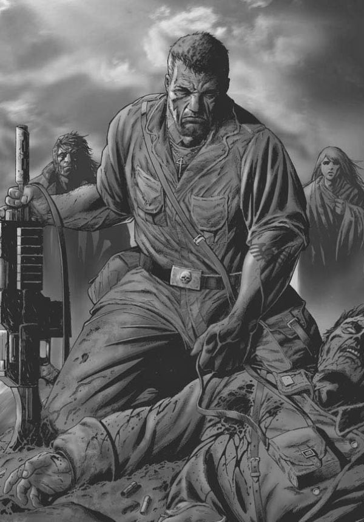
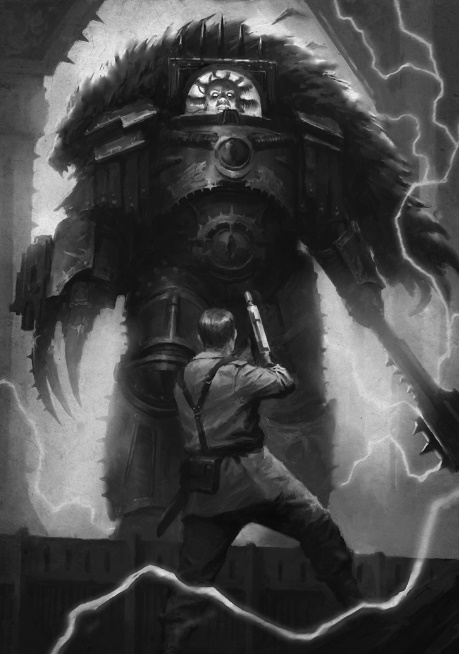

# 0589 欧良尼乌斯·佩松

精校状态：中文行文已逐段精校，部分术语仍为暂定

分类：人类帝国

原文来源：https://www.bilibili.com/opus/1052973698629238789

原作者：帝国神选罐头

原文时间：2025年04月07日 13:15

[返回分类目录](目录.md) · [全书目录](../../目录.md)

原篇名：欧兰尼奥斯·佩松 Ollanius Persson

<!-- A0589-B0001 -->
**英文原文**

I got old. I saw plenty.

<!-- /A0589-B0001 -->

<!-- A0589-B0002 -->

原译文

我老了。我看到了很多。

**校订译文**

“我活得够久，见过很多事。”

<!-- /A0589-B0002 -->

<!-- A0589-B0003 -->
**英文原文**

You're not that old.

<!-- /A0589-B0003 -->

<!-- A0589-B0004 -->

原译文

你没那么老。

**校订译文**

你没那么老。

<!-- /A0589-B0004 -->

<!-- A0589-B0005 -->
**英文原文**

Not compared to some, I suppose.

<!-- /A0589-B0005 -->

<!-- A0589-B0006 -->

原译文

与一些人相比，我想。

**校订译文**

“跟某些人相比，确实还不算吧。”

<!-- /A0589-B0006 -->

<!-- A0589-B0007 -->
**英文原文**

Ollanius Persson is a Perpetual and mysterious figure in history related to the myth of Ollanius Pius.

<!-- /A0589-B0007 -->

<!-- A0589-B0008 -->

原译文

欧兰尼奥斯·佩松是永生者，历史上与欧兰尼奥斯·皮乌斯神话有关的神秘的人物。

**校订译文**

欧良尼乌斯·佩松是一名永生者，也是历史上的神秘人物，其经历与欧良尼乌斯·庇乌斯的传说相连。

<!-- /A0589-B0008 -->

<!-- A0589-B0009 图片 -->

<!-- A0589-B0010 -->

原译文

Ollanius Persson 欧兰尼奥斯·佩松

**校订译文**

Ollanius Persson 欧良尼乌斯·佩松

<!-- /A0589-B0010 -->

<!-- A0589-B0011 -->
## History 历史

<!-- /A0589-B0011 -->

<!-- A0589-B0012 -->
### Ancient History 古代历史

<!-- /A0589-B0012 -->

<!-- A0589-B0013 -->
**英文原文**

Ollanius Persson was born as one of the mysterious Perpetuals, and has lived so many lives that he has forgotten his true age. However he estimates that as of the Horus Heresy he was roughly 45,000 years old "give or take", which would place his birth around 15,000 B.C. in the city of Nineveh. If this is to be believed, it would make him even older than the Emperor, who according to older sources was born around 8,000 B.C.. He is said to be the oldest Perpetual. He explicitly said he is older than the Emperor.

<!-- /A0589-B0013 -->

<!-- A0589-B0014 -->

原译文

欧兰尼奥斯·佩松诞生时是神秘的永生者之一，他活了很长时间，以至于忘记了自己的真实年龄。然而，他估计，截至荷鲁斯叛乱时期，他大约有45000岁，这意味着他大约在公元前15000年出生在尼尼微城。如果这是真的，这将使他比帝皇更老，根据更古老的资料，帝皇诞生在公元前8000年左右。据说他是最古老的永生者。他明确表示自己比帝皇年长。

**校订译文**

欧良尼乌斯·佩松天生便是神秘的永生者之一，历经太多人生，连真实年龄都已忘记。他估计，荷鲁斯之乱时自己“大约”四万五千岁，由此推算，他约于公元前一万五千年出生于尼尼微。如果可信，他便比帝皇更年长——较早资料称帝皇约生于公元前八千年。他被认为是最古老的永生者，也亲口说过自己比帝皇年长。

**校注：** 年龄、出生年代及尼尼微地点均为本篇记述，带估算限定；不据此宣称史前城市年代已获现实史验证。

<!-- /A0589-B0014 -->

<!-- A0589-B0015 -->
**英文原文**

In Terra's ancient past, Ollanius acted as the Warmaster of the Emperor's armies. During a war in East Phoenicia against a Chaos Cult said to be the proto-Cognitae, the Emperor and Ollanius' armies besieged a massive tower etched in Enuncia that was being erected. After emerging victorious, Ollanius sought to destroy the tower and all the dark knowledge it contained. However the Emperor refused, instead wishing to preserve the knowledge for use against future threats. Disenchanted with the Emperor, Ollanius stabbed him with a dagger before using Enuncia to destroy the tower and escape.

<!-- /A0589-B0015 -->

<!-- A0589-B0016 -->

原译文

在泰拉的古代历史中，欧兰尼奥斯曾担任帝皇军队的统帅。在东腓尼基与据说是原始闻道学派的混沌教派的战争中，帝皇和欧兰尼奥斯的军队围攻了一座正在建造的刻有暗言的巨大塔楼。在取得胜利后，欧兰尼奥斯试图摧毁这座塔及其所包含的所有黑暗知识。然而，帝皇拒绝了，而是希望保留这些知识以应对未来的威胁。欧兰尼奥斯对帝皇感到失望，用匕首刺伤了他，然后用暗言摧毁了塔楼并逃跑了。

**校订译文**

在泰拉的远古时代，欧良尼乌斯曾任帝皇军队的战帅。两人在腓尼基东部征讨一支被认为是闻道学派前身的混沌教团，围攻其正在兴建、刻满暗言的巨塔。获胜后，欧良尼乌斯要毁掉高塔及其中的一切黑暗知识，帝皇却坚持保留，以对抗未来威胁。幻灭的欧良尼乌斯用匕首刺伤帝皇，再以暗言毁塔，随后逃离。

<!-- /A0589-B0016 -->

<!-- A0589-B0017 -->
**英文原文**

Having lived through all of recorded human history, he makes first-hand reference to historical and mythological events such as being one of the Argonauts, participating in the Battle of Austerlitz (during the Napoleonic Wars), the Siege of Verdun (during the First World War), and the Battle of 73 Easting (during the Gulf War), amongst others.

<!-- /A0589-B0017 -->

<!-- A0589-B0018 -->

原译文

在经历了所有有记录的人类历史之后，他直接经历了历史事件和神话事件，例如作为阿尔戈英雄之一，参加了奥斯特利茨战役（拿破仑战争期间）、凡尔登围城战（第一次世界大战期间）和73东行战役（海湾战争期间）等。

**校订译文**

他亲历了有文字记载以来的整个人类历史，并以亲身经历谈及诸多史事与神话：曾是阿尔戈英雄之一，参加拿破仑战争中的奥斯特利茨战役、第一次世界大战中的凡尔登之战，以及海湾战争中的东距73战役等。

**校注：** 73 Easting为地图东距线编号，非向东方向行进；凡尔登原Siege与通常Battle称呼不同，译之战保留英文原词。

<!-- /A0589-B0018 -->

<!-- A0589-B0019 -->
### Battle of Calth 考斯之战

<!-- /A0589-B0019 -->

<!-- A0589-B0020 -->
**英文原文**

By the 31st Millennium Ollanius Persson had become known as 'Pious' Oll Persson because of his devout belief in the Catheric religion and was a civilian farmer of Calth in the Ultramar system. Before this, he had been a private soldier in the Imperial Army who earned the right to retire; being gifted with service-shares for a plot of land proportionate to his years served (rounded down - the Army always rounded down), he decided to cash them in on Calth, taking on twenty hectares. He chose Calth for two main reasons; the first was that if service-shares were used to buy land on a world newly-opened for colonisation, travel-fares to that world were paid for. The second was that, out in the farther reaches of the Imperium, under the banner of the "New Empire" being forged by Roboute Guilliman and his Ultramarines, Persson felt that it would be easier to practice his faith without incident; religious faith was widely looked down upon in the Imperium as unscientific nonsense. Persson settled down on Calth, living comfortably enough for eighteen years. The only indicators of his past as a soldier were the fading tattoo on his arm, the battered lasrifle mounted on his wall, and the company of an ex-Army loader servitor named Graft, that could not be dissuaded from referring to Oll as 'Trooper Persson'. To others, including his neighbours and several employees, he was just old 'Pious Oll'.

<!-- /A0589-B0020 -->

<!-- A0589-B0021 -->

原译文

到第31个千年，欧兰尼奥斯·佩松因其对天主宗教的虔诚信仰而被称为“虔诚的”欧尔·佩松，并且是奥特拉玛星系中考斯的平民农民。在此之前，他曾是帝国军队的一名列兵，有权退役；他获得了与服役年限成比例的一块土地的服役股份（四舍五入-陆军总是四舍五进），他决定在考斯上兑现这些股份，占地20公顷。他选择考斯有两个主要原因；首先，如果服役股份被用来购买一个新开放的殖民地上的土地，那么前往那个世界的航行费用不会被支付。第二个原因是，在帝国的偏远地区，在罗伯特·基里曼和他的极限战士打造的“新帝国”的旗帜下，佩松觉得更容易毫无意外地实践他的信仰；在帝国时期，宗教信仰被普遍视为不科学的无稽之谈。佩松在考斯定居下来，过了18年的舒适生活。他过去是一名士兵的唯一迹象是他手臂上褪色的纹身，墙上安装的破旧的激光步枪，以及一位名叫格拉夫特的前陆军装弹兵的陪伴，他忍不住称欧尔为“士兵佩松”。对其他人来说，包括他的邻居和几名员工，他只是老“虔诚的欧尔”。

**校订译文**

到第31千年，欧良尼乌斯·佩松因虔信天主教派，被称为“虔诚的欧尔·佩松”。他在奥特拉玛的考斯务农。在此之前，他是帝国军列兵，服役后获准退伍，所得服役份额可按服役年限兑换土地，年限一律向下取整——帝国军一贯如此。他在考斯兑换了二十公顷土地，原因有二：首先，在新开放的殖民世界用份额买地，前往当地的旅费由军方支付；其次，在帝国偏远地区、罗保特·基里曼与极限战士建立的“新帝国”治下，他更容易安然信奉自己的宗教，毕竟帝国普遍将信仰视为不科学的胡言。他在考斯过了十八年还算舒适的日子。只有手臂上渐褪的纹身、挂在墙上的破旧激光步枪，以及退役搬运机仆格拉夫特，才透露出从军经历。无论怎么劝，格拉夫特仍坚持叫他“佩松兵士”；邻居和几名雇工等其他人，则只叫他老“虔诚欧尔”。

**校注：** rounded down一律向下取整，原四舍五入/四舍五进均错；travel-fares were paid for旅费由军方支付，原否定译反。Catheric为设定中的宗教名称，沿天主教派但不可径等同现代天主教制度。Ultramar是奥特拉玛疆域，原system宽泛错误不译单一恒星系。loader servitor指搬运机仆，不是仍为人类的装弹兵。 这里的 Army 仍指 Imperial Army，沿全书定译。

<!-- /A0589-B0021 -->

<!-- A0589-B0022 -->
**英文原文**

Oll was present on Calth when the Word Bearers Space Marine Legion attacked the Ultramarines during the Great Betrayal. The initial strikes from impacting orbital debris (once ship yards and vessels of the Ultramarine fleet) reminded him, terrifyingly, of his last campaign in the Army, upon the world of Chrysophar. Oll turned to his faith to help him survive during this time, and was knocked unconscious shortly after uttering a prayer to his god. During this unconscious period, Oll appeared to dream of being visited by an old friend of his; John Grammaticus. Unwilling to converse with Grammaticus, Oll attempted to carry on preparing breakfast for his wife; Grammaticus was forced to remind him that his wife died long before he joined the Army. Long before the last time he joined the Army, to be exact. Oll also refused to listen to John's attempts to remind him of their old brotherhood-in-arms in such conflicts as those that took place at Anatol Hive and the Panpacific on Terra, "several lifetimes ago". Finally, Grammaticus used Oll's status as one of the few remaining Perpetuals in existence and the onus that came with it to somewhat reluctantly guilt him into paying attention.

<!-- /A0589-B0022 -->

<!-- A0589-B0023 -->

原译文

在“大背叛”期间，当怀言者星际战士军团袭击极限战士时，欧尔就在考斯。撞击轨道碎片（曾经是极限战士的造船厂和船只）的最初打击让他可怕地想起了他在军队的最后一次战役，那是在克里索法尔世界。在这段时间里，欧尔转向他的信仰来帮助他生存，在向他的神祈祷后不久就被击倒了。在这段无意识的时期，欧尔似乎梦到了他的一位老朋友来访；约翰·格拉马迪库斯。欧尔不愿与格拉马迪库斯交谈，试图继续为妻子准备早餐；格拉马迪库斯不得不提醒他，他的妻子早在他参军之前就去世了。确切地说，早在他上次参军之前。欧尔也拒绝听约翰试图提醒他，在“几世前”发生在阿纳托尔巢都和泰拉上的泛太平洋的冲突中，他们曾经是战友。最后，格拉马迪库斯利用欧尔作为现存少数几个永生者之一的地位，以及随之而来的责任，让他有点不情愿地让他注意到。

**校订译文**

大背叛期间，怀言者袭击极限战士时，欧尔就在考斯。轨道残骸——原本是造船厂与极限战士舰船——开始坠落，让他惊恐地想起最后一次从军征战，那是在克里索法尔。他寄望于信仰，求得生存，在向神祈祷后不久便被击昏。昏迷中，他似乎梦见老友约翰·格拉马迪库斯来访。他不愿交谈，只想继续给妻子做早餐；约翰不得不提醒，他妻子早在他参军之前就死了——准确说，是上一次参军之前很久。约翰提到两人在“几辈子之前”于泰拉阿纳托尔巢都、泛太平洋等战场并肩作战，欧尔也拒绝听。最后，约翰只好提醒：他是仅存的少数永生者之一，肩负相应责任。欧尔因而愧疚，勉强开始认真倾听。

**校注：** 撞击地表的是轨道残骸；who/onus结尾指约翰用责任使欧尔认真倾听。

<!-- /A0589-B0023 -->

<!-- A0589-B0024 -->
**英文原文**

I'm only what I am now thanks to xenos intervention. You, you're a true Perpetual. You're still like him.

<!-- /A0589-B0024 -->

<!-- A0589-B0025 -->

原译文

多亏了异型的干预，我才有了现在的样子。你，你是一个真正的永生者。你仍然像他一样。

**校订译文**

“我变成今天这样，靠的是异形干预。你不同，你是真正的永生者。你仍像他一样。”

<!-- /A0589-B0025 -->

<!-- A0589-B0026 -->
**英文原文**

— John Grammaticus speaking to Ollanius Persson.

<!-- /A0589-B0026 -->

<!-- A0589-B0027 -->

原译文

— 约翰·格拉马迪库斯与欧兰尼奥斯·佩松交谈。

**校订译文**

——约翰·格拉马迪库斯对欧良尼乌斯·佩松说。

<!-- /A0589-B0027 -->

<!-- A0589-B0028 -->
**英文原文**

Grammaticus delivered the news that without their intervention, "he" was going to lose the war, and that if "he" lost, the human race would lose. Grammaticus urged his old friend to leave Calth via "Immaterium sidestep" and gain an object for him. When Persson asked where he was supposed to go, Grammaticus replied that he would show him:

<!-- /A0589-B0028 -->

<!-- A0589-B0029 -->

原译文

格拉马迪库斯宣告，如果没有他们的干预，“他”将输掉这场战争，如果“他”输了，人类也会输。格拉马迪库斯敦促他的老朋友通过“虚境跳跃”离开考斯，为他获得一个物品。当佩松问他应该去哪里时，格拉马迪库斯回答说他会带他去：

**校订译文**

格拉马迪库斯带来消息：若他们不介入，“他”就会战败，而“他”一败，人类也将失败。约翰催促老友以“非物质界侧步”离开考斯，替自己取得一件东西。佩松问该去哪里，约翰说会让他看见：

<!-- /A0589-B0029 -->

<!-- A0589-B0030 -->
**英文原文**

Persson then found himself transported from his comfortable dream-environment to one of horror; aboard a space vessel at war, but a vessel that was unnatural and disturbing, orbiting a burning Terra. Entering a massive chamber, he encountered a dead angel lying upon the floor, his brutal killer standing nearby. Taken aback by the unholy appearance of the angel's murderer, he raised his Catheric symbol and audibly renounced the Evil One that stood before him. The killer took a step towards Oll, but stopped, his attention caught by something held in Persson's hand. At that moment, a golden light coming from behind Oll flooded the chamber, a light Oll recognised as one he used to know... but weaker, and sullied. Announcing that he had seen enough, he heard Grammaticus speak as if bringing him to wakefulness.

<!-- /A0589-B0030 -->

<!-- A0589-B0031 -->

原译文

佩松发现自己从舒适的梦境环境变成了恐怖的环境；在战争中登上一艘太空舰船，但这是一艘不自然、令人不安的飞船，绕着燃烧的泰拉轨道运行。进入一个巨大的房间，他遇到一个死去的天使躺在地板上，残忍的杀手就站在附近。被杀害天使的凶手的邪恶外表吓了一跳，他举起了他的天主标志，大声宣布放弃站在他面前的邪恶。凶手朝欧尔走了一步，但停了下来，他的注意力被佩松手里拿着的东西吸引住了。就在那一刻，一道金色的光芒从欧尔身后照进了房间，欧尔认出这是他以前认识的光...但更虚弱，更肮脏。他宣告他已经看够了，他听到格拉马迪库斯说话，仿佛让他清醒过来。

**校订译文**

佩松随即从安适梦境落入恐怖景象：一艘正在作战、形态诡异的舰船，盘旋于燃烧的泰拉上空。他进入巨厅，看见一位死去的天使倒在地上，残忍的凶手立在旁边。凶手亵渎的面貌令他骇然，他举起天主教派信物，高声斥拒眼前的邪魔。凶手向前迈步，却被佩松手中之物吸引，停了下来。此时，欧尔身后涌来金光，照满大厅；他认得这光，曾经熟悉，如今却更虚弱，也蒙上污痕。他说自己已经看够，便听见约翰开口，仿佛要将他唤醒。

**校注：** renounced Evil One是斥拒面前邪恶存在，不是承认自己曾信奉而宣布退教。幻景人物尚用天使/凶手指称，未擅自增加专名。

<!-- /A0589-B0031 -->

<!-- A0589-B0032 -->
**英文原文**

Waking up in what was left of his lands, Persson resolved to escape from the ongoing Battle of Calth, aiding a number of other survivors on the way, many of whom banded together with him and accompanied him off-world. Before leaving, he managed to acquire an athame ritual blade from a Chaos Cultist that he believed may be the item he was supposed to fetch, to be used for something utterly important. Persson and his survivors consisting of Graft, Dogent Krank, Bale Rane, Hebet Zybes, and Katt left Calth by use of apparent sorcerous techniques; he used the athame to open what appeared to be a form of warp-gate and stepped through.

<!-- /A0589-B0032 -->

<!-- A0589-B0033 -->

原译文

在剩下的土地上醒来后，佩松决定逃离正在进行的考斯战役，在途中帮助其他一些幸存者，其中许多人与他联合起来，陪同他离开世界。在离开之前，他设法从一位混沌教派信徒那里获得了一把仪式匕首，他认为这可能是他应该拿的东西，用来做一些非常重要的事情。佩松和他的幸存者，包括格拉夫特、多根特·克兰克、巴勒·莱恩、赫贝特·齐贝斯和凯特，通过使用明显的魔法技术离开了考斯；他用仪式匕首打开了一个看起来像亚空间门的东西，然后走了进去。

**校订译文**

佩松在农场残址醒来，决定逃出考斯之战。他沿途救助幸存者，不少人结伴同行，最终随他离星。出发前，他从一名混沌信徒手中夺得一把仪式之刃，认为这或许就是约翰要他寻找、将有重大用途的东西。他以此划开一道仿佛亚空间门户的裂口，带着格拉夫特、多根特·克兰克、巴勒·莱恩、赫贝特·齐贝斯与凯特踏入其中。众人就这样以看似巫术的手段离开考斯。

<!-- /A0589-B0033 -->

<!-- A0589-B0034 -->
### Journey to Terra 泰拉之行

<!-- /A0589-B0034 -->

<!-- A0589-B0035 -->
**英文原文**

For the next six years Persson and his small band wandered through both space and time using the Athame and a warp-sensitive compass, attempting to reach Terra at the behest of Grammaticus. They were hunted by a variety of foes: the Word Bearers, Alpha Legion, Daemons, and assassins of the Cabal bent on seeing Horus victorious. On the world of Andrioch they emerged shortly after the end of the revolt of the Iron Men and became stranded for two years. There, Persson speculated on what to do next but was confronted by John Grammaticus who urged him to go back. However Persson saw through the deception and killed Grammaticus with his Athame, revealing that his friend was a shape-shifting impostor of the Alpha Legion. With few options left, Persson led his band through a cosmic void left behind by the Iron Men that he would have preferred to avoid.

<!-- /A0589-B0035 -->

<!-- A0589-B0036 -->

原译文

在接下来的六年里，佩松和他的小队使用意识匕首和一个对经线敏感的指南针在空间和时间上徘徊，试图在格拉马迪库斯的请求下到达泰拉。他们被各种各样的敌人追捕：怀言者、阿尔法军团、恶魔和阴谋团的刺客，他们一心想看到荷鲁斯获胜。在安德里奥世界里，他们在铁人叛乱结束后不久就出现了，并被困了两年。在那里，佩松猜测下一步该怎么办，但遭到了约翰·格拉马迪库斯的质问，后者敦促他回去。然而，佩松看穿了欺骗，用他的仪式匕首杀死了格拉马迪库斯，并透露他的朋友是阿尔法军团的变形骗子。在几乎没有选择的情况下，佩松带领他的小队穿过了铁人留下的大的宇宙巨洞，而他本想避免这个。

**校订译文**

此后六年，佩松一行借仪式之刃与感应亚空间的罗盘穿行时空，试图应约翰要求抵达泰拉。怀言者、阿尔法军团、恶魔，以及一心促成荷鲁斯胜利的密教刺客，都在追捕他们。在安德里奥，他们现身于铁人叛乱刚结束的时期，被困两年。佩松思索下一步时，约翰突然出现，劝他回头。但他识破骗局，用仪式之刃杀死来者，发现那是阿尔法军团的变形冒充者。别无选择之下，他率众穿过铁人留下的宇宙空洞——那原是他极想避开的道路。

**校注：** 原意识匕首错字及经线误读warp已修；Cabal密教，非黑暗灵族阴谋团。变形者为冒充约翰的人，不是约翰本来属于阿尔法军团。

<!-- /A0589-B0036 -->

<!-- A0589-B0037 -->
**英文原文**

Later in a meeting with Erda on Terra, John Grammaticus was shocked to find that Persson had not rendezvoused with him as planned. Erda suspected that Persson had arrived in the wrong time, perhaps before or after the agreed period. She consulted the stars and her tarot cards to determine that Persson had arrived on Terra two weeks later than Grammaticus.

<!-- /A0589-B0037 -->

<!-- A0589-B0038 -->

原译文

后来在泰拉上与尔达会面时，约翰·格拉马迪库斯震惊地发现佩松没有按计划与他会面。尔达怀疑佩松到达的时间不对，可能是在约定的时间之前或之后。她观察了群星和塔罗牌，确定佩松比格拉马迪库斯晚两周到达泰拉。

**校订译文**

后来，约翰在泰拉会见尔达时，惊觉佩松没有如约会合。尔达怀疑他们抵达了错误时点，可能早于或晚于约定。她观察星象、占卜塔罗，确定佩松将在约翰抵达泰拉两周之后到来。

**校注：** 时间穿梭语境，在约翰这时尚未会合，故说明其晚两周抵达；不改具体差值。

<!-- /A0589-B0038 -->

<!-- A0589-B0039 -->
### Terra 泰拉

<!-- /A0589-B0039 -->

<!-- A0589-B0040 -->
**英文原文**

After a seeming eternity of travels throughout space and time, Ollanius and his group finally emerged on Terra. However they found themselves in the Hatay-Antakya Hive region, now occupied by the Emperor's Children and transformed into a horrific dream garden known as "paradise". Within paradise, desperate civilians seeking escape from the horrors of the Siege of Terra were entrapped within in vines and had their dreams harvested by the Emperor's Children, who consumed them. Oll and his group were only saved from Paradise and the Emperor's Children by John Grammaticus and Leetu. During the struggle to escape paradise, Bale Rane was slain by Slaaneshi Daemons, and the group was nearly again overcome before being saved by Actae and a Space Marine identifying himself as Alpharius. Despite the pleas of John, Ollanius agreed to have the duo aid them in their quest. Together, the group, now known affectionately by Grammaticus as the "Argonauts", acquired an Arvus Lighter and flew to the Imperial Palace across Terra's ravaged landscape. However as they crossed the frontline, they were shot down and crashed into the Inner Palace. Oll and others were guided by "Alpharius" into hidden passages with the intent to reach the Sanctum Imperialis.

<!-- /A0589-B0040 -->

<!-- A0589-B0041 -->

原译文

在经历了看似永恒的时空之旅后，欧兰尼奥斯和他的团队终于出现在泰拉上。然而，他们发现自己身处哈塔伊·安塔基亚巢都地区，现在被帝皇之子们占据，变成了一个被称为“天堂”的可怕的梦幻花园。在天堂里，绝望的平民试图逃离泰拉围城的恐怖，他们被困在藤蔓中，他们的梦想被帝皇之子们收获，并被吃掉了。欧尔和他的团队是由约翰·格拉马迪库斯和勒图从天堂和皇帝之子中拯救出来的。在逃离天堂的战斗中，巴勒·莱恩被色孽恶魔杀害，该组织几乎再次被击败，然后被阿克泰和一名自称阿尔法瑞斯的星际战士救下。尽管约翰恳求，欧兰尼奥斯还是同意让两人帮助他们。这个现在被格拉马迪库斯亲切地称为“阿戈尔英雄”的团体获得了一个阿维鲁斯驳船，并穿过泰拉被破坏的景观飞往皇宫。然而，当他们越过前线时，他们被击落并撞向了内殿。欧尔和其他人被“阿尔法瑞斯”引导进入隐藏的通道，意图到达帝国圣地。

**校订译文**

经过仿佛无穷无尽的时空漂泊，欧良尼乌斯一行终于抵达泰拉，却落在哈塔伊·安塔基亚巢都地区。帝皇之子已将其占据，改造成名为“天堂”的恐怖梦境花园。想逃避围城恐怖的绝望平民，被藤蔓囚困，梦境遭到帝皇之子收割、吞食。幸得约翰与勒图援救，欧尔一行才脱身。逃离时，巴勒·莱恩死于色孽恶魔；众人险些再度覆灭，又被阿克泰和一名自称“阿尔法瑞斯”的星际战士救下。尽管约翰反对，欧良尼乌斯仍接受二人帮助。这支被约翰亲昵地称为“阿尔戈英雄”的队伍夺得一架阿维鲁斯轻型运输机，飞越残破泰拉，前往皇宫。然而，越过战线时运输机被击落，坠入内宫。“阿尔法瑞斯”随后领众人走入密道，试图抵达帝国圣所。

**校注：** 被吞食的是梦境，原梦想易误读愿望；Argonauts统一阿尔戈英雄，非阿戈尔。Arvus Lighter为大气/轨道运输机，非水上驳船，专名暂沿阿维鲁斯。

<!-- /A0589-B0041 -->

<!-- A0589-B0042 -->
**英文原文**

Within the Palace, the "Argonauts" were deliberately detained by Custodes and Malcador's Chosen for interrogation. Using his knowledge of the Emperor's past and ability to sneak into the Imperial Dungeon undetected as evidence that he was someone of great significance, the Custodes eventually agreed to his request to take them before the Emperor. However by this point, the Emperor had already left to fight Horus aboard the Vengeful Spirit and the group was instead met by Vulkan. Despite pleading his mission to a sympathetic Vulkan, Ollanius despaired that he had apparently failed in his quest.

<!-- /A0589-B0042 -->

<!-- A0589-B0043 -->

原译文

在皇宫内，“阿戈尔英雄”被禁军和马卡多亲选拘留审问。利用他对帝皇过去的了解和不被发现潜入帝国地牢的能力，作为他是一个重要人物的证据，禁军最终同意了他的要求，将他们带到帝皇面前。然而，此时，帝皇已经跳帮复仇之魂号去与荷鲁斯作战，而这群人却遭到了沃坎的迎接。尽管欧兰尼奥斯向仁慈的沃坎倾诉了自己的使命，但他仍感到绝望，因为他显然未能完成自己的任务。

**校订译文**

在宫内，“阿尔戈英雄”被禁军与马卡多亲选者有意截留、审问。欧尔以自己对帝皇往事的了解，以及悄无声息潜入帝国地牢的能力，证明身份非同寻常，终于说服禁军带他们觐见。但帝皇此时已登上复仇之魂号，前去与荷鲁斯决战，他们见到的只有沃坎。欧良尼乌斯向这位同情自己的原体陈述使命，却因似乎功败垂成而陷入绝望。

<!-- /A0589-B0043 -->

<!-- A0589-B0044 -->
**英文原文**

Ollanius was ultimately convinced by his companions and a mysterious spool of string to continue their quest, believing the string had been sent by them from the future as a way to mark their path. However the group eventually encountered Erebus, who had been hunting them since Calth. During the ensuing struggle Erebus slew all of Oll's companions save Leetu and John, while Actae was buried under rubble. Again falling into despair, Ollanius was only convinced to move forward by John and Leetu. Along the way, they were nearly killed by a group of maddened Word Bearers until being rescued by the presence of the Emperor, who by now was swelling into a proto-god dubbed the Dark King.

<!-- /A0589-B0044 -->

<!-- A0589-B0045 -->

原译文

欧兰尼奥斯最终被他的同伴和一根神秘的线轴说服，继续他们的任务，相信这根线轴是他们从未来寄来的，作为标记他们前进道路的一种方式。然而，该组织最终遇到了艾瑞巴斯，他自考斯以来一直在追捕他们。在随后的战斗中，艾瑞巴斯杀死了欧尔的所有同伴，只留下勒图和约翰，而阿克泰则被埋在瓦砾下。欧兰尼奥斯再次陷入绝望，只有约翰和勒图说服他继续前进。一路上，他们差点被一群疯狂的怀言者杀死，直到被帝皇的存在救了出来，帝皇现在已经膨胀成一个被称为黑暗之王的原初之神。

**校订译文**

同伴的劝说，加上一卷来历神秘的细线，最终使欧良尼乌斯继续前进；他们相信，这卷线由未来的自己送来，用于标记路径。但一行随后遇见自考斯起便追杀他们的艾瑞巴斯。冲突中，除勒图、约翰外，欧尔的同伴尽遭杀害；阿克泰则被埋入瓦砾。欧尔再陷绝望，直到约翰与勒图劝他继续。路上，一群狂乱怀言者几乎杀死他们，所幸帝皇的到来将其救下——此时，帝皇正朝名为黑暗之王的新神形态膨胀。

**校注：** 线是真实线轴所绕的线，非抽象提示；下段阿克泰再出现，原未述获救经过，不杜撰补桥。proto-god为正形成的神，不是远古原初神。

<!-- /A0589-B0045 -->

<!-- A0589-B0046 -->
**英文原文**

Persson confronted his own friend, talking him down from the abyss of corruption by reminding Him of His humanity. Shocked that He had encountered Persson for the first time in millennia at this specific place at this specific time, Persson convinced the Emperor to have faith and give up the power He had built up even if it meant gambling humanity's future in a battle He was likely not to win. This ultimately convinced the Emperor to shed the mantle of the evolving Dark King, causing a blast of power to sweep across both Terra and the Vengeful Spirit that banished much of the Warp-madness spread by the traitors. The Emperor then let out an announcement across the Vengeful Spirit for all remaining companions to come join Him in the final battle to kill Horus, a battle He was no longer certain to win. However, the Emperor forbid Oll and John from following Him and instead gave back the spool of thread they had initially followed, ordering them to retrace their steps and leave it in order for them to close the time loop they had created.

<!-- /A0589-B0046 -->

<!-- A0589-B0047 -->

原译文

佩松直面自己的朋友，通过提醒他的人性，把他从腐蚀的深渊中拉了出来。令人震惊的是，他数千年来第一次在这个特定的时间和地点遇到了佩松，佩松说服帝皇要有信心，放弃他建立的权力，即使这意味着在一场他可能不会赢的战斗中赌上人类的未来。这最终说服了帝皇摆脱了不断进化的黑暗之王的衣钵，引发了一股席卷泰拉和复仇之魂的力量，驱逐了叛徒传播的大部分亚空间疯狂。然后，帝皇通过复仇之魂发布宣告，让所有剩余的同伴加入他杀死荷鲁斯的最后一场战斗，这场战斗他不再确定会赢。然而，皇帝禁止欧尔和约翰跟随他，而是归还了他们最初跟随的那卷线，命令他们往回走，离开它，以便他们关闭他们创造的时间循环。

**校订译文**

佩松直面老友，唤醒其人性，劝他远离腐化深渊。帝皇震惊于数千年后的重逢，竟发生在此时此地。佩松劝他保有信念，舍弃积聚的力量，即使代价是把人类未来押在一场胜算不大的决战上。帝皇终于放弃正在形成的黑暗之王形态，释放的能量席卷泰拉与复仇之魂号，扫除大量亚空间狂乱。他随即召唤幸存同伴，共赴诛杀荷鲁斯的决战，却禁止欧尔与约翰跟随。帝皇将他们循路而来的那卷线交还，命二人沿原路回溯，将线留在应在之处，闭合自己造成的时间循环。

**校注：** leave it要求把线留下，原离开它使时间循环动作断裂。

<!-- /A0589-B0047 -->

<!-- A0589-B0048 -->
**英文原文**

However while they undertook their task, Oll discovered that their shattered Athame blade had since been restored by the Emperor. Feeling that they needed to return to the Emperor's side immediately to give him the weapon, Oll ordered Actae to teleport he and John to Lupercal's Court. The act proved difficult, but the duo eventually emerged directly at the feet of Horus just as he stood over the defeated Emperor. Horrified by the monster before them, John spoke a word of Enuncia, sending Horus across the room and briefly incapacitating him. Oll convinced John to flee by demanding he see travel into the past to finish their task. Oll then rushed to the Emperor's side and begged him to wake up, handing him the Athame blade. However, the Emperor would not stir. Oll then saw two of the Emperor's tarot cards next to him: The Guardsman and the Lantern, side by side. Oll recognized this as the Emperor speaking to him, the two friends finally reunited in that moment. Oll then realized Horus was recovering and soon approaching them. Oll again started begging the Emperor to get up, before turning to defend him. Proclaiming that he would not allow Horus to touch the Emperor, Oll unloaded his Lasgun into the chest of the monstrous entity before him. Horus contemptuously reduced Ollanius Persson into red mist with his talon.

<!-- /A0589-B0048 -->

<!-- A0589-B0049 -->

原译文

然而，当他们执行任务时，欧尔发现他们破碎的仪式匕首已经被帝皇修复了。感觉他们需要立即回到帝皇身边把武器交给他，欧尔命令阿克泰将他和约翰传送到卢佩卡尔王庭。事实证明，这一行为很困难，但当荷鲁斯站在战败的帝皇面前时，两人最终直接出现在荷鲁斯脚下。被面前的怪物吓坏了，约翰说了一句暗言，让荷鲁斯穿过房间，短暂地使他丧失了能力。欧尔说服约翰逃跑，要求他穿越过去完成任务。然后，欧尔冲到帝皇身边，恳求他醒来，递给他仪式匕首。然而，帝皇没有动。然后，欧尔看到两张帝皇塔罗牌在他旁边：卫兵和灯笼。欧尔认出这是帝皇对他说话，两个朋友终于在那一刻团聚了。欧尔意识到荷鲁斯正在恢复，很快就接近了他们。欧尔再次恳求帝皇站起来，然后转身守护他。宣称他不会允许荷鲁斯触碰帝皇，欧尔用他的激光枪射入了他面前的怪物的胸膛。荷鲁斯轻蔑地用爪子把欧兰尼奥斯·佩松变成了红雾。

**校订译文**

执行任务时，欧尔发现原已断裂的仪式之刃被帝皇修复。他认为必须立刻回去送刃，于是让阿克泰将自己与约翰传送至卢佩卡尔王庭。传送十分艰难，二人最终出现在荷鲁斯脚下；彼时战帅正俯视倒地的帝皇。约翰被面前怪物骇住，吐出一句暗言，将荷鲁斯轰至房间另一端，令其暂时失去行动能力。欧尔催约翰逃走，穿越回过去，完成原定任务，自己则奔向帝皇，恳求他醒来，将仪式之刃放入他手中。帝皇仍无动静。欧尔看见旁边并列两张塔罗牌：“卫兵”与“提灯”，意识到帝皇正在与自己说话，老友终于在此刻重聚。荷鲁斯渐渐恢复，向两人逼近。欧尔再次求帝皇起身，继而转身保护他。他宣称绝不让荷鲁斯碰到帝皇，将激光枪火力尽数倾泻在眼前怪物胸前。荷鲁斯轻蔑挥爪，将欧良尼乌斯·佩松击成一蓬血雾。

**校注：** sending Horus across the room是把荷鲁斯击飞至另一端，非使其走过房间。The Lantern牌名暂提灯，区别The Pharos灯塔。

<!-- /A0589-B0049 -->

<!-- A0589-B0050 图片 -->

<!-- A0589-B0051 -->

原译文

Ollanius Persson stands his ground before Horus 欧兰尼奥斯·佩松站在荷鲁斯面前

**校订译文**

Ollanius Persson stands his ground before Horus 欧良尼乌斯·佩松在荷鲁斯面前坚守

<!-- /A0589-B0051 -->

<!-- A0589-B0052 -->
## Legacy 身后影响

原题：Legacy 遗留

<!-- /A0589-B0052 -->

<!-- A0589-B0053 -->
**英文原文**

The significance of Oll's actions cannot be understated. His efforts would help buy the Emperor enough time to recover, and crucially, by placing the Athame blade into the unconscious hands of his old friend, provide a means for the Master of Mankind to finally bring about the end and the death of his fallen son.

<!-- /A0589-B0053 -->

<!-- A0589-B0054 -->

原译文

欧尔行为的重要性不容低估。他的努力将有助于为帝皇争取足够的时间来恢复，而且至关重要的是，通过将仪式匕首放入他无意识的老朋友的手中，为人类之主提供了一种手段，最终导致他的堕落之子的死亡。

**校订译文**

欧尔行动的重要性不容低估。他的抗争为帝皇争取了恢复时间；更关键的是，他把仪式之刃放进昏迷老友的手中，使人类之主最终有了终结堕落儿子的手段。

<!-- /A0589-B0054 -->

<!-- A0589-B0055 -->
**英文原文**

Ollanius Perssons legend eventually became intertangled with that of others such as Ollanius Piers, creating the myth of Saint Ollanius Pius.

<!-- /A0589-B0055 -->

<!-- A0589-B0056 -->

原译文

欧兰尼奥斯·佩松的传说最终与欧兰尼奥斯·皮乌斯等其他人的传说交织在一起，创造了圣欧兰尼奥斯·皮乌斯的神话。

**校订译文**

欧良尼乌斯·佩松的传说后来与欧良尼乌斯·皮尔斯等人的经历交织，最终形成了圣欧良尼乌斯·庇乌斯的传说。

**校注：** Piers与Pius在原文是两个人名，原译将二者都写成皮乌斯；按全书词根分别为皮尔斯、庇乌斯。

<!-- /A0589-B0056 -->

本篇核心术语与暂定项

以下列出本篇出现的英文原形及核心术语表用词。同形词可能指不同对象，具体词义以本篇正文和校注为准；单复数、别名和仅见于图注的名称可能尚未列入。完整候选见[术语表](../../术语表/双语术语候选.csv)。

| 英文 | 采用中文 | 状态 |
| --- | --- | --- |
| Imperial Army | 帝国军 | 暂定·官方待核 |
| Roboute Guilliman | 罗保特·基里曼 | 官方已核对 |
| Ultramar | 奥特拉玛 | 官方已核对 |
| Ultramarines | 极限战士 | 官方已核对 |
| Horus Heresy | 荷鲁斯之乱 | 官方已核对 |
| Warp | 亚空间 | 官方已核对 |
| Imperium | 帝国 | 暂定·简称 |
| Servitor | 机仆 | 暂定 |
| Emperor's Tarot | 帝皇塔罗牌 | 暂定 |
| History | 历史 | 编辑用语已统一 |
| Emperor | 帝皇 | 官方已核对 |
| Word Bearers | 怀言者 | 暂定·官方待核 |
| Emperor's Children | 帝皇之子 | 官方已核对 |
| Terra | 泰拉 | 暂定·官方待核 |
| Horus | 荷鲁斯 | 暂定·官方待核 |
| Erebus | 艾瑞巴斯 | 暂定·官方待核 |
| Vengeful Spirit | 复仇之魂号 | 暂定·官方待核 |
| Perpetual | 永生者 | 暂定·官方待核 |
| Cabal | 密教 | 暂定·官方待核 |
| John Grammaticus | 约翰·格拉马迪库斯 | 暂定·官方待核 |
| Ollanius Persson | 欧良尼乌斯·佩松 | 官方词根参考·全名待核 |
| Oll Persson | 欧尔·佩松 | 暂定·官方待核 |
| Erda | 尔达 | 暂定·官方待核 |
| Vulkan | 沃坎 | 暂定·官方待核 |
| Brotherhood | 兄弟会 | 暂定·官方待核 |
| Calth | 考斯 | 暂定·官方待核 |
| Enuncia | 暗言 | 暂定·官方待核 |
| Cognitae | 闻道学派 | 暂定·官方待核 |
| Master | 导师（审判庭职衔）／舰务官（舰员职务） | 语境定译·官方待核 |
| Mission | 教团／传教机构 | 暂定 |
| Leetu | 勒图 | 暂定·官方待核 |
| Ancient | 旗手 | 官方已核对 |
| Companions | 近侍 | 暂定·官方待核 |
| Lupercal | 卢佩卡尔 | 暂定·官方待核 |
| Space Marine Legion | 星际战士军团 | 暂定·官方待核 |
| Alpha Legion | 阿尔法军团 | 暂定·官方待核 |
| Space Marine | 星际战士 | 暂定·官方待核 |
| The Angel | 天使 | 暂定·官方待核 |
| Alpharius | 阿尔法瑞斯 | 暂定·官方待核 |
| Bale | 贝尔 | 暂定·官方待核 |
| The End and the Death | 终结与死亡 | 暂定·官方待核 |
| Ollanius Pius | 欧良尼乌斯·庇乌斯 | 官方词根参考·全名待核 |
| Xenos | 异形 | 暂定·官方待核 |
| athame | 仪式之刃 | 暂定·官方待核 |
| Imperialis | 帝国徽记 | 暂定·官方待核 |
| Sanctum | 圣所星 | 暂定·官方待核 |
| Sanctum Imperialis | 帝国圣所 | 暂定·官方待核 |
| Battle of Calth | 考斯之战 | 暂定·官方待核 |
| Dark King | 黑暗之王 | 暂定·官方待核 |
| Ollanius Piers | 欧良尼乌斯·皮尔斯 | 暂定·官方待核 |
| Catheric | 天主教派 | 暂定·官方待核 |
| Graft | 格拉夫特 | 暂定·官方待核 |
| Chrysophar | 克里索法尔 | 暂定·官方待核 |
| Anatol Hive | 阿纳托尔巢都 | 暂定·官方待核 |
| Immaterium sidestep | 非物质界侧步 | 暂定·官方待核 |
| Dogent Krank | 多根特·克兰克 | 暂定·官方待核 |
| Bale Rane | 巴勒·莱恩 | 暂定·官方待核 |
| Hebet Zybes | 赫贝特·齐贝斯 | 暂定·官方待核 |
| Katt | 凯特 | 暂定·官方待核 |
| Andrioch | 安德里奥 | 暂定·官方待核 |
| Hatay-Antakya Hive | 哈塔伊·安塔基亚巢都 | 暂定·官方待核 |
| Actae | 阿克泰 | 暂定·官方待核 |
| Arvus Lighter | 阿维鲁斯轻型运输机 | 暂定·官方待核 |
| The Weapon | 武器 | 暂定·官方待核 |
| The Dark | 《黑暗》 | 暂定·官方待核 |
| System | 星系（恒星系统） | 暂定·官方待核 |
| Corruption | 腐败 | 暂定·官方待核 |
| Phoenicia | 腓尼基 | 暂定·官方待核 |
| Lupercal's Court | 卢佩卡尔王庭 | 暂定·官方待核 |
| Imperial Dungeon | 帝国地牢 | 暂定·官方待核 |
| Inner Palace | 内殿 | 暂定·官方待核 |

