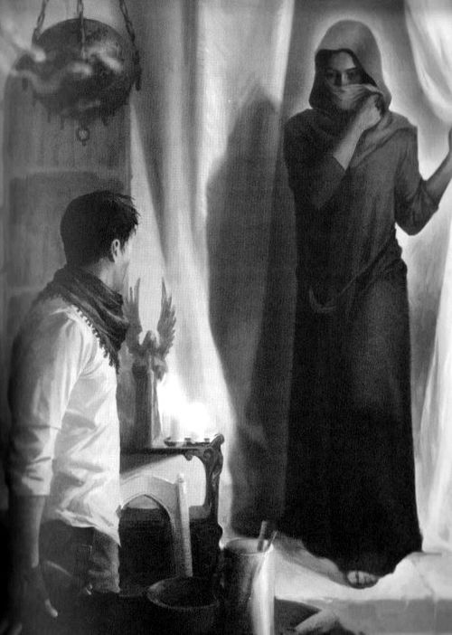

# 0590 尔达 Erda

精校状态：中文行文已逐段精校，部分术语仍为暂定

分类：人类帝国

原文来源：https://www.bilibili.com/opus/1052973780250394643

原作者：帝国神选罐头

原文时间：2025年04月07日 13:16

[返回分类目录](目录.md) · [全书目录](../../目录.md)

<!-- A0590-B0001 -->
**英文原文**

Erda is a Perpetual that is considered to be the most powerful of her kind, after the Emperor.

<!-- /A0590-B0001 -->

<!-- A0590-B0002 -->

原译文

尔达是一个永生者，被认为是她同类中最强大的，仅次于帝皇。

**校订译文**

尔达是一名永生者，被认为是同类中仅次于帝皇的强者。

<!-- /A0590-B0002 -->

<!-- A0590-B0003 图片 -->

<!-- A0590-B0004 -->

原译文

Erda (right) and John Grammaticus 尔达（右侧）与约翰·格拉马迪库斯

**校订译文**

Erda (right) and John Grammaticus 尔达（右侧）与约翰·格拉马迪库斯

<!-- /A0590-B0004 -->

<!-- A0590-B0005 -->
## History 历史

<!-- /A0590-B0005 -->

<!-- A0590-B0006 -->
**英文原文**

Erda met the Emperor in Terra's ancient past, when he was a warlord king known as Neoth in the age of the First Cities. At that time, the Emperor was already shepherding Mankind into the path that would lead to the creation of the Imperium. Erda grew to adore the Emperor and she became one of the many Perpetuals that aided him in his task. In time, though, the Emperor's arrogance and the risks he took to accelerate Mankind's future caused most of the Perpetuals to leave him. A few like Erda and the Sigillite stayed by his side, but the departures drove the Emperor to begin creating loyal artificial Perpetuals to ensure his plan would succeed. This led to the beginning of the Primarchs' creation, which both Erda and Astarte aided with. As the project began, Erda's skills as a geneticist greatly aided the Emperor, but he later also required her rare gene-stock for the Primarchs to be born. Combining Erda's genes with the Emperor's resulted in the birth of the Primarchs (making Erda functionally their mother in the same way the Emperor is their father), but Erda was prevented from taking part in their lives as the Emperor prepared them for the Great Crusade. She despaired at the bitter future the Emperor had planned for them, with the Primarchs forcing humanity to claim the galaxy, and she tried to save her sons from him. While they were still infants, Erda caused the creation of a warp vortex which scattered the Primarchs across the galaxy, and then went into hiding for many years. According to Erebus, Erda was unwittingly manipulated by the chaos gods into fulfilling their agenda. While the Emperor raged at her betrayal, he never sought to retaliate against Erda even though he knew where she was.

<!-- /A0590-B0006 -->

<!-- A0590-B0007 -->

原译文

尔达在泰拉的古代遇到了帝皇，当时他是首城时代被称为尼奥斯的军阀国王。当时，帝皇已经带领人类走上了建立帝国的道路。尔达越来越崇拜帝皇，她成为帮助他完成任务的众多永生者之一。然而，随着时间的推移，帝皇的傲慢和他为加速人类的未来而冒的风险导致大多数永生者离开了他。像尔达和掌印者这样的少数人留在了他的身边，但这些离开的人促使帝皇开始制造忠诚的人造永生者，以确保他的计划取得成功。这导致了创造原体的开始，尔达和阿斯塔特都给予了帮助。随着项目的开始，尔达作为一名遗传学家的技能极大地帮助了帝皇，但后来他也需要她稀有的基因才能让原体诞生。将尔达的基因与帝皇的基因结合，导致了原体的诞生（使尔达在功能上成为他们的母亲，就像帝皇是他们的父亲一样），但尔达被阻止参与他们的生活，因为帝皇为他们准备了大远征。她对帝皇为他们计划的痛苦未来感到绝望，因为原体们迫使人类占领银河系，她试图从他手中拯救她的儿子。当他们还是婴儿的时候，尔达制造了一个亚空间漩涡，将原体分散在整个河系中，然后躲藏了很多年。根据艾瑞巴斯的说法，尔达在不知不觉中被混沌诸神操纵，以实现他们的计划。虽然帝皇对她的背叛大发雷霆，但他从未试图报复尔达，即使他知道她在哪里。

**校订译文**

在泰拉的远古、最初城市兴起的时代，尔达遇见了名叫尼欧斯的军阀君王——后来的帝皇。彼时，他已在引导人类走向最终建立帝国的道路。尔达逐渐敬爱他，成为协助其事业的众多永生者之一。然而，帝皇的傲慢，以及为加速人类未来而不断冒险的做法，使大多数永生者相继离去，只有尔达、掌印者等少数人留下。众人的离开，促使帝皇制造忠诚的人造永生者，确保计划成功；原体工程由此开始，尔达与阿斯塔特均参与其中。尔达的遗传学专长帮助极大，后来，帝皇还需要她罕有的基因素材，使原体得以诞生。双方基因结合，创造了原体；因此，正如帝皇是父亲，尔达在这一意义上也是母亲。但帝皇要为大远征培养原体，阻止她参与儿子们的生活。想到这些孩子将驱使人类征服银河、承受预定的苦难命运，她陷入绝望，想将他们从帝皇手中救走。原体尚在襁褓时，尔达引发亚空间漩涡，将他们散落银河，此后隐居多年。艾瑞巴斯声称，她是在毫不知情中受到混沌诸神操纵，实现了它们的计划。帝皇虽因背叛震怒，却始终没有报复，即使知道她身在何处。

**校注：** Neoth沿588尼欧斯；原体散落与混沌操纵均按本篇版本，尤其后者明确是艾瑞巴斯的说法，不作无来源的客观结论。

<!-- /A0590-B0007 -->

<!-- A0590-B0008 -->
**英文原文**

By the time of the Siege of Terra, Erda was living in exile at Guelb, an ancient site in Mauritania close to her birthplace. Living with a group of servants and the Space Marine Leetu, she was eventually visited by John Grammaticus. Grammaticus sought Erda's help in getting into the Imperial Palace and had also arranged to rendezvous with Ollanius Persson at her home. Erda was shocked to hear that Oll had become involved in the affairs of the human race again, and expressed worry over his fate when he did not arrive. Though sympathetic to John's cause, she ultimately said she had no way to help him enter the Palace. Consulting the stars and her tarot, Erda eventually came to the conclusion that Persson would arrive on Terra two weeks after Grammaticus. She wished John luck in his endeavor to find Persson and gave him the services of Leetu.

<!-- /A0590-B0008 -->

<!-- A0590-B0009 -->

原译文

到泰拉围城时，尔达流亡在盖尔布，这是毛里塔尼亚靠近她出生地的一个古老遗迹。她与一群仆人和星际战士勒图住在一起，最终被约翰·格拉马迪库斯拜访。格拉马迪库斯寻求尔达的帮助进入皇宫，并安排在她家与欧兰尼奥斯·佩松会面。尔达听说欧尔又卷入了人类事务，感到震惊，并对他未到的命运表示担忧。虽然同情约翰的事业，但她最终表示无法帮助他进入皇宫。尔达观察了群星和她的塔罗牌，最终得出结论，佩松将在格拉马迪库斯两周后抵达泰拉。她祝愿约翰在寻找佩松的过程中好运，并为他提供了勒图的服务。

**校订译文**

泰拉围城时，尔达隐居于毛里塔尼亚古址盖尔布，离出生地不远。她与仆人及星际战士勒图同住，约翰·格拉马迪库斯后来登门，请她协助进入皇宫，也约定在此与欧良尼乌斯·佩松会合。听闻欧尔再度介入人类事务，尔达十分惊讶；他迟迟不至，又令她担忧。她虽同情约翰的目标，最终却表示无力帮他入宫。通过星象与塔罗，她推断佩松会在约翰抵达泰拉两周后到来。她祝约翰顺利找到欧尔，并派勒图相助。

<!-- /A0590-B0009 -->

<!-- A0590-B0010 -->
**英文原文**

During the later stages of the Siege of Terra, Erda was confronted in her home by Erebus, who offered her a chance to join Chaos. Erda refused, and Erebus summoned all four types of Greater Daemons against her. Erda revealed her true essence to be a tripartite being: a dark-skinned woman wielding a staff, a crone capable of freezing anything she touched, and youthful girl wielding a sickle. These forms unleashed a tornado of psychic energy, and after a vicious battle, struck down all four of the daemons. However, Erda was exhausted and badly wounded in the process. Erebus put his athame blade to her neck and again demanded she join Chaos and "worship" him. Erda spat in his face, which caused Erebus to stab her with his Athame blade and kill her.

<!-- /A0590-B0010 -->

<!-- A0590-B0011 -->

原译文

在泰拉围城战的后期阶段，尔达在家中遇到了艾瑞巴斯，艾瑞巴斯给了她加入混沌的机会。尔达拒绝了，艾瑞巴斯召集了所有四种类型的大魔来对付她。尔达揭示了她真正的本质是一个由三部分组成的存在：一个皮肤黝黑的女人挥舞着拐杖，一个能够冷冻她所接触到的任何东西的老太婆，还有一个挥舞着镰刀的年轻女孩。这些形态释放出一股灵能能量的龙卷风，经过一场激烈的战斗，摧毁了所有四个恶魔。然而，尔达在这个过程中筋疲力尽，受了重伤。艾瑞巴斯把他的剑放在她的脖子上，再次要求她加入混沌并“爱慕”他。尔达朝他脸上吐了一口唾沫，导致艾瑞巴斯用他的仪式匕首刺伤并杀死了她。

**校订译文**

围城后期，艾瑞巴斯来到尔达家中，提出让她投向混沌。遭拒后，他召来四种大魔各一头进攻。尔达显露三位一体的真身：持杖的深肤色女子、能冻结所触之物的老妇，以及持镰少女。三种形态掀起灵能风暴，激战后斩灭四头恶魔，但她也精疲力竭、身负重伤。艾瑞巴斯将仪式之刃抵住她的脖颈，再次逼她归附混沌并“崇拜”自己。尔达啐在他脸上，他便挥刃刺杀了她。

**校注：** four types结合后文all four明确每类一头，共四头；worship是崇拜，不是爱慕。staff按持杖，不认定行走拐杖。

<!-- /A0590-B0011 -->

<!-- A0590-B0012 -->
## Trivia 琐事

<!-- /A0590-B0012 -->

<!-- A0590-B0013 -->
**英文原文**

The word Erda is an Old High German word for "Earth" (modern Standard High German: "Erde").

<!-- /A0590-B0013 -->

<!-- A0590-B0014 -->

原译文

尔达这个词是古高地德语中“地球”的意思（现代标准高地德语：“尔德”）。

**校订译文**

Erda在古高地德语中意为“大地”，对应现代标准德语Erde。

**校注：** 词源保持拉丁字母拼写，不将Erde音译成尔德；Earth在词源语境优先大地。

<!-- /A0590-B0014 -->

本篇核心术语与暂定项

以下列出本篇出现的英文原形及核心术语表用词。同形词可能指不同对象，具体词义以本篇正文和校注为准；单复数、别名和仅见于图注的名称可能尚未列入。完整候选见[术语表](../../术语表/双语术语候选.csv)。

| 英文 | 采用中文 | 状态 |
| --- | --- | --- |
| Warp | 亚空间 | 官方已核对 |
| Imperium | 帝国 | 暂定·简称 |
| Emperor | 帝皇 | 官方已核对 |
| Great Crusade | 大远征 | 暂定·官方待核 |
| Terra | 泰拉 | 暂定·官方待核 |
| Erebus | 艾瑞巴斯 | 暂定·官方待核 |
| Perpetual | 永生者 | 暂定·官方待核 |
| John Grammaticus | 约翰·格拉马迪库斯 | 暂定·官方待核 |
| Ollanius Persson | 欧良尼乌斯·佩松 | 官方词根参考·全名待核 |
| Erda | 尔达 | 暂定·官方待核 |
| Leetu | 勒图 | 暂定·官方待核 |
| Ancient | 旗手 | 官方已核对 |
| The Sigillite | 掌印者 | 暂定·官方待核 |
| The Primarchs | 原体 | 暂定·官方待核 |
| Space Marine | 星际战士 | 暂定·官方待核 |
| athame | 仪式之刃 | 暂定·官方待核 |
| Neoth | 尼欧斯 | 暂定·官方待核 |
| Guelb | 盖尔布 | 暂定·官方待核 |
| Touched | 受触者 | 暂定·官方待核 |

