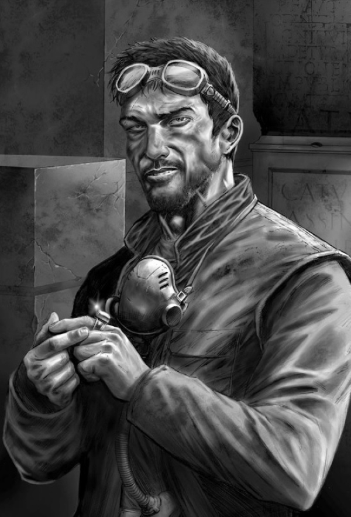

# 0592 约翰·格拉马迪库斯 John Grammaticus

精校状态：中文行文已逐段精校，部分术语仍为暂定

分类：人类帝国

原文来源：https://www.bilibili.com/opus/1070767267094986752

原作者：帝国神选罐头

原文时间：2025年05月25日 12:03

[返回分类目录](目录.md) · [全书目录](../../目录.md)

<!-- A0592-B0001 -->
**英文原文**

John Grammaticus was an enigmatic human psyker who served as an agent of a xenos organization known as the Cabal in the latter days of the Great Crusade. Among the powers he wielded was the ability to understand and speak any language and identify where a speaker came from based on how they spoke; he claimed there was not a language that he could not master.

<!-- /A0592-B0001 -->

<!-- A0592-B0002 -->

原译文

约翰·格拉马迪库斯是一位神秘的人类灵能者，在大远征的后期担任一个名为密会的异型组织的特工。他所拥有的能力之一是能够理解和说出任何语言，并根据说话者的说话方式确定他们来自哪里；他声称没有一门语言是他不能掌握的。

**校订译文**

约翰·格拉马迪库斯是神秘的人类灵能者，大远征末期曾为异形组织“密教”效力。他能理解、说出任何语言，还能从口音和说话方式判断对方来自何处；他自称没有学不会的语言。

<!-- /A0592-B0002 -->

<!-- A0592-B0003 图片 -->

<!-- A0592-B0004 -->

原译文

John Grammaticus 约翰·格拉马迪库斯

**校订译文**

John Grammaticus 约翰·格拉马迪库斯

<!-- /A0592-B0004 -->

<!-- A0592-B0005 -->
## History 历史

<!-- /A0592-B0005 -->

<!-- A0592-B0006 -->
**英文原文**

Grammaticus had been an officer of the Caucasian Levvies, a great army that had served under the Emperor during the Unification Wars on Terra. During a victory ceremony after defeating the forces of the Panpacific Empire, Grammaticus briefly met the Emperor, who recognized his psyker abilities and offered to speak further to "consider the options available to beings like us." Before they could have that meeting, Grammaticus was killed at Anatol Hive. The eldar Autarch Slau Dha brought Grammaticus back to life, gave him the ability to reincarnate as a Perpetual, and put him into service in the Cabal. At one point, Grammaticus spent eighteen years in an insane asylum.

<!-- /A0592-B0006 -->

<!-- A0592-B0007 -->

原译文

格拉马迪库斯曾是高加索征召兵的一名军官，这是一支在统一战争期间在帝皇手下服役的伟大军队。在击败泛太平洋帝国军队后的胜利仪式上，格拉马迪库斯短暂地会见了帝皇，帝皇认识到了他的灵能者能力，并提出进一步发言，以“考虑像我们这样的生物可用的选择”。在他们举行那次会面之前，格拉马迪库斯在阿纳托尔巢都被杀。灵族司战斯兰·达使格拉马迪库斯复活，赋予他转生为永生者的能力，并让他为密会服务。格拉马迪库斯一度在精神病院度过了18年。

**校订译文**

格拉马迪库斯曾是高加索征召军的军官，这支大军在泰拉统一战争中为帝皇作战。击败泛太平洋帝国后的一场庆典上，他短暂见到帝皇。帝皇察觉其灵能资质，提议日后详谈，探讨“像我们这样的存在有哪些选择”。但尚未赴约，约翰便死于阿纳托尔巢都。灵族司战斯劳·达将他复活，赋予其永生者般反复重生的能力，让他为密教服务。他还曾在精神病院度过十八年。

<!-- /A0592-B0007 -->

<!-- A0592-B0008 -->
### Agent of the Cabal 密教特工

原题：Agent of the Cabal 密会代理

<!-- /A0592-B0008 -->

<!-- A0592-B0009 -->
**英文原文**

A thousand years later, on the eve of the Heresy, the Cabal dispatched Grammaticus to suborn the Astartes Alpha Legion to their cause. The Cabal had foreseen the treason of Horus and the impending civil war that would result, and believed that the Alpha Legion and its primarch Alpharius had a great part to play in that coming war. To that end, Grammaticus infiltrated the Geno Five-Two Chiliad, an army in the 670th Expedition Fleet, under the guise of intelligence officer Konig Heniker. He also borrowed identities from other dead officers in order to avert suspicion.

<!-- /A0592-B0009 -->

<!-- A0592-B0010 -->

原译文

一千年后，在叛乱前夕，密会派遣格拉马迪库斯为他们的事业收买阿斯塔特阿尔法军团。密会预见到了荷鲁斯的背叛和即将到来的内战，并相信阿尔法军团及其原体阿尔法瑞斯在即将到来的战争中发挥了重要作用。为此，格拉马迪库斯以情报官员柯尼希·赫尼克的名义潜入了第670远征舰队的基诺52千连团军队。他还借用了其他已故军官的身份，以避免被怀疑。

**校订译文**

一千年后、叛乱前夕，密教派约翰拉拢阿尔法军团。它们预见了荷鲁斯背叛及随后的内战，认为阿尔法军团与原体阿尔法瑞斯将发挥关键作用。约翰因此冒充情报官柯尼希·赫尼克，潜入第670远征舰队的基诺五二千连团，也借用其他阵亡军官的身份掩人耳目。

<!-- /A0592-B0010 -->

<!-- A0592-B0011 -->
**英文原文**

Eventually, he came to the notice of Alpharius, who captured and questioned him of the Cabal and its intentions. After following Grammaticus's advice to abandon the field on Nurth, which was shortly after consumed by a Black Cube, Alpharius brought his fleet to 42 Hydra Tertius, known to the Cabal as "Eolith," to meet with Grammaticus's masters. In a carefully planned deception, Alpharius used Grammaticus to turn the tables on the Cabal, so that he could meet with them from a position of strength. Grammaticus had been shown what Alpharius and his twin, Omegon, would later see: if Horus was allowed to win the Heresy, the fragment of nobility in his soul would lead to Armageddon - a bloody civil war that would wipe out mankind in two to three generations. This would also wipe out the Dark Gods as well, as they were heavily invested in humanity, thus preserving the galaxy at the cost of the human species. But if the Emperor was successful, stagnation would grip the Imperium; within ten to twenty thousand years, Chaos would consume the entire galaxy.

<!-- /A0592-B0011 -->

<!-- A0592-B0012 -->

原译文

最终，他引起了阿尔法瑞斯的注意，阿尔法瑞斯抓住了他，并向他询问密会及其意图。在遵循格拉马迪库斯的建议放弃努斯的领地后不久，努斯被一个黑色立方体吞噬，阿尔法瑞斯带着他的舰队来到42九头蛇三号，密会称之为“始石器”，与格拉马迪库斯的主人会面。在一次精心策划的骗局中，阿尔法瑞斯利用格拉马迪库斯扭转了密会的局面，这样他就可以从有利的位置与他们会面。格拉马迪库斯已经看到了阿尔法瑞斯和他的双胞胎兄弟欧米岗后来会看到的情况：如果允许荷鲁斯赢得叛乱，他灵魂中的崇高碎片将导致世界末日 — 一场血腥的内战，将在两到三代人内消灭人类。这也将消灭黑暗诸神，因为他们在人类身上投入了大量资源，从而以人类为代价保护了银河系。但如果帝皇成功了，帝国将陷入停滞；在一万到两万年内，混沌将吞噬整个宇宙。

**校订译文**

阿尔法瑞斯最终注意到约翰，将其抓获，审问密教及其意图。听取约翰建议后，军团撤出努尔特；不久，该世界便遭黑色立方体吞没。阿尔法瑞斯随即率舰队前往42九头蛇三号——密教称其为“厄奥利斯”——会见约翰的主人。他以精心设计的欺骗反客为主，使自己能占据优势，与密教交涉。约翰此前见过一番预示，阿尔法瑞斯与孪生兄弟欧米伽后来也将看到：若荷鲁斯获胜，灵魂中残存的高贵将引发末日般的血腥内战，两三代内灭绝人类；黑暗诸神与人类牵连过深，也将随之消亡，银河因而获救。若帝皇获胜，帝国则会停滞，一万至两万年内，混沌将吞噬整个银河。

**校注：** 密教两种未来为预见与主张，不作为已证实历史规律；galaxy原译宇宙扩大范围，修银河。 Omegon与715人物专篇统一。

<!-- /A0592-B0012 -->

<!-- A0592-B0013 -->
**英文原文**

As the Heresy spread to Calth, John contacted a former colleague there, Oll Persson, through a dream. Trying to convince him to help, Grammaticus showed him a vision of the final battle of the Heresy, Horus standing over Sanguinius's body. The Alpha Legion was set on its path to join with Horus. Believing that he had put into motion the extinction of his own species (or so he thought), Grammaticus threw himself out an airlock of a Cabal vessel, hoping that this death would be his last.

<!-- /A0592-B0013 -->

<!-- A0592-B0014 -->

原译文

随着叛乱传播到考斯，约翰通过一个梦联系了那里的前战友欧尔·佩松。为了说服他帮忙，格拉马迪库斯向他展示了叛乱最后一战的景象，荷鲁斯站在圣吉列斯的尸体上。阿尔法军团踏上了与荷鲁斯会合的道路。格拉马迪库斯相信他已经开启了自己物种的灭绝（至少他是这么认为的），于是他把自己从密会舰船的气闸中扔了出来，希望这次死亡是他的最后一次。

**校订译文**

战火蔓延至考斯后，约翰在梦中联络旧日同伴欧尔·佩松，展示叛乱终战的幻景——荷鲁斯站在圣吉列斯遗体旁——试图求得协助。阿尔法军团此时已走上追随荷鲁斯的道路。约翰自认促成了本族灭绝，从密教舰船气闸中跃入虚空，盼望这回能真正死去。

**校注：** standing over尸体上方俯视，不是脚踩尸体。

<!-- /A0592-B0014 -->

<!-- A0592-B0015 -->
**英文原文**

However, Grammaticus was revealed to be a Perpetual and thus survived his suicide. Eventually taking the guise of an archaeologist named Caeren Sebaton, during the Horus Heresy Grammaticus discovered the existence of the mysterious artifact known as the Fulgurite. Grammaticus set out to Traois to retrieve it for his own ends. However he had been tracked by Word Bearers led by Dark Apostle Valdrekk Elias, who had been tasked by Erebus to retrieve the same artifact. Grammaticus was only saved by the intervention of Pyre Guard Captain Artellus Numeon and his surviving Battle-Brothers, and together the two eventually managed to obtain the Fulgurite. However at this point Grammaticus betrayed Numeon, using a Digital Weapon to blind the Astartes and take the Fulgurite for himself. Grammaticus was then confronted by Elias, who put a Bolt Pistol round into Numeon and demanded the Fulgurite be handed over to him so that he may ascend to Daemonhood. Yet Grammaticus was again saved, this time by Erebus who himself stepped through a Warp Portal and confronted Valdrek, killing the Dark Apostle for attempting to use the Fulgurite for his own plans. Mysteriously, Erebus then instructed Grammaticus to take the Fulgurite and leave Traois, which he did unmolested. After leaving Traois, Grammaticus was again contacted by the Cabal and instructed to head to Macragge with the Fulgurite. There, he was to meet another Primarch and then use the Fulgurite to kill Vulkan. The Cabal promised that once Grammaticus had accomplished this task, he would be free of his obligations to the Cabal forever.

<!-- /A0592-B0015 -->

<!-- A0592-B0016 -->

原译文

然而，格拉马迪库斯被发现是一个永生者，因此在自杀后幸存下来。最终，在荷鲁斯叛乱时期，格拉马迪库斯伪装成一位名叫卡伦·塞巴顿的考古学家，发现了被称为雷击石的神秘神器的存在。格拉马迪库斯出发去特洛伊斯取回它，以达到自己的目的。然而，他被黑暗使徒瓦尔德鲁克·伊莱亚斯领导的怀言者追踪，后者被艾瑞巴斯派去取回同样的神器。格拉马迪库斯只有在火龙卫队连长阿泰勒斯·努梅昂和他幸存的战斗兄弟的干预下才得以幸存，两人最终共同获得了雷击石。然而，在这一点上，格拉马迪库斯背叛了努梅昂，使用指环武器使阿斯塔特失明，并将雷击石据为己有。格拉马迪库斯随后与伊莱亚斯对峙，伊莱亚斯向努梅昂发射了一枚爆矢手枪子弹，并要求将雷击石交给他，以便他可以升格为魔裔。然而，格拉马迪库斯再次得救，这一次是艾瑞巴斯，他自己穿过亚空间传送门，与瓦尔德鲁克对峙，杀死了试图将雷击石用于自己计划的黑暗使徒。艾瑞巴斯随后神秘地指示格拉马迪库斯带走雷击石，离开特洛伊斯，他没有受到干扰。离开特洛伊斯后，格拉马迪库斯再次被密会联系，并被指示与雷击石一起前往马库拉格。在那里，他将会见另一位原体，然后利用雷击石杀死沃坎。密会承诺，一旦格拉马迪库斯完成了这项任务，他将永远摆脱对密会的义务。

**校订译文**

然而，永生者之身让约翰在自杀后复生。他后来假扮考古学家卡伦·塞巴顿，得知神秘遗物“雷击石”的存在，前往特洛伊斯，准备据为己用。黑暗使徒瓦尔德鲁克·伊莱亚斯奉艾瑞巴斯之命取同一遗物，率怀言者一路追踪。烈焰守卫连长阿泰勒斯·努梅昂与幸存战斗兄弟救下约翰，两人最终取得雷击石。约翰却随即背叛，以指环武器弄瞎努梅昂，夺走遗物。伊莱亚斯出现，用爆矢手枪击中努梅昂，逼约翰交出雷击石，企图借其升魔。此时，艾瑞巴斯亲自穿过亚空间门，杀死擅作打算的伊莱亚斯，再救约翰一次。他令人费解地吩咐约翰带石离开，约翰便未受阻拦地撤出特洛伊斯。密教随后联系他，命其携石前往马库拉格，会见另一名原体，再以雷击石杀死沃坎，并承诺完成后便永远解除他的效力义务。

**校注：** Valdrekk/Valdrek同一黑暗使徒异写；被爆矢击中者按原文Numeon，不因约翰主视角偷换。

<!-- /A0592-B0016 -->

<!-- A0592-B0017 -->
**英文原文**

Shortly afterwards John traveled to Macragge with fellow Perpetual Damon Prytanis, where the duo planned to assassinate Vulkan. During a brief period when he was alone John was contacted by Eldrad Ulthran, who was revealed to be the mysterious voice he had heard on Traoris. Ulthran revealed to John that he opposed the Cabal's aims and that their belief that Horus would usher in Chaos's ultimate demise was not set in stone. He believed that humanity were meant to be the firebreak against Chaos, and that without them the Eldar would fall and the galaxy shortly afterwards. He offered John a way to leave the Cabal and a chance to stop being a traitor to his own race, as John had begun to consider himself. Re-joining with Damon the Perpetuals joined forces with Barthusa Narek who had tracked John to Ultramar to take back the Fulgurite, instead he agreed to allow them to kill Vulkan with it if they would give it to him afterwards so that he might kill Lorgar. During the crisis that followed the trio interrupted the fight between Konrad Curze and Vulkan with the intent of ending him. Deciding at the last moment to side with his own race John used the Fulgurite to heal Vulkan of the madness that had consumed him, though it left him in a death-like coma and reduced John from Perpetual to an ordinary mortal.

<!-- /A0592-B0017 -->

<!-- A0592-B0018 -->

原译文

不久之后，约翰和另一个名叫达蒙·普莱塔尼斯的人前往马库拉格，两人计划在那里暗杀沃坎。在约翰独自一人的短暂时期，埃尔德拉德·乌索然联系了他，乌索然被发现是他在泰拉奥里斯岛上听到的神秘声音。乌索然向约翰透露，他反对密会的目标，他们相信荷鲁斯会带来混沌的最终灭亡，但这并不是板上钉钉的。他相信，人类注定是对抗混沌的防火带，没有他们，灵族就会倒下，银河系也会很快灭亡。他为约翰提供了一种离开密会的方法，以及一个停止背叛自己种族的机会，因为约翰已经开始考虑自己了。与达蒙重新联手，永生者与巴图萨·纳瑞克联手，后者曾追踪约翰到奥特拉玛夺回雷击石，相反，他同意允许他们用它杀死沃坎，如果他们后来把它交给他，这样他就可以杀死珞珈。在随后的危机中，三人打断了康拉德·科兹和沃坎之间的战斗，意图终结他。在最后一刻，约翰决定站在自己的种族一边，用雷击石治愈了吞噬他的疯狂的沃坎，尽管这让他陷入了死亡般的昏迷，并使约翰从永生者变成了一个普通的凡人。

**校订译文**

不久，约翰与同为永生者的达蒙·普莱塔尼斯前往马库拉格，筹划刺杀沃坎。约翰短暂独处时，艾尔德拉德·乌瑟兰联系了他；原来，他就是约翰在特拉奥里斯听见的神秘声音。艾尔德拉德反对密教，认为荷鲁斯获胜便能终结混沌的预言并非定局。人类应是阻隔混沌蔓延的防火带，一旦人类灭亡，灵族乃至银河都会随之沦陷。他给约翰一个脱离密教、不再背叛本族的机会——约翰已开始将自己视为叛徒。此后，约翰与达蒙会合，又与追踪雷击石而来的巴图萨·纳瑞克合作。纳瑞克答应让二人先以石杀死沃坎，条件是事后交给自己，用它杀珞珈。危机中，三人闯入科兹与沃坎的战斗，准备杀死后者。最后一刻，约翰选择自己的种族，以雷击石治愈沃坎的疯狂，却使原体陷入如死般的昏迷，自己也失去永生，成为普通凡人。

**校注：** Traoris疑前文Traois异拼，均按特洛伊斯；原译泰拉奥里斯岛添加岛屿属性。陷入昏迷的是沃坎，失去永生的是约翰，分别写明。 Traoris与核心地名定译统一。

<!-- /A0592-B0018 -->

<!-- A0592-B0019 -->
**英文原文**

John later woke up on an unknown Craftworld being tended to by Eldar. Damon informed him of his new mortal status and that his next death would be permanent, and that the Cabal had one final mission for him. And a way of ensuring that he would do it.

<!-- /A0592-B0019 -->

<!-- A0592-B0020 -->

原译文

约翰后来醒来，发现正在一个未知的方舟世界被照料。达蒙告诉他自己的新身份，他的下一次死亡将是永久性的，密会对他有一个最后的任务。以及一种确保他会这样做的方法。

**校订译文**

约翰随后在不知名的方舟世界醒来，正由灵族照料。达蒙告知，他如今已是凡人，下次死亡便无法挽回；密教还有最后一项任务交给他，也有办法确保他服从。

<!-- /A0592-B0020 -->

<!-- A0592-B0021 -->
**英文原文**

John was effectively taken prisoner by Damon Prytanis, held in an Eldar facility that created illusions to resemble a farm. However the facility was eventually infiltrated by Eldrad Ulthran and Barthusa Narek who after a struggle slew Prytanis with a piece of Fulgurite. Eldrad asked John where Ollanius Persson was, to which the psyker answered that he did not know. The Farseer and Narek then took Grammaticus and stepped into a Webway Portal.

<!-- /A0592-B0021 -->

<!-- A0592-B0022 -->

原译文

约翰实际上被达蒙·普莱塔尼斯俘虏，关押在灵族的一个设施里，该设施制造了类似农场的幻觉。然而，该设施最终被埃尔德拉德·乌索然和巴图萨·纳瑞克渗透，他们在一场战斗后用一块雷击石杀死了普莱塔尼斯。埃尔德拉德问约翰欧兰尼奥斯·佩松在哪里，灵能者回答说他不知道。先知和纳瑞克随后带着格拉马迪库斯走进了一个网道门户。

**校订译文**

实际上，约翰成了达蒙的囚犯，被关在一处以幻象伪装成农场的灵族设施。艾尔德拉德与巴图萨·纳瑞克后来潜入，交战后用雷击石碎片杀死达蒙。大先知询问欧良尼乌斯·佩松的下落，约翰答称不知。艾尔德拉德与纳瑞克随后带他走入网道门。

<!-- /A0592-B0022 -->

<!-- A0592-B0023 -->
### Argonaut 阿尔戈英雄

<!-- /A0592-B0023 -->

<!-- A0592-B0024 -->
**英文原文**

Using a pair of Eldar scissors that could cut through space and time that were given to him by Eldrad, John Grammaticus appeared near the ruins of Ababa Hive on Terra during the Siege. He made his way across the devastated world, eventually reaching Guelb in Mauritania. This was the home of the powerful Perpetual Erda, who was at first dismissive of John and his goal of reaching the interior of the Imperial Palace. John knew he could not defeat Horus, but thought he could save Humanity by reaching the Emperor and stopping His ambitions. Erda was shocked to discover that John had recruited Oll Persson to his cause but told John he had not yet arrived. John became worried, as he had plan to rendezvous at Erda's home with Persson. Erda later was able to determine that Persson was due to arrive at Terra two weeks from John, and gave him her Space Marine prototype protector Leetu to aid him in his quest to find Oll.

<!-- /A0592-B0024 -->

<!-- A0592-B0025 -->

原译文

在围城期间，约翰·格拉马迪库斯使用埃尔德拉德给他的一把可以剪断空间和时间的灵族剪刀，出现在泰拉上的亚贝巴巢都废墟附近。他穿越了满目疮痍的世界，最终到达了毛里塔尼亚的古尔布。这是强大的永生者尔达的家，她起初对约翰和他进入皇宫内部的目标不屑一顾。约翰知道他无法击败荷鲁斯，但认为他可以通过接触帝皇并阻止他的野心来拯救人类。尔达震惊地发现，约翰已经招募了欧兰尼奥斯·佩松加入他的事业，但他告诉约翰，他还没有到达。约翰开始担心了，因为他计划在尔达家和佩松会合。尔达后来确定佩松将在两周后从约翰抵达泰拉，并将她的原型原型星际战士保护者勒图交给了他，以帮助他寻找欧尔。

**校订译文**

围城期间，约翰使用艾尔德拉德赠予、能够剪开时空的灵族剪刀，来到泰拉亚贝巴巢都废墟附近。他穿越残破世界，抵达毛里塔尼亚的盖尔布，找到强大永生者尔达。她起初不以为意，也不看好他进入皇宫的目标。约翰知道自己敌不过荷鲁斯，却认为只要见到帝皇、阻止其野心，仍能拯救人类。尔达得知欧尔也已加入，十分惊讶，却告知约翰他尚未抵达。约翰原计划在此会合，因而忧心。尔达推断欧尔会晚两周抵达泰拉，并派自己的原型星际战士护卫勒图，协助约翰寻人。

<!-- /A0592-B0025 -->

<!-- A0592-B0026 -->
**英文原文**

John and Leetu managed to track down John and his group of survivors from Calth to Hatay-Antakya Hive in the East Phoenician Wastes. However the group were now in the clutches of "paradise", a dream-farm of the Emperor's Children. After attempting to commune with Oll psychically for a time, John and Leetu found themselves trapped within the Emperor's Children domain as well. Within the dream-realm, John witnessed Oll's memory and learned of his past as the Emperor's Warmaster in Terra's ancient history. Ultimately, the group were aided by Actaea and a Space Marine identifying himself as Alpharius. John plead with Oll to not accept their aid, stating Actaea wreaked of Chaos. However John decided to let the new duo accompany them on their quest.

<!-- /A0592-B0026 -->

<!-- A0592-B0027 -->

原译文

约翰和勒图设法找到了约翰和他的幸存者小队，从考斯到东腓尼基荒原的哈塔伊-安塔基亚巢都。然而，这群人现在已经落入了“天堂”的魔爪，这是帝皇之子的梦想农场。在尝试与欧尔进行一段时间的灵能交流后，约翰和勒图发现自己也被困在了帝皇之子的领地内。在梦境中，约翰目睹了欧尔的记忆，并了解了他在泰拉古代历史上作为帝皇的战帅的过去。最终，该小队得到了阿克泰娅和一名自称为阿尔法瑞斯的星际战士的帮助。约翰恳求欧兰不要接受他们的援助，称阿克泰娅为混沌。然而，约翰决定让这对新人陪伴他们踏上这段旅程。

**校订译文**

约翰与勒图追查从考斯逃出的欧尔一行，来到腓尼基东部荒原的哈塔伊·安塔基亚巢都。幸存者已被囚在帝皇之子的梦境农场“天堂”中。约翰尝试心灵联络欧尔一段时间后，自己与勒图也陷入其中。他在梦境中见到欧尔的记忆，得知老友曾在远古泰拉担任帝皇战帅。众人最终获阿克泰及一名自称阿尔法瑞斯的星际战士帮助。约翰劝欧尔不要接受，称阿克泰浑身透着混沌气息；最后，这两人仍加入队伍。

**校注：** 首句John and Leetu追踪John明显人名误置；据幸存者身份与589对应段，按欧尔。末句又写John同意，与前文反对及589欧尔同意冲突，译文中性写二人加入，并保留英文供核。wreaked疑reeked。

<!-- /A0592-B0027 -->

<!-- A0592-B0028 -->
**英文原文**

Together, the group now dubbed by John as the "Argonauts" acquired an Arvus Lighter and flew to the Imperial Palace across Terra's ravaged landscape. However as they crossed the frontline, they were shot down and crashed into the Inner Palace. John and the others were guided by "Alpharius" into hidden passages with the intent to reach the Sanctum Imperialis. Within the depths of a secret entrance into the Palace, John learned that this "Alpharius" was actually Ingo Pech, who plead with John for help to free him from the control of Actae, who intended to use him to her own ends. During their discussion, John was saved by Mathias Herzog by Pech.

<!-- /A0592-B0028 -->

<!-- A0592-B0029 -->

原译文

现在被约翰称为“阿尔戈英雄”的这群人一起获得了一架阿维鲁斯轻型运输艇，并穿过泰拉被破坏的景观飞往皇宫。然而，当他们越过前线时，他们被击落并撞向了内殿。约翰和其他人被“阿尔法瑞斯”引导进入隐藏的通道，意图到达帝国圣殿。在进入宫殿的秘密入口深处，约翰得知这个“阿尔法瑞斯”实际上是因格·佩克，他恳求约翰帮助他摆脱阿克泰的控制，阿克泰打算利用他来达到自己的目的。在他们的讨论中，佩克让马蒂亚斯·赫尔佐格救下了约翰。

**校订译文**

约翰将队伍称为“阿尔戈英雄”。他们夺得一架阿维鲁斯轻型运输机，飞越残破泰拉，却在越过战线时被击落，坠入内宫。“阿尔法瑞斯”领众人沿密道前往帝国圣所。在秘密入口深处，约翰得知此人实为英戈·佩奇；他恳求约翰帮忙摆脱阿克泰的控制，以免再受其利用。交谈间，佩奇似乎从马蒂亚斯·赫尔佐格的威胁下救了约翰——此句原文施救关系残缺，仍待核实。

**校注：** 原末句saved by Mathias Herzog by Pech连用两个by。暂按佩奇从赫尔佐格手中救约翰，但在正文直接标待核，不将无证推断当确定事实。

<!-- /A0592-B0029 -->

<!-- A0592-B0030 -->
**英文原文**

John eventually neutralized Pech by attaching a motion-sensitive mine to the Marine as he confronted Actae about her plans. However thanks to Oll's defense of Actae, John decided to spare her but knew as long as Herzog was conditioned to obey the witch he was too dangerous to be allowed to continue. John vowed to one day return and free Pech, but for now the group left the immobilized Pech behind as they finally reached the Imperial Dungeon and were willingly detained by Custodes. Upon finally reaching the Golden Throne however, the group was met with Vulkan, as the Emperor had since departed to the Vengeful Spirit to fight Horus.

<!-- /A0592-B0030 -->

<!-- A0592-B0031 -->

原译文

约翰最终在星际战士与阿克泰就她的计划对峙时，将一枚动作感应地雷附在了星际战士身上，从而使佩克中立化。然而，由于欧尔为阿克泰辩护，约翰决定饶了她，但他知道只要赫尔佐格有条件服从女巫，他就太危险了，不能继续下去。约翰发誓有一天会回来并释放佩克，但现在，当他们最终到达帝国地牢并被禁军自愿拘留时，这群人把无法动弹的佩克留在了后面。然而，当他们最终登上黄金王座时，他们遇到了沃坎，因为帝皇已经离开前往复仇之魂号与荷鲁斯作战。

**校订译文**

约翰给佩奇装上一枚动作感应地雷，使他无法行动，并当面质问阿克泰的计划。欧尔为她辩护，约翰因而饶过她；但他仍认为，只要“赫尔佐格”受制于女巫的命令，就太过危险，不能继续同行。约翰许诺有朝一日回来释放佩奇，暂时将他留在原地。众人终于抵达帝国地牢，主动接受禁军拘押。然而，来到黄金王座前，见到的却是沃坎；帝皇已前往复仇之魂号，迎战荷鲁斯。

**校注：** 原句危险者名Herzog与前后被制住、获诺释放的Pech不一致，正文保留引号提示，未自行把两人合并；conditioning为预设服从控制，不是有条件地答应。

<!-- /A0592-B0031 -->

<!-- A0592-B0032 -->
**英文原文**

While briefly detained under Vulkan's orders, the group became separated from Imperial custody due to the Warp-madness spreading across Terra as the Siege entered its final stages. Following a mysterious spool of thread that John believed had been left behind by them in the future, they instead encountered Erebus. In the ensuing struggle, all of the group save John, Oll, and Leetu were slain while Actae was buried under rubble. John was badly injured in the fight, with his jaw and arm broken. Nonetheless, John and Leetu were able to convince the despondent Ollanius to continue on their quest. They eventually encountered the Emperor as He was about to fully transform into the Dark King, but Ollanius was able to talk his own friend down from the path to corruption. As the Emperor threw off the powers of the Warp, He let out a blast of energy that healed those nearby including John. However the Emperor ordered John and Ollanius to take up their spool of thread and retrace their steps in order to close the stable timeloop they had begun.

<!-- /A0592-B0032 -->

<!-- A0592-B0033 -->

原译文

虽然在沃坎的命令下被短暂拘留，但随着围城进入最后阶段，由于亚空间疯狂蔓延到泰拉，该组织与帝国的拘留分开。约翰认为他们在未来留下了一根神秘的线，于是他们遇到了艾瑞巴斯。在随后的战斗中，除了约翰、欧尔和勒图，所有人都被杀害，而阿克泰则被埋在瓦砾下。约翰在打斗中受了重伤，下巴和手臂都断了。尽管如此，约翰和勒图还是说服了沮丧的欧兰尼奥斯继续他们的探索。他们最终遇到了帝皇，他即将完全转变为黑暗之王，但欧兰尼奥斯能够说服自己的朋友远离腐化之路。当帝皇摆脱亚空间的力量时，他释放出一股能量，治愈了附近的人，包括约翰。然而，帝皇命令约翰和欧兰尼奥斯拿起他们的线轴，往回走，以结束他们已经开始的稳定的时间循环。

**校订译文**

众人依沃坎命令短暂受拘，但围城末期亚空间狂乱蔓延，使他们脱离帝国监管。他们循着一卷神秘细线前行，约翰相信那是未来的自己留下的路标，却遭遇艾瑞巴斯。战斗中，除约翰、欧尔和勒图外，同行者尽遭杀害，阿克泰则被埋在瓦砾下。约翰下颌、手臂俱断，仍与勒图一起劝失意的欧尔继续。众人终于遇见即将完全化为黑暗之王的帝皇，欧尔劝老友回头。帝皇舍弃亚空间力量时，爆发的能量治愈周围的人，约翰亦在其中。帝皇随后命他和欧尔带上细线，原路回溯，闭合已形成的稳定时间循环。

**校注：** 阿克泰被掩埋后再次施传送，原文未交代获救细节，不杜撰。

<!-- /A0592-B0033 -->

<!-- A0592-B0034 -->
**英文原文**

However while they undertook their task, Oll discovered that their shattered Athame blade had since been restored by the Emperor. Feeling that they needed to return to the Emperor's side immediately to give him the weapon, Oll ordered Actae to teleport he and John to Lupercal's Court. The act proved difficult, but the duo eventually emerged directly at the feet of Horus just as he stood over the defeated Emperor. Horrified by the monster before them, John was able to briefly stun Horus with a word of Enuncia he had gleamed from Oll's memories. Oll rushed to the Emperor's side and decided to stay behind to protect his old friend, but ordered John run. John was eventually convinced to flee back and continue their original task of closing their time loop.

<!-- /A0592-B0034 -->

<!-- A0592-B0035 -->

原译文

然而，当他们执行任务时，欧尔发现他们破碎的仪式之刃已经被帝皇修复了。感觉他们需要立即回到帝皇身边把武器交给他，欧尔命令阿克泰将他和约翰传送到卢佩卡尔王庭。事实证明，这一行为很困难，但当荷鲁斯站在战败的帝皇面前时，两人最终直接出现在荷鲁斯脚下。约翰被眼前的怪物吓坏了，他能够用欧尔记忆中闪现的暗言短暂地让荷鲁斯眩晕。欧尔冲到帝皇身边，决定留下来保护他的老朋友，但命令约翰逃跑。约翰最终被说服逃跑，继续完成他们最初的任务，即关闭时间循环。

**校订译文**

执行任务时，欧尔发现帝皇已修复断裂的仪式之刃，认为必须立即将武器送回，于是让阿克泰传送自己与约翰前往卢佩卡尔王庭。虽然困难，两人最终落在荷鲁斯脚下，眼前是被他击败的帝皇。约翰骇于怪物般的战帅，念出从欧尔记忆中学来的一句暗言，短暂将其震慑。欧尔奔至帝皇身旁，决定留下保护老友，命约翰逃走。约翰终于听从，回去完成闭合时间循环的使命。

**校注：** gleamed疑gleaned，指从欧尔记忆学来暗言，不是闪光。

<!-- /A0592-B0035 -->

<!-- A0592-B0036 -->
**英文原文**

After the Siege of Terra had been concluded, John is seen wandering space and time, leaving behind small knots of threads at specific locations in ancient Earth's history to ensure their future selves know the way. He uses a feather recovered from Sanguinius' corpse to jump between points.

<!-- /A0592-B0036 -->

<!-- A0592-B0037 -->

原译文

在泰拉围城结束后，人们看到约翰在空间和时间中游荡，在古代泰拉历史的特定位置留下了一小团线，以确保他们未来的自己知道路。他用从圣吉列斯尸体上找到的羽毛在两点之间跳跃。

**校订译文**

围城结束后，约翰继续穿行时空，在古代地球历史中的特定地点留下小小线结，保证未来的自己与同伴能够循路前进。他用从圣吉列斯遗体上拾得的羽毛，在各个时空点之间跳转。

**校注：** knots为线结，非一团线；jump between points为时空点，不强改成仅两个固定地点。

<!-- /A0592-B0037 -->

本篇核心术语与暂定项

以下列出本篇出现的英文原形及核心术语表用词。同形词可能指不同对象，具体词义以本篇正文和校注为准；单复数、别名和仅见于图注的名称可能尚未列入。完整候选见[术语表](../../术语表/双语术语候选.csv)。

| 英文 | 采用中文 | 状态 |
| --- | --- | --- |
| Eldar | 灵族 | 暂定·语境区分 |
| Psyker | 灵能者 | 官方已核对 |
| Bolt Pistol | 爆矢手枪 | 官方已核对 |
| Ultramar | 奥特拉玛 | 官方已核对 |
| Horus Heresy | 荷鲁斯之乱 | 官方已核对 |
| Warp | 亚空间 | 官方已核对 |
| Imperium | 帝国 | 暂定·简称 |
| Webway | 网道 | 暂定 |
| Farseer | 大先知 | 官方已核对 |
| Craftworld | 方舟世界 | 官方已核对 |
| History | 历史 | 编辑用语已统一 |
| Emperor | 帝皇 | 官方已核对 |
| Primarch | 原体 | 官方已核对 |
| Word Bearers | 怀言者 | 暂定·官方待核 |
| Dark Apostle | 黑暗使徒 | 官方已核对 |
| Emperor's Children | 帝皇之子 | 官方已核对 |
| Great Crusade | 大远征 | 暂定·官方待核 |
| Terra | 泰拉 | 暂定·官方待核 |
| Horus | 荷鲁斯 | 暂定·官方待核 |
| Erebus | 艾瑞巴斯 | 暂定·官方待核 |
| Vengeful Spirit | 复仇之魂号 | 暂定·官方待核 |
| Golden Throne | 黄金王座 | 暂定·官方待核 |
| Unification Wars | 统一战争 | 暂定·官方待核 |
| Perpetual | 永生者 | 暂定·官方待核 |
| Fulgurite | 雷击石 | 暂定·官方待核 |
| Cabal | 密教 | 暂定·官方待核 |
| John Grammaticus | 约翰·格拉马迪库斯 | 暂定·官方待核 |
| Ollanius Persson | 欧良尼乌斯·佩松 | 官方词根参考·全名待核 |
| Oll Persson | 欧尔·佩松 | 暂定·官方待核 |
| Erda | 尔达 | 暂定·官方待核 |
| Damon Prytanis | 达蒙·普莱塔尼斯 | 暂定·官方待核 |
| Vulkan | 沃坎 | 暂定·官方待核 |
| Protector | 守护者 | 暂定·官方待核 |
| Konrad Curze | 康拉德·科兹 | 暂定·官方待核 |
| Armageddon | 阿玛吉多顿 | 暂定·官方待核 |
| Calth | 考斯 | 暂定·官方待核 |
| Macragge | 马库拉格 | 暂定·官方待核 |
| Enuncia | 暗言 | 暂定·官方待核 |
| Geno Five-Two Chiliad | 基诺五二千连团 | 暂定·官方待核 |
| Master | 导师（审判庭职衔）／舰务官（舰员职务） | 语境定译·官方待核 |
| Mission | 教团／传教机构 | 暂定 |
| Leetu | 勒图 | 暂定·官方待核 |
| Ancient | 旗手 | 官方已核对 |
| Lupercal | 卢佩卡尔 | 暂定·官方待核 |
| Alpha Legion | 阿尔法军团 | 暂定·官方待核 |
| Artellus Numeon | 阿泰勒斯·努梅昂 | 暂定·官方待核 |
| Mathias | 马蒂亚斯 | 暂定·官方待核 |
| Ingo Pech | 英戈·佩奇 | 暂定·官方待核 |
| Barthusa Narek | 巴图萨·纳瑞克 | 暂定·官方待核 |
| Space Marine | 星际战士 | 暂定·官方待核 |
| Captain | 连长 | 暂定·官方待核 |
| Mortal | 凡人 | 暂定·官方待核 |
| Lorgar | 珞珈 | 暂定·官方待核 |
| Powers | 能天使 | 暂定·官方待核 |
| Alpharius | 阿尔法瑞斯 | 暂定·官方待核 |
| Omegon | 欧米伽 | 暂定·官方待核 |
| Actaea | 阿克泰 | 暂定·官方待核 |
| Mathias Herzog | 马蒂亚斯·赫尔佐格 | 暂定·官方待核 |
| Xenos | 异形 | 暂定·官方待核 |
| athame | 仪式之刃 | 暂定·官方待核 |
| Eldrad Ulthran | 艾尔德拉德·乌瑟兰 | 官方已核对 |
| Nurth | 努尔特 | 暂定·官方待核 |
| Eolith | 厄奥利斯 | 暂定·官方待核 |
| Slau Dha | 斯劳·达 | 暂定·官方待核 |
| Autarch | 司战 | 官方已核对 |
| Imperialis | 帝国徽记 | 暂定·官方待核 |
| Sanctum | 圣所星 | 暂定·官方待核 |
| Pech | 佩什 | 暂定·官方待核 |
| Sanctum Imperialis | 帝国圣所 | 暂定·官方待核 |
| Pyre Guard | 烈焰守卫 | 暂定·官方待核 |
| Dark King | 黑暗之王 | 暂定·官方待核 |
| Anatol Hive | 阿纳托尔巢都 | 暂定·官方待核 |
| Hatay-Antakya Hive | 哈塔伊·安塔基亚巢都 | 暂定·官方待核 |
| Actae | 阿克泰 | 暂定·官方待核 |
| Arvus Lighter | 阿维鲁斯轻型运输机 | 暂定·官方待核 |
| Guelb | 盖尔布 | 暂定·官方待核 |
| Caucasian Levvies | 高加索征召军 | 暂定·官方待核 |
| Konig Heniker | 柯尼希·赫尼克 | 暂定·官方待核 |
| 42 Hydra Tertius | 42九头蛇三号 | 暂定·官方待核 |
| Caeren Sebaton | 卡伦·塞巴顿 | 暂定·官方待核 |
| Traois | 特洛伊斯 | 暂定·官方待核 |
| Valdrekk Elias | 瓦尔德鲁克·伊莱亚斯 | 暂定·官方待核 |
| Ababa Hive | 亚贝巴巢都 | 暂定·官方待核 |
| The Weapon | 武器 | 暂定·官方待核 |
| Traoris | 特拉奥里斯 | 暂定·官方待核 |
| The Dark | 《黑暗》 | 暂定·官方待核 |
| Panpacific Empire | 泛太平洋帝国 | 暂定·官方待核 |
| Corruption | 腐败 | 暂定·官方待核 |
| Bolt | 爆矢 | 暂定·官方待核 |
| Lupercal's Court | 卢佩卡尔王庭 | 暂定·官方待核 |
| Imperial Dungeon | 帝国地牢 | 暂定·官方待核 |
| Inner Palace | 内殿 | 暂定·官方待核 |

