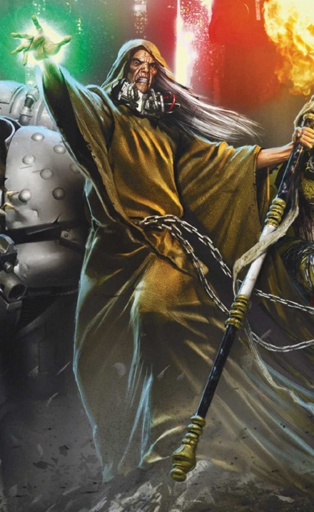
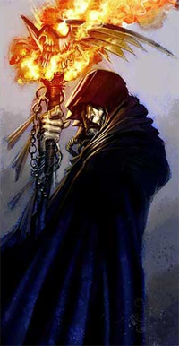
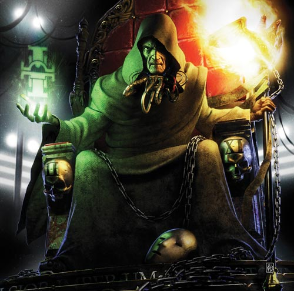
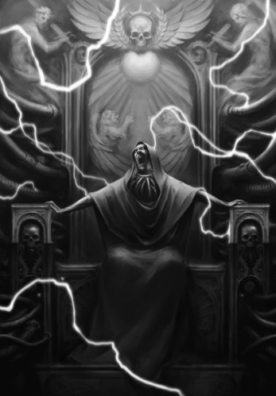
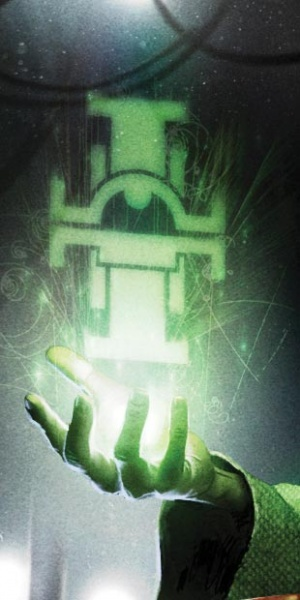

# 0593 掌印者马卡多 Malcador the Sigillite

精校状态：中文行文已逐段精校，部分术语仍为暂定

分类：人类帝国

原文来源：https://www.bilibili.com/opus/1055305556674215936

原作者：帝国神选罐头

原文时间：2025年04月13日 20:04

[返回分类目录](目录.md) · [全书目录](../../目录.md)

<!-- A0593-B0001 -->
**英文原文**

"I have created much for you, in your name. There would be no Imperium without my efforts."

<!-- /A0593-B0001 -->

<!-- A0593-B0002 -->

原译文

“我以你的名义，为你创造了许多东西。没有我的努力，就不会有帝国的存在。”

**校订译文**

“我以你的名义，为你创造了许多东西。没有我的努力，就不会有帝国的存在。”

<!-- /A0593-B0002 -->

<!-- A0593-B0003 -->
**英文原文**

Malcador the Sigillite, also known as Malcador the Hero by decree of the Emperor was the First Lord of Terra as well as the Grand Master of Assassins during the Horus Heresy. He was a powerful psyker who could communicate over long distances and wield immense power. He was a close adviser to the Emperor during the Unification Wars, and the man credited with founding the Administratum of Terra.

<!-- /A0593-B0003 -->

<!-- A0593-B0004 -->

原译文

掌印者马卡多，也被称为英雄马卡多，根据帝皇的命令，他是泰拉的第一领主，也是荷鲁斯叛乱时期的刺客大师。他是一名强大的灵能者，可以远距离交流，并拥有巨大的力量。在统一战争期间，他是皇帝的亲密顾问，也是建立泰拉行政机构的人。

**校订译文**

掌印者马卡多在荷鲁斯之乱时期担任泰拉第一领主与刺客庭大导师，后奉帝皇谕令尊为“英雄马卡多”。他是强大的灵能者，能够远距离心灵沟通，施展惊人力量。统一战争期间，他是帝皇的亲密顾问；泰拉内政部的建立，也被归功于他。

<!-- /A0593-B0004 -->

<!-- A0593-B0005 图片 -->

<!-- A0593-B0006 -->

原译文

Malcador the Sigillite 掌印者马卡多

**校订译文**

Malcador the Sigillite 掌印者马卡多

<!-- /A0593-B0006 -->

<!-- A0593-B0007 -->
### Biography 传记

<!-- /A0593-B0007 -->

<!-- A0593-B0008 -->
**英文原文**

The origins of Malcador remain a mystery, and are unknown save to the Emperor himself. According to Malcador himself, by the time of the Horus Heresy he was over 6,700 years old and remembers his date of birth to the second. Malcador was a surviving member of an ancient order known as The Sigillites, which sought to gather and preserve the greatest and most powerful artifacts in Human history. According to Jaghatai Khan the true identity of Malcador was discovered by Horus. Horus told the Khan that Malcador's original name was Brahm al-Khadour, a Perpetual known as a cursed wanderer. The Khan went on to say that Brahm al-Khadour had committed great atrocities during Old Night.

<!-- /A0593-B0008 -->

<!-- A0593-B0009 -->

原译文

马尔多的起源仍然是个谜，除了帝皇本人，其他人都不知道。据马尔多本人说，到荷鲁斯叛乱时代，他已经6700多岁了，还记得自己的出生日期。马卡多是一个名为掌印者的古老组织的幸存成员，该组织试图收集和保存人类历史上最伟大、最强大的遗物。根据察合台可汗的说法，马卡多的真实身份是由荷鲁斯发现的。荷鲁斯告诉可汗，马卡多的原名是布拉姆·阿尔·赫杜尔，一个被称为被诅咒的流浪者的永生者。可汗接着说，布拉姆·阿尔·赫杜尔在旧夜犯下了巨大的暴行。

**校订译文**

马卡多的来历仍是谜，唯有帝皇知晓。他自己说，荷鲁斯之乱时已有六千七百余岁，却仍记得精确到秒的出生时间。他是古老“掌印者”组织的幸存成员，这一组织搜集、保存人类历史上最伟大、最强大的遗物。察合台可汗曾说，荷鲁斯查出了马卡多的真名——布拉姆·阿尔·赫杜尔，一位被称为“受诅咒的流浪者”的永生者。按可汗转述，此人在旧夜犯下过严重暴行。

**校注：** to the second精确到秒，原漏译；真名及暴行来自可汗转述荷鲁斯的说法，保留双重来源归属。

<!-- /A0593-B0009 -->

<!-- A0593-B0010 -->
**英文原文**

Malcador met the Emperor when he was just another Terran Warlord, and was the one who recommended he take on the title Emperor. Nonetheless many rumors said he was the Emperor's kin, but this cannot be verified. Malcador first appeared in Imperial records during the Unification Wars, where he served as the Emperor's adviser and administrator. The cradle of his ancient order became the foundations of the Imperial Palace. Following the scatter of the Primarchs, Malcador believed they were dead and was surprised when the Emperor told him otherwise. When Constantin Valdor asked why the enemy would leave the Primarchs alive and not openly corrupt them, Malcador exclaimed that it's their nature to play games. Malcador traveled to Luna shortly before the Imperial invasion to oversee the preliminary stages of what would become the first battle of the Great Crusade.

<!-- /A0593-B0010 -->

<!-- A0593-B0011 -->

原译文

马卡多在他还是另一个人族军阀的时候遇到了帝皇，是他建议他取帝皇的头衔的。尽管有很多传言说他是帝皇的亲戚，但这无法得到证实。马卡多首次出现在统一战争期间的帝国记录中，他担任皇帝的顾问和行政官。他的古老秩序的摇篮成为了帝国皇宫的基础。随着原体们的分散，马卡多认为他们已经死了，当帝皇告诉他不是这样时，他很惊讶。当康斯坦丁·瓦尔多问为什么敌人会留下原体活着，而不是公开腐化他们时，马卡多大声说，他们天生喜欢玩游戏。马卡多在帝国入侵前不久前往露娜，监督了后来成为大远征第一场战役的初步阶段。

**校订译文**

马卡多结识帝皇时，后者还只是泰拉诸多军阀之一；采用“帝皇”称号，正是他的建议。虽有传言说两人是亲属，却无法证实。统一战争时，马卡多首次见诸帝国记载，担任帝皇的顾问与行政官。他所属古老组织的发源地，后来成为皇宫的基础。原体流散后，他以为众子已死，对帝皇坚持他们尚活着感到惊讶。瓦尔多问敌人为何留他们性命，而不公开腐化他们，他答道：玩弄诡计正是敌人的天性。帝国进攻露娜前夕，他赴当地监督前期行动，那一战后来成为大远征的首战。

**校注：** 首句还是军阀的人是帝皇；ancient order为古老组织，不是秩序。

<!-- /A0593-B0011 -->

<!-- A0593-B0012 -->
**英文原文**

As the Primarchs were discovered, the Emperor began to become more predisposed to the Crusade, leaving Malcador on Terra for management. During this time, he was accompanied by the newly discovered Leman Russ, who was taking time adjusting to Imperial culture, and the two bonded to an extent. Sometime before the Heresy, Malcador began cloning the Eldar Ael Wyntor as his confidant. Malcador shared many of his deepest secrets with Wyntor, who was subsequently driven mad and killed himself hundreds of times before being cloned anew.

<!-- /A0593-B0012 -->

<!-- A0593-B0013 -->

原译文

随着原体被发现，帝皇开始更倾向于大远征，将马卡多留在泰拉进行管理。在此期间，他与新发现的黎曼·鲁斯同行，后者正在慢慢适应帝国文化，两人在一定程度上建立了联系。在叛乱之前的某个时候，马卡多开始克隆灵族艾兰·温特作为他的知己。马卡多与温特分享了许多他最深的秘密，温特随后发疯并自杀了数百次，然后被重新克隆。

**校订译文**

原体陆续回归后，帝皇越来越专注大远征，将泰拉治理交给马卡多。刚被找回、尚在适应帝国文化的黎曼·鲁斯一度陪伴他，两人渐生情谊。叛乱前，马卡多开始克隆灵族艾尔·温特，作为倾诉秘密的知己。温特因这些最深层的秘密而发疯、自尽，马卡多便再造一具克隆体；这样的循环发生了数百次。

**校注：** 自尽—克隆为反复循环，不是同一具身体先自尽数百次再克隆一次。

<!-- /A0593-B0013 -->

<!-- A0593-B0014 -->
**英文原文**

As the Emperor's primary representative, Malcador often acted in his stead, or preceded him, the intent being for the Emperor to make his presence known only in the event of Malcador's failure. One such event was the humbling of the Word Bearers in the ruins of Monarchia. During the incident, an enraged Lorgar slapped Malcador 20 metres through the air with the back of his hand, but he not only survived but got up afterwards. In a statement Malcador made to a dying servant, which he stated was a lie to comfort humanity, he claimed that he and the Emperor conspired to agitate the Primarchs and turn them against one another, with the resulting war purging certain unworthy individuals and the Space Marine Legions just as they had the earlier Thunder Warriors. This would lead humanity, not bio-engineered superhumans, as the rulers of the galaxy. However, the Ruinious Powers intervened before their plan could be fully formulated, leading to disaster in the Horus Heresy.

<!-- /A0593-B0014 -->

<!-- A0593-B0015 -->

原译文

作为帝皇的主要代表，马卡多经常代替他或在他之前行事，其意图在于，只有在马卡多失败的情况下，帝皇才会现身公开露面。其中一个这样的事件就是怀言者军团在完美之城的废墟中遭到了羞辱。在事件中，狂怒的珞珈用手背将马卡多扇到了20米外的空中，但他不仅活了下来，而且后来站了起来。马卡多向一名垂死的仆人发表了一份宣告，他声称这是一个安慰人类的谎言，他声称他和帝皇密谋煽动原体，让他们相互对立，由此引发的战争清洗了某些不值得尊敬的人和星际战士，就像他们清洗了早期的雷霆战士一样。这将导致人类，而不是生物工程超人，成为银河系的统治者。然而，毁灭的力量在他们的计划完全制定之前就进行了干预，导致了荷鲁斯叛乱的灾难。

**校订译文**

马卡多作为帝皇首要代表，常代其出面，或先行处理事务，只有未能办妥，才由帝皇亲临。怀言者在完美之城废墟受辱便是一例。暴怒的珞珈反手将马卡多扇飞二十米，他却不仅幸存，还能重新站起。马卡多还曾向临终仆人讲述一番说法，并称其为安慰人类的谎言：他与帝皇本打算挑动原体相争，通过战争清除不合用的个体与星际战士军团，如同先前清除雷霆战士，让普通人类而非改造超人成为银河统治者；但毁灭诸神在计划尚未完备时介入，酿成荷鲁斯之乱。

**校注：** 关于预定内战的说法明确由马卡多称作谎言，不能编辑为确定的帝皇既定计划。

<!-- /A0593-B0015 -->

<!-- A0593-B0016 图片 -->

<!-- A0593-B0017 -->

原译文

Malcador the Sigillite, First Lord of Terra 掌印者马卡多，泰拉的第一领主

**校订译文**

Malcador the Sigillite, First Lord of Terra 掌印者马卡多，泰拉的第一领主

<!-- /A0593-B0017 -->

<!-- A0593-B0018 -->
**英文原文**

Very soon after the outbreak of the Heresy, the Emperor told Malcador to summon "men of character, skill and determination" who would be tested and trained to become an elite group of investigators with the task of rooting out treachery and Heresy. This marked the founding of the Imperial Inquisition. Among the first Malcador approached for this duty were Death Guard hero Nathaniel Garro and former Sons of Horus Captain Iacton Qruze. Malcador would subsequently task Garro with recruiting a select group of individuals for him in aid of this endeavour; these individuals would be termed (at least for a time) Malcador's Knights-Errant, and later formed the root of the Grey Knights Space Marine chapter. Qruze was retained closer to home, acting as Malcador's "hand" in investigative matters such as the case of Solomon Voss. Malcador is noted for having given the Chaplain Edict at (presumably) Nikaea: a group of Marines that would maintain the order and discipline of their fellow Marines, and to keep watch for heresy and psychic powers, the former to be dealt with summarily, the latter to be referred to the Legion Librarium.

<!-- /A0593-B0018 -->

<!-- A0593-B0019 -->

原译文

叛乱爆发后不久，帝皇告诉马卡多召集“有品格、有技能、有决心的人”，他们将接受测试和训练，成为一支精英调查小组，负责根除背叛和异端。这标志着帝国审判庭的成立。马卡多建议第一批前来执行这项任务的是死亡守卫英雄纳撒尼尔·伽罗和前荷鲁斯之子连长亚克顿·克鲁兹。马卡多随后委托伽罗为他招募一批精选人员来协助这项工作；这些人将被称为（至少在一段时间内）马卡多的游侠骑士，后来形成了灰骑士星际战士战团的根源。克鲁兹被留在离家更近的地方，在所罗门·沃斯案件等调查事项中充当马卡多之“手”。值得注意的是，马卡多（大概）在尼凯亚颁布了牧师法令：组建一批星际战士，他们的职责是维持其他星际战士的秩序与纪律，同时监视异端行为和灵能现象。对于异端行为要当即处理，而灵能现象则需上报给军团智库。

**校订译文**

叛乱爆发后不久，帝皇命马卡多寻找品格、技能与意志俱佳的人，经过考验和训练，组成精锐调查队，铲除背叛与异端。这标志着审判庭的开端。死亡守卫的纳撒尼尔·伽罗、前荷鲁斯之子连长亚克顿·克鲁兹是最早接洽的人选。马卡多随后让伽罗物色更多合适者；他们一度称为“游侠骑士”，后来成为灰骑士战团的根基。克鲁兹则留在泰拉附近，作为马卡多之“手”，处理所罗门·沃斯案等调查事务。据载，马卡多还可能在尼凯亚颁布了教士法令，设立专门人员维持军团纪律，监视异端及灵能现象：异端当即处置，灵能问题则上报军团智库。

**校注：** Chaplain Edict沿教士法令；该法令一边指称尼凯亚一边要求上报智库，原文有时代叙述疑点，保留定位推测，不擅改制度。

<!-- /A0593-B0019 -->

<!-- A0593-B0020 -->
**英文原文**

Malcador was active in many ways during the Heresy. As well as orchestrating the above inquisitive endeavour and aiding Rogal Dorn in organising the defence of Terra, he would use his secret position as Master of Assassins to attempt to have Horus assassinated several times. Whilst several of his dispatched Assassins — including the first ever Execution Force — came close to their target, none connected, and the attempt was eventually permanently given up, on the orders of the Emperor himself. Malcador later worked with Leman Russ to assassinate Horus with the Knights-Errant as the traitor Warmaster fought on Molech. Malcador selected Garviel Loken, only recently recovered from insanity following Isstvan III, to lead the mission. Malcador next appeared at the Council between Dorn, Sanguinius, Leman Russ, and Jaghatai Khan as they discussed their war strategy. Malcador accepted Russ' decision to leave Terra to face Horus directly, but nonetheless attempted to quietly convince Russ to stay during a chess match. Malcador admitted he had grown sentimental of the Wolf King, and wished that the Emperor had engineered the Primarchs to be more amicable towards one another.

<!-- /A0593-B0020 -->

<!-- A0593-B0021 -->

原译文

马卡多在叛乱期间以多种方式活跃。除了精心策划上述广泛的行动，并协助罗格·多恩组织对泰拉的防御外，他还利用自己作为刺客大师的秘密职位，多次试图暗杀荷鲁斯。虽然他派遣的几名刺客—包括有史以来第一支处决小队—接近了他们的目标，但没有人与之联系，最终在帝皇本人的命令下，这一企图被永久放弃。马卡多后来与黎曼·鲁斯合作，在叛徒战帅与摩洛作战时，与游侠骑士一起暗杀了荷鲁斯。马卡多选择了加维尔·洛肯来领导这次任务，他最近在伊斯塔万III号之后才从精神错乱中恢复过来。马卡多随后出现在多恩、圣吉列斯、黎曼·鲁斯和察合台可汗之间的会议上，讨论他们的战争战略。马卡多接受了鲁斯离开泰拉直接面对荷鲁斯的决定，但仍然试图在一场国际象棋比赛中悄悄说服鲁斯留下来。马卡多承认他已经对狼王产生了感情，并希望帝皇能让原体们对彼此更加友好。

**校订译文**

叛乱期间，马卡多一面组织秘密调查、协助多恩布防泰拉，一面利用刺客庭首长的隐秘身份，多次谋刺荷鲁斯。他派出的刺客，包括史上第一支处刑部队，虽曾接近目标，却全部失败，帝皇最终亲命停止此类行动。后来，荷鲁斯征战摩洛时，他又与鲁斯合作，派游侠骑士执行刺杀计划，选刚从伊斯特万三号创伤造成的疯狂中恢复的加维尔·洛肯领队。他也出席多恩、圣吉列斯、鲁斯与察合台的战略会议。虽然接受鲁斯离开泰拉、直面荷鲁斯的决定，马卡多仍在对弈时委婉挽留。他承认自己已对狼王产生感情，也希望帝皇当初能让原体们更容易和睦相处。

**校注：** none connected指刺杀未成功，非没联系上目标；后一次仍是企图，不是已暗杀荷鲁斯。Execution Force沿处刑部队。

<!-- /A0593-B0021 -->

<!-- A0593-B0022 -->
**英文原文**

Shortly before the Siege of Terra, Malcador began investigating the disappearance and mutilations of Sisters of Silence across the planet. When he went with Tylos Rubio to the captured Sisters prison at Terra's White Mountain, Malcador realized everything had been an elaborate trap by Erebus. The jailed Sisters presence negated Malcador's psychic powers, while Rubio was revealed to have been brainwashed at Calth into a sleeper agent by Erebus. Triggering Rubio's buried mission with the near-comatose Sisters chanting, Rubio attacked Malcador who only saved himself thanks to his force field Collar. Using the field to restrain Rubio and killing several of the Sisters to restore his powers, Malcador was able to rewrite the damage Erebus had done to his brain. Malcador later lied to Rubio, stating the Sisters had attacked them and he had been injured. Malcador then appeared outside White Mountain where the rest of the Knights-Errant were battling the Lord of the Flies and his cultists. Unleashing a wave of atomic fire, Malcador incinerated all of the enemies.

<!-- /A0593-B0022 -->

<!-- A0593-B0023 -->

原译文

在泰拉围城之前不久，马卡多开始调查全球寂静修女的失踪和残害。当他和泰洛斯·卢比奥一起前往泰拉的白色山脉的被捕修女监狱时，马卡多意识到一切都是艾瑞巴斯精心设计的陷阱。被监禁的修女的存在否定了马卡多的灵能力量，而卢比奥被揭露在考斯被艾瑞巴斯洗脑成了一名潜伏特工。随着近乎昏迷的修女们的吟唱触发了卢比奥被埋藏的任务，卢比奥向马卡多发起了攻击。多亏了马卡多身上的力场项圈，他才得以自救。马卡多利用这片土地约束卢比奥，杀死了几名修女以恢复他的力量，他能够改写艾瑞巴斯对他的大脑造成的伤害。马卡多后来向卢比奥撒谎，称修女袭击了他们，他受伤了。马卡多随后出现在白色山脉外，那里的其他骑士正在与蝇王和他的信徒作战。马卡多释放出一波原子火焰，把所有的敌人都烧成了灰烬。

**校订译文**

围城前夕，马卡多调查泰拉各地寂静修女失踪、遭肢解的事件。他与泰洛斯·鲁比奥前往白山关押修女之处，才发现落入艾瑞巴斯的精密陷阱。囚禁的修女压制了他的灵能；鲁比奥则早在考斯被洗脑为潜伏者。几近昏迷的修女吟唱触发暗埋指令，鲁比奥袭向马卡多，所幸力场项圈挡住攻击。马卡多用力场制住鲁比奥，杀死几名修女，恢复部分灵能，随后修复艾瑞巴斯对鲁比奥心智造成的破坏。事后，他谎称二人遭修女袭击，鲁比奥因此受伤。走出白山后，他见其他游侠骑士正与蝇王及其信徒交战，便释放原子烈焰，将敌军尽数焚灭。

**校注：** field指力场，原这片土地错译；修复的是鲁比奥遭洗脑的心智，非马卡多本人大脑受损。

<!-- /A0593-B0023 -->

<!-- A0593-B0024 -->
### Founding the Grey Knights 灰骑士的建立

<!-- /A0593-B0024 -->

<!-- A0593-B0025 -->
**英文原文**

Malcador next appeared to lead his nine chosen Knights-Errant to a hidden chamber under the Imperial Palace, where they came before the Emperor himself. The Emperor revealed that it had been Malcador who convinced him of the necessity of a special contingency plan to fight the forces of the Warp after the Heresy is settled. Malcador's Chosen would become the Grey Knights.

<!-- /A0593-B0025 -->

<!-- A0593-B0026 -->

原译文

马卡多接下来似乎带领他的九名被选中的骑士前往皇宫下的一个密室，在那里他们来到了帝皇面前。帝皇透露，正是马卡多说服了他，在叛乱势力得到解决后，有必要制定一项特殊的应急计划来对抗亚空间势力。马卡多的被选中者将成为灰骑士。

**校订译文**

马卡多随后将九名选出的游侠骑士带至皇宫地下密室，觐见帝皇。帝皇说明，正是马卡多说服自己，必须为平定叛乱之后对抗亚空间力量预作特殊安排。这些人将构成灰骑士的基础。

<!-- /A0593-B0026 -->

<!-- A0593-B0027 -->
**英文原文**

During the final chapter of the Heresy, Malcador would complete his ultimate project. He brought twenty men before the Emperor to set his ultimate plan in motion. Four were lords and administrators, and eight were Space Marines from both loyalist and traitor legions. These his chosen Knights-Errant who were given the names Janius, Epithemuius, Khyron, Koios, Ogen, Iapto, Yotun, and Satre as well as humans such as Kyril Sindermann, Lemuel Gaumon, and Amendera Kendel. Many of the Space Marines that joined the cause hailed from Legions that had turned traitor, though they themselves had remained loyal to the Emperor. Once they had been gathered, the Emperor surveyed the chosen recruits and granted both his approval and consent to proceed with the project. So the recruits split ways to go off towards separate tasks; the four lords ventured off to lay the framework of the Inquisition, whilst the Space Marines and Malcador traveled to Saturn's moon of Titan.

<!-- /A0593-B0027 -->

<!-- A0593-B0028 -->

原译文

在叛乱的最后一章，马卡多将完成他的最终项目。他把二十个人带到帝皇面前，启动了他的最终计划。其中四名是领主和行政人员，八名是来自忠诚和叛徒军团的星际战士。这些他选择的骑士被命名为贾尼厄斯、厄庇墨透斯、凯戎、科俄斯、奥根、拉普托、尤顿和萨彻，以及凯里尔·辛德曼、莱缪尔·高蒙和阿蒙德拉·肯德尔等人类。许多加入这一事业的星际战士来自叛变的军团，尽管他们自己仍然忠于帝皇。他们聚集在一起，帝皇调查了被选中的新兵，并批准和同意继续进行该项目。因此，新兵们分道扬镳，各司其职；四位领主冒险建立了审判庭的框架，而星际战士和马卡多则前往土星的卫星泰坦。

**校订译文**

叛乱末期，马卡多着手完成最终计划，将二十人带到帝皇面前。本段列出其中四名领主或行政官，以及八名来自忠诚派、叛变军团的星际战士。后者是选定的游侠骑士，分别获名雅努斯、厄庇墨透斯、凯戎、科俄斯、奥根、伊阿普托、尤顿与萨彻；其他人类参与者则有凯里尔·辛德曼、莱缪尔·高蒙、阿蒙德菈·肯德尔等。许多战士所属军团虽已叛变，他们自己却始终忠于帝皇。帝皇审视众人，批准计划继续。四名领主随后去筹建审判庭，星际战士则随马卡多前往土星卫星泰坦。

**校注：** 原文总数twenty但仅解释四名官员加八名战士，总数与细目不符。保留二十及4+8原数，未擅改成十二。Janius同篇后文Janus，按雅努斯统一；Iapto按464伊阿普托。

<!-- /A0593-B0028 -->

<!-- A0593-B0029 -->
**英文原文**

Titan, through Malcador's mystical means provided by his Eldar-human hybrid Ael Wyntor, had been hidden away from the ravages of the Horus Heresy. When they arrived they found a Fortress-monastery already fully prepared and stocked with everything necessary to create a new army of Space Marines including supplies of gene-seed, which is suspected to have been taken from the Emperor directly, and all the necessary armaments. The fortress was also already populated with hundreds upon hundreds of suitable recruits from across the Galaxy. Some were raw and untrained, whilst others were selected in secret from among the ranks of loyalist Legions. This new army would be a Chapter - a smaller, tighter brotherhood of Space Marines than a Legion. Malcador could no longer remain and thus he appointed Janus, one of the eight original Space Marines, to be the Grey Knights leader and take the title of Supreme Grand Master. Before leaving, Malcador cast his greatest enchantment yet; he hid Titan away from Horus in the most unlikely of places, inside the Warp itself. Titan was protected by Macro-Geller fields and sigilic rites whilst the final battles of the Heresy took place in Real Space. When Titan reemerged into the Materium, the war was over and due to the longer passage of time within the Warp Titan had raised an army of a thousand Battle Brothers: the Grey Knights.

<!-- /A0593-B0029 -->

<!-- A0593-B0030 -->

原译文

泰坦通过马卡多的灵族混血艾兰·温特提供的神秘手段，躲过了荷鲁斯叛乱的蹂躏。当他们到达时，他们发现一座堡垒修道院已经准备充分，并储备了创建一支新的星际战士所需的一切，包括基因种子的供应，怀疑是直接从帝皇那里拿走的，以及所有必要的武器。这座堡垒已经挤满了来自银河系各地的数百名合适的新兵。有些是未经训练的原始士兵，而另一些则是从忠诚的军团中秘密挑选出来的。这支新军队将是一个战团—一个比军团更小、更紧密的星际战士兄弟会。马卡多也不能再留下来了，因此他任命八名原初星际战士之一的贾努斯为灰骑士领袖，并获得至高大导师的称号。临走前，马卡多施展了他迄今为止最强大的魔法；他把泰坦藏在最不可能的地方，也就是亚空间本身，远离荷鲁斯。泰坦受到宏盖勒力场和掌印仪式的保护，而叛乱的最后一场战斗发生在真实空间。当泰坦重新出现在物质界中时，战争结束了，由于亚空间内时间的推移，泰坦已经组建了一支由一千名战斗兄弟组成的军队：灰骑士。

**校订译文**

借助灵族与人类混合体艾尔·温特的神秘手段，马卡多使泰坦避开叛乱蹂躏。众人抵达时，要塞修道院已经准备妥当，储备了打造新军所需的武器与基因种子——后者被怀疑直接源自帝皇。数百名来自银河各地的合适新兵也已聚集于此，有的是未受训新人，有的则从忠诚军团秘密选拔。新组织将是战团，比军团规模更小、关系更紧密。马卡多不能久留，便任命八名创始战士之一的雅努斯为领袖，授予至高大导师之职。离开前，他施展最强大的法术，将泰坦藏在荷鲁斯最料不到的地方：亚空间。巨型盖勒力场与符印仪式保护着它，物质宇宙中的叛乱则进入终战。泰坦重返现实后，战争已经结束；因亚空间内经过更长时间，它已培养出一千名战斗兄弟，即灰骑士。

**校注：** gene-seed疑源自帝皇的限定保留，不称已证实；sigilic为符印仪式，非掌印者组织专有仪式。

<!-- /A0593-B0030 -->

<!-- A0593-B0031 -->
### Siege of Terra and Death 泰拉围城与死亡

<!-- /A0593-B0031 -->

<!-- A0593-B0032 -->
**英文原文**

Growing ever more ragged and weary by the day, Malcador stayed on Terra throughout Horus' siege, appearing in the loyalist war council alongside Rogal Dorn, Sanguinius, Jaghatai Khan, Constantin Valdor, Kazzim-Aleph-1, and Dorn's Imperial Army command staff as the Solar War began. He again verbally clashed with Garviel Loken, who met with The Sigillite furious over his order to execute prisoners in order to prevent them from falling into traitor hands. Malcador reiterated his beliefs that these sacrifices were necessary in order to preserve humanity. Ultimately he allowed Loken to leave Terra in order to rescue Mersadie Oliton, musing that an act of compassion might be what is needed in this time of darkness. Malcador next appeared in the Warp as a man in gold to the Emperor, who resembled a weary old man in a fur coat huddling over a fire. Malcador informed the Emperor of Horus' initial moves into the Sol System and stated that the Warmaster had a card left to play. He then asked the Emperor if it was impossible to win the coming battle, which then changed to asking if simply anything can survive what is to come. The Emperor refused to answer and instead bid farewell to Malcador. He next appeared at a loyalist war council inside the Great Chamber of the Senatorum Imperialis, telling Rogal Dorn, Sanguinius, and Jaghatai Khan that Vulkan lives and is underneath the Imperial Palace as well as revealing the truth regarding the Webway Project.

<!-- /A0593-B0032 -->

<!-- A0593-B0033 -->

原译文

马卡多一天比一天更加衣衫褴褛和疲惫，在荷鲁斯围攻期间一直留在泰拉，在太阳战争开始时，他与罗格·多恩、圣吉列斯、察合台可汗、康斯坦丁·瓦尔多、卡齐姆-阿列夫-1和多恩的帝国陆军指挥部一起出现在忠诚的战争会议中。他再次与加维尔·洛肯发生口头冲突，后者会见了掌印者，洛肯对他下令处决囚犯以防止他们落入叛徒之手感到愤怒。马卡多重申了他的信念，即为了保护人类，这些牺牲是必要的。最终，他允许洛肯离开泰拉去营救梅萨迪·奥莱顿，他认为在这个黑暗的时刻，可能需要一种同情的行为。马尔卡多接下来在亚空间中以一个穿金衣服的人的身份出现在帝皇面前，帝皇就像一个穿着皮大衣蜷缩在火旁的疲惫老人。马卡多向帝皇通报了荷鲁斯进入太阳系的最初行动，并表示战帅还有一张牌可以打。然后，他问帝皇是否不可能赢得即将到来的战斗，然后又改为问是否有什么东西能在即将到来的战争中幸存下来。帝皇拒绝回答，而是向马卡多道别。接下来，他出现在帝国议会大厅内的一个忠诚的战争会议上，告诉罗格·多恩、圣吉列斯和察合台可汗，沃坎在皇宫下面，并揭露了有关网道项目的真相。

**校订译文**

整个围城期间，马卡多都留在泰拉，日渐憔悴、疲惫。太阳战争开始时，他与多恩、圣吉列斯、察合台、瓦尔多、卡齐姆-阿列夫-1及帝国军指挥人员参加忠诚派军议。洛肯因他下令处决囚犯、免其落入叛军之手而愤怒，与他再起争执；他坚持这些牺牲是维持人类生存的必要代价。但他最终允准洛肯离开泰拉，营救梅萨迪·奥莱顿，觉得黑暗时刻也许正需要一次怜悯之举。之后，马卡多在亚空间以金衣人形象出现，拜见蜷在篝火旁、形如疲惫老人的帝皇，报告荷鲁斯入侵太阳系的初步行动，指出战帅还留着一张牌。他先问此战是否已无法取胜，继而只问究竟还能有什么幸存。帝皇没有回答，只向他道别。马卡多后来在帝国议会大厅向多恩、圣吉列斯和察合台透露：沃坎仍活着，就在皇宫地下；他也揭开了网道计划的真相。

**校注：** Imperial Army 沿第18篇定译帝国军；旧制包括后来拆出的海军，与普通陆军及后世帝国卫队区分。

<!-- /A0593-B0033 -->

<!-- A0593-B0034 图片 -->

<!-- A0593-B0035 -->

原译文

Malcador the Sigillite 掌印者马卡多

**校订译文**

Malcador the Sigillite 掌印者马卡多

<!-- /A0593-B0035 -->

<!-- A0593-B0036 -->
**英文原文**

During the battle for the Lion's Gate Spaceport Malcador met with Amon Tauromachian, who wanted to know what to do about Euphrati Keeler and the proto-Imperial Cultists inside the Imperial Palace. Malcador by this point had changed his opinion on the Imperial Cultists, believing that just as worship of the Chaos Gods strengthens then so might their faith empower the Emperor. After the fall of the Spaceport, Malcador attended a war meeting with Dorn, Khan, Valdor, and Jenetia Krole where the Praetorian outlined his defense plans for the Saturnine Gate, Eternity Wall Spaceport, Colossi Gate, and Gorgon Bar. During the meeting Malcador was revealed as a sickly and ragged old man due to Krole's Blank field. Malcador also recommissioned Kyril Sindermann and a new order of Remembrancers to document the battle. During the battle for the Saturnine Gate, Malcador laid out the hidden flaw in its subterranean defenses to Sindermann and his Historians.

<!-- /A0593-B0036 -->

<!-- A0593-B0037 -->

原译文

在争夺狮门太空港的战斗中，马卡多会见了阿蒙·塔罗马奇安，他想知道如何处理幼发拉底·琪乐和皇宫内的原初帝国信徒。此时，马卡多已经改变了他对帝国教派的看法，他认为，正如对混沌诸神的崇拜可以加强他们一样，他们的信仰也可能赋予帝皇力量。太空港陷落后，马卡多参加了与多恩、可汗、瓦尔多和杰内蒂娅·克罗尔的战争会议，在会上，禁军概述了他对土星门、永恒之墙太空港、巨像门和戈尔贡防线的防御计划。在会议上，由于克罗尔的空白字段，马卡多被揭露为一个体弱多病、衣衫褴褛的老人。马卡多还重新任命凯里尔·辛德曼和一个新的记述者团队来记录这场战斗。在争夺土星门的战斗中，马卡多向辛德曼和他的历史学家指出了其地下防御中隐藏的缺陷。

**校订译文**

狮门太空港争夺战期间，阿蒙·塔罗马奇询问马卡多，应如何处置尤弗拉蒂·琪乐与宫内早期帝皇信仰追随者。马卡多此时已改变看法：既然崇拜能增强混沌神，人类的信仰或许也能强化帝皇。太空港陷落后，他与多恩、察合台、瓦尔多、珍提亚·科勒开会，由多恩说明土星之门、永恒之墙太空港、巨像门与戈尔贡防线的防御部署。科勒的空白者场域使马卡多显露为病弱憔悴的老人。他还重新委任凯里尔·辛德曼，组建新的记述者队伍记录战事；土星之门之战期间，又向这些史官说明地下防御暗藏的缺陷。

**校注：** Praetorian此处是多恩称号，原禁军误判主语；Blank field为空白者抑制场域，非数据库空白字段。 已核同一人物、组织、型号或事件，与全书核心术语及后续专篇统一；原译保留对照。 已核同一人物、组织、型号或事件，与全书核心术语及后续专篇统一；原译保留对照。

<!-- /A0593-B0037 -->

<!-- A0593-B0038 -->
**英文原文**

Later when Magnus the Red and a select group of Thousand Sons infiltrated the Palace, they were confronted by Malcador and Alivia Sureka deep beneath the Imperial Palace at a subterranean lake. Malcador bid Magnus to play a game of regicide with Sureka, and it soon became apparent he was attempting to turn the Crimson King to his cause. However when Malcador revealed the lost shard of Magnus on Terra was now out of his reach (having since been implanted into Janus) the Primarch became enraged and seemingly killed Malcador as Atrahasis blew apart Sureka with a bolter shot. Though visibly shaken by what he had done in his rage, Magnus nonetheless decided to move into the Imperial Throne Room and kill the Emperor. However, Sureka later regenerated and transferred her life-essence to save Malcador, restoring the Sigillite at the cost of her own life. Afterwards Malcador seemed to carry a deep despair from her sacrifice. By this point Malcador aided the Emperor inside the Warp in his struggle against the forces of Chaos. Within the Warp Malcador symbolically gave the ailing Emperor a drink of water, with the Master of Mankind expressing his thanks. Malcador stated he would soon return with more, but the Emperor forbid it due to the danger involved. Later, Malcador tried to use his powers to save Jaghatai Khan after his mortal wounding by Mortarion, but this proved even beyond his own abilities and the Emperor himself intervened to save his sons life.

<!-- /A0593-B0038 -->

<!-- A0593-B0039 -->

原译文

后来，当赤红之马格努斯和一群精选的千子渗透到皇宫时，他们在皇宫深处的一个地下湖上遇到了马卡多和阿里维亚·苏雷卡。马卡多命令马格努斯与苏雷卡玩一场弑君游戏，很快就发现他试图让深红之王支持他的事业。然而，当马卡多透露，在泰拉上丢失的马格努斯碎片现在已经无法触及（此后被植入贾努斯）时，原体变得愤怒，似乎杀死了马卡多，阿特拉哈西斯用爆矢枪的射击炸开了苏雷卡。尽管明显被自己愤怒时的所作所为所震撼，马格努斯还是决定移动至帝国王座厅杀死帝皇。然而，苏雷卡后来再生并转移了她的生命精华来拯救马卡多，以自己的生命为代价恢复了掌印者。后来，马卡多似乎对她的牺牲深感绝望。此时，马卡多在亚空间内协助帝皇对抗混沌势力。在亚空间中，马卡多象征性地给生病的帝皇喝了一口水，人类之主表达了他的感谢。马卡多表示，他很快就会带更多的东西回来，但由于涉及危险，帝皇禁止了。后来，马卡多试图在被莫塔里安致命伤后利用自己的力量拯救察合台可汗，但事实证明这甚至超出了他自己的能力，帝皇亲自干预以挽救他的儿子们的生命。

**校订译文**

红魔马格努斯与少数千子潜入皇宫后，在深处地下湖边遇见马卡多与阿利维亚·苏雷卡。马卡多请原体与她下弑君棋，显然有意劝猩红之王回归。然而，他透露泰拉上的灵魂碎片已融入雅努斯，无法再取回，马格努斯便暴怒出手，似乎杀死了他；阿特拉哈西斯也一枪将苏雷卡轰碎。马格努斯虽因自己的举动震动，仍向王座厅进发，准备弑父。苏雷卡再生后，却将生命本质献给马卡多，牺牲自己使其复活。这一牺牲令马卡多深陷哀痛。此时，他也在亚空间协助帝皇对抗混沌，以象征方式给衰弱的帝皇送水，得到感谢。他说还会回来送更多，帝皇却因危险而阻止。后来，察合台被莫塔里安重创濒死，马卡多试图救治却力不能及，最终由帝皇亲自出手，救回儿子性命。

**校注：** 濒死者仅察合台一人，sons life漏撇号不译众子；关于马格努斯与马卡多事件按本篇记述保留。

<!-- /A0593-B0039 -->

<!-- A0593-B0040 -->
**英文原文**

At the height of the Siege when the Emperor decided to face Horus aboard the Vengeful Spirit, he told Malcador that he had to take his place on the Golden Throne — providing the psychic sheath to protect the human-built sections of the Webway. His original choice of replacement on the throne had been the Primarch Magnus, but since he had sided with Horus, Malcador was now his chosen successor. Though he was a powerful psyker in his own right, Malcador's mental powers were nothing compared to that of the Emperor, and could not last long upon the Throne. However Malcador willingly took his place upon the Soul-Engine much to the despair of his old friend the Emperor, who declared Malcador the Sigillite will now forever be known as Malcador the Hero. Before ascending the throne, he sent out mental messages to all of his Chosen to carry out their final tasks to ensure the survival of mankind.

<!-- /A0593-B0040 -->

<!-- A0593-B0041 -->

原译文

在围城最激烈的时候，当帝皇决定跳帮复仇之魂号与荷鲁斯对峙时，他告诉马卡多，他必须登上黄金王座—提供灵能护盾来保护网道人造部分。他最初选择的王座替代者是原体马格努斯，但由于他站在荷鲁斯一边，马卡多现在是他选择的继任者。尽管马卡多本身就是一名强大的灵能者，但他的灵能力量与帝皇相比微不足道，在王座上也无法持久。然而，马卡多心甘情愿地坐上了灵魂引擎的位置，这让他的老朋友帝皇非常绝望，他宣布马卡多这位掌印者将永远被称为英雄。在登上王座之前，他向所有被选中的人发出了灵能信息，要求他们完成确保人类生存的最后任务。

**校订译文**

围城最危急时，帝皇决定登上复仇之魂号迎战荷鲁斯，命马卡多代坐黄金王座，维持保护人造网道部分的灵能外壳。原定承担此责的马格努斯已投向荷鲁斯，只能由马卡多接替。尽管他灵能强大，仍远不及帝皇，无法在王座上支撑太久；他却甘愿坐上这台灵魂引擎。帝皇为老友悲痛，宣布“掌印者马卡多”此后永远尊为“英雄马卡多”。登座前，他向所有亲选者发出心灵讯息，令其完成确保人类存续的最后任务。

<!-- /A0593-B0041 -->

<!-- A0593-B0042 图片 -->

<!-- A0593-B0043 -->

原译文

Malcador takes his place upon the Golden Throne 马卡多登上黄金王座

**校订译文**

Malcador takes his place upon the Golden Throne 马卡多登上黄金王座

<!-- /A0593-B0043 -->

<!-- A0593-B0044 -->
**英文原文**

Upon the Throne, Malcador was subjected to enormous physical torment but gained a new awareness, seeing the universe the way the Emperor had for the first time. However, his mind soon was invaded by Horus, who was using his own sorcery to invade Malcador's mind to show the plight of the Imperial attackers aboard the Vengeful Spirit. Malcador nonetheless was able to persevere, sending clues to aid Imperial heroes such as Loken as he made his way to Lupercal's Court. Malcador's body had largely dissolved by the time traitor forces began pounding on the door to the Throneroom, an act which caused Vulkan to begin to activate the Talisman of Seven Hammers. Malcador still lived however, and despaired that he could no longer speak to Vulkan to get him to stop.

<!-- /A0593-B0044 -->

<!-- A0593-B0045 -->

原译文

登上王座后，马卡多遭受了巨大的身体折磨，但获得了新的认识，以帝皇第一次看到的方式看待宇宙。然而，他的思想很快就被荷鲁斯入侵了，荷鲁斯用自己的魔法入侵了马卡多的思想，向他展示了复仇之魂号上帝国袭击者的困境。马卡多仍然能够坚持下去，在前往卢佩卡尔王庭的途中，为洛肯等帝国英雄提供了线索。当叛徒部队开始冲击王座厅之门时，马卡多的尸体已经基本溶解，这一行为导致沃坎开始激活七锤护符。然而，马卡多仍然活着，他绝望地认为自己再也不能和沃坎说话来阻止他了。

**校订译文**

王座带来难以想象的肉体折磨，也让马卡多首次以帝皇的方式感知宇宙。荷鲁斯很快侵入他的心灵，迫其看见登上复仇之魂号的帝国突击部队所处的困境。他仍坚持着，向前往卢佩卡尔王庭的洛肯等英雄传递线索。叛军开始冲击王座厅大门时，他的肉身已大半消解，沃坎因此准备启动七锤护身符。马卡多尚活着，却已无法开口阻止，只能绝望承受。

**校注：** 首次以帝皇方式看宇宙的主体为马卡多；马卡多仍在王座，赶路者是洛肯，原文悬垂代词按上下文修顺。 复查英文细节与数量，补明对象、地点或程度，避免精简中文时削弱原意。

<!-- /A0593-B0045 -->

<!-- A0593-B0046 -->
**英文原文**

But in the end it was Horus who was slain, and Rogal Dorn and Valdor brought the Emperor's broken body to the Golden Throne. His task completed, Malcador finally let go and allowed himself to die. His body had long since been reduced to dust, but he had retained his soul to power the Throne through sheer force alone. As Malcador's soul fizzled out he bid goodbye to his oldest friend, expressed some hope that fragments of himself would live on for a time in both the Golden Throne and his chosen, and acknowledged that the foundations of the Imperium no longer were himself and the Emperor.

<!-- /A0593-B0046 -->

<!-- A0593-B0047 -->

原译文

但最终被杀的是荷鲁斯，罗格·多恩和瓦尔多将帝皇破碎的尸体带到了黄金王座。任务完成后，马卡多终于放手，任由自己死去。他的身体早已化为尘土，但他保留了自己的灵魂，仅凭纯粹的力量就为王座提供了力量。当马尔卡多的灵魂熄灭时，他向最老的朋友道别，表示希望自己的碎片能在黄金王座和他所选择的人身上存活一段时间，并承认帝国的基础不再是他自己和帝皇。

**校订译文**

最终死去的是荷鲁斯，多恩与瓦尔多将帝皇残破的躯体送回王座。职责完成，马卡多终于放手，容许自己死去。他的身体早化尘埃，此前仅以意志强留灵魂，为王座供能。灵魂逐渐消散时，他向最久远的朋友道别，希望自己的一些碎片能在王座与亲选者中多留一段时间，也承认帝国如今已不能只以自己和帝皇为根基。

**校注：** 帝皇此时是濒死残躯，不译已死的尸体；对帝国根基的认识为马卡多临终想法。

<!-- /A0593-B0047 -->

<!-- A0593-B0048 -->
## Appearance and Abilities 外貌和能力

<!-- /A0593-B0048 -->

<!-- A0593-B0049 -->
**英文原文**

A slender and unassuming figure dressed in pale robes, at first glance Malcador appeared no different from a thousand other Administratum functionaries, except for his staff of office and the force of his psychic presence. Malcador appeared to be very frail and sickly, and in fact this was an image he deliberately cultivated in order to have his enemies underestimate his formidable power. However as the Heresy wore on, Malcador's haggard appearance became more and more the reality.

<!-- /A0593-B0049 -->

<!-- A0593-B0050 -->

原译文

马卡多是一个穿着浅色长袍的苗条而谦逊的人物，乍一看，除了他的职位权杖和他的精神存在的力量外，他与其他一千名内务部官员没有什么不同。马卡多看起来非常虚弱多病，事实上，这是他刻意塑造的形象，目的是让他的敌人低估他的强大力量。然而，随着叛乱的继续，马卡多憔悴的外表越来越成为现实。

**校订译文**

马卡多身形瘦削、不事张扬，常穿浅色袍服；若非象征职权的手杖与强烈灵能气息，初看与无数内政部文吏并无差别。他刻意表现病弱，让敌人低估其实力。但随着叛乱延续，这份憔悴也日益变成真实状况。

<!-- /A0593-B0050 -->

<!-- A0593-B0051 图片 -->

<!-- A0593-B0052 -->

原译文

The Sigil of Malcador 马卡多之印

**校订译文**

The Sigil of Malcador 马卡多之印

<!-- /A0593-B0052 -->

<!-- A0593-B0053 -->
**英文原文**

Malcador wore an archaeotech collar around his neck, which was capable of generating a powerful force field that would redirect an enemy's attack back at them. His staff was capable of unleashing a wave of nuclear fire, but Malcador states that this was a tool rather than a weapon.

<!-- /A0593-B0053 -->

<!-- A0593-B0054 -->

原译文

马卡多脖子上戴着一个考古技术项圈，能够产生一个强大的力场，将敌人的攻击重新导向他们。他的权杖能够发射一波原子火焰，但马卡多表示，这是一种工具，而不是武器。

**校订译文**

他颈上的古代科技项圈能产生强大力场，将攻击反射回敌人身上；手杖则可释放核能烈焰。不过，马卡多自称那是一件工具，而非武器。

<!-- /A0593-B0054 -->

<!-- A0593-B0055 -->
**英文原文**

Malcador was the most powerful human psyker in the galaxy after the Emperor himself and potentially Magnus the Red, and demonstrated this psychic ability on several occasions. During the aforementioned confrontation at Monarchia, he showed physical resilience unnatural for a man of his apparent age and frailty; when smashed from his feet by the primarch Lorgar, he landed on broken ground after a distance of some twenty metres, and survived with but a few broken bones. He also demonstrated telekinetic ability, retrieving his fallen staff and bringing it sharply into his hand.

<!-- /A0593-B0055 -->

<!-- A0593-B0056 -->

原译文

马卡多是银河系中最强大的人类灵能者，仅次于帝皇本人和权威的赤红之马格努斯，并在多个场合展示了这种灵能能力。在上述与完美之城的对抗中，他表现出了身体上的韧性，这对于一个明显年龄和虚弱的人来说是不自然的；当他被原体珞珈从脚上摔下来时，他在大约二十米的距离后降落在破碎的地面上，只剩下几块骨头。他还表现出了念动能力，取回倒下的手杖，并将其猛地握在手中。

**校订译文**

马卡多是银河最强大的人类灵能者之一，仅次于帝皇，也可能次于红魔马格努斯。他多次展现力量：在完美之城遭珞珈扇飞二十米、摔落碎地后，仅有几处骨折，仍然幸存，远超表面衰老病弱之躯应有的承受力。他也曾用念动力，将掉落的手杖迅速召回掌中。

**校注：** potentially是可能，原权威错误；few broken bones仅断几根骨头，非只剩几块骨头。

<!-- /A0593-B0056 -->

<!-- A0593-B0057 -->
**英文原文**

Sometime during the Great Crusade, Malcador easily incapacitated Horus with his psychic abilities after the Primarch attempted to utter the name of one of the Lost Primarchs. Malcador reverted into a deep, dark rage complete with a rictus grin that was described as an older familiar rage.

<!-- /A0593-B0057 -->

<!-- A0593-B0058 -->

原译文

在大远征期间的某个时候，在原体试图说出一位迷失的原体的名字后，马卡多很容易的让荷鲁斯丧失了他的灵能能力。马卡多又恢复了深沉的、黑暗的愤怒，还咧嘴一笑，这被描述为一种更古老的熟悉的愤怒。

**校订译文**

大远征中，荷鲁斯曾试图说出一位失落原体的名字，马卡多随即以灵能轻易将其制服。他陷入深沉、阴暗的暴怒，脸上浮现紧绷的咧嘴狞笑；那被形容为一种古老而熟悉的怒态。

**校注：** with his psychic abilities为马卡多运用灵能，不是剥夺荷鲁斯灵能；失落原体名称未增加。

<!-- /A0593-B0058 -->

<!-- A0593-B0059 -->
## Known Agents of Malcador 马卡多的已知代理人

<!-- /A0593-B0059 -->

<!-- A0593-B0060 -->

原译文

The Knights-Errant 游侠骑士

**校订译文**

The Knights-Errant 游侠骑士

<!-- /A0593-B0060 -->

<!-- A0593-B0061 -->

原译文

The Pack of Bodvar Bjarki 博德瓦尔·比亚尔基小队

**校订译文**

The Pack of Bodvar Bjarki 博德瓦尔·比亚尔基小队

<!-- /A0593-B0061 -->

<!-- A0593-B0062 -->

原译文

Helig Gallor 赫利格·加洛

**校订译文**

Helig Gallor 赫利格·加洛

<!-- /A0593-B0062 -->

<!-- A0593-B0063 -->

原译文

Khalid Hassan 哈立得·哈桑

**校订译文**

Khalid Hassan 哈立德·哈桑

<!-- /A0593-B0063 -->

<!-- A0593-B0064 -->

原译文

Zaranchek Xanthus 扎兰切克·赞西乌斯

**校订译文**

Zaranchek Xanthus 扎兰切克·赞西乌斯

<!-- /A0593-B0064 -->

<!-- A0593-B0065 -->

原译文

Moriana Mouhausen 莫瑞安娜·米尔豪森

**校订译文**

Moriana Mouhausen 莫瑞安娜·米尔豪森

<!-- /A0593-B0065 -->

<!-- A0593-B0066 -->

原译文

Gallent Sidozie 加伦特·西多杰

**校订译文**

Gallent Sidozie 加伦特·西多杰

<!-- /A0593-B0066 -->

<!-- A0593-B0067 -->

原译文

Promeus 普罗密斯

**校订译文**

Promeus 普罗密斯

<!-- /A0593-B0067 -->

<!-- A0593-B0068 -->

原译文

Yasu Nagasena 长濑康

**校订译文**

Yasu Nagasena 长濑康

<!-- /A0593-B0068 -->

本篇核心术语与暂定项

以下列出本篇出现的英文原形及核心术语表用词。同形词可能指不同对象，具体词义以本篇正文和校注为准；单复数、别名和仅见于图注的名称可能尚未列入。完整候选见[术语表](../../术语表/双语术语候选.csv)。

| 英文 | 采用中文 | 状态 |
| --- | --- | --- |
| Space Marines | 星际战士 | 官方已核对 |
| Grey Knights | 灰骑士 | 官方已核对 |
| Imperial Army | 帝国军 | 暂定·官方待核 |
| Death Guard | 死亡守卫 | 官方已核对 |
| Thousand Sons | 千子 | 官方已核对 |
| Eldar | 灵族 | 暂定·语境区分 |
| Psyker | 灵能者 | 官方已核对 |
| Horus Heresy | 荷鲁斯之乱 | 官方已核对 |
| Warp | 亚空间 | 官方已核对 |
| Inquisition | 审判庭 | 暂定 |
| Imperium | 帝国 | 暂定·简称 |
| Webway | 网道 | 暂定 |
| History | 历史 | 编辑用语已统一 |
| Administratum | 内政部 | 暂定 |
| Emperor | 帝皇 | 官方已核对 |
| Primarch | 原体 | 官方已核对 |
| Word Bearers | 怀言者 | 暂定·官方待核 |
| The Order | 秩序 | 暂定·官方待核 |
| Great Crusade | 大远征 | 暂定·官方待核 |
| Mortarion | 莫塔里安 | 官方已核对 |
| Terra | 泰拉 | 暂定·官方待核 |
| Horus | 荷鲁斯 | 暂定·官方待核 |
| Erebus | 艾瑞巴斯 | 暂定·官方待核 |
| Garviel Loken | 加维尔·洛肯 | 暂定·官方待核 |
| Vengeful Spirit | 复仇之魂号 | 暂定·官方待核 |
| Sons of Horus | 荷鲁斯之子 | 暂定·官方待核 |
| Isstvan III | 伊斯塔万三号 | 暂定·官方待核 |
| Sisters of Silence | 寂静修女 | 暂定·官方待核 |
| Imperial Culture | 帝国文化 | 暂定·官方待核 |
| Magnus the Red | 红魔马格努斯 | 官方已核对 |
| Golden Throne | 黄金王座 | 暂定·官方待核 |
| Thunder Warriors | 雷霆战士 | 暂定·官方待核 |
| Unification Wars | 统一战争 | 暂定·官方待核 |
| Perpetual | 永生者 | 暂定·官方待核 |
| Malcador the Sigillite | 掌印者马卡多 | 暂定·官方待核 |
| Alivia Sureka | 阿利维亚·苏雷卡 | 暂定·官方待核 |
| Vulkan | 沃坎 | 暂定·官方待核 |
| Brotherhood | 兄弟会 | 暂定·官方待核 |
| Old Night | 旧夜 | 暂定·官方待核 |
| Calth | 考斯 | 暂定·官方待核 |
| Luna | 月球 | 暂定·官方待核 |
| Molech | 摩洛 | 暂定·官方待核 |
| Titan | 泰坦 | 暂定·官方待核 |
| Blank | 空白者 | 暂定·官方待核 |
| Jenetia Krole | 珍提亚·科勒 | 暂定·官方待核 |
| Amendera Kendel | 阿蒙德菈·肯德尔 | 暂定·官方待核 |
| Webway Project | 网道计划 | 暂定·官方待核 |
| Amon Tauromachian | 阿蒙·塔罗马奇 | 暂定·官方待核 |
| Tylos Rubio | 泰洛斯·鲁比奥 | 暂定·官方待核 |
| Master | 导师（审判庭职衔）／舰务官（舰员职务） | 语境定译·官方待核 |
| Euphrati Keeler | 尤弗拉蒂·琪乐 | 暂定 |
| Mission | 教团／传教机构 | 暂定 |
| Librarium | 智库馆 | 暂定·官方待核 |
| Chaplain | 教士 | 官方已核对 |
| Ancient | 旗手 | 官方已核对 |
| Talisman of Seven Hammers | 七锤护身符 | 暂定·官方待核 |
| Praetorian | 禁卫兵 | 暂定·官方待核 |
| Grand Master of Assassins | 刺客庭大导师 | 暂定·官方待核 |
| Execution Force | 处刑部队 | 暂定·官方待核 |
| Lupercal | 卢佩卡尔 | 暂定·官方待核 |
| Iacton Qruze | 亚克顿·克鲁兹 | 暂定·官方待核 |
| Saturnine Gate | 土星之门 | 暂定·官方待核 |
| The Sigillite | 掌印者 | 暂定·官方待核 |
| Vulkan Lives | 沃坎永生 | 暂定·官方待核 |
| The Primarchs | 原体 | 暂定·官方待核 |
| Knights-Errant | 游侠骑士 | 暂定·官方待核 |
| Founding | 建军 | 暂定·官方待核 |
| Sol | 太阳系 | 暂定·官方待核 |
| Isstvan | 伊斯塔万 | 暂定·官方待核 |
| Nathaniel Garro | 纳撒尼尔·伽罗 | 暂定·官方待核 |
| Amon | 阿蒙 | 暂定·官方待核 |
| Space Marine | 星际战士 | 暂定·官方待核 |
| Chapter | 战团 | 暂定·官方待核 |
| Fortress-monastery | 要塞修道院 | 暂定·官方待核 |
| Captain | 连长 | 暂定·官方待核 |
| Constantin Valdor | 康斯坦丁·瓦尔多 | 暂定·官方待核 |
| Supreme Grand Master | 至高大导师 | 暂定·官方待核 |
| Gene-seed | 基因种子 | 暂定·官方待核 |
| Mortal | 凡人 | 暂定·官方待核 |
| Lorgar | 珞珈 | 暂定·官方待核 |
| Monarchia | 摩纳齐亚 | 暂定·官方待核 |
| Powers | 能天使 | 暂定·官方待核 |
| Jaghatai Khan | 察合台可汗 | 暂定·官方待核 |
| Imperialis | 帝国徽记 | 暂定·官方待核 |
| Gorgon Bar | 戈尔贡防线 | 暂定·官方待核 |
| Iapto | 伊阿普托 | 暂定·官方待核 |
| Grand Master | 大导师 | 暂定·官方待核 |
| Janus | 雅努斯 | 暂定·官方待核 |
| Khyron | 凯戎 | 暂定·官方待核 |
| Koios | 科俄斯 | 暂定·官方待核 |
| Ogen | 奥根 | 暂定·官方待核 |
| Satre | 萨彻 | 暂定·官方待核 |
| Yotun | 尤顿 | 暂定·官方待核 |
| Ael Wyntor | 艾尔·温特 | 暂定·官方待核 |
| Regicide | 弑君棋 | 暂定·官方待核 |
| Atrahasis | 阿特拉哈西斯 | 暂定·官方待核 |
| First Lord of Terra | 泰拉第一领主 | 暂定·官方待核 |
| Malcador the Hero | 英雄马卡多 | 暂定·官方待核 |
| The Sigillites | 掌印者 | 暂定·官方待核 |
| Brahm al-Khadour | 布拉姆·阿尔·赫杜尔 | 暂定·官方待核 |
| Solomon Voss | 所罗门·沃斯 | 暂定·官方待核 |
| Chaplain Edict | 教士法令 | 暂定·官方待核 |
| White Mountain | 白山 | 暂定·官方待核 |
| Janius | 雅努斯 | 暂定·官方待核 |
| Epithemuius | 厄庇墨透斯 | 暂定·官方待核 |
| Kyril Sindermann | 凯里尔·辛德曼 | 暂定·官方待核 |
| Lemuel Gaumon | 莱缪尔·高蒙 | 暂定·官方待核 |
| Macro-Geller Fields | 巨型盖勒力场 | 暂定·官方待核 |
| Mersadie Oliton | 梅萨迪·奥莱顿 | 暂定·官方待核 |
| Kazzim-Aleph-1 | 卡齐姆-阿列夫-1 | 暂定·官方待核 |
| Soul-Engine | 灵魂引擎 | 暂定·官方待核 |
| Colossi Gate | 巨像门 | 暂定·官方待核 |
| Real Space | 现实空间 | 暂定·官方待核 |
| System | 星系（恒星系统） | 暂定·官方待核 |
| Kin | 炉裔 | 暂定·官方待核 |
| Solomon | 所罗门 | 暂定·官方待核 |
| Voss | 沃斯 | 暂定·官方待核 |
| War Council | 战争议会 | 暂定·官方待核 |
| Bolter | 爆矢枪 | 暂定·官方待核 |
| Colossi | 巨像 | 暂定·官方待核 |
| Lupercal's Court | 卢佩卡尔王庭 | 暂定·官方待核 |
| Gorgon | 戈尔贡 | 暂定·官方待核 |
| Nikaea | 尼凯亚 | 暂定·官方待核 |
| Saturn | 土星 | 暂定·官方待核 |
| Sol System | 太阳系 | 暂定·官方待核 |
| Eternity Wall | 永恒之墙 | 暂定·官方待核 |
| Lion's Gate Spaceport | 狮门太空港 | 暂定·官方待核 |
| Lion's Gate | 狮门 | 暂定·官方待核 |
| Eternity Wall Spaceport | 永恒之墙太空港 | 暂定·官方待核 |
| The Great Chamber of the Senatorum Imperialis | 帝国议会大会议厅 | 暂定·官方待核 |

