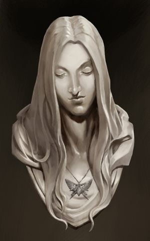

# 0598 尤弗拉蒂·琪乐

精校状态：中文行文已逐段精校，部分术语仍为暂定

分类：人类帝国

原文来源：https://www.bilibili.com/opus/1206954529700970566

原作者：帝国神选罐头

原文时间：2026年05月27日 12:00

[返回分类目录](目录.md) · [全书目录](../../目录.md)

原篇名：幼发拉底·基勒 Euphrati Keeler

<!-- A0598-B0001 -->
**英文原文**

Euphrati Keeler was a remembrancer attached to the 63rd Expeditionary Force in the closing months of the Great Crusade. As a result of later events, she would later be canonized as one of the first Saints of the Imperial Cult.

<!-- /A0598-B0001 -->

<!-- A0598-B0002 -->

原译文

幼发拉底·基勒是大远征最后几个月第63远征军的一名记述者。由于后来的事件，她后来被封为帝国教派的首批圣人之一。

**校订译文**

尤弗拉蒂·琪乐是大远征最后数月随第六十三远征军行动的记述者，后因一系列经历，被尊为帝皇信仰最早的圣人之一。

**校注：** 已核同一人物、组织、型号或事件，与全书核心术语及后续专篇统一；原译保留对照。

<!-- /A0598-B0002 -->

<!-- A0598-B0003 图片 -->

<!-- A0598-B0004 -->

原译文

Euphrati Keeler 幼发拉底·基勒

**校订译文**

Euphrati Keeler 尤弗拉蒂·琪乐

<!-- /A0598-B0004 -->

<!-- A0598-B0005 -->
## Biography 传记

<!-- /A0598-B0005 -->

<!-- A0598-B0006 -->
**英文原文**

An imagist of some renown, while attached to the 63rd Expeditionary Force under the command of Warmaster Horus, her images included the rescue of Maloghurst from the surface of Sixty-Three-Nineteen, and Garviel Loken taking his oath of moment before the Battle of the Whisperhead Mountains.

<!-- /A0598-B0006 -->

<!-- A0598-B0007 -->

原译文

她是一位颇有名气的意象派，虽然隶属于战帅荷鲁斯指挥的第63远征军，但她的作品包括从63-19表面营救马洛赫斯特，以及加维尔·洛肯在低语之首山脉之战前的宣誓。

**校订译文**

她是颇有名望的影像师，随战帅荷鲁斯麾下的第六十三远征军行动。拍摄内容包括从六十三—十九地表救出马洛赫斯特，以及洛肯在低语之首山脉之战前立下当役誓言。

**校注：** imagist此处是拍摄影像的记述者，不是诗歌意象派；职业暂影像师。 Sixty-Three-Nineteen沿第18篇定译六十三—十九；英文数字编号不改。

<!-- /A0598-B0007 -->

<!-- A0598-B0008 -->
**英文原文**

She and other remembrancers were allowed to travel to the surface of Sixty-Three-Nineteen during the Battle, though they were meant to be kept well away from the actual fighting. On an impulse, their group slipped away from their Imperial Army escort and entered the rebel stronghold in the mountains. She was shaken by an encounter with the daemon Samus in the Whisperheads, which killed the entire group except for herself and Kyril Sindermann. This experience may have contributed to her eventual joining of the Lectitio Divinitatus, a cult that worshipped the Emperor of Mankind as a deity.

<!-- /A0598-B0008 -->

<!-- A0598-B0009 -->

原译文

在战斗期间，她和其他记述者被允许前往63-19的表面，尽管他们本应远离实际战斗。一时冲动，他们的队伍脱离了帝国军队的护卫，进入了山脉的叛军据点。她在低语之首中遇到了恶魔萨姆斯，这让她感到震惊，除了她自己和凯里尔.辛德曼之外，整个小队都被杀死了。这段经历可能有助于她最终加入圣言录，这是一个将人类帝皇视为神的教派。

**校订译文**

战斗期间，记述者获准登陆六十三—十九，但本应远离交火。一行人一时冲动，甩开帝国军护卫，潜入低语之首山脉中的叛军据点，遇上恶魔萨姆斯。除琪乐与凯里尔·辛德曼外，全队尽灭。这次恐怖经历，可能促使她后来加入以帝皇为神的神性论信仰。

**校注：** Sixty-Three-Nineteen沿第18篇定译六十三—十九；英文数字编号不改。 已核同一人物、组织、型号或事件，与全书核心术语及后续专篇统一；原译保留对照。 复查英文细节与数量，补明对象、地点或程度，避免精简中文时削弱原意。

<!-- /A0598-B0009 -->

<!-- A0598-B0010 -->
## The Saint 圣人

<!-- /A0598-B0010 -->

<!-- A0598-B0011 -->
**英文原文**

Her devotion to the Emperor became clear when Kyril Sindermann accidentally summoned a demon using the Book of Lorgar in the library of Warmaster Horus' flagship, the Vengeful Spirit, as she stood before the beast and banished it back into the Warp. She went into a state of what could be described as catatonia. The word went out throughout the 63rd Expedition, leading the Divinitatus members to see her as "the Saint", the venerated prophet of the Emperor. She became the target of Horus's assassins, including Maloghurst's enforcer Maggard. She awakened shortly before the battle of Isstvan III, and warned that something was afoot. She witnessed the bombardment of Istvaan, and approached Iacton Qruze to escape the Vengeful Spirit. She escaped from Istvaan onboard the frigate Eisenstein, commanded by Captain Nathaniel Garro, a Death Guard loyalist.

<!-- /A0598-B0011 -->

<!-- A0598-B0012 -->

原译文

当凯里尔·辛德曼站在战帅荷鲁斯的旗舰复仇之魂号的图书馆里，不小心用《珞珈之书》召唤了一个恶魔，并将其放逐回亚空间时，她对帝皇的忠诚变得显而易见。她进入了一种可以说是紧张症的状态。这个消息在第63远征军中传开了，导致圣言成员将她视为“圣人”，即帝皇的受人尊敬的先知。她成为了荷鲁斯的刺客的目标，其中包括马洛赫斯特的执行者马加德。她在伊斯塔万三号之战前不久醒来，并警告说有什么事情正在发生。她目睹了伊斯塔万的轰炸，并靠近亚克顿·克鲁兹逃离复仇之魂号。她乘坐由死亡守卫忠诚派纳撒尼尔·伽罗连长指挥的护卫舰爱森斯坦号逃离伊斯塔万。

**校订译文**

辛德曼在复仇之魂号的藏书室误用《珞珈之书》召出恶魔时，琪乐站到怪物面前，将它逐回亚空间，展现了自己的信仰力量。随后她陷入近似僵直、无反应的状态。消息传遍第六十三远征军，神性论信众尊她为“圣人”、帝皇的先知。她也成了荷鲁斯刺客的目标，其中包括马洛赫斯特的打手马加德。伊斯塔万三号之战前夕，她苏醒，预警有事将发生。目睹轰炸后，她求助亚克顿·克鲁兹，逃离复仇之魂号，登上忠诚的死亡守卫连长纳撒尼尔·伽罗指挥的艾森斯坦号护卫舰脱身。

**校注：** 放逐恶魔的人是琪乐，不是召唤者辛德曼；catatonia描述僵直状态，未追加临床诊断。 Eisenstein与1565舰船专篇统一。 Isstvan III同一世界统一词根。

<!-- /A0598-B0012 -->

<!-- A0598-B0013 -->
**英文原文**

The Silent Sisterhood believed that Keeler may in fact have been a renegade psyker. She was taken to their fortress monastery on Luna and questioned.

<!-- /A0598-B0013 -->

<!-- A0598-B0014 -->

原译文

寂静修女会认为基勒可能实际上是一个变节灵能者。她被带到他们在月球的堡垒修道院接受询问。

**校订译文**

寂静修女会怀疑琪乐是失控或叛离管束的灵能者，将她带至露娜的要塞修道院审问。

<!-- /A0598-B0014 -->

<!-- A0598-B0015 -->
## Terra 泰拉

<!-- /A0598-B0015 -->

<!-- A0598-B0016 -->
**英文原文**

As the Horus Heresy progressed, Horus commanded turned assassin Eristede Kell to hunt down Keeler and kill her, thus causing mass disruption on Terra. Keeler at the time was spreading the Lectitio Divinitatus across the planet, and an assassination would cause mass religious fervor upon her death. At the same time, Garro was searching for her, needing answers after he became one of Malcador's Knight-Errant, and he was able to intervene with the assassination plot by the mad assassin Eristede Kell and save her. Eventually, she was taken into Malcador's custody. During the battle, Keeler demonstrated the ability to share visions of the future, heal wounds, and stop time to communicate with others. Garro stated that he would set her free when the time came.

<!-- /A0598-B0016 -->

<!-- A0598-B0017 -->

原译文

随着荷鲁斯叛乱的发展，荷鲁斯指挥的刺客埃里斯泰德·凯尔追捕基勒并杀死她，从而在泰拉上造成了大规模的破坏。基勒当时正在全球范围内传播圣言录，暗杀会在她死亡后引发大规模的宗教狂热。与此同时，伽罗正在寻找她，在他成为马卡多的游侠骑士之一后，他需要答案，他能够干预疯狂刺客埃里斯泰德·凯尔的暗杀阴谋并救了她。最终，她被马卡多拘留。在战斗中，基勒展示了分享未来异象、治愈伤口和停止时间与他人交流的能力。伽罗表示，到时候他会放她自由。

**校订译文**

叛乱发展期间，荷鲁斯命已叛变的刺客埃里斯泰德·凯尔追杀琪乐。她正在泰拉传播神性论信仰，一旦遇刺，会激起广泛宗教狂热，酿成大乱。此时已成为游侠骑士的伽罗也在寻找她，希望获得答案，恰好阻止了凯尔的刺杀，救下琪乐。她随后被马卡多拘管。在冲突中，她展现了分享未来异象、愈合伤口及暂停时间与人交流的能力。伽罗答应，时机成熟便让她自由。

**校注：** 原译说凯尔已杀死她，与后文救下矛盾；commanded是命令去杀，非成功完成。

<!-- /A0598-B0017 -->

<!-- A0598-B0018 -->
**英文原文**

Keeler was visited by Garro several times in a prison under the Imperial Palace along with Sindermann, who somehow was able to regularly infiltrate the complex. Shortly before the founding of the Grey Knights by Malcador, Garro visited Keeler again.

<!-- /A0598-B0018 -->

<!-- A0598-B0019 -->

原译文

基勒和辛德曼一起在帝国皇宫下的一个监狱里被伽罗拜访了几次，不知怎么地能够定期潜入建筑群。在马卡多建立灰骑士之前不久，伽罗再次拜访了基勒。

**校订译文**

琪乐被囚于皇宫地下期间，伽罗数次探访；辛德曼也不知如何总能潜入这里。灰骑士正式建立前夕，伽罗又来看她。

**校注：** 定期潜入者是辛德曼，避免悬垂指代使其成被探访的另一囚犯。

<!-- /A0598-B0019 -->

<!-- A0598-B0020 -->
**英文原文**

During the Siege of Terra, Keeler, Kyril Sindermann, and her other followers took refuge inside the Inner Palace and aided with the throngs of refugees. They had been granted an immunity of sorts by Malcador, who wished to see if they could be used to counter the immaterial powers of Chaos through faith in the Emperor. However her cult was subverted by Cor'bax Utterblight, who manifested inside the Palace through her followers own faith. Keeler was initially distraught by this, but realized the dangers of blind faith and understood that others faith such as those by Sindermann had saved her from the Daemons influence. With a new understanding, she helped Amon Tauromachian and Malcador in the defeat of Utterblight by psychically confronting it in the Immaterium. Afterwards, Amon was assigned to watch over Keeler and her Cult.

<!-- /A0598-B0020 -->

<!-- A0598-B0021 -->

原译文

在泰拉围城期间，基勒、凯里尔·辛德曼和她的其他追随者在内部宫殿避难，并帮助了大批难民。他们被马卡多授予了某种豁免权，马卡多希望看看他们是否可以通过对帝皇的信仰来对抗混沌的非物质界力量。然而，她的教派被科尔'巴克斯·枯毁颠覆了，他通过追随者自己的信仰在皇宫里显现出来。基勒最初对此感到心烦意乱，但意识到盲目信仰的危险，并理解了其他信仰，如辛德曼的信仰，使她免受了恶魔的影响。有了新的认识，她帮助阿蒙·塔罗马奇和马卡多在非物质界以灵能对抗枯毁，击败了枯毁。之后，阿蒙被指派看管基勒和她的教派。

**校订译文**

围城中，琪乐、辛德曼与信徒在内宫避难，帮助大批难民。马卡多给予某种豁免，想看看帝皇信仰能否抗衡混沌的非物质力量。然而，科尔’巴克斯·枯毁反过来利用信众的信仰，在皇宫显现。琪乐起初绝望，却由此看清盲信的危险，也明白辛德曼等人的信念曾保护自己免受恶魔影响。她凭新认识在非物质界迎战恶魔，协助阿蒙·塔罗马奇与马卡多将其击败。此后，阿蒙奉命监视她及教团。

**校注：** others faith指其他人的信仰，不是其他宗教教义；they信众受恶魔利用，未称琪乐有意召魔。

<!-- /A0598-B0021 -->

<!-- A0598-B0022 -->
**英文原文**

Keeler was held in a Blackstone prison under the Tower of Hegemon, supervised by Amon. However she was recruited into Kyril Sindermann's new order of Remembrancers. Due to the fact that Keeler would not renounce her faith, she was forbidden from leaving the prison and thus could only interview her fellow inmates. One of them was the mad scientist Basilio Fo, and she learned of his theorized contagion that could kill both Space Marines and Primarchs. After agreeing with Amon that this knowledge should be shared with Dorn even though it was dangerous, Keeler and Amon interviewed Fo a second time with the intent to record everything regarding the transhuman virus.

<!-- /A0598-B0022 -->

<!-- A0598-B0023 -->

原译文

基勒被关押在霸权之塔下的黑石监狱，由阿蒙监督。然而，她被招募到凯里尔·辛德曼的新记述者组织。由于基勒不会放弃她的信仰，她被禁止离开监狱，因此只能采访她的狱友。其中一位是疯狂科学家巴西利奥·弗，她了解到他的理论传染病可能会杀死星际战士和原体。在阿蒙的同意后，即使这是危险的，也应该与多恩分享这些知识，基勒和阿蒙第二次采访了弗，目的是记录有关跨人类病毒的一切。

**校订译文**

琪乐被关进霸权之塔下的黑石监狱，由阿蒙看管，却也受招加入辛德曼新设的记述者组织。由于不肯放弃信仰，她不得离开，只能采访其他囚犯。疯狂科学家巴西利奥·弗便是其一；她得知，他构想了一种能杀死星际战士与原体的疫病。她与阿蒙认为，知识虽危险，也必须让多恩知道，于是再次询问弗，准备完整记录这种针对超人战士的病毒。

**校注：** 已核同一人物、组织、型号或事件，与全书核心术语及后续专篇统一；原译保留对照。

<!-- /A0598-B0023 -->

<!-- A0598-B0024 -->
**英文原文**

During one of these interviews with Fo, Keeler and Sindermann were interrupted by Hellick Mauer and Andromeda-17 who wished to seek their aid in investigating waves of despair and madness spreading across the loyalist ranks. Keeler agreed to leave the prison to help Mauer, but would have to lie and renounce her faith in order to do this. However while in Mauer's armed convoy the group was ambushed by enemy forces. Keeler escaped during the attack, but became separated from the others. Fleeing into the ruins of Terra, Keeler resumed her role as cult leader and organised fanatical proto-Frateris Militia. Fighting a doomed and desperate struggle against the advancing traitors, she nonetheless was revered by her followers and sought to make the traitors pay whenever they could. She was eventually confronted by Garviel Loken, who let her continue her work. Later, Keeler was saved by a Death Guard attack only by the sacrifice of her old friend Garro, who challenged Mortarion to a duel to buy enough time for her to escape with Helig Gallor.

<!-- /A0598-B0024 -->

<!-- A0598-B0025 -->

原译文

在与弗、基勒和辛德曼的一次采访中，赫立克·莫尔和安德洛墨达-17打断了他们，他们希望寻求他们的帮助，调查在忠诚派队伍中蔓延的绝望和疯狂浪潮。基勒同意离开监狱帮助莫尔，但为了做到这一点，她必须撒谎并放弃信仰。然而，在莫尔的武装车队中，小队遭到了敌军伏击。基勒在袭击中逃跑了，但与其他人分开了。逃到泰拉的废墟中，基勒恢复了她作为教派领袖的角色，并组织了狂热的原初兄弟会民兵。她与前进的叛徒进行了一场注定要失败的绝望斗争，尽管如此，她还是受到了追随者的尊敬，并试图让叛徒尽可能地付出代价。她最终遇到了加维尔·洛肯，后者让她继续工作。后来，基勒被死亡守卫袭击，但被她的老朋友伽罗的牺牲所救，伽罗向莫塔里安发起决斗，为她争取足够的时间与赫利格·加洛一起逃跑。

**校订译文**

一次采访弗时，赫立克·莫尔与安德洛墨达-17来找琪乐、辛德曼，求助调查忠诚派中蔓延的绝望与疯狂。琪乐同意离监协助，但必须谎称放弃信仰，才能获准。随莫尔武装车队出行时，众人遭伏击，她逃出却与同伴失散。进入泰拉废墟后，她重新领导信徒，组织狂热民兵——后来教会民兵的早期形态。即使与进逼叛军的抗争绝望、几乎注定失败，她仍备受敬仰，力求尽可能让敌人付出代价。洛肯遇见她后，准许其继续。后来死亡守卫来袭，伽罗为救她而挑战莫塔里安，以生命争取时间，让她随赫利格·加洛逃走。

**校注：** lie and renounce faith为口头假称放弃，原译说真正弃信；proto-Frateris Militia按早期教会民兵而非单独原初兄弟会。

<!-- /A0598-B0025 -->

<!-- A0598-B0026 -->
**英文原文**

In the final hours of the Siege, Keeler began to lead a pilgrimage of other faithful and survivors such as Katsuhiro and Nemo Zhi-Meng in an exodus from the Sanctum Imperialis. When questioned as to her destination, she stated that she did not know, simply that she was following a mysterious guiding light. Following the light, Keeler and her refugee convoy were nearly massacred by a group of Sons of Horus before being saved by Sigismund and his Templars.

<!-- /A0598-B0026 -->

<!-- A0598-B0027 -->

原译文

在围城战的最后几个小时，基勒开始带领其他信徒和幸存者，如胜宏和尼莫·志-明，前往帝国圣地朝圣。当被问及她的目的地时，她说她不知道，只是她在追寻一道神秘的指路明灯。追随光芒，基勒和她的难民车队几乎被一群荷鲁斯之子屠杀，然后被西吉斯蒙德和他的圣殿骑士救下。

**校订译文**

围城最后数小时，琪乐带领胜宏、尼莫·志明等信徒与幸存者，离开帝国圣所，踏上出走式的朝圣。被问及目的地，她说自己也不知道，只是在追随一道神秘光芒。途中，他们险遭荷鲁斯之子屠杀，幸获西吉斯蒙德与圣殿骑士救下。

**校注：** exodus from为离开圣所，原前往方向完全相反。 已核同一人物、组织、型号或事件，与全书核心术语及后续专篇统一；原译保留对照。

<!-- /A0598-B0027 -->

<!-- A0598-B0028 -->
**英文原文**

Sigismund and Keeler led the ever-crossing mass of survivors to the Hollow Mountain. After arriving at their new refuge, Sigismund and the others began a last stand alongside Corswain, The Lord Cypher, and Dark Angels against a furious Death Guard assault led by Typhus. During the final battle, all seemed lost in the face of Typhus' massive and relentless assault. However Keeler was able to lead a sacrificial prayer amongst the faithful throngs that caused a psychic backlash which not only threw back the Death Guard but also reactivated the Astronomican. Immediately following the battle, Keeler and Sigismund take part in a prayer to the now-enthroned Emperor. Following the arrival of Roboute Guilliman and the other Primarchs on Terra, Sigismund put Keeler into hiding.

<!-- /A0598-B0028 -->

<!-- A0598-B0029 -->

原译文

西吉斯蒙德和基勒带领不断穿越的大量幸存者前往空心山脉。抵达新避难所后，西吉斯蒙德和其他人开始与考斯韦恩、塞弗灵族和黑暗天使并肩作战，对抗由泰丰斯领导的死神守卫的猛烈袭击。在最后的战斗中，面对泰丰斯的大规模无情袭击，一切似乎都输了。然而，基勒能够在忠实的人群中领导一场祭祀祈祷，这引起了灵能上的反击，不仅击退了死亡守卫，还重新激活了星炬。战斗结束后，基勒和西吉斯蒙德立即参加了向现在登上王座的帝皇祈祷。在罗伯特·基里曼和其他原体抵达泰拉后，西吉斯蒙德将基勒藏了起来。

**校订译文**

琪乐与西吉斯蒙德带领幸存者抵达空心山脉。在新避难所，西吉斯蒙德与考斯韦恩、塞弗领主及黑暗天使并肩死守，抵挡泰弗斯率领的死亡守卫猛攻。战局几近绝望时，琪乐带信众进行献祭式祈祷，引发灵能反冲，不仅击退死亡守卫，也重新点燃星炬。战后，她与西吉斯蒙德向已登上王座的帝皇祈祷。等罗保特·基里曼及其他原体抵达泰拉，西吉斯蒙德将她藏匿起来。

**校注：** Lord Cypher是黑暗天使职衔塞弗领主，原塞弗灵族误判种族；ever-crossing疑ever-growing，正文不擅加具体增长速度。

<!-- /A0598-B0029 -->

<!-- A0598-B0030 -->
## Legacy 身后影响

原题：Legacy 遗产

<!-- /A0598-B0030 -->

<!-- A0598-B0031 -->
**英文原文**

At some point before the start of the Heresy, Euphrati Keeler took several photographs of a comet above the planet El'Phanor. The comet was later named the Keeler Comet. is important to note that the comet was named after Saint Euphrati Keeler, the Prophet of the Emperor.

<!-- /A0598-B0031 -->

<!-- A0598-B0032 -->

原译文

在叛乱开始之前的某个时刻，幼发拉底·基勒拍摄了几张埃尔'哈诺行星上方彗星的照片。这颗彗星后来被命名为基勒彗星。值得注意的是，这颗彗星是以帝皇的先知圣幼发拉底·基勒的名字命名的。

**校订译文**

叛乱开始前，琪乐曾拍下埃尔’法诺行星上空一颗彗星的多幅照片。它后来以这位帝皇先知、圣尤弗拉蒂·琪乐之名，称为“琪乐彗星”。

<!-- /A0598-B0032 -->

<!-- A0598-B0033 -->
**英文原文**

Likewise, Euphrate's Warp is the name of a stellar phenomenon in the Sabbat Worlds Cluster, in Segmentum Pacificus.

<!-- /A0598-B0033 -->

<!-- A0598-B0034 -->

原译文

同样，幼发拉底扭曲是太平星域安息日世界星群中一种恒星现象的名称。

**校订译文**

同样，太平星域萨巴特诸世界星团中的一种恒星现象，也以她的名字命名，称为“尤弗拉蒂之扭曲”。

**校注：** Euphrate’s为人名相关异拼，非幼发拉底河；Warp此处恒星现象名暂沿扭曲，不径断其物理机制。 Sabbat 为专名，统一圣萨巴特、萨巴特诸世界及相关远征的词根；原安息日诸世界保留在原译栏，中文暂定。

<!-- /A0598-B0034 -->

本篇核心术语与暂定项

以下列出本篇出现的英文原形及核心术语表用词。同形词可能指不同对象，具体词义以本篇正文和校注为准；单复数、别名和仅见于图注的名称可能尚未列入。完整候选见[术语表](../../术语表/双语术语候选.csv)。

| 英文 | 采用中文 | 状态 |
| --- | --- | --- |
| Space Marines | 星际战士 | 官方已核对 |
| Dark Angels | 黑暗天使 | 官方已核对 |
| Grey Knights | 灰骑士 | 官方已核对 |
| Imperial Army | 帝国军 | 暂定·官方待核 |
| Death Guard | 死亡守卫 | 官方已核对 |
| Psyker | 灵能者 | 官方已核对 |
| Roboute Guilliman | 罗保特·基里曼 | 官方已核对 |
| Horus Heresy | 荷鲁斯之乱 | 官方已核对 |
| Astronomican | 星炬 | 暂定 |
| Warp | 亚空间 | 官方已核对 |
| Emperor of Mankind | 人类帝皇 | 暂定 |
| Emperor | 帝皇 | 官方已核对 |
| Great Crusade | 大远征 | 暂定·官方待核 |
| Mortarion | 莫塔里安 | 官方已核对 |
| Terra | 泰拉 | 暂定·官方待核 |
| Horus | 荷鲁斯 | 暂定·官方待核 |
| Garviel Loken | 加维尔·洛肯 | 暂定·官方待核 |
| Vengeful Spirit | 复仇之魂号 | 暂定·官方待核 |
| Sons of Horus | 荷鲁斯之子 | 暂定·官方待核 |
| Isstvan III | 伊斯塔万三号 | 暂定·官方待核 |
| Imperial Cult | 帝皇信仰 | 暂定·官方待核 |
| Frateris Militia | 教会民兵 | 暂定·官方待核 |
| Segmentum Pacificus | 太平星域 | 暂定·官方待核 |
| Segmentum | 星域 | 暂定·官方待核 |
| Sixty-Three-Nineteen | 六十三—十九 | 暂定·官方待核 |
| Luna | 月球 | 暂定·官方待核 |
| Lectitio Divinitatus | 神性论 | 暂定·官方待核 |
| Clear | 清明 | 暂定·官方待核 |
| Amon Tauromachian | 阿蒙·塔罗马奇 | 暂定·官方待核 |
| Euphrati Keeler | 尤弗拉蒂·琪乐 | 暂定 |
| Hegemon | 霸主殿 | 暂定·官方待核 |
| Maloghurst | 马洛赫斯特 | 暂定·官方待核 |
| Iacton Qruze | 亚克顿·克鲁兹 | 暂定·官方待核 |
| Founding | 建军 | 暂定·官方待核 |
| Isstvan | 伊斯塔万 | 暂定·官方待核 |
| Nathaniel Garro | 纳撒尼尔·伽罗 | 暂定·官方待核 |
| Helig Gallor | 赫利格·加洛 | 暂定·官方待核 |
| Corswain | 考斯韦恩 | 暂定·官方待核 |
| Sigismund | 西吉斯蒙德 | 暂定·官方待核 |
| Amon | 阿蒙 | 暂定·官方待核 |
| Captain | 连长 | 暂定·官方待核 |
| Lorgar | 珞珈 | 暂定·官方待核 |
| Powers | 能天使 | 暂定·官方待核 |
| Exodus | 伊克索底斯 | 暂定·官方待核 |
| Cypher | 塞弗 | 官方已核对 |
| Book of Lorgar | 《珞珈之书》 | 暂定·官方待核 |
| Typhus | 泰弗斯 | 官方已核对 |
| Contagion | 传播者 | 暂定·官方待核 |
| The Beast | 野兽 | 暂定·官方待核 |
| Imperialis | 帝国徽记 | 暂定·官方待核 |
| Sanctum | 圣所星 | 暂定·官方待核 |
| Sanctum Imperialis | 帝国圣所 | 暂定·官方待核 |
| Kyril Sindermann | 凯里尔·辛德曼 | 暂定·官方待核 |
| Imagist | 影像师 | 暂定·官方待核 |
| Eristede Kell | 埃里斯泰德·凯尔 | 暂定·官方待核 |
| Tower of Hegemon | 霸权之塔 | 暂定·官方待核 |
| Basilio Fo | 巴西利奥·弗 | 暂定·官方待核 |
| Hellick Mauer | 赫立克·莫尔 | 暂定·官方待核 |
| Andromeda-17 | 安德洛墨达-17 | 暂定·官方待核 |
| The Lord Cypher | 塞弗领主 | 暂定·官方待核 |
| Keeler Comet | 琪乐彗星 | 暂定·官方待核 |
| Hollow Mountain | 空心山脉 | 暂定·官方待核 |
| Nemo Zhi-Meng | 尼莫·志明 | 暂定·官方待核 |
| Blackstone Prison | 黑石监狱 | 暂定·官方待核 |
| Whisperhead Mountains | 低语之首山脉 | 暂定·官方待核 |
| The Comet | 彗星 | 暂定·官方待核 |
| Sabbat Worlds | 萨巴特诸世界 | 暂定·官方待核 |
| Eisenstein | 艾森斯坦号 | 暂定·官方待核 |
| Inner Palace | 内殿 | 暂定·官方待核 |
| The Tower of Hegemon | 霸权之塔 | 暂定·官方待核 |

